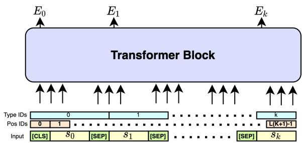
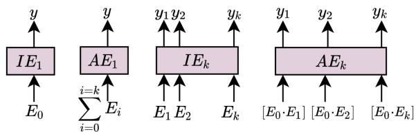
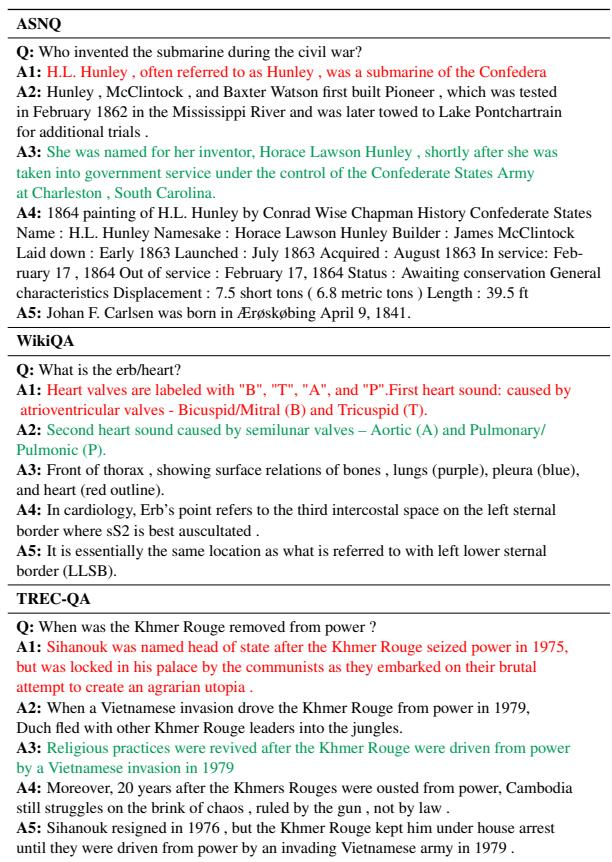

# Paragraph-based Transformer Pre-training for Multi-Sentence Inference

Luca Di Liello1∗, Siddhant Garg2, Luca Soldaini3†, Alessandro Moschitti2

1University of Trento , 2Amazon Alexa AI, 3Allen Institute for AI

luca.diliello@unitn.it

{sidgarg,amosch}@amazon.com

lucas@allenai.org

## Abstract

Inference tasks such as answer sentence selection (AS2) or fact verification are typically solved by fine-tuning transformer-based models as individual sentence-pair classifiers. Recent studies show that these tasks benefit from modeling dependencies across multiple candidate sentences jointly. In this paper, we first show that popular pre-trained transformers perform poorly when used for fine-tuning on multi-candidate inference tasks. We then propose a new pre-training objective that models the paragraph-level semantics across multiple input sentences. Our evaluation on three AS2 and one fact verification datasets demonstrates the superiority of our pre-training technique over the traditional ones for transformers used as joint models for multi-candidate inference tasks, as well as when used as cross-encoders for sentence-pair formulations of these tasks.

## 1 Introduction

Pre-trained transformers (Devlin et al., 2019; Liu et al., 2019; Clark et al., 2020) have become the de facto standard for several NLP applications, by means of fine-tuning on downstream data. The most popular architecture uses self-attention mechanisms for modeling long range dependencies between compounds in the text, to produce deep contextualized representations of the input. There are several downstream NLP applications that require reasoning across multiple inputs candidates jointly towards prediction. Some popular examples include (i) Answer Sentence Selection (AS2) (Garg et al., 2020), which is a Question Answering (QA) task that requires selecting the best answer from a set of candidates for a question; and (ii) Fact Verification (Thorne et al., 2018), which reasons whether a claim is supported/refuted by multiple evidences. Inherently, these tasks can utilize information from multiple candidates (answers/evidences) to support the prediction of a particular candidate.

Pre-trained transformers such as BERT are used for these tasks as cross-encoders by setting them as sentence-pair classification problems, i.e, aggregating inferences independently over each candidate. Recent studies (Zhang et al., 2021; Tymoshenko and Moschitti, 2021) have shown that these tasks benefit from encoding multiple candidates together, e.g., encoding five answer candidates per question in the transformer, so that the cross-attention can model dependencies between them. However, Zhang et al. only improved over the pairwise cross-encoder by aggregating multiple pairwise cross-encoders together (one for each candidate), and not by jointly encoding all candidates together in a single model.

In this paper, we first show that popular pretrained transformers such as RoBERTa perform poorly when used for jointly modeling inference tasks (e.g., AS2) using multi-candidates. We show that this is due to a shortcoming of their pre-training objectives, being unable to capture meaningful dependencies among multiple candidates for the finetuning task. To improve this aspect, we propose a new pre-training objective for ‘joint’ transformer models, which captures paragraph-level semantics across multiple input sentences. Specifically, given a target sentence s and multiple sentences (from the same/different paragraph/document), the model needs to recognize which sentences belong to the same paragraph as s in the document used.

Joint inference over multiple-candidates entails modeling interrelated information between multiple short sentences, possibly from different paragraphs or documents. This differs from related works (Beltagy et al., 2020; Zaheer et al., 2020; Xiao et al., 2021) that reduce the asymptotic complexity of transformer attention to model long contiguous inputs (documents) to get longer context for tasks such as machine reading and summarization.

We evaluate our pre-trained multiple-candidate based joint models by (i) performing AS2 on

ASNQ (Garg et al., 2020), WikiQA (Yang et al., 2015), TREC-QA (Wang et al., 2007) datasets; and (ii) Fact Verification on the FEVER (Thorne et al., 2018) dataset. We show that our pre-trained joint models substantially improve over the performance of transformers such as RoBERTa being used as joint models for multi-candidate inference tasks, as well as when being used as cross-encoders for sentence-pair formulations of these tasks.

## 2 Related Work

Multi-Sentence Inference: Inference over a set of multiple candidates has been studied in the past (Bian et al., 2017; Ai et al., 2018). The most relevant for AS2 are the works of Bonadiman and Moschitti (2020) and Zhang et al. (2021), the former improving over older neural networks but failing to beat the performance of transformers; the latter using task-specific models (answer support classifiers) on top of the transformer for performance improvements. For fact verification, Tymoshenko and Moschitti (2021) propose jointly embedding multiple evidence with the claim towards improving the performance of baseline pairwise cross-encoder transformers.

Transformer pre-training Objectives: Masked Language Modeling (MLM) is a popular transformer pre-training objective (Devlin et al., 2019; Liu et al., 2019). Other models are trained using token-level (Clark et al., 2020; Joshi et al., 2020; Yang et al., 2019; Liello et al., 2021) and/or sentence-level (Devlin et al., 2019; Lan et al., 2020; Wang et al., 2020) objectives. REALM (Guu et al., 2020) uses a differentiable neural retriever over Wikipedia to improve MLM pre-training. This differs from our pre-training setting as it uses additional knowledge to improve the pre-trained LM. DeCLUTR (Giorgi et al., 2021) uses a contrastive learning objective for cross-encoding two sentences coming from the same/different documents in a transformer. DeCLUTR is evaluated for sentencepair classification tasks and embeds the two inputs independently without any cross-attention, which differs from our setting of embedding multiple candidates jointly for inference.

Modeling Longer Sequences: Beltagy et al. (2020); Zaheer et al. (2020) reduce the asymptotic complexity of transformer attention to model very long inputs for longer context. For tasks with short sequence lengths, LongFormer works on par or slightly worse than RoBERTa (attributed to reduced attention computation). These works encode a single contiguous long piece of text, which differs from our setting of having multiple short candidates, for a topic/query, possibly from different paragraphs and documents. DCS (Ginzburg et al., 2021) proposes a cross-encoder for the task of document-pair matching. DCS is related to our work as it uses a contrastive pre-training objective over two sentences extracted from the same paragraph, however different from our joint encoding of multiple sentences, DCS individually encodes the two sentences and then uses the InfoNCE loss over the embeddings. CDLM (Caciularu et al., 2021) specializes the Longformer for documentpair matching and cross-document coreference resolution. While the pre-training objective in CDLM exploits information from multiple documents, it differs from our setting of joint inference over multiple short sentences.

  
Figure 1: Multi-sentence ‘Joint’ transformer model. $E _ { i }$ refers to embedding for the question/each candidate.

## 3 Multi-Sentence Transformers Models

## 3.1 Multi-sentence Inference Tasks

AS2: We denote the question by q, and the set of answer candidates by $C { = } \{ c _ { 1 } , \ldots c _ { n } \}$ . The objective is to re-rank C and find the best answer A for q. AS2 is typically treated as a binary classification task: first, a model $f$ is trained to predict the correctness/incorrectness of each $c _ { i } ;$ then, the candidate with the highest likelihood of being correct is selected as an answer, i.e., $\scriptstyle A = \operatorname { a r g m a x } _ { i = 1 } ^ { n } f ( c _ { i } )$ Intuitively, modeling interrelated information between multiple $c _ { i } \mathrm { ^ { * } s }$ can help in selecting the best answer candidate (Zhang et al., 2021).

Fact Verification: We denote the claim by $F _ { \ast }$ and the set of evidences by $C { = } \{ c _ { 1 } \ldots c _ { n } \}$ that are retrieved using DocIR. The objective is to predict whether F is supported/refuted/neither using C (at least one evidence $c _ { i }$ is required for supporting/refuting F). Tymoshenko and Moschitti (2021) jointly model evidences for supporting/refuting a claim as they can complement each other.

## 3.2 Joint Encoder Architecture

For jointly modeling multi-sentence inference tasks, we use a monolithic transformer crossencoder to encode multiple sentences using selfattention as shown in Fig 1. To perform joint inference over k sentences for question q or claim $F ,$ , the model receives concatenated sentences $\left[ s _ { 0 } \ldots s _ { k } \right]$ as input, where the first sentence is either the question or the claim $( s _ { 0 } { = } q \ 0 \mathrm { r } \ s _ { 0 } { = } F )$ , and the remainder are k candidates $s _ { i } { = } c _ { i } ~ , i { = } \{ 1 \ldots k \}$ . We pad (or truncate) each sentence $s _ { i }$ to the same fixed length L (total input length $L \times ( k + 1 ) )$ , and use the embedding for the [CLS] / [SEP] token in front of each sentence $s _ { i }$ as its embedding (denoted by $E _ { i } )$ Similar to Devlin et al., we create positional embeddings of tokens using integers 0 to L(k+1) 1, and extend the token type ids from 0, 1 to $\{ 0 \ldots k \}$ corresponding to $( k + 1 )$ input sentences.

## 3.3 Inference using Joint Transformer Model

We use the output embeddings $\left[ E _ { 0 } \ldots E _ { k } \right]$ of sentences for performing prediction as following:

Predicting a single label: We use two separate classification heads to predict a single label for the input to the joint model $\big [ s _ { 0 } \ldots s _ { k } \big ] \colon ( \mathrm { i } ) \mathbf { I } \mathbf { E } _ { 1 }$ : a linear layer on the output embedding $E _ { 0 }$ of s0 (similar to BERT) referred to as the Individual Evidence $\mathrm { ( I E _ { 1 } ) }$ inference head, and (ii) $\mathbf { A E } _ { 1 }$ : a linear layer on the average of the output embeddings $[ E _ { 0 } , E _ { 1 } , \ldots , E _ { k } ]$ to explicitly factor in information from all candidates, referred to as the Aggregated Evidence $( \mathrm { A E _ { 1 } } )$ inference head. For Fact Verification, we use prediction heads $\mathrm { { I E } _ { 1 } }$ and $\mathrm { A E _ { 1 } }$

Predicting Multiple Labels: We use two separate classification heads to predict k labels, one label each for every input $[ s _ { 1 } \ldots s _ { k } ]$ specific to $s _ { \mathrm { 0 } } \colon$ (i) $\mathbf { I E } _ { k }$ : a shared linear layer applied to the output embedding $E _ { i }$ of each candidate $s _ { i }$ $i \in \{ 1 \ldots k \}$ referred to as k-candidate Individual Evidence $( \mathrm { I E } _ { k } )$ inference head, and (ii) $\mathbf { A E } _ { k } .$ : a shared linear layer applied to the concatenation of output embedding $E _ { 0 }$ of input $s _ { 0 }$ and the output embedding $E _ { i }$ of each candidate $s _ { i } \ , \ i \in \left\{ 1 \ldots k \right\}$ referred to as kcandidate Aggregated Evidence $( \mathrm { A E } _ { k } )$ inference head. For AS2, we use prediction heads $\mathrm { I E } _ { k }$ and $\mathrm { A E } _ { k }$ . Prediction heads are illustrated in Figure 2.

## 3.4 Pre-training with Paragraph-level Signals

Long documents are typically organized into paragraphs to address the document’s general topic from different viewpoints. The majority of transformer pre-training strategies have not exploited this rich source of information, which can possibly provide some weak supervision to the otherwise unsupervised pre-training phase. To enable joint transformer models to effectively capture dependencies across multiple sentences, we design a new pre-training task where the model is (i) provided with $( k + 1 )$ sentences $\left\{ s _ { 0 } \ldots s _ { k } \right\}$ , and (ii) tasked to predict which sentences from $\{ s _ { 1 } \ldots s _ { k } \}$ belong to the same paragraph $P$ as $s _ { 0 }$ in the document $D .$ We call this pre-training task Multi-Sentences in Paragraph Prediction (MSPP). We use the $\mathrm { I E } _ { k }$ and $\mathrm { A E } _ { k }$ prediction heads, defined above, on top of the joint model to make k predictions $p _ { i }$ corresponding to whether each sentence $s _ { i } , i { \in } \{ 1 \ldots k \}$ lies in the same paragraph $P \in D$ as $s _ { 0 }$ . More formally:

  
Figure 2: Inference heads for joint transformer model. $E _ { i }$ refers to embedding for the question/each candidate.

$$
p _ { i } = { \left\{ \begin{array} { l l } { 1 { \mathrm { ~ i f ~ } } s _ { 0 } , s _ { i } \in P { \mathrm { ~ i n ~ } } D } \\ { 0 { \mathrm { ~ o t h e r w i s e } } } \end{array} \right. } \forall i = \{ 1 , \ldots , k \}
$$

We randomly sample a sentence from a paragraph $P$ in a document D to be used as $s _ { 0 } .$ , and then (i) randomly sample $k _ { 1 }$ sentences (other than $s _ { 0 } )$ from $P$ as positives, (ii) randomly sample $k _ { 2 }$ sentences from paragraphs other than P in the same document $D$ as hard negatives, and (iii) randomly sample $k _ { 3 }$ sentences from documents other than $D$ as easy negatives (note that $k _ { 1 } + k _ { 2 } + k _ { 3 } = k )$

## 4 Experiments

We evaluate our joint transformers on three AS2 and one Fact Verification datasets 1. Common LM benchmarks, such as GLUE (Wang et al., 2018), are not suitable for our study as they only involve sentence pair classification.

## 4.1 Datasets

Pre-training: To eliminate any improvements stemming from usage of more data, we perform pre-training on the same corpora as RoBERTa: English Wikipedia, the BookCorpus, OpenWebText and CC-News. For our proposed pre-training, we randomly sample sentences from paragraphs as $s _ { 0 }$ and choose $k _ { 1 } = 1 , k _ { 2 } = 2 , k _ { 3 } = 2$ as the specific values for creating positive and negative candidates for $s _ { 0 }$ . For complete details refer to Appendix A. Fine-tuning: For AS2, we compare performance with MAP, MRR and Precision of top ranked answer (P@1). For fact verification, we measure Label Accuracy (LA). Brief description of datasets is presented below (details in Appendix A):

<table><tr><td rowspan="2">Model</td><td colspan="3">ASNQ</td><td colspan="3">WikiQA</td><td colspan="3">TREC-QA</td></tr><tr><td>P@1</td><td>MAP</td><td>MRR</td><td>P@1</td><td>MAP</td><td>MRR</td><td>P@1</td><td>MAP</td><td>MRR</td></tr><tr><td>Pairwise RoBERTa-Base</td><td>61.8 (0.2)</td><td>66.9 (0.1)</td><td>73.1 (0.1)</td><td>77.1 (2.1)</td><td>85.3 (0.9)</td><td>86.5 (1.0)</td><td>87.9 (2.2)</td><td>89.3 (0.9)</td><td>93.1 (1.0)</td></tr><tr><td>Joint RoBERTa-Base → FT IEk</td><td>3.4 (2.3)</td><td>8.0 (1.9)</td><td>10.0 (2.4)</td><td>19.7 (1.9)</td><td>39.4 (1.6)</td><td>40.3 (1.8)</td><td>30.9 (5.4)</td><td>41.9 (2.4)</td><td>50.8 (3.9)</td></tr><tr><td>Joint RoBERTa-Base → FT AEk</td><td>3.6 (2.7)</td><td>8.0 (2.2)</td><td>10.2 (2.8)</td><td>18.7 (3.9)</td><td>39.0 (2.8)</td><td>39.7 (2.9)</td><td>29.7 (6.9)</td><td>42.3 (3.2)</td><td>49.2 (5.0)</td></tr><tr><td>(Ours) Joint MSPP IEk → FT IEk</td><td>63.0 (0.3)</td><td>67.2 (0.2)</td><td>73.7 (0.2)</td><td>82.7 (2.2)</td><td>88.5 (1.5)</td><td>89.0 (1.5)</td><td>91.7 (2.2)</td><td>91.1 (0.5)</td><td>95.2 (1.3)</td></tr><tr><td>(Ours) Joint  $\mathrm { M S P P } \mathrm { A E } _ { k }  \mathrm { F T } \mathrm { A E } _ { k }$ </td><td>63.0 (0.3)</td><td>67.3 (0.2)</td><td>73.7 (0.2)</td><td>81.9 (2.6)</td><td>87.9 (1.4)</td><td>89.0 (1.5)</td><td>88.7 (0.8)</td><td>90.1 (1.0)</td><td>93.6 (0.6)</td></tr></table>

Table 1: Results (std. dev. in parenthesis) on AS2 datasets. MSPP, FT refer to our pre-training task and fine-tuning respectively. We indicate the prediction head $( \mathrm { I E } _ { k } / \mathrm { A E } _ { k } )$ used for both pre-training and fine-tuning. We underline statistically significant gains over the baseline (Student t-test with 95% confidence level).

• ASNQ: A large AS2 dataset (Garg et al., 2020) derived from NQ (Kwiatkowski et al., 2019), where the candidate answers are from Wikipedia pages and the questions are from search queries of the Google search engine. We use the dev. and test splits released by Soldaini and Moschitti.

• WikiQA: An AS2 dataset (Yang et al., 2015) where the questions are derived from query logs of the Bing search engine, and the answer candidate are extracted from Wikipedia. We use the most popular clean setting (questions having at least one positive and one negative answer).

• TREC-QA: A popular AS2 dataset (Wang et al., 2007) containing factoid questions. We only retain questions with at least one positive and one negative answer in the development and test sets.

• FEVER: A dataset for fact extraction and verification (Thorne et al., 2018) to retrieve evidences given a claim and identify if the evidences support/refute the claim. As we are interested in the fact verification sub-task, we use evidences retrieved by Liu et al. using a BERT-based DocIR.

## 4.2 Experimental Details and Baselines

We use k=5 for our experiments (following (Zhang et al., 2021) and (Tymoshenko and Moschitti, 2021)), and perform continued pre-training starting from RoBERTa-Base using a combination of MLM and our MSPP pre-training for 100k steps with a batch size of 4,096. We use two different prediction heads, $\mathrm { I E } _ { k }$ and $\mathrm { A E } _ { k }$ , for pre-training. For evaluation, we fine-tune all models on the downstream AS2 and FEVER datasets using the corresponding $\mathrm { I E } _ { k }$ and $\mathrm { A E } _ { k }$ prediction heads. We consider the pairwise RoBERTa-Base cross-encoder and RoBERTa-Base LM used as a joint model with $\mathrm { I E } _ { k }$ and $\mathrm { A E } _ { k }$ prediction heads as the baseline for AS2 tasks. For FEVER, we use several baselines: GEAR (Zhou et al., 2019), KGAT (Liu et al., 2020), Transformer-XH (Zhao et al., 2020), and three models from (Tymoshenko and Moschitti, 2021): (i) Joint RoBERTa-Base with $\mathrm { { I E } _ { 1 } }$ prediction head, (ii) Pairwise RoBERTa-Base with max-pooling, and (iii) weighted-sum heads. For complete experimental details, refer to Appendix B.

<table><tr><td>Model</td><td>ASNQ</td><td>WikiQA</td><td>TREC-QA</td></tr><tr><td>Pairwise RoBERTa-Base</td><td>61.8 (0.2)</td><td>77.1 (2.1)</td><td>87.9 (2.2)</td></tr><tr><td>Joint RoBERTa-Base → FT IEk</td><td>25.2 (3.1)</td><td>24.6 (3.1)</td><td>57.6 (4.8)</td></tr><tr><td>Joint RoBERTa-Base-  $ \mathrm { F T } \mathrm { A E } _ { k }$ </td><td>25.4 (3.3)</td><td>26.4 (2.2)</td><td>60.9 (4.9)</td></tr><tr><td>(Ours) Joint MSPP IEk → FT IEk</td><td>63.9 (0.8)</td><td>82.7 (3.0)</td><td>92.2 (0.8)</td></tr><tr><td>(Ours) Joint MSPP  $\mathrm { A E } _ { k }  \mathrm { F T } \mathrm { A E } _ { k }$ </td><td>64.3 (1.1)</td><td>82.1 (1.1)</td><td>91.2 (2.9)</td></tr></table>

Table 2: P@1 ofjoint models for AS2 when re-ranking answers ranked in top-5 by pairwise RoBERTa-Base. Statistically significant results (Student t-test 95%) are underlined. Complete results in Appendix C.

## 4.3 Results

Answer Sentence Selection: The results for AS2 tasks are presented in Table 1, averaged across five independent runs. From the table, we can see that the RoBERTa-Base when used as a joint model for multi-candidate inference using either the $\mathrm { I E } _ { k }$ or $\mathrm { A E } _ { k }$ prediction heads performs inferior to RoBERTa-Base used as a pairwise cross-encoder. Across five experimental runs, we observe that finetuning RoBERTa-Base as a joint model faces convergence issues (across various hyper-parameters) indicating that the MLM pre-training task is not sufficient to learn text semantics which can be exploited for multi-sentence inference.

Our MSPP pre-trained joint models (with both $\mathrm { I E } _ { k } , ~ \mathrm { A E } _ { k }$ heads) get significant improvements over the pairwise cross-encoder baseline and very large improvements over the RoBERTa-Base joint model. The former highlights modeling improvements stemming from joint inference over multiplecandidates, while the latter highlights improvements stemming from our MSPP pre-training strategy. Across all three AS2 datasets, our joint models are able to get the highest P@1 scores while also improving the MAP and MRR metrics.

<table><tr><td>Model</td><td>Dev</td><td>Test</td></tr><tr><td>GEAR</td><td>70.69</td><td>71.60</td></tr><tr><td>KGAT with RoBERTa-Base</td><td>78.29</td><td>74.07</td></tr><tr><td>Transformer-XH</td><td>78.05</td><td>72.39</td></tr><tr><td>Pairwise RoBERTa-Base + MaxPool</td><td>79.82</td><td></td></tr><tr><td>Pairwise  $\mathrm { R o B E R T a - B a s e + W g t S u m }$ </td><td>80.01</td><td></td></tr><tr><td>Joint  $\mathrm { R o B E R T a - B a s e + F T I E _ { 1 } }$ </td><td>79.25</td><td>73.56</td></tr><tr><td>(Ours) Joint Pre  $\mathrm { I E } _ { k } + \mathrm { F T } \mathrm { I E } _ { 1 }$ </td><td>81.21 (0.24)</td><td>74.39</td></tr><tr><td>(Ours) Joint Pre  $\mathrm { I E } _ { k } + \mathrm { F T } \mathrm { A E } _ { 1 }$ </td><td>81.10 (0.15)</td><td>74.25</td></tr><tr><td>(Ours) Joint Pre  $\mathrm { A E } _ { k } + \mathrm { F T } \mathrm { I E } _ { 1 }$ </td><td>81.18 (0.14)</td><td>73.77</td></tr><tr><td>(Ours) Joint Pre  $\mathrm { A E } _ { k } + \mathrm { F T } \mathrm { A E } _ { 1 }$ </td><td>81.21 (0.16)</td><td>74.13</td></tr></table>

Table 3: Results on FEVER dev and test sets. For our method, prediction heads $( \mathrm { { I E } _ { 1 } / A E _ { 1 } ) }$ are only used for fine-tuning (FT), while for pre-training (Pre) we use $( \mathrm { I E } _ { k } / \mathrm { A E } _ { k } )$ heads. $\cdot ,$ denotes models not released publicly, and results not reported in the paper. Statistically significant results (Student t-test 95%) are underlined.

To demonstrate that our joint models can effectively use information from multiple candidates towards prediction, we perform a study in Table 2 where the joint models are used to re-rank the top-k candidates ranked by the pairwise RoBERTa-Base cross-encoder. Our joint models can significantly improve the P@1 over the baseline for all datasets. The performance gap stems from questions for which the pairwise RoBERTa model was unable to rank the correct answer at the top position, but support from other candidates in the top-k helped the joint model rank it in the top position.

Fact Verification: The results for the FEVER task are presented in Table 3 and show that our joint models (pre-trained with both the $\mathrm { I E } _ { k }$ and $\mathrm { A E } _ { k }$ heads and fine-tuned with the $\mathrm { { I E } _ { 1 } }$ and $\mathrm { A E _ { 1 } }$ heads) outperform all previous baselines considered, including the RoBERTa-Base joint model directly applied for multi-sentence inference.

Compute Overhead: We present a simplified latency analysis for AS2 (assuming sentence length L) as follows: a pairwise cross-encoder uses k transformer steps with input length 2L, while our model uses 1 step with input length $( k { + } 1 ) \times L$ Since transformer attention scales quadratic on input length, our model should take $\frac { ( \hat { k } { + } 1 ) ^ { 2 } } { 4 k }$ times the inference time of the cross-encoder, which is 1.8 when k=5. However, when we fine-tune for WikiQA on one A100-GPU, we only observe latency increasing from 71s 81s (only 14.1% increase). The input embeddings and feedforward layers vary linearly with input length, reducing overheads of self-attention. Refer to Appendix C.3 for details.

  
Table 4: Examples from AS2 datasets where the pairwise RoBERTa-Base model is unable to rank a correct answer for the question at the top position, but our joint model (Joint MSPP $\mathrm { I E } _ { k }  \mathrm { F T } \mathrm { I E } _ { k } )$ can. We present answers $\{ A 1 , \ldots , A 5 \}$ in their ranked order by the pairwise RoBERTa-Base model. For all these examples we highlight the top ranked answer by the pairwise RoBERTa-Base model in red since it is incorrect.

Qualitative Examples: We present some qualitative examples from the three AS2 datasets highlighting cases where the pairwise RoBERTa-Base model is unable to rank the correct answer on the top position, but our pre-trained joint model (Joint MSPP $\mathrm { I E } _ { k }  \mathrm { F T } \mathrm { I E } _ { k } )$ can do this using supporting information from other candidates in Table 4.

## 5 Conclusions

In this paper we have presented a multi-sentence cross-encoder for performing inference jointly on multiple sentences for tasks like answer sentence selection and fact verification. We have proposed a novel pre-training task to capture paragraph-level semantics. Our experiments on three answer selection and one fact verification datasets show that our pre-trained joint models can outperform pairwise cross-encoders and pre-trained LMs when directly used as joint models.

## References

Qingyao Ai, Keping Bi, Jiafeng Guo, and W. Bruce Croft. 2018. Learning a deep listwise context model for ranking refinement. The 41st International ACM SIGIR Conference on Research and Development in Information Retrieval.

Iz Beltagy, Matthew E. Peters, and Arman Cohan. 2020. Longformer: The long-document transformer. arXiv:2004.05150.

Weijie Bian, Si Li, Zhao Yang, Guang Chen, and Zhiqing Lin. 2017. A compare-aggregate model with dynamic-clip attention for answer selection. In Proceedings of the 2017 ACM on Conference on Information and Knowledge Management, CIKM ’17, page 1987–1990, New York, NY, USA. Association for Computing Machinery.

Daniele Bonadiman and Alessandro Moschitti. 2020. A study on efficiency, accuracy and document structure for answer sentence selection. In Proceedings of the 28th International Conference on Computational Linguistics, pages 5211–5222, Barcelona, Spain (Online). International Committee on Computational Linguistics.

Avi Caciularu, Arman Cohan, Iz Beltagy, Matthew Peters, Arie Cattan, and Ido Dagan. 2021. CDLM: Cross-document language modeling. In Findings of the Association for Computational Linguistics: EMNLP 2021, pages 2648–2662, Punta Cana, Dominican Republic. Association for Computational Linguistics.

Kevin Clark, Minh-Thang Luong, Quoc V. Le, and Christopher D. Manning. 2020. Electra: Pretraining text encoders as discriminators rather than generators. In International Conference on Learning Representations.

Nicki Skafte Detlefsen, Jiri Borovec, Justus Schock, Ananya Harsh Jha, Teddy Koker, Luca Di Liello, Daniel Stancl, Changsheng Quan, Maxim Grechkin, and William Falcon. 2022. Torchmetrics - measuring reproducibility in pytorch. Journal of Open Source Software, 7(70):4101.

Jacob Devlin, Ming-Wei Chang, Kenton Lee, and Kristina Toutanova. 2019. BERT: Pre-training of deep bidirectional transformers for language understanding. In Proceedings of the 2019 Conference of the North American Chapter of the Association for Computational Linguistics: Human Language Technologies, Volume 1 (Long and Short Papers), pages 4171–4186, Minneapolis, Minnesota. Association for Computational Linguistics.

Siddhant Garg and Alessandro Moschitti. 2021. Will this question be answered? question filtering via answer model distillation for efficient question answering. In Proceedings ofthe 2021 Conference on Empirical Methods in Natural Language Processing, pages 7329–7346, Online and Punta Cana, Dominican Republic. Association for Computational Linguistics.

Siddhant Garg, Thuy Vu, and Alessandro Moschitti. 2020. Tanda: Transfer and adapt pre-trained transformer models for answer sentence selection. Proceedings of the AAAI Conference on Artificial Intelligence, 34(05):7780–7788.

Dvir Ginzburg, Itzik Malkiel, Oren Barkan, Avi Caciularu, and Noam Koenigstein. 2021. Self-supervised document similarity ranking via contextualized language models and hierarchical inference. In Findings of the Association for Computational Linguistics: ACL-IJCNLP 2021, pages 3088–3098, Online. Association for Computational Linguistics.

John Giorgi, Osvald Nitski, Bo Wang, and Gary Bader. 2021. DeCLUTR: Deep contrastive learning for unsupervised textual representations. In Proceedings of the 59th Annual Meeting of the Association for Computational Linguistics and the 11th International Joint Conference on Natural Language Processing (Volume 1: Long Papers), pages 879–895, Online. Association for Computational Linguistics.

Aaron Gokaslan and Vanya Cohen. 2019. Openwebtext corpus. http://Skylion007.github. io/OpenWebTextCorpus.

Kelvin Guu, Kenton Lee, Zora Tung, Panupong Pasupat, and Ming-Wei Chang. 2020. REALM: Retrieval-augmented language model pre-training. arXiv preprint arXiv:2002.08909.

Mandar Joshi, Danqi Chen, Yinhan Liu, Daniel S. Weld, Luke Zettlemoyer, and Omer Levy. 2020. SpanBERT: Improving pre-training by representing and predicting spans. Transactions of the Associationfor Computational Linguistics, 8:64–77.

Tom Kwiatkowski, Jennimaria Palomaki, Olivia Redfield, Michael Collins, Ankur Parikh, Chris Alberti, Danielle Epstein, Illia Polosukhin, Jacob Devlin, Kenton Lee, Kristina Toutanova, Llion Jones, Matthew Kelcey, Ming-Wei Chang, Andrew M. Dai, Jakob Uszkoreit, Quoc Le, and Slav Petrov. 2019. Natural questions: A benchmark for question answering research. Transactions of the Association for Computational Linguistics, 7:452–466.

Zhenzhong Lan, Mingda Chen, Sebastian Goodman, Kevin Gimpel, Piyush Sharma, and Radu Soricut. 2020. Albert: A lite bert for self-supervised learning of language representations. In International Conference on Learning Representations.

Luca Di Liello, Matteo Gabburo, and Alessandro Moschitti. 2021. Efficient pre-training objectives for transformers.

Yinhan Liu, Myle Ott, Naman Goyal, Jingfei Du, Mandar Joshi, Danqi Chen, Omer Levy, Mike Lewis, Luke Zettlemoyer, and Veselin Stoyanov. 2019. Roberta: A robustly optimized BERT pretraining approach. CoRR, abs/1907.11692.

Zhenghao Liu, Chenyan Xiong, Maosong Sun, and Zhiyuan Liu. 2020. Fine-grained fact verification with kernel graph attention network. In Proceedings of ACL.

Gehui Shen, Yunlun Yang, and Zhi-Hong Deng. 2017. Inter-weighted alignment network for sentence pair modeling. In Proceedings of the 2017 Conference on Empirical Methods in Natural Language Processing, pages 1179–1189, Copenhagen, Denmark. Association for Computational Linguistics.

Luca Soldaini and Alessandro Moschitti. 2020. The cascade transformer: an application for efficient answer sentence selection. In Proceedings of the 58th Annual Meeting of the Association for Computational Linguistics, pages 5697–5708, Online. Association for Computational Linguistics.

Dominik Stammbach and Elliott Ash. 2020. efever: Explanations and summaries forautomated fact checking. In TTO.

James Thorne, Andreas Vlachos, Christos Christodoulopoulos, and Arpit Mittal. 2018. FEVER: a large-scale dataset for fact extraction and VERification. In Proceedings of the 2018 Conference of the North American Chapter of the Association for Computational Linguistics: Human Language Technologies, Volume 1 (Long Papers), pages 809–819, New Orleans, Louisiana. Association for Computational Linguistics.

Kateryna Tymoshenko and Alessandro Moschitti. 2021. Strong and light baseline models for fact-checking joint inference. In Findings of the Association for Computational Linguistics: ACL-IJCNLP 2021, pages 4824–4830, Online. Association for Computational Linguistics.

Alex Wang, Amanpreet Singh, Julian Michael, Felix Hill, Omer Levy, and Samuel Bowman. 2018. GLUE: A multi-task benchmark and analysis platform for natural language understanding. In Proceedings of the 2018 EMNLP Workshop BlackboxNLP: Analyzing and Interpreting Neural Networks for NLP, pages 353–355, Brussels, Belgium. Association for Computational Linguistics.

Mengqiu Wang, Noah A. Smith, and Teruko Mitamura. 2007. What is the Jeopardy model? a quasi-synchronous grammar for QA. In Proceedings of the 2007 Joint Conference on Empirical Methods in Natural Language Processing and Computational Natural Language Learning (EMNLP-CoNLL), pages 22–32, Prague, Czech Republic. Association for Computational Linguistics.

Wei Wang, Bin Bi, Ming Yan, Chen Wu, Jiangnan Xia, Zuyi Bao, Liwei Peng, and Luo Si. 2020. Structbert: Incorporating language structures into pre-training for deep language understanding. In International Conference on Learning Representations.

Adina Williams, Nikita Nangia, and Samuel Bowman. 2018. A broad-coverage challenge corpus for sentence understanding through inference. In Proceedings of the 2018 Conference of the North American Chapter of the Association for Computational Linguistics: Human Language Technologies, Volume 1 (Long Papers), pages 1112–1122, New Orleans, Louisiana. Association for Computational Linguistics.

Thomas Wolf, Lysandre Debut, Victor Sanh, Julien Chaumond, Clement Delangue, Anthony Moi, Pierric Cistac, Tim Rault, Remi Louf, Morgan Funtowicz, Joe Davison, Sam Shleifer, Patrick von Platen, Clara Ma, Yacine Jernite, Julien Plu, Canwen Xu, Teven Le Scao, Sylvain Gugger, Mariama Drame, Quentin Lhoest, and Alexander Rush. 2020. Transformers: State-of-the-art natural language processing. In Proceedings of the 2020 Conference on Empirical Methods in Natural Language Processing: System Demonstrations, pages 38–45, Online. Association for Computational Linguistics.

Wen Xiao, Iz Beltagy, Giuseppe Carenini, and Arman Cohan. 2021. PRIMER: pyramid-based masked sentence pre-training for multi-document summarization. CoRR, abs/2110.08499.

Yi Yang, Scott Wen-tau Yih, and Chris Meek. 2015. Wikiqa: A challenge dataset for open-domain question answering. In Proceedings of the 2015 Conference on Empirical Methods in Natural Language Processing. ACL - Association for Computational Linguistics.

Zhilin Yang, Zihang Dai, Yiming Yang, Jaime Carbonell, Russ R Salakhutdinov, and Quoc V Le. 2019. Xlnet: Generalized autoregressive pretraining for language understanding. In Advances in Neural Information Processing Systems, volume 32. Curran Associates, Inc.

Manzil Zaheer, Guru Guruganesh, Kumar Avinava Dubey, Joshua Ainslie, Chris Alberti, Santiago Ontanon, Philip Pham, Anirudh Ravula, Qifan Wang, Li Yang, et al. 2020. Big bird: Transformers for longer sequences. Advances in Neural Information Processing Systems, 33.

Zeyu Zhang, Thuy Vu, and Alessandro Moschitti. 2021. Joint models for answer verification in question answering systems. In Proceedings ofthe 59th Annual Meeting of the Association for Computational Linguistics and the 11th International Joint Conference on Natural Language Processing (Volume 1: Long Papers), pages 3252–3262, Online. Association for Computational Linguistics.

Chen Zhao, Chenyan Xiong, Corby Rosset, Xia Song, Paul Bennett, and Saurabh Tiwary. 2020. Transformer-xh: Multi-evidence reasoning with extra hop attention. In The Eighth International Conference on Learning Representations (ICLR 2020).

Wanjun Zhong, Jingjing Xu, Duyu Tang, Zenan Xu, Nan Duan, Ming Zhou, Jiahai Wang, and Jian Yin.

2020. Reasoning over semantic-level graph for fact checking. In Proceedings of the 58th Annual Meeting ofthe Associationfor Computational Linguistics, pages 6170–6180, Online. Association for Computational Linguistics.

Jie Zhou, Xu Han, Cheng Yang, Zhiyuan Liu, Lifeng Wang, Changcheng Li, and Maosong Sun. 2019. GEAR: Graph-based evidence aggregating and reasoning for fact verification. In Proceedings of the 57th Annual Meeting of the Association for Computational Linguistics, pages 892–901, Florence, Italy. Association for Computational Linguistics.

## Appendix

## A Datasets

We present the complete details for all the datasets used in this paper along with links to download them for reproducibility of results.

## A.1 Pre-training Datasets

We use the Wikipedia2, BookCorpus3, OpenWeb-Text (Gokaslan and Cohen, 2019) and CC-News4 datasets for performing pre-training of our joint transformer models. We do not use the STORIES dataset as it is no longer available for research use 5. After decompression and cleaning we obtained 6GB, 11GB, 38GB and 394GB of raw text respectively from the BookCorpus, Wikipedia, OpenWeb-Text and CC-News.

## A.2 Finetuning Datasets

We evaluate our joint transformers on three AS2 and one Fact Verification datasets. The latter differs from the former in not selecting the best candidate, but rather explicitly using all candidates to predict the target label. Here are the details of the finetuning datasets that we use for our experiments along with data statistics for each dataset:

<table><tr><td>Dataset</td><td>Split</td><td># Questions</td><td># Candidates</td><td>Avg. # C/Q</td></tr><tr><td rowspan="3">ANSO</td><td>Train</td><td>57,242</td><td>20,377,568</td><td>356.0</td></tr><tr><td>Dev</td><td>1,336</td><td>463,914</td><td>347.2</td></tr><tr><td>Test</td><td>1,336</td><td>466,148</td><td>348.9</td></tr><tr><td rowspan="3">WiiA</td><td>Train</td><td>2,118</td><td>20,360</td><td>9.6</td></tr><tr><td>Dev</td><td>122</td><td>1,126</td><td>9.2</td></tr><tr><td>Test</td><td>237</td><td>2,341</td><td>9.9</td></tr><tr><td rowspan="2">TRECA</td><td>Train</td><td>1,226</td><td>53,417</td><td>43.6</td></tr><tr><td>Dev</td><td>69</td><td>1,343</td><td>19.5</td></tr><tr><td></td><td>Test</td><td>68</td><td>1,442</td><td>21.2</td></tr></table>

Table 5: Statistics for ASNQ, WikiQA and TREC-QA datasets.

• ASNQ: A large-scale AS2 dataset (Garg et al., 2020)6 where the candidate answers are from Wikipedia pages and the questions are from search queries of the Google search engine. ASNQ is a modified version of the Natural Questions (NQ) (Kwiatkowski et al., 2019) dataset by converting it from a machine reading to an AS2 dataset. This is done by labelling sentences from the long answers which contain the short answer string as positive correct answer candidates and all other answer candidates as negatives. We use the dev. and test splits released by Soldaini and Moschitti7.

• WikiQA: An AS2 dataset released by Yang et al.8 where the questions are derived from query logs of the Bing search engine, and the answer candidate are extracted from Wikipedia. This dataset has a subset of questions having no correct answers (all-) or having only correct answers (all+). We remove both the all- and all+ questions for our experiments (“clean" setting).

• TREC-QA: A popular AS2 dataset released by Wang et al.. For our experiments, we trained on the train-all split, which contains more noise but also more question-answer pairs. Regarding the dev. and test sets we removed the questions without answers, or those having only correct or only incorrect answer sentence candidates. This setting refers to the “clean" setting (Shen et al., 2017), which is a TREC-QA standard.

• FEVER: A popular benchmark for fact extraction and verification released by Thorne et al. The aim is to retrieve evidences given a claim, and then identify whether the retrieved evidences support or refute the claim or if there is not enough information to make a choice. For supporting/refuting a claim, at least one of the retrieved evidences must support/retrieve the claim. Note that the performance on FEVER depends crucially on the retrieval system and the candidates retrieved. For our experiments, we are interested only in the fact verification sub-task and thus we exploit the evidences retrieved by Liu et al. using a BERT-based DocIR9.

<table><tr><td>Split</td><td># Claims</td><td># Evidences</td><td>Avg. # E/C</td></tr><tr><td>Train</td><td>145,406</td><td>722,473</td><td>4.97</td></tr><tr><td>Dev</td><td>19,998</td><td>98,915</td><td>4.95</td></tr><tr><td>Test</td><td>19,998</td><td>98,839</td><td>4.94</td></tr></table>

Table 6: Statistics for the FEVER dataset where evidences has been retrieved using (Liu et al., 2020).

## B Experimental Setup

## B.1 Complete Experimental Details

Following standard practice, the token ids, positional ids and token type ids are embedded using separate embedding layers, and their sum is fed as the input to the transformer layers. We use $k { = } 5$ for our experiments (following Zhang et al.; Tymoshenko and Moschitti), and perform continuous pre-training starting from the RoBERTa-Base checkpoint using a combination of MLM and our MSPP pre-training objective for 100,000 steps with a batch size of 4096. We use a triangular learning rate with 10,000 warmup steps and a peak value of $5 * 1 0 ^ { - 5 }$ . We use Adam optimizer with $\beta _ { 1 } = 0 . 9 $ $\beta _ { 2 } ~ = ~ 0 . 9 9 9$ and $\epsilon = 1 0 ^ { - 8 }$ . We apply a weight decay of 0.01 and gradient clipping when values are higher than 1.0. We set the dropout ratio to 0.1 and we use two different prediction heads for pre-training: $\mathrm { I E } _ { k }$ and $\mathrm { A E } _ { k }$ . We follow the strategy of (Devlin et al., 2019; Lan et al., 2020), and equally weight the the two pre-training loss objectives: MLM and MSPP.

For evaluation, we fine-tune all models on the downstream AS2 and FEVER datasets: using the same $\mathrm { I E } _ { k }$ and $\mathrm { A E } _ { k }$ prediction heads exploited in pre-training for AS2 and using either $\mathrm { { I E } _ { 1 } }$ or $\mathrm { { A E } _ { 1 } }$ prediction heads for FEVER. We finetune every model with the same maximum sequence length equal to 64 (k + 1) = 384 tokens. For ASNQ we train for up to 6 epochs with a batch size of 512 and a learning rate of $1 0 ^ { - 5 }$ with the same Adam optimizer described above but warming up for only 5000 steps. We do early stopping on the MAP of the development set. For WikiQA and TREC-QA, we created batches of 32 examples and we used a learning equal to $2 * 1 0 ^ { - 6 }$ and 1000 warm up steps. We train for up to 40 epochs again with early stopping on the MAP of the development set. On FEVER, we use a batch size of $^ { 6 4 , }$ a learning rate of $1 0 ^ { - 5 }$ , 1000 warm up steps and we do early stopping checking the Accuracy over the development set. We implemented our code based on HuggingFace’s Transformers library (Wolf et al., 2020).

## B.2 Baselines

For AS2, we consider two baselines: (i) pairwise RoBERTa-Base model when used as a crossencoder for AS2, and (ii) RoBERTa-Base LM when used as a joint model with $\mathrm { I E } _ { k }$ and $\mathrm { A E } _ { k }$ prediction heads independently for $\mathbf { A S } 2$ tasks.

For FEVER, we use several recent baselines from Tymoshenko and Moschitti: (i) GEAR (Zhou et al., 2019), (ii) KGAT (Liu et al., 2020), (iii) Transformer-XH (Zhao et al., 2020), (iv) joint RoBERTa-Base with $\mathrm { { I E } _ { 1 } }$ prediction head (Tymoshenko and Moschitti, 2021), (v) pairwise RoBERTa-Base when used as a cross-encoder with max-pooling head (Tymoshenko and Moschitti, 2021), (vi) pairwise RoBERTa-Base when used as a cross-encoder with weighted-sum head (Tymoshenko and Moschitti, 2021).

We used metrics from Torchmetrics (Detlefsen et al., 2022) to compute MAP, MRR, Precision@1 and Accuracy.

## B.3 Metrics

The performance of AS2 systems in practical applications is typically (Garg and Moschitti, 2021) measured using the Accuracy in providing correct answers for the questions (the percentage of correct responses provided by the system), also called the Precision-at-1 (P@1). In addition to P@1, we use Mean Average Precision (MAP) and Mean Reciprocal Recall (MRR) to evaluate the ranking produced of the set of candidates by the model.

For FEVER, we measure the performance using Label Accuracy (LA), a standard metric for this dataset, that measures the accuracy of predicting support/refute/neither for a claim using a set of evidences.

## C Complete Results and Discussion

## C.1 Results on AS2 with cascaded pairwise and Joint re-ranker

Below we present results of evaluating our joint models to re-rank the top-k candidates ranked by the pairwise RoBERTa-Base cross-encoder. Our joint models can significantly improve the P@1, MAP and MRR over the baseline for all datasets. The performance gap stems from questions for which the pairwise RoBERTa model was unable to rank the correct answer at the top position, but support from other candidates in the top-k helped the joint model rank it in the top position.

## C.2 Results on FEVER

Here we present complete results on the FEVER dataset in Table 8, by also presenting some additional baselines such as: (i) pairwise BERT-Base cross-encoder (Tymoshenko and Moschitti, 2021), (ii) joint BERT-Base cross-encoder with IE1 prediction head, (iii) DOMLIN++ (Stammbach and

<table><tr><td rowspan="2">Model</td><td colspan="3">ASNQ</td><td colspan="3">WikiQA</td><td colspan="3">TREC-QA</td></tr><tr><td>P@1</td><td>MAP</td><td>MRR</td><td>P@1</td><td>MAP</td><td>MRR</td><td>P@1</td><td>MAP</td><td>MRR</td></tr><tr><td>Pairwise RoBERTa-Base</td><td>61.8</td><td>66.9</td><td>73.1</td><td>77.1</td><td>85.3</td><td>86.5</td><td>87.9</td><td>89.3</td><td>93.1</td></tr><tr><td>Joint RoBERTa-  $. { \mathrm { B a s e } } \to { \mathrm { F T } } { \mathrm { I E } } _ { k }$ </td><td>25.2</td><td>44.0</td><td>45.6</td><td>24.6</td><td>49.3</td><td>49.7</td><td>57.6</td><td>73.7</td><td>74.6</td></tr><tr><td>Joint RoBERTa-Base → FT AEk</td><td>25.4</td><td>44.8</td><td>46.2</td><td>26.4</td><td>50.6</td><td>51.1</td><td>60.9</td><td>74.6</td><td>76.7</td></tr><tr><td>(Ours) Joint MSPP  $\mathrm { I E } _ { k }  \mathrm { F T } \mathrm { I E } _ { k }$ </td><td>63.9</td><td>71.3</td><td>73.1</td><td>82.7</td><td>88.5</td><td>89.0</td><td>92.2</td><td>93.5</td><td>95.4</td></tr><tr><td>(Ours) Joint MSPP  $\mathrm { A E } _ { k } \to \mathrm { F T } \mathrm { A E } _ { k }$ </td><td>64.3</td><td>71.5</td><td>73.4</td><td>82.1</td><td>87.9</td><td>88.7</td><td>91.2</td><td>93.5</td><td>94.9</td></tr></table>

Table 7: Complete results of our joint models for AS2 datasets when re-ranking the answer candidates ranked in top-k by Pairwise RoBERTa-Base. MSPP, FT refer to our pre-training task and finetuning respectively. We indicate the prediction head $( \mathrm { I E } _ { k } / \mathrm { A E } _ { k } )$ used for both pre-training and finetuning
<table><tr><td>Model</td><td>Dev</td><td>Test</td></tr><tr><td>GEAR</td><td>70.69</td><td>71.60</td></tr><tr><td>KGAT with RoBERTa-Base</td><td>78.29</td><td>74.07</td></tr><tr><td>Transformer-XH</td><td>78.05</td><td>72.39</td></tr><tr><td>Pairwise BERT-Base</td><td>73.30</td><td>69.75</td></tr><tr><td>Pairwise RoBERTa-Base + MaxPool</td><td>79.82</td><td></td></tr><tr><td>Pairwise RoBERTa-Base + WgtSum</td><td>80.01</td><td></td></tr><tr><td>Joint BERT-Base</td><td>73.67</td><td>71.01</td></tr><tr><td>Joint RoBERTa-  $\mathbf { B a s e } + \mathbf { F T \Pi } \mathbf { I E } _ { 1 }$  (Ours) Joint Pre  $\mathrm { I E } _ { k } + \mathrm { F T } \mathrm { I E } _ { 1 }$ </td><td>79.25</td><td>73.56</td></tr><tr><td>(Ours) Joint Pre  $\mathrm { I E } _ { k } + \mathrm { F T } \mathrm { A E } _ { 1 }$ </td><td>81.21 (0.24)</td><td>74.39</td></tr><tr><td>(Ours) Joint Pre  $\mathrm { A E } _ { k } + \mathrm { F T } \mathrm { I E } _ { 1 }$ </td><td>81.10 (0.15)</td><td>74.25</td></tr><tr><td>(Ours) Joint Pre  $\mathrm { A E } _ { k } + \mathrm { F T } \mathrm { A E } _ { 1 }$ </td><td>81.18 (0.14)</td><td>73.77</td></tr><tr><td>Methods with larger models and/or sophisticated retrieval</td><td>81.21 (0.16)</td><td>74.13</td></tr><tr><td colspan="3"></td></tr><tr><td>DOMLIN++</td><td>77.48</td><td>76.60</td></tr><tr><td>DREAM</td><td>79.16</td><td>76.85</td></tr></table>

Table 8: Complete Results on FEVER dev and test sets. For our method, prediction heads $( \mathrm { { I E } _ { 1 } / \mathrm { { A E } _ { 1 } ) } }$ are only used for finetuning (FT), while for pre-training (Pre) we use the $( \mathrm { I E } _ { k } / \mathrm { A E } _ { k } )$ heads. ’-’ denotes models that are not publicly released and have no reported results on the test split in their published paper. Statistically significant results (T-Test 95%) are underlined.

Ash, 2020) which uses additional DocIR components and data (MNLI (Williams et al., 2018)) for fine-tuning, (iv) DREAM (Zhong et al., 2020) that uses the XL-Net model. Note that comparing our joint models with (iii) and (iv) is unfair since they use additional retrieval components, datasets and larger models. We just include these results here for the sake for completeness. Interestingly, our joint models outperform DREAM and DOMLIN++ on the dev set without using additional retrieval and larger models.

## C.3 Compute Overhead of Joint Models

Change in Number of Model Parameters: The transformer block of our joint inference model is identical to pre-trained models such as RoBERTa, and contains the exact same number of parameters. Classification heads $I E _ { 1 } , I E _ { k }$ and $A E _ { 1 }$ all operate on the embedding of a single token, and are identical to the classification head of RoBERTa $( A E _ { k }$ operates on the concatenation of two token embeddings, and contains double the number of parameters as the RoBERTa). The maximum sequence length allowed for both the models is the same (512). The exact number of parameters of our joint model with $A E _ { k }$ and the RoBERTa model are 124, 062, 720 and 124, 055, 040 respectively.

Change in Inference Latency: While our joint model provides a longer input sequence to the transformer, it also reduces the number of forward passes that need to be done by a pairwise crossencoder. A simplified latency analysis for AS2 (assuming each sentence has a length L): pairwise cross-encoder will need to make k forward passes of the transformer with a sequence of length 2L (q with each candidate $c _ { i } )$ , while our joint model will only need to make 1 forward pass of the transformer with input length $\left( k { + } 1 \right) \times L$ (q with k candidates). Transformer self-attention is quadratic in input sequence length, so this should lead to the inference time of out joint model being $\frac { ( k { + } 1 ) ^ { 2 } } { 4 k }$ times the inference time of the cross-encoder. However, the input embedding layer and the feedforward layers are linear in input sequence length, so this should lead to a reduction in the inference time of our joint model by $\textstyle { \frac { ( k + 1 ) } { 2 k } }$ times the inference time of the cross-encoder. Empirically, when we fine-tune for WikiQA on one A100-GPU, we only observe latency increasing from 71s 81s (increase of only 14.1%).