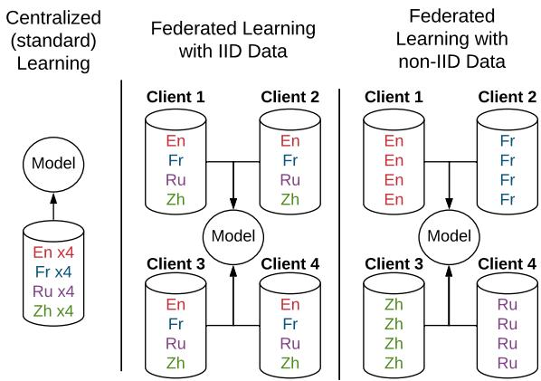
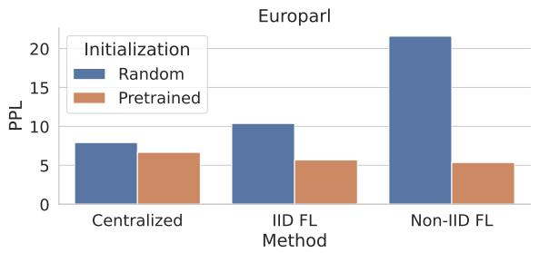
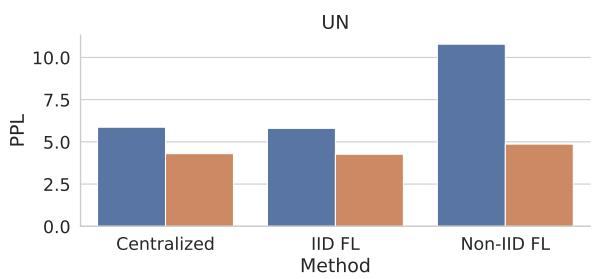

# Pretrained Models for Multilingual Federated Learning

Orion Weller\*, Marc Marone\*,

Vladimir Braverman, Dawn Lawrie, Benjamin Van Durme

Johns Hopkins University

oweller@cs.jhu.edu,mmarone1@jhu.edu

## Abstract

Since the advent of Federated Learning (FL), research has applied these methods to natural language processing (NLP) tasks. Despite a plethora of papers in FL for NLP, no previous works have studied how multilingual text impacts FL algorithms. Furthermore, multilingual text provides an interesting avenue to examine the impact of non-IID text (e.g. different languages) on FL in naturally occurring data. We explore three multilingual language tasks, language modeling, machine translation, and text classification using differing federated and nonfederated learning algorithms. Our results show that using pretrained models reduces the negative effects of FL, helping them to perform near or better than centralized (no privacy) learning, even when using non-IID partitioning.1

## 1 Introduction

Federated learning (FL) is a machine learning technique that trains a model across multiple distributed clients holding local data samples, without ever storing client data in a central location (Konecnˇ y\` et al., 2016; McMahan et al., 2017). These techniques are appealing for those who wish to learn from data in a privacy-preserving way, without ever transmitting the data off of a client device. FL becomes essential when data is especially sensitive, as is the case at hospitals, legal firms, financial institutions, or in countries that enact legislation concerning data privacy (such as the EU’s GDPR or the US’s HIPAA).

FL has been applied to problems in natural language processing (NLP) since its inception, particularly in use of the language modeling task (Yang et al., 2018; Hard et al., 2018; Ramaswamy et al., 2019; Chen et al., 2019a; Ji et al., 2019; Stremmel and Singh, 2020). Another large area of FL research is focused on analyzing performance when the data is non identically independently distributed (non-IID). In these cases, many works have shown that FL performance is sub-par with respect to centralized learning methods (Konecnˇ y et al.\` , 2016; Hard et al., 2018; Lin et al., 2021).

  
Figure 1: A depiction of different learning strategies with Federated Learning (FL) and multilingual data, with 4 clients and 16 instances from En, Fr, Ru, and Zh in this toy example. Black lines indicate gradient flow. Centralized learning is the standard training method (no privacy), FL with IID data partitions the data into IID data subsets for each client, while FL with non-IID data has the languages separated across clients.

Despite the large amount of research in FL for NLP, how different languages impact the FL training process has yet to be explored (Liu et al., 2021). Furthermore, multilingual FL provides an interesting and natural setting to explore non-IID data, of which different languages are an obvious example.

In this work, we explore multilingual federated learning across three multilingual language tasks and different stages of model pretraining. Our results show that fine-tuning pretrained models with FL can perform similarly to pretrained models finetuned with the standard centralized method (the no privacy setting), despite having completely non-IID language partitioned data. This finding shows that pretrained models provide an effective way for practitioners (and consumers) of multilingual data to gain the privacy benefits of FL at little or no cost to the final task performance.

## 2 Background and Related Work

The term Federated Learning was first proposed in McMahan et al. (2017), who applied the FederatedAveraging algorithm to the tasks of language modeling and image classification. Since then, much of the theoretical and applied work in FL (e.g. Chen et al. (2019b); Wu et al. (2020) among many others) has considered language modeling as a key task or benchmark.

Concurrent with the growing interest in Federated Learning, NLP has rapidly shifted toward the use of pretrained language models (PLMs) (e.g., BERT Devlin et al. 2019; T5 Raffel et al. 2019; GPT-3 Brown et al. 2020). These PLMs are used for both the core task of next word prediction and as a starting point for learning other downstream NLP tasks. This pretrain-and-fine-tune paradigm has since become ubiquitous in modern NLP and has inspired a large and active area of research in model pretraining. Multilingual versions of these pretrained models have since been developed and are often used with transfer learning techniques to increase performance for tasks where data is limited (e.g. mBERT from Devlin et al. 2019).

The intersection of distributed learning from private data partitions and PLMs is still a nascent area. Several works have explored more efficient methods of federated communication with the purpose of enabling these larger NLP models for production situations (Sui et al., 2020; Wu et al., 2021). Our work is orthogonal to these (and could be combined in future work), as we explore the effects of multilingual data on PLM FL, rather than creating methods to enable their use. Other papers focus on the gap between federated learning performance and centralized performance, evaluating on a wide variety of English NLP tasks (Liu and Miller, 2020; Lin et al., 2021; Chen et al., 2021). Although they focus on differential privacy (DP) rather than FL, Li et al. (2021) find that direct PLM training is difficult with standard DP methods, but that finetuning PLMs on English data is possible with private learning techniques. We differ from all these works by studying private learning, specifically FL, for PLMs in the novel multilingual setting.

## 3 Experimental Design

## 3.1 Federated Learning Methods

We use FederatedAveraging as the primary learning algorithm (McMahan et al., 2017). FederatedAveraging was introduced alongside the term Federated Learning and has been studied in both learning theory research (Stich, 2019) and applied work (Hard et al., 2018; Lin et al., 2021). In this algorithm, each client runs stochastic gradient descent (SGD) on its local data. After a specified number of steps, the client transmits its local model to the server, which averages these updates into a single centralized set of parameters. The server then broadcasts the centralized parameters to each client and the process repeats.

## 3.2 Client Partitioning

We consider three different training settings: standard training with no FL (e.g. centralized or C), FL with IID data (FL IID or I), where the data for each client is sampled randomly from all data, and FL with non-IID data (FL non-IID or N) where each client only sees data for one language (or for MT, one direction). See Figure 1 for a visual depiction of these three client partitioning schemes.

## 3.3 Data

We study three multilingual language tasks, due to their common use in the community: language modeling (LM), machine translation (MT), and text classification (TC). We note that the data we use for training is relatively small; however, this mirrors pratical FL, as each client will not have a large amount of data. We measure scores using perplexity (PPL) for LM, BLEU (Papineni et al., 2002) for MT, and accuracy for TC.

Europarl We use the Europarl corpus (Koehn et al., 2005) taken from transcripts of European Union meetings. We sample data from eight languages: English, Spanish, Portuguese, French, German, Finnish, Polish, Lithuanian, and Czech. We sample 20k of each language for training and 5k for validation/testing, and use it for the LM task.

MTNT We use the Machine Translation of Noisy Text (MTNT) dataset (Michel and Neubig, 2018), which was the testset for the 2019 WMT robustness challenge. MTNT was gathered from user comments on Reddit discussion threads and contains noisy text including typos, casual language, and niche terminology. The dataset contains two non-English languages that we use: En Fr and En Ja. This dataset has been used to test MT systems for robustness to domain shift (Li et al., 2019) and is suitable for our experiments since FL deals with client data that is uniquely shifted from centralized data. For more details on MTNT data preprocessing for M2M-100, see Appendix C.

Figure 2: An overview of the language modeling results. Bars indicate the average language perplexity (PPL) over 8 languages for the Europarl dataset and 6 languages for the UN corpus. Lower is better.
<table><tr><td></td><td colspan="10">Europarl</td><td colspan="7">UN</td></tr><tr><td>M</td><td>En</td><td>Cs</td><td>Lt</td><td>Es</td><td>Pl</td><td>Fi</td><td>Pt</td><td>De</td><td>Avg</td><td>En</td><td>Es</td><td>Fr</td><td>Ru</td><td>Zh</td><td>Ar</td><td>Avg</td></tr><tr><td>B</td><td>26.2</td><td>34.8</td><td>40.1</td><td>20.0</td><td>20.0</td><td>26.6</td><td>25.5</td><td>22.1</td><td>26.9</td><td>22.3</td><td>15.0</td><td>17.2</td><td>9.8</td><td>18.1</td><td>14.7</td><td>16.2</td></tr><tr><td>C</td><td>19.3</td><td>4.5</td><td>3.9</td><td>8.3</td><td>4.7</td><td>4.9</td><td>7.0</td><td>10.8</td><td>7.9</td><td>9.0</td><td>5.2</td><td>8.2</td><td>*3.9</td><td>*4.3</td><td>*4.6</td><td>*5.9</td></tr><tr><td>I</td><td>26.6</td><td>5.4</td><td>*4.3</td><td>11.2</td><td>5.8</td><td>5.7</td><td>8.9</td><td>15.1</td><td>10.4</td><td>*9.1</td><td>5.2</td><td>*8.4</td><td>3.7</td><td>3.9</td><td>4.5</td><td>5.8</td></tr><tr><td>N</td><td>50.6</td><td>7.1</td><td>11.9</td><td>16.0</td><td>17.7</td><td>12.1</td><td>35.6</td><td>21.7</td><td>21.6</td><td>12.8</td><td>11.5</td><td>14.6</td><td>9.3</td><td>8.2</td><td>8.3</td><td>10.8</td></tr><tr><td>C</td><td>12.1</td><td>3.7</td><td>3.3</td><td>13.9</td><td>4.7</td><td>4.0</td><td>4.8</td><td>*6.8</td><td>6.7</td><td>*7.0</td><td>*4.1</td><td>4.9</td><td>*2.9</td><td>*3.3</td><td>*3.6</td><td>4.3</td></tr><tr><td>I</td><td>10.5</td><td>*4.0</td><td>4.2</td><td>*6.1</td><td>3.8</td><td>4.5</td><td>*5.6</td><td>*6.9</td><td>*5.7</td><td>6.5</td><td>3.9</td><td>5.7</td><td>2.8</td><td>3.2</td><td>3.5</td><td>4.3</td></tr><tr><td>N</td><td>8.8</td><td>3.7</td><td>3.9</td><td>6.0</td><td>3.8</td><td>*4.4</td><td>*5.6</td><td>6.7</td><td>5.4</td><td>*7.1</td><td>4.5</td><td>6.2</td><td>*3.2</td><td>4.2</td><td>4.0</td><td>*4.9</td></tr></table>

Table 1: Results for FL experiments on the LM task. Bold scores indicate the best in the column for the given section. Scores are measured in perplexity (lower is better). The top row (B) is a baseline using the pretrained model with no fine-tuning. The middle rows are trained from randomly-initialized models while the bottom rows tune the pretrained model on task data. Due to space we abbreviate: C for Centralized, I for IID FL, and N for non-IID FL. We sample the mask distribution with 5 seeds and report the mean (standard deviations can be found in the Appendix, Tables 4 and 5). Asterisks indicate scores within 2 standard deviations of the best.

UN Corpus The UN Corpus (Ziemski et al., 2016) consists of official records from the UN proceedings over the years 1990 to 2014, in six languages: English, French, Spanish, Russian, Chinese, and Arabic. We use this data for LM (with 50k instances of training data per language and 5k for validation/testing) as well as three MT directions covering 6 languages (En  Fr, Ar  Es, Ru Zh). Following previous work in MT adaption (see MTNT above) we sample 10k in each direction for training and 5k each for evaluation sets.

NC Corpus For text classification we use the News Classification (NC) dataset from the XGLUE benchmark for cross-lingual language understanding (Liang et al., 2020). This is a classification problem with 10 classes across 5 languages: English, Spanish, French, German, and Russian. We predict the article category given the article title and body (e.g. finance, sports, travel). Since only 10k annotated examples are available for each language (excluding the official test set), we sample 8k instances for training and 1k for evaluation sets. Note that although XGLUE is made for cross-lingual evaluation, we use it for multilingual evaluation.

## 3.4 Modeling

For language modeling and text classification, we examine two different initialization settings: (1) fine-tuning from a pretrained multilingual model or (2) training the same multilingual model architecture but doing so with randomly initialized weights. For the MT experiments, we omit the randomlyinitialized results as MT systems generally need large amounts of data to produce good results (see Appendix B for more details).

Our base model for the LM task is a distilled version of the mBERT model (134M parameters), shown to perform well across many languages (Sanh et al., 2019; Devlin et al., 2019) while being smaller than the full mBERT.2 For MT, we use the M2M-100 model (Fan et al., 2020) with 418M parameters, a many-to-many MT model that can translate between any pairing of 100 languages. For text classification, we use the XLM-RoBERTa base sized model (270M parameters). We note that although there are other PLMs to consider, we focus on testing a varied set of commonly used, high-performing PLMs.

<table><tr><td></td><td colspan="3">MTNT</td><td colspan="4">UN</td></tr><tr><td>Method</td><td>En-Fr</td><td>En-Ja</td><td>Avg</td><td>En-Fr</td><td>Ar-Es</td><td>Ru-Zh</td><td>Avg</td></tr><tr><td>No Training</td><td>30.7</td><td>14.1</td><td>22.4</td><td>31.4</td><td>27.4</td><td>27.9</td><td>28.9</td></tr><tr><td>Centralized</td><td>31.8</td><td>*15.4</td><td>23.6</td><td>37.3</td><td>35.9</td><td>34.1</td><td>35.8</td></tr><tr><td>IID FL</td><td>33.1</td><td>15.6</td><td>24.4</td><td>38.6</td><td>36.9</td><td>*35.6</td><td>37.0</td></tr><tr><td>non-IID FL</td><td>*32.9</td><td>15.6</td><td>24.3</td><td>37.9</td><td>*36.6</td><td>35.7</td><td>36.7</td></tr></table>

Table 2: Results for FL experiments on the Machine Translation task. Bold scores indicate the best in the column, while asterisks indicate scores that are statistically similar to the best according to a paired bootstrap resampling test. Scores are measured with sacreBLEU (Post, 2018), higher is better.
<table><tr><td>Method</td><td>En</td><td>Es</td><td>Fr</td><td>De</td><td>Ru</td><td>Avg</td></tr><tr><td>Centralized</td><td> $8 6 . 6 \pm 0 . 3$ </td><td> $7 7 . 5 \pm 1 . 2$ </td><td> $7 4 . 9 \pm 1 . 6$ </td><td> $^ { * } 8 2 . 3 \pm 1 . 6$ </td><td> $8 0 . 7 \pm 0 . 7$ </td><td> $8 0 . 4 \pm 0 . 6$ </td></tr><tr><td>IID FL</td><td> ${ \bf 8 8 . 0 \pm 0 . 6 }$ </td><td> ${ \bf 7 9 . 8 \pm 0 . 5 }$ </td><td> $7 6 . 4 \pm 0 . 6$ </td><td> ${ \bf 8 2 . 6 \pm 0 . 6 }$ </td><td> ${ \bf 8 2 . 5 \pm 0 . 4 }$ </td><td> ${ \bf 8 1 . 8 \pm 0 . 3 }$ </td></tr><tr><td>non-IID FL</td><td> $8 1 . 0 \pm 0 . 9$ </td><td> $6 9 . 3 \pm 1 . 6$ </td><td> $7 3 . 7 \pm 1 . 0$ </td><td> $7 6 . 0 \pm 0 . 3$ </td><td> $7 1 . 9 \pm 1 . 1$ </td><td> $7 4 . 4 \pm 0 . 5$ </td></tr><tr><td>Centralized</td><td> $9 3 . 5 \pm 0 . 7 $ </td><td> $^ { * } 8 6 . 3 \pm 0 . 5$ </td><td> ${ \bf 8 2 . 9 \pm 0 . 3 }$ </td><td> ${ \bf 8 9 . 6 \pm 0 . 1 }$ </td><td> $^ { * } 8 8 . 5 \pm 0 . 4$ </td><td> $^ { * } 8 8 . 1 \pm 0 . 2$ </td></tr><tr><td>IID FL</td><td> ${ \bf 9 4 . 0 \pm 0 . 2 }$ </td><td> ${ \bf 8 6 . 9 \pm 1 . 1 }$ </td><td> $8 2 . 1 \pm 0 . 7$ </td><td> ${ \bf 8 9 . 6 \pm 0 . 2 }$ </td><td> ${ \bf 8 9 . 1 \pm 1 . 2 }$ </td><td> ${ \bf 8 8 . 3 \pm 0 . 3 }$ </td></tr><tr><td>non-IID FL</td><td> $9 2 . 5 \pm 0 . 1 $ </td><td> $^ { * } 8 6 . 1 \pm 0 . 6$ </td><td> $8 1 . 4 \pm 0 . 3$ </td><td> $8 8 . 8 \pm 0 . 1 $ </td><td> $8 4 . 5 \pm 0 . 7 $ </td><td> $8 6 . 7 \pm 0 . 1$ </td></tr></table>

Table 3: Results for FL experiments on the Text Classification task. Bold scores indicate the best in the column, while asterisks indicate scores within two standard deviations of the best. Scores are the mean of training with 3 different seeds, denotes the standard deviation. Scores are measured with accuracy, higher is better. The top rows are trained from random initialization while the bottom rows initialize from the pretrained model.

## 3.5 Training

We use the Flower framework (Beutel et al., 2020) for federated training and evaluation due to its ease of use and strong community support. We use Hugging Face’s transformers library (Wolf et al., 2019) for loading pretrained models and PyTorch as the underlying differentiation framework (Paszke et al., 2019). We train each LM model for 100 epochs if pretrained or 200 epochs if randomly initialized. For MT, we train for 25 epochs and for TC we train for 10 epochs if pretrained and 50 epochs if randomly initialized. For other hyperparameters and compute settings, see Appendix A.

## 4 Results

Language Modeling In Figure 2 we see the overall results of the language modeling task across the two datasets. As expected, the randomly initialized models perform much worse than the pretrained models. The gap between between FL and centralized methods is smaller when using pretrained models, indicating that pretrained models are an effective initialization for federated learning.

In Table 1 we show results broken down by language. Since the fine-tuning task is the same as the pretraining objective (masked language modeling), we can use the pretrained model as a baseline (top row, B). In the randomly initialized category, the centralized model is the same or better than the FL methods in every single language, across both datasets. In the pretrained section the results are more mixed, with the centralized model winning or tying in 5 of the 8 Europarl languages and obtaining similar scores on the UN corpus. We also see that the randomly initialized non-IID model appears to diverge for some of the Europarl languages.

Examining the difference between IID FL and non-IID FL, we see that IID FL performs better on average in three of the four settings. However, when initializing with a pretrained model, the performance gap narrows.

Machine Translation Table 2 exhibits results on tuning a machine translation model on a domain specific dataset. We see that on the MTNT dataset, both FL algorithms actually outperform centralized learning (24.4 avg. BLEU for IID FL vs 23.6 for Centralized). The scores on Japanese are very similar for all models, possibly reflecting the difficulty of the task. On the UN corpus, we see again that the IID FL model performs best.

Since the fine-tuning task matches the original M2M-100 task, we can use the pretrained model directly as a baseline. In all cases, fine-tuning shows an improvement (first row, No Training baseline). Note that our scores are not directly comparable to other work as we use a smaller training set.

Text Classification Table 3 shows results on text classification. We see that when initialized randomly, non-IID FL shows a large drop in performance compared to the two other methods (i.e. more than 5 points worse than the Centralized method). Initializing with the pretrained model yields a modest though consistent improvement for all three models (80.4% accuracy vs 88.3% accuracy for Centralized).3 Furthermore, with a pretrained initialization the non-IID FL method scores become significantly closer to the other two methods, with less than a two point difference between them (86.7% non-IID FL vs 88.3% IID FL).

Discussion Our examination of multilingual FL indicates that performance is similar when pretrained models are used. Despite the fact that local models are averaged together, non-IID data partitioning (where each client sees only one language) has only a small impact on final multilingual performance, when using pretrained models. These findings suggest that, when possible, practitioners who need multilingual federated learning should employ pretrained models in order to gain the privacy benefits of federated learning, without taking much (if any) of a performance loss to do so.

In several cases, we found that IID FL or non-IID FL could even outperform centralized learning. We leave investigation of this phenomena for future work but note a couple of possible explanations. First, FL with FederatedAveraging may have similar implicit regularization effects to checkpoint averaging, a common technique when using transformer models (noted in Vaswani et al. 2017, Edunov et al. 2018, etc.). Furthermore, there may be other regularization effects during federated fine-tuning, as transformer training is known to be unstable and sensitive to optimization choices (Mosbach et al. 2020, Nguyen and Salazar 2019).

Overall, our analysis shows that our conclusions hold for different multilingual models, on disparate NLP tasks, and across 13 different languages. We acknowledge that the languages used in this study are generally considered higher-resource, but expect that these conclusions will continue to hold as long as the pretrained model is effective on the target language (or language pairs, for MT).

## 5 Conclusion

In this work we provided the first analysis of multilingual language data on federated learning algorithms. We found that fine-tuning a pretrained model with FL methods can yield similar performance to centralized learning, even when clients are partitioned by language (non-IID FL). However, models trained from random initializations still show a large gap between centralized and federated learning. Our results suggest that learning on private partitioned data is possible without having to incur a large performance penalty. We hope that these results will aid practitioners in using FL (and also downstream consumers) and inspire the broader community to consider multilingual data in future federated learning research for natural language processing.

## References

Daniel J Beutel, Taner Topal, Akhil Mathur, Xinchi Qiu, Titouan Parcollet, Pedro PB de Gusmão, and Nicholas D Lane. 2020. Flower: A friendly federated learning research framework. arXiv preprint arXiv:2007.14390.

Tom B Brown, Benjamin Mann, Nick Ryder, Melanie Subbiah, Jared Kaplan, Prafulla Dhariwal, Arvind Neelakantan, Pranav Shyam, Girish Sastry, Amanda Askell, et al. 2020. Language models are few-shot learners. arXiv preprint arXiv:2005.14165.

Jiangui Chen, Ruqing Zhang, Jiafeng Guo, Yixing Fan, and Xueqi Cheng. 2021. Fedmatch: Federated learn-

ing over heterogeneous question answering data. Proceedings ofthe 30th ACM International Conference on Information & Knowledge Management.

Mingqing Chen, Rajiv Mathews, Tom Ouyang, and Françoise Beaufays. 2019a. Federated learning of out-of-vocabulary words. arXiv preprint arXiv:1903.10635.

Mingqing Chen, Ananda Theertha Suresh, Rajiv Mathews, Adeline Wong, Cyril Allauzen, Françoise Beaufays, and Michael Riley. 2019b. Federated learning of n-gram language models. In Proceedings of the 23rd Conference on Computational Natural Language Learning (CoNLL), pages 121–130.

Jacob Devlin, Ming-Wei Chang, Kenton Lee, and Kristina Toutanova. 2019. Bert: Pre-training of deep bidirectional transformers for language understanding. In NAACL-HLT (1).

Sergey Edunov, Myle Ott, Michael Auli, and David Grangier. 2018. Understanding back-translation at scale. In Proceedings of the 2018 Conference on Empirical Methods in Natural Language Processing, pages 489–500, Brussels, Belgium. Association for Computational Linguistics.

Angela Fan, Shruti Bhosale, Holger Schwenk, Zhiyi Ma, Ahmed El-Kishky, Siddharth Goyal, Mandeep Baines, Onur Çelebi, Guillaume Wenzek, Vishrav Chaudhary, Naman Goyal, Tom Birch, Vitaliy Liptchinsky, Sergey Edunov, Edouard Grave, Michael Auli, and Armand Joulin. 2020. Beyond english-centric multilingual machine translation. ArXiv, abs/2010.11125.

Andrew Hard, Kanishka Rao, Rajiv Mathews, Swaroop Ramaswamy, Françoise Beaufays, Sean Augenstein, Hubert Eichner, Chloé Kiddon, and Daniel Ramage. 2018. Federated learning for mobile keyboard prediction. arXiv preprint arXiv:1811.03604.

Shaoxiong Ji, Shirui Pan, Guodong Long, Xue Li, Jing Jiang, and Zi Huang. 2019. Learning private neural language modeling with attentive aggregation. In 2019 International Joint Conference on Neural Networks (IJCNN), pages 1–8. IEEE.

Diederik P Kingma and Jimmy Ba. 2014. Adam: A method for stochastic optimization. arXiv preprint arXiv:1412.6980.

Philipp Koehn et al. 2005. Europarl: A parallel corpus for statistical machine translation. In MT summit, volume 5, pages 79–86. Citeseer.

Jakub Konecnˇ y, H Brendan McMahan, Felix X Yu, Pe-\` ter Richtárik, Ananda Theertha Suresh, and Dave Bacon. 2016. Federated learning: Strategies for improving communication efficiency. arXiv preprint arXiv:1610.05492.

Xian Li, Paul Michel, Antonios Anastasopoulos, Yonatan Belinkov, Nadir Durrani, Orhan Firat,

Philipp Koehn, Graham Neubig, Juan Pino, and Hassan Sajjad. 2019. Findings of the first shared task on machine translation robustness. In Proceedings of the Fourth Conference on Machine Translation (Volume 2: Shared Task Papers, Day 1), pages 91– 102, Florence, Italy. Association for Computational Linguistics.

Xuechen Li, Florian Tramer, Percy Liang, and Tatsunori Hashimoto. 2021. Large language models can be strong differentially private learners. arXiv preprint arXiv:2110.05679.

Yaobo Liang, Nan Duan, Yeyun Gong, Ning Wu, Fenfei Guo, Weizhen Qi, Ming Gong, Linjun Shou, Daxin Jiang, Guihong Cao, Xiaodong Fan, Bruce Zhang, Rahul Agrawal, Edward Cui, Sining Wei, Taroon Bharti, Ying Qiao, Jiun-Hung Chen, Winnie Wu, Shuguang Liu, Fan Yang, Daniel Fernando Campos, Rangan Majumder, and Ming Zhou. 2020. Xglue: A new benchmark datasetfor cross-lingual pre-training, understanding and generation. In EMNLP.

Bill Yuchen Lin, Chaoyang He, ZiHang Zeng, Hulin Wang, Yufen Huang, M. Soltanolkotabi, Xiang Ren, and S. Avestimehr. 2021. Fednlp: A research platform for federated learning in natural language processing. In arXiv cs.CL 2104.08815.

Dianbo Liu and Tim Miller. 2020. Federated pretraining and fine tuning of bert using clinical notes from multiple silos. ArXiv, abs/2002.08562.

Ming Liu, Stella Ho, Mengqi Wang, Longxiang Gao, Yuan Jin, and He Zhang. 2021. Federated learning meets natural language processing: A survey. arXiv preprint arXiv:2107.12603.

Ilya Loshchilov and Frank Hutter. 2017. Decoupled weight decay regularization. arXiv preprint arXiv:1711.05101.

Brendan McMahan, Eider Moore, Daniel Ramage, Seth Hampson, and Blaise Aguera y Arcas. 2017. Communication-efficient learning of deep networks from decentralized data. In Artificial intelligence and statistics, pages 1273–1282. PMLR.

Paul Michel and Graham Neubig. 2018. Mtnt: A testbed for machine translation of noisy text. In Proceedings of the 2018 Conference on Empirical Methods in Natural Language Processing.

Marius Mosbach, Maksym Andriushchenko, and Dietrich Klakow. 2020. On the stability of fine-tuning bert: Misconceptions, explanations, and strong baselines. In International Conference on Learning Representations.

Toan Q Nguyen and Julian Salazar. 2019. Transformers without tears: Improving the normalization of selfattention. arXiv preprint arXiv:1910.05895.

Kishore Papineni, Salim Roukos, Todd Ward, and Wei-Jing Zhu. 2002. Bleu: a method for automatic evaluation of machine translation. In Proceedings ofthe

40th Annual Meeting ofthe Associationfor Computational Linguistics, pages 311–318, Philadelphia, Pennsylvania, USA. Association for Computational Linguistics.

Adam Paszke, Sam Gross, Francisco Massa, Adam Lerer, James Bradbury, Gregory Chanan, Trevor Killeen, Zeming Lin, Natalia Gimelshein, Luca Antiga, Alban Desmaison, Andreas Kopf, Edward Yang, Zachary DeVito, Martin Raison, Alykhan Tejani, Sasank Chilamkurthy, Benoit Steiner, Lu Fang, Junjie Bai, and Soumith Chintala. 2019. Pytorch: An imperative style, high-performance deep learning library. In H. Wallach, H. Larochelle, A. Beygelzimer, F. d'Alché-Buc, E. Fox, and R. Garnett, editors, Advances in Neural Information Processing Systems 32, pages 8024–8035. Curran Associates, Inc.

Matt Post. 2018. A call for clarity in reporting bleu scores. arXiv preprint arXiv:1804.08771.

Colin Raffel, Noam Shazeer, Adam Roberts, Katherine Lee, Sharan Narang, Michael Matena, Yanqi Zhou, Wei Li, and Peter J Liu. 2019. Exploring the limits of transfer learning with a unified text-to-text transformer. arXiv preprint arXiv:1910.10683.

Swaroop Ramaswamy, Rajiv Mathews, Kanishka Rao, and Françoise Beaufays. 2019. Federated learning for emoji prediction in a mobile keyboard. arXiv preprint arXiv:1906.04329.

Victor Sanh, Lysandre Debut, Julien Chaumond, and Thomas Wolf. 2019. Distilbert, a distilled version of bert: smaller, faster, cheaper and lighter. arXiv preprint arXiv:1910.01108.

Sebastian Urban Stich. 2019. Local sgd converges fast and communicates little. In ICLR 2019-International Conference on Learning Representations, CONF.

Asa Cooper Stickland, Xian Li, and Marjan Ghazvininejad. 2020. Recipes for adapting pre-trained monolingual and multilingual models to machine translation. arXiv preprint arXiv:2004.14911.

Joel Stremmel and Arjun Singh. 2020. Pretraining federated text models for next word prediction. arXiv preprint arXiv:2005.04828.

Dianbo Sui, Yubo Chen, Jun Zhao, Yantao Jia, Yuantao Xie, and Weijian Sun. 2020. Feded: Federated learning via ensemble distillation for medical relation extraction. In EMNLP.

Ashish Vaswani, Noam Shazeer, Niki Parmar, Jakob Uszkoreit, Llion Jones, Aidan N Gomez, Łukasz Kaiser, and Illia Polosukhin. 2017. Attention is all you need. In Advances in neural information processing systems, pages 5998–6008.

Thomas Wolf, Lysandre Debut, Victor Sanh, Julien Chaumond, Clement Delangue, Anthony Moi, Pierric Cistac, Tim Rault, Rémi Louf, Morgan Funtowicz, et al. 2019. Huggingface’s transformers: State-of the-art natural language processing. arXiv preprint arXiv:1910.03771.

Chuhan Wu, Fangzhao Wu, Ruixuan Liu, Lingjuan Lyu, Yongfeng Huang, and Xing Xie. 2021. Fedkd: Communication efficient federated learning via knowledge distillation. ArXiv, abs/2108.13323.

Xing Wu, Zhaowang Liang, and Jianjia Wang. 2020. Fedmed: A federated learning framework for language modeling. Sensors, 20(14):4048.

Timothy Yang, Galen Andrew, Hubert Eichner, Haicheng Sun, Wei Li, Nicholas Kong, Daniel Ramage, and Françoise Beaufays. 2018. Applied federated learning: Improving google keyboard query suggestions. arXiv preprint arXiv:1812.02903.

Michał Ziemski, Marcin Junczys-Dowmunt, and Bruno Pouliquen. 2016. The united nations parallel corpus v1. 0. In Proceedings of the Tenth International Conference on Language Resources and Evaluation (LREC’16), pages 3530–3534.

## A Hyperparameters

Each LM experiment ran for approximately a day each on a 6 GPU cluster of RTX 6000 GPUs with 24GB of memory per GPU. The MT experiments took approximately 12 hours each and the TC experiments took around 3 hours each, all on the same cluster.

We use the AdamW optimizer (Loshchilov and Hutter, 2017; Kingma and Ba, 2014) for all experiments (shown to be effective for FL in Lin et al. 2021). Each client goes through a full epoch of local learning before synchronizing with the server.

For MT, we report results using the 5e-5 learning rate, as we found in initial results (as have others also, see Appendix B of Stickland et al. (2020) as one example) that MT experiments are generally consistent over learning rates when fine-tuning. For language modeling and text classification, we use three different learning rates (1e-4, 5e-5, 1e-5). All models were selected using the best performing version on the validation set, for the given model and training setting. For both tasks, we use early stopping (5 epochs of no improvement for MT and TC, 10 epochs for LM).

We use the standard sacreBLEU settings: nrefs:1, mixed case, eff:no, tok:13a, smooth:exp, and version 2.0.0. For Ja and Zh we use their respective tokenizers.

## B Randomly Initialized MT

We do not report results for randomly initialized training of MT systems, as large neural MT systems generally need large amounts of data to be effective. We ran experiments for the MTNT dataset from random initializations, running for twice as many epochs. Resulting models appeared to converge by loss but had extremely low BLEU scores. Thus, we only include pretrained results in Table 2.

## C MTNT Data Preprocessing for M2M-100

M2M-100 was trained using scripts that removed input with “excess punctuation." We follow this in preparing MTNT training data. We use all En Ja data (consisting of approximately 6k instances) and take the corresponding En Fr instances, randomly sampling additional instances until there are the same number of instances in each direction. We sample an equal number of training instances as we are testing the effects of multilingual data, rather than unequal dataset sizes. We then remove the training instances with excess punctuation (or sentences less than 3 characters) following the M2M-100 script. This leaves 5605 instances in each direction for training. We use the standard MTNT dev and test sets, as-is, consisting of approximately 1k data points.

## D Full LM Results

We show the full results of the LM experiments, with standard deviations over five random seeds in Tables 4 and 5.

<table><tr><td>一</td><td colspan="9"></td></tr><tr><td>M</td><td>En</td><td>Cs</td><td>Lt</td><td>Es</td><td>Pi</td><td>Fi</td><td>Pt</td><td>De</td><td>Avg</td></tr><tr><td>B</td><td> $2 6 . 2 \pm 2 . 4$ </td><td> $3 4 . 8 \pm 1 . 8$ </td><td> $4 0 . 1 \pm 2 . 3 $ </td><td> $2 0 . 0 \pm 1 . 3$ </td><td> $2 0 . 0 \pm 1 . 3$ </td><td> $2 6 . 6 \pm 1 . 4$ </td><td> $2 5 . 5 \pm 2 . 0$ </td><td> $2 2 . 1 \pm 1 . 8$ </td><td> $2 6 . 9 \pm 1 . 8$ </td></tr><tr><td>C</td><td> $1 9 . 3 \pm 1 . 5$ </td><td> $4 . 5 \pm 0 . 4$ </td><td> $3 . 9 \pm 0 . 3$ </td><td> $8 . 3 \pm 0 . 7$ </td><td> $4 . 7 \pm 0 . 3$ </td><td> $4 . 9 \pm 0 . 3$ </td><td> $7 . 0 \pm 0 . 6$ </td><td> $1 0 . 8 \pm 0 . 8$ </td><td> $7 . 9 \pm 0 . 6$ </td></tr><tr><td>I</td><td> $2 6 . 6 \pm 1 . 7$ </td><td> $5 . 4 \pm 0 . 4$ </td><td> $4 . 3 \pm 0 . 3$ </td><td> $1 1 . 2 \pm 0 . 9$ </td><td> $5 . 8 \pm 0 . 4$ </td><td> $5 . 7 \pm 0 . 3$ </td><td> $8 . 9 \pm 0 . 7$ </td><td> $1 5 . 1 \pm 1 . 1$ </td><td> $1 0 . 4 \pm 0 . 7$ </td></tr><tr><td>N</td><td> $5 0 . 6 \pm 2 . 9$ </td><td> $7 . 1 \pm 0 . 5$ </td><td> $1 1 . 9 \pm 0 . 9$ </td><td> $1 6 . 0 \pm 1 . 2$ </td><td> $1 7 . 7 \pm 1 . 2$ </td><td> $1 2 . 1 \pm 0 . 7$ </td><td> $3 5 . 6 \pm 2 . 8$ </td><td> $2 1 . 7 \pm 1 . 4$ </td><td> $2 1 . 6 \pm 1 . 4$ </td></tr><tr><td>C</td><td> $1 2 . 1 \pm 0 . 9$ </td><td> $3 . 7 \pm 0 . 3$ </td><td> $3 . 3 \pm 0 . 2$ </td><td> $1 3 . 9 \pm 1 . 2$ </td><td> $4 . 7 \pm 0 . 4$ </td><td> $4 . 0 \pm 0 . 2$ </td><td> $4 . 8 \pm 0 . 4$ </td><td> $6 . 8 \pm 0 . 6$ </td><td> $6 . 7 \pm 0 . 5$ </td></tr><tr><td>I</td><td> $1 0 . 5 \pm 0 . 9$ </td><td> $4 . 0 \pm 0 . 3$ </td><td> $4 . 2 \pm 0 . 3$ </td><td> $6 . 1 \pm 0 . 5$ </td><td> $3 . 8 \pm 0 . 3$ </td><td> $4 . 5 \pm 0 . 3$ </td><td> $5 . 6 \pm 0 . 4$ </td><td> $6 . 9 \pm 0 . 5$ </td><td> $5 . 7 \pm 0 . 4$ </td></tr><tr><td>N</td><td> $8 . 8 \pm 0 . 6$ </td><td> $3 . 7 \pm 0 . 3$ </td><td> $3 . 9 \pm 0 . 3$ </td><td> $6 . 0 \pm 0 . 5$ </td><td> $3 . 8 \pm 0 . 3$ </td><td> $4 . 4 \pm 0 . 3$ </td><td> $5 . 6 \pm 0 . 4$ </td><td> $6 . 7 \pm 0 . 5$ </td><td> $5 . 4 \pm 0 . 4$ </td></tr></table>

Table 4: Results for the LM FL experiments on the Europarl Corpus. Bold scores indicate the best in the column for the given section. Scores are measured in perplexity (lower is better). The top row (B) is a baseline using the pretrained model with no further tuning. The middle rows are trained from randomly-initialized models while the bottom rows tune the pretrained model on task data. Due to space we abbreviate: C for Centralized, I for IID FL, and N for non-IID FL.

<table><tr><td></td><td colspan="7">UN</td></tr><tr><td>M</td><td>En</td><td>Es</td><td>Fr</td><td>Ru</td><td>Zh</td><td>Ar</td><td>Avg</td></tr><tr><td>B</td><td> $2 2 . 3 \pm 2 . 0$ </td><td> $1 5 . 0 \pm 0 . 9$ </td><td> $1 7 . 2 \pm 1 . 1$ </td><td> $9 . 8 \pm 0 . 6$ </td><td> $1 8 . 1 \pm 1 . 0 $ </td><td> $1 4 . 7 \pm 0 . 8$ </td><td> $1 6 . 2 \pm 1 . 0$ </td></tr><tr><td>C</td><td> $9 . 0 \pm 0 . 6$ </td><td> $5 . 2 \pm 0 . 3$ </td><td> $8 . 2 \pm 0 . 5$ </td><td> $3 . 9 \pm 0 . 3$ </td><td> $4 . 3 \pm 0 . 2$ </td><td> $4 . 6 \pm 0 . 3$ </td><td> $5 . 9 \pm 0 . 4$ </td></tr><tr><td>I</td><td> $9 . 1 \pm 0 . 7$ </td><td> $5 . 2 \pm 0 . 3$ </td><td> $8 . 4 \pm 0 . 4$ </td><td> $3 . 7 \pm 0 . 3$ </td><td> $3 . 9 \pm 0 . 2$ </td><td> $4 . 5 \pm 0 . 2$ </td><td> $5 . 8 \pm 0 . 3$ </td></tr><tr><td>N</td><td> $1 2 . 8 \pm 0 . 9$ </td><td> $1 1 . 5 \pm 0 . 7$ </td><td> $1 4 . 6 \pm 0 . 8$ </td><td> $9 . 3 \pm 0 . 7$ </td><td> $8 . 2 \pm 0 . 5$ </td><td> $8 . 3 \pm 0 . 4$ </td><td> $1 0 . 8 \pm 0 . 6$ </td></tr><tr><td>C</td><td> $7 . 0 \pm 0 . 5$ </td><td> $4 . 1 \pm 0 . 2$ </td><td> $4 . 9 \pm 0 . 3$ </td><td> $2 . 9 \pm 0 . 2$ </td><td> $3 . 3 \pm 0 . 2$ </td><td> $3 . 6 \pm 0 . 2$ </td><td> $4 . 3 \pm 0 . 3$ </td></tr><tr><td>I</td><td> $6 . 5 \pm 0 . 5$ </td><td> $3 . 9 \pm 0 . 2$ </td><td> $5 . 7 \pm 0 . 3$ </td><td> $2 . 8 \pm 0 . 2$ </td><td> $3 . 2 \pm 0 . 2$ </td><td> $3 . 5 \pm 0 . 2$ </td><td> $4 . 3 \pm 0 . 3$ </td></tr><tr><td>N</td><td> $7 . 1 \pm 0 . 5$ </td><td> $4 . 5 \pm 0 . 3$ </td><td> $6 . 2 \pm 0 . 3$ </td><td> $3 . 2 \pm 0 . 2$ </td><td> $4 . 2 \pm 0 . 2$ </td><td> $4 . 0 \pm 0 . 2$ </td><td> $4 . 9 \pm 0 . 3$ </td></tr></table>

Table 5: Results for the LM FL experiments on the UN Corpus. Bold scores indicate the best in the column for the given section. Scores are measured in perplexity (lower is better). The top row (B) is a baseline using the pretrained model with no further tuning. The middle rows are trained from randomly-initialized models while the bottom rows tune the pretrained model on task data. Due to space we abbreviate: C for Centralized, I for IID FL, and N for non-IID FL.