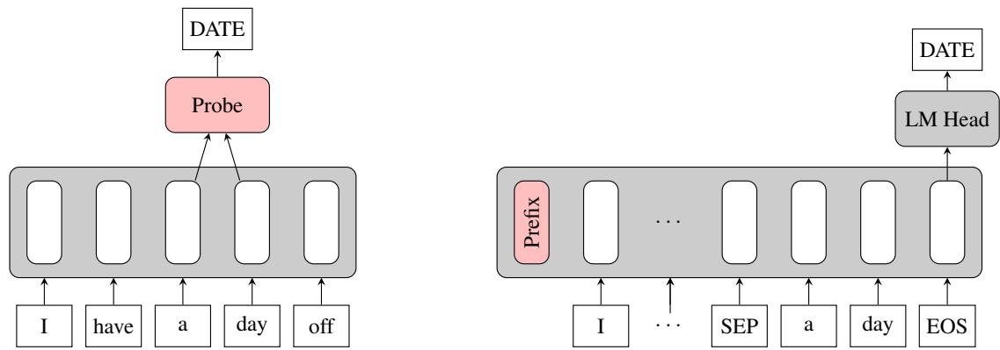
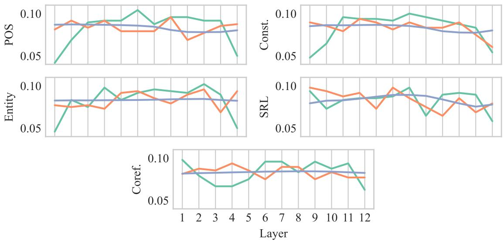
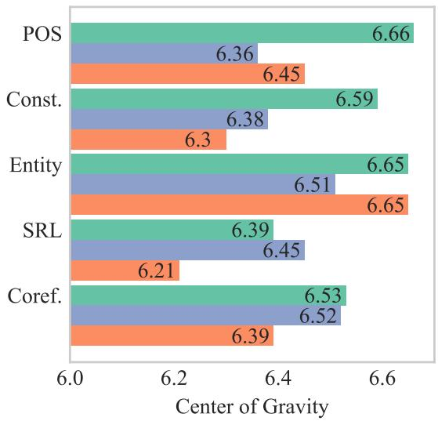

# Probing via Prompting

Jiaoda Li Ryan Cotterell Mrinmaya Sachan

jiaoda.li, ryan.cotterell, mrinmaya.sachan @inf.ethz.ch

ETHzürich

## Abstract

Probing is a popular method to discern what linguistic information is contained in the representations of pre-trained language models. However, the mechanism of selecting the probe model has recently been subject to intense debate, as it is not clear if the probes are merely extracting information or modeling the linguistic property themselves. To address this challenge, this paper introduces a novel model-free approach to probing, by formulating probing as a prompting task. We conduct experiments on five probing tasks and show that our approach is comparable or better at extracting information than diagnostic probes while learning much less on its own. We further combine the probing via prompting approach with attention head pruning to analyze where the model stores the linguistic information in its architecture. We then examine the usefulness of a specific linguistic property for pre-training by removing the heads that are essential to that property and evaluating the resulting model’s performance on language modeling.

0 https://github.com/rycolab/ probing-via-prompting

## 1 Introduction

Pre-trained language models such as BERT (Devlin et al., 2019), GPT-2 (Radford et al., 2019), and GPT-3 (Brown et al., 2020) have increased the performance of data-driven natural language processing (NLP) models on a wide variety of tasks. Due to their strong performance on many language-based tasks that require some linguistic understanding, it is natural to hypothesize that the models must implicitly encode some linguistic knowledge. One avenue of research that attempts to uncover the linguistic knowledge encoded in these models is called probing (Conneau et al., 2018; Alain and Bengio, 2018; Tenney et al.,

2019b; Saleh et al., 2020). A common form of probing is diagnostic probing. Under this approach a classifier is trained on top of a pre-trained language model to perform a target linguistic task, which is closely related to the linguistic property in question. The predictive accuracy of the classifier is then taken as an indicator of how much knowledge about the target linguistic property is encoded in the language model representations.

However, diagnostic probing has its limitations. An inherent challenge in the endeavor is discerning what is encoded in the pre-trained representations from what is learned by the probe itself (Zhang and Bowman, 2018; Hewitt and Liang, 2019; Pimentel et al., 2020a; Cao et al., 2021). The probe could, in principle, learn the task on top of random representations. While the probe is trained to extract linguistic properties from the representations, there is no simple way to restrain the probe from learning the task on its own during training. Previous research tackles the challenge using random model baselines (Zhang and Bowman, 2018) and control tasks (Hewitt and Liang, 2019; Pimentel et al., 2020a). Cao et al. (2021) try to create a more selective probe using pruning.

In this work, we address the above limitation with a novel probing framework that we call probing via prompting (PP). Drawing inspiration from recent work on prompting (Brown et al., 2020; Liu et al., 2021), we reformat a suite of probing tasks into question–answer pairs and instruct the model to answer the questions with a prefix (Li and Liang, 2021). In effect, prompting acts as a model-free probe. Thus, the use of prompting instead of a diagnostic probe allows us to work around the dilemma of teasing apart what the representations contain versus what the probe learns.

In the empirical part of the paper, we conduct experiments on five linguistic tasks and show that all these properties are indeed encoded in the popular pre-trained language model, GPT-2.

  
(a) Diagnostic probing (DP). It trains a probe on top of the contextual representations of the entity span (“a day”) to predict the label (“DATE”).  
(b) Probing via prompting (PP). We reformulate named entity labeling into an LM task by concatenating the given span (“a day”) with the sentence. We then use a prefix to instruct the model to predict the label (“DATE”).  
Figure 1: Illustration of different probing paradigms. Here, we show an example of named entity labeling: classifying a given entity span into pre-defined categories.

Furthermore, we show that probing via prompting appears to lead to insightful probing results. In the language of Hewitt and Liang (2019), PP obtains high selectivity, i.e., the results show high accuracy on the target task, but, as expected, PP does not work well with random representations. These results suggest that PP learns little information on its own and the extracted linguistic properties are indeed encoded in the model.

At a high level, this work takes the position that model-free probing methods such as PP are useful for accurately and faithfully locating and identifying the linguistic properties embedded in these representations and helping us understand how neural language models process text. In contrast to diagnostic probes, which require designing random model baselines and control tasks to control for the learning ability of the probe model, model-free probes like PP are less capable of learning the linguistic task themselves, and thus can naturally be more selective than diagnostic probes.

## 2 Probing via Prompting

We now introduce our probing via prompting framework (PP), illustrated in Fig. 1b.

## 2.1 Language Models

Let p be a language model with vocabulary Σ. In the case of an autoregressive language model, $^ { 1 } p$ is defined as a distribution over $\Sigma ^ { * }$ that is locally normalized, i.e., for any $\pmb { w } \in \Sigma ^ { * }$ we decompose $p ( \pmb { w } )$ according to the chain rule as follows:

$$
p ( \pmb { w } ) = p ( w _ { 1 } ) \cdot \prod _ { i = 2 } ^ { | \pmb { w } | } p ( w _ { i } \mid \pmb { w } _ { < i } )\tag{1}
$$

Each “local” distribution $p ( w _ { i } \mid \pmb { w } _ { < i } )$ is defined over Σ. Traditionally, language models include an EOS symbol; this means they produce a distribution over (an infinite number of) finite strings.

In this work, we focus on the case when p is a Transformer-based language model (Vaswani et al., 2017)—specifically, we take p to be an instance of GPT-2 (Radford et al., 2019). In contrast to most language models, GPT-2 dispenses with the EOS symbol and therefore yields a distribution over infinite strings.2 As it will be necessary for later discussion, we further introduce notation to discuss the internal workings of the Transformer. We denote the layer activations $A ^ { ( 0 ) } , \ldots , A ^ { ( L ) }$ where L is the total number of layers; the $0 ^ { \mathrm { t h } }$ layer corresponds to the embedding layer. Here, $\dot { \mathbf { A } ^ { ( \ell ) } } = \left[ \mathbf { a } _ { 0 } ^ { ( \ell ) } , \dots , \mathbf { a } _ { | w | } ^ { ( \ell ) } \right]$ denotes the activation matrix of the $\ell ^ { \mathrm { { t h } } }$ layer and $\mathbf { \dot { a } } _ { i } ^ { ( \ell ) }$ is the activation vector for the token at position i. The activation at the last layer is used to compute the distribution for the next token:

$$
p ( w _ { i + 1 } \mid \pmb { w } _ { \leq i } ) = \mathrm { s o f t m a x } ( W \mathbf { a } _ { i } ^ { ( L ) } )\tag{2}
$$

where W is a matrix that maps activations to logits over the vocabulary.

## 2.2 Edge Probing via Prompting

The edge probing framework (Tenney et al., 2019a,b) decomposes many common structuredprediction tasks into a common format of multiclass classification. In an edge probing task, a sentence $\ b { x } \in \Sigma ^ { * }$ and $\operatorname { s p a n s } ^ { 3 } \ : s _ { 1 } , s _ { 2 }$ in x are provided as inputs, and the goal is to select a correct label y among a set of candidate labels . We have intentionally kept the definition of abstract because it is task-specific. E.g., in named entity labeling, will be a set of entity types, whereas in semantic role labeling  will be a set of semantic roles.4

<table><tr><td>Task</td><td>Context</td><td>Target Label</td></tr><tr><td>POS</td><td>x SEP brand EOS</td><td>NN</td></tr><tr><td>Const.</td><td>x SEP is a global brand EOS</td><td>VP</td></tr><tr><td>Entity</td><td>x SEP Disney EOS</td><td>ORG</td></tr><tr><td>SRL</td><td>x SEP is SEP The important thing about Disney EOS</td><td>ARG1</td></tr><tr><td>Coref.</td><td>x SEP Disney SEP it EOS</td><td>True</td></tr></table>

Table 1: Example prompt and target label for each task. $\mathbf { \Delta } x = ^ { 6 6 \prime }$ The important thing about Disney is that it is a global brand.” The continuous prefix is neglected for simplicity.

Now we introduce how to perform edge probing via prompting. We follow the naming convention of Schick and Schütze (2021a) and begin describing our prompting approach by introducing a pattern– verbalizer pair.

Pattern. We convert $x , s _ { 1 } , s _ { 2 }$ into a string, called the pattern, as follows

$$
\pmb { p } = \pmb { x } \circ \mathrm { S E P } \circ \pmb { s } _ { 1 } \circ \mathrm { S E P } \circ \pmb { s } _ { 2 } \circ \mathrm { E O S }\tag{3}
$$

where is string concatenation. Note that now $\pmb { p } \in ( \Sigma \cup \{ \mathrm { S E P } , \mathrm { E O S } \} ) ^ { * }$

Verbalizer. Next, we define a verbalizer function vb $: \ \mathcal { V } \  \ \Sigma$ that maps each label to a token.5 In our implementation, we introduce a distinguished symbol $\operatorname { C L S } [ y ]$ for each label y. Thus, our verbalizer becomes $\tt { v b } : \mathcal { V } $ $\{ \mathbf { C L S } [ 1 ] , \dots , \mathbf { C L S } [ | \mathcal { V } | ] \}$ , where is the number of candidate classes.

Inference. Now we augment the language model p such that every conditional probability is over $\Sigma \cup \{ \mathrm { s e p , t o s , c L s } [ 1 ] , \dots , \mathrm { c L s } [ | \mathcal { V } | ] \}$ (instead of just Σ), so we expand W correspondingly to incorporate the enlarged vocabulary. The newly added rows in W and the embeddings of the newly added symbols are both randomly initialized from a normal distribution with a mean of 0 and a variance of 0.02 and not updated during training. To make a prediction, we select the class whose verbalizer has the highest next-token probability:

$$
\widehat { y } = \underset { y ^ { \prime } \in \mathcal { V } } { \mathrm { a r g m a x } } p \left( w _ { | \pmb { p } | + 1 } = \mathsf { v b } \left( y ^ { \prime } \right) \mid w _ { \leq | \pmb { p } | } \right)\tag{4}
$$

This completes our formalization of edge probing as prompting.

## 2.3 Prefix Tuning

To better instruct the language model to perform the target task, we prepend the pattern p with a prefix that is task-specific and independent of x, s1 and s2. Intuitively, we aim to steer a pre-trained language model to generate predictions using an instructive prefix. For instance, a prefix for named entity labeling could be an additional string in $\Sigma ^ { * }$ e.g., “classify the named entity into the following categories: person, organization . . . ” However, in preliminary experiments, we found that discrete prefixes perform poorly on GPT-2—the prime object of our study in this paper.6 Thus, we resort to a continuous prefix (Li and Liang, 2021). The technical details of performing continuous prefix tuning in the case of a Transformer language model are given in App. A.

## 3 Experiments

We empirically benchmark our pruning method against several previously proposed works.

## 3.1 Tasks

We experiment on five tasks derived from OntoNotes 5.0 (Weischedel et al., 2013): partof-speech tagging (POS), constituent labeling (const.), named entity labeling (entity), semantic role labeling (SRL), and coreference (Coref.). They are simplified versions of the original tasks in OntoNotes that are made compatible with the edge probing framework. An example for each task is shown in Tab. 1.

## 3.2 Diagnostic Probing

We compare PP with diagnostic probing (DP), and consider two types of diagnostic probes: a logistic regression probe (LR) and a multilayer perceptron probe (MLP). The idea behind diagnostic probing is illustrated in Fig. 1a. In this paper, we train a DP to predict a label $y \in \mathcal { V }$ for the given span(s) $\scriptstyle { s _ { 1 } }$ (and optionally $s _ { 2 } )$ of a sentence x, taking the contextual representations of the span(s) produced by the pre-trained model as inputs.

## 3.2.1 Contextual Representations.

DP takes a single vector as input, which represents the span(s) of interest under the context of the sentence. In this section, we introduce how to obtain such a vector from a pre-trained model. For an input sentence x of length $| x | .$ , we again denote the layer activations produced by the language model as $A ^ { ( 0 ) } , \ldots , A ^ { ( L ) }$ and $\begin{array} { r l r } { A ^ { ( \ell ) } } & { { } = } & { \left\lceil \mathbf { a } _ { 0 } ^ { ( \bar { \ell } ) } , \dots , \mathbf { a } _ { | \pmb { x } | } ^ { ( \ell ) } \right\rceil } \end{array}$ Following Peters et al. (2018a), we pool the representations of the different layers into a scalar-mixed representation as follows. We define the matrix $\begin{array} { r c l } { A } & { = } & { \left[ \mathbf { a } _ { 0 } , \ldots , \mathbf { a } _ { | x | } \right] } \end{array}$ with ai computed thusly:

$$
{ \bf a } _ { i } = \sum _ { \ell = 1 } ^ { L } n _ { \mathrm { M L P } } ( \ell ) \cdot { \bf a } _ { i } ^ { ( \ell ) }\tag{5}
$$

where nMLP is a distribution over the layers $\{ 1 , \ldots , L \}$ that is learned during training.7 In case a span consists of multiple tokens, the per-token vectors (either the scalar-mixed vector ${ \bf a } _ { i }$ or the last layer activation $\mathbf { a } _ { i } ^ { ( L ) } )$ are combined into a span representation using self-attention pooling (Lee et al., 2017). If more than one span exists, the span representations are concatenated into one.

## 3.2.2 Baselines

DP (LR). The first diagnostic probe we consider is a multinomial logistic regression probe that resembles the classification head in Cao et al. (2021). Following Cao et al. (2021), we compute the span representations using the activations

<table><tr><td>Task</td><td>Method</td><td>Pre-trained</td><td>Random</td></tr><tr><td>POS</td><td>PP</td><td>94.28</td><td>13.14</td></tr><tr><td></td><td>DP (MLP)</td><td>94.01</td><td>47.89</td></tr><tr><td></td><td>DP (LR)</td><td>89.56</td><td>38.84</td></tr><tr><td></td><td>Majority</td><td>12.58</td><td></td></tr><tr><td></td><td>Chance</td><td>2.08</td><td></td></tr><tr><td>Const.</td><td>PP</td><td>86.66</td><td>35.98</td></tr><tr><td></td><td>DP (MLP)</td><td>82.09</td><td>45.24</td></tr><tr><td></td><td>DP (LR)</td><td>71.32</td><td>42.67</td></tr><tr><td></td><td>Majority</td><td>35.66</td><td></td></tr><tr><td></td><td>Chance</td><td>3.33</td><td></td></tr><tr><td>Entity</td><td>PP</td><td>93.81</td><td>15.91</td></tr><tr><td></td><td>DP (MLP)</td><td>88.43</td><td>35.87</td></tr><tr><td></td><td>DP (LR)</td><td>87.81</td><td>29.81</td></tr><tr><td></td><td>Majority</td><td>15.91 5.56</td><td></td></tr><tr><td></td><td>Chance</td><td></td><td></td></tr><tr><td>SRL</td><td>PP</td><td>85.46</td><td>33.36</td></tr><tr><td></td><td>DP (MLP)</td><td>84.13</td><td>53.05 47.99</td></tr><tr><td></td><td>DP (LR)</td><td>77.43</td><td></td></tr><tr><td></td><td>Majority</td><td>33.36</td><td></td></tr><tr><td></td><td>Chance</td><td>1.52</td><td></td></tr><tr><td>Coref.</td><td>PP</td><td>90.54</td><td>78.33</td></tr><tr><td></td><td>DP (MLP)</td><td>87.05</td><td>78.33 78.33</td></tr><tr><td></td><td>DP (LR)</td><td>81.21</td><td></td></tr><tr><td></td><td>Majority</td><td>78.33</td><td></td></tr><tr><td></td><td>Chance</td><td>50.00</td><td></td></tr></table>

Table 2: Accuracy (%) for pre-trained GPT-2 (Pretrained) and random GPT-2 (Random).

$A ^ { ( L ) }$ from the last layer. The span representations are directly fed into a linear layer followed by a softmax output layer.

DP (MLP). The second diagnostic probe we consider is the MLP probe introduced by Tenney et al. (2019b). Here, we use the scalar-mixed representations of A to compute span representations, which are then fed into an MLP followed by a softmax output layer.

Majority. Some tasks are highly imbalanced. For instance, over one third of the constituents (Const.) in the training set are adjective phrases (ADJP). Therefore, for reference, we implement a majority baseline that always predicts the most frequent class.

## 3.3 Experimental Setup

We investigate GPT2SMALL (which we refer to as simply GPT-2 in this paper), a Transformer model with 12 layers and 117M parameters pre-trained on a dataset of 8 million web pages (Radford et al., 2019). We also examine the probes on a random model with the same architecture as pretrained GPT-2, but the parameters are randomly reset. Since the goal of probing is to inspect the information acquired during pre-training, an ideal probe should have low accuracy on the random model.

For PP, we set the prefix length to 200 virtual tokens for tasks with unary edges (POS, Const., and entity) and 20 for those with binary edges (SRL, Coref.). For DP (MLP), we use a two-layer MLP with 512 hidden units. Following Tenney et al. (2019b), we linearly project the per-token representations ${ \bf a } _ { i }$ into 256 dimensions before self-attentional pooling to improve performance. All models are trained for one epoch using the Adam optimizer (Kingma and Ba, 2015). Our implementation is based on Hugging Face Transformers (Wolf et al., 2020). Experiments are conducted on 8 Titan RTX GPUs.

In our experiments, we only study English. Results may vary for other languages. The English split contains 116K/16K/12K examples in the train/development/test sets, respectively. We train on the train set, experiment on the development set, and report final results on the test set.

## 3.4 Results

We compute the classification accuracy on each task and present the results in Tab. 2. We observe that when GPT-2’s parameters are randomly reset, PP performs substantially worse than the two diagnostic probes. Remarkably, the accuracy of PP only exceeds a majority-class classifier by a negligible amount on POS and Const., and is even identical to a majority-class classifier on entity, SRL and Coref. On the other hand, both DP (MLP) and DP (LR) outperform the majority-class baseline on all the tasks except for Coref., where the majority-class baseline already performed exceptionally well already. This result suggests that PP learns much less about the task on its own than DP, which makes it a better probe in terms of selectivity (Hewitt and Liang, 2019).

Meanwhile, when we consider pre-trained GPT-2, PP has higher accuracy on all the five probing tasks than DP (MLP) and DP (LR). We take these results to indicate that prompting works quite well at extracting linguistic knowledge. The fact that our more selective probe still performs well on linguistic tasks confirms that the considered linguistic information is indeed encoded in the pre-trained model.

<table><tr><td>Model</td><td>Probe</td><td>POS</td><td>POSC</td><td> $\Delta$ </td></tr><tr><td>Pre-trained</td><td>PP DP (MLP) DP (LR)</td><td>94.28 94.01 89.56</td><td>74.48 69.58 48.75</td><td>19.80 24.43 40.81</td></tr><tr><td>Random</td><td>PP DP (MLP) DP (LR)</td><td>13.14 47.89 38.84</td><td>7.66 45.71 35.76</td><td>5.48 2.18 3.08</td></tr><tr><td>Majority Chance</td><td></td><td>12.58 2.08</td><td>6.58 2.08</td><td></td></tr></table>

Table 3: POS and POSC accuracy of various methods on pre-trained GPT-2.

## 3.5 Control Tasks

Hewitt and Liang (2019) propose control tasks to estimate a probe’s selectivity in complement with random model baselines. A control task associates the inputs of a given linguistic task with random outputs. The key idea is that the control task can only be learned by the probe itself, so a selective probe should have high linguistic task accuracy but low control task accuracy. They further measure selectivity using a metric ∆ as the difference between linguistic task accuracy and control task accuracy.

In our experiments, we also create a control task, abbreviated POSC, for POS, where we randomly assign a POS tag for each distinct word. The results are shown in the first three rows in Tab. 3. To our surprise, we find that PP performs quite well on POSC, having an accuracy of 74.48%, which is only 19.80% lower than its accuracy on POS. In contrast, the ∆ metric for DP (MLP) and DP (LR) are 24.43% and 40.81% respectively. Therefore, if we were to use control tasks to measure selectivity, this result would suggest that PP is the least selective probe, which would be contradictory to our results in § 3.4, where we show the opposite.

To resolve the contradiction, we re-examine the implicit assumption behind control tasks: Randomness excludes the possibility of representations encoding the information of a control task, so that the control task accuracy can be solely attributed to the probe itself. If this were true, then the probe should be able to learn the task regardless of the representations it probes. To test that, we run the same experiments on the random model. The results are shown in rows 4–6 of Tab. 3. It is clear that accuracy on POSC under all three methods drops substantially when switching to the random model, which means the accuracy of a control task depends not only on the expressivity of the probe but essentially also on the representations.

  
Figure 2: Layer distribution (n) for PP, DP (MLP), and DP (LR).

## 3.6 Discussion

Since we found manually crafted prompts do not work well in our preliminary experiments, we resorted to prefix tuning. As a result, our prompting approach is not fully parameter-free. PP still involves learning parameters, and thus, we still run the risk of the prefix learning the target task on its own. Even though PP’s performance on randomly initialized GPT-2 is barely better than that of the majority-class baseline, it is still much higher than chance, which indicates that PP still learns from the training set—for instance, it appears to learn the majority-class label. This is in line with the findings of Zhong et al. (2021) that an automatically optimized prompt can identify the majority-class label.

Further study is needed to determine why PP performs worse on the random model but equally well or even better on the pre-trained model. PP is not simply less expressive because a less expressive model should perform worse on both pretrained and random models, e.g., DP (LR) is less expressive than DP (MLP), but PP is the best on the pre-trained model and the worst on the random model. He et al. (2022) offer an interesting insight that continuous prompts and, in particular, prefix tuning can be regarded as adapters. Therefore, a possible explanation is that the adapter modules that are interlocked with the Transformer layer are more convoluted with the information encoded in the model than an external probe on top. When the model is pre-trained, they are able to apply modifications to the latent representations and steer the model on the fly to perform various tasks (Rebuffi et al., 2017), but if the model is randomly initialized, the noise hinders the learning of the task.

## 4 Analysis

Now that we have demonstrated the basic utility of PP, we attempt to use our methodology to determine where in the representations the information is encoded. Thus, following Cao et al. (2021), we search for a subnetwork that optimizes the performance on the task of interest and analyze the resulting subnetwork. Since it has been shown that different attention heads in the Transformer capture different linguistic phenomena (Clark et al., 2019; Voita et al., 2019), we prune attention heads instead of individual weights. Concretely, we use differentiable subset pruning (DSP) proposed by Li et al. (2021), which allows us to directly control the number of heads to keep. Pruning is performed jointly with prefix tuning.

Essential and Non-essential Heads. We call the K heads that survive pruning essential heads for the task, and those that are removed non-essential heads. With $n _ { \mathrm { P P } } ( \ell )$ , we denote the distribution that is proportional to the number of essential heads in each layer \` under the PP scheme. We define $n _ { \mathrm { L R } } ( \ell )$ analogously.

  
Figure 3: Center of gravity for PP, DP (MLP), and DP (LR).

## 4.1 Subnetwork Analysis

We now investigate how the essential heads of different tasks are distributed in the model. To do so, we make use of the center of gravity as a summary statistic introduced in (Tenney et al., 2019a). For any given layer distribution n, we compute the expected layer:

$$
\mathbb { E } _ { n } [ \ell ] = \sum _ { \ell = 1 } ^ { L } n ( \ell ) \cdot \ell\tag{6}
$$

A higher center of gravity means the information for the task is encoded in higher layers. In our experiments, we keep $K \quad = \quad 9 6$ (out of $1 2 \times 1 2 = 1 4 4 )$ heads in GPT-2 and we report the average of 5 runs with different random seeds. Fig. 2 depicts the layer distributions and Fig. 3 reports the centers of gravity.

Tenney et al. (2019a) find that BERT encodes linguistic knowledge in an order that follows the classical NLP pipeline: syntactic information is stored in earlier layers than semantic information. As shown in Fig. 3, we are able to reproduce their results on GPT-2 using DP (MLP). Specifically, the tasks are encoded from the bottom of the model to the top in the following order: POS Const. SRL  entity  Coref. Cao et al. (2021) also find that entity is localized in higher layers than POS. We obtain the same results using DP (LR).

<table><tr><td></td><td>Essential</td><td>Non-essential</td><td>Majority</td></tr><tr><td>POS</td><td>93.21</td><td>1.9</td><td>12.58</td></tr><tr><td>Const.</td><td>84.61</td><td>7.66</td><td>35.66</td></tr><tr><td>Entity</td><td>90.00</td><td>4.50</td><td>15.91</td></tr><tr><td>SRL</td><td>70.34</td><td>1.74</td><td>33.36</td></tr><tr><td>Coref.</td><td>85.50</td><td>58.14</td><td>78.33</td></tr></table>

Table 4: Accuracy (%) of PPP models with only essential heads or non-essential heads.

However, the other three tasks (SRL, Const., Coref.) all have lower centers of gravity than POS, which contradicts the order of Tenney et al. (2019a) as POS is believed to be the most basic syntactic information and should appear the earliest. Moreover, PP produces an order that is entirely different from both DP methods: SRL Coref. Const. entity  POS. Noticeably, according to PP, syntactic information (POS and Const.) is captured in higher layers on average than what is discovered by DP (MLP). This is in agreement with findings from recent unsupervised probing works (Gupta et al., 2020; Zhou and Srikumar, 2021).

In conclusion, we find that different probing and analysis methods can lead to drastically different results. Since the choice of probing methodology influences the resulting ordering, we believe that future work should be cautious in making claims based on a single interpretation approach. Instead, a number of probing methods should be considered.

## 4.2 Amnesic Probing

Ravichander et al. (2021) and Lasri et al. (2022) argue that a high-accuracy probe does not necessarily mean the information is important or used by the model. For instance, linguistic properties can be spuriously encoded. To investigate whether a property is actually used by the model in prediction, Elazar et al. (2021) propose amnesic probing, which neutralizes some information from the representation and measures the influence of that intervention. In the same spirit, we remove the information of a given property by discarding the essential heads from GPT-2, evaluate the pruned model on the WikiText-103 LM dataset (Merity et al., 2017), and quantify the importance of that property with the absolute increase in cross-entropy. By keeping the number of pruned heads constant, we control for the amount of information removed on each task. Note that the performance degradation of the LM cannot be solely attributed to the inspected property, as additional confounding information may also be removed when we discard essential heads for a property. Yet, it is still an indicator of the relative importance of different properties.

In order to make sure the information for the targeted properties is eliminated from the model, we first evaluate PP models with only non-essential heads on the linguistic tasks. We keep 144 96 = 48 non-essential heads in the model. Again, the average of five runs with different random seeds is reported. Tab. 4 shows that the models with only non-essential heads perform substantially worse than the models with essential heads and even the majority baseline, which shows that the model has lost its ability to predict a property after the target property’s essential heads are removed. Next, we inspect how much impact it would have on the pre-training task. The results of LM loss are summarized in Tab. 5. For reference, we also evaluate the model with 48 random heads (Random). Gen erally, all five linguistic properties are useful for LM, as leaving out their essential heads all lead to a bigger increase in LM loss than Random. Entity is clearly the most important property, as removing its essential heads leads to an increase of 4.22 in LM loss. Coref. is the second, accounting for 3.97 loss increase. POS and Const. are almost equally important. SRL is the least important factor, causing only 0.1 more damage than Random. Our results demonstrate that probing accuracy in Tab. 2 (POS > entity > Coref. > Const. > SRL) is not reflective of the property’s importance according to Tab. 5 (entity > Coref. > POS > Const. > SRL), which is consistent with the findings of Elazar et al. (2021).

## 5 Related Work

Probing. There has been a plethora of research papers analyzing the neural representations of NLP models. One of the primary goals of such research is to understand whether the linguistic information commonly believed to be important for representing language is actually captured in the representations. The most popular approach for associating network components with linguistic properties is to train an auxiliary model to predict such properties from activations of neural networks (Belinkov and Glass, 2019). This technique is now commonly referred to as probing (Conneau et al., 2018; Alain and Bengio, 2018; Saleh et al., 2020; Tenney et al., 2019b), but has also been known as auxiliary prediction (Adi et al., 2016; Zhang and

<table><tr><td></td><td>LM Loss</td><td>∆</td></tr><tr><td>Vanilla</td><td>3.42</td><td></td></tr><tr><td>Random</td><td>6.94</td><td>3.52</td></tr><tr><td>POS</td><td>7.21</td><td>3.79</td></tr><tr><td>Const.</td><td>7.17</td><td>3.75</td></tr><tr><td>Entity</td><td>7.64</td><td>4.22</td></tr><tr><td>SRL</td><td>7.04</td><td>3.62</td></tr><tr><td>Coref.</td><td>7.39</td><td>3.97</td></tr></table>

Table 5: LM loss on WikiText-103 of vanilla GPT-2 (Vanilla), GPT-2 whose heads are randomly removed (Random), and GPT-2 whose essential heads for different properties are removed.

Bowman, 2018), diagnostic classification (Veldhoen et al., 2016; Hupkes and Zuidema, 2018; Giulianelli et al., 2018), and others (Belinkov et al., 2017; Peters et al., 2018b; Naik et al., 2018). However, the interpretation of probing results has been called into question (Hewitt and Liang, 2019): Do the representations encode the linguistic information or does the probe learn the task on its own? A commonly held belief (Alain and Bengio, 2018; Liu et al., 2019; Hewitt and Manning, 2019) is a simple model (e.g. a linear one) is not capable of learning the task itself and thus is preferred, but Pimentel et al. (2020b) argues that one should always choose the best possible probe because it reveals the most linguistic information present in the representations. Pimentel et al. (2020a); Voita and Titov (2020) explicitly model the trade-off between accuracy and model complexity. Cao et al. (2021) propose to search for a subnetwork within the model rather than train an auxiliary model, but a task-specific classification head is still required.

Prompting. The deep contextual word representations are typically derived from either an LM (Peters et al., 2018a; Radford and Narasimhan, 2018) or a masked LM (Devlin et al., 2019). A common use of these pre-trained language models is finetuning. However, an alternative approach called prompting has recently gained much popularity. Instead of accommodating a language model for downstream tasks, prompting adapts downstream tasks to be more like LM with the aid of a prompt. In this way, the pre-trained model can be used to perform few-shot or even zero-shot learning (Petroni et al., 2019; Brown et al., 2020; Raffel et al., 2020; Schick and Schütze, 2021a,b). Most papers construct templates with blanks for the model to fill. For example, LAMA (Petroni et al., 2019) creates cloze-style templates to probe knowledge; Brown et al. (2020) put task descriptions and examples in the prefix and then the model performs various tasks by finishing the sentence; Cui et al. (2021) enumerate every possible text span in a sentence, create a template for each of them, and fine-tune the model to perform named entity recognition (NER). However, creating such templates requires a large amount of time and human expertise, and does not necessarily do well on the task of interest. Therefore, many researchers focus on generating prompts automatically (Jiang et al., 2020; Shin et al., 2020; Haviv et al., 2021; Gao et al., 2021). The prompts must not consist of natural language, but can also be continuous vectors (Li and Liang, 2021; Qin and Eisner, 2021; Lester et al., 2021; Hambardzumyan et al., 2021). We refer the reader to Liu et al. (2021) for a more thorough survey about prompting. In this work, we apply the method of (Li and Liang, 2021) to learn continuous prompts to instruct the model to predict linguistic structure.

Pruning. Neural network pruning aims to reduce the model size and increase inference speed by removing redundant network components, such as individual parameters (LeCun et al., 1990; Hassibi et al., 1994; Han et al., 2015), convolutional channels (Liu et al., 2017; Luo et al., 2017; He et al., 2017), and attention heads (Michel et al., 2019; Voita et al., 2019; Li et al., 2021). In addition to model compression, pruning has also been used for analysis: Voita et al. (2019) analyze the linguistic roles the unpruned heads play; Cao et al. (2021) look at the location of unpruned weights. Similarly, we examine the network components that survive pruning, but we apply head pruning (Li et al., 2021) instead of weight pruning (Louizos et al., 2018) since attention heads are believed to be more linguistically interpretable than weights.

## 6 Conclusion

With the growing popularity of probing, there have been increasing concerns that high probing performance on a linguistic property cannot be attributed to representations encoding the property, since the probe can learn the probing task on its own. In this work, we propose a novel probing via prompting method, which drastically reduces the probe’s ability to learn and, thus, mitigates this problem.

We conduct experiments on five linguistic tasks and show that these properties are indeed encoded in one popular pre-trained language model, GPT-2. However, they might not be encoded in a natural progression in the model as previously believed. For further study, we hope to develop tools that can more accurately and faithfully locate and identify the linguistic properties embedded in the model and help us understand the way neural language models process text.

## Ethical Considerations

The OntoNotes 5.0 dataset (Weischedel et al., 2013), licensed through LDC, annotates various genres of texts in three languages (English, Chinese, and Arabic) with structural information and shallow semantics. OntoNotes 5.0 inevitably contains personal information and offensive content. However, we only run experiments on the dataset and do not disseminate it or our trained models, which are only available upon request. We also make sure the examples shown in our paper are anonymized. The pre-trained language model GPT-2 can also encode certain social biases (Liang et al., 2021). Our research in probing could help us understand and mitigate these biases.

## Acknowledgements

This publication was made possible by an ETH AI Center doctoral fellowship to Jiaoda Li. Ryan Cotterell acknowledges support from the Swiss National Science Foundation (SNSF) as part of the “The Forgotten Role of Inductive Bias in Interpretability” project.

## References

Yossi Adi, Einat Kermany, Yonatan Belinkov, Ofer Lavi, and Yoav Goldberg. 2016. Fine-grained analysis of sentence embeddings using auxiliary prediction tasks. In 4th International Conference on Learning Representations.

Guillaume Alain and Yoshua Bengio. 2018. Understanding intermediate layers using linear classifier probes. In 6th International Conference on Learning Representations.

Yonatan Belinkov and James Glass. 2019. Analysis methods in neural language processing: A survey. Transactions of the Association for Computational Linguistics, 7:49–72.

Yonatan Belinkov, Lluís Màrquez, Hassan Sajjad, Nadir Durrani, Fahim Dalvi, and James Glass. 2017. Evaluating layers of representation in neural machine translation on part-of-speech and semantic

tagging tasks. In Proceedings of the Eighth International Joint Conference on Natural Language Processing (Volume 1: Long Papers), pages 1–10, Taipei, Taiwan. Asian Federation of Natural Language Processing.

Tom Brown, Benjamin Mann, Nick Ryder, Melanie Subbiah, Jared D. Kaplan, Prafulla Dhariwal, Arvind Neelakantan, Pranav Shyam, Girish Sastry, Amanda Askell, Sandhini Agarwal, Ariel Herbert-Voss, Gretchen Krueger, Tom Henighan, Rewon Child, Aditya Ramesh, Daniel Ziegler, Jeffrey Wu, Clemens Winter, Chris Hesse, Mark Chen, Eric Sigler, Mateusz Litwin, Scott Gray, Benjamin Chess, Jack Clark, Christopher Berner, Sam McCandlish, Alec Radford, Ilya Sutskever, and Dario Amodei. 2020. Language models are few-shot learners. In Advances in Neural Information Processing Systems, volume 33, pages 1877–1901.

Steven Cao, Victor Sanh, and Alexander Rush. 2021. Low-complexity probing via finding subnetworks. In Proceedings ofthe 2021 Conference ofthe North American Chapter of the Association for Computational Linguistics: Human Language Technologies, pages 960–966, Online. Association for Computational Linguistics.

Kevin Clark, Urvashi Khandelwal, Omer Levy, and Christopher D. Manning. 2019. What does BERT look at? An analysis of BERT’s attention. In Proceedings of the 2019 ACL Workshop BlackboxNLP: Analyzing and Interpreting Neural Networks for NLP, pages 276–286.

Alexis Conneau, German Kruszewski, Guillaume Lample, Loïc Barrault, and Marco Baroni. 2018. What you can cram into a single \$&!#\* vector: Probing sentence embeddings for linguistic properties. In Proceedings of the 56th Annual Meeting of the Association for Computational Linguistics (Volume 1: Long Papers), pages 2126–2136, Melbourne, Australia. Association for Computational Linguistics.

Leyang Cui, Yu Wu, Jian Liu, Sen Yang, and Yue Zhang. 2021. Template-based named entity recognition using BART. In Findings of the Association for Computational Linguistics: ACL-IJCNLP 2021, pages 1835–1845, Online. Association for Computational Linguistics.

Jacob Devlin, Ming-Wei Chang, Kenton Lee, and Kristina Toutanova. 2019. BERT: Pre-training of deep bidirectional transformers for language understanding. In Proceedings of the 2019 Conference of the North American Chapter of the Association for Computational Linguistics: Human Language Technologies, Volume 1 (Long and Short Papers), pages 4171–4186, Minneapolis, Minnesota. Association for Computational Linguistics.

Yanai Elazar, Shauli Ravfogel, Alon Jacovi, and Yoav Goldberg. 2021. Amnesic probing: Behavioral explanation with amnesic counterfactuals. Transactions of the Association for Computational Linguistics, 9:160–175.

Tianyu Gao, Adam Fisch, and Danqi Chen. 2021. Making pre-trained language models better few-shot learners. In Proceedings of the 59th Annual Meeting of the Association for Computational Linguistics and the 11th International Joint Conference on Natural Language Processing (Volume 1: Long Papers), pages 3816–3830, Online. Association for Computational Linguistics.

Mario Giulianelli, Jack Harding, Florian Mohnert, Dieuwke Hupkes, and Willem Zuidema. 2018. Under the hood: Using diagnostic classifiers to investigate and improve how language models track agreement information. In Proceedings of the 2018 EMNLP Workshop BlackboxNLP: Analyzing and Interpreting Neural Networks for NLP, pages 240–248, Brussels, Belgium. Association for Computational Linguistics.

Vikram Gupta, Haoyue Shi, Kevin Gimpel, and Mrinmaya Sachan. 2020. Clustering contextualized representations of text for unsupervised syntax induction. CoRR, abs/2010.12784.

Karen Hambardzumyan, Hrant Khachatrian, and Jonathan May. 2021. WARP: Word-level adversarial reprogramming. In Proceedings of the 59th Annual Meeting of the Association for Computational Linguistics and the 11th International Joint Conference on Natural Language Processing (Volume 1: Long Papers), pages 4921–4933, Online. Association for Computational Linguistics.

Song Han, Jeff Pool, John Tran, and William Dally. 2015. Learning both weights and connections for efficient neural network. In Advances in Neural Information Processing Systems, volume 28.

Babak Hassibi, David Stork, and Gregory Wolff. 1994. Optimal brain surgeon: Extensions and performance comparisons. In Advances in Neural Information Processing Systems, volume 6.

Adi Haviv, Jonathan Berant, and Amir Globerson. 2021. BERTese: Learning to speak to BERT. In Proceedings of the 16th Conference of the European Chapter of the Association for Computational Linguistics: Main Volume, pages 3618–3623, Online. Association for Computational Linguistics.

Junxian He, Chunting Zhou, Xuezhe Ma, Taylor Berg-Kirkpatrick, and Graham Neubig. 2022. Towards a unified view of parameter-efficient transfer learning. In 10th International Conference on Learning Representations.

Yihui He, Xiangyu Zhang, and Jian Sun. 2017. Channel pruning for accelerating very deep neural networks. In 2017 IEEE International Conference on Computer Vision (ICCV), pages 1398–1406.

John Hewitt and Percy Liang. 2019. Designing and interpreting probes with control tasks. In Proceedings of the 2019 Conference on Empirical Methods

in Natural Language Processing and the 9th International Joint Conference on Natural Language Processing (EMNLP-IJCNLP), pages 2733–2743, Hong Kong, China. Association for Computational Linguistics.

John Hewitt and Christopher D. Manning. 2019. A structural probe for finding syntax in word representations. In Proceedings of the 2019 Conference of the North American Chapter of the Association for Computational Linguistics: Human Language Technologies, Volume 1 (Long and Short Papers), pages 4129–4138, Minneapolis, Minnesota. Association for Computational Linguistics.

Dieuwke Hupkes and Willem Zuidema. 2018. Visualisation and ’diagnostic classifiers’ reveal how recurrent and recursive neural networks process hierarchical structure (extended abstract). In Proceedings of the Twenty-Seventh International Joint Conference on Artificial Intelligence, IJCAI-18, pages 5617–5621. International Joint Conferences on Artificial Intelligence Organization.

Zhengbao Jiang, Frank F. Xu, Jun Araki, and Graham Neubig. 2020. How can we know what language models know? Transactions of the Association for Computational Linguistics, 8:423–438.

Diederik P. Kingma and Jimmy Ba. 2015. Adam: A method for stochastic optimization. In 3rd International Conference on Learning Representations.

Karim Lasri, Tiago Pimentel, Alessandro Lenci, Thierry Poibeau, and Ryan Cotterell. 2022. Probing for the usage of grammatical number. In Proceedings of the 60th Annual Meeting of the Association for Computational Linguistics (Volume 1: Long Papers), pages 8818–8831, Dublin, Ireland. Association for Computational Linguistics.

Yann LeCun, John Denker, and Sara Solla. 1990. Optimal brain damage. In Advances in Neural Information Processing Systems, volume 2.

Kenton Lee, Luheng He, Mike Lewis, and Luke Zettlemoyer. 2017. End-to-end neural coreference resolution. In Proceedings of the 2017 Conference on Empirical Methods in Natural Language Processing, pages 188–197, Copenhagen, Denmark. Association for Computational Linguistics.

Brian Lester, Rami Al-Rfou, and Noah Constant. 2021. The power of scale for parameter-efficient prompt tuning. In Proceedings of the 2021 Conference on Empirical Methods in Natural Language Processing, pages 3045–3059, Online and Punta Cana, Dominican Republic. Association for Computational Linguistics.

Jiaoda Li, Ryan Cotterell, and Mrinmaya Sachan. 2021. Differentiable subset pruning of transformer heads. Transactions of the Association for Computational Linguistics, 9:1442–1459.

Xiang Lisa Li and Percy Liang. 2021. Prefix-tuning: Optimizing continuous prompts for generation. In Proceedings of the 59th Annual Meeting of the Association for Computational Linguistics and the 11th International Joint Conference on Natural Language Processing (Volume 1: Long Papers), pages 4582–4597, Online. Association for Computational Linguistics.

Paul Pu Liang, Chiyu Wu, Louis-Philippe Morency, and Ruslan Salakhutdinov. 2021. Towards understanding and mitigating social biases in language models. In International Conference on Machine Learning, pages 6565–6576. PMLR.

Nelson F. Liu, Matt Gardner, Yonatan Belinkov, Matthew E. Peters, and Noah A. Smith. 2019. Linguistic knowledge and transferability of contextual representations. In Proceedings of the 2019 Conference of the North American Chapter of the Association for Computational Linguistics: Human Language Technologies, Volume 1 (Long and Short Papers), pages 1073–1094, Minneapolis, Minnesota. Association for Computational Linguistics.

Pengfei Liu, Weizhe Yuan, Jinlan Fu, Zhengbao Jiang, Hiroaki Hayashi, and Graham Neubig. 2021. Pretrain, prompt, and predict: A systematic survey of prompting methods in natural language processing. CoRR, abs/2107.13586.

Zhuang Liu, Jianguo Li, Zhiqiang Shen, Gao Huang, Shoumeng Yan, and Changshui Zhang. 2017. Learning efficient convolutional networks through network slimming. In Proceedings of the IEEE International Conference on Computer Vision, pages 2736– 2744.

Christos Louizos, Max Welling, and Diederik P. Kingma. 2018. Learning sparse neural networks through L0 regularization. In 6th International Conference on Learning Representations.

Jian-Hao Luo, Jianxin Wu, and Weiyao Lin. 2017. Thinet: A filter level pruning method for deep neural network compression. In Proceedings of the IEEE International Conference on Computer Vision (ICCV).

Stephen Merity, Caiming Xiong, James Bradbury, and Richard Socher. 2017. Pointer sentinel mixture models. In 5th International Conference on Learning Representations.

Paul Michel, Omer Levy, and Graham Neubig. 2019. Are sixteen heads really better than one? In Advances in Neural Information Processing Systems, volume 32.

Aakanksha Naik, Abhilasha Ravichander, Norman Sadeh, Carolyn Rose, and Graham Neubig. 2018. Stress test evaluation for natural language inference. In Proceedings of the 27th International Conference on Computational Linguistics, pages 2340–2353, Santa Fe, New Mexico, USA. Association for Computational Linguistics.

Matthew E. Peters, Mark Neumann, Mohit Iyyer, Matt Gardner, Christopher Clark, Kenton Lee, and Luke Zettlemoyer. 2018a. Deep contextualized word representations. In Proceedings of the 2018 Conference of the North American Chapter of the Association for Computational Linguistics: Human Language Technologies, Volume 1 (Long Papers), pages 2227–2237, New Orleans, Louisiana. Association for Computational Linguistics.

Matthew E. Peters, Mark Neumann, Luke Zettlemoyer, and Wen-tau Yih. 2018b. Dissecting contextual word embeddings: Architecture and representation. In Proceedings of the 2018 Conference on Empirical Methods in Natural Language Processing, pages 1499–1509, Brussels, Belgium. Association for Computational Linguistics.

Fabio Petroni, Tim Rocktäschel, Sebastian Riedel, Patrick Lewis, Anton Bakhtin, Yuxiang Wu, and Alexander Miller. 2019. Language models as knowledge bases? In Proceedings of the 2019 Conference on Empirical Methods in Natural Language Processing and the 9th International Joint Conference on Natural Language Processing (EMNLP-IJCNLP), pages 2463–2473, Hong Kong, China. Association for Computational Linguistics.

Tiago Pimentel, Naomi Saphra, Adina Williams, and Ryan Cotterell. 2020a. Pareto probing: Trading off accuracy for complexity. In Proceedings of the 2020 Conference on Empirical Methods in Natural Language Processing (EMNLP), pages 3138–3153, Online. Association for Computational Linguistics.

Tiago Pimentel, Josef Valvoda, Rowan Hall Maudslay, Ran Zmigrod, Adina Williams, and Ryan Cotterell. 2020b. Information-theoretic probing for linguistic structure. In Proceedings of the 58th Annual Meeting of the Association for Computational Linguistics, pages 4609–4622, Online. Association for Computational Linguistics.

Guanghui Qin and Jason Eisner. 2021. Learning how to ask: Querying LMs with mixtures of soft prompts. In Proceedings ofthe 2021 Conference ofthe North American Chapter of the Association for Computational Linguistics: Human Language Technologies, pages 5203–5212, Online. Association for Computational Linguistics.

Alec Radford and Karthik Narasimhan. 2018. Improving language understanding by generative pretraining. Website.

Alec Radford, Jeffrey Wu, Rewon Child, David Luan, Dario Amodei, and Ilya Sutskever. 2019. Language models are unsupervised multitask learners. Github Repository.

Colin Raffel, Noam Shazeer, Adam Roberts, Katherine Lee, Sharan Narang, Michael Matena, Yanqi Zhou, Wei Li, and Peter J. Liu. 2020. Exploring the limits of transfer learning with a unified text-totext transformer. Journal of Machine Learning Research, 21(140):1–67.

Abhilasha Ravichander, Yonatan Belinkov, and Eduard Hovy. 2021. Probing the probing paradigm: Does probing accuracy entail task relevance? In Proceedings of the 16th Conference of the European Chapter ofthe Associationfor Computational Linguistics: Main Volume, pages 3363–3377, Online. Association for Computational Linguistics.

Sylvestre-Alvise Rebuffi, Hakan Bilen, and Andrea Vedaldi. 2017. Learning multiple visual domains with residual adapters. In Advances in Neural Information Processing Systems, volume 30. Curran Associates, Inc.

Abdelrhman Saleh, Tovly Deutsch, Stephen Casper, Yonatan Belinkov, and Stuart Shieber. 2020. Probing neural dialog models for conversational understanding. In Proceedings of the 2nd Workshop on Natural Language Processingfor Conversational AI, pages 132–143, Online. Association for Computational Linguistics.

Timo Schick and Hinrich Schütze. 2021a. Exploiting cloze-questions for few-shot text classification and natural language inference. In Proceedings of the 16th Conference of the European Chapter of the Association for Computational Linguistics: Main Volume, pages 255–269, Online. Association for Computational Linguistics.

Timo Schick and Hinrich Schütze. 2021b. It’s not just size that matters: Small language models are also few-shot learners. In Proceedings of the 2021 Conference of the North American Chapter of the Association for Computational Linguistics: Human Language Technologies, pages 2339–2352, Online. Association for Computational Linguistics.

Taylor Shin, Yasaman Razeghi, Robert L. Logan IV, Eric Wallace, and Sameer Singh. 2020. AutoPrompt: Eliciting Knowledge from Language Models with Automatically Generated Prompts. In Proceedings of the 2020 Conference on Empirical Methods in Natural Language Processing (EMNLP), pages 4222–4235, Online. Association for Computational Linguistics.

Ian Tenney, Dipanjan Das, and Ellie Pavlick. 2019a. BERT rediscovers the classical NLP pipeline. In Proceedings of the 57th Annual Meeting of the Association for Computational Linguistics, pages 4593– 4601, Florence, Italy. Association for Computational Linguistics.

Ian Tenney, Patrick Xia, Berlin Chen, Alex Wang, Adam Poliak, R. Thomas McCoy, Najoung Kim, Benjamin Van Durme, Sam Bowman, Dipanjan Das, and Ellie Pavlick. 2019b. What do you learn from context? Probing for sentence structure in contextualized word representations. In 7th International Conference on Learning Representations.

Ashish Vaswani, Noam Shazeer, Niki Parmar, Jakob Uszkoreit, Llion Jones, Aidan N. Gomez, Łukasz Kaiser, and Illia Polosukhin. 2017. Attention is all

you need. In Advances in Neural Information Processing Systems, volume 30.

Sara Veldhoen, Dieuwke Hupkes, and Willem H. Zuidema. 2016. Diagnostic classifiers revealing how neural networks process hierarchical structure. In Proceedings ofthe NeurIPS Workshop on Cognitive Computation: Integrating Neural and Symbolic Approaches.

Elena Voita, David Talbot, Fedor Moiseev, Rico Sennrich, and Ivan Titov. 2019. Analyzing multi-head self-attention: Specialized heads do the heavy lifting, the rest can be pruned. In Proceedings of the 57th Annual Meeting of the Association for Computational Linguistics, pages 5797–5808, Florence, Italy. Association for Computational Linguistics.

Elena Voita and Ivan Titov. 2020. Informationtheoretic probing with minimum description length. In Proceedings ofthe 2020 Conference on Empirical Methods in Natural Language Processing (EMNLP), pages 183–196, Online. Association for Computational Linguistics.

Ralph Weischedel, Martha Palmer, Mitchell Marcus, Eduard Hovy, Sameer Pradhan, Lance Ramshaw, Nianwen Xue, Ann Taylor, Jeff Kaufman, Michelle Franchini, Mohammed El-Bachouti, Robert Belvin, and Ann Houston. 2013. OntoNotes Release 5.0.

Thomas Wolf, Lysandre Debut, Victor Sanh, Julien Chaumond, Clement Delangue, Anthony Moi, Pierric Cistac, Tim Rault, Rémi Louf, Morgan Funtowicz, Joe Davison, Sam Shleifer, Patrick von Platen, Clara Ma, Yacine Jernite, Julien Plu, Canwen Xu, Teven Le Scao, Sylvain Gugger, Mariama Drame, Quentin Lhoest, and Alexander M. Rush. 2020. Transformers: State-of-the-art natural language processing. In Proceedings of the 2020 Conference on Empirical Methods in Natural Language Processing: System Demonstrations, pages 38–45, Online. Association for Computational Linguistics.

Kelly Zhang and Samuel Bowman. 2018. Language modeling teaches you more than translation does: Lessons learned through auxiliary syntactic task analysis. In Proceedings ofthe 2018 EMNLP Workshop BlackboxNLP: Analyzing and Interpreting Neural Networksfor NLP, pages 359–361, Brussels, Belgium. Association for Computational Linguistics.

Zexuan Zhong, Dan Friedman, and Danqi Chen. 2021. Factual probing is [MASK]: Learning vs. learning to recall. In Proceedings of the 2021 Conference of the North American Chapter of the Association for Computational Linguistics: Human Language Technologies, pages 5017–5033, Online. Association for Computational Linguistics.

Yichu Zhou and Vivek Srikumar. 2021. DirectProbe: Studying representations without classifiers. In Proceedings ofthe 2021 Conference ofthe North American Chapter of the Association for Computational Linguistics: Human Language Technologies, pages

5070–5083, Online. Association for Computational Linguistics.

## A Prefix Tuning

## A.1 Background: Transformer

Recall that in a Transformer-based causal language model (Vaswani et al., 2017; Radford et al., 2019), each layer consists of two sub-layers: a multi-head self-attention mechanism and a fully connected feed-forward network. Each sub-layer is short-circuited with a residual connection, followed by layer normalization. Now we zoom in on the self-attention mechanism. For the sake of illustration, we assume there is only one head in each sub-layer. In self-attention, each activation vector $\mathbf { a } _ { i } ^ { ( \ell ) }$ is first linearly projected into three vectors: query $\mathbf { q } _ { i } ^ { ( \ell ) } = W _ { q } ^ { ( \ell ) } \mathbf { a } _ { i } ^ { ( \ell ) } \in \mathbb { R } ^ { d }$ , key $\mathbf { k } _ { i } ^ { ( \ell ) } = W _ { k } ^ { \left( \ell \right) } \mathbf { a } _ { i } ^ { ( \ell ) } \in \mathbb { R } ^ { d }$ , and value $\mathbf { v } _ { i } ^ { ( \ell ) } = \dot { W } _ { v } ^ { ( \ell ) } \mathbf { a } _ { i } ^ { ( \ell ) } \in \mathbb { R } ^ { d }$ Then we compute the output $\mathbf { z } _ { i } ^ { ( \ell ) }$ as the sum of values weighted by a compatibility score between query and key.

$$
\mathbf { z } _ { i } ^ { ( \ell ) } = \sum _ { j = 0 } ^ { i } \mathrm { s o f t m a x } \left( \frac { \mathbf { q } _ { i } ^ { ( \ell ) } \mathbf { \widetilde { \Gamma } } _ { \mathbf { k } _ { j } ^ { ( \ell ) } } } { \sqrt { d } } \right) _ { j } \mathbf { v } _ { j } ^ { ( \ell ) }\tag{7}
$$

The upper bound i in the summand makes sure it can not attend to subsequent positions, and thereby the prediction for the next token at position $i + 1$ can only depend on the tokens at positions up to i. We abstract the feed-forward sub-layer, residual connections, and layer normalizations with a function $f$ and so we have

$$
\mathbf { a } _ { i } ^ { ( \ell + 1 ) } = f \left( \mathbf { a } _ { i } ^ { ( \ell ) } , \mathbf { z } _ { i } ^ { ( \ell ) } \right)\tag{8}
$$

## A.2 Prefix Tuning

Prefix tuning prepends the pattern p a prefix of length $T ,$ which we index from $- T$ to 1. Then (7) becomes

$$
\widetilde { \mathbf { z } } _ { i } ^ { ( \ell ) } = \sum _ { j = - T } ^ { i } \mathrm { s o f t m a x } \left( \frac { \mathbf { q } _ { i } ^ { ( \ell ) } \mathbf { \widetilde { \Gamma } } \mathbf { k } _ { j } ^ { ( \ell ) } } { \sqrt { d } } \right) _ { j } \mathbf { v } _ { j } ^ { ( \ell ) }\tag{9}
$$

and the layer activations are modified accordingly:

$$
\widetilde { \mathbf { a } } _ { i } ^ { ( \ell + 1 ) } = f \left( \widetilde { \mathbf { a } } _ { i } ^ { ( \ell ) } , \widetilde { \mathbf { z } } _ { i } ^ { ( \ell ) } \right)\tag{10}
$$

The $0 ^ { \mathrm { t h } }$ layer is left unchanged: $\widetilde { \mathbf { a } } _ { i } ^ { ( 0 ) } = \mathbf { a } _ { i } ^ { ( 0 ) }$ . Note that we never compute activations $\mathbf { a } _ { i } ^ { ( \ell ) }$ for the prefix $( i < 0 )$ e, so we do not need queries $\mathbf { q } _ { i } ^ { ( \ell ) }$ for them, and the key–value pairs $\mathbf { k } _ { i } ^ { ( \ell ) } , \mathbf { v } _ { i } ^ { ( \ell ) }$ cannot be obtained through projection from $\mathbf { a } _ { i } ^ { ( \ell ) }$ . Instead, they are learned directly. During training, only $\mathbf { k } _ { i } ^ { ( \ell ) } , \mathbf { v } _ { i } ^ { ( \ell ) }$ for prefix are learned while the parameters of the language model are frozen. During inference, the modified activations are now used:

$$
\widetilde { p } ( w _ { | \pmb { p } | + 1 } \mid \pmb { w } _ { < | \pmb { p } | + 1 } ) = \mathrm { s o f t m a x } ( W \widetilde { \mathbf { a } } _ { | \pmb { p } | } ^ { ( L ) } )\tag{11}
$$

$$
\widehat { y } = \underset { y ^ { \prime } \in \mathcal { Y } } { \mathrm { a r g m a x } } \widetilde { p } \left( \pmb { w } _ { | \pmb { p } | + 1 } = \mathsf { v b } \left( y ^ { \prime } \right) | \pmb { w } _ { < | \pmb { p } | } \right)\tag{12}
$$