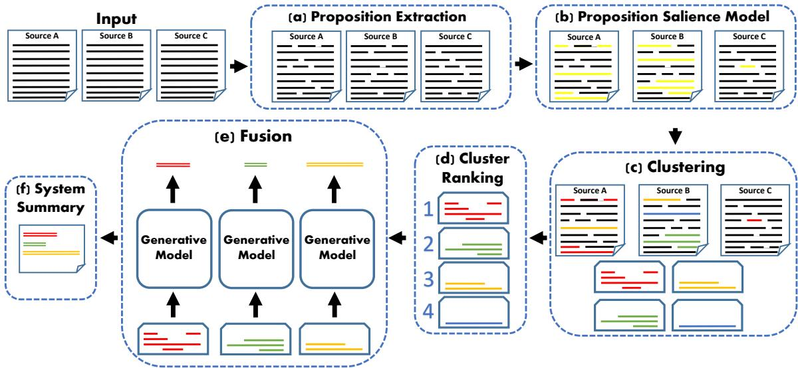
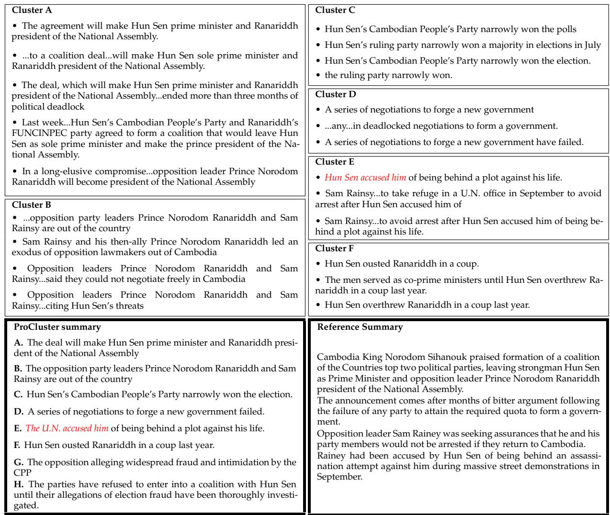
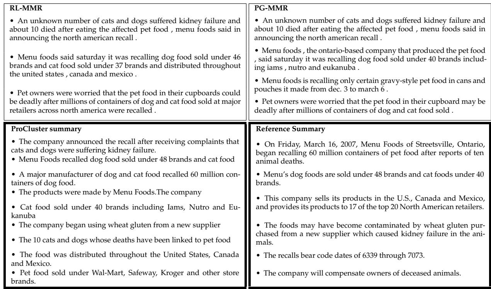
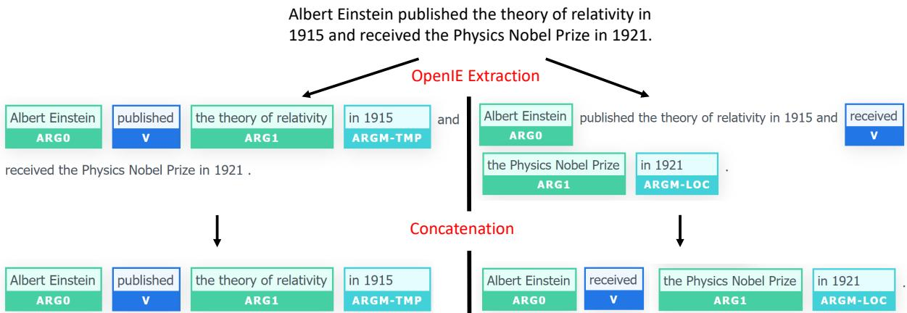

# Proposition-Level Clustering for Multi-Document Summarization

Ori Ernst1, Avi Caciularu1∗, Ori Shapira1∗, Ramakanth Pasunuru2, Mohit Bansal2, Jacob Goldberger1, and Ido Dagan1

1Bar-Ilan University 2UNC Chapel Hill {oriern, avi.c33, obspp18}@gmail.com {ram, mbansal}@cs.unc.edu {jacob.goldberger@, dagan@cs.}biu.ac.il

## Abstract

Text clustering methods were traditionally incorporated into multi-document summarization (MDS) as a means for coping with considerable information repetition. Particularly, clusters were leveraged to indicate information saliency as well as to avoid redundancy. Such prior methods focused on clustering sentences, even though closely related sentences usually contain also non-aligned parts. In this work, we revisit the clustering approach, grouping together sub-sentential propositions, aiming at more precise information alignment. Specifically, our method detects salient propositions, clusters them into paraphrastic clusters, and generates a representative sentence for each cluster via text fusion. Our summarization method improves over the previous state-ofthe-art MDS method in the DUC 2004 and TAC 2011 datasets, both in automatic ROUGE scores and human preference.1

## 1 Introduction

Common information needs are most often satisfied by multiple texts rather than by a single one. Accordingly, there is a rising interest in Multi-Document Summarization (MDS) — generating a summary for a set of topically-related documents. Inherently, MDS needs to address, either explicitly or implicitly, several subtasks embedded in this summarization setting. These include salience detection, redundancy removal, and text generation. While all these subtasks are embedded in Single-Document Summarization (SDS) as well, the challenges are much greater in the multi-document setting, where information is heterogeneous and dispersed, while exhibiting substantial redundancy across linguistically divergent utterances.

An appealing summarization approach that copes with these challenges, and is especially rele-

But the man, Rabei Osman Sayed Ahmed - expected to be the first of 29 defendants to take the stand when the bombing trial begins Thursday in Madrid - also said in the recordings that the attack was carried out according to his plan.

The trial opened Thursday of 29 mostly Moroccan suspects charged with involvement in the 2004 Madrid train bomb attacks, which killed 191 people and injured 1,824 in the worst terror strike to hit Spain. Of the 29 people who go on trial Thursday for the March 2004 Madrid train bombings, seven face some 40,000 years in jail if found guilty.

Figure 1: An example of a cluster of propositions, shown within their source sentence context, from TAC 2011 (topic D1103). Clustering these as sentences would yield noisy unaligned information, however grouping together only the marked propositions keeps information alignment clean. The first sentence is illustratively divided into propositions, where only one of them is aligned to those in the other sentences.

vant for MDS, is clustering-based summarization. In such an approach, the goal is to cluster redundant paraphrastic pieces of information across the texts, which roughly convey the same meaning. Repetition of information across texts, as captured by paraphrastic clustering, typically indicates its importance, and can be leveraged for salience detection. Moreover, representing a paraphrastic cluster may facilitate generating a corresponding summary that eliminates repetitions while fusing together complementary details within the cluster.

Traditionally, clustering-based approaches were widely used for summarization, mostly in extractive and unsupervised settings (Radev et al., 2004; Zhang et al., 2015; Nayeem et al., 2018). Notably, most of these works generated sentence-based clusters, which tend to be noisy since a sentence typically consists of several units of information that only partially overlap with other cluster sentences. As a result, such clusters often capture topically related sentences rather than paraphrases. Figure 1 exemplifies such a noisy cluster, which does contain paraphrastic propositions (marked in blue) within their full sentences (marked in black). Another line of research in summarization coped with such noisy sentence-based setting, and looked into the use of sub-sentential units for summarization, e.g., Li et al. (2016) summarizes with Elementary Discourse Units (EDUs), while Ernst et al. (2021) endorse using Open Information Extraction (OpenIE) -based propositions (Stanovsky et al., 2018) for summarization.

In this paper, we revisit and combine the clustering-based approaches along with subsentential setting, two research lines that were explored only individually and rather scarcely in recent years. Specifically, we apply clustering-based summarization at the more fine-grained propositional level, which avoids grouping non-aligned texts, yielding accurate paraphrastic clusters. These clusters also provide better control over the generated summary sentences – as the generation component is only required to fuse similar propositions.

Our model (§3) leverages gold reference summaries to derive training datasets for several summarization sub-tasks. First, salient document propositions were extracted, to train a salience model, by greedily maximizing alignment with the reference summaries. Then, an available proposition similarity model, trained from summarysource alignments (Ernst et al., 2021), provides the basis for agglomerative clustering (Ward, 1963). Finally, we created training data for a BART-based model for sentence fusion (Lewis et al., 2020) by aligning reference summary propositions with source proposition clusters. Similar to many other works, we leave inter-sentence coherence and sentence planning and ordering outside the scope of the current paper. Accordingly, our process produces a bullet-style summary of individual concise and coherent sentences.

Overall, our experiments (§4) show that this multi-step model outperforms strong recent end-toend solutions, which do not include explicit modeling of propositions and information redundancy. To the best of our knowledge, our approach achieves state-of-the-art results in our setting on the DUC 2004 and TAC 2011 datasets, with an improvement of more than 1.5 and 4 ROUGE-1 F1 points respectively, over the previous best approach. Finally, we also suggest (§5) that clustering-based methods provide “explanations", or supporting evidence, for each generated sentence, in the form of the source cluster propositions (see an example in Table 1).

## 2 Background and Related Work

Clustering-based summarization. Clusteringbased summarization approaches typically involve salience detection while avoiding redundancy. One such approach clustered topically-related sentences, after which cluster properties were leveraged for rating sentence salience (Radev et al., 2004; Wang et al., 2008; Wan and Yang, 2008). Another approach rated sentence salience and clustered sentences simultaneously, iteratively improving the two objectives (Cai et al., 2010; Wang et al., 2011; Cai and Li, 2013; Zhang et al., 2015). Recently, however, clustering methods have been gradually marginalized out, being replaced by neural techniques. More recently though, some approaches (Nayeem et al., 2018; Fuad et al., 2019) presented abstractive clustering-based summarization, where topically-related sentences in each cluster are fused together to generate a summary sentence candidate. While most of previous clustering approaches operated at the noisy sentence level, in our work we present more accurate proposition-level clustering that eventually enhances summarization.

Sub-sentence units in summarization. While many summarization approaches extract full document sentences, either for extractive summarization or as an intermediate step for abstractive summarization, there are methods that operated the sub-sentential level. Li et al. (2016); Liu and Chen (2019); and Xu et al. (2020) produced extractive summaries consisting of Elementary Discourse Units (EDUs) – clauses comprising a discourse unit according to Rhetorical Structure Theory (RST) (Mann and Thompson, 1988). Such extractive approaches usually focus on content selection, possibly disregarding the inferior coherence arising from the concatenation of sub-sentence units. Accordingly, Arumae et al. (2019) established the highlighting task, where salient sub-sentence units are marked within their document to provide surrounding context. Recently, Cho et al. (2020) proposed identifying heuristically self-contained subsentence units for the highlighting task.

Abstractive approaches have been extracting subsentence units as a preliminary step for generation. Such units range from words (Lebanoff et al., 2020; Gehrmann et al., 2018), to noun or verb phrases (Bing et al., 2015), to OpenIE propositions (Pasunuru et al., 2021). In our work, we follow the same extract-then-generate pipeline, using OpenIEs (Stanovsky et al., 2018) as propositions. Since propositions are meant to contain single standalone facts consisting of a main predicate and its arguments, they are beneficial for grouping mostly overlapping paraphrases (unlike sentential paraphrases). In addition, propositions extracted with OpenIE can be noncontiguous, while alternative options, like EDUs, are limited to contiguous sequences.

  
Figure 2: Our multi-document summarization process. (a) All propositions are extracted (OpenIE; Stanovsky et al., 2018) from the documents. (b) Propositions are classified by a salience score (fine-tuned CDLM; Caciularu et al., 2021). (c) Salient propositions are clustered (fine-tuned SuperPAL; Ernst et al., 2021), forming groups of paraphrastic information units. (d) Clusters are ranked, as an indicator for information importance. (e) For each cluster, its propositions are fused (fine-tuned BART; Lewis et al., 2020) to generate a concise and coherent abstractive sentence. (f) The output summary is obtained as a bullet-style ranked list of the concise sentences.

## 3 Method

This section first provides an overview of our method, followed by subsections describing its components. We follow previous clustering-based approaches, where text segments are first clustered into semantically similar groups, exploiting redundancy as a salience signal. Then, each group is fused to generate a merged sentence, while avoiding redundancy. As we operate at the propositionlevel, we first extract all propositions from the input documents (§3.1). Then, to facilitate the clustering step, we filter out non-salient propositions using a salience model (§3.2). Next, salient propositions are clustered based on their semantic similarity (§3.3). The largest clusters, whose information was most repeated, are selected to be included in the summary (§3.4). Finally, each cluster is fused to form a sentence for a bullet-style abstractive summary (§3.5). In addition, we provide an extractive version where a representative (source) proposition is selected from each cluster (3.6). Overall, clustering explicit propositions induces a multi-step process that requires dedicated training data for certain steps. To that end, we derive new training datasets for the salience detection and the fusion models from the original gold summaries. The full pipeline is illustrated in Figure 2, where additional implementation details are in §B in the Appendix.

## 3.1 Proposition Extraction

Aiming to generate proposition-based summaries, we first extract all propositions from the source documents using Open Information Extraction (OpenIE) (Stanovsky et al., 2018)2, following Ernst et al. (2021). To convert an OpenIE tuple containing a predicate and its arguments into a proposition string, we simply concatenate them by their original order, as illustrated in Figure 3 in the Appendix.

## 3.2 Proposition Salience Model

To facilitate the clustering stage, we first aim to filter non-salient propositions by a supervised model. To that end, we derive gold labels for proposition salience from the existing reference summaries. Specifically, we select greedily propositions that maximize $\mathrm { R O U G E  – 1 } _ { \mathrm { F - 1 } } + \mathrm { R O U G E } { - 2 } _ { \mathrm { F - 1 } }$ against their reference summaries (Nallapati et al., 2017; Liu and Lapata, 2019) and marked them as salient.

  
Table 1: The proposition clusters and system and reference summaries for DUC 2004, topic D30001. Each summary sentence (lower left box) was fused from its corresponding cluster (top boxes) that also provides supporting source evidence. An example of an unfaithful abstraction is marked in red.

Using this derived training data, we fine-tuned the Cross-Document Language Model (CDLM) (Caciularu et al., 2021) as a binary classifier for predicting whether a proposition is salient or not. Propositions with a salience score below a certain threshold were filtered out. The threshold was optimized with the full pipeline against the final ROUGE score on the validation set. All propositions contained in the clusters in Table 1 are examples of predicted salient propositions. We chose to use CDLM as it was pretrained with sets of related documents, and was hence shown to operate well over several downstream tasks in the multidocument setting (e.g., cross-document coreference resolution and multi-document classification).

## 3.3 Clustering

Next, all salient propositions are clustered to semanticly similar groups. Clusters of paraphrastic propositions are advantageous for summarization as they can assist in avoiding redundant information in an output summary. Furthermore, paraphrastic clustering offers redundancy as an additional indicator for saliency, while the former salience model (§3.2) does not utilize repetitions explicitly. To cluster propositions we utilize SuperPAL (Ernst et al., 2021), a binary classifier that measures paraphrastic similarity between two propositions. All pairs of salient propositions are scored with Super-PAL, over which standard agglomerative clustering (Ward, 1963) is applied. Examples of generated clusters are presented in Table 1.

## 3.4 Cluster Ranking

The resulting proposition clusters are next ranked according to cluster-based properties. We examined various features, listed in Table 2, on our validation sets. The features examined include: average of ROUGE scores between all propositions in a cluster (‘Avg. ROUGE’), average of SuperPAL scores between all propositions in a cluster (‘Avg. SuperPAL’), average of the salience model scores of cluster propositions (‘Avg. salience’), minimal position (in a document) of cluster propositions (‘Min. position’), and cluster size (‘Cluster size’).

For each feature, (1) clusters were ranked according to the feature, (2) the proposition with the highest salience model score (§3.2) was selected from each cluster as a cluster representative, (3) the representatives from the highest ranked clusters were concatenated to obtain a system summary. We also measured combinations of two features (‘Cluster size + Min. position’ for example), where the first feature is used for primary ranking, and the second feature is used for secondary ranking in case of a tie. In all options, if a tie is still remained, further ranking between clusters is resolved according to the maximal proposition salience score of each cluster. The resulting ROUGE scores of these summaries on validation sets are presented in Table 2.3 We found that ‘Cluster size’ yields the best ROUGE scores as a single feature, and ‘Min. position’ further improves results as a secondary tie breaking ranking feature. Intuitively, a large cluster represents redundancy of information across documents thus likely to indicate higher importance.

## 3.5 Cluster Fusion

Next, we would like to merge the paraphrastic propositions in each cluster, while consolidating complementary details, to generate a new coherent summary sentence. As mentioned, this approach helps avoiding redundancy, since redundant information is concentrated separately in each cluster.

To train a cluster fusion model, we derived training data automatically from the reference summaries, by leveraging the SuperPAL model (Ernst et al., 2021) (which was also employed in §3.3). This time, the model is used for measuring the similarity between each of the cluster propositions (that were extracted from the documents) and each of the propositions extracted from the reference summaries. The reference summary proposition with the highest average similarity score to all cluster propositions was selected as the aligned summary proposition of the cluster. This summary proposition was used as the target output for training the generation model. Although these target OpenIE propositions may be ungrammatical or non-fluent, a human examination has shown that BART tends to produce full coherent sentences (mostly containing only a single proposition), even though it was finetuned over OpenIE extractions as target. Examples of coherent generated sentences can be seen in Table 1.

<table><tr><td rowspan="2">Cluster Feature</td><td colspan="2">DUC 2004</td><td colspan="2">TAC 2011</td></tr><tr><td>R1</td><td>R2</td><td>R1</td><td>R2</td></tr><tr><td>Avg. ROUGE</td><td>35.9</td><td>7.48</td><td>38.14</td><td>9.93</td></tr><tr><td>Avg. salience</td><td>35.5</td><td>7.98</td><td>41.18</td><td>12.55</td></tr><tr><td>Min. position</td><td>37.25</td><td>8.89</td><td>38.86</td><td>11.37</td></tr><tr><td>Avg. SuperPAL</td><td>37.41</td><td>8.90</td><td>41.22</td><td>12.59</td></tr><tr><td>Cluster size</td><td>37.58</td><td>9.01</td><td>41.35</td><td>12.49</td></tr><tr><td>Cluster size + Avg. SuperPAL</td><td>37.54</td><td>8.96</td><td>41.45</td><td>12.71</td></tr><tr><td>Cluster size + Avg. salience</td><td>37.77</td><td>9.09</td><td>41.44</td><td>12.62</td></tr><tr><td>Cluster size + Min. position</td><td>38.05</td><td>9.21</td><td>41.68</td><td>12.78</td></tr></table>

Table 2: ROUGE F1 results on validation sets when ranking clusters according to differing features (DUC 2004 is the validation set of TAC 2011 and vice versa). Two combined features means ranking on the first feature, and breaking ties with the second feature.

Accordingly, we fine-tuned a BART generation model (Lewis et al., 2020) with this dedicated training data. As input, the model receives cluster propositions, ordered by their predicted salience score (§3.2) and separated with special tokens. The final bullet-style summary is produced by appending generated sentences from the ranked clusters until the desired word-limit is reached.

## 3.6 Extractive Summarization Version

To support extractive summarization settings, for example when hallucination is forbidden, we created a corresponding extractive version of our method. In this version, we extracted a representative proposition for each cluster, which was chosen according to the highest word overlap with the sentence that was fused from this cluster by our abstractive version.

## 4 Evaluation

## 4.1 Experimental Setup

Datasets. We train and test our summarizer with the challenging DUC and TAC MDS benchmarks.

<table><tr><td rowspan=2 colspan=1>Method</td><td rowspan=1 colspan=3>TAC 2011</td><td rowspan=1 colspan=3>DUC 2004</td></tr><tr><td rowspan=1 colspan=1>R1</td><td rowspan=1 colspan=1>R2</td><td rowspan=1 colspan=1>RSU4</td><td rowspan=1 colspan=1>R1</td><td rowspan=1 colspan=1>R2</td><td rowspan=1 colspan=1>RSU4</td></tr><tr><td rowspan=7 colspan=1>Opinosis (Ganesan et al., 2010)Extract+Rewrite (Song et al., 2018)adbsactve PG (See et al., 2017) $\mathrm { H i { - } M A P ^ { 4 } \ ( F a b b r i \ e t \ a l . , 2 0 1 9 ) }$  $\mathrm { P G } \mathrm { { \mathrm { - } M M R } } \ \mathrm { ( L e b a n o f f \ e t { \ a l . } , 2 0 1 8 ) }$  $\mathrm { M D S - J o i n t - S D S ^ { 4 } }$ (Jin and Wan, 2020) $\mathrm { P r o C l u s t e r _ { a b s } \left( O u r s \right) }$ </td><td rowspan=1 colspan=1>25.15</td><td rowspan=1 colspan=1>5.12</td><td rowspan=1 colspan=1>8.12</td><td rowspan=1 colspan=1>27.07</td><td rowspan=1 colspan=1>5.03</td><td rowspan=1 colspan=1>8.63</td></tr><tr><td rowspan=1 colspan=1>29.07</td><td rowspan=1 colspan=1>6.11</td><td rowspan=1 colspan=1>9.20</td><td rowspan=1 colspan=1>28.9</td><td rowspan=1 colspan=1>5.33</td><td rowspan=1 colspan=1>8.76</td></tr><tr><td rowspan=5 colspan=1>31.4437.1741.45</td><td rowspan=1 colspan=1>6.40</td><td rowspan=1 colspan=1>10.20</td><td rowspan=1 colspan=1>31.43</td><td rowspan=1 colspan=1>6.03</td><td rowspan=1 colspan=1>10.01</td></tr><tr><td rowspan=4 colspan=1>10.7212.75</td><td rowspan=1 colspan=1></td><td rowspan=1 colspan=1>35.78</td><td rowspan=1 colspan=1>8.90</td><td rowspan=1 colspan=1>11.43</td></tr><tr><td rowspan=1 colspan=1>14.16</td><td rowspan=1 colspan=1>36.88</td><td rowspan=2 colspan=1>8.738.60</td><td rowspan=1 colspan=1>12.64</td></tr><tr><td rowspan=1 colspan=1></td><td rowspan=1 colspan=1>37.24</td><td rowspan=1 colspan=1>12.67</td></tr><tr><td rowspan=1 colspan=1>16.16</td><td rowspan=1 colspan=1>38.71</td><td rowspan=1 colspan=1>9.62</td></tr><tr><td rowspan=8 colspan=1>SumBasic (Vanderwende et al., 2007)KLSumm (Haghighi and Vanderwende, 2009)excactve LexRank (Erkan and Radev, 2004)HL $\cdot \mathrm { X L N e t S e g s } ^ { 5 } \left( \mathrm { C h o e t a l } . , 2 0 2 0 \right)$  $\mathrm { H L - T r e e S e g s } ^ { 5 } \left( \mathrm { C h o e t a l . } , 2 0 2 0 \right)$ DPP $- \mathrm { C a p s - C o m b ^ { 5 } \ ( C h o \ e t \ a l . , 2 0 1 9 ) }$  $\mathrm { R L - M M R \ ( M a o \ e t \ a l . , 2 0 2 0 ) }$  $\mathrm { P r o C l u s t e r } _ { \mathrm { e x t } } \left( \mathrm { O u r s } \right)$ </td><td rowspan=2 colspan=1>31.5831.23</td><td rowspan=1 colspan=1>6.06</td><td rowspan=1 colspan=1>10.06</td><td rowspan=1 colspan=1>29.48</td><td rowspan=1 colspan=1>4.25</td><td rowspan=1 colspan=1>8.64</td></tr><tr><td rowspan=1 colspan=1>7.07</td><td rowspan=1 colspan=1>10.56</td><td rowspan=1 colspan=1>31.04</td><td rowspan=1 colspan=1>6.03</td><td rowspan=1 colspan=1>10.23</td></tr><tr><td rowspan=3 colspan=1>33.1037.3236.70</td><td rowspan=1 colspan=1>7.50</td><td rowspan=1 colspan=1>11.13</td><td rowspan=1 colspan=1>34.44</td><td rowspan=1 colspan=1>7.11</td><td rowspan=1 colspan=1>11.19</td></tr><tr><td rowspan=2 colspan=1>10.249.68</td><td rowspan=2 colspan=1>13.5413.14</td><td rowspan=1 colspan=1>36.73</td><td rowspan=1 colspan=1>9.10</td><td rowspan=1 colspan=1>12.63</td></tr><tr><td rowspan=1 colspan=1>38.29</td><td rowspan=1 colspan=1>10.04</td><td rowspan=1 colspan=1>13.57</td></tr><tr><td rowspan=1 colspan=1>38.14</td><td rowspan=1 colspan=1>11.18</td><td rowspan=1 colspan=1>14.41</td><td rowspan=1 colspan=1>38.26</td><td rowspan=1 colspan=1>9.76</td><td rowspan=1 colspan=1>13.64</td></tr><tr><td rowspan=2 colspan=1>39.6540.98</td><td rowspan=1 colspan=1>11.44</td><td rowspan=1 colspan=1>15.02</td><td rowspan=1 colspan=1>38.56</td><td rowspan=1 colspan=1>10.02</td><td rowspan=1 colspan=1>13.80</td></tr><tr><td rowspan=1 colspan=1>12.40</td><td rowspan=1 colspan=1>15.77</td><td rowspan=1 colspan=1>38.73</td><td rowspan=1 colspan=1>9.64</td><td rowspan=1 colspan=1>13.89</td></tr><tr><td rowspan=1 colspan=1> ${ \mathrm { O r a c l e } } _ { \mathrm { p r o p } }$ </td><td rowspan=1 colspan=1>49.65</td><td rowspan=1 colspan=1>21.82</td><td rowspan=1 colspan=1>23.19</td><td rowspan=1 colspan=1>46.49</td><td rowspan=1 colspan=1>16.16</td><td rowspan=1 colspan=1>18.76</td></tr></table>

Table 3: Automatic ROUGE F1 evaluation scores on the TAC 2011 & DUC 2004 MDS test sets. Our solutions (ProCluster) improve over the previous state-of-the-art methods both in the abstractive and extractive settings. Notably, our abstractive approach also surpasses the best extractive ones.

Specifically, following standard convention (Mao et al., 2020; Cho et al., 2019), we test on DUC 2004 using DUC 2003 for training, and on TAC 2011 using TAC 2008/2009/2010 for training. These sets contain between 30 and 50 topics each. For validation sets, we used DUC 2004 for the TAC benchmark and TAC 2011 for the DUC benchmark.

Automatic evaluation metric. Following common practice, we evaluate and compare our summarization system with ROUGE-1/2/SU4 F1 measures (Lin, 2004). Stopwords are not removed, and the output summary is limited to 100 words.6 7

## 4.2 Automatic Evaluation

As seen in Table 3, our abstractive model, denoted $\mathrm { P r o C l u s t e r _ { a b s } }$ for Propositional Clustering, surpasses all abstractive baselines by a large margin in all measures on both TAC 2011 and DUC 2004. Moreover, while the abstractive system scores were typically inferior to extractive system scores, $\mathrm { P r o C l u s t e r _ { a b s } }$ notably outperforms all extractive baselines in both benchmarks. Overall, our $\mathrm { P r o C l u s t e r _ { a b s } }$ provides the new abstractive MDS state-of-the-art score in this setting. In Figure 4 we present an example of a $\mathrm { P r o C l u s t e r _ { a b s } }$ system summary along with previous abstractive and extractive state-of-the-art system summaries and the reference summary.

As said in §3.6, we also developed an extractive version, denoted ProClusterext. As ProClusterext selects document propositions that have the highest overlap with $\mathrm { P r o C l u s t e r _ { a b s } }$ sentences, $\mathrm { P r o C l u s t e r } _ { \mathrm { e x t } }$ achieves similar scores to ${ \mathrm { P r o C l u s t e r } } _ { \mathrm { a b s } } ,$ yielding the new extractive MDS state-of-the-art results.

For comparison we selected strong baselines, including previous state-of-the-art in this setup, in both the extractive and abstractive settings. See in Appendix §C for more concise details over each baseline. For reference, we also present a proposition-based extractive upperbound for each dataset $( O r a c l e _ { p r o p } )$ , where document propositions were selected greedily to maximize $\mathrm { R O U G E - } 1 _ { \mathrm { F - 1 } }$ $+ \mathrm { R O U G E } – 2 _ { \mathrm { F } - 1 }$ with respect to the reference summaries.

## 4.3 Ablation Analysis

To better apprehend the contribution of each of the steps in our pipeline, Table 5 presents results of the system when applying partial pipelines.

First, $S a l i e n c e _ { p r o p }$ generates summaries simply consisting of the highest scoring document propositions, according to the CDLM-based salience model (§3.2). We also trained the salience model on the sentence- rather than the proposition-level, and similarly generated summaries of salient sentences, denoted $S a l i e n c e _ { s e n t }$ The notable improvement of $S a l i e n c e _ { p r o p }$ over $S a l i e n c e _ { s e n t }$ in both datasets reveals the advantage of working at the proposition level for exposing salient information. This observation is also apparent when comparing the proposition-based oracle $( O r a c l e _ { p r o p } )$ to the sentence-based oracle method $( O r a c l e _ { s e n t } )$ . The results indicate that proposition-based systems have a higher ROUGE upperbound across the board, supporting its merit for use in summarization.

  
Table 4: The system summaries and reference summary of topic D1104 in TAC 2011.

Next, we would like to assess the contribution of the clustering step. Therefore, we applied $\mathbf { S a l i e n c e _ { p r o p } }$ followed by clustering and ranking of clusters (Sections 3.2, 3.3 and 3.4), while leaving the fusion step aside. From each cluster we then select the proposition with the highest salience score to be in the system summary. In both datasets, the clustering stage provides added improvement, suggesting its contribution to our pipeline.

To further demonstrate the potential of our approach, we also present two additional oracle scores for extractive upperbound analysis. First, we examine the potential of optimally selecting cluster representatives for the summary. We greedily select a single representative per cluster following the original cluster ranking (§3.4) that optimizes the overall ROUGE- $1 _ { \mathrm { F - 1 } } + \mathrm { R O U G E } { - 2 _ { \mathrm { F - 1 } } }$ score of all selected representatives with respect to the reference summaries $( O r a c l e _ { c l u s t e r - r e p } )$ . These results express the improvement comparing to our final model $( P r o C l u s t e r _ { a b s } )$ , that a better cluster representative choice could produce, i.e., up to \~2 R-2 points in TAC 2011 and \~1 point in DUC 2004.

Another aspect to examine is the potential of enhanced cluster ranking. To that end, we first selected the highest salience-scoring proposition as a representative from each cluster. Then, we greedily selected representatives, one at a time, that maximized the overall $\mathrm { R O U G E  – 1 } _ { \mathrm { F - 1 } } + \mathrm { R O U G E } .$ 2F-1 against the reference summaries. Effectively, this points to a greedily optimized cluster choice $( O r a c l e _ { r a n k i n g } )$ . The potential improvement of better cluster ranking compared to our final model $( P r o C l u s t e r _ { a b s } )$ is hence up to \~5 R-2 points in TAC 2011 and \~3 points in DUC 2004. Indeed, our approach leaves cluster ranking improvement to future work.

Overall, we observe that all components of our multi-step approach are indeed effective for MDS, and that there is a great potential for further improvements within this architecture.

## 4.4 Human Evaluation

We further assessed our primary system, $\mathrm { P r o C l u s t e r _ { a b s } }$ through manual comparison against PG-MMR and RL-MMR, which are state-of-the-art MDS systems in the abstractive and extractive settings (respectively). Crowdworkers on Amazon Mechanical Turk8 were shown the summaries for a given topic from the three systems in arbitrary order, along with a corresponding reference summary. They were asked to rank the systems with respect to Content (content overlap with the reference), Readability (the degree to which a summary is readable and well-understood), Grammaticality (avoiding grammar errors), and Non-Redundancy (avoiding information repetition). Focusing on evaluating our system, we extract from this ranking a pairwise comparison between our $\mathrm { P r o C l u s t e r _ { a b s } }$ and each of the two baseline systems, separately. For each topic, this procedure was repeated for each of the four available reference summaries. Each such evaluation instance was judged independently by three workers, taking their majority vote for each pairwise comparison.

<table><tr><td rowspan=1 colspan=1></td><td rowspan=1 colspan=1>method</td><td rowspan=1 colspan=1>R1</td><td rowspan=1 colspan=1>R2</td><td rowspan=1 colspan=1>RSU4</td></tr><tr><td rowspan=3 colspan=1></td><td rowspan=3 colspan=1> $\mathrm { O r a c l e } _ { \mathrm { s e n t } }$  $\mathrm { O r a c l e } _ { \mathrm { p r o p } }$  $\mathrm { O r a c l e } _ { \mathrm { c l u s t e r - r e p } }$  $\mathrm { O r a c l e } _ { \mathrm { r a n k i n g } }$ </td><td rowspan=1 colspan=1>47.53</td><td rowspan=1 colspan=1>19.83</td><td rowspan=1 colspan=1>22.10</td></tr><tr><td rowspan=2 colspan=1>49.6543.4046.38</td><td rowspan=1 colspan=1>21.82</td><td rowspan=1 colspan=1>23.19</td></tr><tr><td rowspan=1 colspan=1>14.6117.59</td><td rowspan=1 colspan=1>17.4619.88</td></tr><tr><td rowspan=2 colspan=1></td><td rowspan=2 colspan=1> $\mathrm { S a l i e n c e } _ { \mathrm { s e n t } }$  $\mathbf { S a l i e n c e } _ { \mathrm { p r o p } }$  $\mathrm { S a l i e n c e } _ { \mathrm { p r o p } } + \mathrm { C l u s t e r i n g }$  $\mathrm { P r o C l u s t e r _ { a b s } }$ </td><td rowspan=1 colspan=1>37.32</td><td rowspan=1 colspan=1>9.59</td><td rowspan=1 colspan=1>13.40</td></tr><tr><td rowspan=1 colspan=1>39.9241.0541.45</td><td rowspan=1 colspan=1>11.5312.4012.75</td><td rowspan=1 colspan=1>15.1215.7316.16</td></tr><tr><td rowspan=3 colspan=1></td><td rowspan=3 colspan=1> $\mathrm { O r a c l e } _ { \mathrm { s e n t } }$  $\mathrm { O r a c l e } _ { \mathrm { p r o p } }$  $\mathrm { O r a c l e } _ { \mathrm { c l u s t e r - r e p } }$  $\mathrm { O r a c l e } _ { \mathrm { r a n k i n g } }$ </td><td rowspan=2 colspan=1>43.9146.49</td><td rowspan=1 colspan=1>14.50</td><td rowspan=1 colspan=1>17.39</td></tr><tr><td rowspan=1 colspan=1>16.16</td><td rowspan=1 colspan=1>18.76</td></tr><tr><td rowspan=1 colspan=1>39.7443.70</td><td rowspan=1 colspan=1>10.7612.92</td><td rowspan=1 colspan=1>14.5616.43</td></tr><tr><td rowspan=1 colspan=1></td><td rowspan=1 colspan=1> $\mathrm { S a l i e n c e } _ { \mathrm { s e n t } }$  $\mathbf { S a l i e n c e } _ { \mathrm { p r o p } }$  $\mathrm { S a l i e n c e } _ { \mathrm { p r o p } } + \mathrm { C l u s t e r i n g }$  $\mathrm { P r o C l u s t e r _ { a b s } }$ </td><td rowspan=1 colspan=1>37.3837.7338.4138.71</td><td rowspan=1 colspan=1>9.098.979.099.62</td><td rowspan=1 colspan=1>12.9013.1813.5614.07</td></tr></table>

Table 5: Ablation ROUGE F1 scores on TAC 2011 and DUC 2004. Each additional step in our multi-step method improves the output summaries. The Oracle results indicate the potential of our approach. Specifically, the benefit of summarizing on the proposition level is quite evident.

Table 6 presents the results of these pairwise comparisons, showing the percentage of cases in which our system was preferred over each one of the two baselines, under each of the four evaluation criteria. As can be seen, our system was favored in all cases, for both datasets. Furthermore, preference is almost always by a large margin, except for Non-Redundancy against RL-MMR, which avoids redundancy at a similar success level. Notably, as our clustering-based method is focused on improving content selection, the large gap in favor of $\mathrm { P r o C l u s t e r _ { a b s } }$ in the content criterion supports its advantage, consistently with our ROUGE-score advantage in the automatic evaluation (§4.2).

<table><tr><td></td><td>method</td><td>Content</td><td>Read.</td><td>Grammar</td><td>Non-Red.</td></tr><tr><td>TAC</td><td>PG-MMR RL-MMR</td><td>93% 82%</td><td>84% 70%</td><td>81% 74%</td><td>72% 52%</td></tr><tr><td>DUC</td><td>PG-MMR RL-MMR</td><td>81% 70%</td><td>83% 72%</td><td>82% 71%</td><td>76% 54%</td></tr></table>

Table 6: Human pairwise comparisons between $\mathrm { P r o C l u s t e r _ { a b s } }$ and each of the two prior baseline systems, over the TAC 2011 and DUC 2004 datasets. The cells in a row show the percentage of cases in which our system was preferred over the corresponding baseline, under each of the four evaluation criteria: content, readability, grammaticality and non-redundancy.

<table><tr><td rowspan=1 colspan=1></td><td rowspan=1 colspan=1>System</td><td rowspan=1 colspan=1>unigram</td><td rowspan=1 colspan=1>bigram</td><td rowspan=1 colspan=1>trigram</td><td rowspan=1 colspan=1>sent.</td></tr><tr><td rowspan=2 colspan=1>TAC</td><td rowspan=2 colspan=1>PG-MMR $\mathrm { P r o C l u s t e r _ { a b s } }$ Ref. Summs.</td><td rowspan=2 colspan=1>98.3699.0890.27</td><td rowspan=1 colspan=1>94.42</td><td rowspan=1 colspan=1>91.97</td><td rowspan=2 colspan=1>50.1124.391.48</td></tr><tr><td rowspan=1 colspan=1>91.4053.17</td><td rowspan=1 colspan=1>81.0729.66</td></tr><tr><td rowspan=2 colspan=1>DUC</td><td rowspan=2 colspan=1>PG-MMR $\mathrm { P r o C l u s t e r _ { a b s } }$ Ref. Summs.</td><td rowspan=2 colspan=1>98.3498.8688.41</td><td rowspan=1 colspan=1>94.99</td><td rowspan=2 colspan=1>90.9178.2818.65</td><td rowspan=2 colspan=1>50.8223.500.13</td></tr><tr><td rowspan=1 colspan=1>89.7244.27</td></tr></table>

Table 7: Percentage of n-gram/sentence overlap between summaries and source documents in TAC 2011 and DUC 2004. Compared to PG-MMR, our system has substantially less sequential overlap, indicating its increased abstractiveness. Reference summaries are naturally highly abstractive.

While our summaries are (somewhat nonconventionally) structured as bullet-style lists of propositions rather than a coherent paragraph, evaluators preferred our style of summarization in terms of readability. Moreover, as Table 7 points out, ProClusterabs appears to be more abstractive than PG-MMR, as suggested by the reduced ngram and sentence overlap with source documents. Specifically, about half of the system summary sentences of PG-MMR are fully copied, compared to about a quarter in our method. While the intensified abstractiveness of our summaries could have potentially hindered readability, our system was nevertheless preferred along this aspect as well.

Our approach leaves fertile ground for further improving readability by fusing several clusters together to generate sentences containing multiple propositions, and by developing sentence planning and ordering models. Compatible training datasets for these models can be derived out of the gold reference summaries, as was done in this work for the salience (§3.2) and fusion (§3.5) models.

## 5 Paraphrastic Clusters as Summary Evidence

A unique advantage of a cluster-based summary is that each summary sentence is linked explicitly to a group of propositions from which the sentence was generated, in so providing an “explanation”, or support evidence, for the output. These cluster explanations can expand the reader’s knowledge and provide complementary facts from the nearby source context regarding the information from the generated sentence. Such a feature may be incorporated in interactive summarization systems, as applied in (Shapira et al., 2017), where a user can choose to expand on the facts within a sentence of the presented summary.

To assess the reliability of such feature, we verified that clusters indeed “explain” their generated sentences. To that end, we conducted a crowdsourced annotation, where a worker marked whether a cluster proposition mentions the main idea of its corresponding generated sentence. Each pair was examined by three workers, with the majority vote used for the final decision. On a random selection of 25% of the clusters, we found that, on average, 89% and 84% of a cluster’s propositions in DUC 2004 and TAC 2011 support their corresponding generated sentence, with an average cluster size of 3.4 and 4.8 propositions, respectively.

Furthermore, given this strong alignment of a cluster to its generated sentence, a cluster facilitates effective verification of faithfulness of its corresponding generated abstractive sentence. Since the output sentence is based solely on its cluster propositions, the sentence’s correctness can be verified against the “explaining" cluster instead of against the full document set. An example of an unfaithful abstraction is marked in red in Table 1. To the best of our knowledge, this is the first attempt for efficient manual assessment of faithfulness in MDS. We conducted a respective evaluation process, through crowdsourcing, to assess the faithfulness of our system summaries. A worker saw a cluster and its generated sentence and marked whether the sentence was faithful to its origin cluster or not. Overall, this task cost a reasonable price of 240\$ for both the DUC 2004 and TAC 2011 datasets together. Over the full test sets, the annotations showed that 80% and 90% of the DUC 2004 and TAC 2011 summary sentences, respectively, were faithful to their corresponding clusters.

## 6 Conclusion

We advocate the potential of proposition-level units as a cleaner and more accurate unit for summarization. To that end, we present a new propositionlevel pipeline for summarization that includes an accurate paraphrastic propositional clustering component followed by fusion of cluster propositions, to generate concise and coherent summary sentences. Our proposed method outperforms state-ofthe-art baselines in both automatic and human evaluation on the DUC and TAC MDS benchmarks. We provide an ablation study that indicates the benefit of each of the pipeline steps, as well as the potential for future improvement. Moreover, we demonstrate the utility of the clustering-based approach for providing source documents explanations and for manually validating summary faithfulness.

## Acknowledgments

The work described herein was supported in part by the PBC fellowship for outstanding PhD candidates in data science, Intel Labs, the Israel Science Foundation grant 2827/21, and by a grant from the Israel Ministry of Science and Technology.

## Ethical Considerations

Computation. We ran on 3 GPUs for 20 minutes to finteune each of the salience model and the fusion model.

The summarization model runs 10 minutes on 4 GPUs to generate a summary. Most of the time is spent on the clustering step, in which we calculate the SuperPAL similarity score between all salient proposition pairs.

Dataset. The DUC 2003 and 2004 and TAC 2008-2011 datasets were acquired according to the required NIST guidelines (duc.nist.gov).

Crowdsourcing. All human annotations and evaluations conducted with crowdsourcing were compensated as a 12\$ per hour wage. We estimated the task payment by completing sample assignments and obtaining the average assignment time.

## References

Kristjan Arumae, Parminder Bhatia, and Fei Liu. 2019. Towards annotating and creating summary highlights at sub-sentence level. In Proceedings of the 2nd Workshop on New Frontiers in Summarization,

pages 64–69, Hong Kong, China. Association for Computational Linguistics.

Lidong Bing, Piji Li, Yi Liao, Wai Lam, Weiwei Guo, and Rebecca Passonneau. 2015. Abstractive multidocument summarization via phrase selection and merging. In Proceedings of the 53rd Annual Meeting ofthe Associationfor Computational Linguistics and the 7th International Joint Conference on Natural Language Processing (Volume 1: Long Papers), pages 1587–1597, Beijing, China. Association for Computational Linguistics.

Avi Caciularu, Arman Cohan, Iz Beltagy, Matthew Peters, Arie Cattan, and Ido Dagan. 2021. CDLM: Cross-document language modeling. In Findings of the Association for Computational Linguistics: EMNLP 2021, pages 2648–2662, Punta Cana, Dominican Republic. Association for Computational Linguistics.

X. Cai and Wenjie Li. 2013. Ranking through clustering: An integrated approach to multi-document summarization. IEEE Transactions on Audio, Speech, and Language Processing, 21:1424–1433.

Xiaoyan Cai, Wenjie Li, You Ouyang, and Hong Yan. 2010. Simultaneous ranking and clustering of sentences: A reinforcement approach to multidocument summarization. In Proceedings of the 23rd International Conference on Computational Linguistics (Coling 2010), pages 134–142, Beijing, China. Coling 2010 Organizing Committee.

Jaime Carbonell and Jade Goldstein. 1998. The Use of MMR, Diversity-Based Reranking for Reordering Documents and Producing Summaries. In Proceedings of the 21st Annual International ACM SIGIR Conference on Research and Development in Information Retrieval, SIGIR ’98, page 335–336, New York, NY, USA. Association for Computing Machinery.

Yen-Chun Chen and Mohit Bansal. 2018. Fast abstractive summarization with reinforce-selected sentence rewriting. In Proceedings of the 56th Annual Meeting of the Association for Computational Linguistics (Volume 1: Long Papers), pages 675–686, Melbourne, Australia. Association for Computational Linguistics.

Sangwoo Cho, Logan Lebanoff, Hassan Foroosh, and Fei Liu. 2019. Improving the similarity measure of determinantal point processes for extractive multidocument summarization. In Proceedings of the 57th Annual Meeting of the Association for Computational Linguistics, pages 1027–1038, Florence, Italy. Association for Computational Linguistics.

Sangwoo Cho, Kaiqiang Song, Chen Li, Dong Yu, Hassan Foroosh, and Fei Liu. 2020. Better highlighting: Creating sub-sentence summary highlights. In Proceedings of the 2020 Conference on Empirical Methods in Natural Language Processing (EMNLP), pages 6282–6300, Online. Association for Computational Linguistics.

Günes Erkan and Dragomir R. Radev. 2004. Lexrank: Graph-based lexical centrality as salience in text summarization. J. Artif. Intell. Res., 22:457–479.

Ori Ernst, Ori Shapira, Ramakanth Pasunuru, Michael Lepioshkin, Jacob Goldberger, Mohit Bansal, and Ido Dagan. 2021. Summary-source propositionlevel alignment: Task, datasets and supervised baseline. In Proceedings ofthe 25th Conference on Computational Natural Language Learning, pages 310– 322, Online. Association for Computational Linguistics.

Alexander Fabbri, Irene Li, Tianwei She, Suyi Li, and Dragomir Radev. 2019. Multi-news: A large-scale multi-document summarization dataset and abstractive hierarchical model. In Proceedings of the 57th Annual Meeting of the Association for Computational Linguistics, pages 1074–1084, Florence, Italy. Association for Computational Linguistics.

Tanvir Ahmed Fuad, Mir Tafseer Nayeem, Asif Mahmud, and Yllias Chali. 2019. Neural sentence fusion for diversity driven abstractive multi-document summarization. Comput. Speech Lang., 58:216–230.

Kavita Ganesan, ChengXiang Zhai, and Jiawei Han. 2010. Opinosis: A graph based approach to abstractive summarization of highly redundant opinions. In Proceedings of the 23rd International Conference on Computational Linguistics (Coling 2010), pages 340–348, Beijing, China. Coling 2010 Organizing Committee.

Sebastian Gehrmann, Yuntian Deng, and Alexander Rush. 2018. Bottom-up abstractive summarization. In Proceedings of the 2018 Conference on Empirical Methods in Natural Language Processing, pages 4098–4109, Brussels, Belgium. Association for Computational Linguistics.

Aria Haghighi and Lucy Vanderwende. 2009. Exploring content models for multi-document summarization. In Proceedings of Human Language Technologies: The 2009 Annual Conference of the North American Chapter of the Association for Computational Linguistics, pages 362–370, Boulder, Colorado. Association for Computational Linguistics.

Karl Moritz Hermann, Tomás Kociský, Edward Grefenstette, Lasse Espeholt, Will Kay, Mustafa Suleyman, and Phil Blunsom. 2015. Teaching machines to read and comprehend. In NIPS.

Hanqi Jin and Xiaojun Wan. 2020. Abstractive multidocument summarization via joint learning with single-document summarization. In Findings of the Associationfor Computational Linguistics: EMNLP 2020, pages 2545–2554, Online. Association for Computational Linguistics.

Logan Lebanoff, Franck Dernoncourt, Doo Soon Kim, Walter Chang, and Fei Liu. 2020. A cascade approach to neural abstractive summarization with content selection and fusion. In Proceedings of the 1st

Conference ofthe Asia-Pacific Chapter ofthe Associationfor Computational Linguistics and the 10th International Joint Conference on Natural Language Processing, pages 529–535, Suzhou, China. Association for Computational Linguistics.

Logan Lebanoff, Kaiqiang Song, Franck Dernoncourt, Doo Soon Kim, Seokhwan Kim, Walter Chang, and Fei Liu. 2019. Scoring sentence singletons and pairs for abstractive summarization. In Proceedings of the 57th Annual Meeting of the Association for Computational Linguistics, pages 2175–2189, Florence, Italy. Association for Computational Linguistics.

Logan Lebanoff, Kaiqiang Song, and Fei Liu. 2018. Adapting the neural encoder-decoder framework from single to multi-document summarization. In Proceedings of the 2018 Conference on Empirical Methods in Natural Language Processing, pages 4131–4141, Brussels, Belgium. Association for Computational Linguistics.

Mike Lewis, Yinhan Liu, Naman Goyal, Marjan Ghazvininejad, Abdelrahman Mohamed, Omer Levy, Veselin Stoyanov, and Luke Zettlemoyer. 2020. BART: Denoising sequence-to-sequence pretraining for natural language generation, translation, and comprehension. In Proceedings of the 58th Annual Meeting of the Association for Computational Linguistics, pages 7871–7880, Online. Association for Computational Linguistics.

Junyi Jessy Li, Kapil Thadani, and Amanda Stent. 2016. The role of discourse units in near-extractive summarization. In Proceedings of the 17th Annual Meeting of the Special Interest Group on Discourse and Dialogue, pages 137–147, Los Angeles. Association for Computational Linguistics.

Chin-Yew Lin. 2004. ROUGE: A package for automatic evaluation of summaries. In Text Summarization Branches Out, pages 74–81, Barcelona, Spain. Association for Computational Linguistics.

Yang Liu and Mirella Lapata. 2019. Text summarization with pretrained encoders. In Proceedings of the 2019 Conference on Empirical Methods in Natural Language Processing and the 9th International Joint Conference on Natural Language Processing (EMNLP-IJCNLP), pages 3730–3740, Hong Kong, China. Association for Computational Linguistics.

Zhengyuan Liu and Nancy Chen. 2019. Exploiting discourse-level segmentation for extractive summarization. In Proceedings of the 2nd Workshop on New Frontiers in Summarization, pages 116–121, Hong Kong, China. Association for Computational Linguistics.

William C. Mann and Sandra A. Thompson. 1988. Rhetorical structure theory: Toward a functional theory of text organization. Text & Talk, 8:243 – 281.

Yuning Mao, Yanru Qu, Yiqing Xie, Xiang Ren, and Jiawei Han. 2020. Multi-document summarization

with maximal marginal relevance-guided reinforcement learning. In Proceedings of the 2020 Conference on Empirical Methods in Natural Language Processing (EMNLP), pages 1737–1751, Online. Association for Computational Linguistics.

Ramesh Nallapati, Feifei Zhai, and Bowen Zhou. 2017. Summarunner: A recurrent neural network based sequence model for extractive summarization of documents. In AAAI.

Mir Tafseer Nayeem, Tanvir Ahmed Fuad, and Yllias Chali. 2018. Abstractive unsupervised multidocument summarization using paraphrastic sentence fusion. In Proceedings of the 27th International Conference on Computational Linguistics, pages 1191–1204, Santa Fe, New Mexico, USA. Association for Computational Linguistics.

Ramakanth Pasunuru, Mengwen Liu, Mohit Bansal, Sujith Ravi, and Markus Dreyer. 2021. Efficiently summarizing text and graph encodings of multidocument clusters. In Proceedings ofthe 2021 Conference of the North American Chapter of the Association for Computational Linguistics: Human Language Technologies, pages 4768–4779, Online. Association for Computational Linguistics.

Dragomir R. Radev, Hongyan Jing, Magorzata Sty, and Daniel Tam. 2004. Centroid-based summarization of multiple documents. Inf. Process. Manag., 40:919–938.

Abigail See, Peter J. Liu, and Christopher D. Manning. 2017. Get to the point: Summarization with pointergenerator networks. In Proceedings of the 55th Annual Meeting of the Association for Computational Linguistics (Volume 1: Long Papers), pages 1073– 1083, Vancouver, Canada. Association for Computational Linguistics.

Ori Shapira, Hadar Ronen, Meni Adler, Yael Amsterdamer, Judit Bar-Ilan, and Ido Dagan. 2017. Interactive abstractive summarization for event news tweets. In Proceedings ofthe 2017 Conference on Empirical Methods in Natural Language Processing: System Demonstrations, pages 109–114, Copenhagen, Denmark. Association for Computational Linguistics.

Kaiqiang Song, Lin Zhao, and Fei Liu. 2018. Structureinfused copy mechanisms for abstractive summarization. In Proceedings of the 27th International Conference on Computational Linguistics, pages 1717– 1729, Santa Fe, New Mexico, USA. Association for Computational Linguistics.

Gabriel Stanovsky, Julian Michael, Luke Zettlemoyer, and Ido Dagan. 2018. Supervised open information extraction. In Proceedings of the 2018 Conference of the North American Chapter of the Association for Computational Linguistics: Human Language Technologies, Volume 1 (Long Papers), pages 885– 895, New Orleans, Louisiana. Association for Computational Linguistics.

Lucy Vanderwende, Hisami Suzuki, Chris Brockett, and Ani Nenkova. 2007. Beyond sumbasic: Taskfocused summarization with sentence simplification and lexical expansion. Information Processing & Management, 43(6):1606–1618. Text Summarization.

Xiaojun Wan and Jianwu Yang. 2008. Multi-document summarization using cluster-based link analysis. In SIGIR ’08.

Dingding Wang, Tao Li, Shenghuo Zhu, and C. Ding. 2008. Multi-document summarization via sentencelevel semantic analysis and symmetric matrix factorization. In SIGIR ’08.

Dingding Wang, Shenghuo Zhu, Tao Li, Yun Chi, and Yihong Gong. 2011. Integrating document clustering and multidocument summarization. ACM Trans. Knowl. Discov. Data, 5:14:1–14:26.

Joe H. Ward. 1963. Hierarchical grouping to optimize an objective function. Journal of the American Statistical Association, 58:236–244.

Jiacheng Xu, Zhe Gan, Yu Cheng, and Jingjing Liu. 2020. Discourse-aware neural extractive text summarization. In Proceedings of the 58th Annual Meeting ofthe Associationfor Computational Linguistics, pages 5021–5031, Online. Association for Computational Linguistics.

Yang Zhang, Yunqing Xia, Yi Liu, and Wenmin Wang. 2015. Clustering sentences with density peaks for multi-document summarization. In Proceedings of the 2015 Conference of the North American Chapter of the Association for Computational Linguistics: Human Language Technologies, pages 1262– 1267, Denver, Colorado. Association for Computational Linguistics.

## A Data Statistics

<table><tr><td rowspan=1 colspan=1>Dataset</td><td rowspan=1 colspan=2>#Topics</td><td rowspan=1 colspan=1>#Sentsper doc</td><td rowspan=1 colspan=1>#Wordsper doc</td></tr><tr><td rowspan=1 colspan=1>DUC 2003</td><td rowspan=1 colspan=2>30</td><td rowspan=1 colspan=1>259</td><td rowspan=1 colspan=1>6831</td></tr><tr><td rowspan=5 colspan=1>DUC 2004TAC 2008-2010TAC 2011</td><td rowspan=1 colspan=2>50</td><td rowspan=1 colspan=1>265</td><td rowspan=4 colspan=1>69875978</td></tr><tr><td rowspan=3 colspan=1>13</td><td></td><td></td></tr><tr><td rowspan=3 colspan=2>44</td><td></td></tr><tr><td rowspan=1 colspan=1>8</td><td rowspan=1 colspan=1>237</td></tr><tr><td rowspan=1 colspan=1>205</td><td rowspan=1 colspan=1>5146</td></tr></table>

Table 8: Dataset statistics, including the number of document sets (i.e. topics) and the average number of sentences or words per document. Number of documents per topic is constant (10) for all datasets.

## B Implementation Details

## B.1 Proposition Salience Model

Datasets. For many previous summarization systems these benchmarks were insufficiently large enough for training their models. Consequently, they pretrained on a large scale summarization dataset, such as CNN/DailyMail (Hermann et al., 2015), and then finetuned on DUC/TAC datasets (e.g., Lebanoff et al., 2018; Mao et al., 2020). In our case, we avoid external sources. However, as DUC training data is much smaller than TAC’s (30 topics vs. 138), and it was apparently too small for the salience model training, we adopted the trained salience model for TAC benchmark (that was trained with TAC 2008-2010) as a pretrained model and then finetuned it with DUC 2003. Accordingly, validating the TAC benchmark using DUC 2004 during the salience model training causes data leakage since this model is later finetuned to test on the same DUC 2004. To avoid that, during the salience model training we used part of TAC 2010 that was omitted from training data, as a validation set (instead of DUC 2004).

Training Parameters. We trained the model for 10 epochs with learning rate of 1e-5 and batch size of 6 instances on 3 V100 GPUs (meaning effective batch size was 18).

Training. The CDLM model is fed with a proposition within its document and the other documents in the set. Specifically, since CDLM’s input size is limited to 4,096 tokens, it is infeasible to feed the full document set as a long sequence. Therefore, following Lebanoff et al. (2019), only the first 20 sentences of each document are considered. Accordingly, a candidate proposition is input within its full document (up to 20 sentences), while other documents, ordered by their date, are truncated evenly and concatenated to fill the remaining space (9 sentences per document on average).

Each instance contains a proposition marked with start and end special tokens, within its multiple document context. A discontinuous proposition is marked with special tokens before and after each of its parts. In addition, sentence special token separators and document special token separators are used, as required for CDLM.

In order to reduce computation complexity, CDLM uses “local attention" (of 512 tokens) for all tokens, while specific tokens are attended to all 4096 tokens (“global attention"). In our case, we assigned global attention to the CLS token and to the candidate proposition tokens, including their special tokens.

For classification, we have added a binary classifier layer on top of our CDLM. The classification layer gets the CDLM’s CLS output representation concatenated to the sum of the CDLM output representations of the candidate proposition tokens:

  
Figure 3: An example of OpenIE spans extracted from a sentence. First, a sentence is divided to OpenIE tuples, including a predicate (verb) and its arguments. Then all predicates and their arguments are concatenated together to a full span. This illustration uses AllenNLP’s Demo9.

$$
C L S \odot \sum _ { i \in P r o p } T _ { i }\tag{1}
$$

where $T _ { i }$ is the CDLM output representative of the i-th token, and Prop contains the token indices of the candidate proposition.

As our proposition salience training dataset contains only a few positive (i.e., salient) propositions with respect to all propositions, it creates an unbalanced dataset that may strongly bias the model to give a negative prediction. To cope with this, we randomly filter out 60% of the non-salient propositions, while over sampling salient propositions until the dataset becomes balanced.

## B.2 SuperPAL Usage

In this work we used the SuperPAL model (Ernst et al., 2021) as the similarity metric between propositions for the clustering step (§3.3), and to create training data for the fusion model (§3.5). Originally, SuperPAL was tuned with a validation set that contains three topics from DUC 2004 (taken from the full validation set which also contains 7 additional topics, not from DUC 2004). In our setting, it may cause leakage since DUC 2004 is used as the test data. To avoid such leakage, we tuned SuperPAL again without using DUC 2004 topics at all (using the other 7 topics as a validation set).

## B.3 Cluster Ranking

For computation time consideration, we set a maximum number of clusters to be selected for each topic. Since in most topics the 100-word limit is exceeded after 8-10 propositional sentences, we set the maximum number of clusters to 10. Accordingly, the 10 (or fewer) highest ranked clusters are selected for the summary of each topic.

## B.4 Fusion Model

Training Parameters. We trained the model for 3 epochs with learning rate of 3e-5 and batch size of 10 instances on 3 V100 GPUs (meaning effective batch size was 30).

## C Compared Methods

We compare our method to several strong abstractive baselines: Opinosis (Ganesan et al., 2010) generates abstracts from salient paths in a word cooccurrence graph; Extract+Rewrite (Song et al., 2018) selects sentences using LexRank and generates for each sentence a title-like summary; PG (See et al., 2017) runs a Pointer-Generator model that includes a sequence-to-sequence network with a copy-mechanism; PG-MMR (Lebanoff et al., 2018) selects representative sentences with MMR (Carbonell and Goldstein, 1998) and fuses them with a PG-based model; Hi-MAP (Fabbri et al., 2019) is a hierarchical version of the PG model that allows calculating sentence-level MMR scores; MDS-Joint-SDS (Jin and Wan, 2020) is a hierarchical encoder-decoder architecture that is trained with SDS and MDS datasets while preserving document boundaries.

We additionally compare to several strong extractive baselines: SumBasic (Vanderwende et al., 2007) extracts phrases with words that appear frequently in the documents; KLSumm (Haghighi and Vanderwende, 2009) extracts sentences that optimize KL-divergence; LexRank (Erkan and Radev, 2004) is a graph-based approach where vertices represent sentences, the edges stand for word overlap between sentences, and sentence importance is computed by eigenvector centrality; DPP-Caps-Comb (Cho et al., 2019) balances between salient sentence extraction and redundancy avoidance by optimizing determinantal point processes (DPP); HL-XLNetSegs and HL-TreeSegs (Cho et al., 2020) are two versions of a DPP-based span highlighting approach that heuristically extracts candidate spans by their probability to begin and end with an EOS token; RL-MMR (Mao et al., 2020) adapts a neural reinforcement learning single document summarization (SDS) approach (Chen and Bansal, 2018) to the multi-document setup and integrates Maximal Margin Relevance (MMR) to avoid redundancy.

## D Annotation Guidelines

We used Amazon Mechanical Turk10 for all three crowdsource tasks with a list of 90 pre-selected workers from English speaking countries. These workers accomplished high quality work in other NLP-related tasks we have conducted in the past.

The crowdsourcing instructions of the tasks mentioned in §4.4 & 5 are as follows:

## D.1 General Summarization System Evaluation.

Read the following four texts (Text A, B, C, and D) and answer the following questions.

Text A:

<Reference summary>

Text B:

<System summary 1>

Text C:

<System summary 2>

Text D:

<System summary 3>

• Which of the texts B, C, or D has the highest content overlap with text A?

• Which of the texts B, C, or D has the 2nd highest content overlap with text A?

• Which of the texts B, C, or D is the most readable and well-understood?

• Which of the texts B, C, or D is the 2nd most readable and well-understood?

• Which of the texts B, C, or D avoids grammar mistakes the best?

• Which of the texts B, C, or D avoids grammar mistakes the 2nd best?

• Which of the texts B, C, or D avoids information repetition the best?

• Which of the texts B, C, or D avoids information repetition the 2nd best?

## D.2 Supporting Cluster Evaluation.

Read the following two text spans, and answer the question below.

Span Text A:

<The generated sentence>

Span Text B:

<A propositionfrom the cluster>

Is the main fact of Span Text A mentioned in Span Text B? (ignoring additional details)

Yes/No

## D.3 Faithfulness Evaluation.

Read the following group of text spans A and text span B, and answer the questions below. You can assume that all text spans in group A describe the same event, and therefore can be consolidated together to imply Text Span B.

## Examples:

## 1. Group of Text Spans A:

• They arrested John.

• John was arrested.

Text Span B:

The FBI arrested John

Is the Group of Text Spans A implies the fact in Text Span B?

Text Span B add a detail that is not mentioned in A. Therefore the answer is No.

## 2. Group of Text Spans A:

• there were 10-12 girls and 15 boys in the schoolhouse

• there were boys and girls in the schoolhouse

## Text Span B:

there were 1012 girls and 15 boys in the schoolhouse

Is the Group of Text Spans A implies the fact in Text Span B?

Text Span B contradicts Group A (instead of 10-12 girls it says 1012 girls). Therefore the answer is No.