# Provably Confidential Language Modelling

Xuandong Zhao Lei Li Yu-Xiang Wang University of California, Santa Barbara {xuandongzhao,leili,yuxiangw}@cs.ucsb.edu

## Abstract

Large language models are shown to memorize privacy information such as social security numbers in training data. Given the sheer scale of the training corpus, it is challenging to screen and filter all privacy data, either manually or automatically. In this paper, we propose Confidentially Redacted Training (CRT), a method to train language generation models while protecting the confidential segments. We borrow ideas from differential privacy (which solves a related but distinct problem) and show that our method is able to provably prevent unintended memorization by randomizing parts of the training process. Moreover, we show that redaction with an approximately correct screening policy amplifies the confidentiality guarantee. We implement the method for both LSTM and GPT language models. Our experimental results show that the models trained by CRT obtain almost the same perplexity while preserving strong confidentiality1.

## 1 Introduction

Language models (LM) have rich real-world applications in, among others, machine translation (Bahdanau et al., 2015), AI chatbots (Hosseini-Asl et al., 2020), question answering (Kwiatkowski et al., 2019), and information retrieval (Ganguly et al., 2015). The advent of transformers (Vaswani et al., 2017) has fostered a dramatic advancement in the capabilities of generative neural language models, yet they come at a cost to privacy, as the amount of excess parameters in the LM enables it to memorize certain training samples. Recent works show that sensitive user information from the training dataset, such as address and name, can be extracted verbatim from text generation models by querying the LM as an API (Carlini et al., 2019, 2021; Lee et al., 2022). How to train a highperforming language model without memorizing sensitive text has become a major research challenge.

Existing solutions to this problem primarily leverage differential privacy (DP) (Dwork et al., 2006).

Differentially private learning algorithms ensure that an attacker could not infer whether a data point is used for training, let alone extracting the sensitive information within that data point.

However, there are several mismatches between the problem of privacy that DP addresses, and our problem of preventing the memorization of sensitive text (henceforth referred to as confidentiality). First, confidential information in a natural language dataset is sparse (e.g., the bulk of an email might not carry confidential information). DP’s undiscriminating protection for all sentences could be unnecessarily conservative which limits the utility of the trained model. Second, what needs to be protected is the content of the sensitive text, rather than the data context. For example, in the sentence “My SSN is 123-45-6789.”, it is the actual SSN that we hope to conceal rather than the general information that someone entered her SSN in a chatbot dialogue. Thirdly, the same sensitive content could appear in many data points, which makes the protection of the content more challenging than protecting one data sample. These differences motivate us to treat the problem of confidentiality protection in LM separately with new definitions.

Besides DP, we also consider classical techniques of redaction and deduplication. Redaction refers to the process of removing sensitive or classified information from a document prior to its publication in governmental and legal contexts. Deduplication is the procedure of detecting and removing identical and nearly identical texts from a corpus. The main challenge of applying these techniques is that it is hard to manually redact a gigantic dataset and automated tools are far from being perfect.

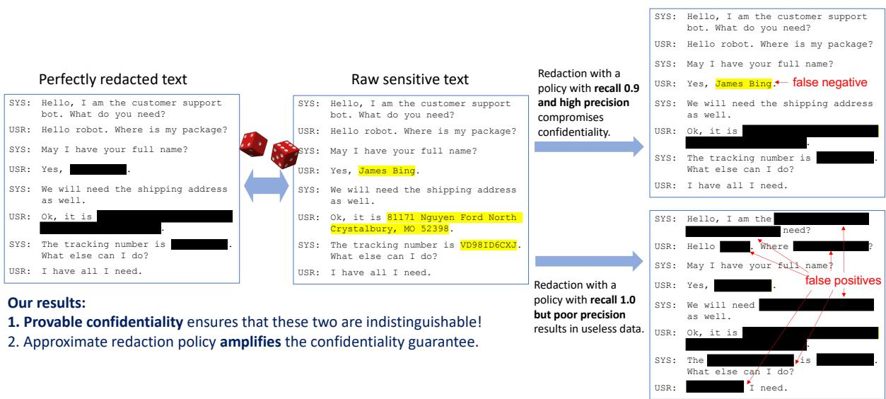  
Figure 1: An example from simulated dialog dataset CustomerSim. The yellow highlights are confidential content (middle). Left shows the text after Redaction by a sequence labeling policy π. However, if the policy is not perfect, there exists false negative or false positive samples as shown on the right.

The contribution of this paper is fivefold.

1. We show that in the absence of a perfect screening policy, the risk of a language model memorizing sensitive content is real and can be efficiently exploited with only blackbox access to the model even if the learning algorithm satisfies the recently proposed notion of selective differential privacy (Shi et al., 2021).

2. Inspired by differential privacy, we introduce a new definition of confidentiality which precisely quantifies the risk of leaking sensitive text.

3. We propose CRT to train language generation models while protecting confidential text. The method with deduplication and redaction operations work even under imperfect confidential text labeling policies.

4. We theoretically prove that CRT, combined with differentially private stochastic gradient descent (DP-SGD), provides strong confidentiality guarantees.

5. Our experiments on both MultiWOZ 2.2 and CustomerSim datasets show that different models trained by CRT can achieve the same or better perplexity than existing solutions (against the attacks of Carlini et al. (2019, 2021)).

To the best of our knowledge, we are the first that rigorously establish the role of deduplication and redaction in achieving provably stronger confidentiality (or the related differential privacy) guarantees; and the first that achieve provably confidentiality in transformer models with only a mild utility loss.

## 2 Background & Related Work

Next, we briefly introduce the relevant background and discuss the related work to put our work in context.

Language modeling is a fundamental problem in natural language processing (Devlin et al., 2019; Howard and Ruder, 2018; Raffel et al., 2020). Consider a text sequence that consists of multiple tokens from a vocabulary , i.e., w = $( w _ { 1 } , w _ { 2 } , \ldots , w _ { n } )$ , where $w _ { i }$ is the i-th token. The goal of language modeling is to construct a generative model of the distribution $\mathrm { P r } ( { \pmb w } )$ , by applying the chain rule $\begin{array} { r } { \operatorname* { P r } ( \pmb { w } ) = \prod _ { i = 1 } ^ { n } \operatorname* { P r } \left( w _ { i } \mid \pmb { w } _ { < i } \right) } \end{array}$ We let $f _ { \theta } ( w _ { i } | \pmb { w } _ { < i } )$ denote the likelihood of token $w _ { i }$ when evaluating the neural network f with parameters θ. A language model is trained to maximize the probability of the data in a training set , by minimizing the negative log-likelihood over each training example with the loss function $\begin{array} { r } { { \mathcal { L } } ( \theta ) = - \log \prod _ { i = 1 } ^ { n } f _ { \theta } \left( w _ { i } \mid \pmb { w } _ { < i } \right) } \end{array}$ . Recurrent neural networks (RNNs) used to be a common choice for the neural network architecture to estimate the probability distribution Pr(w). (Hochreiter and Schmidhuber, 1997; Mikolov et al., 2010). More recently, large-scale Transformer-based language models have replaced RNNs in state-of-the-art models for all sorts of NLP tasks (Vaswani et al., 2017; Radford et al., 2019). Nevertheless, common language models are vulnerable to privacy attacks and possibly expose information about their sensitive training data (Carlini et al., 2019, 2021).

Differentially private (DP) learning methods (see, e.g., Abadi et al., 2016) has been applied to language models as a blanket solution for a number of privacy and security risks. McMahan et al. (2018) trained an RNN language model with DP guarantees in a federated learning setup. Anil et al. (2021) pre-trained BERT under DP on datasets with hundreds of millions of examples. These paper also demonstrated that DP can effectively prevent data-extraction attacks in practice even for algorithms with DP guarantees that are considered too weak from a theoretical-perspective $( \mathbf { e . g . } , \epsilon = 8 $ or 16). However, the strong protection of DP often results in a substantial drop in the utility of the trained model, which makes them less desirable in practice. In fact, it was recently shown that it is necessary for deep learning models to memorize certain training data to achieve high accuracy (Feldman, 2020), which suggests that DP or any other techniques that require the model to not memorize any training data will perform poorly in the highdimensional, power-law distributed real datasets. This motivates us to consider weakened models that only prevent memorizing the sensitive part of the text.

Recent works (Lee et al., 2022; Kandpal et al., 2022) show that deduplication enables language models to emit memorized text less frequently with same or better accuracy. However, deduplicating training datasets can not prevent all unintended memorization. We combine deduplication and redaction and then apply both techniques to the training process of LM to achieve confidentiality with provable guarantee.

The closest to us is perhaps the work of Shi et al. (2021), who proposed selective differential privacy (S-DP), which requires indistinguishability between two datasets that differ only on a sensitive message. Correspondingly, they propose an algorithm (Selective DP-SGD) for training RNN that adds noise only to the part of computation that involves sensitive tokens. To define S-DP and to run Selective DP-SGD, one needs to have access to a policy function F which determines which token is sensitive. This requirement limits the applicability of their approach to those applications where such perfect $F$ is known. We note that even for name-entity recognition the state-of-the-art model is far from being perfect, and which part of the text is considered sensitive is often ambiguous even for human annotators. We will see that naively running Selective DP-SGD with an approximate policy function does not provide a meaningful confidentiality guarantee and is vulnerable to practical data extraction attacks. Finally, we note that in the case when a perfect policy function is available, we can simply use it for redaction, which provides a perfect S-DP with $\epsilon = 0$ . A big part of our contribution is to refine S-DP to a (slightly different) definition called “confidentiality” and to demonstrate that we use an approximate screening policy to amplify the confidentiality parameter.

## 3 The CRT Method and Theory

In this section, we develop our method with provable confidentiality.

## 3.1 Formally defining confidentiality

Let the dataset be a collection of n data points — each being a sequence of tokens. A “secret” x is a contiguous subsequence of tokens within a data point that is considered sensitive or confidential. The goal of our research is to allow us to train language models on such datasets that could contain secrets while provably prevent the model from remembering that these secrets were. We start by defining a formal definition of confidentiality, which uses the following idea of indistinguishability from the DP literature.

Definition 1 (Indistinguishability). We say that a pair of distributions $P , Q$ defined on the same probability space are $( \epsilon , \delta )$ -indistinguishable if for any measurable set S,

$$
\operatorname* { P r } _ { P } [ S ] \leq e ^ { \epsilon } \operatorname* { P r } _ { Q } [ S ] + \delta .
$$

Definition 2 (Confidentiality). We say that ensures that a secret x is $( \epsilon ( x ) , \delta )$ -confidential, $i f$ for any dataset D that contains x in one of its data points, and an alternative dataset $D ^ { \prime }$ that replaces x in D with a generic <MASK>, it holds that $( \mathcal { A } ( D ) , \mathcal { A } ( D ^ { \prime } ) )$ are $( \epsilon ( x ) , \delta )$ -indistinguishable. In addition, we simply say that $\mathcal { A }$ ensures $( \epsilon , \delta )$ confidentiality $i f \epsilon ( x ) \leq \epsilon f o r$ all secret x.

This definition ensures that an attacker cannot distinguish from the output of  (the trained language model) whether it was x or <MASK> that was used for training, thus formalizing the idea of confidentiality. The protection should be viewed as relative, rather than absolute. The definition bounds the risk of any bad event by an multiplicative factor of $e ^ { \epsilon }$ and an additive factor of δ, which implies that anything that could happen when we run on the sensitive data could’ve happened with with similar probability even if runs on an alternative world where these sensitive information are perfectly masked.

Connections to differential privacy. Our definition of confidentiality is related to (and inspired by) (ϵ, δ)-differential privacy (DP) but is different in several ways. DP is stronger (and implies confidentiality!) requires  to ensure (ϵ, δ)- indistinguishability for all D, D′ that can be modified from each other by adding or removing one individual person / data point (or tokens, depending on the desired granularity); but for to ensure (ϵ, δ)-confidentiality, it only requires (ϵ, δ)- indistinguishability for specific D, D′ where $D ^ { \prime }$ replaces x in D with <MASK>. Moreover, it is more informative to define ϵ as a function of each specific x, which is different from DP (it resembles personalized DP (Ghosh and Roth, 2015)).

The confidentiality definition makes sense for our problem because it protects the content of the sensitive text x rather than its existence. Specifically, a pre-processing algorithm that masks all sensitive text ensures (0, 0)-confidentiality but does not satisfy any non-trivial DP guarantees.

Sometimes, it is useful to consider the confidentiality of multiple secret texts. For example, a secret key x could appear multiple times in multiple data points. Also, there might be multiple secret texts that are correlated to each other such that the knowledge of one would reveal other secrets.

Definition 3 (Group Confidentiality). We say that ensures that a list of sensitive texts $s : =$ $[ x _ { 1 } , . . . , x _ { k } ]$ is $( \epsilon ( S ) , \delta )$ -(group) confidential, if for any dataset D that contains $[ x _ { 1 } , . . . , x _ { k } ]$ in up to k data points, and D′ being the version that replaces each element in with <MASK>, it holds that $( \mathcal { A } ( D ) , \mathcal { A } ( D ^ { \prime } ) )$ are (ϵ( ), δ)-indistinguishable.

A special case of such group confidentiality is when collects the all secret text in D, which protects all secret texts uniformly. We call this uniform-confidentiality. Note that the standard definition of confidentiality also protect every secret x, except that it protects each secret x individually, rather than together.

Inspired by the recent development of Bayesian DP (Triastcyn and Faltings, 2020), we also define Bayesian confidentiality as follows.

Definition 4 (Bayesian Confidentiality). Let D be a dataset that isfixed except a random secret $x \sim \mu$ drawn from some distribution µ. Let D′ be obtained by replacing x with <MASK>2. Then ensures (ϵ, δ)-Bayesian Confidentiality if for any $D ^ { \prime } ,$ $( \mathcal { A } ( D ) , \mathcal { A } ( D ^ { \prime } ) )$ is (ϵ, δ)-indistinguishable, where (D) is jointly distributed over x  µ and .

The Bayesian confidentiality measures how much information an attacker could gain if he/she’s prior knowledge about this secret x is described by the distribution µ. This is a strict generalization because when µ is a single point mass at x, it recovers Definition 2. The additional generality allows us to quantify the stronger confidentiality guarantee against weaker adversaries without complete information.

## 3.2 Confidentially redacted training

In this section we describe the CRT method to train language models with provable confidentiality guarantee. It includes two pre-processing operations (deduplication and redaction) and a switching optimization procedure. The overall idea is to screen the corpus into two separate sets, one public set including sentences with no confidential information, and one private set including sentences containing confidential content. We then use normal optimization algorithms (e.g. SGD) on the public set and differential privacy optimizer (e.g. DP-SGD) on the private set.

Deduplication. The deduplication procedure Dedup detects all sentences that appear multiple times in the training data and replace them into a single <MASK> from the second occurrence onwards (<MASK> is for proving purpose).

Redaction. The redaction procedure Redactπ takes applies a sequence labelling policy π to screen confidential content in the training corpus D. π(s, x) = 1 if a token x in a sentence s should be confidential. The labeled span in each detected sentence is replaced with a special token <MASK>. Note that we do not assume the policy is perfect. It may label some non-sensitive tokens as sensitive (false positives) and label some sensitive text as non-sensitive (false negative, or 1 recall).

Algorithm 1: CRT   
Input :Dataset D (after tokenization /   
splitting), labelling policies π, $\pi _ { c } ,$   
number of epochs $T$   
1 $D ^ { \prime } \gets \mathrm { D e d u p } ( D )$   
2 $D ^ { \prime \prime }  \operatorname { R e d a c t } _ { \pi } ( D ^ { \prime } )$   
3 $D ^ { p r i }  \{ s \in D ^ { \prime \prime } | \exists x \in s \mathrm { ~ s . t . ~ } \pi ( s , x ) =$   
$\begin{array} { r } { 1 \mathrm { o r } \exists x \subset s \mathrm { s . t . } \pi _ { c } ( s , x ) = 1 \} } \end{array}$   
4 $D ^ { p u b } = \{ s \in D ^ { \prime \prime } | s \notin D ^ { p r i } \}$   
5 for $e = 1 , . . . , T$ do   
6 Run one epoch of SGD with $D ^ { p u b } .$   
7 Run one epoch3 of DP-SGD with $D ^ { p r i }$   
8 end

Redact and Dedup could be implemented manually, but with the large text corpus nowadays it is more common that these procedures are implemented using automated tools. For example, Dedup could be implemented efficiently with just one pass of data using a bloomfilter (Bloom, 1970) (or other hashing tricks that also catches nearduplicates). Bloom filter in particular, enjoys the nice property that it could have false positives but never any false negatives. $\operatorname { R e d a c t } _ { \pi }$ could be realized by a named entity recognition (NER) model or a personal-identifiable information (PII) detector.

Finally, CRT combines the two pre-processing steps with normal optimizer and DP-SGD, the standard algorithm for deep learning with differential privacy. A pseudo-code of the algorithm is given in Algorithm 1.

Besides using a sequence labeling policy $\pi$ with balanced precision/recall as part of the redaction process. The algorithm uses another, more conservative, policy $\pi _ { c }$ with nearly perfect recall to decide on the data points that do not contain sensitive text. In the situation when such $\pi _ { c }$ isn’t available, we simply choose $\pi _ { c } ( s , x ) = 1$ for all tokens x in a sentence s and the second part becomes the vanila DP-SGD. It is also important that every data point that contains $\mathbf { a } \mathrm { < M A S K > }$ requires protection.

## 3.3 Theoretical analysis

We analyze the theoretical properties of the above method and show that they result in provable improvements in the (regular, group and Bayesian)

confidentiality parameters for any algorithms that are provably (ϵ(x), δ)-confidential as defined in Section 3.1.

The following theorem captures the benefit of redaction in improving confidentiality.

Proposition 5 (Confidentiality under redaction). If ensures $( \epsilon ( x ) , \delta )$ -Confidentiality for each token x of sentence $s \in \mathcal { S } \ ( \mathcal { S }$ is a corpus), then Redactπ ensures (˜ϵ(x), δ)-confidentiality with

$$
\tilde { \epsilon } ( x ) = \left\{ \begin{array} { l l } { \epsilon ( x ) } & { i f \pi ( s , x ) = 0 } \\ { 0 } & { o t h e r w i s e . } \end{array} \right.
$$

In addition, $\mathcal { A } \texttt { o }$ Redactπ also satisfies (˜ϵ(S), ˜δ(S))-group confidentiality with

$$
\begin{array} { c } { { \tilde { \epsilon } ( S ) = \displaystyle \sum _ { x \in s \& s \in S } \epsilon ( x ) \mathbf { 1 } ( \pi ( s , x ) = 0 ) , } } \\ { { \tilde { \delta } ( S ) = \tilde { k } e ^ { \tilde { \epsilon } ( S ) } \delta } } \\ { { \ w h e r e \tilde { k } : = \sum _ { x \in S } \mathbf { 1 } ( \pi ( s , x ) = 0 ) . } } \end{array}
$$

As an application of the above, if  ensures (ϵ, δ)-confidentiality, and that the empirical recall rates of the redaction policy on D is $1 - \gamma ,$ , then the above proposition suggests that $\mathcal { A }$ Redac $\bar { \upsilon } _ { \pi }$ improves the uniform-confidentiality over applying without redaction by a factor of $\gamma .$ . The proof is in the appendix.

Redaction also improves Bayesian confidentiality in a way that mirrors the privacy amplification by sampling from the DP literature.

Proposition 6 (Bayesian Confidentiality under Redaction). If  ensures $( \epsilon , \delta )$ -Bayesian Confidentiality with respect to $\mu [ x | \pi ( s , x ) = 0 ]$ for a token x in a sentence s, then   Redactπ ensures $( \log ( 1 + \gamma ( e ^ { \epsilon } - 1 ) ) , \gamma \delta )$ -Bayesian Confidentiality under µ if π has a false negative rate (i.e., $1 - { ^ { \circ } R e c a l l ^ { \prime \prime } } )$ of γ under $\mu .$

The proposition says that if the redaction policy is accurate for secrets $x \ \sim \ \mu ,$ , then we can have a stronger confidentiality parameter that scales roughly at $\tilde { \epsilon } = O ( \gamma \epsilon )$ . The idea behind the proof is that over the distribution of $x \sim \mu .$ , with probability $1 - \gamma , \operatorname { R e d a c t } _ { \boldsymbol \pi } ( D ) = \operatorname { R e d a c t } _ { \boldsymbol \pi } ( D ^ { \prime } )$ , thus $\mathcal { A } \circ$ $4 \circ \mathrm { R e d a c t } _ { \pi } ( D ) \equiv \mathcal { A } \circ \mathrm { R e d a c t } _ { \pi } ( D ^ { \prime } )$ . With probability $\gamma ,$ Redac $\bar { , } _ { \pi } ( D )$ $\operatorname { R e d a c t } _ { \pi } ( D ^ { \prime } )$ are different and conditioning on the fact that $\operatorname { R e d a c t } _ { \pi }$ fails to detect x. Note that π is also applied to other text that are not sensitive, and could result in false positives, but they do not matter as the modification of Redactπ to D and $D ^ { \prime }$ will be identical. A full proof is given in the appendix.

Next we turn to deduplication.

Proposition 7 (Group confidentiality under deduplication.). If ensures $( \epsilon ( S ) , \delta ( S ) )$ Group Confidentiality, then   Dedup ensures (ϵ(Unique(S)), δ(Unique(S)))-Group Confidentiality.

Deduplication provides a stronger protection for those cases where some secret x could appear multiple times in the dataset.

Theorem 8. Let DP-SGD from Algorithm 1 satisfies (ϵ, δ)-differential privacy.

1. Assume $\pi _ { c } ( s , x ) = 1$ for all secret tokens x in a sentence s such that $\pi ( s , x ) = 0 ,$ then Algorithm 1 satisfies $( \epsilon { \bf 1 } ( \pi ( s , x ) = 0 ) , \delta )$ - confidentiality.

2. Let S be a group containing m unique secrets such that $\pi _ { c } ( s , x ) \ : = \ : 1 \forall x \in \ : s$ and $s \in \mathcal { S }$ and that π detects γ˜-proportion of the unique secrets in S. Then Algorithm 1 satisfies $( \tilde { \gamma } m \epsilon , \tilde { \gamma } m e ^ { \tilde { \gamma } m \epsilon } \delta )$ )-group confidentialityfor S.

3. Let $\pi , \pi _ { c }$ has a a recall of 1  γ and $1 - \delta _ { 2 }$ respectively on $\mu ,$ then Algorithm 1 satisfies $( \log ( 1 + \gamma ( e ^ { \epsilon } - 1 ) ) , \gamma \delta + \delta _ { 2 } )$ -Bayesian Confidentiality for µ.

The theorem demonstrates that our CRT algorithm enjoys a full suite of confidentiality guarantees and they all benefit from the deduplication and redaction, particularly if π has high recall.

Note that the CRT algorithm achieves the worstcase confidentiality guarantee if we have a nontrivial conservative screening policy that outputs $\pi _ { c } ( x ) = 1$ for all secret x that π misses, or we simply run vanilla DP-SGD after deduplication and redaction. On the other hand, CRT still satisfies Bayesian confidentiality for each $\mu$ depending on the recall rate of $\pi _ { c }$ under $\mu .$

## 4 Experiments

We evaluate CRT by training two types of language model, LSTM and GPT-2, on two datasets: 1) MultiWOZ 2.2, a well-known human-written dialogue dataset and 2) CustomerSim, a simulated dialogue dataset for conversation generation.

MultiWOZ 2.2 is an already-public dialogue dataset written by crowd-workers, which collects over 10,000 annotated dialogues spanning 8 domains (Zang et al., 2020). We use this dataset to show how CRT works in real-world applications. Following US Department of Labor’s guidance4 on personal-identifiable information (PII), we treat all confidential information (e.g. email address, reference number, telephone number, etc.) as secrets. For the sequence labeling policy π and conservative policy $\pi _ { c } ,$ we build upon an NER model to do redaction. See Appendix A.4 for more details.

CustomerSim. Following S-DP Shi et al. (2021), we simulate a dialog dataset called CustomerSim with synthetic user information. The dialog flow is simulated based on a fixed agenda and the language generation is template-based (Zhao and Eskénazi, 2018). CustomerSim consists of 10 thousand examples and over one million tokens. We treat user name, address, phone number, order, and tracking number as secrets, and use a regular expression tester (regex) to detect them for the redaction process.

Experiment details. For LSTM model, we follow the setting in S-DP to choose a one-layer LSTM. Because S-DP requires hidden states of the sensitive input to be protected, it doesn’t support more layers nor Bidirectional LSTM. Since the advent of Transformers (Vaswani et al., 2017) significantly improves the capabilities of generative language models, we also test transformer-based language model GPT-2 (Radford et al., 2019) from HuggingFace (Wolf et al., 2019). As for deduplication, we use SHA-1 (Jarvinen, 2004) hash function to encode sequences to SHA-1 hash code and then remove identical sequences based on the same hash code. For Bayesian Confidentiality, we treat the uniform distribution over the secret sequences as the distribution $\mu .$ More experiment details can be found in Appendix A.3.

Baselines. For LSTM model, we compare four different training approaches: (1) vanilla SGD (denoted by "Non-private-LSTM"), (2) Selective DPSGD (denoted by "S-DP-LSTM") (3) DPSGD (denoted by "DPSGD-LSTM") and (4) confidentially redacted training (denoted by "CRT-LSTM"). While for GPT-2 model, we compare three different training approaches: (1) vanilla SGD (denoted by "Non-private-GPT"), (2) DPSGD (denoted by "DPSGD-GPT") and (3) CRT (denoted by "CRT-GPT"). Our implementation of S-DP-LSTM model is built upon Shi et al. $( 2 0 2 1 ) ^ { 5 }$ . We run the experiment for the GPT-2 model following Li et al. $( 2 0 2 1 ) ^ { 6 }$ , in which they propose ghost clipping method to alleviate the computational challenge of running DP-SGD with large Transformers.

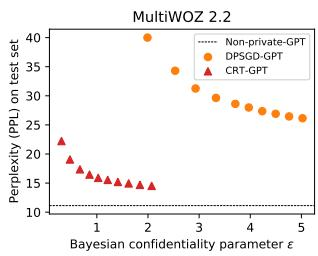

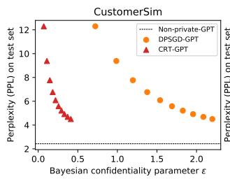

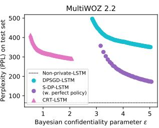

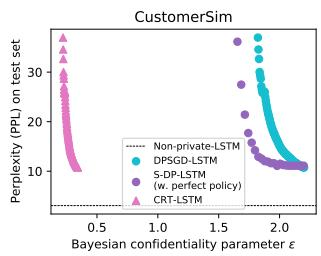  
Figure 2: Model utility and confidentiality guarantee on MultiWOZ 2.2 and CustomerSim datasets with $\mu$ being a uniform distribution over the secret sequences in each dataset. PPL: Perplexity on the test set. ϵ: Privacy guarantee in Bayesian Confidentiality. We fix $\delta = 8 e - 5$ for all models. Since Selective DP-SGD with approximate policy gives $\epsilon = + \infty$ , we show its result with a perfect screen policy. But when a perfect policy is available, Redaction only gives $\epsilon = 0$ and achieves the PPL of vanilla training with no noise added (Non-private-GPT/LSTM). For other models we set $\gamma = 0 . 1$ to show the result under approximate policy.

All the models are trained five times to reduce randomness, and the parameters are tuned based on the validation set performances.

## 5 Experimental Results

## 5.1 Evaluation procedure

We need to evaluate both model utilities and privacy guarantees of the language models. We measure predictive perplexity (PPL) for the quality of LM. We also analyze the theoretical privacy budget (ϵ, δ) and test whether language models are private under attacks detailed below.

Canary insertion attack. Canary insertion is proposed as a testing methodology for quantitatively assessing the risk of unintended memorization (Carlini et al., 2019). It inserts random sequences called canaries into the training dataset, then trains the model, and finally calculates the following exposure for the inserted canaries to measure a model’s potential for privacy risks. In our experiment, we randomly generate 10 canaries in the form of "My ID is: <random 6-digit number here>". Each canary is inserted into the training dataset 20 times to generate more salient differences between models.

Definition 9 (Canary Exposure). Given a canary $s [ r ]$ , a model with parameters θ, and the randomness space , the exposure $o f s [ r ]$ is

$$
{ \mathrm { e x p o s u r e } } _ { \theta } = \log _ { 2 } { | \mathcal { R } | } - \log _ { 2 } { \mathrm { r a n k } } _ { \theta } ( s [ r ] )
$$

After training, we calculate empirical model perplexity for all possibly-instantiated canaries and list them in sorted order. Then we can get the canary exposure based on the rank of a specific canary sequence rankθ $( s [ r ] )$ and the number of all possible candidates $| \mathcal { R } |$ . In our setting, we show the highest canary exposure in 10 canaries. For example, if a canary ranks 1st among 1M candidates, the canary exposure is 19.93.

Membership inference attack. Membership Inference is a widely used privacy attack method. Given a non-privately trained model, an adversary can predict whether or not a particular example was used to train the model. We adopt the membership inference attack in Carlini et al. (2021). The general idea is to calculate the given samples’ perplexities under the model, rank them and choose the ones with the lowest perplexities, i.e., highest likelihood by the model. We can think of this process as training a binary classifier based on the perplexity feature. We also implement the group membership inference attack to show the group confidentiality. More details about the implementation can be found in the Appendix A.5.

## 5.2 Overall performance

Figure 2 presents the results of model utilities and confidentiality guarantees across our models of interest on MultiWOZ 2.2 and CustomerSim datasets. Each point denotes a model for different epochs in a training process. Since the X-axis is ϵ in Bayesian Confidentiality (the lower the better) and the Y-axis is perplexity (the lower the better), a perfect model will lie in the bottom-left corner. CRT-GPT and DPSGD-GPT in general, perform better than S-DP-LSTM, CRT-LSTM and, DPSGD-LSTM on the test sets. Our model CRT-GPT’s performance is close to Non-private-GPT in terms of PPL while preserving strong confidentiality. Besides, CRT-GPT is better than DPSGD-GPT manifested by a much lower ϵ, which demonstrates that approximately correct screening policy amplifies the confidentiality guarantee.

Differences can be witnessed in the results from two different datasets: the models trained on CustomerSim achieve overall better performances than those trained on MultiWOZ. We think it’s due to the fact that CustomerSim contains simple dialogs from template-based simulations.

## 5.3 Attack results

Figure 3, 4, and 5 present the results from canary insertion attack and individual/group membership inference attack on MultiWOZ 2.2 and Customer-Sim datasets. The X-axis is the false negative rate γ of screening policy π, ranging from 0.0 to 0.5; the Y-axis is the canary exposure (in Figure 3) and membership inference accuracy (in Figure 4 and 5), which measures the effectiveness of the attacks. The lower the canary exposure or inference accuracy, the better protection the model provides against the attacks.

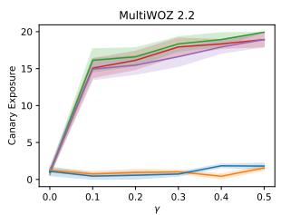

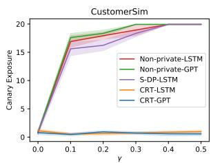  
Figure 3: Canary insertion attack result. CRT achieves almost 0 canary exposure, which means it can prevent unintended memorization.

For canary insertion attack, it can be seen from Figure 3 that the canary exposures for CRT-LSTM and CRT-GPT are both close to 0 which thus guarantee excellent confidentiality. Non-private-LSTM and Non-private-GPT with mask can also attain great protection at perfect screening policy accuracy (γ = 0), nonetheless a rise in γ results in a sharp increase in the exposure. It should be noticed that S-DP-LSTM also has high exposure, similar to Non-private models, given any γ above 0. This is because that many sensitive data has been falsely identified as non-sensitive by the approximate policy, S-DPSGD does not protect these false negative samples and hence a privacy leakage.

For membership inference attack, we compare the inference accuracy with the benchmark value of

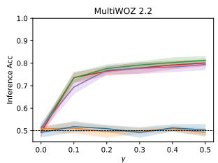

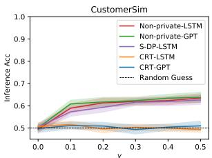

Figure 4: Membership inference attack result. CRT attains nearly 50% accuracy, indicating that the adversary could not infer whether a data point is used for training.  
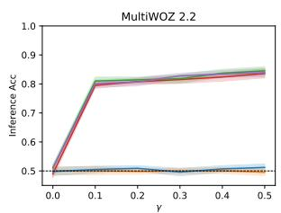

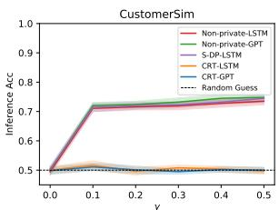  
Figure 5: Group membership inference attack result.

0.5, which equals the random guess performance. In Figure 4 and 5, we see that CRT-LSTM and CRT-GPT align well with the 0.5 horizontal line, suggesting that they are rather safe to the attack. The inference accuracy for Non-private-LSTM/Non-private-GPT/S-DP-LSTM, in contrast, surges above 0.5 as the false negative rate γ deviates from 0.0, indicating that these models become vulnerable to the attack under non-perfect screen policy. In addition, Non-private and S-DP models show even worse protection under the group attack than the individual one in view of a higher inference accuracy at certain γ.

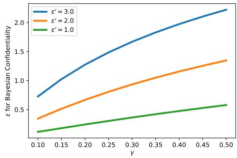  
Figure 6: Bayesian Confidentiality amplification result. CRT helps to amplify the confidentiality guarantee.

## 5.4 CRT amplifies Bayesian Confidentiality guarantees

Figure 6 shows that confidentially redacted training can help to amplify the confidentiality guarantees. We set the $\epsilon ^ { \prime }$ in DP-SGD fixed and show the corresponding ϵ in Bayesian Confidentiality with different screen policy $\pi .$ Both $\epsilon ^ { \prime }$ and ϵ are for $\delta = 8 e - 5$ . If the approximately screening policy π has a high recall $( \gamma$ is small), we will achieve much improvement in the Bayesian Confidentiality parameter ϵ by deduplication and redaction. For example, with $( \epsilon ^ { \prime } = 1 . 0 , \gamma = 0 . 1 )$ , we reduce the ϵ to 0.12.

## 6 Conclusion

In this paper, we propose confidentially redacted training (CRT), a method to train language models while protecting the secret texts. We introduce a new definition of confidentiality which quantifies the risk of leaking sensitive content. We prove the effectiveness of CRT both theoretically and empirically on multiple datasets and language models.

## 7 Broader Impact

This work will alleviate ethical concerns of largescale pre-trained language models. This paper provides one promising solution to an important aspect of NLP: training high quality language models for text generation without compromising confidential information. The current use cases of language models involve pretraining on public web corpus and fine-tuning on individual application data. However, the private application specific data often contains user-generated sensitive information. The proposed method in this paper aims to use as much individual fine-tuning data as possible, while does not leak or memorize any confidential information with provable guarantees. Without the method, one has to either use the general pretraining LM without fine-tuning or manually filter sensitive information and fine-tuning on the remaining. It can be applied in broader applications that need language models or text generation models.

In our experiments, we use a simulation scheme to mimic confidential content in a real corpus. We did not compromise any real user’s confidential information.

## Acknowledgements

The work was partially supported by NSF Award # 2048091. XZ was supported by UCSB Chancellor’s Fellowship. We would like to thank the anonymous reviewers for their thoughtful comments. We would also like to thank Siqi Ouyang for the helpful discussion and Yang Gao for polishing up the draft.

## References

Martín Abadi, Andy Chu, Ian J. Goodfellow, H. Brendan McMahan, Ilya Mironov, Kunal Talwar, and Li Zhang. 2016. Deep learning with differential privacy. Proceedings ofthe 2016 ACM SIGSAC Conference on Computer and Communications Security.

Rohan Anil, Badih Ghazi, Vineet Gupta, Ravi Kumar, and Pasin Manurangsi. 2021. Large-scale differentially private bert. ArXiv, abs/2108.01624.

Dzmitry Bahdanau, Kyunghyun Cho, and Yoshua Bengio. 2015. Neural machine translation by jointly learning to align and translate. CoRR, abs/1409.0473.

Borja Balle, Gilles Barthe, and Marco Gaboardi. 2018. Privacy amplification by subsampling: tight analyses via couplings and divergences. In Advances in Neural Information Processing Systems, pages 6280– 6290.

Gilles Barthe and Federico Olmedo. 2013. Beyond differential privacy: Composition theorems and relational logic for f-divergences between probabilistic programs. In International Colloquium on Automata, Languages, and Programming, pages 49–60. Springer.

Burton H Bloom. 1970. Space/time trade-offs in hash coding with allowable errors. Communications of the ACM, 13(7):422–426.

Nicholas Carlini, Chang Liu, Úlfar Erlingsson, Jernej Kos, and Dawn Xiaodong Song. 2019. The secret sharer: Evaluating and testing unintended memorization in neural networks. In USENIX Security Symposium.

Nicholas Carlini, Florian Tramèr, Eric Wallace, Matthew Jagielski, Ariel Herbert-Voss, Katherine Lee, Adam Roberts, Tom B. Brown, Dawn Xiaodong Song, Úlfar Erlingsson, Alina Oprea, and Colin Raffel. 2021. Extracting training data from large language models. In USENIX Security Symposium.

Jacob Devlin, Ming-Wei Chang, Kenton Lee, and Kristina Toutanova. 2019. Bert: Pre-training of deep bidirectional transformers for language understanding. ArXiv, abs/1810.04805.

Cynthia Dwork, Frank McSherry, Kobbi Nissim, and Adam Smith. 2006. Calibrating noise to sensitivity in private data analysis. In Theory of cryptography conference, pages 265–284. Springer.

Vitaly Feldman. 2020. Does learning require memorization? a short tale about a long tail. In Proceedings of the 52nd Annual ACM SIGACT Symposium on Theory of Computing, pages 954–959.

Debasis Ganguly, Dwaipayan Roy, Mandar Mitra, and Gareth J.F. Jones. 2015. Word embedding based generalized language model for information retrieval. Proceedings of the 38th International ACM SIGIR Conference on Research and Development in Information Retrieval.

Arpita Ghosh and Aaron Roth. 2015. Selling privacy at auction. Games and Economic Behavior, 91:334– 346.

Sepp Hochreiter and Jürgen Schmidhuber. 1997. Long short-term memory. Neural Computation, 9:1735– 1780.

Ehsan Hosseini-Asl, Bryan McCann, Chien-Sheng Wu, Semih Yavuz, and Richard Socher. 2020. A simple language model for task-oriented dialogue. ArXiv, abs/2005.00796.

Jeremy Howard and Sebastian Ruder. 2018. Universal language model fine-tuning for text classification. In ACL.

Kimmo Jarvinen. 2004. Design and implementation of a sha-1 hash module on fpgas. Helsinki University of Technology Signal Processing Laboratory.

Nikhil Kandpal, Eric Wallace, and Colin Raffel. 2022. Deduplicating training data mitigates privacy risks in language models. arXiv preprint arXiv:2202.06539.

Tom Kwiatkowski, Jennimaria Palomaki, Olivia Redfield, Michael Collins, Ankur P. Parikh, Chris Alberti, Danielle Epstein, Illia Polosukhin, Jacob Devlin, Kenton Lee, Kristina Toutanova, Llion Jones, Matthew Kelcey, Ming-Wei Chang, Andrew M. Dai, Jakob Uszkoreit, Quoc V. Le, and Slav Petrov. 2019. Natural questions: A benchmark for question answering research. Transactions of the Association for Computational Linguistics, 7:453–466.

Katherine Lee, Daphne Ippolito, Andrew Nystrom, Chiyuan Zhang, Douglas Eck, Chris Callison-Burch, and Nicholas Carlini. 2022. Deduplicating training data makes language models better. In Proceedings of the 60th Annual Meeting of the Association for Computational Linguistics. Association for Computational Linguistics.

Xuechen Li, Florian Tramèr, Percy Liang, and Tatsunori Hashimoto. 2021. Large language models can be strong differentially private learners. ArXiv, abs/2110.05679.

H. Brendan McMahan, Daniel Ramage, Kunal Talwar, and Li Zhang. 2018. Learning differentially private recurrent language models. In ICLR.

Tomas Mikolov, Martin Karafiát, Lukás Burget, Jan Honza Cernocký, and Sanjeev Khudanpur. 2010. Recurrent neural network based language model. In INTERSPEECH.

Alec Radford, Jeff Wu, Rewon Child, David Luan, Dario Amodei, and Ilya Sutskever. 2019. Language models are unsupervised multitask learners.

Colin Raffel, Noam M. Shazeer, Adam Roberts, Katherine Lee, Sharan Narang, Michael Matena, Yanqi Zhou, Wei Li, and Peter J. Liu. 2020. Exploring the limits of transfer learning with a unified text-to-text transformer. ArXiv, abs/1910.10683.

Weiyan Shi, Aiqi Cui, Evan Li, R. Jia, and Zhou Yu. 2021. Selective differential privacy for language modeling. ArXiv, abs/2108.12944.

Aleksei Triastcyn and Boi Faltings. 2020. Bayesian differential privacy for machine learning. In International Conference on Machine Learning, pages 9583–9592. PMLR.

Ashish Vaswani, Noam M. Shazeer, Niki Parmar, Jakob Uszkoreit, Llion Jones, Aidan N. Gomez, Lukasz Kaiser, and Illia Polosukhin. 2017. Attention is all you need. ArXiv, abs/1706.03762.

Ralph Weischedel, Martha Palmer, Mitchell Marcus, Eduard Hovy, Sameer Pradhan, Lance Ramshaw, Nianwen Xue, Ann Taylor, Jeff Kaufman, Michelle Franchini, and et al. 2013. Ontonotes release 5.0. Linguistic Data Consortium, Philadelphia, PA, 23.

Thomas Wolf, Lysandre Debut, Victor Sanh, Julien Chaumond, Clement Delangue, Anthony Moi, Pierric Cistac, Tim Rault, Rémi Louf, Morgan Funtowicz, and Jamie Brew. 2019. Huggingface’s transformers: State-of-the-art natural language processing. ArXiv, abs/1910.03771.

Xiaoxue Zang, Abhinav Rastogi, Srinivas Sunkara, Raghav Gupta, Jianguo Zhang, and Jindong Chen. 2020. Multiwoz 2.2: A dialogue dataset with additional annotation corrections and state tracking baselines. In Proceedings ofthe 2nd Workshop on Natural Language Processingfor Conversational AI, ACL 2020, pages 109–117.

Tiancheng Zhao and Maxine Eskénazi. 2018. Zero-shot dialog generation with cross-domain latent actions. In SIGDIAL Conference.

## A Appendix

## A.1 Illustration of our proposed algorithm

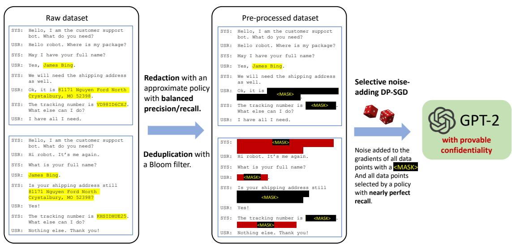  
Figure 7: An illustration of our proposed algorithm on a dataset with two data points. The first data point is the example from Figure 1, and the second data point is modified to illustrate the various aspects of the pre-processing steps. The red-colored mask indicates the masks produced by deduplication just for illustration purposes. In the algorithm, both of them replace a sequence of tokens with the same special token <MASK>.

## A.2 Proofs of technical results

ProofofProposition 5. The first statement straigtforwardly follows from that $\begin{array} { r l } { \operatorname { R e d a c t } _ { \pi } ( D ) } & { { } = } \end{array}$ $\mathrm { R e d a c t } _ { \pi } ( D ^ { \prime } ) \mathrm { i f } \pi ( s , x ) = 1$ and that $\operatorname { R e d a c t } _ { \pi } ( D )$ and $\operatorname { R e d a c t } _ { \pi } ( D ^ { \prime } )$ remain a pair of neighbors differing by only x. The group confidentiality claims follows from the standard calculation of small group privacy from differential privacy, which applies the (single x) confidentiality iteratively. Let $\tilde { D } = \mathrm { R e d a c t } _ { \pi } ( D )$ $\tilde { D } ^ { \prime } = \mathrm { R e d a c t } _ { \pi } ( D ^ { \prime } )$ and $\tilde { S } = [ x _ { 1 } , . . . , x _ { \tilde { k } } ]$ be the list of $S$ that are not masked by π. For any measurable event E

$$
\begin{array} { r l } & { \mathbb { P } [ \mathcal { A } \circ \mathrm { R e d a c t } _ { \pi } ( D ) \in E ] = \mathbb { P } [ \mathcal { A } ( \tilde { D } ) ] \leq e ^ { \varepsilon x _ { 1 } } \mathbb { P } [ \mathcal { A } ( \tilde { D } _ { - x _ { 1 } , + \times \mathtt { d a s g r s } } ) \in E ] + \delta } \\ & { \qquad \leq e ^ { \varepsilon x _ { 1 } + \epsilon ( x _ { 2 } ) } \mathbb { P } [ \mathcal { A } ( \tilde { D } _ { - x _ { 1 , 2 } , + \times \mathtt { d a s g r s } ^ { 2 } } ) \in E ] + e ^ { \varepsilon x _ { 1 } } \delta + \delta } \\ & { \qquad \quad \cdots } \\ & { \qquad \leq e ^ { \sum _ { i = 1 } ^ { \tilde { k } } \epsilon x _ { i } } \mathbb { P } [ \mathcal { A } ( \tilde { D } ^ { \prime } ) \in E ] + \delta ( 1 + e ^ { \epsilon x _ { 1 } } + e ^ { \epsilon x _ { 1 } + \epsilon x _ { 2 } } + \ldots + e ^ { \epsilon x _ { 1 } + \ldots + \epsilon x _ { \tilde { k } - 1 } } ) } \\ & { \qquad \leq e ^ { \tilde { \epsilon } ( S ) } \mathbb { P } [ \mathcal { A } \circ \mathrm { R e d a c t } _ { \pi } ( D ^ { \prime } ) \in E ] + k e ^ { \tilde { \epsilon } ( S ) } \delta } \end{array}
$$

Proof of Proposition 6. Consider a dataset D (in which one of the data point has $x \sim \mu )$ and a fixed $D ^ { \prime }$ Denote the probability distributions $p , q , r$ as shorthands for

$$
\begin{array} { r } { p \sim \mathcal { A } \circ \operatorname { R e d a c t } _ { \pi } ( D ) | \pi ( s , x ) = 1 } \\ { q \sim \mathcal { A } \circ \operatorname { R e d a c t } _ { \pi } ( D ) | \pi ( s , x ) = 0 } \\ { r \sim \mathcal { A } \circ \operatorname { R e d a c t } _ { \pi } ( D ^ { \prime } ) | \pi ( s , x ) = 0 } \end{array}
$$

Moreover, we use $\alpha p + ( 1 - \alpha ) q$ to denote the mixture distribution that samples from p with probability α and q with probability $1 - \alpha$

Recall that the Hockey-Stick-divergence characterization of $( \epsilon , \delta )$ -indistinguishsability (Barthe and Olmedo, 2013), which says that $( P , Q )$ are $( \epsilon , \delta )$ -indistinguishsable if and only if

$$
H _ { e ^ { \epsilon } } ( P \| Q ) : = \mathbb { E } _ { y \sim Q } [ ( \frac { d P } { d Q } ( y ) - e ^ { \epsilon } ) _ { + } ] \leq \delta .
$$

It suffices for us to bound the following quantity:

$$
\begin{array} { r l } & { \quad H _ { 1 + \gamma ( e ^ { \epsilon } - 1 ) } ( { \mathcal A } \circ \operatorname { R e d a c t } _ { \pi } ( D ) \| { \mathcal A } \circ \operatorname { R e d a c t } _ { \pi } ( D ^ { \prime } ) ) = H _ { e ^ { \epsilon } } ( ( 1 - \gamma ) p + \gamma q \| ( 1 - \gamma ) p + \gamma r ) } \\ & { = \gamma H _ { e ^ { \epsilon } } ( q \| ( 1 - \beta ) p + \beta r ) \leq \gamma \left( ( 1 - \beta ) H _ { e ^ { \epsilon } } ( q \| p ) + \beta H _ { e ^ { \epsilon } } ( q \| r ) \right) } \end{array}
$$

where $\begin{array} { r } { \beta = \frac { 1 + \gamma ( e ^ { \epsilon } - 1 ) } { e ^ { \epsilon } } } \end{array}$ . In the above, the second line follows from Theorem 2 of (Balle et al., 2018) (an identity called “Advanced Joint Convexity” by the authors) and the inequality is due to the (standard) joint convexity of the Hockey-Stick divergence. It remains to bound $H _ { e ^ { \epsilon } } ( q \| p )$ and $H _ { e ^ { \epsilon } } ( q \| r )$

Check that $p , r , \mathcal { A } \circ \operatorname { R e d a c t } _ { \pi } ( D ^ { \prime } )$ are identically distributed and that $H _ { e ^ { \epsilon } } ( q | | r ) \leq \delta$ by our assumption on ’s Bayesian confidentiality guarantee w.r.t. $\mu ( x | \pi ( s , x ) = 0 )$ . This completes the proof. □

Proof of Proposition 7. The proof is straightforward as Dedup(D) differs from Dedup(D′) only by Unique(S). □

ProofofTheorem 8. The proof for the first statement follows from the fact that DP implies $( \epsilon , \delta ) \cdot$ confidentiality and Proposition 5. Notably, if $\pi _ { c }$ catches all x that is missed by π, then we get that for all secret $x , \epsilon ( x ) \leq \epsilon .$

The proof of the second statement applies Proposition 7 and the second part of Proposition 5.

The proof of the third statement applies Proposition 6 but requires a separate treatment of the case when x is missed by both π and $\pi _ { c } .$ . Let the event that a secret x is not selected by the conservative policy be E and let  be a generic algorithm satisfying $( \epsilon , \delta _ { 1 } )$ Bayesian confidentiality under $\mu .$

$$
\begin{array} { r l } & { \mathbb { P } [ \boldsymbol { A } ( D ) \in S ] \leq \mathbb { P } [ \boldsymbol { A } \circ \mathrm { R e d a c t } _ { \boldsymbol { \pi } } ( D ) \in S \subset E ^ { c } ] + \boldsymbol { \delta } } \\ & { \qquad \leq e ^ { \epsilon } \mathbb { P } [ \boldsymbol { A } ( D ^ { \prime } ) \in S \subset E ^ { c } ] + \delta _ { 1 } + \delta _ { 2 } } \\ & { \qquad \leq e ^ { \epsilon } \mathbb { P } [ \boldsymbol { A } ( D ^ { \prime } ) \in S ] + \delta _ { 1 } + \delta _ { 2 } . } \end{array}
$$

This completes the proof.

## A.3 More details on experiments

We choose the one-layer LSTM with an embedding size of 200 and a hidden size of 200. We choose distill-gpt27 as the GPT-2 model, which has 6 layers, 768 dimension and 12 heads. Vocabulary size for GPT-2 is 50257. Our experiments are conducted on NVIDIA TITAN-Xp GPU. For LSTM models, we tune the hyperparameters of the learning rate (lr) among {20, 10, 5, 1, 0.1, 0.05, 0.01}, batch size (bs) and the epochs among {5, 10, 30, 50, 100}. We finally choose {lr=20, bs=256, epochs=50} for Non-private-LSTM, {lr=0.1, bs=5, epochs=50} for S-DPSGD-LSTM and {lr=0.05, bs=10, epochs=100} for CRT-LSTM. The same set of hyperparameters are tuned for GPT model as well. Our final choice for DPSGD-GPT/CRT-GPT model is {lr=5e-4, bs=256, epochs=10}. The actual run-time of algorithms depends on implementation details. Here, we outline estimates of the run-time for training. Running one epoch on CRT-LSTM takes 2 hours wheras the same task on CRT-GPT only takes 30 minutes since the implementation of Li et al. (2021) is highly efficient. We use autodp8, an automating differential privacy computation for the privacy analysis. Noise scale σ is calculated numerically so that a DP budget of (ϵ, δ) is spent after T epochs.

## A.4 Redaction policy details

We build the sequence labeling policy based on trimming one NER model9 trained on OntoNotes-5.0 (Weischedel et al., 2013) dataset. We modify the last layer of the NER model and set the threshold for the output scores to enable abnormal/sensitive data detection. For the screen policy π, we set the threshold to be 0.3 for all predictions with OntoNotes tags. For the conservative policy $\pi _ { c } ,$ we select all predictions with tags and all plain texts with scores smaller than 0.9 to be sensitive data. We manually label 200 data points and find that the conservative policy $\pi _ { c }$ can achieve 100% recall with lots of false positives and that π can achieve 90% recall with few false positives.

## A.5 Membership inference attack details

In our experiments, we manually construct a dataset with 2000 sequences. We select 1000 sequences from the protected secrets used in the training data. And we randomly generate 1000 samples of similar format which are not used in the training data. In this way, a random guess generates an accuracy of 50%. For MultiWoz 2.2, we use sentences with reference numbers as the secrets. For CustomerSim, we choose customer addresses as the secrets.

In order to show group confidentiality guarantees, we also conduct group membership inference attack. In this setting, we construct a dataset with 2000 groups, each of which includes 20 sentences. One half of the groups are “sensitive groups" with all 20 sentences drawn from protected secrets and the other half are "insensitive groups" with all 20 sentences being random. We build the classifier based on the sum of the perplexities in one group.

## A.6 “The devil is in the details” – how things could go wrong with seemingly inocuous changes to the algorithm.

In this section, we highlight various aspects of our algorithms and why certain choices in the pre-processing steps need to be done in the specific way we recommend for our results to hold for them.

1. It is important that the definition of confidentiality is defined with respect to a perfectly redacted version of the dataset. If we define it as in selective differential privacy, then there will not be an amplification effect from redaction. This is because if we replace a secret x that can be detected by π with another $x ^ { \prime }$ that cannot be detected by π, then even if x is replaced with <MASK>, $x ^ { \prime }$ will not be and the two datasets are still different after redaction. In addition, the S-DP definition will not be useful for us we do not know how to define a confidentiality parameter specific for each x or Bayesian confidentiality parameter for each $\mu$

2. Tokenization and splitting into individual “sentences” (data points) should go before redaction / deduplication. Otherwise redaction with an approximate screening policy and with an ideal screening policy, or deduplication may cause misalignments, resulting in almost all data points being different in the preprocessed version of D and $D ^ { \prime }$

3. Each data point should contain only “whole” natural sentences, otherwise the sensitive part of a natural sentence could split into two data points.

4. Deduplication steps should replace duplicate text with the same <MASK>, otherwise <MASK\_Dedup> and <MASK\_Redact> are not the same so even if all secrets are masked, there will be a difference between the pre-processed versions of $D$ and its neighbor, while in our approach there are no differences and we achieve perfect confidentility (with ϵ = 0).

5. Any data point containing <MASK> needs to be put in $D ^ { p r i }$ . This is because otherwise our algorithm that works on $D ^ { \prime }$ will be a deterministic algorithm that is perfectly distinguishable from the alternative world where the algorithm is random because the approximate policy π fails to redact certain secrets x.

6. In the DP-SGD algorithm, the sampled minibatches should contain the whole minibatch from $D ^ { p r i }$ or the whole minibatch from $D ^ { p u b }$ . Otherwise the noise always need to be added and the algorithm is identical to the vanilla DP-SGD, and there is no benefit of having a portion of the data being public comparing to all of the data are private.