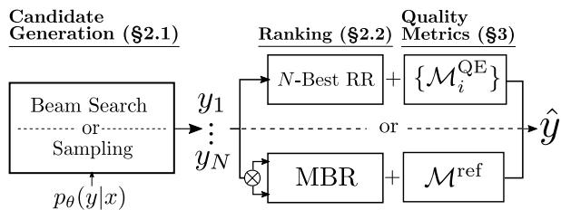
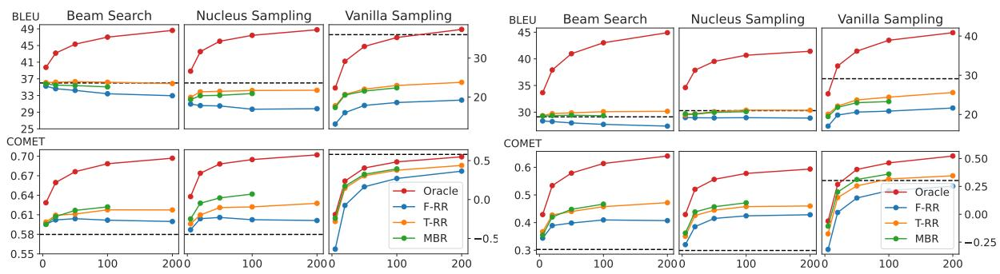
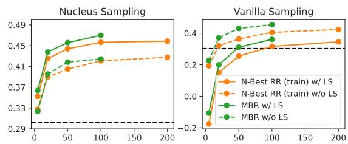
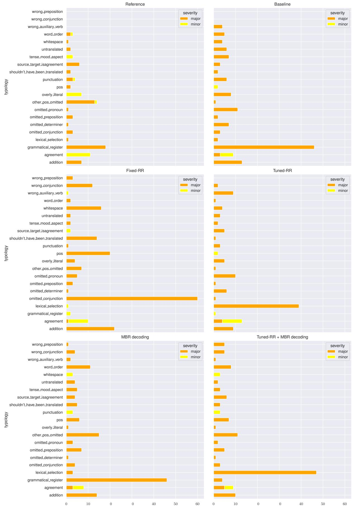
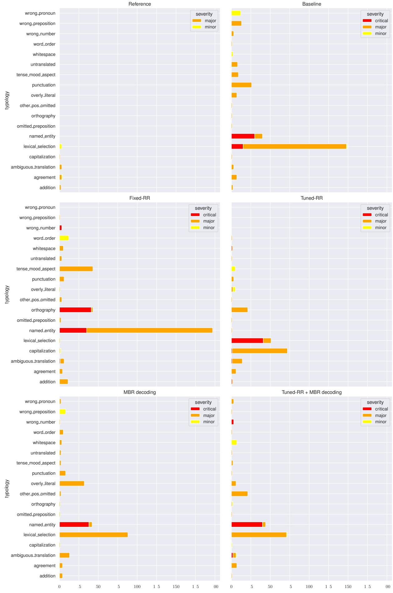

# Quality-Aware Decoding for Neural Machine Translation

Patrick Fernandes∗,1,2,3 António Farinhas∗,2,3 Ricardo Rei2,4,5 José G. C. de Souza5

Perez Ogayo1 Graham Neubig1 André F. T. Martins2,3,5

1Carnegie Mellon University 2Instituto Superior Técnico (Lisbon ELLIS Unit)

3Instituto de Telecomunicações 4INESC-ID 5Unbabel

pfernand@cs.cmu.edu antonio.farinhas@tecnico.ulisboa.pt

## Abstract

Despite the progress in machine translation quality estimation and evaluation in the last years, decoding in neural machine translation (NMT) is mostly oblivious to this and centers around finding the most probable translation according to the model (MAP decoding), approximated with beam search. In this paper, we bring together these two lines of research and propose quality-aware decoding for NMT, by leveraging recent breakthroughs in reference-free and reference-based MT evaluation through various inference methods like N-best reranking and minimum Bayes risk decoding. We perform an extensive comparison of various possible candidate generation and ranking methods across four datasets and two model classes and find that quality-aware decoding consistently outperforms MAP-based decoding according both to state-of-the-art automatic metrics (COMET and BLEURT) and to human assessments. Our code is available at https://github.com/deep-spin/ qaware-decode.

## 1 Introduction

The most common procedure in neural machine translation (NMT) is to train models using maximum likelihood estimation (MLE) at training time, and to decode with beam search at test time, as a way to approximate maximum-a-posteriori (MAP) decoding. However, several works have questioned the utility of model likelihood as a good proxy for translation quality (Koehn and Knowles, 2017; Ott et al., 2018; Stahlberg and Byrne, 2019; Eikema and Aziz, 2020). In parallel, significant progress has been made in methods for quality estimation and evaluation of generated translations (Specia et al., 2020; Mathur et al., 2020b), but this progress is, by and large, not yet reflected in either training or decoding methods. Exceptions such as minimum risk training (Shen et al., 2016; Edunov et al., 2018)

  
Figure 1: Quality-aware decoding framework. First, translation candidates are generated according to the model. Then, using reference-free and/or referencebased MT metrics, these candidates are ranked, and the highest ranked one is picked as the final translation.

come at a cost of more expensive and unstable training, often with modest quality improvements.

An appealing alternative is to modify the decoding procedure only, separating it into two stages: candidate generation (§2.1; where candidates are generated with beam search or sampled from the whole distribution) and ranking (§2.2; where they are scored using a quality metric of interest, and the translation with the highest score is picked). This strategy has been explored in approaches using N-best reranking (Ng et al., 2019; Bhattacharyya et al., 2021) and minimum Bayes risk (MBR) decoding (Shu and Nakayama, 2017; Eikema and Aziz, 2021; Müller and Sennrich, 2021). While this previous work has exhibited promising results, it has mostly focused on optimizing lexical metrics such as BLEU or METEOR (Papineni et al., 2002; Lavie and Denkowski, 2009), which have limited correlation with human judgments (Mathur et al., 2020a; Freitag et al., 2021a). Moreover, a rigorous apples-to-apples comparison among this suite of techniques and their variants is still missing, even though they share similar building blocks.

Our work fills these gaps by asking the question:

“Can we leverage recent advances in MT quality evaluation to generate better translations? If so, how can we most effectively do so?”

To answer this question, we systematically explore

NMT decoding using a suite of ranking procedures. We take advantage of recent state-of-theart learnable metrics, both reference-based, such as COMET and BLEURT (Rei et al., 2020a; Sellam et al., 2020), and reference-free (also known as quality estimation; QE), such as TransQuest and OpenKiwi (Ranasinghe et al., 2020; Kepler et al., 2019). We compare different ranking strategies under a unified framework, which we name quality-aware decoding (§3). First, we analyze the performance of decoding using N-best reranking, both fixed according to a single metric and learned using multiple metrics, where the coefficients for each metric are optimized according to a reference-based metric. Second, we explore ranking using reference-based metrics directly through MBR decoding. Finally, to circumvent the expensive computational cost of the latter when the number of candidates is large, we develop a two-stage ranking procedure, where we use N-best reranking to pick a subset of the candidates to be ranked through MBR decoding. We explore the interaction of these different ranking methods with various candidate generation procedures including beam search, vanilla sampling, and nucleus sampling.

Experiments with two model sizes and four datasets (§4) reveal that while MAP-based decoding appears competitive when evaluating with lexical-based metrics (BLEU and ChrF), the story is very different with state-of-the-art evaluation metrics, where quality-aware decoding shows significant gains, both with N-best reranking and MBR decoding. We perform a human-study to more faithfully evaluate our systems and find that, while performance on learnable metrics is not always predictive of the best system, quality-aware decoding usually results in translations with higher quality than MAP-based decoding.

## 2 Candidate Generation and Ranking

We start by reviewing some of the most commonly used methods for both candidate generation and ranking under a common lens.

## 2.1 Candidate Generation

An NMT model defines a probability distribution $p _ { \theta } ( y | x )$ over a set of hypotheses , conditioned on a source sentence x, where θ are learned parameters. A translation is typically predicted using

MAP decoding, formalized as

$$
\hat { y } _ { \mathrm { M A P } } = \underset { y \in \mathcal { V } } { \arg \operatorname* { m a x } } \ \log p _ { \theta } ( y | x ) .\tag{1}
$$

In words, MAP decoding searches for the most probable translation under $p _ { \theta } ( y | x )$ , i.e., the mode of the model distribution. Finding the exact yˆMAP is intractable since the search space $\mathcal { V }$ is combinatorially large, thus, approximations like beam search (Graves, 2012; Sutskever et al., 2014) are used. However, it has been shown that the translation quality degrades for large values of the beam size (Koehn and Knowles, 2017; Yang et al., 2018; Murray and Chiang, 2018; Meister et al., 2020), with the empty string often being the true MAP hypothesis (Stahlberg and Byrne, 2019).

A stochastic alternative to beam search is to draw samples directly from $p _ { \theta } ( y | x )$ with ancestral sampling, optionally with variants that truncate this distribution, such as top-k sampling (Fan et al., 2018) or p-nucleus sampling (Holtzman et al., 2020) – the latter samples from the smallest set of words whose cumulative probability is larger than a predefined value $p .$ Deterministic methods combining beam and nucleus search have also been proposed (Shaham and Levy, 2021).

Unlike beam search, sampling is not a search algorithm nor a decision rule – it is not expected for a single sample to outperform MAP decoding (Eikema and Aziz, 2020). However, samples from the model can still be useful for alternative decoding methods, as we shall see. While beam search focus on high probability candidates, typically similar to each other, sampling allows for more exploration, leading to higher candidate diversity.

## 2.2 Ranking

We assume access to a set $\bar { \mathcal { V } } \subseteq \mathcal { V }$ containing N candidate translations for a source sentence, obtained with one of the generation procedures described in §2.1. As long as N is relatively small, it is possible to (re-)rank these candidates in a posthoc manner, such that the best translation maximizes a given metric of interest. We highlight two different lines of work for ranking in MT decoding: first, N-best reranking, using reference-free metrics as features; second, MBR decoding, using reference-based metrics.

## 2.2.1 N-best Reranking

In its simplest form (which we call fixed reranking), a single feature f is used (e.g., an estimated quality

score), and the candidate that maximizes this score is picked as the final translation,

$$
\hat { y } _ { \mathrm { F - R R } } = \underset { y \in \bar { \mathcal { D } } } { \arg \operatorname* { m a x } } \ f ( y ) .\tag{2}
$$

When multiple features $[ f _ { 1 } , \ldots , f _ { K } ]$ are available, one can tune weights $[ w _ { 1 } , \dots , w _ { K } ]$ for these features to maximize a given reference-based evaluation metric on a validation set (Och, 2003; Duh and Kirchhoff, 2008) – we call this tuned reranking. In this case, the final translation is

$$
\hat { y } _ { \mathtt { T - R R } } = \underset { y \in \bar { \mathcal { V } } } { \arg \operatorname* { m a x } } \ \sum _ { k = 1 } ^ { K } w _ { k } f _ { k } ( y ) .\tag{3}
$$

2.2.2 Minimum Bayes Risk (MBR) Decoding While the techniques above rely on reference-free metrics for the computation of features, MBR decoding uses reference-based metrics to rank candidates. Unlike MAP decoding, which searches for the most probable translation, MBR decoding aims to find the translation that maximizes the expected utility (equivalently, that minimizes risk, Kumar and Byrne 2002, 2004; Eikema and Aziz 2020). Let again $\bar { \mathcal { V } } \subseteq \mathcal { V }$ be a set containing N hypotheses and $u ( y ^ { * } , y )$ a utility function measuring the similarity between a hypothesis $y \in \mathcal { V }$ and a reference $y ^ { \ast } \in \bar { \mathcal { N } }$ (e.g, an automatic evaluation metric such as BLEU or COMET). MBR decoding seeks for

$$
\begin{array} { r } { \hat { y } _ { \mathrm { M B R } } = \arg \operatorname* { m a x } _ { { \boldsymbol y } \in \bar { \mathcal { V } } } \quad \underbrace { \mathbb { E } _ { \boldsymbol Y \sim p _ { \boldsymbol \theta } ( { \boldsymbol y } \mid x ) } [ { \boldsymbol u } ( \boldsymbol { Y } , { \boldsymbol y } ) ] } _ { \approx ~ \frac { 1 } { M } \sum _ { j = 1 } ^ { M } u ( { \boldsymbol y } ^ { ( j ) } , { \boldsymbol y } ) } ~ , } \end{array}\tag{4}
$$

where in $\operatorname { E q } .$ 4 the expectation is approximated as a Monte Carlo (MC) sum using model samples $y ^ { ( 1 ) } , \ldots , y ^ { ( M ) } \sim p _ { \theta } ( y | x ) . ^ { 1 }$ In practice, the translation with the highest expected utility can be computed by comparing each hypothesis $y \in \bar { \mathcal { D } }$ to all the other hypotheses in the set.

## 3 Quality-Aware Decoding

While recent works have explored various combinations of candidate generation and ranking procedures for NMT (Lee et al., 2021; Bhattacharyya et al., 2021; Eikema and Aziz, 2021; Müller and Sennrich, 2021), they suffer from two limitations:

• The ranking procedure is usually based on simple lexical-based metrics (BLEU, chrF, METEOR).

Although these metrics are well established and inexpensive to compute, they correlate poorly with human judgments at segment level (Mathur et al., 2020b; Freitag et al., 2021c).

• Each work independently explores N-best reranking or MBR decoding, making unclear which method produces better translations.

In this work, we hypothesize that using more powerful metrics in the ranking procedure may lead to better quality translations. We propose a unified framework for ranking with both reference-based (§3.1) and reference-free metrics (§3.2), independently of the candidate generation procedure. We explore four methods with different computational costs for a given number of candidates, N.

Fixed N-best Reranker. An N-best reranker using a single reference-free metric (§3.2) as a feature, according to Eq. 2. The computational cost of this ranker is $\mathcal { O } ( N \times C _ { \mathcal { M } ^ { \mathrm { Q E } } } )$ , where $C _ { \mathcal { M } \mathrm { Q E } }$ denotes the cost of running an evaluation with a metric $\mathcal { M } ^ { \mathrm { Q E } }$

Tuned N-best Reranker. An N-best reranker using as features all the reference-free metrics in §3.2, along with the model log-likelihood log $p _ { \theta } ( y | x )$ The weights in Eq. 3 are optimized to maximize a given reference-based metric ${ \mathcal { M } } ^ { \mathrm { r e f } }$ using MERT (Och, 2003), a coordinate-ascent optimization algorithm widely used in previous work. Note that $\mathcal { M } ^ { \mathrm { r e f } }$ is used for tuning only; at test time, only reference-free metrics are used. Therefore, the decoding cost is $\begin{array} { r } { \mathcal { O } ( N \times \sum _ { i } C _ { \mathcal { M } _ { i } ^ { \mathrm { Q E } } } ) } \end{array}$

MBR Decoding. Choosing as the utility function a reference-based metric $\mathcal { M } ^ { \mathrm { r e f } }$ (§3.1), we estimate the utility using a simple Monte Carlo sum, as shown in Eq. 4. The estimation requires computing pairwise comparisons and thus the cost of running MBR decoding is $\mathcal { O } ( N ^ { 2 } \times C _ { \mathcal { M } ^ { \mathrm { r e f } } } )$

N-best Reranker MBR. Using a large number of samples in MBR decoding is expensive due to its quadratic cost. To circumvent this issue, we explore a two-stage ranking approach: we first rank all the candidates using a tuned N-best reranker, followed by MBR decoding using the top M candidates. The computational cost becomes $\begin{array} { r } { \mathcal { O } ( N \times \sum _ { i } C _ { M _ { i } } + M ^ { 2 } \times C _ { \mathcal { M } ^ { \mathrm { r e f } } } ) } \end{array}$ . The first ranking stage prunes the candidate list to a smaller, higher quality subset, making possible a more accurate estimation of the utility with less samples, and potentially allowing a better ranker than plain MBR for almost the same computational budget.

## 3.1 Reference-based Metrics

Reference-based metrics are the standard way to evaluate MT systems; the most used ones rely on the lexical overlap between hypotheses and reference translations (Papineni et al., 2002; Lavie and Denkowski, 2009; Popovic´, 2015). However, lexical-based approaches have important limitations: they have difficulties recognizing correct translations that are paraphrases of the reference(s); they ignore the source sentence, an important indicator of meaning for the translation; and they do not always correlate well with human judgments, particularly at segment-level (Freitag et al., 2021c).

In this work, apart from BLEU (computed using SacreBLEU2 (Post, 2018)) and chrF, we use the following state-of-the-art trainable referencebased metrics for both ranking and performance evaluation of MT systems:

• BLEURT (Sellam et al., 2020; Pu et al., 2021), trained to regress on human direct assessments (DA; Graham et al. 2013). We use the largest multilingual version, BLEURT-20, based on the RemBERT model (Chung et al., 2021).

• COMET (Rei et al., 2020a), based on XLM-R (Conneau et al., 2020), trained to regress on quality assessments such as DA using both the reference and the source to assess the quality of a given translation. We use the publicly available model developed for the WMT20 metrics shared task (wmt20-comet-da).

These metrics have shown much better correlation at segment-level than previous lexical metrics in WMT metrics shared tasks (Mathur et al., 2020b; Freitag et al., 2021c). Hence, as discussed in §2.2, they are good candidates to be used either indirectly as an optimization objective for learning the tuned reranker’s feature weights, or directly as a utility function in MBR decoding. In the former, the higher the metric correlation with human judgment, the better the translation picked by the tuned reranker. In the latter, we approximate the expected utility in Eq. 4 by letting a candidate generated by the model be a reference translation – a suitable premise if the model is good in expectation.

## 3.2 Reference-free Metrics

MT evaluation metrics have also been developed for the case where references are not available – they are called reference-free or quality estimation (QE) metrics. In the last years, considerable improvements have been made to such metrics, with state-of-the-art models having increasing correlations with human annotators (Freitag et al., 2021c; Specia et al., 2021). These improvements enable the use of such models for ranking translation hypotheses in a more reliable way than before.

In this work, we explore four recently proposed reference-free metrics as features for N-best reranking, all at the sentence-level:

• COMET-QE (Rei et al., 2020b), a reference-free version of COMET (§3.1). It was the winning submission for the QE-as-a-metric subtask of the WMT20 shared task (Mathur et al., 2020b).

• TransQuest (Ranasinghe et al., 2020), the winning submission for the sentence-level DA prediction subtask of the WMT20 QE shared task (Specia et al., 2020). Similarly to COMET-QE this metric predicts a DA score.

• MBART-QE (Zerva et al., 2021), based on the mBART (Liu et al., 2020) model, trained to predict both the mean and the variance of DA scores. It was a top performer in the WMT21 QE shared task (Specia et al., 2021).

• OpenKiwi-MQM (Kepler et al., 2019; Rei et al., 2021), based on XLM-R, trained to predict the multidimensional quality metric (MQM; Lommel et al. 2014).3 This reference-free metric was ranked second on the QE-as-a-metric subtask from the WMT 2021 metrics shared task.

## 4 Experiments

## 4.1 Setup

We study the benefits of quality-aware decoding over MAP-based decoding in two regimes:

• A high-resource, unconstrained, setting with large transformer models (6 layers, 16 attention heads, 1024 embedding dimensions, and 8192 hidden dimensions) trained by Ng et al. (2019) for the WMT19 news translation task (Barrault et al., 2019), using English to German (EN DE) and English to Russian (EN RU) language pairs. These models were trained on over 20 million parallel and 100 million backtranslated sentences, being the winning submissions of that year’s shared task. We consider the non-ensembled version of the model and use newstest19 for validation and newstest20 for testing.

  
Figure 2: Values for BLEU (top) and COMET (bottom) for EN DE as we increase the number of candidates for different generation and ranking procedures, as well as oracles with the respective metrics, for the large (left) and small (right) models. Baseline values (with beam size of 5) are marked with a dashed horizontal line.

• A more constrained scenario with a small transformer model (6 layers, 4 attention heads, 512 embedding dimensions, and 1024 hidden dimensions) trained from scratch in Fairseq (Ott et al., 2019) on the smaller IWSLT17 datasets (Cettolo et al., 2012) for English to German (EN  DE) and English to French (EN FR), each with a little over 200k training examples. We chose these datasets because they have been extensively used in previous work (Bhattacharyya et al., 2021) and smaller model allows us to answer questions about how the training methodology affects ranking performance (see § 4.2.2). Further training details can be found in Appendix A.

We use beam search with a beam size of 5 as our decoding baseline because we found that it resulted in better or similar translations than larger beam sizes. For tuned N-best reranking, we use Travatar’s (Neubig, 2013) implementation of MERT (Och, 2003) to optimize the weight of each feature, as described in §3.2. Finally, we evaluate each system using the metrics discussed in §3.1, along with BLEU and chrF (Popovic´, 2015).

## 4.2 Results

Overall, given all the metrics, candidate generation, and ranking procedures, we evaluate over 150 systems per dataset. We report subsets of this data separately to answer specific research questions, and defer to Appendix B for additional results.

## 4.2.1 Impact of Candidate Generation

First, we explore the impact of the candidate generation procedure and the number of candidates.

Which candidate generation method works best, beam search or sampling? We generate candidates with beam search, vanilla sampling, and nucleus sampling. For the latter, we use $p = 0 . 6$ based on early results showing improved performance for all metrics.4 For N-best reranking, we use up to 200 samples; for MBR decoding, due to the quadratic computational cost, we use up to 100.

Figure 2 shows BLEU and COMET for different candidate generation and ranking methods for the EN DE WMT20 and IWSLT17 datasets, with increasing number of candidates. The baseline is represented by the dashed line. To assess the performance ceiling of the rankers, we also report results with an oracle ranker for the reported metrics, picking the candidate that maximizes it. For thefixed N-best reranker, we use COMET-QE as a metric, albeit the results for other reference-free metrics are similar. Performance seems to scale well with the number of candidates, particularly for vanilla sampling and for the tuned N-best reranker and MBR decoder. (Lee et al., 2021; Müller and Sennrich, 2021). However, all the rankers using vanilla sampling severely under-perform the baseline in most cases (see also §4.2.2). In contrast, the rankers using beam search or nucleus sampling are competitive or outperform the baseline in terms of BLEU, and greatly outperform it in terms of COMET. For the larger models, we see that the performance according to the lexical metrics degrades with more candidates. In this scenario, rankers using nucleus sampling seem to have an edge over the ones that use beam search for COMET.

  
Figure 3: COMET scores for EN DE (IWSLT17) for models trained with and without label smoothing.

Based on the findings above, and due to generally better performance of COMET over BLEU for MT evaluation (Kocmi et al., 2021), in following experiments we use nucleus sampling with the large model and beam search with the small model.

## 4.2.2 Impact of Label Smoothing

How does label smoothing affect candidate generation? Label smoothing (Szegedy et al., 2016) is a regularization technique that redistributes probability mass from the gold label to the other target labels, typically preventing the model from becoming overconfident (Müller et al., 2019). However, it has been found that label smoothing negatively impacts model fit, compromising the performance of MBR decoding (Eikema and Aziz, 2020, 2021). Thus, we train a small transformer model without label smoothing to verify its impact in the performance of N-best reranking and MBR decoding. Figure 3 shows that disabling label smoothing really helps when generating candidates using vanilla sampling. However, the performance degrades for candidates generated using nucleus sampling when we disable label smoothing, hinting that the pruning mechanism of nucleus sampling may help mitigate the negative impact of label smoothing in sampling based approaches. Even without label smoothing, vanilla sampling is not competitive with nucleus sampling or beam search with label smoothing, thus, we do not experiment further with it.

## 4.2.3 Impact of Ranking and Metrics

We now investigate the usefulness of the metrics presented in §3 as features and objectives for ranking. For N-best reranking, we use all the available candidates (200) while, for MBR, due to the computational cost of using 100 candidates, we report results with 50 candidates only (we found that ranking with tuned N-best reranking with N = 100 and MBR with N = 50 takes about the same time). We report results in Table 1, and use them to answer some specific research questions.

Which QE metric works best in a fixed N-best reranker? We consider a fixed N-best reranker with a single reference-free metric as a feature (see Table 1, second group). While none of the metrics allows for improving the baseline results in terms of the lexical metrics (BLEU and chrF), rerankers using COMET-QE or MBART-QE outperform the baseline according to BLEURT and COMET, for both the large and small models. Due to the aforementioned better performance of these metrics for translation quality evaluation, we hypothesize that these rankers produce better translations than the baseline. However, since the sharp drop in the lexical metrics is concerning, we will verify this hypothesis in a human study, in §4.2.4.

How does the performance of a tuned N-best reranker vary when we change the optimization objective? We consider a tuned N-best reranker using as features all the reference-free metrics in §3.2, and optimized using MERT. Table 1 (3rd group) shows results for EN DE. For the small model, all the rankers show improved results over the baseline for all the metrics. In particular, optimizing for BLEU leads to the best results in the lexical metrics, while optimizing for BLEURT leads to the best performance in the others. Finally, optimizing for COMET leads to similar performance than optimizing for BLEURT. For the large model, although none of the rerankers is able to outperform the baseline in the lexical metrics, we see similar trends as before for BLEURT and COMET.

How does the performance of MBR decoding vary when we change the utility function? Table 1 (4th group) shows the impact of the utility function (BLEU, BLEURT, or COMET). For the small model, using COMET leads to the best performance according to all the metrics except BLEURT (for which the best result is attained when optimizing itself). For the large model, the best result according to a given metric is obtained when using that metric as the utility function.

How do (tuned) N-best reranking and MBR compare to each other? Looking at Table 1 we see that, for the small model, N-best reranking seems to perform better than MBR decoding in all the evaluation metrics, including the one used as the utility function in MBR decoding. The picture is less clear for the large model, with MBR decoding achieving best values for a given fine-tuned metric when using it as the utility; this comes at the cost of worse performance according to the other metrics, hinting at a potential “overfitting” effect. Overall, N-best reranking seems to have an edge over MBR decoding. We will further clarify this question with human evaluation in § 4.2.4.

<table><tr><td rowspan="2"></td><td colspan="4">Large (WMT20)</td><td colspan="4">Small (IWSLT)</td></tr><tr><td>BLEU</td><td>chrF</td><td>BLEURT</td><td>COMET</td><td>BLEU</td><td>chrF</td><td>BLEURT</td><td>COMET</td></tr><tr><td>Baseline</td><td>36.01</td><td>63.88</td><td>0.7376</td><td>0.5795</td><td>29.12</td><td>56.23</td><td>0.6635</td><td>0.3028</td></tr><tr><td>F-RR w/ COMET-QE</td><td>29.83</td><td>59.91</td><td>0.7457</td><td>0.6012</td><td>27.38</td><td>54.89</td><td>0.6848</td><td>0.4071</td></tr><tr><td>F-RR w/ MBART-QE</td><td>32.92</td><td>62.71</td><td>0.7384</td><td>0.5831</td><td>27.30</td><td>55.62</td><td>0.6765</td><td>0.3533</td></tr><tr><td>F-RR w/ OpenKiwi</td><td>30.38</td><td>59.56</td><td>0.7401</td><td>0.5623</td><td>25.35</td><td>51.53</td><td>0.6524</td><td>0.2200</td></tr><tr><td>F-RR w/ Transquest</td><td>31.28</td><td>60.94</td><td>0.7368</td><td>0.5739</td><td>26.90</td><td>54.46</td><td>0.6613</td><td>0.2999</td></tr><tr><td>T-RR w/ BLEU</td><td>35.34</td><td>63.82</td><td>0.7407</td><td>0.5891</td><td>30.51</td><td>57.73</td><td>0.7077</td><td>0.4536</td></tr><tr><td>T-RR w/ BLEURT</td><td>33.39</td><td>62.56</td><td>0.7552</td><td>0.6217</td><td>30.16</td><td>57.40</td><td>0.7127</td><td>0.4741</td></tr><tr><td>T-RR w/ COMET</td><td>34.26</td><td>63.31</td><td>0.7546</td><td>0.6276</td><td>30.16</td><td>57.32</td><td>0.7124</td><td>0.4721</td></tr><tr><td>MBR w/ BLEU</td><td>34.94</td><td>63.21</td><td>0.7333</td><td>0.5680</td><td>29.25</td><td>56.36</td><td>0.6619</td><td>0.3017</td></tr><tr><td>MBR w/ BLEURT</td><td>32.90</td><td>62.34</td><td>0.7649</td><td>0.6047</td><td>28.69</td><td>56.28</td><td>0.7051</td><td>0.3799</td></tr><tr><td>MBR w/ COMET</td><td>33.04</td><td>62.65</td><td>0.7477</td><td>0.6359</td><td>29.43</td><td>56.74</td><td>0.6882</td><td>0.4480</td></tr><tr><td>T-RR+MBR w/ BLEU</td><td>35.84</td><td>63.96</td><td>0.7395</td><td>0.5888</td><td>30.23</td><td>57.34</td><td>0.6913</td><td>0.3969</td></tr><tr><td>T-RR+MBR w/ BLEURT</td><td>33.61</td><td>62.95</td><td>0.7658</td><td>0.6165</td><td>29.28</td><td>56.77</td><td>0.7225</td><td>0.4361</td></tr><tr><td>T-RR+MBR w/ COMET</td><td>34.20</td><td>63.35</td><td>0.7526</td><td>0.6418</td><td>29.46</td><td>57.13</td><td>0.7058</td><td>0.5005</td></tr></table>

Table 1: Evaluation metrics for EN DE for the large and small model settings, using a fixed N-best reranker (F-RR), a tuned N-best reranker (T-RR), MBR decoding, and a two-stage approach. Best overall values are bolded and best for each specific group are underlined.

Can we improve performance by combining Nbest reranking with MBR decoding? Table 1 shows that, for both the large and the small model, the two-stage ranking approach described in §3 leads to the best performance according to the fine-tuned metrics. In particular, the best result is obtained when the utility function is the same as the evaluation metric. These results suggest that a promising research direction is to seek more sophisticated pruning strategies for MBR decoding.

## 4.2.4 Human Evaluation

Which metric correlates more with humanjudgments? How risky is it to optimize a metric and evaluate on a related metric? Our experiments suggest that, overall, quality-aware decoding produces translations with better performance across most metrics than MAP-based decoding. However, for some cases (such as fixed N-best reranking and most results with the large model), there is a concerning “metric gap” between lexical-based and fine-tuned metrics. While the latter have shown to correlate better with human judgments, previous work has not attempted to explicitly optimize these metrics, and doing so could lead to ranking systems that learn to exploit “pathologies” in these metrics rather than improving translation quality. To investigate this hypothesis, we perform a human study across all four datasets. We ask annotators to rate, from 1 (no overlap in meaning) to 5 (perfect translation), the translations produced by the 4 ranking systems in §3, as well as the baseline translation and the reference. Further details are in App. C. We choose COMET-QE as the feature for the fixed N-best ranker and COMET as the optimization metric and utility function for the tuned N-best reranker and MBR decoding, respectively. The reasons for this are two-fold: (1) they are currently the reference-free and reference-based metrics with highest reported correlation with human judgments (Kocmi et al., 2021), (2) we saw the largest “metric gap” for systems based on these metrics, hinting of a potential “overfitting” problem (specially since COMET-QE and COMET are similar models).

Table 2 shows the results for the human evaluation, as well as the automatic metrics. We see that, with the exception of T-RR w/ COMET, when fine-tuned metrics are explicitly optimized for, their correlation with human judgments decreases and they are no longer reliable indicators of systemlevel ranking. This is notable for the fixed N-best reranker with COMET-QE, which outperforms the baseline in COMET for every single scenario, but leads to markedly lower quality translations. However, despite the potential for overfitting these metrics, we find that tuned N-best reranking, MBR, and their combination consistently achieve better translation quality than the baseline, specially with the small model. In particular, N-best reranking results in better translations than MBR, and their combination is the best system in 2 of 4 LPs.

<table><tr><td rowspan="2"></td><td colspan="5">EN-DE (WMT20)</td><td colspan="5">EN-RU (WMT20)</td></tr><tr><td>BLEU</td><td>chrF</td><td>BLEURT</td><td>COMET</td><td>Human R.</td><td>BLEU</td><td>chrF</td><td>BLEURT</td><td>COMET</td><td>Human R.</td></tr><tr><td>Reference</td><td></td><td>=</td><td></td><td></td><td>4.51</td><td></td><td></td><td></td><td></td><td>4.07</td></tr><tr><td>Baseline</td><td>36.01</td><td>63.88</td><td>0.7376</td><td>0.5795</td><td>4.28</td><td>23.86</td><td>51.16</td><td>0.6953</td><td>0.5361</td><td>3.62</td></tr><tr><td>F-RR w/ COMET-QE</td><td>29.83</td><td>59.91</td><td>0.7457</td><td>0.6012</td><td>4.19</td><td>20.32</td><td>49.18</td><td>0.7130</td><td>0.6207</td><td>3.25</td></tr><tr><td>T-RR w/ COMET</td><td>34.26</td><td>63.31</td><td>0.7546</td><td>0.6276</td><td>4.33</td><td>22.42</td><td>50.91</td><td>0.7243</td><td>0.6441</td><td>3.65</td></tr><tr><td>MBR w/ COMET</td><td>33.04</td><td>62.65</td><td>0.7477</td><td>0.6359</td><td>4.27</td><td>23.67</td><td>51.18</td><td>0.7093</td><td>0.6242</td><td>3.66</td></tr><tr><td>T-RR + MBR w/ COMET</td><td>34.20</td><td>63.35</td><td>0.7526</td><td>0.6418</td><td>4.30</td><td>23.21</td><td>51.26</td><td>0.7238</td><td>0.6736</td><td>3.72†</td></tr><tr><td></td><td colspan="4">EN-DE (IWSLT17)</td><td></td><td colspan="4">EN-FR (IWSLT17)</td><td></td></tr><tr><td>Reference</td><td></td><td>=</td><td>=</td><td>=</td><td>4.38</td><td></td><td>=</td><td>=</td><td>=</td><td>4.00</td></tr><tr><td>Baseline</td><td>29.12</td><td>0.6635</td><td>56.23</td><td>0.3028</td><td>3.68</td><td>38.12</td><td>0.6532</td><td>63.20</td><td>0.4809</td><td>3.92</td></tr><tr><td>F-RR w/ COMET-QE</td><td>27.38</td><td>0.6848</td><td>54.89</td><td>0.4071</td><td>3.67</td><td>35.59</td><td>0.6628</td><td>60.90</td><td>0.5553</td><td>3.63</td></tr><tr><td>T-RR w/ COMET</td><td>30.16</td><td>0.7124</td><td>57.32</td><td>0.4721</td><td>3.90†</td><td>38.60</td><td>0.7020</td><td>63.77</td><td>0.6392</td><td>4.05†</td></tr><tr><td>MBR w/ COMET</td><td>29.43</td><td>0.6882</td><td>56.74</td><td>0.4480</td><td>3.79†</td><td>37.77</td><td>0.6710</td><td>63.24</td><td>0.6127</td><td>4.05†</td></tr><tr><td>T-RR + MBR w/ COMET</td><td>29.46</td><td>0.7058</td><td>57.13</td><td>0.5005</td><td>3.83†</td><td>38.33</td><td>0.6883</td><td>63.53</td><td>0.6610</td><td>4.09†</td></tr></table>

Table 2: Results for automatic and human evaluation. Top: WMT20 (large models); Bottom: IWSLT17 (small models). Methods with † are statistically significantly better than the baseline, with $p < 0 . 0 5$

## 4.2.5 Improved Human Evaluation

To further investigate how quality-aware decoding performs when compared to MAP-based decoding, we perform another human study, this time based on expert-level multidimensional quality metrics (MQM) annotations (Lommel et al., 2014). We asked the annotators to identify all errors and independently label them with an error category (accuracy,fluency, and style, each with a specific set of subcategories) and a severity level (minor, major, and critical). In order to obtain the final sentencelevel scores, we require a weighting scheme on error severities. We use weights of 1, 5, and 10 to minor, major, and critical errors, respectively, independently of the error category. Further details are in App. D. Given the cost of performing a human study like this, we restrict our analysis to the translations generated by the large models trained on WMT20 (EN DE and EN RU).

Table 3 shows the results for the human evaluation using MQM annotations, including both error severity counts and final MQM scores. As hinted in §4.2.4, despite the remarkable performance of the F-RR with COMET-QE in terms of COMET (see Table 2), the quality of the translations decreases when compared to the baseline, suggesting the possibility of metric overfitting when evaluating systems using a single automatic metric that was directly optimized for (or a similar one). However, for both language pairs, the T-RR with COMET and the two stage approach (T-RR + MBR with

COMET) achieve the highest MQM score. In addition, these systems present the smallest number of errors when combining both major and critical errors.

Although the performance of all systems is comparable for EN DE, both the T-RR and the T-RR+MBR decoding markedly reduce the number of grammatical register errors related to using pronouns and verb forms that are not compliant with the register required for that translation, at the cost of increasing the number of lexical selection errors (see Figure 4). For EN RU, however, the number of lexical selection errors produced when using the T-RR or the T-RR+MBR decoding is approximately a half of the ones produced by the baseline (see Figure 5). In this case, this comes at apparently almost no cost in other error types, leading to significantly better results, as shown in Table 3.

## 5 Related Work

Reranking. Inspired by the work of Shen et al. (2004) on discriminative reranking for SMT, Lee et al. (2021) trained a large transformer model using a reranking objective to optimize BLEU. Our work differs in which our rerankers are much simpler and therefore can be tuned on a validation set; and we use more powerful quality metrics instead of BLEU. Similarly, Bhattacharyya et al. (2021) learned an energy-based reranker to assign lower energy to the samples with higher BLEU scores. While the energy model plays a similar role to a QE system, our work differs in two ways: we use an existing, pretrained QE model instead of training a dedicated reranker, making our approach applicable to any MT system without further training; and the QE model is trained to predict human assessments, rather than BLEU scores. Leblond et al. (2021) compare a reinforcement learning approach to reranking approaches (but not MBR decoding, as we do). They investigate the use of reference-based metrics and, for the reward function, a referencefree metric based on a modified BERTScore (Zhang et al., 2020). This new multilingual BERTScore is not fine-tuned on human judgments as COMET and BLEURT and it is unclear what its level of agreement with human judgments is. Another line of work is generative reranking, where the reranker is not trained to optimize a metric, but rather as a generative noisy-channel model (Yu et al., 2017; Yee et al., 2019; Ng et al., 2019).

<table><tr><td rowspan="3"></td><td colspan="4">EN-DE (WMT20)</td><td colspan="4">EN-RU (WMT20)</td></tr><tr><td>Minor</td><td>Major</td><td>Critical</td><td>MQM</td><td>Minor</td><td>Major</td><td>Critical</td><td>MQM</td></tr><tr><td>Reference</td><td>24</td><td>67</td><td>0</td><td>97.04</td><td>5</td><td>11</td><td>0</td><td>99.30</td></tr><tr><td>Baseline</td><td>8</td><td>139</td><td>0</td><td>95.66</td><td>17</td><td>239</td><td>49</td><td>79.78</td></tr><tr><td>F-RR w/ COMET-QE</td><td>15</td><td>204</td><td>0</td><td>93.47</td><td>13</td><td>254</td><td>80</td><td>76.25</td></tr><tr><td>T-RR w/ COMET</td><td>12</td><td>109</td><td>0</td><td>96.20</td><td>9</td><td>141</td><td>45</td><td>85.97†</td></tr><tr><td>MBR w/ COMET</td><td>11</td><td>161</td><td>0</td><td>94.38</td><td>8</td><td>182</td><td>40</td><td>83.65</td></tr><tr><td>T-RR + MBR w/ COMET</td><td>10</td><td>138</td><td>0</td><td>95.44</td><td>11</td><td>134</td><td>45</td><td>86.78†</td></tr></table>

Table 3: Error severity counts and MQM scores for WMT20 (large models). Best overall values are bolded. Methods with † are statistically significantly better than the baseline, with $p < 0 . 0 5$

Minimum Bayes Risk Decoding. MBR decoding (Kumar and Byrne, 2002, 2004) has recently been revived for NMT using candidates generated with beam search (Stahlberg et al., 2017; Shu and Nakayama, 2017) and sampling (Eikema and Aziz, 2020; Müller and Sennrich, 2021). Eikema and Aziz (2021) also explore a two-stage approach for MBR decoding. Additionally, there is concurrent work by Freitag et al. (2021b) on using neural metrics as utility functions during MBR decoding: however they limit their scope to MBR with reference-based metrics, while we perform a more extensive evaluation over ranking methods and metrics. Amrhein and Sennrich (2022) also concurrently explored using MBR decoding with neural metrics, but with the purposes of identifying weaknesses in the metric (in their case COMET), similarly to the metric overfitting problem we discussed in §4.2.4. A comparison with N-best re-ranking was missing in these works, a gap our paper fills. A related line of work is minimum risk training (MRT; Smith and Eisner 2006; Shen et al. 2016), which trains models to minimize risk, allowing arbitrary non-differentiable loss functions (Edunov et al., 2018; Wieting et al., 2019) and avoiding exposure bias (Wang and Sennrich, 2020; Kiegeland and Kreutzer, 2021). However, MRT is considerably more expensive and difficult to train and the gains are often small. Incorporating our quality metrics in MRT is an exciting research direction.

## 6 Conclusions and Future Work

We leverage recent advances in MT quality estimation and evaluation and propose quality-aware decoding for NMT. We explore different candidate generation and ranking methods, with a comprehensive empirical analysis across four datasets and two model classes. We show that, compared to MAPbased decoding, quality-aware decoding leads to better translations, according to powerful automatic evaluation metrics and human judgments.

There are several directions for future work. Our ranking strategies increase accuracy but are substantially more expensive, particularly when used with costly metrics such as BLEURT and COMET. While reranking-based pruning before MBR decoding was found helpful, additional strategies such as caching encoder representations (Amrhein and Sennrich, 2022) and distillation (Pu et al., 2021) are promising directions.

## Acknowledgments

We would like to thank Ben Peters, Wilker Aziz, and the anonymous reviewers for useful feedback. This work was supported by the P2020 program MAIA (LISBOA-01-0247- FEDER-045909), the European Research Council (ERC StG DeepSPIN 758969), the European Union’s Horizon 2020 research and innovation program (QUARTZ grant agreement 951847), and by the Fundação para a Ciência e Tecnologia through UIDB/50008/2020.

## References

Chantal Amrhein and Rico Sennrich. 2022. Identifying weaknesses in machine translation metrics through

minimum bayes risk decoding: A case study for comet.

Loïc Barrault, Ondˇrej Bojar, Marta R. Costa-jussà, Christian Federmann, Mark Fishel, Yvette Graham, Barry Haddow, Matthias Huck, Philipp Koehn, Shervin Malmasi, Christof Monz, Mathias Müller, Santanu Pal, Matt Post, and Marcos Zampieri. 2019. Findings of the 2019 conference on machine translation (WMT19). In Proceedings ofthe Fourth Conference on Machine Translation (Volume 2: Shared Task Papers, Day 1), pages 1–61, Florence, Italy. Association for Computational Linguistics.

Sumanta Bhattacharyya, Amirmohammad Rooshenas, Subhajit Naskar, Simeng Sun, Mohit Iyyer, and Andrew McCallum. 2021. Energy-based reranking: Improving neural machine translation using energybased models. In Proceedings of the 59th Annual Meeting of the Association for Computational Linguistics and the 11th International Joint Conference on Natural Language Processing (Volume 1: Long Papers), pages 4528–4537, Online. Association for Computational Linguistics.

Mauro Cettolo, Christian Girardi, and Marcello Federico. 2012. WIT3: Web inventory of transcribed and translated talks. In Proceedings of the 16th Annual conference ofthe European Associationfor Machine Translation, pages 261–268, Trento, Italy. European Association for Machine Translation.

Hyung Won Chung, Thibault Fevry, Henry Tsai, Melvin Johnson, and Sebastian Ruder. 2021. Rethinking embedding coupling in pre-trained language models. In Tenth International Conference on Learning Representations, ICLR.

Alexis Conneau, Kartikay Khandelwal, Naman Goyal, Vishrav Chaudhary, Guillaume Wenzek, Francisco Guzmán, Edouard Grave, Myle Ott, Luke Zettlemoyer, and Veselin Stoyanov. 2020. Unsupervised cross-lingual representation learning at scale. In Proceedings of the 58th Annual Meeting of the Associationfor Computational Linguistics, pages 8440– 8451, Online. Association for Computational Linguistics.

Kevin Duh and Katrin Kirchhoff. 2008. Beyond loglinear models: Boosted minimum error rate training for n-best re-ranking. In Proceedings of ACL-08: HLT, Short Papers, pages 37–40, Columbus, Ohio. Association for Computational Linguistics.

Sergey Edunov, Myle Ott, Michael Auli, David Grangier, and Marc’Aurelio Ranzato. 2018. Classical structured prediction losses for sequence to sequence learning. In Proceedings of the 2018 Conference ofthe North American Chapter ofthe Associationfor Computational Linguistics: Human Language Technologies, Volume 1 (Long Papers), pages 355–364, New Orleans, Louisiana. Association for Computational Linguistics.

Bryan Eikema and Wilker Aziz. 2020. Is MAP decoding all you need? the inadequacy of the mode in neural

machine translation. In Proceedings ofthe 28th International Conference on Computational Linguistics, pages 4506–4520, Barcelona, Spain (Online). International Committee on Computational Linguistics.

Bryan Eikema and Wilker Aziz. 2021. Sampling-based minimum bayes risk decoding for neural machine translation.

Angela Fan, Mike Lewis, and Yann Dauphin. 2018. Hierarchical neural story generation. In Proceedings of the 56th Annual Meeting of the Association for Computational Linguistics (Volume 1: Long Papers), pages 889–898, Melbourne, Australia. Association for Computational Linguistics.

Markus Freitag, George Foster, David Grangier, Viresh Ratnakar, Qijun Tan, and Wolfgang Macherey. 2021a. Experts, errors, and context: A large-scale study of human evaluation for machine translation. Transactions ofthe Associationfor Computational Linguistics, 9:1460–1474.

Markus Freitag, David Grangier, Qijun Tan, and Bowen Liang. 2021b. Minimum bayes risk decoding with neural metrics of translation quality.

Markus Freitag, Ricardo Rei, Nitika Mathur, Chi-kiu Lo, Craig Stewart, George Foster, Alon Lavie, and Ondrej Bojar. 2021c. Results of the WMT21 Metrics Shared Task: Evaluating Metrics with Expert-based Human Evaluations on TED and News Domain. In Proceedings ofthe Sixth Conference on Machine Translation (WMT), pages 716–757. NRC.

Yvette Graham, Timothy Baldwin, Alistair Moffat, and Justin Zobel. 2013. Continuous measurement scales in human evaluation of machine translation. In Proceedings ofthe 7th Linguistic Annotation Workshop and Interoperability with Discourse, pages 33–41, Sofia, Bulgaria. Association for Computational Linguistics.

Alex Graves. 2012. Sequence transduction with recurrent neural networks.

Ari Holtzman, Jan Buys, Li Du, Maxwell Forbes, and Yejin Choi. 2020. The curious case of neural text degeneration. In Eighth International Conference on Learning Representations, ICLR.

Fabio Kepler, Jonay Trénous, Marcos Treviso, Miguel Vera, and André F. T. Martins. 2019. OpenKiwi: An open source framework for quality estimation. In Proceedings of the 57th Annual Meeting of the Association for Computational Linguistics: System Demonstrations, pages 117–122, Florence, Italy. Association for Computational Linguistics.

Samuel Kiegeland and Julia Kreutzer. 2021. Revisiting the weaknesses of reinforcement learning for neural machine translation. In Proceedings ofthe 2021 Conference of the North American Chapter of the Association for Computational Linguistics: Human Language Technologies, pages 1673–1681, Online. Association for Computational Linguistics.

Diederik P. Kingma and Jimmy Ba. 2015. Adam: A method for stochastic optimization. In Third International Conference on Learning Representations, ICLR.

Tom Kocmi, Christian Federmann, Roman Grundkiewicz, Marcin Junczys-Dowmunt, Hitokazu Matsushita, and Arul Menezes. 2021. To ship or not to ship: An extensive evaluation of automatic metrics for machine translation. In Proceedings ofthe Sixth Conference on Machine Translation, pages 478–494, Online. Association for Computational Linguistics.

Philipp Koehn and Rebecca Knowles. 2017. Six challenges for neural machine translation. In Proceedings of the First Workshop on Neural Machine Translation, pages 28–39, Vancouver. Association for Computational Linguistics.

Taku Kudo and John Richardson. 2018. SentencePiece: A simple and language independent subword tokenizer and detokenizer for neural text processing. In Proceedings of the 2018 Conference on Empirical Methods in Natural Language Processing: System Demonstrations, pages 66–71, Brussels, Belgium. Association for Computational Linguistics.

Shankar Kumar and William Byrne. 2002. Minimum bayes-risk word alignments of bilingual texts. In Proceedings ofthe ACL-02 Conference on Empirical Methods in Natural Language Processing - Volume 10, EMNLP ’02, page 140–147, USA. Association for Computational Linguistics.

Shankar Kumar and William Byrne. 2004. Minimum Bayes-risk decoding for statistical machine translation. In Proceedings ofthe Human Language Technology Conference ofthe North American Chapter of the Association for Computational Linguistics: HLT-NAACL 2004, pages 169–176, Boston, Massachusetts, USA. Association for Computational Linguistics.

Alon Lavie and Michael J. Denkowski. 2009. The meteor metric for automatic evaluation of machine translation. Machine Translation, 23(2-3):105–115.

Rémi Leblond, Jean-Baptiste Alayrac, Laurent Sifre, Miruna Pislar, Lespiau Jean-Baptiste, Ioannis Antonoglou, Karen Simonyan, and Oriol Vinyals. 2021. Machine translation decoding beyond beam search. In Proceedings of the 2021 Conference on Empirical Methods in Natural Language Processing, pages 8410–8434, Online and Punta Cana, Dominican Republic. Association for Computational Linguistics.

Ann Lee, Michael Auli, and Marc’Aurelio Ranzato. 2021. Discriminative reranking for neural machine translation. In Proceedings ofthe 59th Annual Meeting ofthe Associationfor Computational Linguistics and the 11th International Joint Conference on Natural Language Processing (Volume 1: Long Papers), pages 7250–7264, Online. Association for Computational Linguistics.

Yinhan Liu, Jiatao Gu, Naman Goyal, Xian Li, Sergey Edunov, Marjan Ghazvininejad, Mike Lewis, and Luke Zettlemoyer. 2020. Multilingual denoising pretraining for neural machine translation. Transactions ofthe Associationfor Computational Linguistics, 8:726–742.

Arle Lommel, Aljoscha Burchardt, and Hans Uszkoreit. 2014. Multidimensional quality metrics (MQM): A framework for declaring and describing translation quality metrics. Tradumàtica: tecnologies de la traducció, 0:455–463.

Nitika Mathur, Timothy Baldwin, and Trevor Cohn. 2020a. Tangled up in BLEU: Reevaluating the evaluation of automatic machine translation evaluation metrics. In Proceedings of the 58th Annual Meeting ofthe Associationfor Computational Linguistics, pages 4984–4997, Online. Association for Computational Linguistics.

Nitika Mathur, Johnny Wei, Markus Freitag, Qingsong Ma, and Ondˇrej Bojar. 2020b. Results of the WMT20 metrics shared task. In Proceedings ofthe Fifth Conference on Machine Translation, pages 688–725, Online. Association for Computational Linguistics.

Clara Meister, Ryan Cotterell, and Tim Vieira. 2020. If beam search is the answer, what was the question? In Proceedings ofthe 2020 Conference on Empirical Methods in Natural Language Processing (EMNLP), pages 2173–2185, Online. Association for Computational Linguistics.

Mathias Müller and Rico Sennrich. 2021. Understanding the properties of minimum Bayes risk decoding in neural machine translation. In Proceedings ofthe 59th Annual Meeting ofthe Associationfor Computational Linguistics and the 11th International Joint Conference on Natural Language Processing (Volume 1: Long Papers), pages 259–272, Online. Association for Computational Linguistics.

Rafael Müller, Simon Kornblith, and Geoffrey E Hinton. 2019. When does label smoothing help? In Advances in Neural Information Processing Systems, volume 32. Curran Associates, Inc.

Kenton Murray and David Chiang. 2018. Correcting length bias in neural machine translation. In Proceedings of the Third Conference on Machine Translation: Research Papers, pages 212–223, Brussels, Belgium. Association for Computational Linguistics.

Graham Neubig. 2013. Travatar: A forest-to-string machine translation engine based on tree transducers. In Proceedings of the 51st Annual Meeting of the Association for Computational Linguistics: System Demonstrations, pages 91–96, Sofia, Bulgaria. Association for Computational Linguistics.

Nathan Ng, Kyra Yee, Alexei Baevski, Myle Ott, Michael Auli, and Sergey Edunov. 2019. Facebook FAIR’s WMT19 news translation task submission. In Proceedings ofthe Fourth Conference on Machine

Translation (Volume 2: Shared Task Papers, Day 1), pages 314–319, Florence, Italy. Association for Computational Linguistics.

Franz Josef Och. 2003. Minimum error rate training in statistical machine translation. In Proceedings of the 41st Annual Meeting of the Association for Computational Linguistics, pages 160–167, Sapporo, Japan. Association for Computational Linguistics.

Myle Ott, Michael Auli, David Grangier, and Marc’Aurelio Ranzato. 2018. Analyzing uncertainty in neural machine translation. In Proceedings ofthe 35th International Conference on Machine Learning, volume 80 of Proceedings ofMachine Learning Research, pages 3956–3965. PMLR.

Myle Ott, Sergey Edunov, Alexei Baevski, Angela Fan, Sam Gross, Nathan Ng, David Grangier, and Michael Auli. 2019. fairseq: A fast, extensible toolkit for sequence modeling. In Proceedings of the 2019 Conference ofthe North American Chapter ofthe Associationfor Computational Linguistics (Demonstrations), pages 48–53, Minneapolis, Minnesota. Association for Computational Linguistics.

Kishore Papineni, Salim Roukos, Todd Ward, and Wei-Jing Zhu. 2002. Bleu: a method for automatic evaluation of machine translation. In Proceedings ofthe 40th Annual Meeting ofthe Associationfor Computational Linguistics, pages 311–318, Philadelphia, Pennsylvania, USA. Association for Computational Linguistics.

Maja Popovic. 2015.´ chrF: character n-gram F-score for automatic MT evaluation. In Proceedings ofthe Tenth Workshop on Statistical Machine Translation, pages 392–395, Lisbon, Portugal. Association for Computational Linguistics.

Matt Post. 2018. A call for clarity in reporting BLEU scores. In Proceedings of the Third Conference on Machine Translation: Research Papers, pages 186– 191, Belgium, Brussels. Association for Computational Linguistics.

Amy Pu, Hyung Won Chung, Ankur Parikh, Sebastian Gehrmann, and Thibault Sellam. 2021. Learning compact metrics for MT. In Proceedings ofthe 2021 Conference on Empirical Methods in Natural Language Processing, pages 751–762, Online and Punta Cana, Dominican Republic. Association for Computational Linguistics.

Tharindu Ranasinghe, Constantin Orasan, and Ruslan Mitkov. 2020. TransQuest: Translation quality estimation with cross-lingual transformers. In Proceedings of the 28th International Conference on Computational Linguistics, pages 5070–5081, Barcelona, Spain (Online). International Committee on Computational Linguistics.

Ricardo Rei, Ana C Farinha, Chrysoula Zerva, Daan van Stigt, Craig Stewart, Pedro Ramos, Taisiya Glushkova, André F. T. Martins, and Alon Lavie.

2021. Are references really needed? unbabel-IST 2021 submission for the metrics shared task. In Proceedings ofthe Sixth Conference on Machine Translation, pages 1030–1040, Online. Association for Computational Linguistics.

Ricardo Rei, Craig Stewart, Ana C Farinha, and Alon Lavie. 2020a. COMET: A neural framework for MT evaluation. In Proceedings ofthe 2020 Conference on Empirical Methods in Natural Language Processing (EMNLP), pages 2685–2702, Online. Association for Computational Linguistics.

Ricardo Rei, Craig Stewart, Ana C Farinha, and Alon Lavie. 2020b. Unbabel’s participation in the WMT20 metrics shared task. In Proceedings ofthe Fifth Conference on Machine Translation, pages 911–920, Online. Association for Computational Linguistics.

Thibault Sellam, Dipanjan Das, and Ankur Parikh. 2020. BLEURT: Learning robust metrics for text generation. In Proceedings ofthe 58th Annual Meeting of the Association for Computational Linguistics, pages 7881–7892, Online. Association for Computational Linguistics.

Uri Shaham and Omer Levy. 2021. What do you get when you cross beam search with nucleus sampling?

Libin Shen, Anoop Sarkar, and Franz Josef Och. 2004. Discriminative reranking for machine translation. In Proceedings of the Human Language Technology Conference of the North American Chapter of the Association for Computational Linguistics: HLT-NAACL 2004, pages 177–184, Boston, Massachusetts, USA. Association for Computational Linguistics.

Shiqi Shen, Yong Cheng, Zhongjun He, Wei He, Hua Wu, Maosong Sun, and Yang Liu. 2016. Minimum risk training for neural machine translation. In Proceedings of the 54th Annual Meeting of the Associationfor Computational Linguistics (Volume 1: Long Papers), pages 1683–1692, Berlin, Germany. Association for Computational Linguistics.

Raphael Shu and Hideki Nakayama. 2017. Later-stage minimum bayes-risk decoding for neural machine translation.

David A. Smith and Jason Eisner. 2006. Minimum risk annealing for training log-linear models. In Proceedings ofthe COLING/ACL 2006 Main Conference Poster Sessions, pages 787–794, Sydney, Australia. Association for Computational Linguistics.

Lucia Specia, Frédéric Blain, Marina Fomicheva, Erick Fonseca, Vishrav Chaudhary, Francisco Guzmán, and André F. T. Martins. 2020. Findings of the WMT 2020 shared task on quality estimation. In Proceedings ofthe Fifth Conference on Machine Translation, pages 743–764, Online. Association for Computational Linguistics.

Lucia Specia, Frédéric Blain, Marina Fomicheva, Chrysoula Zerva, Zhenhao Li, Vishrav Chaudhary, and André F. T. Martins. 2021. Findings of the WMT 2021 shared task on quality estimation. In Proceedings ofthe Sixth Conference on Machine Translation, pages 684–725, Online. Association for Computational Linguistics.

Felix Stahlberg and Bill Byrne. 2019. On NMT search errors and model errors: Cat got your tongue? In Proceedings of the 2019 Conference on Empirical Methods in Natural Language Processing and the 9th International Joint Conference on Natural Language Processing (EMNLP-IJCNLP), pages 3356– 3362, Hong Kong, China. Association for Computational Linguistics.

Felix Stahlberg, Adrià de Gispert, Eva Hasler, and Bill Byrne. 2017. Neural machine translation by minimising the Bayes-risk with respect to syntactic translation lattices. In Proceedings of the 15th Conference of the European Chapter of the Association for Computational Linguistics: Volume 2, Short Papers, pages 362–368, Valencia, Spain. Association for Computational Linguistics.

Ilya Sutskever, Oriol Vinyals, and Quoc V Le. 2014. Sequence to sequence learning with neural networks. In Advances in Neural Information Processing Systems, volume 27. Curran Associates, Inc.

Christian Szegedy, Vincent Vanhoucke, Sergey Ioffe, Jon Shlens, and Zbigniew Wojna. 2016. Rethinking the inception architecture for computer vision. In 2016 IEEE Conference on Computer Vision and Pattern Recognition (CVPR), pages 2818–2826.

Chaojun Wang and Rico Sennrich. 2020. On exposure bias, hallucination and domain shift in neural machine translation. In Proceedings of the 58th Annual Meeting of the Association for Computational Linguistics, pages 3544–3552, Online. Association for Computational Linguistics.

John Wieting, Taylor Berg-Kirkpatrick, Kevin Gimpel, and Graham Neubig. 2019. Beyond BLEU:training neural machine translation with semantic similarity. In Proceedings of the 57th Annual Meeting of the Associationfor Computational Linguistics, pages 4344– 4355, Florence, Italy. Association for Computational Linguistics.

Yilin Yang, Liang Huang, and Mingbo Ma. 2018. Breaking the beam search curse: A study of (re-)scoring methods and stopping criteria for neural machine translation. In Proceedings ofthe 2018 Conference on Empirical Methods in Natural Language Processing, pages 3054–3059, Brussels, Belgium. Association for Computational Linguistics.

Kyra Yee, Yann Dauphin, and Michael Auli. 2019. Simple and effective noisy channel modeling for neural machine translation. In Proceedings of the 2019 Conference on Empirical Methods in Natural Language Processing and the 9th International

Joint Conference on Natural Language Processing (EMNLP-IJCNLP), pages 5696–5701, Hong Kong, China. Association for Computational Linguistics.

Lei Yu, Phil Blunsom, Chris Dyer, Edward Grefenstette, and Tomás Kociský. 2017. The neural noisy channel. In 5th International Conference on Learning Representations, ICLR 2017, Toulon, France, April 24-26, 2017, Conference Track Proceedings. Open-Review.net.

Chrysoula Zerva, Daan van Stigt, Ricardo Rei, Ana C Farinha, Pedro Ramos, José G. C. de Souza, Taisiya Glushkova, Miguel Vera, Fabio Kepler, and André F. T. Martins. 2021. IST-unbabel 2021 submission for the quality estimation shared task. In Proceedings of the Sixth Conference on Machine Translation, pages 961–972, Online. Association for Computational Linguistics.

Tianyi Zhang, Varsha Kishore, Felix Wu, Kilian Q. Weinberger, and Yoav Artzi. 2020. Bertscore: Evaluating text generation with bert. In International Conference on Learning Representations.

## Supplemental Material

## A Training Details

For the experiments using IWSLT17, we train a small transformer model (6 layers, 4 attention heads, 512 embedding dimensions, and 1024 hidden dimensions) from scratch, using Fairseq (Ott et al., 2019). We tokenize the data using SentencePiece (Kudo and Richardson, 2018), with a joint vocabulary with 20000 units. We train using the Adam optimizer (Kingma and Ba, 2015) with $\beta _ { 1 } = 0 . 9$ and $\beta _ { 2 } = 0 . 9 8$ and use an inverse square root learning rate scheduler, with an initial learning rate of $5 \times 1 0 ^ { - 4 }$ and with a linear warm-up in the first 4000 steps. For models trained with label smoothing, we use the default value of 0.1.

## B Additional Results

For completeness, we include in Table 4 results to evaluate the impact of the metrics presented in §3 as features and objectives for ranking using the other language pairs: EN  RU (large model) and EN  FR (small model).
<table><tr><td rowspan="2"></td><td colspan="4">Large (WMT20)</td><td colspan="4">Small (IWSLT)</td></tr><tr><td>BLEU</td><td>chrF</td><td>BLEURT</td><td>COMET</td><td>BLEU</td><td>chrF</td><td>BLEURT</td><td>COMET</td></tr><tr><td>Baseline</td><td>23.86</td><td>51.16</td><td>0.6953</td><td>0.5361</td><td>38.12</td><td>63.20</td><td>0.6532</td><td>0.4809</td></tr><tr><td>F-RR w/ COMET-QE</td><td>20.32</td><td>49.18</td><td>0.7130</td><td>0.6207</td><td>35.59</td><td>60.90</td><td>0.6628</td><td>0.5553</td></tr><tr><td>F-RR w/ MBART-QE</td><td>22.39</td><td>50.59</td><td>0.6993</td><td>0.5481</td><td>36.68</td><td>62.17</td><td>0.6593</td><td>0.5091</td></tr><tr><td>F-RR w/ OpenKiwi</td><td>20.88</td><td>48.72</td><td>0.7040</td><td>0.5688</td><td>32.03</td><td>55.68</td><td>0.5996</td><td>0.2581</td></tr><tr><td>F-RR w/ Transquest</td><td>21.60</td><td>50.14</td><td>0.7060</td><td>0.5836</td><td>36.02</td><td>62.26</td><td>0.6681</td><td>0.5397</td></tr><tr><td>T-RR w/ BLEU</td><td>23.87</td><td>51.51</td><td>0.7042</td><td>0.5669</td><td>39.10</td><td>64.22</td><td>0.6968</td><td>0.6189</td></tr><tr><td>T-RR w /BLEURT</td><td>22.84</td><td>51.25</td><td>0.7265</td><td>0.6470</td><td>38.60</td><td>63.76</td><td>0.7042</td><td>0.6405</td></tr><tr><td>F-RR w/ COMET</td><td>22.42</td><td>50.91</td><td>0.7243</td><td>0.6441</td><td>38.60</td><td>63.77</td><td>0.7020</td><td>0.6392</td></tr><tr><td>MBR w/ BLEU</td><td>24.03</td><td>51.12</td><td>0.6938</td><td>0.5393</td><td>37.97</td><td>63.13</td><td>0.6484</td><td>0.4764</td></tr><tr><td>MBR w/ BLEURT</td><td>23.01</td><td>50.87</td><td>0.7314</td><td>0.5984</td><td>37.29</td><td>62.82</td><td>0.6886</td><td>0.5361</td></tr><tr><td>MBR w/ COMET</td><td>23.67</td><td>51.18</td><td>0.7093</td><td>0.6242</td><td>37.77</td><td>63.24</td><td>0.6710</td><td>0.6127</td></tr><tr><td>T-RR+MBR w/ BLEU</td><td>24.11</td><td>51.44</td><td>0.6967</td><td>0.5482</td><td>38.96</td><td>64.04</td><td>0.6781</td><td>0.5636</td></tr><tr><td>T-RR+MBR w/ BLEURT</td><td>23.18</td><td>51.30</td><td>0.7344</td><td>0.6277</td><td>37.43</td><td>63.14</td><td>0.7092</td><td>0.5961</td></tr><tr><td>T-RR+MBR w/ COMET</td><td>23.21</td><td>51.26</td><td>0.7238</td><td>0.6736</td><td>38.33</td><td>63.53</td><td>0.6883</td><td>0.6610</td></tr></table>

Table 4: Evaluation metrics for EN RU for the large model setting and EN FR for small model settings, using afixed N-best reranker (F-RR), a tuned N-best reranker (T-RR), MBR decoding, and a two-stage approach. Best overall values are bolded and best for each specific group are underlined.

## C Human Study

In order to perform human evaluation, we recruited professional translators who were native speakers of the target language on the freelancing site Upwork.5 300 sentences were evaluated for each language pair, sampled randomly from the test sets after a restriction that sentences were no longer than 30 words. All translation hypotheses for a single source sentence were first deduplicated, and then shown to the translator side-by-side in randomized order to avoid any ordering biases.

Sentences were evaluated according to a 1-5 rubric slightly adapted from that of Wieting et al. (2019):

1. There is no overlap in the meaning of the source sentence whatsoever.

2. Some content is similar but the most important information in the sentence is different.

3. The key information in the sentence is the same but the details differ.

4. Meaning is essentially equal but some expressions are unnatural.

5. Meaning is essentially equal and the sentence is natural.

## D MQM Framework

Human evaluations were performed by Unbabel’s PRO Community, made of professional translators and linguists with relevant experience in linguistic annotations and translation errors annotations. In order to properly assess translations quality, annotators must be native speakers of the target language and with a proven high proficiency of the source language, so that they can properly capture errors and their nuances. The systems’ outputs were evaluated by using the annotation framework adopted internally at Unbabel, which is an adaptation of the MQM Framework (Lommel et al., 2014).

We asked the annotators to identify all errors and independently label them with an error category and a severity level. We consider three categories (each of them containing a set of different subcategories) that may affect the quality of the translations:

• Accuracy, if the target text does not accurately reflect the source text (e.g., changes in the meaning, addition/omission of information, untranslated text, MT hallucinations);

• Fluency, if there are issues that affect the reading and the comprehension of the text (e.g., grammar and spelling errors);

• Style, if the text has stylistic problems (e.g., gramatical and lexical register).

Additionally, each error is labeled according to three severity levels (minor, major, and critical), depending on the way they affect the accuracy, the fluency, and the style of the translation. The final sentence-level score is obtained using a weighting scheme where minor, major, and critical errors are weighted as 1, 5, and 10, respectively.

Figures 4 and 5 show the counts of errors breakdown by typology and severity level for EN DE and EN RU, respectively.

  
Figure 4: Error typology and severity level breakdown for WMT20 (large models) EN DE.

  
Figure 5: Error typology and severity level breakdown for WMT20 (large models) EN RU.