# Quantifying Synthesis and Fusion and their Impact on Machine Translation

Arturo Oncevay∗ Duygu Atamanη Niels van Berkelα,µ   
Barry Haddow Alexandra Birch Johannes Bjervaα,σ University of Edinburgh ηNew York University αAalborg University (Aalborgµ Copenhagenσ) a.oncevay@ed.ac.uk

## Abstract

Theoretical work in morphological typology offers the possibility of measuring morphological diversity on a continuous scale. However, literature in Natural Language Processing (NLP) typically labels a whole language with a strict type of morphology, e.g. fusional or agglutinative. In this work, we propose to reduce the rigidity of such claims, by quantifying morphological typology at the word and segment level. We consider Payne (2017)’s approach to classify morphology using two indices: synthesis (e.g. analytic to polysynthetic) and fusion (agglutinative to fusional). For computing synthesis, we test unsupervised and supervised morphological segmentation methods for English, German and Turkish, whereas for fusion, we propose a semi-automatic method using Spanish as a case study. Then, we analyse the relationship between machine translation quality and the degree of synthesis and fusion at word (nouns and verbs for English-Turkish, and verbs in English-Spanish) and segment level (previous language pairs plus English-German in both directions). We complement the word-level anal ysis with human evaluation, and overall, we observe a consistent impact of both indexes on machine translation quality.

## 1 Introduction

One of the first barriers to develop language technologies is morphology, i.e., how systematically diverse their word formation processes are. For instance, agglutination and fusion are two morphological kind of processes that concatenate morphemes to a root with explicit or non-explicit boundaries, respectively. Processing morphologically-diverse languages and evaluating morphological competence in NLP models is relevant for language generation and understanding tasks, such as machine translation (MT). It is unfeasible to develop models with capacity large enough to encode the full vocabulary of every language, and it is a must to rely on subword segmentation approaches that help to constrain the capacity when generating rare, or even new words (Sennrich et al., 2016). Hence, understanding morphology is essential to develop robust subword-based models and evaluate the quality of their outputs (Vania and Lopez, 2017). Nevertheless, there is a potential gap between the probing of whether an NLP model can handle "morphological richness", and what is a proper measure of "morphological richness" from linguistic typology.

In most of the recent NLP literature, different types of languages (e.g. agglutinative, polysynthetic) are chosen to test a more diverse handling of morphological richness (Ponti et al., 2019). There is, however, a debate as to whether languages can indeed be classified into discrete morphological categories. Payne (2017) provided a morphological typology measurement in a continuous spectrum using the indices of synthesis and fusion. Synthesis measures if a segment is highly analytic or synthetic (from 1 to more), whereas fusion measures whether it is highly agglutinative or fusional (from 0 to 1). And surprisingly, with respect to NLP publications, it is possible to identify English segments with a very low fusion index, meaning that they are highly agglutinative1.

From a more applied perspective, if the references of an evaluation set (in any language generation task) are labelled with the indices, we could perform a stratified analysis (e.g. low fusion and high fusion) to determine how well an NLP model handles morphology for multiple languages. For example, we could assess whether a machine translation model is failing in generating more fusional than agglutinative segments for a specific target language. Knowing and quantifying that problem concerning morphology is the first step towards proposing a solution. Our contributions then are listed as follows:

• We present the first computational quantification of synthesis and fusion using standard NLP evaluation sets.

• We analyse the relationship between the two indices and machine translation quality at word-level, and observe that a higher degree of synthesis or fusion usually corresponds to less accurate translations in specific word types (studying nouns and verbs in English-Turkish, and verbs in English-Spanish).

• We complement this evaluation with manual annotation of synthesis and fusion.

• We extend the analysis at segment-level, using the aforementioned language pairs plus English-German in both directions, and identify that some synthesis and fusion-based predictors are significant for MT system outputs. Furthermore, we release all the annotated data and evaluation results2.

## 2 Background and related work

## 2.1 Morphological typology

The field of morphological typology characterises languages in terms of their word and sentence building strategies (Payne, 2017), such as agglutination or fusion. In current NLP literature, Turkish is labelled as a highly agglutinative language for the explicit boundaries between their morphemes, whereas Spanish is labelled as fusional for the opposite reason.

However, early typological studies started to quantify these strategies with parameters, and avoided to characterise languages with a single type in a holistic way (e.g. Sapir (1921); Greenberg (1960); Comrie (1989)). In this context, Payne (2017) recently highlighted the indices of synthesis and fusion, which are defined as follows.

## 2.1.1 Synthesis

The index of synthesis offers a scale to contrast highly analytic or synthetic languages. This implies whether a word is composed by one (analytic) or several (synthetic) morphemes (Payne, 2017). Synthesis can be computed as the ratio of number of morphemes per words, it is closer to 1 when the language is more analytic (e.g. Mandarin, or English to a less degree), and gets higher the more synthetic the language is (e.g. Turkish, Inuktitut). Polysynthesis can be present when the synthesis degree is higher than 3, although the boundary is arguable. Besides, as we claim in this study, any language can present different levels of synthesis if we evaluate them at a more fine-grained level.

## 2.1.2 Fusion

Fusion is the ratio of the fusional morphemes joints3 per the total number of joints. This index goes from 0 to 1, or from highly agglutinative (e.g. Turkish) to highly fusional (e.g. Spanish) cases. However, we noticed that the computation of fusion is complex to automatise. For instance, Payne (2017) indicates potential cases to identify fusional joints, such as in prefixes, suffixes, infixes, circumfixes, compounding, non-concatenative processes (reduplication, apophony, substractive morphology) or autosegmental morphemes. Current automatic tools are not designed to identify these cases for most languages.

## 2.2 Morphological typology on NLP

A survey by Ponti et al. (2019), on computational typology for NLP, pointed out that morphological knowledge is potentially helpful for analysing the difficulty in generation tasks such as language modelling and neural MT for both unsupervised and supervised settings. More specifically, they suggested that the degree of fusion (related to the index of fusion proposed by Payne (2017)) impacts in the rate of less frequent words, which is a relevant parameter for generation tasks.

Besides, the studies that address morphological typology are related to either the development of morphological analysis systems or the evaluation of typologically diverse languages in terms of morphology (e.g. Vania and Lopez (2017); Xu et al. (2020)). However, the typology used to distinguish languages varies across different studies. For instance, Vania and Lopez (2017) considers four phenomena to label languages: fusionality, agglutination, reduplication and root-pattern; whereas Xu et al. (2020) considers more fine-grained elements such as affixation (prefixation, infixation and suffixation) or partial reduplication. Similarly, a fine-grained analysis on non-concatenative morphology for MT was performed by Amrhein and Sennrich (2021). It is important to note that none of the previous studies have addressed the phenomena as a continuous index but as discrete features.

Furthermore, other studies refer only to morphological typological features as part of the task of typological feature prediction from linguistic databases (Bjerva and Augenstein, 2018; Bjerva et al., 2019a,b, 2020; Bjerva and Augenstein, 2021), and further applications of general typological concepts on MT are scarce and do not focus on morphology (Oncevay et al., 2020).

## 2.3 Morphological segmentation and analysis

Morphological segmentation (Harris, 1951) aims to split a word into morphemes. There are both supervised (e.g. pointer generator networks (Mager et al., 2020)) and unsupervised approaches (e.g. the Morfessor family of methods (Creutz and Lagus, 2002; Poon and Domingos, 2009) or Adaptor Grammars (Eskander et al., 2019)), where the former ones have outperformed the latter ones.

Besides, the most widespread unsupervised segmentation methods (Byte-Pair-Encoding (BPE; Sennrich et al., 2016) and a method based on unigram language modelling (Kudo, 2018)) are not linked at all to morphological segmentation, but they are used to constrain the vocabulary size for neural generation tasks.

Finally, it is important to note that the index of synthesis can be computed with a robust morphological analyser or segmentation model (to count the number of morphemes), but neither of them are built to compute the index of fusion directly.

## 3 How to compute Synthesis and Fusion?

## 3.1 Synthesis: automatic computation

To automatically compute the index of synthesis, we require to perform a robust morphological segmentation. A rule-based morphological analyser and disambiguator might be the best option if available (which we use later for Turkish in §4.2), but for the purpose of the study, we compare wellknown supervised and unsupervised methods:

• Byte-Pair-Encoding (BPE) and Unigram Language Model (uniLM)4 from SentencePiece (Kudo and Richardson, 2018).

• Morfessor (Poon and Domingos, 2009).

<table><tr><td rowspan=1 colspan=1></td><td rowspan=1 colspan=2>English</td><td rowspan=1 colspan=1>German</td></tr><tr><td rowspan=1 colspan=1>#morphs.</td><td rowspan=1 colspan=2>1    2   3   416,914 28,9001,79873</td><td rowspan=1 colspan=1>1    2   3   413,061 32,007 5,808360</td></tr><tr><td rowspan=1 colspan=1>uniLM64kBPE64k</td><td rowspan=2 colspan=3>Accuracy Count0.540.520.49 0.59 0.35 0.270.21 0.180.5 0.530.5 0.52 0.29 0.330.28 0.260.22 0.470.55 0.48 0.17 0.260.28 0.250.82 0.840.56 0.81 0.740.86 0.70.42</td></tr><tr><td rowspan=1 colspan=1>MorfessorPtrNet</td></tr><tr><td rowspan=3 colspan=1>uniLM64kBPE64k</td><td rowspan=4 colspan=3>Exact Segmentation Precision0.540.52            0.290.380.32 0.220.240.330.23 0.080.17 0.450.44 0.360.67 0.730.72 0.62</td></tr><tr><td rowspan=1 colspan=1>2 0.6 0.8</td></tr><tr><td rowspan=2 colspan=2></td></tr><tr><td rowspan=1 colspan=1>MorfessorPtrNet</td></tr></table>

Table 1: Accuracy count and segmentation precision for English and German using unsupervised and supervised segmentation methods. Results are grouped by the expected number of morphemes (e.g. "1" means that the word should not be split).

• Pointer Generator Network (PtrNet) from the implementation of Mager et al. (2020).

## 3.1.1 Datasets and evaluation

We used the CELEX dataset of segmented words for English and German (Steiner, 2016, 2017), where we randomly split training and evaluation data (80-10-10). Besides, for the unsupervised methods, we use the newscommentary-v15 (Barrault et al., 2019) and EuroParl-v10 (Koehn, 2005) corpora5. Furthermore, we define two metrics to assess the performance on computing synthesis:

• Accuracy count: Evaluates if the number of obtained morphemes in the hypothesis segmentation is the same as in the reference.

• Exact segmentation precision: Analyses if the split morphemes are the same. We first perform an automatic alignment between the hypothesis and reference segments with the parallel Needleman-Wunsch algorithm for sequences (Naveed et al., 2005), and then compute the exact match at morpheme level.

## 3.1.2 Results and discussion

Table 1 shows the scores on morphological segmentation for both English and German. We observe that both BPE and uniLM under-perform when it is not expected to split the word (column "1"). This is a pattern observed by Bostrom and Durrett (2020), where they noted that unsupervised segmentation methods tend to over-split the roots of words. They both improve their accuracy and precision when the number of expected morphemes is larger. Unexpectedly, Morfessor also under-performs in the "1" case for both languages, and only surpasses the other unsupervised methods when we measure precision for many morphemes. Furthermore, The PtrNet supervised method outperforms the rest in almost all scenarios.

Example (es): Hablaremos de la propuesta con la que se condenó a la ex primer ministra y fue apoyada por 147 diputados en la votación.
<table><tr><td rowspan=1 colspan=1>Verbs</td><td rowspan=1 colspan=1>Features (spaCy)</td><td rowspan=1 colspan=1>Features (UniMorph)</td><td rowspan=1 colspan=1>Segmentation</td><td rowspan=1 colspan=1>feats.  permorph</td><td rowspan=1 colspan=1>fusional morph.joints</td><td rowspan=1 colspan=1>totaljoints</td><td rowspan=1 colspan=1>Fusionindex</td></tr><tr><td rowspan=1 colspan=1>hablaremos(we will talk)</td><td rowspan=1 colspan=1>Mood=Ind, Number=Plur,Person=1,  Tense=Fut,VerbForm=Fin</td><td rowspan=1 colspan=1>V;IND;FUT;1;PL</td><td rowspan=1 colspan=1>habl - are - mos</td><td rowspan=1 colspan=1>02(IND;FUT)2(1;PL)</td><td rowspan=1 colspan=1> $\overline { { 0 + ( 2 - 1 ) + ( 2 - 1 ) = } }$ 2</td><td rowspan=1 colspan=1> $2 + 2 = 4$ </td><td rowspan=1 colspan=1>0.5</td></tr><tr><td rowspan=1 colspan=1>condenó(condemned)</td><td rowspan=1 colspan=1>Mood=Ind, Number=Sing,Person=3,Tense=Past,VerbForm=Fin</td><td rowspan=1 colspan=1>V;IND;PST;3;SG;PFV</td><td rowspan=1 colspan=1>conden - ó</td><td rowspan=1 colspan=1>05(IND;PST;3;SG;PFV)</td><td rowspan=1 colspan=1>0+(5-1) = 4</td><td rowspan=1 colspan=1>4+1 = 5</td><td rowspan=1 colspan=1>0.8</td></tr><tr><td rowspan=1 colspan=1>apoyada(supported)</td><td rowspan=1 colspan=1>Gender=Fem,     Num-ber=Sing, VerbForm=Part</td><td rowspan=1 colspan=1>V.PTCP;PST;FEM;SG</td><td rowspan=1 colspan=1>apoy - ada</td><td rowspan=1 colspan=1>03(PST;FEM;SG)</td><td rowspan=1 colspan=1> $\overline { { 0 + ( 3 - 1 ) = 2 } }$ </td><td rowspan=1 colspan=1>2+1 = 3</td><td rowspan=1 colspan=1>0.66</td></tr></table>

Table 2: Annotation example in Spanish. We first identify the verbs (in bold) and obtain their morphological features (using spaCy and the UniMorph schema). Then, we split the verb into its morphemes (segmentation), and identify which features are fused in each morpheme (feats. per morph). Finally, we compute the index of fusion by dividing the fusional morpheme joints by the total joints (which includes the agglutinative or explicit boundaries). On a side note, examples of verbs with zero fusion are in the infinitive (e.g. hablar (to talk)) and gerund (e.g. hablando (talking)) forms.

We conclude that, to compute synthesis, we should prioritise, besides a rule-based morphological analyser, a supervised segmentation method like PtrNet if data is available. We take advantage of this for the segment-level analysis in §5.

## 3.2 Fusion: Semi-automatic computation

Calculating fusion should be approached in a case by case scenario, as there are different considerations provided by Payne (2017). Therefore, there is not an automatic tool that can obtain the fusion score directly. We decided to focus on Spanish6 as a case study, where verbs and auxiliary verbs contains the highest degree of fusion of all the parts-of-speech (POS).

Procedure We observed that we could perform an annotation per paradigm and the termination of the verb (-ar, -er, -ir), as the fusion degree will remain the same regardless of the lemma7. Then, on a chosen Spanish corpus:

1. Perform an automatic annotation of POS and morphological features8.

2. Review the automatic annotation of special cases. For instance, there are specific verb forms that are missed as adjectives. We corrected the POS and morphological annotation of those cases in a manual step.

3. Obtain a set of all unique verb paradigms and morphological features in the corpus, considering the three different types of verb terminations in Spanish as different elements9.

Now there is a list of unique verb paradigms and terminations that can be annotated both in synthesis and fusion. The steps are as follows:

1. For each unique verb paradigm and termination, segment a verb sample into its morphemes. E.g. the verb habló (‘talked’), is split in habl-ó, and habláramos (‘we were to speak’) in habl-ára-mos.

2. Analyse how many morphological features are fused in each morpheme: if you change a value of a feature, will the surface form or morpheme will change? E.g. in habl-ó, -ó participates in 5 features (mode (indicative), subject person (third person), subject number (singular), tense (past) and aspect (perfective)). For habl-ára-mos, -ára includes the past and subjunctive, whereas -mos denotes the person and number. If any of aforementioned feature changes its value, the surface will change too.

3. Count and aggregate the results per morphemes and obtain the fusion for each verb paradigm. E.g. the fusion for habl-ó is 4/5 = 0.8, and for habl-ára-mos is 2/4 = 0.5.

Finally, with the annotation in the unique list of verb inflections and terminations, we can extend the degree of fusion to all the verbs in the original Spanish corpus. An example of the annotation process is shown in Table 2.

## 4 Word-level analysis of Synthesis and Fusion in Machine Translation

In this analysis, we ask the following question: how difficult is translating a word concerning its index of synthesis or fusion? For evaluating synthesis, we work with Turkish10 nouns and verbs, and for fusion, we keep working on Spanish verbs. For both cases, English is the source language in the translation task.

## 4.1 Experimental design

The experiment consists of comparing a gold standard reference with machine translation system outputs at the word level:

1. For both the reference and system output, we automatically tag all the words with a morphological analyser (the Boun morphological analyser and disambiguator (Sak et al., 2008) for Turkish and an spaCy model trained on the Ancora Universal Dependency parser (Taulé et al., 2008) for Spanish). The POS is needed to filter the target words. For synthesis in Turkish, the number of morphemes works as a proxy, as we are working at the word level. For fusion in Spanish, we need the inflection to obtain the degree of fusion from the annotated unique list (see 3.2).

2. Align the words between the reference and system output. We use the awesome-align (Dou and Neubig, 2021) tool by fine-tuning the multilingual BERT (Devlin et al., 2019) model for word-alignment, using the reference and system output as parallel corpora.

3. Calculate the translation accuracy (exact match of the word, 0 or 1) for the target POS. We then fine-grain the results concerning the degree of synthesis (number of morphemes) or fusion.

<table><tr><td></td><td>Total</td><td>#1</td><td>#2</td><td>#3</td><td>#4</td><td>#5+</td></tr><tr><td>Verbs</td><td>3,834</td><td>133</td><td>2,265</td><td>1,036</td><td>308</td><td>92</td></tr><tr><td>Nouns</td><td>10,680</td><td>5,899</td><td>2,974</td><td>1,556</td><td>244</td><td>7</td></tr></table>

Table 3: Number of nouns and verbs in the Turkish reference set, and their respective number of morphemes.

Additionally, we control different confounds: frequency of the word in the training set, and whether the full word is part of the vocabulary input of the model or not. Finally, we complement the analysis with a human evaluation (see §4.4).

## 4.2 Synthesis analysis: English Turkish

Data We use the NEWSTEST2018.EN-TR evaluation set from WMT (Bojar et al., 2018), with 3,000 samples. In the Turkish side there are 45,944 tokens, and Table 3 shows the distribution of the number of morphemes obtained with Sak et al. (2008).

Model We use an English-Turkish system trained with the TIL corpus of 39.9M parallel sentences (Mirzakhalov et al., 2021). On the NEWSTEST2018.EN-TR set, the performance is 13.06 and 49.54 in BLEU and chrF, respectively.

Results and discussion Figure 1 shows the average accuracy (exact translation, 0 or 1) of nouns and verbs in NEWSTEST2018.EN-TR, where the number of morphemes is a proxy for the index of synthesis. In most cases, especially with a higher training frequency, we observe that the average accuracy drops as the number of morphemes increases from 1 to more. This is clearer in nouns than in verbs, which have fewer cases to analyse overall. Between 2, 3 or more than 4 morphemes the differences are not significant, and sometimes is not consistent (e.g. verbs with the highest frequency). However, we can argue that analytic nouns (synthesis=1) are easier to translate than synthetic nouns (synthesis>1) for the English Turkish direction. The pattern holds for whether the word is part of the vocabulary of the model or not, although rare words (frequency in [0, 103] have generally lower translation accuracy than more frequent words (frequency > 100).

## 4.3 Fusion analysis: English Spanish

Data We use the NEWSTEST2013.EN-ES evaluation set from WMT (Bojar et al., 2013) with 3,000 samples. In the Spanish side there are 62,055 tokens, with 6,317 verbs, and where 1,411 of them are more agglutinative (fusion=0) and 4,822 more fusional (fusion>0).

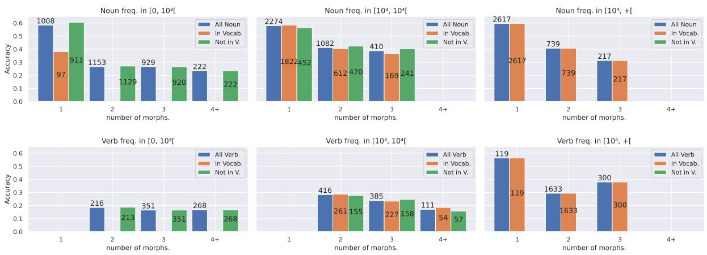  
Figure 1: Accuracy (exact translation) for Nouns (top) and Verbs (bottom) in the English Turkish translations. Results are grouped by the training frequency of the words (less to more frequent from left to right), and each subplot presents the scores for all the words, and whether they belong or not to the vocabulary input of the model. The number of samples are stacked in each bar, and we do not show entries with less than 30 samples.

Model For training, we use the MarianNMT toolkit (Junczys-Dowmunt et al., 2018), a Transfomer-base model (Vaswani et al., 2017) with default parameters, and four NVIDIA V100 GPUs. We obtained different English-Spanish models using the newscommentary-v8 (Bojar et al., 2013) and EuroParl (Koehn, 2005) datasets with joint vocabulary sizes of 8k, 16k and 32k (using unigram-LM from SentencePiece (Kudo and Richardson, 2018)). For this analysis, we chose the best performing system: combining both datasets (2.2M sentences) with 16k pieces. On NEWSTEST2013.EN-ES, the performance is 31.6 BLEU points.

Results and discussion Figure 2 shows the average accuracy of verbs in NEWSTEST2013.EN-ES for verbs without and with some degree of fusion. In the two higher frequency subplots (middle and right), we can observe that the average accuracy of the non-fusional verbs is higher than the fusional ones, and the pattern holds whether the verb is present in the vocabulary input of the model or not. The exception is for the least frequent verbs, although this is explained as the model do not have enough information to learn from, regardless of their degree of fusion.

## 4.4 Human evaluation

Exact translation accuracy has limitations, as there are potential translations that could be acceptable given a specific context (e.g. a synonym). For that reason, we performed a human evaluation of a sample of sentences on (10%) of each evaluation set, focusing on two scores11:

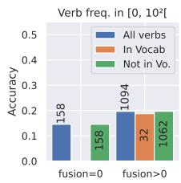

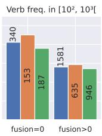

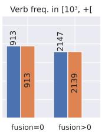  
Figure 2: Accuracy (exact translation) for Verbs in the English Spanish translations. Results are grouped by the training frequency and whether the word belongs to the vocabulary of the model (In V) or not (Not in V).

1. Semantic score: evaluates the meaning of the word used in the automatic translation (system output) and how it compares with the gold standard translation. Scale goes from 1 (no relationship at all) to 4 (it is the same lemma).

2. Grammar score: evaluates the grammatical form and how it compares with the gold standard translation. Scale goes from 1 (different inflection) to 3 (same inflection).

Synthesis In Figure 3, we show the annotation scores for the semantic and grammar metrics, for both nouns (top) and verbs (bottom). We also divide the analysis w.r.t. the frequency of the word in the training data. For nouns, we observe similar patterns as in the automatic analysis, where in the one-morpheme column, the proportion of the highest score is slightly larger than in the other columns, suggesting they are easier to generate for the model.

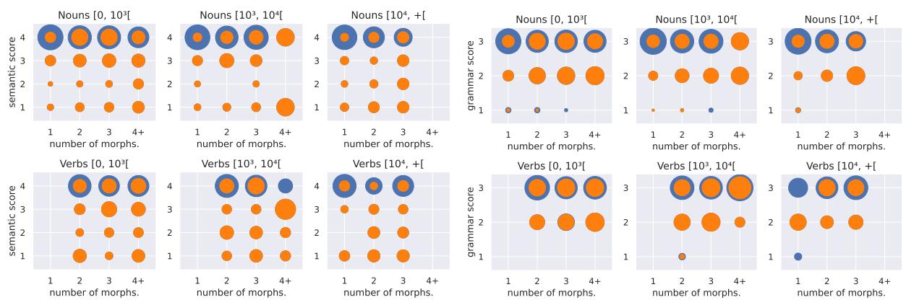  
Figure 3: Semantic score (left) and Grammar score (right) annotation for Turkish, for different frequency ranges of Nouns (top) and Verbs (bottom). Bubbles represent the proportion of the amount of scored annotations (1-4 or 1-3) divided by the subtotal elements of their respective columns (or number of morphemes). The orange inner bubble represents the amount of samples with ‘zero’ accuracy (in the automatic analysis) in each category.

The pattern is even more explicit in the highest frequency block (rightmost one). The verbs tend to have more distributed grammar scores, suggesting the difficulty of generating inflected forms may remain equally high even when the words are more frequent. Single morpheme verbs are very rare in Turkish and generally contain exceptional forms which reflects in the low translation accuracy in the highest frequency block. We also observe that a good proportion of translated words with ‘zero’ accuracy (not the exact translation, see the orange inner bubbles) has been annotated with highest semantic (same lemma) or grammar (same inflection) score, suggesting in some cases that the model is successful in generalization.

Fusion Figure 4 shows the semantic and grammar annotation scores for Spanish verbs. For the semantic scores (top), in all levels, the gap between the non-fusional and fusional verbs is reduced, for all the frequency groups. This means that the model is indeed able to generalise and offer alternative translations (not the exact verb), which is more complex to measure with automatic metrics. In the grammar scale (bottom), however, we still note a slight advantage in the maximum score (3) of the non-fusional verbs against the fusional ones for the two highest frequency subplots (middle and right). This indicates that, with highly frequent verbs, it is still more difficult to translate correct forms with a fusion degree higher than zero. Similarly as for synthesis, we observe that there is a significant proportion of ‘zero’ accuracy cases (orange inner bubbles) for the highest scores in most cases. This indicates that the model could generalise and translate verbs with similar meanings and not the exact, but close, forms.

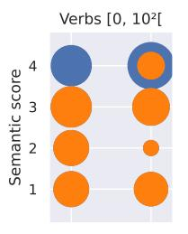

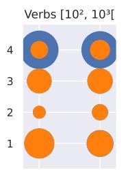

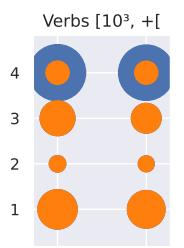

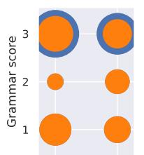

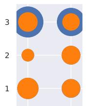

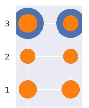  
Figure 4: Semantic (top) and Grammar (bottom) annotation for Spanish.

## 5 Segment-level Analysis of Synthesis and Fusion in Machine Translation

Following up the word level analysis, we study the relationship between machine translation difficulty and the degree of synthesis or fusion at the segment level. For this purpose, we process a set of translation systems for the language pair we want to evaluate. The general steps are as follow:

1. For each system output, we compute automatic evaluation metrics (BLEU (Papineni et al., 2002), chrF (Popovic´, 2015) and/or COMET (Rei et al., 2020)) with respect to the reference set, per sentence.12

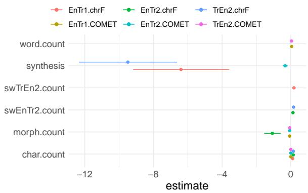  
−12 −8 −4 0Figure 5: Overview of significant predictors for degree of synthesis across our TR-EN and EN-TR models.

2. For each sentence of the evaluation set, we compute potential predictor variables for the automatic metric, such as the degree of synthesis or fusion. We complement the predictor variable list with other heuristics, such as the length of the sentence in characters (char.count) or words (word.count). The full list of all the predictors per language pair is in the Appendix.

3. With the previous inputs, we generate generalized linear models per system output and evaluation metric, in which each model’s output is set to the predictor variables. The goal is to identify which predictors affect each method’s performance.

4. Following model creation, we extract the significant predictors of each model. This provides an indication of which variables can be used to predict the outcome of the model’s dependent variable – in our case the degree of synthesis or fusion, or any heuristic.13

Synthesis on En-Tr and Tr-En We first start evaluating the English-Turkish and Turkish-English language pairs. The evaluated models are EnTr1, EnTr2, and TrEn2 (details in the Appendix). Also, as we are studying synthesis in Turkish, all predictors are computed on the Turkish side, regardless of the translation direction.

Figure 5 presents an overview of the significant predictors on En-Tr and Tr-En systems, where we observe a large impact of the synthesis variable on the chrF scores of two different systems (EnTr1 and TrEn2). The only other heuristic that achieves a notable impact on a system output is morph.count, or the length of Turkish sentence in morphemes, split by a morphological analyser. Other predictors have a minor effect.

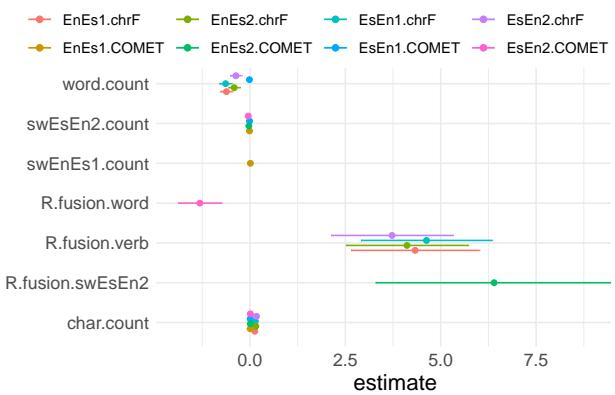  
estimateFigure 6: Overview of significant predictors for degree of fusion across our ES-EN and EN-ES models.

Fusion on En-Es and Es-En In a similar way, we evaluate the impact of fusion in English-Spanish (EnEs1, EnEs2) and Spanish-English (EsEn1, EsEn2) models (see the Appendix for details). Again, as we are studying fusion in Spanish, all predictors are computed on the Spanish side, regardless of the translation direction.

Figure 6 presents an overview of the significant predictors, where we observe that R.fusion.verb, or the ratio of the degree of fusion over the number of verbs in the sentence, is the predictor that has the highest impact in most system outputs (EnEs1, EnEs2 and EsEn2). Additionally, R.fusion.swEsEn2 (or the ratio of the degree of fusion over the number of subwords input in the EsEn2 model) also has a high impact in one system output (EnEs2, which uses the same segmentation model as EsEn2).

Analysis on En-De and De-En Finally, we extend the analysis to English-German and German-English language pairs, using the respective evaluation sets of the WMT2018 campaign (Bojar et al., 2018), and the system outputs provided for all the participants (measured in BLEU). For computing synthesis, we use the different segmentation methods we compared in §3.1. However, for fusion, we only use a shallow proxy with the number of morphological features that are tagged using a morphological analyser. In this case, the predictors are computed for both the source and target side.

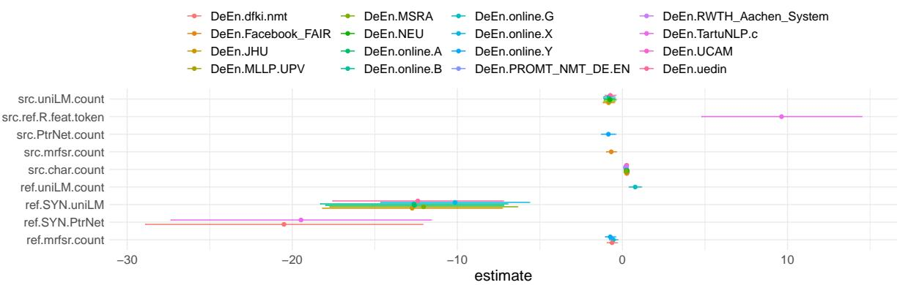  
Figure 7: Overview of significant predictors across DE-EN models.

We present an overview of these significant predictors for German-English in Figure 7 (and the Appendix contains the results for English-German in Figure 8). We can observe that ref.SYN.uniLM and ref.SYN.PtrNet are the predictors that impact most of the different system outputs. These variables refer to the synthesis computed on the reference side (English) using uniLM or PtrNet as the morpheme segmentation method, respectively. Furthermore, we observe that src-ref.R.feat.token has also some effect over one system output, which is a shallow proxy for the fusion degree in the source w.r.t. to reference segment (using the ratio of number of features per number of tokens).

## 6 Discussion

It is important to note the limitations of this study. Overall results do not suggest that translating into more analytic languages (e.g. Chinese) or more agglutinative ones (e.g. Turkish) is easier than their counterparts. Highly analytic ones present the significant issue of word coverage and vocabulary size of the model. Besides, we cannot isolate the fusional degree from synthesis entirely. For instance, Turkish is a highly agglutinative language, but also highly synthetic, and there are languages that present both agglutinative and fusional traits, like Navajo. Moreover, the language scope is another limitation: is it possible to extend it to further languages in a practical way? Synthesis can be calculated directly only if the morphological analyser splits the word into morphemes, and fusion poses several issues as mentioned before. Furthermore, Payne (2017) also indicated that the discourse can impact the computed degrees due to the diversity of the vocabulary. This study focuses on news data only, and it will be relevant to extend it to different domains.

To address the limitations, we consider that our word level analysis, that targets specific POS, has been fundamental to enable the study of the indexes, and to partially isolate them from each other. The selection of our study cases was also relevant. Spanish verbs do not present more than three morphemes, keeping a low synthesis value across all the analysis, whereas Turkish is more agglutinative than fusional. Moreover, to rapidly extend the evaluation for new languages and domains, we could follow a less fine-grained analysis in each index. For instance, we can compare synthesis=1 vs. synthesis>1 instead of granulating per number of morphemes, or fusion=0 vs. fusion>0, as we did in this work.

## 7 Conclusion and future work

In conclusion, we proposed methods to quantify the indices of synthesis and fusion in automatic and semi-automatic ways, respectively. Besides, for the chosen language pairs, we observed that the studied degrees have an impact in machine translation performance at both word and segment level, where we included a human evaluation of the former case.

Our analysis opens the possibility for further fine-grain evaluation approaches for MT and other NLP generation tasks. For instance, as future work, we can ask: are we improving the automatic translation of highly fusional words or segments? Following our methodology, we could stratify evaluation sets to measure how our models performs in different parts of the spectrum. Besides, the indices could also be helpful for evaluation approaches in morphological segmentation. Furthermore, another potential research avenue is to aid model training in MT: e.g. knowing which segments are more or less synthetic and/or fusional could be beneficial for sampling strategies.

## 8 Ethical Considerations

The annotations in this paper were compensated accordingly (see Appendix). Also, for all the datasets used in the research, we stick to the ethical standards giving credit to the original author. We encourage future work that take advantage of these resources, to cite also the original sources of the data.

## Acknowledgements

This work was supported by funding from the European Union’s Horizon 2020 research and innovation programme under grant agreements No 825299 (GoURMET) and the EP-SRC fellowship grant EP/S001271/1 (MTStretch). Also, we acknowledge the support from eBay. Besides, the study was performed using resources provided by the Cambridge Service for Data Driven Discovery (CSD3) operated by the University of Cambridge Research Computing Service (http: //www.csd3.cam.ac.uk/), provided by Dell EMC and Intel using Tier-2 funding from the Engineering and Physical Sciences Research Council (capital grant EP/P020259/1), and DiRAC funding from the Science and Technology Facilities Council (www.dirac.ac.uk). We express our thanks to Kenneth Heafield and Rico Sennrich, who provided us with access to the computing resources.

Moreover, the first author was granted financial support from the European Association for Machine Translation (EAMT), under its programme “2020 Sponsorship of Activities”, and from the European Cooperation in Science and Technology (COST) under the programme CA18231 - Multi3Generation: Multi-task, Multilingual, Multimodal Language Generation.

## References

Chantal Amrhein and Rico Sennrich. 2021. How suitable are subword segmentation strategies for translating non-concatenative morphology? In Findings of the Association for Computational Linguistics: EMNLP 2021, pages 689–705, Punta Cana, Dominican Republic. Association for Computational Linguistics.

Loïc Barrault, Ondˇrej Bojar, Marta R. Costa-jussà, Christian Federmann, Mark Fishel, Yvette Graham, Barry Haddow, Matthias Huck, Philipp Koehn, Shervin Malmasi, Christof Monz, Mathias Müller, Santanu Pal, Matt Post, and Marcos Zampieri. 2019.

Findings of the 2019 conference on machine translation (WMT19). In Proceedings of the Fourth Conference on Machine Translation (Volume 2: Shared Task Papers, Day 1), pages 1–61, Florence, Italy. Association for Computational Linguistics.

Johannes Bjerva and Isabelle Augenstein. 2018. From phonology to syntax: Unsupervised linguistic typology at different levels with language embeddings. In Proceedings of the 2018 Conference of the North American Chapter of the Association for Computational Linguistics: Human Language Technologies, Volume 1 (Long Papers), pages 907–916, New Orleans, Louisiana. Association for Computational Linguistics.

Johannes Bjerva and Isabelle Augenstein. 2021. Does typological blinding impede cross-lingual sharing? In Proceedings of the 16th Conference of the European Chapter of the Association for Computational Linguistics: Main Volume, pages 480–486, Online. Association for Computational Linguistics.

Johannes Bjerva, Yova Kementchedjhieva, Ryan Cotterell, and Isabelle Augenstein. 2019a. A probabilistic generative model of linguistic typology. In Proceedings ofthe 2019 Conference ofthe North American Chapter of the Association for Computational Linguistics: Human Language Technologies, Volume 1 (Long and Short Papers), pages 1529–1540, Minneapolis, Minnesota. Association for Computational Linguistics.

Johannes Bjerva, Yova Kementchedjhieva, Ryan Cotterell, and Isabelle Augenstein. 2019b. Uncovering probabilistic implications in typological knowledge bases. In Proceedings of the 57th Annual Meeting of the Association for Computational Linguistics, pages 3924–3930, Florence, Italy. Association for Computational Linguistics.

Johannes Bjerva, Elizabeth Salesky, Sabrina J. Mielke, Aditi Chaudhary, Giuseppe G. A. Celano, Edoardo Maria Ponti, Ekaterina Vylomova, Ryan Cotterell, and Isabelle Augenstein. 2020. SIGTYP 2020 shared task: Prediction of typological features. In Proceedings ofthe Second Workshop on Computational Research in Linguistic Typology, pages 1–11, Online. Association for Computational Linguistics.

Ondˇrej Bojar, Christian Buck, Chris Callison-Burch, Christian Federmann, Barry Haddow, Philipp Koehn, Christof Monz, Matt Post, Radu Soricut, and Lucia Specia. 2013. Findings of the 2013 Workshop on Statistical Machine Translation. In Proceedings of the Eighth Workshop on Statistical Machine Translation, pages 1–44, Sofia, Bulgaria. Association for Computational Linguistics.

Ondˇrej Bojar, Christian Federmann, Mark Fishel, Yvette Graham, Barry Haddow, Philipp Koehn, and Christof Monz. 2018. Findings of the 2018 conference on machine translation (WMT18). In Proceedings of the Third Conference on Machine Translation: Shared Task Papers, pages 272–303, Bel-

gium, Brussels. Association for Computational Linguistics.

Kaj Bostrom and Greg Durrett. 2020. Byte pair encoding is suboptimal for language model pretraining. In Findings of the Association for Computational Linguistics: EMNLP 2020, pages 4617–4624, Online. Association for Computational Linguistics.

Bernard Comrie. 1989. Language universals and linguistic typology: Syntax and morphology. University of Chicago press.

Mathias Creutz and Krista Lagus. 2002. Unsupervised discovery of morphemes. In Proceedings of the ACL-02 Workshop on Morphological and Phonological Learning, pages 21–30. Association for Computational Linguistics.

Jacob Devlin, Ming-Wei Chang, Kenton Lee, and Kristina Toutanova. 2019. BERT: Pre-training of deep bidirectional transformers for language understanding. In Proceedings of the 2019 Conference of the North American Chapter of the Association for Computational Linguistics: Human Language Technologies, Volume 1 (Long and Short Papers), pages 4171–4186, Minneapolis, Minnesota. Association for Computational Linguistics.

Zi-Yi Dou and Graham Neubig. 2021. Word alignment by fine-tuning embeddings on parallel corpora. In Proceedings of the 16th Conference of the European Chapter of the Association for Computational Linguistics: Main Volume, pages 2112–2128, Online. Association for Computational Linguistics.

Ramy Eskander, Judith Klavans, and Smaranda Muresan. 2019. Unsupervised morphological segmentation for low-resource polysynthetic languages. In Proceedings ofthe 16th Workshop on Computational Research in Phonetics, Phonology, and Morphology, pages 189–195, Florence, Italy. Association for Computational Linguistics.

Joseph H Greenberg. 1960. A quantitative approach to the morphological typology of language. Internationaljournal ofAmerican linguistics, 26(3):178– 194.

Zellig S Harris. 1951. Methods in structural linguistics.

Marcin Junczys-Dowmunt, Kenneth Heafield, Hieu Hoang, Roman Grundkiewicz, and Anthony Aue. 2018. Marian: Cost-effective high-quality neural machine translation in C++. In Proceedings of the 2nd Workshop on Neural Machine Translation and Generation, pages 129–135, Melbourne, Australia. Association for Computational Linguistics.

Tom Kocmi, Christian Federmann, Roman Grundkiewicz, Marcin Junczys-Dowmunt, Hitokazu Matsushita, and Arul Menezes. 2021. To ship or not to ship: An extensive evaluation of automatic metrics for machine translation. In Proceedings of the Sixth Conference on Machine Translation, pages 478–494, Online. Association for Computational Linguistics.

Philipp Koehn. 2005. Europarl: A parallel corpus for statistical machine translation. In Proceedings of Machine Translation Summit X: Papers, pages 79– 86, Phuket, Thailand.

Taku Kudo. 2018. Subword regularization: Improving neural network translation models with multiple subword candidates. In Proceedings ofthe 56th Annual Meeting of the Association for Computational Linguistics (Volume 1: Long Papers), pages 66–75, Melbourne, Australia. Association for Computational Linguistics.

Taku Kudo and John Richardson. 2018. SentencePiece: A simple and language independent subword tokenizer and detokenizer for neural text processing. In Proceedings of the 2018 Conference on Empirical Methods in Natural Language Processing: System Demonstrations, pages 66–71, Brussels, Belgium. Association for Computational Linguistics.

Manuel Mager, Özlem Çetinoglu, and Katharina Kann.˘ 2020. Tackling the low-resource challenge for canonical segmentation. In Proceedings ofthe 2020 Conference on Empirical Methods in Natural Language Processing (EMNLP), pages 5237–5250, Online. Association for Computational Linguistics.

Arya D. McCarthy, Christo Kirov, Matteo Grella, Amrit Nidhi, Patrick Xia, Kyle Gorman, Ekaterina Vylomova, Sabrina J. Mielke, Garrett Nicolai, Miikka Silfverberg, Timofey Arkhangelskiy, Nataly Krizhanovsky, Andrew Krizhanovsky, Elena Klyachko, Alexey Sorokin, John Mansfield, Valts Ernštreits, Yuval Pinter, Cassandra L. Jacobs, Ryan Cotterell, Mans Hulden, and David Yarowsky. 2020. UniMorph 3.0: Universal Morphology. In Proceedings of the 12th Language Resources and Evaluation Conference, pages 3922–3931, Marseille, France. European Language Resources Association.

Jamshidbek Mirzakhalov, Anoop Babu, Duygu Ataman, Sherzod Kariev, Francis Tyers, Otabek Abduraufov, Mammad Hajili, Sardana Ivanova, Abror Khaytbaev, Antonio Laverghetta Jr., Bekhzodbek Moydinboyev, Esra Onal, Shaxnoza Pulatova, Ahsan Wahab, Orhan Firat, and Sriram Chellappan. 2021. A large-scale study of machine translation in Turkic languages. In Proceedings of the 2021 Conference on Empirical Methods in Natural Language Processing, pages 5876–5890, Online and Punta Cana, Dominican Republic. Association for Computational Linguistics.

Tahir Naveed, Imitaz Saeed Siddiqui, and Shaftab Ahmed. 2005. Parallel needleman-wunsch algorithm for grid. In Proceedings of the PAK-US International Symposium on High Capacity Optical Networks and Enabling Technologies (HONET 2005), Islamabad, Pakistan.

Arturo Oncevay, Barry Haddow, and Alexandra Birch. 2020. Bridging linguistic typology and multilingual machine translation with multi-view language representations. In Proceedings of the 2020 Conference

on Empirical Methods in Natural Language Processing (EMNLP), pages 2391–2406, Online. Association for Computational Linguistics.

Kishore Papineni, Salim Roukos, Todd Ward, and Wei-Jing Zhu. 2002. Bleu: a method for automatic evaluation of machine translation. In Proceedings of the 40th Annual Meeting ofthe Associationfor Computational Linguistics, pages 311–318, Philadelphia, Pennsylvania, USA. Association for Computational Linguistics.

Thomas E Payne. 2017. Morphological typology. In The Cambridge Handbook of Linguistic Typology, pages 78–94. Cambridge University Press.

Edoardo Maria Ponti, Helen O’Horan, Yevgeni Berzak, Ivan Vulic, Roi Reichart, Thierry Poibeau, Ekaterina´ Shutova, and Anna Korhonen. 2019. Modeling language variation and universals: A survey on typological linguistics for natural language processing. Computational Linguistics, 45(3):559–601.

Hoifung Poon and Pedro Domingos. 2009. Unsupervised semantic parsing. In Proceedings of the 2009 Conference on Empirical Methods in Natural Language Processing, pages 1–10, Singapore. Association for Computational Linguistics.

Maja Popovic. 2015.´ chrF: character n-gram F-score for automatic MT evaluation. In Proceedings of the Tenth Workshop on Statistical Machine Translation, pages 392–395, Lisbon, Portugal. Association for Computational Linguistics.

Ricardo Rei, Craig Stewart, Ana C Farinha, and Alon Lavie. 2020. COMET: A neural framework for MT evaluation. In Proceedings of the 2020 Conference on Empirical Methods in Natural Language Processing (EMNLP), pages 2685–2702, Online. Association for Computational Linguistics.

Ha¸sim Sak, Tunga Güngör, and Murat Saraçlar. 2008. Turkish language resources: Morphological parser, morphological disambiguator and web corpus. In International Conference on Natural Language Processing, pages 417–427. Springer.

Edward Sapir. 1921. Types of linguistic structure.

Rico Sennrich, Barry Haddow, and Alexandra Birch. 2016. Neural machine translation of rare words with subword units. In Proceedings of the 54th Annual Meeting of the Association for Computational Linguistics (Volume 1: Long Papers), pages 1715– 1725, Berlin, Germany. Association for Computational Linguistics.

Petra Steiner. 2016. Refurbishing a morphological database for German. In Proceedings ofthe Tenth International Conference on Language Resources and Evaluation (LREC’16), pages 1103–1108, Portorož, Slovenia. European Language Resources Association (ELRA).

Petra Steiner. 2017. Merging the trees - building a morphological treebank for German from two resources. In Proceedings of the 16th International Workshop on Treebanks and Linguistic Theories, pages 146– 160, Prague, Czech Republic.

Mariona Taulé, M. Antònia Martí, and Marta Recasens. 2008. AnCora: Multilevel annotated corpora for Catalan and Spanish. In Proceedings ofthe Sixth International Conference on Language Resources and Evaluation (LREC’08), Marrakech, Morocco. European Language Resources Association (ELRA).

Clara Vania and Adam Lopez. 2017. From characters to words to in between: Do we capture morphology? In Proceedings of the 55th Annual Meeting of the Association for Computational Linguistics (Volume 1: Long Papers), pages 2016–2027, Vancouver, Canada. Association for Computational Linguistics.

Ashish Vaswani, Noam Shazeer, Niki Parmar, Jakob Uszkoreit, Llion Jones, Aidan N Gomez, Ł ukasz Kaiser, and Illia Polosukhin. 2017. Attention is all you need. In I. Guyon, U. V. Luxburg, S. Bengio, H. Wallach, R. Fergus, S. Vishwanathan, and R. Garnett, editors, Advances in Neural Information Processing Systems 30, pages 5998–6008. Curran Associates, Inc.

Hongzhi Xu, Jordan Kodner, Mitchell Marcus, and Charles Yang. 2020. Modeling morphological typology for unsupervised learning of language morphology. In Proceedings of the 58th Annual Meeting of the Association for Computational Linguistics, pages 6672–6681, Online. Association for Computational Linguistics.

Tim Zingler. 2018. Reduction without fusion: Grammaticalization and wordhood in turkish. Folia Linguistica, 52(2):415–447.

## A Human Evaluation

## A.1 Annotation Protocol

This study measures the translation quality of translations generated by a translation system. You are given a list of sentences where one column lists each word in the gold standard (correct) translation and the corresponding column the systemgenerated translations. The evaluation of the translations will rely on the two scores described below. The scores to use in the evaluation are:

Semantic score evaluates the meaning of the word used in the automatic translation (system output) and how it compares with the gold standard translation.

Please assign each word in the output one of the scores you find most appropriate:

1. There is no relationship between the two lemmas

2. The lemmas are different but the translation does not fit well in the context

3. The lemmas are different but it is still an acceptable translation (e.g. synonym)

4. It is the same lemma

Grammar score evaluates the grammatical form and how it compares with the gold standard translation.

Please assign each word in the output one of the scores you find most appropriate:

1. The word is inflected in a different way and it is not necessarily correct

2. The word has different inflection but it is still grammatically correct

3. The words have the same inflection, and it is correct

Please annotate all words in the translations in the file shared with you. In your evaluation try assigning the two scores to each word independently. The inflection of the word measures the morphological feature and should also be evaluated independently from the analyzer output which is automated and may contain errors.

The file contains example annotations for your reference, please ask any questions related to unresolved annotation examples by contacting the project coordinators.

## A.2 Annotators

For both Turkish and Spanish, the annotators were contacted directly due to their expertise in morphology (both of them are PhD students in Linguistics and Computational Linguistics, respectively), besides requiring that they are native speakers of the target languages. Also, they were paid more than the minimum wage per hour of annotation of their country of residence, and were told that the annotated data will be released upon acceptance of the study.

## B Segment-level Analysis of Synthesis and Fusion

## B.1 List of machine translation systems

• EnTr1: the same system used in §4.2

• EnTr2: Transformer-base model (Vaswani et al., 2017) with joint vocabulary size of 8k pieces (unigram language modelling from SentencePiece (Kudo and Richardson, 2018), and trained with a sample (10%) of the corpus of EnTr1.

<table><tr><td>Predictor</td><td>Description</td></tr><tr><td>char.count word.count morph.count synthesis N+V.word.count N+V.morph.count N+V.synthesis swEnTr1.count swEnTr2.count swTrEn2.count syn.swEnTr1 syn.swEnTr2 syn.swTrEn2</td><td>number of characters number of words (no punct. or numbers) number of morphemes. ratio of morph.count / word.count number of Nouns and Verbs number of morphemes of the Nouns and Verbs ratio of N+V.morph.count / word.count number of subwords processed by the EnTr1 model number of subwords processed by the EnTr2 model number of subwords processed by the TrEn2 model ratio of swEnTr1.count / word.count (synthesis proxy) ratio of swEnTr1.count / word.count (synthesis proxy) ratio of swEnTr1.count / word.count (synthesis proxy)</td></tr></table>

Table 4: List of predictors for En-Tr and Tr-En. All variables are computed on the Turkish segment of the evaluation set.
<table><tr><td>Predictor</td><td>Description</td></tr><tr><td>char.count word.count verb.count fusion swEnEs2.count R.fusion.swEnEs1 R.fusion.swEnEs2</td><td>number of characters number of words (no punct. or numbers) number of verbs number of subwords processed by the EnEs1 model number of subwords processed by the EnEs2 model</td></tr><tr><td>R.fusion.verb R.fusion.word</td><td>sum of the degree of fusion of all the verbs in the segment ratio of fusion / verb.count</td></tr><tr><td></td><td>ratio of fusion / word.count</td></tr><tr><td>swEsEn1.count swEsEn2.count R.fusion.swEsEn1</td><td>number of subwords processed by the EsEn1 model number of subwords processed by the EsEn2 model</td></tr><tr><td>R.fusion.swEsEn2 swEnEs1.count</td><td>ratio of fusion / swEsEn1.count ratio of fusion / swEsEn2.count</td></tr></table>

Table 5: List of predictors for En-Es and Es-En. All variables are computed on the Spanish segment of the evaluation set.

• EnEs1: the same system used in §4.3

• EsEn1: similar configuration than EnEs1 but in the opposite direction

• EnEs2: same configuration as EnEs1 (model and vocabulary) but with smaller training data. It uses only newscommentary-v8 data, with around 300k sentences).

• EsEn2: similar configuration than EnEs2 but in the opposite direction.

## B.2 List of predictors

Tables 4, 5 and 6 describes all the predictors used at the segment level analysis of English-Turkish, English-Spanish and English-German (both directions), respectively.

## B.3 Results on English-German

Figure 8 shows the analogous results for English to German, where the synthesis-based variables presents a high impact w.r.t. the other predictors.

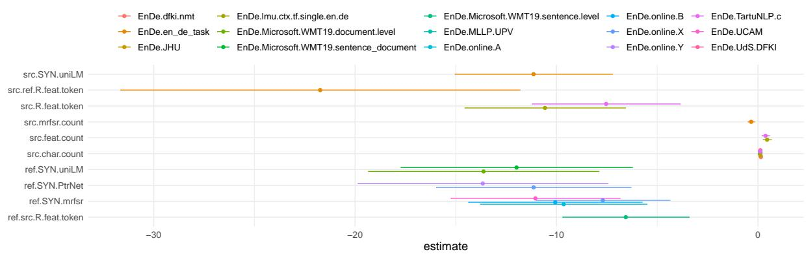  
Figure 8: Overview of significant predictors for degree of synthesis across EN-DE models.

<table><tr><td>Predictor</td><td>Description</td></tr><tr><td>src.char.count ref.char.count src.word.count ref.word.count src.uniLM.count ref.uniLM.count src.SYN.uniLM ref.SYN.uniLM src.mrfsr.count ref.mrfsr.count src.SYN.mrfsr ref.SYN.mrfsr src.PtrNet.count ref.PtrNet.count src.SYN.PtrNet ref.SYN.PtrNet src.feat.count src.R.feat.token ref.feat.count ref.R.feat.token src-ref.feat.count src-ref.R.feat.token</td><td>number of characters in the source side number of characters in the target side number of words in the source side number of words in the target side number of subwords obtained by uniLM in the source number of subwords obtained by uniLM in the target synthesis in source = src.uniLM.count / src.word.count synthesis in target = ref.uniLM.count / ref.word.count number of subwords obtained by Morfessor in the source number of subwords obtained by Morfessor in the target synthesis in source = src.mrfsr.count / src.word.count synthesis in target = ref.mrfsr.count / ref.word.count number of subwords obtained by PtrNet in the source number of subwords obtained by PtrNet in the target synthesis in source = src.PtrNet.count / src.word.count synthesis in target = ref.PtrNet.count / ref.word.count number of morph. features in the source (using spAcy) ratio of src.feat.count / src.word.count number of morph. features in the target (using spAcy) ratio of ref.feat.count / ref.word.count src.feat.count minus ref.feat.count src.R.feat.token minus ref.R.feat.token ref.feat.count minus src.feat.count</td></tr></table>

Table 6: List of predictors for En-De and De-En. Variables are computed either on source (src) or target (ref) side.