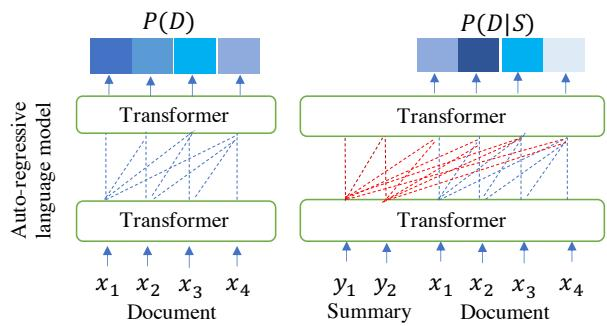
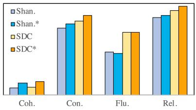

# Reference-free Summarization Evaluation via Semantic Correlation and Compression Ratio

Yizhu Liu1, Qi Jia1, Kenny Q. Zhu2∗   
Shanghai Jiao Tong University, Shanghai, China   
1{liuyizhu, Jia\_qi}@sjtu.edu.cn 2kzhu@cs.sjtu.edu.cn

## Abstract

A document can be summarized in a number of ways. Reference-based evaluation of summarization has been criticized for its inflexibility. In this paper, we propose a new automatic reference-free evaluation metric that compares semantic distribution between source document and summary by pretrained language models and considers summary compression ratio. The experiments show that this metric is more consistent with human evaluation in terms of coherence, consistency, relevance, fluency.

## 1 Introduction

Summarization evaluation metrics that measure the quality of generated summaries are very important for the development of summarization systems (Rush et al., 2015; Chopra et al., 2016; Nallapati et al., 2017; Liu et al., 2018, 2022; Lewis et al., 2020; Zhang et al., 2020a; Liu et al., 2021). Most previous summarization evaluation metrics need human-annotated summaries as reference and measure summary quality through the similarity between generated summaries and their reference summaries (Papineni et al., 2002; Lin, 2004; Ganesan, 2006; Ng and Abrecht, 2015; Zhang et al., 2020b; Zhao et al., 2019). Such reference-based evaluation metrics cannot accurately evaluate the summary, because a document has many correct but different summaries. It is difficult and expensive to write many reference summaries by human for evaluation. Thus, it is useful to develop reference-free evaluation metrics for this task.

In this paper, we focus on reference-free evaluation metrics. As shown in Figure 1, a highquality summary should be concise and contain the most important information of its document. Some reference-free evaluation metrics (Shao et al., 2017; Gao et al., 2020) unsupervisedly construct a pseudo reference summary by selecting salient sentences from the source document, which also ignore the variety of summaries. Others evaluate the summary quality by measuring how much information from the document is represented in the summary. QA-based evaluation metrics (Chen et al., 2018; Scialom et al., 2019; Durmus et al., 2020) achieve this possibility by first asking the same questions to document and summary and then comparing their answers. The performance of these metrics depends on the quality of question generation and question-answering systems. Shannon score (Egan et al., 2022) intuitively uses a language model to autoregressively generate a document both with and without a summary as a prompt, and then computes the difference in information content between two generated documents. The information of document generated with a better summary, which is better restored, is more similar to the document generated without summary. Although Shannon score is the state-of-the-art (SOTA) summarization evaluation metric, its estimation of information content of the document cannot reflect the position and importance of each token in document. However, the position of tokens will impact coherence and the importance will impact salient information, which are very important for summarization evaluation. For example, the low-quality summary contains similar words to the high-quality summary but it is unreadable and loses important information of the source document.

<table><tr><td rowspan=1 colspan=1>Source Document</td></tr><tr><td rowspan=1 colspan=1>Mexican restaurant Chipotlehas decided to tap into the$70billion food delivery marketby teaming up withan apptobring burritos straight to customers&#x27; doors. The fast-casualchain will work with thePostmates appto begin offering</td></tr><tr><td rowspan=1 colspan=1>delivery for onlineandmobile ordersin67 cities.ButMexican food fans should know that the restaurant plans toadda nine per cent service chargewith thedelivery fees for</td></tr><tr><td rowspan=1 colspan=1>Postmatesbeginning at$5 and up,depending on distance anddemand.</td></tr><tr><td rowspan=1 colspan=1>High-quality Summary</td></tr><tr><td rowspan=1 colspan=1>Chipotle will now be available for delivery with the Postmatesapp. Online and mobile orders will be available in 67 cities.</td></tr><tr><td rowspan=1 colspan=1>Low-quality Summary</td></tr><tr><td rowspan=1 colspan=1>67 cities will be available for delivery fees for Chipotle.Postmates app orders will be available in Online and mobile.</td></tr></table>

Figure 1: A document with its high-quality and lowquality summaries. The heat map marks the salient content in the document. The darker the colour, the more salient the content.

To tackle the problem in Shannon score, we present a new reference-free evaluation metric (SDC) which computes the correlation (semantic distribution correlation) between the probability distribution of tokens in predicted documents with and without a prepended summary. Such sequential probability take account of the position and importance of the tokens. As compression ratio reflects the difficulty of summarization, we introduce compression ratio into SDC (SDC\*) and penalize the long summary.

Our contribution are as follows:

• We propose a reference-free summarization evaluation metric (SDC\*) which evaluates summaries considering semantic distribution correlation and compression ratio between source document and summary.

• Our proposed SDC and SDC\* achieve better performance than the SOTA summarization evaluation metric on CNN/Daily Mail and TAC 2010 datasets.

## 2 Approach

In this section, we introduce our proposed reference-free summarization evaluation metric which computes the semantic distribution correlation between generated documents with and without a summary and combines the correlation with compression ratio.

Semantic Distribution Correlation (SDC). Inspired by Shannon score (Egan et al., 2022), we use auto-regressive language model to obtain the semantic information of documents. Given a document $D = \{ x _ { 1 } , x _ { 2 } , . . . , x _ { n } \}$ consisting of tokens x, the auto-regressive language model represents D by factorizing the joint probabilities over symbols as the product of conditional probabilities:

$$
P ( D ) = \prod _ { t = 1 } ^ { n } p ( x _ { t } | x _ { < t } )\tag{1}
$$

In this paper, unlike previous metrics using $P ( D )$ as the semantic information of $D _ { : }$ , we take $p ( x _ { t } | \boldsymbol { x } _ { < t } )$ as the semantic representation of $x _ { t }$ and use a vector ${ \bf P } ( D )$ to represent the semantic distribution of $D$ generated by language model:

$$
\mathbf { P } ( D ) = [ p ( x _ { 1 } ) , p ( x _ { 2 } | \boldsymbol { x } _ { < 2 } ) , . . . , p ( x _ { n } | \boldsymbol { x } _ { < n } ) ]\tag{2}
$$

Such fine-grained semantic representation considers both the order and semantic of the tokens in sequence, which helps to evaluate the coherence and relevance.

To evaluate the quality of a summary S consisting of token $y ,$ we use language model to predict $D$ with $S$ as a prompt. The better the summary, the better the document can be restored. In other words, a better summary makes the semantic information of documents generated with a summary more similar to that of documents generated without summary. We calculate the semantic distribution of D given S as:

$$
\begin{array} { r } { \mathbf { P } ( D | S ) = [ p ( x _ { 1 } | S ) , p ( x _ { 2 } | x _ { < 2 } , S ) , . . . , } \\ { p ( x _ { n } | x _ { < n } , S ) ] } \end{array}\tag{3}
$$

The $P ( D )$ and $P ( D | S )$ are illustrated in Figure 2.

  
Figure 2: Architecture of semantic distribution from auto-regressive language model.

We take the correlation between ${ \bf P } ( D )$ and ${ \bf P } ( D | S )$ as the evaluation score of summary S:

$$
C ( D , S ) = C o r r ( \mathbf { P } ( D ) , \mathbf { P } ( D | S ) )\tag{4}
$$

$$
W ( D , S ) = { \frac { \prod P ( D | S ) } { \prod P ( D ) } }\tag{5}
$$

$$
S D C ( D , S ) = W ( D , S ) \times C _ { n o r m } ( D , S )\tag{6}
$$

where Corr is Pearson’s $\gamma$ (Benesty et al., 2009) because we need the change trend of the two distributions for semantic order and need their specific values for information coverage judgement. $W ( D , S )$ indicates the extent to which the document D can be predicted by given summary $S .$

Better summaries can get higher $W ( D , S )$ scores. $C _ { n o r m } \in [ 0 , 1 )$ is the normalization of C. The higher SDC means the better summary quality.

SDC with Compression Ratio (SDC\*). Compression ratio reflects the difficulty of summarizing, which is the length of summary divided by the length of source document: $C R ( D , S ) \ =$ $L ( S ) / L ( D )$ , where L records the length of text. If $L ( S )$ is greater than $L ( D ) , C R ( D , S )$ is equal to 1. It is more difficult to generate a shorter summary. Thus, we introduce compression ratio into SDC and get SDC\* as:

$$
S D C ^ { * } ( D , S ) = 2 \times \frac { S D C \times ( 1 - C R ) } { S D C + ( 1 - C R ) }\tag{7}
$$

SDC\* ensures that a summary with higher semantic distribution correlation and lower compression ratio achieves a higher evaluation score.

## 3 Experiment

In this section, we first introduce the humanannotated datasets and baseline evaluation metrics. Then we will show the results of our proposed SDC and SDC\*, and analyze the effectiveness of semantic distribution correlation and compression ratio used in summarization evaluation.

## 3.1 Datasets

In this experiment, we use 2 summarization evaluation datasets, which consist of source documents, summaries generated by different models and human-annotated scores on summaries.

CNN/Daily Mail (CNNDM) (Fabbri et al., 2021) is a single document summarization dataset, which consists of 100 documents from the CNN/DailyMail dataset, each paired with 16 summaries generated by different systems 1. Each summary was scored by 3 experts under four aspects: coherence, consistency, fluency, and relevance.

TAC 2010 (TAC) 2 is a multi-document summarization dataset, including 92 multi-documents with 43 generated summaries for each multi-document. Each summary has one human-annotated overall score. The overall score is based on both coverage of all required aspects (Pyramid) (Nenkova and Passonneau, 2004) and linguistic quality (readability).

## 3.2 Baselines

We take 4 reference-based evaluation metrics and 2 reference-free evaluation metrics as baselines.

For reference-based evaluation, ROUGE family is the most popular evaluation metric in summarization, which evaluates the token sequence overlapping. We use F1 scores of ROUGE-1 (R-1), ROUGE-2 (R-2) and ROUGE-L (R-L). BLEU (Papineni et al., 2002) focuses on precision with a brevity penalty. METEOR (MET.) (Banerjee and Lavie, 2005) allows word stems, synonyms and paraphrases matching. BERTScore (BERT.) (Zhang et al., 2020b) greedily maximizes the cosine similarity between token embeddings.

## 3.3 Experimental Setup

For reference-free evaluation, BLANC (BLA.) (Vasilyev et al., 2020) computes the accuracy of unmasking document tokens with a summary. Shannon (Shan.) (Egan et al., 2022) estimates the information content shared between a document and its summary. As Shannon is the SOTA summarization evaluation metric, we add compression ratio to the information content of generated document with a prepended summary in the same way as Eq.7, which is called Shannon\* (Shan.\*).

In our experiments 3, we follow Egan et al. (2022) to use GPT-2 small language model (Radford et al., 2019) to compute the semantic distribution of text. To evaluate the empirical performance of different summarization evaluation metrics, we correlate the metrics against the provided human judgement via Pearson’s γ, Spearman’s $\rho$ and Kendall’s τ correlation coefficients (Benesty et al., 2009; Myers and Sirois, 2004; Abdi, 2007). The metrics with higher correlation with human evaluation scores are more effective.

As TAC is a multi-document summarization dataset, we score the summary with each document in its multi-document set. The averaged score of all documents is engaged as the final score of our proposed metrics.

## 3.4 Results

In this section, we analyze the effectiveness of our metrics using fine-grained semantic distribution correlation and introducing compression ratio.

<table><tr><td rowspan="2">Metric</td><td colspan="3">Coh.</td><td colspan="3">Con.</td><td colspan="3">Flu.</td><td colspan="3">Rel.</td></tr><tr><td>γ</td><td>ρ</td><td>T</td><td>γ</td><td>ρ</td><td>T</td><td>γ</td><td>ρ</td><td>T</td><td>γ</td><td>ρ</td><td>T</td></tr><tr><td>R-1</td><td>18.15</td><td>34.41</td><td>23.33</td><td>61.18</td><td>18.53</td><td>10.00</td><td>56.44</td><td>44.30</td><td>37.66</td><td>60.89</td><td>60.00</td><td>46.67</td></tr><tr><td>R-2</td><td>23.58</td><td>36.47</td><td>23.33</td><td>63.54</td><td>12.94</td><td>6.67</td><td>59.72</td><td>43.56</td><td>30.96</td><td>63.78</td><td>61.76</td><td>43.33</td></tr><tr><td>R-L</td><td>12.43</td><td>21.47</td><td>11.67</td><td>55.41</td><td>-21.47</td><td>-18.33</td><td>50.39</td><td>19.28</td><td>12.55</td><td>55.44</td><td>40.59</td><td>25.00</td></tr><tr><td>BLEU</td><td>22.60</td><td>17.65</td><td>10.00</td><td>54.39</td><td>-15.59</td><td>-13.33</td><td>52.81</td><td>26.20</td><td>17.57</td><td>57.60</td><td>39.12</td><td>23.33</td></tr><tr><td>MET.</td><td>15.62</td><td>45.59</td><td>26.67</td><td>66.22</td><td>67.35</td><td>46.67</td><td>57.95</td><td>71.23</td><td>56.07</td><td>62.67</td><td>71.76</td><td>50.00</td></tr><tr><td>BERT.</td><td>10.61</td><td>15.88</td><td>6.67</td><td>55.87</td><td>-7.35</td><td>-6.67</td><td>50.32</td><td>27.08</td><td>20.92</td><td>55.09</td><td>42.06</td><td>26.67</td></tr><tr><td>BLA.</td><td>14.93</td><td>12.35</td><td>11.67</td><td>62.94</td><td>77.06</td><td>61.67</td><td>55.02</td><td>47.24</td><td>34.31</td><td>46.90</td><td>35.29</td><td>31.67</td></tr><tr><td>Shan.</td><td>56.43</td><td>50.58</td><td>38.33</td><td>68.36</td><td>88.82</td><td>71.67</td><td>68.00</td><td>76.67</td><td>61.09</td><td>71.62</td><td>72.35</td><td>58.33</td></tr><tr><td>SDC</td><td>57.33</td><td>52.35</td><td>40.00</td><td>69.78</td><td>90.29</td><td>73.33</td><td>69.47</td><td>79.32</td><td>62.76</td><td>72.96</td><td>75.00</td><td>60.00</td></tr><tr><td>SDC*</td><td>59.10</td><td>56.18</td><td>43.33</td><td>73.85</td><td>90.00</td><td>73.33</td><td>73.47</td><td>79.91</td><td>64.44</td><td>75.79</td><td>77.35</td><td>63.33</td></tr></table>

Table 1: Correlation (%) between human evaluation and various automatic metrics on CNNDM.
<table><tr><td rowspan=1 colspan=1>Summary</td><td rowspan=1 colspan=1>Comp. ↓</td><td rowspan=1 colspan=1>Shan.</td><td rowspan=1 colspan=1>SDC</td><td rowspan=1 colspan=1>SDC*</td></tr><tr><td rowspan=1 colspan=1>High-quality summary:Chipotle will now be available for delivery with the Postmates app.Online and mobile orders will be available in 67 cities.</td><td rowspan=1 colspan=1>0.25</td><td rowspan=1 colspan=1>0.20</td><td rowspan=1 colspan=1>0.20</td><td rowspan=1 colspan=1>0.32</td></tr><tr><td rowspan=1 colspan=1>Unfluent summary:Postmates app will now be available for delivery with the Chipotle.Online and mobile orders will be available in 67 cities.</td><td rowspan=1 colspan=1>0.25</td><td rowspan=1 colspan=1>0.18</td><td rowspan=1 colspan=1>0.15</td><td rowspan=1 colspan=1>0.25</td></tr><tr><td rowspan=1 colspan=1>Irrelevant summary:Chipotle will now be available for delivery with the Postmates app.Mexican restaurant Chipolte will be available in 67 cities.</td><td rowspan=1 colspan=1>0.24</td><td rowspan=1 colspan=1>0.20</td><td rowspan=1 colspan=1>0.17</td><td rowspan=1 colspan=1>0.28</td></tr><tr><td rowspan=1 colspan=1>Longer summary:Mexican restaurant Chipotle has decided to tap into the 70 billion fooddelivery market by teaming up with an app to bring burritos straight tocustomers&#x27; doors. The fast-casual chain will work with the Postmatesapp to begin offering delivery for online and mobile orders in 67 cities.The delivery fees for Postmates app at 5 and up.</td><td rowspan=1 colspan=1>0.70</td><td rowspan=1 colspan=1>0.62</td><td rowspan=1 colspan=1>0.33</td><td rowspan=1 colspan=1>0.31</td></tr></table>

Table 2: Automatic evaluation on different summaries of the document in Figure 1. To explain the effectiveness of our metrics, we create some bad summaries. The information in red are wrong information.

## 3.4.1 Main Results

Table 1 shows that the correlation of our proposed SDC and SDC\* against human evaluation in different correlation coefficients are in the top 2 for every category of summary quality. Compared with reference-based metrics, our metrics improve significantly in terms of consistency and relevance. Because reference-based metrics depend on the quality and quantity of references. The correlations of SDC and SDC\* are similar in terms of consistency since SDC\* penalizes long summaries. Long summaries are more likely to express the information consistent with their source documents. Our metrics focus on the information shared with document and summary. Compared with the SOTA reference-free metric (Shan.) measuring the difference in information content between document and summary, our metrics measure the difference in semantic distributions, which better notices the token order in the sequence (coherence and fluency) and the importance of each token (consistency and relevance) with respect to the sequence. Thus, our metrics perform better than Shan.

To show the generalization of our proposed evaluation metrics, we compare the SOTA summarization evaluation metric (Shan.) and our proposed evaluation metrics on TAC in Table 3. Compared with Shan., SDC and SDC\* are more consistent with human evaluation on TAC, demonstrating our proposed evaluation metrics can better evaluate generated summaries. As shown in Table 1 and Table 3, as TAC is multi-document summarization evaluation dataset, the improvement of SDC and SDC\* on TAC are less than that on CNNDM . As we compute the average of evaluation scores between the summary and each document in corresponding multiple documents, a good summary may get lower scores. This is because that a good summary may not perfectly restore all the input multiple documents.

## 3.4.2 Ablation Study

The improvement of our metrics is from semantic distribution correlation and compression ratio. We evaluate the variants of the SOTA summarization evaluation metric (Shan.) and our proposed reference-free summarization evaluation metric (SDC\*) on CNNDM.

<table><tr><td rowspan="2">Metric</td><td colspan="3">Overall</td></tr><tr><td>γ</td><td>ρ</td><td>T</td></tr><tr><td>Shan.</td><td>75.44</td><td>63.11</td><td>45.46</td></tr><tr><td>SDC</td><td>75.91</td><td>65.14</td><td>46.57</td></tr><tr><td>SDC*</td><td>75.94</td><td>66.36</td><td>47.69</td></tr></table>

Table 3: Correlation (%) between human evaluation and automatic metrics on TAC.

Semantic distribution correlation. Semantic distribution is a finer representation of a document, that is, the tokens’ order and tokens’ weight. The tokens’ order decides the linguistic quality of a text, so SDC-based scores are more sensitive to the linguistic quality. As shown in Table 1, SDC and SDC\* perform much better than baselines for evaluating coherence and fluency, as these two evaluation directions focus on linguistic quality. Compared with the high-quality summary, the unfluent summary and the irrelevant summary in Table 2 get the similar Shannon scores and lower SDC scores, which also shows that the semantic distribution is useful. The tokens’ weight points out the important information in the document. Although information content can represent the key content, it cannot compare the importance among adjacent tokens, which weakens the measure of semantic relevance. As shown in Table 1 and Table 2, our metrics improve the evaluation on consistency, relevance and overall score. The difference in SDCbased scores between the irrelevant summary and the high-quality summary is more significant than Shan. score.

Compression ratio. To discuss the impact of compression ratio on summarization evaluation, we introduce compression ratio into Shan. and get Shan.\* (See Section 3.2). As shown in Figure 3, after adding compression ratio, the evaluation metrics have a strengthening trend. Meanwhile, the longer summary in Table 2, which is redundant, is more likely to represent more information of the document. Thus, it is necessary to import compression ratio to the metrics only considering information coverage.

## 4 Conclusion

Semantic distribution correlation can capture the fine-grained information difference between source document and summary. The compression ratio represents an important facet of text summarization problem. We experimentally showed that SDC/SDC\* achieves strong correlations with human evaluation scores on summarization tasks.

  
Figure 3: Kendall’s τ correlation of evaluation metrics with and without compression ratio.

## Acknowledgement

This research is partially supported by NSFC Grant No. 91646205, SJTU-CMBCC Joint Research Scheme, and SJTU-Meituan Joint Research Scheme.

## References

Hervé Abdi. 2007. The kendall rank correlation coefficient. Encyclopedia of Measurement and Statistics. Sage, Thousand Oaks, CA, pages 508–510.

Satanjeev Banerjee and Alon Lavie. 2005. Meteor: An automatic metric for mt evaluation with improved correlation with human judgments. In Proceedings of the acl workshop on intrinsic and extrinsic evaluation measures for machine translation and/or summarization, pages 65–72.

Jacob Benesty, Jingdong Chen, Yiteng Huang, and Israel Cohen. 2009. Pearson correlation coefficient. Noise Reduction in Speech Processing, pages 1–4.

Ping Chen, Fei Wu, Tong Wang, and Wei Ding. 2018. A semantic qa-based approach for text summarization evaluation. In Proceedings ofthe Thirty-Second AAAI Conference on Artificial Intelligence, (AAAI-18), the 30th innovative Applications ofArtificial Intelligence (IAAI-18), and the 8th AAAI Symposium on Educational Advances in Artificial Intelligence (EAAI-18), New Orleans, Louisiana, USA, February 2-7, 2018, pages 4800–4807.

Sumit Chopra, Michael Auli, and Alexander M. Rush. 2016. Abstractive sentence summarization with attentive recurrent neural networks. In NAACL HLT 2016, The 2016 Conference of the North American Chapter of the Association for Computational Linguistics: Human Language Technologies, pages 93– 98.

Esin Durmus, He He, and Mona Diab. 2020. Feqa: A question answering evaluation framework for faithfulness assessment in abstractive summarization. In

Proceedings ofthe 58th Annual Meeting ofthe Association for Computational Linguistics, pages 5055– 5070.

Nicholas Egan, Oleg V. Vasilyev, and John Bohannon. 2022. Play the shannon game with language models: A human-free approach to summary evaluation. In The Thirty-Six AAAI Conference on Artificial Intelligence, AAAI 2022.

Alexander R Fabbri, Wojciech Krysci´ nski, Bryan´ McCann, Caiming Xiong, Richard Socher, and Dragomir Radev. 2021. Summeval: Re-evaluating summarization evaluation. Transactions ofthe Associationfor Computational Linguistics, 9:391–409.

Kavita Ganesan. 2006. Rouge 2.0: Updated and improved measures for evaluation of summarization tasks. volume 1.

Yang Gao, Wei Zhao, and Steffen Eger. 2020. SU-PERT: towards new frontiers in unsupervised evaluation metrics for multi-document summarization. In Proceedings of the 58th Annual Meeting of the Association for Computational Linguistics, ACL 2020, Online, July 5-10, 2020, pages 1347–1354.

Mike Lewis, Yinhan Liu, Naman Goyal, Marjan Ghazvininejad, Abdelrahman Mohamed, Omer Levy, Veselin Stoyanov, and Luke Zettlemoyer. 2020. BART: denoising sequence-to-sequence pretraining for natural language generation, translation, and comprehension. In Proceedings of the 58th Annual Meeting of the Association for Computational Linguistics, ACL 2020, pages 7871–7880.

Chin-Yew Lin. 2004. Rouge: a package for automatic evaluation of summaries. Text Summarization Branches Out, pages 74–81.

Yizhu Liu, Qi Jia, and Kenny Q. Zhu. 2021. Keywordaware abstractive summarization by extracting setlevel intermediate summaries. In Proceedings ofthe Web Conference 2021, pages 3042–3054.

Yizhu Liu, Qi Jia, and Kenny Q. Zhu. 2022. Length control in abstractive summarization by pretraining information selection. In Proceedings of 60th Annual Meeting of the Association for Computational Linguistics (ACL).

Yizhu Liu, Zhiyi Luo, and Kenny Q. Zhu. 2018. Controlling length in abstractive summarization using a convolutional neural network. In Proceedings ofthe 2018 Conference on Empirical Methods in Natural Language Processing, pages 4110–4119.

Leann Myers and Maria J Sirois. 2004. Spearman correlation coefficients, differences between. Encyclopedia ofstatistical sciences, 12.

Ramesh Nallapati, Feifei Zhai, and Bowen Zhou. 2017. Summarunner: A recurrent neural network based sequence model for extractive summarization of documents. In Proceedings of the Thirty-First AAAI Conference on Artificial Intelligence, February 4-9,

2017, San Francisco, California, USA, pages 3075– 3081.

Ani Nenkova and Rebecca J. Passonneau. 2004. Evaluating content selection in summarization: The pyramid method. In Human Language Technology Conference of the North American Chapter of the Association for Computational Linguistics, HLT-NAACL 2004, Boston, Massachusetts, USA, May 2-7, 2004, pages 145–152.

Jun-Ping Ng and Viktoria Abrecht. 2015. Better summarization evaluation with word embeddings for ROUGE. In Proceedings ofthe 2015 Conference on Empirical Methods in Natural Language Processing, EMNLP 2015, Lisbon, Portugal, September 17-21, 2015, pages 1925–1930.

Kishore Papineni, Salim Roukos, Todd Ward, and Wei-Jing Zhu. 2002. Bleu: a method for automatic evaluation of machine translation. In Proceedings of the 40th annual meeting of the Association for Computational Linguistics, pages 311–318.

Alec Radford, Jeffrey Wu, Rewon Child, David Luan, Dario Amodei, Ilya Sutskever, et al. 2019. Language models are unsupervised multitask learners. OpenAI blog, 1(8):9.

Alexander M. Rush, Sumit Chopra, and Jason Weston. 2015. A neural attention model for abstractive sentence summarization. In Proceedings of the 2015 Conference on Empirical Methods in Natural Language Processing, EMNLP 2015, pages 379–389.

Thomas Scialom, Sylvain Lamprier, Benjamin Piwowarski, and Jacopo Staiano. 2019. Answers unite! unsupervised metrics for reinforced summarization models. In Proceedings of the 2019 Conference on Empirical Methods in Natural Language Processing and the 9th International Joint Conference on Natural Language Processing (EMNLP-IJCNLP), pages 3246–3256.

Liqun Shao, Hao Zhang, Ming Jia, and Jie Wang. 2017. Efficient and effective single-document summarizations and a word-embedding measurement of quality. arXiv preprint arXiv:1710.00284.

Oleg Vasilyev, Vedant Dharnidharka, and John Bohannon. 2020. Fill in the blanc: Human-free quality estimation of document summaries. In Proceedings of the First Workshop on Evaluation and Comparison ofNLP Systems, pages 11–20.

Jingqing Zhang, Yao Zhao, Mohammad Saleh, and Peter J. Liu. 2020a. PEGASUS: pre-training with extracted gap-sentences for abstractive summarization. In Proceedings ofthe 37th International Conference on Machine Learning, ICML 2020, Virtual Event, volume 119 of Proceedings ofMachine Learning Research, pages 11328–11339.

Tianyi Zhang, Varsha Kishore, Felix Wu, Kilian Q. Weinberger, and Yoav Artzi. 2020b. Bertscore:

Evaluating text generation with BERT. In 8th International Conference on Learning Representations, ICLR 2020, Addis Ababa, Ethiopia, April 26-30, 2020.

Wei Zhao, Maxime Peyrard, Fei Liu, Yang Gao, Christian M. Meyer, and Steffen Eger. 2019. Moverscore: Text generation evaluating with contextualized embeddings and earth mover distance. In Proceedings of the 2019 Conference on Empirical Methods in Natural Language Processing and the 9th International Joint Conference on Natural Language Processing, EMNLP-IJCNLP 2019, Hong Kong, China, November 3-7, 2019, pages 563–578.