# Reframing Human-AI Collaboration for Generating Free-Text Explanations

Sarah Wiegreffe♣

Jack Hessel†

Swabha Swayamdipta†

Mark Riedl♣

Yejin Choi✸†

♣School of Interactive Computing, Georgia Institute of Technology †Allen Institute for Artificial Intelligence

✸Paul G. Allen School of Computer Science and Engineering, University of Washington saw@gatech.edu, riedl@cc.gatech.edu, {jackh,swabhas,yejinc}@allenai.org

## Abstract

Large language models are increasingly capable of generating fluent-appearing text with relatively little task-specific supervision. But can these models accurately explain classification decisions? We consider the task of generating free-text explanations using human-written examples in a few-shot manner. We find that (1) authoring higher quality prompts results in higher quality generations; and (2) surprisingly, in a head-to-head comparison, crowdworkers often prefer explanations generated by GPT-3 to crowdsourced explanations in existing datasets. Our human studies also show, however, that while models often produce factual, grammatical, and sufficient explanations, they have room to improve along axes such as providing novel information and supporting the label. We create a pipeline that combines GPT-3 with a supervised filter that incorporates binary acceptability judgments from humans in the loop. Despite the intrinsic subjectivity of acceptability judgments, we demonstrate that acceptability is partially correlated with various fine-grained attributes of explanations. Our approach is able to consistently filter GPT-3-generated explanations deemed acceptable by humans.

## 1 Introduction

As natural language understanding tasks have become increasingly complex, the field of explainable NLP has embraced explanations written in freeform natural language. In contrast to extractive explanations that highlight tokens in the input, freetext explanations provide a natural interface between machine computation and human end-users (Hendricks et al., 2016; Camburu et al., 2018). The dominant paradigm for producing free-text explanations is via direct supervision, i.e., training an autoregressive, generative language model to predict human-authored explanations directly (Kim et al., 2018; Park et al., 2018; Ehsan et al., 2018; Narang et al., 2020; Wiegreffe et al., 2021, i.a.).

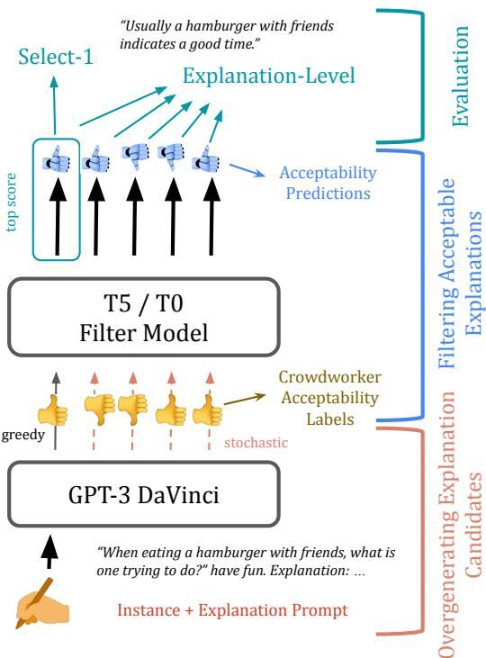  
Figure 1: Illustration of our overgeneration + filtration pipeline for producing human acceptable explanations for CommonsenseQA and SNLI (see examples in Table 1). Authors of this work write explanations to prompt GPT-3, generating 5 explanations per instance. An acceptability filter, trained on human binary acceptability judgments, determines which of these generated explanations are plausible. Evaluation is performed at both the explanation and the instance level.

However, collecting high-quality written explanations to serve as supervision is difficult and expensive. More than 70% of existing free-text explanation datasets are crowdsourced (Wiegreffe and Marasovic´, 2021), and even the most meticulous crowdsourcing efforts frequently fail to elicit logically consistent and grammatical explanations (Narang et al., 2020). Furthermore, a lack of standardized crowdsourcing design has resulted in highly varied datasets, which are hard to compare or combine (Tan, 2021).

Recent progress in prompting large language models (LLMs) provides a potentially promising alternate to large-scale crowdsourcing. The incontext learning paradigm, wherein powerful language models are prompted in a few-shot manner with just a few examples, has proven surprisingly effective across a range of NLP tasks (Radford et al., 2019; Brown et al., 2020; Shin et al., 2020; Schick and Schütze, 2021a, i.a.). In this work we ask: can LLMs also generate reliable explanations? In human subjects studies, we find that GPT-3 (Brown et al., 2020) can be readily made to generate explanations via prompting, and surprisingly, humans often prefer GPT-3 generated explanations to crowdsourced explanations in existing datasets (§2).

Two additional human subjects studies, however, demonstrate that GPT-3-generated explanations still have significant room for improvement along axes such as providing new information (i.e., avoiding repetition) and supporting the label; human subjects found less than half of greedily-decoded GPT-3-generated explanations to be acceptable with 100% agreement. To improve upon this, we re-frame the role of crowd annotators: instead of asking them to write explanations as in prior work, we (1) repeatedly query GPT-3 to generate multiple candidate explanations for each input instance, and (2) ask crowdworkers to rate the acceptability of each candidate generation. After showing that GPT-3 can usually generate an explanation that humans unanimously find acceptable within as few as five queries (§3), we use a small number of these binary crowdworker judgments to supervise an acceptability filtering model, which can be applied to select high quality candidates among GPT-3’s outputs (Figure 1; §4).

Despite intrinsic subjectivity in acceptability ratings, our supervised model improves upon the already-competitive few-shot paradigm by consistently selecting (human-identified) high quality explanations better than strong baselines. Human evaluations reveal that the filtration model not only improves acceptability, but also other axes like supporting the label and providing novel information.

In summary, our main findings are:

i. few-shot prompting with GPT-3 produces surprisingly competitive explanations, providing a promising alternative to crowd-authored freetext explanation corpora;

ii. binary human labeling can instead be leveraged to train a filter that selects high-quality machinegenerated explanations; and

iii. in areas where GPT-3 struggles, including information content, supporting the label, and overall acceptability, our proposed overgenerate-andfilter pipeline improves generated explanations.   
We publicly release our code and data.1

## 2 GPT-3 is Competitive with Crowdsourced Explanation Datasets

We investigate three research questions:

1. Are GPT-3-generated explanations preferable to crowdsourced ones in existing datasets? (§2.1)

2. Can improving prompt quality improve GPT-3- generated explanations? (§2.2)

3. Along what fine-grained dimensions are GPT-3- generated explanations preferred, and do these correlate with overall acceptability? (§2.3)

Explanation tasks and datasets. We consider two English tasks: CommonsenseQA and natural language inference (NLI), shown in Table 1. CommonsenseQA (Talmor et al., 2019) is a multiple choice task posed over commonsense questions. Crowdsourced free-text explanations for instances in CommonsenseQA are provided in the CoS-E v1.11 (Rajani et al., 2019) and ECQA (Aggarwal et al., 2021) datasets. ECQA explanations are counterfactual, i.e., annotators were instructed to explain not only the correct answer choice but also why the others are incorrect. ECQA was released to address the quality issues of CoS-E (Narang et al., 2020); for completeness, we experiment with both. Our second task is NLI, which involves inferring whether a given hypothesis sentence entails, contradicts, or is neutral towards a premise. This task is instantiated with the SNLI dataset (Bowman et al., 2015) and crowdsourced explanations from e-SNLI (Camburu et al., 2018). For each task, we report results on a fixed, randomly-sampled 250-instance test set not observed during prompt design.

Few-shot prompting for explanations. We use GPT-3 Davinci2 (Brown et al., 2020), an autoregressive language model with \~175B parameters trained on a large dataset of text scraped from the internet. We prompt the model with several (question, gold answer, explanation) triplets followed by an unexplained question-gold answer instance for which we expect the model to generate an explanation.3 We use a total of 115 randomly sampled train instances to create our prompts; each prompt consists of 8-24 randomly selected examples from this set. For each instance, we generate a single explanation with greedy decoding. More details about prompt construction are in Appendix A; example prompts are given in Tables 2 and 11.

<table><tr><td>SNLI (Bowman et al., 2015)</td><td>Let&#x27;s explain classification decisions. A young boy wearing a tank-top is climbing a tree. question: A boy was showing off for a girl.</td></tr><tr><td>mitt about to cook some meat in the kitchen. Hypothesis: A man is cooking something to eat. Label: entailment e-SNLI (Camburu et al., 2018): Meat is cooked in a</td><td>true, false, or neither? neither why? A boy might climb a tree to show off for a girl but he also might do it for fun or for other reasons. ###</td></tr><tr><td>kitchen, and is a food that you eat. Using an oven mitt implies you&#x27;re about to cook with hot utensils. GPT-3: Cooking is usually done to prepare food to eat.</td><td>A person on a horse jumps over a broken down airplane. question: A person is outdoors, on a horse. true, false, or neither? true why? Horse riding is an activity almost always done</td></tr><tr><td>CommonsenseQA (Talmor et al., 2019) Question: What is the result of applying for job?</td><td>outdoors. Additionally, a plane is a large object and is most likely to be found outdoors.</td></tr><tr><td>Answer Choices: anxiety and fear, increased workload, praise, less sleep, or being employed Correct Choice: being employed</td><td>### There is a red truck behind the horses. question: The horses are becoming suspicious of my</td></tr><tr><td>CoS-E (Rajani et al., 2019): being employed applying</td><td>apples. true, false, or neither? false</td></tr><tr><td>for job</td><td>why? The presence of a red truck does not imply there are apples, nor does it imply the horses are suspicious.</td></tr><tr><td>ECQA (Aggarwal et al., 2021): Applying for a job is</td><td></td></tr><tr><td>followed by attending interview which results in being</td><td>###</td></tr><tr><td></td><td></td></tr><tr><td></td><td>A dog carries an object in the snow.</td></tr><tr><td>employed. Applying for a job may not result in the other</td><td></td></tr><tr><td></td><td>question: A dog is asleep in its dog house.</td></tr><tr><td>options.</td><td></td></tr><tr><td></td><td>true, false, or neither? false</td></tr><tr><td>GPT-3: Applying for a job can result in being em-</td><td></td></tr><tr><td>ployed, which is a positive outcome.</td><td>why?</td></tr></table>

Table 1: Task-specific instances, along with their crowdsourced explanations from the respective datasets, shown alongside explanations generated greedily by GPT-3. In our experiments, the SNLI GPT-3 explanation was preferred over its corresponding e-SNLI explanation by 2/3 annotators. For CommonsenseQA, 3/3 preferred the GPT-3 explanation to the CoS-E explanation, and 2/3 to the ECQA one.  
Table 2: Example of a prompt with 3 training examples for SNLI: presented are the premise/hypothesis pairs, the gold labels, and the explanations (written by us) that act as input to GPT-3 (in practice, we use 8-24 examples per prompt). The text generated by the model acts as the free-text explanation. In this case, the model greedily auto-completes (given 12 examples): “A dog cannot carry something while asleep”.

Crowdsourcing evaluation. Given that existing automatic metrics often do not correlate well with human judgements of explanation quality (Clinciu et al., 2021; Kayser et al., 2021), we conduct human studies for evaluation.4 We ensure each experiment has a substantial number of distinct crowdworkers to mitigate individual annotator bias (Table 17).

We present workers with a dataset instance, its gold label, and two explanations for the instance generated under different conditions (“head-tohead”). We then ask them to make a preferential selection, collecting 3 annotations per data point. We report inter-annotator agreement (IAA) using Krippendorff’s α (Krippendorff, 2011). We find low-to-moderate agreement across studies, indicating the subjective nature of the task; see Tables 3, 4, and 5. Appendix B contains further details on quality control.

<table><tr><td rowspan="2"></td><td colspan="3">Preferred Explanation (%)</td><td rowspan="2">α</td></tr><tr><td>Dataset Crowd</td><td>Tie</td><td>GPT-3</td></tr><tr><td>CoS-E</td><td>20.3</td><td>34.9</td><td>44.8</td><td>0.5</td></tr><tr><td>ECQA</td><td>52.7</td><td>12.9</td><td>34.4</td><td>0.2</td></tr><tr><td>e-SNLI</td><td>63.6</td><td>11.6</td><td>24.8</td><td>0.3</td></tr></table>

Table 3: Head-to-head human evaluation for 250 explanations generated by GPT-3 vs. written by crowdworkers in the datasets, along with Krippendorff’s α for IAA. Results are shown as % preferences. We prompted GPT-3 with crowd explanations from the corresponding datasets.

## 2.1 Are GPT-3 explanations preferred over crowdsourced ones?

We perform a head-to-head comparison of explanations generated by GPT-3 with greedy decoding vs. gold human-written explanations in the original datasets. The crowdsourced explanations serve as a reasonable upper bound for what a supervised explanation generation model trained on them could produce. Table 1 contains examples of GPT-3-preferred explanations.

Results are shown in Table 3. GPT-3 greedilydecoded explanations are frequently preferred or comparable to crowdsourced explanations in CoS-E, which is not too surprising given the dataset has many ungrammatical explanations (Narang et al., 2020). And, while ECQA and e-SNLI explanations are strongly preferred to GPT-3, there are still a nontrivial number of cases where GPT-3 explanations are competitive (47.3% and 36.4%, respectively).

## 2.2 Can improving prompt quality improve GPT-3-generated explanations?

<table><tr><td colspan="4">Preferred GPT-3 Explanation (%)</td></tr><tr><td>Dataset</td><td>Crowd Prompts</td><td>Tie</td><td>Our Prompts</td><td>α</td></tr><tr><td>CoS-E</td><td>6.9</td><td>13.5</td><td>79.6</td><td>0.2</td></tr><tr><td>ECQA</td><td>15.9</td><td>9.5</td><td>74.7</td><td>0.3</td></tr><tr><td>e-SNLI</td><td>30.8</td><td>26.8</td><td>42.4</td><td>0.5</td></tr></table>

Table 4: Head-to-head human evaluation for 250 explanations generated by GPT-3 prompted with either author-written explanations or crowdsourced explanations from the associated datasets, along with Krippendorff’s α for IAA.

Given that low-quality training instances may result in low-quality predictions (especially in a few shot setting),5 we ask: can we improve GPT-3 generations simply by conditioning on higher-quality instances? To this end, we replace the 115 crowdsourced explanations from the original datasets for prompting GPT-3 with explanations carefully written by the authors of this paper (see Table 12 for examples). Our prompts are used to generate a different set of GPT-3 explanations on the same test data.

<table><tr><td rowspan="2"></td><td colspan="3">Preferred Explanation (%)</td><td rowspan="2">α</td></tr><tr><td>Dataset Crowd</td><td>Tie</td><td>GPT-3</td></tr><tr><td>CoS-E</td><td>7.2</td><td>13.9</td><td>78.9</td><td>0.5</td></tr><tr><td>ECQA</td><td>44.5</td><td>9.7</td><td>45.7</td><td>0.4</td></tr><tr><td>e-SNLI</td><td>49.6</td><td>9.7</td><td>40.7</td><td>0.2</td></tr></table>

Table 5: Head-to-head human evaluation for 250 explanations generated by GPT-3 vs. written by crowdworkers in the datasets, along with Krippendorff’s α for IAA. GPT-3 explanations were prompted with explanations written by the authors.

We perform a head-to-head human evaluation of the GPT-3 generations conditioned on the explanations we wrote vs. those conditioned on the crowdsourced explanations. Results in Table 4 show that, for all three corpora, generations conditioned on our explanations outperform generations conditioned on crowdsourced ones, illustrating the importance of good-quality prompts for GPT-3.

We repeat the experiment of §2.1, but with our prompts instead of dataset prompts. With this change, GPT-3 generations are even more competitive (Table 5). For all three datasets, more than half the time, few-shot prompting results in an explanation at least as good as a human-written explanation. For subsequent experiments, we prompt GPT-3 with the author-written explanations.

## 2.3 What types of explanations does GPT-3 generate?

Pairwise evaluations can only offer perspective on the relative quality of generated explanations. Are crowd annotators simply comparing explanations on surface-level features like grammaticality?

To understand finer-grained characteristics of explanations, we design a second human study to collect absolute Likert-scale judgments across seven axes of quality (with each explanation judged by 3 annotators). The first three axes capture surfacelevel features: generality, grammaticality, and factuality. The next three capture richer aspects of explanation quality: whether new information is introduced (a requirement for non-vacuous explanations), whether explanations support the gold label, and whether the amount of information given is sufficient. Finally, we ask for an overall judgement of quality: is the explanation acceptable? We explain our design process in Appendix B.3. Results on the crowdsourced and GPT-3 explanations for both tasks are given in Figure 2.6

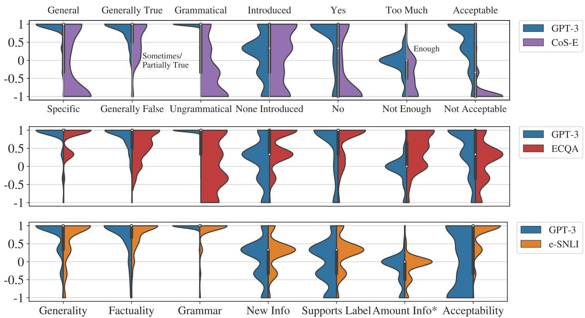  
Figure 2: Absolute evaluation for GPT-3 and crowdsourced explanations for CommonsenseQA via CoS-E (top) and ECQA (middle) datasets, and for NLI via the e-SNLI dataset (bottom). The distribution of mean scores of 3 annotators for each instance in the test set is plotted. All attributes besides Factuality and Amount Info are binary. \*Amount Info is the only attribute for which a value of 0 is preferred to a value of 1. See Table 18 for more details.

For both tasks, GPT-3 explanations do well in all 3 surface-level categories, with statistically significantly greater ratings in generality and grammaticality (and factuality for CommonsenseQA) compared to crowdsourced explanations, and distributional means close to 1. In these categories, there is little room for improvement.

On the other hand, GPT-3 explanations do not contain as much new information as ECQA and e-SNLI explanations, indicating substantial room for improvement (mean=0.1 for both tasks compared to 0.6 for ECQA and 0.2 for SNLI; these differences are statistically significant at p  0.01). GPT-3 explanations are substantially more supportive of the label vs. CoS-E, but not as supportive as ECQA or e-SNLI (all statistically significant at p  0.1). Indeed, the mean rating of GPT-3 explanations for label support is 0.5 for CommonsenseQA and 0.1 for NLI, demonstrating room for improvement. These axes are crucial to ensuring explanations are not vacuous and are on-topic. Finally, GPT-3 explanations are judged as acceptable at higher rates than CoS-E or ECQA explanations, but not e-SNLI explanations. Mean scores of 0.5 (CommonsenseQA) and 0.0 (NLI) indicate that GPT-3 explanations have room to improve overall.7

Correlation between acceptability and other attributes To understand what factors are important for the overall “acceptability" judgement, we compute Spearman correlation (ρ; Spearman, 1987) between acceptability and all other attributes (Table 6). Each is positively correlated with acceptability, though with varying degrees of magnitude. Acceptability is least correlated with “new information," and most correlated with grammaticality, generality, and the explanation’s support for the label. Overall, the results indicate that human preference for explanations is not fully explained by any one attribute, and is not limited to surface-level features.

<table><tr><td>Attribute</td><td>ρ</td><td>n</td></tr><tr><td>Generality</td><td>0.25</td><td>3750</td></tr><tr><td>Factuality</td><td>0.17</td><td>2958</td></tr><tr><td>Grammar</td><td>0.31</td><td>3750</td></tr><tr><td>New Info</td><td>0.05</td><td>3750</td></tr><tr><td>Supports Label</td><td>0.22</td><td>2943</td></tr><tr><td>*Amount Info</td><td>0.16</td><td>1761</td></tr></table>

Table 6: Spearman’s correlation (ρ) between acceptability and other attributes in Figure 2. For Amount Info, a value of 0 is preferred to a value of 1. All results are statistically significant at p <0.01.

## 3 Beyond Greedy Explanations

While GPT-3 explanations demonstrate strength across surface-level features and are surprisingly competitive in head-to-head settings, they can still be improved. One might imagine a setting with multiple end-users in which we wish to provide the most unambiguously acceptable explanation as output from a system. When considering the data from §2.3, we find that only 46.3% of the greedily-decoded GPT-3-generated explanations for CommonsenseQA and 31.5% for NLI are rated acceptable by 3/3 annotators.8

Inspired by work in other generation tasks (Holtzman et al., 2020; Massarelli et al., 2020; Holtzman et al., 2021), we hypothesize that equally or more informative explanations can be generated by sampling stochastically. We sample 4 additional generations from GPT-3 for each instance to complement the greedy generation. We crowdsource 3 acceptability annotations for each new explanation.

As expected, sampled explanations exhibit lower 3/3 acceptability than greedy explanations (25.1% for CommonsenseQA; 11.3% for SNLI). However, this results in a surprisingly higher proportion of instances that have at least one acceptable explanation in the set of 5. The greedy explanation was judged to be 3/3 acceptable in 46.3% of instances for CommonsenseQA and 31.5% for NLI; this increases to 79.5% and 51.2%, respectively, when sampled explanations are included.9

## 4 Improving Explanation Generation with Acceptability Filtering

The challenge of overgeneration is that GPT-3 alone cannot discern which of its stochastic samples are acceptable. Inspired by West et al. (2021), we explore training a supervised filter on the collected labels. Our key intuition is that by re-framing the role of annotators from explanation authors to binary judges, we can alleviate the need to collect a large-scale explanations dataset—the result is a simpler, cheaper, and easier crowdsourcing setup to administer (§4.1). Namely, we can (1) aggregate ratings over multiple annotators to produce more reliable labels, (2) use numerical metrics of annotator agreement to remove annotators contributing noisy data, and (3) collect annotations more quickly and cheaply than asking annotators to hand-write explanations. Moreover, we find that the filter can be trained with a relatively small amount of binary human judgments (§4.2). We demonstrate that the trained model is not simply taking advantage of surface-level features (§4.4). Figure 1 presents an overview of our pipeline.

## 4.1 Acceptability Annotations

We generate train and validation sets by repeating the procedure of generating 1 greedy and 4 sampled explanations for 991 and 1K instances, respectively, of the CommonsenseQA and SNLI training sets. Combining these with the annotated test sets from previous experiments results in a dataset of 1241/1250 instances in a 72/8/20% train/val/test ratio for each task. We again collect 3 binary acceptability ratings for each instance, resulting in \~6200 instance-explanation pairs and \~19K individual annotations per task. Table 13 contains statistics. To ensure that models trained on these corpora do not overfit to specific annotators (Geva et al., 2019), we collect an additional set of judgments for the test set of SNLI from a group of annotators who did not participate in any of our previous annotation tasks (“Test2”). Figure 9 and Figure 10 show the user interface.10

While we evaluate at test-time with the schema that only instances that 3/3 annotators deem acceptable are considered acceptable, preliminary experiments show that treating both 2/3 and 3/3 agreement instances as acceptable during training performs best on the 3/3 evaluation criterion at test-time.11 We also train a variant where we randomly select one annotation from the three as the gold label (“without human agreement”).

## 4.2 Acceptability Filter

Concretely, given the problem instance, the gold label, and a generated explanation, the acceptability filter predicts whether the explanation is acceptable. We fine-tune two sequence-to-sequence architectures, T5-Large (Raffel et al., 2020) and T0-3B (Sanh et al., 2022). Each model is trained 5x with different random seeds. Further training details are given in Appendix E.

Baselines. We train an explanation-only baseline, which receives as input only the explanation; similar baselines have been proposed for NLI (Poliak et al., 2018; Gururangan et al., 2018). These models represent the hypothesis that annotator ratings can be reconstructed with only surface features of the explanation candidates, e.g., grammaticality. We also consider a negative log-likelihood (NLL) baseline, which uses GPT-3’s estimated probability as the acceptability classification score. This is a slightly more competitive baseline than greedy; greedy usually (but not always) produces the highest-likelihood explanation.12

## 4.3 Evaluation

We consider three evaluation settings. The first is instance-level (“select-1”), where the system returns 1 explanation selected from the set of 5 for each instance. We return the explanation with the highest model-estimated probability and report instance-level accuracy, i.e., the % of instances for which a gold acceptable explanation is selected.

We also evaluate at the explanation-level, where we treat each explanation independently and compute metrics over the full dataset. This aligns with the binary classification training of the models (cross-entropy on the explanation labels) and is suited for the setting in which we want to return all of the acceptable explanations per instance. In this setting, we report average precision (AP), an estimate of area under the precision-recall curve.

Finally, we perform an absolute human evaluation (§2.3) on the subset of instances where the filter model does not select the greedy explanation as the best, i.e., comparing “select-1” performance to a greedy baseline on the instances where it differs. We additionally re-perform the head-to-head comparison of Table 5, replacing the greedy GPT-3 explanations with those selected by the filter.

<table><tr><td rowspan="2"></td><td colspan="2">“Select-1” Acc@3/3</td><td colspan="2">Expl.-level AP@3/3</td></tr><tr><td>Dev</td><td>Test</td><td>Dev</td><td>Test</td></tr><tr><td>Random</td><td>26.83.2</td><td>30.62.1</td><td>27.41.1</td><td>31.60.4</td></tr><tr><td>Constant</td><td></td><td></td><td>27.9</td><td>31.8</td></tr><tr><td>NLL</td><td>41.8</td><td>52.0</td><td>42.4</td><td>45.6</td></tr><tr><td>T5-L Expl.-only</td><td>40.23.9</td><td>49.81.1</td><td>43.51.5</td><td>50.01.9</td></tr><tr><td>T0-3B Expl.-only</td><td>42.61.4</td><td>47.31.6</td><td>41.12.0</td><td>54.11.7</td></tr><tr><td>T5-L w/o HA</td><td>46.62.3</td><td>55.43.2</td><td>47.02.3</td><td>56.93.6</td></tr><tr><td>T5-L</td><td>46.42.9</td><td>55.42.1</td><td>45.13.4</td><td>58.31.5</td></tr><tr><td>T0-3B w/o HA</td><td>48.42.0</td><td>57.42.8</td><td> $4 4 . 5 _ { 2 . 3 }$ </td><td>59.82.7</td></tr><tr><td>T0-3B</td><td>48.60.9</td><td> $\mathbf { 5 9 . 9 _ { 1 . 1 } }$ </td><td> $\mathbf { 4 9 . 7 _ { 1 . 6 } }$ </td><td>64.01.5</td></tr><tr><td>Oracle U.B.</td><td>78.0</td><td>82.0</td><td>100.0</td><td>100.0</td></tr></table>

Table 7: Results for acceptability classifiers trained on CommonsenseQA. Subscripts indicate standard error over models trained with 5 different random seeds. “w/o HA” = without human agreement. “Oracle U.B” indicates upper bound based on dataset properties (§3).
<table><tr><td rowspan="2"></td><td colspan="3">“Select-1&quot; Acc@3/3</td><td colspan="3">Explanation-level AP@3/3</td></tr><tr><td>Dev</td><td>Test</td><td>Test2</td><td>Dev</td><td>Test</td><td>Test2</td></tr><tr><td>Random</td><td>15.20.7</td><td>14.70.1</td><td>13.60.3</td><td>15.00.6</td><td>14.40.3</td><td>13.80.2</td></tr><tr><td>Constant</td><td></td><td></td><td></td><td>15.2</td><td>14.5</td><td>13.7</td></tr><tr><td>NLL</td><td>33.0</td><td>32.0</td><td>31.6</td><td>29.9</td><td>32.7</td><td>28.5</td></tr><tr><td>Expl.-only</td><td>30.20.8</td><td>30.92.1</td><td>27.81.8</td><td>30.62.5</td><td>30.61.3</td><td>25.92.3</td></tr><tr><td>w/o HA</td><td>38.21.9</td><td>38.51.8</td><td>36.21.4</td><td>49.35.3</td><td>48.53.3</td><td>52.85.3</td></tr><tr><td>Full</td><td>37.80.8</td><td>38.70.7</td><td>35.01.2</td><td>46.83.6</td><td>47.63.5</td><td>49.54.8</td></tr><tr><td>Oracle U.B.</td><td>51.0</td><td>52.4</td><td>46.4</td><td>100.0</td><td>100.0</td><td>100.0</td></tr></table>

Table 8: Results for SNLI explanation acceptability; all model results are on T0-3B. See Table 7’s caption.

## 4.4 Results

Classifier performance is given in Tables 7-8.

Effect of model size. On CommonsenseQA, T0- 3B outperforms T5-Large by \~2-4% select-1 accuracy and \~5-6% explanation-level AP across splits. We use T0-3B in subsequent experiments.

NLL baseline vs. full model. For both tasks on both validation and test sets, T0-3B outperforms the NLL baseline substantially. On CommonsenseQA, we observe a 7-8% gain in instance-level accuracy, and a gain of 18% explanation-level AP on the test set. This provides strong evidence that the supervised model is able to incorporate binary human feedback to predict acceptable explanations at a level much higher that GPT-3 achieves on its own. We present examples where “select-1” predictions differ between NLL and our filter model in Table 10 and Table 16.

Explanation only vs. full model. Our results suggest that our models are leveraging feature interactions between the instance and explanation to make their predictions: without instance-level context, the explanation-only baselines are on average more than 5 points worse across metrics. Though they under-perform significantly relative to the full model, explanation-only baselines do fare surprisingly well, indicating that shallow features like factuality and grammaticality may represent latent factors in human acceptability judgments.

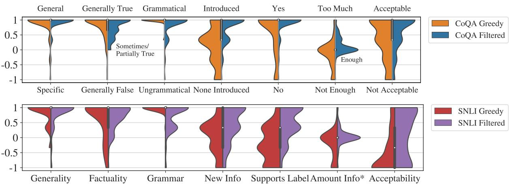  
Figure 3: Absolute evaluation results in the “select-1” setting for the instances where our best-performing filter model does not select the greedy explanation (156 instances for CommonsenseQA (top); 91 for NLI (bottom)). See caption of Figure 2 and the Appendix-Table 20 for more details and statistical significance results.

<table><tr><td rowspan="2"></td><td colspan="3">Preferred Explanation (%)</td><td rowspan="2">α</td></tr><tr><td>Dataset Gold-Standard</td><td>Tie</td><td>GPT-3</td></tr><tr><td>CoS-E</td><td>2.9</td><td>3.6</td><td>93.5</td><td>0.25</td></tr><tr><td>ECQA</td><td>19.9</td><td>10.0</td><td>70.1</td><td>0.05</td></tr><tr><td>e-SNLI</td><td>49.9</td><td>6.9</td><td>43.2</td><td>0.14</td></tr></table>

Table 9: A replication of Table 5, except the GPT-3 explanations are now the top-1 of our filter system.

The effect of multiple training annotations. In some cases, performance improves if the training instances are labeled with the consensus of three annotators (vs. the singularly annotated case “w/o HA"), though the effects are inconsistent. In most cases, using consensus labels results in reduced variance across random seeds. However, the gains may not outweigh the 3x annotations required.

Our model doesn’t overfit to specific annotators. The performance of our model when evaluated on the NLI test set labeled by separate annotators (“Test2”) is comparable to the original test set (instance-level accuracy drops a few points, but explanation-level AP slightly rises).

Our model improves generated explanations along desirable traits. We present our absolute human evaluation for greedy vs. filtered explanations from GPT-3 in Figure 3— for both tasks, explanations filtered by our model more readily introduce new information, support the label, and contain at least enough information for both tasks (in addition to being more acceptable). Interestingly, greedy explanations still prevail in surfacelevel features (grammaticality and, in the case of CommonsenseQA, factuality; differences are statistically significant with low p, see Table 20).13

<table><tr><td>SNLI</td></tr><tr><td>Premise: An officer in a black uniform and hat stands to the left of a large structure with other officers in the background. Hypothesis: An officer enjoys coffee in a shop. Label: contradiction</td></tr><tr><td>NLL-Predicted Explanation: An officer in a black uniform and hat is not necessarily an officer enjoying coffee in a shop. Filter-Predicted Explanation: An officer in a struc- ture standing to one side is not the same as enjoying</td></tr><tr><td>coffee in a shop. CommonsenseQA</td></tr><tr><td>Question: Where would there be an auditorium with only a single person speaking? Answer choices: theater, park, university campus, crowd, or lights NLL-Predicted Explanation: An auditorium is a large room used for lectures, and a single person speaking is likely to be a lecture.</td></tr></table>

Table 10: Randomly-selected instances that our filter model predicts differently than NLL at the “select-1” task and got correct, but NLL got incorrect.

We additionally find in our head-to-head study (Table 9) that, compared to Table 5, using filtered GPT-3 explanations instead of greedy increases the preference for GPT-3 explanations by 15-24% for both CommonsenseQA datasets. We do not see an increase in the SNLI case, which may be due to the fact that fewer GPT-3 explanations change after filtering (36.4%, compared to 62.4% for CommonsenseQA), and GPT-3 explanations for SNLI tend to be less acceptable overall, resulting in a lower upper-bound oracle of instances where an acceptable explanation can be selected (§3).

In summary. We have demonstrated the effectiveness of modeling binary crowd judgements of acceptability as a means to select candidates from GPT-3 which are deemed acceptable with unanimous agreement. For the method that does not leverage human agreement, this is done with only \~5k binary annotations. We additionally demonstrate that our filtered explanations improve upon greedy generations in fine-grained categories that probe their topical relevance and meaningful content. The gap between our best model and the upper-bound oracle indicates that there is still substantial room for improvement in both task settings (but especially for SNLI). Future work may investigate sampling more explanations, or incorporating other sources of supervision signal.

## 5 Related Work

Free-text explanation generation. The earliest neural free-text explanation models did so for computer vision applications (Hendricks et al., 2016; Park et al., 2018; Kim et al., 2018) and NLI (Camburu et al., 2018). These methods relied on supervised datasets to train the explanation generator. Others have proposed to generate explanations or clarifications to improve task performance in a supervised (Rajani et al., 2019; Lampinen et al., 2022) or unsupervised (Shwartz et al., 2020) manner. Yordanov et al. (2021) study transfer learning between datasets for few-shot generation.

Latcinnik and Berant (2020) proposed a method to generate free-text explanations supervised only on task signal, and Brahman et al. (2021) used sources of weak supervision to generate explanations for defeasible inference. Paranjape et al. (2021) design hand-crafted templates which they use with mask-infilling to produce contrastive explanations from pretrained language models.

Concurrent work (Marasovic et al.´ , 2021) studies the effect of prompt format and model size on crowdworker judgements of prompted explanation plausibility. They find that GPT-3 Davinci outperforms other smaller pretrained models, but that crowdworkers find these explanations less plausible than those from the datasets, aligning with our first experimental result (Table 3). We perform a more in-depth study of the fine-grained criteria comprising human acceptability, and demonstrate that with higher-quality prompts and filtering, GPT-3’s performance can be significantly improved.

Supervising on human preferences. Prior and concurrent work has used binary judgements from crowdworkers to fit models to human preferences for non-XAI tasks such as summarization (Ziegler et al., 2020; Stiennon et al., 2020), creating commonsense knowledge bases (West et al., 2021), and building natural language inference datasets (Liu et al., 2022). Unlike these works, we apply human preference modeling to increase the human acceptability of model-generated free-text explanations. West et al. (2021) demonstrate that GPT-3 + a supervised acceptability filter can generate a high-quality causal knowledge graph: in addition to their work being conducted in a different domain, our success conditions and evaluation metrics differ because we must produce a prediction for each instance (whereas they can simply discard bad generations).

## 6 Conclusion

We demonstrate GPT-3’s capacity to generate freetext explanations for NLP task instances in a fewshot setting. We further improve this capability via an overgenerate + filter approach, where the filter is trained on supervision from human acceptability ratings. We hope our results can guide future work on free-text explanations via neural or neurosymbolic systems (Brahman et al., 2021; Majumder et al., 2021; Saha et al., 2021). Future work may also further investigate the benefits of counterfactual explanations.

While human rationales for decision making are not necessarily the same as model rationales, the goal behind modeling human acceptability is often to build trust with a human user. This trust may or may not be warranted (Jacovi et al., 2021); future work would be well-suited to further investigate generated explanations for incorrect label predictions such as in Appendix C, which could mislead end users.

## Acknowledgements

We thank Jena Hwang for helpful advice in designing our human user studies and Peter West for sharing GPT-3 prompting scripts. We thank other members of the Mosaic team at the Allen Institute for AI for valuable suggestions, as well as both our anonymous annotators and reviewers. This work was done while SW was an intern on Mosaic.

## 7 Ethics & Broader Impacts

All datasets used in this work are public, and we plan to release the machine-generated explanations and annotations we collected. We do not collect any personal information from our human participants.

Models that produce explanations in the means used in our experimental protocol (i.e., by conditioning on the gold labels) have the possibility to cause humans to place unwarranted trust in an AI system. This line of research is complementary to works investigating the faithfulness of modelgenerated free-text explanations (Hase et al., 2020; Wiegreffe et al., 2021). We demonstrate in Appendix C that GPT-3’s explanations lack reliability because the model can explain answer choices that were not its prediction equally well. This may be due in part to the fact that decoding algorithms for generating predictions from language models are sub-optimal (e.g., Zhao et al., 2021; Holtzman et al., 2021) and GPT-3 may have factual knowledge stored in its parameters about other answer choices that allow it to provide reasonably acceptable explanations. Until this phenomenon is better understood, we do not condone using GPT-3- generated explanations in real-world deployment.

Lastly, our model of human acceptability is based on the aggregate judgements of participants from primarily Western, English-speaking countries working on crowdsourcing platforms. The subjective judgements of explanation acceptability may vary significantly among different population groups.

## References

Shourya Aggarwal, Divyanshu Mandowara, Vishwajeet Agrawal, Dinesh Khandelwal, Parag Singla, and Dinesh Garg. 2021. Explanations for CommonsenseQA: New Dataset and Models. In Proceedings of the 59th Annual Meeting of the Association for Computational Linguistics and the 11th International Joint Conference on Natural Language Pro-

cessing (Volume 1: Long Papers), pages 3050–3065, Online. Association for Computational Linguistics.

Samuel R. Bowman, Gabor Angeli, Christopher Potts, and Christopher D. Manning. 2015. A large annotated corpus for learning natural language inference. In Proceedings of the 2015 Conference on Empirical Methods in Natural Language Processing, pages 632–642, Lisbon, Portugal. Association for Computational Linguistics.

Faeze Brahman, Vered Shwartz, Rachel Rudinger, and Yejin Choi. 2021. Learning to rationalize for nonmonotonic reasoning with distant supervision. In Proceedings of the 35th AAAI Conference on Artificial Intelligence, Online.

Tom Brown, Benjamin Mann, Nick Ryder, Melanie Subbiah, Jared D Kaplan, Prafulla Dhariwal, Arvind Neelakantan, Pranav Shyam, Girish Sastry, Amanda Askell, Sandhini Agarwal, Ariel Herbert-Voss, Gretchen Krueger, Tom Henighan, Rewon Child, Aditya Ramesh, Daniel Ziegler, Jeffrey Wu, Clemens Winter, Chris Hesse, Mark Chen, Eric Sigler, Mateusz Litwin, Scott Gray, Benjamin Chess, Jack Clark, Christopher Berner, Sam McCandlish, Alec Radford, Ilya Sutskever, and Dario Amodei. 2020. Language models are few-shot learners. In Advances in Neural Information Processing Systems, volume 33, pages 1877–1901, Online. Curran Associates, Inc.

Oana-Maria Camburu, Tim Rocktäschel, Thomas Lukasiewicz, and Phil Blunsom. 2018. e-snli: Natural language inference with natural language explanations. In Advances in Neural Information Processing Systems, volume 31, Montreal, Canada. Curran Associates, Inc.

Francisco Javier Chiyah Garcia, David A. Robb, Xingkun Liu, Atanas Laskov, Pedro Patron, and Helen Hastie. 2018. Explainable autonomy: A study of explanation styles for building clear mental models. In Proceedings of the 11th International Conference on Natural Language Generation, pages 99– 108, Tilburg University, The Netherlands. Association for Computational Linguistics.

Miruna-Adriana Clinciu, Arash Eshghi, and Helen Hastie. 2021. A study of automatic metrics for the evaluation of natural language explanations. In Proceedings of the 16th Conference of the European Chapter of the Association for Computational Linguistics: Main Volume, pages 2376–2387, Online. Association for Computational Linguistics.

Upol Ehsan, Brent Harrison, Larry Chan, and Mark O Riedl. 2018. Rationalization: A neural machine translation approach to generating natural language explanations. In Proceedings of the 1st AAAI/ACM Conference on AI, Ethics, and Society (AIES), New Orleans, USA.

Upol Ehsan, Pradyumna Tambwekar, Larry Chan, Brent Harrison, and Mark O Riedl. 2019. Auto-

mated rationale generation: A technique for explainable ai and its effects on human perceptions. In Proceedings ofthe 24th International Conference on Intelligent User Interfaces (IUI), pages 263–274, Los Angeles, USA. ACM.

Mor Geva, Yoav Goldberg, and Jonathan Berant. 2019. Are we modeling the task or the annotator? an investigation of annotator bias in natural language understanding datasets. In Proceedings of the 2019 Conference on Empirical Methods in Natural Language Processing and the 9th International Joint Conference on Natural Language Processing (EMNLP-IJCNLP), pages 1161–1166, Hong Kong, China. Association for Computational Linguistics.

Alison Gopnik. 1998. Explanation as orgasm. Minds and Machines, 8(1):101–118.

Suchin Gururangan, Swabha Swayamdipta, Omer Levy, Roy Schwartz, Samuel Bowman, and Noah A. Smith. 2018. Annotation artifacts in natural language inference data. In Proceedings of the 2018 Conference of the North American Chapter of the Association for Computational Linguistics: Human Language Technologies, Volume 2 (Short Papers), pages 107–112, New Orleans, Louisiana. Association for Computational Linguistics.

Peter Hase, Shiyue Zhang, Harry Xie, and Mohit Bansal. 2020. Leakage-adjusted simulatability: Can models generate non-trivial explanations of their behavior in natural language? In Findings of the Association for Computational Linguistics: EMNLP 2020, pages 4351–4367, Online. Association for Computational Linguistics.

Lisa Anne Hendricks, Zeynep Akata, Marcus Rohrbach, Jeff Donahue, Bernt Schiele, and Trevor Darrell. 2016. Generating visual explanations. In Proceedings of the 14th European Conference on Computer Vision (ECCV), Amsterdam, Netherlands.

Ari Holtzman, Jan Buys, Li Du, Maxwell Forbes, and Yejin Choi. 2020. The curious case of neural text degeneration. In Proceedings of the 8th International Conference on Learning Representations (ICLR), Online.

Ari Holtzman, Peter West, Vered Shwartz, Yejin Choi, and Luke Zettlemoyer. 2021. Surface form competition: Why the highest probability answer isn’t always right. In Proceedings of the 2021 Conference on Empirical Methods in Natural Language Processing, pages 7038–7051, Online and Punta Cana, Dominican Republic. Association for Computational Linguistics.

Alon Jacovi, Ana Marasovic, Tim Miller, and Yoav´ Goldberg. 2021. Formalizing trust in artificial intelligence: Prerequisites, causes and goals of human trust in ai. In Proceedings of the 4th ACM Conference on Fairness, Accountability, and Transparency (FAccT), pages 624–635, Online.

Zhengbao Jiang, Frank F. Xu, Jun Araki, and Graham Neubig. 2020. How can we know what language models know? Transactions of the Association for Computational Linguistics, 8:423–438.

Maxime Kayser, Oana-Maria Camburu, Leonard Salewski, Cornelius Emde, Virginie Do, Zeynep Akata, and Thomas Lukasiewicz. 2021. e-vil: A dataset and benchmark for natural language explanations in vision-language tasks. In Proceedings ofthe IEEE International Conference on Computer Vision (ICCV), Online.

Been Kim, Rajiv Khanna, and Oluwasanmi O Koyejo. 2016. Examples are not enough, learn to criticize! criticism for interpretability. In Advances in Neural Information Processing Systems, volume 29, Barcelona, Spain. Curran Associates, Inc.

Jinkyu Kim, Anna Rohrbach, Trevor Darrell, John F. Canny, and Zeynep Akata. 2018. Textual Explanations for Self-Driving Vehicles. In Proceedings of the 15th European Conference on Computer Vision (ECCV), Munich, Germany.

Diederik P. Kingma and Jimmy Ba. 2015. Adam: A method for stochastic optimization. In Proceedings of the 3rd International Conference on Learning Representations (ICLR), San Diego, USA.

Klaus Krippendorff. 2011. Computing krippendorff’s alpha-reliability.

Vivian Lai, Samuel Carton, and Chenhao Tan. 2020. Harnessing explanations to bridge ai and humans. In Fair and Responsible AI Workshop at the CHI Conference on Human Factors in Computing Systems, Online.

Andrew K Lampinen, Ishita Dasgupta, Stephanie CY Chan, Kory Matthewson, Michael Henry Tessler, Antonia Creswell, James L McClelland, Jane X Wang, and Felix Hill. 2022. Can language models learn from explanations in context? ArXiv preprint arXiv:2204.02329.

Veronica Latcinnik and Jonathan Berant. 2020. Explaining question answering models through text generation. ArXiv preprint arXiv:2004.05569.

David B Leake. 1991. Goal-based explanation evaluation. Cognitive Science, 15(4):509–545.

Tao Lei, Regina Barzilay, and Tommi Jaakkola. 2016. Rationalizing neural predictions. In Proceedings of the 2016 Conference on Empirical Methods in Natural Language Processing, pages 107–117, Austin, Texas. Association for Computational Linguistics.

Quentin Lhoest, Albert Villanova del Moral, Yacine Jernite, Abhishek Thakur, Patrick von Platen, Suraj Patil, Julien Chaumond, Mariama Drame, Julien Plu, Lewis Tunstall, Joe Davison, Mario Šaško, Gunjan Chhablani, Bhavitvya Malik, Simon Brandeis, Teven Le Scao, Victor Sanh, Canwen Xu, Nicolas Patry, Angelina McMillan-Major, Philipp Schmid,

Sylvain Gugger, Clément Delangue, Théo Matussière, Lysandre Debut, Stas Bekman, Pierric Cistac, Thibault Goehringer, Victor Mustar, François Lagunas, Alexander Rush, and Thomas Wolf. 2021. Datasets: A community library for natural language processing. In Proceedings of the 2021 Conference on Empirical Methods in Natural Language Processing: System Demonstrations, pages 175–184, Online and Punta Cana, Dominican Republic. Association for Computational Linguistics.

Alisa Liu, Swabha Swayamdipta, Noah A Smith, and Yejin Choi. 2022. Wanli: Worker and ai collaboration for natural language inference dataset creation. ArXiv preprint arXiv:2201.05955.

Tania Lombrozo. 2007. Simplicity and probability in causal explanation. Cognitive Psychology, 55(3):232–257.

Yao Lu, Max Bartolo, Alastair Moore, Sebastian Riedel, and Pontus Stenetorp. 2022. Fantastically ordered prompts and where to find them: Overcoming few-shot prompt order sensitivity. ArXiv preprint arXiv:2104.08786.

Bodhisattwa Prasad Majumder, Oana-Maria Camburu, Thomas Lukasiewicz, and Julian McAuley. 2021. Rationale-inspired natural language explanations with commonsense. ArXiv preprint arXiv:2106.13876.

Ana Marasovic, Iz Beltagy, Doug Downey, and ´ Matthew E Peters. 2021. Few-shot selfrationalization with natural language prompts. ArXiv preprint arXiv:2111.08284.

Luca Massarelli, Fabio Petroni, Aleksandra Piktus, Myle Ott, Tim Rocktäschel, Vassilis Plachouras, Fabrizio Silvestri, and Sebastian Riedel. 2020. How decoding strategies affect the verifiability of generated text. In Findings of the Association for Computational Linguistics: EMNLP 2020, pages 223–235, Online. Association for Computational Linguistics.

Sharan Narang, Colin Raffel, Katherine Lee, Adam Roberts, Noah Fiedel, and Karishma Malkan. 2020. WT5?! training text-to-text models to explain their predictions. ArXiv preprint arXiv:2004.14546.

Bhargavi Paranjape, Julian Michael, Marjan Ghazvininejad, Hannaneh Hajishirzi, and Luke Zettlemoyer. 2021. Prompting contrastive explanations for commonsense reasoning tasks. In Findings of the Association for Computational Linguistics: ACL-IJCNLP 2021, pages 4179–4192, Online. Association for Computational Linguistics.

Dong Huk Park, Lisa Anne Hendricks, Zeynep Akata, Anna Rohrbach, Bernt Schiele, Trevor Darrell, and Marcus Rohrbach. 2018. Multimodal explanations: Justifying decisions and pointing to the evidence. In Proceedings of the IEEE Conference on Computer Vision and Pattern Recognition (CVPR), pages 8779–8788, Salt Lake City, USA.

Ethan Perez, Douwe Kiela, and Kyunghyun Cho. 2021. True few-shot learning with language models. In Advances in Neural Information Processing Systems, volume 34, pages 11054–11070, Online. Curran Associates, Inc.

Adam Poliak, Jason Naradowsky, Aparajita Haldar, Rachel Rudinger, and Benjamin Van Durme. 2018. Hypothesis only baselines in natural language inference. In Proceedings of the Seventh Joint Conference on Lexical and Computational Semantics, pages 180–191, New Orleans, Louisiana. Association for Computational Linguistics.

Alec Radford, Jeffrey Wu, Rewon Child, David Luan, Dario Amodei, Ilya Sutskever, et al. 2019. Language models are unsupervised multitask learners.

Colin Raffel, Noam Shazeer, Adam Roberts, Katherine Lee, Sharan Narang, Michael Matena, Yanqi Zhou, Wei Li, and Peter J. Liu. 2020. Exploring the limits of transfer learning with a unified text-to-text transformer. The Journal ofMachine Learning Research, 21(140):1–67.

Nazneen Fatema Rajani, Bryan McCann, Caiming Xiong, and Richard Socher. 2019. Explain yourself! leveraging language models for commonsense reasoning. In Proceedings of the 57th Annual Meeting of the Association for Computational Linguistics, pages 4932–4942, Florence, Italy. Association for Computational Linguistics.

Swarnadeep Saha, Prateek Yadav, Lisa Bauer, and Mohit Bansal. 2021. ExplaGraphs: An explanation graph generation task for structured commonsense reasoning. In Proceedings of the 2021 Conference on Empirical Methods in Natural Language Processing, pages 7716–7740, Online and Punta Cana, Dominican Republic. Association for Computational Linguistics.

Victor Sanh, Albert Webson, Colin Raffel, Stephen H Bach, Lintang Sutawika, Zaid Alyafeai, Antoine Chaffin, Arnaud Stiegler, Teven Le Scao, Arun Raja, et al. 2022. Multitask prompted training enables zero-shot task generalization. In Proceedings of the 10th International Conference on Learning Representations (ICLR), Online.

Timo Schick and Hinrich Schütze. 2021a. Exploiting cloze-questions for few-shot text classification and natural language inference. In Proceedings of the 16th Conference of the European Chapter of the Association for Computational Linguistics: Main Volume, pages 255–269, Online. Association for Computational Linguistics.

Timo Schick and Hinrich Schütze. 2021b. It’s not just size that matters: Small language models are also few-shot learners. In Proceedings of the 2021 Conference of the North American Chapter of the Association for Computational Linguistics: Human Language Technologies, pages 2339–2352, Online. Association for Computational Linguistics.

Noam Shazeer and Mitchell Stern. 2018. Adafactor: Adaptive learning rates with sublinear memory cost. In Proceedings ofthe 35th International Conference on Machine Learning (ICML), pages 4596–4604, Stockholm, Sweden. PMLR.

Taylor Shin, Yasaman Razeghi, Robert L. Logan IV, Eric Wallace, and Sameer Singh. 2020. AutoPrompt: Eliciting Knowledge from Language Models with Automatically Generated Prompts. In Proceedings of the 2020 Conference on Empirical Methods in Natural Language Processing (EMNLP), pages 4222–4235, Online. Association for Computational Linguistics.

Vered Shwartz, Peter West, Ronan Le Bras, Chandra Bhagavatula, and Yejin Choi. 2020. Unsupervised commonsense question answering with self-talk. In Proceedings of the 2020 Conference on Empirical Methods in Natural Language Processing (EMNLP), pages 4615–4629, Online. Association for Computational Linguistics.

Charles Spearman. 1987. The proof and measurement of association between two things. The American Journal ofPsychology, 100(3/4):441–471.

Nisan Stiennon, Long Ouyang, Jeffrey Wu, Daniel Ziegler, Ryan Lowe, Chelsea Voss, Alec Radford, Dario Amodei, and Paul F Christiano. 2020. Learning to summarize from human feedback. In Advances in Neural Information Processing Systems, volume 33, pages 3008–3021, Online. Curran Associates, Inc.

Justin Sulik, Jeroen van Paridon, and Gary Lupyan. 2021. Explanations in the wild.

Alon Talmor, Jonathan Herzig, Nicholas Lourie, and Jonathan Berant. 2019. CommonsenseQA: A question answering challenge targeting commonsense knowledge. In Proceedings of the 2019 Conference of the North American Chapter of the Association for Computational Linguistics: Human Language Technologies, Volume 1 (Long and Short Papers), pages 4149–4158, Minneapolis, Minnesota. Association for Computational Linguistics.

Chenhao Tan. 2021. On the diversity and limits of human explanations. ArXiv preprint arXiv:2106.11988.

Pauli Virtanen, Ralf Gommers, Travis E Oliphant, Matt Haberland, Tyler Reddy, David Cournapeau, Evgeni Burovski, Pearu Peterson, Warren Weckesser, Jonathan Bright, et al. 2020. Scipy 1.0: Fundamental algorithms for scientific computing in python. Nature Methods, 17(3):261–272.

Peter West, Chandra Bhagavatula, Jack Hessel, Jena D Hwang, Liwei Jiang, Ronan Le Bras, Ximing Lu, Sean Welleck, and Yejin Choi. 2021. Symbolic knowledge distillation: from general language models to commonsense models. ArXiv preprint arXiv:2110.07178.

Sarah Wiegreffe and Ana Marasovic. 2021.´ Teach me to explain: A review of datasets for explainable natural language processing. In Advances in Neural Information Processing Systems Datasets and Benchmarks Track, volume 34, Online.

Sarah Wiegreffe, Ana Marasovic, and Noah A. Smith.´ 2021. Measuring association between labels and free-text rationales. In Proceedings ofthe 2021 Conference on Empirical Methods in Natural Language Processing, pages 10266–10284, Online and Punta Cana, Dominican Republic. Association for Computational Linguistics.

Thomas Wolf, Lysandre Debut, Victor Sanh, Julien Chaumond, Clement Delangue, Anthony Moi, Pierric Cistac, Tim Rault, Remi Louf, Morgan Funtowicz, Joe Davison, Sam Shleifer, Patrick von Platen, Clara Ma, Yacine Jernite, Julien Plu, Canwen Xu, Teven Le Scao, Sylvain Gugger, Mariama Drame, Quentin Lhoest, and Alexander Rush. 2020. Transformers: State-of-the-art natural language processing. In Proceedings of the 2020 Conference on Empirical Methods in Natural Language Processing: System Demonstrations, pages 38–45, Online. Association for Computational Linguistics.

Yordan Yordanov, Vid Kocijan, Thomas Lukasiewicz, and Oana-Maria Camburu. 2021. Few-shot out-ofdomain transfer learning of natural language explanations. In NeurIPS Workshop on Deep Generative Models and Downstream Applications.

Jeffrey C Zemla, Steven Sloman, Christos Bechlivanidis, and David A Lagnado. 2017. Evaluating everyday explanations. Psychonomic Bulletin & Review, 24(5):1488–1500.

Tony Z Zhao, Eric Wallace, Shi Feng, Dan Klein, and Sameer Singh. 2021. Calibrate before use: Improving few-shot performance of language models. In Proceedings ofthe 38th International Conference on Machine Learning (ICML), Online.

Daniel M Ziegler, Nisan Stiennon, Jeffrey Wu, Tom B Brown, Alec Radford, Dario Amodei, Paul Christiano, and Geoffrey Irving. 2020. Fine-tuning language models from human preferences. ArXiv preprint arXiv:1909.08593.

## A Prompt Construction

Following Perez et al. (2021), we avoid prompt tuning on the full training and development sets of the datasets studied, in order to ensure that our methods represent a true few-shot setting. To develop the initial prompt design, we experimented with no more than 10 different layouts in the GPT-3 Sandbox platform using 15 training examples on the CoS-E and e-SNLI datasets. For subsequent prompt design, we again used these 15 training examples for each dataset from which we sampled 6 prompts, along with a fixed 100-example “development set” randomly drawn from the training set. We preserve the “few-shot” approach by using a maximum of these same 115 instances to develop our prompting methods. For these 115 examples, the authors of this paper manually wrote high-quality explanations to be used as prompt examples (Table 12). As presented in Table 2, we found that structuring SNLI as a question-answering task achieved the best performance, similarly to Zhao et al. (2021). We provide an example of our SNLI prompt in Table 2 and CommonsenseQA in Table 11.

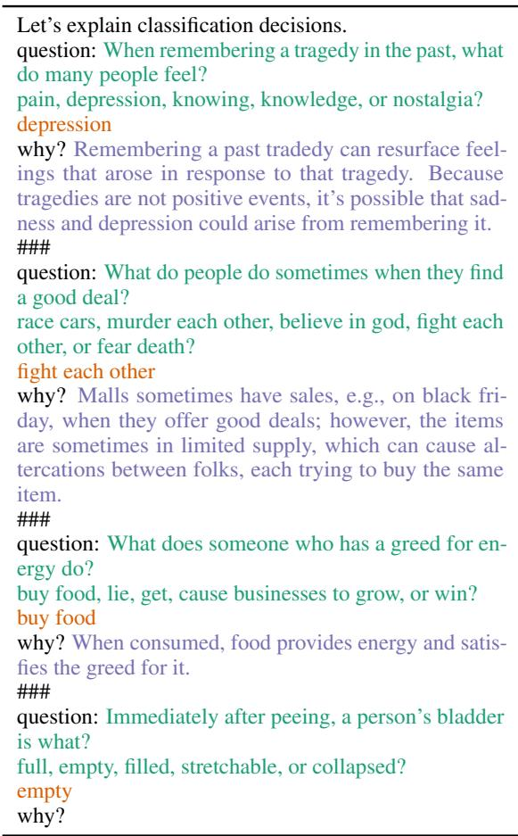  
Table 11: Example of a prompt with 3 training examples for CommonsenseQA: presented are the question and answer choices, the gold labels, and the explanations (written by us) that act as input to GPT-3 (in practice, we use 8-24 examples per prompt). The text generated by the model acts as the free-text explanation. In this case, the model greedily auto-completes (given 8 examples): “After peeing, the bladder is empty.”

In-context learning methods have been shown to have high variance based on hyperparameters including example order, number of examples given, and which examples are given (Jiang et al., 2020; Zhao et al., 2021; Lu et al., 2022). While these values have not been standardized, two prominent papers, Schick and Schütze (2021b) and Brown et al. (2020), use 32 and 64 prompt examples, respectively. Due to the 2049-token limit of the OpenAI GPT-3 API and the fact that the addition of explanations elongates each prompt instance, we find the maximum number of examples the API can accommodate is 24 for CoS-E, e-SNLI, and our handwritten explanations and 16 for ECQA.

The focus of this work is not on finding the optimal prompt, but on developing a general strategy for few-shot explanation generation that could be successful when no additional (large) validation set for tuning is available. Therefore, to provide as robust of an expected performance estimate as possible, we do not tune the additional hyperparameters, instead sampling them to approximate performance.14 Namely, while prior work uses one fixed prompt for all instances and varies the random seed, we approximate the same expected performance by sampling a new set of prompts for each instance. We also sample the number of prompts for each instance (and shuffle their order) from the values 8, 16, 24 for CommonsenseQA experiments, 8, 16 for experiments using ECQA explanations, and 12, 18, 24 for SNLI experiments (to maintain label balance). To overcome label bias in prompt ordering, for tasks with distinct answer choices per instance (CommonsenseQA), we shuffle the answer choices. For tasks with fixed answer choices (SNLI), we sample an equal number of prompt instances for each label (so number of prompt instances is a multiple of 3).

Table 12 shows a few non-cherry-picked examples of our handwritten explanations used as prompts relative to the datasets.

## B Crowdsourcing Details

We discuss shared details of the study designs in §B.1. We discuss the head-to-head interface in §B.2, the absolute interface in §B.3, and the acceptability interface in §B.4. Finally, we present details on quality control and payment in §B.5 and annotator statistics in §B.6.

## B.1 Shared Interface Details

For all three human subjects study designs designs, we show the user the input instance (e.g., premise+hypothesis) and the gold label in addition to the explanation(s). We explain our motivation for using the gold label as a methodological control in §2.

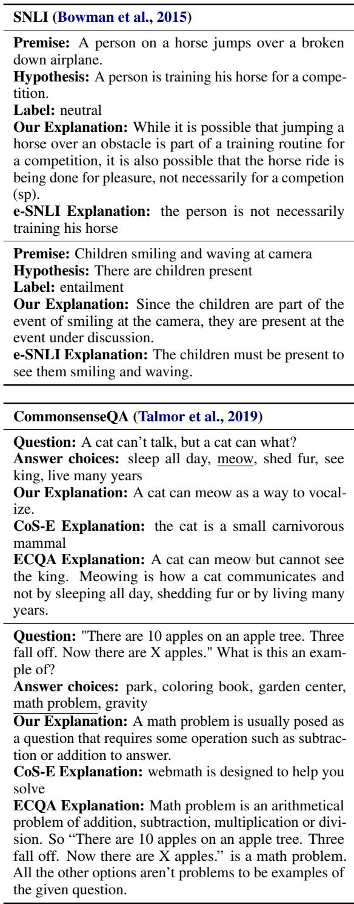  
Table 12: Examples of explanations used as prompts from various sources, including our handwritten explanations. Correct answers for CommonsenseQA are underlined.

For a similar reason, we do not show the other incorrect label choices to the user, which is particularly of note for the CommonsenseQA task which has different answer choices per instance. Some instances in CommonsenseQA have multiple correct or very similar answer choices, due to noise in the dataset and the fact that the wrong answer choices were deliberately collected to make the task challenging. We (the authors) again found we struggled to accurately judge explanation quality when we disagreed with the selected answer choice or found multiple answer choices to be correct. To remove this possible confounder, we instruct participants to pretend the gold label is correct even if they disagree with it, and make this easier by hiding the other answer choices. This may result in a slight bias in judgements against the ECQA dataset due to its unique counterfactual nature, though our goal was not to study the benefits and downsides of counterfactual explanations in this work.

## B.2 Head-to-Head Interface Details

We show the user the task input and gold label, and ask them to select which of two explanations best explains the answer. We instruct workers to consider the gold label to be correct even if they disagree with it (CommonsenseQA instances can be subjective) and to ignore minor grammar and spelling mistakes such as improper upper-casing. Figures 5 and 6 show the evaluation interface.

## B.3 Absolute Interface Details

Figures 7 and 8 show the absolute evaluation interface (minus the acceptability attribute, which is collected in a separate run of the study). Our interface is inspired by prior work from psychology and the social sciences (Leake, 1991; Gopnik, 1998; Lombrozo, 2007; Zemla et al., 2017; Chiyah Garcia et al., 2018; Clinciu et al., 2021; Sulik et al., 2021). We iterated over 3-4 versions of the questions and UI design until we had optimized agreement rates as much as possible. Our resulting two-part evaluation consists of 7 questions:

Part 1: Context-Independent Evaluation We first assess the explanation in isolation, i.e., these questions are presented to the user without revealing the question/context that the explanation is attempting to address:

1. Howfactual is this statement? (generally false, sometimes or partially true, generally true, or need more information to judge). This question is designed to test both generality (can the explanation’s truthfulness be ascertained or is more information needed?) and factuality, which aligns with “compatibility with receiver’s existing beliefs” and that the best explanation is the “most likely” explanation from the receiver/user’s perspective (Lombrozo, 2007; Zemla et al., 2017; Sulik et al., 2021). Generality is coded based on whether a truthfulness answer is selected (considered to be general) or whether the “need more information to judge” choice is selected (considered not to be general).

2. Is this statement grammatical? (yes or no) This question is designed to test for clarity, aligning with characteristics such as coherence (Lei et al., 2016) and human-likeness and understandability (Ehsan et al., 2019).

Part 2: Context-Dependent Evaluation We next show the user the question (premise and hypothesis for SNLI) and gold answer that the explanation was conditioned on. We then ask:

1. Does the explanation provide new facts, information or reasoning not stated in the question and answer? (yes or no) In our preliminary experiments, we found some explanations simply restate the question declaratively with the answer filled in. This question addresses the distinction between “validity” and “utility” (Leake, 1991): an explanation can be valid (i.e., a restatement of the question with the answer filled-in might be correct), but not useful; utility is defined by whether an explanation “satisfies an explainer’s need for information”. And while utility is best understood in the context of realworld applications (Lai et al., 2020), we nonetheless aim to identify vacuous explanations that do not provide new information.

2. Is the new information relevant to justifying the answer? (yes or no) New information, if provided, “should be compatible with our existing beliefs, and consistent with the evidence and with itself” (Zemla et al., 2017). This question is designed to test whether the information provided supports the label. The specific interpretation of “relevance” is purposefully left to the annotator.15

3. How much information does the explanation have tojustify the answer? (not enough, enough, or too much) This question is designed to test the extent to which the provided novel information is adequate or sufficient (Kim et al., 2016; Lei et al., 2016; Ehsan et al., 2019).16

4. Is the explanation acceptable? (yes or no) The final question is designed to assess annotators’ overall judgement of the explanation as a whole.

We only ask Question 2 if the answer to Question 1 is “yes” and Question 3 if the answer to Question 2 is yes, because they regard the new facts, information, or reasoning. We found that most prior work tends to lump added-value, relevance, and adequacy judgements into one “informativeness” judgement (Clinciu et al., 2021), which we felt was too course to allow for meaningful error analysis.

## B.4 Acceptability Interface Details

Figures 9 and 10 show the binary acceptability interface used to collect training and test data for the overgeneration filter model.

Spearman’s rank-order correlation coefficients (Table 6) are computed using scipy (Virtanen et al., 2020) on the 250 test explanations from the 5 data sources in Figure 2. Each instance is annotated by 3 annotators for a total of 3750 datapoints (some criteria are only evaluated conditionally, resulting in less total annotations– see Appendix B.3). Statistical significance is computed using the built-in two-sided non-parametric test.

## B.5 Quality Control and Payment

We use Amazon Mechanical Turk (AMT), and calculate pay on a rate of \$15/hour. Every few batches, we check to ensure that the median time taken perannotator amounts to approximately this pay rate. While annotators do tend to speed up the more HITs we released, first-round median times were approximately 30 seconds per head-to-head evaluation HIT (thus paid at \$0.12 each), 1 minute per absolute evaluation HIT (thus paid at \$0.25 each), and 35-39 seconds per acceptability HIT (5 explanations; paid at \$0.20 each).

We require annotators to be located in either Australia, Canada, New Zealand, the United Kingdom, or the United States, as a proxy for English competency.17 We require a past HIT approval rate of >

98% and > 5000 HITs approved. We do not allow annotators to participate who were previously on a block list from our past AMT studies.

Annotators must complete a qualifying exam in order to participate in the main annotation tasks. The qualifying exam consists of 3 HITs in the same format as the main absolute evaluation task for CommonsenseQA We pay \$2.25 for the qualifying exam. There are 9-18 questions in total (3-6 questions per HIT), some of which are only answerable conditioned on previous answers. A user who answers “no” to question 3, for example, will not be asked to answer questions 4 and 5. Given the challenging and sometimes ambiguous nature of some of the questions, for the first run of the qualification exam, we manually awarded qualifications by inspecting the annotators’ answers. Scores for the first run compared to our answers (out of 17 annotators attempting) ranged from 5 to 14 out of 18. The median accuracy was 11 out of 18, and we find that awarding the qualification to those with scores at or above the median aligns closely with our manual inspection. We thus use this score to assign qualifications in future iterations.

Because it is necessary that annotators understand the task before they can evaluate explanation quality (Wiegreffe and Marasovic´, 2021), for tasks that are more difficult, i.e., NLI, we additionally require annotators to pass (score of 7 or above) a task-specific qualification exam with 8 questions, paid at \$1.25.

In order to track quality throughout evaluation, we compute inter-annotator agreement using Krippendorff’s α and use a hidden built-in Javascript function to compute time per HIT spent. If any annotator completed the tasks in an unreasonably low time, or removing their annotations substantially improves Krippendorff’s α, we remove their annotations and re-annotate their instances. We additionally ensure that each experiment has a substantial number of distinct crowdworkers to mitigate individual annotator bias, reporting this as well as the mean and median number of HITs completed by each in Table 17.

## B.6 Statistics

The number of distinct crowd annotators and the median and mean number of HITs completed for each experiment can be found in Table 17. More

<table><tr><td>Dataset</td><td>Split</td><td># Instances by Agreement 0/3</td><td>1/3</td><td>2/3</td><td>3/3</td><td>Total</td></tr><tr><td>Com.QA</td><td>Train</td><td>932</td><td>1078</td><td>1194</td><td>1296</td><td>4500</td></tr><tr><td></td><td>Dev</td><td>105</td><td>91</td><td>132</td><td>127</td><td>455</td></tr><tr><td></td><td>Test</td><td>298</td><td>227</td><td>328</td><td>397</td><td>1250</td></tr><tr><td>SNLI</td><td>Train</td><td>2372</td><td>805</td><td>621</td><td>702</td><td>4500</td></tr><tr><td></td><td>Dev</td><td>272</td><td>87</td><td>65</td><td>76</td><td>500</td></tr><tr><td></td><td>Test</td><td>678</td><td>225</td><td>166</td><td>181</td><td>1250</td></tr><tr><td></td><td>Test2</td><td>666</td><td>234</td><td>179</td><td>171</td><td>1250</td></tr></table>

Table 13: Statistics of our acceptability annotations.

detailed breakdowns of inter-annotator agreement for some experiments are in Tables 14 and 15.

## C Absolute Evaluation by Label Accuracy

Can GPT-3 produce convincing explanations even for instances it cannot predict correctly? This has implications for model-generated explanations being “right for the right reasons”. To produce label predictions, we follow the same prompt format as in Tables 2 and 11, removing the WHY? token and the gold explanations so that the model generates a label prediction instead. GPT-3 achieves 50.8% accuracy on CommonsenseQA compared to a 20% random baseline, and 46% accuracy on SNLI compared to a 33.33% random baseline.18

Figure 4 presents absolute evaluation results broken down by whether GPT-3 correctly predicts the instance label. The results show little variation between the correctly-predicted and incorrectlypredicted groups in most attributes. This indicates that GPT-3 explanations are not faithful enough to use in real-world applications in their current form.

## D 2/3 Acceptability Statistics

When we treat explanations rated by at least 2/3 annotators as “acceptable”, for CommonsenseQA, 77.9% of greedily-decoded explanations are acceptable; for SNLI, 51.0%. 50.5% of sampled explanations are acceptable; for SNLI, 23.5%. Out of the set of 5 (1 greedy + 4 stochastic), 97.7% of CommonsenseQA instances have at least one acceptable explanation, and 79.5% of SNLI.

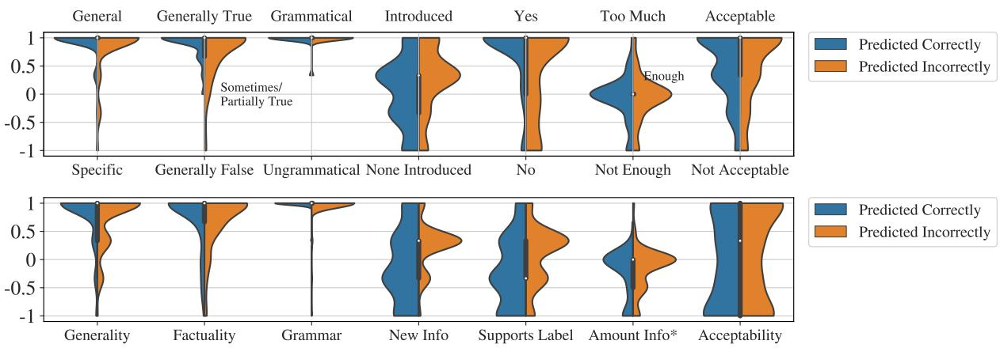  
Figure 4: Absolute evaluation results for explanations generated by GPT-3 based on whether GPT-3 predicted the instance label correctly or not. CommonsenseQA (top) and SNLI (bottom). See caption of Figure 2 and the Appendix-Table 19 for more details.

## E Filter Model Details

We split the 4,955 distinct annotated explanations for CommonsenseQA (5000 for SNLI) into a train/dev set of 4500/455 (4500/500 for SNLI), where all 5 explanations for a given instance are placed in the same set to avoid leakage. We present statistics on the label distribution in Table 13. Along with the metric settings reported in the paper (“select-1” and explanation-level), we computed a metric that is instance-level but considers all explanations by computing metrics over the 5 explanations of an instance and then averaging across instances, finding in practice that the results are highly similar to the explanation-level evaluation.

We use Huggingface Datasets (Lhoest et al., 2021) and Huggingface Transformers (Wolf et al., 2020) for implementation. We format inputs to the models as follows, where expl is one of the five explanations and the gold\_label is either 0 (not acceptable) or 1 (acceptable):

if explanation\_only:   
input\_string = (f"explanation: {expl}.   
Is this explanation good or bad?")   
else:   
input\_string = (   
"{question} answer: {gold\_label}. "   
"explanation: {expl}. "   
Is this explanation good or bad?")

The T5-Large model is trained using a learning rate of 1E  4 with linear decay, a batch size of 64, and default values for Adam (Kingma and Ba, 2015), gradient clipping, and dropout. We train for a maximum 200 epochs, performing early stopping on the validation loss with a patience of 10 epochs. For T0-3B, we train with a batch size of 50. We use AdaFactor (Shazeer and Stern, 2018) with a linear warmup of 500 steps. We conduct an initial hyperparameter sweep over learning rate, considering 1E  5, 5E  05, 5E  06. The learning rate that achieves the best validation loss for the full-information model and the explanation-only model is 1E 5, which we use for all training experiments.

<table><tr><td>Dataset</td><td>Split</td><td>Krippendorff&#x27;s α</td></tr><tr><td rowspan="2">CommonsenseQA</td><td>Training + Validation</td><td>0.32</td></tr><tr><td>Test</td><td>0.40</td></tr><tr><td rowspan="3">SNLI</td><td>Training + Validation</td><td>0.51</td></tr><tr><td>Test</td><td>0.50</td></tr><tr><td>Test2</td><td>0.47</td></tr></table>

Table 14: Inter-annotator agreement for acceptability AMT studies.

## F Additional Filter Results

In the main experiments, at evaluation time, we labelled an explanation as acceptable if 3/3 annotators agreed on it. Here, we report results if this threshold is relaxed to 2/3. Overall, the results are comparable: T0-3B outperforms the baselines according to both select-1 accuracy and AP (see Table 21 and Table 22).

<table><tr><td>AMT Study</td><td>Dataset</td><td>Generality</td><td>Factuality</td><td>Grammar</td><td>New Info</td><td>Supports Label</td><td>Amount Info</td><td>Acceptability</td><td>Aggregate</td></tr><tr><td>GPT-3 Greedy</td><td>Com.QA</td><td>0.37</td><td>0.32</td><td>-0.01</td><td>0.09</td><td>0.45</td><td>0.21</td><td>0.28</td><td>0.38</td></tr><tr><td>GPT-3 Greedy</td><td>SNLI</td><td>0.25</td><td>0.57</td><td>0.39</td><td>-0.01</td><td>0.04</td><td>0.17</td><td>0.52</td><td>0.40</td></tr><tr><td>Dataset</td><td>CoS-E</td><td>0.71</td><td>0.38</td><td>0.36</td><td>0.42</td><td>0.68</td><td>0.08</td><td>0.25</td><td>0.59</td></tr><tr><td>Dataset</td><td>ECQA</td><td>0.01</td><td>0.21</td><td>0.30</td><td>0.00</td><td>0.03</td><td>0.25</td><td>0.04</td><td>0.20</td></tr><tr><td>Dataset</td><td>e-SNLI</td><td>0.37</td><td>0.23</td><td>0.37</td><td>-0.14</td><td>-0.12</td><td>0.04</td><td>0.15</td><td>0.19</td></tr><tr><td>GPT-3 Filtered</td><td>Com.QA</td><td>0.25</td><td>0.18</td><td>0.25</td><td>0.11</td><td>0.27</td><td>0.15</td><td>0.30</td><td>0.32</td></tr><tr><td>GPT-3 Filtered</td><td>SNLI</td><td>0.41</td><td>0.19</td><td>0.07</td><td>0.17</td><td>0.08</td><td>0.13</td><td>0.50</td><td>0.33</td></tr></table>

Table 15: Inter-annotator agreement for absolute-comparison AMT studies, using Krippendorff’s α computed on an interval scale from -1 to 1. The aggregate score is computed by treating the annotations along each attribute as separate instances and computing agreement across the entire set.

<table><tr><td>SNLI (Bowman et al., 2015)</td></tr><tr><td>Premise: There are two kilted men, one of them older and is holding bagpipes with the other one with a drum. Hypothesis: Two kiled (sp) men hold bagpipes Label: contradiction NLL-Predicted Explanation: The two kilted men are not holding bagpipes, they are holding a bagpipe and a drum.</td></tr><tr><td>Filter-Predicted Explanation: Just because there are kilted men does not necessarily mean that they are hold- ing bagpipes. This can be seen from the older kilted man is holding the bagpipes rather than the kilder (sp)</td></tr><tr><td>one. CommonsenseQA (Talmor et al., 2019) Question: The hardcovers were especially tall, so he removed a shelf on the what to make room? Answer choices: hold alcohol, grocery store, bookcase, nightstand, or chest of drawers</td></tr></table>

Table 16: Randomly-selected instances that our filter model predicts differently than NLL at the “select-1” task, and got incorrect but NLL got correct.

<table><tr><td>AMT Study</td><td>Task/Dataset</td><td># Annotators</td><td>Median # HITs (Mean)</td></tr><tr><td rowspan="3">GPT-3 Greedy w/ Dataset Prompts vs. Dataset</td><td>Com.QA/CoS-E</td><td>16</td><td>31.5 (46.9)</td></tr><tr><td>Com.QA/ECQA</td><td>13</td><td>35 (57.7)</td></tr><tr><td>e-SNLI</td><td>12</td><td>39 (62.5)</td></tr><tr><td rowspan="3">GPT-3 Greedy: Author-written vs. Dataset Prompts</td><td>Com.QA/CoS-E</td><td>7</td><td>84 (107.1)</td></tr><tr><td>Com.QA/ECQA</td><td>13</td><td>49 (57.7)</td></tr><tr><td>e-SNLI</td><td>8</td><td>43.5 (93.8)</td></tr><tr><td rowspan="3">GPT-3 Greedy w/ Author-written Prompts vs. Dataset</td><td>Com.QA/CoS-E</td><td>8</td><td>90 (93.8)</td></tr><tr><td>Com.QA/ECQA</td><td>17</td><td>27 (44.1)</td></tr><tr><td>e-SNLI</td><td>8</td><td>93 (93.8)</td></tr><tr><td rowspan="2">GPT-3 Greedy (Absolute)</td><td>Com.QA</td><td>13</td><td>51 (57.7)</td></tr><tr><td>SNLI</td><td>12</td><td>14 (62.5)</td></tr><tr><td rowspan="2">Dataset (Absolute)</td><td>CoS-E ECQA</td><td>14</td><td>58 (53.6)</td></tr><tr><td>e-SNLI</td><td>19</td><td>7 (39.5)</td></tr><tr><td rowspan="2">Acceptability (Training and Validation Data)</td><td>Com.QA (2973 HITs)</td><td>13</td><td>16 (57.7)</td></tr><tr><td>SNLI (3000 HITs)</td><td>34 14</td><td>70 (87.4) 128.5 (214.3)</td></tr><tr><td rowspan="4">Acceptability (Test Data)</td><td>Com.QA</td><td>17</td><td>32 (44.1)</td></tr><tr><td>SNLI</td><td>11</td><td>26 (68.1)</td></tr><tr><td>SNLI (Test2)</td><td>7</td><td>65 (107.1)</td></tr><tr><td>CoS-E</td><td>13</td><td>48 (57.7)</td></tr><tr><td rowspan="3">GPT-3 Filtered (Absolute)</td><td>ECQA</td><td>16</td><td>38.5 (46.9)</td></tr><tr><td>e-SNLI</td><td>9</td><td>60 (83.3)</td></tr><tr><td>Com.QA (468 HITs)</td><td>10</td><td>44.5 (46.8)</td></tr><tr><td rowspan="2"></td><td>SNLI (273 HITs)</td><td>6</td><td>53 (45.5)</td></tr><tr><td></td><td></td><td></td></tr></table>

Table 17: Total # of annotators and mean # HITs completed per-annotator for each AMT study (out of 750 total # HITs unless otherwise specified = 3 annotators for each of 250 test instances).
<table><tr><td>Set of Test Explanations</td><td>Generality</td><td>Factuality</td><td>Grammar</td><td>New Info</td><td>Supp. Label</td><td>Amt. Info</td><td>Accept.</td></tr><tr><td>GPT-3 Greedy for Com.QA CoS-E</td><td> $\mathbf { 0 . 9 _ { 0 . 4 } } ^ { \ddagger }$   $\mathbf { - 0 . 2 0 . 9 }$ </td><td> ${ \bf 0 . 8 _ { 0 . 4 } ( 2 4 7 ) ^ { \dagger } }$   $0 . 5 _ { 0 . 5 } \ : ( 1 3 1 )$ </td><td> $\mathbf { 1 . 0 _ { 0 . 1 } } ^ { \dagger }$ </td><td> $0 . 1 _ { 0 . 6 }$ </td><td> $\mathbf { 0 . 5 _ { 0 . 7 } ( 2 1 7 ) ^ { \ddagger } }$ </td><td> $\mathbf { - 0 . 1 _ { 0 . 4 } } ( 1 8 6 ) ^ { \ddagger }$ </td><td> $\mathbf { 0 . 5 _ { 0 . 6 \dagger } }$ </td></tr><tr><td>GPT-3 Greedy for Com.QA</td><td> $\overline { { \mathbf { 0 . 9 0 . 4 } ^ { \vee } } }$ </td><td> $\overline { { { \bf 0 . 8 _ { 0 . 4 } } \left( { 2 4 7 } \right) ^ { \ddagger } } }$ </td><td> $- 0 . 3 \phantom { 0 } _ { 0 . 7 }$   $\bf { 1 . 0 0 . 1 ^ { \ddagger } }$ </td><td> $0 . 1 _ { 0 . 8 }$   $\overline { { 0 . 1 _ { 0 . 6 } } }$ </td><td> $- 0 . 3 _ { 0 . 9 } \ : ( 1 9 0 )$   $\overline { { 0 . 5 _ { 0 . 7 } \ : ( 2 1 7 ) } }$ </td><td> ${ \cdot 0 . 5 } _ { 0 . 5 } \ : ( 7 8 )$   $- 0 . 1 _ { 0 . 4 } \ : ( 1 8 6 )$ </td><td> $- 0 . 9 0 . 4 $   $\mathbf { \overline { { 0 . 5 _ { 0 . 6 \sharp } } } }$ </td></tr><tr><td>ECQA GPT-3 Greedy for SNLI e-SNLI</td><td> $0 . 8 _ { 0 . 4 }$   $\overline { { \mathbf { 0 . 7 _ { 0 . 5 } } \mathrm { ^ { \wedge } } } }$   $0 . 6 _ { 0 . 6 }$ </td><td> $0 . 6 _ { 0 . 4 } ( 2 4 9 )$   $\overline { { 0 . 7 _ { 0 . 5 } \ : ( 2 4 6 ) } }$   $0 . 8 _ { 0 . 4 } \ : ( 2 3 6 )$ </td><td> $0 . 1 _ { 0 . 7 }$   $\mathbf { 1 . 0 _ { 0 . 2 } } ^ { \dagger }$   $0 . 9 _ { 0 . 4 }$ </td><td> $\mathbf { 0 . 6 _ { 0 . 5 } } ^ { \ddagger }$   $\overline { { 0 . 1 _ { 0 . 6 } } }$   $\mathbf { 0 . 2 _ { 0 . 5 } } ^ { \vee }$ </td><td> $\mathbf { 0 . 7 0 . 5 \ ( 2 4 7 ) ^ { \wedge } }$   $- 0 . 1 _ { 0 . 6 } ^ { * }$   $\mathbf { 0 . 2 _ { 0 . 5 } } ^ { * \dagger }$ </td><td> $\mathbf { 0 . 5 _ { 0 . 5 } ( 2 3 9 ) ^ { \ddagger } }$   $- 0 . 2 _ { 0 . 4 } \ : ( 2 0 3 )$   $\mathbf { - 0 . 1 _ { 0 . 4 } ( 2 3 8 ) ^ { \wedge } }$ </td><td> $0 . 1 _ { 0 . 6 }$   $0 . 0 \phantom { 0 } _ { 0 . 8 }$   $\mathbf { 0 . 7 _ { 0 . 4 } } ^ { \dagger }$ </td></tr></table>

Table 18: Statistics from the graphs plotted in Figure 2. Mean standard error presented; numbers in parenthesis indicate the number of datapoints, if not 250. ∗For SNLI, we modified the evaluation framework such that “Supports Label” was always answered instead of being conditioned on “New Info”. Statistical significance results using a one-sided Wilcoxon signed-rank test at p-values of $\ddagger = 0 . 0 0 0 0 1$ $\dagger = 0 . 0 0 0 1$ $\vee = 0 . 0 1$ $\wedge = 0 . 1$ indicates that the median difference between the marked score distribution and the unmarked score distribution is greater than 0.

<table><tr><td>Set of Test Explanations</td><td>Generality</td><td>Factuality</td><td>Grammar</td><td>New Info</td><td> $\mathbf { S u p p . L a b e l }$ </td><td>Amt. Info</td><td>Accept.</td></tr><tr><td>Com.QA Pred. Correctly</td><td> $\mathbf { 0 . 9 _ { 0 . 3 } ( 1 2 7 ) } ^ { \vee }$ </td><td> ${ \mathbf { 0 . 9 _ { 0 . 3 } ( 1 2 6 ) } } ^ { \vee }$ </td><td> $1 . 0 _ { 0 . 1 } ( 1 2 7 )$ </td><td> $0 . 0 _ { 0 . 6 } \ : ( 1 2 7 )$ </td><td> $\mathbf { 0 . 7 _ { 0 . 6 } ( 1 0 8 ) ^ { \dagger } }$ </td><td> $- 0 . 1 _ { 0 . 4 } \ : ( 9 8 )$ </td><td> $0 . 5 _ { 0 . 6 } \ : ( 1 2 7 )$ </td></tr><tr><td>Com.QA Pred. Incorrectly</td><td> $0 . 8 _ { 0 . 4 } ( 1 2 3 )$ </td><td> $0 . 7 _ { 0 . 5 } \ : ( 1 2 1 )$ </td><td> $1 . 0 _ { 0 . 1 } ( 1 2 3 )$ </td><td> $\mathbf { 0 . 3 _ { 0 . 6 } ( 1 2 3 ) } ^ { \vee }$ </td><td> $0 . 3 _ { 0 . 8 } \ : ( 1 0 9 )$ </td><td> $- 0 . 1 _ { 0 . 4 } ( 8 8 )$ </td><td> $0 . 5 _ { 0 . 7 } ( 1 2 3 )$ </td></tr><tr><td>SNLI Pred. Correctly</td><td> $\overline { { { \bf 0 . 8 _ { 0 . 5 } \ : ( 1 1 5 ) } ^ { \wedge } } }$ </td><td> $\overline { { 0 . 7 _ { 0 . 5 } \ : ( 1 1 2 ) } }$ </td><td> $\overline { { { \bf 1 . 0 _ { 0 . 1 } } \mathrm { ( 1 1 5 ) } ^ { \wedge } } }$ </td><td> $\overline { { - 0 . 1 _ { 0 . 7 } \ : ( 1 1 5 ) } }$ </td><td> $\overline { { - 0 . 2 _ { 0 . 6 } \left( 1 1 5 \right) } }$ </td><td> $- 0 . 3 _ { 0 . 4 } \ : ( 8 3 )$ </td><td> $\overline { { - 0 . 1 _ { 0 . 8 } \ : ( 1 1 5 ) } }$ </td></tr><tr><td>SNLI Pred. Incorrectly</td><td> $0 . 7 _ { 0 . 5 } \ : ( 1 3 5 )$ </td><td> $0 . 7 _ { 0 . 5 } ( 1 3 4 )$ </td><td> $1 . 0 _ { 0 . 2 } ( 1 3 5 )$ </td><td> $\mathbf { 0 . 2 _ { 0 . 4 } } ( 1 3 5 ) ^ { \frac { 1 } { \cdot } }$ </td><td> ${ \bf 0 . 1 _ { 0 . 5 } ( 1 3 5 ) } ^ { \vee }$ </td><td> $- \mathbf { 0 . 2 _ { 0 . 4 } } ( 1 2 0 ) ^ { \wedge }$ </td><td> $\mathbf { 0 . 1 _ { 0 . 8 } ( 1 3 5 ) } ^ { \wedge }$ </td></tr></table>

Table 19: Statistics from the graphs of GPT-3 greedy explanations plotted in Figure 4. See the caption of Table 18 for further details.
<table><tr><td>Set of Test Explanations</td><td>Generality</td><td>Factuality</td><td>Grammar</td><td>New Info</td><td>Supp. Label</td><td>Amt. Info</td><td>Accept.</td></tr><tr><td>GPT-3 Greedy for Com.QA</td><td> $0 . 9 _ { 0 . 4 } ( 1 5 6 )$ </td><td> ${ \mathbf { 0 . 8 _ { 0 . 4 } } } ( 1 5 3 ) ^ { \vee }$ </td><td> $\mathbf { 1 . 0 _ { 0 . 1 } } ( 1 5 6 ) ^ { \ddagger }$ </td><td> $0 . 1 _ { 0 . 6 } \ : ( 1 5 6 )$ </td><td> $0 . 5 _ { 0 . 7 } ( 1 3 5 )$ </td><td> $- 0 . 1 _ { 0 . 5 } \ : ( 1 1 7 )$ </td><td> $0 . 3 _ { 0 . 7 } \ : ( 1 5 6 )$ </td></tr><tr><td>GPT-3 Filtered for Com.QA</td><td> $\mathbf { 0 . 9 _ { 0 . 3 } ( 1 5 6 ) ^ { \wedge } }$ </td><td> $0 . 7 _ { 0 . 3 } \ : ( 1 5 5 )$ </td><td> $0 . 8 _ { 0 . 4 } ( 1 5 6 )$ </td><td> $\mathbf { 0 . 7 _ { 0 . 4 } } ( 1 5 6 ) ^ { \frac { 1 } { + } }$ </td><td> $\mathbf { 0 . 9 _ { 0 . 4 } } ( 1 5 4 ) ^ { \frac { 1 } { \cdot } }$ </td><td> $\mathbf { 0 . 2 _ { 0 . 3 } ( 1 5 2 ) ^ { \ddagger } }$ </td><td> ${ \bf 0 . 6 _ { 0 . 6 } } \left( 1 5 6 \right) ^ { \vee }$ </td></tr><tr><td>GPT-3 Greedy for SNLI</td><td> $0 . 8 _ { 0 . 4 } ( 9 1 )$ </td><td> $0 . 6 _ { 0 . 6 } \ : ( 9 1 )$ </td><td> $\mathbf { 0 . 9 _ { 0 . 3 } ( 9 1 ) ^ { \frac { 1 } { \prime } } }$ </td><td> $0 . 0 _ { 0 . 6 } \ : ( 9 1 )$ </td><td> $- 0 . 2 _ { 0 . 6 } ^ { * } \left( 9 1 \right)$ </td><td> $- 0 . 2 _ { 0 . 5 } \ : ( 6 6 )$ </td><td> $- 0 . 5 _ { 0 . 7 } \ : ( 9 1 )$ </td></tr><tr><td>GPT-3 Filtered for SNLI</td><td> $0 . 8 _ { 0 . 5 } \ : ( 9 1 )$ </td><td> $0 . 7 _ { 0 . 4 } \ : ( 8 8 )$ </td><td> $0 . 7 _ { 0 . 4 } \ : ( 9 1 )$ </td><td> $\mathbf { 0 . 5 _ { 0 . 6 } ( 9 1 ) ^ { \frac { 1 } { \cdot } } }$ </td><td> $\mathbf { 0 . 5 _ { 0 . 5 } } ^ { * } ( 9 1 ) ^ { \ddagger }$ </td><td> $\mathbf { 0 . 0 _ { 0 . 3 } \ ( 8 9 ) ^ { \dagger } }$ </td><td> $\mathbf { 0 . 1 _ { 0 . 8 } \ ( 9 1 ) ^ { \ddagger } }$ </td></tr></table>

Table 20: Statistics from the graphs plotted in Figure 3. See the caption of Table 18 for further details.

<table><tr><td rowspan="2">↓Model/Split→</td><td colspan="2"> $\mathbf { \cdots } \mathbf { S e l e c t { - } } \mathbf { 1 } ^ { \prime \prime } \mathbf { A c c } @ 2 / 3$ </td><td colspan="2">Explanation-level AP@2/3</td></tr><tr><td>Dev</td><td>Test</td><td>Dev</td><td>Test</td></tr><tr><td>Random</td><td> $5 7 . 3 \phantom { 0 } _ { 0 . 4 }$ </td><td> $5 7 . 9 _ { 0 . 4 }$ </td><td> $5 6 . 2 _ { 0 . 5 }$ </td><td> $5 8 . 0 _ { 0 . 9 }$ </td></tr><tr><td>Constant</td><td></td><td></td><td>56.9</td><td>58.0</td></tr><tr><td>NLL</td><td>79.1</td><td>79.6</td><td>77.5</td><td>75.0</td></tr><tr><td>T0-3B Expl.-only</td><td> $7 7 . 1 _ { 3 . 5 }$ </td><td> $7 5 . 8 _ { 1 . 2 }$ </td><td> $7 5 . 6 _ { 2 . 0 }$ </td><td> $7 7 . 3 _ { 1 . 4 }$ </td></tr><tr><td>T0-3B</td><td> $\mathbf { 8 6 . 6 _ { 0 . 9 } }$ </td><td> $\mathbf { 8 5 . 8 0 . 7 }$ </td><td> $\mathbf { 8 5 . 6 _ { 0 . 5 } }$ </td><td> $\mathbf { 8 7 . 0 _ { 0 . 8 } }$ </td></tr><tr><td>Oracle Upper-Bound</td><td>97.8</td><td>97.6</td><td>100.0</td><td>100.0</td></tr></table>

Table 21: Results for acceptability classifiers trained on CommonsenseQA, with “acceptability" defined as: “at least 2/3 annotators labelled as acceptable." Subscripts indicate standard error over models trained with 5 different random seeds. The oracle upper bound is based on dataset properties (§3).

<table><tr><td rowspan="2">↓Model/Split→</td><td colspan="3">“Select-1”Acc@2/3</td><td colspan="3">Explanation-level AP@2/3</td></tr><tr><td>Dev</td><td>Test</td><td>Test2</td><td>Dev</td><td>Test</td><td>Test2</td></tr><tr><td>Random</td><td> $2 8 . 2 \phantom { } _ { 0 . 5 }$ </td><td> $2 7 . 8 _ { 0 . 2 }$ </td><td> $2 8 . 0 _ { 0 . 1 }$ </td><td> $2 8 . 1 _ { 0 . 9 }$ </td><td> $2 7 . 6 _ { 0 . 3 }$ </td><td> $2 8 . 3 _ { 0 . 6 }$ </td></tr><tr><td>Constant</td><td></td><td></td><td></td><td>28.2</td><td>27.8</td><td>28.0</td></tr><tr><td>NLL</td><td>51.0</td><td>51.2</td><td>50.4</td><td>47.7</td><td>47.5</td><td>46.1</td></tr><tr><td>T0-3B Expl.-only</td><td> $4 7 . 0 _ { 1 . 0 }$ </td><td> $5 0 . 5 2 . 1$ </td><td> $5 0 . 6 _ { 2 . 8 }$ </td><td> $4 8 . 9 1 . 4 $ </td><td>45.21.5</td><td> $4 4 . 9 _ { 2 . 1 }$ </td></tr><tr><td>T0-3B</td><td> $\mathbf { 5 7 . 8 _ { 1 . 9 } }$ </td><td> $\mathbf { 6 0 . 3 _ { 1 . 5 } }$ </td><td> $\mathbf { 5 9 . 2 _ { 2 . 3 } }$ </td><td> $\mathbf { 6 6 . 7 _ { 3 . 3 } }$ </td><td> $\mathbf { 6 4 . 7 _ { 3 . 3 } }$ </td><td>67.13.6</td></tr><tr><td>Oracle Upper-Bound</td><td>76.0</td><td>81.2</td><td>77.6</td><td>100.0</td><td>100.0</td><td>100.0</td></tr></table>

Table 22: Results for acceptability classifiers trained on SNLI with “acceptability" defined as: “at least 2/3 annotators labelled as acceptable." Subscripts indicate standard error over models trained with 5 different random seeds. The oracle upper bound is based on dataset properties (§3).

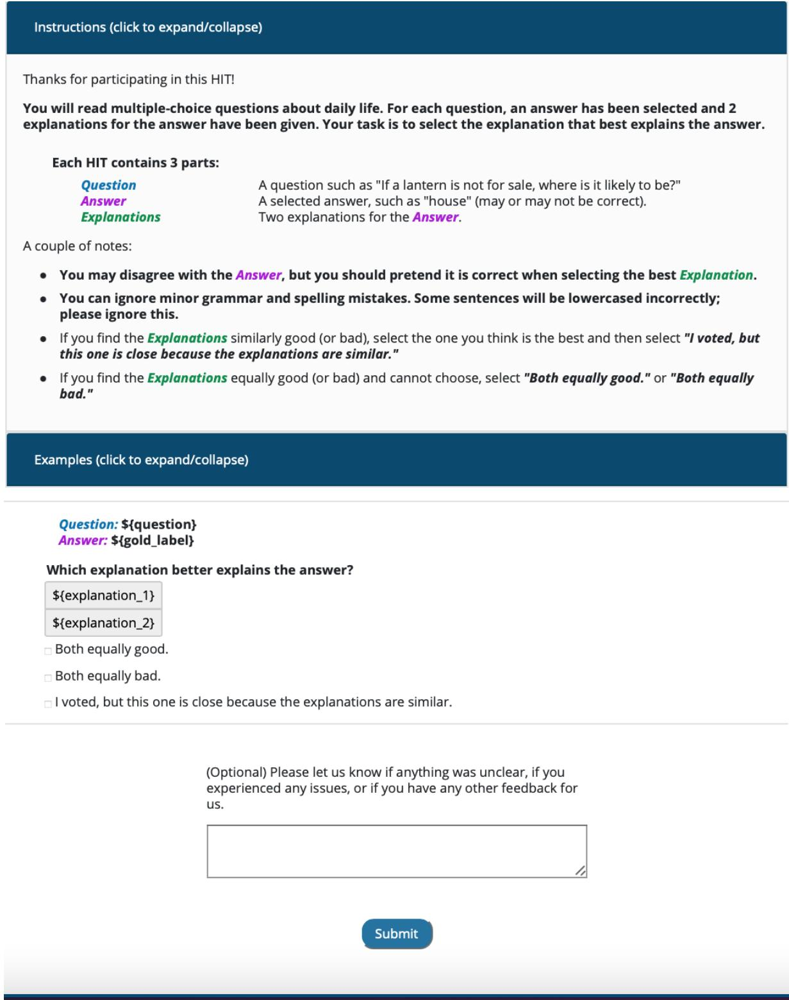  
Figure 5: An overview of the user interface of our head-to-head comparison AMT studies for CommonsenseQA. The top shows the instructions and the bottom the actual task. The Examples tab is collapsed here; shown in full in Figure 6.

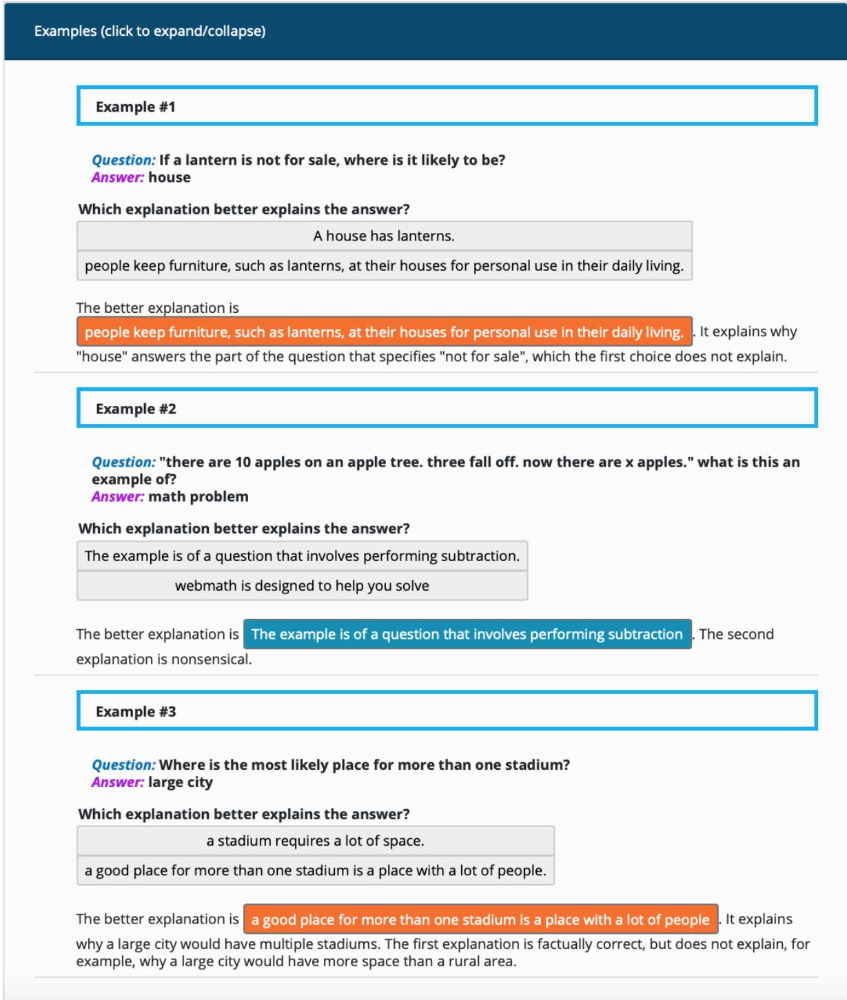  
Figure 6: The Examples tab given in the user interface of our head-to-head comparison AMT studies for CommonsenseQA. The full interface is shown in Figure 5.

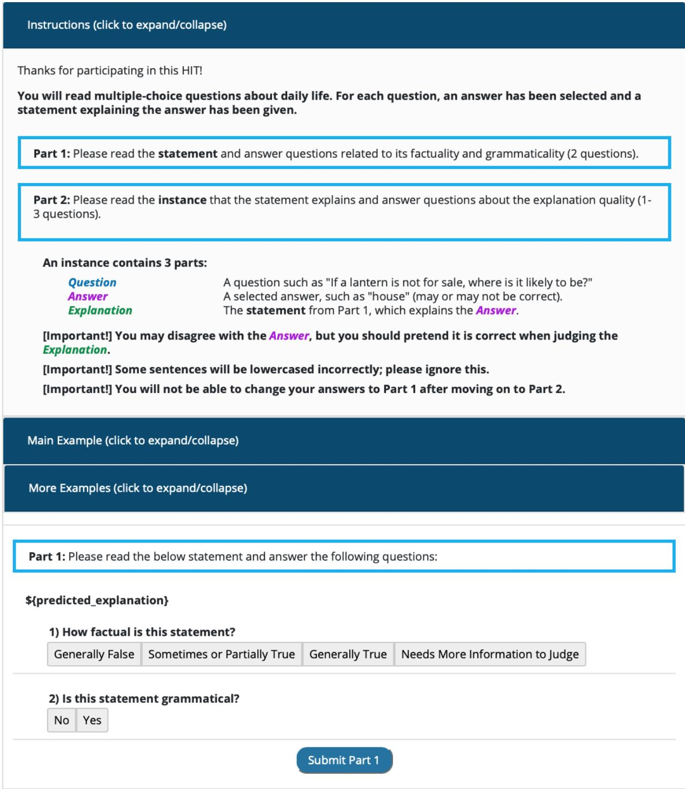  
Figure 7: An overview of the user interface template of our absolute comparison AMT studies for CommonsenseQA. The top shows the instructions and the bottom the actual task. Only part 1 of the task is shown here (part 2 appears once part 1 is submitted). The Main Example and More Examples tabs illustrating both parts 1 and 2 are collapsed here; see Figure 8.

  
Figure 8: The Main Example given in the user interface template of our absolute comparison AMT studies for CommonsenseQA. This format follows the actual task layout. The full interface is shown in Figure 7.

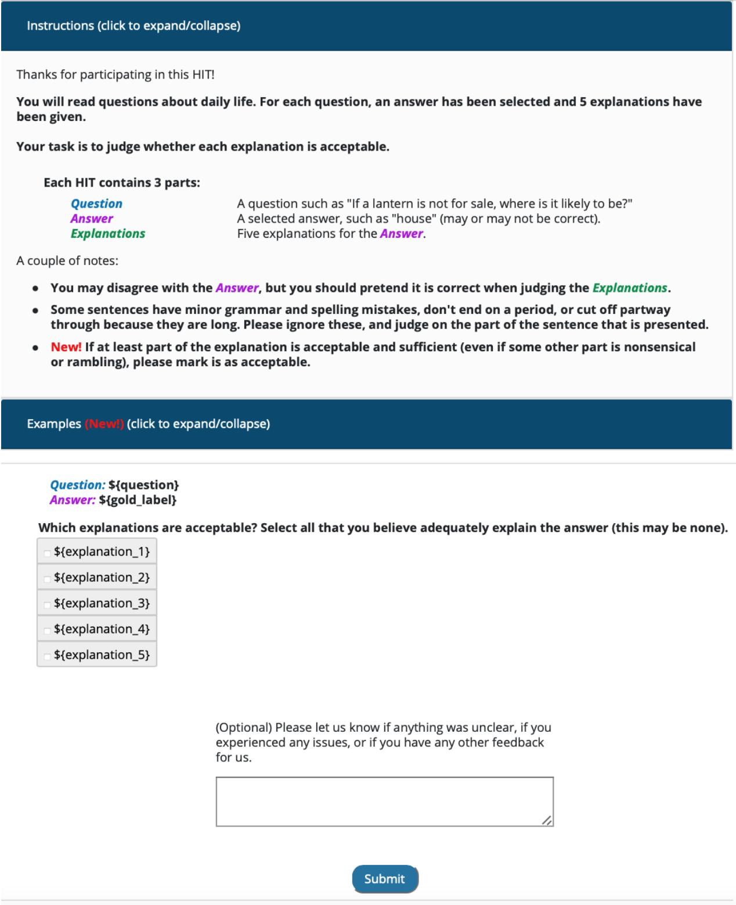  
Figure 9: An overview of the user interface of our explanation acceptability AMT studies for CommonsenseQA. The top shows the instructions and the bottom the actual task. The "examples" tab is collapsed here; shown in full in Figure 10.

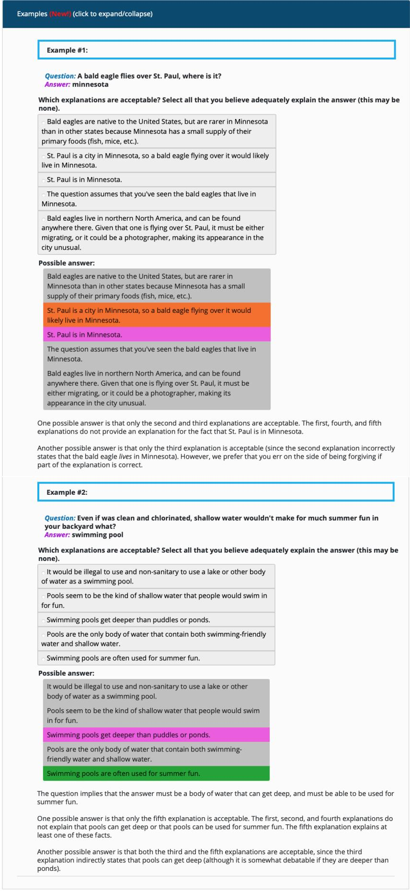  
Figure 10: The examples given in the user interface of our explanation acceptability AMT studies for CommonsenseQA. The full interface is shown in Figure 9.