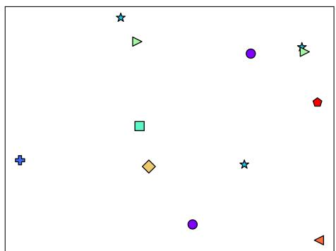
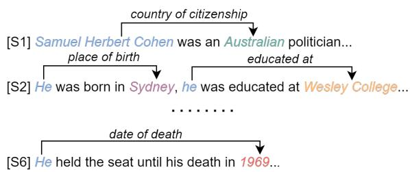
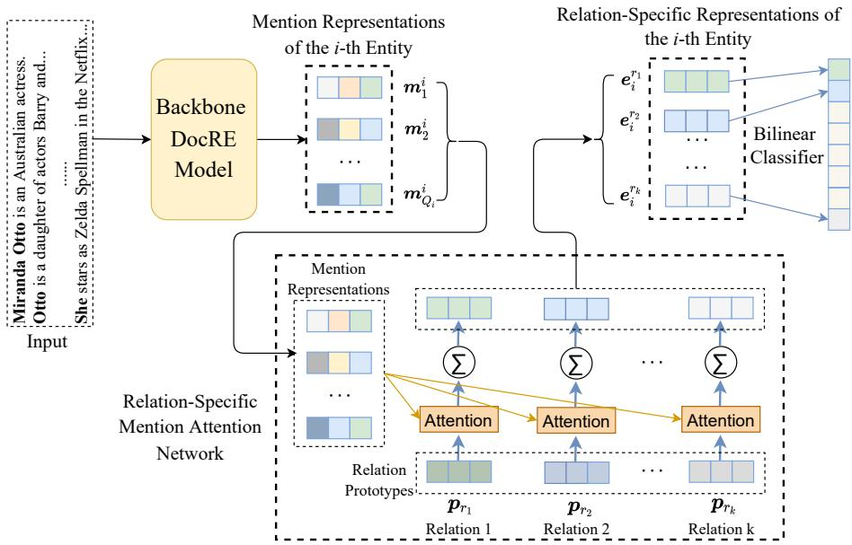
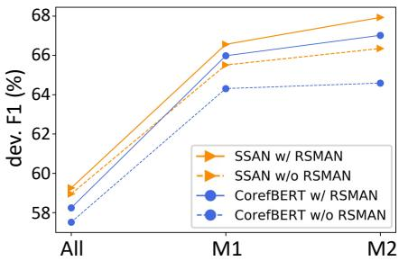
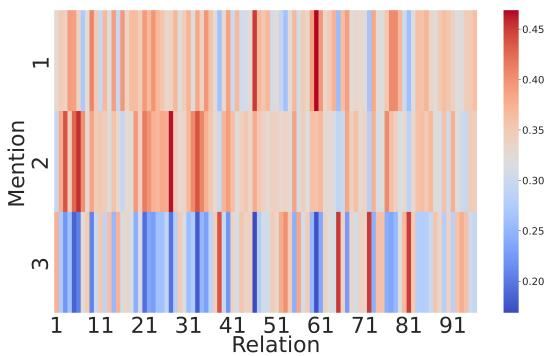

# Relation-Specific Attentions over Entity Mentions for Enhanced Document-Level Relation Extraction

Jiaxin Yu† and Deqing Yang† ∗ and Shuyu Tian‡ School of Data Science, Fudan University, Shanghai 200433, China †{jiaxinyu20,yangdeqing}@fudan.edu.cn ‡sytian21@m.fudan.edu.cn

## Abstract

Compared with traditional sentence-level relation extraction, document-level relation extraction is a more challenging task where an entity in a document may be mentioned multiple times and associated with multiple relations. However, most methods of documentlevel relation extraction do not distinguish between mention-level features and entity-level features, and just apply simple pooling operation for aggregating mention-level features into entity-level features. As a result, the distinct semantics between the different mentions of an entity are overlooked. To address this problem, we propose RSMAN in this paper which performs selective attentions over different entity mentions with respect to candidate relations. In this manner, the flexible and relation-specific representations of entities are obtained which indeed benefit relation classification. Our extensive experiments upon two benchmark datasets show that our RSMAN can bring significant improvements for some backbone models to achieve state-of-the-art performance, especially when an entity have multiple mentions in the document.1

## 1 Introduction

Relation extraction (RE) is one important task of information extraction, aiming to detect the relations among entities in plain texts. Recently, many scholars have paid more attention to document-level RE (Sahu et al., 2019; Yao et al., 2019) which aims to identify the relations of all entity pairs in a document, since it is more in demand than sentencelevel RE in various real scenarios. In general, one document contains multiple entities and an entity may have multiple mentions across different sentences. Furthermore, one entity may be involved by multiple valid relations and different relations are expressed by different mentions of the same entity. As a result, document-level RE is more challenging than sentence-level RE.

  
Figure 1: A t-SNE visualization example from DocRED. Points of the same color and marker are different mentions’ embeddings of an entity, which are encoded by BERT (Devlin et al., 2019).

A key step of existing document-level RE methods is to aggregate the information of different mentions of an entity (mention-level features) to obtain the entity’s representation (entity-level feature) at first, since relation classification is generally achieved on entity level. To this end, previous RE models simply apply average pooling (Ye et al., 2020; Xu et al., 2021), max pooling (Li et al., 2021), or logsumexp pooling (Zhou et al., 2021; Zhang et al., 2021). Finally, a fixed representation is obtained for the given entity, which is then fed into the classifier for relation classification.

However, different mentions of an entity in a document may hold distinct semantics. A simple pooling operation of generating a fixed entity representation may confound the semantics of different mentions, and thus degrades the performance of relation classification when the entity is involved by multiple valid relations. We call such situation as multi-mention problem in this paper. In Fig. 1, we display the t-SNE (Van der Maaten and Hinton, 2008) visualization of a toy example’s mention embedding space to validate this problem. As the figure shows, different mentions’ embeddings of an entity (marked by the same color) in a document are scattered over the whole embedding space, indicating that different mentions of an entity are not semantically adjacent. We further illustrate it by the toy example in Fig. 2, the first mention Samuel Herbert Cohen of the person entity is more important for the classifier to identify the relation country ofcitizenship between him and Australian. But for extracting the relation place of birth, the second mention He should be considered more. It implies that different mentions should play different roles when extracting the different relations involving the same entity. In other words, different mentions function differently in different relation recognitions.

  
Figure 2: A toy example of multi-mention problem from the DocRED dataset. Based on coreference resolution, mentions belonging to the same entity are in the same color, and the relations are marked above the arrows.

Inspired by this intuition, we propose a novel Relation-Specific Mention Attention Network (RSMAN) to improve the model performance of document-level RE. In RSMAN, each relation’s essential semantics is first encoded into a prototype representation. Then, the relevance weight (attention) between the prototype of a specific candidate relation and each mention’s representation of the given entity is calculated. Based on these attentions, we get an attentive (weighted) sum of all mentions’ representations as the entity’s synthetic representation. In this manner, RSMAN enables the model to attend to the information of multiple mentions from different representation space when representing an entity, indicating that the entity’s representation is flexible and relation-specific with respect to different candidate relations.

Our contributions in this paper can be summarized as follows:

1. To the best of our knowledge, this is the first to consider different mentions’ significance with respect to candidate relations on representing an entity to achieve document-level RE.

2. We propose a novel RSMAN which can be used as a plug-in of a backbone RE model, to learn a relation-specific representation for a given entity which enhances the model’s performance further.

3. Our empirical results show that RSMAN can significantly promote some backbone models to achieve state-of-the-art (SOTA) RE performance, especially when an entity have multiple mentions in the document.

The rest of this paper is organized as follows. In Section 2, we briefly introduce some works related to our work. Then we introduce the proposed method in Section 3 and the experiment results in Section 4. At last, we conclude our work in Section 5.

## 2 Related Work

Prior efforts on document-level RE mainly focused on representation learning and reasoning mechanism. Yao et al. (2019) employed four different sentence-level representation models to achieve document-level RE, including CNN, LSTM, BiL-STM, and Context-Aware. For more powerful representations, later work introduced pre-trained language models into their neural architectures (Ye et al., 2020; Zhou et al., 2021; Xu et al., 2021). In particular, Ye et al. (2020) added a novel mention reference prediction task during pre-training and presented CorefBERT to capture the coreferential relations in contexts. Zhou et al. (2021) proposed ATLOP to learn an adjustable threshold and thus enhanced the entity pair’s representation with localized context pooling. Xu et al. (2021) defined various mention dependencies in a document and proposed SSAN to model entity structure for document-level RE. In addition, other work built various kinds of document graphs to model reasoning mechanism explicitly (Nan et al., 2020; Zeng et al., 2020; Wang et al., 2020). For example, Nan et al. (2020) induced the latent document-level graph and performed multi-hop reasoning on the induced latent structure. Wang et al. (2020) constructed a global heterogeneous graph and used a stacked R-GCN (Schlichtkrull et al., 2018) to encode the document information. Zeng et al. (2020) proposed GAIN to leverage both mention-level graph and entity-level graph to infer relations between entities. However they all ignore the multimention problem described in Sec. 1.

  
Figure 3: The overall work flow of RSMAN. The entity representations are obtained as the relation-specific weighted sum of mention representations.

## 3 Methodology

At first, we formalize the task of document-level RE addressed in this paper as follows.

Suppose a document $\mathcal { D }$ mentions $P$ entities, denoted as $\mathcal { E } = \{ e _ { i } \} _ { i = 1 } ^ { P }$ , and the i-th entity $e _ { i }$ has $Q _ { i }$ mentions in $\mathcal { D } _ { \mathbf { ; } }$ , denoted as $\{ m _ { j } ^ { i } \} _ { j = 1 } ^ { Q _ { i } }$ , the task of document-level RE is to extract a set of relational triples $\{ ( e _ { s } , r , e _ { o } ) | e _ { s } , e _ { o } \in \mathcal { E } , r \in \mathcal { R } \}$ where $\mathcal { R }$ is a pre-defined relation set.

## 3.1 Backbone RE Model

Suppose for each mention of $e _ { i } ,$ its representation $m _ { j } ^ { i }$ is obtained by a model-specific method. Most of existing backbone models apply a certain pooling operation for all $m _ { j } ^ { i } \mathrm { s }$ to obtain $e _ { i } { \ ' } { \bf s }$ s representation $e _ { i }$ , such as the following average pooling,

$$
e _ { i } = \frac { 1 } { Q _ { i } } \sum _ { j = 1 } ^ { Q _ { i } } m _ { j } ^ { i } .\tag{1}
$$

As we claimed in Section 1, $e _ { i }$ is a fixed representation which ignores that different mentions of $e _ { i }$ play distinct roles when identifying the different relations involving $e _ { i }$

Finally, given the subject entity’s $e _ { s }$ and the object entity’s representation $e _ { o } .$ a bilinear classifier is often used to calculate the probability of relation r involving these two entities as follows

$$
P ( r | e _ { s } , e _ { o } ) = \sigma ( e _ { s } ^ { \top } W _ { r } e _ { o } + b _ { r } )\tag{2}
$$

where $W _ { r } \in \mathbb { R } ^ { d \times d }$ and $b _ { r } \in \mathbb { R }$ are trainable model parameters specific to r, and $\sigma$ is Sigmoid activation.

## 3.2 Attentive Operations in RSMAN

Our proposed RSMAN incorporates attentive mention-level features to generate flexible entity representations with respect to different candidate relations, and thus enhances the backbone model’s performance. RSMAN’s framework is shown in Fig. 3, which acts as a plug-in of the backbone model.

For each candidate relation $^ { r , }$ , its prototype representation ${ \pmb p } _ { r }$ is first obtained through random initialization and is trainable during the training process. Then, we leverage ${ \pmb p } _ { r }$ to calculate the semantic relevance between r and each mention $m _ { j } ^ { i }$ as follows,

$$
s _ { i j } ^ { r } = g ( \pmb { p } _ { r } , \pmb { m } _ { j } ^ { i } )\tag{3}
$$

where $g$ is a certain function to compute the similarity between two embeddings, which can be a simple dot-product or multi-layer perceptron (MLP) fed with the concatenation of two embeddings. Then, we feed all $s _ { i j } ^ { r } \mathrm { s }$ of $e _ { i }$ into a softmax function to get final attention weight

$$
\alpha _ { i j } ^ { r } = \frac { \exp ( s _ { i j } ^ { r } ) } { \sum _ { k = 1 } ^ { Q _ { i } } \exp ( s _ { i k } ^ { r } ) } .\tag{4}
$$

Since there is a necessity to consider all the mention information of the entity, we use a weighted sum of all mention representations to obtain the relation-specific entity representation instead of using only one specific mention representation. We get $e _ { i } \mathrm { { } s }$ representation specific to r as

$$
e _ { i } ^ { r } = \sum _ { j = 1 } ^ { Q _ { i } } \alpha _ { i j } ^ { r } { m } _ { j } ^ { i } .\tag{5}
$$

Different to the fixed representation computed by Eq. 1, such $e _ { i } ^ { r }$ is a flexible embedding adaptive to different candidate relation r.

At last, we use this relation-specific entity representation to achieve relation classification by modifying Eq. 2 as

$$
P ( r | e _ { s } , e _ { o } ) = \sigma ( e _ { s } ^ { r } W _ { r } e _ { o } ^ { r } + b _ { r } ) .\tag{6}
$$

## 4 Experiments

In this section, we introduce our experiments to justify our RSMAN, and provide insight into the experiment results.

## 4.1 Datasets and Evaluation Metrics

We conducted our experiments on two representative document-level RE datasets: DocRED (Yao et al., 2019) and DWIE (Zaporojets et al., 2021), which are introduced in detail in Appendix A. We adopted F1 and Ign F1 as our evaluation metrics as (Yao et al., 2019), where Ign F1 is computed by excluding the common relation facts shared by the training, development (dev.) and test sets.

## 4.2 Experimental Settings

We use dot-product as the similarity scoring function for its computational efficiency, and before it we add a fully connected layer to project the mention representations into the same embedding space with the prototype representations. All the additional parameters we introduce for RSMAN including the prototype representations is much fewer than the parameters of either the original bilinear classifier or the backbone model itself.

We took some stat-of-the-art models mentioned in Sec. 2 as the baselines, i.e., CNN (Zeng et al., 2014), LSTM/BiLSTM (Cai et al., 2016), Context-Aware (Sorokin and Gurevych, 2017), CorefBERT (Ye et al., 2020), GAIN (Zeng et al., 2020), SSAN (Xu et al., 2021) and ATLOP (Zhou et al., 2021). We chose CorefBERT and SSAN as the backbone models in our framework due to their good performance and strong pluggability for our RSMAN. We did not consider GAIN and ATLOP as the backbone because they both leverage extra information besides entity representations. More setting details are shown in Appendix B.

<table><tr><td>Model</td><td>Dev Ign F1 / F1</td><td>Test Ign F1 / F1</td></tr><tr><td>CNN*</td><td>37.65 / 47.73</td><td>34.65 / 46.14</td></tr><tr><td>LSTM*</td><td>40.86 /51.77</td><td>40.81 / 52.60</td></tr><tr><td>BiLSTM*</td><td>40.46 / 51.92</td><td>42.03 / 54.47</td></tr><tr><td>Context-Aware*</td><td>42.06 / 53.05</td><td>45.37 / 56.58</td></tr><tr><td>CorefBERT</td><td>57.18 / 61.42</td><td>61.71 / 66.59</td></tr><tr><td>GAIN*</td><td>58.63 / 62.55</td><td>62.37 / 67.57</td></tr><tr><td>SSAN</td><td>58.62 / 64.49</td><td>62.58 / 69.39</td></tr><tr><td>ATLOP*</td><td>59.03 / 64.82</td><td>62.09 / 69.94</td></tr><tr><td>CorefBERT+RSMAN</td><td>58.29 / 62.59</td><td></td></tr><tr><td></td><td></td><td>62.01 / 67.52</td></tr><tr><td>SSAN+RSMAN</td><td>60.02 / 65.88</td><td>63.42 / 70.95</td></tr></table>

Table 1: Performance (%) comparisons on the dev. and test set of DWIE. The results with \* are reported in (Ru et al., 2021).

<table><tr><td>Model</td><td>Dev Ign F1 / F1</td><td>Test Ign F1 / F1</td></tr><tr><td>CorefBERT</td><td>55.32 / 57.51</td><td>54.54 / 56.96</td></tr><tr><td>CorefBERT+RSMAN</td><td>56.26 / 58.24</td><td>55.30 / 57.53</td></tr><tr><td>SSAN</td><td>56.68 / 58.95</td><td>56.06 / 58.41</td></tr><tr><td>SSAN+RSMAN</td><td>57.22 / 59.25</td><td>57.02 / 59.29</td></tr></table>

Table 2: Comparison on DocRED. The results of baselines are from their related papers. All test results are obtained by submitting to official Codalab2.

## 4.3 Results and Analyses

All the following results of our method were reported as the average scores of three runs. From the results on DWIE shown in Table 1 we find that plugged with RSMAN, both CorefBERT and SSAN have significant improvements. Specifically, our RSMAN relatively improves CorefBERT’s F1 by 1.9% (dev. set) and 1.4% (test set), and relatively improves SSAN’s F1 by 1.84% dev F1 (dev. set) and 2.25% (test set), respectively. The consistent improvements verify the effectiveness of leveraging attentive mention-level features to learn relation-specific entity representations. What’s more, the positive effects on different backbone models show good generalization performance of our RSMAN. Overall, SSAN+RSMAN achieves 63.42% Ign F1 and 70.95% F1 on the test set, outperforming all the baselines apparently.

For simplicity, we only display the results on DocRED of CorefBERT and SSAN plugged with

  
Figure 4: F1 variations on three subsets reconstructed from the development set of DocRED.

  
Figure 5: Visualization on relation attentions to different mentions of a given entity.

RSMAN in Table 2. It shows that RSMAN also brings relative improvements of 1.39% Ign F1 and 1.00% F1 on the test set for CorefBERT, along with relative improvements of 1.71% Ign F1 and 1.51% F1 for SSAN. It is worth noting that the performance improvements on DocRED are relatively less significant than that on DWIE. Through our statistics, we found that the average number of mentions per entity in DocRED is only 1.34, while it is 1.98 in DWIE. Besides, only 18.49% of entities in DocRED have multiple mentions, much less than 33.59% in DWIE. It implies that our RSMAN is more effective on the entities with multiple mentions, which are more common and challenging in many real scenarios of document-level RE.

## 4.4 Effect Analysis for Mention Number

To confirm our conjecture mentioned before, we investigated the effect of mention number through further experiments. We first reconstructed the relation instances in DocRED’s dev. set and obtained three different subsets: the first one contains all instances (All), another one contains either subject or object argument having more than one mention (M1), and the rest one contains either subject or object argument having more than two mentions (M2). We don’t consider M3 or higher because they have very few instances limited by the dataset. Then, we evaluated CorefBERT and SSAN with or without RSMAN upon the three subsets.

From Fig. 4, we find that the F1s of all compared methods increase from All to M2. It indicates that multiple mentions can provide more information for the models to capture the entity semantics, resulting in more precise RE results. Furthermore, the performance gains of plugging RSMAN into the two backbone models also increase as the mention number per entity increases. It shows that our RSMAN can bring more significant performance boosts for the backbone model when the entities of the relation instances have more mentions in a document. These results justify that RSMAN has more potential for extracting relations based on the entities with more mentions.

## 4.5 Case Study

To explore how RSMAN attends to different mentions’ information of an entity, we collected all relations’ normalized attentions for an entity’s mentions in RSMAN. Fig. 5 is the heatmap of attentions for a specific entity, from which we observe that the distribution of relation attentions varies greatly among different mentions. Besides, according to the high attention of a given relation, we can capture which mention of the entity well expresses this relation’s semantics. This map also confirms the implication of Fig. 1 that different mentions of an entity contain distinct semantics. Therefore, the attentive aggregation of all mention-level features in RSMAN is more appropriate for enhanced RE than the common pooling operations.

## 5 Conclusion

In this paper, we focus on the multi-mention problem in document-level RE and propose RSMAN to address it. Our experiment results demonstrate RSMAN’s effectiveness especially on the scenario of multi-mention situation. In the future, we plan to adapt RSMAN to more document-level RE models.

## Acknowledgements

This paper was supported by Shanghai Science and Technology Innovation Action Plan No.21511100401, and AECC Sichuan Gas Turbine Establishment (No.GJCZ-2019-0070), Mianyang Sichuan, China. We sincerely thank all reviewers for their valuable comments to improve our work.

## References

Rui Cai, Xiaodong Zhang, and Houfeng Wang. 2016. Bidirectional recurrent convolutional neural network for relation classification. In Proceedings ofthe 54th Annual Meeting ofthe Associationfor Computational Linguistics (Volume 1: Long Papers), pages 756– 765, Berlin, Germany. Association for Computational Linguistics.

Jacob Devlin, Ming-Wei Chang, Kenton Lee, and Kristina Toutanova. 2019. BERT: Pre-training of deep bidirectional transformers for language understanding. In Proceedings ofthe 2019 Conference of the North American Chapter ofthe Associationfor Computational Linguistics: Human Language Technologies, Volume 1 (Long and Short Papers), pages 4171–4186, Minneapolis, Minnesota. Association for Computational Linguistics.

Jingye Li, Kang Xu, Fei Li, Hao Fei, Yafeng Ren, and Donghong Ji. 2021. MRN: A locally and globally mention-based reasoning network for document-level relation extraction. In Findings of the Association for Computational Linguistics: ACL-IJCNLP 2021, pages 1359–1370, Online. Association for Computational Linguistics.

Ilya Loshchilov and Frank Hutter. 2018. Decoupled weight decay regularization. In International Conference on Learning Representations.

Guoshun Nan, Zhijiang Guo, Ivan Sekulic, and Wei Lu. 2020. Reasoning with latent structure refinement for document-level relation extraction. In Proceedings of the 58th Annual Meeting of the Association for Computational Linguistics, pages 1546–1557, Online. Association for Computational Linguistics.

Dongyu Ru, Changzhi Sun, Jiangtao Feng, Lin Qiu, Hao Zhou, Weinan Zhang, Yong Yu, and Lei Li. 2021. Learning logic rules for document-level relation extraction. In Proceedings of the 2021 Conference on Empirical Methods in Natural Language Processing, pages 1239–1250, Online and Punta Cana, Dominican Republic. Association for Computational Linguistics.

Sunil Kumar Sahu, Fenia Christopoulou, Makoto Miwa, and Sophia Ananiadou. 2019. Inter-sentence relation extraction with document-level graph convolutional neural network. In Proceedings ofthe 57th Annual Meeting of the Association for Computational Linguistics, pages 4309–4316, Florence, Italy. Association for Computational Linguistics.

Michael Schlichtkrull, Thomas N Kipf, Peter Bloem, Rianne van den Berg, Ivan Titov, and Max Welling. 2018. Modeling relational data with graph convolutional networks. In European semantic web conference, pages 593–607. Springer.

Daniil Sorokin and Iryna Gurevych. 2017. Contextaware representations for knowledge base relation extraction. In Proceedings ofthe 2017 Conference on Empirical Methods in Natural Language Processing,

pages 1784–1789, Copenhagen, Denmark. Association for Computational Linguistics.

Laurens Van der Maaten and Geoffrey Hinton. 2008. Visualizing data using t-sne. Journal of machine learning research, 9(11).

Difeng Wang, Wei Hu, Ermei Cao, and Weijian Sun. 2020. Global-to-local neural networks for documentlevel relation extraction. In Proceedings of the 2020 Conference on Empirical Methods in Natural Language Processing (EMNLP), pages 3711–3721, Online. Association for Computational Linguistics.

Thomas Wolf, Lysandre Debut, Victor Sanh, Julien Chaumond, Clement Delangue, Anthony Moi, Pierric Cistac, Tim Rault, Rémi Louf, Morgan Funtowicz, et al. 2019. Huggingface’s transformers: State-ofthe-art natural language processing. arXiv preprint arXiv:1910.03771.

Benfeng Xu, Quan Wang, Yajuan Lyu, Yong Zhu, and Zhendong Mao. 2021. Entity structure within and throughout: Modeling mention dependencies for document-level relation extraction. In Proceedings of the AAAI Conference on Artificial Intelligence, volume 35, pages 14149–14157.

Yuan Yao, Deming Ye, Peng Li, Xu Han, Yankai Lin, Zhenghao Liu, Zhiyuan Liu, Lixin Huang, Jie Zhou, and Maosong Sun. 2019. DocRED: A large-scale document-level relation extraction dataset. In Proceedings of the 57th Annual Meeting of the Associationfor Computational Linguistics, pages 764–777, Florence, Italy. Association for Computational Linguistics.

Deming Ye, Yankai Lin, Jiaju Du, Zhenghao Liu, Peng Li, Maosong Sun, and Zhiyuan Liu. 2020. Coreferential Reasoning Learning for Language Representation. In Proceedings of the 2020 Conference on Empirical Methods in Natural Language Processing (EMNLP), pages 7170–7186, Online. Association for Computational Linguistics.

Klim Zaporojets, Johannes Deleu, Chris Develder, and Thomas Demeester. 2021. Dwie: An entity-centric dataset for multi-task document-level information extraction. Information Processing & Management, 58(4):102563.

Daojian Zeng, Kang Liu, Siwei Lai, Guangyou Zhou, and Jun Zhao. 2014. Relation classification via convolutional deep neural network. In Proceedings of COLING 2014, the 25th International Conference on Computational Linguistics: Technical Papers, pages 2335–2344.

Shuang Zeng, Runxin Xu, Baobao Chang, and Lei Li. 2020. Double graph based reasoning for documentlevel relation extraction. In Proceedings of the 2020 Conference on Empirical Methods in Natural Language Processing (EMNLP), pages 1630–1640, Online. Association for Computational Linguistics.

Ningyu Zhang, Xiang Chen, Xin Xie, Shumin Deng, Chuanqi Tan, Mosha Chen, Fei Huang, Luo Si, and Huajun Chen. 2021. Document-level relation extraction as semantic segmentation. arXiv preprint arXiv:2106.03618.

Wenxuan Zhou, Kevin Huang, Tengyu Ma, and Jing Huang. 2021. Document-level relation extraction with adaptive thresholding and localized context pooling.

## A Datasets

DocRED is a large-scale human-annotated dataset for document-level RE. DWIE is a dataset for document-level multi-task information extraction which combines four main sub-tasks and in our work we only used the dataset for document-level relation extraction. We preprocessed DWIE dataset and adopted the same dataset partition as (Ru et al., 2021). More statistical information is detailed in Table 3.

<table><tr><td>Statistics</td><td>DWIE</td><td>DocRED</td></tr><tr><td># Train</td><td>602</td><td>3053</td></tr><tr><td># Dev</td><td>98</td><td>1000</td></tr><tr><td># Test</td><td>99</td><td>1000</td></tr><tr><td># Relations</td><td>65</td><td>96</td></tr><tr><td># Relation facts</td><td>19493</td><td>56354</td></tr><tr><td>Avg.# mentions per Ent.</td><td>1.98</td><td>1.34</td></tr></table>

Table 3: Statistics of the two datasets.

<table><tr><td>Hyper-parameter</td><td>DWIE</td><td>DocRED</td></tr><tr><td>Batch size</td><td>4</td><td>8</td></tr><tr><td>Learning rate</td><td>3e-5</td><td>5e-5</td></tr><tr><td>Epoch</td><td>40</td><td>60</td></tr><tr><td>Gradient clipping</td><td>1</td><td>1</td></tr><tr><td>Warmup ratio</td><td>0.1</td><td>0.1</td></tr></table>

Table 4: Hyper-parameter settings for our experiments on the two datasets.

## B Implementation Details

In this appendix, we introduce more details of our experimental settings. We implemented our RS-MAN with PyTorch and trained it with an NVIDIA GeForce RTX 3090 GPU. In addition, we adopted AdamW (Loshchilov and Hutter, 2018) as our optimizer and used learning rate linear schedule with warming up based on Huggingface’s Transformers (Wolf et al., 2019). The hyper-parameter settings of our experiments on the two datasets are listed in Table 4, which were decided through our tuning studies.