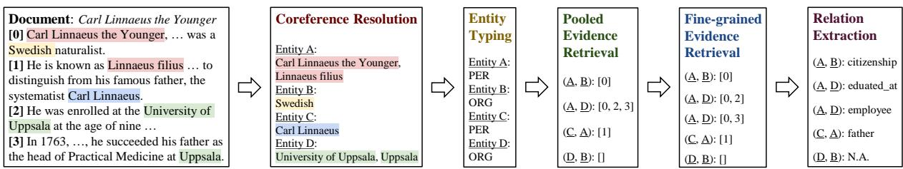
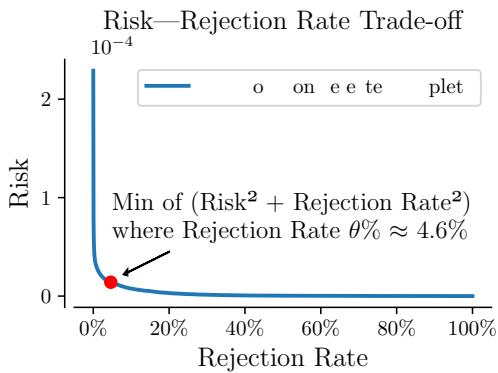
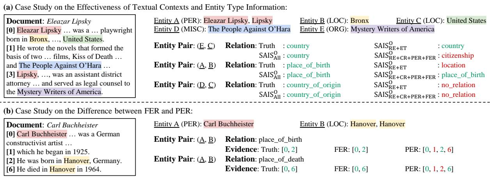
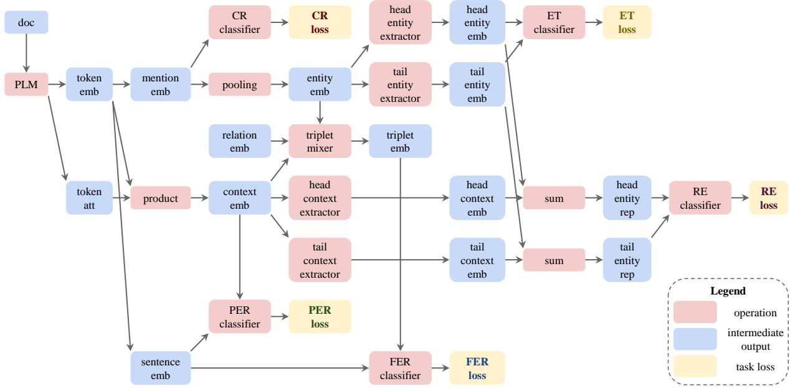

# SAIS: Supervising and Augmenting Intermediate Steps for Document-Level Relation Extraction

Yuxin Xiao1, Zecheng Zhang2, Yuning Mao3, Carl Yang4, Jiawei Han3

1Carnegie Mellon University, 2Stanford University,

3University of Illinois at Urbana-Champaign, 4Emory University

1yuxinxia@cs.cmu.edu 2zecheng@cs.stanford.edu

3{yuningm2,hanj}@illinois.edu 4j.carlyang@emory.edu

## Abstract

Stepping from sentence-level to documentlevel, the research on relation extraction (RE) confronts increasing text length and more complicated entity interactions. Consequently, it is more challenging to encode the key information sources—relevant contexts and entity types. However, existing methods only implicitly learn to model these critical information sources while being trained for RE. As a result, they suffer the problems of ineffective supervision and uninterpretable model predictions. In contrast, we propose to explicitly teach the model to capture relevant contexts and entity types by Supervising and Augmenting Intermediate Steps (SAIS) for RE. Based on a broad spectrum of carefully designed tasks, our proposed SAIS method not only extracts relations of better quality due to more effective supervision, but also retrieves the corresponding supporting evidence more accurately so as to enhance interpretability. By assessing model uncertainty, SAIS further boosts the performance via evidence-based data augmentation and ensemble inference while reducing the computational cost. Eventually, SAIS delivers state-of-the-art RE results on three benchmarks (DocRED, CDR, and GDA) and outperforms the runner-up by 5.04% relatively in F1 score in evidence retrieval on DocRED.1

## 1 Introduction

Playing a crucial role in the continuing effort of transforming unstructured text into structured knowledge, RE (Bach and Badaskar, 2007) seeks to identify relations between an entity pair based on a given piece of text. Earlier studies mostly pay attention to sentence-level RE (Zhang et al., 2017; Hendrickx et al., 2019) (i.e., the targeting entity pair co-occur within a sentence) and achieve promising results (Zhang et al., 2019; Zhou et al., 2020). Based on an extensive empirical analysis,

Peng et al. (2020) reveals that textual contexts and entity types are the major information sources that lead to the success of prior approaches.

Given that more complicated relations are often expressed by multiple sentences, recent focus of RE has been largely shifted to the document level (Yao et al., 2019; Cheng et al., 2021). Existing document-level RE methods (Zeng et al., 2020; Zhou et al., 2021) utilize advanced neural architectures such as heterogeneous graph neural networks (Yang et al., 2020) and pre-trained language models (Xu et al., 2021b). However, although documents typically include longer contexts and more intricate entity interactions, most prior methods only implicitly learn to encode contexts and entity types while being trained for RE. As a result, they deliver inferior and uninterpretable results.

On the other hand, it has been a trend that many recent datasets support the training of more powerful language models by providing multi-task annotations such as coreference and evidence (Yao et al., 2019; Li et al., 2016; Wu et al., 2019). Therefore, in contrast to existing methods, we advocate for explicitly guiding the model to capture textual contexts and entity type information by Supervising and Augmenting Intermediate Steps (SAIS) for RE. More specifically, we argue that, from the input document with annotated entity mentions to the ultimate output of RE, there are four intermediate steps involved in the reasoning process. Consider the motivating example in Figure 1:

(1) Coreference Resolution (CR): Although Sentence 0 describes the “citizenship" of “Carl Linnaeus the Younger" and Sentence 1 discusses the “father" of “Linnaeus filius", the two names essentially refer to the same person. Hence, given a document, we need to first resolve various contextual roles represented by different mentions of the same entity via CR.

(2) Entity Typing (ET): After gathering contextual information from entity mentions, ET regularizes entity representations with the corresponding type information (e.g., Entity A, “Linnaeusfilius", is of type “PER" (person)). Within an entity pair, the type information of the head and tail entities can be used to filter out impossible relations, as the relation “year\_of\_birth" can never appear between two entities of type “PER", for instance.

  
Figure 1: Motivating example adapted from DocRED. From the input document with annotated entity mentions to the RE output, there are four intermediate steps involved in the reasoning process. These steps are complementary to RE, in the sense that CR, PER, and FER capture textual contexts while ET preserves entity type information.

(3) Pooled and (4) Fine-grained Evidence Retrieval (PER and FER): A unique task for locating the relevant contexts within a document for an entity pair with any valid relation is to retrieve the evidence sentences supporting the relation. Nonetheless, some entity pairs may not express valid relations within the given document (e.g., Entities D and B in the example). Meanwhile some entity pairs possess multiple relations (e.g., Entity A is both “educated\_at" and an “employee" of Entity D), each with a different evidence set. Therefore, we use PER to distinguish entity pairs with and without valid supporting sentences and FER to output more interpretable evidence unique to each valid relation of an entity pair.

In this way, the four intermediate steps are complementary to RE, in the sense that CR, PER, and FER capture textual contexts while ET preserves entity type information. Consequently, by explicitly supervising the model’s outputs in these intermediate steps via carefully designed tasks, we extract relations of improved quality.

In addition, based on the predicted evidence, we filtrate relevant contexts by augmenting specific intermediate steps with pseudo documents or attention masks. By assessing model confidence, we apply these two kinds of evidence-based data augmentation together with ensemble inference, only when the model is uncertain about its original predictions. Eventually, we further boost the performance with negligible computational cost.

Altogether, our SAIS method achieves state-ofthe-art RE performance on three benchmarks (DocRED (Yao et al., 2019), CDR (Li et al., 2016), and GDA (Wu et al., 2019)) due to more effective supervision and enhances interpretability by improving the evidence retrieval (ER) F1 score on DocRED by 5.04% relatively compared to the runner-up.

## 2 Background

## 2.1 Problem Formulation

Consider a document d containing sentences $ { \boldsymbol { S } } _ { d }$ $\{ s _ { i } \} _ { i = 1 } ^ { | S _ { d } | }$ and entities $\mathcal { E } _ { d } = \{ e _ { i } \} _ { i = 1 } ^ { | \mathcal { E } _ { d } | }$ where each entity e is assigned an entity type $c \in { \mathcal { C } }$ and appears at least once in d by its mentions $\mathcal { M } _ { e } ~ =$ $\{ m _ { i } \} _ { i = 1 } ^ { | { \mathcal M } _ { e } | }$ . For a pair of head and tail entities $( e _ { h } , e _ { t } )$ , document-level RE aims to predict if any relation $r \in \mathcal { R }$ exists between them, based on whether r is expressed by some pair of $\boldsymbol { e } _ { h } \boldsymbol { \mathbf { \dot { s } } }$ and $\boldsymbol { e _ { t } } ^ { \prime } \mathbf { s }$ mentions in d. Here,  and  are pre-defined sets of entity and relation types, respectively. Moreover, for $( e _ { h } , e _ { t } )$ and each of their valid relations $r \in \mathcal { R } _ { h , t } ,$ ER aims to identify the subset $\mathcal { V } _ { h , t , r }$ of $ { \boldsymbol { S } } _ { d }$ that is sufficient to express the triplet $( e _ { h } , e _ { t } , r )$

## 2.2 Related Work

Early research efforts on RE (Bach and Badaskar, 2007; Pawar et al., 2017) center around predicting relations for entity pairs at the sentence level (Zhang et al., 2017; Hendrickx et al., 2019). Many pattern-based (Califf and Mooney, 1999; Qu et al., 2018; Zhou et al., 2020) and neural network-based (Cai et al., 2016; Feng et al., 2018; Zhang et al., 2019) models have shown impressive results. A recent study (Peng et al., 2020) attributes the success of these models to their ability to capture textual contexts and entity type information.

Nevertheless, since more complicated relations can only be expressed by multiple sentences, there has been a shift of focus lately towards documentlevel RE (Yao et al., 2019; Li et al., 2016; Cheng et al., 2021; Wu et al., 2019). According to how an approach models contexts, there are two general trends within the domain. Graph-based approaches (Nan et al., 2020; Wang et al., 2020; Zeng et al., 2020; Li et al., 2020; Zeng et al., 2021; Xu et al., 2021c,d; Sahu et al., 2019; Guo et al., 2019) typically infuse contexts into heuristic-based document graphs and perform multi-hop reasoning via advanced neural techniques. Transformer-based approaches (Wang et al., 2019; Tang et al., 2020; Huang et al., 2020; Xu et al., 2021a; Zhou et al., 2021; Zhang et al., 2021; Xie et al., 2022; Ye et al., 2020) leverage the strength of pre-trained language models (Devlin et al., 2019; Liu et al., 2019) to encode long-range contextual dependencies. However, most prior methods only implicitly learn to capture contexts while being trained for RE. Consequently, they experience ineffective supervision and uninterpretable model predictions.

On the contrary, we propose to explicitly teach the model to capture textual contexts and entity type information via a broad spectrum of carefully designed tasks. Furthermore, we boost the RE performance by ensembling the results of evidenceaugmented inputs. Compared to EIDER (Xie et al., 2022), we leverage the more precise and interpretable FER for retrieving evidence and present two different kinds of evidence-based data augmentation. We also save the computational cost by applying ensemble learning only to the uncertain subset of relation triplets. As a result, our SAIS method not only enhances the RE performance due to more effective supervision, but also retrieves more accurate evidence for better interpretability.

## 3 Supervising Intermediate Steps

This section describes the tasks that explicitly supervise the model’s outputs in the four intermediate steps. Together they complement the quality of RE.

## 3.1 Document Encoding

Given the promising performance of pre-trained language models (PLM) in various downstream tasks, we resort to PLM for encoding the document. More specifically, for a document $d ,$ we insert a classifier token “[CLS]” and a separator token “[SEP]” at the start and end of each sentence $s \in  { S _ { d } }$ , respectively. Each mention $m \in \mathcal { M } _ { d }$ is wrapped with a pair of entity markers “\*” (Zhang et al., 2017) to indicate the position of entity mentions. Then we feed the document, with alternating segment token indices for each sentence (Liu and Lapata, 2019), into a PLM:

$$
\mathbf { H } , \mathbf { A } = \operatorname { P L M } ( d ) ,\tag{1}
$$

to obtain the token embeddings H $\in \mathbb { R } ^ { N _ { d } \times H }$ and the cross-token attention $\mathbf { A } \in \mathbb { R } ^ { N _ { d } \times N _ { d } }$ . A is the average of the attention heads in the last transformer layer (Vaswani et al., 2017) of the PLM. $N _ { d }$ is the number of tokens in $d ,$ and H is the embedding dimension of the PLM. We take the embedding of “\*" or “[CLS]" before each mention or sentence as the corresponding mention or sentence embedding, respectively.

## 3.2 Coreference Resolution (CR)

As a case study, it is reported by Yao et al. (2019) that around 17.6% of relation instances in DocRED require coreference reasoning. Hence, after encoding the document, we resolve the repeated contextual mentions to an entity via CR. In particular, consider a pair of mentions $( m _ { i } , m _ { j } )$ , we determine the probability of whether $m _ { i }$ and $m _ { j }$ refer to the same entity by passing their corresponding embeddings mi and $\mathbf { m } _ { j }$ through a group bilinear layer (Zheng et al., 2019). The layer splits the embeddings into $K$ equal-sized groups $( [ \mathbf { m } _ { i } ^ { 1 } , \dots , \mathbf { m } _ { i } ^ { K } ] = \mathbf { m } _ { i }$ , similar for $\mathbf { m } _ { i } )$ and applies bilinear with parameter $\mathbf { W } _ { m } ^ { k } \in \mathbb { R } ^ { \tilde { H } / K \times H / \tilde { K } }$ within each group:

$$
\mathbb { P } _ { i , j } ^ { \mathrm { C R } } = \sigma \left( \sum _ { k = 1 } ^ { K } \mathbf { m } _ { i } ^ { k ^ { \intercal } } \mathbf { W } _ { m } ^ { k } \mathbf { m } _ { j } ^ { k } + b _ { m } \right) ,\tag{2}
$$

where $b _ { m } \in \mathbb { R }$ and $\sigma$ is the sigmoid function.

Since most mention pairs refer to distinct entities (each entity has only 1.34 mentions on average in DocRED), we adopt the focal loss (Lin et al., 2017) on top of the binary cross-entropy to mitigate this extreme class imbalance:

$$
\begin{array} { r l } & { \ell _ { d } ^ { \mathrm { { C R } } } = - \displaystyle \sum _ { m _ { i } \in \mathcal { M } _ { d } } \sum _ { m _ { j } \in \mathcal { M } _ { d } } ( y _ { i , j } ^ { \mathrm { { C R } } } ( 1 - \mathbb { P } _ { i , j } ^ { \mathrm { { C R } } } ) ) ^ { \mathrm { { C R } } } \log \mathbb { P } _ { i , j } ^ { \mathrm { { C R } } } } \\ & { ~ + ( 1 - y _ { i , j } ^ { \mathrm { { C R } } } ) ( \mathbb { P } _ { i , j } ^ { \mathrm { { C R } } } ) ^ { \gamma ^ { \mathrm { { C R } } } } \log ( 1 - \mathbb { P } _ { i , j } ^ { \mathrm { { C R } } } ) ) w _ { i , j } ^ { \mathrm { { C R } } } , ~ ( 3 ) } \end{array}
$$

where $y _ { i , j } ^ { \mathrm { C R } } = 1$ if $m _ { i }$ and $m _ { j }$ refer to the same entity, and 0 otherwise. Class weight $w _ { i , j } ^ { \mathrm { C R } }$ is inversely proportional to the frequency of $y _ { i , j } ^ { \mathrm { C R } }$ , and $\gamma ^ { \mathrm { C R } }$ is a hyperparameter.

## 3.3 Entity Typing (ET)

In a pair of entities, the type information can be used to filter out impossible relations. Therefore, we regularize entity embeddings via ET. More specifically, we first derive the embedding of an entity e by integrating the embeddings of its mentions $\mathcal { M } _ { e }$ via logsumexp pooling (Jia et al., 2019): $\begin{array} { r } { \mathbf { e } = \log \sum _ { m \in \mathcal { M } _ { e } } \exp ( \mathbf { m } ) } \end{array}$ . Since entity e could appear either at the head or tail in an entity pair, we distinguish between the head entity embedding ${ \bf e } _ { h } ^ { \prime }$ and the tail entity embedding ${ \bf e } _ { t } ^ { \prime }$ via two separate linear layers:

$$
\mathbf { e } _ { h } ^ { \prime } = \mathbf { W } _ { e _ { h } } \mathbf { e } + \mathbf { b } _ { e _ { h } } , \mathbf { e } _ { t } ^ { \prime } = \mathbf { W } _ { e _ { t } } \mathbf { e } + \mathbf { b } _ { e _ { t } } ,\tag{4}
$$

where $\mathbf { W } _ { e _ { h } } , \mathbf { W } _ { e _ { t } } \in \mathbb { R } ^ { H \times H }$ and $\mathbf { b } _ { e _ { h } } , \mathbf { b } _ { e _ { t } } \in \mathbb { R } ^ { H }$

However, no matter where e appears in an entity pair, its head and tail embeddings should always preserve e’s type information. Hence, we calculate the probability of which entity type e belongs to by passing $\mathbf { e } _ { \nu } ^ { \prime }$ for $\nu \in \{ h , t \}$ through a linear layer

$$
\mathbb { P } _ { e } ^ { \mathrm { E T } } = \varsigma ( \mathbf { W } _ { c } \operatorname { t a n h } ( \mathbf { e } _ { \nu } ^ { \prime } ) + \mathbf { b } _ { c } ) ,\tag{5}
$$

followed by the multi-class cross-entropy loss:

$$
\ell _ { d } ^ { \mathrm { E T } } = - \sum _ { e \in { \mathcal E } _ { d } } \sum _ { c \in { \mathcal C } } y _ { e , c } ^ { \mathrm { E T } } \log \mathbb { P } _ { e , c } ^ { \mathrm { E T } } ,\tag{6}
$$

where $\mathbf { W } _ { c } \in \mathbb { R } ^ { | \mathcal { C } | \times H } , \mathbf { b } _ { c } \in \mathbb { R } ^ { | \mathcal { C } | }$ , and $\varsigma$ is the softmax function. $y _ { e , c } ^ { \mathrm { E T } } = 1$ if e is of entity type $^ { c , }$ and 0 otherwise.

## 3.4 Pooled Evidence Retrieval (PER)

To further capture textual contexts, we explicitly guide the attention in the PLM to the supporting sentences of each entity pair via PER. That is, we want to identify the pooled evidence set $\mathcal { V } _ { h , t } = \cup _ { r \in \mathcal { R } _ { h , t } } \mathcal { V } _ { h , t , r }$ in d that is important to an entity pair $( e _ { h } , e _ { t } )$ , regardless of the specific relation expressed by a particular sentence $s \in \mathcal { V } _ { h , t }$ . In this case, given $( e _ { h } , e _ { t } )$ , we first compute a unique context embedding $\mathbf { c } _ { h , t }$ based on the cross-token attention from Equation 1:

$$
\mathbf { c } _ { h , t } = \mathbf { H } ^ { \top } \frac { \mathbf { A } _ { h } \otimes \mathbf { A } _ { t } } { \mathbf { 1 } ^ { \top } ( \mathbf { A } _ { h } \otimes \mathbf { A } _ { t } ) } .\tag{7}
$$

Here, is the element-wise product. ${ \bf A } _ { h }$ is $e _ { h } \mathrm { ' s }$ attention to all the tokens in the document $( \mathrm { i . e . }$ the average of $e _ { h }$ ’s mention-level attention). Similar for ${ \bf A } _ { t }$ . Then we measure the probability of whether a sentence $s \in  { S _ { d } }$ is part of the pooled supporting evidence $\mathcal { V } _ { h , t }$ by passing $( e _ { h } , e _ { t } ) \dag \mathrm { s }$ context embedding $\mathbf { c } _ { h , t }$ and sentence $_ { s } ,$ embedding s through a group bilinear layer:

$$
\mathbb { P } _ { h , t , s } ^ { \mathrm { P E R } } = \sigma \left( \sum _ { k = 1 } ^ { K } \mathbf { c } _ { h , t } ^ { k \top } \mathbf { W } _ { p } ^ { k } \mathbf { s } ^ { k } + b _ { p } \right) ,\tag{8}
$$

where $\mathbf { W } _ { p } ^ { k } \in \mathbb { R } ^ { H / K \times H / K }$ and $b _ { p } \in \mathbb { R }$

Again, we face a severe class imbalance here, since most entity pairs (97.1% in DocRED) do not have valid relations or supporting evidence. As a result, similar to Section 3.2, we also use the focal loss with the binary cross-entropy:

$$
\begin{array} { r l r } & { \ell _ { d } ^ { \mathrm { P E R } } = - \displaystyle \sum _ { e _ { h } \in \mathcal { E } _ { d } } \sum _ { e _ { t } \in \mathcal { E } _ { d } } \sum _ { s \in \mathcal { S } _ { d } } \left( y _ { h , t , s } ^ { \mathrm { P E R } } ( 1 - \mathbb { P } _ { h , t , s } ^ { \mathrm { P E R } } ) ^ { \gamma ^ { \mathrm { P E R } } } \right. } & \\ & { \left. \log \mathbb { P } _ { h , t , s } ^ { \mathrm { P E R } } + \left( 1 - y _ { h , t , s } ^ { \mathrm { P E R } } \right) ( \mathbb { P } _ { h , t , s } ^ { \mathrm { P E R } } ) ^ { \gamma ^ { \mathrm { P E R } } } \right. } & \\ & { \left. \log ( 1 - \mathbb { P } _ { h , t , s } ^ { \mathrm { P E R } } ) \right) w _ { h , t , s } ^ { \mathrm { P E R } } , } & { ( 9 ) , } \end{array}
$$

where $y _ { h , t , s } ^ { \mathrm { P E R } } = \mathbb { 1 } \{ s \in \mathcal { V } _ { h , t } \}$ , class weight $w _ { h , t , s } ^ { \operatorname { P E R } }$ is inversely proportional to the frequency of $y _ { h , t , s } ^ { \operatorname { P E R } } ,$ and $\gamma ^ { \mathrm { P E R } }$ is a hyperparameter.

## 3.5 Fine-grained Evidence Retrieval (FER)

In addition to PER, we would like to further refine $\nu _ { h , t } .$ since an entity pair could have multiple valid relations and, correspondingly, multiple sets of evidence. As a result, we explicitly train the model to recover contextual evidence unique to a triplet $( e _ { h } , e _ { t } , r )$ via FER for better interpretability. More specifically, given $( e _ { h } , e _ { t } , r )$ , we first generate a triplet embedding $\mathbf { l } _ { h , t , r }$ by merging $\mathbf { e } _ { h } , \mathbf { e } _ { t } , \mathbf { c } _ { h , t } .$ and $r { } _ { \mathrm { { s } } }$ relation embedding r via a linear layer:

$$
\begin{array} { r } { \mathbf { l } _ { h , t , r } = \operatorname { t a n h } ( \mathbf { W } _ { l } [ \mathbf { e } _ { h } \Vert \mathbf { e } _ { t } \Vert \mathbf { c } _ { h , t } \Vert \mathbf { r } ] + \mathbf { b } _ { l } ) , } \end{array}\tag{10}
$$

where $\mathbf { W } _ { l } \in \mathbb { R } ^ { H \times 4 H } , \mathbf { b } _ { l } \in \mathbb { R } ^ { H }$ ,  represents concatenation, and r is initialized from the embedding matrix of the PLM.

Similarly, we use a group bilinear layer to assess the probability of whether a sentence $s \in S _ { d }$ is included in the fine-grained evidence set $\nu _ { h , t , r }$

$$
\mathbb { P } _ { h , t , r , s } ^ { \mathrm { F E R } } = \sigma \left( \sum _ { k = 1 } ^ { K } \mathbb { I } _ { h , t , r } ^ { k \top } \mathbf { W } _ { f } ^ { k } \mathbf { s } ^ { k } + b _ { f } \right) ,\tag{11}
$$

where $\mathbf { W } _ { \mathrm { ~ f ~ } } ^ { k } \in \mathbb { R } ^ { H / K \times H / K }$ and $b _ { f } \in \mathbb { R }$

Since FER only involves entity pairs with valid relations, the class imbalance is milder here than in PER. Hence, let $y _ { h , t , r , s } ^ { \mathrm { F E R } } = \mathbb { 1 } \left\{ s \in \mathcal { V } _ { h , t , r } \right\}$ , we deploy the standard binary cross-entropy loss:

$$
\begin{array} { r l } & { \ell _ { d } ^ { \mathrm { F E R } } = - { \displaystyle \sum _ { e _ { i } \in \mathcal { E } _ { d } } } \sum _ { e _ { j } \in \mathcal { E } _ { d } } { \displaystyle \sum _ { r \in \mathcal { R } _ { h , t } } } \sum _ { s \in \mathcal { S } _ { d } } \left( y _ { h , t , r , s } ^ { \mathrm { F E R } } \log { \mathbb { P } _ { h , t , r , s } ^ { \mathrm { F E R } } } \right. } \\ & { \left. \qquad + \left( 1 - y _ { h , t , r , s } ^ { \mathrm { F E R } } \right) \log \left( 1 - { \mathbb { P } _ { h , t , r , s } ^ { \mathrm { F E R } } } \right) \right) . \qquad ( 1 2 ) } \end{array}
$$

## 3.6 Relation Extraction (RE)

Based on the four complementary tasks introduced above, for an entity pair $( e _ { h } , e _ { t } )$ , we encode relevant contexts in $\mathbf { c } _ { h , t }$ and preserve entity type information in ${ \bf e } _ { h } ^ { \prime }$ and ${ \bf e } _ { t } ^ { \prime }$ . Ultimately, we acquire the contexts needed by the head and tail entities from ${ \bf c } _ { h , t }$ via two separate linear layers:

$$
\mathbf { c } _ { h } ^ { \prime } = \mathbf { W } _ { c _ { h } } \mathbf { c } _ { h , t } + \mathbf { b } _ { c _ { h } } , \mathbf { c } _ { t } ^ { \prime } = \mathbf { W } _ { c _ { t } } \mathbf { c } _ { h , t } + \mathbf { b } _ { c _ { t } } ,\tag{13}
$$

where $\mathbf { W } _ { c _ { h } } , \mathbf { W } _ { c _ { t } } \ \in \ \mathbb { R } ^ { H \times H }$ and $\mathbf { b } _ { c _ { h } } , \mathbf { b } _ { c _ { t } } \in \mathbb { R } ^ { H }$ and then combine them with the type information to generate the head and tail entity representations:

$$
{ \bf e } _ { h } ^ { \prime \prime } = \operatorname { t a n h } ( { \bf e } _ { h } ^ { \prime } + { \bf c } _ { h } ^ { \prime } ) , ~ { \bf e } _ { t } ^ { \prime \prime } = \operatorname { t a n h } ( { \bf e } _ { t } ^ { \prime } + { \bf c } _ { t } ^ { \prime } ) .\tag{14}
$$

Next, a group bilinear layer is utilized to calculate the logit of how likely a relation $r \in \mathcal { R }$ exists between $e _ { h }$ and $\textstyle e _ { t } \colon$

$$
\mathbb { L } _ { h , t , r } ^ { \mathrm { R E } } = \sum _ { k = 1 } ^ { K } \mathbf { e } _ { h } ^ { \prime \prime k ^ { \intercal } } \mathbf { W } _ { r } ^ { k } \mathbf { e } _ { t } ^ { \prime \prime k } + b _ { r } ,\tag{15}
$$

where $\mathbf { W } _ { r } ^ { k } \in \mathbb { R } ^ { H / K \times H / K }$ and $b _ { r } \in \mathbb { R }$

As discussed earlier, only a small portion of entity pairs have valid relations, among which multiple relations could co-exist between a pair. Therefore, to deal with the problem of multi-label imbalanced classification, we follow Zhou et al. (2021) by introducing a threshold relation class TH and adopting an adaptive threshold loss:

$$
\begin{array} { r l } { \ell _ { d } ^ { \mathrm { R E } } = - \displaystyle \sum _ { e _ { h } \in \mathcal { E } _ { d } } \sum _ { e _ { t } \in \mathcal { E } _ { d } } } & { } \\ & { ~ \left[ \displaystyle \sum _ { r \in \mathcal { P } _ { h , t } } \log \left( \frac { \exp \mathbb { L } _ { h , t , r } ^ { \mathrm { R E } } } { \sum _ { r ^ { \prime } \in \mathcal { P } _ { h , t } \cup \left\{ \mathrm { T H } \right\} } \mathbb { L } _ { h , t , r ^ { \prime } } ^ { \mathrm { R E } } } \right) \right. } \\ & { ~ \left. + \log \left( \frac { \exp \mathbb { L } _ { h , t , \mathrm { T H } } ^ { \mathrm { R E } } } { \sum _ { r ^ { \prime } \in \mathcal { N } _ { h , t } \cup \left\{ \mathrm { T H } \right\} } \mathbb { L } _ { h , t , r ^ { \prime } } ^ { \mathrm { R E } } } \right) \right] . } \end{array}\tag{16}
$$

In essence, we aim to increase the logits of valid relations $\mathcal { P } _ { h , t }$ and decrease the logits of invalid relations $\mathcal { N } _ { h , t }$ , both relative to TH.

Overall, with the goal of improving the model’s RE performance by better capturing entity type information and textual contexts, we have designed four tasks to explicitly supervise the model’s outputs in the corresponding intermediate steps. To this end, we visualize the entire pipeline $\mathrm { S A I S _ { A l l } ^ { O } }$ in Appendix A and integrate all the tasks by minimizing the multi-task learning objective

$$
\ell = \sum _ { d \in \mathcal { D } _ { \mathrm { t r a i n } } } \left( \ell _ { d } ^ { \mathrm { R E } } + \sum _ { \mathrm { T a s k } } \eta ^ { \mathrm { T a s k } } \ell _ { d } ^ { \mathrm { T a s k } } \right) ,\tag{17}
$$

where Task  CR, ET, PER, FER . $\eta ^ { \mathrm { T a s k } , } \mathrm { s }$ are hyperparameters balancing the relative task weight.

During inference with the current pipeline $\mathrm { S A I S _ { A l l } ^ { O } }$ , we predict if a triplet $( e _ { h } , e _ { t } , r )$ is valid $( \mathrm { i . e . }$ , if relation r exists between entity pair $( e _ { h } , e _ { t } ) )$ by checking if its logit is larger than the corresponding threshold logit $( \mathrm { i . e . , } \mathbb { L } _ { h , t , r } ^ { \mathrm { R E } } > \mathbb { L } _ { h , t , \mathrm { T H } } ^ { \mathrm { R E } } )$ . For each predicted triplet $( e _ { h } , e _ { t } , r )$ , we assess if a sentence s belongs to the evidence set $\mathcal { V } _ { h , t , r }$ by checking if $\mathbb { P } _ { h , t , r , s } ^ { \mathrm { F E R } } > \alpha ^ { \mathrm { F E R } }$ where $\alpha ^ { \mathrm { F E R } }$ is a threshold.

## 4 Augmenting Intermediate Steps

We further improve RE after training the pipeline $\mathrm { S A I S _ { A l l } ^ { O } }$ by augmenting the intermediate steps in $\mathrm { S A I S _ { A l l } ^ { O } }$ with the retrieved evidence from FER.

## 4.1 When to Augment Intermediate Steps

The evidence predicted by FER is unique to each triplet $( e _ { h } , e _ { t } , r )$ . However, consider the total number of all possible triplets (around 40 million in the develop set of DocRED), it is computationally prohibitive to augment the inference result of each triplet with individually predicted evidence. Instead, following the idea of selective prediction (El-Yaniv et al., 2010), we identify the triplet subset for which the model is uncertain about its relation predictions with the original pipeline $\mathrm { S A I S _ { A l l } ^ { O } }$ More specifically, we set the model’s confidence for $( e _ { h } , e _ { t } , r )$ as $\mathbf { \bar { \mathbb { L } } } _ { h , t , r } ^ { 0 } = \mathbb { L } _ { h , t , r } ^ { \mathrm { R E } } - \mathbb { L } _ { h , t , \mathrm { T H } } ^ { \mathrm { R E } }$ . Then, the uncertain set  consists of triplets with the lowest $\theta \%$ absolute confidence $\Vert \mathbb { L } _ { h , t , r } ^ { \mathrm { ~ O ~ } } \Vert$ Consequently, we reject the original relation predictions for $( e _ { h } , e _ { t } , r ) \in \mathcal { U }$ and apply evidence-based data augmentation to enhance the performance (more details in Section 4.2).

To determine the rejection rate $\theta \%$ (note that $\theta \%$ is NOT a hyperparameter), we first sort all the triplets in the develop set based on their absolute confidence $\| \mathbb { L } _ { h , t , r } ^ { 0 } \|$ . When $\theta \%$ increases, the risk (i.e., inaccuracy rate) of the remaining triplets that are not in is expected to decrease, and vice versa. On the one hand, we wish to reduce the risk for more accurate relation predictions; on the other hand, we want a low rejection rate so that data augmentation on a small rejected set incurs little computational cost. To balance this trade-off, we set $\theta \%$ as the rate that achieves the minimum of $\mathrm { r i s k ^ { 2 } + r e j e c t i o n \ r a t e ^ { 2 } }$ . As shown in Figure 2, we find $\theta \% \approx 4 . 6 \%$ in the develop set of DocRED. In practice, we can further limit the maximum number of rejected triplets per entity pair. By setting it as

  
Figure 2: Trade-off between risk and rejection rate on the develop set of DocRED.

10 in experiments, we reduce the size of  to only   
1.5% of all the triplets in the DocRED develop set.

## 4.2 How to Augment Intermediate Steps

Consider a triplet $( e _ { h } , e _ { t } , r ) \in \mathcal { U }$ . We first assume its validity and calculate the probability $\mathbb { P } _ { h , t , r , s } ^ { \mathrm { F E R } }$ of a sentence s being part of $\mathcal { V } _ { h , t , r }$ based on Section 3.5. Then in a similar way to how $\mathbb { L } _ { h , t , r } ^ { 0 }$ is generated with $\mathrm { S A I S _ { A l l } ^ { O } } .$ , we design two types of evidencebased data augmentation as follows:

Pseudo Document-based $( \mathbf { S A I S } _ { \mathbf { A I I } } ^ { \mathbf { D } } ) \colon$ : Construct a pseudo document using sentences with $\mathbb { P } _ { h , t , r , s } ^ { \mathrm { { \tiny { F E R } } } } > \alpha ^ { \mathrm { { F E R } } }$ and feed it into the original pipeline to get the confidence $\mathbb { L } _ { h , t , r } ^ { \mathrm { D } } .$

Attention Mask-based $( \mathbf { S A I S } _ { \mathbf { A l l } } ^ { \mathbf { M } } )$ : Formulate a mask $\mathbf { P } _ { h , t , r } ^ { \mathrm { F E R } } \ \in \ \mathbb { R } ^ { N _ { d } }$ based on $\mathbb { P } _ { h , t , r , s } ^ { \mathrm { F E R } }$ and modify the context embedding to $\begin{array} { r l } { \mathbf { c } _ { h , t } } & { { } = } \end{array}$ $\mathbf { H } ^ { \top } \frac { \mathbf { A } _ { h } \otimes \mathbf { A } _ { t } \otimes \mathbf { P } _ { h , t , r } ^ { \mathrm { F E R } } } { \mathbf { 1 } ^ { \top } ( \mathbf { A } _ { h } \otimes \mathbf { A } _ { t } \otimes \mathbf { P } _ { h , t , r } ^ { \mathrm { F E R } } ) }$ . Maintain the rest of the pipeline and get the confidence $\mathbb { L } _ { h , t , r } ^ { \mathbf { M } } .$   
Following Xie et al. (2022), we ensemble $\mathbb { L } _ { h , t , r } ^ { \mathrm { D } } .$   
$\mathbb { L } _ { h , t , r } ^ { \mathbf { M } }$ , and the original confidence $\mathbb { L } _ { h , t , r } ^ { 0 }$ with a   
blending parameter $\tau _ { r } \in \mathbb { R }$ (Wolpert, 1992) for   
each relation $r \in \mathcal { R }$ as

$$
\begin{array} { r l } & { \mathbb { P } _ { h , t , r } ^ { \mathtt { B } } = \sigma ( \mathbb { L } _ { h , t , r } ^ { \mathtt { B } } ) } \\ & { \quad \quad = \sigma ( \mathbb { L } _ { h , t , r } ^ { 0 } + \mathbb { L } _ { h , t , r } ^ { \mathtt { D } } + \mathbb { L } _ { h , t , r } ^ { \mathtt { M } } - \tau _ { r } ) . } \end{array}\tag{18}
$$

These parameters are trained by minimizing the binary cross-entropy loss on  of the develop set:

$$
\begin{array} { r l } { \ell ^ { B } = - } & { \displaystyle \sum _ { ( e _ { h } , e _ { t } , r ) \in \mathcal { U } } \left( y _ { h , t , r } ^ { \mathrm { R E } } \log \mathbb { P } _ { h , t , r } ^ { \mathrm { B } } \right. } \\ & { \left. \quad + \left( 1 - y _ { h , t , r } ^ { \mathrm { R E } } \right) \log ( 1 - \mathbb { P } _ { h , t , r } ^ { \mathrm { B } } ) \right) , } \end{array}\tag{19}
$$

where $y _ { h , t , r } ^ { \mathrm { R E } } = 1 \mathrm { i f } \left( e _ { h } , e _ { t } , r \right)$ is valid, and 0 otherwise. When making relation predictions for $( e _ { h } , e _ { t } , r ) \in \mathcal { U }$ , we check whether its blended confidence is positive $( \mathrm { i . e . , } \mathbb { L } _ { h , t , r } ^ { \mathrm { B } } > 0 )$

In this way, we improve the RE performance when the model is uncertain about its original predictions and save the computational cost when the model is confident. The overall steps for evidencebased data augmentation and ensemble inference $\mathrm { S A I S _ { A l l } ^ { B } }$ are summarized in Appendix B. These steps are executed only after the training of $\mathrm { S A I S _ { A l l } ^ { O } }$ and, therefore, adds negligible computational cost.

## 5 Experiments

## 5.1 Experiment Setup

We evaluate the proposed SAIS method on the following three document-level RE benchmarks. DocRED (Yao et al., 2019) is a large-scale crowdsourced dataset based on Wikipedia articles. It consists of 97 relation types, seven entity types, and 5,053 documents in total, where each document has 19.5 entities on average. CDR (Li et al., 2016) and GDA (Wu et al., 2019) are two biomedical datasets where CDR studies the binary interactions between disease and chemical concepts with 1,500 documents and GDA studies the binary relationships between gene and disease with 30,192 documents. We follow Christopoulou et al. (2019) for splitting the train and develop sets.

We run our experiments on one Tesla A6000 GPU and carry out five trials with different seeds to report the mean and one standard error. Based on Huggingface (Wolf et al., 2019), we apply cased BERT-base (Devlin et al., 2019) and RoBERTalarge (Liu et al., 2019) for DocRED and cased SciBERT (Beltagy et al., 2019) for CDR and GDA. The embedding dimension H of BERT or SciBERT is 768, and that of RoBERTa is 1,024. The number of groups K in all group bilinear layers is 64.

For the general hyperparameters of language models, we follow the setting in (Zhou et al., 2021). The learning rate for fine-tuning BERT is 5e 5, that for fine-tuning RoBERTa or SciBERT is 2e 5, and that for training the other parameters is 1e 4. All the trials are optimized by AdamW (Loshchilov and Hutter, 2019) for 20 epochs with early stopping and a linearly decaying scheduler (Goyal et al., 2017) whose warm-up ratio = 6%. Each batch contains 4 documents and the gradients of model parameters are clipped to a maximum norm of 1.

For the unique hyperparameters of our method, we choose 2 from 1, 1.5, 2 for the focal hyperparameters $\gamma ^ { \mathrm { C R } }$ and $\gamma ^ { \mathrm { P E R } }$ based on the develop set. We also follow Xie et al. (2022) for setting the FER prediction threshold $\alpha ^ { \mathrm { F E R } }$ as 0.5 and all the relative task weights $\eta ^ { \mathrm { T a s k } }$ for Task CR, ET, PER, FER as 0.1.

<table><tr><td rowspan="2">Model</td><td colspan="3">DocRED Dev</td><td colspan="3">DocRED Test</td></tr><tr><td></td><td>Relation</td><td>Evidence</td><td>Relation</td><td></td><td>Evidence</td></tr><tr><td></td><td>Ign F1</td><td>F1</td><td>F1</td><td>Ign F1</td><td>F1</td><td>F1</td></tr><tr><td> $\mathrm { H e t e r G S A N - B E R T _ { b a s e } \ ( X u \ e t { a l . } , 2 0 2 1 d ) }$ </td><td>58.13</td><td>60.18</td><td></td><td>57.12</td><td>59.45</td><td></td></tr><tr><td> $\mathrm { G A I N - B E R T _ { b a s e } } \left( \mathrm { Z e n g e t a l . , 2 0 2 0 } \right)$ </td><td>59.14</td><td>61.22</td><td></td><td>59.00</td><td>61.24</td><td></td></tr><tr><td> $\mathrm { D R N - B E R T _ { b a s e } \ ( X u \ e t \ a l . , 2 0 2 1 c ) }$ </td><td>59.33</td><td>61.39</td><td></td><td>59.15</td><td>61.37</td><td></td></tr><tr><td> $\mathrm { S I R E - B E R T _ { b a s e } \ ( Z e n g \ e t \ a l . , 2 0 2 1 ) }$ </td><td>59.82</td><td>61.60</td><td></td><td>60.18</td><td>62.05</td><td></td></tr><tr><td> $\mathrm { B E R T _ { b a s e } \ ( W a n g \ e t \ a l . , 2 0 1 9 ) }$ </td><td></td><td>54.16</td><td></td><td></td><td>53.20</td><td></td></tr><tr><td> $\mathrm { E 2 G R E - B E R T _ { b a s e } \ ( H u a n g e t a l . , 2 0 2 0 ) }$ </td><td>55.22</td><td>58.72</td><td>47.14</td><td></td><td></td><td></td></tr><tr><td> $\mathrm { S S A N  – B E R T _ { b a s e } } \ ( \mathrm { X u e t a l . } , 2 0 2 1 \mathrm { a } )$ </td><td>57.03</td><td>59.19</td><td></td><td>56.06</td><td>58.41</td><td></td></tr><tr><td> $\mathrm { A T L O P  – B E R T _ { b a s e } \ ( Z h o u \ e t \ a l . , 2 0 2 1 ) }$ </td><td>59.22</td><td>61.09</td><td></td><td>59.31</td><td>61.30</td><td></td></tr><tr><td> $\mathrm { D o c u N e t - B E R T _ { b a s e } \ ( Z h a n g \ e t \ a l . , 2 0 2 1 ) }$ </td><td>59.86</td><td>61.83</td><td></td><td>59.93</td><td>61.86</td><td></td></tr><tr><td> $\mathrm { E i d e r { - } B E R T _ { b a s e } \ ( X i e \ e t \ a l . , 2 0 2 2 ) }$ </td><td>60.51</td><td>62.48</td><td>50.71</td><td>60.42</td><td>62.47</td><td>51.27</td></tr><tr><td> $\mathbf { S A I S _ { A l l } ^ { B } { - } B E R T _ { b a s e } ( O u r s ) }$ </td><td> $5 9 . 9 8 \pm 0 . 1 3$ </td><td> ${ \bf 6 2 . 9 6 \pm 0 . 1 1 }$ </td><td> ${ \bf 5 3 . 7 0 \pm 0 . 2 1 }$ </td><td>60.96</td><td>62.77</td><td>52.88</td></tr><tr><td> $\mathrm { R o B E R T a _ { l a r g e } }$  (Ye et al., 2020)</td><td>57.19</td><td>59.40</td><td></td><td>57.74</td><td>60.06</td><td>–</td></tr><tr><td> $\mathrm { S S A N - R o B E R T a _ { l a r g e } \ ( X u \ e t { a } l . , 2 0 2 1 { a } ) }$ </td><td>60.25</td><td>62.08</td><td></td><td>59.47</td><td>61.42</td><td></td></tr><tr><td> $\mathrm { E 2 G R E - R o B E R T a _ { l a r g e } \ ( H u a n g e t a l . , 2 0 2 0 ) }$ </td><td></td><td></td><td></td><td>60.30</td><td>62.50</td><td>50.50</td></tr><tr><td> $\mathrm { A T L O P  – R o B E R T a _ { l a r g e } }$  (Zhou et al., 2021)</td><td>61.32</td><td>63.18</td><td></td><td>61.39</td><td>63.40</td><td></td></tr><tr><td> $\mathrm { D o c u N e t – R o B E R T a _ { l a r g e } }$  (Zhang et al., 2021)</td><td>62.23</td><td>64.12</td><td></td><td>62.39</td><td>64.55</td><td></td></tr><tr><td> $_ { \mathrm { E i d e r - R o B E R T a _ { l a r g e } } }$  (Xie et al., 2022)  $\mathrm { S A I S _ { A l l } ^ { B } \mathrm { - R o B E R T a _ { l a r g e } \ ( O u r s ) } }$ </td><td>62.34 62.23 ± 0.15</td><td>64.27  ${ \bf 6 5 . 1 7 \pm 0 . 0 8 }$ </td><td>52.54  ${ \pm } 5 5 . 8 4 \pm 0 . 2 3$ </td><td>62.85 63.44</td><td>64.79 65.11</td><td>53.01</td></tr></table>

Table 1: RE and ER results (%) on DocRED. Ign F1 refers to the F1 score excluding the relation instances mentioned in the train set. Baselines using $\mathbf { B E R T _ { b a s e } }$ are separated into the graph-based (upper) and transformer-based (lower) groups. We report the test scores from the official scoreboard and the baseline scores from the corresponding papers. $\bar { \mathrm { S A I S } } _ { \mathrm { A l l } } ^ { \mathrm { B } }$ achieves state-of-the-art performance on both RE and ER. Full details in Appendix C.

## 5.2 Quantitative Evaluation

Besides RE, DocRED also suggests to predict the supporting evidence for each relation instance. Therefore, we apply $\mathrm { S A I S _ { A l l } ^ { B } }$ to both RE and ER. We report the results of $\mathrm { S A I S _ { A l l } ^ { B } }$ as well as existing graph-based and transformer-based baselines in $\bar { \mathrm { . ~ T a b l e 1 ^ { 2 } } }$ (full details in Appendix C). Generally, thanks to PLMs’ strength in modeling long-range dependencies, transformer-based methods perform better on RE than graph-based methods. Moreover, most earlier approaches are not capable of ER despite the interpretability ER adds to the predictions. In contrast, our $\mathrm { S A I S _ { A l l } ^ { B } }$ method not only establishes a new state-of-the-art result on RE, but also outperforms the runner-up significantly on ER.

Since neither CDR nor GDA annotates evidence sentences, we apply $\mathrm { S A I S _ { R E + C R + E T } ^ { O } }$ here. It is trained with RE, CR, and ET and infers without data augmentation. As shown in Table 2 (full details in Appendix C), our method improves the prior best RE F1 scores by 2.7% and 1.8% absolutely on CDR and GDA, respectively. It indicates that our proposed method can still improve upon the baselines even if only part of the four complementary tasks are annotated and operational.

## 5.3 Ablation Study

To investigate the effectiveness of each of the four complementary tasks proposed in Section 3, we carry out an extensive ablation study on the DocRED develop set by training SAIS with all possible combinations of those tasks. As shown in Table 3, without any complementary tasks, the RE performance of SAIS is comparable to ATLOP (Zhou et al., 2021) due to similar neural architectures. When only one complementary task is allowed, PER is the most effective single task, followed by ET. Although FER is functionally analogous to PER, since FER only involves the small subset of entity pairs with valid relations, the performance gain brought by FER alone is limited. When two tasks are used jointly, the pair of PER and ET, which combines textual contexts and entity type information, delivers the most significant improvement. The pair of PER and FER also performs well, which reflects the finding in (Peng et al., 2020) that context is the most important source of information. The version with all tasks except CR sees the least drop in F1, indicating that CR’s supervision signals on capturing contexts can be covered in part by PER and FER. Last but not least, the SAIS pipeline with all four complementary tasks achieves the highest F1 score. Similar trends are also recognized on CDR and GDA in Table 2, where SAIS trained with both CR and ET (besides RE) scores higher than its single-task counterpart.

<table><tr><td>Model</td><td>CDR</td><td>GDA</td></tr><tr><td>LSR (Nan et al., 2020)</td><td>64.8</td><td>82.2</td></tr><tr><td>SciBERT (Beltagy et al., 2019)</td><td>65.1</td><td>82.5</td></tr><tr><td>DHG (Zhang et al., 2020)</td><td>65.9</td><td>83.1</td></tr><tr><td>SSAN-SciBERT (Xu et al., 2021a)</td><td>68.7</td><td>83.7</td></tr><tr><td>ATLOP-SciBERT (Zhou et al., 2021)</td><td>69.4</td><td>83.9</td></tr><tr><td>SIRE-BioBERT (Zeng et al., 2021)</td><td>70.8</td><td>84.7</td></tr><tr><td>DocuNet-SciBERT (Zhang et al., 2021)</td><td>76.3</td><td>85.3</td></tr><tr><td> $\mathrm { S A I S _ { R E + C R + E T } ^ { O } } \mathrm { - S c i B E R T ( O u r s ) }$ </td><td> ${ \bf 7 9 . 0 \pm 0 . 8 \ 8 7 . 1 \pm 0 . 3 }$ </td><td></td></tr><tr><td> $\mathrm { S A I S _ { R E + E T } ^ { O } } { \mathrm { - } } \mathrm { S c i B E R T }$ </td><td> $7 5 . 9 \pm 0 . 9 ~ 8 6 . 1 \pm 0 . 5$ </td><td></td></tr><tr><td> $\mathrm { S A I S _ { R E + C R } ^ { O } { - } S c i B E R T }$ </td><td> $7 4 . 5 \pm 0 . 4 ~ 8 5 . 4 \pm 0 . 2$ </td><td></td></tr><tr><td> $\mathbf { S } \mathbf { A } \mathbf { I } \mathbf { S } _ { \mathbf { R } \mathbf { E } } ^ { \mathbf { O } } \mathbf { - } \mathbf { S } \mathbf { c i B } \mathbf { E } \mathbf { R } \mathbf { T }$ </td><td> $7 2 . 8 \pm 0 . 6 ~ 8 4 . 5 \pm 0 . 3$ </td><td></td></tr></table>

Table 2: RE F1 results (%) on the CDR and GDA test sets. The baseline scores are from the corresponding papers. $\mathbf { S } \mathbf { A } \mathbf { I } \mathbf { S } _ { \mathrm { R E + C R + E T } } ^ { 0 }$ scores the highest on both datasets. Full details in Appendix C.

Moreover, as compared to the original pipeline $\mathrm { S A I S _ { A l l } ^ { O } } ,$ pseudo document-based data augmentation $\mathrm { \dot { S } A I S _ { A l l } ^ { D } }$ acts as a hard filter by directly removing predicted non-evidence sentences, while attention mask-based data augmentation $\mathrm { S A I S _ { A l l } ^ { M } }$ distills the context more softly. Therefore, we observe in Table 4 that $\mathrm { S A I S _ { A l l } ^ { D } }$ earns a higher precision, whereas $\mathrm { S A I S _ { A l l } ^ { M } }$ attains a higher recall. By ensembling $\mathrm { S A I S _ { A l l } ^ { O } , \bar { S } A I S _ { A l l } ^ { D } }$ , and $\mathrm { S A I S _ { A l l } ^ { M } }$ , we improve the RE F1 score by 0.57% absolutely on the DocRED develop set.

## 5.4 Qualitative Analysis

To obtain a more insightful understanding of how textual contexts and entity type information help with RE, we present a case study in Figure 3 (a). Here, ${ \bf S } { \bf A } { \bf I } { \bf S } _ { \mathrm { R E + E T } } ^ { \mathrm { O } }$ is trained with the task (i.e., ET) related to entity type information while $\mathrm { S A I S _ { R E + C R + P E R + F E R } ^ { O } }$ is trained with the tasks (i.e., CR, PER, and FER) related to textual contexts.

<table><tr><td>CR</td><td>ET</td><td>PER</td><td>FER</td><td>RE</td><td>F1</td></tr><tr><td></td><td></td><td></td><td></td><td>√</td><td> $6 1 . 1 8 \pm 0 . 0 9$ </td></tr><tr><td>√</td><td>一</td><td>√</td><td></td><td>√ √ √ √</td><td> $6 1 . 4 1 \pm 0 . 1 1$   $6 1 . 5 2 \pm 0 . 1 0$   $6 1 . 6 8 \pm 0 . 0 4$   $6 1 . 4 4 \pm 0 . 0 7$ </td></tr><tr><td>√ √ V</td><td>√ √ √</td><td>√ √</td><td>√ √</td><td>√ √ √ √ √</td><td> $6 1 . 6 5 \pm 0 . 1 2$   $6 1 . 7 9 \pm 0 . 0 8$   $6 1 . 6 4 \pm 0 . 1 0$   $6 1 . 8 8 \pm 0 . 0 5$   $6 1 . 8 1 \pm 0 . 0 4$   $6 1 . 8 5 \pm 0 . 1 0$ </td></tr><tr><td>√ √ √</td><td>√ V</td><td>√</td><td>√ V</td><td>√ √ √</td><td> $6 2 . 0 6 \pm 0 . 0 9$   $6 1 . 9 1 \pm 0 . 0 6$   $6 1 . 9 8 \pm 0 . 0 5$ </td></tr><tr><td>√</td><td>√</td><td>√ √</td><td>√</td><td>√</td><td> $6 2 . 3 9 \pm 0 . 0 8$ </td></tr></table>

Table 3: Ablation study (%) using $\mathbf { S A I S ^ { O } - B E R T _ { b a s e } }$ to assess the effectiveness of the four complementary tasks (i.e., CR, ET, PER, and FER) for RE based on the DocRED develop set.
<table><tr><td> $\bf S A I S _ { A I I } ^ { 0 }$ </td><td> $\mathbf { S A I S _ { A l l } ^ { D } }$ </td><td> $\mathbf { S A I S _ { A l l } ^ { M } }$ </td><td>Precision</td><td>Recall</td><td>F1</td></tr><tr><td>√</td><td>√</td><td>√</td><td>66.58 73.21 53.14</td><td>58.70 45.59 67.49</td><td>62.39 56.19 59.46</td></tr><tr><td>√</td><td>√</td><td></td><td>71.14</td><td>54.35</td><td>61.62</td></tr><tr><td>√</td><td></td><td>√</td><td>61.61</td><td>62.90</td><td>62.25</td></tr><tr><td>√</td><td>√</td><td>√</td><td>67.76</td><td>58.79</td><td>62.96</td></tr></table>

Table 4: Ablation study (%) using $\mathbf { B E R T _ { b a s e } }$ to assess the effectiveness of data augmentation $( \mathrm { i . e . }$ , original $( \mathrm { S A I S _ { A l l } ^ { O } } )$ , pseudo document-based $( \mathrm { S A I S _ { A l l } ^ { D } } ) .$ , and attention mask-based $( \mathrm { S A I S } _ { \mathrm { A l l } } ^ { \mathrm { M } } ) )$ for RE based on the DocRED develop set.

Compared to $\mathrm { S A I S _ { A l l } ^ { O } } .$ , which is trained with all four complementary tasks, they both exhibit drawbacks qualitatively. In particular, ${ \bf S } { \bf A } { \bf I } { \bf S } _ { \mathrm { R E + E T } } ^ { \mathrm { O } }$ can easily infer the relation “country" between Entities E and C based on their respective types $" O R G "$ and $" L O C"$ , whereas $\mathrm { S A I S _ { R E + C R + P E R } ^ { O } }$ +FER may misinterpret Entity E as of type “PER" and infer the relation “citizenship" wrongly. On the other hand, $\mathrm { S A I S _ { R E + C R + P E R + F E R } ^ { O } }$ can directly predict the relation “place\_of $. b i r t h "$ between Entities A and B by pattern matching, while overemphasizing the type $" L O C"$ of Entity B may cause $\mathbf { S } \mathbf { A } \mathbf { I } \mathbf { S } _ { \mathrm { R E + E T } } ^ { \mathrm { O } }$ to deliver the wrong relation prediction “location". Last but not least, $\mathrm { S A I S _ { A l l } ^ { O } }$ effectively models contexts spanning multiple sentences and regularizes them with entity type information. As a result, it is the only SAIS variant that correctly predicts the relation “country\_of\_origin" between Entities D and C.

  
Figure 3: (a) Case study on the effectiveness of textual contexts and entity type information based on models’ extracted relations from the DocRED develop set. By capturing contexts across sentences and regularizing them with entity type information, $\mathrm { S A I S _ { A l l } ^ { O } }$ extracts relations of better quality. (b) Case study on the difference between FER and PER based on retrieved evidence from the DocRED develop set. FER considers evidence unique to each relation for better interpretability. Irrelevant sentences are omitted here.

Furthermore, to examine why SAIS (which uses FER for retrieving evidence) outperforms Eider (Xie et al., 2022) (which uses PER) significantly on ER in Table 1, we compare the performance of FER and PER based on a case study in Figure 3 (b). More specifically, PER identifies the same set of evidence for both relations between Entities A and B, among which Sentence 2 describes “place\_of\_birth" while Sentence 6 discusses “place\_of\_death". In contrast, FER considers an evidence set unique to each relation and outputs more interpretable results.

## 6 Conclusion

In this paper, we propose to explicitly teach the model to capture the major information sources of RE—textual contexts and entity types by Supervising and Augmenting Intermediate Steps (SAIS). Based on a broad spectrum of carefully designed tasks, SAIS extracts relations of enhanced quality due to more effective supervision and retrieves more accurate evidence for improved interpretability. SAIS further boosts the performance with evidence-based data augmentation and ensemble inference while preserving the computational cost by assessing model uncertainty. Experiments on three benchmarks demonstrate the state-of-theart performance of SAIS on both RE and ER.

If given a plain document, we shall utilize existing tools (e.g., spaCy) to get noisy annotations and apply our method afterward. It is also interesting to investigate how other tasks (e.g., named entity recognition) could be incorporated into the multitask learning pipeline of our SAIS method. We plan to explore these extensions in future works.

## References

Nguyen Bach and Sameer Badaskar. 2007. A review of relation extraction. Literature review for Language and Statistics II.

Iz Beltagy, Kyle Lo, and Arman Cohan. 2019. Scibert: A pretrained language model for scientific text. In EMNLP.

Rui Cai, Xiaodong Zhang, and Houfeng Wang. 2016. Bidirectional recurrent convolutional neural network for relation classification. In ACL.

Mary Elaine Califf and Raymond J. Mooney. 1999. Relational learning of pattern-match rules for information extraction. In AAAI.

Qiao Cheng, Juntao Liu, Xiaoye Qu, Jin Zhao, Jiaqing Liang, Zhefeng Wang, Baoxing Huai, Nicholas Jing Yuan, and Yanghua Xiao. 2021. Hacred: A largescale relation extraction dataset toward hard cases in practical applications. In ACL.

Fenia Christopoulou, Makoto Miwa, and Sophia Ananiadou. 2019. Connecting the dots: Document-level neural relation extraction with edge-oriented graphs. In EMNLP.

Jacob Devlin, Ming-Wei Chang, Kenton Lee, and Kristina Toutanova. 2019. Bert: Pre-training of deep

bidirectional transformers for language understanding. In NAACL.

Ran El-Yaniv et al. 2010. On the foundations of noisefree selective classification. JMLR.

Jun Feng, Minlie Huang, Li Zhao, Yang Yang, and Xiaoyan Zhu. 2018. Reinforcement learning for relation classification from noisy data. In AAAI.

Priya Goyal, Piotr Dollár, Ross Girshick, Pieter Noordhuis, Lukasz Wesolowski, Aapo Kyrola, Andrew Tulloch, Yangqing Jia, and Kaiming He. 2017. Accurate, large minibatch sgd: Training imagenet in 1 hour. arXiv preprint arXiv:1706.02677.

Zhijiang Guo, Yan Zhang, and Wei Lu. 2019. Attention guided graph convolutional networks for relation extraction. In ACL.

Iris Hendrickx, Su Nam Kim, Zornitsa Kozareva, Preslav Nakov, Diarmuid O Séaghdha, Sebastian Padó, Marco Pennacchiotti, Lorenza Romano, and Stan Szpakowicz. 2019. Semeval-2010 task 8: Multi-way classification of semantic relations between pairs of nominals. arXiv preprint arXiv:1911.10422.

Kevin Huang, Guangtao Wang, Tengyu Ma, and Jing Huang. 2020. Entity and evidence guided relation extraction for docred. arXiv preprint arXiv:2008.12283.

Robin Jia, Cliff Wong, and Hoifung Poon. 2019. Document-level n-ary relation extraction with multiscale representation learning. In NAACL.

Bo Li, Wei Ye, Zhonghao Sheng, Rui Xie, Xiangyu Xi, and Shikun Zhang. 2020. Graph enhanced dual attention network for document-level relation extraction. In COLING.

Jiao Li, Yueping Sun, Robin J Johnson, Daniela Sciaky, Chih-Hsuan Wei, Robert Leaman, Allan Peter Davis, Carolyn J Mattingly, Thomas C Wiegers, and Zhiyong Lu. 2016. Biocreative v cdr task corpus: a resource for chemical disease relation extraction. Database.

Tsung-Yi Lin, Priya Goyal, Ross Girshick, Kaiming He, and Piotr Dollár. 2017. Focal loss for dense object detection. In ICCV.

Yang Liu and Mirella Lapata. 2019. Text summarization with pretrained encoders. In EMNLP.

Yinhan Liu, Myle Ott, Naman Goyal, Jingfei Du, Mandar Joshi, Danqi Chen, Omer Levy, Mike Lewis, Luke Zettlemoyer, and Veselin Stoyanov. 2019. Roberta: A robustly optimized bert pretraining approach. arXiv preprint arXiv:1907.11692.

Ilya Loshchilov and Frank Hutter. 2019. Decoupled weight decay regularization. In ICLR.

Guoshun Nan, Zhijiang Guo, Ivan Sekulic, and Wei Lu.´ 2020. Reasoning with latent structure refinement for document-level relation extraction. In ACL.

Dat Quoc Nguyen and Karin Verspoor. 2018. Convolutional neural networks for chemical-disease relation extraction are improved with character-based word embeddings. BioNLP Workshop.

Sachin Pawar, Girish K Palshikar, and Pushpak Bhattacharyya. 2017. Relation extraction: A survey. arXiv preprint arXiv:1712.05191.

Hao Peng, Tianyu Gao, Xu Han, Yankai Lin, Peng Li, Zhiyuan Liu, Maosong Sun, and Jie Zhou. 2020. Learning from context or names? an empirical study on neural relation extraction. In EMNLP.

Meng Qu, Xiang Ren, Yu Zhang, and Jiawei Han. 2018. Weakly-supervised relation extraction by pattern-enhanced embedding learning. In WWW.

Sunil Kumar Sahu, Fenia Christopoulou, Makoto Miwa, and Sophia Ananiadou. 2019. Inter-sentence relation extraction with document-level graph convolutional neural network. In ACL.

Hengzhu Tang, Yanan Cao, Zhenyu Zhang, Jiangxia Cao, Fang Fang, Shi Wang, and Pengfei Yin. 2020. Hin: Hierarchical inference network for documentlevel relation extraction. In PAKDD.

Ashish Vaswani, Noam Shazeer, Niki Parmar, Jakob Uszkoreit, Llion Jones, Aidan N Gomez, Łukasz Kaiser, and Illia Polosukhin. 2017. Attention is all you need. In NeurIPS.

Petar Velickoviˇ c, Guillem Cucurull, Arantxa Casanova,´ Adriana Romero, Pietro Lio, and Yoshua Bengio. 2018. Graph attention networks. In ICLR.

Patrick Verga, Emma Strubell, and Andrew McCallum. 2018. Simultaneously self-attending to all mentions for full-abstract biological relation extraction. In NAACL.

Difeng Wang, Wei Hu, Ermei Cao, and Weijian Sun. 2020. Global-to-local neural networks for document-level relation extraction. In EMNLP.

Hong Wang, Christfried Focke, Rob Sylvester, Nilesh Mishra, and William Wang. 2019. Fine-tune bert for docred with two-step process. arXiv preprint arXiv:1909.11898.

Thomas Wolf, Lysandre Debut, Victor Sanh, Julien Chaumond, Clement Delangue, Anthony Moi, Pierric Cistac, Tim Rault, Rémi Louf, Morgan Funtowicz, et al. 2019. Huggingface’s transformers: State-of-the-art natural language processing. arXiv preprint arXiv:1910.03771.

David H Wolpert. 1992. Stacked generalization. Neural networks.

Ye Wu, Ruibang Luo, Henry CM Leung, Hing-Fung Ting, and Tak-Wah Lam. 2019. Renet: A deep learning approach for extracting gene-disease associations from literature. In RECOMB.

Yiqing Xie, Jiaming Shen, Sha Li, Yuning Mao, and Jiawei Han. 2022. Eider: Evidence-enhanced document-level relation extraction. In ACL (Findings).

Benfeng Xu, Quan Wang, Yajuan Lyu, Yong Zhu, and Zhendong Mao. 2021a. Entity structure within and throughout: Modeling mention dependencies for document-level relation extraction. In AAAI.

Han Xu, Zhang Zhengyan, Ding Ning, Gu Yuxian, Liu Xiao, Huo Yuqi, Qiu Jiezhong, Zhang Liang, Han Wentao, Huang Minlie, et al. 2021b. Pre-trained models: Past, present and future. arXiv preprint arXiv:2106.07139.

Wang Xu, Kehai Chen, and Tiejun Zhao. 2021c. Discriminative reasoning for document-level relation extraction. In ACL.

Wang Xu, Kehai Chen, and Tiejun Zhao. 2021d. Document-level relation extraction with reconstruction. In AAAI.

Carl Yang, Yuxin Xiao, Yu Zhang, Yizhou Sun, and Jiawei Han. 2020. Heterogeneous network representation learning: A unified framework with survey and benchmark. IEEE TKDE.

Yuan Yao, Deming Ye, Peng Li, Xu Han, Yankai Lin, Zhenghao Liu, Zhiyuan Liu, Lixin Huang, Jie Zhou, and Maosong Sun. 2019. Docred: A large-scale document-level relation extraction dataset. In ACL.

Deming Ye, Yankai Lin, Jiaju Du, Zhenghao Liu, Peng Li, Maosong Sun, and Zhiyuan Liu. 2020. Coreferential reasoning learning for language representation. In EMNLP.

Shuang Zeng, Yuting Wu, and Baobao Chang. 2021. Sire: Separate intra-and inter-sentential reasoning for document-level relation extraction. In ACL.

Shuang Zeng, Runxin Xu, Baobao Chang, and Lei Li. 2020. Double graph based reasoning for documentlevel relation extraction. In EMNLP.

Ningyu Zhang, Xiang Chen, Xin Xie, Shumin Deng, Chuanqi Tan, Mosha Chen, Fei Huang, Luo Si, and Huajun Chen. 2021. Document-level relation extraction as semantic segmentation. In IJCAI.

Ningyu Zhang, Shumin Deng, Zhanlin Sun, Guanying Wang, Xi Chen, Wei Zhang, and Huajun Chen. 2019. Long-tail relation extraction via knowledge graph embeddings and graph convolution networks. In NAACL.

Yuhao Zhang, Victor Zhong, Danqi Chen, Gabor Angeli, and Christopher D Manning. 2017. Positionaware attention and supervised data improve slot filling. In EMNLP.

Zhenyu Zhang, Bowen Yu, Xiaobo Shu, Tingwen Liu, Hengzhu Tang, Wang Yubin, and Li Guo. 2020. Document-level relation extraction with dual-tier heterogeneous graph. In COLING.

Heliang Zheng, Jianlong Fu, Zheng-Jun Zha, and Jiebo Luo. 2019. Learning deep bilinear transformation for fine-grained image representation. In NeurIPS.

Wenxuan Zhou, Kevin Huang, Tengyu Ma, and Jing Huang. 2021. Document-level relation extraction with adaptive thresholding and localized context pooling. In AAAI.

Wenxuan Zhou, Hongtao Lin, Bill Yuchen Lin, Ziqi Wang, Junyi Du, Leonardo Neves, and Xiang Ren. 2020. Nero: A neural rule grounding framework for label-efficient relation extraction. In WWW.

## A Multi-Task Learning Pipeline by Supervising Intermediate Steps $( \mathbf { S A I S } _ { \mathbf { A l l } } ^ { \mathbf { O } } )$

To explicitly teach the model to capture relevant contexts and entity type information for RE, we design four tasks to supervise the model’s outputs in the corresponding intermediate steps. We illustrate the overall multi-task pipeline $\mathrm { S A I S _ { A l l } ^ { O } }$ in Figure 4.

  
Figure 4: The overall multi-task learning pipeline of the proposed SAIS method $( \mathrm { S A I S _ { A l l } ^ { O } } )$ . By explicitly supervising the model’s outputs in the intermediate steps via carefully designed tasks, we improve the RE performance.

## B Ensemble Inference Algorithm with Evidence-based Data Augmentation $( \mathbf { S A I S } _ { \mathbf { A l l } } ^ { \mathbf { B } } )$

After training the multi-task pipeline $\mathrm { S A I S _ { A l l } ^ { O } }$ proposed in Section 3, we further boost the model performance by evidence-based data augmentation and ensemble inference as discussed in Section 4. The detailed steps are explained in Algorithm 1 below.

Algorithm 1: Evidence-based Data Augmentation and Ensemble Inference $( \mathrm { S A I S _ { A l l } ^ { B } } )$   
input: trained pipeline $\mathrm { S A I S _ { A l l } ^ { O } }$ from Section 3, FER threshold $\alpha ^ { \mathrm { F E R } }$ , develop set $\mathcal { D } _ { \mathrm { d e v } }$ , test set $\mathcal { D } _ { \mathrm { t e s t } }$   
for $\mathcal { D } \in \{ \mathcal { D } _ { d e \nu } , \mathcal { D } _ { t e s t } \}$ do   
Original RE Prediction with $\bf S A I S _ { A I I } ^ { 0 }$ (Section $3 . 6 ) \colon$   
For $( e _ { h } , e _ { t } , r ) \in \mathcal { D } ,$ get $\mathbb { L } _ { h , t , r } ^ { 0 }$ from $\mathrm { S A I S _ { A l l } ^ { O } } .$   
Identify the Uncertain Set (Section 4.1):   
If $\mathcal { D }$ is $\mathcal { D } _ { \mathrm { d e v } } .$ , calculate $\theta \%$ by minimizing $( \mathrm { r i s k } ^ { 2 } +$ rejection $\mathrm { r a t e } ^ { 2 } )$   
contains triplets with the lowest $\theta \%$ absolute confidence $\begin{array} { r } { \| \mathbb { L } _ { h , t , r } ^ { 0 } \vert . } \end{array}$   
Predict Evidence Probability for $( e _ { h } , e _ { t } , r ) \in \mathcal { U }$ with $\bf S A I S _ { A I I } ^ { 0 }$ (Section $3 . 5 ) \colon$   
For $( e _ { h } , e _ { t } , r ) \in \mathcal { U }$ and $s \in S _ { d }$ in the corresponding document d, get $\mathbb { P } _ { h , t , r , s } ^ { \mathrm { F E R } }$ from $\mathrm { S A I S _ { A l l } ^ { O } }$   
Pseudo Document-based Data Augmentation $\mathbf { S A I S } _ { \mathbf { A l l } } ^ { \mathbf { D } }$ (Section 4.2):   
For $( e _ { h } , e _ { t } , r ) \in \mathcal { U } ,$ get $\mathbb { L } _ { h , t , r } ^ { \mathrm { D } }$ by feeding the corresponding pseudo document into $\mathrm { S A I S _ { A l l } ^ { O } }$   
Attention Mask-based Data Augmentation $\mathbf { S A I S } _ { \mathbf { A l l } } ^ { \mathbf { M } }$ (Section 4.2):   
For $( e _ { h } , e _ { t } , r ) \in \mathcal { U } ,$ get $\mathbb { L } _ { h , t , r } ^ { \mathbf { M } }$ by applying the corresponding attention mask to $\mathrm { S A I S _ { A l l } ^ { O } }$   
Ensemble Inference $\mathbf { S A I S } _ { \mathbf { A l l } } ^ { \mathbf { B } }$ (Section 4.2):   
If is $\mathcal { D } _ { \mathrm { d e v } }$ , train $\tau _ { r }$ for $r \in \mathcal { R }$ based on $\mathbb { L } _ { h , t , r } ^ { 0 } , \mathbb { L } _ { h , t , r } ^ { \mathrm { D } }$ , and $\mathbb { L } _ { h , t , r } ^ { \mathbf { M } }$ for $( e _ { h } , e _ { t } , r ) \in \mathcal { U } .$   
For $( e _ { h } , e _ { t } , r ) \in \mathcal { U } ,$ get $\mathbb { L } _ { h , t , r } ^ { \mathrm { B } } = \mathbb { L } _ { h , t , r } ^ { \mathrm { O } } + \mathbb { L } _ { h , t , r } ^ { \mathrm { D } } + \mathbb { L } _ { h , t , r } ^ { \mathrm { M } } - \tau _ { r }$   
Ultimate RE Prediction with $\mathbf { S A I S } _ { \mathbf { A l l } } ^ { \mathbf { B } }$ and $\bf S A I S _ { A I I } ^ { 0 }$ (Section 4.2 and $3 . 6 ) \colon$   
For $( e _ { h } , e _ { t } , r ) \in \mathcal { U } ,$ , extract relation r for entity pair $( e _ { h } , e _ { t } ) \mathrm { i f } \mathbb { L } _ { h , t , r } ^ { 8 } > 0 .$   
For $( e _ { h } , e _ { t } , r )$ / , extract relation r for entity pair $( e _ { h } , e _ { t } ) \mathrm { i f } \mathbb { L } _ { h , t , r } ^ { 0 } > 0 .$   
Ultimate ER Prediction with $\bf S A I S _ { A I I } ^ { 0 }$ (Section 3.5):   
For predicted $( e _ { h } , e _ { t } , r )$ , retrieve $s \in S _ { d }$ in the corresponding document d if $\cdot \mathbb { P } _ { h , t , r , s } ^ { \mathrm { F E R } } > \alpha ^ { \mathrm { F E R } }$   
output: sets of predicted triplet $( e _ { h } , e _ { t } , r )$ and corresponding evidence $\mathcal { V } _ { h , t , r }$ for $\mathcal { D } _ { \mathrm { d e v } }$ and $\mathcal { D } _ { \mathrm { t e s t } }$

## C Experiment Details

We compare the proposed SAIS method against existing baselines based on three benchmarks: CDR (Li et al., 2016) and GDA (Wu et al., 2019) in Table 5, and DocRED (Yao et al., 2019) in Table 6. The details are explained in Section 5.

In particular, DocRED uses the MIT License, CDR is freely available for the research community, and GDA uses the GNU Affero General Public License. DocRED is constructed from Wikipedia and Wikidata and, therefore, contains information that names people. However, since our research focuses on identifying relations among real-world entities (including public figures) based on a given document, it is impossible to fully anonymize the dataset. We ensure that we only use publicly available information in our experiments. Our use of these datasets is consistent with their intended use. Although our method achieves state-of-the-art performance for RE and ER, using the predicted relations and evidence directly for downstream tasks without manual validation may increase the risk of errors carried forward due to the incorrect predictions. The experiments in this paper focus on English documents from biomedical and general domains, but our proposed framework can be easily extended to documents of other languages.

<table><tr><td>Model</td><td>CDR</td><td>GDA</td></tr><tr><td>BRAN (Verga et al., 2018)</td><td>62.1</td><td></td></tr><tr><td>CNN (Nguyen and Verspoor, 2018)</td><td>62.3</td><td></td></tr><tr><td>EoG (Christopoulou et al., 2019)</td><td>63.6</td><td>81.5</td></tr><tr><td>LSR (Nan et al., 2020)</td><td>64.8</td><td>82.2</td></tr><tr><td>SciBERT (Beltagy et al., 2019)</td><td>65.1</td><td>82.5</td></tr><tr><td>DHG (Zhang et al., 2020)</td><td>65.9</td><td>83.1</td></tr><tr><td>GLRE (Wang et al., 2020)</td><td>68.5</td><td></td></tr><tr><td>SSAN-SciBERT (Xu et al., 2021a) ATLOP-SciBERT (Zhou et al., 2021)</td><td>68.7</td><td>83.7</td></tr><tr><td>SIRE-BioBERT (Zeng et al., 2021)</td><td>69.4 70.8</td><td>83.9</td></tr><tr><td>DocuNet-SciBERT (Zhang et al., 2021)</td><td>76.3</td><td>84.7 85.3</td></tr><tr><td> $\mathbf { S } \mathbf { A } \mathbf { I } \mathbf { S } _ { \mathrm { R E + C R + E T } } ^ { \mathbf { O } } \mathbf { - S } \mathbf { c i B } \mathbf { E } \mathbf { R } \mathbf { T }$  (Ours)</td><td> ${ \bf 7 9 . 0 \pm 0 . 8 }$ </td><td></td></tr><tr><td> $\mathrm { S A I S _ { R E + E T } ^ { O } } { \mathrm { - } } \mathrm { S c i B E R T }$ </td><td></td><td> ${ \bf 8 7 . 1 \pm 0 . 3 }$ </td></tr><tr><td> $\mathrm { S A I S _ { R E + C R } ^ { O } \mathrm { - S c i B E R T } }$ </td><td> $7 5 . 9 \pm 0 . 9$ </td><td> $8 6 . 1 \pm 0 . 5$ </td></tr><tr><td> $\mathbf { S } \mathbf { A } \mathbf { I } \mathbf { S } _ { \mathbf { R } \mathbf { E } } ^ { \mathbf { O } } \mathbf { - } \mathbf { S } \mathbf { c i B } \mathbf { E } \mathbf { R } \mathbf { T }$ </td><td> $7 4 . 5 \pm 0 . 4$   $7 2 . 8 \pm 0 . 6$ </td><td> $8 5 . 4 \pm 0 . 2$   $8 4 . 5 \pm 0 . 3$ </td></tr></table>

Table 5: RE F1 results (%) on the CDR and GDA test sets. We report the baseline performances from the corresponding papers. $\mathbf { S } \mathbf { A } \mathbf { I } \mathbf { S } _ { \mathrm { R E + C R + E T } } ^ { 0 }$ using three training tasks (i.e., RE, CR, and ET) scores the highest on both datasets and better than its variants with fewer training tasks.

<table><tr><td rowspan="2">Model</td><td colspan="3">DocRED Dev</td><td colspan="3">DocRED Test</td></tr><tr><td></td><td>Relation</td><td>Evidence</td><td>Relation</td><td></td><td>Evidence</td></tr><tr><td></td><td>Ign F1</td><td>F1</td><td>F1</td><td>Ign F1</td><td>F1</td><td>F1</td></tr><tr><td>CNN (Yao et al., 2019)</td><td>41.58</td><td>43.45</td><td></td><td>40.33</td><td>42.26</td><td></td></tr><tr><td>GAT (Veličković et al., 2018)</td><td>45.17</td><td>51.44</td><td></td><td>47.36</td><td>49.51</td><td></td></tr><tr><td>BiLSTM (Yao et al., 2019)</td><td>48.87</td><td>50.94</td><td>44.07</td><td>48.78</td><td>51.06</td><td>43.83</td></tr><tr><td>GCNN (Sahu et al., 2019)</td><td>46.22</td><td>51.52</td><td></td><td>49.59</td><td>51.62</td><td></td></tr><tr><td>EoG (Christopoulou et al., 2019)</td><td>45.94</td><td>52.15</td><td></td><td>49.48</td><td>51.82</td><td></td></tr><tr><td>AGGCN (Guo et al., 2019)</td><td>46.29</td><td>52.47</td><td></td><td>48.89</td><td>51.45</td><td></td></tr><tr><td> $\mathrm { G E D A - B E R T _ { b a s e } }$  (Li et al., 2020)</td><td>54.52</td><td>56.16</td><td></td><td>53.71</td><td>55.74</td><td></td></tr><tr><td> $\mathrm { G L R E - B E R T _ { b a s e } }$  (Wang et al., 2020)</td><td></td><td></td><td></td><td>55.40</td><td>57.40</td><td></td></tr><tr><td> $\mathrm { L S R - B E R T _ { b a s e } }$  (Nan et al., 2020)</td><td>52.43</td><td>59.00</td><td></td><td>56.97</td><td>59.05</td><td></td></tr><tr><td> $\mathrm { H e t e r G S A N - B E R T _ { b a s e } \ ( X u \ e t { a l . } , 2 0 2 1 d ) }$ </td><td>58.13</td><td>60.18</td><td></td><td>57.12</td><td>59.45</td><td></td></tr><tr><td> $\mathrm { G A I N - B E R T _ { b a s e } } \left( \mathrm { Z e n g e t a l . , 2 0 2 0 } \right)$ </td><td>59.14</td><td>61.22</td><td></td><td>59.00</td><td>61.24</td><td></td></tr><tr><td> $\mathrm { D R N - B E R T _ { b a s e } \ ( X u \ e t \ a l . , 2 0 2 1 c ) }$ </td><td>59.33</td><td>61.39</td><td></td><td>59.15</td><td>61.37</td><td></td></tr><tr><td> $\mathrm { S I R E - B E R T _ { b a s e } \ ( Z e n g \ e t \ a l . , 2 0 2 1 ) }$ </td><td>59.82</td><td>61.60</td><td></td><td>60.18</td><td>62.05</td><td></td></tr><tr><td> $\mathbf { B E R T _ { b a s e } }$  (Wang et al., 2019)</td><td></td><td>54.16</td><td></td><td></td><td>53.20</td><td></td></tr><tr><td> $\mathrm { B E R T \mathrm { - } T S _ { b a s e } \ ( W a n g e t \ a l . , \ 2 0 1 9 ) }$ </td><td></td><td>54.42</td><td></td><td></td><td>53.92</td><td></td></tr><tr><td> $\mathrm { H I N - B E R T _ { b a s e } \ ( T a n g e t a l . , 2 0 2 0 ) }$ </td><td>54.29</td><td>56.31</td><td></td><td>53.70</td><td>55.60</td><td></td></tr><tr><td> $\mathrm { C o r e f B E R T _ { b a s e } \left( Y e \ e t a l . , 2 0 2 0 \right) }$ </td><td>55.32</td><td>57.51</td><td></td><td>54.54</td><td>56.96</td><td></td></tr><tr><td> $\mathrm { E 2 G R E - B E R T _ { b a s e } }$  (Huang et al., 2020)</td><td>55.22</td><td>58.72</td><td>47.14</td><td></td><td></td><td></td></tr><tr><td> $\mathrm { S S A N  – B E R T _ { b a s e } } \ ( \mathrm { X u e t a l . } , 2 0 2 1 \mathrm { a } )$ </td><td>57.03</td><td>59.19</td><td></td><td>56.06</td><td>58.41</td><td></td></tr><tr><td> $\mathrm { A T L O P  – B E R T _ { b a s e } }$  (Zhou et al., 2021)</td><td>59.22</td><td>61.09</td><td></td><td>59.31</td><td>61.30</td><td></td></tr><tr><td> $\mathrm { D o c u N e t - B E R T _ { b a s e } }$  (Zhang et al., 2021)</td><td>59.86</td><td>61.83</td><td></td><td>59.93</td><td>61.86</td><td></td></tr><tr><td> $\mathrm { E i d e r { - } B E R T _ { b a s e } \ ( X i e \ e t \ a l . , 2 0 2 2 ) }$ </td><td>60.51</td><td>62.48</td><td>50.71</td><td>60.42</td><td>62.47</td><td>51.27</td></tr><tr><td> $\mathbf { S A I S _ { A l l } ^ { B } { - } B E R T _ { b a s e } ( O u r s ) }$ </td><td> $5 9 . 9 8 \pm 0 . 1 3$ </td><td> ${ \bf 6 2 . 9 6 \pm 0 . 1 1 }$ </td><td> ${ \bf 5 3 . 7 0 \pm 0 . 2 1 }$ </td><td>60.96</td><td>62.77</td><td>52.88</td></tr><tr><td> $\mathbf { B E R T _ { l a r g e } \ ( Y e \ e t \ a l . , 2 0 2 0 ) }$ </td><td>56.51</td><td>58.70</td><td></td><td>56.01</td><td>58.31</td><td></td></tr><tr><td> $\mathrm { C o r e f B E R T _ { l a r g e } \left( Y e \ e t { a l . } , 2 0 2 0 \right) }$  (Ye et al., 2020)</td><td>56.82</td><td>59.01</td><td></td><td>56.40</td><td>58.83</td><td></td></tr><tr><td> $\mathrm { R o B E R T a _ { l a r g e } }$ </td><td>57.19</td><td>59.40</td><td></td><td>57.74</td><td>60.06</td><td></td></tr><tr><td> $\mathrm { C o r e f R o B E R T a _ { l a r g e } \ ( Y e \ e t { a l . } , 2 0 2 0 ) }$ </td><td>57.35</td><td>59.43</td><td></td><td>57.90</td><td>60.25</td><td></td></tr><tr><td> $\mathrm { S S A N - R o B E R T a _ { l a r g e } }$  (Xu et al., 2021a)</td><td>60.25</td><td>62.08</td><td></td><td>59.47</td><td>61.42</td><td></td></tr><tr><td> $_ { \mathrm { E 2 G R E - R o B E R T a _ { \mathrm { l a r g e } } } }$  (Huang et al., 2020)</td><td></td><td></td><td></td><td>60.30</td><td>62.50</td><td>50.50</td></tr><tr><td> $\mathrm { A T L O P  – R o B E R T a _ { l a r g e } }$  (Zhou et al., 2021)</td><td>61.32</td><td>63.18</td><td></td><td>61.39</td><td>63.40</td><td></td></tr><tr><td> $\mathrm { D o c u N e t - R o B E R T a _ { l a r g e } }$  (Zhang et al., 2021)</td><td>62.23</td><td>64.12</td><td></td><td>62.39</td><td>64.55</td><td></td></tr><tr><td> $_ { \mathrm { E i d e r - R o B E R T a _ { l a r g e } } }$  (Xie et al., 2022)</td><td>62.34</td><td>64.27</td><td>52.54</td><td>62.85</td><td>64.79</td><td>53.01</td></tr><tr><td> $\mathrm { S A I S _ { A l l } ^ { B } \mathrm { - R o B E R T a _ { l a r g e } \ ( O u r s ) } }$ </td><td> $6 2 . 2 3 \pm 0 . 1 5$ </td><td> ${ \bf 6 5 . 1 7 \pm 0 . 0 8 }$ </td><td> ${ \pm } 5 5 . 8 4 \pm 0 . 2 3$ </td><td>63.44</td><td>65.11</td><td>55.67</td></tr></table>

Table 6: RE and ER results (%) on the develop and test sets of DocRED. Ign F1 refers to the F1 score excluding the relation instances mentioned in the train set. Baselines using $\mathbf { B E R T _ { b a s e } }$ are separated into the graph-based (upper) and transformer-based (lower) groups. We report the test set scores from the official scoreboard and the baseline scores from the corresponding papers. $\mathrm { S A I S _ { A l l } ^ { B } }$ achieves state-of-the-art performance on both RE and ER.