# Same Neurons, Different Languages: Probing Morphosyntax in Multilingual Pre-trained Models

Karolina Stanczak´ 1 Edoardo Ponti2 Lucas Torroba Hennigen3

Ryan Cotterell4 Isabelle Augenstein1

1University of Copenhagen 2Mila/McGill University

3Massachusetts Institute of Technology 4ETH Zürich

ks@di.ku.dk augenstein@di.ku.dk edoardo-maria.ponti@mila.quebec lucastor@mit.edu rcotterell@inf.ethz.ch

## Abstract

The success of multilingual pre-trained models is underpinned by their ability to learn representations shared by multiple languages even in absence of any explicit supervision. However, it remains unclear how these models learn to generalise across languages. In this work, we conjecture that multilingual pretrained models can derive language-universal abstractions about grammar. In particular, we investigate whether morphosyntactic information is encoded in the same subset of neurons in different languages. We conduct the first large-scale empirical study over 43 languages and 14 morphosyntactic categories with a state-of-the-art neuron-level probe. Our findings show that the cross-lingual overlap between neurons is significant, but its extent may vary across categories and depends on language proximity and pre-training data size.

0 https://github.com/copenlu/ multilingual-typology-probing

## 1 Introduction

Massively multilingual pre-trained models (Devlin et al., 2019; Conneau et al., 2020; Liu et al., 2020; Xue et al., 2021, inter alia) display an impressive ability to transfer knowledge between languages as well as to perform zero-shot learning (Pires et al., 2019; Wu and Dredze, 2019; Nooralahzadeh et al., 2020; Hardalov et al., 2022, inter alia). Nevertheless, it remains unclear how pre-trained models actually manage to learn multilingual representations despite the lack of an explicit signal through parallel texts. Hitherto, many have speculated that the overlap of sub-words between cognates in related languages plays a key role in the process of multilingual generalisation (Wu and Dredze, 2019; Cao et al., 2020; Pires et al., 2019; Abend et al., 2015; Vulic et al.´ , 2020).

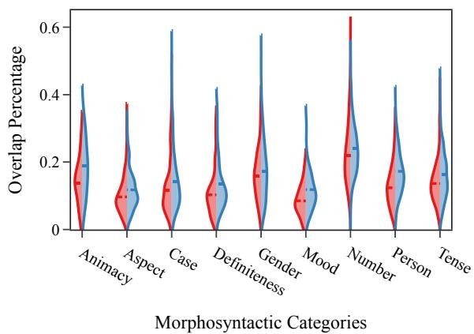  
Figure 1: Percentages of neurons most associated with a particular morphosyntactic category that overlap between pairs of languages. Colours in the plot refer to 2 models: m-BERT (red) and XLM-R-base (blue).

In this work, we offer a concurrent hypothesis to explain the multilingual abilities of various pretrained models; namely, that they implicitly align morphosyntactic markers that fulfil a similar grammatical function across languages, even in absence of any lexical overlap. More concretely, we conjecture that they employ the same subset of neurons to encode the same morphosyntactic information (such as gender for nouns and mood for verbs).1 To test the aforementioned hypothesis, we employ Stanczak et al.’s ´ (2022) latent variable probe to identify the relevant subset of neurons in each language and then measure their cross-lingual overlap.

We experiment with two multilingual pre-trained models, m-BERT (Devlin et al., 2019) and XLM-R (Conneau et al., 2020), probing them for morphosyntactic information in 43 languages from Universal Dependencies (Nivre et al., 2017). Based on our results, we argue that pre-trained models do indeed develop a cross-lingually entangled representation of morphosyntax. We further note that, as the number of values of a morphosyntactic category increases, cross-lingual alignment decreases. Finally, we find that language pairs with high proximity (in the same genus or with similar typological features) and with vast amounts of pre-training data tend to exhibit more overlap between neurons. Identical factors are known to affect also the empirical performance of zero-shot cross-lingual transfer (Wu and Dredze, 2019), which suggests a connection between neuron overlap and transfer abilities.

## 2 Intrinsic Probing

Intrinsic probing aims to determine exactly which dimensions in a representation, e.g., those given by m-BERT, encode a particular linguistic property (Dalvi et al., 2019; Torroba Hennigen et al., 2020). Formally, let Π be the inventory of values that some morphosyntactic category can take in a particular language, for example $\Pi =$ FEM, MSC, NEU for grammatical gender in Russian. Moreover, let $\bar { \mathcal { D } } = \{ ( \pi ^ { ( n ) } , \bar { h ^ { ( n ) } } ) \} _ { n = 1 } ^ { N }$ be a dataset of labelled embeddings such that $\pi ^ { ( n ) } \in \Pi$ and $\pmb { h } ^ { ( n ) } \in \mathbb { R } ^ { d }$ , where d is the dimensionality of the representation being considered, e.g., $d = 7 6 8$ for m-BERT. Our goal is to find a subset of k neurons $C ^ { \star } \subseteq D = \{ 1 , \ldots , d \}$ , where d is the total number of dimensions in the representation being probed, that maximises some informativeness measure.

In this paper, we make use of a latent-variable model recently proposed by Stanczak et al.´ (2022) for intrinsic probing. The idea is to train a probe with latent variable C indexing the subset of the dimensions D of the representation h that should be used to predict the property π:

$$
p _ { \pmb \theta } ( \pi \mid h ) = \sum _ { C \subseteq D } p _ { \pmb \theta } ( \pi \mid h , C ) p ( C )\tag{1}
$$

where we opt for a uniform prior $p ( C )$ and θ are the parameters of the probe.

Our goal is to learn the parameters θ. However, since the computation of Eq. (1) requires us to marginalise over all subsets C of D, which is intractable, we optimise a variational lower bound to the log-likelihood:

$$
\mathcal { L } ( \pmb { \theta } ) = \sum _ { n = 1 } ^ { N } \log \sum _ { C \subseteq D } p _ { \pmb { \theta } } \Big ( \pi ^ { ( n ) } , C \mid \pmb { h } ^ { ( n ) } \Big )\tag{2}
$$

$$
\ge \sum _ { n = 1 } ^ { N } \binom { \mathbb { E } } { C \sim q _ { \phi } } \Big [ \log p _ { \theta } ( \pi ^ { ( n ) } , C \mid h ^ { ( n ) } ) \Big ] + \mathrm { H } ( q _ { \phi } ) \Big )
$$

where H( ) stands for the entropy of a distribution, and $q _ { \phi } ( C )$ is a variational distribution over subsets $C . ^ { 2 }$ For this paper, we chose $q _ { \phi } ( \cdot )$ to correspond to a Poisson sampling scheme (Lohr, 2019), which models a subset as being sampled by subjecting each dimension to an independent Bernoulli trial, where $\phi _ { i }$ parameterises the probability of sampling any given dimension.3

Having trained the probe, all that remains is using it to identify the subset of dimensions that is most informative about the morphosyntactic category we are probing for. We do so by finding the subset $C _ { k } ^ { \star }$ of k neurons maximising the posterior:

$$
C _ { k } ^ { \star } = \underset { \stackrel { C \subseteq D , } { | C | = k } } { \mathrm { a r g m a x } } \log p _ { \theta } ( C \mid \mathcal { D } )\tag{3}
$$

In practice, this combinatorial optimisation problem is intractable. Hence, we solve it using greedy search.

## 3 Experimental Setup

We now describe the experimental methodology of the paper, including the data, training procedure and statistical testing.

Data. We select 43 treebanks from Universal Dependencies 2.1 (UD; Nivre et al., 2017), which contain sentences annotated with morphosyntactic information in a wide array of languages. Afterwards, we compute contextual representations for every individual word in the treebanks using multilingual BERT (m-BERT-base) and the base and large versions of XLM-RoBERTa (XLM-Rbase and XLM-R-large). We then associate each word with its parts of speech and morphosyntactic features, which are mapped to the UniMorph schema (Kirov et al., 2018).4 The selected treebanks include all languages supported by both m-BERT and XLM-R which are available in UD.

Rather than adopting the default UD splits, we re-split word representations based on lemmata ending up with disjoint vocabularies for the train, development, and test set. This prevents a probe from achieving high performance by sheer memorising. Moreover, for every category–language pair (e.g., mood–Czech), we discard any lemma with fewer than 20 tokens in its split.

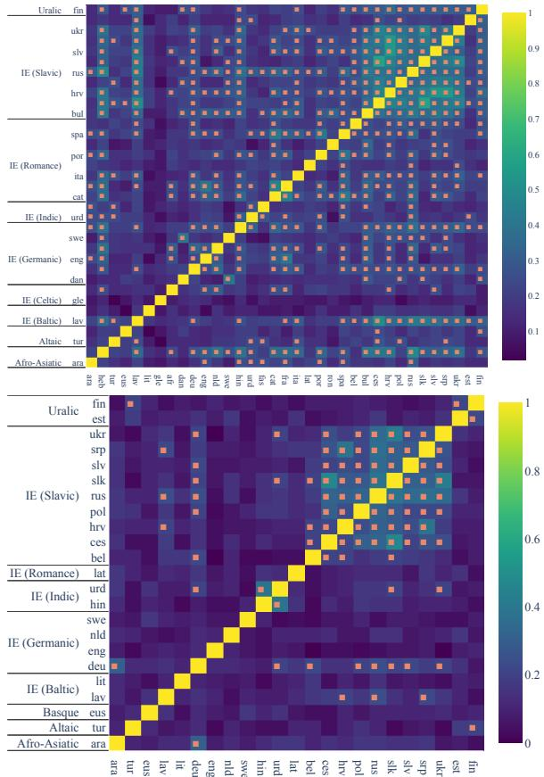  
Figure 2: The percentage overlap between the top-50 most informative number dimensions in m-BERT for number (top) and XLM-R-large for case (bottom). Statistically significant overlap after Holm–Bonferroni family-wise error correction (Holm, 1979), with α = 0.05, is marked with an orange square.

Training. We first train a probe for each morphosyntactic category–language combination with the objective in Eq. (2). In line with established practices in probing, we parameterise pθ( ) as a linear layer followed by a softmax. Afterwards, we identify the top-k most informative neurons in the last layer of m-BERT, XLM-R-base, and XLM-Rlarge. Specifically, following Torroba Hennigen et al. (2020), we use the log-likelihood of the probe on the test set as our greedy selection criterion. We single out 50 dimensions for each combination of morphosyntactic category and language.5

Next, we measure the pairwise overlap in the top-k most informative dimensions between all pairs of languages where a morphosyntactic category is expressed. This results in matrices such as Fig. 2, where the pair-wise percentages of overlapping dimensions are visualised as a heat map.

Statistical Significance. Suppose that two languages have $m \in \{ 1 , \ldots , k \}$ overlapping neurons when considering the top-k selected neurons for each of them. To determine whether such overlap is statistically significant, we compute the probability of an overlap of at least m neurons under the null hypothesis that the sets of neurons are sampled independently at random. We estimate these probabilities with a permutation test. In this paper, we set a threshold of $\alpha = 0 . 0 5$ for significance.

Family-wise Error Correction. Finally, we use Holm-Bonferroni (Holm, 1979) family-wise error correction. Hence, our threshold is appropriately adjusted for multiple comparisons, which makes incorrectly rejecting the null hypothesis less likely.

In particular, the individual permutation tests are ordered in ascending order of their p-values. The test with the smallest probability undergoes the Holm–Bonferroni correction (Holm, 1979). If already the first test is not significant, the procedure stops; otherwise, the test with the second smallest p-value is corrected for a family of t 1 tests, where t denotes the number of conducted tests. The procedure stops either at the first non-significant test or after iterating through all p-values. This sequential approach guarantees that the probability that we incorrectly reject one or more of the hypotheses is at most α.

## 4 Results

We first consider whether multilingual pre-trained models develop a cross-lingually entangled notion of morphosyntax: for this purpose, we measure the overlap between subsets of neurons encoding similar morphosyntactic categories across languages. Further, we debate whether the observed patterns are dependent on various factors, such as morphosyntactic category, language proximity, pretrained model, and pre-training data size.

Neuron Overlap. The matrices of pairwise overlaps for each of the 14 categories, such as Fig. 2 for number and case, are reported in App. B. We expand upon these results in two ways. First, we report the cross-lingual distribution for each category in Fig. 1 for m-BERT and XLM-R-base, and in an equivalent plot comparing XLM-R-base and XLM-R-large in Fig. 3. Second, we calculate how many overlaps are statistically significant out of the total number of pairwise comparisons in Tab. 1. From the above results, it emerges that 20% of neurons among the top-50 most informative ones overlap on average, but this number may vary dramatically across categories.

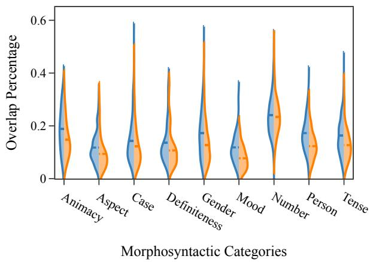  
Figure 3: Ratio of neurons most associated with a particular morphosyntactic category that overlap between pairs of languages. Colours in the plot refer to 2 models: XLM-R-base (blue) and XLM-R-large (orange).

Morphosyntactic Categories. Based on Tab. 1, significant overlap is particularly accentuated in specific categories, such as comparison, polarity, and number. However, neurons for other categories such as mood, aspect, and case are shared by only a handful of language pairs despite the high number of comparisons. This finding may be partially explained by the different number of values each category can take. Hence, we test whether there is a correlation between this number and average cross-lingual overlap in Fig. 5a. As expected, we generally find negative correlation coefficients— prominent exceptions being number and person. As the inventory of values of a category grows, cross-lingual alignment becomes harder.

Language Proximity. Moreover, we investigate whether language proximity, in terms of both language family and typological features, bears any relationship with the neuron overlap for any particular pair. In Fig. 4, we plot pairwise similarities with languages within the same genus (e.g., Baltic) against those outside. From the distribution of the dots, we can extrapolate that sharing of neurons is more likely to occur between languages in the same genus. This is further corroborated by the language groupings emerging in the matrices of App. B.

In Fig. 5b, we also measure the correlation between neuron overlap and similarity of syntactic typological features based on Littell et al. (2017). While correlation coefficients are mostly positive (with the exception of polarity), we remark that the patterns are strongly influenced by whether a category is typical for a specific genus. For instance, correlation is highest for animacy, a category almost exclusive to Slavic languages in our sample.

<table><tr><td></td><td>XL---ase m-E-RT</td><td>XLL--Irge</td><td>TJotal</td></tr><tr><td>Definiteness</td><td>0.11 0.22 0.90</td><td>0.13 0.50</td><td>45 10</td></tr><tr><td>Comparison</td><td>0.20 0.00</td><td>0.00 0.00</td><td>1</td></tr><tr><td>Possession</td><td>0.03 0.10</td><td>0.09</td><td>153</td></tr><tr><td>Aspect</td><td>0.33 0.67</td><td>0.33</td><td>3</td></tr><tr><td>Polarity Number</td><td>0.40 0.51</td><td>0.74</td><td>666</td></tr><tr><td>Animacy</td><td>0.14 0.57</td><td>0.32</td><td>28</td></tr><tr><td>Mood</td><td>0.00 0.07</td><td>0.05</td><td>105</td></tr><tr><td></td><td>0.15 0.32</td><td>0.19</td><td>378</td></tr><tr><td>Gender</td><td></td><td>0.13</td><td></td></tr><tr><td>Person</td><td>0.08 0.25</td><td></td><td>276</td></tr><tr><td>POS</td><td>0.04 0.27</td><td>0.70</td><td>861</td></tr><tr><td>Case</td><td>0.10 0.18</td><td>0.17</td><td>300</td></tr><tr><td></td><td></td><td>0.23 0.12</td><td>325</td></tr><tr><td>Tense</td><td>0.08</td><td></td><td></td></tr><tr><td>Finiteness</td><td>0.09</td><td>0.18 0.09</td><td>45</td></tr></table>

Table 1: Proportion of language pairs with statistically significant overlap in the top-50 neurons for an attribute (after Holm–Bonferroni (Holm, 1979) correction). We compute these ratios for each model. The final column reports the total number of pairwise comparisons.

Pre-trained Models. Afterwards, we determine whether the 3 models under consideration reveal different patterns. Comparing m-BERT and XLM-R-base in Fig. 1, we find that, on average, XLM-Rbase tends to share more neurons when encoding particular morphosyntactic attributes. Moreover, comparing XLM-R-base to XLM-R-large in Fig. 3 suggests that more neurons are shared in the former than in the latter.

Altogether, these results seem to suggest that the presence of additional training data engenders cross-lingual entanglement, but increasing model size incentivises morphosyntactic information to be allocated to different subsets of neurons. We conjecture that this may be best viewed from the lens of compression: if model size is a bottleneck, then, to attain good performance across many languages, a model is forced to learn cross-lingual abstractions that can be reused.

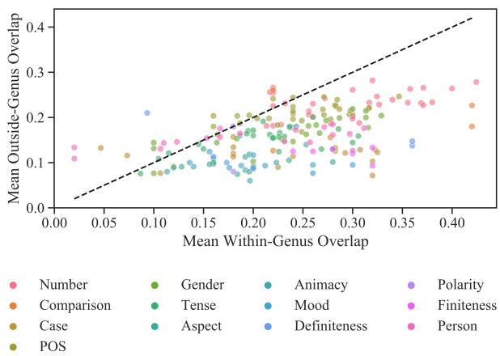  
Figure 4: Mean percentage of neuron overlap in XLM-R-base with languages either within or outside the same genus for each morphosyntactic category.

Pre-training Data Size. Finally, we assess the effect of pre-training data size6 for neuron overlap. According to Fig. 5c, their correlation is very high. We explain this phenomenon with the fact that more data yields higher-quality (and as a consequence, more entangled) multilingual representations.

## 5 Conclusions

In this paper, we hypothesise that the ability of multilingual models to generalise across languages results from cross-lingually entangled representations, where the same subsets of neurons encode universal morphosyntactic information. We validate this claim with a large-scale empirical study on 43 languages and 3 models, m-BERT, XLM-R-base, and XLM-R-large. We conclude that the overlap is statistically significant for a notable amount of language pairs for the considered attributes. However, the extent of the overlap varies across morphosyntactic categories and tends to be lower for categories with large inventories of possible values. Moreover, we find that neuron subsets are shared mostly between languages in the same genus or with similar typological features. Finally, we discover that the overlap of each language grows proportionally to its pre-training data size, but it also decreases in larger model architectures.

Given that this implicit morphosyntactic alignment may affect the transfer capabilities of pretrained models, we speculate that, in future work, artificially encouraging a tighter neuron overlap might facilitate zero-shot cross-lingual inference to low-resource and typologically distant languages(Zhao et al., 2021).

Figure 5: Spearman’s correlation, for a given model and morphological category, between the cross-lingual average percentage of overlapping neurons and:  
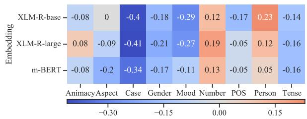  
(a) number of values for each morphosyntactic category;

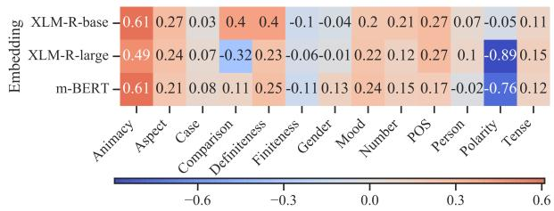  
(b) typological similarity;

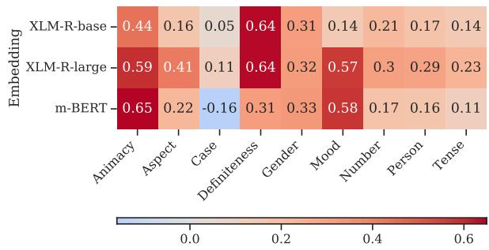  
(c) language model training data size.

## Ethics Statement

The authors foresee no ethical concerns with the work presented in this paper.

## Acknowledgments

This work is mostly funded by Independent Research Fund Denmark under grant agreement number 9130-00092B, as well as by a project grant from the Swedish Research Council under grant agreement number 2019-04129. Lucas Torroba Hennigen acknowledges funding from the Michael Athans Fellowship fund. Ryan Cotterell acknowledges support from the Swiss National Science Foundation (SNSF) as part of the “The Forgotten Role of Inductive Bias in Interpretability” project.

## References

Martín Abadi, Ashish Agarwal, Paul Barham, Eugene Brevdo, Zhifeng Chen, Craig Citro, Greg S. Corrado, Andy Davis, Jeffrey Dean, Matthieu Devin, Sanjay Ghemawat, Ian Goodfellow, Andrew Harp, Geoffrey Irving, Michael Isard, Yangqing Jia, Rafal Jozefowicz, Lukasz Kaiser, Manjunath Kudlur, Josh Levenberg, Dandelion Mané, Rajat Monga, Sherry Moore, Derek Murray, Chris Olah, Mike Schuster, Jonathon Shlens, Benoit Steiner, Ilya Sutskever, Kunal Talwar, Paul Tucker, Vincent Vanhoucke, Vijay Vasudevan, Fernanda Viégas, Oriol Vinyals, Pete Warden, Martin Wattenberg, Martin Wicke, Yuan Yu, and Xiaoqiang Zheng. 2015. TensorFlow: Large-scale machine learning on heterogeneous systems. Software available from tensorflow.org.

Omri Abend, Shay B. Cohen, and Mark Steedman. 2015. Lexical event ordering with an edge-factored model. In Proceedings of the 2015 Conference of the North American Chapter of the Association for Computational Linguistics: Human Language Technologies, pages 1161–1171, Denver, Colorado. Association for Computational Linguistics.

Omer Antverg and Yonatan Belinkov. 2022. On the pitfalls of analyzing individual neurons in language models. arXiv preprint arXiv:2110.07483.

Steven Cao, Nikita Kitaev, and Dan Klein. 2020. Multilingual alignment of contextual word representations. In 8th International Conference on Learning Representations, ICLR 2020, Addis Ababa, Ethiopia, April 26-30, 2020. OpenReview.net.

Alexis Conneau, Kartikay Khandelwal, Naman Goyal, Vishrav Chaudhary, Guillaume Wenzek, Francisco Guzmán, Edouard Grave, Myle Ott, Luke Zettlemoyer, and Veselin Stoyanov. 2020. Unsupervised cross-lingual representation learning at scale. In Proceedings ofthe 58th Annual Meeting ofthe Association for Computational Linguistics, pages 8440– 8451, Online. Association for Computational Linguistics.

Fahim Dalvi, Nadir Durrani, Hassan Sajjad, Yonatan Belinkov, Anthony Bau, and James Glass. 2019. What is one grain of sand in the desert? Analyzing individual neurons in deep NLP models. Proceedings of the AAAI Conference on Artificial Intelligence, 33:6309–6317.

Jacob Devlin, Ming-Wei Chang, Kenton Lee, and Kristina Toutanova. 2019. BERT: Pre-training of deep bidirectional transformers for language understanding. In Proceedings of the 2019 Conference of the North American Chapter of the Association for Computational Linguistics: Human Language Technologies, Volume 1 (Long and Short Papers), pages 4171–4186, Minneapolis, Minnesota. Association for Computational Linguistics.

Jaroslav Hájek. 1964. Asymptotic theory of rejective sampling with varying probabilities from a finite

population. The Annals of Mathematical Statistics, 35(4):1491–1523.

Momchil Hardalov, Arnav Arora, Preslav Nakov, and Isabelle Augenstein. 2022. Few-shot cross-lingual stance detection with sentiment-based pre-training. Proceedings ofthe AAAI Conference on Artificial Intelligence, 36.

Sture Holm. 1979. A simple sequentially rejective multiple test procedure. Scandinavian Journal of Statistics, 6(2):65–70.

Christo Kirov, Ryan Cotterell, John Sylak-Glassman, Géraldine Walther, Ekaterina Vylomova, Patrick Xia, Manaal Faruqui, Sabrina J. Mielke, Arya Mc-Carthy, Sandra Kübler, David Yarowsky, Jason Eisner, and Mans Hulden. 2018. UniMorph 2.0: Universal morphology. In Proceedings of the Eleventh International Conference on Language Resources and Evaluation (LREC 2018), Miyazaki, Japan. European Language Resources Association (ELRA).

Patrick Littell, David R. Mortensen, Ke Lin, Katherine Kairis, Carlisle Turner, and Lori Levin. 2017. URIEL and lang2vec: Representing languages as typological, geographical, and phylogenetic vectors. In Proceedings of the 15th Conference of the European Chapter of the Association for Computational Linguistics: Volume 2, Short Papers, pages 8–14, Valencia, Spain. Association for Computational Linguistics.

Yinhan Liu, Jiatao Gu, Naman Goyal, Xian Li, Sergey Edunov, Marjan Ghazvininejad, Mike Lewis, and Luke Zettlemoyer. 2020. Multilingual denoising pre-training for neural machine translation. Transactions of the Association for Computational Linguistics, 8:726–742.

Sharon Lohr. 2019. Sampling: Design and Analysis, 2nd edition. CRC Press.

Arya D. McCarthy, Miikka Silfverberg, Ryan Cotterell, Mans Hulden, and David Yarowsky. 2018. Marrying universal dependencies and universal morphology. In Proceedings of the Second Workshop on Universal Dependencies (UDW 2018), pages 91–101, Brussels, Belgium. Association for Computational Linguistics.

Joakim Nivre, Željko Agic, Lars Ahrenberg, Lene´ Antonsen, Maria Jesus Aranzabe, Masayuki Asahara, Luma Ateyah, Mohammed Attia, Aitziber Atutxa, Liesbeth Augustinus, Elena Badmaeva, Miguel Ballesteros, Esha Banerjee, Sebastian Bank, Verginica Barbu Mititelu, John Bauer, Kepa Bengoetxea, Riyaz Ahmad Bhat, Eckhard Bick, Victoria Bobicev, Carl Börstell, Cristina Bosco, Gosse Bouma, Sam Bowman, Aljoscha Burchardt, Marie Candito, Gauthier Caron, Gül¸sen Cebiroglu Ery-˘ igit, Giuseppe G. A. Celano, Savas Cetin, Fabri-˘ cio Chalub, Jinho Choi, Silvie Cinková, Çagrı Çöl-˘ tekin, Miriam Connor, Elizabeth Davidson, Marie-Catherine de Marneffe, Valeria de Paiva, Arantza

Diaz de Ilarraza, Peter Dirix, Kaja Dobrovoljc, Timothy Dozat, Kira Droganova, Puneet Dwivedi, Marhaba Eli, Ali Elkahky, Tomaž Erjavec, Richárd Farkas, Hector Fernandez Alcalde, Jennifer Fos ter, Cláudia Freitas, Katarína Gajdošová, Daniel Galbraith, Marcos Garcia, Moa Gärdenfors, Kim Gerdes, Filip Ginter, Iakes Goenaga, Koldo Go jenola, Memduh Gökırmak, Yoav Goldberg, Xavier Gómez Guinovart, Berta Gonzáles Saavedra, Ma tias Grioni, Normunds Gruz¯ ¯ıtis, Bruno Guillaume, Nizar Habash, Jan Hajic, Jan Hajiˇ c jr., Linh Hà Mˇ y,˜ Kim Harris, Dag Haug, Barbora Hladká, Jaroslava Hlavácová, Florinel Hociung, Petter Hohle, Raduˇ Ion, Elena Irimia, Tomáš Jelínek, Anders Jo hannsen, Fredrik Jørgensen, Hüner Ka¸sıkara, Hi roshi Kanayama, Jenna Kanerva, Tolga Kayadelen, Václava Kettnerová, Jesse Kirchner, Natalia Kotsyba, Simon Krek, Veronika Laippala, Lorenzo Lambertino, Tatiana Lando, John Lee, Phương Lê Hông, Alessandro Lenci, Saran Lertpradit, Her-\` man Leung, Cheuk Ying Li, Josie Li, Keying Li, Nikola Ljubešic, Olga Loginova, Olga Lya-´ shevskaya, Teresa Lynn, Vivien Macketanz, Aibek Makazhanov, Michael Mandl, Christopher Manning, Cat˘ alina M˘ ar˘ anduc, David Mare˘ cek, Katrin Marhei-ˇ necke, Héctor Martínez Alonso, André Martins, Jan Mašek, Yuji Matsumoto, Ryan McDonald, Gustavo Mendonça, Niko Miekka, Anna Missilä, Cat˘ alin˘ Mititelu, Yusuke Miyao, Simonetta Montemagni, Amir More, Laura Moreno Romero, Shinsuke Mori, Bohdan Moskalevskyi, Kadri Muischnek, Kaili Müürisep, Pinkey Nainwani, Anna Nedoluzhko, Gunta Nešpore-Berzkalne, L¯ ương Nguy˜ên Thi., Huy\`ên Nguy˜ên Thi Minh, Vitaly Nikolaev, Hanna Nurmi, Stina Ojala, Petya Osenova, Robert Östling, Lilja Øvrelid, Elena Pascual, Marco Passarotti, Cenel-Augusto Perez, Guy Perrier, Slav Petrov, Jussi Piitulainen, Emily Pitler, Barbara Plank, Martin Popel, Lauma Pretkalnina, Prokopis Proko pidis, Tiina Puolakainen, Sampo Pyysalo, Alexandre Rademaker, Loganathan Ramasamy, Taraka Rama, Vinit Ravishankar, Livy Real, Siva Reddy, Georg Rehm, Larissa Rinaldi, Laura Rituma, Mykhailo Romanenko, Rudolf Rosa, Davide Rovati, Benoît Sagot, Shadi Saleh, Tanja Samardžic, Manuela San-´ guinetti, Baiba Saul¯ıte, Sebastian Schuster, Djamé Seddah, Wolfgang Seeker, Mojgan Seraji, Mo Shen, Atsuko Shimada, Dmitry Sichinava, Natalia Sil veira, Maria Simi, Radu Simionescu, Katalin Simkó, Mária Šimková, Kiril Simov, Aaron Smith, Anto nio Stella, Milan Straka, Jana Strnadová, Alane Suhr, Umut Sulubacak, Zsolt Szántó, Dima Taji, Takaaki Tanaka, Trond Trosterud, Anna Trukhina, Reut Tsarfaty, Francis Tyers, Sumire Uematsu, Zdenka Urešová, Larraitz Uria, Hans Uszkoreit,ˇ Sowmya Vajjala, Daniel van Niekerk, Gertjan van Noord, Viktor Varga, Eric Villemonte de la Clergerie, Veronika Vincze, Lars Wallin, Jonathan North Washington, Mats Wirén, Tak-sum Wong, Zhuoran Yu, Zdenek Žabokrtský, Amir Zeldes, Daniel Ze-ˇ man, and Hanzhi Zhu. 2017. Universal dependen cies 2.1. LINDAT/CLARIAH-CZ digital library at the Institute of Formal and Applied Linguis

tics (ÚFAL), Faculty of Mathematics and Physics, Charles University.

Farhad Nooralahzadeh, Giannis Bekoulis, Johannes Bjerva, and Isabelle Augenstein. 2020. Zero-Shot Cross-Lingual Transfer with Meta Learning. In Proceedings of the 2020 Conference on Empirical Methods in Natural Language Processing (EMNLP), pages 4547–4562, Online. Association for Computational Linguistics.

Telmo Pires, Eva Schlinger, and Dan Garrette. 2019. How multilingual is multilingual BERT? In Proceedings of the 57th Annual Meeting of the Association for Computational Linguistics, pages 4996– 5001, Florence, Italy. Association for Computational Linguistics.

Karolina Stanczak, Lucas Torroba Hennigen, Adina´ Williams, Ryan Cotterell, and Isabelle Augenstein. 2022. A Latent-Variable Model for Intrinsic Probing. arXiv preprint arXiv:2201.08214.

Lucas Torroba Hennigen, Adina Williams, and Ryan Cotterell. 2020. Intrinsic probing through dimension selection. In Proceedings of the 2020 Conference on Empirical Methods in Natural Language Processing (EMNLP), pages 197–216, Online. Association for Computational Linguistics.

Ivan Vulic, Edoardo Maria Ponti, Robert Litschko,´ Goran Glavaš, and Anna Korhonen. 2020. Probing pretrained language models for lexical semantics. In Proceedings of the 2020 Conference on Empirical Methods in Natural Language Processing (EMNLP), pages 7222–7240, Online. Association for Computational Linguistics.

Shijie Wu and Mark Dredze. 2019. Beto, bentz, becas: The surprising cross-lingual effectiveness of BERT. In Proceedings of the 2019 Conference on Empirical Methods in Natural Language Processing and the 9th International Joint Conference on Natural Language Processing (EMNLP-IJCNLP), pages 833–844, Hong Kong, China. Association for Computational Linguistics.

Linting Xue, Noah Constant, Adam Roberts, Mihir Kale, Rami Al-Rfou, Aditya Siddhant, Aditya Barua, and Colin Raffel. 2021. mT5: A massively multilingual pre-trained text-to-text transformer. In Proceedings of the 2021 Conference of the North American Chapter of the Association for Computational Linguistics: Human Language Technologies, pages 483–498, Online. Association for Computational Linguistics.

Wei Zhao, Steffen Eger, Johannes Bjerva, and Isabelle Augenstein. 2021. Inducing language-agnostic multilingual representations. In Proceedings of \*SEM 2021: The Tenth Joint Conference on Lexical and Computational Semantics, pages 229–240, Online. Association for Computational Linguistics.

## A Probed Property–Language Pairs

## Afro-Asiatic

• ara (Arabic): Gender, Voice, Mood, Part of Speech, Aspect, Person, Number, Case, Definiteness

• heb (Hebrew): Part of Speech, Number, Tense, Person, Voice

## Austroasiatic

• vie (Vietnamese): Part of Speech

## Dravidian

• tam (Tamil): Part of Speech, Number, Gender, Case, Person, Finiteness, Tense

## Indo-European

• afr (Afrikaans): Part of Speech, Number, Tense

• bel (Berlarusian): Part of Speech, Tense, Number, Aspect, Finiteness, Voice, Gender, Animacy, Case, Person

• bul (Bulgarian): Part of Speech, Definiteness, Gender, Number, Mood, Tense, Person, Voice, Comparison

• cat (Catalan): Gender, Number, Part of Speech, Tense, Mood, Person, Aspect

• ces (Czech): Part of Speech, Number, Case, Comparison, Gender, Mood, Person, Tense, Aspect, Polarity, Animacy, Possession, Voice

• dan (Danish): Part of Speech, Number, Gender, Definiteness, Voice, Tense, Mood, Comparison

• deu (German): Part of Speech, Case, Number, Tense, Person, Comparison

• ell (Greek): Part of Speech, Case, Gender, Number, Finiteness, Person, Tense, Aspect, Mood, Voice, Comparison

• eng (English): Part of Speech, Number, Tense, Case, Comparison

• fas (Persian): Number, Part of Speech, Tense, Person, Mood, Comparison

• fra (French): Part of Speech, Number, Gender, Tense, Mood, Person, Polarity, Aspect

• gle (Irish): Tense, Mood, Part of Speech, Number, Person, Gender, Case

• glg (Galician): Part of Speech

• hin (Hindi): Person, Case, Part of Speech, Number, Gender, Voice, Aspect, Mood, Finiteness, Politeness

• hrv (Croatian): Case, Gender, Number, Part of Speech, Person, Finiteness, Mood, Tense, Animacy, Definiteness, Comparison, Voice

• ita (Italian): Part of Speech, Number, Gender, Person, Mood, Tense, Aspect

• lat (Latin): Part of Speech, Number, Gender, Case, Tense, Person, Mood, Aspect, Comparison

• lav (Latvian): Part of Speech, Case, Number, Tense, Mood, Person, Gender, Definiteness, Aspect, Comparison, Voice

• lit (Lithuanian): Tense, Voice, Number, Part of Speech, Finiteness, Mood, Polarity, Person, Gender, Case, Definiteness

• mar (Marathi): Case, Gender, Number, Part of Speech, Person, Aspect, Tense, Finiteness

• nld (Dutch): Person, Part of Speech, Number, Gender, Finiteness, Tense, Case, Comparison

• pol (Polish): Part of Speech, Case, Number, Animacy, Gender, Aspect, Tense, Person, Polarity, Voice

• por (Portuguese): Part of Speech, Person, Mood, Number, Tense, Gender, Aspect

• ron (Romanian): Definiteness, Number, Part of Speech, Person, Aspect, Mood, Case, Gender, Tense

• rus (Russian): Part of Speech, Case, Gender, Number, Animacy, Tense, Finiteness, Aspect, Person, Voice, Comparison

• slk (Slovak): Part of Speech, Gender, Case, Number, Aspect, Polarity, Tense, Voice, Animacy, Finiteness, Person, Mood, Comparison

• slv (Slovenian): Number, Gender, Part of Speech, Case, Mood, Person, Finiteness, Aspect, Animacy, Definiteness, Comparison

• spa (Spanish): Part of Speech, Tense, Aspect, Mood, Number, Person, Gender

• srp (Serbian): Number, Part of Speech, Gender, Case, Person, Tense, Definiteness, Animacy, Comparison

• swe (Swedish): Part of Speech, Gender, Number, Definiteness, Case, Tense, Mood, Voice, Comparison

• ukr (Ukrainian): Case, Number, Part of Speech, Gender, Tense, Animacy, Person, Aspect, Voice, Comparison

• urd (Urdu): Case, Number, Part of Speech, Person, Finiteness, Voice, Mood, Politeness, Aspect

## Japonic

• jpn (Japanese): Part of Speech

## Language isolate

• eus (Basque): Part of Speech, Case, Animacy, Definiteness, Number, Argument Marking, Aspect, Comparison

## Sino-Tibetan

• zho (Chinese): Part of Speech

Turkic

• tur (Turkish): Case, Number, Part of Speech, Aspect, Person, Mood, Tense, Polarity, Possession, Politeness

## Uralic

• est (Estonian): Part of Speech, Mood, Finiteness, Tense, Voice, Number, Person, Case

• fin (Finnish): Part of Speech, Case, Number, Mood, Person, Voice, Tense, Possession, Comparison

## B Pairwise Overlap by Morphosyntactic Category

Figure 6: The percentage overlap between the top-50 most informative dimensions in a randomly selected language model for each of the morphosyntactic categories. Statistically significant overlap is marked with an orange square.

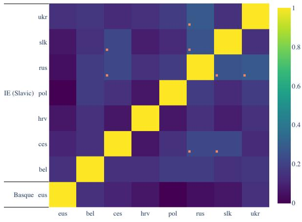  
(a) Animacy–m-BERT

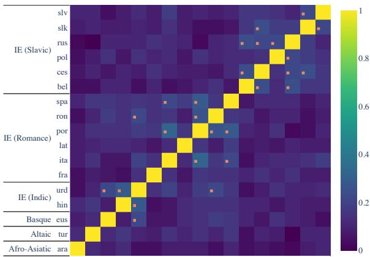  
(b) Aspect–XLM-R-base

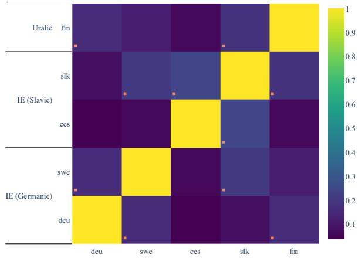

(c) Comparison–XLM-R-large  
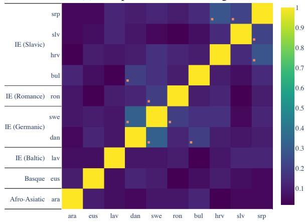

(d) Definiteness–m-BERT  
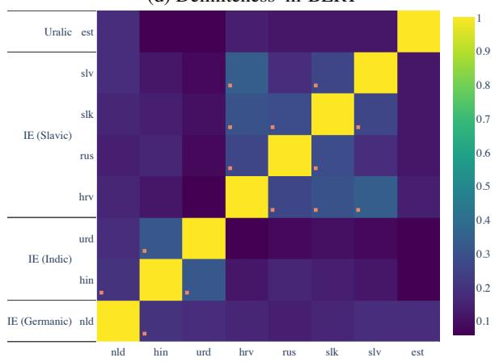

(e) Finiteness–XLM-R-base  
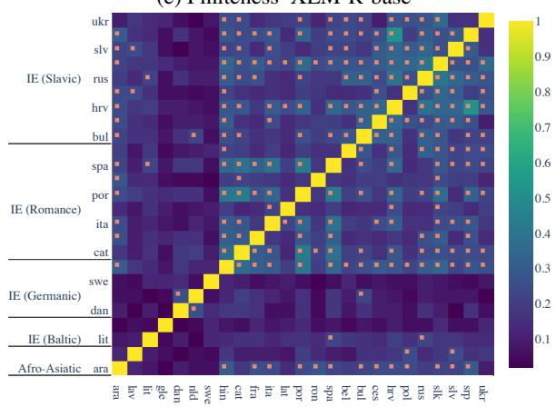  
(f) Gender–XLM-R-base

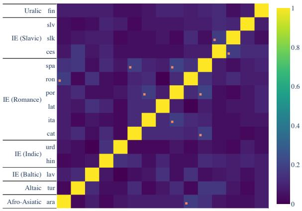  
(g) Mood–XLM-R-large

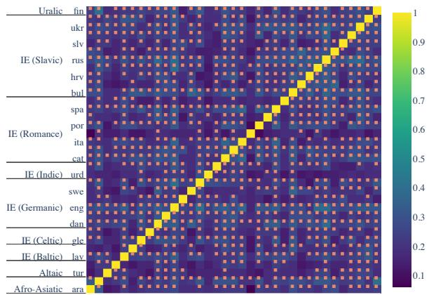  
(j) Part of Speech–XLM-R-large

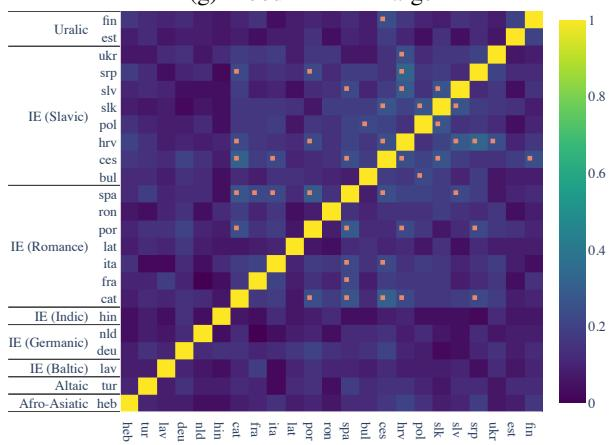  
(h) Person–m-BERT

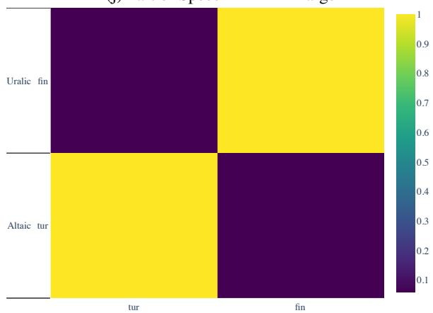  
(k) Possession–XLM-R-base

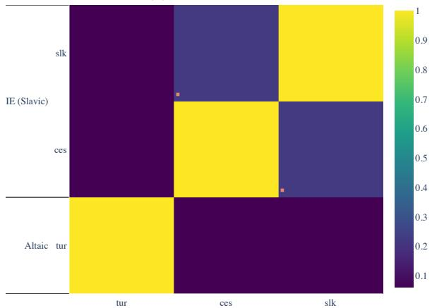  
(i) Polarity–XLM-R-large

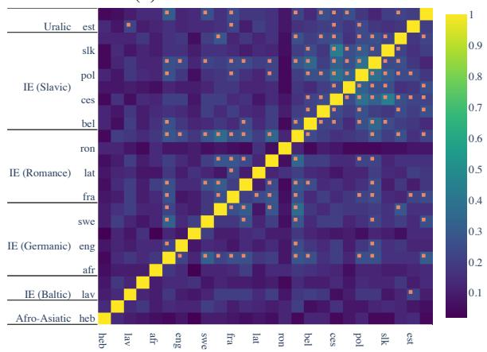  
(l) Tense–XLM-R-base