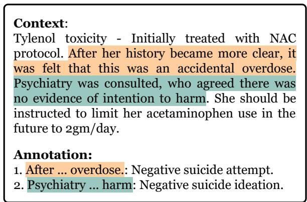
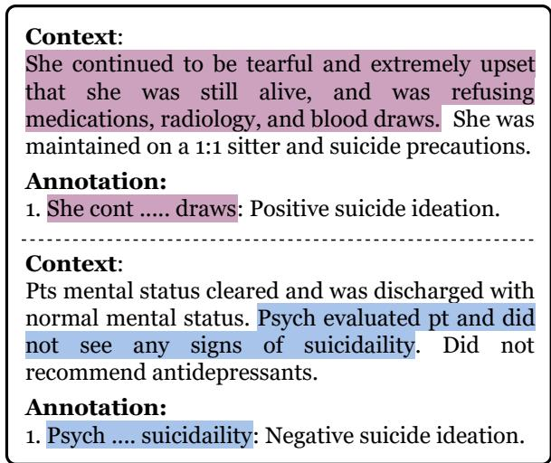
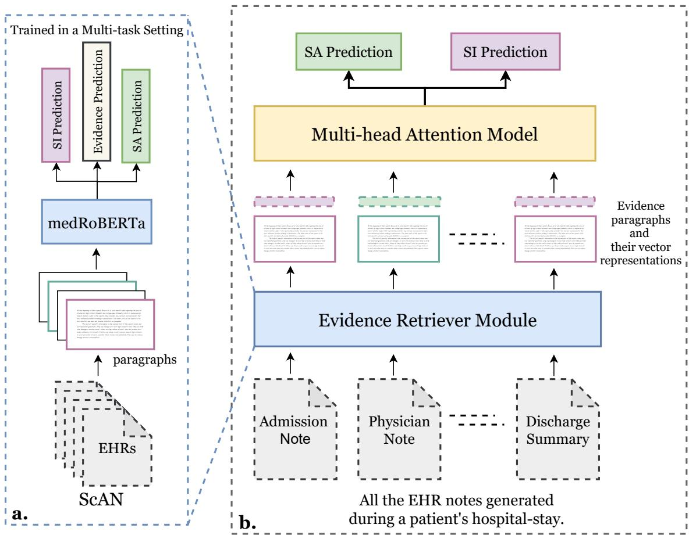

# ScAN: Suicide Attempt and Ideation Events Dataset

Bhanu Pratap Singh Rawat1,\*, Samuel Kovaly1,#, Wilfred R. Pigeon2,3,†, Hong Yu1,3,4,‡ 1CICS, UMass-Amherst, 2University of Rochester, 3U.S. Department of Veterans Affairs,

4Center of Biomedical and Health Research in Data Sciences

\*brawat@umass.edu, #skovaly@umass.edu,

†wilfred\_pigeon@urmc.rochester.edu, ‡hong\_yu@uml.edu

## Abstract

Suicide is an important public health concern and one of the leading causes of death worldwide. Suicidal behaviors, including suicide attempts (SA) and suicide ideations (SI), are leading risk factors for death by suicide. Information related to patients’ previous and current SA and SI are frequently documented in the electronic health record (EHR) notes. Accurate detection of such documentation may help improve surveillance and predictions of patients’ suicidal behaviors and alert medical professionals for suicide prevention efforts. In this study, we first built Suicide Attempt and Ideation Events (ScAN) dataset, a subset of the publicly available MIMIC III dataset spanning over 12k+ EHR notes with 19k+ annotated SA and SI events information. The annotations also contain attributes such as method of suicide attempt. We also provide a strong baseline model ScANER (Suicide Attempt and Ideation Events Retreiver), a multi-task RoBERTabased model with a retrieval module to extract all the relevant suicidal behavioral evidences from EHR notes of an hospital-stay and, and a prediction module to identify the type of suicidal behavior (SA and SI) concluded during the patient’s stay at the hospital. ScANER achieved a macro-weighted F1-score of 0.83 for identifying suicidal behavioral evidences and a macro F1-score of 0.78 and 0.60 for classification of SA and SI for the patient’s hospital-stay, respectively. ScAN and ScANER are publicly available1.

## 1 Introduction

For decades, suicide has been one of the leading causes of death (CBHSQ, 2020). The suicide rate in the United States increased from 10.5 per 100, 000 in 1999 to 14.2 in 2018, a 35% increase (Hedegaard et al., 2020). Globally, 740, 000 people

## Context:

[\*Name\*] is a 22 year old male with a history of angry and impulsive behavior who is transferred from an outside hospital s/p Tylenol overdose. [\*Name\*] reports that he and his girlfriend broke up last Wednesday, and that he subsequently went on an alcohol and cocaine binge lasting from Thursday to Saturday. He has used alcohol and cocaine regularly in the past, but he denies having had a binge of this quantity or duration before. On Saturday night, [\*\*Name\*\*] told his father that he had tried to hang himself at a nearby park, but the rope had broken.

## Annotations:

Two instances of suicide attempts are annotated in the paragraph.

1. [\*Name\*] ... overdose: Annotated for suicide attempt and is assigned 'unsure' category as there is no definite documentation that it is a suicide attempt.

2. On Sat ... broken: This is also annotated for suicide attempt and is assigned the category: 'T71 (asphyxiation, hanging).

Figure 1: An example of positive and unsure evidence annotations for SA in an EHR note.

commit suicide each year. The rates of suicidal behaviors, suicide attempt (SA) and suicide ideation (SI), are much higher (WHO, 2021).

A prior study shows that a large proportion of suicide victims sought care well before their death (Kessler et al., 2020). Suicidal behaviors, including SA and SI are recorded by clinicians in electronic health records (EHRs). This knowledge can in turn help clinicians assess risk of suicide and make prevention efforts (Jensen et al., 2012). The diagnostic ICD codes include suicidality codes for both SA and SI. However a study has shown that ICD codes can only capture 3% SI events, while 97% of SI events are described in notes (Anderson et al., 2015). In addition, of patients described with SA in their EHR notes, only 19% had the corresponding ICD codes (Anderson et al., 2015). Therefore, it is important to develop natural language processing (NLP) approaches to capture such important suicidality information.

Researchers have developed NLP approaches to detect SA and SI from EHR notes (Metzger et al., 2017; Downs et al., 2017; Fernandes et al., 2018; Cusick et al., 2021). These studies either used rule-based approaches (Downs et al., 2017; Fernandes et al., 2018; Cusick et al., 2021) or built the SA and SI identification models on a small set (Metzger et al., 2017) or private set (Bhat and Goldman-Mellor, 2017; Tran et al., 2013; Haerian et al., 2012) of EHR notes. It is also difficult to compare the results of those studies as they varied in EHR data, data curation, as well as NLP models, which were not made available to the public.

In this study, we present ScAN: Suicide Attempt and Ideation Events Dataset, a publicly available EHR dataset that is a subset of the MIMIC III data (Johnson et al., 2016). ScAN contains 19, 690 expert-annotated SA and SI events with their attributes (e.g., methods for SA) over 12, 759 EHR notes. Specifically, experts annotated suicidality evidence or sentences relevant to SA and SI events during a patient’s stay at the healthcare facility, an example of SA annotations is shown in Fig 1. The evidences were put together to assess whether the patient has an SA or SI event.

We also present ScANER (Suicide Attempt and Ideation Events Retriever), a RoBERTa-based NLP model that is built on a multi-task learning framework for retrieving evidences from the EHRs and then predicting a patient’s SA or SI event using the complete set of EHR notes from the hospital stay using a multi-head attention model. We focus on the prediction of SA and SI using all the EHR notes during a patient’s stay because for the whole duration, multiple EHR notes and note types are generated, including admission notes, nursing notes, and discharge summary notes. Suicidal information are described in multiple notes throughout the stay. For example, a patient was admitted to the hospital with opioid overdose. It was documented initially in the admission note as an SA, but later dismissed as an accident after physician’s evaluation. In another example, an opioid overdose admission was first documented as an accident on admission, but later documented to be an SA event after clinical assessment. Both ScAN and ScANER capture SA and SI information at the hospital-stay level. ScANER is able to retrieve suicidal evidences from EHR notes with a macroweighted F1-score of 0.83 and is able to predict SA and SI with a macro F1-score of 0.78 and 0.60, respectively. Our annotation guidelines, ScAN, and ScANER system will be made publicly available, making ScAN a benchmark EHR dataset for SA and SI events detection. We will release the training and evaluations splits used in this study for benchmarking new models.

## 2 Related Works

Efforts on detecting SA and SI within EHRs have been explored in recent years. Most work used rule-based or traditional machine learning-based approaches. In one study, experts created handcrafted rules from mentions of suicidality (both SA and SI) and then used the rules to identify suicidality as positive, negative, or unknown in a document (Downs et al., 2017). The rule-based approaches are limited by their scalability. In another study, structured and unstructured EHRs were used to classify at the hospital-stay level as SA, SI, or no mention of suicidal behavior (Metzger et al., 2017). The training data consisted of only 112 SA, 49 SI and 322 unrelated examples. In contrast, ScAN comprises of 697 hospital-stays with more than 19,000 suicidal event examples over 12,759 clinical notes. Only traditional machine learning models such as random forest (Breiman, 2001) were explored. In contrast, ScANER was built on the state-of-the-art self-attention based model.

Hybrid approaches have also been developed to identify SA at the hospital-stay level (Fernandes et al., 2018). In that study, a post-processing heuristic rule-based filter (e.g., removing negated events) was applied to the machine-learning-based classifier (a SVM (Cortes and Vapnik, 1995) classifier) to reduce false positives. Training and evaluation were done also on relatively small datasets (500 for training and 500 for evaluation).

Finally, weakly supervised approaches have been developed to identify SI from EHRs (Cusick et al., 2021). In that study, authors used ICD codes to identify 200 patients with SI and then obtained EHR notes of those patients (6, 588). This EHR note dataset was then used as the ‘current SI training data. The remaining 400 patients were labelled as ‘potential’ SI and their 12, 227 EHRs were also labelled the same. Authors used multiple statistical machine learning models and one deep learning model: convolutional neural network. (Bhat and Goldman-Mellor, 2017) also used feed-forward neural networks to predict suicide attempts over 500k unique patients but the EHR data for this study is not publicly available. (Ji et al., 2020) surveyed multiple studies where the researchers worked on private datasets (Tran et al., 2013; Haerian et al., 2012) for suicide attempt and ideation prediction. Whereas in our study, in contrast to using the ICD codes which has considerable errors, domain experts chart-reviewed a large, publicly available set of EHRs for SI and SA, along with their attributes (e.g., positive or negative SA, SI and the type of self-harm such as asphyxiation and overdose).

## 3 Dataset

In this section, we introduce ScAN (Suicide Attempt and Ideation Events Dataset) and describe it’s data collection and annotation process. We also discuss some examples from ScAN along with basic dataset statistics.

## 3.1 Dataset collection

For annotation, we selected the notes from the MIMIC-III (Johnson et al., 2016) dataset, which consists of the de-identified EHR data of patients admitted to the Beth Israel Deaconess Medical Center in Boston, Massachusetts from 2001 to 2012 (Johnson et al., 2016). The data includes notes, diagnostic codes, medical history, demographics, lab measurements among many other record types. We chose MIMIC-III because it is publicly available under a data use agreement and allows clinical studies to be easily reproduced and compared.

The diagnostic ICD codes for the patients are provided at hospital-stay level in MIMIC with admission identification numbers (HADM\_ID in MIMIC database). We first filtered the hospital stays that had ICD codes associated with suicide and overdose. This resulted in 697 hospital-stays for 669 unique patients. For each stay, multiple de-identified notes such as nursing notes, physician notes, and discharge summaries are available. For the selected 697 hospital-stays we extracted a total of 12, 759 notes. Each medical note contains multiple sections about a patient such as family and medical history, assessment and plan, and discharge instructions. We extracted different sections from these clinical notes using MedSpaCy’s2 clinical\_sectionizer and filtered the relevant sections from these clinical notes for annotation. The extensive list of these sections is provided in Appendix A.

## 3.2 Annotation Process

The aim was to annotate all instances of SA and SI documented in the medical notes as defined by Center of Disease Control and Prevention (CDC) (Hedegaard et al., 2020). The filtered 12, 759 notes were annotated by a trained annotator under the supervision of a senior physician. Each note consisted of instances of SA, SI, both or none. The senior physician randomly annotated 330 notes and had a 100% agreement with the annotator on hospital-stay level annotation and 85% agreement on sentence-level annotations. After adjudication between the senior physician and the annotator, the disagreements were discussed and adjusted by the annotator.

  
Figure 2: An example with negative SA and negative SI annotations.

Suicide Attempt (SA): The annotator labelled all the sentences with a mention of SA. Some hospital stays could represent multiple types of SA, such as in Fig. 1, where ‘tried to hang himself’ is labelled as a positive SA and ‘Tylenol overdose’ is labelled as unsure since the overdose was never confirmed as an SA event elsewhere in the medical notes of the patient’s hospital-stay. The label unsure is used when it is not clearly documented if a self-harm was an SA event or not. The negative instance, example shown in Fig. 2, is a sentence that confirms that the self-harm, an “accidental overdose”, responsible for the patient’s hospital-stay is not an SA event. In this work, we only focused on suicidal self-harm and not non-suicidal self-harm (Crosby et al., 2011).

Further sub-categories are also provided for an SA annotation in the form of the ICD label group: a.) T36-T50: Poisoning by drugs, medications and biological substances b.) T51-T65: Toxic effects on non-medical substances c.) T71: Asphyxiation or suffocation and d.) X71-X83: Drowning, firearm, explosive material, jumping from a high place, crashing motor vehicles, other specified means.

Suicide Ideation (SI): SI is defined as any mention and/or indication of wanting to take one’s own life or harm oneself. Similar to SA, any sentence with a mention of SI was labelled within the patient’s notes. A SI annotation could be labeled as positive or negative, an example for each label is shown in Fig. 3.

  
Figure 3: Examples of positive and negative SI annotations.

A sentence without SA or SI annotation would be considered as a neutral-SA or neutral-SI sentence respectively. Sentence level annotations provide more visibility to a medical expert for the hospital-stay level annotation.

## 3.3 Dataset statistics

ScAN consists of 19, 690 unique evidence annotations for the suicide relevant sections of 12, 759 EHRs of 697 patient hospital-stays. There are a total of 17, 723 annotations for SA events and 1, 967 annotations for SI events. The distribution for both SA and SI events is provided in Table 1.

## 4 Methodology

In this section, we introduce ScANER (Suicide Attempt and Ideation Events Retreiver): a strong baseline model for our dataset. ScANER consists of two sub-modules: (1) An evidence retriever module that extracts the evidences related to SA and

<table><tr><td>General Statistics</td><td>Patients 669</td><td>Hospital-stays 697</td><td>Notes 12,759</td></tr><tr><td>Suicide Attempt</td><td>Positive 14,815</td><td>Negative 170</td><td>Unsure 2,738</td></tr><tr><td>Suicide Ideation</td><td>Positive 1,167</td><td>Negative 800</td><td></td></tr></table>

Table 1: Distribution of unique annotations at the patient, hospital-stay and notes level in ScAN.

SI and (2) A predictor module that predicts SA or SI label for the patient’s hospital-stay using the evidences extracted by the retriever module.

<table><tr><td>Evidence</td><td>Train</td><td>Validation</td><td>Test</td></tr><tr><td>Yes</td><td>9,880</td><td>1,803</td><td>3,038</td></tr><tr><td>No</td><td>30,133</td><td>4,864</td><td>7,836</td></tr><tr><td>Suicide Attempt (SA)</td><td></td><td></td><td></td></tr><tr><td>Positive</td><td>7,597</td><td>1,474</td><td>2,433</td></tr><tr><td>Negative</td><td>136</td><td>36</td><td>20</td></tr><tr><td>Unsure</td><td>1,607</td><td>216</td><td>431</td></tr><tr><td>Neutral-SA</td><td>30,673</td><td>4,941</td><td>7,990</td></tr><tr><td>Suicide Ideation (SI)</td><td></td><td></td><td></td></tr><tr><td>Positive</td><td>928</td><td>153</td><td>331</td></tr><tr><td>Negative</td><td>654</td><td>107</td><td>189</td></tr><tr><td></td><td></td><td></td><td></td></tr><tr><td>Neutral-SI</td><td>38,431</td><td>6,407</td><td>10,354</td></tr></table>

Table 2: Distribution of evidences at paragraph level in ScAN for train, validation and test sets. A paragraph was considered an evidence, labeled as Yes, if it had at least one sentence annotated as SA or SI. A No evidence paragraph was both Neutral-SA and Neutral-SI.

## 4.1 Evidence Retriever

Problem Formulation: Given an input clinical note, the model extracts the evidences (one or more sentences) related to SA or SI (SA-SI) from the note. This is a binary classification problem where given a text snippet the model predicts whether it has an evidence for SA-SI or not. We learn this task at paragraph level where the input is a set of 20 consecutive sentences because the local surrounding context provides additional important information (Yang et al., 2021; Rawat et al., 2019). A paragraph was labeled as evidence no, if all the sentences in that paragraph are neutral-SA and neutral-SI. If there was at least one SA-SI sentence, it was considered an evidence yes. As the number of nonevidence sentences significantly outsized the evidence sentences, we decided to use an overlapping window of 5 sentences between the paragraphs to build more evidence paragraphs. The distribution of the paragraphs, across all evidence, SA and SI labels for train, validation, and test set is provided in Table 2. We segregated the train and test set such that any patient observed by the retriever module during training was not seen in the test set. This is important as there are patients who had multiple hospital-stays in ScAN.

Proposed Model: Transformer (Vaswani et al., 2017) based language models (Devlin et al., 2018; Liu et al., 2019) have shown great performance for a broad range of NLP classification tasks. Hence, to extract the evidence paragraphs we trained a RoBERTa (Liu et al., 2019) based model. It has been previously shown that the domain-adapted versions of the pre-trained language models, such as clinicalBERT (Alsentzer et al., 2019) or BioBERT (Lee et al., 2020), work better than their base versions. So, we further pre-trained the RoBERTabase model over the MIMIC dataset to create a clinical version of RoBERTa model, hereby referenced as medRoBERTa. During our initial exploration, we experimented with clinicalBERT and BioBERT but found that medRoBERTa consistently outperformed both models. medRoBERTa achieved an overall F1-score of 0.88 whereas both clinicalBERT and BioBERT achieved an overall F1-score of 0.85. Our hospital-level SA and SI predictor would work with any encoder-based evidence retriever model.

Multi-task Learning: We trained medRoBERTa in a multi-task learning setting where along with learning the evidence classification task, the model also learns two auxiliary tasks: (a.) Identifying the label for SA between positive, negative, unsure and neutral-SA and, (b.) Identifying the label for SI between positive, negative and neutral-SI. The training loss $( L ( \theta ) )$ for our evidence retriever model was formulated as:

$$
L ( \theta ) = L _ { e v i } + \alpha * L _ { S A } + \beta * L _ { S I }\tag{1}
$$

Where $L _ { e v i }$ is the negative log likelihood loss for evidence classification, $L _ { S A }$ and $L _ { S I }$ are $\mathbf { S A }$ and SI prediction losses respectively, and α and $\beta$ are the weights for the auxiliary tasks’ losses. The distribution of labels across all the three tasks is highly skewed, hence, we applied the following techniques to learn an efficient and robust model.

<table><tr><td>Suicide Attempt</td><td>Positive</td><td>Neg_Unsure</td><td>Neutral-SA</td></tr><tr><td>Train</td><td>377</td><td>54</td><td>1,381</td></tr><tr><td>Val</td><td>50</td><td>10</td><td>189</td></tr><tr><td>Test</td><td>91</td><td>19</td><td>326</td></tr><tr><td>Suicide Ideation</td><td>Positive</td><td>Negative</td><td>Neutral-SI</td></tr><tr><td>Train</td><td>377</td><td>214</td><td>1,521</td></tr><tr><td>Val</td><td>45</td><td>28</td><td>208</td></tr><tr><td>Test</td><td>44</td><td>35</td><td>357</td></tr></table>

Table 3: Distribution of SA and SI at hospital-stay level in training, validation and testing set.

• Weighted log loss was used in both main task and auxiliary tasks. The total loss for each task was calculated as the weighted sum of loss according to the label of the input paragraph. Log weighing helps smooth the weights for highly unbalanced classes. The weight for each class was calculated using:

$$
w _ { l , t } = \left\{ \begin{array} { l l } { 1 . 0 } & { \mathrm { i f } ( w _ { l , t } < 1 . 0 ) } \\ { l o g ( \gamma * N _ { t } / N _ { l , t } ) } & \end{array} \right.
$$

Where $N _ { t }$ is the count of all training paragraphs for the task t and $N _ { l , t }$ is the count of paragraphs with label l for the task t and $w _ { l , t }$ is the calculated weight for those paragraphs. We tuned γ as a hyper-parameter. All training hyper-parameters for our best model are provided in Appendix B.

• We also employed different sampling techniques (Youssef, 1999), up and down sampling, to help our model learn from an imbalanced dataset. After sweeping for different sampling combinations as hyper-parameters, we found that down-sampling the no-evidence paragraphs by 10% resulted in the best performance.

• The negative label of SA is severely underrepresented in ScAN making it difficult for the model to learn useful patterns from such instances, refer Table 2. After discussion with the experts, we decided to group the instances of negative and unsure together and label them as neg\_unsure because for both groups the general psych outcome is to let the patient leave after the hospital-stay as there is no solid evidence defining whether the self-harm was a SA event.

  
Figure 4: ScANER (Suicide Attempt and Ideation Events Retreiver) consists of two sub-modules: (a.) Evidence retriever module extracts evidence paragraphs from all EHR notes. We trained the module using all annotated paragraphs from ScAN. (b.) Prediction module predicts the SA and SI label for a patient using the evidence paragraphs extracted by the retriever module from EHR notes during the patient’s hospital-stay.

## 4.2 Hospital-stay level SA and SI Predictor

Problem Formulation Given all the clinical notes of a patient during the the hospital stay, the model predicts the label for SA (positive, neg\_unsure and neutral-SA) and SI (positive, negative and neutral-SI). The prediction module uses the evidence paragraphs extracted by the retriever module.

Robust Finetuning The retriever module is not perfect and can extract false positives. This results in extracting irrelevant paragraphs, with evidence label No, along with evidence paragraphs for a hospital-stay with SA or SI and extracting irrelevant paragraphs as evidences for a hospital-stay with both SA and SI marked as neutral. To tackle such situations and train a robust model, we applied three techniques:

• For a hospital-stay with a non-neutral label for SA or SI, during training we added some noise in the form of irrelevant paragraphs (a paragraph with no SA or SI annotation) from the notes to the set of actual evidence paragraphs for the input. An irrelevant paragraph from a clinical note was sampled with a probability of 0.05. This forced the predictor module to learn effectively even with noisy inputs.

• For a neutral hospital-stay with no evidence paragraphs, we randomly chose X unique irrelevant paragraphs from the notes. X was sampled from the distribution of number of evidence paragraphs of the non-neutral hospitalstays. This prevented the leaking of any information to the prediction module during training by keeping the distribution of number of input paragraphs the same across neutral and non-neutral instances.

• Since these hospital-stays were extracted using the ICD codes related to suicide and overdose, the data is quite skewed with only 102 neutral events from a total of 697 hospitalstays. Whereas in a real-world scenario, neutral hospital-stays would be much higher than non-neutral ones. Hence, to facilitate a balanced learning of the predictor module we introduced 1, 800 neutral hospital-stays from the MIMIC dataset. The distribution for SA and SI at hospital-stay level is provided in Table 3.

Proposed Model The paragraphs extracted using the retriever module for a patient’s hospital-stay were provided as an input to the predictor module. We used a multi-head attention model to predict the SA and SI label for a hospital-stay as self-attention based models have proved to be quite effective for a lot of prediction tasks in machine learning (Devlin et al., 2018; Cao et al., 2020; Hoogi et al., 2019).

We encoded the extracted paragraphs $( [ p _ { 1 } , p _ { 2 } . . . . p _ { n } ] )$ using the retriever module, medRoBERTa, to get a vector representation of 768 dimensions for each of the paragraphs $( [ v _ { 1 } , v _ { 2 } . . . v _ { n } ] )$ . Training the retriever module on auxiliary tasks of predicting SA and SI helped align these paragraph representations for SA and SI prediction. Then, we added a prediction vector (v0) along with all the vector representations of the paragraphs to get $\mathcal { V } = [ v _ { 0 } , v _ { 1 } , v _ { 2 } . . . v _ { n } ]$ . We passed through our multi-head attention model to get the hidden representations $\mathcal { H } = [ h _ { 0 } , h _ { 1 } . . . h _ { n } ]$ . We then passed $h _ { 0 }$ through a SA inference layer and SI inference layer to predict the labels. During the whole training process, the weights of the retriever module were frozen whereas $v _ { 0 }$ was a learnable vector initialised as an embedding in the multi-head attention model. We used a separate $v _ { 0 }$ prediction vector so that it could retain the information from all the other paragraph representations for hospital-stay level prediction similar to how [CLS] is utilized in different transformer-based models for sequence prediction (Devlin et al., 2018; Liu et al., 2019). We tuned the number of layers and number of attention heads of our prediction module as hyper-parameters and achieved the best performance using a 2-layer and 3-attention head model. Our complete ScANER model is illustrated in Fig 4.

## 5 Results and Discussion

Since the labels for both the retriever and prediction task are imbalanced, we used macro-weighted precision, recall, and F1-score to evaluate the overall performance of our models. Macro-weighted metrics provide better model insights across all labels.

Evidence Retriever Performance Our multitask learning model achieved a F1-score of 0.83 for extracting positive evidence paragraphs and an F1-score of 0.88 overall. The retriever model has higher recall than precision for the positive evidence paragraphs $( 0 . 8 7 > 0 . 7 9 )$ , SA $\mathrm { ( 0 . 7 4 > }$ 0.71), and SI $( 0 . 6 2 > 0 . 4 6 )$ events, as shown in Table 4. In healthcare, there is an incentive to maximize recall over precision (Watson and McKinstry, 2009). As mentioned in §4.2, ScANER was trained with added noisy paragraphs and is therefore robust to the extracted evidence paragraphs if they contain some false positives.

The retriever module achieves an overall F1- score of 0.63 for SA prediction and 0.64 for SI prediction at paragraph-level. The performance for positive SA and SI evidence is much higher than the performance for neg\_unsure SA and negative SI. We looked at the confusion matrices for SA and SI paragraph-level prediction and found that largely ScANER made mistakes between positive and neg\_unsure labels for SA prediction and between positive and negative labels for SI prediction (refer Appendix C). The poor performance in SA for neg\_unsure evidence prediction is mainly due to data sparsity where the neg\_unsure cases are only 1743; in contrast, the positive cases are 4-fold higher. Similarly, for SI the positive cases are 1.4 times higher than the negative cases.

Hospital-stay level Prediction Performance Our multi-head attention model is able to achieve an overall macro F1-score of 0.78 for SA prediction and 0.60 for SI prediction, as shown in Table 5. For SA, the prediction module achieves a recall of 0.93 for the positive label. After analysing the confusion matrix, the model largely predicts a positive label for the visits with neg\_unsure label, as shown in Table 6. The poor performance for neg\_unsure is largely because of its small representation in the training set of ScAN, 54 negative cases as compared to 377 positive and 1, 381 neutral instances. In our future work, we plan to expand ScAN with more instances of negative SA events.

For SI, the prediction module achieves an overall F1-score of 0.60 with a precision of 0.63 and recall of 0.66. The model has a high recall for neutral-SI and positive but the positive label has a low precision of 0.49. After analysing the test set, we observed that a lot of patient hospital-stays with negative labels are getting wrongly predicted as positive, as shown in Table 6. After doing error analysis for hospital-stays with negative labels, we observed that a lot of extracted evidence paragraphs contain information that suggests that the patient had SI before the SA but does not have SI anymore during the hospital-stay. As shown in the example in Fig 5, the past SI is an explanation for the SA but then the patient does not have any further SI during the hospital-stay. This suggests that period assertions for these annotations are quite important and we aim to add period assertion property in our future work by further annotating ScAN.

<table><tr><td colspan="4">Paragraph Evidence Prediction</td><td colspan="4">Paragraph SA Prediction</td><td colspan="4">Paragraph SI Prediction</td></tr><tr><td>Evidence</td><td>P</td><td>R</td><td>F</td><td>Labels</td><td>P</td><td>R</td><td>F</td><td>Labels</td><td>P R</td><td></td><td>F</td></tr><tr><td rowspan="3">Yes No</td><td>0.79</td><td>0.87</td><td>0.83</td><td>Positive</td><td>0.71</td><td>0.74</td><td>0.73</td><td>Positive</td><td>0.46</td><td>0.62</td><td>0.53</td></tr><tr><td>0.95</td><td>0.91</td><td>0.93</td><td>Neg_Unsure</td><td>0.19</td><td>0.26</td><td>0.22</td><td>Negative</td><td>0.38</td><td>0.46</td><td>0.42</td></tr><tr><td>-</td><td>-</td><td>一</td><td>Neutral-SA</td><td>0.95</td><td>0.92</td><td>0.93</td><td>Neutral-SI</td><td>0.98</td><td>0.99</td><td>0.98</td></tr><tr><td>Overall</td><td>0.87</td><td>0.89</td><td>0.88</td><td>Overall</td><td>0.62</td><td>0.64</td><td>0.63</td><td>Overall</td><td>0.61</td><td>0.69</td><td>0.64</td></tr></table>

P: Precision, R: Recall and F: F1-score.

Table 4: Paragraph level performance of the evidence retriever module. The overall evaluation metrics (precision, recall and F1-score) are macro-weighted. Evidence prediction is the main task whereas SA and SI prediction are auxiliary tasks and help the model align the vector representations of the paragraphs for the hospital-stay level suicidal behavior prediction.
<table><tr><td colspan="4">Hospital-stay SA Prediction</td></tr><tr><td>Labels</td><td>Precision</td><td>Recall</td><td>F1-score</td></tr><tr><td>Positive</td><td>0.81</td><td>0.93</td><td>0.87</td></tr><tr><td>Neg_Unsure Neutral-SA</td><td>0.48 0.98</td><td>0.58 0.93</td><td>0.52 0.96</td></tr><tr><td></td><td></td><td></td><td></td></tr><tr><td>Overall</td><td>0.76</td><td>0.81</td><td>0.78</td></tr><tr><td colspan="4">Hospital-stay SI Prediction</td></tr><tr><td>Labels</td><td>Precision</td><td>Recall</td><td>F1-score</td></tr><tr><td>Positive Negative</td><td>0.49 0.40</td><td>0.93</td><td>0.65</td></tr><tr><td></td><td></td><td>0.11</td><td>0.18</td></tr><tr><td>Neutral-SI</td><td>0.99</td><td>0.95</td><td>0.97</td></tr><tr><td>Overall</td><td>0.63</td><td>0.66</td><td>0.60</td></tr></table>

Table 5: Hospital-stay level SA and SI prediction performance of ScANER.
<table><tr><td colspan="4">Hospital-stay SA Prediction</td></tr><tr><td></td><td>Positive</td><td>Neg_Unsure</td><td>Neutral-SA</td></tr><tr><td>Positive</td><td>85</td><td>4</td><td>2</td></tr><tr><td>Neg_Unsure</td><td>5</td><td>11</td><td>3</td></tr><tr><td>Neutral-SA</td><td>15</td><td>8</td><td>303</td></tr><tr><td colspan="4">Hospital-stay SI Prediction</td></tr><tr><td></td><td>Positive</td><td>Negative</td><td>Neutral-SI</td></tr><tr><td>Positive</td><td>41</td><td>2</td><td>1</td></tr><tr><td>Negative</td><td>27</td><td>4</td><td>4</td></tr><tr><td>Neutral-SI</td><td>15</td><td>4</td><td>338</td></tr></table>

Table 6: Confusion matrices for SA and SI prediction at hospital-stay level.

Context:   
Depression: On further questioning, the pt   
reported that the cocaine ingestion was a suicide   
attempt. He stated that he was having financial   
difficulty over the past few months and thought   
that if he attempted suicide, his family would be   
able to receive his life insurance. A 1:1 sitter was   
ordered and psychiatry consult was called. He   
denied any futher suicidal ideations while in the   
hospital. #. Fever: Pt developed fever to 101 with   
leukocytosis on [\*\*2189-7-20\*\*].   
Annotations:   
1. On further ...... insurance: Positive SA   
2. He denied ..... hospital: Negative SI  
Figure 5: An instance for which ScANER incorrectly predicted a negative hospital-level SI as positive.

## 6 Conclusion

In this paper, we introduce ScAN: a publicly available suicide attempt (SA) and ideation (SI) events dataset that consists of 12, 759 EHR notes with 19, 960 unique evidence annotations for suicidal behavior. To our knowledge, this is the largest and publicly available dataset for SA and SI, an important resource for suicidal behaviors research. We also provide a strong RoBERTa baseline model for the dataset: ScANER (SA and SI retriever) which consists of two sub-modules: (a.) an evidence retriever module that extracts all the relevant evidence paragraphs from the patient’s notes and (b.) a prediction module that evaluates the extracted evidence paragraphs and predicts the SA and SI event label for the patient’s stay at the hospital. ScAN and ScANER could help extract suicidal behavior in patients for suicide surveillance and predictions, leading to potentially early intervention and prevention efforts by medical professionals.

## References

Emily Alsentzer, John R Murphy, Willie Boag, Wei-Hung Weng, Di Jin, Tristan Naumann, and Matthew McDermott. 2019. Publicly available clinical bert embeddings. arXiv preprint arXiv:1904.03323.

Heather D Anderson, Wilson D Pace, Elias Brandt, Rodney D Nielsen, Richard R Allen, Anne M Libby, David R West, and Robert J Valuck. 2015. Monitoring suicidal patients in primary care using electronic health records. The Journal ofthe American Board ofFamily Medicine, 28(1):65–71.

Harish S Bhat and Sidra J Goldman-Mellor. 2017. Predicting adolescent suicide attempts with neural networks. arXiv preprint arXiv:1711.10057.

Leo Breiman. 2001. Random forests. Machine learning, 45(1):5–32.

Ran Cao, Leyuan Fang, Ting Lu, and Nanjun He. 2020. Self-attention-based deep feature fusion for remote sensing scene classification. IEEE Geoscience and Remote Sensing Letters, 18(1):43–47.

Center for Behavioral Health Statistics Quality CBHSQ. 2020. 2019 national survey on drug use and health (nsduh): Methodological summary and definitions. Substance Abuse and Mental Health Services Administration.

Corinna Cortes and Vladimir Vapnik. 1995. Supportvector networks. Machine learning, 20(3):273–297.

Alex Crosby, LaVonne Ortega, and Cindi Melanson. 2011. Self-directed violence surveillance; uniform definitions and recommended data elements.

Marika Cusick, Prakash Adekkanattu, Thomas R Campion Jr, Evan T Sholle, Annie Myers, Samprit Banerjee, George Alexopoulos, Yanshan Wang, and Jyotishman Pathak. 2021. Using weak supervision and deep learning to classify clinical notes for identification of current suicidal ideation. Journal of psychiatric research, 136:95–102.

Jacob Devlin, Ming-Wei Chang, Kenton Lee, and Kristina Toutanova. 2018. Bert: Pre-training of deep bidirectional transformers for language understanding. arXiv preprint arXiv:1810.04805.

Johnny Downs, Sumithra Velupillai, Gkotsis George, Rachel Holden, Maxim Kikoler, Harry Dean, Andrea Fernandes, and Rina Dutta. 2017. Detection of suicidality in adolescents with autism spectrum disorders: developing a natural language processing approach for use in electronic health records. In AMIA annual symposium proceedings, volume 2017, page 641. American Medical Informatics Association.

Andrea C Fernandes, Rina Dutta, Sumithra Velupillai, Jyoti Sanyal, Robert Stewart, and David Chandran. 2018. Identifying suicide ideation and suicidal attempts in a psychiatric clinical research database using natural language processing. Scientific reports, 8(1):1–10.

Krystl Haerian, Hojjat Salmasian, and Carol Friedman. 2012. Methods for identifying suicide or suicidal ideation in ehrs. In AMIA annual symposium proceedings, volume 2012, page 1244. American Medical Informatics Association.

Holly Hedegaard, Sally C Curtin, and Margaret Warner. 2020. Increase in suicide mortality in the united states, 1999–2018.

Assaf Hoogi, Brian Wilcox, Yachee Gupta, and Daniel L Rubin. 2019. Self-attention capsule networks for image classification. arXiv preprint arXiv:1904.12483.

Peter B Jensen, Lars J Jensen, and Søren Brunak. 2012. Mining electronic health records: towards better research applications and clinical care. Nature Reviews Genetics, 13(6):395–405.

Shaoxiong Ji, Shirui Pan, Xue Li, Erik Cambria, Guodong Long, and Zi Huang. 2020. Suicidal ideation detection: A review of machine learning methods and applications. IEEE Transactions on Computational Social Systems.

Alistair EW Johnson, Tom J Pollard, Lu Shen, H Lehman Li-Wei, Mengling Feng, Mohammad Ghassemi, Benjamin Moody, Peter Szolovits, Leo Anthony Celi, and Roger G Mark. 2016. Mimiciii, a freely accessible critical care database. Scientific data, 3(1):1–9.

Ronald C Kessler, Robert M Bossarte, Alex Luedtke, Alan M Zaslavsky, and Jose R Zubizarreta. 2020. Suicide prediction models: a critical review of recent research with recommendations for the way forward. Molecular psychiatry, 25(1):168–179.

Jinhyuk Lee, Wonjin Yoon, Sungdong Kim, Donghyeon Kim, Sunkyu Kim, Chan Ho So, and Jaewoo Kang. 2020. Biobert: a pre-trained biomedical language representation model for biomedical text mining. Bioinformatics, 36(4):1234–1240.

Yinhan Liu, Myle Ott, Naman Goyal, Jingfei Du, Mandar Joshi, Danqi Chen, Omer Levy, Mike Lewis, Luke Zettlemoyer, and Veselin Stoyanov. 2019. Roberta: A robustly optimized bert pretraining approach. arXiv preprint arXiv:1907.11692.

Marie-Hélène Metzger, Nastassia Tvardik, Quentin Gicquel, Côme Bouvry, Emmanuel Poulet, and Véronique Potinet-Pagliaroli. 2017. Use of emergency department electronic medical records for automated epidemiological surveillance of suicide attempts: a french pilot study. International journal of methods in psychiatric research, 26(2):e1522.

Bhanu Pratap Singh Rawat, Fei Li, and Hong Yu. 2019. Naranjo question answering using end-to-end multitask learning model. In Proceedings of the 25th ACM SIGKDD International Conference on Knowledge Discovery & Data Mining, pages 2547–2555.

Truyen Tran, Dinh Phung, Wei Luo, Richard Harvey, Michael Berk, and Svetha Venkatesh. 2013. An integrated framework for suicide risk prediction. In Proceedings ofthe 19th ACM SIGKDD international conference on Knowledge discovery and data mining, pages 1410–1418.

Ashish Vaswani, Noam Shazeer, Niki Parmar, Jakob Uszkoreit, Llion Jones, Aidan N Gomez, Łukasz Kaiser, and Illia Polosukhin. 2017. Attention is all you need. In Advances in neural information processing systems, pages 5998–6008.

Philip WB Watson and Brian McKinstry. 2009. A systematic review of interventions to improve recall of medical advice in healthcare consultations. Journal ofthe Royal Society ofMedicine, 102(6):235–243.

WHO. 2021. Suicide fact sheet: https://www.who.int/news-room/factsheets/detail/suicide.

Baosong Yang, Longyue Wang, Derek F Wong, Shuming Shi, and Zhaopeng Tu. 2021. Context-aware selfattention networks for natural language processing. Neurocomputing, 458:157–169.

Abdou Youssef. 1999. Image downsampling and upsampling methods. National Institute ofStandards and Technology.

## A Selected Clinical Sections

The sections selected for annota tions after using clinical\_sectionizer are enumerated below:

1. Allergy   
2. Case Management   
3. Consult   
4. Discharge Summary   
5. Family history   
6. General   
7. HIV Screening   
8. Labs and Studies   
9. Medication   
10. Nursing   
11. Nursing/other   
12. Nutrition   
13. Observation and Plan   
14. Past Medical History   
15. Patient Instructions   
16. Physical Exam   
17. Physician   
18. Present Illness   
19. Problem List   
20. Radiology   
21. Rehab Services   
22. Respiratory   
23. Sexual and Social History   
24. Social Work

## B Hyper-parameter Settings

All the hyper-parameter settings for both modules of ScANER are provided in Table 7.

<table><tr><td colspan="4">Evidence Retriever Module</td></tr><tr><td>Learning Rate 2e-5</td><td>Warmup steps 2,000</td><td>Optimizer Adam</td><td>Adam € 1e-8</td></tr><tr><td>γ</td><td>α</td><td>β</td><td></td></tr><tr><td>2.5</td><td>1.1</td><td>1.5</td><td></td></tr><tr><td colspan="4">Hospital Stay SA-SI Prediction Module</td></tr><tr><td>Attention Heads 3</td><td>Attention Layers Learning Rate</td><td></td><td>Warmup steps</td></tr><tr><td></td><td>2</td><td>1e-3</td><td>1,200</td></tr><tr><td>Optimizer Adam</td><td>Adam € 1e-8</td><td></td><td></td></tr></table>

Table 7: Hyper-parameter setting for both retriever and prediction module of ScANER.

## C Confusion matrices

The confusion matrices for SA and SI prediction at paragraph level is provided in Table 8.

<table><tr><td colspan="4">Paragraph SA Prediction</td></tr><tr><td></td><td>Positive</td><td>Neg_Unsure</td><td>Neutral-SA</td></tr><tr><td>Positive</td><td>1,804</td><td>285</td><td>344</td></tr><tr><td>Neg_Unsure</td><td>253</td><td>118</td><td>80</td></tr><tr><td>Neutral-SA</td><td>472</td><td>204</td><td>7,314</td></tr><tr><td colspan="4">Paragraph SI Prediction</td></tr><tr><td></td><td>Positive</td><td>Negative</td><td>Neutral-SI</td></tr><tr><td>Positive</td><td>206</td><td>69</td><td>56</td></tr><tr><td>Negative</td><td>71</td><td>87</td><td>31</td></tr><tr><td>Neutral-SI</td><td>170</td><td>73</td><td>10,111</td></tr></table>

Table 8: Confusion matrices for the predictions on the test set of evidence retriever.