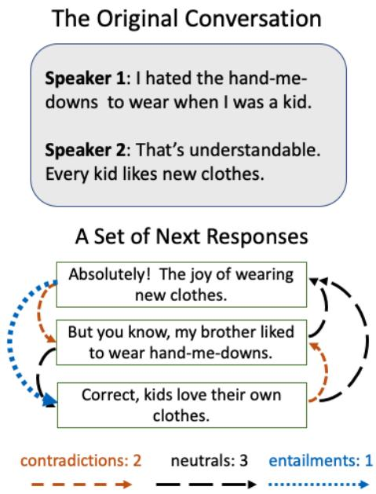
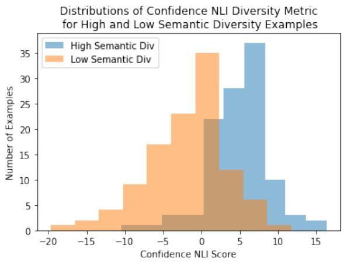
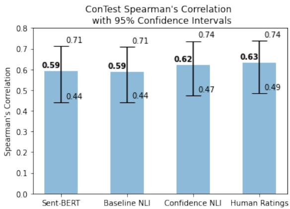
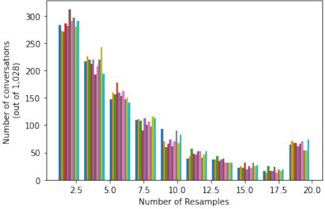

# Semantic Diversity in Dialogue with Natural Language Inference

Katherine Stasaski and Marti A. Hearst

UC Berkeley {katie\_stasaski, hearst}@berkeley.edu

## Abstract

Generating diverse, interesting responses to chitchat conversations is a problem for neural conversational agents. This paper makes two substantial contributions to improving diversity in dialogue generation. First, we propose a novel metric which uses Natural Language Inference (NLI) to measure the semantic diversity of a set of model responses for a conversation. We evaluate this metric using an established framework (Tevet and Berant, 2021) and find strong evidence indicating NLI Diversity is correlated with semantic diversity. Specifically, we show that the contradiction relation is more useful than the neutral relation for measuring this diversity and that incorporating the NLI model’s confidence achieves state-of-the-art results. Second, we demonstrate how to iteratively improve the semantic diversity of a sampled set of responses via a new generation procedure called Diversity Threshold Generation, which results in an average 137% increase in NLI Diversity compared to standard generation procedures.

## 1 Introduction

Dialogue models often struggle to produce engaging utterances in conversations, tending to generate responses which are common in the training data, such as “OK,” “Yeah,” or “I don’t know” (Li et al., 2016). While these responses are appropriate for a wide variety of contexts, their over-production can result in a dull conversation (See et al., 2019).

An evaluation task has emerged that consists of measuring the diversity of chitchat model responses over a test set. While some past work uses human evaluation to measure model response diversity according to engagingness, specificity, or interestingness (Li et al., 2016; See et al., 2019; Ghandeharioun et al., 2019), several automated metrics have also been proposed to measure diversity of model responses. Some metrics measure lexical diversity, typically via n-gram overlap (Li et al., 2016) or computing the BLEU score (Zhu et al., 2018) among model responses generated from the test set. Other past work attempts to measure semantic diversity via repurposing sentence similarity metrics (Tevet and Berant, 2021; Zhang et al., 2020a; Cer et al., 2017).

  
Figure 1: Illustration of NLI Diversity using human responses from DailyDialog++. Contradictions are weighted by 1, entailments by -1, and neutrals by 0, so the score is (2  1) + (3  0) + (1  1) = 1.

We propose a new metric aimed at measuring semantic diversity by leveraging a Natural Language Inference (NLI) model to score a set of multiple dialogue model responses for a single conversation, as illustrated in Figure 1. NLI is a three-way classification task to determine whether one sentence entails, contradicts, or is neutral toward a second sentence. We hypothesize that a diverse set of responses for a conversation captures contradictory ways one could respond, which can be measured by the NLI model. We aggregate the contradiction, neutral, and entailment predictions among pairs of responses from the set and combine the predictions into a new diversity metric, called NLI Diversity.

We additionally explore two modifications of NLI Diversity. First, because the neutral prediction may be indicative of diversity, we propose Neutral NLI Diversity, where neutral predictions are weighted the same as contradiction predictions. Second, since our Baseline NLI Diversity method does not take into account the confidence of the model’s prediction, we propose Confidence NLI Diversity, which aggregates the probability mass of the model’s predicted class instead of aggregating the number of predictions for each class.

We assess NLI Diversity using Tevet and Berant (2021)’s diversity metric evaluation framework, finding that NLI Diversity is highly correlated both with human judgments of diversity and with the diversity parameter, a gold standard diversity value used to generate the set of responses. Confidence NLI Diversity achieves state-of-the-art performance in terms of correlation with semantic diversity. Also, through an ablation study, we find positive, neutral, and negative correlations between human judgments and the number of contradiction, neutral, and entailment predictions, respectively.

We next explore the use of a dialogue model to generate a set of candidate responses with a minimum target level of semantic diversity, such as 10 Contradictions. Our new generation procedure, Diversity Threshold Generation, iteratively improves a set of model responses until this intended threshold is reached. If a set of sampled responses does not meet the intended threshold, the lowest-scoring response is thrown out and a new response is sampled until the diversity threshold is reached. We show this procedure results in a more diverse set of responses than the original sampled set, often with only a few resampled responses. Results of automated analysis shows relevancy is maintained from initial to final sets of responses.

In summary, our contributions are:

• A novel diversity metric, NLI Diversity, evaluated using Tevet and Berant (2021)’s framework, that measures semantic diversity and interrogates the relationship between Contradiction and Neutral predictions and diversity,

• Confidence NLI Diversity, a diversity metric which obtains state-of-the-art performance on semantic diversity,

• A new dialogue generation procedure, Diversity Threshold Generation, which continues sampling responses until an intended diversity threshold, defined using NLI Diversity, is reached,

• Experimental results indicating dialogue models are able to generate diverse responses using Diversity Threshold Generation with minimal loss in relevancy.

## 2 Related Work

Past work has explored lexical and semantic diversity metrics as well as ways of evaluating these metrics. We also draw from work in NLI and generating diverse sets of hypotheses.

## 2.1 Measuring Model Response Diversity

Traditionally, a model’s diversity has been measured in terms of its predictions over the test set (Li et al., 2016), which we call Test Set Diversity. In this setup, the model predicts one response for each conversation in the test set (containing n conversations), resulting in n predictions. The diversity measure is computed over these n predictions, resulting in a score over the entire test set.

The notion of diversity we investigate, however, measures the model’s ability to generate a set of responses for a single conversation (Zhang et al., 2019; Tevet and Berant, 2021), which we call Multi-Response Diversity. Instead of generating one response for each of the conversations in the test set, we evaluate a model’s ability to generate m responses for each of the n conversations.

As shown by Tevet and Berant (2021), metrics which have been proposed in the Test Set Diversity setting can still be applied in the Multi-Response Diversity setting, however, by treating each set of m responses as its own “test set” and averaging over the n total sets.

## 2.2 Diversity Metrics

Lexical diversity metrics measure differences in word choice, as opposed to diversity of content. Li et al. (2016) propose distinct-n, which measures the number of unique n-grams generated divided by the total number of n-grams generated in the Test Set Diversity setting. Some past work has applied this metric to the Multi-Response Diversity setting (Tevet and Berant, 2021). Cao and Clark (2017) propose examining the percent of unique responses over the test set. Other past work has proposed using BLEU score over a set of model responses in the Test Set Diversity setting (Zhu et al., 2018).

Semantic diversity metrics, on the other hand, compare diversity of the content present in each response. Many of these measures are adapted from semantic similarity scores, since lower similarity can indicate higher diversity (Tevet and Berant, 2021). BERTScore measures the similarity of BERT embeddings for each token in two sentences (Zhang et al., 2020a). Bert-STS assigns a score based on the semantic similarity of two sentences (Tevet and Berant, 2021). The Sent-BERT metric computes cosine similarity between BERT sentence embeddings (Reimers and Gurevych, 2019). Larson et al. (2019) propose identifying diverse paraphrases by identifying embedding outliers.

Other past work has used human evaluation to measure a model’s diversity. Li et al. (2016) ask humans to choose the better of two responses based on specificity to the past conversation. See et al. (2019) ask humans to rank dialogue responses on a variety of factors, including interestingness and inquisitiveness. Tevet and Berant (2021) compare participants’ ability to judge diversity of a set of responses in two ways: (i) by ranking one response as more diverse than a second response and (ii) by judging the diversity of a single response on a Likert scale, finding that participants were equally able to judge diversity in both conditions. They also find that human judges are better at distinguishing semantic diversity than lexical diversity.

Other past work has incorporated diversity metrics into the dialogue dataset creation pipeline. Stasaski et al. (2020) propose a method which measures the diversity of a crowdworker’s contributions compared to a corpus, using that information to determine when to stop collecting data from the worker. This results in a more diverse dataset.

## 2.3 Evaluation of Diversity Metrics

Tevet and Berant (2021) propose a framework to examine the reliability of diversity metrics. They propose the notion of a diversity parameter, which is used to generate a set of model responses, e.g., the p-value in nucleus sampling, which specifies the vocabulary probability distribution cutoff used to restrict sampling to the most-likely words whose combined likelihood $\geq p .$ If p is higher, the set of responses should have higher diversity, and viceversa. This diversity parameter is treated as a gold standard for a set of responses’ diversity. Diversity metrics assign scores in the Multi-Response Diversity condition and are evaluated in terms of correlation to the diversity parameter. They further propose two datasets to evaluate diversity metrics: one which includes model responses and contains varying levels of lexical diversity and one which is human-created and maintains high lexical diversity to allow focused evaluation of semantic diversity.

## 2.4 Natural Language Inference

Natural Language Inference is a task aimed at predicting whether one sentence contradicts, entails, or is neutral towards a second sentence. Models for NLI are typically trained using one of two datasets: Stanford Natural Language Inference (SNLI) (Bowman et al., 2015) or Multi-Genre NLI (MNLI) (Williams et al., 2018). More recent datasets include FEVER (Thorne et al., 2018; Nie et al., 2019), adapted from a fact-checking dataset, and ANLI (Nie et al., 2020), collected in an adversarial human-in-the-loop procedure. With the rise of transformer architectures, models have achieved high performance on NLI tasks (Liu et al., 2019).

In a dialogue setting, NLI has been used to improve consistency between a persona and model responses over the course of a conversation by integrating an NLI-based reward into a reinforcement learning training procedure (Song et al., 2020).

To our knowledge, however, NLI has not been used to measure the diversity of model responses in either the Test Set Diversity or the Multi-Response Diversity setting.

## 2.5 Generating Diverse Sets of Hypotheses

While work has only recently begun to explore the task of generating multiple dialogue responses to a conversation (Zhang et al., 2019; Tevet and Berant, 2021), past work has explored generating diverse sets of hypotheses in some other application areas. Carbonell and Goldstein (1998) explored using Maximal Mutual Relevance to reduce redundancy without sacrificing relevancy in document selection for summarization. Batra et al. (2012) proposed a greedy iterative algorithm to generate diverse, probable hypotheses for multiple vision tasks. Most related to our work is Gimpel et al. (2013), which applied Batra et al. (2012)’s approach to machine translation, generating a set of translations instead of a single translation. In contrast to Gimpel et al. (2013), by holding the sampling procedure constant throughout the iterative process, our method can explore the extent to which diversity can be increased without altering standard decoding practices.

```html
<sup>1</sup>https://huggingface.co/
roberta-large-mnli
<sup>2</sup>https://huggingface.co/ynie/
roberta-large-snli_mnli_fever_anli_R1_
R2_R3-nli
```

## 3 NLI Diversity Metric

We propose three diversity metrics in the Multi-Response Diversity setting which leverage the predictions of an NLI model. Two metrics (Baseline and Neutral) aggregate the NLI model’s class predictions and one metric (Confidence) aggregates the weight of these predictions.

## 3.1 Baseline NLI Diversity

We propose a new metric, called Baseline NLI Diversity, which uses an NLI model’s predictions to measure diversity. More formally, for a given conversation, c, and a dialogue generation model M, a set of utterances $u _ { 1 } , . . . , u _ { n }$ is produced by the model. Each pair of utterances is compared in both directions using an NLI model, $N L I ( u _ { 1 } , u _ { 2 } ) , N L I ( u _ { 2 } , u _ { 1 } ) , . . . , N L I ( u _ { n } , u _ { n - 1 } )$

The NLI model predicts a distribution over the three potential classes: contradiction, neutral, and entailment. We take the argmax over these classes, resulting in a list of NLI predictions, $N L I _ { p r e d s } ( N L I ( u _ { 1 } , u _ { 2 } ) , . . . , N L I ( u _ { n - 1 } , u _ { n } ) )$ of size $n ( n - 1 )$ . To produce an overall diversity score for $N L I _ { p r e d s } ( u _ { 1 } , . . . , u _ { n } )$ , we assign each of these classes a value representing their diversity, denoted $N L I _ { s c o r e } ( N L I _ { p r e d s } ( u _ { 1 } , . . . , u _ { n } ) )$

We hypothesize that larger numbers of entailment predictions found in a set of model-generated utterances is indicative of a lack of diversity; similarly, larger number of contradiction predictions is indicative of a larger amount of diversity. Because we want a higher value of $N L I _ { s c o r e }$ to indicate higher diversity, we assign values as:

$$
N L I _ { s c o r e } = \left\{ \begin{array} { l l } { { 1 } } & { { \mathrm { i f ~ c o n t r a d i c t i o n } } } \\ { { 0 } } & { { \mathrm { i f ~ n e u t r a l } } } \\ { { - 1 } } & { { \mathrm { i f ~ e n t a i l m e n t } } } \end{array} \right.
$$

The sum of the $N L I _ { s c o r e }$ values for the set of utterances results in the final NLI Diversity score, formally defined as:

$$
\begin{array} { l } { { \displaystyle B a s e l i n e ~ N L I D i v e r s i t y = } \ } \\ { { \displaystyle \sum _ { u _ { i } , u _ { j } \in u _ { 1 } , \dots , u _ { n } } N L I _ { s c o r e } ( N L I _ { p r e d } ( N L I ( u _ { i } , u _ { j } ) ) } } \end{array}
$$

While the Baseline NLI Diversity metric aggregates all classes, we also investigate the separate number of entailment, contradiction, and neutral predictions in $N L I _ { p r e d s }$ , denoted # Entailment, # Contradiction, and # Neutral, respectively.

## 3.2 Neutral NLI Diversity

Our primary hypothesis is that contradictions indicate diversity and entailments indicate lack of diversity. Because it is unclear what the role of neutrals might be, we explore a version of NLI Diversity which weights neutral and contradiction predictions as equally diverse. This metric is the same as Baseline NLI Diversity except the $N L I _ { s c o r e }$ used to assign values is:

$$
N L I _ { s c o r e \_ n e u t r a l } = \left\{ \begin{array} { l l } { { 1 } } & { { \mathrm { i f \ c o n t r a d i c t i o n } } } \\ { { 1 } } & { { \mathrm { i f \ n e u t r a l } } } \\ { { - 1 } } & { { \mathrm { i f \ e n t a i l m e n t } } } \end{array} \right.
$$

## 3.3 Confidence NLI Diversity

Because the prior two NLI Diversity metrics do not incorporate the confidence of the NLI model’s class predictions, we explore an additional metric which incorporates this value. Letting con $f _ { c l a s s } ( u _ { 1 } , u _ { 2 } )$ represent the model’s probability mass assigned to the predicted NLI class after sof tmax, the function is defined as: NLI<sub>score\_confidence</sub> =

$$
\left\{ \begin{array} { l l } { 1 \times c o n f _ { c o n } ( u _ { 1 } , u _ { 2 } ) } & { \mathrm { i f ~ c o n t r a d i c t i o n } } \\ { 0 } & { \mathrm { i f ~ n e u t r a l } } \\ { - 1 \times c o n f _ { e n t } ( u _ { 1 } , u _ { 2 } ) } & { \mathrm { i f ~ e n t a i l m e n t } } \end{array} \right.
$$

Intuitively, instead of assigning a 1 value for a contradiction prediction, this metric assigns the probability of the contradiction class. Likewise, instead of a -1 for an entailment prediction, this metric assigns the negative probability mass of the entailment class.

## 4 Evaluation of NLI Diversity

We evaluate NLI Diversity by computing the correlation between the metric and both human labels and diversity parameter labels. Below we first describe the models and data and then present the results of the evaluation.

## 4.1 Models

We explore two NLI models: a Roberta-large model (Liu et al., 2019) fine-tuned on the Multi-Genre NLI (MNLI) Corpus (Williams et al., 2018)<sup>1</sup> and a Roberta-large model fine-tuned on a combination of MNLI, SNLI, FEVER, and $\mathrm { \bf A N L I } ^ { 2 }$ , both containing 300M parameters. We refer to these models as NLI Diversity – MNLI and NLI Diversity – Combined, respectively. We do not employ additional fine-tuning of these models.

<table><tr><td>decTest Examples: temp 0.28</td><td>Mixed Lexical Diversity; Mixed Semantic Diversity; Model Generated</td></tr><tr><td>temp 0.55</td><td>&quot;I think he is the most awe- some guy ever&quot; “He is the most awesome guy ever&quot; “The unemployment rate is lower than what it is&quot;</td></tr><tr><td>conTest</td><td>&quot;No but it does make it more likely to be higher than what it is&quot; High Lexical Diversity;</td></tr><tr><td>Examples: high lexical</td><td>Mixed Semantic Diversity; Human Generated “Sorry, but I don&#x27;t agree.&quot;</td></tr><tr><td>and low semantic</td><td>“I think you are wrong about that.&quot; “Dont be so judgemental, try</td></tr><tr><td>high lexical things her way.&quot; and tic</td><td>to see high seman- “You are right that is insane.&quot;</td></tr></table>

Table 1: Descriptions of diversity datasets from Tevet and Berant (2021). Corresponding temperature parameter (higher is more diverse) or semantic and lexical diversity levels accompany each example.

## 4.2 Data

There are two different English datasets released to evaluate diversity metrics in Tevet and Berant (2021): conTest and decTest, described in Table 1. The conTest dataset is human-created and captures content, or semantic, diversity independent of lexical diversity. Low-diversity examples in this dataset have high lexical diversity but low semantic diversity. This dataset was created by asking crowdworkers to generate sets of utterances with either low or high semantic diversity using varied language, in order to keep a high level of lexical diversity constant across both conditions.

The decTest dataset includes model-generated responses, with diversity controlled by a decoding parameter, such as a temperature parameter. The dataset can include duplicate responses, and does not attempt to mediate lexical diversity; therefore, low-diversity examples in this dataset may reflect low lexical as well as low semantic diversity.

While the original dataset includes multiple generation tasks, we evaluate on the dialogue task, respGen, which is drawn from Reddit conversations (Hashimoto et al., 2019)<sup>3</sup>. There are 200 conversations for each of conTest and decTest for the respGen task, with multiple responses for each conversation (5 for conTest, 10 for decTest).

## 4.3 Diversity Parameter Correlation

The diversity parameter from Tevet and Berant (2021) represents either a parameter directly used to generate responses via a dialogue model, such as p in nucleus sampling, or a binary value indicating whether crowdworkers were instructed to generate a high- or low-diversity set of responses. A measure which is able to capture diversity will be positively correlated with this diversity parameter.

Table 2 shows Spearman’s correlations between NLI Diversity and the diversity parameter. On the conTest semantic diversity dataset, Confidence NLI Diversity achieves the highest correlation of all metrics (0.62) and approaches human performance. Baseline NLI Diversity performs comparably to the top-performing automatic metric from Tevet and Berant (2021), at 0.59 correlation. We note the 95% confidence intervals overlaps between Baseline NLI Diversity, Confidence NLI Diversity, Sent-BERT, and human judgements, indicating a lack of significant differences (see Appendix A). Although Neutral NLI Diversity does relatively poorly on conTest (0.24), it is the highest-performing NLI metric on decTest (0.72), suggesting that incorporating neutral predictions may capture lexical instead of semantic diversity.

A histogram of Confidence NLI Diversity values for low and high semantic diversity sets of responses is shown in Figure 2. We note the lack of large overlap between the distributions of low and high semantic diversity data. In addition to the correlation results in Sections 4.3 and 4.4, this result indicates the Confidence NLI Diversity metric distinguishes between low and high semantic diversity.

<table><tr><td rowspan=1 colspan=2>Metric</td><td rowspan=1 colspan=1>decTestρ</td><td rowspan=1 colspan=1>conTest $\rho$ </td></tr><tr><td rowspan=1 colspan=2>HumanPerformance (ab-sHDS)</td><td rowspan=1 colspan=1>0.81</td><td rowspan=1 colspan=1>0.63</td></tr><tr><td rowspan=1 colspan=2>distinct-n</td><td rowspan=1 colspan=1>0.89</td><td rowspan=2 colspan=1>0.340.33</td></tr><tr><td rowspan=1 colspan=2>cos-sim</td><td rowspan=1 colspan=1>0.89</td></tr><tr><td rowspan=3 colspan=2>BERT-STSSent-BERTBERTScore</td><td rowspan=1 colspan=1></td><td rowspan=1 colspan=1>0.81</td></tr><tr><td rowspan=1 colspan=1>0.80</td><td rowspan=1 colspan=1>0.59</td></tr><tr><td rowspan=1 colspan=1>0.87</td><td rowspan=1 colspan=1>0.49</td></tr><tr><td rowspan=1 colspan=2>Baseline NLI Diversity –MNLIBaseline NLI Diversity -Combined</td><td rowspan=1 colspan=1>0.580.39</td><td rowspan=1 colspan=1>0.590.59</td></tr><tr><td rowspan=2 colspan=2>Neutral NLI DiversityConfidence NLI Diversity</td><td rowspan=1 colspan=1>0.72</td><td rowspan=2 colspan=1>0.240.62</td></tr><tr><td rowspan=1 colspan=1>0.44</td></tr></table>

Table 2: Spearman’s ρ correlations between NLI Diversity metrics and the diversity parameter. Results above the double line are reproduced from Tevet and Berant (2021). Both the best automatic metric and human performance for each dataset are in boldface.

The higher correlation to the diversity parameter leads us to choose NLI Diversity - MNLI instead of Combined for all further experimentation.

## 4.4 Human Correlation

In this subsection, we examine the NLI Diversity metric’s correlation to the human annotations collected by Tevet and Berant (2021). Each set of responses in conTest and decTest is scored by 10 annotators from 1 (not diverse at all) to 5 (very diverse) with half-point increments. We compute correlation with respect to the averaged rating.

In addition to NLI Diversity, we explore the prediction counts for each category. We expect that a higher # Entailment value will be negatively correlated with diversity because the more pairs of responses that entail each other, the more similar the set of responses is. Similarly, we expect that a higher # Contradiction value will be positively correlated with diversity. Since the NLI Diversity metric incorporates both # Entailment and # Contradiction, we would expect this metric to be highly correlated with human judgments as well.

  
Figure 2: Histogram of Confidence NLI Diversity for high and low semantic diversity examples.

<table><tr><td rowspan=1 colspan=1>Metric</td><td rowspan=1 colspan=1>decTestρ</td><td rowspan=1 colspan=1>conTestρ</td></tr><tr><td rowspan=1 colspan=1>Baseline NLI Diver-sityNeutral NLI Diver-sityConfidence NLI Di-versity</td><td rowspan=1 colspan=1>0.480.690.41</td><td rowspan=1 colspan=1>0.630.400.64</td></tr><tr><td rowspan=3 colspan=1># Contradiction# Neutral# Entailment</td><td rowspan=1 colspan=1>0.26</td><td rowspan=1 colspan=1>0.46</td></tr><tr><td rowspan=1 colspan=1>0.05</td><td rowspan=1 colspan=1>-0.08</td></tr><tr><td rowspan=1 colspan=1>-0.48</td><td rowspan=1 colspan=1>-0.65</td></tr></table>

Table 3: Spearman’s $\rho$ correlation between NLI Diversity metrics (MNLI) and human judgments. Negative values indicate higher $\#$ Entailment is negatively correlated with diversity.

Spearmean’s $\rho$ rank correlation results between our metrics and the human diversity scores are shown in Table 3. The highest-performing correlation for lexical diversity is the Neutral NLI Diversity (0.69). The highest-performing semantic diversity correlation is Confidence NLI Diversity (0.64). Additionally, Baseline and Confidence NLI Diversity correlations are stronger when evaluating with the conTest dataset than the decTest dataset (an increase of 0.48 to 0.63 for Baseline MNLI and 0.41 to 0.64 for Confidence NLI), indicating these metrics are more correlated with human ratings of semantic diversity than lexical diversity.

Across both datasets, # Entailment is negatively correlated with diversity, # Neutral does not have a strong correlation, and # Contradiction is positively correlated, as hypothesized. This supports our motivation to use NLI as a diversity metric.

## 5 Diversity Threshold Generation

We have verified that NLI Diversity is both able to capture semantic diversity and aligns with human judgements. We can additionally use NLI Diversity to define a straightforward desired diversity threshold, $d i v _ { t h r e s h }$ for a set of model-generated responses, $u _ { 1 } , . . . , u _ { n } .$ . For example, we might intend there to be 10 Contradictions within the set. We propose a generation procedure, Diversity Threshold Generation, designed to iteratively increase the diversity of a set of responses for a conversation.

For a conversation, Diversity Threshold Generation begins by sampling n responses. We score the diversity of these responses using a diversity metric, div\_metri $\mathsf { c } ( u _ { 1 } , . . . , u _ { n } )$ . If the diversity score falls above $d i v _ { t h r e s h }$ , the process is finished.

If, however, the score falls below $d i v _ { t h r e s h }$ we identify the model response which contributes least to the diversity score by calculating $d i v \_ m e t r i c ( u _ { 1 } , . . . , u _ { n - 1 } )$ for each sub-group of model responses of size $n - 1$ . We discard the model response not present in the highestscoring subgroup and resample a new response. We re-calculate $d i v _ { - } m e t r i c ( u _ { 1 } , . . . , u _ { n } )$ and if div\_metric $( u _ { 1 } , . . . , u _ { n } ) > d i v _ { t h r e s h }$ , the process finishes. We continue resampling until the maximum cutoff of S is reached.

## 6 Evaluation of Diversity Threshold Generation Method

## 6.1 Models and Datasets

We experiment with two neural dialogue models, DialoGPT (700M parameters) (Zhang et al., $2 0 2 0 \mathrm { b } ) ^ { 4 }$ and BlenderBot 1.0 (300M parameters) (Roller et al., 2021)<sup>5</sup>. We use the default Transformers implementation for each model (Wolf et al., 2020) and do not fine-tune them. Runtime was between 3 and 36 hours on one Titan-X GPU.

All experiments involve the dialogue model M generating 5 responses for each conversation. The maximum number of samples, S, is set to 20. All experiments are averaged over 10 trials for stability.

We evaluate each model on the development set of two public English conversational datasets : DailyDialog++ (1,028 conversations) (Sai et al., 2020;

Li et al., 2017) and EmpatheticDialogues (2,763 conversations) (Rashkin et al., 2019). DailyDialog++ includes 5 human-written responses per conversation, allowing for multi-reference comparison. We split each EmpatheticDialogues conversation at a random turn (consistent for all experiments) for generation. Since BlenderBot supports up to 128 positional embeddings, we pass in the last 128 tokens of the conversation for this condition.

## 6.2 Metrics

We evaluate three diversity metrics: two semantic diversity metrics, Baseline NLI Diversity (Section 3) and Sent-BERT (Reimers and Gurevych, 2019; Tevet and Berant, 2021), and one lexical diversity metric, distinct-n (Li et al., 2016; Tevet and Berant, 2021). For Sent-BERT, we compute the average negative cosine similarity between BERT sentence embeddings for each pair of responses. Like Tevet and Berant (2021), for distinct-n, we compute the average distinct n-grams from $n \in { 1 , 2 , 3 , 4 , 5 }$

Because Baseline NLI Diversity is more humaninterpretable than Confidence NLI Diversity, we use this version for experimentation. For all NLI Diversity experiments, $d i v _ { t h r e s h }$ is achieved when # Contradictions is greater than 10 out of a total of 20 pair-wise comparisons. For both Sent-BERT and distinct-n, however, we do not have a humanspecifiable threshold. We use empirical thresholds measured from the sets of 5 human responses for each conversation in DailyDialog++. We choose the 90th percentile for $d i v _ { t h r e s h }$ (0.98 and -0.179 for distinct-n and Sent-BERT, respectively).

We decode using nucleus sampling $( p = 0 . 9 )$ as it has been shown to increase response diversity (Holtzman et al., 2020). However our method could be applied with other decoding procedures.

In order to robustly evaluate Diversity Threshold Generation, we measure both (i) whether Diversity Threshold Generation is able to generate more diverse sets of responses than was originally sampled and (ii) whether the increased diversity comes at the expense of decreased relevancy of the responses.

## 6.3 Diversity Results

We aim to measure whether the diversity of the 5 responses from M increases using Diversity Threshold Generation, compared to the initial 5 sampled responses. Diversity of the starting and ending sets of utterances is measured by Baseline NLI Diversity, distinct-n, or Sent-BERT. We also report the number of sampled utterances required to reach $d i v _ { t h r e s h }$

<table><tr><td rowspan=1 colspan=1>Met-ric</td><td rowspan=1 colspan=1>Mo-del</td><td rowspan=1 colspan=1>Data-set</td><td rowspan=1 colspan=1>Start-ingDiv.</td><td rowspan=1 colspan=1>End-ingDiv.</td><td rowspan=1 colspan=1>Num.Sam-pled</td></tr><tr><td rowspan=4 colspan=1>BaslineIIN</td><td rowspan=4 colspan=1>DGBB</td><td rowspan=4 colspan=1>DailyEmpDailyEmp</td><td rowspan=2 colspan=1>4.113.68</td><td rowspan=1 colspan=1>10.24</td><td rowspan=1 colspan=1>6.3</td></tr><tr><td rowspan=1 colspan=1>10.11</td><td rowspan=1 colspan=1>7.1</td></tr><tr><td rowspan=2 colspan=1>-5.55-8.90</td><td rowspan=1 colspan=1>2.51</td><td rowspan=1 colspan=1>14.4</td></tr><tr><td rowspan=1 colspan=1>-1.72</td><td rowspan=1 colspan=1>16.5</td></tr><tr><td rowspan=4 colspan=1>Dinnnc-n</td><td rowspan=4 colspan=1>DGBB</td><td rowspan=4 colspan=1>DailyEmpDailyEmp</td><td rowspan=2 colspan=1>0.950.43</td><td rowspan=1 colspan=1>0.98</td><td rowspan=1 colspan=1>5.4</td></tr><tr><td rowspan=1 colspan=1>0.52</td><td rowspan=3 colspan=1>20.020.020.0</td></tr><tr><td rowspan=2 colspan=1>0.610.52</td><td rowspan=1 colspan=1>0.80</td></tr><tr><td rowspan=1 colspan=1>0.71</td></tr><tr><td rowspan=4 colspan=1>Sent-BERT</td><td rowspan=4 colspan=1>DGBB</td><td rowspan=4 colspan=1>DailyEmpDailyEmp</td><td rowspan=2 colspan=1>-0.26-0.28</td><td rowspan=1 colspan=1>-0.16</td><td rowspan=1 colspan=1>5.2</td></tr><tr><td rowspan=1 colspan=1>-0.16</td><td rowspan=1 colspan=1>5.8</td></tr><tr><td rowspan=2 colspan=1>-0.62-0.71</td><td rowspan=1 colspan=1>-0.40</td><td rowspan=1 colspan=1>19.0</td></tr><tr><td rowspan=1 colspan=1>-0.52</td><td rowspan=1 colspan=1>19.7</td></tr></table>

Table 4: Diversity results of using Diversity Threshold Generation (with a div of 10 # Contradictions for NLI, 0.98 for distinct-n, and -0.164 for Sent-BERT). Num. sampled has a maximum value of 20; DG is the DialogGPT model; BB is BlenderBot.

Results for Diversity Threshold Generation are shown in Table 4. For every condition, we see an increase from starting to ending diversity; for NLI Diversity, this results in an average 137% increase. For most conditions, distinct-n requires more samples than Sent-BERT and Baseline NLI Diversity.

We can use the results of Diversity Threshold Generation to probe differences in the models. In our experimental setup, DialoGPT generates more diverse utterances across all conditions than BlenderBot. The models change by similar proportions from starting to ending diversity using the NLI metric. However, the starting diversity for BlenderBot is far lower than DialoGPT; the negative value for BlenderBot indicates that a large number of entailment predictions were present in the starting response set.

We can also examine differences between the datasets. For instance, we observe lower starting diversities for the Empathetic Dialogues dataset than for DailyDialog++ for both models. Additionally, the number of samples required for EmpatheticDialogues is consistently higher than for DailyDialog++. This is likely because $d i v _ { t h r e s h }$ for both datasets was calculated using human responses from DailyDialog++, since EmpatheticDialogues does not include multiple human responses.

Sampled responses can be seen in Appendix B and results reporting the average overlap from starting to ending sets of responses is in Appendix C. Appendix D includes results using beam search instead of nucleus sampling, and Appendix E reports the stability of Diversity Threshold Generation.

## 6.4 Relevance Results

Since past work has documented a tradeoff between diversity and relevancy (Zhang et al., 2018), we also report results for the relevancy of the starting and ending sets of responses for Diversity Threshold Generation. We use two established relevancy metrics: BLEU Score (Papineni et al., 2002)<sup>6</sup> and BERTScore (Zhang et al., 2020a)<sup>7</sup>. We show results on DailyDialog++, which has multiple human-generated responses for comparison, which is more correlated to human judgements than single-reference evaluation (Gupta et al., 2019).

Results are shown in Table 5. The key takeaway is that the relevancy values remain virtually unchanged when using the Diversity Threshold Generation procedure, according to both BLEU score and BERTScore. The average percent difference is 0.08% for BertScore and 1.1% for BLEU.

## 7 Discussion

Limitations. While NLI Diversity is highlycorrelated with human judgements of diversity, it is limited by the NLI model chosen. Compared to Sent-BERT, the dataset used to train the NLI model is limited in scope. While our experiments showed that an NLI model trained on more datasets (Combined) did not perform better than MNLI, future work can more explicitly explore the effect of more generalized data on NLI Diversity.

This work is limited by automatic evaluation metrics for diversity and relevance. Future work should conduct additional human validation of model responses. More work could also be done to examine cases where the model was not able to generate diverse set, such as when humans also find creating a diverse set of responses difficult.

Future Work. Our results showed Confidence NLI Diversity was highly correlated with both human judgements and the diversity parameter, achieving state-of-the-art performance on a semantic diversity dataset. The ablation study deepened this finding, showing that NLI contradiction predictions are especially correlated with diversity. Future work can leverage this finding, e.g., by wording crowdworker instructions to ask for generation contradictory, rather than diverse, responses.

<table><tr><td rowspan=1 colspan=1>Metric</td><td rowspan=1 colspan=1>Model</td><td rowspan=1 colspan=1>StartingBERTScore</td><td rowspan=1 colspan=1>EndingBERTScore</td><td rowspan=1 colspan=1>Start-ingBLEU</td><td rowspan=1 colspan=1>End-ingBLEU</td></tr><tr><td rowspan=1 colspan=1>NLI</td><td rowspan=1 colspan=1>DGBB</td><td rowspan=1 colspan=1>0.8620.868</td><td rowspan=1 colspan=1>0.8620.867</td><td rowspan=1 colspan=1>0.3170.367</td><td rowspan=1 colspan=1>0.3180.368</td></tr><tr><td rowspan=1 colspan=1>Distinct-n</td><td rowspan=1 colspan=1>DGBB</td><td rowspan=1 colspan=1>0.8620.867</td><td rowspan=1 colspan=1>0.8610.867</td><td rowspan=1 colspan=1>0.3190.366</td><td rowspan=1 colspan=1>0.3060.367</td></tr><tr><td rowspan=1 colspan=1>Sent-BERT</td><td rowspan=1 colspan=1>DGBB</td><td rowspan=1 colspan=1>0.8630.868</td><td rowspan=1 colspan=1>0.8620.867</td><td rowspan=1 colspan=1>0.3180.366</td><td rowspan=1 colspan=1>0.3130.366</td></tr></table>

Table 5: Results comparing starting and ending sets of responses from Diversity Threshold Generation to sets of human responses using two relevancy metrics, BERTScore and BLEU score.

Our results also show that dialogue generation models are able to improve the diversity of a sampled sets of responses using Diversity Threshold Generation. Diversity Threshold Generation can be used to evaluate future models’ capacity to generate multiple diverse responses.

Future work should compare the resulting diverse responses in a conversational context. Studies could be conducted where chatbot users or dialogue writers can choose the way they want the model to respond, similar to Clark and Smith (2021).

## 8 Conclusion

We propose a novel semantic diversity metric, NLI Diversity, which is highly correlated to human judgments. Confidence NLI Diversity achieves state-ofthe-art results on measuring semantic diversity. We propose Diversity Threshold Generation to incentivize production of diverse sets of responses for a conversation. This results in more diverse sets of responses than originally sampled for multiple models, datasets, and metrics while maintaining relevancy, and can also be used to investigate a model’s ability to produce diverse responses.

## Acknowledgements

This work was supported by an AWS Machine Learning Research Award, an NVIDIA Corporation GPU grant, an AI2 Key Scientific Challenge

Proposal grant, and a National Science Foundation (NSF) Graduate Research Fellowship (DGE 1752814). We thank the anonymous ARR reviewers as well as Philippe Laban, Dongyeop Kang, Nate Weinman, and the Hearst Lab Research Group for their helpful comments.

## References

Dhruv Batra, Payman Yadollahpour, Abner Guzman-Rivera, and Gregory Shakhnarovich. 2012. Diverse m-best solutions in markov random fields. In Computer Vision – ECCV 2012, pages 1–16, Berlin, Heidelberg. Springer Berlin Heidelberg.

Samuel R. Bowman, Gabor Angeli, Christopher Potts, and Christopher D. Manning. 2015. A large annotated corpus for learning natural language inference. In Proceedings of the 2015 Conference on Empirical Methods in Natural Language Processing, pages 632–642, Lisbon, Portugal. Association for Computational Linguistics.

Kris Cao and Stephen Clark. 2017. Latent variable dialogue models and their diversity. In Proceedings of the 15th Conference of the European Chapter of the Association for Computational Linguistics: Volume 2, Short Papers, pages 182–187, Valencia, Spain. Association for Computational Linguistics.

Jaime Carbonell and Jade Goldstein. 1998. The use of mmr, diversity-based reranking for reordering documents and producing summaries. In Proceedings of the 21st Annual International ACM SIGIR Conference on Research and Development in Information Retrieval, SIGIR ’98, page 335–336, New York, NY, USA. Association for Computing Machinery.

Daniel Cer, Mona Diab, Eneko Agirre, Iñigo Lopez-Gazpio, and Lucia Specia. 2017. SemEval-2017 task 1: Semantic textual similarity multilingual and crosslingual focused evaluation. In Proceedings of the 11th International Workshop on Semantic Evaluation (SemEval-2017), pages 1–14, Vancouver, Canada. Association for Computational Linguistics.

Elizabeth Clark and Noah A. Smith. 2021. Choose your own adventure: Paired suggestions in collaborative writing for evaluating story generation models. In Proceedings of the 2021 Conference of the North American Chapter of the Association for Computational Linguistics: Human Language Technologies, pages 3566–3575, Online. Association for Computational Linguistics.

Asma Ghandeharioun, Judy Hanwen Shen, Natasha Jaques, Craig Ferguson, Noah Jones, Agata Lapedriza, and Rosalind Picard. 2019. Approximating interactive human evaluation with self-play for open-domain dialog systems. In Proceedings of the 33rd International Conference on Neural Information Processing Systems, Red Hook, NY, USA. Curran Associates Inc.

Kevin Gimpel, Dhruv Batra, Chris Dyer, and Gregory Shakhnarovich. 2013. A systematic exploration of diversity in machine translation. In Proceedings of the 2013 Conference on Empirical Methods in Natural Language Processing, pages 1100–1111, Seattle, Washington, USA. Association for Computational Linguistics.

Prakhar Gupta, Shikib Mehri, Tiancheng Zhao, Amy Pavel, Maxine Eskenazi, and Jeffrey Bigham. 2019. Investigating evaluation of open-domain dialogue systems with human generated multiple references. In Proceedings of the 20th Annual SIGdial Meeting on Discourse and Dialogue, pages 379–391, Stockholm, Sweden. Association for Computational Linguistics.

Tatsunori B. Hashimoto, Hugh Zhang, and Percy Liang. 2019. Unifying human and statistical evaluation for natural language generation. In Proceedings of the 2019 Conference of the North American Chapter of the Association for Computational Linguistics: Human Language Technologies, Volume 1 (Long and Short Papers), pages 1689–1701, Minneapolis, Minnesota. Association for Computational Linguistics.

Ari Holtzman, Jan Buys, Li Du, Maxwell Forbes, and Yejin Choi. 2020. The curious case of neural text degeneration. In International Conference on Learning Representations.

Stefan Larson, Anish Mahendran, Andrew Lee, Jonathan K. Kummerfeld, Parker Hill, Michael A. Laurenzano, Johann Hauswald, Lingjia Tang, and Jason Mars. 2019. Outlier detection for improved data quality and diversity in dialog systems. In Proceedings of the 2019 Conference of the North American Chapter of the Association for Computational Linguistics: Human Language Technologies, Volume 1 (Long and Short Papers), pages 517–527, Minneapolis, Minnesota. Association for Computational Linguistics.

Jiwei Li, Michel Galley, Chris Brockett, Jianfeng Gao, and Bill Dolan. 2016. A diversity-promoting objective function for neural conversation models. In Proceedings of the 2016 Conference of the North

American Chapter of the Association for Computational Linguistics: Human Language Technologies, pages 110–119, San Diego, California. Association for Computational Linguistics.

Yanran Li, Hui Su, Xiaoyu Shen, Wenjie Li, Ziqiang Cao, and Shuzi Niu. 2017. DailyDialog: A manually labelled multi-turn dialogue dataset. In Proceedings ofthe Eighth International Joint Conference on Natural Language Processing (Volume 1: Long Papers), pages 986–995, Taipei, Taiwan. Asian Federation of Natural Language Processing.

Yinhan Liu, Myle Ott, Naman Goyal, Jingfei Du, Mandar Joshi, Danqi Chen, Omer Levy, Mike Lewis, Luke Zettlemoyer, and Veselin Stoyanov. 2019. Roberta: A robustly optimized bert pretraining approach. arXiv preprint arXiv:1907.11692.

Yixin Nie, Haonan Chen, and Mohit Bansal. 2019. Combining fact extraction and verification with neural semantic matching networks. In Association for the Advancement ofArtificial Intelligence (AAAI).

Yixin Nie, Adina Williams, Emily Dinan, Mohit Bansal, Jason Weston, and Douwe Kiela. 2020. Adversarial NLI: A new benchmark for natural language understanding. In Proceedings of the 58th Annual Meeting of the Association for Computational Linguistics, pages 4885–4901, Online. Association for Computational Linguistics.

Kishore Papineni, Salim Roukos, Todd Ward, and Wei-Jing Zhu. 2002. Bleu: A method for automatic evaluation of machine translation. In Proceedings ofthe 40th Annual Meeting on Association for Computational Linguistics, ACL ’02, page 311–318, USA. Association for Computational Linguistics.

Hannah Rashkin, Eric Michael Smith, Margaret Li, and Y-Lan Boureau. 2019. Towards empathetic opendomain conversation models: A new benchmark and dataset. In Proceedings of the 57th Annual Meeting of the Association for Computational Linguistics, pages 5370–5381, Florence, Italy. Association for Computational Linguistics.

Nils Reimers and Iryna Gurevych. 2019. Sentence-BERT: Sentence embeddings using Siamese BERTnetworks. In Proceedings ofthe 2019 Conference on Empirical Methods in Natural Language Processing and the 9th International Joint Conference on Natural Language Processing (EMNLP-IJCNLP), pages 3982–3992, Hong Kong, China. Association for Computational Linguistics.

Stephen Roller, Emily Dinan, Naman Goyal, Da Ju, Mary Williamson, Yinhan Liu, Jing Xu, Myle Ott, Eric Michael Smith, Y-Lan Boureau, and Jason Weston. 2021. Recipes for building an open-domain chatbot. In Proceedings of the 16th Conference of the European Chapter of the Association for Computational Linguistics: Main Volume, pages 300–325, Online. Association for Computational Linguistics.

Ananya B. Sai, Akash Kumar Mohankumar, Siddhartha Arora, and Mitesh M. Khapra. 2020. Improving dialog evaluation with a multi-reference adversarial dataset and large scale pretraining. Transactions of the Association for Computational Linguistics, 8:810–827.

Abigail See, Stephen Roller, Douwe Kiela, and Jason Weston. 2019. What makes a good conversation? how controllable attributes affect human judgments. In Proceedings of the 2019 Conference of the North American Chapter of the Association for Computational Linguistics: Human Language Technologies, Volume 1 (Long and Short Papers), pages 1702–1723, Minneapolis, Minnesota. Association for Computational Linguistics.

Haoyu Song, Wei-Nan Zhang, Jingwen Hu, and Ting Liu. 2020. Generating persona consistent dialogues by exploiting natural language inference. In The Thirty-Fourth AAAI Conference on Artificial Intelligence, AAAI 2020, The Thirty-Second Innovative Applications ofArtificial Intelligence Conference, IAAI 2020, The Tenth AAAI Symposium on Educational Advances in Artificial Intelligence, EAAI 2020, New York, NY, USA, February 7-12, 2020, pages 8878– 8885. AAAI Press.

Katherine Stasaski, Grace Hui Yang, and Marti A. Hearst. 2020. More diverse dialogue datasets via diversity-informed data collection. In Proceedings of the 58th Annual Meeting of the Association for Computational Linguistics, pages 4958–4968, Online. Association for Computational Linguistics.

Guy Tevet and Jonathan Berant. 2021. Evaluating the evaluation of diversity in natural language generation. In Proceedings of the 16th Conference of the European Chapter of the Association for Computational Linguistics: Main Volume, pages 326–346, Online. Association for Computational Linguistics.

James Thorne, Andreas Vlachos, Christos Christodoulopoulos, and Arpit Mittal. 2018. FEVER: a large-scale dataset for fact extraction and VERification. In Proceedings of the 2018 Conference of the North American Chapter of the Association for Computational Linguistics: Human Language Technologies, Volume 1 (Long Papers), pages 809–819, New Orleans, Louisiana. Association for Computational Linguistics.

Adina Williams, Nikita Nangia, and Samuel Bowman. 2018. A broad-coverage challenge corpus for sentence understanding through inference. In Proceedings of the 2018 Conference of the North American Chapter of the Association for Computational Linguistics: Human Language Technologies, Volume 1 (Long Papers), pages 1112–1122. Association for Computational Linguistics.

Thomas Wolf, Lysandre Debut, Victor Sanh, Julien Chaumond, Clement Delangue, Anthony Moi, Pierric Cistac, Tim Rault, Remi Louf, Morgan Funtowicz, Joe Davison, Sam Shleifer, Patrick von Platen,

Clara Ma, Yacine Jernite, Julien Plu, Canwen Xu, Teven Le Scao, Sylvain Gugger, Mariama Drame, Quentin Lhoest, and Alexander Rush. 2020. Transformers: State-of-the-art natural language processing. In Proceedings of the 2020 Conference on Empirical Methods in Natural Language Processing: System Demonstrations, pages 38–45, Online. Association for Computational Linguistics.

Tianyi Zhang, Varsha Kishore, Felix Wu, Kilian Q. Weinberger, and Yoav Artzi. 2020a. Bertscore: Evaluating text generation with BERT. In 8th International Conference on Learning Representations, ICLR 2020, Addis Ababa, Ethiopia, April 26-30, 2020. OpenReview.net.

Xinyuan Zhang, Yi Yang, Siyang Yuan, Dinghan Shen, and Lawrence Carin. 2019. Syntax-infused variational autoencoder for text generation. In Proceedings of the 57th Annual Meeting of the Association for Computational Linguistics, pages 2069–2078, Florence, Italy. Association for Computational Linguistics.

Yizhe Zhang, Michel Galley, Jianfeng Gao, Zhe Gan, Xiujun Li, Chris Brockett, and Bill Dolan. 2018. Generating informative and diverse conversational responses via adversarial information maximization. In Proceedings of the 32nd International Conference on Neural Information Processing Systems, NIPS’18, page 1815–1825, Red Hook, NY, USA. Curran Associates Inc.

Yizhe Zhang, Siqi Sun, Michel Galley, Yen-Chun Chen, Chris Brockett, Xiang Gao, Jianfeng Gao, Jingjing Liu, and Bill Dolan. 2020b. DIALOGPT : Largescale generative pre-training for conversational response generation. In Proceedings of the 58th Annual Meeting of the Association for Computational Linguistics: System Demonstrations, pages 270– 278, Online. Association for Computational Linguistics.

Yaoming Zhu, Sidi Lu, Lei Zheng, Jiaxian Guo, Weinan Zhang, Jun Wang, and Yong Yu. 2018. Texygen: A Benchmarking Platform for Text Generation Models, page 1097–1100. Association for Computing Machinery, New York, NY, USA.

  
Figure 3: Spearman’s Correlation with 95% Confidence Intervals.

<table><tr><td rowspan=1 colspan=1>Metric</td><td rowspan=1 colspan=1>Model</td><td rowspan=1 colspan=1>Dataset</td><td rowspan=1 colspan=1>UtteranceOverlap</td></tr><tr><td rowspan=1 colspan=1>IIN</td><td rowspan=1 colspan=1>DGBB</td><td rowspan=1 colspan=1>DailyEmpDailyEmp</td><td rowspan=1 colspan=1>2.632.421.781.73</td></tr><tr><td rowspan=1 colspan=1>Disnc- n</td><td rowspan=1 colspan=1>DGBB</td><td rowspan=1 colspan=1>DailyEmpDailyEmp</td><td rowspan=1 colspan=1>2.890.871.511.65</td></tr><tr><td rowspan=4 colspan=1>SentBERT</td><td rowspan=4 colspan=1>DGBB</td><td rowspan=2 colspan=1>DailyEmp</td><td rowspan=1 colspan=1>3.11</td></tr><tr><td rowspan=1 colspan=1>3.0</td></tr><tr><td rowspan=2 colspan=1>DailyEmp</td><td rowspan=1 colspan=1>1.56</td></tr><tr><td rowspan=1 colspan=1>1.64</td></tr></table>

Table 6: Average utterance overlap from starting to ending set of responses using Diversity Threshold Generation on multiple models, datasets, and diversity metrics.

## A Confidence Interval Analysis

We perform experimentation using bootstrapping to determine confidence intervals for conTest correlations to the diversity parameter. We sample a dataset of 110 elements (50% of the original con-Test dataset’s size) from conTest with replacement and compute corresponding Spearman’s correlation values using the sampled dataset for Sent-BERT, Baseline NLI Diversity, Confidence NLI Diversity, and human judgements. We repeat this process 1,000 times for stability and calculate 95% Confidence Intervals. The full conTest correlation value plotted with these intervals can be seen in Figure 3. While the Confidence Interval values overlap between all 4 conditions, the Confidence NLI Diversity distribution closely matches the human distribution.

## B Sampled Responses

Table 7 shows randomly-sampled examples from the DailyDialog++ dataset, created using Diversity Threshold Generation with the DialoGPT model and NLI Diversity as the intended div\_metric.

## C Average Utterance Overlap

We measure the number of utterances which occur in both the starting and ending sets of responses, called utterance overlap. A high utterance overlap represents a set of responses which did not need to be significantly changed to reach $d i v _ { t h r e s h }$ . For example, an utterance overlap of 4 indicates that only 1 response needed to be resampled (potentially multiple times) from the starting set to reach $d i v _ { t h r e s h }$ . Results are seen in Table 6. Keeping in mind that higher Average Overlap indicates less resampling was needed, we note higher overlap for DialoGPT than BlenderBot 1.0 (with the exception of distinct-n and EmpatheticDialogues).

## D Beam Search

We evaluate beam search’s ability to generate diverse utterances using Diversity Threshold Generation for DailyDialog++ and NLI Diversity. To compare nucleus sampling to beam search, we generate 25 beams and consider these responses from most to least probable, i.e. if the 5 most likely beams do not satisfy the diversity threshold, we remove the lowest-scoring beam and replace it with the 6th most likely beam. We find the starting NLI Diversity for beam search is -5.05, the ending diversity is 5.35, and an average of 10.97 sampled utterances is required. While the NLI Diversity does improve from the starting to ending set of responses, beam search has a much lower ending diversity than nucleus sampling. While past work has confirmed that nucleus sampling is more lexically diverse than beam search using Self-BLEU (Holtzman et al., 2020), our results confirm that nucleus sampling is also able to generate more semantically diverse utterances.

## E Stability of Procedure

We investigate the stability of Diversity Threshold Generation by measuring the number of samples required before reaching $d i v _ { t h r e s h }$ across multiple runs of the experiment. We present results for NLI Diversity, DailyDialog++, and DialoGPT and observe similar trends across all other conditions.

<table><tr><td rowspan=1 colspan=1>Context</td><td rowspan=1 colspan=1>Starting Responses</td><td rowspan=1 colspan=1>SD</td><td rowspan=1 colspan=1>Ending Responses</td><td rowspan=1 colspan=1>ED</td></tr><tr><td rowspan=1 colspan=1>Speaker 1: Am I too abrupt? DidI scare you? Or you don&#x27;t want ...Speaker 2: No! I have been ex-pecting this moment for a longtime . I mean my answer is&#x27; yes&#x27;.Speaker 1: Oh, I&#x27;m so happy . Iwill try my best to love you andprotect you . I promise.</td><td rowspan=1 colspan=1>• Aww, stop, we both know you&#x27;regoing to try to love me, youknow?• Thanks• I&#x27;m blushing. I love you. Thankyou.Yayy, you are making me loveyou.• I love you. It&#x27;s a good feeling.</td><td rowspan=1 colspan=1>2</td><td rowspan=1 colspan=1>• Aww, stop, we both know you&#x27;regoing to try to love me, youknow?I love you. Thank you, your anice man.Thank you so much. It&#x27;s okay.I think you are a good woman.You are awesome.And I will try. And you are mybest friend. Thank you, Sarah.You can have it all</td><td rowspan=1 colspan=1>10</td></tr><tr><td rowspan=1 colspan=1>Speaker 1: Hello? This is Mikehere . May I have a word withGrace?Speaker 2: She ’s not at her deskat the moment . Is there any mes-sage I can give her?Speaker 1: Yes .Please tellher that tickets to Phantom of theOpera will be delivered in twodays . My number is 6521684 0,extension 236.Speaker 2: Ok . I&#x27; 11 let her knowas soon as possible.</td><td rowspan=1 colspan=1>• I replied to the ticket. Hope it isstill available.Thank you! May I please havethe same?Will you guys be playing theshow again for the next threedays?• Thank you. She is relieved now.• I am at my desk.</td><td rowspan=1 colspan=1>4</td><td rowspan=1 colspan=1>Thank you! May I please havethe same?Will you guys be playing theshow again for the next threedays?Thank you. She is relieved now.I am at my desk.No, I m not going to be yourwife. I am sure her voice is won-derful.</td><td rowspan=1 colspan=1>10</td></tr><tr><td rowspan=1 colspan=1>Speaker 1:Is this the rightcounter to check in for this flight?Speaker 2: Yes, it is . Please putyour luggage on this scale.Speakaer 1: OK . Is the plane onschedule?Speaker 2: Yes, it is . How manypieces of hand luggage do youhave?</td><td rowspan=1 colspan=1>• I don&#x27;t understand your ques-tion.• I&#x27;m worried that airline is cut-ting a deal, and I&#x27;d like to avoidthis• I have a box of 100 hand luggagewith hand luggage.• I have about 60.• You will be getting a ticket forthe trip.</td><td rowspan=1 colspan=1>7</td><td rowspan=1 colspan=1>• I don&#x27;t understand your ques-tion.I have a box of 100 hand luggagewith hand luggage.• I have about 60.You will be getting a ticket forthe trip.Just one, but I was planning ontaking a plane home.</td><td rowspan=1 colspan=1>11</td></tr><tr><td rowspan=1 colspan=1>Speaker 1: Betty, would youplease read this letter of applica-tion I&#x27;ve just written? I&#x27;d like tohave your opinion.Speaker 2: I&#x27;d be glad to tell youwhat I think.Speaker 1: Good! I&#x27;m interestedin your advice.</td><td rowspan=1 colspan=1>• I was in a discussion on the in-ternet with a bunch of people.I&#x27;ve sent you a private message,so if you have any questions orfeel like you could use the re-sources, feel free to send themmy way.• Are you an American citizen?• If you have any specific ques-tions about it, I&#x27;m happy to an-swer them.• I&#x27;ll be in touch!</td><td rowspan=1 colspan=1>3</td><td rowspan=1 colspan=1>Are you an American citizen?I&#x27;ll be in touch!Would you like to hear some-thing about the business side ofthings?I&#x27;d like to recommend you tolook at the application, there arelots of important things aboutit.It.does.nothing to prove any-thing to you.You are so adorable. I love that.</td><td rowspan=1 colspan=1>10</td></tr><tr><td rowspan=1 colspan=1>Speaker 1: Okay, I’ 1l take itBy the way, do you have deliveryservice?Speaker 2: You don’t need tocarry the furniture home becausewe have delivery service.Speaker 1: Do you charge for de-livery?</td><td rowspan=1 colspan=1>What do you have to worryabout? We deliver everything.We take a percentage for any de-livery charges.• You can have free shipping ifyou want• I have a 5 dropoff fee that I payfor.• In the beginning• No. We just get it for free.So, no.</td><td rowspan=1 colspan=1>9</td><td rowspan=1 colspan=1>What do you have to worryabout? We deliver everything.We take a percentage for any de-livery charges.You can have free shipping ifyou want I have a 5 dropoff fee that I payfor.• No. We just get it for free.So,no.No, there is no charge. I havenever actually met the personwho bought it.</td><td rowspan=1 colspan=1>14</td></tr></table>

Table 7: Starting and ending responses with corresponding NLI Diversity for DialoGPT, randomly sampled from the DailyDialog++ dataset. SD = Starting NLI Diversity; ED = Ending NLI Diversity.

Distribution of Samples Made to Reach Intended Diversity (Different Experiment Runs Distinquished by Color and Position)  
  
Figure 4: Histogram of number of samples required before reaching intended number of contradictions. Each bar color represents a different run of the experiment.

Figure 4 reports the number of resampled utterances required before reaching the intended number of contradictions. Each bar color represents a different run of the experiment. We do not observe a large difference in number of resamples required between runs of the same condition, indicating that the method is stable. The last bucket contains sets of responses which reached the maximum number of samples, $S = 2 0$ , indicating $d i v _ { t h r e s h }$ could not be reached.