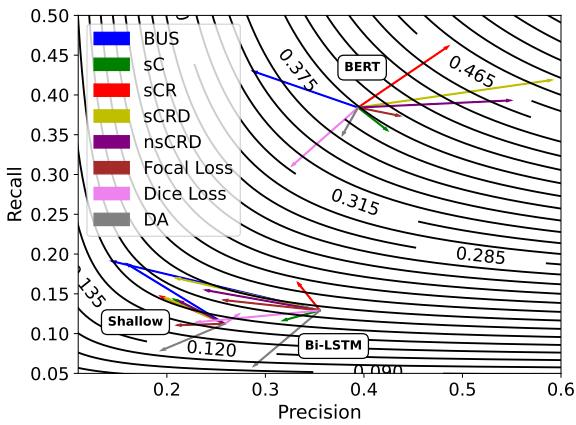

# Sentence-Level Resampling for Named Entity Recognition

Xiaochen Wang   
University of North Carolina at   
Chapel Hill   
Chapel Hill, NC, USA   
xcwang@email.unc.edu   
Yue Wang   
University of North Carolina at   
Chapel Hill   
Chapel Hill, NC, USA   
wangyue@unc.edu

## Abstract

As a fundamental task in natural language processing, named entity recognition (NER) aims to locate and classify named entities in unstructured text. However, named entities are always the minority among all tokens in the text. This data imbalance problem presents a challenge to machine learning models as their learning objective is usually dominated by the majority of non-entity tokens. To alleviate data imbalance, we propose a set of sentence-level resampling methods where the importance of each train ing sentence is computed based on its tokens and entities. We study the generalizability of these resampling methods on a wide variety of NER models (CRF, Bi-LSTM, and BERT) across corpora from diverse domains (general, social, and medical texts). Extensive experiments show that the proposed methods improve performance of the evaluated NER models especially on small corpora, frequently outperforming sub-sentence-level resampling, data augmentation, and special loss functions such as focal and Dice loss.1

## 1 Introduction

In natural language processing, named entity recognition (NER) is an important task both on its own and for numerous downstream tasks such as entity linking and question answering. NER has an inherent data imbalance problem: named entities of interest are almost always the minority among irrelevant (Other type) tokens in a text corpus. Table 1 shows the prevalent imbalanced nature of NER corpora from multiple domains. As shown in Table 1, entity tokens (tokens associated with any named entity) account for 3.9-16.6% of all tokens in any of these corpora. Within entity tokens, the most frequent entity type may cover 2-200 times more tokens than the least frequent entity type. At the sentence level, 23-85% sentences contain at least one entity, suggesting that 15-77% sentences contain no entity at all.

Data imbalance is even more severe in real-world bespoke NER tasks, which directly motivated this work. For example, given full-text articles from a medical subfield, domain experts may wish to recognize only those concepts related to specific aspects of the subfield (e.g., symptoms and medicine related to a specific disease). Compared to all tokens in the full text, extremely few tokens are annotated with any entity type. Because domain experts have limited availability, annotated corpus are usually small in such tasks. As a result, some rare entity types may have less than 10 tokens across the corpus. Such severe data imbalance and scarcity makes many NER models suffer.

Data imbalance in NER challenges machine learning-based models because their learning objective is dominated by entities of the majority type (Other), causing the model to be reluctant to predict the types of interest. Various techniques have been studied to tackle this challenge. Active learning was applied to collect a more balanced dataset at annotation time (Tomanek and Hahn, 2009). Special loss functions including focal loss (Lin et al., 2017) and Dice loss (Li et al., 2019) are proposed to deal with data imbalance. Data augmentation was shown to be effective by enriching entity-bearing sentences through methods like segment shuffling and mention replacement (Dai and Adel, 2020; Issifu and Ganiz, 2021; Wang and Henao, 2021).

The classical method for alleviating data imbalance is resampling (upsampling the minority class or downsampling the majority class) and its close relative, cost-sensitive learning (assigning larger weight to the minority class or smaller weight to the majority class in the learning objective) (He and Garcia, 2009). A natural question is: Can we apply resampling to address the data imbalance problem in NER? It turns out that unlike classification tasks, applying resampling to sequence tagging tasks like NER is not straightforward. Recent work attempted sub-sentence-level resampling – dropping tokens from the majority class either at random (Akkasi, 2018) or using heuristic rules (Akkasi et al., 2018; Akkasi and Varoglu, 2019; Grancharova et al., 2020). These methods were shown to perform well with shallow NER models – conditional random fields with local n-gram and word shape features. However, sub-sentencelevel resampling inevitably destroy the structure of complete sentences and distort the contextual information around entities of interest. Complete sentences are essential for state-of-the-art NER models based on contextual word representations, e.g., deep Transformers (Devlin et al., 2018). As shown in our experiments, incomplete sentences generated by sub-sentence-level resampling often hurt the performance of deep NER models.

<table><tr><td>Domain</td><td>NER Corpus</td><td># of Tokens</td><td># of Entity Types</td><td>% of Least vs. Most Freq. Type Entity Tokens</td><td>% of All Entity Tokens</td><td># of Sent.</td><td>% of Sent. w/ Entities</td></tr><tr><td>Social</td><td>WNUT</td><td>59,570</td><td>6</td><td>0.43 vs. 1.59</td><td>5.03</td><td>3,394</td><td>36.18</td></tr><tr><td>General</td><td>GMB subset</td><td>66,161</td><td>8</td><td>0.03 vs. 4.00</td><td>15.03</td><td>2,999</td><td>85.40</td></tr><tr><td>Medical</td><td>AnEM</td><td>71,697</td><td>11</td><td>0.03 vs. 1.08</td><td>3.91</td><td>2,815</td><td>35.38</td></tr><tr><td>Medical</td><td>CADEC</td><td>121,307</td><td>5</td><td>0.21 vs. 6.65</td><td>15.76</td><td>5,719</td><td>58.86</td></tr><tr><td>General</td><td>CoNLL</td><td>204,567</td><td>4</td><td>2.26 vs. 5.46</td><td>16.64</td><td>14,986</td><td>74.28</td></tr><tr><td>Medical</td><td>n2c2 ADE</td><td>813,277</td><td>9</td><td>0.19 vs. 2.34</td><td>10.89</td><td>65,293</td><td>22.73</td></tr><tr><td>General</td><td>OntoNotes</td><td>2,200,865</td><td>18</td><td>0.01 vs. 2.59</td><td>10.89</td><td>115,812</td><td>50.11</td></tr></table>

Table 1: Imbalance ratio statistics in NER corpora from different domains. Corpora references: WNUT (Derczynski et al., 2017); GMB subset (Bos et al., 2017); AnEM (Ohta et al., 2012); CADEC (Karimi et al., 2015); CoNLL (Sang and De Meulder, 2003); n2c2 ADE (Henry et al., 2020); OntoNotes (Ralph et al., 2013). ‘Sent.’ = Sentences; ‘Freq.’ = Frequent.

In this paper, we propose sentence-level resampling methods for NER, an underexplored problem in this area. As sentences are the natural units of data in NER, sentence-level resampling leaves the contextual information intact in a natural sentence needed by deep models like Transformers. Since a sentence may contain a mixture of entities whose types have different levels of rareness, traditional resampling method for imbalanced classification (e.g., inverse probability resampling) cannot be applied. Instead, we develop a set of methods for computing integer-valued importance score for a sentence based on its entity composition, and resample the sentence accordingly. Experiments show that our methods can improve performance of a variety of NER models and are especially effective on tasks with small annotated corpora, which is often seen in real-world bespoke NER tasks.

## 2 Related Work

## 2.1 Learning from Imbalanced Data

Class imbalance is a long-standing problem in machine learning tasks, posing challenges to researchers and practitioners in many domains (King and Zeng, 2001; Lu and Jain, 2003; He and Garcia, 2009; Moreo et al., 2016). Classes in real-world data often have highly skewed distribution, leading to substantial gaps between majority and minority classes. While the positive (minority) class is often of interest, the lack of positive examples makes classifiers conservative, i.e., they incline to predict all example as the negative (majority) class. This often results in a low recall of the positive class. Because only a small number of examples are predicted as positive, precision of the positive class tends to be high or unstable. Such a low-recall, high-precision pattern often hurts the F1-score, the standard metric that emphasizes a balanced precision and recall (Juba and Le, 2019). This performance pattern is observed not only in classification tasks, but also in NER tasks where named entity tokens are the minority compared to non-entity tokens (Mao et al., 2007; Kuperus et al., 2013).

Researchers have proposed various techniques for imbalanced learning, including resampling and cost-sensitive learning (He and Garcia, 2009). Both aim to re-balance the representation of different classes in the loss function, such that the classifier is less conservative in making positive predictions. In principle, by equating per-instance resampling frequency with per-instance cost, resampling can be implemented as cost-sensitive learning. However, resampling can be applied to models that do not support cost-sensitive learning, making it conveniently applicable to all models.

## 2.2 Resampling in Sequence Tagging Tasks

Resampling (and cost-sensitive learning) can be conveniently used in classification and regression tasks where a model makes pointwise predictions (a single categorical or scalar value). Each example has a clearly defined sampling rate (or cost) according to its class label. However, in sequence tagging tasks like NER (more broadly, structured prediction tasks (BakIr et al., 2007; Smith, 2011)), a model predicts multiple values for a sequence (or structured output). For sequence learning algorithms such as linear-chain conditional random fields, while the learning objective is formulated at the sequence level, the evaluation metrics are defined at the entity span level. This makes it nontrivial to determine the sampling rate (or cost) for a sequence that contains tokens from both majority and minority entity types. Simply resampling entities by stripping surrounding context is problematic as sequence tagging algorithms depend on context to make predictions. Recent works proposed to randomly or heuristically drop tokens from sentences to re-balance NER data, which had success using conditional random fields and shallow n-gram features (Akkasi, 2018; Akkasi and Varoglu, 2019; Grancharova et al., 2020). However, these methods distort the syntactic and semantic structure of complete sentences, which may generate low-quality data for models that are capable of capturing longdistance linguistic dependencies (e.g. BERT) and hurt performance of those models. In this work, we focus on resampling strategies that leaves sentences intact.

## 2.3 Loss Functions for Imbalanced Data

Recent literature proposed special loss functions for tackling data imbalance, including focal loss (Lin et al., 2017) and Dice loss (Li et al., 2019). They increase the cost of ‘hard positives’ where the correct label has low predicted probability and decrease the cost of ‘easy negatives’ where the correct label has high predicted probability. However, these loss functions do not fully address data imbalance in NER. First, the formulation does not always emphasize the loss of minority-class tokens – majority-class tokens can also be hard to classify, and minority-class tokens can also be easy to classify. Second, these loss functions only work on token-wise prediction outputs. They cannot work on sequence-level outputs generated by conditional random fields, which is commonly used in NER. Our resampling methods can be seen as estimating sentence-level losses with explicit emphasis on sentences containing minority-class tokens.

## 3 Resampling Strategy Design

For a sequence tagging task like NER, resampling cannot be as simple as what it is in classification and regression tasks, in which data points can be individually replicated, discarded, or synthesized. In NER, named entities cannot be resampled out of context. The surrounding context of named entities – albeit tokens from the irrelevant Other type – should be considered as well. Resampling named entities with context is a double-edged sword: preserving context will help NER models, but too much context increases the amount of non-entity tokens and aggravates the data imbalance problem. The goal of sentence-level resampling is to find the balance between too little and too much context accompanying named entities in complete sentences.

## 3.1 Sentence Importance Factors in NER

Intuitively, sentences that are worth resampling are those that are more important towards constructing a balanced NER dataset. We start by proposing factors that influence the importance of a sentence in resampling. These factors share the theoretical foundation of retrieval functions in information retrieval (Fang et al., 2004). A retrieval function evaluates the utility of a document with respect to the query terms it contains. By direct analogy, sentence importance score measures the utility of a sentence with respect to the entities it contains.

Count of entity tokens. Regardless of entity types, a sentence containing more entity tokens is more important than a sentence filled with nonentity tokens. This factor mirrors term frequency in retrieval functions (Salton and Buckley, 1988).

Rareness of entity type. The general idea of resampling for minority classes says that the rarer an entity type is, the more times we should resample sentences containing this type of entity. This factor mirrors inverse documentfrequency in retrieval functions (Salton and Buckley, 1988).

Density of tokens labeled as any entity. Including too much context can aggravate the imbalance problem. While the absolute count of entity tokens matters, the density of entity tokens in a sentence (number of entity tokens compared to the length of a sentence) should also be concerned. The higher the density, the more important a sentence. This factor mirrors document length normalization in retrieval functions (Singhal et al., 1996).

Diminishing marginal utility. If one sentence contains twice as many tokens with a specific entity type as the other sentence with the same length, does that mean the first sentence is twice as important as the second? In reality, an entity may contain numerous tokens, or a sentence may include multiple entities of the same type. Twice as many tokens from the same entity type may not offer twice as much information (for the same reason why too many tokens from the Other type is not helpful). Therefore, as the number of tokens from the same entity type increases, they generate diminishing marginal utility to a sentence. This factor mirrors diminishing marginal gain of repeated query terms in retrieval functions (Fang et al., 2004).

## 3.2 Resampling Functions

Based on the above importance factors, we design a suite of functions $f _ { s } \in \mathbb { Z } ^ { + }$ to determine the number of times a sentence s should be resampled in a NER training set. These functions incorporate progressively more factors discussed previously.

In a given corpus, let us denote the set of all entity types except for the majority type Other as $T .$ . Let $c ( t , s )$ be the count of tokens with entity type $t \in T$ in sentence s. We define the resampling function with respect to the smoothed count (sC) of all entity tokens as

$$
f _ { s } ^ { \mathrm { s C } } = 1 + \sum _ { t \in T } c ( t , s ) \ .\tag{1}
$$

Here, $\textstyle \sum _ { t \in T } c ( t , s )$ is the total number of entity tokens in sentence $s . \ { } ^ { \ { } ^ { \bullet } + 1 } { } ^ { \ { } }$ is to avoid removing entity-less sentences from the training set, in reminiscence of add-one smoothing in empirical probability estimates. It guarantees that all training sentences are resampled as least once. This smoothinglike process maintains consistency between training and test sets. If the training set contains entityless sentences, it is highly likely that the test set will contain entity-less sentences as well.

The next function incorporates entity rareness factor. The rareness $r _ { t }$ of an entity type $t \in T$ is measured as the self-information of the event that any token carries this type:

$$
r _ { t } = - \log _ { 2 } \frac { \sum _ { s \in S } c ( t , s ) } { N } ,
$$

where $S$ is the set of all sentences in the training set, and therefore $\textstyle \sum _ { s \in S } c ( t , s )$ is the total number of tokens with entity type t. N is number of all tokens (including Other tokens) in the training set. By introducing the rareness of an entity type we propose another function called the smoothed resampling incorporating count and rareness (sCR):

$$
f _ { s } ^ { \mathrm { s C R } } = 1 + \left\lceil \sqrt { \sum _ { t \in T } { r _ { t } \cdot c ( t , s ) } } \right\rceil .\tag{2}
$$

Ceiling function ensures $f _ { s } ^ { \mathrm { s C R } } \in \mathbb { Z } ^ { + }$ . Square root is to slow down the increase of $f _ { s } ^ { \mathrm { s C R } }$ when an entity type t is extremely rare (when $r _ { t }$ is large).

According to the density factor in the previous section, the length of sentence s plays a role in determining the density of entity tokens within a sentence. Let $l _ { s }$ be the length of sentence s measured in number of tokens. We define the following function called the smoothed resampling incorporating count, rareness, and density (sCRD):

$$
f _ { s } ^ { \mathrm { s C R D } } = 1 + \left\lceil \frac { \sum _ { t \in T } r _ { t } \cdot c ( t , s ) } { \sqrt { l _ { s } } } \right\rceil .\tag{3}
$$

We use $\sqrt { l _ { s } }$ instead of $l _ { s }$ to slow down the decrease of $f _ { s } ^ { \mathrm { s C R D } }$ when a sentence is too long.

Lastly, we incorporate the diminishing marginal utility factor and propose a function called the normalized and smoothed resampling incorporating count, rareness, and density (nsCRD):

$$
f _ { s } ^ { \mathrm { n s C R D } } = 1 + \left\lceil \frac { \sum _ { t \in T } r _ { t } \cdot \sqrt { c ( t , s ) } } { \sqrt { l _ { s } } } \right\rceil .\tag{4}
$$

Here, $\sqrt { c ( t , s ) }$ applies a sublinear increasing function on $c ( t , s )$ to implement the diminishing marginal utility when a sentence contains many tokens with the same type.

In summary, we proposed four functions for determining resampling frequencies for each sentence, representing four resampling methods.

## 4 Experimental Evaluation

Resampling should be a domain- and modelagnostic strategy in tackling data imbalance. Therefore, the goal of our experiments is to evaluate if the proposed resampling methods are effective in an extensive array of NER corpora and base models. Towards this goal, we apply the four resampling methods (together with baseline methods) on three representative NER models (each has two variants), and evaluate the resulting models on four corpora from diverse domains.

## 4.1 Evaluation Metric

We use span-level strict-match macro-averaged F1 score as our main evaluation metric. Other is not viewed as an entity type. Macro-averaged metrics emphasize a balanced treatment of all entity types, which align with our main goal. See Appendix C for micro-averaged and per-entity-type results.

## 4.2 Compared Methods

We compare the following baseline methods for dealing with data imbalance in NER.

Original corpus: training data untreated.

Balanced undersampling: We implement the algorithm proposed in (Akkasi et al., 2018) as a representative of sub-sentence-level resampling.

Data augmentation: The data augmentation techniques that includes all transformations as proposed in (Dai and Adel, 2020).

Focal loss(Lin et al., 2017), Dice loss (Li et al., 2019): We apply these loss functions on tokenwise predictions made by a softmax output layer. Note that they are not applicable to sequence-level predictions made by a CRF output layer.

sC, sCR, sCRD, nsCRD: the four resampling methods proposed in this work.

## 4.3 NER Corpora

We select four corpora from different domains. The first three are of small scale, representing bespoke NER tasks in practice where entity types are taskspecific and annotation efforts are limited.

AnEM (Ohta et al., 2012): The Anatomical Entity Mention (AnEM) corpus consists of 500 documents selected randomly from citation abstracts and full-text papers concerning both health and pathological anatomy. With only 3.91% entity tokens and 35.38% sentences having any entity, this is a very imbalanced corpus in Table 1.

WNUT (Derczynski et al., 2017): This is a social domain corpus released in the 2017 Workshop on Noisy User-generated Text (W-NUT). It contains noisy user-generated texts found in social media, online review, crowdsourcing, web forums, clinical records, and language learner essays. This is another very imbalanced corpus in Table 1.

GMB subset (Bos et al., 2017; Kaggle, 2018): The Groningen Meaning Bank (GMB) corpus consists of public domain English texts with corresponding syntactic and semantic representations.

The GMB subset is extracted from the larger GMB 2.0.0 corpus which is built specially for NER.

To test the generalizability of our methods, we also include a standard NER benchmark dataset.

CoNLL (Sang and De Meulder, 2003): The CoNLL-2003 English news NER corpus.

For AnEM, WNUT, and CoNLL, we use their pre-existing training/test split. For GMB subset, we use 3:1 training/test split.

## 4.4 Base NER Models and Variants

To comprehensively evaluate the combinations of our upstream resampling strategies with many downstream sequence tagging models, we select the following models:

Shallow Model. We construct shallow NER models that use pretrained word embeddings as per-word feature vectors. We consider two variants: one using a softmax output layer making tokenwise predictions; the other using a CRF (conditional random fields) output layer making sequencelevel predictions. Considering domains of the corpora, we select embeddings trained on biomedical literature (Huang et al., 2016), tweets (Glove-27Btwitter-27B),2 and Wikipedia+news (Glove-6B),3 for AnEM, WNUT, and datasets from general domain (GMB subset and CoNLL), respectively. All are 50-dimensional embeddings. CrfSuite4 is applied with default hyperparameters.

Bi-LSTM (Bidirectional Long Short-Term Memory). LSTM is a special recurrent neural network architecture in which the vanishing gradient problem can be effectively mitigated. Bi-LSTM consists of two LSTMs taking inputs in both forward and backward directions. Even though more recent models (e.g., GPT-2, BERT) are shown to outperform Bi-LSTM, it is still regarded as one of the most prevalent tools for solving sequence tagging problems. We implement two variants of Bi-LSTM: one with a softmax output layer making token-wise predictions; the other with a CRF decoding layer5, to ensure the local consistency of output tags. Different from the default hyperparameters, batch size and number of epochs are set to 32 and 20, respectively. Embeddings are used in the same way as in the shallow models above.

BERT (Bidirectional Encoder Representations from Transformers). BERT is widely regarded as the most significant improvement in natural language processing. Its outstanding capability of learning contextualized word representations makes it the representative of advanced NER model in this work. Again, we implement two variants of BERT: one with a softmax output layer making token-wise predictions; the other with a CRF decoding layer6. Default hyperparameters are used. More implementation details are in Appendix A.

<table><tr><td></td><td colspan="2">Shallow model</td><td colspan="2">Bi-LSTM</td><td colspan="2">BERT</td></tr><tr><td></td><td>Softmax</td><td>CRF</td><td>Softmax</td><td>CRF</td><td>Softmax</td><td>CRF</td></tr><tr><td>Original corpus</td><td>27.36</td><td>52.39</td><td>41.76</td><td>45.21</td><td>58.60</td><td>57.68</td></tr><tr><td>Balanced undersampling</td><td>24.17</td><td>52.06</td><td>21.22</td><td>26.19</td><td>62.59</td><td>63.03</td></tr><tr><td>Data augmentation</td><td>22.78</td><td>53.20</td><td>40.73</td><td>41.05</td><td>61.34</td><td>63.38</td></tr><tr><td>Focal loss</td><td>27.65</td><td></td><td>40.73</td><td>一</td><td>58.39</td><td>=</td></tr><tr><td>Dice loss</td><td>25.87</td><td>一</td><td>2.31</td><td>一</td><td>47.36</td><td>一</td></tr><tr><td>sC</td><td>30.39</td><td>52.13</td><td>44.69</td><td>47.55</td><td>62.86</td><td>65.47</td></tr><tr><td>sCR</td><td>30.94</td><td>53.38</td><td>48.37</td><td>48.90</td><td>65.22</td><td>62.41</td></tr><tr><td>sCRD</td><td>29.98</td><td>50.67</td><td>45.69</td><td>44.31</td><td>61.70</td><td>60.50</td></tr><tr><td>nsCRD</td><td>30.57</td><td>53.41</td><td>39.54</td><td>46.10</td><td>64.63</td><td>62.59</td></tr></table>

Table 2: Macro F1 scores on AnEM. The three NER models using either softmax or CRF output layer are reported. ‘ ’ means that focal loss and Dice loss do not apply to CRF outputs. In each column, the highest F1-score is shown in boldface and the second highest is shown in underline.
<table><tr><td></td><td colspan="2">Shallow model</td><td colspan="2">Bi-LSTM</td><td colspan="2">BERT</td></tr><tr><td></td><td>Softmax</td><td>CRF</td><td>Softmax</td><td>CRF</td><td>Softmax</td><td>CRF</td></tr><tr><td>Original corpus</td><td>14.56</td><td>4.31</td><td>18.27</td><td>18.46</td><td>37.67</td><td>39.98</td></tr><tr><td>Balanced undersampling</td><td>16.94</td><td>4.45</td><td>15.81</td><td>16.68</td><td>33.73</td><td>30.86</td></tr><tr><td>Data augmentation</td><td>11.05</td><td>4.49</td><td>20.10</td><td>10.06</td><td>35.03</td><td>36.08</td></tr><tr><td>Focal loss</td><td>14.25</td><td>一</td><td>17.73</td><td></td><td>39.20</td><td>一</td></tr><tr><td>Dice loss</td><td>15.74</td><td>一</td><td>15.26</td><td>一</td><td>31.62</td><td>一</td></tr><tr><td>sC</td><td>16.20</td><td>4.58</td><td>16.90</td><td>19.21</td><td>37.16</td><td>49.44</td></tr><tr><td>sCR</td><td>15.94</td><td>4.39</td><td>21.52</td><td>21.40</td><td>44.60</td><td>45.06</td></tr><tr><td>sCRD</td><td>15.95</td><td>4.94</td><td>17.15</td><td>19.80</td><td>43.82</td><td>42.34</td></tr><tr><td>nsCRD</td><td>16.06</td><td>4.62</td><td>18.31</td><td>23.71</td><td>41.65</td><td>41.71</td></tr></table>

Table 3: Macro-averaged F1-scores on the WNUT corpus. See the caption of Table 2 above for details.
<table><tr><td></td><td colspan="2">Shallow model</td><td colspan="2">Bi-LSTM</td><td colspan="2">BERT</td></tr><tr><td></td><td>Softmax</td><td>CRF</td><td>Softmax</td><td>CRF</td><td>Softmax</td><td>CRF</td></tr><tr><td>Original corpus</td><td>28.71</td><td>41.42</td><td>45.73</td><td>44.91</td><td>50.20</td><td>54.32</td></tr><tr><td>Balanced undersampling</td><td>29.56</td><td>40.52</td><td>41.73</td><td>42.70</td><td>57.01</td><td>56.89</td></tr><tr><td>Data augmentation</td><td>27.53</td><td>41.24</td><td>47.63</td><td>49.76</td><td>54.78</td><td>55.25</td></tr><tr><td>Focal loss</td><td>28.47</td><td></td><td>41.25</td><td></td><td>53.66</td><td>=</td></tr><tr><td>Dice loss</td><td>33.42</td><td></td><td>40.16</td><td></td><td>52.10</td><td>一</td></tr><tr><td>sC</td><td>29.17</td><td>41.34</td><td>44.52</td><td>48.39</td><td>54.52</td><td>54.58</td></tr><tr><td>sCR</td><td>29.85</td><td>40.39</td><td>45.85</td><td>46.91</td><td>52.96</td><td>54.33</td></tr><tr><td>sCRD</td><td>30.99</td><td>41.54</td><td>44.60</td><td>48.07</td><td>52.72</td><td>55.12</td></tr><tr><td>nsCRD</td><td>29.37</td><td>41.76</td><td>46.16</td><td>45.69</td><td>55.14</td><td>54.60</td></tr></table>

Table 4: Macro-averaged F1-scores on the GMB subset corpus. See the caption of Table 2 above for details.
<table><tr><td></td><td colspan="2">Shallow model</td><td colspan="2">Bi-LSTM</td><td colspan="2">BERT</td></tr><tr><td></td><td>Softmax</td><td>CRF</td><td>Softmax</td><td>CRF</td><td>Softmax</td><td>CRF</td></tr><tr><td>Original corpus</td><td>42.66</td><td>67.71</td><td>75.78</td><td>78.63</td><td>88.20</td><td>88.45</td></tr><tr><td>Balanced undersampling</td><td>42.55</td><td>66.77</td><td>66.36</td><td>76.54</td><td>86.91</td><td>86.75</td></tr><tr><td>Data augmentation</td><td>42.73</td><td>67.06</td><td>77.70</td><td>77.31</td><td>87.98</td><td>88.37</td></tr><tr><td>Focal loss</td><td>43.47</td><td></td><td>77.24</td><td></td><td>88.44</td><td></td></tr><tr><td>Dice loss</td><td>48.58</td><td></td><td>72.80</td><td>一</td><td>88.82</td><td>一</td></tr><tr><td>sC</td><td>42.20</td><td>66.84</td><td>76.82</td><td>75.03</td><td>88.94</td><td>88.81</td></tr><tr><td>sCR</td><td>42.22</td><td>66.63</td><td>77.72</td><td>74.13</td><td>88.36</td><td>89.11</td></tr><tr><td>sCRD</td><td>42.98</td><td>66.97</td><td>78.06</td><td>77.63</td><td>88.30</td><td>88.61</td></tr><tr><td>nsCRD</td><td>41.98</td><td>67.04</td><td>78.80</td><td>78.87</td><td>87.58</td><td>88.03</td></tr></table>

Table 5: Macro-averaged F1-scores on the CoNLL corpus. See the caption of Table 2 above for details.

## 4.5 Results and Discussion

Macro-averaged F1-scores of different methods applied to four corpora and three base NER models are reported in Tables 2-5.

Our goal is not to compete with state-of-theart methods on these corpora. Instead, we aim to present an interesting and underexplored problem (sentence-level resampling for NER) and a set of simple yet promising methods. In principle, our proposed resampling methods are model-agnostic and can provide an additional performance boost for a variety of NER models. We observe the following trends in Tables 2-5.

Overall performance of our resampling methods: Across Tables 2-5, our methods (sC, sCR, sCRD, nsCRD) generally performed well, achieving the highest or second highest F1-scores in almost every column (except for the condition ‘Shallow model, Softmax’ on CoNLL). Although no specific method consistently outperforms others in every condition, it is clear that sentence-level resampling is overall a promising approach to tackling the data imbalance problem in NER. The best resampling method depends on the specific base model, output layer, and corpus used. Just as the best hyperparameter values have to be empirically determined, so could be the most suitable resampling method. Fortunately, all our resampling methods are simple and straightforward, which allows for convenient experimentation.

Shallow vs. deep models: We observe a clear trend that shallow models using word embedding as features and softmax/CRF as the output layer underperform deep models such as Bi-LSTM and BERT. We view this as a sanity check. Bi-LSTMs and BERT can learn word representations that account for long-distance dependencies, and BERT should be even more powerful with contextual word representations pretrained on massive texts.

Softmax vs. CRF output layer: Using the same base model, CRF output layer often (but not always) outperforms softmax output layer. The performance gap is larger on shallow models and small corpora (AnEM, WNUT, GMB) than on deep models and large corpus (CoNLL). Indeed, Bi-LSTM and BERT are capable of learning word representations that account for long-distance word dependencies, reducing the benefit of tag dependencies offered by a CRF layer. Similar observation was made by previous work (Devlin et al., 2018). An exception is the combination (WNUT, Shallow model), where the CRF layer suffered from severe overfitting caused by noisy text and extremely imbalanced data distribution in WNUT corpus.

Small vs. large corpus: On small corpora (AnEM, WNUT, GMB subset), our resampling methods usually outperform the original corpus baseline by a big margin. These benefits become less salient on large corpus (CoNLL). This implies that our methods are especially effective when the corpus is small and annotations are few. As corpus size gets large, even rare entity types are covered by many examples and therefore sufficiently trained.

Sub-sentence resampling and data augmentation: Sub-sentence resampling (balanced undersampling) has large variance in its performance. In some cases it gives the highest gain (GMB subset, BERT model), and in other cases it performs worse than just using the original corpus (all corpora, Bi-LSTM models). It suggests that sub-sentence resampling is highly sensitive to the corpus and model choice. Data augmentation also shows high variance in its performance. It gives the highest gain on (GMB subset, Bi-LSTM model), and performs worse than the original corpus on (WNUT, BERT model). Sentences generated by data augmentation generally have correct syntax but garbled semantics (e.g., one entity is replaced by another same-type, out-of-context entity). The nonsensical sentences may confuse NER models. In contrast, whole-sentence resampling methods give more stable improvements over the original corpus baseline largely because they preserve the naturalness of resampled sentences.

Focal loss and Dice loss: These loss functions are applicable only on pointwise predictions made by the softmax output layer. A major trend is that their performance tend to be unreliable across scenarios. We attribute this behavior to the difficulty in optimizing these losses. For shallow models, we optimize them by feeding gradients of either loss function (see Appendix B for their derivation) into a L-BFGS optimizer (Liu and Nocedal, 1989) in Scikit-Learn. As shown in the (Shallow model, Softmax) column of GMB subset and CoNLL corpora, the two loss functions (especially the Dice loss) performed well. For deep models (Bi-LSTM and BERT), we rely on TensorFlow’s automatic differentiation and Adam gradient descent optimizer (Kingma and Ba, 2014) because manually deriving gradients for deep models is infeasible. The two loss functions sometimes give poor performance. The Bi-LSTM model with Dice loss failed completely on AnEM (F1-score: 2.31). A possible explanation is that Dice loss is non-convex and it may be difficult for first-order optimizers in current deep learning toolkits (e.g. Adam in TensorFlow) to find high-quality local minima than second-order methods like L-BFGS.

Precision and recall: To illustrate performance changes in terms of precision and recall, Figure 1 visualizes the changes before and after resampling as displacement vectors in precision-recall plots with F1-score contour lines. Some arrows are pointing to the upper right corner of the plots, indicating the associated methods improve F1-score by improving both precision and recall. Other arrows point to the upper left, indicating the associated methods increase recall at the sacrifice of precision. In this case, most of our methods improve macroaveraged precision and recall of the BERT model on WNUT. See Appendix C.2 for more details.

## 4.6 Effect on Training Corpus Size

Table 6 shows the effect of training corpus size as a result of resampling or data augmentation. These factors are the average across four corpora.

The balanced undersampling method drops tokens from sentences, and therefore reduces training corpus size. Data augmentation method doubles the corpus size as many sentences are paraphrased into multiple versions. Our proposed methods increases corpus size by a slightly larger factor because sentences that contain rare entity types are resampled multiple times. Although increased training corpus size leads to increased training time, note that our methods are especially suitable for scenarios where the annotated corpus is small and hence the training time is still relatively short.

Figure 1: Displacement vectors of F1-scores in precision-recall plots for WNUT corpus. ‘BUS’: balanced undersampling. ‘DA’: data augmentation. All models use softmax output layer. The downward curves are contours of F1-scores in the precision-recall space. Each NER model (Shallow, Bi-LSTM, BERT) is associated with a cluster of vectors sharing the same starting point in the space, which represents the performance on the original corpus.
<table><tr><td>Methods</td><td>Size increase factor</td></tr><tr><td>Original corpus Balanced undersampling</td><td>1.00 0.32</td></tr><tr><td>Data augmentation</td><td>2.00</td></tr><tr><td>sC sCR</td><td>3.80</td></tr><tr><td>sCRD</td><td>4.60</td></tr><tr><td>nsCRD</td><td>3.91 2.82</td></tr></table>

Table 6: Effect of data resampling/augmentation methods on training corpus size. The factors are averaged across four evaluated corpora.

## 5 Conclusion and Future Work

Our proposed sentence resampling methods generalize well across diverse NER corpora and models. They enjoy the following advantages:

Model-agnostic: Since resampling only manipulates datasets and not models, the proposed methods can be directly applied to any NER model, requiring no knowledge of its functioning or any change to it. Resampling is also more convenient than cost-sensitive learning as the latter still requires changing the model training process.

Domain-agnostic: Compared with data preprocessing methods such as data augmentation, sentence-level resampling methods are simple and do not require domain- or language-specific manipulations such as synonym replacement, saving practitioners from excessive data engineering.

Note that data augmentation and sentence-level resampling (and resampling methods in general) are complementary methods for improving NER model training. Data augmentation improves the semantic richness of training instances by expanding the coverage of training data in the input feature space, while sentence-level resampling refines the importance weighting of training instances by bridging the gap between the training objective and evaluation metrics. Therefore, they work in orthogonal directions. This points to a promising direction for future work: to explore the two line of methods in combination rather than in competition.

Various other avenues exist for future work. First, further theoretical and empirical research can explore more effective resampling functions that deliver consistently better performance across corpora and base NER models. Second, more corpora and models can be examined under these resampling strategies to evaluate their generalizability. Third, the variance of performance in different scenarios may potentially relate to characteristics of specific corpora. Future research may seek for corpora-level statistics that can assist practitioners in selecting the appropriate resampling methods.

Acknowledgments. The authors thank anonymous reviewers for their useful comments. This work is partially supported by the National Institute of Health under the grant number R01DA053028.

## References

A Akkasi and E Varoglu. 2019. Improvement of chemical named entity recognition through sentence-based random under-sampling and classifier combination. Journal ofAI and Data Mining, 7(2):311–319.

Abbas Akkasi. 2018. Sentence-based undersampling for named entity recognition using genetic algorithm. Iran Journal of Computer Science, 1(3):165–174.

Abbas Akkasi, Ekrem Varoglu, and Nazife Dimililer.˘ 2018. Balanced undersampling: a novel sentencebased undersampling method to improve recognition of named entities in chemical and biomedical text. Applied Intelligence, 48(8):1965–1978.

Gökhan BakIr, Thomas Hofmann, Bernhard Schölkopf, Alexander J Smola, and Ben Taskar. 2007. Predicting structured data. MIT press.

Johan Bos, Valerio Basile, Kilian Evang, Noortje Venhuizen, and Johannes Bjerva. 2017. The groningen meaning bank. In Nancy Ide and James Pustejovsky, editors, Handbook of Linguistic Annotation, volume 2, pages 463–496. Springer.

Xiang Dai and Heike Adel. 2020. An analysis of simple data augmentation for named entity recognition. arXiv preprint arXiv:2010.11683.

Leon Derczynski, Eric Nichols, Marieke van Erp, and Nut Limsopatham. 2017. Results of the wnut2017 shared task on novel and emerging entity recognition. In Proceedings ofthe 3rd Workshop on Noisy Usergenerated Text, pages 140–147.

Jacob Devlin, Ming-Wei Chang, Kenton Lee, and Kristina Toutanova. 2018. Bert: Pre-training of deep bidirectional transformers for language understanding. arXiv preprint arXiv:1810.04805.

Hui Fang, Tao Tao, and ChengXiang Zhai. 2004. A formal study of information retrieval heuristics. In Proceedings of the 27th annual international ACM SIGIR conference on Research and development in information retrieval, pages 49–56.

Mila Grancharova, Hanna Berg, and Hercules Dalianis. 2020. Improving named entity recognition and classification in class imbalanced swedish electronic patient records through resampling. In Eighth Swedish Language Technology Conference (SLTC). Förlag Göteborgs Universitet.

Haibo He and Edwardo A Garcia. 2009. Learning from imbalanced data. IEEE Transactions on knowledge and data engineering, 21(9):1263–1284.

Sam Henry, Kevin Buchan, Michele Filannino, Amber Stubbs, and Ozlem Uzuner. 2020. 2018 n2c2 shared task on adverse drug events and medication extraction in electronic health records. Journal ofthe American Medical Informatics Association, 27(1):3–12.

Jian Huang, Keyang Xu, and VG Vinod Vydiswaran. 2016. Analyzing multiple medical corpora using word embedding. In 2016 IEEE International Conference on Healthcare Informatics (ICHI), pages 527– 533. IEEE.

Abdul Majeed Issifu and Murat Can Ganiz. 2021. A simple data augmentation method to improve the performance of named entity recognition models in medical domain. In 2021 6th International Conference on Computer Science and Engineering (UBMK), pages 763–768. IEEE.

Brendan Juba and Hai S Le. 2019. Precision-recall versus accuracy and the role of large data sets. In Proceedings of the AAAI Conference on Artificial Intelligence, volume 33, pages 4039–4048.

Kaggle. 2018. Annotated GMB corpus. https: //www.kaggle.com/shoumikgoswami/ annotated-gmb-corpus. Accessed: 2022-05- 01.

Sarvnaz Karimi, Alejandro Metke-Jimenez, Madonna Kemp, and Chen Wang. 2015. Cadec: A corpus of adverse drug event annotations. Journal ofbiomedical informatics, 55:73–81.

Gary King and Langche Zeng. 2001. Logistic regression in rare events data. Political analysis, 9(2):137–163.

Diederik P Kingma and Jimmy Ba. 2014. Adam: A method for stochastic optimization. arXiv preprint arXiv:1412.6980.

Jasper Kuperus, Cor J Veenman, and Maurice van Keulen. 2013. Increasing ner recall with minimal precision loss. In 2013 European Intelligence and Security Informatics Conference, pages 106–111. IEEE.

Xiaoya Li, Xiaofei Sun, Yuxian Meng, Junjun Liang, Fei Wu, and Jiwei Li. 2019. Dice loss for data-imbalanced nlp tasks. arXiv preprint arXiv:1911.02855.

Tsung-Yi Lin, Priya Goyal, Ross Girshick, Kaiming He, and Piotr Dollár. 2017. Focal loss for dense object detection. In Proceedings ofthe IEEE international conference on computer vision, pages 2980–2988.

Dong C Liu and Jorge Nocedal. 1989. On the limited memory bfgs method for large scale optimization. Mathematical programming, 45(1):503–528.

Xiaoguang Lu and Anil K Jain. 2003. Resampling for face recognition. In International Conference on Audio-and Video-based Biometric Person Authentication, pages 869–877. Springer.

Xinnian Mao, Wei Xu, Yuan Dong, Saike He, and Haila Wang. 2007. Using non-local features to improve named entity recognition recall. In Proceedings of the 21st Pacific Asia Conference on Language, Information and Computation, pages 303–310.

Alejandro Moreo, Andrea Esuli, and Fabrizio Sebastiani. 2016. Distributional random oversampling for imbalanced text classification. In Proceedings ofthe 39th International ACM SIGIR conference on Research and Development in Information Retrieval, pages 805–808.

Tomoko Ohta, Sampo Pyysalo, Jun’ichi Tsujii, and Sophia Ananiadou. 2012. Open-domain anatomical entity mention detection. In Proceedings ofthe workshop on detecting structure in scholarly discourse, pages 27–36.

Weischedel Ralph, Palmer Martha, Marcus Mitchell, Hovy Eduard, Pradhan Sameer, Ramshaw Lance, Xue Nianwen, Taylor Ann, Kaufman Jeff, Franchini Michelle, El-Bachouti Mohammed, Belvin Robert, and Houston Ann. 2013. Ontonotes release 5.0. https://doi.org/10.35111/xmhb-2b84.

Gerard Salton and Christopher Buckley. 1988. Termweighting approaches in automatic text retrieval. Information processing & management, 24(5):513– 523.

Erik Tjong Kim Sang and Fien De Meulder. 2003. Introduction to the conll-2003 shared task: Languageindependent named entity recognition. In Proceedings of the Seventh Conference on Natural Language Learning at HLT-NAACL 2003, pages 142–147.

Amit Singhal, Gerard Salton, Mandar Mitra, and Chris Buckley. 1996. Document length normalization. Information Processing & Management, 32(5):619– 633.

Noah A Smith. 2011. Linguistic structure prediction. Synthesis lectures on human language technologies, 4(2):1–274.

Katrin Tomanek and Udo Hahn. 2009. Reducing class imbalance during active learning for named entity annotation. In Proceedings of the fifth international conference on Knowledge capture, pages 105–112.

Rui Wang and Ricardo Henao. 2021. Unsupervised paraphrasing consistency training for low resource named entity recognition. In Proceedings ofthe 2021 Conference on Empirical Methods in Natural Language Processing, pages 5303–5308.

## A Implementation Details

## A.1 Software and Hardware Environment

All the deep learning models are implemented in Tensorflow 1.12.0 environment.

Softmax regression (or multinomial logistic regression) model is from Scikit-Learn package in version 0.23.2. The CRF model is implemented by the package sklearn-crfsuite in version of 0.3.6.

Data resampling and CRF training/evaluation were performed on 2.60 GHz Intel CPUs and 8GB RAM. Bi-LSTM and BERT training/evaluation were performed on GPUs (GeForce GTX1080 8GB and Tesla V100 16GB).

## A.2 Hyperparameters for Machine Learning Models

For shallow models and BERT, all hyperparameters are set by default. For details of them, please see documents of sklearn, crfsuite and BERT-NER.

For Bi-LSTM, we adjust a few of parameters as there are some drawbacks of the default settings: 20 is not a commonly used number for batch size, and loss of Bi-LSTM model fails to converge under some circumstances. So we set them to 32 and 20, instead of default values 20 and 15. Other hyperparameters are applied according to default settings.

For the fairness in the comparison, we do not alter any hyperparameters while switching resampling methods and loss functions without changing dataset and models. We believe that it is totally appropriate in the process of comparing, despite that better performance of specific methods may be obtained after tuning hyperparameters, which beyond the scope of this exploring research.

## A.3 Hyperparameters for Loss Functions

There are two hyperparameters in the focal loss and Dice Loss, determining converging speed and smooth degree. For focal loss, we set γ to 2, as what authors of (Lin et al., 2017) recommend. According to (Li et al., 2019), it is appropriate to set γ of Dice loss to 1 for the purpose of smoothing. In our implementation of loss function in shallow model, this setting is found effective. However, while using it in deep learning model, its effectiveness cannot be ensured. Hence, we adopt another setting of $\gamma = 1 0 ^ { - 5 }$ in the tensor computing and obtain better results compared with those obtained with a larger γ.

## B Derivation of Loss Function Gradients for Softmax Regression

When using the shallow model with softmax output layer and focal/Dice loss functions, we optimize the model parameters by the quasi-Newton method L-BFGS provided by Python Scikit-Learn. This approach requires us to provide the gradients of current model parameters. Below we show our derivation of these gradients.

Notations and Preliminaries. Scalar values are denoted by non-bold, lowercase letters such as x. Row vectors are denoted by bold, lowercase letters such as x. Matrices are denoted by bold, uppercase letters such as X.

Softmax regression has the following components:

$$
\begin{array} { r l } { \bullet \mathrm { ~ F e a t u r e ~ { \mathrm {  ~ v e c t o r : ~ } } ~ } { \bf x } } & { { } \in \mathrm { ~ {  ~ \mathbb ~ { ~ \mathbb ~ R } ^ { m } , } ~ } { \bf x } } \\ { \mathrm { ~ [ } x _ { 1 } , \cdot \cdot \cdot \ , x _ { i } , \cdot \cdot \cdot \ , x _ { m } ] . } \end{array}
$$

• Label vector: $\begin{array} { r l r } { { \bf y } } & { { } \in } & { \{ 0 , 1 \} ^ { k } , { \bf y } \quad = } \end{array}$ $[ y _ { 1 } , \cdot \cdot \cdot , y _ { j } , \cdot \cdot \cdot , y _ { k } ]$ . If the ground truth is the c-th class, $1 \leq c \leq k$ , then $y _ { c } = 1$ , and $y _ { j } = 0 { \mathrm { i f } } j \neq c .$

• Weight vector for the j-th class: $\mathbf { w } _ { j } \in \mathbf { \Sigma }$ $\mathbb { R } ^ { m } , \mathbf { w } _ { j } = [ w _ { j 1 } , \cdot \cdot \cdot , w _ { j i } , \cdot \cdot \cdot , w _ { j m } ] .$

• Weight matrix $\textbf { W } _ { \mathbf { \tau } } \in \mathrm { ~ \mathbb { R } ^ { \ b { m } \times \ b { k } } ~ }$ $\begin{array} { r l } { \mathbf { W } } & { { } = } \end{array}$ $[ \mathbf { w } _ { 1 } ^ { \top } , \cdot \cdot \cdot , \mathbf { w } _ { j } ^ { \top } , \cdot \cdot \cdot , \mathbf { w } _ { k } ^ { \top } ] . \quad \cdots \top ^ { , , }$ is the transpose operation. $\mathbf { w } ^ { \top }$ is the transpose of $\mathbf { w } .$ , which is a column vector.

• Bias for the the j-th class: $b _ { j } \in \mathbb { R } .$

• Predicted probability vector: $\mathbf { p } \in [ 0 , 1 ] ^ { k } , \mathbf { p } =$ [p1, · · · , pj , · · · , pk].

$$
\begin{array} { l } { { \displaystyle p _ { j } = \mathrm { P r } ( y _ { j } = 1 | { \bf x } ) } \ ~ } \\ { { \displaystyle ~ = \frac { \exp ( \langle { \bf w } _ { j } , { \bf x } \rangle + b _ { j } ) } { \sum _ { j ^ { \prime } = 1 } ^ { k } \exp ( \langle { \bf w } _ { j ^ { \prime } } , { \bf x } \rangle + b _ { j ^ { \prime } } ) } } } \end{array}\tag{5}
$$

(6)

$\langle \mathbf { w } , \mathbf { x } \rangle$ is the inner product of vector w and vector x.

One can verify that the partial derivative of $p _ { c }$ with respect to $w _ { j i }$ , the weight of the j-th class, the i-th dimension, is the following:

$$
\frac { \partial p _ { c } } { \partial w _ { j i } } = [ { \bf 1 } \{ j = c \} - p _ { j } ] p _ { c } x _ { i }\tag{7}
$$

## B.1 Focal Loss Gradient

Suppose the ground truth is the c-th class for a given example x.

$$
L _ { F L } ( { \bf x } , { \bf y } ) = - ( 1 - p _ { c } ) ^ { \gamma } \log p _ { c }\tag{8}
$$

$$
\frac { \partial L _ { F L } ( \mathbf { x } , \mathbf { y } ) } { \partial w _ { j i } }\tag{9}
$$

$$
= - \frac { \partial } { \partial p _ { c } } [ ( 1 - p _ { c } ) ^ { \gamma } \log p _ { c } ] \cdot \frac { \partial p _ { c } } { \partial w _ { j i } }\tag{10}
$$

$$
= - \left[ - \gamma ( 1 - p _ { c } ) ^ { \gamma - 1 } \log { p _ { c } } + \frac { ( 1 - p _ { c } ) ^ { \gamma } } { p _ { c } } \right] \cdot \frac { \partial p _ { c } } { \partial w _ { j i } }\tag{11}
$$

$$
= - \left[ - \gamma ( 1 - p _ { c } ) ^ { \gamma - 1 } \log p _ { c } + \frac { ( 1 - p _ { c } ) ^ { \gamma } } { p _ { c } } \right]
$$

$$
\mathbf { \nabla } \cdot [ \mathbf { 1 } \{ j = c \} - p _ { j } ] p _ { c } x _ { i }\tag{12}
$$

$$
= - \left[ - \gamma p _ { c } ( 1 - p _ { c } ) ^ { \gamma - 1 } \log p _ { c } + ( 1 - p _ { c } ) ^ { \gamma } \right]
$$

$$
\mathbf { \nabla } \cdot [ \mathbf { 1 } \{ j = c \} - p _ { j } ] x _ { i }\tag{13}
$$

$$
= a _ { c } [ p _ { j } - { \bf 1 } \{ j = c \} ] x _ { i }\tag{14}
$$

Here we set

$$
a _ { c } = - \gamma p _ { c } ( 1 - p _ { c } ) ^ { \gamma - 1 } \log p _ { c } + ( 1 - p _ { c } ) ^ { \gamma }\tag{15}
$$

to reduce notational clutter. $\mathit { a _ { c } }$ has nothing to do with i or j; it only has to do with c, the index of the ground truth label for the training example x. When $\gamma = 0 , a _ { c } = 1$ . When $\gamma > 0 , a _ { c }$ decreases when $p _ { c }$ increases from 0 to 1. This means the gradient for an easy example (when $p _ { c }$ is close to 1) have a smaller magnitude than the gradient for a hard example (when $p _ { c }$ is close to 0).

Generalizing the scalar gradient in Equation (14) to matrix gradient, we have

$$
\frac { \partial { \cal L } _ { F L } ( { \bf x } , { \bf y } ) } { \partial { \bf W } } = a _ { c } \cdot { \bf x } ^ { \top } ( { \bf p } - { \bf y } ) .\tag{16}
$$

The shape of $a _ { c } \cdot \mathbf { x } ^ { \top } ( \mathbf { p } - \mathbf { y } )$ is $m \times k$ , the same shape as W.

An important note is that here $a _ { c }$ is specific to that single example x, which has ground truth label $y _ { c } = 1$ . If we have n different training examples $\mathbf { x } ^ { ( 1 ) } , \cdots , \mathbf { x } ^ { ( n ) }$ , then every example will have a different $a _ { c }$ value: $a _ { c } ^ { ( 1 ) } , \cdots , a _ { c } ^ { ( n ) }$ . Let’s create a diagonal matrix $\mathbf { A } _ { c } ~ \in ~ \mathbb { R } ^ { n \times n } , ~ \mathbf { A } _ { c } ~ =$ $d i a g ( a _ { c } ^ { ( 1 ) } , \cdot \cdot \cdot , a _ { c } ^ { ( n ) } )$ ).

If we have n training examples, then the feature matrix X $\in \mathbb { R } ^ { n \times m }$ , the label matrix $\textbf { Y } \in$ $\{ 0 , 1 \} ^ { n \times k }$ , and the predicted probability matrix $\mathbf { P } \in [ 0 , 1 ] ^ { n \times k }$ . We have:

$$
\frac { \partial L _ { F L } ( \mathbf { X } , \mathbf { Y } ) } { \partial \mathbf { W } } = \mathbf { X } ^ { \top } \mathbf { A } _ { c } ( \mathbf { P } - \mathbf { Y } ) .\tag{17}
$$

The shape of $\mathbf { X } ^ { \top } \mathbf { A } _ { c } ( \mathbf { P } - \mathbf { Y } )$ is $m \times k$ , the same as W.

## B.2 Dice Loss Gradient

Dice loss computes per-class F-1 scores. Suppose the ground truth is the c-th class for a given example x.

$$
\begin{array} { c } { { \displaystyle { \cal L } _ { D L } ( { \bf x } , { \bf y } ) } } \\ { { = \displaystyle \sum _ { j ^ { \prime } = 1 } ^ { k } \left[ 1 - { \bf 1 } \{ c = j ^ { \prime } \} \frac { \gamma + 2 p _ { c } } { \gamma + p _ { c } ^ { 2 } + 1 } \right. } } \end{array}\tag{18}
$$

$$
+ 1 - { \bf 1 } \{ c \neq j ^ { \prime } \} \frac { \gamma } { \gamma + p _ { j ^ { \prime } } ^ { 2 } } \biggr ]\tag{19}
$$

$$
= 1 - \frac { \gamma + 2 p _ { c } } { \gamma + p _ { c } ^ { 2 } + 1 } + \sum _ { j ^ { \prime } \ne c } \left[ 1 - \frac { \gamma } { \gamma + p _ { j ^ { \prime } } ^ { 2 } } \right]\tag{20}
$$

$$
= k - \frac { \gamma + 2 p _ { c } } { \gamma + p _ { c } ^ { 2 } + 1 } - \sum _ { j ^ { \prime } \neq c } \frac { \gamma } { \gamma + p _ { j ^ { \prime } } ^ { 2 } }\tag{21}
$$

Take gradient with respect to $w _ { j i }$ , the weight of the j-th class, the i-th dimension.

$$
\begin{array} { r l } &  \begin{array} { r l } & { \frac { \partial \xi _ { \phi _ { \phi _ { \phi } } } ( x , y , y ) } { \partial y } } \\ & { \frac { \partial \xi _ { \phi _ { \phi \_ \phi \_ \phi } } ( x , y ) } { \partial y } } \\ & { = \phantom { - } \frac { \partial \xi _ { \phi \_ \phi \_ \phi } ( x , y ) } { \partial y } \left[ \frac { \sin \phi _ { \phi \_ \phi \_ \phi } } { \sin \phi } \right] \frac { \partial \xi _ { \phi \_ \phi \_ \phi } } { \partial y } } \\ & { - \frac { \partial \xi _ { \phi \_ \phi \_ \phi \_ \phi } ( x , y ) } { \partial x } \left[ \frac { \sin \phi _ { \phi \_ \phi \_ \phi } } { \sin \phi } \right] \frac { \partial \xi _ { \phi \_ \phi \_ \phi } } { \partial y } } \\ & { \frac { \partial \xi _ { \phi \_ \phi \_ \phi \_ \phi \_ \phi \_ \phi } ( x , y ) } { \partial y } \left[ \frac { \sin \phi _ { \phi \_ \phi \_ \phi \_ \phi } } { \sin \phi } \right] \frac { \partial \xi _ { \phi \_ \phi \_ \phi \_ \_ \phi \_ \_ \phi \_ \_ \phi \_ \_ \phi } } { } { \partial y } \frac { \partial \xi _ { \phi \_ \_ \phi \_ \_ \phi \_ \_ \phi \_ \_ \phi \_ \phi \_ \_ \phi \_ \_ \phi \_ \phi } } { } { \partial y } } \\ &  - \frac  \partial \xi _  \phi \_ \_ \phi \_ \phi \_ \_ \phi \_ \phi \_ \_ \phi \_ \phi \_ \_ \phi \_ \_ \phi \_ \phi \_ \_ \phi \_ \_ \phi \_ \_ \phi \_ \_ \phi \_ \_ \phi \_ \_ \phi \_ \_ \phi \_ \_ \phi \_ \_ \phi \_ \_ \phi \_ \_ \phi \_ \_ \phi \_ \_ \phi \_ \_ \phi \_ \_ \phi \_ \_ \phi \_ \_ \phi \_ \_ \phi \_ \_ \phi \_ \_ \phi \_ \_ \phi \_ \_ \phi \_ \_ \phi \_ \_ \phi \_ \_ \phi \_ \_ \phi \_ \_ \phi \_ \_ \phi \_ \_ \end{array} \end{array}\tag{26}
$$

$$
+ \sum _ { j ^ { \prime } \neq c } \frac { \gamma \cdot 2 p _ { j ^ { \prime } } ^ { 2 } } { ( \gamma + p _ { j ^ { \prime } } ^ { 2 } ) ^ { 2 } } \cdot [ { \bf 1 } \{ j = j ^ { \prime } \} - p _ { j } ] x _ { i }\tag{27}
$$

$$
= a _ { c } [ p _ { j } - { \bf 1 } \{ j = c \} ] x _ { i } - \sum _ { j ^ { \prime } \ne c } b _ { j ^ { \prime } } [ p _ { j } - { \bf 1 } \{ j = j ^ { \prime } \} ] x _ { i }\tag{28}
$$

Here we set

$$
a _ { c } = \frac { 2 ( 1 - p _ { c } ) ( 1 + \gamma + p _ { c } ) p _ { c } } { ( \gamma + p _ { c } ^ { 2 } + 1 ) ^ { 2 } }\tag{29}
$$

$$
b _ { j ^ { \prime } } = \frac { \gamma \cdot 2 p _ { j ^ { \prime } } ^ { 2 } } { ( \gamma + p _ { j ^ { \prime } } ^ { 2 } ) ^ { 2 } }\tag{30}
$$

$a _ { c }$ depends on the ground truth label of example x. $b _ { j ^ { \prime } }$ depends on the current predicted probabilities for x.

Generalizing the scalar gradient in Equation (28) to matrix gradient, we have

$$
\begin{array} { l } { { \displaystyle \frac { \partial { \cal L } _ { D L ( { \bf x } , { \bf y } ) } } { \partial { \bf W } } } \qquad \mathrm { ~ c ~ } } \\ { { \displaystyle = { \bf x } ^ { \top } a _ { c } ( { \bf p } - { \bf y } ) } \ ~ } \\ { { \displaystyle ~ - { \bf x } ^ { \top } \left[ \hdots , \displaystyle \sum _ { j ^ { \prime } \ne c } b _ { j ^ { \prime } } [ p _ { j } - { \bf 1 } \{ j = j ^ { \prime } \} ] , \cdots \right] } \ ~ } \\ { { \displaystyle ~ \left. \sum _ { j = 1 , \hdots , k } \frac { 1 } { \{ j = 1 , \hdots , k \} } \right. } } \end{array}\tag{31}
$$

(32)

$$
= \mathbf { x } ^ { \top } a _ { c } ( \mathbf { p } - \mathbf { y } ) - \mathbf { x } ^ { \top } \mathbf { v }\tag{33}
$$

v is a vector specific to the example x.

If we have n training examples, then the feature matrix $\mathbf { X } \in \mathbb { R } ^ { n \times m }$ , the label matrix $\textbf { Y } \in$ $\{ 0 , 1 \} ^ { n \times k }$ , and the predicted probability matrix $\mathbf { P } \in [ 0 , 1 ] ^ { n \times k }$ . We have:

$$
\frac { \partial L _ { D L } ( \mathbf { X } , \mathbf { Y } ) } { \partial \mathbf { W } } = \mathbf { X } ^ { \top } \mathbf { A } _ { c } ( \mathbf { P } - \mathbf { Y } ) - \mathbf { X } ^ { \top } \mathbf { V }\tag{34}
$$

where V has shape $n \times k$ , and the l-th row in matrix V is a k dimensional vector computed in the same manner as Equation (32) with respect to the l-th training example, $1 \leq l \leq n$

## C Additional Performance Analysis

## C.1 Micro-averaged Metrics

In the main paper we reported macro-averaged F1 scores for each dataset. To provide a more complete comparison of performance changes, here we report micro-averaged F1 scores in Tables 7-10. Micro-averaged metrics lump together all named entities without distinguishing their types, and therefore the majority types have more influence on these metrics than minority types. Overall, the trend is consistent with the macro-averaged metrics. Sentence-level resampling methods tend to deliver more stable gains and generally outperform baseline methods.

## C.2 Per-Entity-Type Metrics

To further examine the impacts of our method on entity types, we also report per-entity-type precision, recall, and F1 scores for each dataset in Tables 11-14. We compare the performance of using the original corpus and a representative of our methods (sCR). Red up-arrows ( ) means sCR obtains better precision/recall/F1 score compared to using the original corpus.

Here we observe that at the level of entity types, either precision and recall simultaneously improve or drop, or precision improves at a slight cost of recall. It is rare that recall improves at the cost of precision (only the GPE type in Table 13). This pattern indicates that the BERT-CRF model trained on the original corpus has many ‘false negatives (tagging entity tokens as “other”). In other words, the model is extremely reluctant to predict nonother entity types. Our sentence-level resampling methods encourage the model to correctly assign entity types to more tokens. Another trend is that improvements on small corpora (AnEM, WNUT, GMB subset) are more salient than on large corpus (CoNLL). Note that sentence resampling does not necessarily favor minority entity types as all entity types are very rare already, compared to the Other tokens (see the last column of Tables 11-14, “Token %”).

<table><tr><td></td><td colspan="2">Shallow model</td><td colspan="2">Bi-LSTM</td><td colspan="2">BERT</td></tr><tr><td></td><td>Softmax</td><td>CRF</td><td>Softmax</td><td>CRF</td><td>Softmax</td><td>CRF</td></tr><tr><td>Original corpus</td><td>33.96</td><td>56.74</td><td>55.94</td><td>58.81</td><td>67.02</td><td>66.69</td></tr><tr><td>Balanced undersampling</td><td>31.12</td><td>56.03</td><td>24.95</td><td>30.90</td><td>69.62</td><td>69.38</td></tr><tr><td>Data augmentation</td><td>32.70</td><td>56.80</td><td>53.12</td><td>56.19</td><td>68.09</td><td>71.63</td></tr><tr><td>Focal loss</td><td>28.89</td><td>=</td><td>53.12</td><td></td><td>68.24</td><td>I</td></tr><tr><td>Dice loss</td><td>35.62</td><td></td><td>8.62</td><td></td><td>64.50</td><td>一</td></tr><tr><td>sC</td><td>35.00</td><td>55.75</td><td>57.03</td><td>59.24</td><td>70.90</td><td>70.55</td></tr><tr><td>sCR</td><td>35.25</td><td>55.89</td><td>57.12</td><td>60.37</td><td>71.76</td><td>69.71</td></tr><tr><td>sCRD</td><td>34.04</td><td>55.65</td><td>55.57</td><td>57.02</td><td>70.22</td><td>69.57</td></tr><tr><td>nsCRD</td><td>35.28</td><td>56.87</td><td>54.08</td><td>58.52</td><td>71.08</td><td>69.82</td></tr></table>

Table 7: Micro-averaged F1-scores on AnEM. The three NER models using either softmax or CRF output layer are reported. ‘ ’ means that focal loss and Dice loss do not apply to CRF outputs. In each column, the highest F1-score is shown in boldface and the second highest is shown in underline.
<table><tr><td></td><td colspan="2">Shallow model</td><td colspan="2">Bi-LSTM</td><td colspan="2">BERT</td></tr><tr><td></td><td>Softmax</td><td>CRF</td><td>Softmax</td><td>CRF</td><td>Softmax</td><td>CRF</td></tr><tr><td>Original corpus</td><td>21.74</td><td>5.28</td><td>27.89</td><td>29.32</td><td>61.31</td><td>60.70</td></tr><tr><td>Balanced undersampling</td><td>22.77</td><td>5.69</td><td>22.51</td><td>24.64</td><td>53.70</td><td>51.66</td></tr><tr><td>Data augmentation</td><td>17.33</td><td>5.47</td><td>28.73</td><td>14.37</td><td>60.00</td><td>61.86</td></tr><tr><td>Focal loss</td><td>21.62</td><td>一</td><td>30.23</td><td></td><td>62.18</td><td>一</td></tr><tr><td>Dice loss</td><td>24.01</td><td>一</td><td>29.53</td><td>一</td><td>57.14</td><td>一</td></tr><tr><td>sC</td><td>22.74</td><td>5.62</td><td>25.49</td><td>28.55</td><td>63.54</td><td>64.62</td></tr><tr><td>sCR</td><td>23.25</td><td>6.48</td><td>31.38</td><td>27.76</td><td>65.67</td><td>65.99</td></tr><tr><td>sCRD</td><td>23.09</td><td>6.01</td><td>27.74</td><td>32.69</td><td>66.02</td><td>64.68</td></tr><tr><td>nsCRD</td><td>23.17</td><td>5.68</td><td>28.83</td><td>34.29</td><td>62.00</td><td>63.41</td></tr></table>

Table 8: Micro-averaged F1-scores on the WNUT corpus. See the caption of Table 7 above for details.
<table><tr><td></td><td colspan="2">Shallow model</td><td colspan="2">Bi-LSTM</td><td colspan="2">BERT</td></tr><tr><td></td><td>Softmax</td><td>CRF</td><td>Softmax</td><td>CRF</td><td>Softmax</td><td>CRF</td></tr><tr><td>Original corpus</td><td>50.60</td><td>66.67</td><td>75.92</td><td>76.87</td><td>80.43</td><td>81.68</td></tr><tr><td>Balanced undersampling</td><td>50.94</td><td>66.18</td><td>70.91</td><td>73.86</td><td>77.87</td><td>78.41</td></tr><tr><td>Data augmentation</td><td>49.09</td><td>66.13</td><td>74.75</td><td>76.17</td><td>81.48</td><td>81.86</td></tr><tr><td>Focal loss</td><td>49.84</td><td></td><td>72.44</td><td></td><td>81.61</td><td>1</td></tr><tr><td>Dice loss</td><td>57.70</td><td></td><td>70.46</td><td></td><td>80.02</td><td>1</td></tr><tr><td>sC</td><td>50.68</td><td>66.32</td><td>75.85</td><td>77.11</td><td>81.26</td><td>81.16</td></tr><tr><td>sCR</td><td>51.68</td><td>66.09</td><td>74.76</td><td>76.29</td><td>80.45</td><td>82.12</td></tr><tr><td>sCRD</td><td>51.12</td><td>66.58</td><td>72.43</td><td>74.21</td><td>80.71</td><td>81.09</td></tr><tr><td>nsCRD</td><td>50.76</td><td>66.87</td><td>73.38</td><td>74.62</td><td>81.69</td><td>81.54</td></tr></table>

Table 9: Micro-averaged F1-scores on the GMB subset corpus. See the caption of Table 7 above for details.
<table><tr><td></td><td colspan="2">Shallow model</td><td colspan="2">Bi-LSTM</td><td colspan="2">BERT</td></tr><tr><td></td><td>Softmax</td><td>CRF</td><td>Softmax</td><td>CRF</td><td>Softmax</td><td>CRF</td></tr><tr><td>Original corpus</td><td>42.47</td><td>71.11</td><td>79.84</td><td>81.03</td><td>92.08</td><td>92.23</td></tr><tr><td>Balanced undersampling</td><td>43.22</td><td>70.43</td><td>71.46</td><td>76.75</td><td>90.97</td><td>90.78</td></tr><tr><td>Data augmentation</td><td>42.37</td><td>70.84</td><td>81.87</td><td>81.40</td><td>91.96</td><td>92.33</td></tr><tr><td>Focal loss</td><td>43.78</td><td>一</td><td>81.53</td><td>一</td><td>92.15</td><td>一</td></tr><tr><td>Dice loss</td><td>48.77</td><td>一</td><td>77.51</td><td></td><td>91.94</td><td>=</td></tr><tr><td>sC</td><td>43.42</td><td>70.86</td><td>81.10</td><td>78.70</td><td>92.53</td><td>92.48</td></tr><tr><td>sCR</td><td>42.77</td><td>70.57</td><td>82.26</td><td>78.18</td><td>91.88</td><td>92.59</td></tr><tr><td>sCRD</td><td>44.48</td><td>70.84</td><td>82.29</td><td>81.36</td><td>91.93</td><td>92.07</td></tr><tr><td>nsCRD</td><td>43.24</td><td>70.67</td><td>83.05</td><td>83.42</td><td>91.37</td><td>91.87</td></tr></table>

Table 10: Micro-averaged F1-scores on the CoNLL corpus. See the caption of Table 7 above for details.

<table><tr><td rowspan="2">Entity Type</td><td colspan="3">Original corpus</td><td colspan="3">sCR</td><td rowspan="2">Token %</td></tr><tr><td>P</td><td>R</td><td>F</td><td>P</td><td>R</td><td>F</td></tr><tr><td>Developing anatomical structure</td><td>86.96</td><td>90.91</td><td>88.89</td><td>87.50↑</td><td>95.45↑</td><td>91.30↑</td><td>0.03</td></tr><tr><td>Immaterial anatomical entity</td><td>24.14</td><td>23.33</td><td>23.73</td><td>40.00↑</td><td>40.00↑</td><td>40.00↑</td><td>0.06</td></tr><tr><td>Anatomical system</td><td>52.17</td><td>85.17</td><td>64.86</td><td>41.38↓</td><td>85.71↑</td><td>55.81↓</td><td>0.08</td></tr><tr><td>Organism subdivision</td><td>42.86</td><td>54.00</td><td>47.79</td><td>64.44↑</td><td>58.00↑</td><td>61.05↑</td><td>0.16</td></tr><tr><td>Cellular component</td><td>26.37</td><td>27.27</td><td>26.81</td><td>41.79↑</td><td>31.82↑</td><td>36.13↑</td><td>0.21</td></tr><tr><td>Tissue</td><td>35.62</td><td>52.34</td><td>42.46</td><td>46.97↑</td><td>52.54↑</td><td>49.60↑</td><td>0.27</td></tr><tr><td>Organism substance</td><td>57.58</td><td>77.87</td><td>66.21</td><td>74.62↑</td><td>80.83↑</td><td>77.60↑</td><td>0.30</td></tr><tr><td>Organ</td><td>78.95</td><td>75.47</td><td>77.17</td><td>78.47↓</td><td>71.07↓</td><td>74.59↓</td><td>0.35</td></tr><tr><td>Pathological formation</td><td>62.18</td><td>65.54</td><td>63.82</td><td>72.73↑</td><td>59.46↓</td><td>65.43↑</td><td>0.51</td></tr><tr><td>Multi-tissue structure</td><td>50.17</td><td>60.08</td><td>54.68</td><td>56.45↑</td><td>57.61↓</td><td>57.02↑</td><td>0.86</td></tr><tr><td>Cell</td><td>77.02</td><td>79.07</td><td>78.03</td><td>79.79↑</td><td>76.33↓</td><td>78.02↓</td><td>1.08</td></tr><tr><td>Macro-avg</td><td>54.00</td><td>62.89</td><td>57.68</td><td>62.19↑</td><td>64.44↑</td><td>62.41↑</td><td>一</td></tr></table>

Table 11: Per-entity-type precision (P), recall (R), and F1 scores (F) on AnEM corpus using BERT-CRF model.

<table><tr><td rowspan="2">Entity Type</td><td colspan="3">Original corpus</td><td colspan="3">sCR</td><td rowspan="2">Token %</td></tr><tr><td>P</td><td>R</td><td>F</td><td>P</td><td>R</td><td>F</td></tr><tr><td>Corporation</td><td>33.33</td><td>66.67</td><td>44.44</td><td>20.00↓</td><td>33.33↓</td><td>43↓</td><td>0.43</td></tr><tr><td>Creative work</td><td>0</td><td>0</td><td>0</td><td>100.00↑</td><td>20.00↑</td><td>33.33↑</td><td>0.55</td></tr><tr><td>Product</td><td>33.33</td><td>33.33</td><td>33.33</td><td>25.00↓</td><td>16.67↓</td><td>20.00↑</td><td>0.55</td></tr><tr><td>Group</td><td>30.77</td><td>12.90</td><td>18.18</td><td>47.37↑</td><td>29.03↑</td><td>36.00↑</td><td>0.66</td></tr><tr><td>Location</td><td>70.00</td><td>72.41</td><td>71.18</td><td>91.30↑</td><td>72.41</td><td>80.76↑</td><td>1.27</td></tr><tr><td>Person</td><td>71.11</td><td>74.42</td><td>72.72</td><td>76.19↑</td><td>74.42</td><td>75.29↑</td><td>1.59</td></tr><tr><td>Macro-avg</td><td>39.76</td><td>43.29</td><td>39.98</td><td>59.98↑</td><td>40.98↓</td><td>45.06↑</td><td>-</td></tr></table>

Table 12: Per-entity-type precision (P), recall (R), and F1 scores (F) on WNUT corpus using BERT-CRF model.

<table><tr><td rowspan="2">Entity Type</td><td colspan="3">Original corpus</td><td colspan="3">sCR</td><td></td></tr><tr><td>P</td><td>R</td><td>F</td><td>P</td><td>R</td><td>F</td><td>Token %</td></tr><tr><td>NAT</td><td>0</td><td>0</td><td>0</td><td>0</td><td>0</td><td>0</td><td>0.03</td></tr><tr><td>ART</td><td>12.00</td><td>10.34</td><td>11.11</td><td>0↓</td><td>0↓</td><td>0↓</td><td>0.07</td></tr><tr><td>EVE</td><td>26.67</td><td>36.36</td><td>30.77</td><td>35.71↑</td><td>45.45↑</td><td>40.00↑</td><td>0.11</td></tr><tr><td>GPE</td><td>54.38</td><td>52.49</td><td>53.41</td><td>54.20↓</td><td>52.99↑</td><td>53.59↑</td><td>1.58</td></tr><tr><td>TIM</td><td>76.69</td><td>88.73</td><td>88.27</td><td>77.22↑</td><td>89.71↑</td><td>83.00↑</td><td>2.40</td></tr><tr><td>ORG</td><td>74.39</td><td>77.06</td><td>76.72</td><td>77.43↑</td><td>75.76↓</td><td>76.59↓</td><td>3.31</td></tr><tr><td>PER</td><td>86.87</td><td>87.31</td><td>87.09</td><td>88.56↑</td><td>89.90↑</td><td>89.22↑</td><td>3.56</td></tr><tr><td>GEO</td><td>93.19</td><td>93.19</td><td>93.19</td><td>92.26↓</td><td>92.26↓</td><td>92.26↓</td><td>4.00</td></tr><tr><td>Macro-avg</td><td>53.27</td><td>55.68</td><td>54.32</td><td>53.17↓</td><td>55.86↑</td><td>54.33↑</td><td>-</td></tr></table>

Table 13: Per-entity-type precision (P), recall (R), and F1 scores (F) on GMB subset using BERT-CRF model.

<table><tr><td></td><td colspan="3">Original corpus</td><td colspan="3">sCR</td><td></td></tr><tr><td>Entity Type</td><td>P</td><td>R</td><td>F</td><td>P</td><td>R</td><td>F</td><td>Token %</td></tr><tr><td>MISC</td><td>77.26</td><td>81.76</td><td>79.44</td><td>82.61↑</td><td>82.49↑</td><td>82.54↑</td><td>2.26</td></tr><tr><td>LOC</td><td>92.17</td><td>92.50</td><td>92.33</td><td>91.76↓</td><td>91.49↓</td><td>91.62↓</td><td>4.07</td></tr><tr><td>ORG</td><td>86.16</td><td>88.83</td><td>87.47</td><td>85.92↓</td><td>88.59↓</td><td>87.23↓</td><td>4.92</td></tr><tr><td>PER</td><td>94.44</td><td>94.66</td><td>94.55</td><td>95.11↑</td><td>94.97个</td><td>95.03↑</td><td>5.46</td></tr><tr><td>Macro-avg</td><td>87.51</td><td>89.44</td><td>88.45</td><td>88.85↑</td><td>89.38↓</td><td>89.11↑</td><td>-</td></tr></table>

Table 14: Per-entity-type F1 scores on CoNLL using BERT-CRF model.