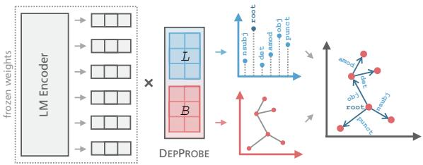
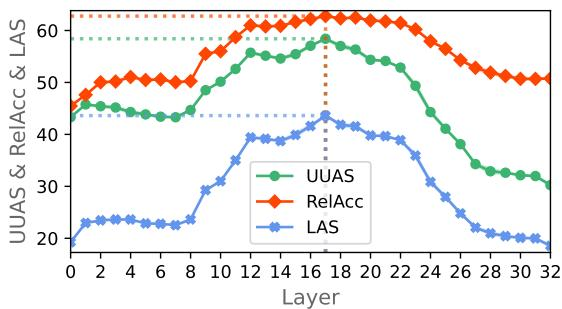
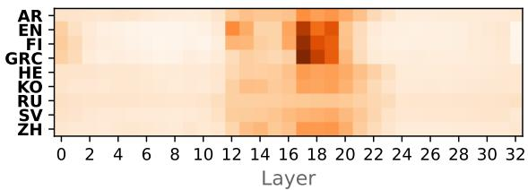
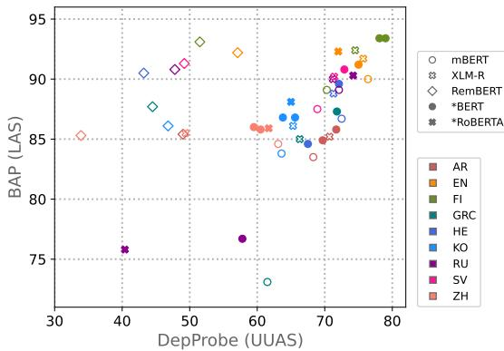

#  Sort by Structure: Language Model Ranking as Dependency Probing

Max Müller-Eberstein ☼ and Rob van der Goot ☼ and Barbara Plank ☼U

☼ Department of Computer Science, IT University of Copenhagen, Denmark U Center for Information and Language Processing (CIS), LMU Munich, Germany mamy@itu.dk, robv@itu.dk, bplank@cis.lmu.de

## Abstract

Making an informed choice of pre-trained language model (LM) is critical for performance, yet environmentally costly, and as such widely underexplored. The field of Computer Vision has begun to tackle encoder ranking, with promising forays into Natural Language Processing, however they lack coverage of linguistic tasks such as structured prediction. We propose probing to rank LMs, specifically for parsing dependencies in a given language, by measuring the degree to which labeled trees are recoverable from an LM’s contextualized embeddings. Across 46 typologically and architecturally diverse LM-language pairs, our probing approach predicts the best LM choice 79% of the time using orders of magnitude less compute than training a full parser. Within this study, we identify and analyze one recently proposed decoupled LM—RemBERT—and find it strikingly contains less inherent dependency information, but often yields the best parser after full fine-tuning. Without this outlier our approach identifies the best LM in 89% of cases.

## 1 Introduction

With the advent of massively pre-trained language models (LMs) in Natural Language Processing (NLP), it has become crucial for practitioners to choose the best LM encoder for their given task early on, regardless of the rest of their proposed model architecture. The greatest variation of LMs lies in the language or domain-specificity of the unlabelled data used during pre-training (with architectures often staying identical).

Typically, better expressivity is expected from language/domain-specific LMs (Gururangan et al., 2020; Dai et al., 2020) while open-domain settings necessitate high-capacity models with access to as much pre-training data as possible. This tradeoff is difficult to navigate, and given that multiple specialized LMs (or none at all) are available, practitioners often resort to an ad-hoc choice. In absence of immediate performance indicators, the most accurate choice could be made by training the full model using each LM candidate, however this is often infeasible and wasteful (Strubell et al., 2019).

Recently, the field of Computer Vision (CV) has attempted to tackle this problem by quantifying useful information in pre-trained image encoders as measured directly on labeled target data without fine-tuning (Nguyen et al., 2020; You et al., 2021). While first forays for applying these methods to NLP are promising, some linguistic tasks differ substantially: Structured prediction, such as parsing syntactic dependencies, is a fundamental NLP task not covered by prior encoder ranking methods due to its graphical output. Simultaneously, performance prediction in NLP has so far been studied as a function of dataset and model characteristics (Xia et al., 2020; Ye et al., 2021) and has yet to examine how to rank large pools of pre-trained LMs.

Given the closely related field of probing, in which lightweight models quantify task-specific information in pre-trained LMs, we recast its objective in the context of performance prediction and ask: How predictive is lightweight probing at choosing the best performing LMfor dependency parsing? To answer this question, we contribute:

• An efficient encoder ranking method for structured prediction using dependency probing (Müller-Eberstein et al., 2022; DEPPROBE) to quantify latent syntax (Section 2).

• Experiments across 46 typologically and architecturally diverse LM + target language combinations (Section 3).1

• An in-depth analysis of the surprisingly low inherent dependency information in Rem-BERT (Chung et al., 2021) compared to its high fine-tuned performance (Section 4).

  
Figure 1: Visualization of DEPPROBE. Relational and structural subspaces L and B are combined to extract labeled, directed trees from embeddings.

## 2 Methodology

Probing pre-trained LMs is highly related to encoder ranking in CV where the ease of recoverability of class-differentiating information is key (Nguyen et al., 2020; You et al., 2021). This approach is more immediate than existing NLP performance prediction methods which rely on featurized representations of source and target data without actively ranking encoders (Xia et al., 2020; Ye et al., 2021). As most experiments in NLP are conducted using a limited set of LMs—often a single model—without strong prior motivations, we see LM ranking as a critical task on its own.

While probes for LMs come in many forms, they are generally characterized as lightweight, minimal architectures intended to solve a particular task (Hall Maudslay et al., 2020). While non-linear models such as small multi-layer perceptrons are often used (Tenney et al., 2019), there have been criticisms given that their performance highly depends on the complexity of their architecture (Hewitt and Liang, 2019; Voita and Titov, 2020). As such, we rely on linear probes alone, which have the benefit of being extremely lightweight, closely resembling existing performance prediction methods (You et al., 2021), and allow for statements about linear subspaces contained in LM latent spaces.

DEPPROBE (Müller-Eberstein et al., 2022; visualized in Figure 1) is a linear formulation for extracting fully labeled dependency trees based on the structural probe by Hewitt and Manning (2019). Given contextualized embeddings of dimensionality d, a linear transformation $B \in \mathbb { R } ^ { b \times d }$ with b d (typically b = 128) maps them into a subspace in which the Euclidean distance between embeddings corresponds to the number of edges between the respective words in the gold dependency graph.

In our formulation, we supplement a linear transformation $L \in \mathbb { R } ^ { l \times d }$ (with l = number of dependency relations) which maps each embedding to a subspace in which the magnitude of each dimension corresponds to the likelihood of a word and its head being governed by a certain relation.

By computing the minimum spanning tree in B and then finding the word with the highest root likelihood in L, we can determine the directionality of all edges as pointing away from the root. All remaining edges are labeled according to the most likely non-root class in $L ,$ resulting in a fully directed and labeled dependency tree.

Note that this approach differs substantially from prior approaches which yield undirected and/or unlabeled trees (Hewitt and Manning, 2019; Kulmizev et al., 2020) or use pre-computed edges and non-linear classifiers (Tenney et al., 2019). DEP-PROBE efficiently computes the full target metric (i.e. labeled attachment scores) instead of approximate alternatives (e.g. undirected, unlabeled attachment scores or tree depth correlation).

## 3 Experiments

Setup We investigate the ability of DEPPROBE to select the best performing LM for dependency parsing across nine linguistically diverse treebanks from Universal Dependencies (Zeman et al., 2021; UD) which were previously chosen by Smith et al. (2018) to reflect diverse writing systems and morphological complexity (see Appendix A).

For each target language, we employ three multilingual LMs—mBERT (Devlin et al., 2019), XLM-R (Conneau et al., 2020), RemBERT (Chung et al., 2021)—as well as 1–3 language-specific LMs retrieved by popularity from HuggingFace’s Model Hub (Wolf et al., 2020), resulting in a total of 46 LM-target pair setups (see Appendix C).

For each combination, we train a DEPPROBE to compute labeled attachment scores (LAS), hypothesizing that LMs from which trees are most accurately recoverable also perform better in a fully tuned parser. To evaluate the true downstream performance of a fully-tuned model, we further train a deep biaffine attention parser (BAP; Dozat and Manning, 2017) on each LM-target combination. Compared to full fine-tuning, DEPPROBE only optimizes the matrices B and L, resulting in the extraction of labeled trees with as few as 190k instead of 583M trainable parameters for the largest Rem-BERT model (details in Appendix B).

We measure the predictive power of probing for fully fine-tuned model performance using the Pearson correlation coefficient $\rho$ as well as the weighted

  
Figure 2: LAS of DEPPROBE in relation to full BAP across nine language targets (dev) using languagespecific and multilingual LM encoders of different architecture types (exact scores in Appendix C).

Kendall’s $\tau _ { w } \left( { \mathrm { V i g n a } } , 2 0 1 5 \right)$ . The latter metric corresponds to a correlation coefficient in [ 1, 1] and simultaneously defines the probability of choosing the better LM given a pair as $\textstyle { \frac { \tau _ { w } + 1 } { 2 } }$ , allowing us to quantify the overall quality of a ranking.

Results Comparing the LAS of DEPPROBE’s lightweight predictions against full BAP finetuning in Figure 2, we see a clear correlation as the probe correctly predicts the difficulty of parsing languages relative to each other and also ranks models within languages closely according to their final performance. With a ${ , \tau _ { w } }$ of .58 between scores $( p < 0 . 0 0 1 )$ , this works out to DEPPROBE selecting the better performing final model given any two models 79% of the time. Additionally, LAS is slightly more predictive of final performance than unlabeled, undirected attachment scores (UUAS) with $\tau _ { w } = . 5 7$ to which prior probing approaches are restricted (see Appendix C).

Given a modest $\rho$ of .32 $( p \ < 0 . 0 5 )$ , we surprisingly also observe a single strong outlier to this pattern, namely the multilingual RemBERT (Chung et al., 2021) decoupled LM architecture. While DEPPROBE consistently ranks it low as it cannot extract dependency parse trees as accurately as from the BERT and RoBERTa-based architectures, RemBERT actually performs best on four out of the nine targets when fully fine-tuned in BAP. Excluding monolingual LMs, it further outperforms the other multilingual LMs in seven out of nine cases. As it is a more recent and distinctive architecture with many differences to the most commonly-used contemporary LMs, we analyze potential reasons for this discrepancy in Section 4.

Excluding RemBERT as an outlier, we find substantially higher correlation among all other models: $\rho = . 7 8$ and $\tau _ { w } = . 7 8 \ ( p < 0 . 0 0 1 )$ . This means that among these models, fully fine-tuning the LM for which DEPPROBE extracts the highest scores, yields the better final performance 89% of the time.

  
Figure 3: Dependency Information per RemBERT Layer via DEPPROBE’s structural, relational and parsing accuracy (UUAS, RelAcc, LAS) on EN-EWT (dev).

In practice, learning DEPPROBE’s linear transformations while keeping the LM frozen is multiple orders of magnitude more efficient than fully training a complex parser plus the LM’s parameters. As such, linear probing offers a viable method for selecting the best encoder in absence of qualitative heuristics or intuitions. This predictive performance is furthermore achievable in minutes compared to hours and at a far lower energy budget (see Appendices B and C).

## 4 Probing Decoupled LMs

Considering DEPPROBE’s high predictive performance across LMs with varying architecture types, languages/domains and pre-training procedures, we next investigate its limitations: Specifically, which differences in RemBERT (Chung et al., 2021) lead to it being measured as an outlier with seemingly low amounts of latent dependency information despite reaching some of the highest scores after full fine-tuning. The architecture has 32 layers and embeddings with $d = 1 1 5 2$ , compared to most models’ 12 layers and $d = 7 6 8$ . It accommodates these size and depth increases within a manageable parameter envelope by using smaller input embeddings with $d _ { \mathrm { i n } } = 2 5 6$ . While choosing different d for the input and output embeddings is not possible in most prior models due to both embedding matrices being coupled, RemBERT decouples them, leading to a larger parameter budget and less overfitting on the masked language modeling pre-training task (Chung et al., 2021).

  
Figure 4: Per-language α of RemBERT Layers for DEPPROBE across all layer weights (dark > light).

<table><tr><td>MODEL</td><td>AR</td><td>EN</td><td>FI</td><td>GRC</td><td>HE</td><td>KO</td><td>RU</td><td>SV</td><td>ZH</td></tr><tr><td rowspan="2">mBERT</td><td>65</td><td>74</td><td>65</td><td>46</td><td>69</td><td>58</td><td>68</td><td>65</td><td>58</td></tr><tr><td>±.08</td><td>±.09</td><td>±.35</td><td>±.14</td><td>±.23</td><td>±.18</td><td>±.31</td><td>±.12</td><td>±.17</td></tr><tr><td rowspan="2">XLM-R</td><td>60</td><td>70</td><td>66</td><td>53</td><td>60</td><td>49</td><td>57</td><td>51</td><td>51</td></tr><tr><td>±.14</td><td>±.08</td><td>±.18</td><td>±.19</td><td>±.20</td><td>±.08</td><td>±.34</td><td>±.24</td><td>±.53</td></tr><tr><td rowspan="2">RemBERT</td><td>58</td><td>56</td><td>52</td><td>54</td><td>52</td><td>46</td><td>49</td><td>43</td><td>39</td></tr><tr><td>±.12</td><td>±.22</td><td>±.15</td><td>±.18</td><td>±.05</td><td>±.14</td><td>±.04</td><td>±.08</td><td>±.24</td></tr></table>

Table 1: LAS of BAP Trained on Frozen LMs. A biaffine attention parsing head is trained on top of frozen mBERT, XLM-R and RemBERT for each of the nine target languages ( standard deviation).

Layer-wise Probing Prior probing studies have found dependency information to be concentrated around the middle layers of an LM (Hewitt and Manning, 2019; Tenney et al., 2019; Fayyaz et al., 2021). Using EN-EWT (Silveira et al., 2014), we evaluate whether this holds for RemBERT’s new architecture. Figure 3 confirms that both dependency structural and relational information are most prominent around layer 17 of 32 as indicated by UUAS and relation classification accuracy (RelAcc) respectively. Combining the structural and relational information in DEPPROBE similarly leads to a peak of the LAS at the same layer while decreasing with further distance from the center.

Across all target languages, we next investigate whether probing a sum over the embeddings of all layers weighted by ${ \pmb { \alpha } } \in \mathbb { R } ^ { 3 2 }$ can boost extraction performance in RemBERT. The heavier weighting of middle layers by α, visible in Figure 4, reaffirms a concentration of dependency information in the center. Contrasting probing work on prior models (Tenney et al., 2019; Kulmizev et al., 2020), using all layers does not increase the retrievable dependencies, with LAS differences 1 point. This further confirms that there is not a lack of dependency information in any specific layer, but that there is less within the encoder as a whole.

Frozen Parsing Our probing results show that linear subspaces in RemBERT contain less dependency information than prior LMs. However, DEP-PROBE’s parametrization is kept intentionally simple and may therefore not be capturing non-linearly represented information that is useful during later fine-tuning. To evaluate this hypothesis, we train a full biaffine attention parsing head, but keep the underlying LM encoder frozen. This allows us to quantify the performance gains which come from inherent dependency information versus later taskspecific fine-tuning.

Table 1 confirms our findings from DEPPROBE and shows that despite RemBERT outperforming mBERT and XLM-R when fully fine-tuned, it has substantially lower LAS across almost all languages when no full model fine-tuning is applied. This leads us to conclude that there indeed is less inherent dependency information in the newer model and that most performance gains must be occurring during task-specific full fine-tuning.

Given that DEPPROBE extracts dependency structures reliably from LM architectures with different depths and embedding dimensionalities (e.g. $\mathrm { R o B E R T a _ { l a r g e } }$ with 24 layers and $d = 1 0 2 4$ versus $\mathrm { R u B E R T _ { \mathrm { t i n y } } }$ with 3 layers and $d = 3 1 2 )$ as well as varying tokenization, optimization and pre-training data, the key difference in RemBERT appears to be embedding decoupling. The probe’s linear formulation is not the limiting factor as the non-linear, biaffine attention head also produces less accurate parses when the LM’s weights are frozen. Our analyses thus suggest that RemBERT’s decoupled architecture contains less dependency information out-of-the-box, but follows prior patterns such as consolidating dependency information towards its middle layers and serving as strong initialization for parser training.

Lastly, RemBERT’s larger number of tunable parameters compared to all other LM candidates may provide it further capacity, especially after full fine-tuning. As our probing methods are deliberately applied to the frozen representations of the encoder, it becomes especially important to consider the degree to which these embeddings may change after updating large parts of the model. Taking these limitations into account, the high correlations with respect to encoder ranking nonetheless enable a much more informed selection of LMs from a larger pool than was previously possible.

## 5 Conclusion

To guide practitioners in their choice of LM encoder for the structured prediction task of dependency parsing, we leveraged a lightweight, linear

DEPPROBE to quantify the latent syntactic information via the labeled attachment score. Evaluating 46 pairs of multilingual/language-specific LMs and nine typologically diverse target treebanks, we found DEPPROBE to not only be efficient in its predictions, with orders of magnitude fewer trainable parameters, but to also be accurate 79–89% of the time in predicting which LM will outperform another when used in a fully tuned parser. This allows for a substantially faster iteration over potential LM candidates, saving hours worth of compute in practice (Section 3).

Our experiments further revealed surprising insights on the newly proposed RemBERT architecture: While particularly effective for multilingual dependency parsing when fully fine-tuned, it contains substantially less latent dependency information relative to prior widely-used models such as mBERT and XLM-R. Among its architectural differences, we identified embedding decoupling to be the most likely contributor, while added model capacity during fine-tuning may also improve final performance. Our analyses showed that despite containing less dependency information overall, RemBERT follows prior findings such as structure and syntactic relations being consolidated towards the middle layers. Given these consistencies, performance differences between decoupled LMs may be predictable using probes, but in absence of similar multilingual LMs using decoupled embeddings this effect remains to be studied (Section 4).

Overall, the high efficiency and predictive power of ranking LM encoders via linear probing as well as the ease with which they can be analyzed—even when they encounter their limitations—offers immediate benefits to practitioners who have so far had to rely on their own intuitions when making a selection. This opens up avenues for future research by extending these methods to more tasks and LM architectures in order to enable better informed modeling decisions.

## Acknowledgements

We would like to thank the NLPnorth group for insightful discussions on this work, in particular Elisa Bassignana and Mike Zhang. Thanks also to ITU’s High-performance Computing team. Finally, we thank the anonymous reviewers for their helpful feedback. This research is supported by the Independent Research Fund Denmark (Danmarks Frie Forskningsfond; DFF) grant number 9063-00077B.

## References

Wissam Antoun, Fady Baly, and Hazem Hajj. 2020. AraBERT: Transformer-based model for Arabic language understanding. In Proceedings ofthe 4th Workshop on Open-Source Arabic Corpora and Processing Tools, with a Shared Task on Offensive Language Detection, pages 9–15, Marseille, France. European Language Resource Association.

Pavel Blinov. 2021. RoBERTa-base Russian. https://huggingface.co/blinoff/ roberta-base-russian-v0. Accessed 4th January, 2022.

Jayeol Chun, Na-Rae Han, Jena D. Hwang, and Jinho D. Choi. 2018. Building Universal Dependency treebanks in Korean. In Proceedings ofthe Eleventh International Conference on Language Resources and Evaluation (LREC 2018), Miyazaki, Japan. European Language Resources Association (ELRA).

Hyung Won Chung, Thibault Fevry, Henry Tsai, Melvin Johnson, and Sebastian Ruder. 2021. Rethinking embedding coupling in pre-trained language models. In International Conference on Learning Representations.

Alexis Conneau, Kartikay Khandelwal, Naman Goyal, Vishrav Chaudhary, Guillaume Wenzek, Francisco Guzmán, Edouard Grave, Myle Ott, Luke Zettlemoyer, and Veselin Stoyanov. 2020. Unsupervised cross-lingual representation learning at scale. In Proceedings of the 58th Annual Meeting of the Associationfor Computational Linguistics, pages 8440– 8451, Online. Association for Computational Linguistics.

Yiming Cui, Wanxiang Che, Ting Liu, Bing Qin, and Ziqing Yang. 2021. Pre-training with whole word masking for Chinese BERT. IEEE/ACM Transactions on Audio, Speech, and Language Processing, 29:3504–3514.

Xiang Dai, Sarvnaz Karimi, Ben Hachey, and Cecile Paris. 2020. Cost-effective selection of pretraining data: A case study of pretraining BERT on social media. In Findings ofthe Associationfor Computational Linguistics: EMNLP 2020, pages 1675–1681, Online. Association for Computational Linguistics.

David Dale. 2021. RuBERT-tiny: A small and fast BERT for Russian. https://habr.com/ru/ post/562064/. Accessed 4th January, 2022.

Jacob Devlin, Ming-Wei Chang, Kenton Lee, and Kristina Toutanova. 2019. BERT: Pre-training of deep bidirectional transformers for language understanding. In Proceedings ofthe 2019 Conference of the North American Chapter ofthe Associationfor Computational Linguistics: Human Language Technologies, Volume 1 (Long and Short Papers), pages 4171–4186, Minneapolis, Minnesota. Association for Computational Linguistics.

Timothy Dozat and Christopher D. Manning. 2017. Deep biaffine attention for neural dependency parsing. In 5th International Conference on Learning Representations, ICLR 2017, Toulon, France, April 24-26, 2017, Conference Track Proceedings. Open-Review.net.

Hanne Eckhoff, Kristin Bech, Gerlof Bouma, Kristine Eide, Dag Haug, Odd Einar Haugen, and Marius Jøhndal. 2018. The PROIEL treebank family: a standard for early attestations of Indo-European languages. Language Resources and Evaluation, 52(1):29–65.

Mohsen Fayyaz, Ehsan Aghazadeh, Ali Modarressi, Hosein Mohebbi, and Mohammad Taher Pilehvar. 2021. Not all models localize linguistic knowledge in the same place: A layer-wise probing on BERToids’ representations. In Proceedings of the Fourth BlackboxNLP Workshop on Analyzing and Interpreting Neural Networks for NLP, pages 375–388, Punta Cana, Dominican Republic. Association for Computational Linguistics.

Suchin Gururangan, Ana Marasovic, Swabha´ Swayamdipta, Kyle Lo, Iz Beltagy, Doug Downey, and Noah A. Smith. 2020. Don’t stop pretraining: Adapt language models to domains and tasks. In Proceedings of the 58th Annual Meeting of the Association for Computational Linguistics, pages 8342–8360, Online. Association for Computational Linguistics.

Jan Hajic, Otakar Smrž, Petr Zemánek, Petr Pajas,ˇ Jan Šnaidauf, Emanuel Beška, Jakub Krácmar, and Kamila Hassanová. 2009. Prague Arabic dependency treebank 1.0.

Rowan Hall Maudslay, Josef Valvoda, Tiago Pimentel, Adina Williams, and Ryan Cotterell. 2020. A tale of a probe and a parser. In Proceedings ofthe 58th Annual Meeting ofthe Associationfor Computational Linguistics, pages 7389–7395, Online. Association for Computational Linguistics.

Charles R. Harris, K. Jarrod Millman, Stéfan J. van der Walt, Ralf Gommers, Pauli Virtanen, David Cournapeau, Eric Wieser, Julian Taylor, Sebastian Berg, Nathaniel J. Smith, Robert Kern, Matti Picus, Stephan Hoyer, Marten H. van Kerkwijk, Matthew Brett, Allan Haldane, Jaime Fernández del Río, Mark Wiebe, Pearu Peterson, Pierre Gérard-Marchant, Kevin Sheppard, Tyler Reddy, Warren Weckesser, Hameer Abbasi, Christoph Gohlke, and Travis E. Oliphant. 2020. Array programming with NumPy. Nature, 585(7825):357–362.

John Hewitt and Percy Liang. 2019. Designing and interpreting probes with control tasks. In Proceedings ofthe 2019 Conference on Empirical Methods in Natural Language Processing and the 9th International Joint Conference on Natural Language Processing (EMNLP-IJCNLP), pages 2733–2743, Hong Kong, China. Association for Computational Linguistics.

John Hewitt and Christopher D. Manning. 2019. A structural probe for finding syntax in word representations. In Proceedings of the 2019 Conference of the North American Chapter ofthe Associationfor Computational Linguistics: Human Language Technologies, Volume 1 (Long and Short Papers), pages 4129–4138, Minneapolis, Minnesota. Association for Computational Linguistics.

J. D. Hunter. 2007. Matplotlib: A 2d graphics environment. Computing in Science & Engineering, 9(3):90– 95.

Kiyoung Kim. 2020. Pretrained language models for korean. https://github.com/kiyoungkim1/ LMkor.

John Koutsikakis, Ilias Chalkidis, Prodromos Malakasiotis, and Ion Androutsopoulos. 2020. Greek-bert: The greeks visiting sesame street. In 11th Hellenic Conference on Artificial Intelligence, SETN 2020, page 110–117, New York, NY, USA. Association for Computing Machinery.

Artur Kulmizev, Vinit Ravishankar, Mostafa Abdou, and Joakim Nivre. 2020. Do neural language models show preferences for syntactic formalisms? In Proceedings ofthe 58th Annual Meeting ofthe Associationfor Computational Linguistics, pages 4077– 4091, Online. Association for Computational Linguistics.

Yinhan Liu, Myle Ott, Naman Goyal, Jingfei Du, Mandar Joshi, Danqi Chen, Omer Levy, Mike Lewis, Luke Zettlemoyer, and Veselin Stoyanov. 2019. Roberta: A robustly optimized BERT pretraining approach. CoRR, abs/1907.11692.

Ilya Loshchilov and Frank Hutter. 2018. Decoupled weight decay regularization. In International Conference on Learning Representations.

Martin Malmsten, Love Börjeson, and Chris Haffenden. 2020. Playing with words at the national library of sweden – making a swedish bert.

Ryan McDonald, Joakim Nivre, Yvonne Quirmbach-Brundage, Yoav Goldberg, Dipanjan Das, Kuzman Ganchev, Keith Hall, Slav Petrov, Hao Zhang, Oscar Täckström, Claudia Bedini, Núria Bertomeu Castelló, and Jungmee Lee. 2013a. Universal Dependency annotation for multilingual parsing. In Proceedings of the 51st Annual Meeting of the Association for Computational Linguistics (Volume 2: Short Papers), pages 92–97, Sofia, Bulgaria. Association for Computational Linguistics.

Ryan McDonald, Joakim Nivre, Yvonne Quirmbach-Brundage, Yoav Goldberg, Dipanjan Das, Kuzman Ganchev, Keith Hall, Slav Petrov, Hao Zhang, Oscar Täckström, Claudia Bedini, Núria Bertomeu Castelló, and Jungmee Lee. 2013b. Universal Dependency annotation for multilingual parsing. In Proceedings of the 51st Annual Meeting of the Association for Computational Linguistics (Volume 2: Short Papers),

pages 92–97, Sofia, Bulgaria. Association for Computational Linguistics.

Max Müller-Eberstein, Rob van der Goot, and Barbara Plank. 2022. Probing for labeled dependency trees. Computing Research Repository, arxiv:2203.12971. Version 1.

Cuong Nguyen, Tal Hassner, Matthias Seeger, and Cedric Archambeau. 2020. Leep: A new measure to evaluate transferability of learned representations. In International Conference on Machine Learning, pages 7294–7305. PMLR.

Sungjoon Park, Jihyung Moon, Sungdong Kim, Won Ik Cho, Jiyoon Han, Jangwon Park, Chisung Song, Junseong Kim, Yongsook Song, Taehwan Oh, Joohong Lee, Juhyun Oh, Sungwon Lyu, Younghoon Jeong, Inkwon Lee, Sangwoo Seo, Dongjun Lee, Hyunwoo Kim, Myeonghwa Lee, Seongbo Jang, Seungwon Do, Sunkyoung Kim, Kyungtae Lim, Jongwon Lee, Kyumin Park, Jamin Shin, Seonghyun Kim, Lucy Park, Alice Oh, Jungwoo Ha, and Kyunghyun Cho. 2021. Klue: Korean language understanding evaluation.

Adam Paszke, Sam Gross, Francisco Massa, Adam Lerer, James Bradbury, Gregory Chanan, Trevor Killeen, Zeming Lin, Natalia Gimelshein, Luca Antiga, Alban Desmaison, Andreas Kopf, Edward Yang, Zachary DeVito, Martin Raison, Alykhan Tejani, Sasank Chilamkurthy, Benoit Steiner, Lu Fang, Junjie Bai, and Soumith Chintala. 2019. PyTorch: An imperative style, high-performance deep learning library. In Advances in Neural Information Processing Systems 32, pages 8024–8035. Curran Associates, Inc.

Sampo Pyysalo, Jenna Kanerva, Anna Missilä, Veronika Laippala, and Filip Ginter. 2015. Universal Dependencies for Finnish. In Proceedings of the 20th Nordic Conference of Computational Linguistics (NODALIDA 2015), pages 163–172, Vilnius, Lithuania. Linköping University Electronic Press, Sweden.

Ali Safaya, Moutasem Abdullatif, and Deniz Yuret. 2020. KUISAIL at SemEval-2020 task 12: BERT-CNN for offensive speech identification in social media. In Proceedings of the Fourteenth Workshop on Semantic Evaluation, pages 2054–2059, Barcelona (online). International Committee for Computational Linguistics.

Sber Devices. 2021. ruRoBERTa-large. https: //huggingface.co/sberbank-ai/ ruRoberta-large. Accessed 4th January, 2022.

Amit Seker, Elron Bandel, Dan Bareket, Idan Brusilovsky, Refael Shaked Greenfeld, and Reut Tsarfaty. 2021. Alephbert: A hebrew large pre-trained language model to start-off your hebrew nlp application with.

Mo Shen, Ryan McDonald, Daniel Zeman, and Peng Qi. 2016. UD\_Chinese-GSD. https://

github.com/UniversalDependencies/ UD\_Chinese-GSD.

Natalia Silveira, Timothy Dozat, Marie-Catherine de Marneffe, Samuel Bowman, Miriam Connor, John Bauer, and Chris Manning. 2014. A gold standard dependency corpus for English. In Proceedings of the Ninth International Conference on Language Resources and Evaluation (LREC’14), pages 2897– 2904, Reykjavik, Iceland. European Language Resources Association (ELRA).

Pranaydeep Singh, Gorik Rutten, and Els Lefever. 2021. A pilot study for BERT language modelling and morphological analysis for ancient and medieval Greek. In Proceedings ofthe 5th Joint SIGHUM Workshop on Computational Linguisticsfor Cultural Heritage, Social Sciences, Humanities and Literature, pages 128–137, Punta Cana, Dominican Republic (online). Association for Computational Linguistics.

Aaron Smith, Miryam de Lhoneux, Sara Stymne, and Joakim Nivre. 2018. An investigation of the interactions between pre-trained word embeddings, character models and POS tags in dependency parsing. In Proceedings of the 2018 Conference on Empirical Methods in Natural Language Processing, pages 2711–2720, Brussels, Belgium. Association for Computational Linguistics.

Emma Strubell, Ananya Ganesh, and Andrew McCallum. 2019. Energy and policy considerations for deep learning in NLP. In Proceedings of the 57th Annual Meeting of the Association for Computational Linguistics, pages 3645–3650, Florence, Italy. Association for Computational Linguistics.

Ian Tenney, Patrick Xia, Berlin Chen, Alex Wang, Adam Poliak, R Thomas McCoy, Najoung Kim, Benjamin Van Durme, Sam Bowman, Dipanjan Das, and Ellie Pavlick. 2019. What do you learn from context? probing for sentence structure in contextualized word representations. In International Conference on Learning Representations.

Rob van der Goot, Ahmet Üstün, Alan Ramponi, Ibrahim Sharaf, and Barbara Plank. 2021. Massive choice, ample tasks (MaChAmp): A toolkit for multitask learning in NLP. In Proceedings of the 16th Conference of the European Chapter of the Associationfor Computational Linguistics: System Demonstrations, pages 176–197, Online. Association for Computational Linguistics.

Sebastiano Vigna. 2015. A weighted correlation index for rankings with ties. In Proceedings of the 24th international conference on World Wide Web, pages 1166–1176.

Antti Virtanen, Jenna Kanerva, Rami Ilo, Jouni Luoma, Juhani Luotolahti, Tapio Salakoski, Filip Ginter, and Sampo Pyysalo. 2019. Multilingual is not enough: BERT for finnish. CoRR, abs/1912.07076.

Pauli Virtanen, Ralf Gommers, Travis E. Oliphant, Matt Haberland, Tyler Reddy, David Cournapeau, Evgeni Burovski, Pearu Peterson, Warren Weckesser, Jonathan Bright, Stéfan J. van der Walt, Matthew Brett, Joshua Wilson, K. Jarrod Millman, Nikolay Mayorov, Andrew R. J. Nelson, Eric Jones, Robert Kern, Eric Larson, C J Carey, ˙Ilhan Polat, Yu Feng, Eric W. Moore, Jake VanderPlas, Denis Laxalde, Josef Perktold, Robert Cimrman, Ian Henriksen, E. A. Quintero, Charles R. Harris, Anne M. Archibald, Antônio H. Ribeiro, Fabian Pedregosa, Paul van Mulbregt, and SciPy 1.0 Contributors. 2020. SciPy 1.0: Fundamental Algorithms for Scientific Computing in Python. Nature Methods, 17:261–272.

Elena Voita and Ivan Titov. 2020. Information-theoretic probing with minimum description length. In Proceedings of the 2020 Conference on Empirical Methods in Natural Language Processing (EMNLP), pages 183–196, Online. Association for Computational Linguistics.

Thomas Wolf, Lysandre Debut, Victor Sanh, Julien Chaumond, Clement Delangue, Anthony Moi, Pierric Cistac, Tim Rault, Remi Louf, Morgan Funtowicz, Joe Davison, Sam Shleifer, Patrick von Platen, Clara Ma, Yacine Jernite, Julien Plu, Canwen Xu, Teven Le Scao, Sylvain Gugger, Mariama Drame, Quentin Lhoest, and Alexander Rush. 2020. Transformers: State-of-the-art natural language processing. In Proceedings of the 2020 Conference on Empirical Methods in Natural Language Processing: System Demonstrations, pages 38–45, Online. Association for Computational Linguistics.

Mengzhou Xia, Antonios Anastasopoulos, Ruochen Xu, Yiming Yang, and Graham Neubig. 2020. Predicting performance for natural language processing tasks. In Proceedings ofthe 58th Annual Meeting ofthe Associationfor Computational Linguistics, pages 8625– 8646, Online. Association for Computational Linguistics.

Zihuiwen Ye, Pengfei Liu, Jinlan Fu, and Graham Neubig. 2021. Towards more fine-grained and reliable NLP performance prediction. In Proceedings of the 16th Conference ofthe European Chapter ofthe Associationfor Computational Linguistics: Main Volume, pages 3703–3714, Online. Association for Computational Linguistics.

Kaichao You, Yong Liu, Jianmin Wang, and Mingsheng Long. 2021. Logme: Practical assessment of pre-trained models for transfer learning. In International Conference on Machine Learning, pages 12133–12143. PMLR.

Daniel Zeman, Joakim Nivre, Mitchell Abrams, Elia Ackermann, Noëmi Aepli, Hamid Aghaei, Željko Agic, Amir Ahmadi, Lars Ahrenberg, Chika Kennedy´ Ajede, Gabriele Aleksandravi˙ ciˇ ut¯ e, Ika Alfina, Lene˙ Antonsen, Katya Aplonova, Angelina Aquino, Carolina Aragon, Maria Jesus Aranzabe, Bilge Nas Arıcan, Hórunn Arnardóttir, Gashaw Arutie, Jes- sica Naraiswari Arwidarasti, Masayuki Asahara,

Deniz Baran Aslan, Luma Ateyah, Furkan Atmaca, Mohammed Attia, Aitziber Atutxa, Liesbeth Au gustinus, Elena Badmaeva, Keerthana Balasubra mani, Miguel Ballesteros, Esha Banerjee, Sebastian Bank, Verginica Barbu Mititelu, Starkaður Barkar son, Rodolfo Basile, Victoria Basmov, Colin Batch elor, John Bauer, Seyyit Talha Bedir, Kepa Ben goetxea, Gözde Berk, Yevgeni Berzak, Irshad Ah mad Bhat, Riyaz Ahmad Bhat, Erica Biagetti, Eckhard Bick, Agne Bielinskien˙ e, Kristín Bjarnadóttir,˙ Rogier Blokland, Victoria Bobicev, Loïc Boizou, Emanuel Borges Völker, Carl Börstell, Cristina Bosco, Gosse Bouma, Sam Bowman, Adriane Boyd, Anouck Braggaar, Kristina Brokaite, Aljoscha Bur-˙ chardt, Marie Candito, Bernard Caron, Gauthier Caron, Lauren Cassidy, Tatiana Cavalcanti, Gül¸sen Cebiroglu Eryi˘ git, Flavio Massimiliano Cecchini,˘ Giuseppe G. A. Celano, Slavomír Céplö, Nesli-ˇ han Cesur, Savas Cetin, Özlem Çetinoglu, Fabri-˘ cio Chalub, Shweta Chauhan, Ethan Chi, Taish Chika, Yongseok Cho, Jinho Choi, Jayeol Chun, Juyeon Chung, Alessandra T. Cignarella, Silvie Cinková, Aurélie Collomb, Çagrı Çöltekin, Miriam˘ Connor, Marine Courtin, Mihaela Cristescu, Phile mon Daniel, Elizabeth Davidson, Marie-Catherine de Marneffe, Valeria de Paiva, Mehmet Oguz De rin, Elvis de Souza, Arantza Diaz de Ilarraza, Carly Dickerson, Arawinda Dinakaramani, Elisa Di Nuovo, Bamba Dione, Peter Dirix, Kaja Do brovoljc, Timothy Dozat, Kira Droganova, Puneet Dwivedi, Hanne Eckhoff, Sandra Eiche, Marhaba Eli, Ali Elkahky, Binyam Ephrem, Olga Erina, Tomaž Erjavec, Aline Etienne, Wograine Evelyn, Sidney Facundes, Richárd Farkas, Jannatul Fer daousi, Marília Fernanda, Hector Fernandez Alcalde, Jennifer Foster, Cláudia Freitas, Kazunori Fujita, Katarína Gajdošová, Daniel Galbraith, Marcos Gar cia, Moa Gärdenfors, Sebastian Garza, Fabrício Fer raz Gerardi, Kim Gerdes, Filip Ginter, Gustavo Godoy, Iakes Goenaga, Koldo Gojenola, Memduh Gökırmak, Yoav Goldberg, Xavier Gómez Guino vart, Berta González Saavedra, Bernadeta Griciut¯ e,˙ Matias Grioni, Loïc Grobol, Normunds Gruz¯ ¯ıtis, Bruno Guillaume, Céline Guillot-Barbance, Tunga Güngör, Nizar Habash, Hinrik Hafsteinsson, Jan Ha jic, Jan Hajiˇ c jr., Mika Hämäläinen, Linh Hà Mˇ y˜ Na-Rae Han, Muhammad Yudistira Hanifmuti, Sam Hardwick, Kim Harris, Dag Haug, Johannes Heinecke, Oliver Hellwig, Felix Hennig, Barbora Hladká, Jaroslava Hlavácová, Florinel Hociung, Petter Hohle,ˇ Eva Huber, Jena Hwang, Takumi Ikeda, Anton Kar Ingason, Radu Ion, Elena Irimia, Olájídé Ishola, Kaoru Ito, Siratun Jannat, Tomáš Jelínek, Apoorva Jha, Anders Johannsen, Hildur Jónsdóttir, Fredrik Jørgensen, Markus Juutinen, Sarveswaran K, Hüner Ka¸sıkara, Andre Kaasen, Nadezhda Kabaeva, Syl vain Kahane, Hiroshi Kanayama, Jenna Kanerva, Neslihan Kara, Boris Katz, Tolga Kayadelen, Jes sica Kenney, Václava Kettnerová, Jesse Kirchner, Elena Klementieva, Elena Klyachko, Arne Köhn, Abdullatif Köksal, Kamil Kopacewicz, Timo Korki akangas, Mehmet Köse, Natalia Kotsyba, Jolanta Kovalevskaite, Simon Krek, Parameswari Krishna-˙ murthy, Sandra Kübler, Oguzhan Kuyrukçu, Aslı˘ Kuzgun, Sookyoung Kwak, Veronika Laippala, Lucia Lam, Lorenzo Lambertino, Tatiana Lando, Septina Dian Larasati, Alexei Lavrentiev, John Lee, Phuong Lê Hông, Alessandro Lenci, Saran Lertpra-\` dit, Herman Leung, Maria Levina, Cheuk Ying Li, Josie Li, Keying Li, Yuan Li, KyungTae Lim, Bruna Lima Padovani, Krister Lindén, Nikola Ljubešic,´ Olga Loginova, Stefano Lusito, Andry Luthfi, Mikko Luukko, Olga Lyashevskaya, Teresa Lynn, Vivien Macketanz, Menel Mahamdi, Jean Maillard, Aibek Makazhanov, Michael Mandl, Christopher Manning, Ruli Manurung, Bü¸sra Mar¸san, Cat˘ alina M˘ ar˘ an-˘ duc, David Marecek, Katrin Marheinecke, Héctorˇ Martínez Alonso, Lorena Martín-Rodríguez, André Martins, Jan Mašek, Hiroshi Matsuda, Yuji Matsumoto, Alessandro Mazzei, Ryan McDonald, Sarah McGuinness, Gustavo Mendonça, Tatiana Merzhevich, Niko Miekka, Karina Mischenkova, Margarita Misirpashayeva, Anna Missilä, Cat˘ alin˘ Mititelu, Maria Mitrofan, Yusuke Miyao, AmirHos sein Mojiri Foroushani, Judit Molnár, Amirsaeid Moloodi, Simonetta Montemagni, Amir More, Laura Moreno Romero, Giovanni Moretti, Keiko Sophie Mori, Shinsuke Mori, Tomohiko Morioka, Shigeki Moro, Bjartur Mortensen, Bohdan Moskalevskyi, Kadri Muischnek, Robert Munro, Yugo Murawaki, Kaili Müürisep, Pinkey Nainwani, Mariam Nakhlé, Juan Ignacio Navarro Horñiacek, Anna Nedoluzhko, Gunta Nešpore-Berzkalne, Manuela Nevaci, Luong¯ Nguy˜ên Thi., Huy\`ên Nguy˜ên Thi. Minh, Yoshihiro Nikaido, Vitaly Nikolaev, Rattima Nitisaroj, Alireza Nourian, Hanna Nurmi, Stina Ojala, Atul Kr. Ojha, Adédayo. Olúòkun, Mai Omura, Emeka Onwueg buzia, Petya Osenova, Robert Östling, Lilja Øvre lid, ¸Saziye Betül Özate¸s, Merve Özçelik, Arzu can Özgür, Balkız Öztürk Ba¸saran, Hyunji Hay ley Park, Niko Partanen, Elena Pascual, Marco Passarotti, Agnieszka Patejuk, Guilherme Paulino Passos, Angelika Peljak-Łapinska, Siyao Peng,´ Cenel-Augusto Perez, Natalia Perkova, Guy Perrier, Slav Petrov, Daria Petrova, Jason Phelan, Jussi Piitulainen, Tommi A Pirinen, Emily Pitler, Bar bara Plank, Thierry Poibeau, Larisa Ponomareva, Martin Popel, Lauma Pretkalnina, Sophie Prévost, Prokopis Prokopidis, Adam Przepiórkowski, Ti ina Puolakainen, Sampo Pyysalo, Peng Qi, An driela Rääbis, Alexandre Rademaker, Mizanur Ra homan, Taraka Rama, Loganathan Ramasamy, Car los Ramisch, Fam Rashel, Mohammad Sadegh Ra sooli, Vinit Ravishankar, Livy Real, Petru Rebeja, Siva Reddy, Mathilde Regnault, Georg Rehm, Ivan Riabov, Michael Rießler, Erika Rimkute, Larissa Ri-˙ naldi, Laura Rituma, Putri Rizqiyah, Luisa Rocha, Eiríkur Rögnvaldsson, Mykhailo Romanenko, Rudolf Rosa, Valentin Rosca, Davide Rovati, Olga Rud ina, Jack Rueter, Kristján Rúnarsson, Shoval Sadde, Pegah Safari, Benoît Sagot, Aleksi Sahala, Shadi Saleh, Alessio Salomoni, Tanja Samardžic, Stephanie´ Samson, Manuela Sanguinetti, Ezgi Sanıyar, Dage Särg, Baiba Saul¯ıte, Yanin Sawanakunanon, Shefali Saxena, Kevin Scannell, Salvatore Scarlata, Nathan Schneider, Sebastian Schuster, Lane Schwartz,

Djamé Seddah, Wolfgang Seeker, Mojgan Seraji, Syeda Shahzadi, Mo Shen, Atsuko Shimada, Hiroyuki Shirasu, Yana Shishkina, Muh Shohibussirri, Dmitry Sichinava, Janine Siewert, Einar Freyr Sigurðsson, Aline Silveira, Natalia Silveira, Maria Simi, Radu Simionescu, Katalin Simkó, Mária Šimková, Kiril Simov, Maria Skachedubova, Aaron Smith, Isabela Soares-Bastos, Shafi Sourov, Carolyn Spadine, Rachele Sprugnoli, Steinhór Steingrímsson, Antonio Stella, Milan Straka, Emmett Strickland, Jana Strnadová, Alane Suhr, Yogi Lesmana Sulestio, Umut Sulubacak, Shingo Suzuki, Zsolt Szántó, Chihiro Taguchi, Dima Taji, Yuta Takahashi, Fabio Tamburini, Mary Ann C. Tan, Takaaki Tanaka, Dipta Tanaya, Samson Tella, Isabelle Tellier, Marinella Testori, Guillaume Thomas, Liisi Torga, Marsida Toska, Trond Trosterud, Anna Trukhina, Reut Tsarfaty, Utku Türk, Francis Tyers, Sumire Uematsu, Roman Untilov, Zdenka Urešová, Larraitz Uria, Hansˇ Uszkoreit, Andrius Utka, Sowmya Vajjala, Rob van der Goot, Martine Vanhove, Daniel van Niekerk, Gertjan van Noord, Viktor Varga, Eric Villemonte de la Clergerie, Veronika Vincze, Natalia Vlasova, Aya Wakasa, Joel C. Wallenberg, Lars Wallin, Abigail Walsh, Jing Xian Wang, Jonathan North Washington, Maximilan Wendt, Paul Widmer, Sri Hartati Wijono, Seyi Williams, Mats Wirén, Christian Wittern, Tsegay Woldemariam, Tak-sum Wong, Alina Wróblewska, Mary Yako, Kayo Yamashita, Naoki Yamazaki, Chunxiao Yan, Koichi Yasuoka, Marat M. Yavrumyan, Arife Betül Yenice, Olcay Taner Yıldız, Zhuoran Yu, Arlisa Yuliawati, Zdenek Žabokrtský,ˇ Shorouq Zahra, Amir Zeldes, He Zhou, Hanzhi Zhu, Anna Zhuravleva, and Rayan Ziane. 2021. Universal dependencies 2.9. LINDAT/CLARIAH-CZ digital library at the Institute of Formal and Applied Linguistics (ÚFAL), Faculty of Mathematics and Physics, Charles University.

## Appendices

## A Treebanks

<table><tr><td>TARGET</td><td>LANG</td><td>FAMILY</td><td>SIZE</td></tr><tr><td>AR-PADT</td><td>Arabic</td><td>Afro-Asiatic</td><td>7.6k</td></tr><tr><td>EN-EWT</td><td>English</td><td>Indo-European</td><td>16.6k</td></tr><tr><td>FI-TDT</td><td>Finnish</td><td>Uralic</td><td>15.1k</td></tr><tr><td>GRC-PROIEL</td><td>Ancient Greek</td><td>Indo-European</td><td>17.1k</td></tr><tr><td>HE-HTB</td><td>Hebrew</td><td>Afro-Asiatic</td><td>6.2k</td></tr><tr><td>KO-GSD</td><td>Korean</td><td>Korean</td><td>6.3k</td></tr><tr><td>RU-GSD</td><td>Russian</td><td>Indo-European</td><td>5k</td></tr><tr><td>SV-Talbanken</td><td>Swedish</td><td>Indo-European</td><td>6.0k</td></tr><tr><td>ZH-GSD</td><td>Chinese</td><td>Sino-Tibetan</td><td>5.0k</td></tr></table>

Table 2: Target Treebanks based on Smith et al. (2018) with language family (FAMILY) and total number of sentences (SIZE).

Table 2 lists the nine target treebanks based on the set by Smith et al. (2018): AR-PADT (Hajicˇ et al., 2009), EN-EWT (Silveira et al., 2014), FI-

TDT (Pyysalo et al., 2015), GRC-PROIEL (Eckhoff et al., 2018), HE-HTB (McDonald et al., 2013a), KO-GSD (Chun et al., 2018), RU-GSD (McDonald et al., 2013b), SV-Talbanken (McDonald et al., 2013a), ZH-GSD (Shen et al., 2016). We use these treebanks as provided in Universal Dependencies v2.9 (Zeman et al., 2021). DEPPROBE and BAP are trained on each target’s respective training split and are evaluated on the development split as this work aims to analyze general performance patterns instead of state-of-the-art performance.

## B Experiment Setup

DEPPROBE is implemented in PyTorch v1.9.0 (Paszke et al., 2019) and uses language models from the Transformers library v4.13.0 and the associated Model Hub (Wolf et al., 2020). Following the structural probe by Hewitt and Manning (2019), each token which is split by the LM encoder into multiple subwords is mean-pooled. Similarly, we follow the original hyperparameter settings and set the structural subspace dimensionality to $b =$ 128 and use embeddings from the middle layer of each LM (Hewitt and Manning, 2019; Tenney et al., 2019; Fayyaz et al., 2021). The structural loss is computed based on the absolute difference of the Euclidean distance between transformed word embeddings and the number of edges separating the words in the gold tree (see Hewitt and Manning, 2019 for details). The relational loss is computed using cross entropy between the logits and gold head-child relation. Optimization uses AdamW (Loshchilov and Hutter, 2018) with a learning rate of $1 0 ^ { - 3 }$ which is reduced by a factor of 10 each time the loss plateaus. Early stopping is applied after three epochs without improvement and a maximum of 30 total epochs. With the only trainable parameters being the matrices B and L, the model’s footprint ranges between 51k and 190k parameters.

BAP For the biaffine attention parser (Dozat and Manning, 2017) we use the implementation in the MaChAmp framework v0.3 (van der Goot et al., 2021) with the default training schedule and hyperparameters. The number of trainable parameters depends on the LM encoder’s size and ranges between 14M and 583M.

Analyses For our analyses in Sections 3 and 4 we further make use of numpy v1.21.0 (Harris et al., 2020), SciPy v1.7.0 (Virtanen et al., 2020) and Matplotlib v3.4.3 (Hunter, 2007).

Training Details Models are trained on an NVIDIA A100 GPU with 40GBs of VRAM and an AMD Epyc 7662 CPU. BAP requires around 1 h ( 30 min). DEPPROBE can be trained in around 15 min ( 5 min) with the embedding forward operation being most computationally expensive. The models use batches of size 32 and are initialized using the random seeds 692, 710 and 932.

Reproducibility In order to ensure reproducibility and comparability with future work, we release our code and token-level predictions at https://personads.me/x/naacl-2022-code.

## C Detailed Results

Tables 3–11 list exact LAS and standard deviations for each experiment in Section 3’s Figure 2 in addition to the HuggingFace Model Hub IDs of the LMs used in each of the 46 setups as well as their number of layers, embedding dimensionality d and total number of parameters. In addition, Figure 5 shows UUAS for all setups, equivalent to only probing structurally (Hewitt and Manning, 2019) for unlabeled, undirected dependency trees.1.0

  
Figure 5: UUAS of DEPPROBE in relation to BAP across nine language targets (dev) using languagespecific and multilingual LM encoders of different architecture types.

<table><tr><td>MODELS</td><td>SOURCE</td><td>LAYERS</td><td>EMB d</td><td>PARAMS</td><td>BAP</td><td>DEPPROBE</td></tr><tr><td>bert-base-multilingual-cased</td><td>Devlin et al. (2019)</td><td>12</td><td>768</td><td>178M</td><td>83.5±0.2</td><td>54.8±0.6</td></tr><tr><td>xlm-roberta-base</td><td>Conneau et al. (2020)</td><td>12</td><td>768</td><td>278M</td><td>85.2±0.1</td><td>57.2±0.1</td></tr><tr><td>google/rembert</td><td>Chung et al. (2021)</td><td>32</td><td>1152</td><td>576M</td><td>85.4±0.2</td><td>20.7±0.1</td></tr><tr><td>aubmindlab/bert-base-arabertv02</td><td>Antoun et al. (2020)</td><td>12</td><td>768</td><td>135M</td><td>85.8±0.1</td><td>59.0±0.1</td></tr><tr><td>asafaya/bert-base-arabic</td><td>Safaya et al. (2020)</td><td>12</td><td>768</td><td>111M</td><td>84.9±0.1</td><td>57.0±0.2</td></tr></table>

Table 3: LAS on AR-PADT (Dev) using BAP and DEPPROBE with different LMs ( standard deviation).

<table><tr><td>MODELS</td><td>SOURCE</td><td>LAYERS</td><td>EMB d</td><td>PARAMS</td><td>BAP</td><td>DEPPROBE</td></tr><tr><td>bert-base-multilingual-cased</td><td>Devlin et al. (2019)</td><td>12</td><td>768</td><td>178M</td><td>90.0±0.1</td><td>64.5±0.3</td></tr><tr><td>xlm-roberta-base</td><td>Conneau et al. (2020)</td><td>12</td><td>768</td><td>278M</td><td>91.7±0.2</td><td>64.8±0.1</td></tr><tr><td>google/rembert</td><td>Chung et al. (2021)</td><td>32</td><td>1152</td><td>576M</td><td>92.2±0.0</td><td>41.6±0.3</td></tr><tr><td>bert-base-uncased</td><td>Devlin et al. (2019)</td><td>12</td><td>768</td><td>109M</td><td>91.2±0.1</td><td>63.4±0.3</td></tr><tr><td>roberta-large</td><td>Liu et al. (2019)</td><td>24</td><td>1024</td><td>355M</td><td>92.3±0.2</td><td>59.9±0.2</td></tr></table>

Table 4: LAS on EN-EWT (Dev) using BAP and DEPPROBE with different LMs ( standard deviation).

<table><tr><td>MODELS</td><td>SOURCE</td><td>LAYERS</td><td>EMB d</td><td>PARAMS</td><td>BAP</td><td>DEPPROBE</td></tr><tr><td>bert-base-multilingual-cased</td><td>Devlin et al. (2019)</td><td>12</td><td>768</td><td>178M</td><td>89.1±0.2</td><td>54.5±0.4</td></tr><tr><td>xlm-roberta-base</td><td>Conneau et al. (2020)</td><td>12</td><td>768</td><td>278M</td><td>92.4±0.1</td><td>62.4±0.2</td></tr><tr><td>google/rembert</td><td>Chung et al. (2021)</td><td>32</td><td>1152</td><td>576M</td><td>93.1±0.1</td><td>30.8±0.1</td></tr><tr><td>TurkuNLP/bert-base-finnish-uncased-v1</td><td>Virtanen et al. (2019)</td><td>12</td><td>768</td><td>125M</td><td>93.4±0.1</td><td>68.9±0.3</td></tr><tr><td>TurkuNLP/bert-base-finnish-cased-v1</td><td>Virtanen et al. (2019)</td><td>12</td><td>768</td><td>125M</td><td>93.4±0.1</td><td>67.5±0.4</td></tr></table>

Table 5: LAS on FI-TDT (Dev) using BAP and DEPPROBE with different LMs ( standard deviation).

<table><tr><td>MODELS</td><td>SOURCE</td><td>LAYERS</td><td>EMB d</td><td>PARAMS</td><td>BAP</td><td>DEPPROBE</td></tr><tr><td>bert-base-multilingual-cased</td><td>Devlin et al. (2019)</td><td>12</td><td>768</td><td>178M</td><td>73.1±0.1</td><td>41.6±0.5</td></tr><tr><td>xlm-roberta-base</td><td>Conneau et al. (2020)</td><td>12</td><td>768</td><td>278M</td><td>85.0±0.2</td><td>51.1±0.2</td></tr><tr><td>google/rembert</td><td>Chung et al. (2021)</td><td>32</td><td>1152</td><td>576M</td><td>87.7±0.1</td><td>15.3±0.1</td></tr><tr><td>pranaydeeps/Ancient-Greek-BERT</td><td>Singh et al. (2021)</td><td>12</td><td>768</td><td>113M</td><td>87.3±0.1</td><td>60.0±0.0</td></tr><tr><td>nlpaueb/bert-base-greek-uncased-v1</td><td>Koutsikakis et al. (2020)</td><td>12</td><td>768</td><td>113M</td><td>84.6±0.3</td><td>53.9±0.1</td></tr></table>

Table 6: LAS on GRC-PROIEL (Dev) using BAP and DEPPROBE with different LMs ( standard deviation).

<table><tr><td>MODELS</td><td>SOURCE</td><td>LAYERS</td><td>EMB d</td><td>PARAMS</td><td>BAP</td><td>DEPPROBE</td></tr><tr><td>bert-base-multilingual-cased</td><td>Devlin et al. (2019)</td><td>12</td><td>768</td><td>178M</td><td>86.7±0.2</td><td>60.2±0.6</td></tr><tr><td>xlm-roberta-base</td><td>Conneau et al. (2020)</td><td>12</td><td>768</td><td>278M</td><td>88.8±0.1</td><td>59.2±0.3</td></tr><tr><td>google/rembert</td><td>Chung et al. (2021)</td><td>32</td><td>1152</td><td>576M</td><td>90.5±0.1</td><td>11.6±0.4</td></tr><tr><td>onlplab/alephbert-base</td><td>Seker et al. (2021)</td><td>12</td><td>768</td><td>126M</td><td>89.6±0.1</td><td>61.4±0.2</td></tr></table>

Table 7: LAS on HE-HTB (Dev) using BAP and DEPPROBE with different LMs ( standard deviation).

<table><tr><td>MODELS</td><td>SOURCE</td><td>LAYERS</td><td>EMB d</td><td>PARAMS</td><td>BAP</td><td>DEPPROBE</td></tr><tr><td>bert-base-multilingual-cased</td><td>Devlin et al. (2019)</td><td>12</td><td>768</td><td>178M</td><td>83.8±0.2</td><td>46.6±0.2</td></tr><tr><td>xlm-roberta-base</td><td>Conneau et al. (2020)</td><td>12</td><td>768</td><td>278M</td><td>86.1±0.1</td><td>49.4±0.3</td></tr><tr><td>google/rembert</td><td>Chung et al. (2021)</td><td>32</td><td>1152</td><td>576M</td><td>86.1±0.2</td><td>15.9±0.3</td></tr><tr><td>klue/bert-base</td><td>Park et al. (2021)</td><td>12</td><td>768</td><td>111M</td><td>86.8±0.0</td><td>51.0±0.1</td></tr><tr><td>klue/roberta-large</td><td>Park et al. (2021)</td><td>24</td><td>1024</td><td>337M</td><td>88.1±0.3</td><td>48.8±0.5</td></tr><tr><td>kykim/bert-kor-base</td><td>Kim (2020)</td><td>12</td><td>768</td><td>118M</td><td>86.8±0.1</td><td>46.9±0.4</td></tr><tr><td>bert-base-multilingual-cased</td><td>Devlin et al. (2019)</td><td>12</td><td>768</td><td>178M</td><td> $8 9 . 1 { \pm } 0 . 1 $ </td><td> $6 0 . 7 { \scriptstyle \pm 0 . 1 }$ </td></tr><tr><td>xlm-roberta-base</td><td>Conneau et al. (2020)</td><td>12</td><td>768</td><td>278M</td><td> $9 0 . 0 { \pm } 0 . 2 $ </td><td> $5 9 . 9 2 1 . 1 $ </td></tr><tr><td>google/rembert</td><td>Chung et al. (2021)</td><td>32</td><td>1152</td><td>576M</td><td> $9 0 . 8 { \pm } 0 . 0 $ </td><td> $2 6 . 0 { \pm } 0 . 2 $ </td></tr><tr><td>cointegrated/rubert-tiny</td><td>Dale (2021)</td><td>3</td><td>312</td><td>11M</td><td> $7 6 . 7 { \pm } 0 . 1 $ </td><td> $4 1 . 5 { \pm } 0 . 6 $ </td></tr><tr><td>sberbank-ai/ruRoberta-large</td><td>Sber Devices (2021)</td><td>24</td><td>1024</td><td>355M</td><td> $9 0 . 3 { \pm } 0 . 3 $ </td><td> $6 3 . 2 { \pm } 0 . 4 $ </td></tr><tr><td>blinoff/roberta-base-russian-v0</td><td>Blinov (2021)</td><td>12</td><td>768</td><td>124M</td><td> $7 5 . 8 { \pm } 0 . 0 $ </td><td> $1 5 . 6 { \pm } 0 . 2 $ </td></tr></table>

Table 8: LAS on KO-GSD (Dev) using BAP and DEPPROBE with different LMs ( standard deviation).

Table 9: LAS on RU-GSD (Dev) using BAP and DEPPROBE with different LMs ( standard deviation).

<table><tr><td>MODELS</td><td>SOURCE</td><td>LAYERS</td><td>EMB d</td><td>PARAMS</td><td>BAP</td><td>DEPPROBE</td></tr><tr><td>bert-base-multilingual-cased</td><td>Devlin et al. (2019)</td><td>12</td><td>768</td><td>178M</td><td> $8 7 . 5 { \pm } 0 . 1 $ </td><td>55.5±0.2</td></tr><tr><td>xlm-roberta-base</td><td>Conneau et al. (2020)</td><td>12</td><td>768</td><td>278M</td><td> $9 0 . 2 { \pm } 0 . 1 $ </td><td>59.1±0.2</td></tr><tr><td>google/rembert</td><td>Chung et al. (2021)</td><td>32</td><td>1152</td><td>576M</td><td> $9 1 . 3 { \pm } 0 . 3 $ </td><td>31.7±0.3</td></tr><tr><td>KB/bert-base-swedish-cased</td><td>Malmsten et al. (2020)</td><td>12</td><td>768</td><td>125M</td><td>90.8±0.1</td><td>61.7±0.2</td></tr></table>

Table 10: LAS on SV-Talbanken (Dev) using BAP and DEPPROBE with different LMs ( standard deviation).

<table><tr><td>MODELS</td><td>SOURCE</td><td>LAYERS</td><td>EMB d</td><td>PARAMS</td><td>BAP</td><td>DEPPROBE</td></tr><tr><td>bert-base-multilingual-cased</td><td>Devlin et al. (2019)</td><td>12</td><td>768</td><td>178M</td><td>84.6±0.4</td><td>49.1±0.4</td></tr><tr><td>xlm-roberta-base</td><td>Conneau et al. (2020)</td><td>12</td><td>768</td><td>278M</td><td>85.5±0.3</td><td>30.3±0.1</td></tr><tr><td>google/rembert</td><td>Chung et al. (2021)</td><td>32</td><td>1152</td><td>576M</td><td>85.3±0.2</td><td>5.2±0.1</td></tr><tr><td>bert-base-chinese</td><td>Devlin et al. (2019)</td><td>12</td><td>768</td><td>102M</td><td>85.8±0.1</td><td>46.4±0.1</td></tr><tr><td>hfl/chinese-bert-wwm-ext</td><td>Cui et al. (2021)</td><td>12</td><td>768</td><td>102M</td><td>86.0±0.3</td><td>45.8±0.3</td></tr><tr><td>hfl/chinese-roberta-wwm-ext</td><td>Cui et al. (2021)</td><td>12</td><td>768</td><td>102M</td><td>85.9±0.3</td><td>47.7±0.4</td></tr></table>

Table 11: LAS on ZH-GSD (Dev) using BAP and DEPPROBE with different LMs ( standard deviation).