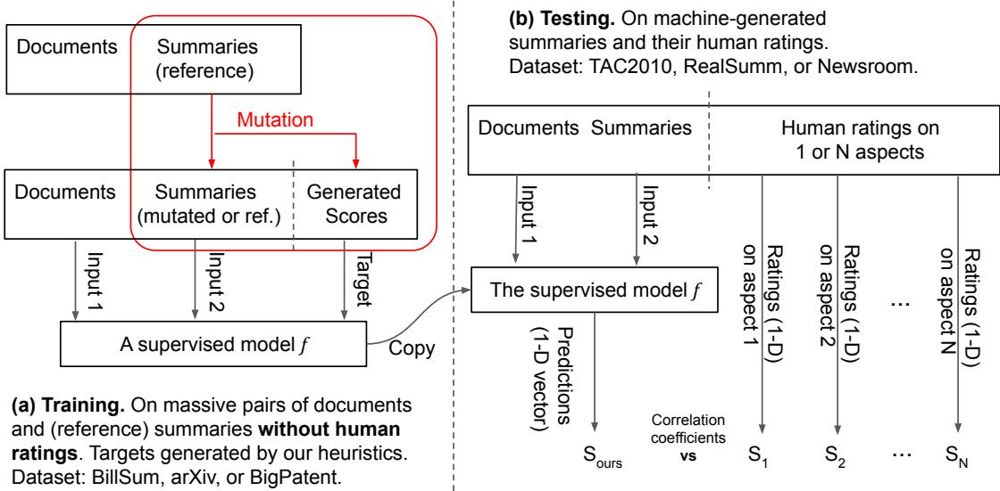
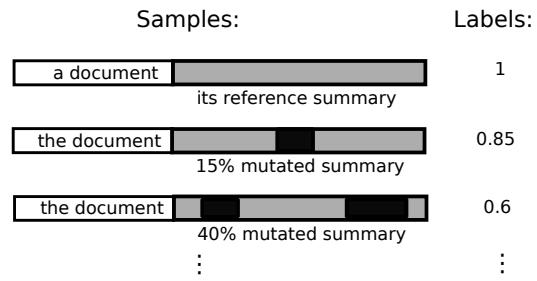

# SueNes: A Weakly Supervised Approach to Evaluating Single-Document Summarization via Negative Sampling

Forrest Sheng Bao and Ge Luo and Hebi Li Iowa State University, Ames, IA, USA forrest.bao@gmail.com, {gluo,hebi}@iastate.edu

Minghui Qiu Alibaba Group Hangzhou, China minghui.qmh@alibaba-inc.com

Youbiao He   
Iowa State University   
Ames, IA, USA   
yh54@iastate.edu

## Abstract

Canonical automatic summary evaluation metrics, such as ROUGE, focus on lexical similarity which cannot well capture semantics nor linguistic quality and require a reference summary which is costly to obtain. Recently, there have been a growing number of efforts to alleviate either or both of the two drawbacks. In this paper, we present a proof-of-concept study to a weakly supervised summary evaluation approach without the presence of reference summaries. Massive data in existing summarization datasets are transformed for training by pairing documents with corrupted reference summaries. In cross-domain tests, our strategy outperforms baselines with promising improvements, and show a great advantage in gauging linguistic qualities over all metrics.

## 1 Introduction

In natural language processing, the problem of summarization studies generating a summary from a source document which is longer than the summary. De facto metrics to judge a generated summary include ROUGE (Lin, 2004), BLEU (Papineni et al., 2002), and METEOR (Banerjee and Lavie, 2005). Previous work (Ng and Abrecht, 2015; Liu and Liu, 2008; Liu et al., 2016; Shang et al., 2018) agrees on two major drawbacks of them: 1) they favor lexical similarity, falling short on semantic similarity or linguistic quality, and 2) they require a reference summary which is often expensive to obtain (Zopf, 2018).

Initially, the first drawback is partially alleviated by replacing lexicons with their word embeddings (Ng and Abrecht, 2015; Ellouze et al., 2017; Ruseti et al., 2018; Xia et al., 2019). After the

Yinfei Yang 1600 Amphitheater Parkway Mountain View, CA, USA yangyin7@gmail.com

Cen Chen East China Normal University Shanghai, China cecilia.cenchen@gmail.com

birth of transformers (Vaswani et al., 2017), this effort has expanded to sentence or document level, including reference-based (Zhang\* et al., 2020; Zhao et al., 2019), and reference-free ones (Vasilyev et al., 2020; Scialom et al., 2019; Gao et al., 2020). The main difference between the two groups is whether a reference summary is needed when evaluating a machine-generated summary.

The two groups have complementary pros and cons. Reference-based metrics have a better performance, but they are impractical when summarization is used industrially, such as in customer support (Liu et al., 2019), team conversation (Zhang and Cranshaw, 2018), and bug reporting (Rastkar et al., 2014), where it is too costly to manually craft an equally massive amount of reference summaries. In contrast, without human written reference summaries, reference-free approaches generally perform poorer. Modern transformer-based referencefree approaches often rely on non-summarization tasks, such as QA (Vasilyev et al., 2020; Scialom et al., 2019). Such fact-focused approach makes them excel on content/fact aspects (still worse than reference-based ones) but not on linguistic ones. The non-summarization tasks also introduce noises.

Therefore, in this paper, as a proof of concept, we explore a hybrid or middle approach to combine the best of both worlds. Using documentsummary pairs in existing summarization datasets, our weakly supervised approach mutates\* reference summaries and pair them with documents to form training data and then use the trained model to evaluate unseen summaries in the presence of documents without corresponding reference summaries. In this way, we make use of human written summaries, which are very precious, in training, but we do not need them in summary evaluation. We call our approach SueNes , which stands for “Summary evaluation by Negative sampling.”

The quality of a summary is usually evaluated on two facets: content/fact aspects and linguistic qualities. Experiments later will show that a value of our approach is that we can use the same model architecture to build models that excel on different tasks by feeding training data from the same source but mutated in different strategies. For example, deleting words is the best for linguistic qualities while deleting sentences is the best for content/fact coverage.

Our approach is empirically compared against an array of existing metrics on three human summary evaluation datasets. Despite being training-based, our approach exhibits consistent results across various training domains which are all different from the test domain. It outperforms reference-free baselines with promising improvements on content/fact aspects, and further outperforms all existing metrics in gauging linguistic qualities.

In summary, our contributions or merits are:

• a simple but effective approach to referencefree† summary quality assessment,

• negative sampling for preparing training data from the unlabeled,

• one task/framework for multi-aspect judging,

• extensive cross-domain experiments to validate the effectiveness and domain robustness of our approach.

We hope our study can inspire more research into hybridizing reference-free and reference-based summary evaluation. Our code is at $\mathtt { h t t p s : } / \nearrow$ github.com/forrestbao/SueNes/

## 2 The Approach

## 2.1 Model Architecture

A reference-free single-document summary quality assessor can be formulated as a regression function $f ( d , s ) ~ \in ~ [ 0 , 1 ]$ of an input document $d = [ t _ { 1 } , t _ { 2 } , \cdots ]$ , and a machine-generated summary $s = [ t _ { 1 } ^ { \prime } , t _ { 2 } ^ { \prime } , \cdots ]$ , where $t _ { i } \mathrm { ' s }$ and $t _ { i } ^ { \prime } \mathrm { { s } }$ are text tokens. As a proof of concept, we explore an extremely lean implementation of $f \colon$ first $d$ and s are jointly transformed into a vector representation ${ \mathbf e } = g ( d , s )$ and then it is mapped to a summary quality score via a fully-connected layer, i.e., $f ( d , s ) = { \boldsymbol { \sigma } } ( \mathbb { W } \mathbf { e } )$

The function g can be implemented in the BERT (Devlin et al., 2019) style with an input sequence $[ \ [ \mathsf { C L S } ] , t _ { 1 } , t _ { 2 } , \cdot \cdot \cdot , \ [ \mathsf { S E P } ] , t _ { 1 } ^ { \prime } , t _ { 2 } ^ { \prime } , \cdot \cdot \cdot ,$ [SEP]]. The output on the [CLS] token is a joint representation of both the document d and the summary s.

While the human evaluation to a summary may cover multiple aspects, such as content/fact coverage and linguistics, a model of us will only yield one number. But by using different data mutation strategies, we can get models (different $f ^ { \prime } \mathrm { s } )$ adept at different aspects of a summary.

## 2.2 Negative Sample Generation

It is impractical to train f with existing summarization datasets, such as CNN/DailyMail (Hermann et al., 2015; Nallapati et al., 2016), because they contain only high-quality, reference-class summaries written manually and thus are all of label 1. Some summary evaluation datasets, such as Real-Summ (Bhandari et al., 2020), Newsroom (Grusky et al., 2018), and TAC2010 (NIST, 2010), do contain human ratings to system-generated summaries of various qualities. But they are too small, containing no more than 100 news articles or article groups each. Therefore, training against human ratings or in a supervised approach is impractical.

To work around, we propose a weakly supervised solution as depicted in Figure 1(a). Existing summarization datasets contain many documentsummary pairs. For each pair $\langle d , s \rangle$ , the reference summary s is mutated into $K$ new summaries of different extents $s _ { 1 } , s _ { 2 } , \cdots , s _ { K }$ , which are then paired with the document to form new pairs

$$
\langle d , s _ { 1 } \rangle , \langle d , s _ { 2 } \rangle , \allowbreaks \cdot \cdot , \langle d , s _ { K } \rangle ,
$$

which are finally assigned targets to form the training data

$$
( \langle d , s _ { 1 } \rangle , y _ { 1 } ) , ( \langle d , s _ { 2 } \rangle , y _ { 2 } ) , \cdot \cdot \cdot , ( \langle d , s _ { K } \rangle , y _ { K } ) .
$$

As illustrated in Figure 2, the training target $y _ { k \in [ 1 . . K ] }$ is the percentage of intact content. For example, if 30% of tokens in a mutated summary are not original, then the label is 0.7. In addition, the original document-summary pair $\langle d , s \rangle$ is also used in training with a target of 1.

  
Figure 1: The weakly supervised training approach in this paper and the test of a trained model.

Mutations can happen at the token or sentence level, where tokens or sentences are randomly selected for mutation. A selected token or sentence is mutated in one of the three methods:

1. inserting a token/sentence from other summaries behind it,

2. deleting it, or

3. replacing it with a token/sentence from other summaries.

We do not mix different mutation levels nor mix different mutation methods when preparing the training data. Instead, our experiments study one combination of a mutation level and a mutation method, denoted as a mutation strategy, each time.

  
Figure 2: Training sample generation by mutation. Mutated text in dark blocks while intact text in gray blocks . Sizes are out of scale.

## 3 Experiments

## 3.1 Test data

The ground truth of a summary’s quality is human ratings to it. A model trained (Fig. 1(a)) is tested (Fig. 1(b)) against human ratings. Three test datasets are chosen below. Due to the limited number and sizes of human evaluation datasets, they are all in the news domain. The human evaluation protocols can be found in their respective references.

TAC2010 (NIST, 2010) is a multi-document (ten-document) summarization task reporting both factual and linguistic aspects. We use $\textstyle \sum _ { i \in [ 1 \dots 1 0 ] } f ( d _ { i } , s )$ to approximate the score of the summary s composed from ten documents $d _ { 1 }$ to $d _ { 1 0 }$ . We only use Set A of TAC2010 because Set B is not for regular summarization.

Newsroom (Grusky et al., 2018) also covers both factual (in INFormativeness and RELevance) and linguistic (in COHerence and FLUency) aspects. For human ratings, three human annotators rate one pair of a document and machine-generated summary. The mean of their ratings on each aspect is used in our experiments.

RealSumm (Bhandari et al., 2020) focuses on only factual coverage. It covers 14 abstractive and 11 extractive summarizers published after 2018 and conducts human evaluation on the two groups separately.

Note that we do not and cannot train a model against the labels in a test set, as mentioned in § 2.1.

If a test set rates on multiple aspects, we do not train one model for each aspect. Nor do we train models for individual or a collection of test sets. We compute correlation between the predictions from our model and human ratings on each aspect of each test set.

## 3.2 Training data

Three widely used summarization datasets from three different domains are chosen for training: Billsum (Kornilova and Eidelman, 2019), Scientific-Papers/arXiv (Cohan et al., 2018), and Big-Patent (Sharma et al., 2019). Datasets from the news domain are avoided on purpose because the test data is in the news domain. This crossdomain setting allows us to examine whether a model is prone to domain differences. For each reference summary, K = 5 mutated summaries are generated. The percentage of intact content is measured by the number of tokens and the number of characters for token-level and sentence-level mutations, respectively.

## 3.3 Baselines and upper bounds

To fairly compare, four recent metrics: BLANC (Vasilyev et al., 2020), SummaQA (Scialom et al., 2019), SUPERT (Gao et al., 2020) and LS-Score (Wu et al., 2020) , are used as baselines because like our approach, they do not need a reference summary to judge a machine-generated summary, i.e., reference-free.

Human crafted reference summaries give reference-based metrics advantages. The results of reference-based metrics are included as soft upper bounds: ROUGE-1, ROUGE-2 and ROUGE-L (Lin, 2004), MoverScore (Zhao et al., 2019), BertScore (Zhang\* et al., 2020), BLEU (Papineni et al., 2002), METEOR (Banerjee and Lavie, 2005), and S3 (Peyrard et al., 2017).

## 3.4 Settings

Because the baselines use BERT, we use BERT as well for a fair comparison. Specifically, BERTbase uncased (L=12, H=768) is fine-tuned, with a learning rate of 1e-5, three epochs, and a batch size of 14. The input sequence is limited to 512 tokens using the round robin trimmer. The training loss is MSE as this problem is regression.

## 3.5 Results

We use the summary-level (Peyrard et al., 2017) meta-evaluation strategy to report an approach’s average correlation with human ratings. Summary evaluation usually covers two types of aspects, contents/facts and linguistics. They are reported separately in Tables 1 and 2. Due to space limit, only the best mutation strategy is reported for each aspect group.

On content/fact aspects, the best mutation strategy is sentence deletion and our best models outperform baselines on all test datasets. Our approach makes the most improvement over baselines on RealSumm, a dataset much bigger than Newsroom and more modern than TAC2010, and the least improvement on TAC2010, the oldest dataset.

Table 1: Spearman’s correlation on content/fact aspects. Superscripts are ranks per aspect. Abs. and Ext. are two summarizer groups in RealSumm.
<table><tr><td rowspan=1 colspan=5>TAC2010 NewsroomPyramid INF REL</td><td rowspan=1 colspan=1>RealSummAbs. Ext.</td></tr><tr><td rowspan=1 colspan=4>Trained on:Our approach                   0.491Billsum(mutated inarXiv      0.41sentence deletion)BigPatent    0.42</td><td rowspan=1 colspan=1>0.7020.6130.69 0.590.7510.651</td><td rowspan=1 colspan=1>0.26 0.010.3410.1220.3320.131</td></tr><tr><td rowspan=5 colspan=4>BLANC-tune   0.433SummaQA-F1   0.30BaselinesSummaQA-CFD  0.29SUPERT    0.482LS-Score *    N/A</td><td rowspan=2 colspan=1>0.69 0.6120.57 0.52</td><td rowspan=1 colspan=1>0.3130.113</td></tr><tr><td rowspan=1 colspan=1>0.22 0.08</td></tr><tr><td rowspan=1 colspan=1>0.54 0.44</td><td rowspan=1 colspan=1>0.24 0.05</td></tr><tr><td rowspan=2 colspan=1>0.693 0.600.70 0.64</td><td rowspan=1 colspan=1>0.25 0.07</td></tr><tr><td rowspan=1 colspan=1>N/A N/A</td></tr><tr><td rowspan=9 colspan=4>R-1       0.56R-2       0.64R-L       0.50MoverScore    0.72Upper bounds      BertScore     0.68BLEU      0.60METEOR     0.67S3_pyr      0.73S3_resp     0.73</td><td rowspan=1 colspan=1>0.32 0.28</td><td rowspan=1 colspan=1>0.63 0.22</td></tr><tr><td rowspan=1 colspan=1>0.15 0.13</td><td rowspan=1 colspan=1>0.56 0.22</td></tr><tr><td rowspan=1 colspan=1>0.30 0.26</td><td rowspan=1 colspan=1>0.60 0.21</td></tr><tr><td rowspan=1 colspan=1>0.22 0.22</td><td rowspan=1 colspan=1>0.50 0.19</td></tr><tr><td rowspan=1 colspan=2></td><td rowspan=1 colspan=2>0.68</td><td rowspan=1 colspan=1>0.32 0.28</td><td rowspan=2 colspan=1>0.57 0.190.30 0.16</td></tr><tr><td rowspan=1 colspan=2></td><td rowspan=1 colspan=2>0.60</td><td rowspan=1 colspan=1>-0.08 -0.01</td></tr><tr><td rowspan=1 colspan=1>0.24 0.24</td><td rowspan=1 colspan=1>0.63 0.25</td></tr><tr><td rowspan=1 colspan=1>0.27 0.25</td><td rowspan=1 colspan=1>0.64 0.24</td></tr><tr><td rowspan=1 colspan=1>0.25 0.22</td><td rowspan=1 colspan=1>0.63 0.24</td></tr><tr><td rowspan=2 colspan=4>Our best over baseline best (%)    2.71Our average absolute deviation (%)   3.32</td><td rowspan=1 colspan=1>8.67 6.40</td><td rowspan=2 colspan=1>9.72 16.423.45 5.28</td></tr><tr><td rowspan=1 colspan=1>2.57 2.21</td></tr></table>

On linguistic aspects, the best mutation strategy is word deletion. Here, even our worst model cannot be outperformed by any baseline nor upper bound. As mentioned earlier, canonical metrics are lexical-based while modern reference-based and reference-free approaches focus on facts. Through mutating reference summaries, our approach can create summaries of different linguistic qualities. Although our approach makes big improvements over baselines on TAC2010 and Newsroom’s FLUency, its edge is smaller on Newsroom’s COHerence. A sentence-level scrambling mutation may improve our approach’s performance on COHerence in the future.

Table 2: Spearman’s correlation on linguistic aspects. Superscripts are ranks in each aspect/column.
<table><tr><td></td><td></td><td>TAC2010 Ling.</td><td colspan="2">Newsroom</td></tr><tr><td></td><td>Trained on:</td><td></td><td>COH</td><td>FLU</td></tr><tr><td>Our approach (mutated in word deletion)</td><td>Billsum arXiv BigPatent</td><td>0.461 0.383</td><td>0.652 0.671</td><td>0.652 0.671</td></tr><tr><td>Baselines</td><td>BLANC-tune SummaQA-F1</td><td>0.432 0.29 0.24</td><td>0.623 0.59 0.49</td><td>0.633 0.53 0.47</td></tr><tr><td></td><td>SummaQA-CFD SUPERT LS-Score</td><td>0.15 0.32 N/A</td><td>0.42 0.622 0.63</td><td>0.37 0.54 0.59</td></tr><tr><td></td><td>R-1</td><td>0.26</td><td>0.23</td><td>0.22</td></tr><tr><td></td><td></td><td></td><td></td><td></td></tr><tr><td></td><td>R-2</td><td>0.35</td><td>0.09</td><td>0.10</td></tr><tr><td></td><td></td><td></td><td></td><td></td></tr><tr><td></td><td></td><td></td><td></td><td></td></tr><tr><td></td><td>R-L</td><td>0.18</td><td>0.21</td><td>0.20</td></tr><tr><td></td><td></td><td></td><td></td><td></td></tr><tr><td>Upper bounds</td><td>MoverScore</td><td>0.35</td><td>0.17</td><td>0.14</td></tr><tr><td></td><td>BertScore</td><td>0.36</td><td>0.27</td><td>0.24</td></tr><tr><td></td><td>BLEU</td><td>0.35</td><td>-0.06</td><td>-0.04</td></tr><tr><td></td><td>METEOR</td><td>0.34</td><td>0.17</td><td>0.17</td></tr><tr><td></td><td>S3_pyr</td><td>0.36</td><td>0.19</td><td>0.18</td></tr><tr><td></td><td>S3_resp</td><td>0.36</td><td>0.17</td><td>0.17</td></tr><tr><td></td><td></td><td></td><td></td><td></td></tr><tr><td>Our best over baseline best (%) Our average absolute deviation (%)</td><td></td><td>41.92 2.72</td><td>8.41 1.71</td><td>25.02 1.74</td></tr></table>

## 3.6 Discussions

What is the best mutation? Across datasets, deletion-based mutations are most effective. The two kinds of deletions happen to be complementarily effective for two aspect groups: sentence deletion for content/fact aspects vs. word deletion for linguistic aspects. This is an advantage of our approach that under a uniformed framework, different summary quality aspects can be gauged by designing different mutation options.

The complementariness of sentence deletion and word deletion can be well explained as that removing a sentence from a reference summary reduces a great amount of key information while removing a word from a sentence changes it syntactically. We found that word-level mutations are less useful for content/fact aspects, probably because of the inertia of the context after words are altered.

Which training domain/dataset should I use? Due to the composition of summarizers and the limited data size in human evaluation, it is very hard to get a consistent ranking of metrics on different datasets (Bhandari et al., 2020). For example, in Table 1, Billsumm outperforms all baselines and its peers on TAC2010 but not the case on Newsroom and RealSumm.

Still, the impact of training domain seems manageable. The average absolute deviations across the training datasets/domains are given at the bottom of Tables 1 and 2. They mostly below 3.5%. A qualitative analysis shows that the variation seems more due to the characteristics of the text than the domain. Legislative bills (Billsum) have lots of short, hierarchical clauses and thus differ from common English greatly. Scientific papers have many equations and cross-references. There are also many occurrences of LATEX or MathML in the dataset arXiv. On top of that, all our experiments use different training and test domains. Hence we would say that the impact of domain variation is very small.

## 4 Conclusion

In this paper, we propose a weakly supervised approach to summary quality evaluation. A few mutation methods are introduced to make use of the massive, precious human written summaries in summarization datasets. In cross-domain experiments, our approach achieves better performance than baselines, especially on linguistic aspects. We hope this proof-of-concept study can inspire more reference-free summary evaluation.

## Acknowledgments

Bao, Luo, Li, and He’s work in this paper is partially supported by National Science Foundation (NSF) grants No. MCB-1821828 and No. CNS-1817089. The authors would also like to thank reviewers who have given precious feedback on improving this work.

## References

Satanjeev Banerjee and Alon Lavie. 2005. Meteor: An automatic metric for mt evaluation with improved correlation with human judgments. In Proceedings of the acl workshop on intrinsic and extrinsic evaluation measuresfor machine translation and/or summarization, pages 65–72.

Manik Bhandari, Pranav Narayan Gour, Atabak Ashfaq, Pengfei Liu, and Graham Neubig. 2020. Reevaluating evaluation in text summarization. In Proceedings ofthe 2020 Conference on Empirical Methods in Natural Language Processing (EMNLP).

Arman Cohan, Franck Dernoncourt, Doo Soon Kim, Trung Bui, Seokhwan Kim, Walter Chang, and Nazli Goharian. 2018. A discourse-aware attention model for abstractive summarization of long documents. Proceedings of the 2018 Conference of the North American Chapter of the Association for Computational Linguistics: Human Language Technologies, Volume 2 (Short Papers).

Jacob Devlin, Ming-Wei Chang, Kenton Lee, and Kristina Toutanova. 2019. BERT: Pre-training of

deep bidirectional transformers for language understanding. In Proceedings ofthe 2019 Conference of the North American Chapter ofthe Associationfor Computational Linguistics: Human Language Technologies, Volume 1 (Long and Short Papers), pages 4171–4186, Minneapolis, Minnesota. Association for Computational Linguistics.

Samira Ellouze, Maher Jaoua, and Lamia Hadrich Belguith. 2017. Machine learning approach to evaluate multilingual summaries. In Proceedings ofthe Multi-Ling 2017 workshop on summarization and summary evaluation across source types and genres, pages 47–54.

Yang Gao, Wei Zhao, and Steffen Eger. 2020. SUPERT: Towards new frontiers in unsupervised evaluation metrics for multi-document summarization. In Proceedings of the 58th Annual Meeting of the Associationfor Computational Linguistics, pages 1347– 1354, Online. Association for Computational Linguistics.

Max Grusky, Mor Naaman, and Yoav Artzi. 2018. Newsroom: A dataset of 1.3 million summaries with diverse extractive strategies. Proceedings ofthe 2018 Conference of the North American Chapter of the Associationfor Computational Linguistics: Human Language Technologies, Volume 1 (Long Papers).

Karl Moritz Hermann, Tomas Kocisky, Edward Grefenstette, Lasse Espeholt, Will Kay, Mustafa Suleyman, and Phil Blunsom. 2015. Teaching machines to read and comprehend. In NeurIPS, pages 1693–1701.

Anastassia Kornilova and Vladimir Eidelman. 2019. BillSum: A corpus for automatic summarization of US legislation. In Proceedings ofthe 2nd Workshop on New Frontiers in Summarization, pages 48–56, Hong Kong, China. Association for Computational Linguistics.

Chin-Yew Lin. 2004. ROUGE: A package for automatic evaluation of summaries. In Text Summarization Branches Out, pages 74–81, Barcelona, Spain. Association for Computational Linguistics.

Chia-Wei Liu, Ryan Lowe, Iulian Serban, Mike Noseworthy, Laurent Charlin, and Joelle Pineau. 2016. How not to evaluate your dialogue system: An empirical study of unsupervised evaluation metrics for dialogue response generation. In Proceedings of the 2016 Conference on Empirical Methods in Natural Language Processing, pages 2122–2132.

Chunyi Liu, Peng Wang, Jiang Xu, Zang Li, and Jieping Ye. 2019. Automatic dialogue summary generation for customer service. In Proceedings of the 25th ACM SIGKDD International Conference on Knowledge Discovery and Data Mining, KDD ’19, page 1957–1965, New York, NY, USA. Association for Computing Machinery.

Feifan Liu and Yang Liu. 2008. Correlation between rouge and human evaluation of extractive meeting

summaries. In ACL, pages 201–204. Association for Computational Linguistics.

Ramesh Nallapati, Bowen Zhou, Cicero dos Santos, Caglar Gulcehre, and Bing Xiang. 2016. Abstractive text summarization using sequence-to-sequence rnns and beyond. In Proceedings of The 20th SIGNLL Conference on Computational Natural Language Learning, pages 280–290.

Jun-Ping Ng and Viktoria Abrecht. 2015. Better summarization evaluation with word embeddings for rouge. In Proceedings of the 2015 Conference on Empirical Methods in Natural Language Processing, pages 1925–1930.

NIST. 2010. TAC2010 guided summarization competition. https://tac.nist.gov/2010/ Summarization/Guided-Summ.2010. guidelines.html. Accessed: 2021-08-16.

Kishore Papineni, Salim Roukos, Todd Ward, and Wei-Jing Zhu. 2002. Bleu: a method for automatic evaluation of machine translation. In Proceedings of the 40th annual meeting on association for computational linguistics, pages 311–318. Association for Computational Linguistics.

Maxime Peyrard, Teresa Botschen, and Iryna Gurevych. 2017. Learning to score system summaries for better content selection evaluation. In Proceedings of the Workshop on New Frontiers in Summarization, pages 74–84, Copenhagen, Denmark. Association for Computational Linguistics.

S. Rastkar, G. C. Murphy, and G. Murray. 2014. Automatic summarization of bug reports. IEEE Transactions on Software Engineering, 40(4):366–380.

Stefan Ruseti, Mihai Dascalu, Amy M Johnson, Danielle S McNamara, Renu Balyan, Kathryn S Mc-Carthy, and Stefan Trausan-Matu. 2018. Scoring summaries using recurrent neural networks. In International Conference on Intelligent Tutoring Systems, pages 191–201. Springer.

Thomas Scialom, Sylvain Lamprier, Benjamin Piwowarski, and Jacopo Staiano. 2019. Answers unite! unsupervised metrics for reinforced summarization models. In Proceedings ofthe 2019 Conference on Empirical Methods in Natural Language Processing and the 9th International Joint Conference on Natural Language Processing (EMNLP-IJCNLP), pages 3246–3256, Hong Kong, China. Association for Computational Linguistics.

Guokan Shang, Wensi Ding, Zekun Zhang, Antoine Tixier, Polykarpos Meladianos, Michalis Vazirgiannis, and Jean-Pierre Lorré. 2018. Unsupervised abstractive meeting summarization with multi-sentence compression and budgeted submodular maximization. In ACL, pages 664–674. Association for Computational Linguistics.

Eva Sharma, Chen Li, and Lu Wang. 2019. BIG-PATENT: A large-scale dataset for abstractive and coherent summarization. In Proceedings ofthe 57th Annual Meeting of the Association for Computational Linguistics, pages 2204–2213, Florence, Italy. Association for Computational Linguistics.

Oleg Vasilyev, Vedant Dharnidharka, and John Bohannon. 2020. Fill in the BLANC: Human-free quality estimation of document summaries. In Proceedings ofthe First Workshop on Evaluation and Comparison of NLP Systems, pages 11–20, Online. Association for Computational Linguistics.

Ashish Vaswani, Noam Shazeer, Niki Parmar, Jakob Uszkoreit, Llion Jones, Aidan N Gomez, Łukasz Kaiser, and Illia Polosukhin. 2017. Attention is all you need. In NeurIPS, pages 5998–6008.

Hanlu Wu, Tengfei Ma, Lingfei Wu, Tariro Manyumwa, and Shouling Ji. 2020. Unsupervised reference-free summary quality evaluation via contrastive learning. In Proceedings of the 2020 Conference on Empirical Methods in Natural Language Processing (EMNLP), pages 3612–3621, Online. Association for Computational Linguistics.

Menglin Xia, Ekaterina Kochmar, and Ted Briscoe. 2019. Automatic learner summary assessment for reading comprehension. In Proceedings ofthe 2019 Conference of the North American Chapter of the Associationfor Computational Linguistics: Human Language Technologies, Volume 1 (Long and Short Papers), pages 2532–2542, Minneapolis, Minnesota. Association for Computational Linguistics.

Amy X. Zhang and Justin Cranshaw. 2018. Making sense of group chat through collaborative tagging and summarization. Proc. ACM Hum.-Comput. Interact., 2(CSCW).

Tianyi Zhang\*, Varsha Kishore\*, Felix Wu\*, Kilian Q. Weinberger, and Yoav Artzi. 2020. BERTScore: Evaluating text generation with BERT. In International Conference on Learning Representations.

Wei Zhao, Maxime Peyrard, Fei Liu, Yang Gao, Christian M. Meyer, and Steffen Eger. 2019. MoverScore: Text generation evaluating with contextualized embeddings and earth mover distance. In Proceedings of the 2019 Conference on Empirical Methods in Natural Language Processing and the 9th International Joint Conference on Natural Language Processing (EMNLP-IJCNLP), pages 563–578, Hong Kong, China. Association for Computational Linguistics.

Markus Zopf. 2018. Estimating summary quality with pairwise preferences. In Proceedings of the 2018 Conference of the North American Chapter of the Associationfor Computational Linguistics: Human Language Technologies, Volume 1 (Long Papers), volume 1, pages 1687–1696.

## A Dataset statistics

For test sets:

• TAC2010 Guided Summarization Task Set A consists of 46 topics, each of which is associated with a set of 10 documents. We evaluate the metrics over summaries generated by 43 systems.

• Newsroom contains human-rated summaries generated by 7 systems for 60 documents.

• RealSumm sampled 100 documents from the CNN/DailyMail test set, and collected human ratings for summaries generated by 11 extrative systems and 14 abstractive systems.

For training sets, the numbers of pairs of documents and reference summaries in the train split are:

• Billsum: 18,949

• Scientific papers/arXiv: 203,037

• Big-Patent: 1,207,222

For each dataset, we use the entire (except for Big-Patent, 10% due to its huge size) train split in Google Tensorflow Datasets for training.

## B Computational environment and cost

All experiments were carried out on one RTX3090 GPU installed on a desktop computer. The training takes about a week for all three training datasets.

## C Another type of mutation

In addition to the three mutation methods mentioned already, we have another method called crosspairing.

<table><tr><td rowspan=10 colspan=1>1Documents andoriginal referencesummaries(matching doc IDand summary ID)</td><td></td><td></td><td></td><td></td></tr><tr><td rowspan=2 colspan=1>Document</td><td rowspan=2 colspan=1>Summary</td><td rowspan=2 colspan=1>Label</td><td></td></tr><tr><td rowspan=8 colspan=1>Cross-paireddocuments andsummaries(mismatching dociD and summary ID)</td></tr><tr><td rowspan=1 colspan=1>Doc 5</td><td rowspan=1 colspan=1>Summary 5</td><td rowspan=1 colspan=1>1</td></tr><tr><td rowspan=1 colspan=1>Doc 5</td><td rowspan=1 colspan=1>Summary 10</td><td rowspan=1 colspan=1>0</td></tr><tr><td rowspan=1 colspan=1>Doc 5</td><td rowspan=1 colspan=1>Summary 81</td><td rowspan=1 colspan=1>0</td></tr><tr><td rowspan=1 colspan=1>Doc 7</td><td rowspan=1 colspan=1>Summary 7</td><td rowspan=1 colspan=1>1</td></tr><tr><td rowspan=1 colspan=1>Doc 7</td><td rowspan=1 colspan=1>Summary 19</td><td rowspan=1 colspan=1>0</td></tr><tr><td rowspan=1 colspan=1>Doc 7</td><td rowspan=1 colspan=1>Summary 45</td><td rowspan=1 colspan=1>0</td></tr><tr><td rowspan=1 colspan=1>…</td><td rowspan=1 colspan=1>…</td><td rowspan=1 colspan=1></td></tr></table>

Figure 3: Training sample generation via cross pairing.

Illustrated in Figure 3, it is inspired by the nextsentence prediction (NSP) task in original BERT training. Given a document and its reference summary, we create negative data by pairing the document with reference summaries of other documents.

We assign the label 0 to a mismatching documentsummary pair, and the label 1 to any original pair of a document and its reference summary.

## D Complete empirical results

Due to space limit, we were only able to present the result of the best mutation method in § 3.5. Full results are given in Tables 3, 4, 5, and 6. Pearson’s for LS-Score is unable to be produced due to reasons explained in the footnote on page 4.

Table 3: Full results for Spearman’s correlation on content/fact aspects.
<table><tr><td rowspan="2"></td><td rowspan="2">Mutation</td><td rowspan="2">Training set</td><td colspan="2">TAC2010| |Newsroom</td><td colspan="2">RealSumm</td></tr><tr><td>Pyramid 0.38</td><td>INF REL 0.500.49</td><td>Abs -0.06</td><td>Ext -0.05</td></tr><tr><td rowspan="10">Our approach</td><td rowspan="3">crosspair</td><td>Billsum ArXiv</td><td>0.37</td><td>0.570.55</td><td>-0.06</td><td>-0.08</td></tr><tr><td>BigPatent</td><td>0.33</td><td>0.560.57</td><td>-0.06</td><td>-0.05</td></tr><tr><td>Billsum</td><td>0.44</td><td>0.470.42</td><td>0.04</td><td>-0.08</td></tr><tr><td rowspan="3">sentence- ArXiv replace</td><td>0.35</td><td></td><td>0.550.49</td><td>0.19</td><td>0.03</td></tr><tr><td>BigPatent</td><td>0.39</td><td>0.490.46</td><td>-0.08</td><td>-0.04</td></tr><tr><td>Billsum</td><td>0.21</td><td>0.600.56</td><td>0.06</td><td>-0.01</td></tr><tr><td rowspan="3">word-insert</td><td>ArXiv</td><td>0.10</td><td>0.660.58</td><td>0.20</td><td>-0.01</td></tr><tr><td>BigPatent</td><td>0.20</td><td>0.630.59</td><td>0.14</td><td>-0.02</td></tr><tr><td></td><td>0.27</td><td>0.640.61</td><td>0.12</td><td>0.02</td></tr><tr><td rowspan="3">word-delete</td><td>Billsum ArXiv</td><td>0.23</td><td>0.620.59</td><td>0.17</td><td>0.01</td></tr><tr><td>BigPatent</td><td>0.28</td><td>0.590.60</td><td>0.10</td><td>0.01</td></tr><tr><td rowspan="3">word-replace</td><td>Billsum</td><td>0.25</td><td>|0.66 0.60</td><td>0.10</td><td>-0.03</td></tr><tr><td>ArXiv BigPatent</td><td>0.08 0.25</td><td>0.650.57 0.630.62</td><td>0.15 0.07</td><td>-0.02 -0.06</td></tr><tr><td rowspan="3">sentence-</td><td></td><td></td><td></td><td></td><td>0.01</td></tr><tr><td>Billsum ArXiv</td><td>0.49 0.41</td><td>|0.700.61 0.690.59</td><td>0.26 0.34</td><td>0.12</td></tr><tr><td rowspan="3">delete</td><td>BigPatent</td><td>0.42</td><td>0.750.65</td><td>0.33</td><td>0.13</td></tr><tr><td colspan="2">BLANC-tune</td><td>0.43</td><td>|0.690.61</td><td>0.31</td><td>0.11</td></tr><tr><td rowspan="3" colspan="2">SummaQA-F1</td><td>0.30</td><td></td><td>0.570.52</td><td>0.22</td><td>0.08</td></tr><tr><td colspan="2">SummaQÀ-CFD</td><td>0.29</td><td>0.540.44</td><td>0.24</td><td>0.05</td></tr><tr><td colspan="2">SUPERT</td><td>0.48 N/A</td><td>0.690.60 0.70 0.64</td><td>0.25 N/A</td><td>0.07 N/A</td></tr><tr><td rowspan="10">Upper bounds</td><td colspan="2">LS-Score *</td><td>0.56</td><td>0.320.28</td><td>0.63</td><td>0.22</td></tr><tr><td colspan="2">R-1 R-2</td><td>0.64</td><td>0.15 0.13</td><td>0.56</td><td>0.22</td></tr><tr><td colspan="2"></td><td>0.50</td><td>0.30 0.26</td><td>0.60</td><td>0.21</td></tr><tr><td colspan="2">R-L</td><td>0.72</td><td>0.220.22</td><td>0.50</td><td>0.19</td></tr><tr><td colspan="2">MoverScore BertScore</td><td>0.68</td><td>0.32 0.28</td><td>0.57</td><td>0.19</td></tr><tr><td colspan="2">BLEU</td><td>0.60</td><td>-0.08-0.01</td><td>0.30</td><td>0.16</td></tr><tr><td colspan="2">METEOR</td><td>0.67</td><td>0.24 0.24</td><td>0.63</td><td>0.25</td></tr><tr><td colspan="2">S3_pyr</td><td>0.73</td><td>0.270.25</td><td>0.64</td><td>0.24</td></tr><tr><td colspan="2">S3_resp</td><td>0.73</td><td>0.25 0.22</td><td>0.63</td><td>0.24</td></tr><tr><td colspan="2">Our best over baseline best (%)</td><td>-8.47</td><td>|-4.63 2.14 |-35.93 -76.38</td><td></td><td></td></tr><tr><td colspan="2">crosspair</td><td>2.02</td><td>2.753.00</td><td></td><td>0.00</td><td>1.02 5.28</td></tr><tr><td rowspan="6">Our average absolute deviation (%)</td><td colspan="8">sentence-delete</td></tr><tr><td colspan="2">sentence-replace</td><td>3.32 2.99</td><td>2.572.21 3.342.57</td><td></td><td>3.45 9.28</td><td>3.92</td></tr><tr><td colspan="2"></td><td>4.64</td><td>1.871.03</td><td></td><td>5.01</td><td>0.37</td></tr><tr><td colspan="2">word-insert</td><td></td><td></td><td></td><td></td><td></td></tr><tr><td colspan="2">word-delete</td><td>1.96</td><td>1.79 0.82</td><td></td><td>2.55</td><td>0.44</td></tr><tr><td colspan="2">word-replace</td><td>7.59</td><td>1.11 1.73</td><td></td><td>2.60</td><td>1.96</td></tr></table>

Table 4: Full results for Spearman’s correlation on linguistic aspects.
<table><tr><td></td><td>Mutation</td><td>Training set</td><td>TAC2010 Linguistic</td><td>Newsroom COH FLU</td><td></td></tr><tr><td rowspan="10"></td><td rowspan="3">crosspair</td><td>Billsum</td><td>0.29</td><td>0.43</td><td>0.39</td></tr><tr><td>ArXiv</td><td>0.28</td><td>0.48</td><td>0.42</td></tr><tr><td>BigPatent</td><td>0.28</td><td>0.48</td><td>0.42</td></tr><tr><td rowspan="3">sentence-</td><td>Billsum</td><td>0.33</td><td>0.59</td><td>0.53</td></tr><tr><td>ArXiv</td><td>0.32</td><td>0.53</td><td>0.46</td></tr><tr><td>BigPatent</td><td>0.30</td><td>0.62</td><td>0.54</td></tr><tr><td rowspan="3">sentence- replace</td><td>Billsum</td><td>0.39</td><td>0.45</td><td>0.42</td></tr><tr><td>ArXiv</td><td>0.27</td><td>0.50</td><td>0.43</td></tr><tr><td>BigPatent</td><td>0.38</td><td>0.41</td><td>0.31</td></tr><tr><td rowspan="3">word-insert</td><td>Billsum</td><td>0.31</td><td>0.55</td><td>0.53</td></tr><tr><td>ArXiv</td><td>0.16</td><td>0.55</td><td>0.48</td></tr><tr><td>BigPatent</td><td>0.19</td><td>0.51</td><td>0.48</td></tr><tr><td rowspan="3">word-replace</td><td rowspan="3"></td><td></td><td>0.33</td><td>0.60</td><td>0.57</td></tr><tr><td>Billsum ArXiv</td><td>0.07</td><td>0.54</td><td>0.49</td></tr><tr><td>BigPatent</td><td>0.24</td><td>0.54</td><td>0.46</td></tr><tr><td rowspan="3">word-delete</td><td rowspan="3"></td><td>Billsum</td><td>0.46</td><td>0.65</td><td>0.65</td></tr><tr><td>ArXiv</td><td>0.38</td><td>0.67</td><td>0.67</td></tr><tr><td>BigPatent</td><td>0.43</td><td>0.62</td><td>0.63</td></tr><tr><td rowspan="3">Baselines</td><td colspan="2">BLANC-tune</td><td>0.29 0.24</td><td>0.59</td><td>0.53 0.47</td></tr><tr><td colspan="2">SummaQA-F1 SummaQA-CFD</td><td>0.15</td><td>0.49 0.42</td><td>0.37</td></tr><tr><td colspan="2">SUPERT</td><td>0.32</td><td>0.62</td><td>0.54</td></tr><tr><td rowspan="8"></td><td colspan="2">LS-Score *</td><td>N/A</td><td>0.63</td><td>0.59</td></tr><tr><td colspan="2">R-1</td><td>0.26</td><td>0.23</td><td>0.22</td></tr><tr><td colspan="2">R-2</td><td>0.35</td><td>0.09</td><td>0.10</td></tr><tr><td colspan="2">R-L</td><td>0.18</td><td>0.21</td><td>0.20</td></tr><tr><td colspan="2">MoverScore</td><td>0.35</td><td>0.17</td><td>0.14</td></tr><tr><td colspan="2">BertScore</td><td>0.36</td><td>0.27</td><td>0.24</td></tr><tr><td colspan="2">BLEU</td><td>0.35 0.34</td><td>-0.06 0.17</td><td>-0.04</td></tr><tr><td colspan="2">METEOR S3_pyr</td><td>0.36</td><td>0.19</td><td>0.17 0.18</td></tr><tr><td colspan="2">S3_resp</td><td>0.36</td><td>0.17</td><td>0.17</td></tr><tr><td colspan="2">Our best over baseline best (%)</td><td>19.17</td><td>|-0.28</td><td>5.49</td></tr><tr><td colspan="2"></td><td></td><td></td><td></td></tr><tr><td rowspan="6">Our average absolute deviation (%)</td><td>crosspair</td><td></td><td>0.29 2.00</td><td>1.50 3.17</td><td></td></tr><tr><td colspan="2">sentence-delete</td><td>1.15 4.97</td><td>3.10 3.05</td><td>5.05</td></tr><tr><td colspan="2">sentence-replace word-insert</td><td>6.01</td><td>1.62</td><td>2.38</td></tr><tr><td colspan="2"></td><td>2.72</td><td></td><td></td></tr><tr><td colspan="2">word-delete</td><td></td><td>1.71</td><td>1.74</td></tr><tr><td colspan="2">word-replace</td><td>9.28</td><td>2.56</td><td>4.23</td></tr></table>

Table 5: Full results for Pearson’s correlation on content/fact aspects.
<table><tr><td rowspan="2"></td><td rowspan="2">Mutation</td><td rowspan="2">Training set</td><td rowspan="2">TAC2010|Newsroom Pyramid</td><td colspan="2">INF REL</td><td rowspan="2">|RealSumm</td></tr><tr><td></td><td>Abs Ext</td></tr><tr><td rowspan="10">Our approach</td><td rowspan="3">crosspair</td><td>Billsum</td><td>0.44</td><td>0.630.66</td><td></td><td>|-0.07-0.05</td></tr><tr><td>ArXiv</td><td>0.45</td><td>0.62 0.65</td><td></td><td>-0.07-0.07</td></tr><tr><td>BigPatent</td><td>0.39</td><td>0.630.68</td><td></td><td>-0.07-0.05</td></tr><tr><td rowspan="3">sentence- replace</td><td>Billsum</td><td>0.48</td><td>0.640.67</td><td>0.04-0.09</td><td></td></tr><tr><td>ArXiv</td><td>0.24</td><td>0.560.58</td><td>0.07 0.05</td><td></td></tr><tr><td>BigPatent</td><td>0.41</td><td>0.59 0.61</td><td>-0.07-0.04</td><td></td></tr><tr><td rowspan="3">word-insert</td><td>Billsum</td><td>0.34</td><td>|0.700.72</td><td></td><td>0.08 0.00</td></tr><tr><td>ArXiv</td><td>0.30</td><td>0.67 0.69</td><td>0.19-0.01</td><td></td></tr><tr><td>BigPatent</td><td>0.26</td><td>0.640.68</td><td></td><td>0.14-0.02</td></tr><tr><td rowspan="3">word-delete</td><td>Billsum</td><td>0.39</td><td>|0.76 0.78</td><td></td><td>0.12 0.05</td></tr><tr><td>ArXiv</td><td>0.39</td><td>0.68 0.70</td><td></td><td>0.18 0.03</td></tr><tr><td>BigPatent</td><td>0.38</td><td>0.71 0.74</td><td></td><td>0.13 0.01</td></tr><tr><td rowspan="3">word-replace</td><td>Billsum</td><td>0.35</td><td>|0.72 0.76</td><td></td><td>|0.09-0.04</td><td></td></tr><tr><td>ArXiv</td><td>0.29</td><td>0.67 0.70</td><td></td><td>0.12</td><td>0.00</td></tr><tr><td>BigPatent</td><td>0.29</td><td>0.66 0.71</td><td></td><td>0.08-0.04</td><td></td></tr><tr><td rowspan="3">sentence- delete</td><td rowspan="3"></td><td>Billsum</td><td>0.55</td><td>|0.750.74</td><td></td><td>0.260.06</td></tr><tr><td>ArXiv</td><td>0.47</td><td>0.690.61</td><td>0.34</td><td>0.11</td></tr><tr><td>BigPatent</td><td>0.50</td><td>0.79</td><td>0.72 0.35</td><td>0.16</td></tr><tr><td rowspan="4">Baselines</td><td colspan="2">Blanc-tune</td><td>0.51 0.34</td><td>|0.730.68</td><td></td><td>0.33 0.13</td></tr><tr><td colspan="2">summaQA-F1</td><td>0.33</td><td>0.59 0.55</td><td></td><td>0.21 0.09</td></tr><tr><td colspan="2">SummaQA-CFD</td><td>0.55</td><td>0.60 0.52 0.77 0.77</td><td>0.25 0.27</td><td>0.06</td></tr><tr><td colspan="2">Supert</td><td></td><td></td><td></td><td>0.09</td></tr><tr><td rowspan="10">Upper bounds</td><td colspan="2">R-1</td><td>0.55</td><td>0.260.25</td><td></td><td>0.66 0.26</td></tr><tr><td colspan="2">R-2</td><td>0.69</td><td>0.03 0.03</td><td></td><td>0.59 0.24</td></tr><tr><td colspan="2">R-L</td><td>0.48</td><td>0.14 0.13</td><td>0.62</td><td>0.25</td></tr><tr><td colspan="2">MoverScore</td><td>0.68</td><td>0.06 0.09</td><td>0.51</td><td>0.20</td></tr><tr><td colspan="2">BertScore</td><td>0.65</td><td>0.29 0.28</td><td></td><td>0.61 0.24</td></tr><tr><td colspan="2">BLEU</td><td>0.62</td><td>-0.14-0.10</td><td></td><td>0.32 0.15 0.67 0.28</td></tr><tr><td colspan="2">METEOR</td><td>0.71</td><td>0.08 0.09 0.11</td><td>0.10</td><td>0.67 0.28</td></tr><tr><td colspan="2">S3_pyr S3_resp</td><td>0.76 0.76</td><td>0.04 0.04</td><td></td><td>0.65 0.28</td></tr><tr><td colspan="2"></td><td></td><td></td><td></td><td></td></tr><tr><td colspan="2">Our best over baseline best (%)</td><td>0.15</td><td>|2.75 1.37|</td><td></td><td>|7.12 28.53</td></tr><tr><td rowspan="6">Our average absolute deviation (%)</td><td>crosspair</td><td>2.41</td><td>0.42 1.02</td><td></td><td>0.00 0.97 3.68</td><td></td></tr><tr><td colspan="2">sentence-delete</td><td>2.85</td><td>3.53 5.27 2.74 3.43</td><td></td><td>3.68 5.65 5.04</td></tr><tr><td colspan="2">sentence-replace</td><td>9.43 2.74</td><td>1.92 1.75</td><td></td><td>0.57</td></tr><tr><td colspan="2">word-insert</td><td></td><td></td><td></td><td>3.80</td></tr><tr><td colspan="2">word-delete</td><td>0.42</td><td>2.782.97</td><td></td><td>2.35 1.25</td></tr><tr><td colspan="2">word-replace</td><td>2.85</td><td>2.49 2.57</td><td></td><td>1.74 1.46</td></tr></table>

Table 6: Full results for Pearson’s correlation on linguistic aspects.
<table><tr><td></td><td>Mutation</td><td>Training set</td><td>TAC2010 Linguistic</td><td>Newsroom COH FLU</td><td></td></tr><tr><td rowspan="10">Our Approach</td><td rowspan="3">crosspair</td><td>Billsum</td><td>0.39</td><td>0.52</td><td>0.46</td></tr><tr><td>ArXiv</td><td>0.39</td><td>0.50</td><td>0.44</td></tr><tr><td>BigPatent</td><td>0.40</td><td>0.51</td><td>0.44</td></tr><tr><td rowspan="3">sentence-</td><td>Billsum</td><td>0.48</td><td>0.61</td><td>0.55</td></tr><tr><td>ArXiv</td><td>0.39</td><td>0.56</td><td>0.50</td></tr><tr><td>BigPatent</td><td>0.43</td><td>0.65</td><td>0.57</td></tr><tr><td rowspan="3">sentence- replace</td><td>Billsum</td><td>0.43</td><td>0.52</td><td>0.44</td></tr><tr><td>ArXiv</td><td>0.21</td><td>0.48</td><td>0.42</td></tr><tr><td>BigPatent</td><td>0.39</td><td>0.45</td><td>0.38</td></tr><tr><td rowspan="3">word-insert</td><td>Billsum</td><td>0.45</td><td>0.60</td><td>0.56</td></tr><tr><td>ArXiv</td><td>0.35</td><td>0.56</td><td>0.52</td></tr><tr><td>BigPatent</td><td>0.32</td><td>0.52</td><td>0.46</td></tr><tr><td rowspan="3"></td><td rowspan="3">word-replace</td><td></td><td>0.47</td><td>0.61</td><td>0.58</td></tr><tr><td>Billsum ArXiv</td><td>0.35</td><td>0.56</td><td>0.53</td></tr><tr><td>BigPatent</td><td>0.33</td><td>0.53</td><td>0.48</td></tr><tr><td rowspan="3">word-delete</td><td rowspan="3"></td><td></td><td>0.56</td><td>0.69</td><td>0.67</td></tr><tr><td>Billsum ArXiv</td><td>0.51</td><td>0.67</td><td>0.66</td></tr><tr><td>BigPatent</td><td>0.49</td><td>0.66</td><td>0.64</td></tr><tr><td rowspan="3">Baselines</td><td colspan="2">Blanc-tune</td><td>0.42</td><td>0.62</td><td>0.59</td></tr><tr><td colspan="2">summaQA-F1</td><td>0.29 0.21</td><td>0.51</td><td>0.47</td></tr><tr><td colspan="2">SummaQA-CFD Supert</td><td>0.46</td><td>0.48 0.65</td><td>0.43 0.58</td></tr><tr><td rowspan="10">Upper bounds</td><td colspan="2"></td><td>0.27</td><td>0.17 0.14</td><td></td></tr><tr><td colspan="2">R-1 R-2</td><td>0.40</td><td>-0.02-0.02</td><td></td></tr><tr><td colspan="2">R-L</td><td>0.18</td><td>0.07</td><td>0.06</td></tr><tr><td colspan="2">MoverScore</td><td>0.43</td><td>0.02</td><td>0.00</td></tr><tr><td colspan="2">BertScore</td><td>0.50</td><td>0.21 0.17</td><td></td></tr><tr><td colspan="2">BLEU</td><td>0.36</td><td>-0.14-0.12</td><td></td></tr><tr><td colspan="2">METEOR</td><td>0.46</td><td>0.03</td><td>0.02</td></tr><tr><td colspan="2">S3_pyr</td><td>0.45</td><td>0.04</td><td>0.03</td></tr><tr><td colspan="2">S3_resp</td><td>0.44</td><td>-0.01-0.02</td><td></td></tr><tr><td colspan="2">Our best over baseline best (%)</td><td>21.28</td><td>|6.71 13.50</td><td></td></tr><tr><td colspan="2"></td><td>0.43</td><td></td><td>0.64 0.93</td><td></td></tr><tr><td rowspan="6">Our average absolute deviation (%)</td><td>crosspair sentence-delete</td><td></td><td>3.01</td><td>3.20 2.65</td><td></td></tr><tr><td colspan="2">sentence-replace</td><td>8.89</td><td>2.51</td><td>2.39</td></tr><tr><td colspan="2">word-insert</td><td>5.29</td><td>2.86</td><td>3.35</td></tr><tr><td colspan="2"></td><td>2.56</td><td>1.27</td><td>0.98</td></tr><tr><td colspan="2">word-delete</td><td></td><td></td><td></td></tr><tr><td colspan="2">word-replace</td><td>6.02</td><td>2.88</td><td>3.25</td></tr></table>