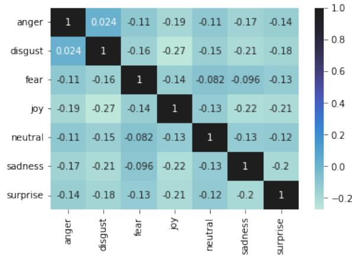
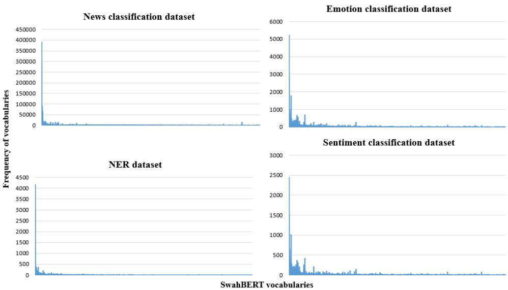

# SwahBERT: Language Model of Swahili

Gati L Martin1, Medard E Mswahili2, Young-Seob Jeong2\*, Jiyoung Woo1

1Soonchunhyang University, Asan-si, Korea

2Chungbuk National University, Cheongju-si, Korea

{gatimartin, jywoo}@sch.ac.kr

{medardedmund25, ysjay}@chungbuk.ac.kr

## Abstract

The rapid development of social networks, electronic commerce, mobile Internet, and other technologies has influenced the growth of Web data. Social media and Internet forums are valuable sources of citizens’ opinions, which can be analyzed for community development and user behavior analysis. Unfortunately, the scarcity of resources (i.e., datasets or language models) has become a barrier to the development of natural language processing applications in low-resource languages. Thanks to the recent growth of online forums and news platforms of Swahili, we introduce two datasets of Swahili in this paper: a pre-training dataset of approximately 105MB with 16M words and an annotated dataset of 13K instances for the emotion classification task. The emotion classification dataset is manually annotated by two native Swahili speakers. We pre-trained a new monolingual language model for Swahili, namely SwahBERT, using our collected pre-training data, and tested it with four downstream tasks including emotion classification. We found that SwahBERT outperforms multilingual BERT, a well-known existing language model, in almost all downstream tasks.

## 1 Introduction

Nowadays, online social networking has revolutionized interpersonal communication. The influence of social media in our everyday lives, at both a personal and professional level, has led recent studies to language analysis in social media (Zeng et al., 2010). Especially, natural language processing (NLP) tools are often used to analyze textual data for various real-world applications; mining social media for information about health (De Gennaro et al., 2020), diseases analysis (e.g., COVID-19 (Gao et al., 2020), Ebola (Tran and Lee, 2016)), identifying sentiment and emotion toward products and services, and developing dialog systems (Zhou et al., 2020). Language models have recently drawing much attention as they are known to be effective in many NLP tasks (e.g., text classification, entailment, sequence labeling), but they commonly require a huge amount of data for pre-training and fine-tuning; some models are designed for few-shot learning that does not require much labeled data for fine-tuning, though they still require plenty of pre-training data. As it is expensive and difficult to get the labeled and unlabeled data, the majority of the data are in high-resource languages (HRLs) (e.g., English, Spanish). Unfortunately, other than about 20 HRLs languages, approximately 7,000 low-resource languages (LRLs) in the world are left behind, where most of LRLs are spoken and little written (Magueresse et al., 2020). Africa and India are the main hosts of LRLs, where some languages are spoken by more than 20 million people (e.g., Hausa, Oromo, Zulu, and Swahili). As more data on social media in LRLs, qualified datasets, and publicly available language models will bring many advantages in various fields, such as education (Obiria, 2019), healthcare (de Las Heras-Pedrosa et al., 2020), entertainment (Ahn et al., 2013), and business.

Swahili, a Bantu language, is one of the two official languages (the other being English) of the East African countries such as Tanzania (Petzell, 2012), Kenya, and Uganda. It has been widely spread in African countries not only as a lingua franca but also as a second or third language across the African continent and broadly in education, administration, and media. With the rapid development of social networks, electronic commerce, mobile Internet, and other technologies, Swahili is also spreading in online places that result in the growth of Web data. For example, JamiiForum is a popular online platform in Tanzania, and it provides a place to discuss different issues, including political, business, educational, and lifestyle; this means more collected textual data of Swahili is available.

By making use of the online textual data of

Swahili, there are several studies for different tasks (e.g., sentiment classification (Obiria, 2019; Noor and Turan, 2019; Seif, 2016), news classification (David, 2020)). Recently, language models have drawn much attention from the industry and academic world, as the language models brought much better performance (e.g., accuracy) than other existing models. There are few studies that employed the language models for Swahili: named entity recognition (NER) (Adelani et al., 2021) and sentiment classification (Martin et al., 2021). Although these studies have shown successful results, they are limited in that they just borrow the language models (e.g., multilingual Bidirectional Encoder Representations from Transformer (mBERT) (Devlin et al., 2019), Cross-lingual Model-RoBERTA (XLM-R) (Conneau et al., 2020)) pre-trained with other resources (i.e., other languages); in other words, their language models are pre-trained for multiple languages but not dedicated for Swahili. Although such multilingual language models have shown great generalization power across multiple languages, several studies (Bhattacharjee et al., 2021; Tanvir et al., 2021; Vilares et al., 2021) reported that the monolingual models often outperform these multilingual models. There was no study that proposed a monolingual language model for Swahili (i.e., Swahili-specific language model), and the main reason is that Swahili is one of the LRLs, so the existing studies commonly suffered from lack of available data.

In this paper, we focus on the Swahili language. To the best of our knowledge, this is the first study that collects a pre-training dataset and uses it for pre-training of the Swahili-specific language model. We also provide a manually annotated dataset for the emotion classification task. The contributions are summarized as follows.

• Pre-training dataset: we collected Web data from different sources (news sites and social discussion forums) for pre-training the Swahili language model.

• Emotion dataset: we introduce a new Swahili dataset for multi-label emotion classification with six Ekman’s emotions: happy, surprise, sadness,fear, anger, and disgust.

• Swahili language model: we pre-trained the Swahili language model and compared its performance with other language models on several downstream tasks (e.g., emotion classification, news classification, and named entity recognition (NER)).

## 2 Background

Most African countries have minority languages that are used by specific ethnic groups (approx. 158 in Tanzania 1). However they speak different national and official languages of their countries, including native and colonial that can be used in public services such as education, politics, and the media. Swahili is a Bantu language widely spoken in sub-Saharan Africa and acts as the common tongue for most East African (Lodhi, 1993; Amidu, 1995). Many Swahili vocabularies are derived from loanwords, the vast majority from Arabic, but also English, Hindi, Portuguese, and other Bantu languages 2. As the language grows, new formal and informal vocabularies emerge. The formal vocabularies are used in official documents, whereas the informal vocabularies are mostly used by young adults and on social media platforms (Momanyi, 2009).

Structurally, it is considered an agglutinative language with polysemous features. Its morphology depends on prefixes and suffixes which are syllables (Shikali et al., 2019). A single word is generated with morphemes (i.e., stem, prefixes, and affixes) that will have corresponding inflectional forms. Nouns are divided into classes on the basis of their singular and plural prefixes. Despite its popularity, a limited amount of textual data is available and it is one of the low-resource languages (LRLs). Although there have been a few studies that illustrate the value of NLP (Martin et al., 2021; Obiria, 2019; Gelas et al., 2012), they commonly suffered from the lack of available data.

## 2.1 Existing dataset of Swahili

To overcome the problem of limited language resource, they have been few datasets for different tasks: new classification dataset, NER dataset, sentiment classification dataset, and emotion classification dataset.

## 2.1.1 News classification dataset

This dataset 3 is created and shared by a data science competition platform Zindi (David, 2020) . It contains a total of 23,266 instances collected from different news websites in Tanzania. There are 6 categories of news: kitaifa (national), kimataifa (International), biashara (finance), michezo (sports), afya (health), and burudani (entertainment). The amount of each category is 10,242 (national), 1,905 (International), 2,028 (finance), 859 (health), 6,003 (sports), and 2,229 (entertainment); so this dataset is highly imbalanced. Kastanos and Martin (2021) applied a deep learning model called Text Graph Convolutional Network (Text GCN) on this dataset and achieved an F1 score of 75.67% for the news classification task.

## 2.1.2 Sentiment classification dataset

Obiria (2019) collected 886 posts from Twitter and Facebook to analyze the student opinion in Kenyan universities and achieved an accuracy of 83% on binary classification task using support vector machine (SVM) (Hearst et al., 1998). Noor and Turan (2019) extracted 1,087 Twitter texts about demonetization in Kenya and performed ternary sentiment classification with Naive Bayes. They applied various feature extraction methods and obtained an accuracy of 70.8%. Recently, Martin et al. (2021) used a cross-lingual model, mBERT, to perform binary sentiment classification on a social media dataset that they manually annotated, and achieved an accuracy of 87.59%. None of the above datasets are publicly available.

## 2.1.3 Named entity recognition dataset

This dataset, namely MasakhaNER 4 (Adelani et al., 2021), is created for ten African languages, including Swahili. The news texts are collected from local news sources and annotated using ELISA tool (Lin et al., 2018) by native speakers of each language. The dataset contains a total of 3,006 instances and covers four entities: personal name (PER), location (LOC), organization (ORG), and date & time (DATE) as inspired by the English CoNLL-2003 corpus (Tjong Kim Sang and De Meulder, 2003). The number of entities of each type is 1,702 (PER), 2,842 (LOC), 960 (ORG), and 940 (DATE). They compared three models (e.g., CNN-BiLSTM-CRF, mBERT, and XLM-R) on the NER task, and mBERT and XLM-R achieved 89.36% and 89.46% of an F1 score, respectively.

## 2.2 Language models

Over the years, models for word representation have been developed and have shown that they are capable of capturing the semantics and syntactic dependencies between words: Word2Vec (Mikolov et al., 2013), Glove (Pennington et al., 2014), and FastText (Bojanowski et al., 2017). As these models do not incorporate context of words, many context-aware language models based on Transformer (Vaswani et al., 2017) were introduced (e.g., Bidirectional Encoder Representations from Transformer (BERT) (Devlin et al., 2019) and XLM-R (Conneau et al., 2020)). These language models are trainable with a monolingual or multilingual dataset. For example, multilingual BERT (mBERT) is trained with a dataset of 104 languages and a shared vocabulary.

Although mBERT has shown its potential in some previous work, several studies reported some limitations of mBERT especially to LRLs: (1) the limited scale of pre-training data (only Wikipedia was used) (Conneau et al., 2020); (2) the small vocabulary size for specific language (Wang et al., 2019). To overcome that, XLM-RoBERTA modifies mBERT by increasing the amount of pretraining data, which increases the shared vocabulary between different languages. It provides a strong improvement over mBERT, however, it is outperformed by monolingual models (Tanvir et al., 2021; Bhattacharjee et al., 2021) due to better representation of morphological language such as Swahili. This is a good improvement since the model can learn morphological information. Another limitation is the nature of pre-training corpora. Most available corpora are extracted from Wikipedia, Bookcorpus, or news blogs which may not be compatible with the task that covers multidomain such as social media data. In this work, we collect our data from different sources across several domains for our new language model.

## 3 Dataset

In this section we describe our collected dataset for pre-training and the downstream task of emotion classification. We open our datasets for future use in various studies 5.

## 3.1 Pre-training dataset

The existing available corpora for Swahili are very small, for example, the Open Super-large

Crawled Aggregated coRpus (OSCAR) database contains about 25 megabytes of the corpus. Using crawler tools, we scraped our own data from different sources such as news Web sites, forums, and Wikipedia. The news Web sites include UN news 6, Voice of America (VoA) 7, Deutsche Welle (DW) 8 and taifaleo 9. We collected data from JamiiForums, which is one of the most popular social media websites in Tanzania founded in 2006. The forum has provided a discussion platform for the public to discuss different issues, including political, business, educational, and lifestyle. Since JamiiForums is a discussion platform, most of its contents are either passages of information or short comments. We collected the passages with more than four logically connected sentences. We removed URL links, usernames, non-textual content (e.g., HTML tags) and filtered out non-Swahili characters (e.g., Latin, Chinese). The size of dataset is about 105MB with 16M words, where a sentence has an average of 27 subword tokens. Most of these platforms contain data that range from 5 to 10 years. The contribution (in percentage) of each source was taifaleo (39.4), UN news (28.6), JamiiForum (10.2), Wikipedia (9.5), VoA (7.2), and DW (5.1).

## 3.2 Emotion classification dataset

Existing non-Swahili datasets typically use annotation schemes based on Ekman (Ekman, 1992), Plutchik (Plutchik, 1980) or with multiple categories (Demszky et al., 2020). For example, there are English datasets with multiple emotion categories: Affective Text (Strapparava and Mihalcea, 2007) with 11 categories, CrowdFlower with 14 categories, GoEmotions (Demszky et al., 2020) with 27 categories and others (Oberländer and Klinger, 2018). In this paper, to construct a new Swahili dataset for emotion classification, we chose to use 6 emotion categories from Ekman’s (Ekman, 1992) scheme: anger (hasira), surprise (mshangao), disgust (machukizo), joy (furaha), fear (woga), and sadness (huzuni). Our dataset is collected from two source types: social media platforms of Swahili and existing emotion datasets of English. The social media platforms include YouTube, JamiiForum 10 and Twitter The conversations and comments on these platforms cover different topics, such as politics, disease outbreaks, and aspects of daily life. We reviewed the dataset and removed profanity towards a specific person or ethnic group. For example, in the sentence ‘[name] is very stupid, she doesn’t act like a leader at all,’ we replaced the target name with pronoun. We also selected three existing English datasets with relevant topic coverage and converted them into Swahili using Google translator. The three datasets include: (1) Dailydialog (Li et al., 2017) that reflects daily communication and covers various topics about our daily life, (2) Emotion Cause (Ghazi et al., 2015), and (3) ISEAR (Scherer and Wallbott, 1994) collected from participants from varying cultural backgrounds who complete questionnaires about their experiences and reactions. The Swahili emotion texts obtained from the Google translator were checked and corrected thoroughly by a native Swahili speaker.

<table><tr><td>Item</td><td>Value</td></tr><tr><td># of examples</td><td>12,976</td></tr><tr><td># of labels</td><td>7 (including ‘neutral&#x27;) joy: 2,439</td></tr><tr><td># of text per labels</td><td>disgust: 3,227 anger: 1,772 sadness: 2,339 fear: 1,116 surprise: 2,305 Neutral: 863</td></tr><tr><td># of labels per examples</td><td>1: 92.09% 2:7.45% 3: 0.46%</td></tr><tr><td>Ratio of source</td><td>Dailydialog: 13.26% Emotion cause: 13.08% ISEAR: 2.26% Social media: 71.40%</td></tr><tr><td>Appx. ratio of taxonomy</td><td>Politics: 15% social issues: 80% pandemic: 5%</td></tr></table>

Table 1: Statistics of Emotion classification dataset.

For the dataset collected from forums of Swahili, two native Swahili speakers were assigned to annotate the emotion labels. These speakers agreed to the consent of serving as annotators and were given an instruction of annotation. They were asked to select one or multiple suitable emotion labels that were expressed in the text, and labeled ‘neutral’ for unsure texts. The statistics summary is presented in Table 1. We also calculated annotator agreement using Cohen’s kappa metric, which computes a score of agreement level between two annotators who each classify N items into C mutually exclusive categories. The scores for each label are joy (0.835), disgust (0.845), anger (0.763), sadness (0.733), fear (0.694), and surprise (0.806). Figure 1 is a heatmap that shows the degree of relationship between emotions. The emotion pair with high intensity (e.g. hasira (anger) and machukizo (disgust)) has a positive correlation in multi-label emotion.

  
Figure 1: Pearson correlation matrix for the multiemotion.

## 4 SwahBERT

With the collected dataset, we pre-trained the monolingual BERT for Swahili, namely SwahBERT 11. The SwahBERT basically has the same architecture as the original BERT. This section describes the process of pre-training and fine-tuning of Swah-BERT.

## 4.1 Tokenizer

In mBERT, not all languages have equal content size (Wu and Dredze, 2020), and some languages are dominated; for example, Swahili is only less than 1% of the approximately 120K vocabulary of mBERT. Although it might benefit from high resource languages as Swahili has the same typology (word order) and many loanwords, it would definitely be better to generate a Swahili-specific tokenizer. That is, the multilingual tokenizer often splits the words without considering morphological boundaries (e.g., stem, prefixes, and suffixes), like the sentence in Table 2, so the individual subword units do not have a clear semantic meaning. Swahili is morphologically rich language and polysynthetic language; for example, a word alimpikia (cooked for) has a lexical morph {-pika}, four grammatical morphs {a-,-li-, -m-, -i-} and two in the verb skeletal morphological frame which has the root {-pik-}, and bantu end vowel {-a} (Choge, 2018). In this paper, to incorporate such linguistic complexity, we try monolingual tokenizers for Swahili with different vocabulary sizes (e.g., 32K, 50K, and 70K) using the WordPiece algorithm 12.

## 4.2 Training

SwahBERT has 12 encoder blocks and 768 hidden units. We employ two unsupervised pre-training tasks: Masked Language Modeling (MLM) and Next Sentence Prediction (NSP) as described in (Devlin et al., 2019). We conduct experiments by varying the vocabulary size and number of training and warmp steps. Following the pre-training process of (Devlin et al., 2019), we pre-trained Swah-BERT in two-phases: uncased was firstly trained for 600K steps using an input length of 128, and then further trained for an additional 200K steps using an input length of 512. Cased models were trained for 600K and 900K steps initially, and an additional 200K and 100K steps in the second phase. The batch size is 32 and 6 for the two-phases, respectively, and the parameters were optimized using the Adam optimizer (Kingma and Ba, 2014) with a warmup over the first 1% of the steps to a peak learning rate of 1e-4.

Table 3 gives the results of pre-training, where it took around 105 hours to complete all phases using two GeForce GTX 1080 Ti GPUs. The best result was obtained with a vocabulary size of 50K for uncased models, while a vocabulary size of 32K was the best for cased models. Compared to the mBERT that has a vocabulary size of 119K, the best vocabulary size of SwahBERT seems small. This is consistent with the vocabulary sizes of other monolingual BERT models; for example, 32K for English, 50K for Estonian, and 30K for Dutch. With the pre-trained models, we put an additional layer on top of the models and fine-tuned them in a supervised way with the labeled datasets for downstream tasks.

## 5 Experiments

We tested our model on downstream tasks and compared with other models. We put an additional linear layer and an output layer on top of the pretrained language models, where all models are implemented with HuggingFace PyTorch library. During the fine-tuning, the parameters are optimized using the Adam optimizer (Kingma and Ba, 2014) with an initial learning rate of 5e-5 and ϵ parameter of 1e-8. The batch size was set to 32. Table 5 summarizes the averaged F1 scores of language models for different downstream tasks, where all language models are with uncased vocabularies except for $\mathrm { S w a h B E R T } _ { c a s e d } .$ . Except for the NER task, the SwahBERT outperformed the mBERT for all tasks. The statistic of the datasets is summarized in Table 4, where the emotion classification dataset is introduced in this paper. Among the tasks, all models achieved much better performance in the news classification task, and this might be explained by the fact that the data source of this task is online news documents that may have similar characteristics to the pre-training dataset that is collected from online forums. In the following subsections, detailed results of each task will be described, where the best scores were obtained from three independent experiments.

Com1: Acha tuu (Yeah...) [sadness], <neu  
tral>

Post: Vifo vya Corona kila kukicha (Corona   
cases increases everyday) [sadness], <sad  
ness>

<table><tr><td>Vocabulary</td><td>Tokenization</td></tr><tr><td>mBERT</td><td>wa ##nan ##chi wa ##nata ##raj ##ia fur ##sa ke ##dek ##ede</td></tr><tr><td>SwahBERT(32K)</td><td>wananchi wanatarajia fursa ke ##de ##ke ##de</td></tr><tr><td>SwahBERT(50K)</td><td>wananchi wanatarajia fursa kede ##ke ##de</td></tr><tr><td>SwahBERT(70K)</td><td>wananchi wanatarajia fursa kedekede</td></tr></table>

Table 2: Tokenization of the sentence ‘Wananchi wanatarajiafursa kedekede ’ (Citizens expects more opportunity) by using mBERT and SwahBERT tokenziers.

<table><tr><td>Steps</td><td>vocab size</td><td>MLM acc</td><td>NSP acc</td><td>loss</td></tr><tr><td>800K</td><td>32K (uncased)</td><td>73.37</td><td>99.50</td><td>1.1822</td></tr><tr><td>800K</td><td>50K (uncased)</td><td>76.54</td><td>99.67</td><td>1.0667</td></tr><tr><td>800K</td><td>70K (uncased)</td><td>73.38</td><td>100.0</td><td>1.2131</td></tr><tr><td>800K</td><td>32K (cased)</td><td>76.94</td><td>99.33</td><td>1.0562</td></tr><tr><td>1M</td><td>32K (cased)</td><td>73.81</td><td>98.17</td><td>1.2732</td></tr></table>

Table 3: Accuracy and loss of pre-training.

<table><tr><td>tasks</td><td>Total</td><td>Train</td><td>Development</td><td>Test</td></tr><tr><td>Emotion</td><td>12,976</td><td>9,732</td><td>1,297</td><td>1,947</td></tr><tr><td>News</td><td>23,266</td><td>18,612</td><td>2,327</td><td>2,327</td></tr><tr><td>Sentiment</td><td>7,107</td><td>5,330</td><td>710</td><td>1,067</td></tr><tr><td>NER</td><td>3,006</td><td>2,104</td><td>300</td><td>602</td></tr></table>

Table 4: The number of instances of the datasets of downstream tasks.

## 5.1 Emotion Classification

We use our new dataset for this task and split the dataset into training (75%), development (10%), and test (15%) sets. As shown in Table 5, there is an improvement of 3.94% F1 score from Swah-BERT (64.46) compared to mBERT (60.52). The model exhibits the best performance on emotions like joy (0.80), sadness (0.71), and surprise (0.68), as exhibited in Table 6; this is consistent with the fact that these emotions have a lower correlation with other emotions, allowing the models to more easily classify them. For the neutral (0.25) case, we found that there were many instances of incomplete or uncertain expressions, and this caused confusion with other emotions. This is reasonable as ‘neutral’ might not even exist because people are always feeling something (Gasper et al., 2019). For example, ‘Hivi aliyekudanganya hivyo nani?’ (who lied to you that anyway?) was predicted as disgust, while ‘Nani aliyekudanganya?’ (who lied to you?) was classified as neutral. As mentioned in (Öhman et al., 2020), such uncertain texts are usually not self-contained since they are reactions to other posts; that is, the emotion will be different whether we consider its context information or not.

<table><tr><td>tasks</td><td>SwahBERT</td><td>SwahBERT cased</td><td>mBERT</td></tr><tr><td>Emotion</td><td>64.46</td><td>64.77</td><td>60.52</td></tr><tr><td>News</td><td>90.90</td><td>89.90</td><td>89.73</td></tr><tr><td>Sentiment</td><td>70.94</td><td>71.12</td><td>67.20</td></tr><tr><td>NER</td><td>88.50</td><td>88.60</td><td>89.36</td></tr></table>

Table 5: F1 scores (%) of language models on downstream tasks, where NER indicates named entity recognition.

Com2: Kila mtu anaongea lake.. (Everyone is quick to talk what they wish) [disgust], <neutral>

Com3: Popote, mimi na barakoa yangu (anywhere, with my mask) [fear], <neutral>

<table><tr><td colspan="4">SwahBERT</td><td colspan="3">mBERT</td></tr><tr><td>labels</td><td>P</td><td>R</td><td>F1</td><td>P</td><td>R</td><td>F1</td></tr><tr><td>joy</td><td>0.88</td><td>0.73</td><td>0.80</td><td>0.74</td><td>0.71</td><td>0.72</td></tr><tr><td>anger</td><td>0.61</td><td>0.43</td><td>0.51</td><td>0.70</td><td>0.32</td><td>0.44</td></tr><tr><td>sadness</td><td>0.68</td><td>0.74</td><td>0.71</td><td>0.69</td><td>0.65</td><td>0.67</td></tr><tr><td>disgust</td><td>0.61</td><td>0.61</td><td>0.61</td><td>0.54</td><td>0.56</td><td>0.55</td></tr><tr><td>surprise</td><td>0.73</td><td>0.64</td><td>0.68</td><td>0.74</td><td>0.66</td><td>0.70</td></tr><tr><td>fear</td><td>0.65</td><td>0.61</td><td>0.63</td><td>0.65</td><td>0.56</td><td>0.60</td></tr><tr><td>neutral</td><td>0.30</td><td>0.22</td><td>0.25</td><td>0.33</td><td>0.11</td><td>0.16</td></tr></table>

Table 6: Results of emotion classification, where P, R, and F1 indicate precision, recall, and F1 score, respectively.

The annotators made the labels based on the context, whereas the language models predicted labels without the context, and this caused the performance degradation. The example in the box demonstrates how emotions can be affected by contextual information, where emotion with context is represented in [emotion] and emotion of noncontext is <emotion>.

## 5.2 News Classification

We used the existing news classification dataset, and it is split into three sets with a ratio of 80%:10%:10% which is equivalent to 18,612:2,327:2,327 instances. As this dataset has six news categories, this task is a classification on six classes: kitaifa (national), kimataifa (International), biashara (finance), michezo (sports), afya (health), and burudani (entertainment). Table 7 shows the results of SwahBERT and mBERT models. Compared to the existing study of (Kastanos and Martin, 2021) that achieved 75.56% of F1 score using graph convolutional networks (GCN), we observed the improvement of 14.06% and 15.23% F1 scores with mBERT and SwahBERT, respectively. The performance for the ‘health’ class is relatively lower than others, and the reason might be the data imbalance; the ‘health’ class has a much smaller amount of instances than other classes, as described in subsection 2.1.1.

## 5.3 Sentiment Classification

As there is no publicly available dataset for this task, we used our emotion dataset by converting some emotion categories into three sentiment classes: positive, negative, and neutral, where we mapped ‘joy’ to positive, ‘disgust’ to negative, and ‘neutral’ was unchanged. For the neutral class, we extracted additional instances from ‘surprise’ emotion because ‘surprise’ can be mapped mid-way of negative and positive (Marmolejo-Ramos et al., 2017). We split the dataset into three sets with ratio 75%:10%:15% equivalent to 5,330:710:1,067. Results are presented in Table 8. We found that SwahBERT outperformed the mBERT with a gap of 3-6% of F1 scores. As we observed in the results of the emotion classification task, the overall performance of sentiment classification task for the ‘neutral’ class was much lower than the other classes.

<table><tr><td colspan="4">SwahBERT</td><td colspan="3">mBERT</td></tr><tr><td>labels</td><td>P</td><td>R</td><td>F1</td><td>P</td><td>R</td><td>F1</td></tr><tr><td>national</td><td>0.91</td><td>0.92</td><td>0.92</td><td>0.91</td><td>0.91</td><td>0.91</td></tr><tr><td>sports</td><td>0.96</td><td>0.97</td><td>0.97</td><td>0.94</td><td>0.98</td><td>0.96</td></tr><tr><td>entert.</td><td>0.89</td><td>0.94</td><td>0.91</td><td>0.85</td><td>0.93</td><td>0.89</td></tr><tr><td>business</td><td>0.94</td><td>0.85</td><td>0.89</td><td>0.91</td><td>0.82</td><td>0.86</td></tr><tr><td>Internat.</td><td>0.90</td><td>0.89</td><td>0.90</td><td>0.91</td><td>0.84</td><td>0.88</td></tr><tr><td>health</td><td>0.50</td><td>0.41</td><td>0.45</td><td>0.47</td><td>0.44</td><td>0.45</td></tr></table>

Table 7: News classification results, where P, R, F1 indicate precision, recall and F1-score.
<table><tr><td colspan="4">SwahBERT</td><td colspan="3">mBERT</td></tr><tr><td>labels</td><td>P</td><td>R</td><td>F1</td><td>P</td><td>R</td><td>F1</td></tr><tr><td>negative</td><td>0.70</td><td>0.70</td><td>0.70</td><td>0.65</td><td>0.69</td><td>0.67</td></tr><tr><td>positive</td><td>0.82</td><td>0.83</td><td>0.82</td><td>0.75</td><td>0.82</td><td>0.79</td></tr><tr><td>neutral</td><td>0.59</td><td>0.60</td><td>0.59</td><td>0.58</td><td>0.48</td><td>0.53</td></tr></table>

Table 8: Sentiment classification results, where P, R, F1 indicate precision, recall, and F1 score.

## 5.4 Named Entity Recognition

We used MasakhaNER (Adelani et al., 2021) dataset for this task, and it has 70%:10%:20% ratio for training, development, and test set. As shown in Table 5, we did not observe performance improvement of SwahBERT against the mBERT of (Adelani et al., 2021). The biggest reason of this will be the small size of the dataset compared to other downstream tasks, as shown in Table 4. That is, the small NER dataset was not enough for Swah-BERT to learn the underlying patterns for NER task, so there was no performance improvement compared to the multilingual language model. We believe that the NER performance of SwahBERT will increase as we keep gathering more NER data.

## 6 Discussion

We constructed two datasets for the low-resource Swahili language: for the downstream task of emotion classification and pre-training of the new

  
Figure 2: Histogram of downstream task datasets, where the x-axis represents vocabulary words of SwahBERT.

Swahili-specific BERT model. For pre-training purposes, we managed to collect a corpus of about 105 MB. Although the size of our corpus is quite smaller than that of rich-resource languages (e.g., English), the pre-trained SwahBERT has shown great improvement on the downstream tasks. This result is consistent with other previous studies. For example, Micheli et al. (2020) found that wellperforming language models can be obtained with a little size of corpora of 100MB. Similarly, in (Martin et al., 2020), experimental results with the language models pre-trained with the 4GB dataset were comparable to those pre-trained with 138GB dataset. However, we believe that plenty of qualified datasets will help to increase the power of language models.

As demonstrated in the experimental results, SwahBERT is generally superior to mBERT in almost all downstream tasks. We believe that our tokenizer with Swahili vocabulary has the biggest contribution to the results. The tokenizer of mBERT works by sharing vocabulary over multiple languages, and this tokenizer tends to split the words without taking into account morphological boundaries (e.g., stem, prefix, and postfix), as shown in Table 2, even though Swahili is a morphologically rich language. The tokenizer of SwahBERT accommodates most single words (e.g., wanatarajia (expects), fursa (opportunity)) as one and thus helps the model to get better representation.

We examined the characteristics of the datasets by frequency histograms of vocabulary words in the same order as depicted in Figure 2. The emotion classification dataset and the sentiment classification dataset have a similar curve of histogram, and the NER dataset and the news classification dataset seem similar to each other. This explains that the language models (e.g., SwahBERT, mBERT) achieved similar performance (e.g., 88.5% to 90.9% F1 scores) for the news classification and NER tasks, and similar performance (e.g., 60.52% to 71.12% F1 scores) for the emotion classification and sentiment classification tasks. Another interesting point is that SwahBERT showed no improvement in the NER task compared to mBERT. The main reason for this, of course, is the small amount of NER dataset, but we further examined more details by similarity scores between the pre-training dataset and downstream task datasets, as shown in Table 9. The similarity score is computed using a cosine similarity function on word frequencies in datasets. Note that the NER dataset has a much lower score than others, which implies that language models have a smaller chance to learn linguistic patterns for the NER task. This can be resolved if we collect more data for the NER task. We also believe that collecting more qualified data for different tasks in low-resource languages (LRL) will significantly contribute to various future NLP applications (e.g., social network services, news recommendations, etc.).

<table><tr><td>Tasks</td><td>Cosine similarity</td></tr><tr><td>News</td><td>98.616</td></tr><tr><td>NER</td><td>52.465</td></tr><tr><td>Emotion</td><td>84.445</td></tr><tr><td>Sentiment</td><td>81.543</td></tr></table>

Table 9: Similarity scores between pre-training dataset and datasets of downstream tasks.

## 7 Conclusion

In this study, we introduced our pretraining corpus and annotated dataset for the emotion classification task. The emotion classification dataset contains 7 emotion classes, including neutral, and has approximately 13K instances. We also performed pretraining of monolingual BERT for Swahili, namely SwahBERT, and experimentally compared it with the multilingual BERT (mBERT). The SwahBERT outperformed the mBERT in almost all downstream tasks, where the downstream tasks include emotion classification, news classification, sentiment classification, and NER. Although SwahBERT exhibited superior performance with a relatively smaller pre-training corpus, a more qualified pre-training corpus will definitely contribute to the develop ment of better language models. Therefore, with the growth of the digital platforms for Swahili, we will continue to use the available sources, including native Swahili speakers as annotators, and collect more data from different domains. We hope that this study will facilitate the development of other methodologies and pre-trained language models (e.g., XLM-R) and also aid in social services (e.g., user emotion analysis on forum texts).

## Ethical Considerations

The two native Swahili annotators are the authors of this paper, and they receive fair compensation from the project fund. We collected data from a few sources, and all annotated datasets are in Swahili language. We anonymized all texts and confirm that our datasets are allowed to be disclosed for academic purpose according to policies and laws (e.g., UN news13, Voice of America14, Deutsche Welle15, and taifaleo16). We gratefully acknowledge a favor of every institute or company that approved of a generous data policy for academic purpose.

## Acknowledgements

This research was supported by Basic Science Research Program through the National Research Foundation of Korea(NRF) funded by the Ministry of Education(NRF-2020R1I1A3053015). This work was supported by Chungbuk National University BK21 program(2022).

## References

David Ifeoluwa Adelani, Jade Abbott, Graham Neubig, Daniel D’souza, Julia Kreutzer, Constantine Lignos, Chester Palen-Michel, Happy Buzaaba, Shruti Rijhwani, Sebastian Ruder, Stephen Mayhew, Israel Abebe Azime, Shamsuddeen H. Muhammad, Chris Chinenye Emezue, Joyce Nakatumba-Nabende, Perez Ogayo, Aremu Anuoluwapo, Catherine Gitau, Derguene Mbaye, Jesujoba Alabi, Seid Muhie Yimam, Tajuddeen Rabiu Gwadabe, Ignatius Ezeani, Rubungo Andre Niyongabo, Jonathan Mukiibi, Verrah Otiende, Iroro Orife, Davis David, Samba Ngom, Tosin Adewumi, Paul Rayson, Mofetoluwa Adeyemi, Gerald Muriuki, Emmanuel Anebi, Chiamaka Chukwuneke, Nkiruka Odu, Eric Peter Wairagala, Samuel Oyerinde, Clemencia Siro, Tobius Saul Bateesa, Temilola Oloyede, Yvonne Wambui, Victor Akinode, Deborah Nabagereka, Maurice Katusiime, Ayodele Awokoya, Mouhamadane MBOUP, Dibora Gebreyohannes, Henok Tilaye, Kelechi Nwaike, Degaga Wolde, Abdoulaye Faye, Blessing Sibanda, Orevaoghene Ahia, Bonaventure F. P. Dossou, Kelechi Ogueji, Thierno Ibrahima DIOP, Abdoulaye Diallo, Adewale Akinfaderin, Tendai Marengereke, and Salomey Osei. 2021. MasakhaNER: Named Entity Recognition for African Languages. Transactions of the Association for Computational Linguistics, 9:1116–1131.

JoongHo Ahn, Sehwan Oh, and Hyunjung Kim. 2013. Korean pop takes off! social media strategy of korean entertainment industry. In 2013 10th International Conference on Service Systems and Service Management, pages 774–777.

Assibi Apatewon Amidu. 1995. Kiswahili: People, language, literature and lingua franca. Nordic Journal ofAfrican Studies, 4(1):104–123.

Abhik Bhattacharjee, Tahmid Hasan, Kazi Samin, Md Saiful Islam, M. Sohel Rahman, Anindya Iqbal, and Rifat Shahriyar. 2021. Banglabert: Combating embedding barrier in multilingual models for low-resource language understanding. CoRR, abs/2101.00204.

Piotr Bojanowski, Edouard Grave, Armand Joulin, and Tomas Mikolov. 2017. Enriching word vectors with subword information. Transactions of the Associationfor Computational Linguistics, 5:135–146.

Susan C Choge. 2018. A morphological classification of kiswahili. Kiswahili, 80(1).

Alexis Conneau, Kartikay Khandelwal, Naman Goyal, Vishrav Chaudhary, Guillaume Wenzek, Francisco Guzmán, Edouard Grave, Myle Ott, Luke Zettlemoyer, and Veselin Stoyanov. 2020. Unsupervised cross-lingual representation learning at scale. In Proceedings of the 58th Annual Meeting of the Associationfor Computational Linguistics, pages 8440– 8451.

Davis David. 2020. Swahili : News classification dataset.

Mauro De Gennaro, Eva G Krumhuber, and Gale Lucas. 2020. Effectiveness of an empathic chatbot in combating adverse effects of social exclusion on mood. Frontiers in psychology, 10:3061.

Carlos de Las Heras-Pedrosa, Pablo Sánchez-Núñez, and José Ignacio Peláez. 2020. Sentiment analysis and emotion understanding during the covid-19 pandemic in spain and its impact on digital ecosystems. International Journal ofEnvironmental Research and Public Health, 17(15):5542.

Dorottya Demszky, Dana Movshovitz-Attias, Jeongwoo Ko, Alan Cowen, Gaurav Nemade, and Sujith Ravi. 2020. "GoEmotions: A dataset of fine-grained emotions. In Proceedings of the 58th Annual Meeting of the Association for Computational Linguistics, pages 4040–4054. Association for Computational Linguistics.

Jacob Devlin, Ming-Wei Chang, Kenton Lee, and Kristina Toutanova. 2019. BERT: Pre-training of deep bidirectional transformers for language understanding. In Proceedings ofthe 2019 Conference of the North American Chapter ofthe Associationfor Computational Linguistics: Human Language Technologies, Volume 1 (Long and Short Papers), pages 4171–4186, Minneapolis, Minnesota. Association for Computational Linguistics.

Paul Ekman. 1992. An argument for basic emotions. Cognition & emotion, 6(3-4):169–200.

Junling Gao, Pinpin Zheng, Yingnan Jia, Hao Chen, Yimeng Mao, Suhong Chen, Yi Wang, Hua Fu, and Junming Dai. 2020. Mental health problems and social media exposure during covid-19 outbreak. Plos one, 15(4):e0231924.

Karen Gasper, Lauren A Spencer, and Danfei Hu. 2019. Does neutral affect exist? how challenging three beliefs about neutral affect can advance affective research. Frontiers in Psychology, 10:2476.

Hadrien Gelas, Laurent Besacier, and François Pellegrino. 2012. Developments of swahili resources for an automatic speech recognition system. In Spoken Language Technologies for Under-Resourced Languages.

Diman Ghazi, Diana Inkpen, and Stan Szpakowicz. 2015. Detecting emotion stimuli in emotion-bearing sentences. In CICLing (2), pages 152–165.

Marti A. Hearst, Susan T Dumais, Edgar Osuna, John Platt, and Bernhard Scholkopf. 1998. Support vector machines. IEEE Intelligent Systems and their applications, 13(4):18–28.

Alexandros Kastanos and Tyler Martin. 2021. Graph convolutional network for swahili news classification. arXiv preprint arXiv:2103.09325.

Diederik P Kingma and Jimmy Ba. 2014. Adam: A method for stochastic optimization. arXiv preprint arXiv:1412.6980.

Yanran Li, Hui Su, Xiaoyu Shen, Wenjie Li, Ziqiang Cao, and Shuzi Niu. 2017. DailyDialog: A manually labelled multi-turn dialogue dataset. In Proceedings ofthe Eighth International Joint Conference on Natural Language Processing (Volume 1: Long Papers), pages 986–995, Taipei, Taiwan. Asian Federation of Natural Language Processing.

Ying Lin, Cash Costello, Boliang Zhang, Di Lu, Heng Ji, James Mayfield, and Paul McNamee. 2018. Platforms for non-speakers annotating names in any language. In Proceedings ofACL 2018, System Demonstrations, pages 1–6. Association for Computational Linguistics.

Abdulaziz Y Lodhi. 1993. The language situation in africa today. Nordic Journal of African Studies, 2(1):11–11.

Alexandre Magueresse, Vincent Carles, and Evan Heetderks. 2020. Low-resource languages: A review of past work and future challenges. ArXiv, abs/2006.07264.

Fernando Marmolejo-Ramos, Juan C Correa, Gopal Sakarkar, Giang Ngo, Susana Ruiz-Fernández, Natalie Butcher, and Yuki Yamada. 2017. Placing joy, surprise and sadness in space: a cross-linguistic study. Psychological Research, 81(4):750–763.

Gati L Martin, Medard E Mswahili, and Young-Seob Jeong. 2021. Sentiment classification in swahili language using multilingual bert. arXiv preprint arXiv:2104.09006.

Louis Martin, Benjamin Muller, Pedro Javier Ortiz Suárez, Yoann Dupont, Laurent Romary, Éric de la Clergerie, Djamé Seddah, and Benoît Sagot. 2020. CamemBERT: a tasty French language model. In Proceedings ofthe 58th Annual Meeting ofthe Associationfor Computational Linguistics, pages 7203– 7219. Association for Computational Linguistics.

Vincent Micheli, Martin d’Hoffschmidt, and François Fleuret. 2020. On the importance of pre-training data volume for compact language models. In Proceedings of the 2020 Conference on Empirical Methods in Natural Language Processing (EMNLP), pages 7853–7858, Online. Association for Computational Linguistics.

Tomas Mikolov, Kai Chen, Greg Corrado, and Jeffrey Dean. 2013. Efficient estimation of word representations in vector space. arXiv preprint arXiv:1301.3781.

Clara Momanyi. 2009. The effects of’sheng’in the teaching of kiswahili in kenyan schools. Journal ofPan African Studies.

Ibrahim Moge Noor and Metin Turan. 2019. Sentiment analysis using twitter dataset. IJID (International Journal on Informatics for Development), pages 84– 94.

Laura Ana Maria Oberländer and Roman Klinger. 2018. An analysis of annotated corpora for emotion classification in text. In Proceedings of the 27th International Conference on Computational Linguistics, pages 2104–2119.

Peter Obiria. 2019. Swahili text classification using support vector machine and feature selection to enhance opinion analysis in kenyan universities. PAC University Journal ofArts and Social Sciences, 2(2).

Emily Öhman, Marc Pàmies, Kaisla Kajava, and Jörg Tiedemann. 2020. Xed: A multilingual dataset for sentiment analysis and emotion detection. In The 28th International Conference on Computational Linguistics (COLING 2020).

Jeffrey Pennington, Richard Socher, and Christopher D Manning. 2014. Glove: Global vectors for word representation. In Proceedings ofthe 2014 conference on empirical methods in natural language processing (EMNLP), pages 1532–1543.

Malin Petzell. 2012. The linguistic situation in tanzania. Moderna språk, 106(1):136–144.

Robert Plutchik. 1980. A general psychoevolutionary theory of emotion. In Theories of emotion, pages 3–33. Elsevier.

Klaus R Scherer and Harald G Wallbott. 1994. Evidence for universality and cultural variation of differential emotion response patterning. Journal ofpersonality and social psychology, 66(2):310.

Hassan Seif. 2016. Naïve bayes and j48 classification algorithms on swahili tweets: Perfomance evaluation. International Journal ofComputer Science and Information Security, 14(1):1.

Casper S Shikali, Zhou Sijie, Liu Qihe, and Refuoe Mokhosi. 2019. Better word representation vectors using syllabic alphabet: a case study of swahili. Applied Sciences, 9(18):3648.

Carlo Strapparava and Rada Mihalcea. 2007. Semeval-2007 task 14: Affective text. In Proceedings of the 4th International Workshop on Semantic Evaluations, pages 70–74. Association for Computational Linguistics.

Hasan Tanvir, Claudia Kittask, Sandra Eiche, and Kairit Sirts. 2021. EstBERT: A pretrained languagespecific BERT for Estonian. In Proceedings of the 23rd Nordic Conference on Computational Linguistics (NoDaLiDa), pages 11–19. Linköping University Electronic Press, Sweden.

Erik F. Tjong Kim Sang and Fien De Meulder. 2003. Introduction to the CoNLL-2003 shared task: Language-independent named entity recognition. In Proceedings of the Seventh Conference on Natural Language Learning at HLT-NAACL 2003, pages 142– 147.

Thanh Tran and Kyumin Lee. 2016. Understanding citizen reactions and ebola-related information propagation on social media. In 2016 IEEE/ACM International Conference on Advances in Social Networks Analysis and Mining (ASONAM), pages 106–111. IEEE.

Ashish Vaswani, Noam Shazeer, Niki Parmar, Jakob Uszkoreit, Llion Jones, Aidan N Gomez, Łukasz Kaiser, and Illia Polosukhin. 2017. Attention is all you need. In Advances in neural information processing systems, volume 30, pages 5998–6008.

David Vilares, Marcos Garcia, and Carlos Gómez-Rodríguez. 2021. Bertinho: Galician bert representations. CoRR, abs/2103.13799.

Hai Wang, Dian Yu, Kai Sun, Janshu Chen, and Dong Yu. 2019. Improving pre-trained multilingual model with vocabulary expansion. In Proceedings of the 23rd Conference on Computational Natural Language Learning (CoNLL), pages 316–327, Hong Kong, China. Association for Computational Linguistics.

Shijie Wu and Mark Dredze. 2020. Are all languages created equal in multilingual BERT? In Proceedings of the 5th Workshop on Representation Learning for NLP, pages 120–130. Association for Computational Linguistics.

Daniel Zeng, Hsinchun Chen, Robert Lusch, and Shu-Hsing Li. 2010. Social media analytics and intelligence. IEEE Intelligent Systems, 25(6):13–16.

Li Zhou, Jianfeng Gao, Di Li, and Heung-Yeung Shum. 2020. The design and implementation of XiaoIce, an empathetic social chatbot. Computational Linguistics, 46(1):53–93.