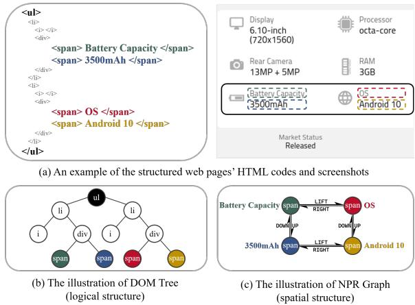
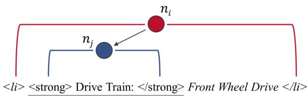
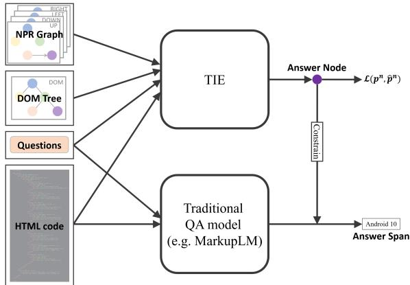
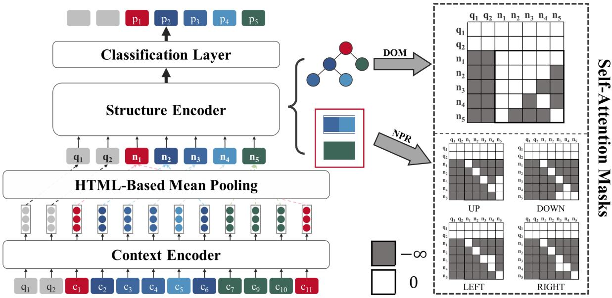
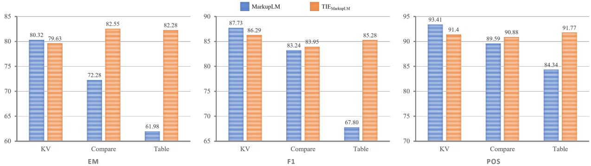
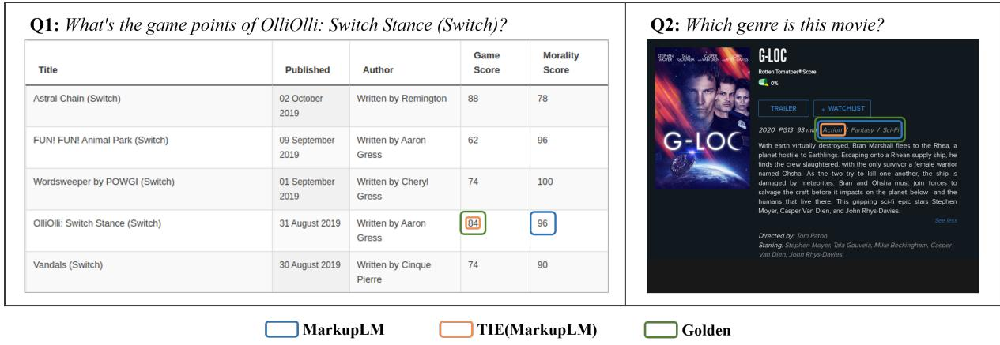
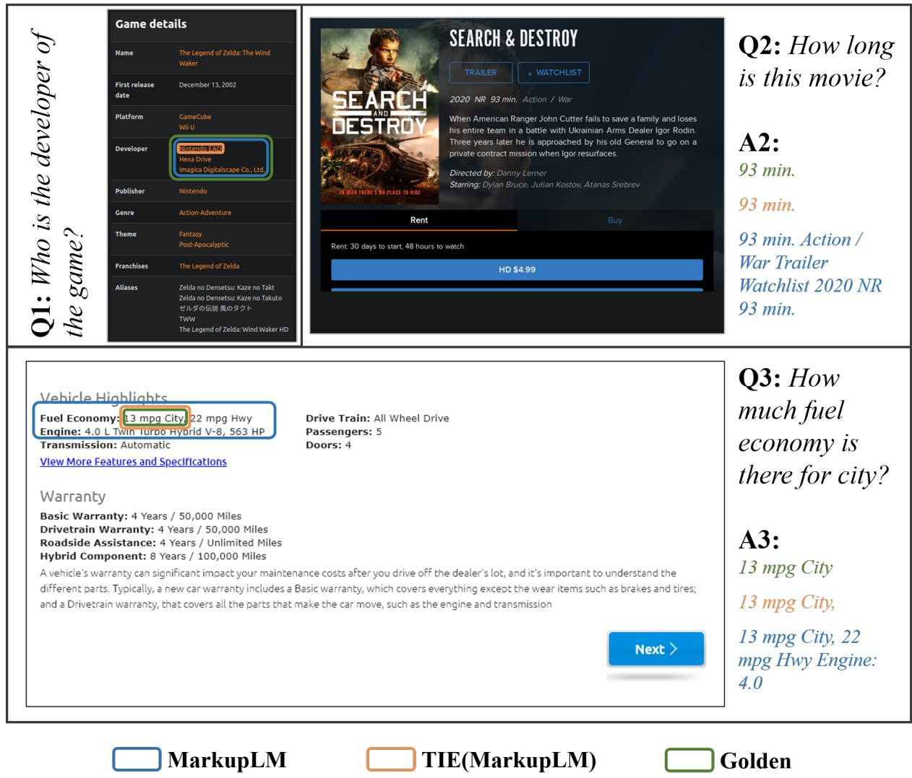
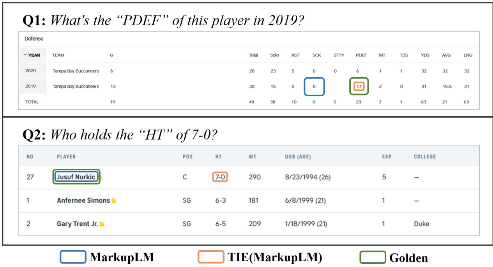
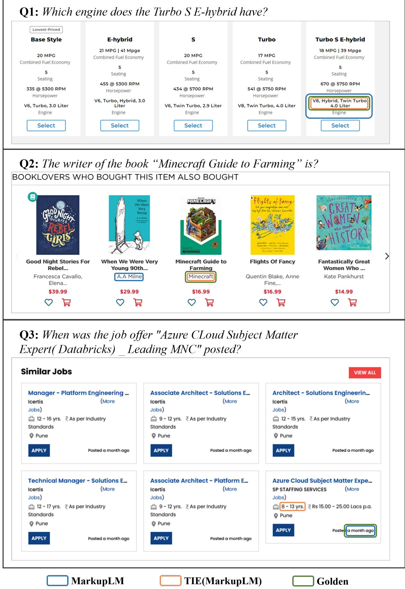

# TIE: Topological Information Enhanced Structural Reading Comprehension on Web Pages

Zihan Zhao, Lu Chen∗, Ruisheng Cao, Hongshen Xu, Xingyu Chen and Kai Yu∗ X-LANCE Lab, Department of Computer Science and Engineering

MoE Key Lab of Artificial Intelligence, AI Institute, Shanghai Jiao Tong University, China Shanghai Jiao Tong University, Shanghai, China

State Key Laboratory of Media Convergence Production Technology and Systems zhao\_mengxin@sjtu.edu.cn, chenlusz@sjtu.edu.cn {211314, xuhongshen, galaxychen, kai.yu}@sjtu.edu.cn

## Abstract

Recently, the structural reading comprehension (SRC) task on web pages has attracted increasing research interests. Although previous SRC work has leveraged extra information such as HTML tags or XPaths, the informative topology of web pages is not effectively exploited. In this work, we propose a Topological Information Enhanced model (TIE), which transforms the token-level task into a tag-level task by introducing a two-stage process (i.e. node locating and answer refining). Based on that, TIE integrates Graph Attention Network (GAT) and Pre-trained Language Model (PLM) to leverage the topological information of both logical structures and spatial structures. Experimental results demonstrate that our model outperforms strong baselines and achieves state-ofthe-art performances on the web-based SRC benchmark WebSRC at the time of writing. The code of TIE will be publicly available at https://github.com/X-LANCE/TIE.

## 1 Introduction

With the rapid development of the Internet, web pages have become the most common and rich source of information (Dong et al., 2014). Therefore, the ability to understand the contents of structured web pages will guarantee a rich and diverse knowledge source for deep learning systems. Each web page is mainly rendered from the corresponding HyperText Markup Language (HTML) codes. In other words, the understanding of a structured web page can be achieved by the comprehension of its HTML codes.

One of the commonly used tasks to verify the model’s ability of comprehension is Question Answering (QA). However, previous QA models only focus on the comprehension of plain texts (Rajpurkar et al., 2016; Yang et al., 2018; Reddy et al., 2019; Zeng et al., 2020), tables (Pasupat and Liang,

  
Figure 1: An example of web pages in WebSRC and its corresponding Document Object Model (DOM) tree and Node Positional Relation (NPR) graph in WebSRC. The colored HTML tag in (a) is corresponding to the bounding box with the same color in (a) and the node with the same color in (b) and (c).

2015; Chen et al., 2020c, 2021b), or knowledge bases (KBs) (Berant et al., 2013; Talmor and Berant, 2018). These sources have either no topological structure or fixed-form structures. On the contrary, the topological structures of web pages are complex and flexible, which are less investigated in previous QA works.

Specifically, HTML codes can be viewed as multiple semantic unit separated by tag tokens (e.g. 
, 
). An HTML tag refers to a pair of matched start and end tags and all the content in between, which also corresponds to a part of the web page (illustrated in Fig. 1 (a)). Therefore, there are two kinds of topological structures in web pages: logical structures which contain the hierarchical relations and clustering of tags (see Fig. 1 (b)); and spatial structures which contain the relative positions between different tags in the web pages (see Fig. 1 (c)). These topological structures are as important as the semantics of HTML codes and screenshots.

Although previous works (Chen et al., 2021c; Li et al., 2021) have tried to leverage the topological structures by adopting HTML tags or XPaths as tokens or position embeddings, only logical structures are encoded implicitly. However, it is obvious for humans to identify key-value pairs if two spans are located in the same row or column, while this relation may take various forms in the logical structures of different web pages. Moreover, tables have extremely simple spatial structures but will be super complex in terms of logical structures. Therefore, spatial structures are essential and complementary to logical structures.

The major obstacle that prevents previous models to leverage spatial relations is that both the two kinds of topological structures are organized at the tag level instead of the token level (Fig. 1 (b) and (c)). As token-level models, whose computation and prediction units are the tokens of web pages, it is extremely hard and anti-natural for them to encode the topological structures. Moreover, using token-level models also means that previous works have to implicitly imply the logical structures to the models, which may be less effective than explicitly telling with the help of prior knowledge.

To tackle these problems, we propose Topological Information Enhanced model (TIE), a tag-level QA model that operates on the representations of HTML tags to predict which tag the answer span belongs to. By switching from token level to tag level, various structures of web pages can be explicitly encoded into the model easily. Specifically, TIE encodes both the logical and spatial structures using Graph Attention Network (GAT) (Velickovic et al., 2018) with the help of two kinds of graphs. The first kind of graphs is Document Object Model (DOM) trees which is widely used to represent the logical structures of HTML codes. Secondly, to encode the spatial structures, we define the Node Positional Relation (NPR) graph based on the bounding box of HTML tags obtained by the browser. Detail definition can be found in Section 3.2.2.

Moreover, to accomplish the token-level prediction tasks by a tag-level QA model, we further introduce a two-stage process including node locating stage and answer refining stage. Specifically, in the answer refining stage, a traditional token-level QA model is utilized to extract answer span with the constraint of the answer node prediction by TIE in the node locating stage.

Our TIE model is tested on the WebSRC dataset 1 and achieve state-of-the-art (SOTA) performances.

  
Figure 2: Illustration of the relations between DOM trees and HTML codes. The italic tokens "<li> Front Wheel Drive </li>" are the direct content of node $n _ { i }$

To summarize, our contributions are three folds:

• We propose a tag-level QA model called TIE with a two-stage inference process: node locating stage and answer refining stage.

• We utilize GAT to leverage the topological information of both the logical and spatial structures with the help of DOM trees and our newly defined NPR graphs.

• Experimental results on the WebSRC dataset demonstrate the effectiveness of our model and its key component.

## 2 Preliminary

## 2.1 Task Definition

The Web-based SRC task (Chen et al., 2021c) is defined as a typical extractive question answering task based on web pages. Given the user query ${ \bf q } = ( q _ { 1 } , q _ { 2 } , \cdot \cdot \cdot , q _ { | { \bf q } | } )$ and the flattened HTML code sequence $\pmb { c } = ( c _ { 1 } , c _ { 2 } , \cdots , c _ { | \pmb { c } | } )$ of relevant web page as inputs , the goal is to predict the starting and ending position of answer span (s, e) in the HTML codes c where $| q | , | c |$ denote the length of the question and the HTML code sequence, respectively, and $1 \leq s \leq e \leq | c |$ . Notice that each token $c _ { i }$ in the flattened HTML codes c can be a raw text word or tag symbol such as 
 while the user query q is a word sequence of plain text.

## 2.2 DOM Trees of HTML codes

The DOM tree is a special tree structure that is parsed from raw HTML codes by Document Object Model 2. Each node in the tree denotes a tag closure in the original HTML code. Specifically, each node contains a start tag token (e.g. 
), an end tag token $( { \mathrm { e . g . ~ } } < / { \mathrm { d i v } } > )$ , and all the contents in between. One DOM node $n _ { j }$ is the descendant of another node $n _ { i } .$ , iff the contents of node $n _ { j }$ is entirely included in the contents of node $n _ { i }$

  
Figure 3: The two-stage architecture using TIE and traditional QA model (e.g. MarkupLM)

Furthermore, we define the direct contents of each DOM node (and its corresponding HTML tag) as all the tokens in its tag closure that are not contained in any of its children (see Figure 2).

## TIE

In this section, we will first introduce the architecture of the whole SRC system in Sec.3.1, and then the two kind of graph we used in Sec. 3.2. Finally, the structure of Topological Information Enhance model (TIE) is demonstrated in Sec.3.3.

## 3.1 Architecture of the Whole SRC System

With the help of DOM trees and NPR graphs, TIE can efficiently predict in which node the answer is located. Therefore, we modify the original architecture of the SRC system into a two-stage architecture: node locating and answer refining. The two-stage architecture is illustrated in Figure 3.

In the node locating stage, we first define the answer node as the deepest node in the DOM tree which contains the complete answer span. Then, TIE is utilized to predict the answer node $n _ { a }$ for the question q given the flattened HTML codes c and the corresponding DOM tree $\mathcal { D } _ { c }$ and NPR graphs $\mathcal { G } _ { c }$ (see Sec. 3.2). Formally,

$$
\begin{array} { r l } & { \mathrm { T I E } ( q , c , ( \mathcal { D } _ { c } , \mathcal { G } _ { c } ) ) = p ^ { n } , } \\ & { \quad \quad n _ { a } = \underset { n _ { i } \in V _ { D _ { c } } } { \mathrm { a r g m a x } } ( p _ { i } ^ { n } ) , } \end{array}
$$

where $p _ { i } ^ { n }$ denotes the probability of node $n _ { i }$ being the answer node, and $V _ { D _ { c } }$ is the node set of $D _ { c }$

Then, in the answer refining stage, we use the predicted answer node as a constraint during the prediction of the answer span. In more detail, we first use a QA model (e.g. MarkupLM) to obtain the start and end probabilities $p ^ { s } , p ^ { e }$ among all the tokens of HTML code sequence c. Then, the predicted answer span is chosen from the spans which are contained by the predicted answer node $n _ { a }$ . To conclude, provided that the starting and ending position of predicted answer node $n _ { a }$ in the HTML code c is $s _ { a }$ , and $e _ { a }$ , the second stage can be formulated as follows:

$$
\begin{array} { c } { \mathrm { Q A } ( q , c ) = p ^ { s } , p ^ { e } } \\ { ( s _ { p r e d } , e _ { p r e d } ) = \displaystyle \operatornamewithlimits { a r g m a x } _ { ( i , j ) : s _ { a } \leq i < j \leq e _ { a } } ( p _ { i } ^ { s } + p _ { j } ^ { e } ) } \end{array}
$$

## 3.2 Construction of GAT Graphs

Recently, Graph Neural Network (GNN) (Scarselli et al., 2008) has been widely used in multiple Neural Language Processing tasks, such as text classification and generation (Yao et al., 2019; Zhao et al., 2020), information extraction (Lockard et al., 2020), dialogue policy optimization (Chen et al., 2018a,b, 2019, 2020d), dialogue state tracking (Chen et al., 2020a; Zhu et al., 2020), Chinese processing (Gui et al., 2019; Chen et al., 2020b; Lyu et al., 2021), etc. Graph Attention Network (GAT) is a special type of GNN that encodes graphs with attention mechanism. In this work, to leverage both the logical and spatial structures, we introduce two kinds of graphs: DOM Trees and NPR graphs.

## 3.2.1 DOM Trees

The logical relations of HTML codes can be described with the assistance of its DOM Tree (see Sec. 2.2). However, the original tree is extremely sparse, which often leads to poor communication efficiency among nodes. To this end, we modify the structure to enlarge the receptive fields for each node. Mathematically, the resulting graph $\mathcal { D } _ { c } = ( V _ { D _ { c } } , E _ { D _ { c } } )$ can be constructed from the original sparse form $\mathcal { D } = ( V _ { D } , E _ { D } )$ ,

$\left\{ \begin{array} { r l } { { V _ { D } = \mathrm { a l l ~ n o d e s ~ i n } } } & { { } } \\ { { E _ { D } = \{ ( n _ { i } , n _ { j } ) | n _ { i } } }  & { { } } \\ { { \{ ( n _ { i } , n _ { j } ) | n _ { i } } }  & { { } } \end{array} \right.$ the original DOM tree, is the parent of $n _ { j } \} \cup$ is a child of $n _ { j } \}$

into a denser one $\mathcal { D } _ { c } = ( V _ { D _ { c } } , E _ { D _ { c } } )$

$$
\left\{ \begin{array} { c l } & { V _ { D _ { c } } = V _ { D } } \\ & { E _ { D _ { c } } = \{ ( n _ { i } , n _ { i } ) | n _ { i } \in V _ { D _ { c } } \} \cup } \\ & { \qquad \{ ( n _ { i } , n _ { j } ) | n _ { i } \mathrm { ~ i s ~ a n ~ a n c e s t o r ~ o f ~ } n _ { j } \} \cup } \\ & { \qquad \{ ( n _ { i } , n _ { j } ) | n _ { i } \mathrm { ~ i s ~ a ~ d e s c e n d a n t ~ o f ~ } n _ { j } \} } \end{array} \right.
$$

  
Figure 4: The overall architecture of TIE

In this way, each node can directly communicate with all of its ancestors and descendants, so that the information can be transferred much faster.

## 3.2.2 NPR Graphs

To explicitly establish the positional relations between different texts, we define and construct Node Positional Relation (NPR) graph $\mathcal { G } _ { c } = ( V _ { G } , E _ { G } )$ based on the rendered structured web pages.

Similar to DOM Tree, each NPR node $n _ { i }$ corresponds to a tag $t _ { i }$ in the HTML code of the web page. The content of NPR nodes is defined as the direct content of their corresponding HTML tags. It is worth noticing that under our definition, the node sets of the NPR graph and the DOM tree of the same web page are identical $( V _ { G } = V _ { D } )$

Moreover, considering that the nodes with informative relations (such as "key-value" relations and "header-cell" relations) are usually located on the same row or column, we introduce four kinds of directed edges into NPR graphs: UP, DOWN, LEFT, and RIGHT. Specifically, $( n _ { i } , n _ { j } ) \in E _ { G } ^ { \mathtt { U P } }$ when

$$
\left\{ \begin{array} { l l } { \operatorname* { m i n } ( x _ { n _ { i } } { + } w _ { n _ { i } } , x _ { n _ { j } } + w _ { n _ { j } } ) - \operatorname* { m a x } ( x _ { n _ { i } } , x _ { n _ { j } } ) } \\ { \qquad \geq \gamma \times \operatorname* { m i n } ( w _ { n _ { i } } , w _ { n _ { j } } ) } \\ { y _ { n _ { i } } \geq y _ { n _ { j } } \mathrm { o r } y _ { n _ { i } } + h _ { h _ { i } } \geq y _ { n _ { j } } + h _ { n _ { j } } } \end{array} \right.\tag{1}
$$

both hold, where $( x _ { n _ { i } } , y _ { n _ { i } } ) , ( x _ { n _ { j } } , y _ { n _ { j } } )$ are the coordinates of the upper-left corner of the bounding boxes corresponding to the nodes $n _ { i }$ and $n _ { j }$ $w _ { n _ { i } } , w _ { n _ { j } }$ are the width of the two bounding boxes while $h _ { n _ { i } } , h _ { n _ { j } }$ are the height of the two bounding boxes; and $\gamma$ is a hyper-parameter. Similar functions are used for $\dot { E } _ { G } ^ { \tt D O W N } , E _ { G } ^ { \tt L E F T }$ , and $E _ { G } ^ { \tt R I G H T }$ . Finally, $E _ { G } = E _ { G } ^ { \tt U P } \bigcup \breve { E } _ { G } ^ { \tt D O W N } \bigcup \breve { E } _ { G } ^ { \tt L E F T } \bigcup E _ { G } ^ { \tt R I G H T }$ Figure 1 (a) and (c) show an example of the NPR graph and its corresponding HTML code.

To simplify the NPR graphs, we only consider the nodes whose direct contents contain text tokens. That means in NPR graphs, the nodes whose direct contents only contain tag tokens will be isolated nodes with no relation.

## 3.3 Design of TIE

The model we proposed, TIE, mainly consists of four parts: the Context Encoder Module, the HTML-Based Mean Pooling, the Structure Encoder Module, and the Classification Layer. The overall architecture of TIE is shown in Figure 4.

Context Encoder Module. We first utilize Pretrained Language Model as our context encoder. It encodes the contextual information of the HTML codes and gets the contextual word embeddings used for node representation initialization. Specifically, we use two PLM in our experiments: H-PLM (Chen et al., 2021c) + RoBERTa (Liu et al., 2019) and MarkupLM (Li et al., 2021).

HTML-Based Mean Pooling. In this module, TIE initializes the node representations based on the contextual word embedding calculated by Context Encoder. Specifically, for each node, we initialize its representation as the average embedding of its corresponding tag’s direct contents. Formally, the representation of node $n _ { i }$ is calculated as:

<table><tr><td rowspan="2">Type</td><td colspan="2">Training set</td><td colspan="2">Dev set</td></tr><tr><td>#QA</td><td>%</td><td>#QA</td><td>%</td></tr><tr><td>KV</td><td>129990</td><td>42.3</td><td>21798</td><td>41.3</td></tr><tr><td>Comparison</td><td>52893</td><td>12.2</td><td>9078</td><td>17.2</td></tr><tr><td>Table</td><td>124432</td><td>40.5</td><td>21950</td><td>41.6</td></tr></table>

Table 1: The statistics of QA pairs from different types of websites in WebSRC.

$$
\pmb { n } _ { i } = \pmb { m e a n } _ { \pmb { x } _ { j } \in \mathrm { D C } ( n _ { i } ) } ( \pmb { x } _ { j } )\tag{2}
$$

where $\mathrm { D C } ( n _ { i } )$ means the tokens set of the direct contents of node $n _ { i } ; \boldsymbol { x } _ { j }$ is the contextual embedding of token $x _ { j }$

Structure Encoder Module. TIE utilizes GAT to encode the topological information contained in DOM trees and NPR graphs. Specifically, for the i-th attention head of GAT:

$$
\begin{array} { c } { Q _ { i } = W _ { q , i } N ; ~ K _ { i } = W _ { k , i } N ; V _ { i } = W _ { v , i } N } \\ { \operatorname { G A T } _ { i } ( N ) = \operatorname { s o f t m a x } ( \frac { Q _ { i } ^ { T } K _ { i } } { \sqrt { d } } + M _ { i } ) V _ { i } } \\ { m _ { j k } ^ { ( i ) } = \left\{ \begin{array} { l l } { 0 } & { ( n _ { j } , n _ { k } ) \in \operatorname { E d g e } ( G _ { i } ) } \\ { - \infty } & { o t h e r w i s e } \end{array} \right. } \\ { G _ { i } \in \{ { \mathcal { D } } _ { c } , { \mathcal { G } } _ { c } ^ { \mathrm { U P } } , { \mathcal { G } } _ { c } ^ { \mathrm { D U W } } , { \mathcal { G } } _ { c } ^ { \mathrm { L E F T } } , { \mathcal { G } } _ { c } ^ { \mathrm { R I G H T } } \} } \end{array}
$$

where $\pmb { N } = [ \pmb { n } _ { i } ] _ { d \times | \mathcal { N } | } ;$ d is the dimension of the node representations $n _ { i } ; W _ { i } \mathrm { s }$ are the learnable parameters; $M _ { i } = [ m _ { j k } ^ { \left( i \right) } ] _ { \left| \mathcal { N } \right| \times \left| \mathcal { N } \right| }$ is the mask matrix for the i-th attention head. Finally, the outputs of all the attention heads are concatenated to form the node representations for the next GAT layer.

Classification Layers. Finally, we get the embeddings of all the nodes from the Structure Encoder Module and utilize a single linear layer followed by a Softmax function to calculate each node’s probability of being the answer node.

## 4 Experiments

## 4.1 Dataset

We evaluate our proposed methods on WebSRC (Chen et al., 2021c). In more detail, the WebSRC dataset consists of 0.4M question-answer pairs and 6.4K web page segments with complex structures. For each web page segment, apart from its corresponding HTML codes, the dataset also provides the bounding box information of each HTML tag obtained from the rendered web page. Therefore, we can easily use this information to construct the NPR graph for each web page segment.

Moreover, WebSRC groups the websites into three classes: KV, Comparison, and Table. Specifically, KV indicates that the information in the websites is mainly presented in the form of "key:value", where key is an attribute name and value is the corresponding value. Comparison indicates that each web page segment of the websites contains several entities with the same set of attributes. Table indicates that the websites mainly use a table to present information. The statistics of different types of websites in WebSRC are shown in Table 1.

We submit our models to the official of WebSRC for testing.

## 4.2 Metrics

To keep consistent with previous studies, we adopt the following three metrics: (1) Exact Match (EM), which measures whether the predicted answer span is exactly the same as the golden answer span. (2) Token level F1 score (F1), which measures the token level overlap of the predicted answer span and the golden answer span. (3) Path Overlap Score (POS), which measures the overlap of the path from the root tag (<HTML>) to the deepest tag that contains the complete predicted answer span and that contains the complete golden answer span. Formally, the POS is calculated as follows:

$$
P O S = \frac { | P _ { p r e d } \bigcap P _ { g t } | } { | P _ { p r e d } \bigcup P _ { g t } | } \times 1 0 0 \%\tag{3}
$$

where $P _ { p r e d }$ and $P _ { g t }$ are the set of tags that on the path from the root (<HTML>) tag to the deepest tag that contains the complete predicted answer span or the ground truth answer span, respectively.

## 4.3 Baselines & Setup

We leverage the three models introduced in Chen et al. (2021c) and MarkupLM (Li et al., 2021) as our baselines. Specifically, T-PLM converts the HTML codes into plain text by simply removing all the HTML tags, while H-PLM treats HTML tags as special tokens and uses the origin HTML code sequences as input. Then, both of them utilize PLMs to generate the predicted answer span. To leverage visual information, V-PLM concatenates token embeddings resulting from H-PLM with visual embeddings and then feeds the results into multiple self-attention blocks before generating predictions. Faster R-CNN is utilized to extract visual embeddings from screenshots of the corresponding web pages. On the other hand, MarkupLM leverages XPaths to encode the logical position of each token and use it as an additional position embedding.

<table><tr><td rowspan="2"></td><td rowspan="2">Method</td><td colspan="3">Dev</td><td colspan="3">Test</td></tr><tr><td>EM↑</td><td>F1↑</td><td>POS↑</td><td>EM↑</td><td>F1↑</td><td>POS↑</td></tr><tr><td>BASE</td><td>T-PLM(BERT) (Chen et al., 2021c) H-PLM(BERT) (Chen et al., 2021c) V-PLM(BERT) (Chen et al., 2021c) MarkupLM (Li et al., 2021)</td><td>52.12 61.51 62.07 68.39 68.99 74.55</td><td>61.57 67.04 66.66 74.47</td><td>79.74 82.97 83.64 87.93</td><td>39.28 52.61 52.84</td><td>49.49 59.88 60.80</td><td>67.68 76.13 76.39</td></tr><tr><td></td><td> $\mathrm { T I E _ { M a r k u p L M } }$  T-PLM(Electra) (Chen et al., 2021c) H-PLM(Electra) (Chen et al., 2021c) V-PLM(Electra) (Chen et al., 2021c)</td><td>76.83 61.67 70.12 73.22</td><td>82.77 69.85 74.14 76.16</td><td>90.90 84.15 86.33</td><td>71.86 56.32 66.29</td><td>75.91 72.35 72.71</td><td>85.74 79.18 83.17</td></tr><tr><td>LARGE</td><td>MarkupLM (Li et al., 2021) H-PLM(RoBERTa)*</td><td>74.43 70.90</td><td>80.54 75.15</td><td>87.06 90.15 87.16</td><td>68.07 67.76</td><td>75.25 74.61</td><td>84.96 86.29</td></tr><tr><td></td><td> $\mathrm { T I E } _ { \mathrm { H - P L M ( R o B E R T a ) } }$   $\overline { { { \bf M a r k u p L M ^ { * } } } }$ </td><td>75.57 73.38</td><td>79.38 79.83</td><td>88.29 89.93</td><td>69.65 69.09</td><td>74.78 76.45</td><td>85.72</td></tr><tr><td></td><td> $\mathrm { T I E _ { M a r k u p L M } ^ { \dagger } }$ </td><td>81.66</td><td>86.24</td><td>92.29</td><td>75.87</td><td>80.19</td><td>87.24 89.73</td></tr></table>

Table 2: The results of our proposed method on WebSRC. EM denotes the exact match scores; F1 denotes the token level F1 scores; POS denotes the path overlap scores. We submit the models to the official of WebSRC for testing. \* denotes reproduction results. †denotes average results of 3 random seeds.

In our experiments, we use 3 GAT blocks as the Structure Encoder Module of TIE. H-PLM(RoBERTa) and MarkupLM are leveraged as context encoders. The implementation of TIE is based on the official code provided by WebSRC 3 and MarkupLM 4. We set the hyperparameter γ in Eq.1 to be 0.5. Finally, the models used in the answer refining stage are of the same architecture as the context encoder models of TIE while individually trained on WebSRC. For more setup details, please refer to Appendix. A

## 4.4 Main Results

The experimental results on the development set and the test set are shown in Table 2. Specifically, the performances of TIE in the following sections refer to the performances of the proposed two-stage system, and the subscript of TIE refer to both the context-encoder for TIE and the QA model used in answer refining stage.

<table><tr><td rowspan=2 colspan=1></td><td rowspan=2 colspan=1> $\left| S _ { 0 } \right|$ </td><td rowspan=2 colspan=1> $\vert S _ { 1 } \vert$ </td><td></td></tr><tr><td rowspan=1 colspan=1> $\left| S _ { 0 } \right| : \left| S _ { 1 } \right|$ </td></tr><tr><td rowspan=2 colspan=1>MarkupLM $\mathrm { T I E _ { M a r k u p L M } }$ </td><td rowspan=1 colspan=1>873</td><td rowspan=1 colspan=1>692</td><td rowspan=2 colspan=1>1.26:13.1:1</td></tr><tr><td rowspan=1 colspan=1>944</td><td rowspan=1 colspan=1>314</td></tr></table>

Table 3: The statistics of samples on Compare websites in the development set with wrong predictions. $S _ { 0 }$ is the set of examples with 0 F1 scores. $S _ { 1 }$ is the set of examples with F1 scores between 0 and 1. The numbers are average results of 3 random seeds.

From the results, we can find out that our TIE consistently achieves better results compared with the corresponding baselines. Specifically, TIEMarkupLM significantly outperforms the previous SOTA results, MarkupLM, by 6.78% EM, 3.74% F1, and 2.49% POS on the test set. Moreover, it is worth noticing that the performance of TIEMarkupLM-BASE is even higher than the performance of the MarkupLM-LARGE model (76.83% v.s. 73.38% EM on the development set and 71.86% v.s. 69.09% EM on the test set). These results strongly demonstrate that TIE can effectively model the topological information of the semi-structured web pages with the help of its structure encoder.

Furthermore, we compare the performances of TIEMarkupLM and MarkupLM on different types of websites. The results are shown in Figure 5. From the figure, we find that our method achieves significant improvements on the websites of type Table (+20.30% EM, +17.48% F1, +7.43% POS) while suffering slight performance drops on the websites of type KV. We hypothesize the reason is that topological structures are less important in the websites of type KV, so that stronger contextual encoding abilities will lead to better results. More analysis can be found in Sec. 4.5.

  
Figure 5: The performance comparison on different types of websites of the development set.

We also notice that the improvements of F1 are less considerable compared with those of EM on the websites of type Compare (+10.27% EM v.s. +0.71% F1). The reason lies in the cascading error of our two-stage process. Specifically, in the node locating stage, the model may generate a wrong prediction which is not one of the ancestors of the answer node. In this case, as the answer span is not contained in the predicted node, the final F1 score is highly likely to be zero. Detailed calculations, see Table 3, strongly support our analysis.

## 4.5 Case Study

In Fig. 6, we compare the answers generated by $\mathrm { T I E } _ { \mathrm { M a r k u p L M } }$ and MarkupLM. More examples can be found in Appendix. B.

Q1 is a typical example of Table websites. It is obvious that multiple "header-cell" relations need to be recognized when answering Q1. Specifically, one should first find "OlliOlli: Switch Stance (Switch)" from column "Title" (first "header-cell" relation), then locate the answer at the crossing cell of row "OlliOlli: Switch Stance (Switch)" (second "header-cell" relation) and column "Game Score" (third "header-cell" relation). With the help of topological information, TIE can correctly answer this question. However, MarkupLM only successfully locates the row and fails to recognize the long range relation between "Game Score" and "84". Considering that this row can also be identified by string matching, this example strongly demonstrate that TIE is much stronger in terms of long range topological relation encoding.

<table><tr><td>Method</td><td>EM↑</td><td>F1↑</td><td>POS↑</td></tr><tr><td> $\mathrm { T I E _ { M a r k u p L M } ^ { \dagger } }$ </td><td>81.66</td><td>86.24</td><td>92.29</td></tr><tr><td>-w/o DOM†</td><td> $8 1 . 0 5 _ { ( - 0 . 6 1 ) }$ </td><td> $\overline { { 8 5 . 4 2 _ { ( - 0 . 8 2 ) } } }$ </td><td> $9 1 . 6 2 _ { ( - 0 . 6 7 ) }$ </td></tr><tr><td>-w/ ORD</td><td> $7 2 . 2 0 _ { ( - 9 . 4 6 ) }$ </td><td> $7 7 . 8 0 _ { ( - 8 . 4 4 ) }$ </td><td> $8 9 . 3 9 _ { ( - 1 . 9 0 ) }$ </td></tr><tr><td>-w/o NPR</td><td> $\overline { { 7 2 . 6 2 _ { ( - 9 . 0 2 ) } } }$ </td><td> $\overline { { 7 7 . 7 4 _ { ( - 8 . 5 0 ) } } }$ </td><td> $\overline { { 8 9 . 2 5 _ { ( - 3 . 0 4 ) } } }$ </td></tr><tr><td>-w/o Hori</td><td> $7 9 . 6 5 _ { ( - 2 . 0 1 ) }$ </td><td> $8 4 . 2 0 _ { ( - 2 . 0 4 ) }$ </td><td> $9 1 . 9 0 _ { ( - 0 . 3 9 ) }$ </td></tr><tr><td>-w/o Vert</td><td> $7 1 . 6 6 _ { ( - 1 0 . 0 0 ) }$ </td><td> $7 7 . 2 8 _ { ( - 8 . 9 6 ) }$ </td><td> $8 8 . 9 8 _ { ( - 3 . 3 1 ) }$ </td></tr></table>

Table 4: The ablation study of $\mathrm { T I E _ { M a r k u p L M } }$ on the development set of WebSRC. †denotes average results of 3 random seeds.

Q2 is a typical example of KV websites. The topological structures of this web page are far less complex. To answer Q2, the most important step is to discover the semantic similarity among "Action", "Fantasy", and "Sci-Fi" and then group them together. In this case, the contextual distances of these words will be extremely helpful. Therefore, MarkupLM is able to generate the correct prediction. However, as TIE focuses on the comprehension of node structures where sequencing order and semantics are less valuable, TIE fails to group the three nodes.

## 4.6 Ablation Study

To further investigate the contributions of key components, we make the following variants of TIE: (1)"w/o DOM" means only using NPR graphs without the DOM trees. (2)"w/ ORD" means using original sparse DOM trees instead of the denser version introduced in Sec.3.3. (3)"w/o NPR" means only using the densified DOM trees without the NPR graphs. (4)"w/o Hori" removes LEFT and RIGHT relations in NPR graph. (5)"w/o Vert" removes UP and DOWN relations in NPR graph.

The results are shown in Table 4, from which we

  
Figure 6: Examples of the results in the development set.

have several observations and analysis:

First, we investigate the contribution of DOM trees. The performance of "w/o DOM" drops slightly compared with original TIE, which indicates that the contributions of DOM trees are marginal. That may be because MarkupLM has leveraged XPaths to encode the logical information. Considering that XPaths are defined based on DOM trees, the information contained in XPaths and DOM trees may largely overlap. Moreover, the results of "w/ ORD" show that densifying the DOM Tree is vitally important, as the original DOM tree is extremely sparse and will significantly lower the performance of TIE.

Finally, the NPR graphs have great contributions as the performance of "w/o NPR" drops significantly. It is because NPR graphs can help TIE efficiently model the informative relations such as key-value and header-cell, as they are often arranged in the same row or column. Moreover, we further investigate the contribution of different relations in NPR graphs by "w/o Hori" and "w/o Vert". Note that, we keep the number of parameters of TIE unchanged among these experiments, which means no horizontal relations in NPR graphs will result in more attention heads assigned to vertical relations. The results show that, in WebSRC, vertical relations are much more important than horizontal relations. That is because most of the websites in WebSRC are constructed row-by-row, which means that the tags of horizontal relations are often located near each other in the HTML codes while those of vertical relations may be located far apart. Therefore, in most cases, the horizontal relations are easier to capture in the context encoder without the help of NPR graph, while the vertical relations can hardly achieve that.

## 5 Related Work

Question Answering (QA) In recent years, a large number of QA datasets and tasks have been proposed, ranging from Plain text QA (i.e. MRC) (Rajpurkar et al., 2016; Joshi et al., 2017; Lai et al., 2017; Yang et al., 2018; Reddy et al., 2019) to QA over KB (Berant et al., 2013; Bao et al., 2016; Yih et al., 2016; Talmor and Berant, 2018; Dubey et al., 2019), Table QA (Pasupat and Liang, 2015; Chen et al., 2020c, 2021b), Visual QA (VQA) (Antol et al., 2015; Wang et al., 2018; Marino et al., 2019), and others. However, the topological information in the textual inputs is either absent (plain text) or simple and explicitly provided (KB/tables). The QA task based on semi-structured HTML codes with implicit and flexible topology is under-researched.

Among these tasks, Table QA is the most similar to the Web-based SRC task, as there are many tables in the WebSRC dataset. To solve the problem, Krichene et al. (2021) first selects candidate answer cells according to cell embeddings from the whole table and then finds the accurate answer cell from the candidates. Their method enables the model to handle larger tables at little cost. On the other hand, Glass et al. (2021) introduces row and column interactions into their models and determines the final answers based on the top-ranked relevant rows and columns. In addition, Text-to-SQL is another group of methods to tackle Table QA problems and has been widely studied recently (Yu et al., 2018; Bogin et al., 2019; Wang et al., 2020; Cao et al., 2021; Chen et al., 2021d,e; Hui et al., 2022). They use databases to store the source tables and translate natural language queries into Structured Query Language (SQL) to retrieve answers from the databases. It is worth noticing that these methods are highly coupled with the data format and requires simple and neat structures. Therefore, their methods are not suitable for Web-based SRC tasks.

Web Question Answering Recent works which mentioned Web Question Answering mainly focus on the post-processing of the plain texts (Su et al., 2019; Shou et al., 2020) or tables (Zhang et al., 2020) resulting from the searching engine. Moreover, Chen et al. (2021a) has tried to answer fixed-form questions based on raw HTML codes with the help of Domain-Specific Language (DSL). Apart from the above works, Chen et al. (2021c) proposed a QA task called Web-Based SRC which is targeted at the comprehension of the structured web pages using raw HTML codes. The method they proposed is to treat the HTML tags as special tokens and directly feed the raw flattened HTML codes into the PLM. They also tried to leverage screenshots as auxiliary information. Later, Li et al. (2021) introduced a novel pre-trained model called MarkupLM specifically for XML-based documents. They adopted a new kind of position embedding generated from the XPath of each token to implicitly encode the logical information of XML codes. In this work, we further explicitly introduce the topological structures to the models with the help of DOM trees and NPR graphs. A newly designed tag-level QA model with a two-stage pipeline is leveraged to take advantage of these graphs.

## 6 Conclusion & Future Work

In this paper, we proposed a tag-level QA model called TIE to better understand the topological information contained in the structured web pages. Our model explicitly captures two of the most informative topological structures of the web pages, logical and spatial structures, by DOM trees and NPR graphs, respectively. With the proposed twostage pipeline, we conduct extensive experiments on the WebSRC dataset. Our TIE successfully achieves SOTA performances and the contributions of its key components are validated.

Although our TIE can achieve much high performance compared with traditional QA models on SRC tasks, more improvements are still needed. Specifically, as our two-stage system needs a separated token-level QA model to generate final answer spans, the parameter numbers and computation consumption will be at least doubled. We have tried to tackle this problem by sharing parameters between the context encoder and the token-level QA model used in the answer refining stage. But the results are not promising. Therefore, we leave this problem for future work.

## Acknowledgements

We sincerely thank the anonymous reviewers for their valuable comments. This work has been supported by the China NSFC Projects (No. 62120106006 and No. 62106142), Shanghai Municipal Science and Technology Major Project (2021SHZDZX0102), CCF-Tencent Open Fund and Startup Fund for Youngman Research at SJTU (SFYR at SJTU).

## References

Stanislaw Antol, Aishwarya Agrawal, Jiasen Lu, Margaret Mitchell, Dhruv Batra, C. Lawrence Zitnick, and Devi Parikh. 2015. VQA: visual question answering. In 2015 IEEE International Conference on Computer Vision, ICCV 2015, Santiago, Chile, December 7-13, 2015, pages 2425–2433. IEEE Computer Society.

Junwei Bao, Nan Duan, Zhao Yan, Ming Zhou, and Tiejun Zhao. 2016. Constraint-based question answering with knowledge graph. In Proceedings of COLING 2016, the 26th International Conference on Computational Linguistics: Technical Papers, pages 2503–2514, Osaka, Japan. The COLING 2016 Organizing Committee.

Jonathan Berant, Andrew Chou, Roy Frostig, and Percy Liang. 2013. Semantic parsing on Freebase from question-answer pairs. In Proceedings of the 2013 Conference on Empirical Methods in Natural Language Processing, pages 1533–1544, Seattle, Washington, USA. Association for Computational Linguistics.

Ben Bogin, Jonathan Berant, and Matt Gardner. 2019. Representing schema structure with graph neural networks for text-to-SQL parsing. In Proceedings ofthe 57th Annual Meeting ofthe Associationfor Computational Linguistics, pages 4560–4565, Florence, Italy. Association for Computational Linguistics.

Ruisheng Cao, Lu Chen, Zhi Chen, Yanbin Zhao, Su Zhu, and Kai Yu. 2021. LGESQL: Line graph enhanced text-to-SQL model with mixed local and non-local relations. In Proceedings of the 59th Annual Meeting ofthe Associationfor Computational Linguistics and the 11th International Joint Conference on Natural Language Processing (Volume 1: Long Papers), pages 2541–2555, Online. Association for Computational Linguistics.

Lu Chen, Cheng Chang, Zhi Chen, Bowen Tan, Milica Gašic, and Kai Yu. 2018a. Policy adaptation for deep´ reinforcement learning-based dialogue management. In 2018 IEEE International Conference on Acoustics, Speech and Signal Processing (ICASSP), pages 6074– 6078. IEEE.

Lu Chen, Zhi Chen, Bowen Tan, Sishan Long, Milica Gašic, and Kai Yu. 2019. Agentgraph: To-´ ward universal dialogue management with structured deep reinforcement learning. IEEE/ACM Transactions on Audio, Speech, and Language Processing, 27(9):1378–1391.

Lu Chen, Boer Lv, Chi Wang, Su Zhu, Bowen Tan, and Kai Yu. 2020a. Schema-guided multi-domain dialogue state tracking with graph attention neural networks. In Proceedings ofthe AAAI Conference on Artificial Intelligence, volume 34, pages 7521–7528.

Lu Chen, Bowen Tan, Sishan Long, and Kai Yu. 2018b. Structured dialogue policy with graph neural networks. In Proceedings ofthe 27th International Conference on Computational Linguistics, pages 1257– 1268, Santa Fe, New Mexico, USA. Association for Computational Linguistics.

Lu Chen, Yanbin Zhao, Boer Lyu, Lesheng Jin, Zhi Chen, Su Zhu, and Kai Yu. 2020b. Neural graph matching networks for Chinese short text matching. In Proceedings of the 58th Annual Meeting of the Association for Computational Linguistics, pages 6152– 6158, Online. Association for Computational Linguistics.

Qiaochu Chen, Aaron Lamoreaux, Xinyu Wang, Greg Durrett, Osbert Bastani, and Isil Dillig. 2021a. Web question answering with neurosymbolic program synthesis. In PLDI ’21: 42nd ACM SIGPLAN International Conference on Programming Language Design and Implementation, Virtual Event, Canada, June 20- 25, 20211, pages 328–343. ACM.

Wenhu Chen, Ming-Wei Chang, Eva Schlinger, William Yang Wang, and William W. Cohen. 2021b. Open question answering over tables and text. In 9th International Conference on Learning Representations, ICLR 2021, Virtual Event, Austria, May 3-7, 2021. OpenReview.net.

Wenhu Chen, Hanwen Zha, Zhiyu Chen, Wenhan Xiong, Hong Wang, and William Yang Wang. 2020c. HybridQA: A dataset of multi-hop question answering over tabular and textual data. In Findings ofthe Asso ciationfor Computational Linguistics: EMNLP 2020, pages 1026–1036, Online. Association for Computational Linguistics.

Xingyu Chen, Zihan Zhao, Lu Chen, JiaBao Ji, Danyang Zhang, Ao Luo, Yuxuan Xiong, and Kai Yu. 2021c. WebSRC: A dataset for web-based structural reading comprehension. In Proceedings ofthe 2021 Conference on Empirical Methods in Natural Language Processing, pages 4173–4185, Online and Punta Cana, Dominican Republic. Association for Computational Linguistics.

Zhi Chen, Lu Chen, Hanqi Li, Ruisheng Cao, Da Ma, Mengyue Wu, and Kai Yu. 2021d. Decoupled dialogue modeling and semantic parsing for multi-turn text-to-SQL. In Findings ofthe Associationfor Computational Linguistics: ACL-IJCNLP 2021, pages 3063–3074, Online. Association for Computational Linguistics.

Zhi Chen, Lu Chen, Xiaoyuan Liu, and Kai Yu. 2020d. Distributed structured actor-critic reinforcement learning for universal dialogue management. IEEE/ACM Transactions on Audio, Speech, and Language Processing, 28:2400–2411.

Zhi Chen, Lu Chen, Yanbin Zhao, Ruisheng Cao, Zihan Xu, Su Zhu, and Kai Yu. 2021e. ShadowGNN: Graph projection neural network for text-to-SQL parser. In Proceedings of the 2021 Conference of the North American Chapter ofthe Association for Computational Linguistics: Human Language Technologies, pages 5567–5577, Online. Association for Computational Linguistics.

Xin Dong, Evgeniy Gabrilovich, Geremy Heitz, Wilko Horn, Ni Lao, Kevin Murphy, Thomas Strohmann, Shaohua Sun, and Wei Zhang. 2014. Knowledge vault: a web-scale approach to probabilistic knowledge fusion. In The 20th ACM SIGKDD International Conference on Knowledge Discovery and Data Mining, KDD ’14, New York, NY, USA - August 24 - 27, 2014, pages 601–610. ACM.

Mohnish Dubey, Debayan Banerjee, Abdelrahman Abdelkawi, and Jens Lehmann. 2019. Lc-quad 2.0: A large dataset for complex question answering over wikidata and dbpedia. In The Semantic Web - ISWC 2019 - 18th International Semantic Web Conference, Auckland, New Zealand, October 26-30, 2019, Proceedings, Part II, volume 11779 of Lecture Notes in Computer Science, pages 69–78. Springer.

Michael Glass, Mustafa Canim, Alfio Gliozzo, Saneem Chemmengath, Vishwajeet Kumar, Rishav Chakravarti, Avi Sil, Feifei Pan, Samarth Bharadwaj, and Nicolas Rodolfo Fauceglia. 2021. Capturing row and column semantics in transformer based question answering over tables. In Proceedings of the 2021 Conference of the North American Chapter of the Associationfor Computational Linguistics: Human Language Technologies, pages 1212–1224, Online. Association for Computational Linguistics.

Tao Gui, Yicheng Zou, Qi Zhang, Minlong Peng, Jinlan Fu, Zhongyu Wei, and Xuanjing Huang. 2019. A lexicon-based graph neural network for Chinese NER. In Proceedings of the 2019 Conference on Empirical Methods in Natural Language Processing and the 9th International Joint Conference on Natural Language Processing (EMNLP-IJCNLP), pages 1040–1050, Hong Kong, China. Association for Computational Linguistics.

Binyuan Hui, Ruiying Geng, Lihan Wang, Bowen Qin, Bowen Li, Jian Sun, and Yongbin Li. 2022. S2sql: Injecting syntax to question-schema interaction graph encoder for text-to-sql parsers.

Mandar Joshi, Eunsol Choi, Daniel Weld, and Luke Zettlemoyer. 2017. TriviaQA: A large scale distantly supervised challenge dataset for reading comprehension. In Proceedings of the 55th Annual Meeting of the Associationfor Computational Linguistics (Volume 1: Long Papers), pages 1601–1611, Vancouver, Canada. Association for Computational Linguistics.

Syrine Krichene, Thomas Müller, and Julian Eisenschlos. 2021. DoT: An efficient double transformer for NLP tasks with tables. In Findings ofthe Association for Computational Linguistics: ACL-IJCNLP 2021, pages 3273–3283, Online. Association for Computational Linguistics.

Guokun Lai, Qizhe Xie, Hanxiao Liu, Yiming Yang, and Eduard Hovy. 2017. RACE: Large-scale ReAding comprehension dataset from examinations. In Proceedings of the 2017 Conference on Empirical Methods in Natural Language Processing, pages 785– 794, Copenhagen, Denmark. Association for Computational Linguistics.

Junlong Li, Yiheng Xu, Lei Cui, and Furu Wei. 2021. Markuplm: Pre-training of text and markup language for visually-rich document understanding. ArXiv preprint, abs/2110.08518.

Yinhan Liu, Myle Ott, Naman Goyal, Jingfei Du, Mandar Joshi, Danqi Chen, Omer Levy, Mike Lewis, Luke Zettlemoyer, and Veselin Stoyanov. 2019. Roberta: A robustly optimized bert pretraining approach. ArXiv preprint, abs/1907.11692.

Colin Lockard, Prashant Shiralkar, Xin Luna Dong, and Hannaneh Hajishirzi. 2020. ZeroShotCeres: Zeroshot relation extraction from semi-structured webpages. In Proceedings of the 58th Annual Meeting of the Associationfor Computational Linguistics, pages 8105–8117, Online. Association for Computational Linguistics.

Ilya Loshchilov and Frank Hutter. 2019. Decoupled weight decay regularization. In 7th International Conference on Learning Representations, ICLR 2019, New Orleans, LA, USA, May 6-9, 2019. OpenReview.net.

Boer Lyu, Lu Chen, Su Zhu, and Kai Yu. 2021. Let: Linguistic knowledge enhanced graph transformer for chinese short text matching. arXiv preprint arXiv:2102.12671.

Kenneth Marino, Mohammad Rastegari, Ali Farhadi, and Roozbeh Mottaghi. 2019. OK-VQA: A visual question answering benchmark requiring external knowledge. In IEEE Conference on Computer Vision and Pattern Recognition, CVPR 2019, Long Beach, CA, USA, June 16-20, 2019, pages 3195–3204. Computer Vision Foundation / IEEE.

Panupong Pasupat and Percy Liang. 2015. Compositional semantic parsing on semi-structured tables. In Proceedings of the 53rd Annual Meeting of the Associationfor Computational Linguistics and the 7th

International Joint Conference on Natural Language Processing (Volume 1: Long Papers), pages 1470– 1480, Beijing, China. Association for Computational Linguistics.

Pranav Rajpurkar, Jian Zhang, Konstantin Lopyrev, and Percy Liang. 2016. SQuAD: 100,000+ questions for machine comprehension of text. In Proceedings of the 2016 Conference on Empirical Methods in Natural Language Processing, pages 2383–2392, Austin, Texas. Association for Computational Linguistics.

Siva Reddy, Danqi Chen, and Christopher D. Manning. 2019. CoQA: A conversational question answering challenge. Transactions ofthe Associationfor Computational Linguistics, 7:249–266.

Franco Scarselli, Marco Gori, Ah Chung Tsoi, Markus Hagenbuchner, and Gabriele Monfardini. 2008. The graph neural network model. IEEE transactions on neural networks, 20(1):61–80.

Linjun Shou, Shining Bo, Feixiang Cheng, Ming Gong, Jian Pei, and Daxin Jiang. 2020. Mining implicit relevance feedback from user behavior for web question answering. In KDD ’20: The 26th ACM SIGKDD Conference on Knowledge Discovery and Data Mining, Virtual Event, CA, USA, August 23-27, 2020, pages 2931–2941. ACM.

Lixin Su, Jiafeng Guo, Yixing Fan, Yanyan Lan, and Xueqi Cheng. 2019. Controlling risk of web question answering. In Proceedings ofthe 42nd International ACM SIGIR Conference on Research and Development in Information Retrieval, SIGIR 2019, Paris, France, July 21-25, 2019, pages 115–124. ACM.

Alon Talmor and Jonathan Berant. 2018. The web as a knowledge-base for answering complex questions. In Proceedings of the 2018 Conference of the North American Chapter of the Association for Computational Linguistics: Human Language Technologies, Volume 1 (Long Papers), pages 641–651, New Orleans, Louisiana. Association for Computational Linguistics.

Petar Velickovic, Guillem Cucurull, Arantxa Casanova, Adriana Romero, Pietro Liò, and Yoshua Bengio. 2018. Graph attention networks. In 6th International Conference on Learning Representations, ICLR 2018, Vancouver, BC, Canada, April 30 - May 3, 2018, Conference Track Proceedings. OpenReview.net.

Bailin Wang, Richard Shin, Xiaodong Liu, Oleksandr Polozov, and Matthew Richardson. 2020. RAT-SQL: Relation-aware schema encoding and linking for textto-SQL parsers. In Proceedings ofthe 58th Annual Meeting of the Association for Computational Linguistics, pages 7567–7578, Online. Association for Computational Linguistics.

Peng Wang, Qi Wu, Chunhua Shen, Anthony R. Dick, and Anton van den Hengel. 2018. FVQA: fact-based visual question answering. IEEE Trans. Pattern Anal. Mach. Intell., 40(10):2413–2427.

Zhilin Yang, Peng Qi, Saizheng Zhang, Yoshua Bengio, William Cohen, Ruslan Salakhutdinov, and Christopher D. Manning. 2018. HotpotQA: A dataset for diverse, explainable multi-hop question answering. In Proceedings of the 2018 Conference on Empirical Methods in Natural Language Processing, pages 2369–2380, Brussels, Belgium. Association for Computational Linguistics.

Liang Yao, Chengsheng Mao, and Yuan Luo. 2019. Graph convolutional networks for text classification. In Proceedings ofthe AAAI conference on artificial intelligence, volume 33, pages 7370–7377.

Wen-tau Yih, Matthew Richardson, Chris Meek, Ming-Wei Chang, and Jina Suh. 2016. The value of semantic parse labeling for knowledge base question answering. In Proceedings ofthe 54th Annual Meeting ofthe Associationfor Computational Linguistics (Volume 2: Short Papers), pages 201–206, Berlin, Germany. Association for Computational Linguistics.

Tao Yu, Zifan Li, Zilin Zhang, Rui Zhang, and Dragomir Radev. 2018. TypeSQL: Knowledge-based typeaware neural text-to-SQL generation. In Proceedings ofthe 2018 Conference ofthe North American Chapter ofthe Associationfor Computational Linguistics: Human Language Technologies, Volume 2 (Short Papers), pages 588–594, New Orleans, Louisiana. Association for Computational Linguistics.

Changchang Zeng, Shaobo Li, Qin Li, Jie Hu, and Jianjun Hu. 2020. A survey on machine reading comprehension: Tasks, evaluation metrics and benchmark datasets.

Xingyao Zhang, Linjun Shou, Jian Pei, Ming Gong, Lijie Wen, and Daxin Jiang. 2020. A graph representation of semi-structured data for web question answering. In Proceedings ofthe 28th International Conference on Computational Linguistics, pages 51– 61, Barcelona, Spain (Online). International Committee on Computational Linguistics.

Yanbin Zhao, Lu Chen, Zhi Chen, Ruisheng Cao, Su Zhu, and Kai Yu. 2020. Line graph enhanced AMR-to-text generation with mix-order graph attention networks. In Proceedings of the 58th Annual Meeting of the Association for Computational Linguistics, pages 732–741, Online. Association for Computational Linguistics.

Su Zhu, Jieyu Li, Lu Chen, and Kai Yu. 2020. Efficient context and schema fusion networks for multidomain dialogue state tracking. In Findings of the Associationfor Computational Linguistics: EMNLP 2020, pages 766–781, Online. Association for Computational Linguistics.

## A Detail Setup

To train the model, we use AdamW (Loshchilov and Hutter, 2019) with a linear schedule as our optimizer. As for the learning rate, we search for the best learning rate between 1e-6 and 5e-5. Finally, TIE is trained and evaluated on four Nvidia A10 Graphics Cards with batch size 32 for two epochs. Moreover, for BASE size models (12 heads in total), we use DOM Trees to generate the mask matrix for 4 attention heads and each of the 4 NPR graphs for 2 attention heads. And for LARGE size models (16 heads in total), we add one more attention head using each of the 4 NPR graphs.

## B Additional Case Study

Figure 7, 8, and 9 shows the typical examples of the QA pairs in KV, Table, and Compare websites, respectively.

Through detailed analysis, we found that TIE can better capture the long-range relations which have obvious spacial relations, such as header-cell and entity-attribute (see Fig. 7 Q3, Fig. 8 Q1, and Fig. 9 Q2). On the other hand, as TIE focuses more on tag-level structure understanding, its ability to understand token-level semantics may be weaker, which leads to some of the TIE’s wrong predictions (see Fig. 7 Q1, Fig. 8 Q2, and Fig. 9 Q3). In addition, TIE has a better awareness of tag boundaries, which has been proven useful when answering questions with blurry boundaries (see Fig. 7 Q2, Q3, and Fig. 9 Q1).

Figure 7: Examples of the results from KV type websites in the development set.  
  
Figure 8: Examples of the results from Table type websites in the development set.

  
Figure 9: Examples of the results from Compare type websites in the development set.