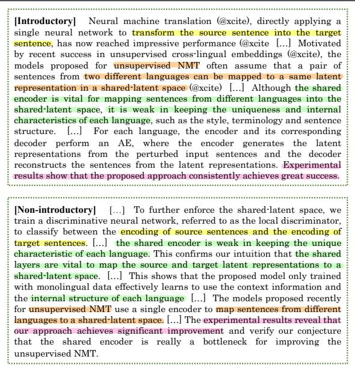
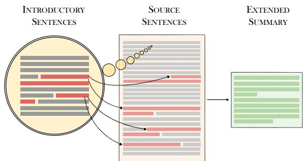
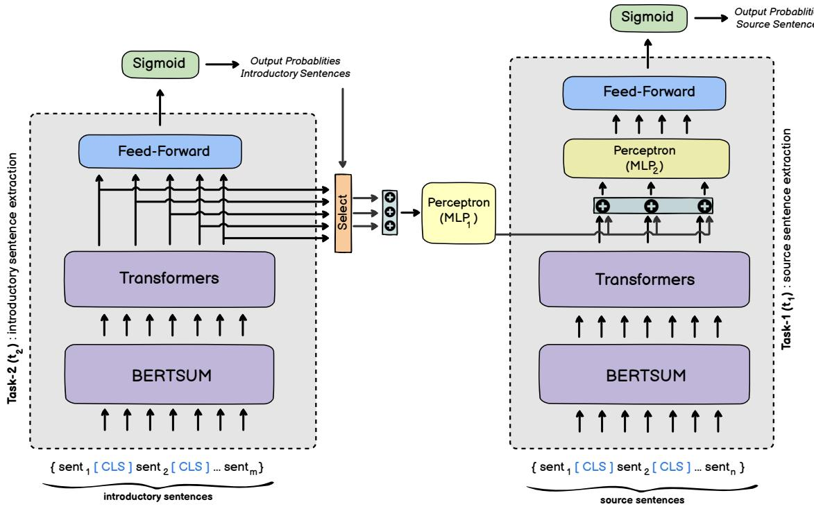
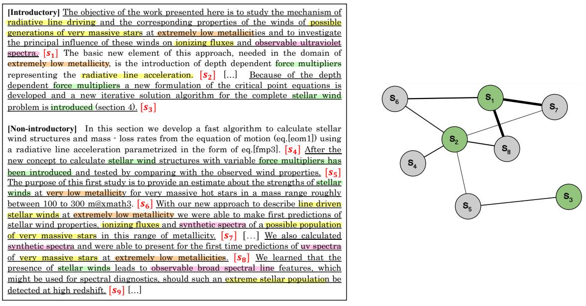

# TSTR: Too Short to Represent, Summarize with Details! Intro-Guided Extended Summary Generation

Sajad Sotudeh and Nazli Goharian

IR Lab, Georgetown University, Washington DC 20057, USA {sajad, nazli}@ir.cs.georgetown.edu

## Abstract

Many scientific papers such as those in arXiv and PubMed data collections have abstracts with varying lengths of 50–1000 words and average length of approximately 200 words, where longer abstracts typically convey more information about the source paper. Up to recently, scientific summarization research has typically focused on generating short, abstractlike summaries following the existing datasets used for scientific summarization. In domains where the source text is relatively long-form, such as in scientific documents, such summary is not able to go beyond the general and coarse overview and provide salient information from the source document. The recent interest to tackle this problem motivated curation of scientific datasets, arXiv-Long and PubMed-Long, containing human-written summaries of 400- 600 words, hence, providing a venue for research in generating long/extended summaries. Extended summaries facilitate a faster read while providing details beyond coarse information. In this paper, we propose TSTR, an extractive summarizer that utilizes the introductory information of documents as pointers to their salient information. The evaluations on two existing large-scale extended summarization datasets indicate statistically significant improvement in terms of ROUGE and average ROUGE (F1) scores (except in one case) as compared to strong baselines and state-of-theart. Comprehensive human evaluations favor our generated extended summaries in terms of cohesion and completeness.

## 1 Introduction

Over the past few years, summarization task has witnessed a huge deal of progress in extractive (Nallapati et al., 2017; Liu and Lapata, 2019; Yuan et al., 2020; Cui et al., 2020; Jia et al., 2020; Feng et al., 2018) and abstractive (See et al., 2017; Cohan et al., 2018; Gehrmann et al., 2018; Zhang et al., 2019; Tian et al., 2019; Zou et al., 2020)

  
Figure 1: A truncated human-written extended summary. Top box: introductory information, bottom box: non-introductory information. Colored spans are pointers from introductory sentences to associated nonintroductory detailed sentences.

settings. Many scientific papers such as those in arXiv and PubMed (Cohan et al., 2018) posses abstracts of varying length, ranging from 50 to 1000 words and average length of approximately 200 words. While scientific paper summarization has been an active research area, most works (Cohan et al., 2018; Xiao and Carenini, 2019; Cui and Hu, 2021; Rohde et al., 2021) in this domain have focused on generating typical short and abstract-like summaries (Chandrasekaran et al., 2020). Short summaries might be adequate when the source text is of short-form such as those in news domain; however, to summarize longer documents such as scientific papers, an extended summary including 400–600 terms on average, such as those found in extended summarization datasets of arXiv-Long and PubMed-Long, is more appealing as it conveys more detailed information.

Extended summary generation has been of research interest very recently. Chandrasekaran et al. (2020) motivated the necessity of generating extended summaries through LongSumm shared task 1. Long documents such as scientific papers are usually framed in a specific structure. They start by presenting general introductory information 2. This introductory information is then followed by supplemental information (i.e., non-introductory) that explain the initial introductory information in more detail. Similarly, as shown in Figure 1, this pattern holds in a human-written extended summary of a long document, where the preceding sentences (top box inside Figure 1) are introductory sentences and succeeding sentences (bottom box inside Figure 1) are explanations of the introductory sentences. In this study, we aim to guide the summarization model to utilize the aforementioned rationale in human-written summaries. We consider introductory sentences as those that appear in the first section of paper with headings such as Introduction, Overview, Motivations, and so forth. As such, all other parts of paper and their sentences are considered as non-introductory (i.e., supplementary). We use these definitions in the reminder of this paper.

Herein, we approach the problem of extended summary generation by incorporating the most important introductory information into the summarization model. We hypothesize that incorporating such information into the summarization model guides the model to pick salient detailed non-introductory information to augment the final extended summary. The importance of the role of introduction in the scientific papers was earlier presented in (Teufel and Moens, 2002; Armagan ˘ , 2013; Jirge, 2017) where they showed such information provides clues (i.e. pointers) to the objectives and experiments of studies. Similarly, Boni et al. (2020) conducted a study to show the importance of introduction part of scientific papers as its relevance to the paper’s abstract. To validate our hypothesis, we test the proposed approach on two publicly available large-scale extended summarization datasets, namely arXiv-Long and PubMed-Long. Our experimental results improve over the strong baselines and state-of-the-art models. In short, the contributions of this work are as follows:

• A novel multi-tasking approach that incorporates the salient introductory information into the extractive summarizer to guide the model in generating a 600-term (roughly) extended summary of a long document, containing the key detailed information of a scientific paper.

• Intrinsic evaluation that demonstrates statistically significant improvements over strong extractive and abstractive summarization baselines and state-of-the-art models.

• An extensive human evaluation which reveals the advantage of the proposed model in terms of cohesion and completeness.

## 2 Related Work

Summarizing scientific documents has gained a huge deal of attention from researchers, although it has been studied for decades. Neural efforts in scientific text have used specific characteristics of papers such as discourse structure (Cohan et al., 2018; Xiao and Carenini, 2019) and citation information (Qazvinian and Radev, 2008; Cohan and Goharian, 2015, 2018) to aid summarization model. While prior work has mostly covered the generation of shorter-form summaries (approx. 200 terms), generating extended summaries of roughly 600 terms for long-form source documents such as scientific papers has been motivated very recently (Chandrasekaran et al., 2020).

The proposed models for the extended summary generation task include jointly learning to predict sentence importance and sentence section to extract top sentences (Sotudeh et al., 2020); utilizing section-contribution computations to pick sentences from important section for forming the final summary (Ghosh Roy et al., 2020); identifying salient sections for generating abstractive summaries (Gidiotis et al., 2020); ensembling of extraction and abstraction models to form final summary (Ying et al., 2021); an extractive model with TextRank algorithm equipped with BM25 as similarity function (Kaushik et al., 2021); and incorporating sentences embeddings into graph-based extractive summarizer in an unsupervised manner (Ramirez-Orta and Milios, 2021). Unlike these works, we do not exploit any sectional nor citation information in this work. To the best of our knowledge, we are the first at proposing the novel method of utilizing introductory information of the scientific paper to guide the model to learn to generate summary from the salient and related information.

## 3 Background: Contextualized language models for summarization

Contextualized language models such as BERT (Devlin et al., 2019), and ROBERTA (Liu et al., 2019) have achieved state-of-the-art performance on a variety of downstream NLP tasks including text summarization. Liu and Lapata (2019) were the first to fine-tune a contextualized language model (i.e., BERT) for the summarization task. They proposed BERTSUM —a fine-tuning scheme for text summarization— that outputs the sentence representations of the source document (we use the term source and source document interchangeably, referring to the entire document). The BERT-SUMEXT model, which is built based on BERT-SUM, was proposed for the extractive summarization task. It utilizes the representations produced by BERTSUM, passes them through Transformers encoder (Vaswani et al., 2017), and finally uses a linear layer with Sigmoid function to compute copying probabilities for each input sentence. Formally, let $l _ { 1 } , l _ { 2 } , . . . , l _ { n }$ be the binary tags over the source sentences $\mathbf { x } = \{ s e n t _ { 1 } , s e n t _ { 2 } , . . . , s e n t _ { n } \}$ of a long document, in which n is the number of sentences in the paper. The BERTSUMEXT network runs over the source documents as follows (Eq. 1),

$$
\begin{array} { l } { h _ { b } = \mathbf { B e r t S u m ( x ) } } \\ { h = \mathbf { E n c o d e r } _ { \mathbf { t } } ( h _ { b } ) } \\ { p = \sigma ( W _ { o } h + b _ { o } ) } \end{array}\tag{1}
$$

where $\mathbf { h _ { b } }$ and h are the representations of source sentences encoded by BERTSUM and Trasformers encoder, respectively. $W _ { o }$ and $b _ { o }$ are trainable parameters, and $p$ is the probability distribution over the source sentences, signifying extraction copy likelihood. The goal of this network is to train a network that can identify the positive sets of sentences as the summary. To prevent the network from selecting redundant sentences, BERTSUM uses Trigram Blocking (Liu and Lapata, 2019) for sentence selection in inference time. We refer the reader to the main paper for more details.

## 4 TSTR: Intro-guided Summarization

In this section, we describe our methodology to tackle the extended summary generation task. Our approach exploits the introductory information 3.

  
Figure 2: Our model uses introductory sentences as pointers to the source sentences. It then forms the final extended summary by extracting salient sentences from the source. Highlights in red show the salient parts.

of the paper as pointers to salient sentences within it, as shown in Figure 2. It is ultimately expected that the extractive summarizer is guided to pick salient sentences across the entire paper.

The detailed illustration of our model is shown in Figure 3. To aid the extractive summarization model (i.e., right-hand box in Figure 3) which takes in source sentences of a scientific paper, we utilize an additional BERTSUM encoder called Introductory encoder (left-hand box in Fig. 3) that receives $\mathbf { x _ { i n t r o } } = \{ s e n t _ { 1 } , s e n t _ { 2 } , . . . , s e n t _ { m } \}$ , with m being the number of sentences in introductory section. The aim of adding second encoder in this framework is to identify the clues in the introductory section which point to the salient supplementary sentences 4. The BERTSUM network computes the extraction probabilities for introductory sentences as follow (same way as in Eq. 1),

$$
\begin{array} { r l } & { \tilde { h } _ { b } = \mathbf { B e r t S u m } ( \mathbf { x } _ { \mathrm { i n t r o } } ) } \\ & { \tilde { h } = \mathbf { E n c o d e r } _ { \mathrm { t } } ( \tilde { h } _ { b } ) } \\ & { \tilde { p } = \sigma ( W _ { j } \tilde { h } + b _ { j } ) } \end{array}\tag{2}
$$

in which $\tilde { h } _ { b }$ , and $\tilde { h }$ are the introductory sentence representations by BERTSUM, Transformers encoder, respectively. $\tilde { p }$ is the introductory sentence extraction probabilities. $W _ { j }$ and $b _ { j }$ are trainable matrices.

After identifying salient introductory sentences, the representations associated with them are retrieved using a pooling function and further used to guide the first task (i.e., right-hand side in Figure 3) as follows,

$$
\begin{array} { r l } & { \tilde { h } _ { t o p } = \pmb { \mathrm { s e l e c t } } ( \tilde { h } , \tilde { p } , k ) } \\ & { \hat { h } = \pmb { \mathrm { M L P } } _ { \mathbf { 1 } } ( \tilde { h } _ { t o p } ) } \end{array}\tag{3}
$$

  
Figure 3: Detailed illustration of our summarization framework. Task-1 $\mathbf { ( t _ { 1 } ) } \colon$ source sentence extraction (right-hand gray box). Task-2 $\mathbf { ( t _ { 2 } ) } \colon$ introductory sentence extraction (left-hand gray box). As shown, the identified salient introductory sentences at training stages are incorporated into the representations of source sentences by the Select( ) function (orange box) with k = 3. Plus sign shows the concatenation layer. The feed-forward neural network is made of one linear layer.

where Select( ) is a function that takes in all introductory sentence representations $( \mathrm { i } . \mathrm { e } . , \tilde { h } )$ , and introductory sentence probabilities ${ \tilde { p } } .$ It then outputs the representations associated with top k introductory sentences, sorted by ${ \tilde { p } } .$ To extract top introductory sentences, we first sort $\tilde { h }$ vectors based on their computed probabilities $\tilde { p }$ and then we pick up top k hidden vectors (i.e., $\tilde { h } _ { t o p } )$ that has the highest probability. $\bf { M L P _ { 1 } }$ is a multi-layer perceptron that takes in concatenated vector of top introductory sentences and projects it into a new vector called $\hat { h } .$

At the final stage, we concatenate the transformed introductory top sentence representations $( \mathrm { i } . \mathrm { e } . , \hat { h } )$ with each source sentence representations from Eq. 1 (i.e., $h _ { i }$ where i shows the ith paper sentence) and process them to produce a resulting vector r which is intro-aware source sentence hidden representations. After processing the resulting vector through a linear output layer (with $W _ { z }$ and $b _ { z }$ as trainable parameters), we obtain final introaware sentence extraction probabilities $( \mathrm { i } . \mathrm { e } . , p )$ as follows,

$$
\begin{array} { l } { r = \mathbf { M } \mathbf { L } \mathbf { P _ { 2 } } ( h _ { i } ; \hat { h } ) } \\ { p = \sigma ( W _ { z } r + b _ { z } ) } \end{array}\tag{4}
$$

in which $\mathbf { M L P _ { 2 } }$ is a multi-layer perceptron, influencing the knowledge from introductory sentence extraction task $( \mathrm { i . e . , t _ { 2 } } )$ into the source sentence extraction task $( \mathrm { i . e . , } \mathbf { t _ { 1 } } )$ . We train both tasks through our end-to-end system jointly as follows,

$$
\ell _ { \mathbf { t o t a l } } = ( \alpha ) \ell _ { \mathbf { t _ { 1 } } } + ( 1 - \alpha ) \ell _ { \mathbf { t _ { 2 } } }\tag{5}
$$

where $\ell _ { \mathbf { t _ { 1 } } }$ , and $\ell _ { \mathbf { t _ { 2 } } }$ are the losses computed for introductory sentence extraction and source sentence extraction tasks, α is the regularizing parameter that balances the learning process between two tasks, and $\ell _ { \mathrm { t o t a l } }$ is the total computed loss that is optimized during the training.

## 5 Experimental Setup

In this section, we explain the datasets, baselines, and preprocessing and training parameters.

## 5.1 Dataset

We use two publicly available scientific extended summarization datasets (Sotudeh et al., 2021).

\- arXiv-Long: A set of arXiv scientific papers containing papers from various scientific domains such as physics, mathematics, computer science, quantitative biology. arXiv-Long is intended for extended summarization task and was filtered from a larger dataset i.e., arXiv (Cohan et al., 2018) for the summaries of more than 350 tokens. The ground-truth summaries (i.e., abstract) are long, with the average length of 574 tokens. It contains 7816 (train), 1381 (validation), and 1952 (test) papers.

\- PubMed-Long: A set of biomedical scientific papers from PubMed with average summary length of 403 tokens. This dataset contains 79893 (train), 4406 (validation), and 4402 (test) scientific papers.

\- LongSumm: The recently proposed Long-Summ dataset for a shared task (Chandrasekaran et al., 2020) contains 2236 abstractive and extractive summaries for training and 22 papers for the official test set. We report a comparison with BERTSUMEXTMULTI using this data in Table 2. However, as the official test set is blind, our experimental results in Table 1 do not use this dataset.

## 5.2 Baselines

We compare our model with two strong non-neural systems, and four state-of-the-art neural summarizers. We use all of these baselines for the purpose of extended summary generation whose documents hold different characteristics in length, writing style, and discourse structure as compared to documents in the other domains of summarization.

\- LSA (Steinberger and Jezek ¨ , 2004): an extractive vector-based model that utilizes Singular Value Decomposition (SVD) to find the semantically important sentences.

\- LEXRANK (Erkan and Radev, 2004): a widely adopted extractive summarization baseline that utilizes a graph-based approach based on eigenvector centrality to identify the most salient sentences.

\- BERTSUMEXT (Liu and Lapata, 2019): a contextualized summarizer fine-tuned for summarization task, which encodes input sentence representations, and then processes them through a multi-layer Transformers encoder to obtain document-level sentence representation. Finally, a linear output layer with Sigmoid activation function outputs a probability distribution over each input sentence, denoting the extent to which they are probable to be extracted.

\- BERTSUMEXT-INTRO (Liu and Lapata, 2019): a BERTSUMEXT model that only runs on the introductory sentences as the input, and extracts the salient introductory sentences as the summary.

\- BERTSUMEXTMULTI (Sotudeh et al., 2021): an extension of the BERTSUMEXT model that incorporates an additional linear layer with Sigmoid classifier to output a probability distribution over a fixed number of pre-defined sections that an input sentence might belong to. The additional network is expected to predict a single section for an input sentence and is trained jointly with BERTSUMEXT module (i.e., sentence extractor).

\- BART (Lewis et al., 2020): a state-of-the-art abstractive summarization model that makes use of pretrained encoder and decoder. BART can be thought of as an extension of BERTSUM in which merely encoder is pre-trained, but decoder is trained from scratch. While our model is an extractive one, at the same time, we find it of value to measure the abstractive model performance in the extended summary generation task.

## 5.3 Preprocessing, parameters, labeling, and implementation details

We used the open implementation of BERT-SUMEXT with default parameters 5. To implement the non-neural baseline models, we utilized Sumy python package 6. Longformer model (Beltagy et al., 2020) is utilized as our contextualized language model for running all the models due to its efficacy at processing long documents. For our model, the cross-entropy loss function is set for two tasks (i.e., t1 : source sentence extraction and t2 : introductory sentences extraction in Figure 3) and the model is optimized through multi-tasking approach as discussed in Section 3. The model with the highest ROUGE-2 on validation set is selected for inference. The validation is performed every 2k training steps. α (in Eq. 5) is set to be 0.5 (empirically determined). Our model includes 474M trainable parameters, trained on dual GeForce GTX 1080Ti GPUs for approximately a week. We use k = 5 for arXiv-Long, k = 8 for PubMed-Long datasets (Eq. 3). We make our model implementation as well as sample summaries publicly available to expedite ongoing research in this direction 7.

A two-stage labeling approach was employed to identify ground-truth introductory and nonintroductory sentences. In the first stage, we used a greedy labeling approach (Liu and Lapata, 2019) to label sentences within the first section of a given paper (i.e., labeling introductory sentences) with respect to their ROUGE overlap 8 with the groundtruth summary (i.e., abstract). In the second stage, the same greedy approach was exploited over the rest of sentences (i.e., non-introductory)9 with regard to their ROUGE overlap with the identified introductory sentences in the first stage. Our choice of ROUGE-2 and ROUGE-L is based on the fact that these express higher similarity with human judgments (Cohan and Goharian, 2016). We continued the second stage until a fixed length of the summary was reached. Specifically, the fixed length of positive labels is set to be 15 for arXiv-Long, and 20 for PubMed-Long datasets as these achieved the highest oracle ROUGE scores in our experiments.

## 6 Results

## 6.1 Experimental evaluation

The recent effort in extended summarization and its shared task of LongSumm (Chandrasekaran et al., 2020) used average ROUGE (F1) to rank the participating systems, in addition to commonly-used ROUGE-N scores. Table 2 shows the performance of the participated systems on the blind test set. As shown, BERTSUMEXTMULTI model outperforms other models by a large margin (i.e., with relative improvements of 6% and 3% on ROUGE-1 and average ROUGE(F1), respectively); hence, we use the best-performing in terms of F1 (i.e., BERTSUMEXTMULTI model) in our experiments. Tables. 1 presents our results on the test sets of arXiv-Long and PubMed-Long datasets, respectively. As observed, our model statistically significantly outperforms the state-of-the-art systems on both datasets across most of the ROUGE variants, except ROUGE-L on PubMed-Long. The improvements gained by our model validates our hy pothesis that incorporating the salient introductory sentence representations into the extractive summarizer yields a promising improvement. Two nonneural models (i.e., LSA and LEXRANK) under perform the neural models, as expected. Comparing the abstractive model (i.e., BART) with extractive neural ones (i.e., BERTSUMEXT and BERT-SUMEXTMULTI), we see that while there is relatively a smaller gap in terms of ROUGE-1, the gap is larger for ROUGE-2, and ROUGE-L. Inter estingly, in the case of BART, we found that gen erating extended summaries is rather challenging for abstractive summarizers. Current abstractive summarizers including BART have difficulty in ab stracting very detailed information, such as num bers, and quantities, which hurts the faithfulness of the generated summaries to the source. This behavior has a detrimental effect, specifically, on ROUGE-2 and ROUGE-L as their high correlation with human judgments in terms of faithfulness has been shown (Pagnoni et al., 2021). Comparing the extractive BERTSUMEXT and BERTSUMEXT-MULTI models, while BERTSUMMULTIEXT is expected to outperfom BERTSUMEXT, it is observed that they perform almost similarly, with small (i.e., insignificant) improved metrics. This might be due to the fact that BERTSUMEXTMULTI works out-of-the-box when a handful amount of sentences are sampled from diverse sections to form the oracle summary as also reported by its authors. However, when labeling oracle sentences in our framework (i.e., Intro-guided labeling), there is no guarantee that the final set of oracle sentences are labeled from diverse sections. Overall, our model achieves about 1.4%, 2.4%, 3.5% (arXiv-Long), and 1.0%, 2.5%, 1.3% (PubMed Long) improvements across ROUGE score variants; and 2.2% (arXiv-Long), 1.4% (PubMed Long) improvements over F1, compared to the neural baselines (i.e., BERTSUMEXT and BERT SUMEXTMULTI). While comparing our model with BERTSUMEXT-INTRO, we see the vital effect of adding second encoder at finding supplementary sentences across non-introductory sections, where our model gains relative improvements of 9.62%-26.26%-16.09% and 9.40%-5.27%-9.99% for ROUGE-1, ROUGE-2, ROUGE-L on arXiv-Long and PubMed-Long, respectively. In fact, the sentences that are picked as summary from the introduction section are not comprehensive as such they are clues to the main points of the paper. The other important sentences are picked from the supplementary parts (i.e., non-introductory) of the paper.

<table><tr><td rowspan="2">Model</td><td colspan="4">arXiv-Long</td><td colspan="4">PubMed-Long</td></tr><tr><td>R1(%)</td><td>R2(%)</td><td>RL(%)</td><td>F1 (%)</td><td>R1(%)</td><td>R2(%)</td><td>RL(%)</td><td>F1 (%)</td></tr><tr><td>ORACLE</td><td>53.35</td><td>24.40</td><td>23.65</td><td>33.80</td><td>52.11</td><td>23.41</td><td>25.42</td><td>33.65</td></tr><tr><td>BERTSUMEXT-INTRO</td><td>44.88</td><td>15.99</td><td>19.14</td><td>26.25</td><td>45.08</td><td>20.08</td><td>21.52</td><td>28.89</td></tr><tr><td>LSA</td><td>43.23</td><td>13.47</td><td>17.50</td><td>24.73</td><td>44.47</td><td>15.38</td><td>19.17</td><td>26.34</td></tr><tr><td>LEXRANK</td><td>43.73</td><td>15.01</td><td>18.62</td><td>25.41</td><td>48.63</td><td>20.37</td><td>22.49</td><td>30.50</td></tr><tr><td>BERTSUMEXT</td><td>48.42</td><td>19.71</td><td>21.47</td><td>29.87</td><td>48.82</td><td>20.89</td><td>23.37</td><td>31.03</td></tr><tr><td>BERTSUMEXTMULTI</td><td>48.52</td><td>19.66</td><td>21.42</td><td>29.87</td><td>48.85</td><td>20.71</td><td>23.29</td><td>30.95</td></tr><tr><td>BART</td><td>48.12</td><td>15.30</td><td>20.80</td><td>28.07</td><td>48.32</td><td>17.33</td><td>21.42</td><td>29.87</td></tr><tr><td>TSTR (Ours)</td><td>49.20*</td><td>20.19*</td><td>22.22*</td><td>30.54</td><td>49.32*</td><td>21.41*</td><td>23.67</td><td>31.47</td></tr></table>

Table 1: ROUGE (F1) results of the baseline models and our model on the test sets of the extended summarization datasets (arXiv-Long, and PubMed-Long). ∗ shows the statistical significance (paired t-test, $p < 0 . 0 5 )$

<table><tr><td></td><td>R1</td><td>R2</td><td>RL</td><td>F1(%)</td></tr><tr><td>Summaformers (2020)</td><td>49.38</td><td>16.86</td><td>21.38</td><td>29.21</td></tr><tr><td>IIITBH-IITP (2020)</td><td>49.03</td><td>15.74</td><td>20.46</td><td>28.41</td></tr><tr><td>Auth-Team (2020)</td><td>50.11</td><td>15.37</td><td>19.59</td><td>28.36</td></tr><tr><td>CIST_BUPT (2020)</td><td>48.99</td><td>15.06</td><td>20.13</td><td>28.06</td></tr><tr><td>BERTSUMEXTMULTI (2021)</td><td>53.11</td><td>16.77</td><td>20.34</td><td>30.07</td></tr></table>

Table 2: ROUGE (F1) results of different systems on the blind test set of LongSumm dataset containing 22 abstractive summaries.

## 6.2 Human evaluation

While our model statistically significantly improves upon the state-of-the-art baselines in terms of ROUGE scores, a few works have reported the low correlation of ROUGE with human judgments (Liu and Liu, 2008; Cohan and Goharian, 2016; Fabbri et al., 2021). In order to provide insights into why and how our model outperforms the bestperforming baselines, we perform a manual analysis of our system’s generated summaries, BERT-SUMEXT’s, and BERTSUMEXTMULTI’s. For the sake of evaluation, two annotators were asked to manually evaluate two sets of 40 papers’ groundtruth abstracts (40 for arXiv-Long, and 40 for PubMed-Long) with their generated extended summaries (baselines’ and ours) to gain insights into qualities of each model. Annotators were Electrical Engineering and Computer Science PhD students and familiar with principles of reading scientific papers. Samples were randomly selected from the test set, one from each 40 evenly-spaced bins sorted by the difference of ROUGE-L between two experimented systems.

The evaluations were performed according to two metrics: (1) Cohesion: whether the ordering of sentences in summary is cohesive, namely sentences entail each other. (2) Completeness: whether the summary covers all salient information provided in the ground-truth summary. To prevent bias in selecting summaries, the ordering of systemgenerated summaries were shuffled such that it could not be guessed by the annotators. Annotators were asked to specify if the first system-generated summary wins/loses or ties with the second systemgenerated summary in terms of qualitative metrics. It has to be mentioned that since our model is purely extractive, it does not introduce any fact that is unfaithful to the source.

Our human evaluation results along with Cohen’s kappa (Cohen, 1960) inter-rater agreements are shown in Table 3 (agr. column). As shown, our system’s generated summaries improve completeness and cohesion in over 40% for most of the cases (6 out of 8 for win cases 10). Specifically, when comparing with BERTSUMEXT, we see that 68%, 80% (arXiv-Long); and 60%, 66% (PubMed-Long) of sampled summaries are at least as good as or better than the corresponding baseline’s generated summaries in terms of cohesion and completeness, respectively. Overall, across two metrics for BERTSUMEXT and BERTSUMEXT-MULTI, we gain relative improvements over the baselines: 25.6%, 19.0% (cohesion), and 56.5%,

<table><tr><td>Metric</td><td>Win</td><td>Tie</td><td>Lose</td><td>agr.</td></tr><tr><td>Our Model vs. BERTSUMEXT baseline</td><td></td><td></td><td></td><td></td></tr><tr><td>Cohesion</td><td>43%</td><td>25%</td><td>32%</td><td>46.5%</td></tr><tr><td>Completeness</td><td>46%</td><td>34%</td><td>20%</td><td>48.9%</td></tr></table>

(a)

<table><tr><td>Metric</td><td>Win</td><td>Tie</td><td>Lose</td><td>agr.</td></tr><tr><td>Our Model vs. BERTSUMEXT baseline</td><td></td><td></td><td></td><td></td></tr><tr><td>Cohesion</td><td>39%</td><td>21%</td><td>30%</td><td>52.1%</td></tr><tr><td>Completeness</td><td>47%</td><td>19%</td><td>34%</td><td>51.3%</td></tr><tr><td>Our Model vs. BERTSUMEXTMULTI baseline</td><td></td><td></td><td></td><td></td></tr><tr><td>Cohesion</td><td>37%</td><td>21%</td><td>32%</td><td>48.2%</td></tr><tr><td>Completeness</td><td>41%</td><td>17%</td><td>32%</td><td>46.3%</td></tr></table>

(b)

Table 3: Results of human evaluations over 40 papers sampled from (a) arXiv-Long’s, and (b) PubMed-Long’s test set. agr. shows inter-rater agreement.  
  
(a)  
(b)  
Figure 4: (a) Our system’s generated summary, (b) Sentence graph visualization of our system’s generated summary. Green and gray nodes are introductory and non-introductory sentences, respectively. Edge thickness denotes the ROUGE score strength between pair of sentences. Parts, from which sentences are sampled, are shown inside brackets. The summary is truncated due to space limitations. Ground-truth summary-worthy sentences are underlined, and colored spans show pointers from introductory to non-introductory sentences.

46.7% (completeness) on arXiv-Long; and 23.1%, 13.5% (cohesion), and 27.7%, 21.9% (completeness) on PubMed-Long. 11 These improvements, qualitatively evaluated by the human annotators, show the promising capability of our purposed model in generating improved extended summaries which are more preferable than the baselines’. We observe a similar improvement trend when comparing our summaries with BERTSUMEXTMULTI, where 66%, 77% (arXiv-Long); and 58%, 58% (PubMed-Long) of our summaries are as good as or better than the baseline’s in terms of cohesion and completeness. Looking at the Cohen’s inter-rater agreement, the correlation scores fall into “moderate” agreement range according to the interpretation of Cohen’s kappa range (McHugh, 2012).

## 6.3 Case study

Figure 4 (a) demonstrates an extended summary generated from a sample arXiv-Long paper by our model. The underlined sentences denote that the corresponding sentences are oracle (i.e., summaryworthy), the colored spans denote the pointers from introductory information to non-introductory information, and sentence numbers appear in brackets following each sentence. As shown, our system first identifies salient introductory sentences (i.e., [s1] and [s3]), and then augments them with important non-introductory sentences. Figure 4 (b) shows the ROUGE scores between pairs of introductory and non-introductory sentences. The edge thickness signifies the strength of the ROUGE score between a pair of sentences. For example, introductory sentence [s1] highly correlates with nonintroductory sentence [s7] as it has a stronger edge (s1, s7) thickness. More specifically, [s1] has mentions of “radiative line driving”, “properties of the winds”, “possible generations of very massive stars”, and “ionizing fluxes” which maps to [s7] with semantically similar mentions of “line driven stellar winds”, “stellar wind properties”, “possible generations ofvery massive stars”, and “ionizingfluxes” 12.

## 7 Error Analysis

To determine the limitations of our model, we fur ther analyze our system’s generated summaries and report three common defects, along with the percentage of these errors among underperformed cases. We found that (1) our end-to-end system’s performance is highly dependent on the introductory sentence extraction task’s performance (i.e., task t in Figure 3) as identification of salient introductory sentences (i.e., oracle introductory sentences) sets up a firm ground to explore detailed sentences from the non-introductory parts of the paper. In other words, identification of non-salient introductory sentences leads to a drift in finding supplemental sentences from the non-introductory parts. Our model often underperforms when it cannot find important sentences from the introductory part (65%); (2) in underperformed cases, our model fails in selecting motivation, objective sentences from the introductory part, and only identifies the contribution sentences (i.e., describing paper’s contributions), such that the final generated summary is composed of contribution sentences, rather than objective sentences. This observation hurts the system in cohesion and completeness (40%); and (3) as discussed, our model matches introductory sentences with sentences from non-introductory parts of the paper. Given that two sentences within a scientific paper might conceptually convey the exact same information, but are just paraphrased of each other, our model samples both to form the final summary as a high semantic correlation exists between them. This phenomenon leads to sampling two sentences that convey the same information without providing more details; hence, information redundancy (35%).

## 8 Conclusion

In this work, we propose a novel approach to tackle the extended summary generation for scientific documents. Our model is built upon the fine-tuned contextualized language models for text summarization. Our method improves over strong and state-of-the-art summarization baselines by adding an auxiliary learning component for identifying salient introductory information of long documents, which are then used as pointers to guide the summarizer to pick summary-worthy sentences. The extensive intrinsic and human evaluations show the efficacy of our model in comparison with the stateof-the-art baselines, using two large scale extended summarization datasets . Our error analysis further paves the path for future reseacrh.

## References

Abdullah Armagan. 2013. How to write an introduction˘ section of a scientific article? Turkish journal of urology, 39 Suppl 1:8–9.

Iz Beltagy, Matthew E. Peters, and Arman Cohan. 2020. Longformer: The long-document transformer. ArXiv, abs/2004.05150.

Odellia Boni, Guy Feigenblat, Doron Cohen, Haggai Roitman, and David Konopnicki. 2020. A study of human summaries of scientific articles. ArXiv, abs/2002.03604.

Muthu Kumar Chandrasekaran, Guy Feigenblat, Eduard Hovy, Abhilasha Ravichander, Michal Shmueli-Scheuer, and Anita de Waard. 2020. Overview and insights from the shared tasks at scholarly document processing 2020: CL-SciSumm, LaySumm and LongSumm. In Proceedings ofthe First Workshop on Scholarly Document Processing, pages 214–224, Online. Association for Computational Linguistics.

Arman Cohan, Franck Dernoncourt, Doo Soon Kim, Trung Bui, Seokhwan Kim, Walter Chang, and Nazli Goharian. 2018. A discourse-aware attention model for abstractive summarization of long documents. In Proceedings of the 2018 Conference of the North American Chapter ofthe Association for Computational Linguistics: Human Language Technologies, Volume 2 (Short Papers), pages 615–621, New Orleans, Louisiana. Association for Computational Linguistics.

Arman Cohan and Nazli Goharian. 2015. Scientific article summarization using citation-context and article’s discourse structure. In Proceedings ofthe 2015

Conference on Empirical Methods in Natural Language Processing, pages 390–400, Lisbon, Portugal. Association for Computational Linguistics.

Arman Cohan and Nazli Goharian. 2016. Revisiting summarization evaluation for scientific articles. In Proceedings of the Tenth International Conference on Language Resources and Evaluation (LREC’16), pages 806–813, Portorož, Slovenia. European Language Resources Association (ELRA).

Arman Cohan and Nazli Goharian. 2018. Scientific document summarization via citation contextualization and scientific discourse. International Journal on Digital Libraries, 19(2):287–303.

Jacob Cohen. 1960. A coefficient of agreement for nominal scales. Educational and Psychological Measurement, 20:37 – 46.

Peng Cui and Le Hu. 2021. Sliding selector network with dynamic memory for extractive summarization of long documents. In NAACL.

Peng Cui, Le Hu, and Yuanchao Liu. 2020. Enhancing extractive text summarization with topic-aware graph neural networks. In Proceedings of the 28th International Conference on Computational Linguistics, pages 5360–5371, Barcelona, Spain (Online). International Committee on Computational Linguistics.

Jacob Devlin, Ming-Wei Chang, Kenton Lee, and Kristina Toutanova. 2019. BERT: Pre-training of deep bidirectional transformers for language understanding. In Proceedings ofthe 2019 Conference of the North American Chapter ofthe Associationfor Computational Linguistics: Human Language Technologies, Volume 1 (Long and Short Papers), pages 4171–4186, Minneapolis, Minnesota. Association for Computational Linguistics.

Günes Erkan and Dragomir R. Radev. 2004. Lexrank: Graph-based lexical centrality as salience in text summarization. J. Artif. Intell. Res., 22:457–479.

A. R. Fabbri, Wojciech Kryscinski, Bryan McCann, R. Socher, and Dragomir Radev. 2021. Summeval: Re-evaluating summarization evaluation. Transactions of the Association for Computational Linguistics, 9:391–409.

Chong Feng, Fei Cai, Honghui Chen, and Maarten de Rijke. 2018. Attentive encoder-based extractive text summarization. In Proceedings of the 27th ACM International Conference on Information and Knowledge Management, CIKM 2018, Torino, Italy, October 22-26, 2018, pages 1499–1502. ACM.

Sebastian Gehrmann, Yuntian Deng, and Alexander Rush. 2018. Bottom-up abstractive summarization. In Proceedings of the 2018 Conference on Empirical Methods in Natural Language Processing, pages 4098–4109, Brussels, Belgium. Association for Computational Linguistics.

Sayar Ghosh Roy, Nikhil Pinnaparaju, Risubh Jain, Manish Gupta, and Vasudeva Varma. 2020. Summaformers @ LaySumm 20, LongSumm 20. In Proceedings of the First Workshop on Scholarly Document Processing, pages 336–343, Online. Association for Computational Linguistics.

Alexios Gidiotis, Stefanos Stefanidis, and Grigorios Tsoumakas. 2020. AUTH @ CLSciSumm 20, Lay-Summ 20, LongSumm 20. In Proceedings of the First Workshop on Scholarly Document Processing, pages 251–260, Online. Association for Computational Linguistics.

Ruipeng Jia, Yanan Cao, Haichao Shi, Fang Fang, Yanbing Liu, and Jianlong Tan. 2020. Distilsum: : Distilling the knowledge for extractive summarization. In CIKM ’20: The 29th ACM International Conference on Information and Knowledge Management, Virtual Event, Ireland, October 19-23, 2020, pages 2069–2072. ACM.

Padma Rekha Jirge. 2017. Preparing and publishing a scientific manuscript. Journal ofHuman Reproductive Sciences, 10:3 – 9.

Darsh Kaushik, Abdullah Faiz Ur Rahman Khilji, Utkarsh Sinha, and Partha Pakray. 2021. CNLP-NITS @ LongSumm 2021: TextRank variant for generating long summaries. In Proceedings of the Second Workshop on Scholarly Document Processing.

Mike Lewis, Yinhan Liu, Naman Goyal, Marjan Ghazvininejad, Abdelrahman Mohamed, Omer Levy, Veselin Stoyanov, and Luke Zettlemoyer. 2020. BART: Denoising sequence-to-sequence pre-training for natural language generation, translation, and comprehension. In Proceedings ofthe 58th Annual Meeting ofthe Associationfor Computational Linguistics, pages 7871–7880, Online. Association for Computational Linguistics.

Lei Li, Yang Xie, Wei Liu, Yinan Liu, Yafei Jiang, Siya Qi, and Xingyuan Li. 2020. CIST@CL-SciSumm 2020, LongSumm 2020: Automatic scientific document summarization. In Proceedings of the First Workshop on Scholarly Document Processing, pages 225–234, Online. Association for Computational Linguistics.

Feifan Liu and Yang Liu. 2008. Correlation between ROUGE and human evaluation of extractive meeting summaries. In Proceedings ofACL-08: HLT, Short Papers, pages 201–204, Columbus, Ohio. Association for Computational Linguistics.

Yang Liu and Mirella Lapata. 2019. Text summarization with pretrained encoders. In Proceedings of the 2019 Conference on Empirical Methods in Natural Language Processing and the 9th International Joint Conference on Natural Language Processing (EMNLP-IJCNLP), pages 3730–3740, Hong Kong, China. Association for Computational Linguistics.

Yinhan Liu, Myle Ott, Naman Goyal, Jingfei Du, Mandar Joshi, Danqi Chen, Omer Levy, Mike Lewis, Luke Zettlemoyer, and Veselin Stoyanov. 2019. Roberta: A robustly optimized BERT pretraining approach. CoRR, abs/1907.11692.

M. McHugh. 2012. Interrater reliability: the kappa statistic. Biochemia Medica, 22:276 – 282.

Ramesh Nallapati, Feifei Zhai, and Bowen Zhou. 2017. Summarunner: A recurrent neural network based sequence model for extractive summarization of documents. In Proceedings of the Thirty-First AAAI Conference on Artificial Intelligence, February 4-9, 2017, San Francisco, California, USA, pages 3075– 3081. AAAI Press.

Artidoro Pagnoni, Vidhisha Balachandran, and Yulia Tsvetkov. 2021. Understanding factuality in abstractive summarization with frank: A benchmark for factuality metrics. ArXiv, abs/2104.13346.

Vahed Qazvinian and Dragomir R. Radev. 2008. Scientific paper summarization using citation summary networks. In Proceedings ofthe 22nd International Conference on Computational Linguistics (Coling 2008), pages 689–696, Manchester, UK. Coling 2008 Organizing Committee.

Juan Ramirez-Orta and Evangelos E. Milios. 2021. Unsupervised document summarization using pretrained sentence embeddings and graph centrality. In SDP.

Saichethan Reddy, Naveen Saini, Sriparna Saha, and Pushpak Bhattacharyya. 2020. IIITBH-IITP@CL-SciSumm20, CL-LaySumm20, LongSumm20. In Proceedings ofthe First Workshop on Scholarly Document Processing, Online. Association for Computational Linguistics.

T. Rohde, Xiaoxia Wu, and Yinhan Liu. 2021. Hierarchical learning for generation with long source sequences. ArXiv, abs/2104.07545.

Abigail See, Peter J. Liu, and Christopher D. Manning. 2017. Get to the point: Summarization with pointergenerator networks. In Proceedings ofthe 55th Annual Meeting of the Association for Computational Linguistics (Volume 1: Long Papers), pages 1073– 1083, Vancouver, Canada. Association for Computational Linguistics.

Sajad Sotudeh, Arman Cohan, and Nazli Goharian. 2020. GUIR @ LongSumm 2020: Learning to generate long summaries from scientific documents. In Proceedings ofthe First Workshop on Scholarly Document Processing, pages 356–361, Online. Association for Computational Linguistics.

Sajad Sotudeh, Arman Cohan, and Nazli Goharian. 2021. On generating extended summaries of long documents. The AAAI-21 Workshop on Scientific Document Understanding (SDU).

Josef Steinberger and Karel Jezek. 2004. Using latent¨ semantic analysis in text summarization and summary evaluation. In ISIM.

Simone Teufel and Marc Moens. 2002. Summarizing scientific articles: Experiments with relevance and rhetorical status. Computational Linguistics, 28:409– 445.

Yufei Tian, Jianfei Yu, and Jing Jiang. 2019. Aspect and opinion aware abstractive review summarization with reinforced hard typed decoder. In Proceedings ofthe 28th ACM International Conference on Information and Knowledge Management, CIKM 2019, Beijing, China, November 3-7, 2019, pages 2061– 2064. ACM.

Ashish Vaswani, Noam Shazeer, Niki Parmar, Jakob Uszkoreit, Llion Jones, Aidan N. Gomez, Lukasz Kaiser, and Illia Polosukhin. 2017. Attention is all you need. In Advances in Neural Information Processing Systems 30: Annual Conference on Neural Information Processing Systems 2017, December 4-9, 2017, Long Beach, CA, USA, pages 5998–6008.

Wen Xiao and Giuseppe Carenini. 2019. Extractive summarization of long documents by combining global and local context. In Proceedings of the 2019 Conference on Empirical Methods in Natural Language Processing and the 9th International Joint Conference on Natural Language Processing (EMNLP-IJCNLP), pages 3011–3021, Hong Kong, China. Association for Computational Linguistics.

Senci Ying, Zheng Yan Zhao, and Wuhe Zou. 2021. LongSumm 2021: Session based automatic summarization model for scientific document. In Proceedings ofthe Second Workshop on Scholarly Document Processing.

Ruifeng Yuan, Zili Wang, and Wenjie Li. 2020. Factlevel extractive summarization with hierarchical graph mask on BERT. In Proceedings of the 28th International Conference on Computational Linguistics, pages 5629–5639, Barcelona, Spain (Online). International Committee on Computational Linguistics.

Jingqing Zhang, Yao Zhao, Mohammad Saleh, and Peter J. Liu. 2019. Pegasus: Pre-training with extracted gap-sentences for abstractive summarization. In ICML.

Yanyan Zou, Xingxing Zhang, Wei Lu, Furu Wei, and Ming Zhou. 2020. Pre-training for abstractive document summarization by reinstating source text. In Proceedings of the 2020 Conference on Empirical Methods in Natural Language Processing (EMNLP), pages 3646–3660, Online. Association for Computational Linguistics.