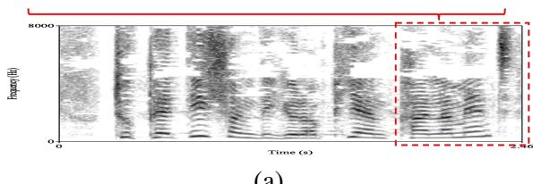
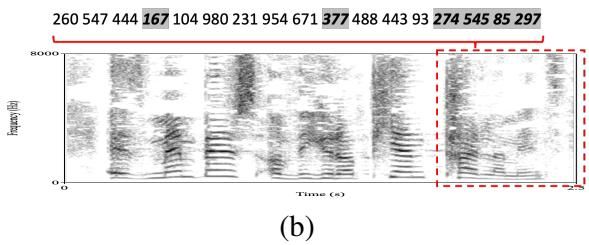
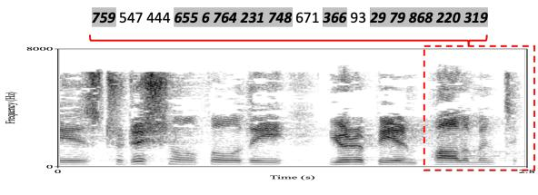
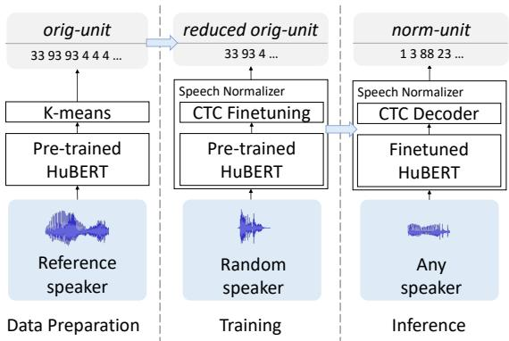
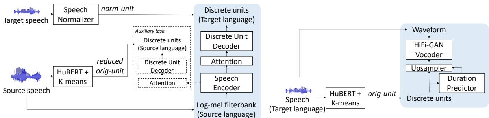
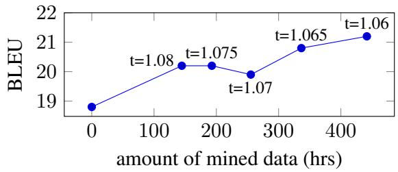

# Textless Speech-to-Speech Translation on Real Data

Ann Lee, Hongyu Gong, Paul-Ambroise Duquenne, Holger Schwenk, Peng-Jen Chen, Changhan Wang, Sravya Popuri, Yossi Adi, Juan Pino, Jiatao Gu, Wei-Ning Hsu

Meta AI

{annl,wnhsu}@fb.com

## Abstract

We present a textless speech-to-speech translation (S2ST) system that can translate speech from one language into another language and can be built without the need of any text data. Different from existing work in the literature, we tackle the challenge in modeling multispeaker target speech and train the systems with real-world S2ST data. The key to our approach is a self-supervised unit-based speech normalization technique, which finetunes a pre-trained speech encoder with paired audios from multiple speakers and a single reference speaker to reduce the variations due to accents, while preserving the lexical content. With only 10 minutes of paired data for speech normalization, we obtain on average 3.2 BLEU gain when training the S2ST model on the VoxPopuli S2ST dataset, compared to a baseline trained on unnormalized speech target. We also incorporate automatically mined S2ST data and show an additional 2.0 BLEU gain. To our knowledge, we are the first to establish a textless S2ST technique that can be trained with real-world data and works for multiple language pairs1.

## 1 Introduction

Speech-to-speech translation (S2ST) technology can help bridge the communication gap between people speaking different languages. Conventional S2ST systems (Lavie et al., 1997; Nakamura et al., 2006) usually rely on a cascaded approach by first translating speech into text in the target language, either with automatic speech recognition (ASR) followed by machine tranlsation (MT), or an end-toend speech-to-text translation (S2T) model (Bérard et al., 2016), and then applying text-to-speech (TTS) synthesis to generate speech output.

On the other hand, researchers have started exploring direct S2ST (Jia et al., 2019, 2021; Tjandra et al., 2019; Zhang et al., 2020; Kano et al., 2021; Lee et al., 2021), which aims at translating speech in the source language to speech in the target language without the need of text generation as an intermediate step. However, text transcriptions or phoneme annotations of the speech data is often still needed during model training for multitask learning (Jia et al., 2019; Lee et al., 2021) or for learning a decoder that generates intermediate representations (Jia et al., 2021; Kano et al., 2021) to facilitate the generation of speech output.

More than 40% of the languages in the world are without text writing systems2, while very limited work exist to tackle the challenge of training direct S2ST systems without the use of any text data (Tjandra et al., 2019; Zhang et al., 2020). Moreover, due to the lack of S2ST training data, previous work on direct S2ST mainly rely on TTS to generate synthetic target speech for model training. The recent release of the large-scale S2ST data from VoxPopuli (Wang et al., 2021c) has opened up the possibility of conducting S2ST research on real data. In addition, Duquenne et al. (2021) have demonstrated the first proof of concept of direct S2S mining without using ASR or MT systems. The approach may potentially mitigate the data scarcity issue, but the authors had not evaluated the usefulness of such data for S2ST frameworks.

Most recently, Lee et al. (2021) have proposed to take advantage of self-supervised discrete representations (Lakhotia et al., 2021), or discrete units, learned from unlabeled speech data as the target for building a direct S2ST model. Experiments conducted with synthetic target speech data have shown significant improvement for translation between unwritten languages. In this work, we extend the textless S2ST setup in (Lee et al., 2021), i.e. training an S2ST system without the use of any text or phoneme data, and conduct experiments on real S2ST datasets, including VoxPopuli (Wang et al., 2021c) and automatically mined S2ST data (Duquenne et al., 2021). To tackle the challenge of modeling real target speech where there are multiple speakers with various accents, speaking styles and recording conditions, etc., we propose a speech normalization technique that finetunes a self-supervised pre-trained model for speech with a limited amount of parallel multipleto-single speaker speech. Experiments on four language pairs show that when trained with the normalized target speech obtained from a speech normalizer trained with 10-min parallel data, the performance of a textless S2ST model can be improved by 3.2 BLEU points on average compared with a baseline with un-normalized target speech.

The main contributions of this work include:

• We propose a speech normalization technique based on self-supervised discrete units that can remove the variations in speech from multiple speakers without changing the lexical content. We apply the technique on the target speech of real S2ST data and verify its effectiveness in the context of textless S2ST.

• We empirically demonstrate that with the speech normalization technique, we can further improve a textless S2ST system’s performance by augmenting supervised S2ST data with directly mined S2ST data, demonstrating the usefulness of the latter.

• To the best of our knowledge, we are the first to establish a textless S2ST technique that can be trained with real-world data, and the technique works for multiple language pairs.

## 2 Related work

Direct S2ST Jia et al. (2019, 2021) propose a sequence-to-sequence model with a speech encoder and a spectrogram decoder that directly translates speech from one language into another language without generating text translation first. The model can be trained end-to-end, while phoneme data is required in model training. On the other hand, Tjandra et al. (2019); Zhang et al. (2020) build direct S2ST systems for languages without text writing systems by adopting Vector-Quantized Variational Auto-Encoder (VQ-VAE) (van den Oord et al., 2017) to convert target speech into discrete codes and learn a speech-to-code translation model. Most recently, Lee et al. (2021) propose a direct

S2ST system that predicts self-supervised discrete representations of the target speech. The system, when trained without text data, outperforms VQ-VAE-based approach in Zhang et al. (2020). As a result, in this work, we follow the design in Lee et al. (2021) and focus on training direct S2ST systems with real data.

S2ST data VoxPopuli (Wang et al., 2021c) provides 17.3k hours of S2ST data from European parliament plenary sessions and the simultaneous interpretations for more than 200 language directions, the largest to-date. There exists few S2ST corpora as the creation process requires transcribing multilingual speech (Tohyama et al., 2004; Bendazzoli et al., 2005; Zanon Boito et al., 2020) or highquality ASR models (Wang et al., 2021c). On the other hand, Duquenne et al. (2021) extend distancebased bitext mining (Schwenk et al., 2021) to the audio domain by first learning a joint embedding space for text and audio, where sentences with similar meaning are close, independent of the modality or language. The technique was applied to mine for speech-to-speech alignment in LibriVox3, creating 1.4k hours of mined S2ST data for six language pairs. The usefulness of the S2ST datasets is often showcased indirectly through a speech retrieval task (Zanon Boito et al., 2020) or human evaluation of the data quality (Duquenne et al., 2021), since existing direct S2ST systems are mostly trained with synthetic target speech (Jia et al., 2019; Tjandra et al., 2019; Zhang et al., 2020; Lee et al., 2021; Jia et al., 2021). In this work, we develop an S2ST system that can be trained on real target speech to mitigate the discrepancy between the S2ST system and corpus development process.

Speech normalization Speech normalization reduces the variation of factors not specified at the input when building TTS systems. One manual approach is to use clean data from a single speaker with minimal non-textual variation (Wang et al., 2017; Shen et al., 2018; Ren et al., 2019; Ito and Johnson, 2017). For automatic methods, silence removal with voice activity detection (VAD) is a fundamental approach (Gibiansky et al., 2017; Hayashi et al., 2020; Wang et al., 2021a). Speech enhancement can remove the acoustic condition variation when building TTS models with noisy data (Botinhao et al., 2016; Adiga et al., 2019). Speaker normalization through voice conversion, which maps target speech into the same speaker as the source speech in the context of S2ST (Jia et al., 2021), can be considered as another speech normalization method. In this work, we propose a novel speech normalization technique based on self-supervised discrete units, which maps speech with diverse variation to units with little non-textual variation.

  
(a)

  
(c)  
Figure 1: Audio samples from one female ((a), (b)) and one male speaker ((c)) from VoxPopuli (Wang et al., 2021c) for the word “parliament” and the reduced units (consecutive duplicate units removed) encoded by the HuBERT model in Section 4.2. Differences in the units with respect to (a) are marked in gray.

## 3 System

We follow Lee et al. (2021) to use HuBERT (Hsu et al., 2021) to discretize target speech and build a sequence-to-sequence speech-to-unit translation (S2UT) model. We describe the proposed speech normalization method and the S2UT system below.

## 3.1 Self-supervised Unit-based Speech Normalization

HuBERT and discrete units Hidden-unit BERT (HuBERT) (Hsu et al., 2021) takes an iterative process for self-supervised learning for speech. In each iteration, K-means clustering is applied on the model’s intermediate representations (or the Melfrequency cepstral coefficient features for the first iteration) to generate discrete labels for computing a BERT-like (Devlin et al., 2019) loss. After the last iteration, K-means clustering is performed again on the training data, and the learned K cluster centroids are used to transform audio into a sequence of cluster indices as $[ z _ { 1 } , z _ { 2 } , . . . , z _ { T } ] , z _ { i } \in$ $\{ 0 , 1 , . . . , K - 1 \} , \forall 1 \leq i \leq T$ , where T is the number of frames. We refer to these units as orig-unit.

  
Figure 2: Illustration of the self-supervised unit-based speech normalization process. Left: orig-unit sequences extracted for audios from the reference speaker. Middle: CTC finetuning with reduced orig-unit from the reference speaker as the target and input audio from different speakers speaking the same content. Right: For inference, we apply the finetuned speech normalizer and obtain norm-unit from CTC decoding.

Unit-based speech normalization We observe that orig-unit from audios of different speakers speaking the same content can be quite different due to accent and other residual variations such as silence and recording conditions, while there is less variation in orig-unit from speech from the same speaker (Figure 1). Following the success of self-supervised pre-training and Connectionist Temporal Classification (CTC) finetuning for ASR (Graves et al., 2006; Baevski et al., 2019), we propose to build a speech normalizer by performing CTC finetuning with a pre-trained speech encoder using multi-speaker speech as input and discrete units from a reference speaker as target.

Figure 2 illustrates the process. First, a pair of audios from a random speaker and a reference speaker speaking the same content is required. Then, we convert the reference speaker speech into orig-unit with the pre-trained HuBERT model followed by K-means clustering. We further reduce the full orig-unit sequence by removing repeating units (Lakhotia et al., 2021; Lee et al., 2021; Kharitonov et al., 2021; Kreuk et al., 2021). The resulting reduced orig-unit serves as the target in the CTC finetuning stage with the speech from the random speaker as the input.

  
Figure 3: Illustration of the textless S2ST model. Left: The speech-to-unit translation (S2UT) model with an auxiliary task. Right: The unit-based HiFi-GAN vocoder for unit-to-speech conversion. We apply the speech normalizer (Fig. 2) to generate norm-unit as the target for S2UT training. The vocoder is trained with orig unit obtained from HuBERT and K-means model. Only the shaded modules are used during inference.

The process can be viewed as training an ASR model with the “pseudo text”, i.e. units from speech from a single reference speaker. The resulting speech normalizer is a discrete unit extractor that converts the input speech to units with CTC decoding. We refer to these units as norm-unit.

## 3.2 Textless S2ST

Figure 3 shows the main components of the system.

Speech encoder The speech encoder is built by pre-pending a speech downsampling module to a stack of Transformer blocks (Vaswani et al., 2017). The downsampling module consists of two 1Dconvolutional layers, each with stride 2 and followed by a gated linear unit activation function, resulting in a downsampling factor of 4 (Synnaeve et al., 2019) for the log-mel filterbank input.

Discrete unit decoder We train the S2UT system with norm-unit as the target. The unit decoder is a stack of Transformer blocks as in MT (Vaswani et al., 2017) and is trained with cross-entropy loss with label smoothing. The setup can be viewed as the same as the “reduced” strategy in Lee et al. (2021), as the speech normalizer is trained on reduced orig-unit sequences.

Auxiliary task We follow the unwritten language setup in Lee et al. (2021) and incorporate an autoencoding style auxiliary task to help the model converge during training. We add a cross-attention module and a Transformer decoder to an intermediate layer of the speech encoder and use reduced orig-unit of the source speech as the target.

Unit-based vocoder The unit-to-speech conversion is done with the discrete unit-based HiFi-GAN vocoder (Kong et al., 2020) proposed in Polyak et al. (2021), enhanced with a duration prediction module (Ren et al., 2020). The vocoder is trained separately from the S2UT model with the combination of the generator-discriminator loss from HiFi-GAN and the mean square error (MSE) of the predicted duration of each unit in logarithmic domain.

## 4 Experimental Setup

We examine four language pairs: Spanish-English (Es-En), French-English (Fr-En), English-Spanish (En-Es), and English-French (En-Fr). All experiments are conducted using fairseq (Ott et al., 2019; Wang et al., 2020a, 2021b)4.

## 4.1 Data

Multilingual HuBERT (mHuBERT) As we focus on modeling target speech in En, Es or Fr, we train a single mHuBERT model (Section 4.2) by combining data from three languages. We use the 100k subset of VoxPopuli unlabeled speech (Wang et al., 2021c), which contains 4.5k hrs of data for En, Es and Fr, respectively, totaling 13.5k hours.

Speech normalization We use multi-speaker speech from the VoxPopuli ASR dataset (Wang et al., 2021c) and convert text transcriptions to reference units for training the speech normalizer. The text-to-unit (T2U) conversion is done with a Transformer MT model (Vaswani et al., 2017) trained on single-speaker TTS data (described later) with characters as input and reduced orig-unit as target.

<table><tr><td></td><td>duration</td><td>En Es</td><td>Fr</td></tr><tr><td rowspan="3">train</td><td>10 mins</td><td>89 97</td><td>86</td></tr><tr><td>1 hr</td><td>612 522 (61% CV)</td><td>510</td></tr><tr><td>10 hrs</td><td>6.7k 5.1k (96% CV)</td><td>5.9k (56% CV)</td></tr><tr><td>dev</td><td>一</td><td>1.2k 1.5k</td><td>1.5k</td></tr></table>

Table 1: Number of samples of the data used in training speech normalizers. For Es and Fr, as there is no enough data from VoxPopuli ASR dataset after filtering out the overlap with the S2ST data, we include random samples from the Common Voice 7.0 (CV) (Ardila et al., 2020) dataset (denoted as X%).

We build training sets of three different sizes (10- min, 1-hr, 10-hr) for each language (Table 1). We remove the audios that exist in the VoxPopuli S2ST dataset (described later) and randomly sample from the Common Voice ASR dataset (Ardila et al., 2020) if there is no enough data. We also randomly sample 1000 audios from Common Voice dev sets and combine with the filtered VoxPopuli ASR dev sets for model development. Though the reference target is created synthetically, we believe that collecting a maximum of 10-hr speech from a single speaker is reasonable as in TTS data collection (Ito and Johnson, 2017; Park and Mulc, 2019).

S2UT We use the VoxPopuli S2ST dataset (Wang et al., 2021c) as the supervised S2ST data for model training. Take Es-En for example. We combine data from Es source speech to En interpretation with Es interpretation to En source speech for training. We evaluate on the dev set and test set from Europarl-ST (Iranzo-Sánchez et al., 2020), as it provides text translation for BLEU score computation and is of the same domain as VoxPopuli. In addition, we investigate incorporating S2ST data automatically mined from LibriVox (Duquenne et al., 2021).5 Table 2 summarizes the statistics of the data for each language pair.

TTS data We train the unit-based HiFi-GAN vocoder using TTS data, pre-processed with VAD to remove silence at both ends of the audio. No text data is required during vocoder training. In addition, we use the same TTS dataset to train the T2U model for generating reference target units in speech normalizer training and to build the cascaded baselines described in Section 4.3.

## 4.2 Multilingual HuBERT (mHuBERT)

We build a single mHuBERT model for all three languages using the combination of 13.5k-hr data without applying any language-dependent weights or sampling, since the amount of data is similar between all three languages. A single codebook is used for all three languages, and no language information is required during pre-training. The mHuBERT model is pre-trained for three iterations following Hsu et al. (2021); Lakhotia et al. (2021). In each iteration, model weights are randomly initialized and optimized for 400k steps. We find that K = 1000 with features from the 11-th layer of the third-iteration mHuBERT model work the best for our experiments.

## 4.3 Baselines

S2UT with reduced orig-unit First, we consider a basic setup by training the S2UT system using reduced orig-unit extracted from the target multispeaker speech with mHuBERT (Lee et al., 2021). For the second baseline, we concatenate a d-vector speaker embedding (Variani et al., 2014) to each frame of the speech encoder output to incorporate target speaker information. A linear layer is applied to map the concatenated feature vectors to the same dimension as the original encoder output. The 256- dimensional speaker embedding, which remains fixed during the S2UT model training, is extracted from a speaker verification model pre-trained on VoxCeleb2 (Chung et al., 2018). During inference, we use the speaker embedding averaged from all audios from the TTS dataset of the target language.

S2T+TTS We transcribe all the S2ST data with open-sourced ASR models (Section 4.4) and train a S2T+TTS system for each language pair. We build 2000 unigram subword units (Kudo, 2018) from the ASR decoded text as the target. For TTS, we explore two approaches: (1) Transformer TTS (Li et al., 2019), and (2) text-to-unit (T2U). The Transformer TTS model has a text encoder, a spectrogram decoder and a HiFi-GAN vocoder (Kong et al., 2020). The T2U model is the same model used in preparing reference units for speech normalizer training (Section 4.1), and we apply the same unit-based vocoder for the S2UT model for unit-to-speech conversion. Both Transformer TTS and T2U are trained with characters as input.

<table><tr><td></td><td colspan="4">Es-En</td><td colspan="4"></td><td colspan="4">En-Es</td><td colspan="4">En-Fr</td></tr><tr><td></td><td>VP</td><td>mined</td><td>dev</td><td>EP test</td><td>VP</td><td>mined</td><td>EP dev</td><td>test</td><td>VP</td><td>mined</td><td>EP dev</td><td>test</td><td>VP</td><td>mined</td><td>EP dev</td><td>test</td></tr><tr><td># samples</td><td>159k</td><td>314k</td><td>1.9k</td><td>1.8k</td><td>156k</td><td>338k</td><td>1.5k</td><td>1.8k</td><td>126k</td><td>314k</td><td>1.3k</td><td>1.3k</td><td>138k</td><td>338k</td><td>1.3k</td><td>1.2k</td></tr><tr><td>source (hrs)</td><td>532.1</td><td>441.7</td><td>5.4</td><td>5.1</td><td>522.9</td><td>447.1</td><td>3.7</td><td>4.7</td><td>414.7</td><td>424.7</td><td>3.0</td><td>2.9</td><td>450.6</td><td>469.5</td><td>3.0</td><td>2.8</td></tr><tr><td>target (hrs)</td><td>513.1</td><td>424.7</td><td>5.6*</td><td></td><td>507.3</td><td>469.5</td><td>3.9*</td><td></td><td>424.1</td><td>441.7</td><td>3.0*</td><td></td><td>456.0</td><td>447.1</td><td>3.0*</td><td></td></tr></table>

Table 2: Statistics of the data used in S2UT model training. We train the models on VoxPopuli (VP) (Wang et al., 2021c) and mined S2ST data (Duquenne et al., 2021) and evaluate on Europarl-ST (EP) (Iranzo-Sánchez et al., 2020). The source speech from plenary sessions before 2013 are removed from VP to avoid overlap with EP, resulting in different amounts of data between X-Y and Y-X language pairs. ( : speech is created with TTS for tracking dev loss during training.)

<table><tr><td></td><td>dataset</td><td>duration (hrs) train</td><td>dev</td></tr><tr><td>En</td><td>LJSpeech (Ito and Johnson, 2017)</td><td>22.3</td><td>0.7</td></tr><tr><td>Es</td><td>CSS10 (Park and Mulc, 2019)</td><td>20.8</td><td>0.2</td></tr><tr><td>Fr</td><td>CSS10 (Park and Mulc, 2019)</td><td>17.7</td><td>0.2</td></tr></table>

Table 3: Duration of the TTS datasets after VAD.

## 4.4 Evaluation

To evaluate translation quality, we first use opensourced ASR models6 to decode all systems’ speech output. As the ASR output is in lowercase and without digits and punctuation except apostrophes, we normalize the reference text by mapping numbers to spoken forms and removing punctuation before computing BLEU using SACRE-BLEU (Post, 2018). To evaluate the naturalness of the speech output, we collect mean opinion scores (MOS) from human listening tests. We randomly sample 200 utterances for each system, and each sample is rated by 5 raters on a scale of 1 (the worst) to 5 (the best).

## 4.5 Textless S2ST training

Speech normalization We finetune the mHu-BERT model for En, Es and Fr, respectively, resulting in three language-dependent speech normalizers. We perform CTC finetuning for 25k updates with the Transformer parameters fixed for the first 10k steps. We use Adam with $\beta _ { 1 } = 0 . 9 , \beta _ { 2 } =$ $0 . 9 8 , \epsilon = 1 0 ^ { - 8 }$ , and 8k warm-up steps and then exponentially decay the learning rate. We tune the learning rate and masking probabilities on the dev sets based on unit error rate (UER) between the model prediction and the reference target units.

S2UT We follow the same model architecture and training procedure in Lee et al. (2021), except having a larger speech encoder and unit decoder with embedding size 512 and 8 attention heads. We train the models for 600k steps for VoxPopuli S2ST data, and 800k steps for the combination of VoxPopuli and mined data, and use Adam with $\beta _ { 1 } = 0 . 9 , \beta _ { 2 } = 0 . 9 8 , \epsilon = 1 0 ^ { - 8 }$ , and inverse square root learning rate decay schedule with 10k warmup steps. We use label smoothing of 0.2 and tune the learning rate and dropout on the dev set. The model with the best BLEU on the dev set is used for evaluation. All S2UT systems including the baselines are trained with an auxiliary task weight of 8.0.

Unit-based vocoder We train one vocoder for each language, respectively. All vocoders are trained with orig-unit sequences as input, since they contain the duration information of natural speech for each unit. We follow the training procedure in Polyak et al. (2021) and train for 500k updates with the weight on the MSE loss set to 1.0. The vocoder is used for generating speech from either orig-unit or norm-unit, as they originate from the same K-means clustering process.

## 5 Results

## 5.1 Textless S2ST

S2ST with supervised data Table 4 summarizes the results from systems trained with Vox-Populi S2ST data. We also list the results from applying TTS on the ground truth reference text (8, 9) to demonstrate the impact from ASR errors and potentially low quality speech on the BLEU score.

First, compared with the basic setup, the baseline with target speaker embedding can give a 1.2- 3 BLEU improvement on three language pairs (1 vs. 2), implying that there exists variations in origunit sequences which are hard to model without extra information from the target speech signals.

<table><tr><td colspan="5"></td><td colspan="3">BLEU (↑)</td><td colspan="4">MOS (↑)</td></tr><tr><td rowspan="2">ID</td><td rowspan="2"></td><td rowspan="2">tgt spkemb</td><td rowspan="2">tgt SN</td><td rowspan="2">tgt Es-En text</td><td rowspan="2">Fr-En</td><td rowspan="2">En-Es</td><td rowspan="2">En-Fr</td><td rowspan="2">Es-En</td><td rowspan="2">Fr-En</td><td rowspan="2">En-Es En-Fr</td></tr><tr><td></td></tr><tr><td>1</td><td>S2UT w/ orig-unit</td><td>x</td><td>x</td><td>x</td><td>13.1 15.4</td><td>16.4</td><td>15.8</td><td> $2 . 3 2 \pm 0 . 1 0$ </td><td> $2 . 4 3 \pm 0 . 1 1$ </td><td> $\overline { { 2 . 9 7 \pm 0 . 1 4 } }$ </td><td> $2 . 4 1 \pm 0 . 0 8$ </td></tr><tr><td>2</td><td>S2UT w/ orig-unit</td><td>√</td><td>x</td><td>x</td><td>16.1</td><td>16.6 19.3</td><td>15.6</td><td>2.29 ± 0.11</td><td> $2 . 2 5 \pm 0 . 1 0$ </td><td> $3 . 4 8 \pm 0 . 1 1$ </td><td> $2 . 2 5 \pm 0 . 0 6$ </td></tr><tr><td>3</td><td>S2UT w/ norm-unit</td><td>x</td><td>10-min</td><td>x</td><td>17.8</td><td>18.5 20.4</td><td>16.8</td><td> $\overline { { 2 . 9 9 \pm 0 . 0 7 } }$ </td><td> $3 . 1 6 \pm 0 . 0 7$ </td><td> $\overline { { 3 . 9 2 \pm 0 . 1 1 } }$ </td><td> $\overline { { 2 . 6 5 \pm 0 . 0 8 } }$ </td></tr><tr><td>4</td><td>S2UT w/ norm-unit</td><td>x</td><td>1-hr</td><td>x</td><td>18.8</td><td>20.3</td><td>21.8 18.7</td><td> $3 . 2 0 \pm 0 . 0 9$ </td><td> $3 . 2 6 \pm 0 . 0 8$ </td><td> $4 . 0 9 \pm 0 . 1 1$ </td><td> $2 . 9 2 \pm 0 . 0 9$ </td></tr><tr><td>5</td><td>S2UT w/ norm-unit</td><td>x</td><td>10-hr</td><td>x</td><td>18.9</td><td>19.9</td><td>22.7 18.7</td><td> $3 . 2 6 \pm 0 . 0 8$ </td><td> $3 . 2 7 \pm 0 . 0 8$ </td><td> $4 . 1 7 \pm 0 . 1 0$ </td><td> $2 . 8 4 \pm 0 . 0 8$ </td></tr><tr><td>6</td><td>S2T + tf TTS</td><td>x</td><td>x</td><td>ASR</td><td>19.2</td><td>19.8</td><td>21.7 18.5</td><td> $\overline { { 3 . 2 3 \pm 0 . 1 3 } }$ </td><td> $3 . 2 2 \pm 0 . 1 1$ </td><td> $\overline { { 4 . 1 2 \pm 0 . 1 1 } }$ </td><td> $2 . 4 4 \pm 0 . 0 8$ </td></tr><tr><td>7</td><td>S2T + T2U</td><td>x</td><td>x</td><td>ASR</td><td>19.4</td><td>19.7 21.8</td><td>18.9</td><td> $3 . 1 6 \pm 0 . 0 8$ </td><td> $3 . 2 1 \pm 0 . 0 7$ </td><td> $4 . 1 1 \pm 0 . 1 1$ </td><td> $2 . 8 7 \pm 0 . 0 9$ </td></tr><tr><td>8</td><td> $\overline { { \mathrm { g t } + \mathrm { t f } \mathrm { T T S } } }$ </td><td>x</td><td>x</td><td>x</td><td>88.0</td><td>87.2 82.0</td><td>69.2</td><td></td><td></td><td></td><td></td></tr><tr><td>9</td><td> $\mathrm { g t } + \mathrm { T } 2 \mathrm { U }$ </td><td>x</td><td>x</td><td>x</td><td>87.9</td><td>87.1</td><td>84.6 73.8</td><td></td><td></td><td></td><td></td></tr></table>

Table 4: BLEU and MOS (reported with 95% confidence interval) from systems trained in a single run with VoxPopuli S2ST data (Wang et al., 2021c) and evaluated on Europarl-ST (Iranzo-Sánchez et al., 2020) test sets. The best results from S2UT w/ norm-unit are highlighted in bold. (tgt spkemb: target speaker embedding, SN: speech normalization, gt: ground truth, tf: Transformer)
<table><tr><td colspan="6"></td><td colspan="2">Es-En</td><td colspan="2">Fr-En</td><td>En-Es</td><td>En-Fr</td></tr><tr><td>ID</td><td></td><td>data</td><td>tgt spkemb</td><td>tgt SN</td><td>tgt text</td><td>EP</td><td>CVST</td><td>EP CVST</td><td>EP</td><td></td><td>EP</td></tr><tr><td>4</td><td>S2UT w/ norm-unit</td><td>VP</td><td>x</td><td>1-hr</td><td>x</td><td>18.8</td><td>9.2</td><td>20.3</td><td>9.6</td><td>21.8</td><td>18.7</td></tr><tr><td>10</td><td>S2UT w/ orig-unit</td><td>VP+mined</td><td>x</td><td>x</td><td>x</td><td>16.7</td><td>12.0</td><td>17.2</td><td>16.7</td><td>19.9</td><td>18.2</td></tr><tr><td>11</td><td>S2UT w/ orig-unit</td><td>VP+mined</td><td>√</td><td>x</td><td>x</td><td>18.2</td><td>16.3</td><td>19.1</td><td>16.6</td><td>21.6</td><td>18.6</td></tr><tr><td>12</td><td>S2UT w/ norm-unit</td><td>VP+mined</td><td>x</td><td>1-hr</td><td>x</td><td>21.2</td><td>15.1</td><td>22.1</td><td>15.9</td><td>24.1</td><td>20.3</td></tr><tr><td>13</td><td>S2T + tf TTS</td><td>VP+mined</td><td>x</td><td>x</td><td>ASR</td><td>21.4</td><td>14.8</td><td>22.4</td><td>16.7</td><td>24.3</td><td>20.9</td></tr><tr><td>14</td><td>S2T + T2U</td><td>VP+mined</td><td>x</td><td>x</td><td>ASR</td><td>21.3</td><td>14.9</td><td>22.3</td><td>16.7</td><td>24.8</td><td>21.6</td></tr><tr><td>15</td><td>S2T (Wang et al., 2021c) + tf TTS</td><td>VP+EP+CVST</td><td>x</td><td>x</td><td>Oracle</td><td>26.0</td><td>27.3</td><td>28.1</td><td>27.7</td><td>=</td><td>-</td></tr><tr><td>16</td><td>S2T (Wang et al., 2021c) + T2U</td><td>VP+EP+CVST</td><td>x</td><td>x</td><td>Oracle</td><td>26.0</td><td>26.9</td><td>28.1</td><td>27.3</td><td>=</td><td>-</td></tr><tr><td>8</td><td>gt + tf TTS</td><td>x</td><td>x</td><td>x</td><td>x</td><td>88.0</td><td>80.7</td><td>87.2</td><td>77.3</td><td>82.0</td><td>68.6</td></tr><tr><td>9</td><td>gt + T2U</td><td>x</td><td>x</td><td>x</td><td>x</td><td>87.9</td><td>78.8</td><td>87.1</td><td>75.9</td><td>84.6</td><td>73.8</td></tr></table>

Table 5: BLEU scores ( ) from systems trained in a single run with the combination of VoxPopuli S2ST data (VP) (Wang et al., 2021c) and mined S2ST data (Duquenne et al., 2021) and evaluated on Europarl-ST (EP) (Iranzo-Sánchez et al., 2020) and CoVoST 2 (CVST) (Wang et al., 2020b) test sets. The S2T model in Wang et al. (2021c) is trained on more than 500 hrs of S2T data. The best results from S2UT with VP+mined data are highlighted in bold. (tgt spkemb: target speaker embedding, SN: speech normalization, gt: ground truth, tf: Transformer)

However, with only 10 minutes of paired multipleto-single speaker speech data, we obtain normunit that improves S2UT model performance by 1.5 BLEU on average (2 vs. 3). The translation quality improves as we increase the amount of parallel data for training the speech normalizer. In the end, with 10 hours of finetuning data, we obtain an average 4.9 BLEU gain from the four language pairs compared to the basic setup (1 vs. 5).

On the other hand, compared with S2T+TTS systems that uses extra ASR models for converting speech to text for training the translation model (6, 7), our best textless S2ST systems (5) can perform similarly to text-based systems without the need of human annotations for building the ASR models.

We see that the MOS of S2UT systems trained with orig-unit is on average 0.85 lower than that of systems trained with norm-unit (1 vs. 5). We notice that the former often produces stuttering in the output speech, a potential cause to lower MOS. While worse audio quality may affect ASR-based evaluation and lead to lower BLEU, we verify that this was not the case as the ASR models could still capture the content. We also see that the proposed textless S2ST system can produce audios with similar naturalness as Transformer TTS models (5 vs. 6).

S2ST with supervised data and mined data Next, we add the mined S2ST data for model training, and the results are summarized in Table 5. We apply the speech normalizer trained with 1-hr data, as it provides similar translation performance as a speech normalizer trained with 10-hr data in VoxPopuli-only experiments (4 vs. 5 in Table 4).

On the Europarl-ST test set, we see consistent trend across the S2UT models trained with normunit and the two baselines with orig-unit, where the proposed approach gives on average 3.9 BLEU improvement compared to the basic setup (10 vs. 12), indicating that the speech normalizer trained on VoxPopuli and Common Voice data can also be applied to audios from different domains, e.g. LibriVox, where the mined data is collected. The addition of mined data with the proposed speech normalization technique achieves an average of 2.0 BLEU gain over four language directions (4 vs. 12).

We also examine model performance on the CoVoST 2 test set (Wang et al., 2020b) and see even larger improvements brought by mined data (10, 11, 12 vs. 4). One possible reason for this is that LibriVox is more similar to the domain of CoVoST 2 than that of Europarl-ST. With target speaker embedding, mined data improves S2ST by 7.1 BLEU on average (4 vs. 11). S2UT with norm-unit does not perform as well, and one explanation is that we select the best model based on the Europarl-ST dev set during model training.

Compared with S2T+TTS systems trained with text obtained from ASR, there is an average of 0.6 BLEU gap from our proposed system on Europarl-ST test sets (12 vs. 14). As the En ASR model was trained on Libripeech (Panayotov et al., 2015), it can decode high quality text output for the mined data. We also list results from the S2T systems from Wang et al. (2021c)7 (15, 16), which shows the impact of having oracle text and in-domain training data and serves as an upper bound for the textless S2ST system performance.

## 5.2 Analysis on the speech normalizer

We analyze norm-unit to understand how the speech normalization process helps improve S2UT performance. First, to verify that the process preserves the lexical content, we perform a speech resynthesis study as in Polyak et al. (2021). We use the VoxPopuli ASR test sets, run the unit-based vocoder with different versions of discrete units extracted from the audio as input, and compute word error rate (WER) of the audio output. In addition to comparing between norm-unit and reduced origunit, we list the WER from the original audio to demonstrate the quality of the ASR models and the gap caused by the unit-based vocoder.

We see from Table 6 that norm-unit from a speech normalizer finetuned on 1-hr data achieves similar WER as orig-unit, indicating that the normalization process does not change the content of the speech. In addition, we observe that normunit sequences are on average 15% shorter than reduced orig-unit sequences. We find that this is mainly due to the fact that the speech normalizer does not output units for the long silence in the audio, while reduced orig-unit encodes non-speech segments such as silence and background noises. Therefore, norm-unit is a shorter and cleaner target for training S2UT models.

<table><tr><td>WER (↓)</td><td>En</td><td>Es</td><td>Fr</td></tr><tr><td>original audio</td><td>14.2</td><td>15.5</td><td>18.5</td></tr><tr><td>reduced orig-unit norm-unit (10-min)</td><td>22.4</td><td>22.7</td><td>24.1</td></tr><tr><td></td><td>23.5</td><td>25.3</td><td>31.7</td></tr><tr><td>norm-unit (1-hr)</td><td>21.2</td><td>20.5</td><td>24.6</td></tr><tr><td>norm-unit (10-hr)</td><td>22.0</td><td>25.3</td><td>24.2</td></tr></table>

Table 6: Speech resynthesis results on the VoxPopuli ASR test set.

<table><tr><td>UER (↓)</td><td>En</td><td>Es</td><td>Fr</td></tr><tr><td>reduced orig-unit norm-unit (1-hr)</td><td>74.4 48.2</td><td>70.6 31.6</td><td>73.5 46.4</td></tr></table>

Table 7: Unit error rate (UER) between units extracted from 400 pairs of audios from the Common Voice dataset.

Next, to examine that the speech normalizer reduces variations in speech across speakers, we sample 400 pairs of audios from Common Voice (Ardila et al., 2020) for En, Es and Fr, respectively. Each pair contains two speakers reading the same text prompt. Table 7 shows the unit error rate (UER) between the unit sequences extracted from the paired audios. We see that norm-unit has UER that is on average 58% of the UER of reduced origunit, showing that norm-unit has less variations across speakers.

## 5.3 Analysis of mined data

Each pair of aligned speech in the mined data has an associated semantic similarity score. In experiments above, we set the score threshold as 1.06, and use all mined data with scores above it. Given the trade-off between the quality and quantity of mined data, we analyze how the S2ST performance changes with the threshold set in mined data selection. Figure 4 demonstrates BLEU scores on Europarl-ST Es-En test set from S2UT systems trained with 1-hr norm-unit. The mined data is useful at different thresholds given its gains over the model trained without mined data. As we increase the threshold from 1.06 to 1.07, the performance drops due to less training data.

  
Figure 4: BLEU scores ( ) on Europarl-ST Es-En test set from models trained with VoxPopuli and mined data filtered at different thresholds (t) for the similarity score.

## 6 Conclusion

We present a textless S2ST system that can be trained with real target speech data. The key to the success is a self-supervised unit-based speech normalization process, which reduces variations in the multi-speaker target speech while retaining the lexical content. To achieve this, we take advantage of self-supervised discrete representations of a reference speaker speech and perform CTC finetuning with a pre-trained speech encoder. The speech normalizer can be trained with one hour of parallel speech data without the need of any human annotations and works for speech in different recording conditions and in different languages. We conduct experiments on the VoxPopuli S2ST dataset and the mined speech data to empirically demonstrate its usefulness in improving S2ST system translation quality for the first time. In the future, we plan to investigate more textless approaches to improve model performance such as self-supervised pretraining. All the experiments and ASR evaluation are conducted with public datasets or open-sourced models.

## Acknowledgements

The authors would like to thank Adam Polyak and Felix Kreuk for initial discussions on accent normalization.

## References

Nagaraj Adiga, Yannis Pantazis, Vassilis Tsiaras, and Yannis Stylianou. 2019. Speech enhancement for noise-robust speech synthesis using wasserstein gan. In INTERSPEECH, pages 1821–1825.

Rosana Ardila, Megan Branson, Kelly Davis, Michael Kohler, Josh Meyer, Michael Henretty, Reuben Morais, Lindsay Saunders, Francis Tyers, and Gregor Weber. 2020. Common voice: A massivelymultilingual speech corpus. In Proceedings of the 12th Language Resources and Evaluation Conference, pages 4218–4222.

Alexei Baevski, Michael Auli, and Abdelrahman Mohamed. 2019. Effectiveness of self-supervised pretraining for speech recognition. arXiv preprint arXiv:1911.03912.

Claudio Bendazzoli, Annalisa Sandrelli, et al. 2005. An approach to corpus-based interpreting studies: developing epic (european parliament interpreting corpus). Proceedings of Challenges of Multidimensional Translation.

Alexandre Bérard, Olivier Pietquin, Christophe Servan, and Laurent Besacier. 2016. Listen and translate: A proof of concept for end-to-end speech-to-text translation. arXiv preprint arXiv:1612.01744.

Cassia Valentini Botinhao, Xin Wang, Shinji Takaki, and Junichi Yamagishi. 2016. Speech enhancement for a noise-robust text-to-speech synthesis system using deep recurrent neural networks. In Interspeech 2016, pages 352–356.

Joon Son Chung, Arsha Nagrani, and Andrew Zisserman. 2018. Voxceleb2: Deep speaker recognition. arXiv preprint arXiv:1806.05622.

Jacob Devlin, Ming-Wei Chang, Kenton Lee, and Kristina Toutanova. 2019. BERT: Pre-training of deep bidirectional transformers for language understanding. In Proceedings ofthe 2019 Conference of the North American Chapter of the Association for Computational Linguistics: Human Language Technologies, Volume 1 (Long and Short Papers), pages 4171–4186, Minneapolis, Minnesota. Association for Computational Linguistics.

Paul-Ambroise Duquenne, Hongyu Gong, and Holger Schwenk. 2021. Multimodal and multilingual embeddings for large-scale speech mining. Advances in Neural Information Processing Systems, 34.

Andrew Gibiansky, Sercan Arik, Gregory Diamos, John Miller, Kainan Peng, Wei Ping, Jonathan Raiman, and Yanqi Zhou. 2017. Deep voice 2: Multi-speaker neural text-to-speech. Advances in neural information processing systems, 30.

Alex Graves, Santiago Fernández, Faustino Gomez, and Jürgen Schmidhuber. 2006. Connectionist temporal classification: labelling unsegmented sequence data with recurrent neural networks. In Proceedings ofthe 23rd international conference on Machine learning, pages 369–376.

Tomoki Hayashi, Ryuichi Yamamoto, Katsuki Inoue, Takenori Yoshimura, Shinji Watanabe, Tomoki Toda, Kazuya Takeda, Yu Zhang, and Xu Tan. 2020. Espnet-tts: Unified, reproducible, and integratable open source end-to-end text-to-speech toolkit. In ICASSP 2020-2020 IEEE international conference on acoustics, speech and signal processing (ICASSP), pages 7654–7658. IEEE.

Wei-Ning Hsu, Benjamin Bolte, Yao-Hung Hubert Tsai, Kushal Lakhotia, Ruslan Salakhutdinov, and Abdelrahman Mohamed. 2021. HuBERT: Self-supervised

speech representation learning by masked prediction of hidden units. arXiv preprint arXiv:2106.07447.

Javier Iranzo-Sánchez, Joan Albert Silvestre-Cerdà, Javier Jorge, Nahuel Roselló, Adrià Giménez, Albert Sanchis, Jorge Civera, and Alfons Juan. 2020. Europarl-st: A multilingual corpus for speech translation of parliamentary debates. In ICASSP 2020-2020 IEEE International Conference on Acoustics, Speech and Signal Processing (ICASSP), pages 8229–8233. IEEE.

Keith Ito and Linda Johnson. 2017. The lj speech dataset. https://keithito.com/ LJ-Speech-Dataset/.

Ye Jia, Michelle Tadmor Ramanovich, Tal Remez, and Roi Pomerantz. 2021. Translatotron 2: Robust direct speech-to-speech translation. arXiv preprint arXiv:2107.08661.

Ye Jia, Ron J Weiss, Fadi Biadsy, Wolfgang Macherey, Melvin Johnson, Zhifeng Chen, and Yonghui Wu. 2019. Direct speech-to-speech translation with a sequence-to-sequence model. Proc. Interspeech 2019, pages 1123–1127.

Takatomo Kano, Sakriani Sakti, and Satoshi Nakamura. 2021. Transformer-based direct speech-to-speech translation with transcoder. In 2021 IEEE Spoken Language Technology Workshop (SLT), pages 958– 965. IEEE.

Eugene Kharitonov, Ann Lee, Adam Polyak, Yossi Adi, Jade Copet, Kushal Lakhotia, Tu-Anh Nguyen, Morgane Rivière, Abdelrahman Mohamed, Emmanuel Dupoux, et al. 2021. Text-free prosody-aware generative spoken language modeling. arXiv preprint arXiv:2109.03264.

Jungil Kong, Jaehyeon Kim, and Jaekyoung Bae. 2020. HiFi-GAN: Generative adversarial networks for efficient and high fidelity speech synthesis. Advances in Neural Information Processing Systems, 33.

Felix Kreuk, Adam Polyak, Jade Copet, Eugene Kharitonov, Tu-Anh Nguyen, Morgane Rivière, Wei-Ning Hsu, Abdelrahman Mohamed, Emmanuel Dupoux, and Yossi Adi. 2021. Textless speech emotion conversion using decomposed and discrete representations. arXiv preprint arXiv:2111.07402.

Taku Kudo. 2018. Subword regularization: Improving neural network translation models with multiple subword candidates. In Proceedings ofthe 56th Annual Meeting ofthe Associationfor Computational Linguistics (Volume 1: Long Papers), pages 66–75.

Kushal Lakhotia, Evgeny Kharitonov, Wei-Ning Hsu, Yossi Adi, Adam Polyak, Benjamin Bolte, Tu-Anh Nguyen, Jade Copet, Alexei Baevski, Adelrahman Mohamed, et al. 2021. Generative spoken language modeling from raw audio. arXiv preprint arXiv:2102.01192.

Alon Lavie, Alex Waibel, Lori Levin, Michael Finke, Donna Gates, Marsal Gavalda, Torsten Zeppenfeld, and Puming Zhan. 1997. JANUS-III: Speech-tospeech translation in multiple languages. In 1997 IEEE International Conference on Acoustics, Speech, and Signal Processing, volume 1, pages 99–102. IEEE.

Ann Lee, Peng-Jen Chen, Changhan Wang, Jiatao Gu, Xutai Ma, Adam Polyak, Yossi Adi, Qing He, Yun Tang, Juan Pino, et al. 2021. Direct speech-tospeech translation with discrete units. arXiv preprint arXiv:2107.05604.

Naihan Li, Shujie Liu, Yanqing Liu, Sheng Zhao, and Ming Liu. 2019. Neural speech synthesis with transformer network. In Proceedings of the AAAI Conference on Artificial Intelligence, volume 33, pages 6706–6713.

Satoshi Nakamura, Konstantin Markov, Hiromi Nakaiwa, Gen-ichiro Kikui, Hisashi Kawai, Takatoshi Jitsuhiro, J-S Zhang, Hirofumi Yamamoto, Eiichiro Sumita, and Seiichi Yamamoto. 2006. The ATR multilingual speech-to-speech translation system. IEEE Transactions on Audio, Speech, and Language Processing, 14(2):365–376.

Myle Ott, Sergey Edunov, Alexei Baevski, Angela Fan, Sam Gross, Nathan Ng, David Grangier, and Michael Auli. 2019. fairseq: A fast, extensible toolkit for sequence modeling. In Proceedings of NAACL-HLT 2019: Demonstrations.

Vassil Panayotov, Guoguo Chen, Daniel Povey, and Sanjeev Khudanpur. 2015. Librispeech: an ASR corpus based on public domain audio books. In 2015 IEEE international conference on acoustics, speech and signal processing (ICASSP), pages 5206–5210. IEEE.

Kyubyong Park and Thomas Mulc. 2019. Css10: A collection of single speaker speech datasets for 10 languages. arXiv preprint arXiv:1903.11269.

Adam Polyak, Yossi Adi, Jade Copet, Eugene Kharitonov, Kushal Lakhotia, Wei-Ning Hsu, Abdelrahman Mohamed, and Emmanuel Dupoux. 2021. Speech resynthesis from discrete disentangled self-supervised representations. arXiv preprint arXiv:2104.00355.

Matt Post. 2018. A call for clarity in reporting BLEU scores. In Proceedings of the Third Conference on Machine Translation: Research Papers, pages 186– 191.

Yi Ren, Chenxu Hu, Xu Tan, Tao Qin, Sheng Zhao, Zhou Zhao, and Tie-Yan Liu. 2020. Fastspeech 2: Fast and high-quality end-to-end text to speech. arXiv preprint arXiv:2006.04558.

Yi Ren, Yangjun Ruan, Xu Tan, Tao Qin, Sheng Zhao, Zhou Zhao, and Tie-Yan Liu. 2019. Fastspeech: Fast, robust and controllable text to speech. arXiv preprint arXiv:1905.09263.

Holger Schwenk, Guillaume Wenzek, Sergey Edunov, Edouard Grave, Armand Joulin, and Angela Fan. 2021. CCMatrix: Mining billions of high-quality parallel sentences on the web. In ACL, page 6490–6500.

Jonathan Shen, Ruoming Pang, Ron J Weiss, Mike Schuster, Navdeep Jaitly, Zongheng Yang, Zhifeng Chen, Yu Zhang, Yuxuan Wang, Rj Skerrv-Ryan, et al. 2018. Natural tts synthesis by conditioning wavenet on mel spectrogram predictions. In 2018 IEEE International Conference on Acoustics, Speech and Signal Processing (ICASSP), pages 4779–4783. IEEE.

Gabriel Synnaeve, Qiantong Xu, Jacob Kahn, Tatiana Likhomanenko, Edouard Grave, Vineel Pratap, Anuroop Sriram, Vitaliy Liptchinsky, and Ronan Collobert. 2019. End-to-end ASR: from supervised to semi-supervised learning with modern architectures. arXiv preprint arXiv:1911.08460.

Andros Tjandra, Sakriani Sakti, and Satoshi Nakamura. 2019. Speech-to-speech translation between untranscribed unknown languages. In 2019 IEEE Automatic Speech Recognition and Understanding Workshop (ASRU), pages 593–600. IEEE.

Hitomi Tohyama, Shigeki Matsubara, Koichiro Ryu, N Kawaguch, and Yasuyoshi Inagaki. 2004. Ciair simultaneous interpretation corpus. In Proc. Oriental COCOSDA.

Aaron van den Oord, Oriol Vinyals, and Koray Kavukcuoglu. 2017. Neural discrete representation learning. In Proceedings of the 31st International Conference on Neural Information Processing Systems, pages 6309–6318.

Ehsan Variani, Xin Lei, Erik McDermott, Ignacio Lopez Moreno, and Javier Gonzalez-Dominguez. 2014. Deep neural networks for small footprint textdependent speaker verification. In 2014 IEEE international conference on acoustics, speech and signal processing (ICASSP), pages 4052–4056. IEEE.

Ashish Vaswani, Noam Shazeer, Niki Parmar, Jakob Uszkoreit, Llion Jones, Aidan N Gomez, Łukasz Kaiser, and Illia Polosukhin. 2017. Attention is all you need. In Advances in neural information processing systems, pages 5998–6008.

Changhan Wang, Wei-Ning Hsu, Yossi Adi, Adam Polyak, Ann Lee, Peng-Jen Chen, Jiatao Gu, and Juan Pino. 2021a. fairseq sˆ 2: A scalable and integrable speech synthesis toolkit. arXiv preprint arXiv:2109.06912.

Changhan Wang, Wei-Ning Hsu, Yossi Adi, Adam Polyak, Ann Lee, Peng-Jen Chen, Jiatao Gu, and Juan Pino. 2021b. fairseq sˆ 2: A scalable and integrable speech synthesis toolkit. arXiv preprint arXiv:2109.06912.

Changhan Wang, Morgane Riviere, Ann Lee, Anne Wu, Chaitanya Talnikar, Daniel Haziza, Mary Williamson,

Juan Pino, and Emmanuel Dupoux. 2021c. VoxPopuli: A large-scale multilingual speech corpus for representation learning, semi-supervised learning and interpretation. In Proceedings of the 59th Annual Meeting of the Association for Computational Linguistics and the 11th International Joint Conference on Natural Language Processing (Volume 1: Long Papers), pages 993–1003, Online. Association for Computational Linguistics.

Changhan Wang, Yun Tang, Xutai Ma, Anne Wu, Dmytro Okhonko, and Juan Pino. 2020a. fairseq s2t: Fast speech-to-text modeling with fairseq. In Proceedings of the 2020 Conference of the Asian Chapter of the Association for Computational Linguistics (AACL): System Demonstrations.

Changhan Wang, Anne Wu, and Juan Pino. 2020b. CoVoST 2: A massively multilingual speech-to-text translation corpus.

Yuxuan Wang, RJ Skerry-Ryan, Daisy Stanton, Yonghui Wu, Ron J Weiss, Navdeep Jaitly, Zongheng Yang, Ying Xiao, Zhifeng Chen, Samy Bengio, et al. 2017. Tacotron: Towards end-to-end speech synthesis. arXiv preprint arXiv:1703.10135.

Marcely Zanon Boito, William Havard, Mahault Garnerin, Éric Le Ferrand, and Laurent Besacier. 2020. MaSS: A large and clean multilingual corpus of sentence-aligned spoken utterances extracted from the Bible. In Proceedings of the 12th Language Resources and Evaluation Conference, pages 6486– 6493, Marseille, France. European Language Resources Association.

Chen Zhang, Xu Tan, Yi Ren, Tao Qin, Kejun Zhang, and Tie-Yan Liu. 2020. UWSpeech: Speech to speech translation for unwritten languages. arXiv preprint arXiv:2006.07926.

## A mHuBERT Training details

Table 8 lists the details for the three iterations of mHuBERT training.

<table><tr><td>iteration</td><td>target features</td><td>K-means</td></tr><tr><td>1</td><td>MFCC</td><td>100</td></tr><tr><td>2</td><td>6-th layer from the first iteration</td><td>500</td></tr><tr><td>3</td><td>9-th layer from the second iteration</td><td>500</td></tr></table>

Table 8: Setup for the target labels used in mHuBERT training.

## B Unit-based Vocoder

Table 9 shows the resynthesis performance of the unit-based vocoder of each language. The WER on the original audio indicates the quality of the open-sourced ASR model we use for evaluation. The WER difference between original audio and orig-unit shows the quality of the vocoder, and the difference between orig-unit and reduced origunit shows the further impact brought by the duration prediction module.

<table><tr><td>WER (↓)</td><td>En Es</td><td>Fr</td></tr><tr><td>original audio</td><td>2.0 8.4</td><td>24.0</td></tr><tr><td>orig-unit</td><td>2.8</td><td>12.0 29.3</td></tr><tr><td>reduced orig-unit</td><td>3.4 11.9</td><td>31.3</td></tr></table>

Table 9: WER on the TTS dev sets (LJSpeech for En, and CSS10 for Es and Fr) of the audios resynthesized from units.

## C Text-to-Unit (T2U)

Table 10 lists the WER of the audios generated by the T2U model, which is used in generating the reference target units for speech normalizer training. As the T2U model is trained with reduced unit sequences as the target, during synthesis, we apply the unit-based vocoder with duration prediction. We can see that T2U with a unit-based vocoder can produce high quality audio and can serve as another option of TTS.

<table><tr><td>WER (↓)</td><td>En Es</td><td>Fr</td><td></td></tr><tr><td>original audio</td><td>2.0 8.4</td><td>24.0</td><td rowspan="2"></td></tr><tr><td>T2U</td><td>4.2 9.1</td><td>24.4</td></tr></table>

Table 10: WER on the TTS dev sets (LJSpeech for En, and CSS10 for Es and Fr).

## D Hyper-parameters

Table 11 lists the best hyper-parameters for training the speech normalizers for the three languages and three data setups, respectively. All models are trained on 8 GPUs with a batch size of 100-second (maximum total input audio length).

Table 12 lists the best learning rate tuned on the dev set for the S2UT experiments listed in Table 4 and Table 5. All models are trained on 8 GPUs with a total batch size of 160k tokens and dropout of 0.3, except for Es-En experiment ID 1 which uses 0.1.

<table><tr><td>language</td><td>duration</td><td>learning rate</td><td>mask prob</td><td>mask channel prob</td></tr><tr><td>En</td><td>10-min</td><td>0.00003</td><td>0.75</td><td>0.75</td></tr><tr><td>En</td><td>1-hr</td><td>0.00005</td><td>0.5</td><td>0.5</td></tr><tr><td>En</td><td>10-hr</td><td>0.0001</td><td>0.5</td><td>0.75</td></tr><tr><td>Es</td><td>10-min</td><td>0.00003</td><td>0.5</td><td>0.75</td></tr><tr><td>Es</td><td>1-hr</td><td>0.00003</td><td>0.5</td><td>0.25</td></tr><tr><td>Es</td><td>10-hr</td><td>0.00005</td><td>0.5</td><td>0.5</td></tr><tr><td>Fr</td><td>10-min</td><td>0.00003</td><td>0.5</td><td>0.5</td></tr><tr><td>Fr</td><td>1-hr</td><td>0.00005</td><td>0.5</td><td>0.25</td></tr><tr><td>Fr</td><td>10-hr</td><td>0.00005</td><td>0.5</td><td>0.25</td></tr></table>

Table 11: Hyper-parameters for training the speech normalizers.

<table><tr><td>ID</td><td>Es-En</td><td>Fr-En</td><td>En-Es</td><td>En-Fr</td></tr><tr><td>1</td><td>0.0005</td><td>0.0003</td><td>0.0003</td><td>0.0003</td></tr><tr><td>2</td><td>0.0003</td><td>0.0003</td><td>0.0003</td><td>0.0003</td></tr><tr><td>3</td><td>0.0003</td><td>0.0003</td><td>0.0003</td><td>0.0003</td></tr><tr><td>4</td><td>0.0003</td><td>0.0003</td><td>0.0003</td><td>0.0003</td></tr><tr><td>5</td><td>0.0003</td><td>0.0003</td><td>0.0003</td><td>0.0003</td></tr><tr><td>10</td><td>0.0005</td><td>0.0005</td><td>0.0005</td><td>0.0005</td></tr><tr><td>11</td><td>0.0005</td><td>0.0003</td><td>0.0005</td><td>0.0005</td></tr><tr><td>12</td><td>0.0005</td><td>0.0005</td><td>0.0005</td><td>0.0005</td></tr></table>

Table 12: Learning rate for S2UT model training.

## E Dev BLEU

Table 13 shows the BLEU scores on the Europarl-ST dev sets from systems in Table 4 and Table 5.

<table><tr><td>ID</td><td>Es-En</td><td>Fr-En</td><td>En-Es</td><td>En-Fr</td></tr><tr><td>1</td><td>15.4</td><td>16.0</td><td>15.9</td><td>14.7</td></tr><tr><td>2</td><td>18.4</td><td>17.4</td><td>19.1</td><td>15.5</td></tr><tr><td>3</td><td>20.5</td><td>19.8</td><td>20.5</td><td>16.2</td></tr><tr><td>4</td><td>21.4</td><td>21.0</td><td>20.8</td><td>17.6</td></tr><tr><td>5</td><td>21.6</td><td>21.1</td><td>22.0</td><td>17.8</td></tr><tr><td>7</td><td>22.3</td><td>20.5</td><td>21.8</td><td>18.0</td></tr><tr><td>10</td><td>19.0</td><td>18.7</td><td>19.8</td><td>17.2</td></tr><tr><td>11</td><td>20.5</td><td>20.7</td><td>20.8</td><td>17.8</td></tr><tr><td>12</td><td>23.8</td><td>23.7</td><td>23.8</td><td>19.3</td></tr><tr><td>14</td><td>23.7</td><td>23.6</td><td>25.0</td><td>20.6</td></tr><tr><td>16</td><td>28.6</td><td>29.1</td><td></td><td></td></tr></table>

Table 13: BLEU scores on the Europarl-ST dev sets