<table><tr><td rowspan=1 colspan=1>EN: to swal low the bitter pillDE: in den sau_ren ap_fel bei   ßenGL: to bite into the sour ap ple</td></tr><tr><td rowspan=1 colspan=1>EN: by ho_ok or cro_okDE: auf biegen und brechenGL: by bending and breaking</td></tr><tr><td rowspan=1 colspan=1>EN: to buy a p_ig in a po_keDE: die kat   ze im sack kaufenGL: to buy the cat in the bag</td></tr><tr><td rowspan=1 colspan=1>EN: to swe  at bloodDE: blut und wasser schwitzenGL: to sweat blood and water</td></tr><tr><td rowspan=1 colspan=1>EN: make yourself at home !DE: machen sie es sich bequem !GL: make yourself comfortable !</td></tr></table>

# The Devil is in the Details: On the Pitfalls of Vocabulary Selection in Neural Machine Translation

Tobias Domhan∗ Eva Hasler∗ Ke Tran Sony Trenous Bill Byrne Felix Hieber

Amazon AI Translate

Berlin, Germany

{domhant,ehasler,trnke,trenous,willbyrn,fhieber}@amazon.com

## Abstract

Vocabulary selection, or lexical shortlisting, is a well-known technique to improve latency of Neural Machine Translation models by constraining the set of allowed output words during inference. The chosen set is typically determined by separately trained alignment model parameters, independent of the sourcesentence context at inference time. While vocabulary selection appears competitive with respect to automatic quality metrics in prior work, we show that it can fail to select the right set of output words, particularly for semantically non-compositional linguistic phenomena such as idiomatic expressions, leading to reduced translation quality as perceived by humans. Trading off latency for quality by increasing the size of the allowed set is often not an option in real-world scenarios. We propose a model of vocabulary selection, integrated into the neural translation model, that predicts the set of allowed output words from contextualized encoder representations. This restores translation quality of an unconstrained system, as measured by human evaluations on WMT newstest2020 and idiomatic expressions, at an inference latency competitive with alignment-based selection using aggressive thresholds, thereby removing the dependency on separately trained alignment models.

## 1 Introduction

Neural Machine Translation (NMT) has achieved great improvements in translation quality, largely thanks to the introduction of Transformer models (Vaswani et al., 2017). However, increasingly larger models (Aharoni et al., 2019; Arivazhagan et al., 2019) lead to prohibitively slow inference when deployed in industrial settings. Especially for real-time applications, low latency is key. A number of inference optimization speedups have been proposed and are used in practice:

Figure 1: Examples of subword-segmented idiomatic expressions (EN) and their German correspondences (DE) as well as an English gloss (GL) of the German expression. Alignment-based vocabulary selection: output tokens missing from the allowed set of top-k output tokens are marked in orange/bold (red/italic) for k=200 (k=1000).

reduced precision (Aji and Heafield, 2020), replacing self-attention with Average Attention Networks (AANs) (Zhang et al., 2018), Simpler Simple Recurrent Units (SSRUs) (Kim et al., 2019), or model pruning (Behnke and Heafield, 2020; Behnke et al., 2021).

Another technique that is very common in practice is vocabulary selection (Jean et al., 2015) which usually provides a good tradeoff between latency and automatic metric scores (BLEU) and reduced inference cost is often preferred over the loss of 0.1 BLEU. Vocabulary selection is effective because latency is dominated by expensive, repeated decoder steps, where the final projection to the output vocabulary size contributes to a large portion of time spent (Bérard et al., 2021). Despite high parallelization in GPUs, vocabulary selection is still relevant for GPU inference for state-of-theart models.

However, we show that standard methods of vocabulary selection based on alignment model dictionaries lead to quality degradations not sufficiently captured by automatic metrics such as BLEU. We demonstrate that this is particularly true for semantically non-compositional linguistic phenomena such as idiomatic expressions, and aggressive thresholds for vocabulary selection. For example, see Figure 1 for alignment-model based vocabulary selection failing to include tokens crucial for translating idiomatic expressions in the set of allowed output words. While less aggressive thresholds can reduce the observed quality issues, it also reduces the desired latency benefit. In this paper we propose a neural vocabulary selection model that is jointly trained with the translation model and achieves translation quality at the level of an unconstrained baseline with latency at the level of an aggressively thresholded alignment-based vocabulary selection model.

Our contributions are as follows:

• We demonstrate that alignment-based vocabulary selection is not limited by alignment model quality, but rather inherently by making target word predictions out of context (§2).

• We propose a Neural Vocabulary Selection (NVS) model based on the contextualized deep encoder representation (§3).

• We show that alignment-based vocabulary selection leads to human-perceived translation quality drops not sufficiently captured by automatic metrics and that our proposed model can match an unconstrained model’s quality while keeping the latency benefits of vocabulary selection (§4).

## 2 Pitfalls of vocabulary selection

We first describe vocabulary selection and then analyze its shortcomings. Throughout the paper, we use the recall of unique target sentence tokens as a proxy for measuring vocabulary selection quality, i.e. the reachability of the optimal translation. We use the average vocabulary size in inference decoder steps across sentences as a proxy for translation latency since it directly impacts decoding speed (Kasai et al., 2020).

<table><tr><td colspan="2"></td><td colspan="2">k = 200</td><td colspan="2">k = 1000 model</td></tr><tr><td></td><td>Scope</td><td>model</td><td>ref.</td><td></td><td>ref.</td></tr><tr><td rowspan="3">EN-DE</td><td>fast_align</td><td>99.6</td><td>97.5</td><td>99.9</td><td>99.7</td></tr><tr><td>GIZA++</td><td>99.6</td><td>97.8</td><td>100.0</td><td>99.7</td></tr><tr><td>MaskAlign</td><td>96.9</td><td>93.1</td><td>99.6</td><td>98.6</td></tr><tr><td rowspan="3">EN-RU</td><td>fast_align</td><td>98.7</td><td>93.8</td><td>99.9</td><td>98.9</td></tr><tr><td>GIZA++</td><td>98.6</td><td>94.2</td><td>99.9</td><td>99.2</td></tr><tr><td>MaskAlign</td><td>94.2</td><td>87.2</td><td>99.1</td><td>96.7</td></tr></table>

Table 1: Recall of unique reference and model tokens on newstest2020 with word probability tables extracted from different alignment models.

## 2.1 Vocabulary selection

Vocabulary selection (Jean et al., 2015), also known as lexical shortlisting or candidate selection, is a common technique for speeding up inference in sequence-to-sequence models, where the repeated computation of the softmax over the output vocabulary  of size V incurs high computational cost in the next word prediction at inference time:

$$
p ( y _ { t } | y _ { 1 : t - 1 } , x ; \theta ) = \mathrm { s o f t m a x } ( W h + b ) ,\tag{1}
$$

where $\pmb { W } \in \mathbb { R } ^ { V \times d } , \pmb { b } \in \mathbb { R } ^ { V }$ and $\pmb { h } \in \mathbb { R } ^ { d } .$ , d being the hidden size of the network. Vocabulary selection chooses a subset $\bar { \mathcal { V } } \subset \mathcal { V }$ , with $\bar { V } \ll V$ , to reduce the size of matrix multiplication in Equation (1) such that

$$
\bar { p } ( y _ { t } | y _ { 1 : t - 1 } , x ; \theta ) = \mathrm { s o f t m a x } ( \bar { W } h + \bar { b } ) ,\tag{2}
$$

where $\bar { \pmb { W } } \in \mathbb { R } ^ { \bar { V } \times d }$ and $\bar { b } \in \mathbb { R } ^ { \bar { V } }$ . The subset ¯ is typically chosen to be the union of the top-k target word translations for each source token, according to the word translation probabilities of a separately trained word alignment model (Jean et al., 2015; Shi and Knight, 2017). Decoding with vocabulary selection usually yields similar scores according to automatic metrics, such as BLEU (Papineni et al., 2002), compared to unrestricted decoding but at reduced latency (L’Hostis et al., 2016; Mi et al., 2016; Sankaran et al., 2017; Junczys-Dowmunt et al., 2018). In the following, we show that despite its generally solid performance, vocabulary selection based on word alignment models negatively affects translation quality, not captured by standard automatic metrics. We use models trained on WMT20 (Barrault et al., 2020a) data for all evaluations in this section, see Section 4.1 for details.

## 2.2 Alignment model quality

In practice, the chosen subset of allowed output words is often determined by an alignment model, such as fast\_align (Dyer et al., 2013), which provides a trade-off between the speed of alignment model training and the quality of alignments (Jean et al., 2015; Junczys-Dowmunt et al., 2018). fast\_align’s reparametrization of IBM model 2 (Brown et al., 1993) places a strong prior for alignments along the diagonal. We investigate whether more sophisticated alignment models can lead to better vocabulary selection, especially for language pairs with high amount of reordering. To evaluate this we compute the recall of translation model and reference tokens using GIZA++ (Och and Ney, 2003) and MaskAlign1 (Chen et al., 2021) as seen in Table 1. We extract top-k word translation tables (from fast\_align, GIZA++, and MaskAlign) by force-aligning the training data. Overall, GIZA++ achieves the best recall, and it is just slightly better than fast\_align. MaskAlign, a state-of-the-art neural alignment model, underperforms fast\_align with respect to recall. While performance of MaskAlign may be improved with careful tuning of its hyperparameters via gold alignments (Chen et al., 2021), we choose fast\_align as a strong, simple baseline for vocabulary selection in the following.

## 2.3 Out-of-context word selection

Alignment-based vocabulary selection does not take source sentence context into account. A top-k list of translation candidates for a source word will likely cover multiple senses for common words, but may be too limited when a translation is highly dependent on the source context. Here we consider idiomatic expressions as a linguistic phenomenon that is highly context-dependent due to its semantically non-compositional nature.

Table 2 compares the recall of tokens in the reference translation when querying the translation lexicon of the alignment model for two different top-k settings. Recall is computed as the percentage of unique tokens in the reference translation that appear in the top-k lexicon, or more generally, in the set of predicted tokens according to a vocabulary selection model. We evaluate two scopes for test sets of idiomatic expressions: the full source and target sentence vs. the source and target idiomatic multiword expressions according to metadata. The Idioms test set is an internal set of 100 English idioms in context and their human translations. ITDS is the IdiomTranslationDS2 data released by Fadaee et al. (2018) with 1500 test sentences containing English and German idiomatic expressions for evaluation into and out of German, respectively. The results show that recall increases when increasing k but is consistently lower for the idiomatic expressions than for full sentences. Clearly, the idiom translations contain tokens that are on average less common than the translations of “regular” inputs. As a consequence, increasing the output vocabulary is less effective for idiom translations, with recall lagging behind by up to 9.3%. This can directly affect translation quality because the NMT model will not be able to produce idiomatic translations given an overly restrictive output vocabulary.

<table><tr><td colspan="4">k = 200</td><td colspan="2">k = 1000</td></tr><tr><td></td><td>Scope</td><td>Idioms</td><td>ITDS</td><td>Idioms</td><td>ITDS</td></tr><tr><td rowspan="2">EN-DE</td><td>sentence</td><td>96.0</td><td>91.5</td><td>99.1</td><td>97.3</td></tr><tr><td>idiom</td><td>80.0</td><td>58.2</td><td>92.8</td><td>88.0</td></tr><tr><td rowspan="2">DE-EN</td><td>sentence</td><td>一</td><td>92.2</td><td></td><td>98.0</td></tr><tr><td>idiom</td><td>1</td><td>75.5</td><td>一</td><td>90.1</td></tr><tr><td rowspan="2">EN-RU</td><td>sentence</td><td>93.0</td><td></td><td>98.7</td><td>一</td></tr><tr><td>idiom</td><td>65.7</td><td></td><td>85.6</td><td>一</td></tr></table>

Table 2: Recall on internal test set of idioms in context and IdiomTranslationDS test set.
<table><tr><td colspan="2">Scope</td><td colspan="2">Wikiquote</td></tr><tr><td colspan="2"></td><td>k = 200</td><td>¯k = 1000</td></tr><tr><td rowspan="3">EN-DE</td><td>literal</td><td>96.5</td><td>99.2</td></tr><tr><td>idiomatic</td><td>74.6</td><td>91.0</td></tr><tr><td>literal</td><td>91.2</td><td>99.2</td></tr><tr><td>EN-RU</td><td>idiomatic</td><td>67.6</td><td>88.9</td></tr></table>

Table 3: Recall on English proverbs and their literal and idiomatic translations sourced from Wikiquote.

Table 3 shows a similar comparison but here we evaluate full literal translations vs. full idiomatic translations on a data set of English proverbs from Wikiquote3. For EN-DE, we extracted 94 triples of English sentence and two references, for EN-RU we extracted 262 triples. Although in both cases recall can be improved by increasing k, it helps considerably less for idiomatic than for literal translations.

Figure 1 shows examples of idiomatic expressions from the ITDS set and the output tokens belonging to an idiomatic translation that are missing from the respective lexicon used for vocabulary selection. While for some of the examples, increasing the lexicon size solves the problem, for others the idiomatic translation can still not be generated because of missing output tokens.

<table><tr><td colspan="3">idioms in context</td></tr><tr><td></td><td>Scope</td><td>w/o adapt w/ adapt</td></tr><tr><td rowspan="3">EN-DE</td><td>sentence</td><td>96.0</td></tr><tr><td>idiom</td><td>98.0 80.0</td></tr><tr><td></td><td>97.2</td></tr><tr><td rowspan="3">EN-RU</td><td>sentence</td><td>93.0</td><td>96.6</td></tr><tr><td>idiom</td><td>65.7</td><td>91.7</td></tr><tr><td></td><td></td><td></td></tr></table>

Table 4: Recall on internal test set of idioms in context, with and without adapting the $\mathtt { f a s t \_ a l i g n }$ translation lexicons $( k = 2 0 0 )$ ).

These results demonstrate that there is room for improvement in vocabulary selection approaches when it comes to non-literal translations.

## 2.4 Domain mismatch in adaptation settings

Using a word alignment model to constrain the NMT output vocabulary means that this model should ideally also be adapted when adapting the NMT model to a new domain. Table 4 shows that adapting the word alignment model with relevant in-domain data (in this case, idiomatic expressions in context) yields strong recall improvements for vocabulary selection. Compared to increasing the per-source-word vocabulary as shown in Table 2, the improvement in recall for idiom tokens is larger which highlights the importance of having a vocabulary selection model which matches the domain of the NMT model. This also corroborates the finding of Bogoychev and Chen (2021) that vocabulary selection can be harmful in domain-mismatched scenarios.

We argue that integrating vocabulary prediction into the NMT model avoids the need for mitigating domain mismatch because domain adaptation will update both parts of the model. This simplifies domain adaptation since it only needs to be done once for a single model and does not require adaptation or re-training of a separate alignment model.

## 2.5 Summary

We use target recall as a measure for selection model quality. We see that alignment model quality only has a limited impact on target token recall with more recent models actually having lower recall overall. In domain adaptation scenarios vocabulary selection limits translation quality if the selection model is not adapted. The main challenge for alignment-based vocabulary selection comes from its out-of-context selection of target tokens on a token-by-token basis, shown to reduce recall for translation of idiomatic, non-literal expressions. Increasing the size of the allowed set can compensate for this shortcoming at the cost of latency. However, this begs the question of whether context-sensitive selection of target tokens can achieve higher recall without increasing vocabulary size.

## 3 Neural Vocabulary Selection (NVS)

We incorporate vocabulary selection directly into the neural translation model, instead of relying on a separate statistical model based on token translation probabilities. This enables predictions based on contextualized representations of the full source sentence. It further simplifies the training procedure and domain adaptation, as we do not require a separate training procedure for an alignment model.

The goal of our approach is three-fold. We aim to (1) keep the general Transformer (Vaswani et al., 2017) translation model architecture, (2) incur only a minimal latency overhead that amortizes by cheaper decoder steps due to smaller output vocabularies, and (3) scale well to sentences of different lengths.

Figure 2 shows the Neural Vocabulary Selection (NVS) model. We base the prediction of output tokens on the contextualized hidden representation produced by the Transformer encoder $\pmb { H } \in \mathbb { R } ^ { d \times t }$ for t source tokens and a hidden size of d. The t source tokens are comprised of t 1 input tokens and a special <EOS> token. To obtain the set of target tokens, we first project each source position to the target vocabulary size V , apply max-pooling across tokens (Shen et al., 2018), and finally use the sigmoid function, $\sigma ( \cdot )$ , to obtain

$$
z = \sigma ( \mathrm { m a x p o o l } ( W H + b ) ) ,\tag{3}
$$

where $\pmb { W } \in \mathbb { R } ^ { V \times d } , \pmb { b } \in \mathbb { R } ^ { V }$ and $z \in \mathbb { R } ^ { V }$ . The max-pooling operation takes the per-dimension maximum across the source tokens, going from $\mathbb { R } ^ { V \times t } : \mathbb { R } ^ { V }$ . Each dimension of z indicates the probability of a given target token being present in the output given the source. To obtain the target Bag-of-words (BOW), we select all tokens where $z _ { i } > \lambda$ as indicated in the right-hand side of Figure 2, where λ is a free parameter that controls the size V¯ of the reduced vocabulary ¯. At inference time, the output projection and softmax at every decoder step are computed over the predicted BOW of size $\bar { V }$ only.

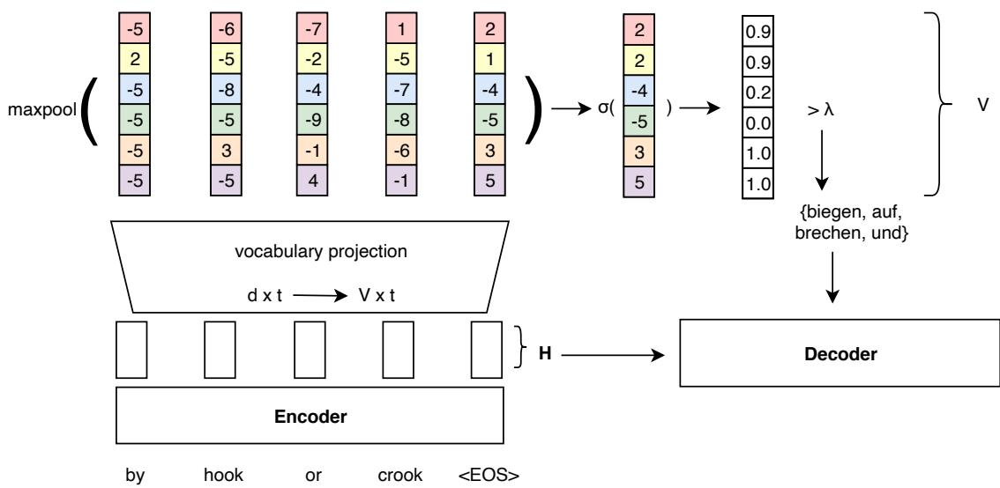  
Figure 2: The proposed Neural Vocabulary Selection (NVS) model. A subset of the full vocabulary is selected based on encoder representation H and passed to the decoder for a reduced output projection at every decoder step.

We achieve goal (1) by basing predictions on the encoder representation already used by the decoder. Goal (2) is accomplished by restricting NVS to a single layer and basing the prediction on the encoder output, where we can parallelize computation across source tokens. Inference latency is dominated by non-parallelizable decoder steps (Kasai et al., 2020). By projecting to the target vocabulary per source token, each source token can “vote” on a set of target tokens. The model automatically scales to longer sentences via the maxpooling operation, acting as a union of per-token choices, fulfilling goal (3). Max-pooling does not tie the predictions across timesteps as they would be with mean-pooling which would also depend on sentence length. Additionally, we factor in a sentence-level target token prediction based on the <EOS> token. The probability of a target word being present is represented by the source position with the highest evidence, backing off to a base probability of a given word via the bias vector b.

To learn the $V \times d + V$ parameters for NVS, we use a binary cross-entropy loss with the binary ground truth vector $\boldsymbol { y } \in \bar { \mathbb { R } } ^ { V }$ , where each entry indicates the presence or absence of target token ${ \bf { \nabla } } \mathbf { \mathbf { } } \mathbf { \mathbf { } } \mathbf { \mathbf { { \mathit { y } } } } _ { i }$ . We define the loss as

$$
{ \cal L } _ { \mathrm { N V S } } = \frac { 1 } { Z } \sum _ { i = 0 } ^ { V } { y _ { i } } \log ( z _ { i } ) \lambda _ { p } + ( 1 - y _ { i } ) \log ( 1 - z _ { i } ) ,
$$

where $\lambda _ { p }$ is a weight for the positive class and

$Z = V + \left( \lambda _ { p } - 1 \right) * n _ { p }$ is the normalizing factor, with $n _ { p } = \textstyle \sum _ { i } { \pmb y } _ { i }$ being the number of unique target words. Most dimensions of the V-dimensional vector y will be zero as only a small number of target words are present for a given sentence. To counter the class imbalance of the negative class over the positive class the $\lambda _ { p }$ weight allows overweighting the positive class. This has the same effect as if each target word had occurred $\lambda _ { p }$ times. The NVS objective $( L _ { \mathrm { N V S } } )$ is optimized jointly with the standard negative log-likelihood translation model loss $( L _ { \mathrm { M T } } ) \colon L = L _ { \mathrm { N V S } } + L _ { \mathrm { M T } }$

## 4 Experiments

## 4.1 Setup

Our training setup is guided by best practices for efficient NMT to provide a strong low latency baseline: deep Transformer as encoder with a lightweight recurrent unit in the shallow decoder (Bérard et al., 2021; Kim et al., 2019), int8 quantization for CPU and half-precision GPU inference. We use the constrained data setting from WMT20 (Barrault et al., 2020b) with four language pairs English-German, German-English, English-Russian, Russian-English and apply corpus cleaning heuristics based on sentence length and language identification. We tokenize with sacremoses4 and byte-pair encode (Sennrich et al., 2016) the data with 32k merge operations.

<table><tr><td rowspan="2">vocabulary selection</td><td rowspan="2"></td><td colspan="5">newstest2020</td><td rowspan="2"></td><td colspan="3">ITDS idiom test</td></tr><tr><td>BLEU ↑</td><td>COMET ↑</td><td>human eval (%) ↑</td><td></td><td>CPU↓ GPU↓ (ms / %) (ms / %)</td><td>BLEU ↑</td><td colspan="2">human eval (%) ↑</td></tr><tr><td colspan="2"></td><td>34.4±0.2</td><td>0.461±0.003</td><td>100</td><td>100</td><td>999±12</td><td>208±1</td><td>25.5±0.2</td><td>100</td><td>100</td></tr><tr><td rowspan="5">EN-DE</td><td>align k=200</td><td>34.2±0.1</td><td>0.453±0.004</td><td>98.0±1.9</td><td>96.7±1.9</td><td>51.0±0.6</td><td>78.2±0.9</td><td>25.4±0.2</td><td>96.6±1.9</td><td>97.2±1.8</td></tr><tr><td>align k=1000</td><td>34.3±0.2</td><td>0.462±0.005</td><td>100.1±2.0</td><td>100.0±1.9</td><td>66.6±0.5</td><td>82.9±0.7</td><td>25.5±0.1</td><td>98.5±1.7</td><td>100.4±1.9</td></tr><tr><td>NVS λ=0.99</td><td>34.4±0.1</td><td>0.460±0.004</td><td></td><td>99.5±1.7</td><td>46.6±0.5</td><td>79.8±0.9</td><td>25.5±0.2</td><td></td><td>99.3±1.9</td></tr><tr><td>NVS λ=0.9</td><td>34.4±0.2</td><td>0.461±0.004</td><td>100.0±1.8</td><td></td><td>54.1±0.7</td><td>82.2±0.9</td><td>25.5±0.2</td><td>99.1±1.9</td><td></td></tr><tr><td>NVS λ=0.5</td><td>34.4±0.2</td><td>0.461±0.004</td><td></td><td>-</td><td>65.6±0.8</td><td>86.1±0.7</td><td>25.5±0.2</td><td></td><td>一</td></tr><tr><td rowspan="6">DE-EN</td><td></td><td>40.7±0.2</td><td>0.645±0.001</td><td>100</td><td>100</td><td>1128±17</td><td>229±1</td><td>29.8±0.1</td><td>100</td><td>100</td></tr><tr><td>align k=200</td><td>40.7±0.2</td><td>0.643±0.002</td><td>98.1±2.6</td><td>98.8±2.3</td><td>53.6±0.5</td><td>76.9±0.7</td><td>29.8±0.1</td><td>96.9±2.1</td><td>97.9±2.2</td></tr><tr><td>align k=1000</td><td>40.7±0.2</td><td>0.645±0.001</td><td>99.3±2.5</td><td>100.3±2.2</td><td>67.9±0.5</td><td>84.4±0.6</td><td>29.8±0.1</td><td>101.2±2.1</td><td>101.8±2.2</td></tr><tr><td>NVS λ=0.99</td><td>40.7±0.1</td><td>0.644±0.003</td><td></td><td>99.8±2.4</td><td>47.6±0.6</td><td>76.4±0.7</td><td>29.7±0.1</td><td></td><td>99.9±2.1</td></tr><tr><td>NVS λ=0.9</td><td>40.7±0.2</td><td>0.645±0.002</td><td>101.6±2.6</td><td></td><td>54.4±0.6</td><td>79.8±1.3</td><td>29.7±0.1</td><td>101.0±2.2</td><td></td></tr><tr><td>NVS λ=0.5</td><td>40.7±0.1</td><td>0.645±0.002</td><td></td><td>-</td><td>63.9±0.5</td><td>83.2±0.7</td><td>29.7±0.1</td><td></td><td></td></tr><tr><td rowspan="6">EN-RU</td><td></td><td>23.6±0.1</td><td>0.528±0.002</td><td>100</td><td>100</td><td>673±7</td><td>145±1</td><td></td><td></td><td></td></tr><tr><td>align k=200</td><td>23.3±0.1</td><td>0.507±0.003</td><td>95.9±1.8</td><td>94.1±1.8</td><td>49.9±0.8</td><td>78.2±0.9</td><td></td><td></td><td></td></tr><tr><td>align k=1000</td><td>23.5±0.1</td><td>0.527±0.003</td><td>100.4±1.8</td><td>99.9±1.7</td><td>64.8±0.8</td><td>82.9±0.7</td><td></td><td></td><td></td></tr><tr><td>NVS λ=0.99</td><td>23.6±0.1</td><td>0.525±0.002</td><td></td><td>99.2±1.7</td><td>48.1±0.6</td><td>79.8±0.9</td><td></td><td></td><td></td></tr><tr><td>NVS λ=0.9</td><td>23.6±0.1</td><td>0.528±0.003</td><td>99.3±1.7</td><td></td><td>58.2±0.8</td><td>82.2±0.9</td><td></td><td></td><td></td></tr><tr><td>NVS λ=0.5</td><td>23.6±0.0</td><td>0.529±0.002</td><td></td><td>-</td><td>67.5±0.8</td><td>86.1±0.7</td><td></td><td></td><td></td></tr><tr><td rowspan="6">RU-EN</td><td></td><td>35.5±0.1</td><td>0.559±0.005</td><td>100</td><td>100</td><td>568±8</td><td>123±1</td><td></td><td></td><td></td></tr><tr><td>align k=200</td><td>35.2±0.1</td><td>0.552±0.004</td><td>96.4±2.5</td><td>97.7±2.5</td><td>49.3±0.9</td><td>79.4±1.0</td><td></td><td></td><td></td></tr><tr><td>align k=1000</td><td>35.4±0.1</td><td>0.561±0.004</td><td>99.9±2.5</td><td>98.7±2.3</td><td>62.7±0.5</td><td>81.8±0.8</td><td></td><td></td><td></td></tr><tr><td>NVS λ=0.99</td><td>35.5±0.1</td><td>0.558±0.004</td><td></td><td>100.2±2.5</td><td>47.2±0.5</td><td>79.9±1.0</td><td></td><td></td><td></td></tr><tr><td>NVS λ=0.9</td><td>35.5±0.1</td><td>0.559±0.005</td><td>101.1±2.6</td><td></td><td>52.2±0.6</td><td>80.9±1.3</td><td></td><td></td><td></td></tr><tr><td>NVS λ=0.5</td><td>35.5±0.1</td><td>0.559±0.005</td><td></td><td></td><td>60.2±0.6</td><td>83.6±0.9</td><td></td><td></td><td></td></tr></table>

Table 5: Experimental results for unconstrained decoding (baseline), alignment-based VS with different k, and Neural Vocabulary Selection with varying λ. BLEU and COMET: mean and std of three runs with different random seeds. Human evaluation: source-based direct assessment renormalized so that the unconstrained baseline is at 100%, with 95% CI of a paired t-test. We ran two sets of human evaluations comparing 4 systems each. CPU/GPU: p90 latency in ms with 95% CI based on 30 runs with batch size 1, shown as a percentage of the baseline.

All models are Transformers (Vaswani et al., 2017) trained with the Sockeye 2 toolkit (Domhan et al., 2020). We release the NVS code as part of the Sockeye toolkit5. We use a 20-layer encoder and a 2-layer decoder with self-attention replaced by SSRUs (Kim et al., 2019).

NVS and NMT objectives are optimized jointly, but gradients of the NVS objective are blocked before the encoder. This allows us to compare the different vocabulary selection techniques on the same translation model that is unaffected by the choice of vocabulary selection. All vocabulary selection methods operate at the BPE level. We use the translation dictionaries from fast\_align for alignment-based vocabulary selection. We use a minimum of k = 200 for alignment-based vocabulary selection which is at the upper end of what is found in previous work. Junczys-Dowmunt et al. (2018) set k = 100, Kim et al. (2019) set k = 75, and Shi and Knight (2017) set k = 50.

Smaller k would lead to stronger quality degradations at lower latency. GPU and CPU latency is evaluated at single-sentence translation level to match real-time translation use cases where latency is critical. We evaluate translation quality using SacreBLEU (Post, 2018)6 and COMET (Rei et al., 2020)7. Furthermore, we conduct human evaluations with two annotators on the subsets of newstest2020 and IDTS test sentences where outputs differ between NVS λ = 0.9 (0.99) and align k = 200. Professional bilingual annotators rate outputs of four systems concurrently in absolute numbers with increments of 0.2 from 1 (worst) to 6 (best). Ratings are normalized so that the (unconstrained) baseline is at 100%. Complementary details on the training setup, vocabulary selection model size, human and latency evaluation setup can be found in Appendix A.

## 4.2 Results

Table 5 shows results of different vocabulary selection models on newstest2020 and the ITDS idiom set, compared to an unconstrained baseline without vocabulary selection. Automatic evaluation metrics show only very small differences between models. For three out of four language pairs, the alignment model with k = 200 performs slightly worse than the unconstrained baseline (0.2-0.3 BLEU). This corroborates existing work that quality measured by automatic metrics is not significantly affected by alignment-based vocabulary selection (Jean et al., 2015; Shi and Knight, 2017; Kim et al., 2019).

However, human-perceived quality of alignmentbased vocabulary selection with $k = 2 0 0$ is consistently lower than the baseline. COMET, found to correlate better with human judgements than BLEU (Kocmi et al., 2021), only reflects this drop in two out of the four language pairs, considering confidence intervals across random seeds. Increasing k to 1000 closes the quality gap with respect to human ratings taking the confidence intervals into account. The same is true for vocabulary selection using NVS at both $\lambda = 0 . 9$ and $\lambda = 0 . 9 9$ where quality is also within the confidence intervals of the unconstrained baseline. However, NVS is consistently faster than the alignment-based model. For $\lambda = 0 . 9$ we see CPU latency improvements of 95 ms on average across language arcs. Increasing the threshold to $\lambda = 0 . 9 9$ latency compared to $k = 1 0 0 0$ is reduced by 157 ms on average. The same trend holds for GPU latency but with smaller differences. Figure 3 compares the NVS model against the alignment model according to the speed/quality tradeoff reflected by average vocabulary size vs. reference token recall on newstest2020. NVS consistently outperforms the alignment model, especially for small average vocabulary sizes where NVS achieves substantially higher recall. This demonstrates that the reduced vocab ulary size and therefore faster decoder steps can amortize the cost of running the lightweight NVS model, which is fully parallelized across source tokens as part of the encoder.

To evaluate a domain adaptation setting, we finetune the NVS models on a set of 300 held-out sentences of idioms in sentence context for 10 epochs. For a fair comparison, we also include the same data for the alignment-based vocabulary selection. Figure 4 shows that NVS yields pareto optimality over the alignment model with and without domain adaptation to a small internal training set of idiomatic expressions in context. This highlights the advantage of NVS which is automatically updated during domain fine-tuning as it is part of a single model. See Appendix C for additional figures on the proverbs and ITDS test sets, where the same trend holds.

## 4.3 Analysis

Our proposed neural vocabulary selection model benefits from contextual target word prediction. We demonstrate this by comparing the predicted BOW when using the source sentence context versus predicting BOWs individually for each input word (which may consist of multiple subwords) and taking the union of individual bags. We use the NVS models that are adapted to a set of idiomatic expressions for this analysis to ensure that the unconstrained baseline models produce reasonable translations for the Idiom test set.

<table><tr><td></td><td>Ref tokens</td><td>λ</td><td>Context</td><td>No Context</td></tr><tr><td rowspan="3">EN-DE</td><td>All</td><td>0.9</td><td>0.93</td><td>0.62</td></tr><tr><td></td><td>0.99 0.9</td><td>0.73 0.32</td><td>0.31</td></tr><tr><td>All excl</td><td>0.99</td><td>0.43</td><td>0.01 0.01</td></tr><tr><td rowspan="4">EN-RU</td><td>All</td><td>0.9</td><td>0.75</td><td>0.43</td></tr><tr><td></td><td>0.99</td><td>0.57</td><td>0.25</td></tr><tr><td>All excl</td><td>0.9</td><td>0.37</td><td>0.05</td></tr><tr><td></td><td>0.99</td><td>0.38</td><td>0.06</td></tr></table>

Table 6: Percentage of segments with all idiomatic reference tokens included in the BOW (All), or exclusively included in the contextual or non-contextual BOW (All excl) for NVS threshold λ.

Table 6 shows the percentage of segments for which all reference tokens are included in the contextual vs. the non-contextual BOW for an acceptance threshold of 0.9 and 0.99. Independent of the threshold, predicting the BOW using source context yields significantly larger overlap with idiomatic reference tokens. We also measure the extent to which idiomatic reference tokens are included exclusively in the contextual or noncontextual BOW. For 32% of EN-DE segments, only the contextual BOW contains all idiomatic reference tokens. For non-contextual BOWs, this happens in only 1% of the segments (with λ=0.9). For EN-RU, the values are 38% versus 6%, respectively. This shows that the model makes extensive use of contextualized source representations in predicting the relevant output tokens for idiomatic expressions.

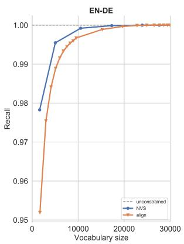

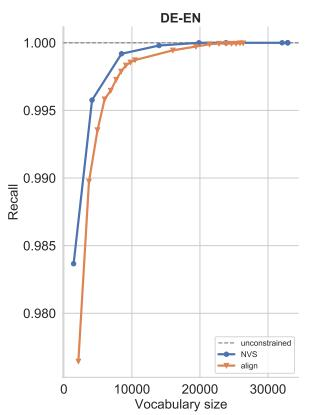

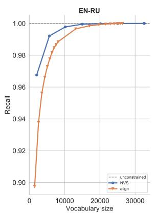

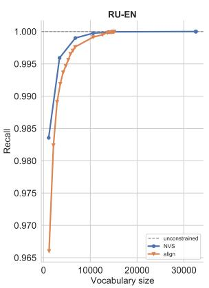  
Figure 3: Vocabulary size (speed) vs. recall of reference tokens (quality) for newstest2020. For NVS, values correspond to $\lambda ~ \in ~ [ 0 . 9 9 , 0 . 9 , 0 . 5 , 0 . 1 , 0 . 0 1 , . . , 0 . 0 0 0 0 1 ]$ For align, values correspond to $k \_ \in$ $[ 1 0 0 , 2 0 0 , . . , 1 0 0 0 , 2 0 0 0 , . . , 1 0 0 0 0 ]$

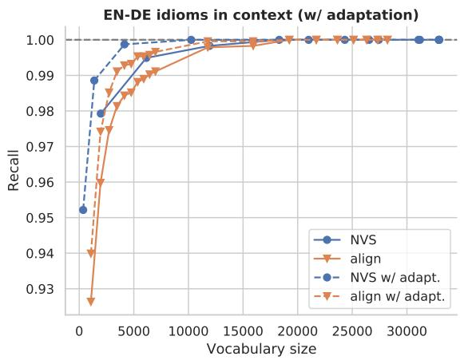

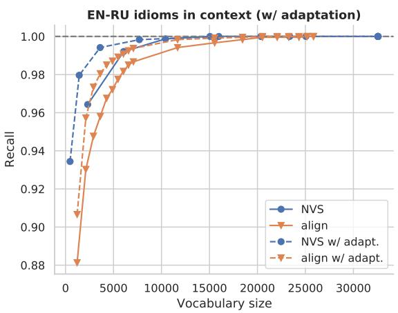  
Figure 4: Vocabulary size (speed) vs recall of reference tokens (quality) for the internal Idioms test set with and without adapting on idioms for NVS and align models. For NVS, the values correspond to setting $\lambda ~ \in ~ [ 0 . 9 9 , 0 . 9 , 0 . 5 , 0 . 1 , 0 . 0 1 , . . , 0 . 0 0 0 0 1 ]$ . For align, the values correspond to setting $k \_ \in$ $[ 1 0 0 , 2 0 0 , . . , 1 0 0 0 , 2 0 0 0 , . . , 1 0 0 0 0 ]$

Figure 5 shows a few illustrative examples where the idiomatic reference is only reachable with the contextual BOW prediction. Consider the last example containing the English idiom “to wrap one’s head around it”. Even though the phrase is rather common in English, the German translation “verstehen” (to understand) would not be expected to rank high for any of the idiom source tokens. Evaluating the tokens in context however yields the correct prediction.

## 5 Related work

There are two dominant approaches to generate a restricted set of target word candidates (i) using an external model and (ii) using the NMT system itself.

In the first approach, a short-list of translation candidates is generated from word-alignments (Jean et al., 2015; Kim et al., 2019), phrase table, and the most common target words (Mi et al., 2016). L’Hostis et al. (2016) propose an additional method using support vector machines to predict target candidates from a sparse representation of the source sentence.

In the second approach, Sankaran et al. (2017) build alignment probability table from the softattention layer from decoder to encoder. However, applying their method to multi-head attention in Transformer is non-trivial as attention may not capture word-alignments in multiple attention layers (Li et al., 2019). Shi and Knight (2017) use local sensitive hashing to shrink the target vocabulary during decoding, though their approach only reduces latency on CPUs instead of GPUs.

<table><tr><td>Source</td><td>Idiomatic target</td></tr><tr><td>I thought I would be nervous , but I was cool as a cu cum ber .</td><td>die Ruhe selbst</td></tr><tr><td>He decides that it is better to face the music , opting to stay and confess . The Classic Car Show is held in conjunction with Old Sett ler &#x27;s Day , rain or shine .</td><td>sich den Dingen stellen bei jedem Wetter</td></tr><tr><td>Tools , discipline , formal methods , process , and professionalism were touted as silver bul lets :</td><td>Wunderwaffe</td></tr><tr><td>They said he was’a little bit under the weather’. I still can &#x27;t wra p my head around it .</td><td>sich nicht wohlfühlen</td></tr></table>

Figure 5: Test inputs from the internal Idioms test set for which the highlighted tokens in the idiomatic reference are exclusively included in the contextual BOW (computed for idiom-adapted NVS model with λ = 0.9).

Chen et al. (2019) reduce the softmax computation by first predicting a cluster of target words and then perform exact search (i.e., softmax) on that cluster. The clustering process is trained jointly with the translation process in their approach.

Closely related to our work is Weng et al. (2017), who predict all words in a target sentence from the initial hidden state of the decoder. Our NVS model differs from theirs in that we make a prediction for each source token and aggregate the results via max-pooling to scale with sentence length. Recent work of Bogoychev and Chen (2021) illustrates the risk associated with reducing latency via vocabulary selection in domain-mismatched settings. Our work takes this a step further by providing a detailed analysis on the shortcomings of vocabulary selection and proposing a model to mitigate them.

Related to our findings on non-compositional expressions, Renduchintala et al. (2021) evaluate the effect of methods used to speed up decoding in Transformer models on gender bias and find minimal BLEU degradations but reduced gendered noun translation performance on a targeted test set.

## 6 Conclusions

Alignment-based vocabulary selection is a common method to heavily constrain the set of allowed output words in decoding for reduced latency with only minor BLEU degradations. We showed with human evaluations and a targeted qualitative analysis that such translations are perceivably worse. Even recent automatic metrics based on pre-trained neural networks, such as COMET, are only able to capture the observed quality degradations in two out of four language pairs. Human-perceived quality is negatively affected both for generic translations, represented by newstest2020, as well as for idiomatic translations. Increasing the vocabulary selection threshold can alleviate the quality issues at an increased single sentence translation latency. To preserve both translation latency and quality we proposed a neural vocabulary selection model that is directly integrated into the translation model. Such a joint model further simplifies the training pipeline, removing the dependency on a separate alignment model. Our model has higher reference token recall at similar vocabulary sizes, translating into higher quality at similar latency.

## References

Roee Aharoni, Melvin Johnson, and Orhan Firat. 2019. Massively multilingual neural machine translation. In Proceedings ofthe 2019 Conference ofthe North American Chapter of the Association for Computational Linguistics: Human Language Technologies, Volume 1 (Long and Short Papers), pages 3874–3884, Minneapolis, Minnesota. Association for Computational Linguistics.

Alham Fikri Aji and Kenneth Heafield. 2020. Compressing neural machine translation models with 4- bit precision. In Proceedings of the Fourth Workshop on Neural Generation and Translation, pages 35–42, Online. Association for Computational Linguistics.

N. Arivazhagan, Ankur Bapna, Orhan Firat, Dmitry Lepikhin, Melvin Johnson, Maxim Krikun, Mia Xu Chen, Yuan Cao, George F. Foster, Colin Cherry, Wolfgang Macherey, Z. Chen, and Yonghui Wu. 2019. Massively multilingual neural machine translation in the wild: Findings and challenges. ArXiv, abs/1907.05019.

Loïc Barrault, Magdalena Biesialska, Ondˇrej Bojar, Marta R. Costa-jussà, Christian Federmann, Yvette Graham, Roman Grundkiewicz, Barry Haddow, Matthias Huck, Eric Joanis, Tom Kocmi, Philipp Koehn, Chi-kiu Lo, Nikola Ljubešic, Christof´ Monz, Makoto Morishita, Masaaki Nagata, Toshiaki Nakazawa, Santanu Pal, Matt Post, and Marcos Zampieri. 2020a. Findings of the 2020 conference on machine translation (WMT20). In Proceedings ofthe Fifth Conference on Machine Translation,

pages 1–55, Online. Association for Computational Linguistics.

Loïc Barrault, Magdalena Biesialska, Ondˇrej Bojar, Marta R. Costa-jussà, Christian Federmann, Yvette Graham, Roman Grundkiewicz, Barry Haddow, Matthias Huck, Eric Joanis, Tom Kocmi, Philipp Koehn, Chi-kiu Lo, Nikola Ljubešic, Christof´ Monz, Makoto Morishita, Masaaki Nagata, Toshiaki Nakazawa, Santanu Pal, Matt Post, and Marcos Zampieri. 2020b. Findings of the 2020 conference on machine translation (WMT20). In Proceedings ofthe Fifth Conference on Machine Translation, pages 1–55, Online. Association for Computational Linguistics.

Maximiliana Behnke, Nikolay Bogoychev, Alham Fikri Aji, Kenneth Heafield, Graeme Nail, Qianqian Zhu, Svetlana Tchistiakova, Jelmer van der Linde, Pinzhen Chen, Sidharth Kashyap, et al. 2021. Efficient machine translation with model pruning and quantization. In Proceedings of the Six Conference on Machine Translation, Online. Association for Computational Linguistics.

Maximiliana Behnke and Kenneth Heafield. 2020. Losing heads in the lottery: Pruning transformer attention in neural machine translation. In Proceedings of the 2020 Conference on Empirical Methods in Natural Language Processing (EMNLP), pages 2664– 2674, Online. Association for Computational Linguistics.

Alexandre Bérard, Dain Lee, Stéphane Clinchant, Kweonwoo Jung, and Vassilina Nikoulina. 2021. Efficient inference for multilingual neural machine translation. In Proceedings of the 2021 Conference on Empirical Methods in Natural Language Processing (EMNLP), Punta Cana, Dominican Republic. Association for Computational Linguistics.

Alexandre Bérard, Dain Lee, Stéphane Clinchant, Kweonwoo Jung, and Vassilina Nikoulina. 2021. Efficient inference for multilingual neural machine translation. arXiv preprint arXiv:2109.06679.

Nikolay Bogoychev and Pinzhen Chen. 2021. The highs and lows of simple lexical domain adaptation approaches for neural machine translation. In Proceedings of the Second Workshop on Insights from Negative Results in NLP, pages 74–80, Online and Punta Cana, Dominican Republic. Association for Computational Linguistics.

Peter F Brown, Stephen A Della Pietra, Vincent J Della Pietra, and Robert L Mercer. 1993. The mathematics of statistical machine translation: Parameter estimation. Computational linguistics, 19(2):263– 311.

Chi Chen, Maosong Sun, and Yang Liu. 2021. Maskalign: Self-supervised neural word alignment. In Proceedings of the 59th Annual Meeting of the Association for Computational Linguistics and the 11th International Joint Conference on Natural Language Processing (Volume 1: Long Papers), pages

4781–4791, Online. Association for Computational Linguistics.

Patrick H Chen, Si Si, Sanjiv Kumar, Yang Li, and Cho-Jui Hsieh. 2019. Learning to screen for fast softmax inference on large vocabulary neural networks. In ICLR (Poster).

Tobias Domhan, Michael Denkowski, David Vilar, Xing Niu, Felix Hieber, and Kenneth Heafield. 2020. The sockeye 2 neural machine translation toolkit at AMTA 2020. In Proceedings ofthe 14th Conference of the Association for Machine Translation in the Americas (Volume 1: Research Track), pages 110– 115, Virtual. Association for Machine Translation in the Americas.

Chris Dyer, Victor Chahuneau, and Noah A. Smith. 2013. A simple, fast, and effective reparameterization of IBM model 2. In Proceedings of the 2013 Conference of the North American Chapter of the Association for Computational Linguistics: Human Language Technologies, pages 644–648, Atlanta, Georgia. Association for Computational Linguistics.

Marzieh Fadaee, Arianna Bisazza, and Christof Monz. 2018. Examining the tip of the iceberg: A data set for idiom translation. In Proceedings ofthe Eleventh International Conference on Language Resources and Evaluation (LREC 2018), Miyazaki, Japan. European Language Resources Association (ELRA).

Sébastien Jean, Kyunghyun Cho, Roland Memisevic, and Yoshua Bengio. 2015. On using very large target vocabulary for neural machine translation. In Proceedings ofthe 53rd Annual Meeting ofthe Associationfor Computational Linguistics and the 7th International Joint Conference on Natural Language Processing (Volume 1: Long Papers), pages 1–10, Beijing, China. Association for Computational Linguistics.

Marcin Junczys-Dowmunt, Kenneth Heafield, Hieu Hoang, Roman Grundkiewicz, and Anthony Aue. 2018. Marian: Cost-effective high-quality neural machine translation in C++. In Proceedings of the 2nd Workshop on Neural Machine Translation and Generation, pages 129–135, Melbourne, Australia. Association for Computational Linguistics.

Jungo Kasai, Nikolaos Pappas, Hao Peng, James Cross, and Noah A Smith. 2020. Deep encoder, shallow decoder: Reevaluating non-autoregressive machine translation. arXiv preprint arXiv:2006.10369.

Young Jin Kim, Marcin Junczys-Dowmunt, Hany Hassan, Alham Fikri Aji, Kenneth Heafield, Roman Grundkiewicz, and Nikolay Bogoychev. 2019. From research to production and back: Ludicrously fast neural machine translation. In Proceedings of the 3rd Workshop on Neural Generation and Translation, pages 280–288, Hong Kong. Association for Computational Linguistics.

Diederik P Kingma and Jimmy Ba. 2015. Adam: A method for stochastic optimization. In Third International Conference on Learning Representations.

Tom Kocmi, Christian Federmann, Roman Grundkiewicz, Marcin Junczys-Dowmunt, Hitokazu Matsushita, and Arul Menezes. 2021. To ship or not to ship: An extensive evaluation of automatic metrics for machine translation. In Proceedings of the Sixth Conference on Machine Translation, pages 478–494.

Gurvan L’Hostis, David Grangier, and Michael Auli. 2016. Vocabulary selection strategies for neural machine translation. arXiv preprint arXiv:1610.00072.

Xintong Li, Guanlin Li, Lemao Liu, Max Meng, and Shuming Shi. 2019. On the word alignment from neural machine translation. In Proceedings of the 57th Annual Meeting of the Association for Computational Linguistics, pages 1293–1303, Florence, Italy. Association for Computational Linguistics.

Marco Lui and Timothy Baldwin. 2012. langid.py: An off-the-shelf language identification tool. In Proceedings of the ACL 2012 System Demonstrations, pages 25–30, Jeju Island, Korea. Association for Computational Linguistics.

Haitao Mi, Zhiguo Wang, and Abe Ittycheriah. 2016. Vocabulary manipulation for neural machine translation. In Proceedings of the 54th Annual Meeting of the Association for Computational Linguistics (Volume 2: Short Papers), pages 124–129, Berlin, Germany. Association for Computational Linguistics.

Franz Josef Och and Hermann Ney. 2003. A systematic comparison of various statistical alignment models. Computational Linguistics, 29(1):19–51.

Kishore Papineni, Salim Roukos, Todd Ward, and Wei-Jing Zhu. 2002. Bleu: a method for automatic evaluation of machine translation. In Proceedings ofthe 40th annual meeting of the Association for Computational Linguistics, pages 311–318.

Matt Post. 2018. A call for clarity in reporting BLEU scores. In Proceedings of the Third Conference on Machine Translation: Research Papers, pages 186– 191, Belgium, Brussels. Association for Computational Linguistics.

Ricardo Rei, Craig Stewart, Ana C Farinha, and Alon Lavie. 2020. COMET: A neural framework for MT evaluation. In Proceedings of the 2020 Conference on Empirical Methods in Natural Language Processing (EMNLP), pages 2685–2702, Online. Association for Computational Linguistics.

Adithya Renduchintala, Denise Diaz, Kenneth Heafield, Xian Li, and Mona Diab. 2021. Gender bias amplification during speed-quality optimization in neural machine translation. In Proceedings of the 59th Annual Meeting of the Association for Computational Linguistics and the 11th International Joint Conference on Natural Language Processing

(Volume 2: Short Papers), pages 99–109, Online. Association for Computational Linguistics.

Baskaran Sankaran, Markus Freitag, and Yaser Al-Onaizan. 2017. Attention-based vocabulary selection for nmt decoding. arXiv preprint arXiv:1706.03824.

Rico Sennrich, Barry Haddow, and Alexandra Birch. 2016. Neural machine translation of rare words with subword units. In Proceedings of the 54th Annual Meeting of the Association for Computational Linguistics (Volume 1: Long Papers), pages 1715– 1725, Berlin, Germany. Association for Computational Linguistics.

Dinghan Shen, Guoyin Wang, Wenlin Wang, Martin Renqiang Min, Qinliang Su, Yizhe Zhang, Chunyuan Li, Ricardo Henao, and Lawrence Carin. 2018. Baseline needs more love: On simple wordembedding-based models and associated pooling mechanisms. In Proceedings of the 56th Annual Meeting of the Association for Computational Linguistics (Volume 1: Long Papers), pages 440–450.

Xing Shi and Kevin Knight. 2017. Speeding up neural machine translation decoding by shrinking runtime vocabulary. In Proceedings ofthe 55th Annual Meeting of the Association for Computational Linguistics (Volume 2: Short Papers), pages 574–579, Vancouver, Canada. Association for Computational Linguistics.

Ashish Vaswani, Noam Shazeer, Niki Parmar, Jakob Uszkoreit, Llion Jones, Aidan N Gomez, Łukasz Kaiser, and Illia Polosukhin. 2017. Attention is all you need. In Advances in Neural Information Processing Systems, volume 30. Curran Associates, Inc.

Rongxiang Weng, Shujian Huang, Zaixiang Zheng, Xinyu Dai, and Jiajun Chen. 2017. Neural machine translation with word predictions. In Proceedings of the 2017 Conference on Empirical Methods in Natural Language Processing, pages 136–145, Copenhagen, Denmark. Association for Computational Linguistics.

Biao Zhang, Deyi Xiong, and Jinsong Su. 2018. Accelerating neural transformer via an average attention network. In Proceedings of the 56th Annual Meeting of the Association for Computational Linguistics (Volume 1: Long Papers), pages 1789–1798, Melbourne, Australia. Association for Computational Linguistics.

## A Reproducibility Details

Data We use the constrained data setting from WMT20 (Barrault et al., 2020b) with four language pairs English-German, German-English, English-Russian, Russian-English. Noisy sentence pairs are removed based on heuristics, namely sentences with a length ratio $> 1 . 5 , > 7 0 \%$ token overlap, > 100 BPE tokens and those where source or target language does not match according to LangID (Lui and Baldwin, 2012) are filtered.

Model We train pre-norm Transformer (Vaswani et al., 2017) models with an embedding dimension of 1024 and a hidden dimension of 4096.
<table><tr><td>Model</td><td>Size</td></tr><tr><td>align k=200</td><td>6,590,600</td></tr><tr><td>align k=1000</td><td>32,953,000</td></tr><tr><td>NVS</td><td>33,776,825</td></tr></table>

Table 7: Model size in terms of in-memory float numbers for EN-DE model with a target vocabulary size of 32953. This does not reflect actual memory consumption, as the computation of the NVS layer may require more intermediate memory.

Table 7 compares the memory consumption of the different vocabulary selection models in terms of float numbers. We see that the NVS model requires a similar number of floating point numbers as the alignment-based model at $k = 1 0 0 0$ . Note, that this only represent the disk space requirements as other intermediate outputs would be required at runtime for either vocabulary selection model.

Training The NMT objective uses label smoothing with constant 0.1, the NVS objective sets the positive class weight $\lambda _ { p }$ to 100,000. Models train on 8 Nvidia Tesla V100 GPUs on AWS p3.16xlarge instances with an effective batch size of 50,000 target tokens accumulated over 40 batches. We train for 70k updates with the Adam (Kingma and Ba, 2015) optimizer, using an initial learning rate of 0.06325 and linear warmup over 4000 steps. Checkpoints are saved every 500 updates and we average the weights of the 8 best checkpoints according to validation perplexity.

Inference For GPU latency, we run in halfprecision mode (FP16) on AWS g4dn.xlarge instances. CPU benchmarks are run with INT8 quantized models run on AWS c5.2xlarge instances. We decode using beam search with a beam of size

5. Each test set is decoded 30 times on different hosts, and we report the mean p90 latency with its 95% confidence interval. Alignment-based vocabulary selection includes the top k most frequently aligned BPE tokens for each source token based on a $\boldsymbol { \mathrm { f } } \circ \mathsf { s t \_ } \circ \mathsf { I }$ ign model trained on the same data as the translation model. NVS includes all tokens that are scored above the threshold λ. All vocabulary selection methods operate at the BPE level.

Evaluation Human Evaluations and COMET / BLEU use full precision (FP32) inference outputs. We decided to use FP32 for human evaluation as we wanted to evaluate the quality of the underlying model independent of whether it gets used on CPU or GPU and the output differences between FP16/FP32/INT8 being small. We report mean and standard deviation of SacreBLEU (Post, 2018)8 and COMET (Rei et al., 2020) scores on detokenized outputs for three runs with different random seeds. For human evaluations, bilingual annotators see a source segment and the output of a set of 4 systems at once when assigning an absolute score to each output. The size of the evaluation set was 350 for EN-DE and EN-RU and 200 for DE-EN and RU-EN for newstest2020. We used the full sets of sentences differing between NVS λ = 0.9, align k = 200 for the ITDS test set (309 for EN-DE and 273 for DE-EN).

Adaptation For domain adaptation, we fine-tune the NVS model for 10 epochs using a learning rate of 0.0001 and a batch size of 2048 target tokens. To adapt the alignment-based vocabulary selection model, we include the adaptation data as part of the training data for the alignment model. We upsample the adaptation data by a factor of 10 for a comparable setting with NVS fine-tuning.

## B Positive class weight ablation

Based on preliminary experiments we had used a weight for the positive class $( \lambda _ { p } )$ of 100k in the experiments in §4. Here the positive class refers to tokens being present on the target side and the negative class to tokens being absent from the target side. For a Machine Translation setting there are many more words that are not present than are present on the target side. The negative class therefore dominates the positive class. This can be counteracted by using a large value for the positive weight $\lambda _ { p }$

<table><tr><td rowspan="5">EN-DE</td><td rowspan="5">pos. weight auto  $x = 1 0$  auto x = 1 100k 10k 1k 100</td><td rowspan="5">34.2 34.4 34.2</td><td>BLEU COMET 34.4 34.1</td></tr><tr><td>0.459 0.458</td></tr><tr><td>34.4</td></tr><tr><td>0.461 0.460</td></tr><tr><td>0.463 0.456</td></tr><tr><td>DE-EN</td><td>10</td><td>32.5</td><td>0.295</td></tr><tr><td rowspan="9"></td><td>1</td><td>15.9</td><td>-0.498</td></tr><tr><td>auto x = 10</td><td>40.9</td><td>0.644</td></tr><tr><td>auto x = 1</td><td>40.8</td><td>0.640</td></tr><tr><td>100k</td><td>40.8</td><td>0.642</td></tr><tr><td>10k</td><td>41.0</td><td>0.645</td></tr><tr><td>1k</td><td>40.8</td><td>0.643</td></tr><tr><td>100</td><td>40.8</td><td>0.638 0.558</td></tr><tr><td>10</td><td>40.2</td><td></td></tr><tr><td>1</td><td>25.3</td><td>-0.608</td></tr><tr><td>EN-RU</td><td>auto x = 10</td><td>23.6</td><td>0.524</td></tr><tr><td rowspan="9"></td><td>auto x = 1</td><td>23.5</td><td>0.524</td></tr><tr><td>100k</td><td>23.6</td><td>0.524</td></tr><tr><td>10k</td><td>23.7</td><td>0.528</td></tr><tr><td>1k</td><td>23.6</td><td>0.526</td></tr><tr><td>100</td><td>23.3</td><td>0.497</td></tr><tr><td>10</td><td>20.6</td><td>0.128</td></tr><tr><td>1</td><td>5.6</td><td>-1.509</td></tr><tr><td>auto x = 10</td><td>35.6</td><td>0.564</td></tr><tr><td>RU-EN</td><td></td><td></td></tr><tr><td rowspan="8"></td><td>auto x = 1</td><td>35.6</td><td>0.563</td></tr><tr><td>100k</td><td>35.6</td><td>0.557</td></tr><tr><td>10k</td><td>35.8</td><td>0.565</td></tr><tr><td>1k</td><td>35.4</td><td>0.556</td></tr><tr><td>100</td><td>35.5</td><td>0.551</td></tr><tr><td>10</td><td>34.2</td><td>0.452</td></tr><tr><td></td><td></td><td></td></tr><tr><td>1</td><td>20.1</td><td>-0.622</td></tr></table>

Table 8: Translation quality in terms of BLEU and COMET on newstest2020 with different weights for the positive class. auto x refers to setting the weight according to the ratio of the negative class to the positive class with a factor x.

Instead of setting $\lambda _ { p }$ to a fixed weight one can also define it as

$$
\lambda _ { p } = x \frac { n _ { n } } { n _ { p } }
$$

with $n _ { p }$ as the number of unique target words, $n _ { n } = V - n _ { p }$ as the number of remaining words and x being a factor to increase the bias towards recall. This way the positive class and negative class are weighted equally. Table 8 shows the result of different positive weights, including the automatic setting according to the ratio (auto). We see that not increasing the weight of the positive class results in large quality drops. For positive weights > 1000 the quality differences are small. The auto setting provides an alternative that is easier to set than finding a fixed positive weight.

## C Additional vocabulary size vs. recall plots

Figures 6 and 7 provide results for the proverbs and ITDS test sets, respectively. We see the same trend across all test sets of NVS offering higher recall at the same vocabulary size compared to alignmentbased vocabulary selection. For the proverbs test set this is true both for the literal and the idiomatic translations.

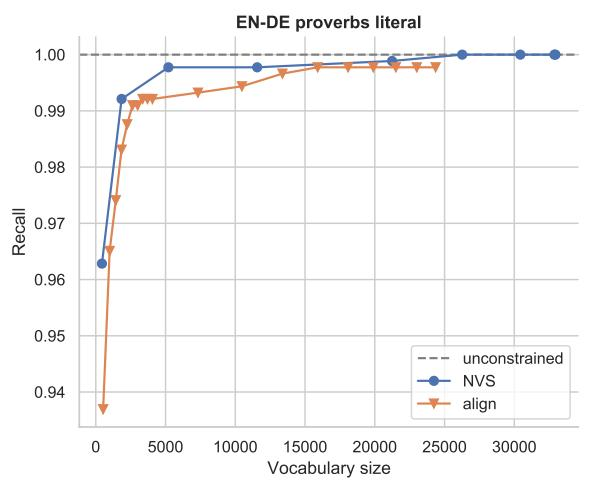

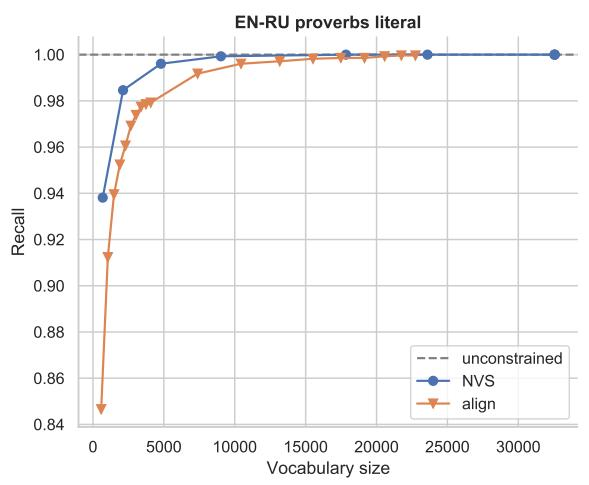

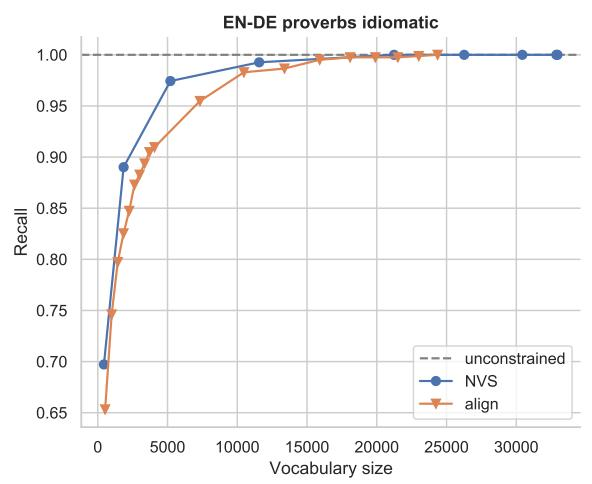

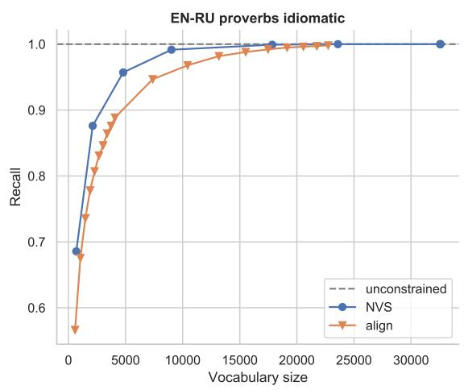  
Figure 6: Vocabulary size (speed) vs. recall of reference tokens (quality) for proverbs test set. For NVS, the values correspond to setting $\lambda \in [ 0 . 9 9 , 0 . 9 , 0 . 5 , 0 . 1 , 0 . 0 1 , . . , 0 . 0 0 0 0 1 ]$ . For align, the values correspond to setting $k \in [ 1 0 0 , 2 0 0 , . . , 1 0 0 0 , 2 0 0 0 , . . , 1 0 0 0 0 ]$

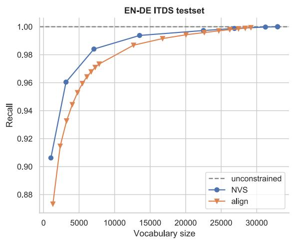

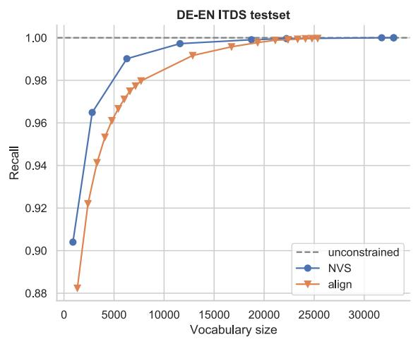  
Figure 7: Vocabulary size (speed) vs. recall of reference tokens (quality) for ITDS test set. For NVS, the values correspond to setting $\lambda \in [ 0 . 9 9 , 0 . 9 , 0 . 5 , 0 . 1 , 0 . 0 1 , . . , 0 . 0 0 0 0 1 ]$ . For align, the values correspond to setting $k \in$ $[ 1 0 0 , 2 0 0 , . . , 1 0 0 0 , 2 0 0 0 , . . , 1 0 0 0 0 ]$