# The Why and The How: A Survey on Natural Language Interaction in Visualization

Henrik Voigt1, Özge Alacam2, Monique Meuschke3, Kai Lawonn1 and Sina Zarrieß2

1University of Jena 2University of Bielefeld 3University of Magdeburg

1first.last@uni-jena.de

2first.last@uni-bielefeld.de

3last@isg.cs.uni-magdeburg.de

## Abstract

Natural language as a modality of interaction is becoming increasingly popular in the field of visualization. In addition to the popular query interfaces, other language-based interactions such as annotations, recommendations, expla nations, or documentation experience growing interest. In this survey, we provide an overview of natural language-based interaction in the research area of visualization. We discuss a renowned taxonomy of visualization tasks and classify 119 related works to illustrate the stateof-the-art of how current natural language interfaces support their performance. We examine applied NLP methods and discuss humanmachine dialogue structures with a focus on initiative, duration, and communicative functions in recent visualization-oriented dialogue interfaces. Based on this overview, we point out interesting areas for the future application of NLP methods in the field of visualization.

## 1 Introduction

Natural language as a modality for interacting with visual models enjoys increasing popularity in human-computer interface research in the fields of Human-Computer-Interaction (HCI) and Visualization (VIS) (Yu and Silva, 2020; Srinivasan et al., 2020a; Liu et al., 2021; Narechania et al., 2021; Kim et al., 2021c). At the same time, interest in tasks involving the visual modality has grown strongly in NLP research in recent years (Suhr et al., 2017; Hudson and Manning, 2019; Acharya et al., 2019). While there are common interests and parallel trends in VIS and NLP, research in these fields often adopts different perspectives on what interaction is and how it should be modeled. Broadly speaking, in the VIS community, a lot of research aims to understand why users need to interact with a visualization and what users’ intents are when they interact with a visual model (Dimara and Perin, 2020). Therefore, Brehmer and Munzner (2013)

categorize users’ data-related intents into visualization tasks and introduce a taxonomy to describe them in general terms and compare them among applications. Recent contributions show that different forms of natural language-based interaction prove suitable to support users in accomplishing various visualization tasks. This concerns not only the popular query interfaces, but also, on a broader scale, the provision of recommendations, annotations, explanations, documentations, or for support in analytical conversation. However, the variety of existing visualization tasks benefiting from natural language interaction beyond simple query interfaces has not yet received much attention in the NLP community. On the other hand, modern NLP methods offer enormous potential for modeling multi-modal dialogues in the visualization tasks.

In this survey, we aim to complement the whyoriented perspective of classifying visualization tasks by intent in VIS with the how-oriented dialogue modeling perspective in NLP for works involving natural language interaction. To substantiate the classification of the papers, we first delimit the scope of the survey and explain the methodology employed to derive the selected papers in Section 2. We discuss the taxonomy of abstract visualization tasks by Brehmer and Munzner (2013) as the basis for the classification in Section 3 by explaining why interaction with a visualization is performed. Section 4 focuses on how interaction is implemented in the works at hand in terms of applied NLP methods as well as characteristic structures in human-machine dialogue (Bunt et al., 2010). Finally, challenges arising from current approaches are pointed out. As such, the need to compile reliable data sets to support the adoption of deep learning-based NLP methods in the field of VIS yields promising space for future creative work.

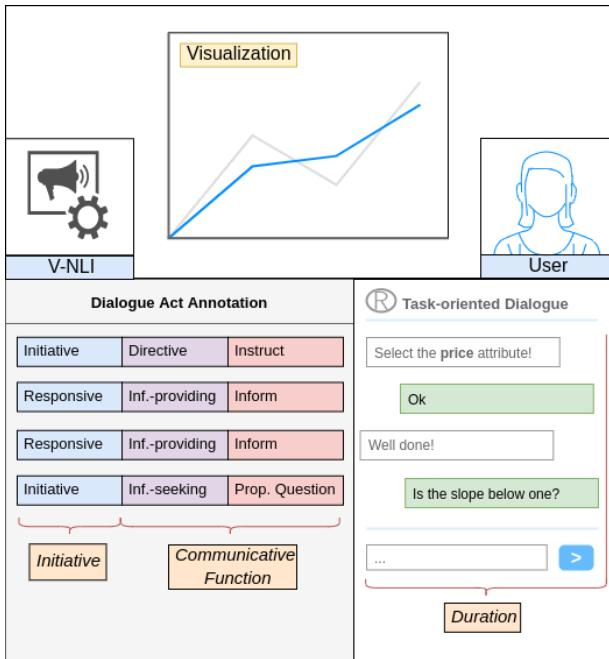  
Figure 1: Investigation of dialogue structures as applied in visualization systems based on the DIT++ taxonomy of dialogue acts by Bunt (2009).

Related Surveys. The survey of Shen et al. (2021) considers 55 visualization-oriented natural language interfaces (V-NLI) at the intersection of NLP and VIS. The work focuses on the applicability of natural language interfaces at the different steps of the information visualization pipeline by Kard et al. (1999). The authors discuss querybased language interfaces in detail. Similarly, Özcan et al. (2020) put their focus on querying data visualizations using natural language. However, querying a visualization interface is only one possible language-based interaction among many such as annotation, description generation, documentation, and others. Klopfenstein et al. (2017) conduct a more general study on the application of conversational interfaces and derive usage patterns and paradigms for their implementation. Further related work is done at the intersection of Machine Learning (ML) and VIS as by Wu et al. (2021) or Wang et al. (2020), who illuminate where and how ML gains ground in VIS and discuss future directions for applying ML in VIS research. Facing that, we identify substantial ground for a survey that examines current natural language interaction techniques supporting the accomplishment of visualization tasks. Related work in VIS yields comprehensive and well-conducted state-of-the-art surveys focusing on where dialogue systems can be integrated into the information visualization pipeline proposed by Kard et al. (1999). This work is complementary in that it illuminates from an NLP perspective how visualization-oriented dialogue is structured in terms of initiative, duration, and present communicative functions within the respective visualization task at hand (see Figure 1). By shedding a light on this we hope to arouse interest in the NLP community for the interesting multi-modal dialogue modeling tasks emerging at the intersection of NLP and VIS.

## 2 Methodology

For a paper to be included in the survey paper selection, it must meet the following criteria:

• Language-based interaction must be a designated input/output modality and some kind of language interface must be provided for it, e.g., a text box or a microphone/speaker.

• Language-based interaction must serve to fulfill or support a main visualization task. For example, using natural language for logging into an application is neither a visualization task nor does it support the accomplishment of that task and is, therefore, not valid. In contrast, using natural language to annotate certain aspects of a visualization is considered supportive of achieving the goal of the visualization task and therefore is valid.

In addition to contributions that include concrete implementations of interaction scenarios, theoretical papers that discuss design spaces or considerations of language-based interaction possibilities are included. The aim is to explicitly show not only what has already been implemented, but also which interaction possibilities are conceivable and useful in multi-modal visualization-oriented dialogue. The paper selection is made in a two-stage process. First, a set of seed papers is derived from conference proceedings of the main conferences in HCI, namely SIGCHI, VIS, namely IEEE VIS, PacificVIS, and EuroVIS, and NLP, namely ACL and EMNLP, starting from the year 2010 until 2021. The papers are filtered using the keywords language, visualization, interface in combination with a semantic embedding map of the abstracts based on Reimers and Gurevych (2019). The exploratory process results in a set of 76 papers. In the second stage, the references of the seed papers are examined and relevant papers that meet the specified criteria are included in the set. This results in a final set of 119 papers. For a detailed insight into the scope of the survey, we refer to Appendix A.

## 3 Why Users interact with Visualizations

Brehmer and Munzner (2013) introduce a multi level typology for abstract description and compari son of visualization tasks between applications. An abstract visualization task represents a high-level description of why interaction with a visualization application is performed, how it is performed, and what the input and output of the task are. The why branch of Brehmer and Munzner’s typology was chosen primarily for three reasons: First, the high level of abstraction allows to cover a high number of visualization tasks and therefore ensures high representativeness. On the other hand, the modular character of the typology is beneficial for break ing down complex tasks into smaller subtasks in which commonalities can then be identified. In ad dition, the combination with the what and the how branch offers the possibility to describe task chains, which can serve as a blueprint for the design of a dialog with the system. The papers are classified on the basis of the why-branch of the taxonomy because it distinguishes the tasks taking into ac count the goal to be achieved and thus corresponds to the goal definition as also used in goal-oriented dialogue modeling (Bordes et al., 2016; Li et al., 2017; Liu et al., 2018). The why branch spawns the abstract visualization tasks present, discover, enjoy, and produce illustrated in Figure 2. Following Munzner (2009), we consider language-based interaction as domain- and interface-independent operations performed by users and/or systems by applying natural language in any kind of representation, e.g, written- or spoken text. Ta ble 1 shows an overview of the contributions and the respective visualization task to which they are assigned. In the following subsections, concrete tasks involving natural language interaction are pre sented for each abstract visualization task of the taxonomy. Each section includes a brief definition of the targeted visualization task and a detailed dis cussion of current related work that addresses it. For a detailed inspection, we refer to Appendix B.

## 3.1 Present Task

Brehmer and Munzner (2013) define presentation as ’the use of visualization for the succinct communication ofinformation,for telling a story with data, guiding an audience through a series of cognitive operations’. During this task, natural language is used to complement the presentation of visual findings and results, for data-driven storytelling, or to explain, evaluate and discuss them.

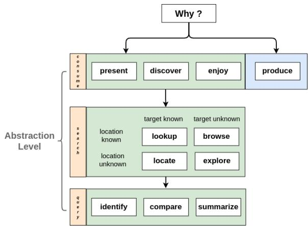  
Figure 2: Why-branch of the Multi-Level Typology of Abstract Visualization Tasks inspired by Brehmer and Munzner (2013).

Visual Storytelling. Visual storytelling considers the communication of knowledge to a broad audience using visual and textual elements that follow a coherent narrative. The main idea is to match linguistic and visual elements and arrange them consistently within a story. Von Landesberger et al. (2021) study how text and visualization interact with each other in a visual storytelling scenario pointing out that visualizations complement the narrative by providing overview, details, and comparison. Automatic story generation is done by Shi et al. (2021) who leverage the generation of a visual story from spreadsheet input. Natural language text drives the story of a visualization presentation in Kwon et al. (2014); Bryan et al. (2017); Metoyer et al. (2018). Users are guided through the story by interacting with the text segments and the system creates visual animations correspondingly in response.

Explanation Generation. Visualizations offer great potential to create understanding for complex issues among different user groups. In contrast to storytelling, explanation generation is not about assigning a sequence of visual elements to a text-based story, but about automatically explaining given visual facts through natural language texts. Combining text and visualization is used to explain complex processes, e.g., in verbalizing the functionality of ML models (Hohman et al., 2019).

<table><tr><td>Visualization Task</td><td>Subtask</td><td>#</td><td>Representative Paper(s)</td></tr><tr><td rowspan="2">Present</td><td>Visual Storytelling</td><td>6</td><td>(Kwon et al., 2014; Metoyer et al., 2018)</td></tr><tr><td>Explanation Generation</td><td>3</td><td>(Sevastjanova et al., 2018; Hohman et al., 2019)</td></tr><tr><td rowspan="4">Discover</td><td>Keyword Search</td><td>15</td><td>(Isaacs et al., 2014; Feng et al., 2018; Schleußinger and Henkel, 2018)</td></tr><tr><td>Querying</td><td>45</td><td>(Setlur et al., 2016; Yu and Silva, 2020; Narechania et al., 2021)</td></tr><tr><td>VQA</td><td>3</td><td>(Mathew et al., 2021; Chaudhry et al., 2020)</td></tr><tr><td>Browsing</td><td>7</td><td>(Setlur et al., 2020; Luo et al., 2020; Srinivasan and Setlur, 2021)</td></tr><tr><td rowspan="2">Enjoy</td><td>Augmentation</td><td>12</td><td>(Srinivasan et al., 2019b; Hullman et al., 2013)</td></tr><tr><td>Description Generation</td><td>14</td><td>(Obeid and Hoque, 2020; Hsu et al., 2021)</td></tr><tr><td rowspan="3">Produce</td><td>Annotation</td><td>7</td><td>(Chen et al., 2010b; Ren et al., 2017)</td></tr><tr><td>Documentation</td><td>1</td><td>(Nafari and Weaver, 2015)</td></tr><tr><td>Visualization Creation</td><td>6</td><td>(Cui et al., 2020; Fulda et al., 2016)</td></tr></table>

Table 1: Classification of papers based on the Multi-Level Typology of Abstract Visualization Tasks by Brehmer and Munzner (2013). For the sake of clarity, papers are classified into the most suitable category only, although some works touch on several categories in terms of content. A comprehensive listing can be found in Appendix B.

Sevastjanova et al. (2018) discuss strategies on how to present language explanations during the model inference process and the interaction techniques to be required, such as details-on-demand, guidance, dialogue, and exploration.

## 3.2 Discover Task

Using natural language to discover information is one of the most common visualization tasks targeted by V-NLI. Brehmer and Munzner (2013) differentiate between different levels of task granularity such as discover - search - query (see Figure 2). The discovery of concepts, objects, and relationships in a visualization depends on the role that the user and the interface take in the visualizationoriented dialogue, as well as on the concreteness of the user’s intent. Intents are formulated in oral or written form. Less concrete user intents lead to a more exploratory character of the search. Concrete intents formalized in a query lead to a specific system response. Vague and fuzzy intents are much more difficult to formalize in a single query and must be inferred by the V-NLI through the application of intelligent recommendations or user guidance.

Keyword Search. Discovering information about a visualization by supplementing it with a keyword search interface is examined by Feng et al. (2018). The authors enable the search of visual concepts in a 2D visualization via text input. Further visualization-oriented keyword search interfaces are applied in Chowdhury et al. (2021); Siddiqui and Hoque (2020); Chung et al. (2010). In contrast to that, visual search interfaces take in keywords but focus on displaying results in a way that facilitates visual exploration, as targeted in Wilson et al. (2010); Schleußinger and Henkel (2018); Peltonen et al. (2017). Search history and coverage are tracked and visualized by Isaacs et al. (2014).

Natural Language Querying. Natural language querying is a scenario in which a user formulates a query to a visual model and the system is tasked with outputting a visual response to that query – referred to as query2viz. Most of the existing V-NLIs focus on this task. Theoretical work on utterance structures in natural language querying has been done by Srinivasan et al. (2019a, 2021b) finding that utterances mainly target attribute, chart type, encoding, aggregation, and design aspects of a visual model. Liu et al. (2021); Sun et al. (2014);

Narechania et al. (2021) generate a visualization based on a data table and a natural language query. Yu and Silva (2020) allow query sequences to be specified in a visual exploration workflow.

Ambiguities. Resolving ambiguities and underspecified utterances poses a difficult problem in this visualization task, especially for single-turn query interfaces. Hearst et al. (2019); Tory and Setlur (2019) develop design guidelines for how systems should respond to queries that contain vague modifiers or -user intents by exploring contextual inference strategies. Gao et al. (2015) manage ambiguities in input utterances using visual ambiguity widgets. Setlur et al. (2019) apply inferencing rules based on known syntactic and semantic input structures. Setlur and Kumar (2020) use word cooccurrence in combination with sentiment analysis to determine data attributes and filter ranges associated with the articulated vague property.

Hypothesis Verification. Discovering novel insights from data is usually done by (dis-)validating hypotheses. Choi et al. (2019a,b) study the use of visualizations to prove or disprove natural language hypotheses visually. The user initiates a hypothesis test by formulating it in natural language, and the system indicates the match with the underlying data set by creating a graph that highlights matches/discrepancies in striking green/red colours.

Query Dialogue. Setlur et al. (2016); Aurisano et al. (2016); Bacci et al. (2020) extend the singleturn query2viz interaction to a multi-turn interactive visual exploration also referred to as analytical conversation. Analytical conversation is the support of visual analysis processes by V-NLI with the aim of inspecting visual features through a visualization-oriented human-machine dialogue, as studied by Turkay and Henkin (2018); Aurisano et al. (2015). In contrast to visualization creation (see section 3.4), where visualizations are generated based on natural language text, the manipulation or composition of a visualization in the query dialog is used in the sense of a speech act. The produced or manipulated visualization can be seen here as a dynamically generated visual response to a user query with the goal of providing information in the dialog. Setlur and Tory (2017); Hoque et al. (2018) apply pragmatics to visualization-oriented dialogue modeling by taking the dialogue history into account for computing more adequate future responses. Visualization-oriented dialogue assistants have been developed in various forms. Generalpurpose assistants for driving a visual analytics conversation are proposed by Fast et al. (2018); Kassel and Rohs (2018). Assistants implementing instruction following as in plot manipulation or navigation scenarios process and execute commands in a visualization environment (Shao and Nakashole, 2020; Wang et al., 2021). Multi-modal dialogue assistants combine natural language input in oral or written form with touch gestures (Srinivasan and Stasko, 2018; Kim et al., 2021c; Srinivasan et al., 2020a, 2021a). Sperrle et al. (2020, 2021) study adaptive guidance to support a visual analytics process. Collaborative approaches using mixed-initiative interactions for visual analytics are explored by Hu et al. (2018); Langevin et al. (2018). The potential of competitive visualization-oriented dialogue interfaces for educational purposes is theoretically investigated by Reicherts and Rogers (2020) by examining the role of questions in these dialogues. Kumar et al. (2020b) provide a data set of contextualized dialogue acts in a visual exploration scenario as a basis for training dialogue assistants.

Visual Question Answering. VQA is a wellstudied task in Language & Vision (Antol et al., 2015; Yang et al., 2016; Anderson et al., 2018) with the goal to answer questions related to the visual content of images. In VIS, the aim is to answer complex questions related to visual models such as charts or scientific illustrations as in Singh and Shekhar (2020); Chaudhry et al. (2020). Infographics as sophisticated arrangements of visual elements and text are supported by VQA in Mathew et al. (2021). Meeting the high informative standards of response generation required to harness the explanatory purposes of visualizations presents itself as a challenging task.

Browsing. Browsing supports users with a vague or fuzzy data-related intent in discovering visualizations. The idea is to narrow down the user intent through language interaction using text input, multi-step questions, or dialogue and suggest appropriate next steps in the interaction with the visualization. Luo et al. (2018) use keyword input to execute personalized visualization recommendations. Other approaches leverage auto-completion in text input (Setlur et al., 2020; Dhamdhere et al., 2017) or use multi-step question procedures to restrict the user’s target area (de Araújo Lima and Barbosa, 2020; Luo et al., 2020). Srinivasan and

Setlur (2021) recommend data-related utterances users can use to start a visual analysis or shimmy along. Lee et al. (2021) guide users through a visualization-oriented analytical conversation using insights found in the data similar to Cui et al. (2019).

## 3.3 Enjoy Task

Brehmer and Munzner (2013) consider enjoying as the ’casual encounter’ with a visualization without having a concrete hypothesis to verify. Natural language enhances the perception of a visualization by displaying additional information such as captions that contextualize the visual experience, as applied in immersive experiences, exhibitions, or museums. Visually impaired people experience visualizations through translation into auditory language.

Augmentation. In augmentation, visualizations are complemented by automatically generated textual elements, such as labels or links. Srinivasan et al. (2019b); Hullman et al. (2013) augment visualizations with additional facts to substantiate the message to be transmitted. Kandogan (2012) propose the concept of just-in-time augmentation of visual structures during visual analytics to help users understand the structure of the data. Lai et al. (2020) automatically annotate visualizations based on their textual description. Lallé et al. (2021) highlight corresponding elements of a visualization based on tracked gazes of users as they read a text description associated with the visualization. In contrast to that Xia et al. (2020) augment audio podcasts with visual elements. Gao et al. (2014); Latif and Beck (2019) augment map visualizations by automatically mining and linking site-related facts out of articles to their location on the map. Augmentation is also used to textually describe GUI components automatically as a preliminary step for auditory scene description helping visually impaired people interact with visualizations (Chen et al., 2020a).

Visualization Description Generation. Textual descriptions for visualizations are created to complement visual elements during the encounter with a visualization. Spreafico and Carenini (2020); Qian et al. (2021b); Liu et al. (2020) complement visualizations with text analogously to image captioning (Vinyals et al., 2015; Xu et al., 2015). Murillo-Morales and Miesenberger (2020) generate auditory descriptions to make statistical charts accessible to visually impaired people. Hsu et al.

(2021) captions scientific illustrations with highly informative labels that meet scientific quality standards. Summarization of visualization content into textual form is researched by Demir et al. (2012); Moraes et al. (2014). Bylinskii et al. (2017); Madan et al. (2018) extend this to aggregating infographics into a single descriptive hashtag. Theoretical work on how charts and their descriptions are linked and verbalized by users is carried out in Kim et al. (2021a), where it is found that users tend to retain different amounts of information depending on how prominent the visual feature presented in the caption is.

## 3.4 Produce Task

Brehmer and Munzner (2013) refer to produce as a ’reference to tasks in which the intent is to generate new artifacts’. Artifacts generated through natural language interaction are, e.g., annotations of objects in a visualization, scene descriptions, or task reports as used, e.g., in medical visual analysis.

Annotation. Annotating areas of interest, comparing them among each other, and sharing them with colleagues is a common language interaction while working with visualizations (Ren et al., 2017). Chen et al. (2010a,b) leverage touch and click interactions for situated visualization annotation. Latif et al. (2018, 2021) explore the possibilities of linking text and visualization. Sperrle et al. (2019) study the visual annotation of argumentation and how this facilitates analysis. Theoretical work on the sustainable extraction of knowledge from visualization annotations is provided by Vanhulst et al. (2021), who propose a classification framework that enables a structured capture and ordering of annotations.

Documentation. Visualization systems are used by experts, e.g., in the medical domain (Meuschke et al., 2021) to plan and discuss a surgery. Reporting, summarizing, and sharing this visualizationrelated work is an important task that is an additional burden to the surgeon and therefore should be executed by a machine. Nafari and Weaver (2013, 2015) generate natural language questions from queries executed on a visualization resulting in a natural language translation of the interaction. This leaves a step-by-step report of the interaction finding usage as a report of done work.

Visualization Creation. Visualization creation considers the production of a visual model from a natural language description – also referred to as text2viz. Rashid et al. (2021) generate chart visualizations from natural language text input. Collaborative authoring tools assisting users in visualization creation use natural language as an input modality. Cui et al. (2020) provide a tool that generates infographics using natural language statements as input, similar to Qian et al. (2021a). Fulda et al. (2016) design an interactive production process for generating timelines from unstructured text input. Language-based 3D scene generation, also referred to as text2scene, which allows users to describe 3D scenes using text without having to learn software tools, is investigated in Coyne and Sproat (2001); Coyne et al. (2012); Ulinski et al. (2018).

## 4 How Users interact with Visualizations

After discussing why users interact with visualizations using natural language, Section 4 provides a complementary discussion of how these interactions are modeled. First, in Section 4.1 it is explained which NLP methods are used in these systems. Subsequently, Section 4.2 summarizes the structure of the visualization-oriented dialogues in the analyzed paper set in terms of initiative, duration, and present communication functions within the respective visualization task.

## 4.1 NLP Methods

For each paper in the collection, both the NLP methods used, if any, and if named the specific NLP toolkits used for implementation are elaborated. For the sake of clarity, the methods are roughly divided into two areas: Natural Language Understanding (NLU) and Natural Language Generation (NLG). The majority of the systems apply standard NLP methods like tokenization, stemming or stopword removal to pre-process text inputs, which is why these are not recorded separately. For a detailed inspection, we refer to Appendix C. Figure 3 shows the distribution of applied NLU methods over all papers. Semantic Parsing, which relies on rule-based mapping procedures from recognized input tokens to semantic predicates, is predominantly used. Often, POS-Tagging, Word Embeddings, and Named Entity Recognition (NER) are additionally applied to increase the accuracy of the mapping. For Word Sense Disambiguation WordNet, VerbNet or ConceptNet are leveraged. Speech-to-Text APIs are a common method used in many systems to enable auditory input. A small number of pioneering systems integrate more sophisticated NLP methods such as Sentiment Analysis, Vector Search or Co-Reference Resolution. One main reason for the hesitant use of deep learning methods is the high demands on performance and robustness of visualization systems as Dhamdhere et al. (2017) points out. Fluid interaction between user and system in real time is a crucial factor for the success of a visualization application. Adopting state-of-the-art deep learning models to real-time interactions in visualization, e.g., by using Knowledge Distillation (Hinton et al., 2015) or Quantization (Jacob et al., 2018) leaves space for future work. Figure 4 shows the distribution of applied NLG methods over all papers. Template-based language generation is used by the majority of the systems followed by a significantly smaller number of deep learning-based Seq2Seq Modeling approaches. Multi-turn systems are predominantly based on rule-based or probabilistic Dialogue Management. Only a few systems use the Text-to-Speech functionality, as most of the generated responses consist of visual elements. In order to advance the adoption of deep learningbased methods in visualization-related text generation, extensive training data sets are required, as pointed out by Kumar et al. (2020a). There is a limited number of data sets for Visualization Description Generation (Obeid and Hoque, 2020), Visual Question Answering (Mathew et al., 2021; Kim et al., 2020) and Natural Language Querying (Fu et al., 2020; Srinivasan et al., 2021b; Luo et al., 2021). In particular, the compilation of data sets for emerging dialogue scenarios in Analytical Conversation, Hypothesis Verification or collaborative authoring in Visualization Creation would motivate the use of deep learning based NLP methods in these tasks. Therefore, generating high-quality data sets for the aforementioned visualization tasks leaves room for future work.

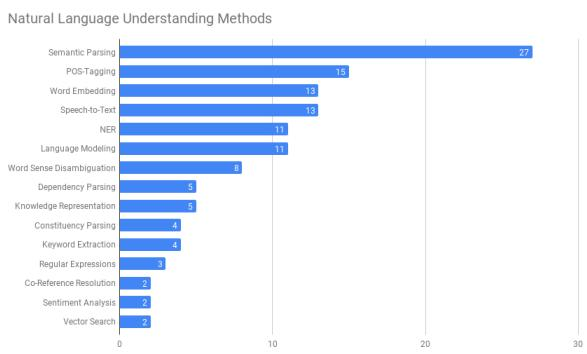  
Figure 3: Distribution of NLU methods over all papers.

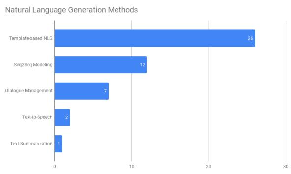  
Figure 4: Distribution of NLG methods over all papers.

## 4.2 Dialogue Structures

The study of structures in visualization-oriented dialogue is done with the idea of identifying task specific patterns, as shown in Figure 5. The struc tural analysis is based on the work of Bunt (2009) and highlights, in particular, the initiative, duration, and communicative functions present in the mod eled dialogues. For each contribution that provides access to sample data illustrating human-machine dialogue within the paper or supplementary mate rial, the presence of the communicative functions information providing, information-seeking, com missive, or directive for the user and system is detected. A comprehensive list of allocations is presented in Appendix C. Bunt’s DIT++ taxonomy was chosen due to the fact that it focuses on the function of the individual speech act. In the context of a visualization task, it is important which function a dialog act fulfills in the success ful execution of this task. This manifests itself particularly in the design of dialog agents, where speech acts that are intended to help solve the task must be specified. Other taxonomies focus on the rhetorical relations of speech acts to each other, as in Prasad et al. (2008), or the emotional infor mation a speech act conveys in the dialogue, as in EmotionML (Schröder et al., 2011). In contrast to the aforementioned taxonomies, Bunt’s taxonomy proves suitable in two respects: It allows to understand how current dialogue situations are functionally structured in the visualization context. In this way, patterns can be identified that are common for the respective visualization tasks. From the generation perspective, it allows to specify dialog actions that need to be prepared in certain visualization task contexts in order to support the solution of the visualization task.

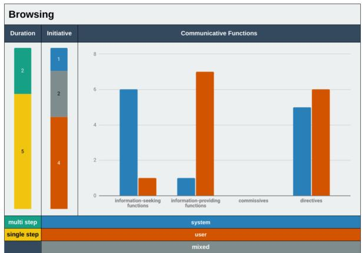  
Figure 5: Analysis of initiative, duration and communicativefunctions in the sub-task browsing.

Present Task. In Visual Storytelling, users initiate the interactions which are performed as a sequence of multiple turns triggered through the selection of text phrases. The human-machine dialogue is characterized by the actors complementing each other through text and visual animations as speech acts. Similar to storytelling, the humanmachine dialogue in Explanation Generation is characterized by a complementing of user input and visualization system output by matching visual and textual elements. Communicating insights found by investigating a visual model is little accompanied by NLP techniques so far compared to other visualization tasks. Template-based story generation systems leave room for innovation in grounding story segments in visualization elements.

Discover Task. The human-machine dialogue in Keyword Search is a short, single-turn dialogue characterized by user-initiated text input that is reciprocated by a visual response from the system, similar to Natural Language Querying. Keyword-based visualization search relies on text label-only search without including the on-screen representation. This leaves space for grounding abstract visualization concepts like outliers or clusters in natural language as a promising step towards a generalized visualization search. Keyword search beyond 2D visualizations is an open issue. The modeled dialogue interaction in analytical conversation is a user-initiated dialogue with multiple turns. Visual elements function in the communication as information providers carrying the response. This scenario offers the possibility to apply modern NLP methods to multi-modal dialogues by checking the user’s intents and dynamically adapting the user’s experience by using the feedback of multiple turns. The implemented systems in Visual Question Answering follow a user-initiated, single-turn dialogue approach in which a user question is answered based on textual or visual information the visualization holds. In Browsing the initiative in the systems varies between user-, mixed- and system-initiated (see Figure 5) with variable duration. Most approaches focus on high-quality auto-completion to lead users, leaving space for innovation in guidance-based dialogue approaches.

Enjoy Task. The predominant features of humanmachine dialogue in Augmentation are systeminitiated single-turn interactions where written or spoken text is used to augment the visual representation. The augmentation of visualizations leaves room for a stronger inclusion of multi-modal interaction triggers such as gazes and gestures in the dialogue conception. Visualization Description Generation is characterized by system-initiated single turn systems. Summarizing visualizations is a challenge because it requires a high-quality scene description due to the high explanatory potential of visualizations. Particularly visually impaired people benefit from well-designed auditory visualization descriptions, which are a motivation for further improvements.

Produce Task. During Annotation, users initiate interactions, which can be continued by system suggestions or completions. Producing artifacts based on a visualization so far relies on template-based authoring tools. Guidance and competition in educational contexts, as well as the collaboration of user and system during artifact production, seem to be promising directions for production-supporting human-machine dialogue conception in the future. Authoring tools take the initiative in Visualization Creation by suggesting answers or partial task completions. The cooperation with the user appears often in form of a multi-turn production process. Documentation is done as a complement of the user’s actions, in that the system provides the user with a report of the work performed after or during the user-initiated interaction with a visualization.

## 5 Conclusion

In this survey, for a renowned taxonomy of abstract visualization tasks, we classified 119 approaches of language-based interaction that support users in pursuing data-related intents. In particular, we shed a light on how the human-machine dialogue is constructed in these works and which NLP methods current V-NLI use. Considering the progress of NLP methods in the field of visualization, we can summarize our work on two main outcomes: A compilation of data sets for the individual visualization tasks seems promising to advance the use of deep learning-based NLP methods; When introducing them, special attention must be paid to performance and robustness aspects due to the high requirements in the VIS area. Finally, the support of visualization tasks through natural language interaction offers a large number of interesting areas for the application of state-of-the-art NLP methods, inviting the NLP and VIS communities to work creatively in the emerging intersection of both fields.

## Acknowledgments

We thank the Michael Stifel Center Jena for funding this work, which is part of the Carl Zeiss Foundation-funded project ’A Virtual Workshop for Digitization in the Sciences’ (062017-02).

## References

Manoj Acharya, Karan Jariwala, and Christopher Kanan. 2019. Vqd: Visual query detection in natural scenes. arXiv preprint arXiv:1904.02794.

Peter Anderson, Xiaodong He, Chris Buehler, Damien Teney, Mark Johnson, Stephen Gould, and Lei Zhang. 2018. Bottom-up and top-down attention for image captioning and visual question answering. 2018 IEEE/CVF Conference on Computer Vision and Pattern Recognition, pages 6077–6086.

Stanislaw Antol, Aishwarya Agrawal, Jiasen Lu, Margaret Mitchell, Dhruv Batra, C. Lawrence Zitnick, and Devi Parikh. 2015. Vqa: Visual question answering. International Journal of Computer Vision, 123:4–31.

Jillian Aurisano, Abhinav Kumar, Alberto Gonzales, Khairi Reda, Jason Leigh, Barbara Di Eugenio, and Andrew Johnson. 2015. Show me data”: Observational study of a conversational interface in visual data exploration. In IEEE VIS, volume 15, page 1.

Jillian Aurisano, Abhinav Kumar, Alberto Gonzalez, Jason Leigh, Barbara DiEugenio, and Andrew Johnson. 2016. Articulate2: Toward a conversational interface for visual data exploration. In IEEE Visualization.

Franscesca Bacci, Federico Maria Cau, and Lucio Davide Spano. 2020. Inspecting data using natural language queries. Computational Science and Its Applications – ICCSA 2020, 12254:771 – 782.

Stefan Bieliauskas and Andreas Schreiber. 2017. A conversational user interface for software visualization. 2017 IEEE Working Conference on Software Visualization (VISSOFT), pages 139–143.

Antoine Bordes, Y-Lan Boureau, and Jason Weston. 2016. Learning end-to-end goal-oriented dialog. arXiv preprint arXiv:1605.07683.

Matthew Brehmer and Tamara Munzner. 2013. A multilevel typology of abstract visualization tasks. IEEE Transactions on Visualization and Computer Graphics, 19:2376–2385.

Chris Bryan, Kwan-Liu Ma, and Jonathan Woodring. 2017. Temporal summary images: An approach to narrative visualization via interactive annotation generation and placement. IEEE Transactions on Visualization and Computer Graphics, 23:511–520.

Harry Bunt. 2009. The dit++ taxonomy for functional dialogue markup. In AAMAS 2009 Workshop, Towards a Standard Markup Languagefor Embodied Dialogue Acts, pages 13–24.

Harry Bunt, Jan Alexandersson, Jean Carletta, Jae-Woong Choe, Alex Chengyu Fang, Kôiti Hasida, Kiyong Lee, Volha Petukhova, Andrei Popescu-Belis, Laurent Romary, Claudia Soria, and David R. Traum. 2010. Towards an iso standard for dialogue act annotation. In LREC.

Zoya Bylinskii, Sami Alsheikh, Spandan Madan, Adrià Recasens, Kimberli Zhong, Hanspeter Pfister, Frédo Durand, and Aude Oliva. 2017. Understanding infographics through textual and visual tag prediction. ArXiv, abs/1709.09215.

Ritwick Chaudhry, Sumit Shekhar, Utkarsh Gupta, Pranav Maneriker, Prann Bansal, and Ajay Joshi. 2020. Leaf-qa: Locate, encode & attend for figure question answering. 2020 IEEE Winter Conference on Applications of Computer Vision (WACV), pages 3501–3510.

Jieshan Chen, Chunyang Chen, Zhenchang Xing, Xiwei Xu, Liming Zhu, Guoqiang Li, and Jinshui Wang. 2020a. Unblind your apps: Predicting naturallanguage labels for mobile gui components by deep learning. 2020 IEEE/ACM 42nd International Conference on Software Engineering (ICSE), pages 322– 334.

Siming Chen, Jie Li, Gennady L. Andrienko, Natalia V. Andrienko, Yun Wang, Phong H. Nguyen, and Cagatay Turkay. 2020b. Supporting story synthesis: Bridging the gap between visual analytics and storytelling. IEEE Transactions on Visualization and Computer Graphics, 26:2499–2516.

Yang Chen, Scott Barlowe, and Jing Yang. 2010a. Click2annotate: Automated insight externalization with rich semantics. 2010 IEEE Symposium on Visual Analytics Science and Technology, pages 155–162.

Yang Chen, Jing Yang, Scott Barlowe, and Dong Hyun Jeong. 2010b. Touch2annotate: generating better annotations with less human effort on multi-touch interfaces. CHI ’10 Extended Abstracts on Human Factors in Computing Systems.

Zhutian Chen, Wai-Shun Tong, Qianwen Wang, Benjamin Bach, and Huamin Qu. 2020c. Augmenting static visualizations with paparvis designer. Proceedings of the 2020 CHI Conference on Human Factors in Computing Systems.

In Kwon Choi, Taylor Childers, Nirmal Kumar Raveendranath, Swati Mishra, Kyle Harris, and Khairi Reda. 2019a. Concept-driven visual analytics: an exploratory study of model- and hypothesis-based reasoning with visualizations. Proceedings of the 2019 CHI Conference on Human Factors in Computing Systems.

In Kwon Choi, Nirmal Kumar Raveendranath, Jared Westerfield, and Khairi Reda. 2019b. Visual (dis) confirmation: Validating models and hypotheses with visualizations. In 2019 23rd International Conference in Information Visualization–Part II, pages 116– 121. IEEE.

Jinho Choi, Sanghun Jung, Deok Gun Park, Jaegul Choo, and Niklas Elmqvist. 2019c. Visualizing for the non-visual: Enabling the visually impaired to use visualization. Computer Graphics Forum, 38.

Arjun Choudhry, Mandar Sharma, Pramod Chundury, Thomas Kapler, Derek W. S. Gray, Naren Ramakrishnan, and Niklas Elmqvist. 2021. Once upon a time in visualization: Understanding the use of textual narratives for causality. IEEE Transactions on Visualization and Computer Graphics, 27:1332–1342.

Imran Chowdhury, Abdul Moeid, Enamul Hoque, Muhammad Ashad Kabir, Md. Sabir Hossain, and Mohammad Mainul Islam. 2021. Designing and evaluating multimodal interactions for facilitating visual analysis with dashboards. IEEE Access, 9:60–71.

Haeyong Chung, Seungwon Yang, Naveed Massjouni, Christopher Andrews, Rahul Kanna, and Chris North. 2010. Vizcept: Supporting synchronous collaboration for constructing visualizations in intelligence analysis. 2010 IEEE Symposium on Visual Analytics Science and Technology, pages 107–114.

Bob Coyne, Alex Klapheke, Masoud Rouhizadeh, Richard Sproat, and Daniel Bauer. 2012. Annotation tools and knowledge representation for a textto-scene system. In Proceedings ofCOLING 2012, pages 679–694.

Bob Coyne and Richard Sproat. 2001. Wordseye: An automatic text-to-scene conversion system. In Proceedings ofthe 28th annual conference on Computer graphics and interactive techniques, pages 487–496.

Pietro Crovari, Sara Pidò, Franca Garzotto, and Stefano Ceri. 2020. Show, don’t tell. reflections on the design of multi-modal conversational interfaces. In CONVERSATIONS.

Weiwei Cui, Xiaoyu Zhang, Yun Wang, He Huang, B. Chen, Lei Fang, Haidong Zhang, Jian-Guang Lou, and Dongmei Zhang. 2020. Text-to-viz: Automatic generation of infographics from proportion-related natural language statements. IEEE Transactions on Visualization and Computer Graphics, 26:906–916.

Zhe Cui, Sriram Karthik Badam, Mehmet Adil Yalçın, and Niklas Elmqvist. 2019. Datasite: Proactive visual data exploration with computation of insightbased recommendations. Information Visualization, 18:251 – 267.

Raul de Araújo Lima and Simone Diniz Junqueira Barbosa. 2020. A question-oriented visualization recommendation approach for data exploration. Proceedings of the International Conference on Advanced Visual Interfaces.

Seniz Demir, Sandra Carberry, and Kathleen F. McCoy. 2012. Summarizing information graphics textually. Computational Linguistics, 38:527–574.

Jan Deriu, Álvaro Rodrigo, Arantxa Otegi, Guillermo Echegoyen, Sophie Rosset, Eneko Agirre, and Mark Cieliebak. 2020. Survey on evaluation methods for dialogue systems. Artificial Intelligence Review, 54:755 – 810.

Kedar Dhamdhere, Kevin S. McCurley, Ralfi Nahmias, Mukund Sundararajan, and Qiqi Yan. 2017. Analyza: Exploring data with conversation. Proceedings ofthe 22nd International Conference on Intelligent User Interfaces.

Evanthia Dimara and Charles Perin. 2020. What is interaction for data visualization? IEEE Transactions on Visualization and Computer Graphics, 26:119– 129.

Mennatallah El-Assady, Rebecca Kehlbeck, Christopher M. Collins, Daniel A. Keim, and Oliver Deussen. 2020. Semantic concept spaces: Guided topic model refinement using word-embedding projections. IEEE Transactions on Visualization and Computer Graph ics, 26:1001–1011.

Ethan Fast, Binbin Chen, Julia Mendelsohn, Jonathan Bassen, and Michael S. Bernstein. 2018. Iris: A conversational agent for complex tasks. Proceedings of the 2018 CHI Conference on Human Factors in Computing Systems.

Mi Feng, Cheng Deng, Evan M. Peck, and Lane Harrison. 2018. The effects of adding search functionality to interactive visualizations on the web. Proceedings of the 2018 CHI Conference on Human Factors in Computing Systems.

C. Ailie Fraser, Julia M. Markel, N. James Basa, Mira Dontcheva, and Scott R. Klemmer. 2020. Remap: Lowering the barrier to help-seeking with multimodal search. Proceedings ofthe 33rd Annual ACM Symposium on User Interface Software and Technology.

Siwei Fu, Kai Xiong, Xiaodong Ge, Siliang Tang, Wei Chen, and Yingcai Wu. 2020. Quda: Natural language queries for visual data analytics. arXiv preprint arXiv:2005.03257.

Johanna Fulda, Matthew Brehmer, and Tamara Munzner. 2016. Timelinecurator: Interactive authoring of visual timelines from unstructured text. IEEE Transactions on Visualization and Computer Graphics, 22:300–309.

Tong Gao, Mira Dontcheva, Eytan Adar, Zhicheng Liu, and Karrie Karahalios. 2015. Datatone: Managing ambiguity in natural language interfaces for data visualization. Proceedings of the 28th Annual ACM Symposium on User Interface Software & Technology.

Tong Gao, Jessica R. Hullman, Eytan Adar, Brent J. Hecht, and Nicholas A. Diakopoulos. 2014. Newsviews: an automated pipeline for creating custom geovisualizations for news. Proceedings ofthe SIGCHI Conference on Human Factors in Computing Systems.

Marti A. Hearst and Melanie K. Tory. 2019. Would you like a chart with that? incorporating visualizations into conversational interfaces. 2019 IEEE Visualization Conference (VIS), pages 1–5.

Marti A. Hearst, Melanie K. Tory, and Vidya Setlur. 2019. Toward interface defaults for vague modifiers in natural language interfaces for visual analysis. 2019 IEEE Visualization Conference (VIS), pages 21–25.

Rafael Henkin and Cagatay Turkay. 2020. Words of estimative correlation: Studying verbalizations of scatterplots. IEEE Transactions on Visualization and Computer Graphics, PP.

Geoffrey Hinton, Oriol Vinyals, and Jeff Dean. 2015. Distilling the knowledge in a neural network. arXiv preprint arXiv:1503.02531.

Fred Hohman, Arjun Srinivasan, and Steven Mark Drucker. 2019. Telegam: Combining visualization and verbalization for interpretable machine learning. 2019 IEEE Visualization Conference (VIS), pages 151–155.

Enamul Hoque, Vidya Setlur, Melanie K. Tory, and Isaac Dykeman. 2018. Applying pragmatics principles for interaction with visual analytics. IEEE Transactions on Visualization and Computer Graphics, 24:309–318.

Ting-Yao Hsu, C. Lee Giles, and Ting-Hao Kenneth Huang. 2021. Scicap: Generating captions for scientific figures. In EMNLP.

Kevin Zeng Hu, Diana Orghian, and César A. Hidalgo. 2018. Dive: A mixed-initiative system supporting integrated data exploration workflows. Proceedings of the Workshop on Human-In-the-Loop Data Analytics.

Drew A Hudson and Christopher D Manning. 2019. Gqa: a new dataset for compositional question answering over real-world images. arXiv preprint arXiv:1902.09506, 3(8).

Jessica R. Hullman, Nicholas A. Diakopoulos, and Eytan Adar. 2013. Contextifier: automatic generation of annotated stock visualizations. Proceedings ofthe SIGCHI Conference on Human Factors in Computing Systems.

Ellen Isaacs, Kelly Domico, Shane Ahern, Eugene Bart, and Mudita Singhal. 2014. Footprints: A visual search tool that supports discovery and coverage tracking. IEEE Transactions on Visualization and Computer Graphics, 20:1793–1802.

Benoit Jacob, Skirmantas Kligys, Bo Chen, Menglong Zhu, Matthew Tang, Andrew Howard, Hartwig Adam, and Dmitry Kalenichenko. 2018. Quantization and training of neural networks for efficient integer-arithmetic-only inference. In Proceedings of the IEEE conference on computer vision and pattern recognition, pages 2704–2713.

Rogers Jeffrey Leo John, Navneet Potti, and Jignesh M. Patel. 2017. Ava: From data to insights through conversations. In CIDR.

Crescentia Jung, Shubham Mehta, Atharva Kulkarni, Yuhang Zhao, and Yea-Seul Kim. 2021. Communicating visualizations without visuals: Investigation of visualization alternative text for people with visual impairments. IEEE Transactions on Visualization and Computer Graphics, PP.

Eser Kandogan. 2012. Just-in-time annotation of clusters, outliers, and trends in point-based data visualizations. 2012 IEEE Conference on Visual Analytics Science and Technology (VAST), pages 73–82.

Stuart T Kard, Jock D Mackinlay, and Ben Scheiderman. 1999. Readings in Information Visualization, using vision to think. San Francisco: Morgan Kaufmann.

Jan-Frederik Kassel and Michael Rohs. 2018. Valletto: A multimodal interface for ubiquitous visual analytics. Extended Abstracts ofthe 2018 CHI Conference on Human Factors in Computing Systems.

Jan-Frederik Kassel and Michael Rohs. 2019. Talk to me intelligibly: Investigating an answer space to match the user’s language in visual analysis. Proceedings of the 2019 on Designing Interactive Systems Conference.

Dae Hyun Kim, Enamul Hoque, and Maneesh Agrawala. 2020. Answering questions about charts and generating visual explanations. In Proceedings of the 2020 CHI conference on human factors in computing systems, pages 1–13.

Dae Hyun Kim, Vidya Setlur, and Maneesh Agrawala. 2021a. Towards understanding how readers integrate charts and captions: A case study with line charts. Proceedings ofthe 2021 CHI Conference on Human Factors in Computing Systems.

Nam Wook Kim, Shakila Cherise Joyner, Amalia Riegelhuth, and Yea-Seul Kim. 2021b. Accessible visualization: Design space, opportunities, and challenges. Computer Graphics Forum, 40.

Young-Ho Kim, Bongshin Lee, Arjun Srinivasan, and Eun Kyoung Choe. 2021c. Data@hand: Fostering visual exploration of personal data on smartphones leveraging speech and touch interaction. Proceedings of the 2021 CHI Conference on Human Factors in Computing Systems.

Lorenz Cuno Klopfenstein, Saverio Delpriori, Silvia Malatini, and Alessandro Bogliolo. 2017. The rise of bots: A survey of conversational interfaces, patterns, and paradigms. Proceedings ofthe 2017 Conference on Designing Interactive Systems.

Abhinav Kumar, Jillian Aurisano, Barbara Di Eugenio, and Andrew Johnson. 2020a. Intelligent assistant for exploring data visualizations. In The Thirty-Third International Flairs Conference.

Abhinav Kumar, Jillian Aurisano, Barbara Maria Di Eugenio, Andrew E. Johnson, Abeer Alsaiari, Nigel Flowers, Alberto Gonzalez, and Jason Leigh. 2017. Multimodal coreference resolution for exploratory data visualization dialogue: Context-based annotation and gesture identification.

Abhinav Kumar, Barbara Di Eugenio, Jillian Aurisano, and Andrew Johnson. 2020b. Augmenting small data to classify contextualized dialogue acts for exploratory visualization. In Proceedings of the 12th Language Resources and Evaluation Conference, pages 590–599.

Bum Chul Kwon, Florian Stoffel, Dominik Jäckle, Bongshin Lee, and Daniel Keim. 2014. Visjockey: Enriching data stories through orchestrated interactive visualization. In Poster compendium of the computation+ journalism symposium, volume 3, page 3.

Chufan Lai, Zhixian Lin, Ruike Jiang, Yun Han, Can Liu, and Xiaoru Yuan. 2020. Automatic annotation synchronizing with textual description for visualization. Proceedings of the 2020 CHI Conference on Human Factors in Computing Systems.

Sébastien Lallé, Dereck Toker, and Cristina Conati. 2021. Gaze-driven adaptive interventions for magazine-style narrative visualizations. IEEE Transactions on Visualization and Computer Graphics, 27:2941–2952.

Scott Langevin, David Jonker, Christopher Bethune, Glen Coppersmith, Casey Hilland, Jonathon Morgan, Paul Azunre, and Justin Gawrilow. 2018. Distil: A mixed-initiative model discovery system for subject matter experts. In International Conference on Machine Learning AutoML Workshop.

Shahid Latif and Fabian Beck. 2019. Interactive map reports summarizing bivariate geographic data. Vis. Informatics, 3:27–37.

Shahid Latif, Diao Liu, and Fabian Beck. 2018. Exploring interactive linking between text and visualization. In EuroVis (Short Papers), pages 91–94.

Shahid Latif, Zheng Zhou, Yoon Kim, Fabian Beck, and Nam Wook Kim. 2021. Kori: Interactive synthesis of text and charts in data documents. IEEE Transactions on Visualization and Computer Graphics.

Carolin (Haas) Lawrence and Stefan Riezler. 2016. Nlmaps: A natural language interface to query openstreetmap. In COLING.

Doris Jung Lin Lee and Aditya G. Parameswaran. 2018. The case for a visual discovery assistant: A holistic solution for accelerating visual data exploration. IEEE Data Eng. Bull., 41:3–14.

Doris Jung Lin Lee, Abdul Quamar, Eser Kandogan, and Fatma Özcan. 2021. Boomerang: Proactive insightbased recommendations for guiding conversational data analysis. Proceedings of the 2021 International Conference on Management of Data.

Xiujun Li, Yun-Nung Chen, Lihong Li, Jianfeng Gao, and Asli Celikyilmaz. 2017. End-to-end taskcompletion neural dialogue systems. arXiv preprint arXiv:1703.01008.

Diane J. Litman and Shimei Pan. 2004. Designing and evaluating an adaptive spoken dialogue system. User Modeling and User-Adapted Interaction, 12:111– 137.

Bing Liu, Gokhan Tur, Dilek Hakkani-Tur, Pararth Shah, and Larry Heck. 2018. Dialogue learning with human teaching and feedback in end-to-end trainable task-oriented dialogue systems. arXiv preprint arXiv:1804.06512.

Can Liu, Yun Han, Ruike Jiang, and Xiaoru Yuan. 2021. Advisor: Automatic visualization answer for naturallanguage question on tabular data. 2021 IEEE 14th Pacific Visualization Symposium (PacificVis), pages 11–20.

Can Liu, Liwenhan Xie, Yun Han, Datong Wei, and Xiaoru Yuan. 2020. Autocaption: An approach to generate natural language description from visualization automatically. 2020 IEEE Pacific Visualization Symposium (PacificVis), pages 191–195.

Alan Lundgard and Arvind Satyanarayan. 2021. Accessible visualization via natural language descriptions: A four-level model of semantic content. IEEE Transactions on Visualization and Computer Graphics, PP.

Yuyu Luo, Chengliang Chai, Xuedi Qin, Nan Tang, and Guoliang Li. 2020. Interactive cleaning for progressive visualization through composite questions. 2020 IEEE 36th International Conference on Data Engineering (ICDE), pages 733–744.

Yuyu Luo, Xuedi Qin, Nan Tang, Guoliang Li, and Xinran Wang. 2018. Deepeye: Creating good data visualizations by keyword search. Proceedings ofthe

2018 International Conference on Management of Data.

Yuyu Luo, Nan Tang, Guoliang Li, Chengliang Chai, Wenbo Li, and Xuedi Qin. 2021. Synthesizing natural language to visualization (nl2vis) benchmarks from nl2sql benchmarks. In Proceedings ofthe 2021 International Conference on Management of Data, pages 1235–1247.

Spandan Madan, Zoya Bylinskii, Matthew Tancik, Adrià Recasens, Kimberli Zhong, Sami Alsheikh, Hanspeter Pfister, Aude Oliva, and Frédo Durand. 2018. Synthetically trained icon proposals for parsing and summarizing infographics. ArXiv, abs/1807.10441.

Ramesh Radhakrishna Manuvinakurike, Trung Bui, W. Chang, and Kallirroi Georgila. 2018. Conversational image editing: Incremental intent identification in a new dialogue task. In SIGDIAL Conference.

Minesh Mathew, Viraj Bagal, Rubèn Pérez Tito, Dimosthenis Karatzas, Ernest Valveny, and C.V. Jawahar. 2021. Infographicvqa. ArXiv, abs/2104.12756.

S. Mazumder and Oriana Riva. 2021. Flin: A flexible natural language interface for web navigation. ArXiv, abs/2010.12844.

Michael F. McTear. 2002. Spoken dialogue technology: enabling the conversational user interface. ACM Comput. Surv., 34:90–169.

Ronald A. Metoyer, Qiyu Zhi, Bart Janczuk, and Walter J. Scheirer. 2018. Coupling story to visualization: Using textual analysis as a bridge between data and interpretation. 23rd International Conference on Intelligent User Interfaces.

Monique Meuschke, Bernhard Preim, and Kai Lawonn. 2021. Aneulysis-a system for the visual analysis of aneurysm data. Computers & Graphics, 98:197–209.

Priscilla Moraes, Gabriel Sina, Kathy McCoy, and Sandra Carberry. 2014. Generating summaries of line graphs. In Proceedings of the 8th International Natural Language Generation Conference (INLG), pages 95–98.

Tamara Munzner. 2009. A nested model for visualization design and validation. IEEE Transactions on Visualization and Computer Graphics, 15(6):921– 928.

Tomás Murillo-Morales and Klaus Miesenberger. 2020. Audial: A natural language interface to make statistical charts accessible to blind persons. Computers Helping People with Special Needs, 12376:373 – 384.

Maryam Nafari and Chris Weaver. 2013. Augmenting visualization with natural language translation of interaction: A usability study. In Computer Graphics Forum, volume 32, pages 391–400. Wiley Online Library.

Maryam Nafari and Chris Weaver. 2015. Query2question: Translating visualization interaction into natural language. IEEE Transactions on Visualization and Computer Graphics, 21:756– 769.

Arpit Narechania, Arjun Srinivasan, and John T. Stasko. 2021. Nl4dv: A toolkit for generating analytic specifications for data visualization from natural language queries. IEEE Transactions on Visualization and Computer Graphics, 27:369–379.

Jason Obeid and Enamul Hoque. 2020. Chart-to-text: Generating natural language descriptions for charts by adapting the transformer model. In INLG.

Fatma Özcan, Abdul Quamar, Jaydeep Sen, Chuan Lei, and Vasilis Efthymiou. 2020. State of the art and open challenges in natural language interfaces to data. Proceedings of the 2020 ACM SIGMOD International Conference on Management ofData.

Jaakko Peltonen, Kseniia Belorustceva, and Tuukka Ruotsalo. 2017. Topic-relevance map: Visualization for improving search result comprehension. Proceedings of the 22nd International Conference on Intelligent User Interfaces.

Rashmi Prasad, Nikhil Dinesh, Alan Lee, Eleni Miltsakaki, Livio Robaldo, Aravind Joshi, and Bonnie Webber. 2008. The penn discourse treebank 2.0. In Proceedings of the Sixth International Conference on Language Resources and Evaluation (LREC’08).

Chunyao Qian, Shizhao Sun, Weiwei Cui, Jian-Guang Lou, Haidong Zhang, and Dongmei Zhang. 2021a. Retrieve-then-adapt: Example-based automatic generation for proportion-related infographics. IEEE Transactions on Visualization and Computer Graphics, 27:443–452.

Xin Qian, Eunyee Koh, Fan Du, Sungchul Kim, Joel Chan, Ryan A. Rossi, Sana Malik, and Tak Yeon Lee. 2021b. Generating accurate caption units for figure captioning. Proceedings ofthe Web Conference 2021.

Md. Mahinur Rashid, Hasin Kawsar Jahan, Annysha Huzzat, Riyasaat Ahmed Rahul, Tamim Bin Zakir, Farhana Meem, Md. Saddam Hossain Mukta, and Swakkhar Shatabda. 2021. Text2chart: A multistaged chart generator from natural language text. ArXiv, abs/2104.04584.

Leon Reicherts and Yvonne Rogers. 2020. Do make me think! how cuis can support cognitive processes. In Proceedings ofthe 2nd Conference on Conversational User Interfaces, pages 1–4.

Nils Reimers and Iryna Gurevych. 2019. Sentence-bert: Sentence embeddings using siamese bert-networks. ArXiv, abs/1908.10084.

Donghao Ren, Matthew Brehmer, Bongshin Lee, Tobias Höllerer, and Eun Kyoung Choe. 2017. Chartaccent: Annotation for data-driven storytelling. 2017 IEEE

Pacific Visualization Symposium (PacificVis), pages 230–239.

Maurice Schleußinger and Maria Henkel. 2018. Knowde: A visual search interface. In International Conference on Human-Computer Interaction, pages 191–198. Springer.

Marc Schröder, Paolo Baggia, Felix Burkhardt, Catherine Pelachaud, Christian Peter, and Enrico Zovato. 2011. Emotionml–an upcoming standard for representing emotions and related states. In International Conference on Affective Computing and Intelligent Interaction, pages 316–325. Springer.

Peter Seipel, Adrian Stock, Siva priya Santhanam, Artur Baranowski, Nico Hochgeschwender, and Andreas Schreiber. 2019. Speak to your software visualization—exploring component-based software architectures in augmented reality with a conversational interface. 2019 Working Conference on Software Visualization (VISSOFT), pages 78–82.

Vidya Setlur, Sarah E. Battersby, Melanie K. Tory, Rich Gossweiler, and Angel X. Chang. 2016. Eviza: A natural language interface for visual analysis. Proceedings of the 29th Annual Symposium on User Interface Software and Technology.

Vidya Setlur, Enamul Hoque, Dae Hyun Kim, and Angel X. Chang. 2020. Sneak pique: Exploring autocompletion as a data discovery scaffold for supporting visual analysis. Proceedings ofthe 33rd Annual ACM Symposium on User Interface Software and Technology.

Vidya Setlur and Arathi Kumar. 2020. Sentifiers: Interpreting vague intent modifiers in visual analysis using word co-occurrence and sentiment analysis. 2020 IEEE Visualization Conference (VIS), pages 216–220.

Vidya Setlur and Melanie K. Tory. 2017. Exploring synergies between visual analytical flow and language pragmatics. In AAAI Spring Symposia.

Vidya Setlur, Melanie K. Tory, and Alex Djalali. 2019. Inferencing underspecified natural language utterances in visual analysis. Proceedings of the 24th International Conference on Intelligent User Interfaces.

Rita Sevastjanova, Fabian Beck, Basil Ell, Cagatay Turkay, Rafael Henkin, Miriam Butt, Daniel A Keim, and Mennatallah El-Assady. 2018. Going beyond visualization: Verbalization as complementary medium to explain machine learning models. In Workshop on Visualizationfor AI Explainability at IEEE VIS.

Yutong Shao and Ndapandula Nakashole. 2020. Chartdialogs: Plotting from natural language instructions. In Proceedings of the 58th Annual Meeting of the Association for Computational Linguistics, pages 3559– 3574.

Leixian Shen, Enya Shen, Yuyu Luo, Xiaocong Yang, Xuming Hu, Xiongshuai Zhang, Zhiwei Tai, and Jianmin Wang. 2021. Towards natural language interfaces for data visualization: A survey. ArXiv, abs/2109.03506.

Danqing Shi, Xinyue Xu, Fuling Sun, Yang Shi, and Nan Cao. 2021. Calliope: Automatic visual data story generation from a spreadsheet. IEEE Transactions on Visualization and Computer Graphics, 27:453–463.

Nadia Siddiqui and Enamul Hoque. 2020. Convisqa: A natural language interface for visually exploring online conversations. 2020 24th International Conference Information Visualisation (IV), pages 440–447.

Tarique Adnan Siddiqui. 2021. From sketching to natural language: Expressive visual querying for accelerating insight.

Hrituraj Singh and Sumit Shekhar. 2020. Stl-cqa: Structure-based transformers with localization and encoding for chart question answering. In Proceedings ofthe 2020 Conference on Empirical Methods in Natural Language Processing (EMNLP), pages 3275–3284.

Fabian Sperrle, Astrik Jeitler, J. Bernard, Daniel A. Keim, and Mennatallah El-Assady. 2020. Learning and teaching in co-adaptive guidance for mixed-initiative visual analytics. In EuroVA@Eurographics/EuroVis.

Fabian Sperrle, Hanna Schäfer, Daniel Keim, and Mennatallah El-Assady. 2021. Learning contextualized user preferences for co-adaptive guidance in mixedinitiative topic model refinement. In Computer Graphics Forum, volume 40, pages 215–226. Wiley Online Library.

Fabian Sperrle, Rita Sevastjanova, Rebecca Kehlbeck, and Mennatallah El-Assady. 2019. Viana: Visual interactive annotation of argumentation. 2019 IEEE Conference on Visual Analytics Science and Technology (VAST), pages 11–22.

Andrea Spreafico and Giuseppe Carenini. 2020. Neural data-driven captioning of time-series line charts. In Proceedings of the International Conference on Advanced Visual Interfaces, pages 1–5.

Arjun Srinivasan, Mira Dontcheva, Eytan Adar, and Seth Walker. 2019a. Discovering natural language commands in multimodal interfaces. In Proceedings of the 24th International Conference on Intelligent User Interfaces, pages 661–672.

Arjun Srinivasan, Steven Mark Drucker, Alex Endert, and John T. Stasko. 2019b. Augmenting visualizations with interactive data facts to facilitate interpretation and communication. IEEE Transactions on Visualization and Computer Graphics, 25:672–681.

Arjun Srinivasan, Bongshin Lee, Nathalie Henry Riche, Steven M Drucker, and Ken Hinckley. 2020a. Inchorus: Designing consistent multimodal interactions for data visualization on tablet devices. In Proceedings of the 2020 CHI Conference on Human Factors in Computing Systems, pages 1–13.

Arjun Srinivasan, Bongshin Lee, and John T. Stasko. 2021a. Interweaving multimodal interaction with flexible unit visualizations for data exploration. IEEE Transactions on Visualization and Computer Graphics, 27:3519–3533.

Arjun Srinivasan, Nikhila Nyapathy, Bongshin Lee, Steven M Drucker, and John Stasko. 2021b. Collecting and characterizing natural language utterances for specifying data visualizations. In Proceedings of the 2021 CHI Conference on Human Factors in Computing Systems, pages 1–10.

Arjun Srinivasan and Vidya Setlur. 2021. Snowy: Recommending utterances for conversational visual analysis. The 34th Annual ACM Symposium on User Interface Software and Technology.

Arjun Srinivasan and John T. Stasko. 2017. Natural language interfaces for data analysis with visualization: Considering what has and could be asked. In EuroVis.

Arjun Srinivasan and John T. Stasko. 2018. Orko: Facilitating multimodal interaction for visual exploration and analysis of networks. IEEE Transactions on Visualization and Computer Graphics, 24:511–521.

Arjun Srinivasan, John T. Stasko, Daniel F. Keefe, and Melanie K. Tory. 2020b. How to ask what to say?: Strategies for evaluating natural language interfaces for data visualization. IEEE Computer Graphics and Applications, 40:96–103.

Alane Suhr, Mike Lewis, James Yeh, and Yoav Artzi. 2017. A corpus of natural language for visual reasoning. In Proceedings of the 55th Annual Meeting of the Association for Computational Linguistics (Volume 2: Short Papers), pages 217–223.

Yiwen Sun, Jason Leigh, Andrew Johnson, and Barbara Di Eugenio. 2014. Articulate: Creating meaningful visualizations from natural language. In Innovative Approaches ofData Visualization and Visual Analytics, pages 218–235. IGI Global.

Melanie K. Tory and Vidya Setlur. 2019. Do what i mean, not what i say! design considerations for supporting intent and context in analytical conversation. 2019 IEEE Conference on Visual Analytics Science and Technology (VAST), pages 93–103.

Cagatay Turkay and Rafael Henkin. 2018. Towards natural language empowered interactive data analysis. In EuroVis.

Morgan Ulinski, Bob Coyne, and Julia Hirschberg. 2018. Evaluating the wordseye text-to-scene system: imaginative and realistic sentences. In Proceedings of

the Eleventh International Conference on Language Resources and Evaluation (LREC 2018).

Pierre Vanhulst, Raphaël Tuor, Florian Évéquoz, and Denis Lalanne. 2021. Colvis—a structured annotation acquisition system for data visualization. Information, 12(4):158.

Oriol Vinyals, Alexander Toshev, Samy Bengio, and D. Erhan. 2015. Show and tell: A neural image caption generator. 2015 IEEE Conference on Computer Vision and Pattern Recognition (CVPR), pages 3156–3164.

Tatiana von Landesberger, Shahid Latif, Siming Chen, and Fabian Beck. 2021. A deeper understanding of visualization-text interplay in geographic data-driven stories. Computer Graphics Forum, 40.

Qianwen Wang, Zhutian Chen, Yong Wang, and Huamin Qu. 2020. Applying machine learning advances to data visualization: A survey on ml4vis. ArXiv, abs/2012.00467.

Yihan Wang, Yutong Shao, and Ndapandula Nakashole. 2021. Interactive plot manipulation using natural language. In Proceedings of the 2021 Conference of the North American Chapter of the Association for Computational Linguistics: Human Language Technologies: Demonstrations, pages 92–98.

Max L. Wilson, Bill Kules, M. C. Schraefel, and Ben Shneiderman. 2010. From keyword search to exploration: Designing future search interfaces for the web. Found. Trends Web Sci., 2:1–97.

Aoyu Wu, Yun Wang, Xinhuan Shu, Dominik Moritz, Weiwei Cui, Haidong Zhang, Dongmei Zhang, and Huamin Qu. 2021. Ai4vis: Survey on artificial intelligence approaches for data visualization. IEEE Transactions on Visualization and Computer Graphics, PP.

Haijun Xia. 2020. Crosspower: Bridging graphics and linguistics. Proceedings of the 33rd Annual ACM Symposium on User Interface Software and Technology.

Haijun Xia, Jennifer Jacobs, and Maneesh Agrawala. 2020. Crosscast: Adding visuals to audio travel podcasts. Proceedings of the 33rd Annual ACM Symposium on User Interface Software and Technology.

Ke Xu, Jimmy Ba, Ryan Kiros, Kyunghyun Cho, Aaron C. Courville, Ruslan Salakhutdinov, Richard S. Zemel, and Yoshua Bengio. 2015. Show, attend and tell: Neural image caption generation with visual attention. In ICML.

Zichao Yang, Xiaodong He, Jianfeng Gao, Li Deng, and Alex Smola. 2016. Stacked attention networks for image question answering. 2016 IEEE Conference on Computer Vision and Pattern Recognition (CVPR), pages 21–29.

Bowen Yu and Cláudio T. Silva. 2020. Flowsense: A natural language interface for visual data exploration within a dataflow system. IEEE Transactions on Visualization and Computer Graphics, 26:1–11.

## A Scope

Research on visualization-oriented natural language-based interaction is conducted in the VIS, HCI, and NLP communities. For providing an overview of the number of selected contributions per community, the selection set is grouped based on publication venues related to their respective community. Important related work with high subject relevance being derived from other sources is subsumed in the category Miscellaneous. The time span of surveyed works is restricted to be between 2010 and 2021. Next to application papers implementing human-machine interaction theoretical works related to language-based interaction modeling are explicitly included. Table 2 shows the distribution of contributions over community-related venues.

<table><tr><td>Venues</td><td>Papers</td></tr><tr><td>Visualization (VIS)</td><td>49</td></tr><tr><td>Human-Computer-Interaction (HCI)</td><td>27</td></tr><tr><td>Natural Language Processing (NLP)</td><td>9</td></tr><tr><td>Miscellaneous</td><td>34</td></tr><tr><td>Total</td><td>119</td></tr></table>

Table 2: Venues of related work

The survey is targeted to touch the intersection of the domains of NLP, HCI and VIS. The scope is defined to reflect on how interaction is modeled and implemented in the different communities as well as to point out how researchers combine different ideas originating from the three fields into work that can be deposited in the intersection of them. For the VIS domain, the most common venues are IEEE Transactions on Visualization and Computer Graphics (19) and Computer Graphics Forum (5) containing work that is mostly specialized on querybased natural language interfaces. The area of HCI is ostensibly represented by the venue of the Conference on Human Factors in Computing Systems (SIGCHI) (14) originating works that consider the interaction aspect and focus on language as a tool that transmits information for reaching a goal. In the NLP domain, the most frequent venue is the Annual Meeting of the Association for Computational Linguistics (ACL) (3) including works less visualization-related focusing to a large extent on the dialogue modeling.

## B Classification

The contributions are classified based on the Multi-Level Typology of Abstract Visualization Tasks by Brehmer and Munzner (2013). Figure 6 illustrates a distribution of papers over the abstract visualization tasks. The visualization task accommodating the highest number of works considering natural language-based interaction is the task discover (70), followed by enjoy (26). Contributions supporting present (9) and produce (14) tasks are less frequent.

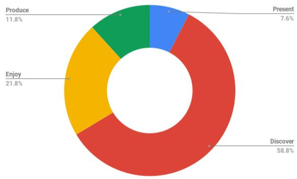  
Figure 6: Distribution of papers over tasks.

Figure 7 shows the distribution of papers over the inner class sub-tasks. For sake of simplicity, papers are categorized into the single most suitable category only, although some works touch on several categories. Natural Language Querying (45) is by far the sub-task with the highest amount of contributions followed by Keyword Search (15) and Visualization Description Generation (14). Less frequently studied tasks are Explanation Generation (3), Visual Question Answering (VQA) (3), and Documentation (1).

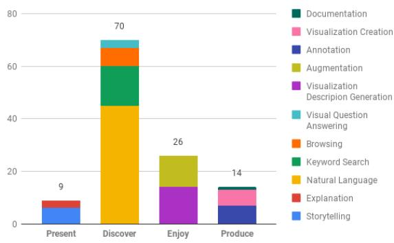  
Figure 7: Distribution of papers over sub-tasks.

Table 3 contains a comprehensive listing of the classification of the single contributions into the taxonomy by Brehmer and Munzner (2013).

Table 3: Classification of papers based on the Multi-Level Typology of Abstract Visualization Tasks by Brehmer and Munzner (2013).
<table><tr><td>Visualization Task Discover</td><td>Subtask Keyword Search</td><td>References</td></tr><tr><td rowspan="4"></td><td></td><td>(Feng et al., 2018; Chowdhury et al., 2021; Chung et al., 2010; Fraser et al., 2020; Wilson et al., 2010; Schleußinger and Henkel, 2018; Isaacs et al., 2014; Peltonen et al., 2017; Siddiqui and Hoque, 2020)</td></tr><tr><td>VQA Querying</td><td>(Singh and Shekhar, 2020; Mathew et al., 2021; Chaudhry et al., 2020) (Srinivasan et al., 2020b; Srinivasan and Stasko, 2017; Kassel and Rohs, 2019; Crovari et al., 2020; Tory and Setlur, 2019; Hearst and Tory, 2019; Liu et al., 2021; Hoque et al., 2018; Setlur and Tory, 2017; Siddiqui, 2021; Bacci et al., 2020; Narecha-</td></tr><tr><td></td><td>nia et al., 2021; Yu and Silva, 2020; Setlur et al., 2016; Sun et al., 2014; Aurisano et al., 2016; Srini- vasan et al., 2021b, 2019a; Gao et al., 2015; Setlur et al., 2019; Hearst et al., 2019; Setlur and Ku- mar, 2020; Choi et al., 2019b,a; Sperrle et al., 2020, 2021; El-Assady et al., 2020; Kumar et al., 2020a; Aurisano et al., 2015; Turkay and Henkin, 2018; Mazumder and Riva, 2021; Lawrence and Riezler, 2016; Shao and Nakashole, 2020; Wang et al., 2021; Manuvinakurike et al., 2018; Fast et al., 2018; Kassel and Rohs, 2018; Bieliauskas and Schreiber, 2017; Seipel et al., 2019; Lee and Parameswaran, 2018; Kumar et al., 2020b; Srini-</td></tr><tr><td>Browsing</td><td>vasan and Stasko, 2018; Kim et al., 2021c; Srini- vasan et al., 2020a: Kumar et al., 2017: Srinivasan et al., 2021a; Hu et al., 2018; Langevin et al., 2018; Reicherts and Rogers, 2020; John et al., 2017) (Setlur et al., 2020; Lee et al., 2021; Luo et al., 2018; de Araújo Lima and Barbosa, 2020; Luo et al., 2020; Srinivasan and Setlur, 2021; Cui et al., 2019; Dhamdhere et al., 2017) (Srinivasan et al., 2019b; Hullman et al., 2013; Xia et al., 2020; Gao et al., 2014; Kandogan, 2012; Chen et al., 2020c,a; Lai et al., 2020; Bylinskii</td></tr><tr><td>Enjoy</td><td>Augmentation Description Generation</td><td>et al., 2017; Madan et al., 2018; Lallé et al., 2021; Latif and Beck, 2019) (Demir et al., 2012; Moraes et al., 2014; Spreafico and Carenini, 2020; Qian et al., 2021b; Murillo- Morales and Miesenberger, 2020; Kim et al., 2021a; Lundgard and Satyanarayan, 2021; Kim et al., 2021b; Jung et al., 2021; Choi et al., 2019c; Obeid and Hoque, 2020; Hsu et al., 2021; Henkin and Turkay, 2020; Liu et al., 2020) Continued on next page</td></tr><tr><td colspan="3"></td></tr><tr><td>Visualization Task</td><td>Subtask</td><td>References</td></tr><tr><td rowspan="2">Present</td><td>Storytelling</td><td>(Bryan et al., 2017; Kwon et al., 2014; Metoyer et al., 2018; Choudhry et al., 2021; Shi et al., 2021;</td></tr><tr><td>Explanation Generation</td><td>Chen et al., 2020b) (Sevastjanova et al., 2018; Hohman et al., 2019; von Landesberger et al., 2021)</td></tr><tr><td rowspan="2">Produce</td><td>Annotation</td><td>(Chen et al., 2010b,a; Vanhulst et al., 2021; Sper- rle et al., 2019; Latif et al., 2018; Ren et al., 2017; Latif et al., 2021)</td></tr><tr><td>Documentation Visualization Creation</td><td>(Nafari and Weaver, 2013, 2015) (Rashid et al., 2021; Cui et al., 2020; Qian et al., 2021a; Fulda et al., 2016; Xia, 2020)</td></tr></table>

## C Analysis Details

The language-based interaction implemented in the visualization applications is analyzed considering their initiative, duration and communicativefunctions present in the human-machine dialogue based on the DIT++ taxonomy of dialogue acts by Bunt (2009). The idea is to create an overview of how the modeled interactions in the respective tasks and sub-tasks are structured. The variables considered in the study and the definitions used for them are explained below. Only contributions that present systems that implement human-machine interaction are part of this examination, theoretical works are excluded. Table 6 contains a comprehensive listing of all contributions evaluated as well as their respective investigation results.

## C.1 NLP Methods

For all papers in the selection, the NLP methods used, if any, and if named the NLP toolkits used for implementation are elaborated. For the sake of clarity, the methods are roughly divided into two areas: Natural Language Understanding (NLU) and Natural Language Generation (NLG). Due to the fact, that the majority of the systems use standard NLP methods such as tokenization, stemming, or stopword removal in text pre-processing, these are not recorded separately.

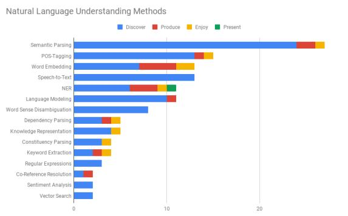  
Figure 8: Distribution of NLU methods per task.

Figure 8 shows the distribution of applied NLU methods over the four visualization tasks. It can be seen, that in the discover task the largest variety of methods is applied. Predominantly used are Semantic Parsing, POS-Tagging, and Speech-to-Text methods followed by Language Modeling and Word Sense Disambiguation. Interfaces in produce to a greater extend rely on Word Embedding and Named Entity Recognition (NER). The enjoy task similar to discover employs a variety of methods.

At present, NLU methods are only used to a minor extent.

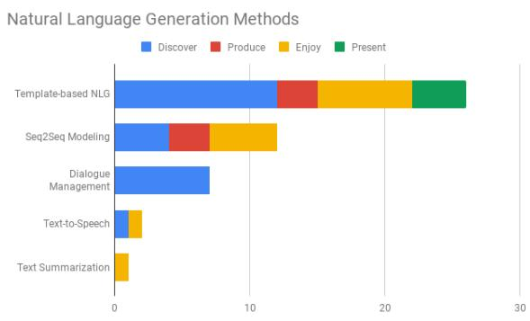  
Figure 9: Distribution of NLG methods per task.

Figure 9 illustrates the distribution of applied NLG methods over the four abstract visualization tasks. Template-based NLG methods are predominantly used to generate text in all tasks at hand. In the enjoy task Seq2Seq Modeling based on deep learning technologies is primarily used presumably due to the proximity to the common NLP task of Image Captioning. The same probably applies to the task of text summarization, which is also carried out. Dialogue Management is only applied in discover, mostly relying on rule-based or probabilistic modeling methods, e.g., by leveraging Finite-State-Machine (FSM) approaches to manage the sequence of dialogue acts. A small number of systems in discover and enjoy rely on Text-to-Speech technologies in the interaction.

NLP Toolkits. An overview of the applied toolkits in NLU is shown in Table 4. Especially Stanford Core NLP, ANTLR, SpaCy, and NLTK are found to accomplish several tasks. Word2Vec is the most popular embedding method, followed by FastText. The Web Speech API is used primarily because many visualization applications use web technologies. It is striking that many systems rely on Ngram language models. In terms of Word Sense Disambiguation, WordNet experiences great popularity.

An overview of the applied toolkits in NLG is illustrated in Table 4. The markup language for chatbots AIML as well as the Rasa toolkit are adopted for Template-based text generation, as well as handcrafted Context-Free-Grammars. LL\* Parsers are predominantly applied in the generation of autocompletions. Seq2Seq Modeling is experiencing increasing interest expressed through the adoption of deep learning models such as different variants of LSTM and Transformers. It is striking that, in addition to ready-made toolkits such as Rasa and mark-up languages such as AIML for Dialogue Management, Finite-State-Machines are also predominantly used.

<table><tr><td>NLU Method Semantic Pars-</td><td>Toolkits and Technologies ANTLR (4),</td><td></td></tr><tr><td>ing</td><td>Grammars(CFG) (3), NLTK (3), Stanford (2), AIML (2), IBM Wat- son, NL4DV Toolkit, SpaCy, Google Cloud Natural Lan- guage API, API, Conditional Random</td><td>Context-Free- Core NLP OpenCalais Fields (CRF), Wit.ai, Stanford</td></tr><tr><td>POS-Tagging</td><td>SEMPRE Stanford Core NLP (6), SpaCy (3), ClearNLP, Rasa, Compro- mise JS</td><td></td></tr><tr><td>Word Embed- ding</td><td>Word2Vec (8), (3), GloVe (2), Sent2Vec, BERT Embedding</td><td>FastText TF-IDF(2),</td></tr><tr><td>Speech-to- Text</td><td>Web Speech API (8), Mi- crosoft Speech API (3), Google Speech API (2), Apple Speech</td><td></td></tr><tr><td>NER</td><td>Framework Stanford Core Chrono JS, Toolkit, Wikifier, OpenCalais</td><td>NLP (3), Google NLP</td></tr><tr><td>Language Modeling</td><td>N-Gram Language Model (6), BERT (4), Bidirectional LSTM (2)</td><td>API, TimeML, TERNIP</td></tr><tr><td>Word Sense Disambigua- tion</td><td>WordNet (6), ceptNet, FrameNet</td><td>VerbNet, Con-</td></tr><tr><td>Dependency Parsing</td><td>Stanford Core Apache OpenNLP, SpaCy</td><td>NLP (3),</td></tr><tr><td>Knowledge Representation</td><td>RDF (2), Wolfram Alpha Unit Taxonomy, SIMON</td><td></td></tr><tr><td>Constituency Parsing Keyword Ex- traction</td><td>ANTLR (2), Stanford Core NLP TF-IDF (3)</td><td></td></tr><tr><td>Co-Reference Resolution</td><td>CogCompNLP</td><td></td></tr><tr><td>Sentiment Analysis Vector Search</td><td>Stanford Core NLP, LSTM Word2Vec (2), TF-IDF</td><td></td></tr></table>

Table 4: NLP Toolkits and Technologies used for NLU and how often they are used in the visualization applications.

<table><tr><td>NLG Method</td><td>Toolkits and Technologies</td></tr><tr><td>Template- based NLG</td><td>AIML, Rasa, LL* Parser, Context-Free-Grammars (CFG), IBM Watson</td></tr><tr><td>Seq2Seq Mod- eling</td><td>LSTM (3), LSTM+Attention (2), CNN+Conditional Ran- dom Fields (CRF) (2), Trans- former, M4C, LayoutLM, Im- age Transformer, Bidirectional LSTM</td></tr><tr><td>Dialogue Man- agement</td><td>Finite-State-Machines (FSM) (2), AIML , Rasa, IBM Watson</td></tr><tr><td>Text-to- Speech</td><td>Microsoft TTS</td></tr><tr><td>Text- Summarization</td><td>PageRank Algorithm</td></tr></table>

Table 5: NLP Toolkits and Technologies used for NLG and how often they are used in the visualization applications.

## C.2 Initiative

In an interaction, the initiative is taken by the actor that leads or controls the dialogue, e.g., via questions. McTear (2002) classifies initiative into user initiative, system initiative, and mixed- initiative. Litman and Pan (2004) mark, that the initiative within a dialogue determines the set of possible questions and responses of user and system and therefore the outline of the dialogue. Considering the initiator, the classification of McTear (2002) is used as a basis for the classification including the three general categories:

User Initiative. Language-based interactions are classified as user-initiated when the direction of the dialog is determined by the user’s actions, in this case, written- or spoken utterances or other text input. The conversation is usually conducted through commands or questions. In addition to prior works (McTear, 2002; Litman and Pan, 2004) considering visualization-oriented dialogue the data-related intent depicts an important factor for a user to take the initiative. Exemplary, this happens when users initiate a conversation by formulating a query to discover new insights about

System Initiative. System-initiated language-based interactions are determined by natural language utterances generated by the system. The system creates the outline of the interaction towards a previously determined goal. The user is led towards the goal and if the goal is achieved the visualization task is completed. An exemplary case is a system guiding a user in a step-by-step tutorial through the execution of a task, e.g., the identification and elimination of outliers in a visualization.

Mixed Initiative. In mixed-initiated language-based interaction users and systems at different times and to different proportions contribute to the determination of the interaction. In a visualization context both follow a data-related intent but the way there is characterized by negotiation, proposals, and agreement and disagreement. Exemplary this is the case during interactive clustering where user and system propose different divisions of the data space to each other negotiating a good classification for the underlying data.

To carry out the classification an interaction is considered to be single-initiated (= user initiative or system initiative only) if during the whole completion of the visualization task the same actor is initiating. If the initiative changes at least once the interaction is classified as mixed-initiative interaction. The scaling of the visualizations is normalized to 100 percent.

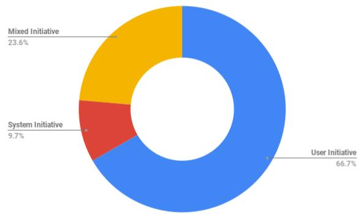  
Figure 10: Distribution of initiative over all papers.

Figure 10 shows the distribution of initiative over all included papers in the study. In the set of contributions, user-initiated interactions are predominant, followed by mixed-initiative interactions. Only about ten percent of the interactions are system-

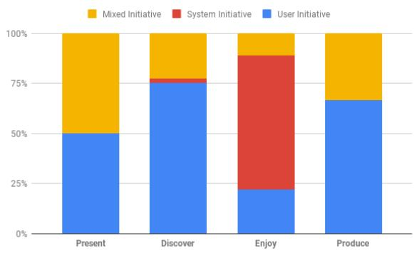  
Figure 11: Distribution of initiative over tasks.

The distribution of the initiative within the individual visualization tasks is illustrated in Figure 11. In discover and produce user-initiated interactions are predominant. The present task contains a balanced ratio of user- and mixed-initiated interactions. The enjoy task is the only task, where system-initiated interactions represent the majority.

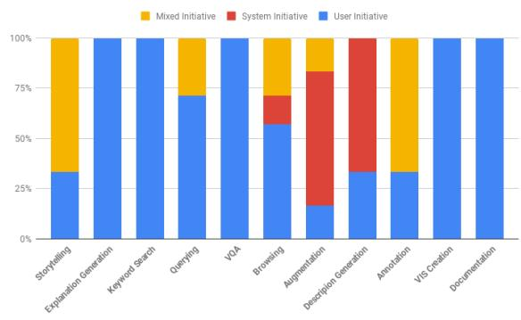  
Figure 12: Distribution of initiative over sub-tasks.

Figure 12 shows the distribution of initiative within the single sub-task categories. Users initiate the interactions in Keyword Search, Explanation Generation, VQA, Visualization Creation, and Documentation. System initiative is present in Augmentation, Visualization Description Generation, and Browsing. Mixed initiative interaction is modeled in Annotation, Storytelling and less frequently in Natural Language Querying, Browsing, and Augmentation.

## C.3 Duration

Within dialogue modeling, natural language-based interactions are modeled as a sequence of dialogue turns. In their survey Deriu et al. (2020) propose a characterization of dialogue system types as task-oriented dialogue systems, conversational agents, and interactive QA systems. The basis for this classification is differences in the dialogue structures supported by the different systems, especially in their duration and task-orientedness. Interactive QA systems are considered task-related single- or multi-turn systems. Task-oriented dialogue systems are considered multi-turn systems with short interaction lengths due to the optimization goal. Conversational agents are classified as non-task-oriented multi-turn systems with long interaction lengths. The decision for single- or multi-turn dialogue systems in a visualization-oriented dialogue is a conceptual one that V-NLI designers have to make concerning the quality measure that is set on the system. Single turn systems, e.g., hold higher risks in failing to resolve ambiguities or vague expressions from a single query than multi-turn systems that can pose requests, but also deliver the result in the quickest possible way.

Depending on the visualization task and sub-task at hand, the interaction structures differ. To carry out a uniform duration classification we consider the length of the human-machine dialogue, that is modeled by the application as the decisive criterion. Therefore, interactions that include more than a single utterance in the calculation of the next response (e.g. by including the dialogue history in context management) and interactions that support more than one dialogue turn for users and system respectively are considered multi-turn. An interaction is considered to be single-turn if user and system utter at maximum one utterance respectively in a coherent dialogue.

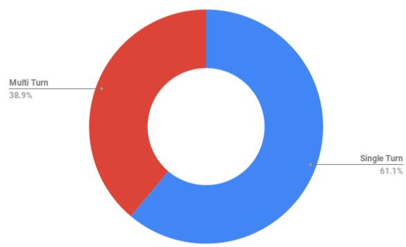  
Figure 13: Distribution of duration over all papers.

Figure 13 shows that the modeled interactions in almost two-thirds are single turn and one-third are multi-turn.

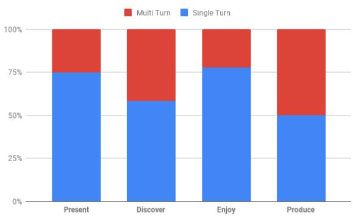  
Figure 14: Distribution of duration over tasks.

On the task level, in present and enjoy interactions are predominantly single-turned (see Figure 14). In the discover and produce task the ratio of multi- to single turn interactions is rather balanced.

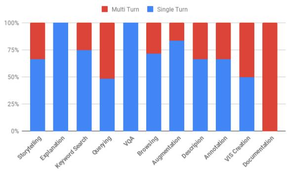  
Figure 15: Distribution of duration over sub-tasks.

Figure 15 illuminates the distribution of duration on a sub-task level. Explanation Generation and VQA are modeled in single turn interactions similar to Keyword Search, Augmentation, and Browsing. Multi-turn interactions are found predominantly in Natural Language Querying, Visualization Creation, and Documentation.

## C.4 Communicative Functions

Bunt (2009) introduces a taxonomy for dialogue act classification. Following that, each individual speech act in a conversation is classified due to the communicative function it carries. On a high level, these general-purpose functions distinguish speech acts as that every individual turn carries either information providing, information seeking, commissive or directive functionality. Especially since visualization-oriented interactions are multimodal designers of V-NLI have to decide which communicative functions are adopted by visual elements as a complementary modality to language in multi-modal dialogue. The examination of communicative functions in the applications at hand is carried out with the idea in mind of gaining an overview of who holds which share of which communicative function in the modeled dialogues. The aim is to help to better characterize and compare the dialogues in the individual tasks and sub-tasks. For contributions that provide access to exemplary human-machine dialogues either within the paper or the supplemental material the presence of each of the communicative functions information providing, information seeking, commissive, or directive is detected for user and system respectively (see Table 6). The representation of the identified communicative functions is in absolute quantities for the respective sub-task under consideration.

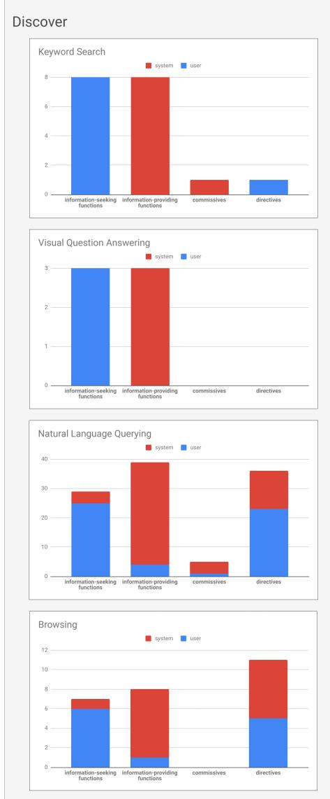

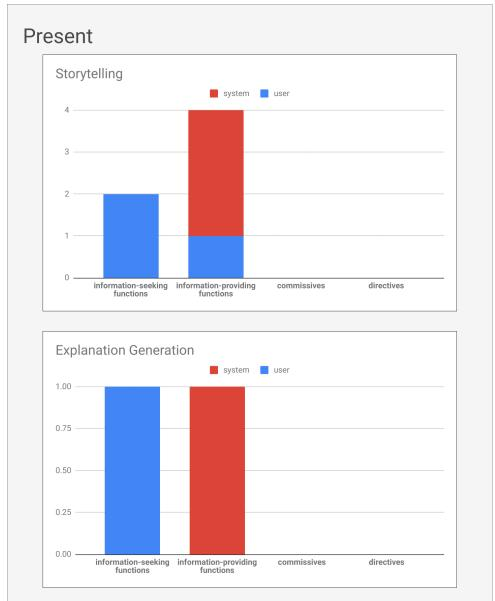  
Figure 16: Distribution of communicative functions in task present.

Figure 16 shows the characteristic distribution of communicative functions for the task present and its respective sub-tasks. It turns out that in these interactions systems predominantly provide users with information. In Visual Storytelling the user and the system complement each other in different modalities, textual and visual, to jointly present visual insights in the form of a multi-modal story. Explanation Generation is characterized by users who are looking for an explanation for a certain behaviour, which can be understood more easily with the help of a visualization and a generated text description acting as a guide.

Figure 17 illuminates the shares of communicative functions in the visualization task discover and the

Figure 17: Distribution of communicative functions in task discover.

respective sub-tasks. It shows that interactions in Keyword Search and Visual Question Answering are predominantly characterized by users seeking information and systems providing those to the user. In Keyword Search commissives are occasionally uttered by the system to respond to user-induced directives in dialogue. Visual Question Answering follows the classic question-answer scheme in which users bundle their search for information in a question and systems provide textual answers that can be substantiated by the visualization. Natural Language Querying and Browsing contain a more variable profile of communicative functions which also accommodate higher numbers of directives such as, e.g., system-generated suggestions used to pose recommendations to the user in Browsing or commands in Natural Language Querying applied by users to make the system execute an action. Interestingly, commissive utterances occur especially in longer analytical conversations, for example, to confirm the loading of a data set or to acknowledge the perception of a command given by the user. When looking at the distribution of communicative functions in Browsing, it becomes clear that the system tries to facilitate the user’s entry into visual exploration by providing additional information or directives.

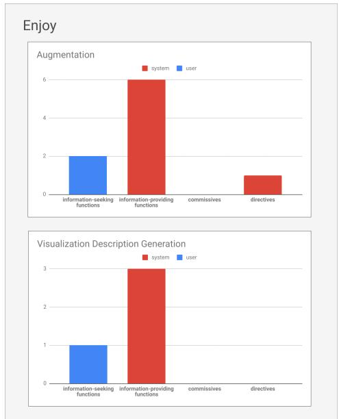  
Figure 18: Distribution of communicative functions in task enjoy.

The enjoy task is characterized through systems providing the user with additional information as well as occasional directives in the Augmentation task (see Figure 18). Users occasionally ask for information, but the bulk of the interaction consists of the system presenting information to the user or suggesting directives for future interaction. In Visualization Description Generation, the special focus of systems is on providing information to visually impaired people. Describing scenes from a visualization in detail so that visually impaired people can perceive them in their full detail requires highquality text generation that goes beyond standard image captioning.

Interactions in the context of artifact production deliver diverse profiles of communicative functions, as shown in Figure 19. Annotation is characterized by users providing information, e.g., in form of text labels and systems that direct the user, e.g., by making suggestions where to put those. Interactions in Visualization Creation face user and system contributing information as well as systems delivering additional suggestions for the next step in the creation process. In Documentation, systems provide textual information in form of a report during or after a user interaction with a visual model.

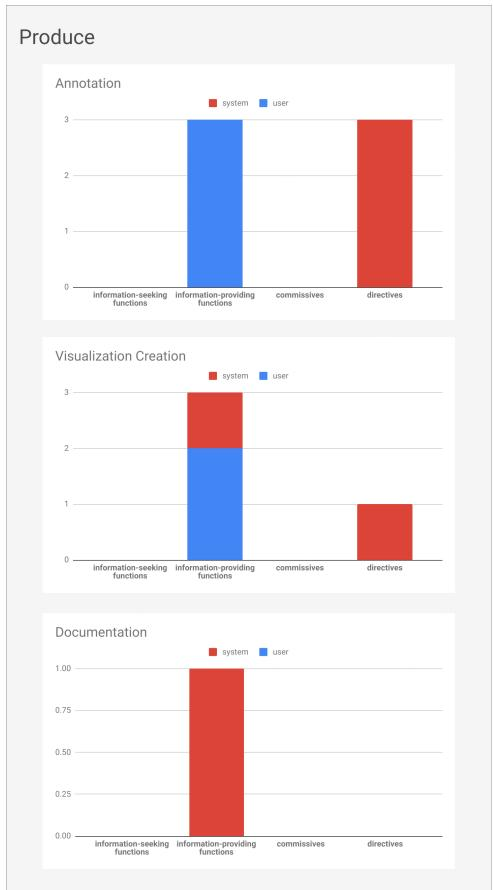  
Figure 19: Distribution of communicative functions in task produce.

Table 6: Table of references to contributions included in the study sorted according to the abstract visualization task (Task) and sub-task (Sub). Contributions within the same task category share the same color base. Categories the works are evaluated on are duration (Dur), initiative (Init), and present communicative functions (CF), respectively for user (CF - User) and system (CF - System). The individual communicative functions that are investigated are information seeking (IS), information providing (IP), commissives (CM), and directives (DI).
<table><tr><td colspan="1" rowspan="1">References</td><td colspan="1" rowspan="1">Task</td><td colspan="1" rowspan="1">Sub</td><td colspan="1" rowspan="1">Dur</td><td colspan="1" rowspan="1">Init</td><td colspan="8" rowspan="3">CF - User            CF - SystemIS IP CM DI  IS IP CM DI</td></tr><tr><td colspan="1" rowspan="1"></td><td colspan="1" rowspan="1"></td><td colspan="1" rowspan="1"></td><td colspan="1" rowspan="1"></td><td colspan="1" rowspan="1"></td></tr><tr><td colspan="1" rowspan="1">Bryan et al. (2017)</td><td colspan="1" rowspan="1">Pre</td><td colspan="1" rowspan="1">Sto</td><td colspan="1" rowspan="1">MT</td><td colspan="1" rowspan="1">MI</td><td colspan="1" rowspan="1">x</td><td colspan="1" rowspan="1">√</td><td colspan="1" rowspan="1">x</td><td colspan="1" rowspan="1">x</td><td colspan="1" rowspan="1">x</td><td colspan="1" rowspan="1">√</td><td colspan="1" rowspan="1">x</td><td colspan="1" rowspan="1">x</td></tr><tr><td colspan="1" rowspan="1">Kwon et al. (2014)</td><td colspan="1" rowspan="1">Pre</td><td colspan="1" rowspan="1">Sto</td><td colspan="1" rowspan="1">ST</td><td colspan="1" rowspan="1">UI</td><td colspan="1" rowspan="1">√</td><td colspan="1" rowspan="1">X</td><td colspan="1" rowspan="1">X</td><td colspan="1" rowspan="1">x</td><td colspan="1" rowspan="1">X</td><td colspan="1" rowspan="1">✓</td><td colspan="1" rowspan="1">X</td><td colspan="1" rowspan="1">X</td></tr><tr><td colspan="1" rowspan="1">Metoyer et al. (2018)</td><td colspan="1" rowspan="1">Pre</td><td colspan="1" rowspan="1">Sto</td><td colspan="1" rowspan="1">ST</td><td colspan="1" rowspan="1">MI</td><td colspan="1" rowspan="1">✓</td><td colspan="1" rowspan="1">X</td><td colspan="1" rowspan="1">X</td><td colspan="1" rowspan="1">x</td><td colspan="1" rowspan="1">x</td><td colspan="1" rowspan="1">✓</td><td colspan="1" rowspan="1">x</td><td colspan="1" rowspan="1">X</td></tr><tr><td colspan="1" rowspan="1">Hohman et al. (2019)</td><td colspan="1" rowspan="1">Pre</td><td colspan="1" rowspan="1">Exp</td><td colspan="1" rowspan="1">ST</td><td colspan="1" rowspan="1">UI</td><td colspan="1" rowspan="1">✓</td><td colspan="1" rowspan="1">X</td><td colspan="1" rowspan="1">X</td><td colspan="1" rowspan="1">X</td><td colspan="1" rowspan="1">X</td><td colspan="1" rowspan="1">✓</td><td colspan="1" rowspan="1">X</td><td colspan="1" rowspan="1">X</td></tr><tr><td colspan="1" rowspan="1">Feng et al. (2018)</td><td colspan="1" rowspan="1">Dis</td><td colspan="1" rowspan="1">Key</td><td colspan="1" rowspan="1">ST</td><td colspan="1" rowspan="1">UI</td><td colspan="1" rowspan="1">1</td><td colspan="1" rowspan="1">X</td><td colspan="1" rowspan="1">X</td><td colspan="1" rowspan="1">X</td><td colspan="1" rowspan="1">X</td><td colspan="1" rowspan="1">V</td><td colspan="1" rowspan="1">X</td><td colspan="1" rowspan="1">X</td></tr><tr><td colspan="1" rowspan="1">Chowdhury et al. (2021)</td><td colspan="1" rowspan="1">Dis</td><td colspan="1" rowspan="1">Key</td><td colspan="1" rowspan="1">MT</td><td colspan="1" rowspan="1">UI</td><td colspan="1" rowspan="1">√</td><td colspan="1" rowspan="1">x</td><td colspan="1" rowspan="1">x</td><td colspan="1" rowspan="1">x</td><td colspan="1" rowspan="1">x</td><td colspan="1" rowspan="1">√</td><td colspan="1" rowspan="1">X</td><td colspan="1" rowspan="1">X</td></tr><tr><td colspan="1" rowspan="1">Chung et al. (2010)</td><td colspan="1" rowspan="1">Dis</td><td colspan="1" rowspan="1">Key</td><td colspan="1" rowspan="1">ST</td><td colspan="1" rowspan="1">UI</td><td colspan="1" rowspan="1">√</td><td colspan="1" rowspan="1">X</td><td colspan="1" rowspan="1">X</td><td colspan="1" rowspan="1">x</td><td colspan="1" rowspan="1">X</td><td colspan="1" rowspan="1">√</td><td colspan="1" rowspan="1">X</td><td colspan="1" rowspan="1">x</td></tr><tr><td colspan="1" rowspan="1">Fraser et al. (2020)</td><td colspan="1" rowspan="1">Dis</td><td colspan="1" rowspan="1">Key</td><td colspan="1" rowspan="1">ST</td><td colspan="1" rowspan="1">UI</td><td colspan="1" rowspan="1">√</td><td colspan="1" rowspan="1">x</td><td colspan="1" rowspan="1">x</td><td colspan="1" rowspan="1">√</td><td colspan="1" rowspan="1">x</td><td colspan="1" rowspan="1">√</td><td colspan="1" rowspan="1">√</td><td colspan="1" rowspan="1">X</td></tr><tr><td colspan="1" rowspan="1">Schleußinger (2018)</td><td colspan="1" rowspan="1">Dis</td><td colspan="1" rowspan="1">Key</td><td colspan="1" rowspan="1">ST</td><td colspan="1" rowspan="1">UI</td><td colspan="1" rowspan="1">√</td><td colspan="1" rowspan="1">X</td><td colspan="1" rowspan="1">X</td><td colspan="1" rowspan="1">X</td><td colspan="1" rowspan="1">X</td><td colspan="1" rowspan="1">V</td><td colspan="1" rowspan="1">X</td><td colspan="1" rowspan="1">X</td></tr><tr><td colspan="1" rowspan="1">Isaacs et al. (2014)</td><td colspan="1" rowspan="1">Dis</td><td colspan="1" rowspan="1">Key</td><td colspan="1" rowspan="1">MT</td><td colspan="1" rowspan="1">UI</td><td colspan="1" rowspan="1">√</td><td colspan="1" rowspan="1">x</td><td colspan="1" rowspan="1">x</td><td colspan="1" rowspan="1">x</td><td colspan="1" rowspan="1">x</td><td colspan="1" rowspan="1">√</td><td colspan="1" rowspan="1">x</td><td colspan="1" rowspan="1">x</td></tr><tr><td colspan="1" rowspan="1">Peltonen et al. (2017)</td><td colspan="1" rowspan="1">Dis</td><td colspan="1" rowspan="1">Key</td><td colspan="1" rowspan="1">ST</td><td colspan="1" rowspan="1">UI</td><td colspan="1" rowspan="1">√</td><td colspan="1" rowspan="1">X</td><td colspan="1" rowspan="1">X</td><td colspan="1" rowspan="1">x</td><td colspan="1" rowspan="1">X</td><td colspan="1" rowspan="1">√</td><td colspan="1" rowspan="1">X</td><td colspan="1" rowspan="1">X</td></tr><tr><td colspan="1" rowspan="1">Siddiqui and Hoque (2020)</td><td colspan="1" rowspan="1">Dis</td><td colspan="1" rowspan="1">Key</td><td colspan="1" rowspan="1">ST</td><td colspan="1" rowspan="1">UI</td><td colspan="1" rowspan="1">√</td><td colspan="1" rowspan="1">x</td><td colspan="1" rowspan="1">x</td><td colspan="1" rowspan="1">x</td><td colspan="1" rowspan="1">x</td><td colspan="1" rowspan="1">√</td><td colspan="1" rowspan="1">x</td><td colspan="1" rowspan="1">x</td></tr><tr><td colspan="1" rowspan="1">Singh and Shekhar (2020)</td><td colspan="1" rowspan="1">Dis</td><td colspan="1" rowspan="1">VQA</td><td colspan="1" rowspan="1">ST</td><td colspan="1" rowspan="1">UI</td><td colspan="1" rowspan="1">√</td><td colspan="1" rowspan="1">X</td><td colspan="1" rowspan="1">X</td><td colspan="1" rowspan="1">X</td><td colspan="1" rowspan="1">X</td><td colspan="1" rowspan="1">V</td><td colspan="1" rowspan="1">X</td><td colspan="1" rowspan="1">X</td></tr><tr><td colspan="1" rowspan="1">Mathew et al. (2021)</td><td colspan="1" rowspan="1">Dis</td><td colspan="1" rowspan="1">VQA</td><td colspan="1" rowspan="1">ST</td><td colspan="1" rowspan="1">UI</td><td colspan="1" rowspan="1">V</td><td colspan="1" rowspan="1">X</td><td colspan="1" rowspan="1">X</td><td colspan="1" rowspan="1">X</td><td colspan="1" rowspan="1">X</td><td colspan="1" rowspan="1">√</td><td colspan="1" rowspan="1">X</td><td colspan="1" rowspan="1">X</td></tr><tr><td colspan="1" rowspan="1">Chaudhry et al. (2020)</td><td colspan="1" rowspan="1">Dis</td><td colspan="1" rowspan="1">VQA</td><td colspan="1" rowspan="1">ST</td><td colspan="1" rowspan="1">UI</td><td colspan="1" rowspan="1">√</td><td colspan="1" rowspan="1">X</td><td colspan="1" rowspan="1">X</td><td colspan="1" rowspan="1">X</td><td colspan="1" rowspan="1">X</td><td colspan="1" rowspan="1">√</td><td colspan="1" rowspan="1">X</td><td colspan="1" rowspan="1">X</td></tr><tr><td colspan="1" rowspan="1">Choi et al. (2019b)</td><td colspan="1" rowspan="1">Dis</td><td colspan="1" rowspan="1">Que</td><td colspan="1" rowspan="1">ST</td><td colspan="1" rowspan="1">UI</td><td colspan="1" rowspan="1">√</td><td colspan="1" rowspan="1">X</td><td colspan="1" rowspan="1">X</td><td colspan="1" rowspan="1">X</td><td colspan="1" rowspan="1">X</td><td colspan="1" rowspan="1">✓</td><td colspan="1" rowspan="1">X</td><td colspan="1" rowspan="1">X</td></tr><tr><td colspan="1" rowspan="1">Choi et al. (2019a)</td><td colspan="1" rowspan="1">Dis</td><td colspan="1" rowspan="1">Que</td><td colspan="1" rowspan="1">ST</td><td colspan="1" rowspan="1">UI</td><td colspan="1" rowspan="1"></td><td colspan="1" rowspan="1">X</td><td colspan="1" rowspan="1">X</td><td colspan="1" rowspan="1">X</td><td colspan="1" rowspan="1">X</td><td colspan="1" rowspan="1">√</td><td colspan="1" rowspan="1">X</td><td colspan="1" rowspan="1">X</td></tr><tr><td colspan="1" rowspan="1">Liu et al. (2021)</td><td colspan="1" rowspan="1">Dis</td><td colspan="1" rowspan="1">Que</td><td colspan="1" rowspan="1">ST</td><td colspan="1" rowspan="1">UI</td><td colspan="1" rowspan="1">L</td><td colspan="1" rowspan="1">X</td><td colspan="1" rowspan="1">X</td><td colspan="1" rowspan="1">X</td><td colspan="1" rowspan="1">X</td><td colspan="1" rowspan="1">✓</td><td colspan="1" rowspan="1">X</td><td colspan="1" rowspan="1">X</td></tr><tr><td colspan="1" rowspan="1">Hoque et al. (2018)</td><td colspan="1" rowspan="1">Dis</td><td colspan="1" rowspan="1">Que</td><td colspan="1" rowspan="1">MT</td><td colspan="1" rowspan="1">UI</td><td colspan="1" rowspan="1">√</td><td colspan="1" rowspan="1">X</td><td colspan="1" rowspan="1">X</td><td colspan="1" rowspan="1">X</td><td colspan="1" rowspan="1">X</td><td colspan="1" rowspan="1">√</td><td colspan="1" rowspan="1">X</td><td colspan="1" rowspan="1">X</td></tr><tr><td colspan="1" rowspan="1">Siddiqui (2021)</td><td colspan="1" rowspan="1">Dis</td><td colspan="1" rowspan="1">Que</td><td colspan="1" rowspan="1">ST</td><td colspan="1" rowspan="1">UI</td><td colspan="1" rowspan="1">√</td><td colspan="1" rowspan="1">X</td><td colspan="1" rowspan="1">X</td><td colspan="1" rowspan="1">X</td><td colspan="1" rowspan="1">X</td><td colspan="1" rowspan="1">1</td><td colspan="1" rowspan="1">X</td><td colspan="1" rowspan="1">X</td></tr><tr><td colspan="1" rowspan="1">Bacci et al. (2020)</td><td colspan="1" rowspan="1">Dis</td><td colspan="1" rowspan="1">Que</td><td colspan="1" rowspan="1">ST</td><td colspan="1" rowspan="1">UI</td><td colspan="1" rowspan="1">✓</td><td colspan="1" rowspan="1">X</td><td colspan="1" rowspan="1">X</td><td colspan="1" rowspan="1">X</td><td colspan="1" rowspan="1">X</td><td colspan="1" rowspan="1">V</td><td colspan="1" rowspan="1">X</td><td colspan="1" rowspan="1">X</td></tr><tr><td colspan="1" rowspan="1">Narechania et al. (2021)</td><td colspan="1" rowspan="1">Dis</td><td colspan="1" rowspan="1">Que</td><td colspan="1" rowspan="1">ST</td><td colspan="1" rowspan="1">UI</td><td colspan="1" rowspan="1">√</td><td colspan="1" rowspan="1">X</td><td colspan="1" rowspan="1">X</td><td colspan="1" rowspan="1">X</td><td colspan="1" rowspan="1">X</td><td colspan="1" rowspan="1">√</td><td colspan="1" rowspan="1">X</td><td colspan="1" rowspan="1">X</td></tr><tr><td colspan="1" rowspan="1">Yu and Silva (2020)</td><td colspan="1" rowspan="1">Dis</td><td colspan="1" rowspan="1">Que</td><td colspan="1" rowspan="1">MT</td><td colspan="1" rowspan="1">UI</td><td colspan="1" rowspan="1">x</td><td colspan="1" rowspan="1">X</td><td colspan="1" rowspan="1">X</td><td colspan="1" rowspan="1">√</td><td colspan="1" rowspan="1">x</td><td colspan="1" rowspan="1">√</td><td colspan="1" rowspan="1">X</td><td colspan="1" rowspan="1">X</td></tr><tr><td colspan="1" rowspan="1">Setlur et al. (2016)</td><td colspan="1" rowspan="1">Dis</td><td colspan="1" rowspan="1">Que</td><td colspan="1" rowspan="1">MT</td><td colspan="1" rowspan="1">UI</td><td colspan="1" rowspan="1">√</td><td colspan="1" rowspan="1">X</td><td colspan="1" rowspan="1">X</td><td colspan="1" rowspan="1">V</td><td colspan="1" rowspan="1">X</td><td colspan="1" rowspan="1">✓</td><td colspan="1" rowspan="1">X</td><td colspan="1" rowspan="1">X</td></tr><tr><td colspan="1" rowspan="1">Sun et al. (2014)</td><td colspan="1" rowspan="1">Dis</td><td colspan="1" rowspan="1">Que</td><td colspan="1" rowspan="1">ST</td><td colspan="1" rowspan="1">UI</td><td colspan="1" rowspan="1">√</td><td colspan="1" rowspan="1">X</td><td colspan="1" rowspan="1">X</td><td colspan="1" rowspan="1">√</td><td colspan="1" rowspan="1">X</td><td colspan="1" rowspan="1">√</td><td colspan="1" rowspan="1">X</td><td colspan="1" rowspan="1">X</td></tr><tr><td colspan="1" rowspan="1">Aurisano et al. (2016)</td><td colspan="1" rowspan="1">Dis</td><td colspan="1" rowspan="1">Que</td><td colspan="1" rowspan="1">MT</td><td colspan="1" rowspan="1">UI</td><td colspan="1" rowspan="1"></td><td colspan="1" rowspan="1">X</td><td colspan="1" rowspan="1">X</td><td colspan="1" rowspan="1">V</td><td colspan="1" rowspan="1">X</td><td colspan="1" rowspan="1">√</td><td colspan="1" rowspan="1">X</td><td colspan="1" rowspan="1">X</td></tr><tr><td colspan="1" rowspan="1">Srinivasan et al. (2019a)</td><td colspan="1" rowspan="1">Dis</td><td colspan="1" rowspan="1">Que</td><td colspan="1" rowspan="1">ST</td><td colspan="1" rowspan="1">MI</td><td colspan="1" rowspan="1">√</td><td colspan="1" rowspan="1">X</td><td colspan="1" rowspan="1">X</td><td colspan="1" rowspan="1"></td><td colspan="1" rowspan="1">X</td><td colspan="1" rowspan="1">√</td><td colspan="1" rowspan="1">X</td><td colspan="1" rowspan="1">√</td></tr><tr><td colspan="1" rowspan="1">Setlur and Kumar (2020)</td><td colspan="1" rowspan="1">Dis</td><td colspan="1" rowspan="1">Que</td><td colspan="1" rowspan="1">ST</td><td colspan="1" rowspan="1">UI</td><td colspan="1" rowspan="1">L</td><td colspan="1" rowspan="1">X</td><td colspan="1" rowspan="1">X</td><td colspan="1" rowspan="1">X</td><td colspan="1" rowspan="1">X</td><td colspan="1" rowspan="1">✓</td><td colspan="1" rowspan="1">X</td><td colspan="1" rowspan="1">X</td></tr><tr><td colspan="1" rowspan="1">Setlur et al. (2019)</td><td colspan="1" rowspan="1">Dis</td><td colspan="1" rowspan="1">Que</td><td colspan="1" rowspan="1">ST</td><td colspan="1" rowspan="1">UI</td><td colspan="1" rowspan="1">√</td><td colspan="1" rowspan="1">X</td><td colspan="1" rowspan="1">X</td><td colspan="1" rowspan="1">1</td><td colspan="1" rowspan="1">X</td><td colspan="1" rowspan="1">✓</td><td colspan="1" rowspan="1">X</td><td colspan="1" rowspan="1">X</td></tr><tr><td colspan="1" rowspan="1">Gao et al. (2015)</td><td colspan="1" rowspan="1">Dis</td><td colspan="1" rowspan="1">Que</td><td colspan="1" rowspan="1">ST</td><td colspan="1" rowspan="1">MI</td><td colspan="1" rowspan="1">√</td><td colspan="1" rowspan="1">X</td><td colspan="1" rowspan="1">X</td><td colspan="1" rowspan="1">1</td><td colspan="1" rowspan="1">X</td><td colspan="1" rowspan="1">√</td><td colspan="1" rowspan="1">X</td><td colspan="1" rowspan="1">√</td></tr><tr><td colspan="1" rowspan="1">John et al. (2017)</td><td colspan="1" rowspan="1">Dis</td><td colspan="1" rowspan="1">Que</td><td colspan="1" rowspan="1">MT</td><td colspan="1" rowspan="1">MI</td><td colspan="1" rowspan="1">L</td><td colspan="1" rowspan="1">√</td><td colspan="1" rowspan="1">√</td><td colspan="1" rowspan="1"></td><td colspan="1" rowspan="1">I</td><td colspan="1" rowspan="1">√</td><td colspan="1" rowspan="1">X</td><td colspan="1" rowspan="1">✓</td></tr><tr><td colspan="1" rowspan="1">Srinivasan et al. (2021a)</td><td colspan="1" rowspan="1">Dis</td><td colspan="1" rowspan="1">Que</td><td colspan="1" rowspan="1">ST</td><td colspan="1" rowspan="1">UI</td><td colspan="1" rowspan="1">x</td><td colspan="1" rowspan="1">X</td><td colspan="1" rowspan="1">X</td><td colspan="1" rowspan="1">è</td><td colspan="1" rowspan="1">X</td><td colspan="1" rowspan="1">V</td><td colspan="1" rowspan="1">x</td><td colspan="1" rowspan="1">X</td></tr><tr><td colspan="1" rowspan="1">Wang et al. (2021)</td><td colspan="1" rowspan="1">Dis</td><td colspan="1" rowspan="1">Que</td><td colspan="1" rowspan="1">MT</td><td colspan="1" rowspan="1">MI</td><td colspan="1" rowspan="1">X</td><td colspan="1" rowspan="1">X</td><td colspan="1" rowspan="1">X</td><td colspan="1" rowspan="1">√</td><td colspan="1" rowspan="1">1</td><td colspan="1" rowspan="1">✓</td><td colspan="1" rowspan="1">X</td><td colspan="1" rowspan="1">√</td></tr><tr><td colspan="1" rowspan="1">Shao and Nakashole (2020)</td><td colspan="1" rowspan="1">Dis</td><td colspan="1" rowspan="1">Que</td><td colspan="1" rowspan="1">MT</td><td colspan="1" rowspan="1">UI</td><td colspan="1" rowspan="1">X</td><td colspan="1" rowspan="1">X</td><td colspan="1" rowspan="1">X</td><td colspan="1" rowspan="1"></td><td colspan="1" rowspan="1">X</td><td colspan="1" rowspan="1">√</td><td colspan="1" rowspan="1">X</td><td colspan="1" rowspan="1">J</td></tr><tr><td colspan="1" rowspan="1">Srinivasan et al. (2020a)</td><td colspan="1" rowspan="1">Dis</td><td colspan="1" rowspan="1">Que</td><td colspan="1" rowspan="1">MT</td><td colspan="1" rowspan="1">UI</td><td colspan="1" rowspan="1">X</td><td colspan="1" rowspan="1">X</td><td colspan="1" rowspan="1">X</td><td colspan="1" rowspan="1">J</td><td colspan="1" rowspan="1">X</td><td colspan="1" rowspan="1">√</td><td colspan="1" rowspan="1">X</td><td colspan="1" rowspan="1">X</td></tr><tr><td colspan="1" rowspan="1">Mazumder and Riva (2021)</td><td colspan="1" rowspan="1">Dis</td><td colspan="1" rowspan="1">Que</td><td colspan="1" rowspan="1">ST</td><td colspan="1" rowspan="1">UI</td><td colspan="1" rowspan="1">X</td><td colspan="1" rowspan="1">X</td><td colspan="1" rowspan="1">X</td><td colspan="1" rowspan="1"></td><td colspan="1" rowspan="1">X</td><td colspan="1" rowspan="1">√</td><td colspan="1" rowspan="1">X</td><td colspan="1" rowspan="1">X</td></tr><tr><td colspan="1" rowspan="1">Lawrence and Riezler (2016)</td><td colspan="1" rowspan="1">Dis</td><td colspan="1" rowspan="1">Que</td><td colspan="1" rowspan="1">ST</td><td colspan="1" rowspan="1">UI</td><td colspan="1" rowspan="1">√</td><td colspan="1" rowspan="1">X</td><td colspan="1" rowspan="1">X</td><td colspan="1" rowspan="1">X</td><td colspan="1" rowspan="1">X</td><td colspan="1" rowspan="1">✓</td><td colspan="1" rowspan="1">X</td><td colspan="1" rowspan="1">X</td></tr><tr><td colspan="1" rowspan="1">Fast et al. (2018)</td><td colspan="1" rowspan="1">Dis</td><td colspan="1" rowspan="1">Que</td><td colspan="1" rowspan="1">MT</td><td colspan="1" rowspan="1">MI</td><td colspan="1" rowspan="1">√</td><td colspan="1" rowspan="1">√</td><td colspan="1" rowspan="1">X</td><td colspan="1" rowspan="1">√</td><td colspan="1" rowspan="1">√</td><td colspan="1" rowspan="1">✓</td><td colspan="1" rowspan="1">√</td><td colspan="1" rowspan="1">√</td></tr><tr><td colspan="1" rowspan="1">Kassel and Rohs (2018)</td><td colspan="1" rowspan="1">Dis</td><td colspan="1" rowspan="1">Que</td><td colspan="1" rowspan="1">MT</td><td colspan="1" rowspan="1">UI</td><td colspan="1" rowspan="1">✓</td><td colspan="1" rowspan="1">X</td><td colspan="1" rowspan="1">X</td><td colspan="1" rowspan="1">√</td><td colspan="1" rowspan="1">X</td><td colspan="1" rowspan="1">✓</td><td colspan="1" rowspan="1">√</td><td colspan="1" rowspan="1">X</td></tr><tr><td colspan="1" rowspan="1">Kumar et al. (2020a)</td><td colspan="1" rowspan="1">Dis</td><td colspan="1" rowspan="1">Que</td><td colspan="1" rowspan="1">MT</td><td colspan="1" rowspan="1">UI</td><td colspan="1" rowspan="1">√</td><td colspan="1" rowspan="1">X</td><td colspan="1" rowspan="1">X</td><td colspan="1" rowspan="1"></td><td colspan="1" rowspan="1">X</td><td colspan="1" rowspan="1">√</td><td colspan="1" rowspan="1">X</td><td colspan="1" rowspan="1">X</td></tr><tr><td colspan="1" rowspan="1">Dhamdhere et al. (2017)</td><td colspan="1" rowspan="1">Dis</td><td colspan="1" rowspan="1">Que</td><td colspan="1" rowspan="1">MT</td><td colspan="1" rowspan="1">UI</td><td colspan="1" rowspan="1">√</td><td colspan="1" rowspan="1">X</td><td colspan="1" rowspan="1">X</td><td colspan="1" rowspan="1">√</td><td colspan="1" rowspan="1">X</td><td colspan="1" rowspan="1">✓</td><td colspan="1" rowspan="1">X</td><td colspan="1" rowspan="1">7</td></tr><tr><td colspan="1" rowspan="1">Continued on next page</td><td colspan="1" rowspan="1"></td><td colspan="1" rowspan="1"></td><td colspan="1" rowspan="1"></td><td colspan="1" rowspan="1"></td><td colspan="1" rowspan="1"></td><td colspan="1" rowspan="1"></td><td colspan="1" rowspan="1"></td><td colspan="1" rowspan="1"></td><td colspan="1" rowspan="1"></td><td colspan="1" rowspan="1"></td><td colspan="1" rowspan="1"></td><td colspan="1" rowspan="1"></td></tr><tr><td colspan="1" rowspan="1">Manuvinakurike et al. (2018)</td><td colspan="1" rowspan="1">Dis</td><td colspan="1" rowspan="1">Que</td><td colspan="1" rowspan="1">MT</td><td colspan="1" rowspan="1">UI</td><td colspan="1" rowspan="1">X</td><td colspan="1" rowspan="1"></td><td colspan="1" rowspan="1">X</td><td colspan="1" rowspan="1"></td><td colspan="1" rowspan="1">X</td><td colspan="1" rowspan="1"></td><td colspan="1" rowspan="1"></td><td colspan="1" rowspan="1">X</td></tr><tr><td colspan="1" rowspan="1">Seipel et al. (2019)</td><td colspan="1" rowspan="1">Dis</td><td colspan="1" rowspan="1">Que</td><td colspan="1" rowspan="1">ST</td><td colspan="1" rowspan="1">UI</td><td colspan="1" rowspan="1">√</td><td colspan="1" rowspan="1">X</td><td colspan="1" rowspan="1">X</td><td colspan="1" rowspan="1">√</td><td colspan="1" rowspan="1">X</td><td colspan="1" rowspan="1">V</td><td colspan="1" rowspan="1">X</td><td colspan="1" rowspan="1">X</td></tr><tr><td colspan="1" rowspan="1">Srinivasan and Stasko (2018)</td><td colspan="1" rowspan="1">Dis</td><td colspan="1" rowspan="1">Que</td><td colspan="1" rowspan="1">MT</td><td colspan="1" rowspan="1">UI</td><td colspan="1" rowspan="1">V</td><td colspan="1" rowspan="1">X</td><td colspan="1" rowspan="1">X</td><td colspan="1" rowspan="1">√</td><td colspan="1" rowspan="1">X</td><td colspan="1" rowspan="1">✓</td><td colspan="1" rowspan="1">X</td><td colspan="1" rowspan="1">√</td></tr><tr><td colspan="1" rowspan="1">Kim et al. (2021c)</td><td colspan="1" rowspan="1">Dis</td><td colspan="1" rowspan="1">Que</td><td colspan="1" rowspan="1">ST</td><td colspan="1" rowspan="1">UI</td><td colspan="1" rowspan="1">√</td><td colspan="1" rowspan="1">X</td><td colspan="1" rowspan="1">X</td><td colspan="1" rowspan="1">V</td><td colspan="1" rowspan="1">X</td><td colspan="1" rowspan="1">✓</td><td colspan="1" rowspan="1">X</td><td colspan="1" rowspan="1">X</td></tr><tr><td colspan="1" rowspan="1">Bieliauskas (2017)</td><td colspan="1" rowspan="1">Dis</td><td colspan="1" rowspan="1">Que</td><td colspan="1" rowspan="1">MT</td><td colspan="1" rowspan="1">MI</td><td colspan="1" rowspan="1">√</td><td colspan="1" rowspan="1">√</td><td colspan="1" rowspan="1">X</td><td colspan="1" rowspan="1">√</td><td colspan="1" rowspan="1">V</td><td colspan="1" rowspan="1">√</td><td colspan="1" rowspan="1">√</td><td colspan="1" rowspan="1">√</td></tr><tr><td colspan="1" rowspan="1">Sperrle et al. (2021)</td><td colspan="1" rowspan="1">Dis</td><td colspan="1" rowspan="1">Que</td><td colspan="1" rowspan="1">MT</td><td colspan="1" rowspan="1">MI</td><td colspan="1" rowspan="1">X</td><td colspan="1" rowspan="1">X</td><td colspan="1" rowspan="1">X</td><td colspan="1" rowspan="1">X</td><td colspan="1" rowspan="1">X</td><td colspan="1" rowspan="1">√</td><td colspan="1" rowspan="1">X</td><td colspan="1" rowspan="1">√</td></tr><tr><td colspan="1" rowspan="1">El-Assady et al. (2020)</td><td colspan="1" rowspan="1">Dis</td><td colspan="1" rowspan="1">Que</td><td colspan="1" rowspan="1">MT</td><td colspan="1" rowspan="1">MI</td><td colspan="1" rowspan="1">X</td><td colspan="1" rowspan="1">X</td><td colspan="1" rowspan="1">X</td><td colspan="1" rowspan="1">X</td><td colspan="1" rowspan="1">X</td><td colspan="1" rowspan="1">√</td><td colspan="1" rowspan="1">X</td><td colspan="1" rowspan="1"></td></tr><tr><td colspan="1" rowspan="1">Langevin et al. (2018)</td><td colspan="1" rowspan="1">Dis</td><td colspan="1" rowspan="1">Que</td><td colspan="1" rowspan="1">MT</td><td colspan="1" rowspan="1">MI</td><td colspan="1" rowspan="1">√</td><td colspan="1" rowspan="1">X</td><td colspan="1" rowspan="1">X</td><td colspan="1" rowspan="1">√</td><td colspan="1" rowspan="1">X</td><td colspan="1" rowspan="1">✓</td><td colspan="1" rowspan="1">X</td><td colspan="1" rowspan="1"></td></tr><tr><td colspan="1" rowspan="1">Hu et al. (2018)</td><td colspan="1" rowspan="1">Dis</td><td colspan="1" rowspan="1">Que</td><td colspan="1" rowspan="1">ST</td><td colspan="1" rowspan="1">MI</td><td colspan="1" rowspan="1">X</td><td colspan="1" rowspan="1">X</td><td colspan="1" rowspan="1">X</td><td colspan="1" rowspan="1">X</td><td colspan="1" rowspan="1">X</td><td colspan="1" rowspan="1">✓</td><td colspan="1" rowspan="1">X</td><td colspan="1" rowspan="1"></td></tr><tr><td colspan="1" rowspan="1">Setlur et al. (2020)</td><td colspan="1" rowspan="1">Dis</td><td colspan="1" rowspan="1">Bro</td><td colspan="1" rowspan="1">ST</td><td colspan="1" rowspan="1">UI</td><td colspan="1" rowspan="1"></td><td colspan="1" rowspan="1">X</td><td colspan="1" rowspan="1">X</td><td colspan="1" rowspan="1"></td><td colspan="1" rowspan="1">X</td><td colspan="1" rowspan="1"></td><td colspan="1" rowspan="1">X</td><td colspan="1" rowspan="1"></td></tr><tr><td colspan="1" rowspan="1">Lee et al. (2021)</td><td colspan="1" rowspan="1">Dis</td><td colspan="1" rowspan="1">Bro</td><td colspan="1" rowspan="1">MT</td><td colspan="1" rowspan="1">UI</td><td colspan="1" rowspan="1"></td><td colspan="1" rowspan="1">X</td><td colspan="1" rowspan="1">X</td><td colspan="1" rowspan="1"></td><td colspan="1" rowspan="1">X</td><td colspan="1" rowspan="1"></td><td colspan="1" rowspan="1">X</td><td colspan="1" rowspan="1"></td></tr><tr><td colspan="1" rowspan="1">Luo et al. (2018)</td><td colspan="1" rowspan="1">Dis</td><td colspan="1" rowspan="1">Bro</td><td colspan="1" rowspan="1">ST</td><td colspan="1" rowspan="1">UI</td><td colspan="1" rowspan="1"></td><td colspan="1" rowspan="1">X</td><td colspan="1" rowspan="1">X</td><td colspan="1" rowspan="1"></td><td colspan="1" rowspan="1">X</td><td colspan="1" rowspan="1"></td><td colspan="1" rowspan="1">X</td><td colspan="1" rowspan="1"></td></tr><tr><td colspan="1" rowspan="1">Lima (2020)</td><td colspan="1" rowspan="1">Dis</td><td colspan="1" rowspan="1">Bro</td><td colspan="1" rowspan="1">ST</td><td colspan="1" rowspan="1">UI</td><td colspan="1" rowspan="1"></td><td colspan="1" rowspan="1">X</td><td colspan="1" rowspan="1">X</td><td colspan="1" rowspan="1"></td><td colspan="1" rowspan="1">X</td><td colspan="1" rowspan="1"></td><td colspan="1" rowspan="1">X</td><td colspan="1" rowspan="1"></td></tr><tr><td colspan="1" rowspan="1">Srinivasan and Setlur (2021)</td><td colspan="1" rowspan="1">Dis</td><td colspan="1" rowspan="1">Bro</td><td colspan="1" rowspan="1">ST</td><td colspan="1" rowspan="1">MI</td><td colspan="1" rowspan="1">V</td><td colspan="1" rowspan="1">X</td><td colspan="1" rowspan="1">X</td><td colspan="1" rowspan="1"></td><td colspan="1" rowspan="1">X</td><td colspan="1" rowspan="1"></td><td colspan="1" rowspan="1">X</td><td colspan="1" rowspan="1"></td></tr><tr><td colspan="1" rowspan="1">Luo et al. (2020)</td><td colspan="1" rowspan="1">Dis</td><td colspan="1" rowspan="1">Bro</td><td colspan="1" rowspan="1">MT</td><td colspan="1" rowspan="1">SI</td><td colspan="1" rowspan="1">X</td><td colspan="1" rowspan="1">V</td><td colspan="1" rowspan="1">X</td><td colspan="1" rowspan="1">X</td><td colspan="1" rowspan="1">V</td><td colspan="1" rowspan="1"></td><td colspan="1" rowspan="1">X</td><td colspan="1" rowspan="1">X</td></tr><tr><td colspan="1" rowspan="1">Cui et al. (2019)</td><td colspan="1" rowspan="1">Dis</td><td colspan="1" rowspan="1">Bro</td><td colspan="1" rowspan="1">ST</td><td colspan="1" rowspan="1">MI</td><td colspan="1" rowspan="1"></td><td colspan="1" rowspan="1">X</td><td colspan="1" rowspan="1">X</td><td colspan="1" rowspan="1">X</td><td colspan="1" rowspan="1">X</td><td colspan="1" rowspan="1"></td><td colspan="1" rowspan="1">X</td><td colspan="1" rowspan="1"></td></tr><tr><td colspan="1" rowspan="1">Lallé et al. (2021)</td><td colspan="1" rowspan="1">Enj</td><td colspan="1" rowspan="1">Aug</td><td colspan="1" rowspan="1">ST</td><td colspan="1" rowspan="1">UI</td><td colspan="1" rowspan="1">V</td><td colspan="1" rowspan="1">x</td><td colspan="1" rowspan="1">x</td><td colspan="1" rowspan="1">x</td><td colspan="1" rowspan="1">x</td><td colspan="1" rowspan="1">V</td><td colspan="1" rowspan="1">x</td><td colspan="1" rowspan="1">x</td></tr><tr><td colspan="1" rowspan="1">Lai et al. (2020)</td><td colspan="1" rowspan="1">Enj</td><td colspan="1" rowspan="1">Aug</td><td colspan="1" rowspan="1">ST</td><td colspan="1" rowspan="1">SI</td><td colspan="1" rowspan="1">X</td><td colspan="1" rowspan="1">x</td><td colspan="1" rowspan="1">X</td><td colspan="1" rowspan="1">x</td><td colspan="1" rowspan="1">X</td><td colspan="1" rowspan="1">√</td><td colspan="1" rowspan="1">x</td><td colspan="1" rowspan="1">X</td></tr><tr><td colspan="1" rowspan="1">Kandogan (2012)</td><td colspan="1" rowspan="1">Enj</td><td colspan="1" rowspan="1">Aug</td><td colspan="1" rowspan="1">ST</td><td colspan="1" rowspan="1">SI</td><td colspan="1" rowspan="1">X</td><td colspan="1" rowspan="1">x</td><td colspan="1" rowspan="1">X</td><td colspan="1" rowspan="1">x</td><td colspan="1" rowspan="1">x</td><td colspan="1" rowspan="1">√</td><td colspan="1" rowspan="1">X</td><td colspan="1" rowspan="1">X</td></tr><tr><td colspan="1" rowspan="1">Srinivasan et al. (2019b)</td><td colspan="1" rowspan="1">Enj</td><td colspan="1" rowspan="1">Aug</td><td colspan="1" rowspan="1">MT</td><td colspan="1" rowspan="1">MI</td><td colspan="1" rowspan="1">√</td><td colspan="1" rowspan="1">x</td><td colspan="1" rowspan="1">x</td><td colspan="1" rowspan="1">x</td><td colspan="1" rowspan="1">x</td><td colspan="1" rowspan="1">√</td><td colspan="1" rowspan="1">x</td><td colspan="1" rowspan="1">V</td></tr><tr><td colspan="1" rowspan="1">Xia et al. (2020)</td><td colspan="1" rowspan="1">Enj</td><td colspan="1" rowspan="1">Aug</td><td colspan="1" rowspan="1">ST</td><td colspan="1" rowspan="1">SI</td><td colspan="1" rowspan="1">x</td><td colspan="1" rowspan="1">x</td><td colspan="1" rowspan="1">x</td><td colspan="1" rowspan="1">x</td><td colspan="1" rowspan="1">x</td><td colspan="1" rowspan="1">√</td><td colspan="1" rowspan="1">x</td><td colspan="1" rowspan="1">x</td></tr><tr><td colspan="1" rowspan="1">Hullman et al. (2013)</td><td colspan="1" rowspan="1">Enj</td><td colspan="1" rowspan="1">Aug</td><td colspan="1" rowspan="1">ST</td><td colspan="1" rowspan="1">SI</td><td colspan="1" rowspan="1">x</td><td colspan="1" rowspan="1">X</td><td colspan="1" rowspan="1">X</td><td colspan="1" rowspan="1">X</td><td colspan="1" rowspan="1">x</td><td colspan="1" rowspan="1">V</td><td colspan="1" rowspan="1">X</td><td colspan="1" rowspan="1">x</td></tr><tr><td colspan="1" rowspan="1">Moraes et al. (2014)</td><td colspan="1" rowspan="1">Enj</td><td colspan="1" rowspan="1">VDG</td><td colspan="1" rowspan="1">ST</td><td colspan="1" rowspan="1">SI</td><td colspan="1" rowspan="1">X</td><td colspan="1" rowspan="1">x</td><td colspan="1" rowspan="1">X</td><td colspan="1" rowspan="1">x</td><td colspan="1" rowspan="1">X</td><td colspan="1" rowspan="1">√</td><td colspan="1" rowspan="1">X</td><td colspan="1" rowspan="1">x</td></tr><tr><td colspan="1" rowspan="1">Murillo (2020)</td><td colspan="1" rowspan="1">Enj</td><td colspan="1" rowspan="1">VDG</td><td colspan="1" rowspan="1">ST</td><td colspan="1" rowspan="1">UI</td><td colspan="1" rowspan="1">√</td><td colspan="1" rowspan="1">x</td><td colspan="1" rowspan="1">x</td><td colspan="1" rowspan="1">x</td><td colspan="1" rowspan="1">x</td><td colspan="1" rowspan="1">√</td><td colspan="1" rowspan="1">x</td><td colspan="1" rowspan="1">x</td></tr><tr><td colspan="1" rowspan="1">Choi et al. (2019c)</td><td colspan="1" rowspan="1">Enj</td><td colspan="1" rowspan="1">VDG</td><td colspan="1" rowspan="1">MT</td><td colspan="1" rowspan="1">SI</td><td colspan="1" rowspan="1">x</td><td colspan="1" rowspan="1">x</td><td colspan="1" rowspan="1">x</td><td colspan="1" rowspan="1">x</td><td colspan="1" rowspan="1">x</td><td colspan="1" rowspan="1">√</td><td colspan="1" rowspan="1">x</td><td colspan="1" rowspan="1">x</td></tr><tr><td colspan="1" rowspan="1">Sperrle et al. (2019)</td><td colspan="1" rowspan="1">Pro</td><td colspan="1" rowspan="1">Ann</td><td colspan="1" rowspan="1">ST</td><td colspan="1" rowspan="1">MI</td><td colspan="1" rowspan="1">x</td><td colspan="1" rowspan="1">√</td><td colspan="1" rowspan="1">x</td><td colspan="1" rowspan="1">x</td><td colspan="1" rowspan="1">x</td><td colspan="1" rowspan="1">x</td><td colspan="1" rowspan="1">x</td><td colspan="1" rowspan="1">√</td></tr><tr><td colspan="1" rowspan="1">Ren et al. (2017)</td><td colspan="1" rowspan="1">Pro</td><td colspan="1" rowspan="1">Ann</td><td colspan="1" rowspan="1">ST</td><td colspan="1" rowspan="1">UI</td><td colspan="1" rowspan="1">X</td><td colspan="1" rowspan="1">√</td><td colspan="1" rowspan="1">X</td><td colspan="1" rowspan="1">x</td><td colspan="1" rowspan="1">x</td><td colspan="1" rowspan="1">x</td><td colspan="1" rowspan="1">X</td><td colspan="1" rowspan="1">√</td></tr><tr><td colspan="1" rowspan="1">Latif et al. (2021)</td><td colspan="1" rowspan="1">Pro</td><td colspan="1" rowspan="1">Ann</td><td colspan="1" rowspan="1">MT</td><td colspan="1" rowspan="1">MI</td><td colspan="1" rowspan="1">x</td><td colspan="1" rowspan="1">√</td><td colspan="1" rowspan="1">x</td><td colspan="1" rowspan="1">x</td><td colspan="1" rowspan="1">x</td><td colspan="1" rowspan="1">x</td><td colspan="1" rowspan="1">x</td><td colspan="1" rowspan="1">√</td></tr><tr><td colspan="1" rowspan="1">Cui et al. (2020)</td><td colspan="1" rowspan="1">Pro</td><td colspan="1" rowspan="1">VC</td><td colspan="1" rowspan="1">ST</td><td colspan="1" rowspan="1">UI</td><td colspan="1" rowspan="1">X</td><td colspan="1" rowspan="1">V</td><td colspan="1" rowspan="1">X</td><td colspan="1" rowspan="1">X</td><td colspan="1" rowspan="1">X</td><td colspan="1" rowspan="1">√</td><td colspan="1" rowspan="1">X</td><td colspan="1" rowspan="1">x</td></tr><tr><td colspan="1" rowspan="1">Xia (2020)</td><td colspan="1" rowspan="1">Pro</td><td colspan="1" rowspan="1">VC</td><td colspan="1" rowspan="1">MT</td><td colspan="1" rowspan="1">UI</td><td colspan="1" rowspan="1">X</td><td colspan="1" rowspan="1">√</td><td colspan="1" rowspan="1">X</td><td colspan="1" rowspan="1">X</td><td colspan="1" rowspan="1">X</td><td colspan="1" rowspan="1">X</td><td colspan="1" rowspan="1">X</td><td colspan="1" rowspan="1">√</td></tr><tr><td colspan="1" rowspan="1">Nafari and Weaver (2015)</td><td colspan="1" rowspan="1">Pro</td><td colspan="1" rowspan="1">Doc</td><td colspan="1" rowspan="1">MT</td><td colspan="1" rowspan="1">UI</td><td colspan="1" rowspan="1">X</td><td colspan="1" rowspan="1">X</td><td colspan="1" rowspan="1">X</td><td colspan="1" rowspan="1">X</td><td colspan="1" rowspan="1">x</td><td colspan="1" rowspan="1">V</td><td colspan="1" rowspan="1">X</td><td colspan="1" rowspan="1">x</td></tr></table>