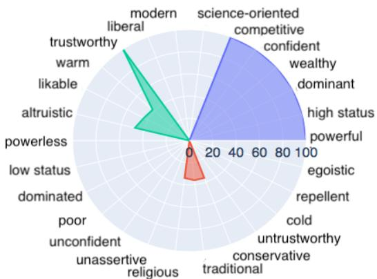

# Theory-Grounded Measurement of U.S. Social Stereotypes in English Language Models

Yang Trista Cao∗1, Anna Sotnikova∗1 Hal Daumé III1,2 Rachel Rudinger1 Linda Zou1 1University of Maryland, College Park 2Microsoft Research {ycao95, asotniko, hal3, rudinger, lxzou}@umd.edu

## Abstract

NLP models trained on text have been shown to reproduce human stereotypes, which can magnify harms to marginalized groups when systems are deployed at scale. We adapt the Agency-Belief-Communion (ABC) stereotype model of Koch et al. (2016) from social psychology as a framework for the systematic study and discovery of stereotypic group-trait associations in language models (LMs). We introduce the sensitivity test (SeT) for measuring stereotypical associations from language models. To evaluate SeT and other measures using the ABC model, we collect group-trait judgments from U.S.-based subjects to compare with English LM stereotypes. Finally, we extend this framework to measure LM stereo typing of intersectional identities.

## 1 Introduction

Stereotypes are abstract and over-generalized pictures in people’s minds that capture attributes about groups of people in the complex social world (Lippmann, 1965). They influence people’s thoughts and behaviors, and allow people to make predictions beyond their personal experience or information given (Bruner et al., 1957; Wheeler and Petty, 2001). Stereotypes are also entwined with the production of prejudice, discrimination, and in-group favoritism (Stangor, 2014; Jackson, 2011). A long line of research in social psychology has established models of generic dimensions that estimate people’s stereotypes of social groups (Koch et al., 2016; Fiske et al., 2002, i.a.). We build on the Agency Beliefs Communion (ABC) model, which measures stereotypes toward a social group with respect to 16 traits in three dimensions: Agency/Socioeconomic Success, Conservative–Progressive Beliefs, and Communion (§2); an analysis of the group “man” across 32 traits (16 opposing dyads) is shown in Figure 1.

  
Figure 1: Crowdsourced analysis of the social group “man” under the ABC model (Koch et al., 2016). Colors: purple=agency, red=belief, green=communion.

Pre-trained language models (LMs) encode correlations between social groups and traits, like associating the group “Muslim” with the trait threatening, or “man” with confident (e.g., Bender et al., 2021; Nozza et al., 2021; Hovy and Yang, 2021). We conduct a systematic study of social stereotypes in contextualized English masked LMs, grounded in group-trait associations from the ABC model. To capture the group-trait associations in the LM, we first assess two previously proposed word association tests and also propose a new measurement: the sensitivity test (SeT) (§3).

To evaluate the degree to which two LMs— BERT (Devlin et al., 2019) and RoBERTa (Liu et al., 2019)—align with human stereotype judgments, we design a human study for collecting group-trait judgments (§4). We show that our measure, SeT, best aligns with human judgements on group-trait associations and find that, in general, the association from language models have moderate alignment with human judgements.

Finally, with the best-aligned association measurement, we extend the ABC approach to study

<table><tr><td>AÁgncy</td><td>powerless ↔ powerful low status ↔ high status Belles dominated ↔ dominating poor ↔ wealthy unconfident ↔ confident unassertive ↔ competitive</td><td>religious ↔ science-oriented conventional ↔ alternative conservative ↔ liberal traditional ↔ modern</td><td>Coon</td><td>untrustworthy ↔ trustworthy dishonest ↔ sincere cold ↔ warm benevolent ↔ threatening repellent ↔ likable egotistic ↔ altruistic</td></tr></table>

Table 1: List of stereotype dimensions and corresponding traits in the ABC model (Koch et al., 2016).

LM stereotypes on intersectional groups (§ 5.2). Due largely to the difficulty of extending current approaches for measuring stereotypes in LMs to large numbers of groups, most current approaches only study isolated groups, despite the fact that people’s social identities are multifaceted (Ghavami and Peplau, 2013). Because our approach is generalizable to unstudied groups, we take a step towards exploring stereotypes of intersectional identities, finding some correspondence between model behavior and the literature on intersectional stereotypes.

## 2 Background and Related Work

People’s impressions of the world and the actions they take are guided by their stereotypes. To systematize this observation, the field of social psychology has proposed models of stereotypes, including traits that can coordinate social behaviors to serve as fundamental dimensions of stereotyping. Some models are designed to focus on social evaluation towards individual persons (Abele and Wojciszke, 2014), ingroup members (Ellemers, 2017; Yzerbyt, 2018), or a small set of outgroups (Fiske et al., 2002); the Agency Beliefs Communion (ABC) model—whose traits are designed to distinguish groups—is suited for a larger set of U.S. social groups (Abele et al., 2020). The ABC model takes a data-driven strategy to select a set of traits by eliminating those that are less effective in capturing stereotypes. The list contains 16 pairs, where each pair represents two polarities (see Table 1), categorized into three dimensions: agency/socioeconomic success, conservativeprogressive beliefs, and communion/warmth.

Ours is far from the first work to assess stereotypes in language models, and has both advantages and disadvantages compared to previous approaches (see Table 2). Past work has generally taken one of two approaches. The first approach tests systems with hand-constructed templates like “The [group] is □”, where [group] ranges over social groups (e.g., “woman” or “Hispanic”), and □ represents a “masked word” and ranges over occupations (“a professor” or “a nurse”) (e.g., Bolukbasi et al., 2016; May et al., 2019) or associations drawn from implicit association tests (IAT) (e.g., pleasant/unpleasant words or career/familyrelated words) (e.g., Caliskan et al., 2017; Guo and Caliskan, 2021). In Table 2 we refer to these as “unnatural” prompts. The second approach collects more natural sentences containing stereotypes, either by web crawling with crowdworkers annotations for social bias (Sap et al., 2019) or by having crowdworkers directly write stereotyping sentences (Nangia et al., 2020; Nadeem et al., 2020).

<table><tr><td>Measurement</td><td>Genliies</td><td>Gronnded</td><td>Extve</td><td>Natural</td><td>Speieiy</td></tr><tr><td>Debiasing (Bolukbasi et al.)</td><td></td><td></td><td></td><td></td><td></td></tr><tr><td>CrowS-Pairs (Nangia et al.)</td><td></td><td></td><td></td><td></td><td></td></tr><tr><td>Stereoset (Nadeem et al.)</td><td></td><td></td><td>2</td><td>√</td><td>V</td></tr><tr><td>S. Bias Frames (Sap et al.)</td><td></td><td></td><td></td><td></td><td></td></tr><tr><td>CEAT (Guo and Caliskan)</td><td>V</td><td></td><td></td><td>vv</td><td></td></tr><tr><td>This Work</td><td></td><td></td><td></td><td></td><td></td></tr></table>

Table 2: Comparison with previous work: Generalizes denotes approaches that naturally extend to previously unconsidered groups; Grounded approaches are those that are grounded in social science theory; Exhaustiveness refers to how well the traits cover the space of possible stereotypes; Naturalness is the degree to which the text input to the LM is natural (we consider naturally occurring web scraped data as “very natural” and crowdsourced sentences as “somewhat natural.”). Specificity indicates whether the stereotype is specific or abstract.

In our work, we take the first approach with traits from the ABC model, using prompts. The advantage of this approach is that the templates and the traits are completely controlled and are easy to extend to other social groups. The second approach is harder to control, which also leads to significant annotation challenges (Blodgett et al., 2021). Using natural sentences limits generalizability, as it requires a unique collection of prompts (and embedded traits) for each social group; in contrast, the prompt-based approach easily generalizes to any plausible group, especially when based on a theoretically grounded framework like ABC or IAT.

An advantage of our work is that the ABC traits are more exhaustive in stereotype coverage with verification from social psychological experiments. The ABC model covers three dimensions with 16 traits, which are consensual, spontaneous, and have been tested using expansive range of social groups (Koch et al., 2021). They used a carefully designed data-driven approach to gather people’s fundamental dimensions of social perceptions with as little sampling bias as possible. Thus the resulted 16 traits cover most stereotypes.

<table><tr><td>Domain</td><td>Groups</td></tr><tr><td>Gender/ sexuality</td><td>man, woman, non-binary, trans, cis, gay, lesbian</td></tr><tr><td>Race/ ethnicity</td><td>Black, White, Hispanic, Asian, Native American</td></tr><tr><td>Religion</td><td>Jewish, Muslim, Christian, Buddhist, Mormon, Catholic, Amish, Protestant Atheist, Hindu</td></tr><tr><td>Socio- economic</td><td>wealthy, working class, immigrant, veteran, unemployed, refugee, doctor, mechanic</td></tr><tr><td>Age</td><td>teenager, elderly</td></tr><tr><td>Disability status</td><td>blind, autistic, neurodivergent, Deaf, person with a disability</td></tr><tr><td>Politics</td><td>Democrat, Republican</td></tr><tr><td>Nationality</td><td>Mexican, Chinese, Russian, Indian, Irish, Cuban, Italian, Japanese, German, French, British, Jamaican, American, Filipino</td></tr></table>

Table 3: Social groups domains and corresponding social groups used for the model experiments and human experiments. Single groups for human experiments are highlighted with italic font style.

Nevertheless, the main trade-off of our approach is that the testing data are not as natural and specific as other approaches. Although we carefully pick and adjust the templates and the form of the social group terms so that the testing sentences are grammatically correct, they are likely not representative of sentences seen in the real world or in the training data of the language models. Further, while our approach has the benefit of near-exhaustive coverage of potential stereotypes, this comes at a cost: the traits we consider are much more high level (e.g., “repellent”) than more fine-grained stereotypes collected by other means (e.g., the angry Black woman stereotype (Collins, 2002))—this approach therefore trades coverage for specificity.

## 3 Measuring Stereotypes in LMs

Our goal is to measure stereotypes in (masked) LMs, and compare them to stereotypes elicited from people. 2 In §4 we describe our approach for eliciting human judgments of group-trait affinities;

here we describe how we measure these in LMs. Previous work has proposed various ways to measure word associations in LMs, including increased log probability score (ILPS) and contextualized embedding association test (CEAT), both of which we summarize below. Finally, we present a new measurement which we call the Sensitivity Test (SeT), which adapts concepts from active learning to the task of measuring a LM’s associations.

## 3.1 Measurements of Word Associations

Increased Log Probability Score (ILPS) quantifies word associations in language models through masked word probabilities. It calculates the association score with a pre-defined template, “[Group] are □.” (Kurita et al., 2019), where □ is a masked token. For example, given a group “Asian” and a trait smart, P(“Asian”, smart) measures the probability of smart given “Asians” by filling in the template. Since this probability is affected by the prior probability of smart, ILPS normalizes this probability by the “prior” probability of the trait given a masked group, as below:

$$
\mathrm { I L P S } ( { \mathfrak { g } } , { \mathfrak { t } } ) = \log { \frac { P (  = { \mathfrak { t } } \mid { \mathfrak { g } } \mathrm { a r e }   . ) } { P (  _ { 2 } = { \mathfrak { t } } \mid \bigsqcup _ { 1 } \mathrm { a r e } \sqcap { \ } _ { 2 . } ) } }
$$

Intuitively, ILPS measures how much each group raises the likelihood of a trait filling in the template. One can easily show that this equivalent to the weight of evidence of the trait in favor of the hypothesis that the group is the target: $s ( \mathfrak { g } , \mathfrak { t } ) =$ woe(g : t  template) (Wod, 1985).

Contextualized Embedding Association Test (CEAT) estimates word associations with word embedding distances (Guo and Caliskan, 2021) . Intuitively, CEAT measures whether some groups are closer to certain traits in a latent vector space. Given two sets of target words defining groups X, Y (e.g. Xmale = “man”, “father”, ... , $Y _ { \mathrm { f e m a l e } } = \{ { ^ { \mathfrak { c } \mathfrak { c } } } \mathrm { w o m a n } ^ { \mathfrak { , \mathfrak { c } } } , { ^ { \mathfrak { c } } } \mathrm { m o t h e r } ^ { \mathfrak { , } } , . . . \} )$ and two sets of polar traits A, B (e.g. Apleasant = { love, peace, ${ \mathrm { . . . } } , B _ { \mathrm { p l e a s a n t } } = \{ { \mathrm { e v i l } } , { \mathsf { n a s t y } } , { \mathrm { . . . ~ } } \} )$ , CEAT computes the effect sizes of the difference between X and Y being closer to A than B and corresponding p-values. Since contextualized word representations are affected by the contexts around the word, for each word in the four word sets, CEAT randomly samples 1000 sentences from Reddit, in which the word appears, and uses these to approximate the true effect size as below:

<table><tr><td>Singular</td><td>Plural</td></tr><tr><td>The/That/A [group] is □. Declarative</td><td>Most/Many/All [group] are . / [Group] are □. Interrogative</td></tr><tr><td>[Group] are □. Non-adverbial</td><td>Why are [group] ? Adverbial</td></tr><tr><td>[Group] are □.</td><td>[Group] are very/so/mostly .</td></tr><tr><td>Fact [Group] are □.</td><td>Belief I/We/Everyone/People believe/expect/think/know(s) that [group] are .</td></tr><tr><td>Fact [Group] are □.</td><td>Social Expectation [Group] are supposed to be/should be/are seen as/ought to be/are expected to be .</td></tr><tr><td>Group-first [Group] are □.</td><td>Trait-first The  people are [group].</td></tr><tr><td>Non-comparative [Group] are □.</td><td>Comparative [Group] are more likely to be  than others</td></tr></table>

Table 4: Template Variations.

$$
\begin{array} { r l r } & { } & { \mathrm { C E A T } ( A , B , X , Y ) = \frac { \underset { \mathfrak { g } \sim X } { \hat { \mathbb { E } } } ( \mathfrak { g } , A , B ) - \underset { \mathfrak { g } \sim Y } { \hat { \mathbb { E } } } s ( \mathfrak { g } , A , B ) } { \underset { \mathfrak { g } \sim X \cup Y } { \hat { \mathbb { S } } } s ( \mathfrak { g } , A , B ) } } \\ & { } & { s ( \mathfrak { g } , A , B ) = \underset { \mathfrak { t } \sim A } { \hat { \mathbb { E } } } \cos ( \vec { \mathfrak { g } } , \vec { \mathfrak { t } } ) - \underset { \mathfrak { t } \sim B } { \hat { \mathbb { E } } } \cos ( \vec { \mathfrak { g } } , \vec { \mathfrak { t } } ) } \end{array}
$$

$\hat { \mathbb { E } } \left( \mathrm { r e s p . } \hat { \mathbb { S } } \right)$ is the empirical expectation (resp. standard deviation), and ⃗x denotes the embedding of x.

In our setting, since we care about social bias among multiple groups rather than the difference between two groups, we modify the CEAT to calculate the effect size of the distance difference between g with A and B for each group as below:

$$
\mathrm { C E A T } ( { \mathfrak { g } } , A , B ) = { \frac { { \underset { \mathrm { t } \sim A } { \widehat { \mathbb { E } } } } \cos ( { \vec { \mathfrak { g } } } , { \vec { \mathrm { t } } } ) - { \underset { \mathrm { t } \sim B } { \widehat { \mathbb { E } } } } \cos ( { \vec { \mathfrak { g } } } , { \vec { \mathrm { t } } } ) } { \underset { \mathrm { t } \sim A \cup B } { \widehat { \mathbb { S } } } \cos ( { \vec { \mathfrak { g } } } , { \vec { \mathrm { t } } } ) } }
$$

Sensitivity Test (SeT) is a new approach we propose to measure word association for social bias in language models, inspired by ideas from active learning (Beygelzimer et al., 2008). The intuition of SeT is that even though a model assigns the same probability to two different words, the robustness of those two probabilities may be different. For example, both p(competent “Blind people are □.”) and p(kind “Men are □”) might be low. However, the language model may well not have seen many examples with blind people, as opposed to the presumably very large number of examples of men. In this case, a small number of examples may be sufficient to alter the model’s predictions about blind people, while a larger number would be required for men. SeT captures the model’s confidence in a prediction by measuring how much the model weights would have to change in order to change that prediction. Specifically, SeT computes the minimal change to the last-layer of the language model so that a given trait becomes the highest probability trait (over the full vocabulary).

For example, consider the template “The [group] is □.” with the group “woman” and the trait incompetent. Let ℓ be the logits at □ when the input is “The woman is □.”, and let t be the index of incompetent in ℓ (so that $\ell _ { \mathrm { t } } \ =$ p(incompetent context)). Let h be the last hidden layer before the logits, and let A be the matrix of the last linear layer so that ℓ = Ah. SeT computes the minimal distance between A and some other matrix A′ so that t is the top word among the new logits $\pmb { \ell } ^ { \prime } = \mathbf { A } ^ { \prime } \mathbf { h }$ . Formally:

$$
\mathrm { S e T } ( { \mathfrak { g } } , { \mathfrak { t } } ) = \log { \frac { \Delta ( \mathbf { A } , \mathbf { h } _ { \mathfrak { g } } , { \mathfrak { t } } ) } { \Delta ( \mathbf { A } , \mathbf { h } _ { \sharp } , { \mathfrak { t } } ) } }
$$

where $\mathbf { h } _ { 9 }$ is the penultimate layer on input g A is the matrix before the logits

$$
\begin{array} { r l } & { \Delta ( \mathbf { A } , \mathbf { h } , \mathrm { t } ) = \underset { \mathbf { A } ^ { \prime } } { \mathrm { m i n } } \| \mathbf { A } ^ { \prime } - \mathbf { A } \| _ { 2 } ^ { 2 } } \\ & { ~ \mathrm { s . t . ~ } ( \mathbf { A } ^ { \prime } \mathbf { h } ) _ { \mathrm { t } } \geq ( \mathbf { A } ^ { \prime } \mathbf { h } ) _ { \mathrm { t ^ { \prime } } } + \gamma , \forall \mathrm { t ^ { \prime } } \neq \mathrm { t } } \end{array}
$$

for a fixed margin $\gamma > 0$ , which we set to 1. SeT returns the negative distance as measure of the association between the corresponding group and trait, normalized by a prior akin to ILPS. This optimization problem does not (to our knowledge) admit a closed form solution; we solve it iteratively using the column squishing algorithm (Bittorf et al., 2012; Daumé and Kumar, 2017).

## 3.2 Implementation details

We test the above measurements on both BERT and RoBERTa pretrained large models from an opensource HuggingFace3 library.

Social groups. Table 3 lists all the individual social groups we cover in this work. We manually construct the list by combining and picking groups from the list of social groups from Sotnikova et al. (2021) and Koch et al. (2016) and also adding social groups we think are stereotyped in U.S. culture.

Traits. We use the 32 adjectives of the 16 traits from the ABC model (Table 1). For each traits, we calculate the score of its left-side adjective from its right-side adjective: Spowerless-powerful(g) = S(g, powerful) S(g, powerless), where S is one of the scores from §3.1.4

Templates. ILPS and SeT both require templates in calculating scores. We thus carefully construct a list of templates (Table 4) that covers multiple grammatical and semantic variations, inspired by work investigating harmful search automatic suggestions (Hazen et al., 2020). We find that different model structure requires different templates in order to bring up stereotypes that correlate with human data. See §5 for evidence.

Subwords. Due to the nature of BERT and RoBERTa’s tokenizers, some of the adjectives are divided into multiple subwords. This is problematic because all the measurements compute their scores at token level. Neither ILPS nor CEAT deals with subwords directly: in their released implementations, they either take the first or the last sub-token of the word. To remedy this, we adjust the ILPS measurement (denoted as ILPS⋆) to properly compute the probability of traits in context using the chain rule across subwords. For SeT, we calculate the sensitivity score for each subword individually and take the maximum SeT score as the SeT score for the word, which effectively computes a lower-bound on how much the model parameters would need to change. We did not modify CEAT’s measurement as it is not clear what is the best way to compute comparable word embeddings for words that consist of multiple subwords.

## 4 Human Study

In the previous section, we describe how we compute associations between groups and traits in language models.5 In this section, we assess stereotypes of social groups through groups-trait association, like in Figure 1. We adopt this approach because it is widely used to evaluate group stereotypes in social psychology field (Fiske et al., 2002; Koch et al., 2016). It also aligns with Lippmann (1965)’s theory of stereotypes that they are abstract pictures in people’s head. We broadly follow procedures from previous social psychology papers to collect human evaluation on social groups.

Survey Design. We recruit participants from Prolific6. Each participant is paid \$2.00 to rate 5 social groups on 16 pairs of traits and on average participants spend about 10 minutes on the survey. This results in a pay of \$12.00 per hour. Maryland’s current minimum wage is \$12.20 7. First, participants read the consent form, and if they agree to participate in the study, they see the survey’s instructions. For each social group, participants read "As viewed by American society, (while my own opinions may differ), how [e.g., powerless, dominant, poor] versus [e.g., powerful, dominated, wealthy] are <group>?" They then rate each trait with a 0- 100 slider scale where two sides are the two dimensions of the trait (e.g. powerless and powerful). Each annotated group is shown on a separate page, and participants cannot go back to previous pages. To avoid social-desirability bias, we explicitly write in the instruction that “we are not interested in your personal beliefs, but rather how you think people in America view these groups.”

Participant Demographics. At the end of the survey we collect participants’ demographic information, including gender, race, age, education level, type of living area, etc. Our participants represent 26 states, with 63.3% from California, New York, Texas, or Florida; the gender breakdown is 48.2% male, 49.6% female, and 2.2% genderqueer, agender, or questioning; and skew young, with over 96% at most 40 years old; and with racial demographics that approximately match the U.S. census. For more details on demographics, see Appendix E.

Quality Assurance. Ensuring annotation quality in a highly subjective task is a challenge, and common approaches in NLP like having questions where we “know” the answer as tests, measuring interannotator agreement, and calibrating reviewers against each other (Paun et al., 2018) do not make sense here. Yet, it is still important to ensure the annotation quality. After much iteration, we include three test questions, and warn the participants at the beginning that there are test questions.

1. After the first group, participants must name the group they just scored.

2. After the second, participants must list one trait they just marked high and one marked low.

3. The fifth (final) group is a repetition of one of the four groups they previously scored.

We discard annotations with incorrect answers to either of the first two questions. For the third test, we compute intra-annotator (self) agreement and discard annotations with accuracy-to-self lower than 80%. For each group we collect 20 annotations that pass our quality threshold. In total, we collected annotations from 247 participants, with 133 passing the quality tests (suggesting that having such tests is important). The 114 annotations that did not pass tests were excluded from our dataset, but all 247 participants were paid.

Social groups and traits. The social groups we used for the human study are highlighted in Table 3. This table contains only single groups used for the model § 3 and human experiments. We collect annotations for 25 social groups within 5 domains, across all 16 pairs of traits.

## 5 Results

In this section we present results on correlations between human and model stereotypes for individual groups, comparing across different measurements, including our proposed measurement, SeT (§5.1). Next, we analyze how model scores change for intersectional social groups. We consider several possible factors that may influence the score changes such as identity order, some domain domination, and consider emergent traits (§5.2).

## 5.1 Correlation on Individual Groups

Before we answer the question of how language model stereotype scores align with human stereotypes across the measurements introduced in §3, we first run a pilot experiment to select the best template(s) for each measurement-model pair from the set of templates in Table 4 (except for CEAT, which does not require templates). We randomly picked four social groups (Asian, Black, Hispanic, immigrant) and five annotations from each group for the pilot. Since our goal is to inspect the alignment between human and model stereotypes, we take the averaged score of the five annotations as “ground truth” and select templates that give the correlation score according to Kendall τ . We limit the selection to at most two templates to avoid overfitting on the pilot data, selected to maximize correlation for each measurement-model pair.

The selected templates and corresponding correlation scores are shown in appendix (Table 5); the score range for weak correlation is 0.10 - 0.19, moderate 0.20 - 0.29, and strong 0.30 and above (Botsch, 2011). For a fixed LM, the best templates tend to be similar across all measures: RoBERTa tends to achieve highest correlation with templates like “That [group] is [trait].” while for BERT the preferred templates tend to be “All [group] are [trait].” or “[Group] should be [trait].”

Given the best templates for each measurementmodel pair, we measure to what degree language model stereotypes are aligned with human stereotypes with all annotations on 25 social groups. To quantify alignment, we both calculate the Kendall rank correlation coefficient (Kendall’s τ) and the Precision at 3 (P@3). The former indicates the correlation between model and human scores on group-trait associations in terms of the number of swaps required to get the same order. The latter indicates the percentage of the model’s top stereotypes which accord with human’s judgements. For P@3, we also calculate at both the group level and overall with all groups. For each group, we compute its P@3 score by taking the average of the P@3 scores with the top 3 traits (top at one polarity) and the score with the bottom 3 (top at the other polarity) because each trait has two polar adjectives and the group-trait score is calculated with the difference of the two polarities. To calculate the P@3 scores, we binarize the human group-trait scores at a threshold of 50. The overall P@3 score is the average of the groups’ individual P@3 scores.

The overall scores are in Table 6. We see that in general that RoBERTa contains group-trait associations that are more similar to human judgements than does BERT. Additionally, we see that both ILPS⋆ and SeT have higher P@3 scores than CEAT and ILPS. The RoBERTa model with the SeT measurement approach yields outputs are the most aligned with human’s judgements, with RoBERTa/ILPS⋆ a close second. From its scores, we see that model’s group-trait associations have moderate correlation with human’s judgements. Moreover, in general, two out of the three top ranked group-trait associations from the model agree with human data. See Table A19 for the overall scores of test groups only, where the four pilot groups are excluded, and Appendix B for group level alignment scores.

<table><tr><td rowspan="2"></td><td colspan="2">RoBERTa</td><td colspan="2">BERT</td></tr><tr><td>T</td><td>Template(s)</td><td>T</td><td>Template(s)</td></tr><tr><td>ILPS</td><td>0.280</td><td>That [group] is [trait].</td><td>0.215</td><td>All [group] are [trait]. [Group] should be [trait].</td></tr><tr><td>ILPS*</td><td>0.258</td><td>All [group] are [trait]. That [group] is [trait].</td><td>0.123</td><td>We expect that [group] are [trait]. [Group] should be [trait].</td></tr><tr><td>SeT</td><td>0.253</td><td>That [group] is [trait].</td><td>0.214</td><td>All [group] are [trait]. [Group] should be [trait].</td></tr></table>

Table 5: Best two templates for each measurement-model pair and corresponding correlations. Some have only one template because there is no combination of two templates that give higher correlation score than this one template.
<table><tr><td></td><td colspan="2">CEAT</td><td colspan="2">ILPS</td><td colspan="2">ILPS*</td><td colspan="2">SeT</td></tr><tr><td></td><td>RoBERTa</td><td>BERT</td><td>RoBERTa</td><td>BERT</td><td>RoBERTa</td><td>BERT</td><td>RoBERTa</td><td>BERT</td></tr><tr><td>Kendall&#x27;s τ</td><td>0.019</td><td>0.111†</td><td>0.169†</td><td>0.094†</td><td>0.175†</td><td>0.015</td><td>0.199†</td><td>0.116</td></tr><tr><td>Precision at 3</td><td>0.500</td><td>0.587</td><td>0.620</td><td>0.533</td><td>0.653</td><td>0.560</td><td>0.653</td><td>0.613</td></tr></table>

Table 6: Overall alignment scores with human annotations. The highest scores are bold for each row. For correlation scores, we mark scores where the p-value is < 0.05 with .

## 5.2 Intersectional Groups in LMs

Background. Intersectionality is a core concept in Black feminism, introduced in the Combahee River Collective Statement in 1977 (1977; 1983), considering the ways in which feminist theory and antiracism need to combine: “Because the intersectional experience is greater than the sum of racism and sexism, any analysis that does not take intersectionality into account cannot sufficiently address the particular manner in which Black women are subordinated.” The concept was applied in law by Crenshaw (1989) to analyze the ways in which U.S. antidiscrimination law fails Black women.

The concept of intersectionality has broadened and, while its boundaries remain contested (e.g., Browne and Misra, 2003), there are a number of core principles that are central (Steinbugler et al., 2006; Zinn and Dill, 1996): (1) social categories and hierarchies are historically contingent, (2) the experience at an intersection is more than the sum of its parts (Collins, 2002; King, 1988), (3) intersections create both oppression and opportunity (Bonilla-Silva, 1997), (4) individuals may experience both advantage and disadvantage as a result of intersectionality, and (5) these hierarchies impact social structure and social interaction.

Goals and Research Questions. We aim to understand whether we can measure evidence of intersectional behavior in language models with respect to stereotyping. In particular, we are interested in questions surrounding how language models stereotype people who simultaneously belong to multiple social groups. We will only use the term “intersectionality” when specifically considering cases where (per (3) above) the resulting experience (in this case, stereotyping) is more than the sum of its parts. For example, common U.S. stereotypes for Black women are as “welfare queens” (which may show up as low agency in our traits), while common stereotypes for Black men is as “criminal” (which may show up as low communion) (hooks, 1992; Collins, 2002). To limit our scope, we will only consider pairs of social groups (e.g., cis men), and will refer to the the groups that make up a pair as the component identities (e.g., cis, or men). We aim to answer the following research questions:

1. When presented with a paired identity, is the language model sensitive to the order in which the component identities appear?

2. When paired, do certain social categories dominate others in a language model’s predictions?

3. Can the language model detect stereotypes that belong to an intersectional group (but not to either of the components that make up the pair)?

To answer these questions, we use the SeT measurement with the RoBERTa model (the best performing pair on the single-group experiments) to compute group-trait associations on our paired groups, which are combinations of all the single groups in Table 3. We manually omit the groups that do not logically exist (e.g. “cis non-binary person”, “teenage elderly person”) or are grammatically awkward (e.g. “doctor elderly person”, “immigrant blind person”). Note we include both orders of the single groups in the paired groups when possible (e.g. “Catholic teenager” and “teenage Catholic person”). We then conduct the analysis by computing the correlation between groups’ list of trait scores with Kendall’s τ.

Q1: Identity Order. Given an paired group with two identities, the language model may not be able to capture both of the identities and may predict stereotypes based only on one of the components. In fact, the average correlation score between a paired group and the most correlated of its components is 0.56, which is moderately high. We thus calculate the correlation of trait scores between the paired group and both its first and second component identities (when both orders are possible). In addition, we calculate the correlation of paired groups with reversed identity order (e.g. “Asian teenager” and “teenage Asian person”). The average correlation score between a paired group and its first component is 0.43; the correlation score to its second component is 0.46, which are quite close. Further, the average correlation score of intersectional groups with reversed identity is 0.69, which is moderately high. Taken together, these results indicate that (a) many paired groups have similar group-trait association scores with one of their component identities alone; (b) the order does not matter significantly, but the language model tends to focus slightly more on the second compo nent. The implication of this is that we can expect that the language model may be able to capture intersectional stereotypes.

Q2: Dominant Domains. Stryker (1980) suggests that people tend to identify themselves with their race/ethnicity identity before other identities, though this is contested and, in some cases, thought to be antithetical to the idea of intersectionality (e.g., Collins, 2002). Prompted by this debate, we ask if there is a hierarchy of the domains that language model picks up on for paired groups. To answer this question, for each identity domain pair, we compute the average correlation score between the paired groups with each of its two component identities, and take the difference of the averaged correlation scores of the two domains. For each domain, we count the domains it dominates (i.e.

has score difference  0.1) and is dominated by.

These results show that age and political stance are dominant domains, which is expected as identities within these two domains have strong characteristics that may overwhelm domains they are paired with. On the other end, race and nationality are, generally, dominated domains. It is surprising that the race domain is majorly dominated, contrasting documented literature in human behavior. The full results are shown in Appendix Table A8 as well as detailed scores Table A9.

Q3: Emergent Intersectional Stereotypes. Finally, we look into emergent stereotypes of paired groups, with the goal of finding intersectional behavior in the language model. To detect intersectional stereotypes, we need to operationalize the notion of the whole being greater than its parts. For a fixed paired group ${ \bf g } = ( { \mathfrak { g } } _ { 1 } , { \mathfrak { g } } _ { 2 } ) ( { \bf e . g . , \mathrm { ~ } } ^ {  }$ “trans Democrats”), and a given trait t (e.g., warm), we compute $S ( \mathfrak { g } , \mathfrak { t } ) - \operatorname* { m a x } \{ S ( \mathfrak { g } _ { 1 } , \mathfrak { t } ) , S ( \mathfrak { g } _ { 2 } , \mathfrak { t } ) \}$ , where S is the score from the language model, capturing whether this trait is more associated with the paired group than the maximum of its association with the component identities. (We consider also the reverse, where we look for scores much less than the min.) We might hope to find some well attested intersectional identities from the literature, such as “Black women” have an attitude (low communion) and “White men” are privileged (high agency) (Ghavami and Peplau, 2013).

The top 50 emergent group-trait associations according to our measure are listed in Table A10. We also see some good examples are: the language model scores “Hispanic unemployed people” as more egotistic than people of the component identities, “Democrat teenagers” as more altruistic, “male doctors” as more benevolent, etc. However, there are also some unexpected patterns; for instance, almost all nationality identities combined with “mechanic” are trustworthy and likeable, and almost all nationality identities combined with “autistic” are egotistic. Looking into the scores themselves, we find that both “mechanic” and “autistic” have low scores on the corresponding traits, and combining them with nationalities raises to about average levels.

Aside from analyzing face validity—which is mixed—we compare the results of our model to the traits that Ghavami and Peplau (2013) found when conducting human studies of race/gender pairs. To do this, we categorize the traits from Ghavami and

Peplau (2013) to the ABC dimensions8 and compare with our full list of emergent group-trait associations. Taking their group-trait matches as ground truth, our detection of traits for these race/gender intersectional groups achieves a precision 0.83 and recall 0.65—better than random guessing (precision 0.72, recall 0.50) but far from perfect.

## 6 Limitations and Ethical Considerations

There are several limitations to our work, which should be taken into account in the interpretation of our results.

First, our results are likely affected by reporting bias and by a defaulting effect where, when people annotate traits for “men”, they may actually have in their head “cis straight white men”, because the defaults go unremarked. This goes both for the human scores (how does a participant conceptualize “men”?) and language model scores (what do sentences containing the word “man” assume given that most language a langauge model has been trained on likely exhibits defaulting?).

Second, our work only focus on assessing stereotypes within language models and not in any deployed system. Though stereotypes from language models may impact the outputs of downstream systems which are built upon these language models, it is not clear how exactly the stereotypes transfer (Cao et al., 2022). Additionally, our work is limited to English and U.S. social stereotypes.

Third, although we followed and built on best practices from social psychology in developing the human study, it nevertheless has some shortcomings. In particular, even after many iterations on wording, it was difficult to phrase the survey questions to encourage people to reporting their true impressions. There is tension between asking a participant what they think—which risks a counfounding potential social desirability bias (Latkin et al., 2017) (people’s tendency to respond in socially acceptable ways)—and asking what they think others think—which led to comments from a few participants that they felt unqualified to speak for others. Asking these questions of participants and collecting the data also raises the possibility of this work inadvertantly reinforcing stereotypes.

Finally, aggregating human judgements into a single number by averaging (or any other statistic)

to compare to model predictions risks collapsing a significant amount of information down to a single number. This number cannot distinguish between a weakly held but common stereotype and a strongly held but rare one. Nor can it distinguish between traits where half of annotators say 0 and the other half say 100, from traits where all annotators say 50. These average judgments should be interpreted as not what any single person would say, but an average over people. This limitation is exacerbated by the defaulting effect, where some people may imagine a different prototype for a given group, and other people may imagine another.

## 7 Conclusion

In this paper, we measured language model (LM) stereotypes by adopting the ABC stereotype model from social psychology. Comparing to previous work on detecting LM stereotypes, our approach is easy to extend to previously unconsidered groups, grounded in traits proven effective by social psychology, and exhaustively covering the space of possible stereotypes, at the cost of being more abstract than in other NLP work. This yields a different set of trade-offs than previous approaches to measuring stereotypes in LMs.

With the ABC model and data regarding human stereotypes from our human study, we assessed LM stereotypes using three different association measurements, including SeT, a metric we proposed. We showed that LM group-trait stereotypes in general have moderate correlation with human judgements, and that SeT provides correlations that better align with human’s. Based on these results, we extended our analysis to intersectional groups. We found that the LM may be able to capture intersectional stereotypes but is not particularly good on identifying emergent intersectional stereotypes. Our results also show that that, in general, age and political stance are dominant domains in language models, whereas race and nationality are dominated domains. We hope that our work provides insights for future works on measuring and mitigating stereotypes in natural language processing systems, and that the grounding in theories from social psychology has benefits beyond just studying stereotypes.

## Acknowledgments

This material is based upon work partially supported by the National Science Foundation under

Grant No. 2131508. The authors are also grateful to all the reviewers who have provided helpful suggestions to improve this work, and thank members of the CLIP lab at the University of Maryland for the support on this project. We are grateful to all those who participated in our human study, without whom this research would not have been possible.

## References

Andrea Abele, Naomi Ellemers, Susan Fiske, Alex Koch, and Vincent Yzerbyt. 2020. Navigating the social world: Toward an integrated framework for evaluating self, individuals, and groups. Psychological review, 128.

Andrea Abele and Bogdan Wojciszke. 2014. Communal and agentic content a dual perspective model. Adv. Exp. Soc. Psychol., 50:198–255.

Emily M Bender, Timnit Gebru, Angelina McMillan-Major, and Shmargaret Shmitchell. 2021. On the dangers of stochastic parrots: Can language models be too big?. In Proceedings of the 2021 ACM Conference on Fairness, Accountability, and Transparency, pages 610–623.

Alina Beygelzimer, Sanjoy Dasgupta, and John Langford. 2008. Importance weighted active learning. CoRR, abs/0812.4952.

Victor Bittorf, Benjamin Recht, Christopher Ré, and Joel Tropp. 2012. Factoring nonnegative matrices with linear programs. Advances in Neural Information Processing Systems, 2.

Su Lin Blodgett, Gilsinia Lopez, Alexandra Olteanu, Robert Sim, and Hanna Wallach. 2021. Stereotyping Norwegian salmon: An inventory of pitfalls in fairness benchmark datasets. In Proceedings ofthe 59th Annual Meeting ofthe Associationfor Computational Linguistics and the 11th International Joint Conference on Natural Language Processing (Volume 1: Long Papers), pages 1004–1015, Online. Association for Computational Linguistics.

Tolga Bolukbasi, Kai-Wei Chang, James Zou, Venkatesh Saligrama, and Adam Kalai. 2016. Man is to computer programmer as woman is to homemaker? debiasing word embeddings. NeurIPS, pages 4349–4357.

Eduardo Bonilla-Silva. 1997. Rethinking racism: Toward a structural interpretation. American sociological review, pages 465–480.

Robert E. Botsch. 2011. Significance and Measures of Association.

Irene Browne and Joya Misra. 2003. The intersection of gender and race in the labor market. Annual review ofsociology, 29(1):487–513.

J.S. Bruner, Brunswik E, L. Festinger, F. Heider, K.F. Muenzinger, C.E. Osgood, and D. Rapaport. 1957. Going beyond the information given. Contemporary approaches to cognition, pages 41–67.

Aylin Caliskan, Joanna J Bryson, and Arvind Narayanan. 2017. Semantics derived automatically from language corpora contain human-like biases. Science, 356(6334):183–186.

Yang Trista Cao, Yada Pruksachatkun, Kai-Wei Chang, Rahul Gupta, Varun Kumar, Jwala Dhamala, and Aram Galstyan. 2022. On the intrinsic and extrinsic fairness evaluation metrics for contextualized language representations.

Patricia Hill Collins. 2002. Black feminist thought: Knowledge, consciousness, and the politics of empowerment. routledge.

Combahee River Collective. 1977. A Black Feminist Statement. na.

Combahee River Collective. 1983. The combahee river collective statement. Home girls: A Blackfeminist anthology, 1:264–274.

Kimberlé Crenshaw. 1989. Demarginalizing the intersection of race and sex: A black feminist critique of antidiscrimination doctrine, feminist theory and antiracist politics. u. Chi. Legalf., page 139.

Hal Daumé, III and Abhishek Kumar. 2017. Column squishing for multiclass updates (blog post).

Jacob Devlin, Ming-Wei Chang, Kenton Lee, and Kristina Toutanova. 2019. Bert: Pre-training of deep bidirectional transformers for language understanding. In NAACL-HLT (1).

Naomi Ellemers. 2017. Morality and the Regulation of Social Behavior: Groups as Moral Anchors.

Susan T. Fiske, Amy J. C. Cuddy, Peter Glick, and Jun Xu. 2002. A model of (often mixed) stereotype content: competence and warmth respectively follow from perceived status and competition. Journal of personality and social psychology, 82 6:878–902.

Timnit Gebru, Jamie Morgenstern, Briana Vecchione, Jennifer Wortman Vaughan, Hanna Wallach, Hal Daumé, and Kate Crawford. 2018. Datasheets for datasets.

Negin Ghavami and Letitia Anne Peplau. 2013. An intersectional analysis of gender and ethnic stereotypes: Testing three hypotheses. Psychology of Women Quarterly, 37(1):113–127.

Wei Guo and Aylin Caliskan. 2021. Detecting emergent intersectional biases: Contextualized word embeddings contain a distribution of human-like biases. In Proceedings of the 2021 AAAI/ACM Conference on AI, Ethics, and Society, AIES ’21, page 122–133, New York, NY, USA. Association for Computing Machinery.

Timothy J. Hazen, Alexandra Olteanu, Gabriella Kazai, Fernando Diaz, and Michael Golebiewski. 2020. On the social and technical challenges of web search autosuggestion moderation. arXiv:2007.05039 [cs]. ArXiv: 2007.05039.

bell hooks. 1992. Yearning: Race, gender, and cultural politics. Hypatia, 7(2).

Dirk Hovy and Diyi Yang. 2021. The importance of modeling social factors of language: Theory and practice. In Proceedings of the 2021 Conference of the North American Chapter of the Association for Computational Linguistics: Human Language Technologies, pages 588–602, Online. Association for Computational Linguistics.

Lynne M. Jackson. 2011. The psychology of prejudice: From attitudes to social action. American Psychological Association.

Deborah K King. 1988. Multiple jeopardy, multiple consciousness: The context of a black feminist ideology. Signs: Journal ofwomen in culture and society, 14(1):42–72.

Alex Koch, Roland Imhoff, Ron Dotsch, Christian Unkelbach, and Hans Alves. 2016. The abc of stereotypes about groups: Agency/socioeconomic success, conservative-progressive beliefs, and communion. Journal ofpersonality and social psychology, 110:675–709.

Alex Koch, Vincent Yzerbyt, Andrea Abele, Naomi Ellemers, and Susan T. Fiske. 2021. Social evaluation: Comparing models across interpersonal, intragroup, intergroup, several-group, and many-group contexts, volume 63, page 1–68. Elsevier.

Keita Kurita, Nidhi Vyas, Ayush Pareek, Alan W. Black, and Yulia Tsvetkov. 2019. Measuring bias in contextualized word representations. CoRR, abs/1906.07337.

Carl A. Latkin, Catie Edwards, Melissa A. Davey-Rothwell, and Karin E. Tobin. 2017. The relationship between social desirability bias and self-reports of health, substance use, and social network factors among urban substance users in baltimore, maryland. Addictive Behaviors, 73:133–136.

Walter Lippmann. 1965. Public Opinion. New York :Free Press.

Yinhan Liu, Myle Ott, Naman Goyal, Jingfei Du, Mandar Joshi, Danqi Chen, Omer Levy, Mike Lewis, Luke Zettlemoyer, and Veselin Stoyanov. 2019. RoBERTa: A robustly optimized bert pretraining approach. arXiv preprint arXiv:1907.11692.

Chandler May, Alex Wang, Shikha Bordia, Samuel R. Bowman, and Rachel Rudinger. 2019. On measuring social biases in sentence encoders. In Proceedings ofthe 2019 Conference ofthe North American Chapter of the Association for Computational Linguistics: Human Language Technologies, Volume 1 (Long and

Short Papers), pages 622–628, Minneapolis, Minnesota. Association for Computational Linguistics.

Moin Nadeem, Anna Bethke, and Siva Reddy. 2020. Stereoset: Measuring stereotypical bias in pretrained language models. CoRR, abs/2004.09456.

Nikita Nangia, Clara Vania, Rasika Bhalerao, and Samuel R. Bowman. 2020. CrowS-pairs: A challenge dataset for measuring social biases in masked language models. In Proceedings ofthe 2020 Conference on Empirical Methods in Natural Language Processing (EMNLP), pages 1953–1967, Online. Association for Computational Linguistics.

Debora Nozza, Federico Bianchi, and Dirk Hovy. 2021. HONEST: Measuring hurtful sentence completion in language models. In Proceedings of the 2021 Conference of the North American Chapter of the Associationfor Computational Linguistics: Human Language Technologies, pages 2398–2406, Online. Association for Computational Linguistics.

Silviu Paun, Bob Carpenter, Jon Chamberlain, Dirk Hovy, Udo Kruschwitz, and Massimo Poesio. 2018. Comparing Bayesian Models of Annotation. Transactions ofthe Associationfor Computational Linguistics, 6:571–585.

Maarten Sap, Saadia Gabriel, Lianhui Qin, Dan Jurafsky, Noah A. Smith, and Yejin Choi. 2019. Social bias frames: Reasoning about social and power implications of language. CoRR, abs/1911.03891.

Anna Sotnikova, Yang Trista Cao, Hal Daumé III, and Rachel Rudinger. 2021. Analyzing stereotypes in generative text inference tasks. In Findings of the Association for Computational Linguistics: ACL-IJCNLP 2021, pages 4052–4065, Online. Association for Computational Linguistics.

Dr. Charles Stangor. 2014. Principles of social psychology – 1st international edition. BCcampus.

Amy C Steinbugler, Julie E Press, and Janice Johnson Dias. 2006. Gender, race, and affirmative action: Operationalizing intersectionality in survey research. Gender & Society, 20(6):805–825.

Sheldon Stryker. 1980. Symbolic interactionism: a social structural version. Benjamin/Cummings Pub. Co.

S. Wheeler and Richard Petty. 2001. The effects of stereotype activation on behavior: A review of possible mechanisms. Psychological bulletin, 127:797– 826.

I.J. Wod. 1985. Weight of evidence: A brief survey. Bayesian statistics, 2:249–270.

Vincent Y. Yzerbyt. 2018. The dimensional compensation model. Agency and Communion in Social Psychology.

Maxine Baca Zinn and Bonnie Thornton Dill. 1996. Theorizing difference from multiracial feminism. Feminist studies, 22(2):321–331.

## A Traits

The full list of traits and respective adjectives is in the Table A7

<table><tr><td>Trait</td><td>Adjectives</td></tr><tr><td>Agency scale Powerful Powerless High status Low status Dominant Dominated Wealthy Poor Confident Unconfident Competitive Unassertive Beliefs scale Modern Traditional</td><td>forceful, formidable, capable weak, helpless, incapable privileged, elite, advantaged unskilled, lowly, inferior commanding, authoritative subservient, submissive, deferential affluent, rich, prosperous impoverished, destitute, needy self-assured, assured, self-possessed bashful, meek, timid</td></tr></table>

Table A7: Full list of traits and corresponding adjectives.

<table><tr><td></td><td>Dominates</td><td>Dominated by</td></tr><tr><td>age</td><td>gender/sexuality, race/ethnicity, nationality, poli- tics, religion, socio-economic</td><td></td></tr><tr><td>politics</td><td>nationality, socio-economic, disability</td><td>age, religion</td></tr><tr><td>gender/ sexuality</td><td>race/ethnicity, nationality</td><td>age</td></tr><tr><td>disability</td><td>race/ethnicity, nationality</td><td>politics</td></tr><tr><td>social-economic</td><td>race/ethnicity, nationality</td><td>age, politics</td></tr><tr><td>religion</td><td>politics</td><td></td></tr><tr><td>race/ ethnicity</td><td></td><td>age, gender/sexuality, socio-economic, disability</td></tr><tr><td>nationality</td><td></td><td>age, gender/sexuality, politics, socio-economic, disability</td></tr></table>

Table A8: Domination relations between social domains.

## B Experiment Results with Single Groups

Table A11 presents the Kendall’s τ correlation scores between model and human at group level, while Table A12 and Table A13 shows the alignment with the precision at 3 scores (former computed with the top 3 traits and latter with the bottom 3 traits).

## C Experiment Results of Intersectional Groups

Table A8 presents the dominating relationship between domains, while Table A9 lists the average correlation scores of the paired group with each of its identities’ domain for each domain pairs.

Table A10 shows the top 50 emergent group-trait associations.
<table><tr><td>Domain A</td><td>Domain B</td><td>Correlation A</td><td>Correlation B</td></tr><tr><td>age</td><td>disability</td><td>0.532</td><td>0.475</td></tr><tr><td>gender</td><td>disability</td><td>0.418</td><td>0.356</td></tr><tr><td>age</td><td>gender</td><td>0.552</td><td>0.320</td></tr><tr><td>age</td><td>nationality</td><td>0.583</td><td>0.337</td></tr><tr><td>disability</td><td>nationality</td><td>0.543</td><td>0.309</td></tr><tr><td>gender</td><td>nationality</td><td>0.481</td><td>0.225</td></tr><tr><td>political stance</td><td>nationality</td><td>0.287</td><td>0.179</td></tr><tr><td>race</td><td>nationality</td><td>0.594</td><td>0.525</td></tr><tr><td>religion</td><td>nationality</td><td>0.490</td><td>0.525</td></tr><tr><td>socio</td><td>nationality</td><td>0.540</td><td>0.338</td></tr><tr><td>age</td><td>political stance</td><td>0.319</td><td>0.177</td></tr><tr><td>disability</td><td>political stance</td><td>0.019</td><td>0.397</td></tr><tr><td>gender</td><td>political stance</td><td>0.315</td><td>0.375</td></tr><tr><td>race</td><td>political stance</td><td>0.376</td><td>0.348</td></tr><tr><td>religion</td><td>political stance</td><td>0.380</td><td>0.271</td></tr><tr><td>age</td><td>race</td><td>0.520</td><td>0.395</td></tr><tr><td>disability</td><td>race</td><td>0.538</td><td>0.392</td></tr><tr><td>gender</td><td>race</td><td>0.478</td><td>0.371</td></tr><tr><td>age</td><td>religion</td><td>0.502</td><td>0.449</td></tr><tr><td>disability</td><td>religion</td><td>0.465</td><td>0.463</td></tr><tr><td>gender</td><td>religion</td><td>0.439</td><td>0.360</td></tr><tr><td>race</td><td>religion</td><td>0.522</td><td>0.460</td></tr><tr><td>age</td><td>socio</td><td>0.562</td><td>0.406</td></tr><tr><td>disability</td><td>socio</td><td>0.420</td><td>0.419</td></tr><tr><td>gender</td><td>socio</td><td>0.374</td><td>0.397</td></tr><tr><td>political stance</td><td>socio</td><td>0.433</td><td>0.290</td></tr><tr><td>race</td><td>socio</td><td>0.387</td><td>0.488</td></tr><tr><td>religion</td><td>socio</td><td>0.404</td><td>0.439</td></tr></table>

Table A9: Full list of correlations for paired social groups. The table shows two domains, which comprise group AB, correlations between group AB and group A, group AB and group B.

## D Human study setup

The survey for the collection of associated traits is presented in Figure A2.

Page1

Some kind of people in our society are viewed as [powerful, confident], while other kind of people in our society are viewed as [the opposite stereotype; powerless, unconfident].

In the following pages, you will be provided with 5 social groups

For each listed social group, please rate how people in America stereotype the group. We will provide a list of trait pairs (e.g., powerless to powerful) and you are to rate where in that range you believe the group is stereotyped.

Importantly, we are not interested in your personal beliefs, but rather how you think people in America view these groups.

Note that there will be test questions in the survey

Page 2

As viewed by American society, (while my own opinions may differ), how [e.g., powerless, dominant. poor] versus [e.g., powerful, dominated, wealthy] are Christian people?

<table><tr><td>0 10 powerless</td><td></td><td>20</td><td>30</td><td>40 50</td><td></td><td>60</td><td>70</td><td>80</td><td></td><td>90 100</td></tr><tr><td>low status</td><td></td><td></td><td></td><td></td><td>O ●</td><td></td><td></td><td></td><td></td><td>powerful high status</td></tr><tr><td>dominated</td><td></td><td></td><td></td><td></td><td>O</td><td></td><td></td><td></td><td></td><td>dominant</td></tr><tr><td>poor</td><td></td><td></td><td></td><td></td><td></td><td></td><td></td><td></td><td></td><td>wealthy</td></tr><tr><td>unconfident</td><td></td><td></td><td></td><td></td><td></td><td></td><td></td><td></td><td></td><td>confident</td></tr><tr><td>unassertive</td><td></td><td></td><td></td><td></td><td></td><td></td><td></td><td></td><td>competitive</td><td></td></tr><tr><td></td><td></td><td></td><td></td><td></td><td></td><td></td><td></td><td></td><td></td><td></td></tr><tr><td>traditional</td><td></td><td></td><td></td><td></td><td>O</td><td></td><td></td><td></td><td></td><td>modern</td></tr><tr><td>religious</td><td></td><td></td><td></td><td></td><td>O</td><td></td><td></td><td></td><td>science-oriented</td><td></td></tr><tr><td>conventional</td><td></td><td></td><td></td><td></td><td></td><td></td><td></td><td></td><td>alternative</td><td></td></tr><tr><td>conservative</td><td></td><td></td><td></td><td></td><td></td><td></td><td></td><td></td><td></td><td>liberal</td></tr><tr><td></td><td></td><td></td><td></td><td></td><td></td><td></td><td></td><td></td><td></td><td>trustworthy</td></tr><tr><td>untrustworthy</td><td></td><td></td><td></td><td></td><td></td><td></td><td></td><td></td><td></td><td></td></tr><tr><td>dishonest</td><td></td><td></td><td></td><td></td><td></td><td></td><td></td><td></td><td></td><td>sincere</td></tr><tr><td>cold</td><td></td><td></td><td></td><td></td><td></td><td></td><td></td><td></td><td></td><td>warm</td></tr><tr><td>threatening</td><td></td><td></td><td></td><td></td><td></td><td></td><td></td><td></td><td></td><td>benevolent</td></tr><tr><td>repellent</td><td></td><td></td><td></td><td></td><td></td><td></td><td></td><td></td><td></td><td>likable</td></tr><tr><td></td><td></td><td></td><td></td><td></td><td></td><td></td><td></td><td></td><td></td><td></td></tr><tr><td>egotistic</td><td></td><td></td><td></td><td></td><td></td><td></td><td></td><td></td><td></td><td>altruistic</td></tr></table>

Figure A2: Example of the survey for one group.

## E Annotators demographics

55.4% are white, with 50.6% male annotators, 40.4 female annotators and no annotators who provided another gender. 15.1% of annotators are Black, and 25.6% are Hispanic with slightly more female annotators 56.4%. We provide four tables A14, A15, A16, A17 showing how perceptions of White people, Black people, White men, and White women are different from each other across annotator demographics. We see variations between in-group and out-group annotations. For instance, women see themselves as more powerful than men see women. While overall scores for men and women groups are similar across white and Black annotators. In Table A18, we show correlation scores for all social groups and overall score between the model and Black, white, white female, and white male annotators.

<table><tr><td>Group AB</td><td>Emerged Trait</td><td>Increased Score</td><td>Max Score</td></tr><tr><td>Jamaican mechanic</td><td>trustworthy</td><td>0.1055</td><td>-0.0449</td></tr><tr><td>gay with a disability</td><td>conventional</td><td>0.0931</td><td>0.0017</td></tr><tr><td>gay with a disability</td><td>threatening</td><td>0.0922</td><td>-0.0316</td></tr><tr><td>Hispanic unemployed person</td><td>egotistic</td><td>0.0919</td><td>-0.1546</td></tr><tr><td>gay with a disability</td><td>liberal</td><td>0.0882</td><td>0.0401</td></tr><tr><td>female Native American</td><td>dominant</td><td>0.0860</td><td>0.0682</td></tr><tr><td>Democrat teenager</td><td>altruistic</td><td>0.0858</td><td>-0.0986</td></tr><tr><td>Deaf mechanic</td><td>likable</td><td>0.0854</td><td>0.0046</td></tr><tr><td>Black mechanic</td><td>likable</td><td>0.0821</td><td>-0.0118</td></tr><tr><td>Democrat mechanic</td><td>trustworthy</td><td>0.0819</td><td>-0.0449</td></tr><tr><td>male doctor</td><td>benevolent</td><td>0.0819</td><td>-0.0230</td></tr><tr><td>female Indian person</td><td>dominant</td><td>0.0808</td><td>0.0471</td></tr><tr><td>Latina</td><td>dominant</td><td>0.0808</td><td>0.0720</td></tr><tr><td>Filipino mechanic</td><td>trustworthy</td><td>0.0802</td><td>-0.0137</td></tr><tr><td>Native American mechanic</td><td>trustworthy</td><td>0.0796</td><td>-0.0449</td></tr><tr><td>teenage Democrat</td><td>altruistic</td><td>0.0794</td><td>-0.0986</td></tr><tr><td>trans mechanic</td><td>likable</td><td>0.0792</td><td>-0.0118</td></tr><tr><td>Democrat mechanic</td><td>sincere</td><td>0.0792</td><td>-0.0205</td></tr><tr><td>Democrat teenager</td><td>sincere</td><td>0.0790</td><td>-0.0205</td></tr><tr><td>female Black person</td><td>dominant</td><td>0.0785</td><td>0.0471</td></tr><tr><td>unemployed Italian person</td><td>poor</td><td>0.0784</td><td>0.0384</td></tr><tr><td>female doctor</td><td>alternative</td><td>0.0779</td><td>0.0052</td></tr><tr><td>Irish autistic person</td><td>egotistic</td><td>0.0775</td><td>-0.0708</td></tr><tr><td>Russian mechanic</td><td>likable</td><td>0.0773</td><td>-0.0118</td></tr><tr><td>unemployed Hispanic person</td><td>egotistic</td><td>0.0772</td><td>-0.1546</td></tr><tr><td>Russian unemployed person</td><td>egotistic</td><td>0.0762</td><td>-0.1788</td></tr><tr><td>female doctor</td><td>traditional</td><td>0.0750</td><td>0.0107</td></tr><tr><td>Amish mechanic</td><td>trustworthy</td><td>0.0748</td><td>-0.0170</td></tr><tr><td>Republican mechanic</td><td>sincere</td><td>0.0745</td><td>-0.0164</td></tr><tr><td>male teenager</td><td>conventional</td><td>0.0738</td><td>-0.0589</td></tr><tr><td>Hispanic French person</td><td>egotistic</td><td>0.0733</td><td>-0.1210</td></tr><tr><td>Cuban person with a disability</td><td>poor</td><td>0.0731</td><td>0.0486</td></tr><tr><td>atheist mechanic</td><td>trustworthy</td><td>0.0727</td><td>-0.0381</td></tr><tr><td>Hispanic Irish person</td><td>egotistic</td><td>0.0725</td><td>-0.1322</td></tr><tr><td>female Indian person</td><td>dominated</td><td>0.0721</td><td>0.0421</td></tr><tr><td>gay with a disability</td><td>traditional</td><td>0.0717</td><td>0.0229</td></tr><tr><td>unemployed German person</td><td>poor</td><td>0.0715</td><td>0.0384</td></tr><tr><td>female American person</td><td>dominated</td><td>0.0709</td><td>0.0328</td></tr><tr><td>Irish mechanic</td><td>trustworthy</td><td>0.0709</td><td>-0.0300</td></tr><tr><td>Muslim autistic person</td><td>egotistic</td><td>0.0708</td><td>-0.0708</td></tr><tr><td>male teenager</td><td>traditional</td><td>0.0705</td><td>-0.0490</td></tr><tr><td>Russian autistic person</td><td>egotistic</td><td>0.0704</td><td>-0.0708</td></tr><tr><td>Japanese autistic person</td><td>egotistic</td><td>0.0700</td><td>-0.0708</td></tr><tr><td>trans Republican</td><td>sincere</td><td>0.0698</td><td>-0.0164</td></tr><tr><td>German White person</td><td>egotistic</td><td>0.0696</td><td>-0.0833</td></tr><tr><td>male Buddhist</td><td>benevolent</td><td>0.0696</td><td>-0.0148</td></tr><tr><td>Irish Deaf person</td><td>egotistic</td><td>0.0693</td><td>-0.0589</td></tr><tr><td>Native American mechanic</td><td>sincere</td><td>0.0690</td><td>-0.0249</td></tr><tr><td>German Republican</td><td>egotistic</td><td>0.0688</td><td>-0.0517</td></tr></table>

Table A10: Top 50 emergent group-trait associations.

<table><tr><td rowspan="2"></td><td colspan="2">CEAT</td><td colspan="2">ILPS</td><td colspan="2">ILPS*</td><td colspan="2">SeT</td></tr><tr><td>RoBERTa</td><td>BERT</td><td>RoBERTa</td><td>BERT</td><td>RoBERTa</td><td>BERT</td><td>RoBERTa</td><td>BERT</td></tr><tr><td>White people</td><td>0.150</td><td>-0.033</td><td>-0.117</td><td>-0.383</td><td>0.117</td><td>-0.350</td><td>-0.033</td><td>-0.217</td></tr><tr><td>Hispanic people</td><td></td><td></td><td>0.533</td><td>0.200</td><td>0.133</td><td>0.300</td><td>0.483</td><td>0.283</td></tr><tr><td>Asian people</td><td></td><td></td><td>0.092</td><td>0.126</td><td>0.159</td><td>0.126</td><td>0.243</td><td>0.326</td></tr><tr><td>Black people</td><td>-0.209</td><td>-0.075</td><td>0.209</td><td>0.142</td><td>0.176</td><td>0.042</td><td>0.393</td><td>0.209</td></tr><tr><td>Immigrants</td><td>-0.117</td><td>-0.267</td><td>0.233</td><td>0.350</td><td>0.217</td><td>0.383</td><td>0.283</td><td>0.400</td></tr><tr><td>Men</td><td>0.183</td><td>-0.033</td><td>0.083</td><td>0.433</td><td>0.233</td><td>0.183</td><td>0.200</td><td>0.383</td></tr><tr><td>Women</td><td>-0.433</td><td>0.083</td><td>0.217</td><td>0.017</td><td>-0.100</td><td>0.050</td><td>0.083</td><td>0.067</td></tr><tr><td>Wealthy people</td><td>0.100</td><td>-0.133</td><td>0.067</td><td>0.017</td><td>0.150</td><td>0.167</td><td>0.067</td><td>0.083</td></tr><tr><td>Jewish people</td><td>0.250</td><td>0.083</td><td>0.017</td><td>-0.067</td><td>0.150</td><td>-0.217</td><td>0.033</td><td>-0.100</td></tr><tr><td>Muslim people</td><td>0.233</td><td>-0.050</td><td>0.000</td><td>-0.167</td><td>0.183</td><td>-0.017</td><td>0.250</td><td>-0.233</td></tr><tr><td>Christians</td><td>0.343</td><td>0.393</td><td>0.209</td><td>0.075</td><td>0.410</td><td>-0.176</td><td>0.243</td><td>0.142</td></tr><tr><td>Cis people</td><td>0.167</td><td>-0.067</td><td>-0.167</td><td>-0.033</td><td>0.217</td><td>-0.400</td><td>0.050</td><td>0.033</td></tr><tr><td>Trans people</td><td>-0.283</td><td>-0.050</td><td>0.067</td><td>-0.067</td><td>0.033</td><td>0.083</td><td>0.133</td><td>0.050</td></tr><tr><td>Working class people</td><td>0.050</td><td>0.300</td><td>0.183</td><td>-0.117</td><td>-0.300</td><td>0.017</td><td>0.250</td><td>-0.033</td></tr><tr><td>Nonbinary people</td><td></td><td></td><td>0.050</td><td>-0.183</td><td>0.117</td><td>-0.050</td><td>0.067</td><td>-0.250</td></tr><tr><td>Native Americans</td><td>-0.217</td><td>-0.017</td><td>0.117</td><td>0.350</td><td>0.000</td><td>-0.183</td><td>0.200</td><td>0.283</td></tr><tr><td>Buddhists</td><td>0.000</td><td>0.300</td><td>0.417</td><td>0.517</td><td>0.483</td><td>0.217</td><td>0.383</td><td>0.533</td></tr><tr><td>Mormons</td><td>0.167</td><td>0.367</td><td>-0.033</td><td>0.100</td><td>0.283</td><td>-0.333</td><td>-0.083</td><td>0.283</td></tr><tr><td>Veterans</td><td>0.100</td><td>0.417</td><td>0.250</td><td>-0.083</td><td>0.267</td><td>-0.083</td><td>0.217</td><td>-0.033</td></tr><tr><td>Unemployed people</td><td>-0.233</td><td>0.083</td><td>0.067</td><td>0.500</td><td>0.067</td><td>0.400</td><td>0.050</td><td>0.500</td></tr><tr><td>Teenagers</td><td>-0.150</td><td>-0.133</td><td>0.200</td><td>-0.267</td><td>0.367</td><td>-0.033</td><td>0.217</td><td>-0.250</td></tr><tr><td>Elderly people</td><td>0.017</td><td>0.417</td><td>0.650</td><td>0.333</td><td>0.533</td><td>0.117</td><td>0.700</td><td>0.400</td></tr><tr><td>Blind people</td><td>0.017</td><td>0.367</td><td>0.217</td><td>0.267</td><td>0.100</td><td>0.150</td><td>0.200</td><td>0.267</td></tr><tr><td>Autistic people</td><td></td><td></td><td>0.350</td><td>-0.117</td><td>0.317</td><td>0.250</td><td>0.267</td><td>-0.050</td></tr><tr><td>Neurodivergent people</td><td>-0.167</td><td>0.000</td><td>0.083</td><td>-0.017</td><td>-0.100</td><td>0.050</td><td>0.017</td><td>-0.117</td></tr></table>

Table A11: Overall alignment scores with human annotations for Kendall’s τ. There are some missing scores for CEAT because there are no occurrences of these groups in the Reddit 2014 dataset.

<table><tr><td rowspan="2"></td><td colspan="2">CEAT</td><td colspan="2">ILPS</td><td colspan="2">ILPS*</td><td colspan="2">SeT</td></tr><tr><td>RoBERTa</td><td>BERT</td><td>RoBERTa</td><td>BERT</td><td>RoBERTa</td><td>BERT</td><td>RoBERTa</td><td>BERT</td></tr><tr><td>White people</td><td>1.00</td><td>1.00</td><td>0.33</td><td>0.33</td><td>0.67</td><td>0.67</td><td>0.67</td><td>0.67</td></tr><tr><td>Hispanic people</td><td></td><td></td><td>1.00</td><td>0.67</td><td>0.67</td><td>0.67</td><td>0.67</td><td>0.67</td></tr><tr><td>Asian people</td><td></td><td></td><td>1.00</td><td>1.00</td><td>1.00</td><td>1.00</td><td>1.00</td><td>1.00</td></tr><tr><td>Black people</td><td>0.00</td><td>0.33</td><td>0.33</td><td>0.33</td><td>0.33</td><td>0.00</td><td>0.67</td><td>0.33</td></tr><tr><td>Immigrants</td><td>0.33</td><td>0.00</td><td>0.67</td><td>0.00</td><td>0.33</td><td>0.00</td><td>0.33</td><td>0.33</td></tr><tr><td>Men</td><td>0.67</td><td>0.00</td><td>0.67</td><td>1.00</td><td>0.67</td><td>0.33</td><td>0.67</td><td>1.00</td></tr><tr><td>Women</td><td>0.33</td><td>1.00</td><td>1.00</td><td>1.00</td><td>1.00</td><td>1.00</td><td>1.00</td><td>1.00</td></tr><tr><td>Wealthy people</td><td>1.00</td><td>0.67</td><td>0.33</td><td>0.33</td><td>0.67</td><td>0.67</td><td>0.67</td><td>0.67</td></tr><tr><td>Jewish people</td><td>0.67</td><td>0.67</td><td>0.00</td><td>0.33</td><td>0.33</td><td>0.33</td><td>0.33</td><td>0.33</td></tr><tr><td>Muslim people</td><td>0.00</td><td>0.00</td><td>0.00</td><td>0.00</td><td>0.33</td><td>0.33</td><td>0.33</td><td>0.00</td></tr><tr><td>Christians</td><td>1.00</td><td>1.00</td><td>1.00</td><td>1.00</td><td>1.00</td><td>0.67</td><td>1.00</td><td>1.00</td></tr><tr><td>Cis people</td><td>1.00</td><td>1.00</td><td>1.00</td><td>0.67</td><td>1.00</td><td>0.67</td><td>1.00</td><td>1.00</td></tr><tr><td>Trans people</td><td>0.33</td><td>0.33</td><td>1.00</td><td>0.00</td><td>0.67</td><td>0.67</td><td>1.00</td><td>0.33</td></tr><tr><td>Working class people</td><td>0.67</td><td>0.67</td><td>0.67</td><td>0.33</td><td>0.33</td><td>1.00</td><td>0.67</td><td>0.67</td></tr><tr><td>Non-binary people</td><td></td><td></td><td>1.00</td><td>0.67</td><td>1.00</td><td>0.67</td><td>1.00</td><td>0.67</td></tr><tr><td>Native Americans</td><td>0.33</td><td>0.67</td><td>0.67</td><td>1.00</td><td>0.33</td><td>0.67</td><td>0.67</td><td>0.67</td></tr><tr><td>Buddhists</td><td>0.33</td><td>0.67</td><td>1.00</td><td>1.00</td><td>1.00</td><td>1.00</td><td>0.677</td><td>1.00</td></tr><tr><td>Mormons</td><td>0.67</td><td>1.00</td><td>1.00</td><td>1.00</td><td>1.00</td><td>0.67</td><td>1.00</td><td>1.00</td></tr><tr><td>Veterans</td><td>1.00</td><td>1.00</td><td>1.00</td><td>1.00</td><td>1.00</td><td>1.00</td><td>1.00</td><td>1.00</td></tr><tr><td>Unemployed people</td><td>0.33</td><td>0.00</td><td>0.00</td><td>0.67</td><td>0.00</td><td>0.00</td><td>0.00</td><td>0.67</td></tr><tr><td>Teenagers</td><td>0.00</td><td>0.33</td><td>0.67</td><td>0.33</td><td>0.67</td><td>0.33</td><td>0.67</td><td>0.67</td></tr><tr><td>Elderly people</td><td>0.00</td><td>1.00</td><td>1.00</td><td>1.00</td><td>1.00</td><td>1.00</td><td>1.00</td><td>1.00</td></tr><tr><td>Blind people</td><td>0.67</td><td>0.67</td><td>1.00</td><td>1.00</td><td>0.67</td><td>1.00</td><td>1.00</td><td>1.00</td></tr><tr><td>Autistic people</td><td></td><td></td><td>1.00</td><td>0.67</td><td>1.00</td><td>1.00</td><td>1.00</td><td>0.67</td></tr><tr><td>Neurodivergent people</td><td>0.33</td><td>0.00</td><td>0.00</td><td>0.33</td><td>0.00</td><td>0.33</td><td>0.00</td><td>0.33</td></tr><tr><td>White people</td><td>0.67</td><td>0.33</td><td>0.00</td><td>0.00</td><td>0.33</td><td>0.67</td><td>0.67</td><td>0.67</td></tr><tr><td>Hispanic people</td><td></td><td></td><td>1.00</td><td>0.33</td><td>1.00</td><td>0.67</td><td>0.67</td><td>0.67</td></tr><tr><td>Asian people</td><td></td><td></td><td>0.33</td><td>0.00</td><td>0.67</td><td>1.00</td><td>1.00</td><td>1.00</td></tr><tr><td>Black people</td><td>0.33</td><td>0.33</td><td>1.00</td><td>0.67</td><td>1.00</td><td>0.00</td><td>0.67</td><td>0.33</td></tr><tr><td>Immigrants</td><td>1.00</td><td>1.00</td><td>1.00</td><td>1.00</td><td>1.00</td><td>1.00</td><td>1.00</td><td>1.00</td></tr><tr><td>Men</td><td>0.33</td><td>0.67</td><td>0.33</td><td>1.00</td><td>0.67</td><td>1.00</td><td>0.67</td><td>1.00</td></tr><tr><td>Women</td><td>0.00</td><td>0.33</td><td>0.00</td><td>0.00</td><td>0.00</td><td>0.33</td><td>0.00</td><td>0.00</td></tr><tr><td>Wealthy people</td><td>0.33</td><td>0.00</td><td>0.33</td><td>0.00</td><td>0.33</td><td>0.67</td><td>0.33</td><td>0.00</td></tr><tr><td>Jewish people</td><td>0.67</td><td>0.33</td><td>1.00</td><td>0.67</td><td>1.00</td><td>0.00</td><td>1.00</td><td>0.67</td></tr><tr><td>Muslim people</td><td>0.67</td><td>0.67</td><td>0.67</td><td>0.33</td><td>1.00</td><td>1.00</td><td>1.00</td><td>0.67</td></tr><tr><td>Christians</td><td>0.67</td><td>1.00</td><td>0.33</td><td>0.33</td><td>0.33</td><td>0.00</td><td>0.33</td><td>0.67</td></tr><tr><td>Cis people</td><td>0.33</td><td>0.33</td><td>0.00</td><td>0.33</td><td>0.33</td><td>0.00</td><td>0.33</td><td>0.33</td></tr><tr><td>Trans people</td><td>0.00</td><td>0.67</td><td>0.33</td><td>0.33</td><td>0.33</td><td>0.33</td><td>0.33</td><td>0.33</td></tr><tr><td>Working class people</td><td>0.67</td><td>0.67</td><td>0.33</td><td>0.33</td><td>0.67</td><td>0.33</td><td>0.33</td><td>0.67</td></tr><tr><td>Non-binary people</td><td></td><td></td><td>0.00</td><td>0.00</td><td>0.33</td><td>0.67</td><td>0.00</td><td>0.00</td></tr><tr><td>Native Americans</td><td>0.33</td><td>0.33</td><td>0.33</td><td>0.67</td><td>0.67</td><td>0.33</td><td>0.67</td><td>0.67</td></tr><tr><td>Buddhists</td><td>0.33</td><td>0.67</td><td>1.00</td><td>1.00</td><td>0.33</td><td>0.67</td><td>1.00</td><td>0.67</td></tr><tr><td>Mormons</td><td>0.67</td><td>1.00</td><td>0.33</td><td>0.33</td><td>0.33</td><td>0.00</td><td>0.33</td><td>0.67</td></tr><tr><td>Veterans</td><td>0.33</td><td>0.67</td><td>0.67</td><td>0.00</td><td>0.33</td><td>0.33</td><td>0.67</td><td>0.00</td></tr><tr><td>Unemployed people</td><td>0.67</td><td>1.00</td><td>1.00</td><td>1.00</td><td>1.00</td><td>1.00</td><td>1.00</td><td>1.00</td></tr><tr><td>Teenagers</td><td>0.33</td><td>0.33</td><td>1.00</td><td>0.33</td><td>1.00</td><td>1.00</td><td>0.67</td><td>0.00</td></tr><tr><td>Elderly people</td><td>0.33</td><td>1.00</td><td>1.00</td><td>0.67</td><td>1.00</td><td>0.33</td><td>1.00</td><td>1.00</td></tr><tr><td>Blind people</td><td>1.00</td><td>0.67</td><td>0.33</td><td>0.33</td><td>0.67</td><td>0.33</td><td>0.33</td><td>0.33</td></tr><tr><td>Autistic people</td><td></td><td></td><td>0.67</td><td>0.33</td><td>1.00</td><td>0.67</td><td>0.33</td><td>0.33</td></tr><tr><td>Neurodivergent people</td><td>0.67</td><td>0.67</td><td>0.67</td><td>1.00</td><td>0.67</td><td>0.67</td><td>0.67</td><td>0.67</td></tr></table>

Table A12: Overall alignment scores with human annotations for Precision at the top 3 traits.

Table A13: Overall alignment scores with human annotations for Precision at the bottom 3 traits.

<table><tr><td rowspan="2">Trait pair</td><td colspan="4">Social Group</td></tr><tr><td>Women</td><td>Men</td><td>White</td><td>Black</td></tr><tr><td>powerless-powerful</td><td>46.8</td><td>81.4</td><td>80.7</td><td>37.1</td></tr><tr><td>low status-high status</td><td>44.9</td><td>76.3</td><td>78.6</td><td>25.5</td></tr><tr><td>dominated-dominant</td><td>34.3</td><td>84.8</td><td>72.6</td><td>26.3</td></tr><tr><td>poor-wealthy</td><td>55.2</td><td>67.7</td><td>76.6</td><td>28.8</td></tr><tr><td>unconfident-confident</td><td>57.3</td><td>78.3</td><td>77.4</td><td>54.7</td></tr><tr><td>unassertive-competitive</td><td>53.8</td><td>75.5</td><td>79.3</td><td>49.9</td></tr><tr><td>traditional-modern</td><td>61.8</td><td>53.3</td><td>60.8</td><td>31.7</td></tr><tr><td>religious-science oriented</td><td>59.9</td><td>56.1</td><td>52.8</td><td>27.0</td></tr><tr><td>conventional-alternative</td><td>55.3</td><td>46.7</td><td>47.1</td><td>44.2</td></tr><tr><td>conservative-liberal</td><td>61.7</td><td>40.8</td><td>43.0</td><td>56.8</td></tr><tr><td>untrustworthy-trustworthy</td><td>52.2</td><td>50.9</td><td>58.2</td><td>29.9</td></tr><tr><td>dishonest-sincere</td><td>52.4</td><td>45.3</td><td>56.6</td><td>37.4</td></tr><tr><td>cold-warm</td><td>53.8</td><td>42.3</td><td>56.8</td><td>53.0</td></tr><tr><td>threatening-benevolent</td><td>64.3</td><td>39.7</td><td>54.2</td><td>31.4</td></tr><tr><td>repellent-likable</td><td>65.5</td><td>59.7</td><td>59.1</td><td>40.3</td></tr><tr><td>egoistic-altruistic</td><td>50.1</td><td>42.8</td><td>50.6</td><td>47.5</td></tr><tr><td>powerless-powerful</td><td>61.0</td><td>93.0</td><td>73.8</td><td>56.6</td></tr><tr><td>low status-high status</td><td>67.8</td><td>86.0</td><td>74.3</td><td>49.3</td></tr><tr><td>dominated-dominant</td><td>56.0</td><td>94.0</td><td>72.5</td><td>55.3</td></tr><tr><td>poor-wealthy unconfident-confident</td><td>59.0</td><td>91.0</td><td>76.8</td><td>40.6</td></tr><tr><td>unassertive-competitive</td><td>82.3</td><td>85.0 57.0</td><td>69.7 80.5</td><td>75.9</td></tr><tr><td>traditional-modern</td><td>54.0 64.8</td><td>67.0</td><td>80.3</td><td>76.3</td></tr><tr><td>religious-science oriented</td><td>35.5</td><td>65.0</td><td>81.8</td><td>53.7</td></tr><tr><td>conventional-alternative</td><td>66.0</td><td>62.0</td><td>52.5</td><td>21.7</td></tr><tr><td>conservative-liberal</td><td>71.3</td><td>82.0</td><td>71.5</td><td>57.9</td></tr><tr><td>untrustworthy-trustworthy</td><td>78.5</td><td>57.0</td><td>62.8</td><td>67.7</td></tr><tr><td>dishonest-sincere</td><td>78.5</td><td>61.0</td><td>62.3</td><td>46.9</td></tr><tr><td>cold-warm</td><td>87.5</td><td>66.0</td><td>50.7</td><td>42.7</td></tr><tr><td>threatening-benevolent</td><td>78.3</td><td>38.0</td><td>35.5</td><td>58.3</td></tr><tr><td>repellent-likable</td><td>85.0</td><td>59.0</td><td>49.3</td><td>49.7 62.1</td></tr><tr><td>egoistic-altruistic</td><td></td><td></td><td></td><td></td></tr><tr><td></td><td>80.8</td><td>77.0</td><td>59.8</td><td>39.6</td></tr></table>

Table A14: Group-trait associations from white annotators for a subset of social groups. Scores which are closer to 0 indicate closer to the trait on the left (powerless, low status, etc.) and scores closer to 100 indicate closer to the trait on the right (powerful, high status, etc.).

Table A15: Group-trait associations from Black annotators for a subset of social groups. Scores which are closer to 0 indicate closer to the trait on the left (powerless, low status, etc.) and scores closer to 100 indicate closer to the trait on the right (powerful, high status, etc.).

<table><tr><td rowspan="2">Trait pair</td><td colspan="4">Social Group</td></tr><tr><td>Women</td><td>Men</td><td>White</td><td>Black</td></tr><tr><td>powerless-powerful</td><td>37.5</td><td>80.0</td><td>81.9</td><td>29.8</td></tr><tr><td>low status-high status</td><td>44.0</td><td>77.0</td><td>83.4</td><td>18.3</td></tr><tr><td>dominated-dominant</td><td>42.0</td><td>83.3</td><td>69.8</td><td>18.0</td></tr><tr><td>poor-wealthy</td><td>47.0</td><td>70.5</td><td>83.0</td><td>12.5</td></tr><tr><td>unconfident-confident</td><td>55.5</td><td>75.5</td><td>81.6</td><td>51.0</td></tr><tr><td>unassertive-competitive</td><td>61.0</td><td>83.3</td><td>82.3</td><td>39.0</td></tr><tr><td>traditional-modern</td><td>59.5</td><td>59.3</td><td>76.8</td><td>26.3</td></tr><tr><td>religious-science oriented</td><td>46.0</td><td>62.5</td><td>61.3</td><td>21.5</td></tr><tr><td>conventional-alternative</td><td>51.0</td><td>55.0</td><td>64.6</td><td>42.3</td></tr><tr><td>conservative-liberal</td><td>54.0</td><td>36.7</td><td>55.1</td><td>53.0</td></tr><tr><td>untrustworthy-trustworthy</td><td>49.5</td><td>45.7</td><td>47.5</td><td>32.5</td></tr><tr><td>dishonest-sincere</td><td>48.0</td><td>42.5</td><td>52.5</td><td>34.0</td></tr><tr><td>cold-warm</td><td>50.0</td><td>43.0</td><td>55.6</td><td>48.0</td></tr><tr><td>threatening-benevolent</td><td>56.5</td><td>34.0</td><td>48.3</td><td>24.0</td></tr><tr><td>repellent-likable</td><td>50.5</td><td>57.3</td><td>57.0</td><td>40.5</td></tr><tr><td>egoistic-altruistic</td><td>51.5</td><td>44.8</td><td>47.6</td><td>53.8</td></tr><tr><td>powerless-powerful</td><td>48.1</td><td>82.8</td><td>81.8</td><td>41.3</td></tr><tr><td>low status-high status</td><td>45.1</td><td>75.5</td><td>76.8</td><td>29.6</td></tr><tr><td>dominated-dominant</td><td>33.2</td><td>86.2</td><td>78.1</td><td>31.0</td></tr><tr><td>poor-wealthy</td><td>56.4</td><td>64.8</td><td>73.5</td><td>38.1</td></tr><tr><td>unconfident-confident</td><td>57.5</td><td>81.7</td><td>76.2</td><td>56.9</td></tr><tr><td>unassertive-competitive</td><td>52.8</td><td>67.7</td><td>78.9</td><td>56.9</td></tr><tr><td>traditional-modern</td><td>62.1</td><td>47.2</td><td>51.0</td><td>34.9</td></tr><tr><td>religious-science oriented</td><td>58.5</td><td>49.7</td><td>50.6</td><td>30.2</td></tr><tr><td>conventional-alternative</td><td>55.9</td><td>38.3</td><td>37.4</td><td>45.3</td></tr><tr><td>conservative-liberal</td><td>62.8</td><td>45.0</td><td>38.6</td><td>59.0</td></tr><tr><td>untrustworthy-trustworthy</td><td>52.6</td><td>56.2</td><td>61.0</td><td>28.4</td></tr><tr><td>dishonest-sincere</td><td>53.1</td><td>48.2</td><td>53.9</td><td>39.1</td></tr><tr><td>cold-warm</td><td>54.3</td><td>41.7</td><td>51.4</td><td>55.9</td></tr><tr><td>threatening-benevolent</td><td>65.4</td><td>45.3</td><td>53.4</td><td>35.6</td></tr><tr><td>repellent-likable</td><td>67.7</td><td>62.0</td><td>53.3</td><td>40.1</td></tr><tr><td>egoistic-altruistic</td><td>49.9</td><td>40.7</td><td>47.7</td><td>44.0</td></tr></table>

Table A16: Group-trait associations from white male annotators for a subset of social groups. Scores which are closer to 0 indicate closer to the trait on the left (powerless, low status, etc.) and scores closer to 100 indicate closer to the trait on the right (powerful, high status, etc.).

Table A17: Group-trait associations from white female annotators for a subset of social groups. Scores which are closer to 0 indicate closer to the trait on the left (powerless, low status, etc.) and scores closer to 100 indicate closer to the trait on the right (powerful, high status, etc.).

<table><tr><td rowspan="2">Trait pair</td><td colspan="4">Social Group</td></tr><tr><td>Black</td><td>White</td><td>White Men</td><td>White Women</td></tr><tr><td>White person</td><td>-0.130</td><td>0.080</td><td>-0.180</td><td>0.220</td></tr><tr><td>Hispanic person</td><td>0.360</td><td>0.470</td><td>0.200</td><td>0.570</td></tr><tr><td>Asian person</td><td>0.560</td><td>0.100</td><td>0.190</td><td>0.050</td></tr><tr><td>Black person</td><td>0.470</td><td>0.370</td><td>0.250</td><td>0.370</td></tr><tr><td>immigrant</td><td>0.010</td><td>0.420</td><td>0.300</td><td>0.420</td></tr><tr><td>man</td><td>-0.130</td><td>0.220</td><td>0.180</td><td>0.320</td></tr><tr><td>woman</td><td>-0.060</td><td>-0.030</td><td>0.080</td><td>-0.080</td></tr><tr><td>wealthy person</td><td>-0.600</td><td>0.050</td><td>0.050</td><td>0.080</td></tr><tr><td>Jewish person</td><td>0.020</td><td>-0.020</td><td>-0.120</td><td>0.070</td></tr><tr><td>Muslim person</td><td></td><td>0.230</td><td>0.140</td><td>0.280</td></tr><tr><td>Christian</td><td>0.270</td><td>0.390</td><td>0.280</td><td>0.010</td></tr><tr><td>cis person</td><td>-0.840</td><td>0.090</td><td>-0.020</td><td>0.170</td></tr><tr><td>trans person</td><td>0.190</td><td>0.150</td><td>0.180</td><td>0.120</td></tr><tr><td>working class person</td><td>0.010</td><td>0.290</td><td>0.290</td><td>0.220</td></tr><tr><td>non-binary</td><td>-0.040</td><td>0.050</td><td>-0.030</td><td>0.120</td></tr><tr><td>Native American Buddhist</td><td>0.140</td><td>0.070</td><td>0.080</td><td>0.130</td></tr><tr><td>Mormon</td><td>0.230</td><td>0.320 0.030</td><td>0.250</td><td>0.320</td></tr><tr><td>veteran</td><td>-0.030 0.220</td><td>0.200</td><td>0.100 0.180</td><td>-0.180</td></tr><tr><td>unemployed person</td><td>0.030</td><td>0.020</td><td>-0.040</td><td>0.190</td></tr><tr><td>teenager</td><td>0.200</td><td>0.200</td><td>0.220</td><td>0.000</td></tr><tr><td>elderly person</td><td>0.540</td><td>0.650</td><td>0.710</td><td>0.130</td></tr><tr><td>blind person</td><td>0.226</td><td>0.217</td><td>0.217</td><td>0.620</td></tr><tr><td>autistic person</td><td>0.267</td><td>0.217</td><td>0.267</td><td>0.217</td></tr><tr><td>neurodivergent person</td><td>0.092</td><td>0.050</td><td>0.092</td><td>0.167 0.033</td></tr><tr><td>overall</td><td>0.151</td><td>0.187</td><td>0.177</td><td>0.164</td></tr></table>

Table A18: Correlation scores between the model and white, Black, white male, and white female annotators. Scores with p-values less than 0.05 are marked bold.

<table><tr><td rowspan="3"></td><td colspan="2">CEAT</td><td colspan="2">ILPS</td><td colspan="2">ILPS*</td><td colspan="2">SeT</td></tr><tr><td>RoBERTa</td><td>BERT</td><td>RoBERTa</td><td>BERT</td><td>RoBERTa</td><td>BERT</td><td>RoBERTa</td><td>BERT</td></tr><tr><td>Kendall&#x27;s τ</td><td>0.028</td><td>0.123†</td><td>0.142†</td><td>0.071</td><td>0.173†</td><td>-0.007</td><td>0.174†</td><td>0.093</td></tr></table>

Table A19: Overall alignment scores with human annotations with only test groups. The highest scores are bold for each row. For correlation scores, we mark scores where the p-value $\mathrm { i s < 0 . 0 5 }$ with .