# Towards Understanding Large-Scale Discourse Structures in Pre-Trained and Fine-Tuned Language Models

Patrick Huber and Giuseppe Carenini

Department of Computer Science University of British Columbia Vancouver, BC, Canada, V6T 1Z4 {huberpat, carenini}@cs.ubc.ca

## Abstract

With a growing number of BERTology works analyzing different components of pre-trained language models, we extend this line of research through an in-depth analysis of discourse information in pre-trained and finetuned language models. We move beyond prior work along three dimensions: First, we describe a novel approach to infer discourse structures from arbitrarily long documents. Second, we propose a new type of analysis to explore where and how accurately intrinsic discourse is captured in the BERT and BART models. Finally, we assess how similar the generated structures are to a variety of baselines as well as their distributions within and between models.

## 1 Introduction

Transformer-based machine learning models are an integral part of many recent improvements in Natural Language Processing (NLP). With their rise spearheaded by Vaswani et al. (2017), the pre-training/fine-tuning paradigm has gradually replaced previous approaches based on architecture engineering, with transformer models such as BERT (Devlin et al., 2019), BART (Lewis et al., 2020), RoBERTa (Liu et al., 2019) and others delivering state-of-the-art performance on a wide variety of tasks. Besides their strong empirical results on most real-world problems, such as summarization (Zhang et al., 2020; Xiao et al., 2021a), questionanswering (Joshi et al., 2020; Oguz et al.˘ , 2021) and sentiment analysis (Adhikari et al., 2019; Yang et al., 2019), uncovering what kind of linguistic knowledge is captured by this new type of pretrained language models (PLMs) has become a prominent question by itself. As part of this line of research, called BERTology (Rogers et al., 2020), researchers explore the amount of linguistic understanding encapsulated in PLMs, exposed through either external probing tasks (Raganato and Tiedemann, 2018; Zhu et al., 2020; Koto et al., 2021a)

or unsupervised methods (Wu et al., 2020; Pandia et al., 2021). Previous work thereby either focuses on analyzing the syntactic structures (e.g., Hewitt and Manning (2019); Wu et al. (2020)), relations (Papanikolaou et al., 2019), ontologies (Michael et al., 2020) or, to a more limited extend, discourse related behaviour (Zhu et al., 2020; Koto et al., 2021a; Pandia et al., 2021).

Generally speaking, while most previous BERTology works has focused on either sentence level phenomena or connections between adjacent sentences, large-scale semantic and pragmatic structures (oftentimes represented as discourse trees or graphs) have been less explored. These structures (e.g., discourse trees) play a fundamental role in expressing the intent of multi-sentential documents and, not surprisingly, have been shown to benefit many NLP tasks such as summarization (Gerani et al., 2019), sentiment analysis (Bhatia et al., 2015; Nejat et al., 2017; Hogenboom et al., 2015) and text classification (Ji and Smith, 2017).

With multiple different theories for discourse proposed in the past, the RST discourse theory (Mann and Thompson, 1988) and the lexicalized discourse grammar (Webber et al., 2003) (underlying PDTB (Prasad et al., 2008)) have received most attention. While both theories propose tree-like structures, the PDTB framework postulates partial trees up to the between-sentence level, while RST-style discourse structures consist of a single rooted tree covering whole documents, comprising of: (1) The tree structure, combining clause-like sentence fragments (Elementary Discourse Units, short: EDUs) into a discourse constituency tree, (2) Nuclearity, assigning every tree-branch primary (Nucleus) or peripheral (Satellite) importance in a local context and (3) Relations, defining the type of connection holding between siblings in the tree.

Given the importance of large-scale discourse structures, we extend the area of BERTology research with novel insights regarding the amount of intrinsic discourse information captured in established PLMs. More specifically, we aim to better understand to what extend RST-style discourse information is stored as latent trees in encoder selfattention matrices1. While we focus on the RST formalism in this work, our presented methods are theory-agnostic and, hence, applicable to discourse structures in a broader sense, including other treebased theories, such as the lexicalized discourse grammar. Our contributions in this paper are:

(1) A novel approach to extract discourse information from arbitrarily long documents with standard transformer models, inherently limited by their input size. This is a non-trivial issue, which has been mostly by-passed in previous work through the use of proxy tasks like connective prediction, relation classification, sentence ordering, EDU segmentation, cloze story tests and others.

(2) An exploration of discourse information locality across pre-trained and fine-tuned language models, finding that discourse structures are consistently captured in a fixed subset of self-attention heads.

(3) An in-depth analysis of the discourse quality in pre-trained language models and their fine-tuned extensions. We compare constituency and dependency structures of 2 PLMs fine-tuned on 4 tasks and 7 fine-tuning datasets to gold-standard discourse trees, finding that the captured discourse structures outperform simple baselines by a large margin, even showing superior performance compared to distantly supervised models.

(4) A similarity analysis between PLM inferred discourse trees and supervised, distantly supervised and simple baselines. We reveal that PLM constituency discourse trees do align relatively well with previously proposed supervised models, but also capture complementary information.

(5) A detailed look at information redundancy in self-attention heads to better understand the structural overlap between self-attention matrices and models. Our results indicate that similar discourse information is consistently captured in the same heads, even across fine-tuning tasks.

## 2 Related Work

At the base of our work are two of the most popular and frequently used PLMs: BERT (Devlin et al., 2019) and BART (Lewis et al., 2020). We choose these two popular approaches in our study due to their complementary nature (encoder-only vs. encoder-decoder) and based on previous work by Zhu et al. (2020) and Koto et al. (2021a), showing the effectiveness of BERT and BART models for discourse related tasks.

Our work is further related to the field of discourse parsing. With a rich history of traditional machine learning models (e.g., Hernault et al. (2010); Ji and Eisenstein (2014); Joty et al. (2015); Wang et al. (2017), inter alia), recent approaches slowly shifted to successfully incorporate a variety of PLMs into the process of discourse prediction, such as ELMo embeddings (Kobayashi et al., 2019), XLNet (Nguyen et al., 2021), BERT (Koto et al., 2021b), RoBERTa (Guz et al., 2020) and SpanBERT (Guz and Carenini, 2020). Despite these works showing the usefulness of PLMs for discourse parsing, all of them cast the task into a “local" problem, using only partial information through the shift-reduce framework (Guz et al., 2020; Guz and Carenini, 2020), natural document breaks (e.g. paragraphs Kobayashi et al. (2020)) or by framing the task as an inter-EDU sequence labelling problem on partial documents (Koto et al., 2021b). However, we believe that the true benefit of discourse information emerges when complete documents are considered, leading us to propose a new approach to connect PLMs and discourse structures in a “global” manner, superseding the local proxy-tasks with a new methodology to explore arbitrarily long documents.

Aiming to better understand what information is captured in PLMs, the line of BERTology research has recently emerged (Rogers et al., 2020), with early work mostly focusing on the syntactic capacity of PLMs (Hewitt and Manning, 2019; Jawahar et al., 2019; Kim et al., 2020), in parts also exploring the internal workings of transformerbased models (e.g., self-attention matrices (Raganato and Tiedemann, 2018; Marecek and Rosa ˇ , 2019)). More recent work started to explore the alignment of PLMs with discourse information, encoding semantic and pragmatic knowledge. Along those lines, Wu et al. (2020) present a parameterfree probing task for both, syntax and discourse. With their tree inference approach being computationally expensive and limited to the exploration of the outputs of the BERT model, we significantly extend this line of research by exploring the internal self-attention matrices of PLMs with a more computationally feasible approach. More traditionally, Zhu et al. (2020) use 24 hand-crafted rhetorical features to execute three different supervised probing tasks, showing promising performance of the BERT model. Similarly, Pandia et al. (2021) aim to infer pragmatics through the prediction of discourse connectives by analyzing the model inputs and outputs and Koto et al. (2021a) analyze discourse in seven PLMs through seven supervised probing tasks, finding that BART and BERT contain most information related to discourse. In contrast to the approach taken by both Zhu et al. (2020) and Koto et al. (2021a), we use an unsupervised methodology to test the amount of discourse information stored in PLMs (which can also conveniently be used to infer discourse structures for new and unseen documents) and ex tend the work by Pandia et al. (2021) by taking a closer look at the internal workings of the selfattention component. Looking at prior work analyzing the amount of discourse information in PLMs, structures are solely explored through the use of proxy tasks, such as connective prediction (Pandia et al., 2021), relation classification (Kurfalı and Östling, 2021), and others (Koto et al.,

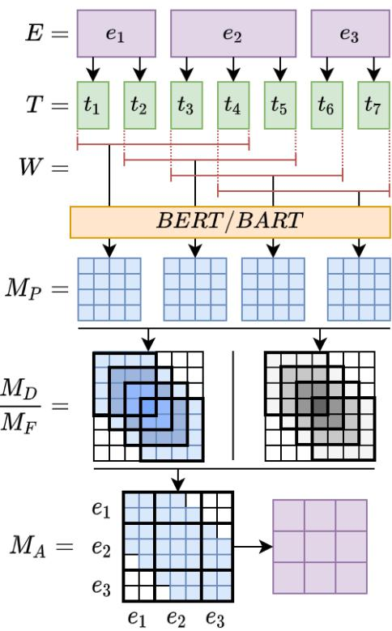  
Figure 1: Small-scale example of the discourse extraction approach. Purple=EDUs, green=sub-word embeddings, red=input slices of size $t _ { m a x }$ , orange=PLM, blue=self-attention values, grey-scale=frequency count.

2021a). However, despite the difficulties of encoding arbitrarily long documents, we believe that to systematically explore the relationship between PLMs and discourse, considering complete documents is imperative. Along these lines, recent work started to tackle the inherent input-length limitation of general transformer models through additional recurrence in the Transformer-XL model (Dai et al., 2019), compression modules (Rae et al., 2020) or sparse patterns (e.g., as in the Reformer (Kitaev et al., 2020), BigBird (Zaheer et al., 2020), and Longformer (Beltagy et al., 2020) models). While all these approaches to extend the maximum document length of transformer-based models are important to create more globally inspired models, the document-length limitation is still practically and theoretically in place, with models being limited to a fixed number of pre-defined tokens the model can process. Furthermore, with many proposed systems still based on more established PLMs (e.g., BERT) and with no single dominant solution for the general problem of the input length-limitation yet, we believe that even with the restriction being actively tackled, an in-depth analysis of traditional PLMs with discourse is highly valuable to establish a solid understanding of the amount of semantic and pragmatic information captured.

Besides the described BERTology work, we got encouraged to explore fine-tuned extensions of standard PLMs through previous work showing the benefit of discourse parsing for many downstream tasks, such as summarization (Gerani et al., 2019), sentiment analysis (Bhatia et al., 2015; Nejat et al., 2017; Hogenboom et al., 2015) and text classification (Ji and Smith, 2017). Conversely, we recently showed promising results when inferring discourse structures from related downstream tasks, such as sentiment analysis (Huber and Carenini, 2020) and summarization (Xiao et al., 2021b). Given this bidirectional synergy between discourse and the mentioned downstream tasks, we move beyond traditional experiments focusing on standard PLMs and additionally explore discourse structures of PLMs fine-tuned on a variety of auxiliary tasks.

## 3 Discourse Extraction Method

With PLMs rather well analyzed according to their syntactic capabilities, large-scale discourse structures have been less explored. One reason for this is the input length constraint of transformer models. While this is generally not prohibitive for intrasentence syntactic structures (e.g., presented in Wu et al. (2020)), it does heavily influence large-scale discourse structures, operating on complete (potentially long) documents. Overcoming this limitation is non-trivial, since traditional transformer-based models only allow for fixed, short inputs.

Aiming to systematically explore the ability of PLMs to capture discourse, we investigate a novel way to effectively extract discourse structures from the self-attention component of the BERT and BART models. We thereby extend our previously proposed tree-generation methodology (Xiao et al., 2021b) to support the input length constraints of standard PLMs using a sliding-window approach in combination with matrix frequency normalization and an EDU aggregation method. Figure 1 visualizes the complete process on a small scale example with 3 EDUs and 7 sub-word embeddings.

The Tree Generation Procedure we previously proposed in Xiao et al. (2021b) explores a twostage approach to obtain discourse structures from a transformer model, by-passing the input-length constraint. Using the intuition that the selfattention score between any two EDUs is an indicator of their semantic/pragmatic relatedness, influencing their distance in a projective discourse tree, they use the CKY dynamic programming approach (Jurafsky and Martin, 2014) to generate constituency trees based on the internal selfattention of the transformer model. To generate dependency trees, we apply the same intuition used to infer discourse trees with the Eisner algorithm (Eisner, 1996). Since we explore the discourse information captured in standard PLMs, we can’t directly transfer our two-stage approach in Xiao et al. (2021b), first encoding individual EDUs using BERT and subsequently feeding the dense representations into a fixed-size transformer model. Instead, we propose a new method to overcome the length-limitation of the transformer model2.

The Sliding-Window Approach is at the core of our new methodology to overcome the inputlength constraint. We first tokenize arbitrarily long documents with n EDUs $E = \{ e _ { 1 } , . . . , e _ { n } \}$ into the respective sequence of m sub-word tokens $T =$ $\{ t _ { 1 } , . . . t _ { m } \}$ with $n \ll m ,$ according to the PLM tokenization method (WordPiece for BERT, Byte-Pair-Encoding for BART), as show at the top of

Figure 1. Using the sliding window approach, we subdivide the m sub-word tokens into sequences of maximum input length $t _ { m a x } .$ , defined by the PLM $( t _ { m a x } = 5 1 2$ for BERT, $t _ { m a x } = 1 0 2 4$ for BART). Using a stride of 1, we generate $( m - t _ { m a x } ) + 1$ sliding windows $W$ , feed them into the PLM, and extract the resulting $t _ { m a x } \times t _ { m a x }$ partial square selfattention matrices $( M _ { P }$ in Figure 1) for a specific self-attention head3.

The Frequency Normalization Method allows us to combine the partially overlapping selfattention matrices $M _ { P }$ into a single document-level matrix $M _ { D }$ of size $m \times m$ . To this end, we combine multiple overlapping windows, generated due to the stride size of 1, by adding up the self-attention cells, while keeping track of the number of overlaps in a separate $m \times m$ frequency matrix $M _ { F }$ We then divide $M _ { D }$ by the frequency matrix $M _ { F }$ to generate a frequency normalized self-attention matrix $M _ { A }$ (see bottom of Figure 1).

The EDU Aggregation is the final processing step to obtain the document-level self-attention matrix. In this step, the $m$ sub-word tokens $T = \{ t _ { 1 } , . . . t _ { m } \}$ are aggregated back into n EDUs $E = \{ e _ { 1 } , . . . , e _ { n } \}$ by computing the average bidirectional self-attention score between any two EDUs in $M _ { A }$ . For example, in Figure 1, we aggregate the scores in cells $M _ { A } [ 0 ; 1 , 5 ; 6 ]$ to compute the final output of cell [0, 2] (purple matrix in Figure 1) and $M _ { A } [ 5 ; 6 , 0 ; 1 ]$ to generate the value of cell [0, 2]. This way, we obtain the average bidirectional selfattention scores between $E D U _ { 1 }$ and $E D U _ { 3 }$ . We use the resulting $n \times n$ matrix as the input to the CKY/Eisner discourse tree generation methods.

## 4 Experimental Setup

## 4.1 Pre-Trained Models

We select the BERT-base (110 million parameters) and BART-large (406 million parameters) models for our experiments. We choose these models for their diverse objectives (encoder-only vs. encoderdecoder), popularity for diverse fine-tuning tasks, and their prior successful exploration in regards to discourse information (Zhu et al., 2020; Koto et al., 2021a). For the BART-large model, we limit our analysis to the encoder, as motivated in Koto et al. (2021a), leaving experiments with the decoder and cross-attention for future work.

<table><tr><td>Dataset</td><td>Task</td><td>Domain</td></tr><tr><td>IMDB(2014)</td><td>Sentiment</td><td>Movie Reviews</td></tr><tr><td>Yelp(2015)</td><td>Sentiment</td><td>Reviews</td></tr><tr><td>SST-2(2013)</td><td>Sentiment</td><td>Movie Reviews</td></tr><tr><td>MNLI(2018)</td><td>NLI</td><td>Range of Genres</td></tr><tr><td>CNN-DM(2016)</td><td>Summarization</td><td>News</td></tr><tr><td>XSUM(2018)</td><td>Summarization</td><td>News</td></tr><tr><td>SQuAD(2016)</td><td>Question-Answering</td><td>Wikipedia</td></tr></table>

Table 1: The seven fine-tuning datasets used in this work along with the underlying tasks and domains.

## 4.2 Fine-Tuning Tasks and Datasets

We explore the BERT model fine-tuned on two classification tasks, namely sentiment analysis and natural language inference (NLI). For our analysis on BART, we select the abstractive summarization and question answering tasks. Table 1 summarizes the 7 datasets used to fine-tune PLMs in this work, along with their underlying tasks and domains4.

## 4.3 Evaluation Treebanks

RST-DT (Carlson et al., 2002) is the largest English RST-style discourse treebank, containing 385 Wall-Street-Journal articles, annotated with full constituency discourse trees. To generate additional dependency trees, we apply the conversion algorithm proposed in Li et al. (2014).

GUM (Zeldes, 2017) is a steadily growing treebank of richly annotated texts. In the current version 7.3, the dataset contains 168 documents from 12 genres, annotated with full RST-style constituency and dependency discourse trees.

All evaluations shown in this paper are executed on the 38 and 20 documents in the RST-DT and GUM test-sets, to be comparable with previous baselines and supervised models. A similarly-sized validation-set is used where mentioned to determine the best performing self-attention head.

## 4.4 Baselines and Evaluation Metrics

Simple Baselines: We compare the inferred constituency trees against right- and left-branching structures. For dependency trees, we evaluate against simple chain and inverse chain structures. Distantly Supervised Baselines: We compare our results obtained in this paper against our previous approach presented in Xiao et al. (2021b), using similar CKY and Eisner tree-generation methods to infer constituency and dependency tree structures from a summarization model trained on the CNN-DM and New York Times (NYT) corpora (referred to as SumCNN-DM and SumNYT)5.

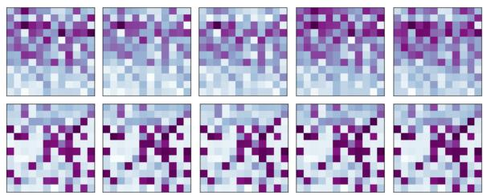  
(a) BERT: PLM, +IMDB, +Yelp, +SST-2, +MNLI

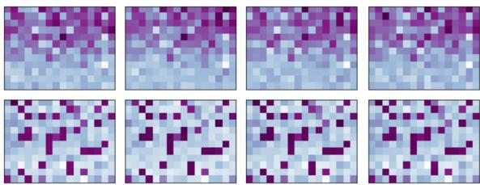  
(b) BART: PLM, +CNN-DM, +XSUM, +SQuAD  
Figure 2: Constituency (top) and dependency (bottom) discourse tree evaluation of BERT (a) and BART (b) models on GUM. Purple=high score, Blue=low score. Left-to-right: self-attention heads, top-to-bottom: high layers to low layers. + indicates fine-tuning dataset.

Supervised Baseline: We select the popular Two-Stage discourse parser (Wang et al., 2017) as our supervised baseline, due to its strong performance, available model checkpoints and code6, as well as the traditional architecture. We use the published Two-Stage parser checkpoint on RST-DT (from here on called Two-StageRST-DT) and re-train the discourse parser on GUM (Two-StageGUM). We convert the generated constituency structures into dependency trees following Li et al. (2014).

Evaluation Metrics: We apply the original parseval score to compare discourse constituency structures with gold-standard treebanks, as argued in Morey et al. (2017). To evaluate the generated dependency structures, we use the Unlabeled Attachment Score (UAS).

## 5 Experimental Results

## 5.1 Discourse Locality

Our discourse tree generation approach described in section 3 directly uses self-attention matrices to generate discourse trees. The standard BERT model contains 144 of those self-attention matrices (12 layers, 12 self-attention heads each), all of which potentially encode discourse structures. For the BART model, this number is even higher, consisting of 12 layers with 16 self-attention heads each. With prior work suggesting the locality of discourse information in PLMs (e.g., Raganato and Tiedemann (2018); Marecek and Rosaˇ (2019); Xiao et al. (2021b)), we analyze every self-attention matrix individually to gain a better understanding of their alignment with discourse information.

Besides investigating standard PLMs, we also explore the robustness of discourse information across fine-tuning tasks. We believe that this is an important step to better understand if the captured discourse information is general and robust, or if it is “re-learned” from scratch for downstream tasks. To the best of our knowledge, no previous analysis of this kind has been performed in the literature.

To this end, Figure 2 shows the constituency and dependency structure overlap of the generated discourse trees from individual self-attention heads with the gold-standard tree structures of the GUM dataset7. The heatmaps clearly show that constituency discourse structures are mostly captured in higher layers, while dependency structures are more evenly distributed across layers. Comparing the patterns between models, we find that, despite being fine-tuned on different downstream tasks, the discourse information is consistently encoded in the same self-attention heads. Even though the best performing self-attention matrix is not consistent, discourse information is clearly captured in a “local" subset of self-attention heads across all presented fine-tuning tasks. This plausibly suggests that the discourse information in pre-trained BERT and BART models is robust and general, requiring only minor adjustments depending on the fine-tuning task.

## 5.2 Discourse Quality

We now focus on assessing the discourse information captured in the single best-performing selfattention head. In Table 2, we compare the discourse structure quality of pre-trained and finetuned PLMs in the context of supervised models, distantly supervised approaches and simple baselines. We show the oracle-picked best head on the test-set, analyzing the upper-bound for the potential performance of PLMs on RST-style discourse structures. This is not a realistic scenario, as the best performing head is generally not known apriori. Hence, we also explore the performance using a small-scale validation set to pick the bestperforming self-attention matrix. In this more realistic scenario for discourse parsing, we find that scores on average drop by 1.55 points for BERT and 1.33% for BART compared to the oraclepicked performance of a single self-attention matrix. We show detailed results of this degradation in Appendix C8. Our results in Table 2 are separated into three sub-tables, showing the results for BERT, BART and baseline models on the RST-DT and GUM treebanks, respectively. In the BERT and BART sub-table, we further annotate each performance with , , , indicating the relative performance to the standard pre-trained model as supe-

<table><tr><td rowspan="2">Model</td><td colspan="2">RST-DT</td><td colspan="2">GUM</td></tr><tr><td>Span</td><td>UAS</td><td>Span</td><td>UAS</td></tr><tr><td colspan="5">BERT</td></tr><tr><td>rand. init</td><td>↓25.5</td><td>↓13.3</td><td>↓23.2</td><td>↓12.4</td></tr><tr><td>PLM</td><td>• 35.7</td><td>● 45.3</td><td>● 33.0</td><td>• 45.2</td></tr><tr><td>+ IMDB</td><td>↓35.4</td><td>↓42.8</td><td>● 33.0</td><td>↓43.3</td></tr><tr><td>+ Yelp</td><td>↓34.7</td><td>↓42.3</td><td>↓32.6</td><td>↓43.7</td></tr><tr><td>+ SST-2</td><td>↓35.5</td><td>↓42.9</td><td>↓32.6</td><td>↓43.5</td></tr><tr><td>+ MNLI</td><td>↓34.8</td><td>↓41.8</td><td>↓32.4</td><td>↓43.3</td></tr><tr><td colspan="5">BART</td></tr><tr><td>rand. init</td><td>↓25.3</td><td>↓12.5</td><td>↓23.2</td><td>↓12.2</td></tr><tr><td>PLM</td><td>● 39.1</td><td>• 41.7</td><td>● 31.8</td><td>● 41.8</td></tr><tr><td>+ CNN-DM</td><td>↑40.9</td><td>↑44.3</td><td>↑32.7</td><td>↑42.8</td></tr><tr><td>+ XSUM</td><td>↑40.1</td><td>↑41.9</td><td>↑32.1</td><td>↓39.9</td></tr><tr><td>+ SQuAD</td><td>↑40.1</td><td>↑43.2</td><td>↓31.3</td><td>↓40.7</td></tr><tr><td colspan="5">Baselines</td></tr><tr><td>RB / Chain</td><td>9.3</td><td>40.4</td><td>9.4</td><td>41.7</td></tr><tr><td>LB / Chain-1</td><td>7.5</td><td>12.7</td><td>1.5</td><td>12.2</td></tr><tr><td>SumCNN-DM</td><td>21.4</td><td>20.5</td><td>17.6</td><td>15.8</td></tr><tr><td>SumNYT</td><td>24.0</td><td>15.7</td><td>18.2</td><td>12.6</td></tr><tr><td>Two-StageRST-DT</td><td>72.0</td><td>71.2</td><td>54.0</td><td>54.5</td></tr><tr><td>Two-StageGuM</td><td>65.4</td><td>61.7</td><td>58.6</td><td>56.7</td></tr></table>

Table 2: Original parseval (Span) and Unlabelled Attachment Score (UAS) of the single best performing self-attention matrix of the BERT and BART models compared with baselines and previous work. , , indicate better, same, worse performance compared to the PLM. “rand. init"=Randomly initialized transformer model of similar architecture as the PLM, RB=Right-Branching, LB=Left-Branching, Chain-1=Inverse chain.

rior, equal, or inferior.

Taking a look at the top sub-table (BERT) we find that, as expected, the randomly initialized transformer model achieves the worst performance. Fine-tuned models perform equal or worse than the standard PLM. Despite the inferior results of the fine-tuned models, the drop is rather small, with the sentiment analysis models consistently outperforming NLI. This seems reasonable, given that the sentiment analysis objective is intuitively more aligned with discourse structures (e.g., long-form reviews with potentially complex rhetorical structures) than the between-sentence NLI task, not involving multi-sentential text.

In the center sub-table (BART), a different trend emerges. While the worst performing model is still (as expected) the randomly initialized system, finetuned models mostly outperform the standard PLM. Interestingly, the model fine-tuned on the CNN-DM corpus consistently outperforms the BART baseline, while the XSUM model performs better on all but the GUM dependency structure evaluation. On one hand, the superior performance of both summarization models on the RST-DT dataset seems reasonable, given that the fine-tuning datasets and the evaluation treebank are both in the news domain. The strong results of the CNN-DM model on the GUM treebank, yet inferior performance of XSUM, potentially hints towards dependency discourse structures being less prominent when fine-tuning on the extreme summarization task, compared to the longer summaries in the CNN-DM corpus. The question-answering task evaluated through the SQuAD fine-tuned model un derperforms the standard PLM on GUM, however reaches superior performance on RST-DT. Since the SQuAD corpus is a subset of Wikipedia articles, more aligned with news articles than the 12 genres in GUM, we believe the stronger performance on RST-DT (i.e., news articles) is again reasonable, yet shows weaker generalization capabilities across domains (i.e., on the GUM corpus). Interestingly, the question-answering task seems more aligned with dependency than constituency trees, in line with what would be expected from a factoid-style question-answering model, focusing on important entities, rather than global constituency structures.

Directly comparing the BERT and BART models, the former performs better on three out of four metrics. At the same time, fine-tuning hurts the performance for BERT, however, improves BART models. Plausibly, these seemingly unintuitive results may be caused by the following co-occurring circumstances: (1) The inferior performance of BART can potentially be attributed to the decoder component capturing parts of the discourse structures, as well as the larger number of self-attention heads “diluting” the discourse information. (2) The different trends regarding fine-tuned models might be directly influenced by the input-length limitation to 512 (BERT) and 1024 (BART) subword tokens during the fine-tuning stage, hampering the ability to capture long-distance semantic and pragmatic relationships. This, in turn, limits the amount of discourse information captured, even for document-level datasets (e.g., Yelp, CNN-DM, SQuAD). With this restriction being more prominent in BERT, it potentially explains the comparably low performance of the fine-tuned models.

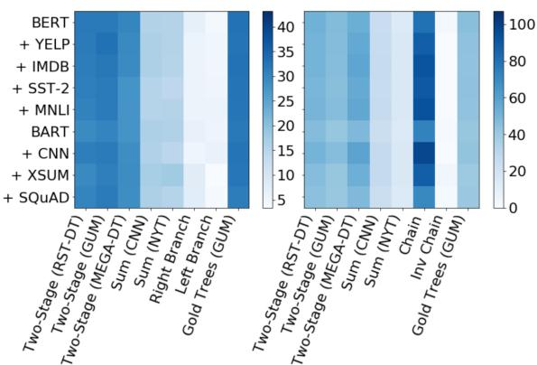  
Figure 3: PLM discourse constituency (left) and dependency (right) structure overlap with baselines and gold trees (e.g., BERT  Two-Stage (RST-DT)) according to the original parseval and UAS metrics.

Finally, the bottom sub-table puts our results in the context of previously proposed supervised and distantly-supervised models, as well as simple baselines. Compared to simple right- and leftbranching trees (Span), the PLM-based models reach clearly superior performance. Looking at the chain/inverse chain structures (UAS), the improvements are generally lower, however, the vast majority still outperforms the baseline. Comparing the first two sub-tables against completely supervised methods (Two-StageRST-DT, Two-StageGUM), the BERT- and BART-based models are, unsurprisingly, inferior. Lastly, compared to the distantly supervised SumCNN-DM and $\operatorname { S u m } _ { \operatorname { N Y T } }$ models, the PLM-based discourse performance shows clear improvements over the 6-layer, 8-head standard transformer.

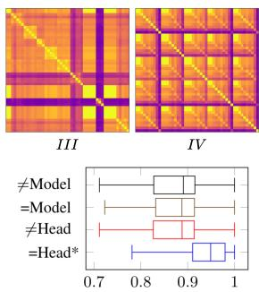

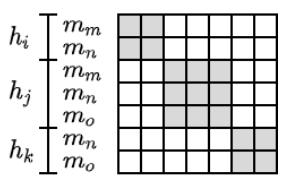

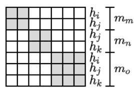  
(a) Head-aligned  
(b) Model-aligned  
Figure 4: Nested aggregation approach for discourse similarity. (a) Grey cells contain same-head, white cells indicate different heads. (b) Grey cells contain samemodel, white cells indicate different models. Column indices equal row indices.

## 5.3 Discourse Similarity

Further exploring what kind of discourse information is captured in the PLM self-attention matrices, we directly compare the emergent discourse structures with trees inferred from existing discourse parsers and simple baselines. This way, we aim to better understand if the information encapsulated in PLMs is complementary to existing methods, or if the PLMs solely capture trivial discourse phenomena and simple biases (e.g., resemble rightbranching constituency trees). Since the GUM dataset contains a more diverse set of test documents (12 genres) than the RST-DT corpus (exclusively news articles), we perform our experiments from here on only on the GUM treebank.

Figure 3 shows the micro-average structural overlap of discourse constituency (left) and dependency (right) trees between the PLM-generated discourse structures and existing methods, baselines, as well as gold-standard trees. Noticeably, the generated constituency trees (on the left) are most aligned with the structures predicted by supervised discourse parsers, showing only minimal overlap to simple structures (i.e., right- and left-branching trees). Taking a closer look at the generated dependency structures presented on the right side in Figure 3, the alignment between PLM inferred discourse trees and the simple chain structure is predominant, suggesting a potential weakness in regards to the discourse exposed by the Eisner algorithm in the BERT and BART model. Not surprisingly, the highest overlap between PLM-generated trees and the chain structure occurs when finetuning on the CNN-DM dataset, well-known to contain a strong lead-bias (Xing et al., 2021).

To better understand if the PLM-based constituency structures are complementary to existing, supervised discourse parsers, we further analyze the correctly predicted overlap. More specifically, we compute the intersection between PLM generated structures and gold-standard trees as well as previously proposed models and the gold-standard. Subsequently, we intersect the two resulting sets (e.g., BERT Gold Trees Two-Stage (RST-DT) Gold Trees). This way, we explore if the correctly predicted PLM discourse structures are a subset of the correctly predicted trees by supervised approaches, or if complementary discourse information is captured. We find that > 20% and > 16% of the correctly predicted constituency and dependency structures of our PLM discourse inference approach are not captured by supervised models, making the exploration of ensemble methods a promising future avenue. A detailed version of Fig. 3 as well as more specific results regarding the correctly predicted overlap of discourse structures are shown in Appendix E.

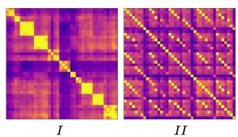

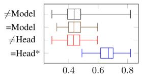

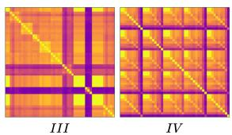  
(a) Constituency Similarity  
(b) Dependency Similarity  
Figure 5: BERT self-attention similarities on GUM. Top: Visual analysis of head-aligned (I&III) and model-aligned (II&IV ) heatmaps. Yellow=high structural overlap, purple=low structural overlap. Bottom: Aggregated similarity of same heads, same models, different heads and different models showing the min, max and quartiles of the underlying distribution. \*Significantly better than respective =Head/=Model performance with p-value < 0.05.

## 5.4 Discourse Redundancy

Up to this point, our quantitative analysis of the ability of PLMs to capture discourse information has been limited to the single best-performing head. However, looking at individual models, the discourse performance distribution in Figure 2 suggests that a larger subset of self-attention heads performs similarly well (i.e., there are several dark purple cells in each heatmap). This leads to the interesting questions if the information captured in different, top-performing self-attention heads is redundant or complementary. Similarly, Figure 2 indicates that the same heads perform well across different fine-tuning tasks, leading to the question if the discourse structures captured in a single selfattention matrix of different fine-tuned models is consistent, or varies depending on the underlying task. Hence, we take a detailed look at the similarity of model self-attention heads in regards to their alignment with discourse information and explore if (1) the top performing heads $h _ { i } , . . . , h _ { k }$ of a specific model $m _ { m }$ capture redundant discourse structures, and if (2) the discourse information captured by a specific head $h _ { i }$ across different models $m _ { m } , . . . , m _ { o }$ contain similar discourse information.

Specifically, we pick the top 10 best performing self-attention matrices of each model, remove selfattention heads that don’t appear in at least two models (since no comparisons can be made), and compare the generated discourse structures in a nested aggregation approach.

Figure 4 shows a small-scale example of our nested visualization methodology. For the selfattention head-aligned approach (Figure 4 (a)), high similarity values (calculated as the microaverage structural overlap) along the diagonal (grey cells) would be expected if the same head $h _ { i }$ encodes consistent discourse information across different fine-tuning tasks and datasets. Inversely, the model-aligned matrix (Figure 4 (b)) should show high values along the diagonal if different heads $h _ { i } , . . . , h _ { k }$ in the same model $m _ { k }$ capture redundant discourse information. Besides the visual inspection methodology presented in Figure 4, we also compare aggregated similarities between the same head (=Head) against different heads (=Head) and between the same model (=Model) against different models (=Model) (i.e., grey cells (=) and white cells (=) in Figure 4 (a) and (b)). In order to assess the statistical significance of the resulting differences in the underlying distributions, we compute a two-sided, independent t-test between same/different models and same/different heads9.

The resulting redundancy evaluations for BERT are presented in Figure $5 ^ { \mathrm { i 0 } }$ . It appears that the same self-attention heads $h _ { i }$ consistently encode similar discourse information across models indicated by: (1) High similarities (yellow) along the diagonal in heatmaps I&III and (2) through the statistically significant difference in distributions at the bottom of Figure 5 (a) and (b). However, different self-attention heads $h _ { i } , . . . , h _ { k }$ of the same model $m _ { m }$ encode different discourse information (heatmaps II&IV ). While the trend is stronger for constituency tree structures, there is a single dependency self-attention head which does generally not align well between models and heads (purple line in heatmap III). Plausibly, this specific self-attention head encodes fine-tuning task specific discourse information, making it a prime candidate for further investigations in future work. Furthermore, the similarity patterns observed in Figure 5 (a) and (b) point towards an opportunity to combine model self-attention heads to improve the discourse inference performance compared to the scores shown in Table 2, where each self-attention head was assessed individually, in future work.

## 6 Conclusions

In this paper, we extend the line of BERTology work by focusing on the important, yet less explored, alignment of pre-trained and fine-tuned PLMs with large-scale discourse structures. We propose a novel approach to infer discourse information for arbitrarily long documents. In our experiments, we find that the captured discourse information is consitently local and general, even across a collection of fine-tuning tasks. We compare the inferred discourse trees with supervised, distantly supervised and simple baselines to explore the structural overlap, finding that constituency discourse trees align well with supervised models, however, contain complementary discourse information. Lastly, we individually explore self-attention matrices to analyze the information redundancy. We find that similar discourse information is consistently captured in the same heads.

In the future, we intend to explore additional discourse inference strategies based on the insights we gained in this analysis. Specifically, we want to explore more sophisticated methods to extract a single discourse tree from multiple self-attention matrices, rather than only the single best-performing head. Further, we want to investigate the relationship between supervised discourse parsers and PLM generated discourse trees and more long term, we plan to analyze PLMs with enhanced input-length limitations.

## Acknowledgements

We thank the anonymous reviewers and the UBC NLP group for their insightful comments and suggestions. This research was supported by the Language & Speech Innovation Lab of Cloud BU, Huawei Technologies Co., Ltd and the Natural Sciences and Engineering Research Council of Canada (NSERC). Nous remercions le Conseil de recherches en sciences naturelles et en génie du Canada (CRSNG) de son soutien.

## References

Ashutosh Adhikari, Achyudh Ram, Raphael Tang, and Jimmy Lin. 2019. Docbert: Bert for document classification. arXiv preprint arXiv:1904.08398.

Iz Beltagy, Matthew E Peters, and Arman Cohan. 2020. Longformer: The long-document transformer. arXiv preprint arXiv:2004.05150.

Parminder Bhatia, Yangfeng Ji, and Jacob Eisenstein. 2015. Better document-level sentiment analysis from RST discourse parsing. In Proceedings of the 2015 Conference on Empirical Methods in Natural Language Processing, pages 2212–2218, Lisbon, Portugal. Association for Computational Linguistics.

Lynn Carlson, Mary Ellen Okurowski, and Daniel Marcu. 2002. RST discourse treebank. Linguistic Data Consortium, University of Pennsylvania.

Zihang Dai, Zhilin Yang, Yiming Yang, Jaime Carbonell, Quoc Le, and Ruslan Salakhutdinov. 2019. Transformer-XL: Attentive language models beyond a fixed-length context. In Proceedings of the 57th Annual Meeting ofthe Associationfor Computational Linguistics, pages 2978–2988, Florence, Italy. Association for Computational Linguistics.

Jacob Devlin, Ming-Wei Chang, Kenton Lee, and Kristina Toutanova. 2019. BERT: Pre-training of deep bidirectional transformers for language understanding. In Proceedings ofthe 2019 Conference of the North American Chapter ofthe Associationfor Computational Linguistics: Human Language Technologies, Volume 1 (Long and Short Papers), pages 4171–4186, Minneapolis, Minnesota. Association for Computational Linguistics.

Qiming Diao, Minghui Qiu, Chao-Yuan Wu, Alexander J. Smola, Jing Jiang, and Chong Wang. 2014. Jointly modeling aspects, ratings and sentiments for movie recommendation (jmars). In Proceedings of the 20th ACM SIGKDD International Conference on Knowledge Discovery and Data Mining, KDD ’14, page 193–202, New York, NY, USA. Association for Computing Machinery.

Jason M. Eisner. 1996. Three new probabilistic models for dependency parsing: An exploration. In COLING

1996 Volume 1: The 16th International Conference on Computational Linguistics.

Shima Gerani, Giuseppe Carenini, and Raymond T. Ng. 2019. Modeling content and structure for abstractive review summarization. Computer Speech & Language, 53:302–331.

Grigorii Guz and Giuseppe Carenini. 2020. Coreference for discourse parsing: A neural approach. In Proceedings ofthe First Workshop on Computational Approaches to Discourse, pages 160–167, Online. Association for Computational Linguistics.

Grigorii Guz, Patrick Huber, and Giuseppe Carenini. 2020. Unleashing the power of neural discourse parsers - a context and structure aware approach using large scale pretraining. In Proceedings ofthe 28th International Conference on Computational Linguistics, pages 3794–3805, Barcelona, Spain (Online). International Committee on Computational Linguistics.

Hugo Hernault, Helmut Prendinger, Mitsuru Ishizuka, et al. 2010. Hilda: A discourse parser using support vector machine classification. Dialogue & Discourse, 1(3).

John Hewitt and Christopher D. Manning. 2019. A structural probe for finding syntax in word representations. In Proceedings of the 2019 Conference of the North American Chapter of the Association for Computational Linguistics: Human Language Technologies, Volume 1 (Long and Short Papers), pages 4129–4138, Minneapolis, Minnesota. Association for Computational Linguistics.

Alexander Hogenboom, Flavius Frasincar, Franciska de Jong, and Uzay Kaymak. 2015. Using rhetorical structure in sentiment analysis. Commun. ACM, 58(7):69–77.

Patrick Huber and Giuseppe Carenini. 2020. MEGA RST discourse treebanks with structure and nuclearity from scalable distant sentiment supervision. In Proceedings of the 2020 Conference on Empirical Methods in Natural Language Processing (EMNLP), pages 7442–7457, Online. Association for Computational Linguistics.

Ganesh Jawahar, Benoît Sagot, and Djamé Seddah. 2019. What does BERT learn about the structure of language? In Proceedings ofthe 57th Annual Meeting of the Association for Computational Linguistics, pages 3651–3657, Florence, Italy. Association for Computational Linguistics.

Yangfeng Ji and Jacob Eisenstein. 2014. Representation learning for text-level discourse parsing. In Proceedings of the 52nd Annual Meeting of the Associationfor Computational Linguistics (Volume 1: Long Papers), pages 13–24, Baltimore, Maryland. Association for Computational Linguistics.

Yangfeng Ji and Noah A. Smith. 2017. Neural discourse structure for text categorization. In Proceedings ofthe 55th Annual Meeting ofthe Associationfor Computational Linguistics (Volume 1: Long Papers), pages 996–1005, Vancouver, Canada. Association for Computational Linguistics.

Mandar Joshi, Danqi Chen, Yinhan Liu, Daniel S. Weld, Luke Zettlemoyer, and Omer Levy. 2020. Span-BERT: Improving pre-training by representing and predicting spans. Transactions ofthe Associationfor Computational Linguistics, 8:64–77.

Shafiq Joty, Giuseppe Carenini, and Raymond T. Ng. 2015. CODRA: A novel discriminative framework for rhetorical analysis. Computational Linguistics, 41(3):385–435.

Dan Jurafsky and James H Martin. 2014. Speech and language processing, volume 3. Pearson London.

Taeuk Kim, Jihun Choi, Daniel Edmiston, and Sang goo Lee. 2020. Are pre-trained language models aware of phrases? simple but strong baselines for grammar induction. In International Conference on Learning Representations.

Nikita Kitaev, Lukasz Kaiser, and Anselm Levskaya. 2020. Reformer: The efficient transformer. In International Conference on Learning Representations.

Naoki Kobayashi, Tsutomu Hirao, Hidetaka Kamigaito, Manabu Okumura, and Masaaki Nagata. 2020. Topdown rst parsing utilizing granularity levels in documents. In Proceedings ofthe AAAI Conference on Artificial Intelligence, volume 34, pages 8099–8106.

Naoki Kobayashi, Tsutomu Hirao, Kengo Nakamura, Hidetaka Kamigaito, Manabu Okumura, and Masaaki Nagata. 2019. Split or merge: Which is better for unsupervised RST parsing? In Proceedings of the 2019 Conference on Empirical Methods in Natural Language Processing and the 9th International Joint Conference on Natural Language Processing (EMNLP-IJCNLP), pages 5797–5802, Hong Kong, China. Association for Computational Linguistics.

Fajri Koto, Jey Han Lau, and Timothy Baldwin. 2021a. Discourse probing of pretrained language models. In Proceedings ofthe 2021 Conference ofthe North American Chapter of the Association for Computational Linguistics: Human Language Technologies, pages 3849–3864, Online. Association for Computational Linguistics.

Fajri Koto, Jey Han Lau, and Timothy Baldwin. 2021b. Top-down discourse parsing via sequence labelling. In Proceedings of the 16th Conference of the European Chapter ofthe Associationfor Computational Linguistics: Main Volume, pages 715–726, Online. Association for Computational Linguistics.

Murathan Kurfalı and Robert Östling. 2021. Probing multilingual language models for discourse. In Proceedings ofthe 6th Workshop on Representation Learning for NLP (RepL4NLP-2021), pages 8–19, Online. Association for Computational Linguistics.

Mike Lewis, Yinhan Liu, Naman Goyal, Marjan Ghazvininejad, Abdelrahman Mohamed, Omer Levy, Veselin Stoyanov, and Luke Zettlemoyer. 2020. BART: Denoising sequence-to-sequence pre-training for natural language generation, translation, and comprehension. In Proceedings ofthe 58th Annual Meeting ofthe Associationfor Computational Linguistics, pages 7871–7880, Online. Association for Computational Linguistics.

Sujian Li, Liang Wang, Ziqiang Cao, and Wenjie Li. 2014. Text-level discourse dependency parsing. In Proceedings of the 52nd Annual Meeting of the Association for Computational Linguistics (Volume 1: Long Papers), pages 25–35, Baltimore, Maryland. Association for Computational Linguistics.

Yinhan Liu, Myle Ott, Naman Goyal, Jingfei Du, Mandar Joshi, Danqi Chen, Omer Levy, Mike Lewis, Luke Zettlemoyer, and Veselin Stoyanov. 2019. Roberta: A robustly optimized bert pretraining approach. arXiv preprint arXiv:1907.11692.

William C Mann and Sandra A Thompson. 1988. Rhetorical structure theory: Toward a functional theory of text organization. Text-Interdisciplinary Journalfor the Study ofDiscourse, 8(3):243–281.

David Marecek and Rudolf Rosa. 2019.ˇ From balustrades to pierre vinken: Looking for syntax in transformer self-attentions. In Proceedings of the 2019 ACL Workshop BlackboxNLP: Analyzing and Interpreting Neural Networks for NLP, pages 263– 275, Florence, Italy. Association for Computational Linguistics.

Julian Michael, Jan A. Botha, and Ian Tenney. 2020. Asking without telling: Exploring latent ontologies in contextual representations. In Proceedings ofthe 2020 Conference on Empirical Methods in Natural Language Processing (EMNLP), pages 6792–6812, Online. Association for Computational Linguistics.

Mathieu Morey, Philippe Muller, and Nicholas Asher. 2017. How much progress have we made on RST discourse parsing? a replication study of recent results on the RST-DT. In Proceedings of the 2017 Conference on Empirical Methods in Natural Language Processing, pages 1319–1324, Copenhagen, Denmark. Association for Computational Linguistics.

Ramesh Nallapati, Bowen Zhou, Cicero dos Santos, Çaglar GuÌ˘ ‡lçehre, and Bing Xiang. 2016. Abstractive text summarization using sequence-to-sequence RNNs and beyond. In Proceedings of The 20th SIGNLL Conference on Computational Natural Language Learning, pages 280–290, Berlin, Germany. Association for Computational Linguistics.

Shashi Narayan, Shay B. Cohen, and Mirella Lapata. 2018. Don’t give me the details, just the summary! topic-aware convolutional neural networks for extreme summarization. In Proceedings of the 2018

Conference on Empirical Methods in Natural Language Processing, pages 1797–1807, Brussels, Belgium. Association for Computational Linguistics.

Bita Nejat, Giuseppe Carenini, and Raymond Ng. 2017. Exploring joint neural model for sentence level discourse parsing and sentiment analysis. In Proceedings of the 18th Annual SIGdial Meeting on Discourse and Dialogue, pages 289–298, Saarbrücken, Germany. Association for Computational Linguistics.

Thanh-Tung Nguyen, Xuan-Phi Nguyen, Shafiq Joty, and Xiaoli Li. 2021. RST parsing from scratch. In Proceedings of the 2021 Conference of the North American Chapter of the Association for Computational Linguistics: Human Language Technologies, pages 1613–1625, Online. Association for Computational Linguistics.

Barlas Oguz, Kushal Lakhotia, Anchit Gupta, Patrick˘ Lewis, Vladimir Karpukhin, Aleksandra Piktus, Xilun Chen, Sebastian Riedel, Wen-tau Yih, Sonal Gupta, et al. 2021. Domain-matched pretraining tasks for dense retrieval. arXiv preprint arXiv:2107.13602.

Lalchand Pandia, Yan Cong, and Allyson Ettinger. 2021. Pragmatic competence of pre-trained language models through the lens of discourse connectives. In Proceedings ofthe 25th Conference on Computational Natural Language Learning, pages 367–379, Online. Association for Computational Linguistics.

Yannis Papanikolaou, Ian Roberts, and Andrea Pierleoni. 2019. Deep bidirectional transformers for relation extraction without supervision. In Proceedings of the 2nd Workshop on Deep Learning Approachesfor Low-Resource NLP (DeepLo 2019), pages 67–75, Hong Kong, China. Association for Computational Linguistics.

Rashmi Prasad, Nikhil Dinesh, Alan Lee, Eleni Miltsakaki, Livio Robaldo, Aravind Joshi, and Bonnie Webber. 2008. The Penn Discourse TreeBank 2.0. In Proceedings of the Sixth International Conference on Language Resources and Evaluation (LREC’08), Marrakech, Morocco. European Language Resources Association (ELRA).

Jack W. Rae, Anna Potapenko, Siddhant M. Jayakumar, Chloe Hillier, and Timothy P. Lillicrap. 2020. Compressive transformers for long-range sequence modelling. In International Conference on Learning Representations.

Alessandro Raganato and Jörg Tiedemann. 2018. An analysis of encoder representations in transformerbased machine translation. In Proceedings of the 2018 EMNLP Workshop BlackboxNLP: Analyzing and Interpreting Neural Networks for NLP, pages 287–297, Brussels, Belgium. Association for Computational Linguistics.

Pranav Rajpurkar, Jian Zhang, Konstantin Lopyrev, and Percy Liang. 2016. SQuAD: 100,000+ questions for

machine comprehension of text. In Proceedings of the 2016 Conference on Empirical Methods in Natural Language Processing, pages 2383–2392, Austin, Texas. Association for Computational Linguistics.

Anna Rogers, Olga Kovaleva, and Anna Rumshisky. 2020. A primer in BERTology: What we know about how BERT works. Transactions ofthe Association for Computational Linguistics, 8:842–866.

Richard Socher, Alex Perelygin, Jean Wu, Jason Chuang, Christopher D. Manning, Andrew Ng, and Christopher Potts. 2013. Recursive deep models for semantic compositionality over a sentiment treebank. In Proceedings of the 2013 Conference on Empirical Methods in Natural Language Processing, pages 1631–1642, Seattle, Washington, USA. Association for Computational Linguistics.

Ashish Vaswani, Noam Shazeer, Niki Parmar, Jakob Uszkoreit, Llion Jones, Aidan N Gomez, Ł ukasz Kaiser, and Illia Polosukhin. 2017. Attention is all you need. In Advances in Neural Information Processing Systems, volume 30. Curran Associates, Inc.

Yizhong Wang, Sujian Li, and Houfeng Wang. 2017. A two-stage parsing method for text-level discourse analysis. In Proceedings ofthe 55th Annual Meeting of the Association for Computational Linguistics (Volume 2: Short Papers), pages 184–188, Vancouver, Canada. Association for Computational Linguistics.

Bonnie Webber, Matthew Stone, Aravind Joshi, and Alistair Knott. 2003. Anaphora and discourse structure. Computational Linguistics, 29(4):545–587.

Adina Williams, Nikita Nangia, and Samuel Bowman. 2018. A broad-coverage challenge corpus for sentence understanding through inference. In Proceedings ofthe 2018 Conference ofthe North American Chapter of the Association for Computational Linguistics: Human Language Technologies, Volume 1 (Long Papers), pages 1112–1122, New Orleans, Louisiana. Association for Computational Linguistics.

Zhiyong Wu, Yun Chen, Ben Kao, and Qun Liu. 2020. Perturbed masking: Parameter-free probing for analyzing and interpreting BERT. In Proceedings ofthe 58th Annual Meeting ofthe Associationfor Computational Linguistics, pages 4166–4176, Online. Association for Computational Linguistics.

Wen Xiao, Iz Beltagy, Giuseppe Carenini, and Arman Cohan. 2021a. Primer: Pyramid-based masked sentence pre-training for multi-document summarization. arXiv preprint arXiv:2110.08499.

Wen Xiao, Patrick Huber, and Giuseppe Carenini. 2021b. Predicting discourse trees from transformerbased neural summarizers. In Proceedings of the 2021 Conference of the North American Chapter of the Association for Computational Linguistics: Human Language Technologies, pages 4139–4152, Online. Association for Computational Linguistics.

Linzi Xing, Wen Xiao, and Giuseppe Carenini. 2021. Demoting the lead bias in news summarization via alternating adversarial learning. In Proceedings ofthe 59th Annual Meeting of the Association for Computational Linguistics and the 11th International Joint Conference on Natural Language Processing (Volume 2: Short Papers), pages 948–954, Online. Association for Computational Linguistics.

Zhilin Yang, Zihang Dai, Yiming Yang, Jaime Carbonell, Russ R Salakhutdinov, and Quoc V Le. 2019. Xlnet: Generalized autoregressive pretraining for language understanding. In Advances in Neural Information Processing Systems, volume 32. Curran Associates, Inc.

Manzil Zaheer, Guru Prashanth Guruganesh, Avi Dubey, Joshua Ainslie, Chris Alberti, Santiago Ontanon, Philip Minh Pham, Anirudh Ravula, Qifan Wang, Li Yang, and Amr Mahmoud El Houssieny Ahmed. 2020. Big bird: Transformers for longer sequences. In Advances in Neural Information Processing Systems.

Amir Zeldes. 2017. The GUM corpus: Creating multilayer resources in the classroom. Language Resources and Evaluation, 51(3):581–612.

Jingqing Zhang, Yao Zhao, Mohammad Saleh, and Peter Liu. 2020. Pegasus: Pre-training with extracted gap-sentences for abstractive summarization. In International Conference on Machine Learning, pages 11328–11339. PMLR.

Xiang Zhang, Junbo Zhao, and Yann LeCun. 2015. Character-level convolutional networks for text classification. In Proceedings ofthe 28th International Conference on Neural Information Processing Systems - Volume 1, NIPS’15, page 649–657, Cambridge, MA, USA. MIT Press.

Zining Zhu, Chuer Pan, Mohamed Abdalla, and Frank Rudzicz. 2020. Examining the rhetorical capacities of neural language models. In Proceedings of the Third BlackboxNLP Workshop on Analyzing and Interpreting Neural Networks for NLP, pages 16–32, Online. Association for Computational Linguistics.

## A Huggingface Models

We investigate 7 fine-tuned BERT and BART models from the huggingface model library, as well as the two pre-trained models. The model names and links are provided in Table 3

<table><tr><td>Pre-Trained</td><td>Fine-Tuned</td><td>Link</td></tr><tr><td>BERT-base</td><td></td><td>https://huggingface.co/bert-base-uncased</td></tr><tr><td>BERT-base</td><td>IMDB</td><td>https://huggingface.co/textattack/bert-base-uncased-imdb</td></tr><tr><td>BERT-base</td><td>Yelp</td><td>https://huggingface.co/fabriceyhc/bert-base-uncased-yelp_polarity</td></tr><tr><td>BERT-base</td><td>SST-2</td><td>https://huggingface.co/textattack/bert-base-uncased-SST-2</td></tr><tr><td>BERT-base</td><td>MNLI</td><td>https://huggingface.co/textattack/bert-base-uncased-MNLI</td></tr><tr><td>BART-large</td><td></td><td>https://huggingface.co/facebook/bart-large</td></tr><tr><td>BART-large</td><td>CNN-DM</td><td>https://huggingface.co/facebook/bart-large-cnn</td></tr><tr><td>BART-large</td><td>XSUM</td><td>https://huggingface.co/facebook/bart-large-xsum</td></tr><tr><td>BART-large</td><td>SQuAD</td><td>https://huggingface.co/valhalla/bart-large-finetuned-squadv1</td></tr></table>

Table 3: Huggingface pre-trained and fine-tuned model links.

## B Test-Set Results on RST-DT and GUM

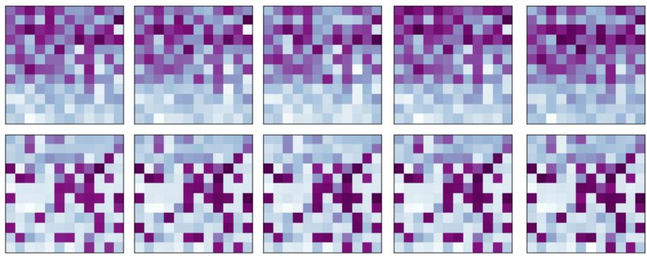  
(a) BERT: PLM, +IMDB, +Yelp, +MNLI, +SST-2

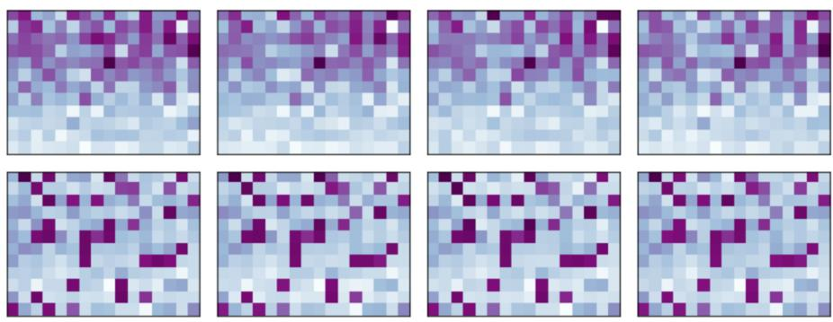  
(b) BART: PLM, +CNN-DM, +XSUM, +SQuAD  
Figure 6: Constituency (top) and dependency (bottom) discourse tree evaluation of BERT (a) and BART (b) models on RST-DT (test). Purple=high score, blue=low score. + indicates fine-tuning dataset.

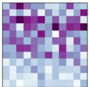

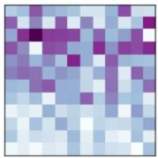

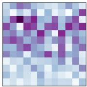

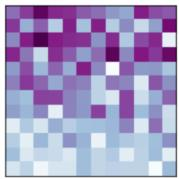

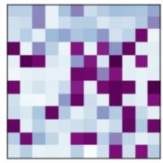  
(a) BERT: PLM, +IMDB, +Yelp, +MNLI, +SST-2

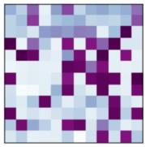

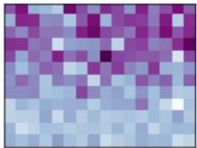

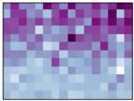

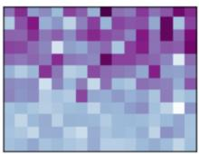

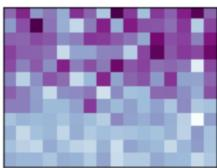

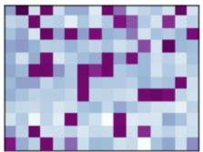

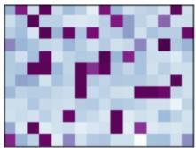

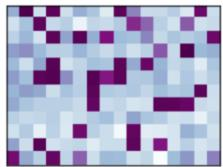  
(b) BART: PLM, +CNN-DM, +XSUM, +SQuAD

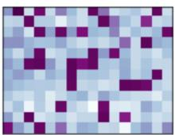  
Figure 7: Constituency (top) and dependency (bottom) discourse tree evaluation of BERT (a) and BART (b) models on GUM (test). Purple=high score, blue=low score. + indicates fine-tuning dataset.

## C Oracle-picked self-attention head compared to validation-picked matrix

<table><tr><td rowspan="2">Model</td><td colspan="2">RST-DT</td><td colspan="2">GUM</td></tr><tr><td>Span</td><td>UAS</td><td>Span</td><td>UAS</td></tr><tr><td colspan="5">BERT</td></tr><tr><td>rand. init PLM</td><td>25.5 (-0.0) 35.7 (-1.6)</td><td>13.3 (-0.0) 45.3 (-4.9)</td><td>23.2 (-0.0) 33.0 (-0.4)</td><td>12.4 (-0.0) 45.2 (-0.0)</td></tr><tr><td>+ IMDB + Yelp</td><td>35.4 (-1.8) 34.7 (-1.0)</td><td>42.8 (-2.4) 42.3 (-1.9)</td><td>33.0 (-3.8) 32.6 (-3.6)</td><td>43.3 (-0.1) 43.7 (-0.0)</td></tr><tr><td>+ SST-2 + MNLI</td><td>35.5 (-1.9) 34.8 (-1.7)</td><td>42.9 (-2.5) 41.8 (-1.4)</td><td>32.6 (-0.3) 32.4 (-0.3)</td><td>43.5 (-0.9) 43.3 (-0.5)</td></tr><tr><td></td><td>BART</td><td></td><td></td><td></td></tr><tr><td>rand. init PLM + CNN-DM</td><td>25.3 (-0.0) 39.1 (-0.4) 40.9 (-0.0)</td><td>12.5 (-0.0) 41.7 (-2.7) 44.3 (-4.0)</td><td>23.2 (-0.0) 31.8 (-0.3) 32.7 (-0.3)</td><td>12.2 (-0.0) 41.8 (-0.0) 42.8 (-0.7)</td></tr><tr><td>+ XSUM + SQuAD</td><td>40.1 (-0.9) 40.1 (-0.0)</td><td>41.9 (-3.4) 43.2 (-4.6)</td><td>32.1 (-1.7) 31.3 (-2.1)</td><td>39.9 (-0.0) 40.7 (-0.1)</td></tr><tr><td></td><td>Baselines</td><td></td><td></td><td></td></tr><tr><td> $\mathrm { R i g h t - B r a n c h / C h a i n }$   $\mathrm { L e f t { - } B r a n c h / C h a i n ^ { - 1 } }$ </td><td>9.3 7.5</td><td>40.4</td><td>9.4</td><td>41.7</td></tr><tr><td> $\mathrm { S u m } _ { \mathrm { C N N - D M } } ( 2 0 2 1 \mathrm { b } )$ </td><td>21.4</td><td>12.7 20.5</td><td>1.5</td><td>12.2</td></tr><tr><td></td><td>24.0</td><td></td><td>17.6</td><td>15.8</td></tr><tr><td> $\mathrm { S u m _ { N Y T } } ( 2 0 2 1 \mathrm { b } )$ </td><td></td><td>15.7</td><td>18.2</td><td>12.6</td></tr><tr><td> $\mathrm { T w o - S t a g e } _ { \mathrm { R S T - D T } } ( 2 0 1 7 )$ </td><td>72.0</td><td>71.2</td><td>54.0</td><td>54.5</td></tr><tr><td></td><td></td><td></td><td></td><td></td></tr><tr><td> $\mathrm { T w o - S t a g e _ { G U M } }$ </td><td>65.4</td><td>61.7</td><td>58.6</td><td>56.7</td></tr></table>

Table 4: Original parseval (Span) and Unlabelled Attachment Score (UAS) of the single best performing oracle self-attention matrix and validation-set picked head (in brackets) of the BERT and BART models compared with baselines and previous work. “rand. init"=Randomly initialized transformer model of similar architecture as the PLM.

## D Detailed Self-Attention Statistics

<table><tr><td rowspan="2">Model</td><td colspan="4">Span</td><td colspan="4">Eisner</td></tr><tr><td>Min</td><td>Med</td><td>Mean</td><td>Max</td><td>Min</td><td>Med</td><td>Mean</td><td>Max</td></tr><tr><td colspan="10">RST-DT</td></tr><tr><td>rand. init</td><td>21.7</td><td>23.4</td><td>23.4</td><td>25.5</td><td>7.5</td><td>10.3</td><td>10.3</td><td>13.3</td></tr><tr><td>PLM</td><td>19.3</td><td>27.0</td><td>27.4</td><td>35.7</td><td>6.6</td><td>17.4</td><td>21.6</td><td>45.3</td></tr><tr><td>+ IMDB</td><td>19.7</td><td>26.9</td><td>27.2</td><td>35.4</td><td>6.6</td><td>16.9</td><td>21.3</td><td>42.8</td></tr><tr><td>+ YELP</td><td>20.2</td><td>26.6</td><td>26.9</td><td>34.7</td><td>7.0</td><td>16.5</td><td>21.0</td><td>42.3</td></tr><tr><td>+ SST-2</td><td>19.5</td><td>27.3</td><td>27.7</td><td>35.5</td><td>7.3</td><td>17.6</td><td>21.9</td><td>42.9</td></tr><tr><td>+ MNLI</td><td>18.5</td><td>26.9</td><td>27.1</td><td>34.8</td><td>6.9</td><td>17.5</td><td>21.5</td><td>41.8</td></tr><tr><td colspan="9">GUM</td></tr><tr><td>rand. init</td><td>18.6</td><td>21.0</td><td>21.0</td><td>23.2</td><td>7.9</td><td>10.1</td><td>10.1</td><td>12.4</td></tr><tr><td>PLM</td><td>17.8</td><td>24.2</td><td>24.3</td><td>32.6</td><td>6.7</td><td>16.0</td><td>21.2</td><td>45.2</td></tr><tr><td>+ IMDB</td><td>18.1</td><td>23.8</td><td>24.1</td><td>32.7</td><td>6.1</td><td>15.9</td><td>21.0</td><td>43.3</td></tr><tr><td>+ YELP</td><td>18.6</td><td>24.0</td><td>23.9</td><td>32.3</td><td>7.0</td><td>15.8</td><td>20.7</td><td>43.7</td></tr><tr><td>+ SST-2</td><td>18.2</td><td>24.6</td><td>24.7</td><td>32.3</td><td>6.5</td><td>16.5</td><td>21.6</td><td>43.5</td></tr><tr><td>+ MNLI</td><td>17.4</td><td>23.9</td><td>24.2</td><td>32.1</td><td>6.8</td><td>16.6</td><td>21.3</td><td>43.3</td></tr></table>

Table 5: Minimum, median, mean and maximum performance of the self-attention matrices on RST-DT and GUM for the BERT model.

<table><tr><td rowspan="2">Model</td><td colspan="4">Span</td><td colspan="4">Eisner</td></tr><tr><td>Min</td><td>Med</td><td>Mean</td><td>Max</td><td>Min</td><td>Med</td><td>Mean</td><td>Max</td></tr><tr><td colspan="9">RST-DT</td></tr><tr><td>rand. init</td><td>20.3</td><td>23.3</td><td>23.3</td><td>25.3</td><td>8.5</td><td>10.6</td><td>10.6</td><td>12.5</td></tr><tr><td>PLM</td><td>20.3</td><td>28.3</td><td>28.5</td><td>39.1</td><td>4.1</td><td>15.8</td><td>19.2</td><td>41.7</td></tr><tr><td>+ CNN-DM</td><td>20.5</td><td>28.6</td><td>28.7</td><td>40.9</td><td>3.6</td><td>15.2</td><td>19.2</td><td>44.3</td></tr><tr><td>+XSUM</td><td>20.2</td><td>27.6</td><td>28.3</td><td>40.1</td><td>4.8</td><td>14.8</td><td>18.7</td><td>41.9</td></tr><tr><td>+ SQuAD</td><td>20.5</td><td>27.6</td><td>28.2</td><td>40.1</td><td>2.8</td><td>14.8</td><td>18.8</td><td>43.2</td></tr><tr><td colspan="9">GUM</td></tr><tr><td>rand. init</td><td>18.6</td><td>21.0</td><td>21.0</td><td>23.2</td><td>8.0</td><td>10.2</td><td>10.2</td><td>12.2</td></tr><tr><td>PLM</td><td>16.7</td><td>23.4</td><td>23.8</td><td>31.5</td><td>2.6</td><td>15.2</td><td>18.7</td><td>41.8</td></tr><tr><td>+ CNN-DM</td><td>15.9</td><td>23.7</td><td>24.1</td><td>32.4</td><td>3.7</td><td>14.7</td><td>18.9</td><td>42.8</td></tr><tr><td>+ XSUM</td><td>16.4</td><td>23.2</td><td>23.9</td><td>31.8</td><td>3.0</td><td>14.1</td><td>18.1</td><td>39.9</td></tr><tr><td>+ SQuAD</td><td>16.1</td><td>23.4</td><td>23.8</td><td>31.0</td><td>2.4</td><td>14.8</td><td>18.3</td><td>40.7</td></tr></table>

Table 6: Minimum, median, mean and maximum performance of the self-attention matrices on RST-DT and GUM for the BART model.

## E Details of Structural Discourse Similarity

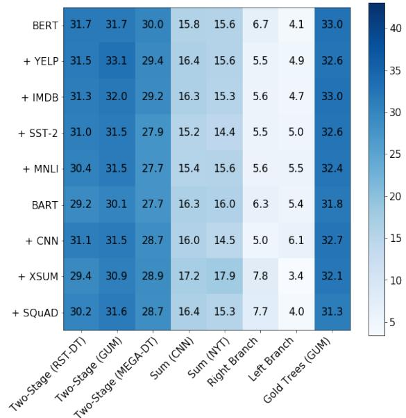

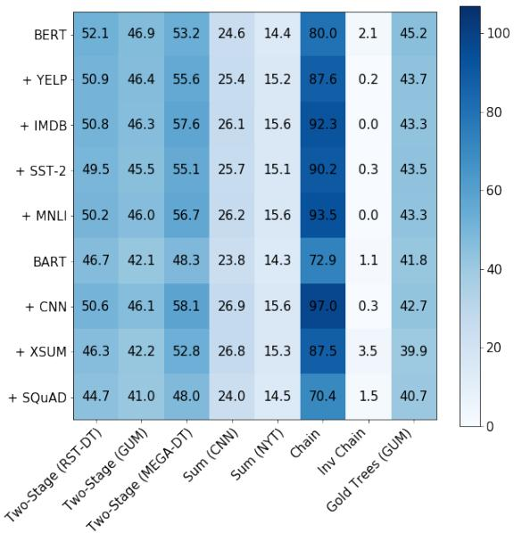  
Figure 8: Detailed PLM discourse constituency (left) and dependency (right) structure overlap with baselines and gold trees according to the original parseval and UAS metrics.

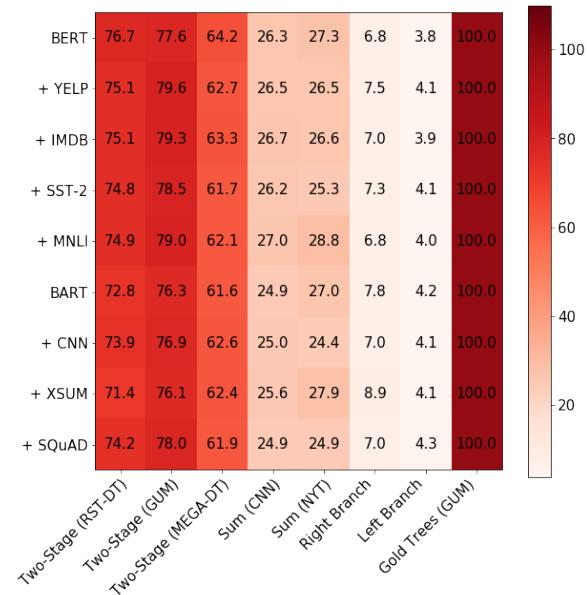

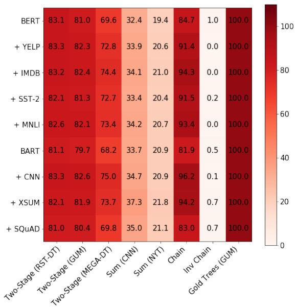  
Figure 9: Detailed PLM discourse constituency (left) and dependency (right) structure performance of intersection with gold trees (e.g., BERT  Gold Trees  Two-Stage (RST-DT)  Gold Trees) according to the original parseval and UAS metrics.

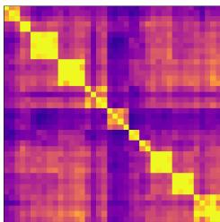

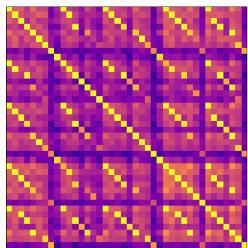  
Heatmaps sorted by heads (left) and models (right)

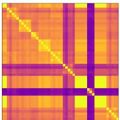

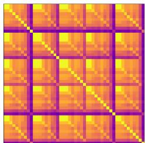  
Heatmaps sorted by heads (left) and models (right)  
=Model =Model ̸=Head =Head\*

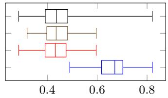

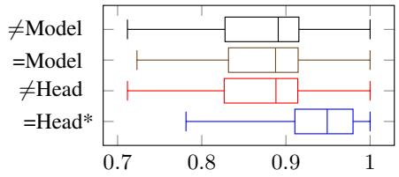  
(b) BERT dependency tree similarity on GUM

(a) BERT constituency tree similarity on GUM  
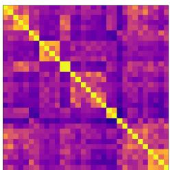

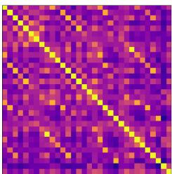  
Heatmaps sorted by heads (left) and models (right)

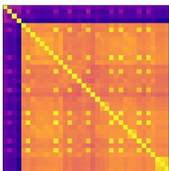

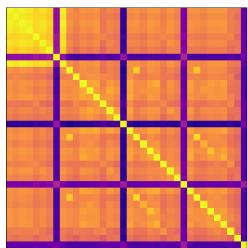  
Heatmaps sorted by heads (left) and models (right)

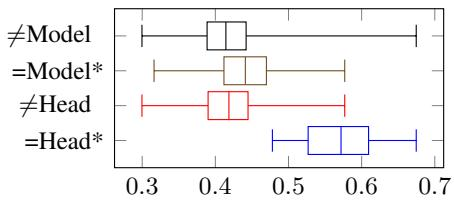  
(c) BART constituency tree similarity on GUM

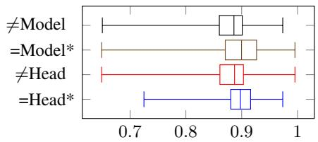  
(d) BART dependency tree similarity on GUM  
Figure 10: Top: Visual analysis of sorted heatmaps. Yellow=high score, purple=low score.

Bottom: Aggregated similarity of same heads, same models, different heads and different models. \*=Head/=Model significantly better than =Head/=Model performance with p-value $< 0 . 0 5$