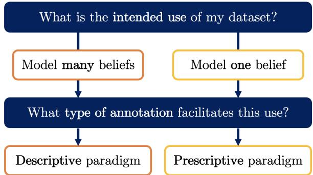

# Two Contrasting Data Annotation Paradigms for Subjective NLP Tasks

Paul Röttger1,2, Bertie Vidgen2, Dirk Hovy3, and Janet B. Pierrehumbert1

1University of Oxford 2The Alan Turing Institute 3Bocconi University

## Abstract

Labelled data is the foundation of most natural language processing tasks. However, labelling data is difficult and there often are diverse valid beliefs about what the correct data labels should be. So far, dataset creators have acknowledged annotator subjectivity, but rarely actively managed it in the annotation process. This has led to partly-subjective datasets that fail to serve a clear downstream use. To address this issue, we propose two contrasting paradigms for data annotation. The descrip tive paradigm encourages annotator subjectivity, whereas the prescriptive paradigm discourages it. Descriptive annotation allows for the surveying and modelling of different beliefs, whereas prescriptive annotation enables the training of models that consistently apply one belief. We discuss benefits and challenges in implementing both paradigms, and argue that dataset creators should explicitly aim for one or the other to facilitate the intended use of their dataset. Lastly, we conduct an annotation experiment using hate speech data that illustrates the contrast between the two paradigms.

## 1 Introduction

Many natural language processing (NLP) tasks are subjective, in the sense that there are diverse valid beliefs about what the correct data labels should be. Some tasks, like hate speech detection, are highly subjective: different people have very different beliefs about what should or should not be labelled as hateful (Talat, 2016; Salminen et al., 2019; Davani et al., 2021a), and while some beliefs are more widely accepted than others, there is no single objective truth. Other examples include toxicity (Sap et al., 2019, 2021), harassment (Al Kuwatly et al., 2020), harmful content (Jiang et al., 2021) and stance detection (Luo et al., 2020; AlDayel and Magdy, 2021) as well as sentiment analysis (Kenyon-Dean et al., 2018; Poria et al., 2020). But even for seemingly objective tasks like part-of-speech tagging, there is subjective disagreement between annotators (Plank et al., 2014b).

  
Figure 1: Two key questions for dataset creators.

In this article, we argue that dataset creators should consider the role of annotator subjectivity in the annotation process and either explicitly encourage it or discourage it. Annotators may subjectively disagree about labels (e.g., for hate speech) but dataset creators can and should decide, based on the intended downstream use of their dataset, whether they want to a) capture different beliefs or b) encode one specific belief in their data.

As a framework, we propose two contrasting data annotation paradigms. Each paradigm facilitates a clear and distinct downstream use. The descriptive paradigm encourages annotator subjectivity to create datasets as granular surveys of individual beliefs. Descriptive data annotation thus allows for the capturing and modelling of different beliefs. The prescriptive paradigm, on the other hand, discourages annotator subjectivity and instead tasks annotators with encoding one specific belief, formulated in the annotation guidelines. Prescriptive data annotation thus enables the training of models that seek to consistently apply one belief. A researcher may, for example, want to model different beliefs about hate speech (→ descriptive paradigm), while a content moderation engineer at a social media company may need models that apply their content policy (→ prescriptive paradigm).

Neither paradigm is inherently superior, but explicitly aiming for one or the other is beneficial because it makes clear what an annotated dataset can and should be used for. For example, data annotated under the descriptive paradigm can provide insights into different beliefs (§2.1), but it cannot easily be used to train models with one pre-specified behaviour (§3.1). By contrast, leaving annotator subjectivity unaddressed, as has mostly been the case in NLP so far, leads to datasets that neither capture an interpretable diversity of beliefs nor consistently encode one specific belief; an undesirable middle ground without a clear downstream use.1

The two paradigms are applicable to all data annotation. They can be used to compare existing datasets, and to make and communicate decisions about how new datasets are annotated as well as how annotator disagreement can be interpreted. We hope that by naming and explaining the two paradigms, and by discussing key benefits and challenges in their implementation, we can support more intentional annotation process design, which will result in more useful NLP datasets.

Terminology Our use of the terms descriptive and prescriptive aligns with their use in both linguistics and ethics. In linguistics, descriptivism studies how language is used, whereas prescriptive grammar declares how language should be used (Justice, 2006). Descriptive ethics studies the moral judgments that people make, while prescriptive ethics considers how people ought to act (Thiroux and Krasemann, 2015). Accordingly, descriptive data annotation surveys annotators’ beliefs, whereas prescriptive data annotation aims to encode one specific belief, which is formulated in the annotation guidelines.

## 2 The Descriptive Annotation Paradigm: Encouraging Annotator Subjectivity

## 2.1 Key Benefits

Insights into Diverse Beliefs Descriptive data annotation captures a multiplicity of beliefs in data labels, much like a very granular survey would. The distribution of data labels across annotators and examples can therefore provide insights into the beliefs of annotators, or the larger population they may represent. For example, descriptive data annotation has shown that non-Black annotators are more likely to rate African American English as toxic (Sap et al., 2019, 2021), and that people who identify as LGBTQ+ or young adults are more likely to rate random social media comments as toxic (Kumar et al., 2021). Similar correlations between sociodemographic characteristics and annotation outcomes have been found in stance (Luo et al., 2020), sentiment (Diaz et al., 2018) and hate speech detection (Talat, 2016).

Even very subjective tasks may have clear-cut entries on which most annotators agree. For example, crowd workers tend to agree more on the extremes of a hate rating scale (Salminen et al., 2019), and datasets which consist of clear hate and non-hate can have very high levels of inter-annotator agreement, even with minimal guidelines (Röttger et al., 2021). Descriptive data annotation can help to identify which entries are more subjective. Jiang et al. (2021), for instance, find that perceptions about the harmfulness of sexually explicit language vary strongly across the eight countries in their sample, whereas support for mass murder or human trafficking is seen as very harmful across all countries.

Learning from Disagreement Annotator-level labels from descriptive data annotation have been shown to be a rich source of information for model training. First, they can be used to separately model annotators’ beliefs. For less subjective tasks such as question answering, this has served to mitigate undesirable annotator biases (Geva et al., 2019). Davani et al. (2021b) reframe and expand on this idea for more subjective tasks like abuse detection, showing that multi-annotator model architectures outperform standard single-label approaches on single label prediction. Second, instead of modelling each annotator separately, other work has grouped them into clusters based on sociodemographic attributes (Al Kuwatly et al., 2020) or polarisation measures derived from annotator labels (Akhtar et al., 2020, 2021), with similar results. Third, models can be trained directly on soft labels (i.e., distributions of labels given by annotators), rather than hard one-hot ground truth vectors (Plank et al., 2014a; Jamison and Gurevych, 2015; Uma et al., 2020; Fornaciari et al., 2021).

Evaluating with Disagreement Descriptive data annotation facilitates model evaluation that accounts for different beliefs about how a model should behave (Basile et al., 2021b; Uma et al., 2021). This is particularly relevant when deploying NLP systems for practical tasks such as content moderation, where user-facing performance needs to be considered (Gordon et al., 2021). To this end, comparing a model prediction to a descriptive label distribution, the crowd truth (Aroyo and Welty, 2015), can help estimate how acceptable the prediction would be to users (Alm, 2011). Gordon et al. (2022) operationalise this idea by introducing jury learning, a recommender system approach to predicting how a group of annotators with specified sociodemographic characteristics would judge different pieces of content.

## 2.2 Key Challenges

Representativeness of Annotators The surveylike benefits of descriptive data annotation correspond to survey-like challenges. First, dataset creators must decide who their data aims to represent, by establishing a clear population of interest. Arora et al. (2020), for example, ask women journalists to annotate harassment targeted at them. Talat (2016) recruits feminist activists as well as crowd workers. Second, dataset creators must consider whether representativeness can practically be achieved. To capture a representative distribution of beliefs for each entry requires dozens, if not hundreds of annotators recruited from the population of interest. Sap et al. (2021), for example, collect toxicity labels from 641 annotators, but only for 15 examples. Other datasets generally use much fewer annotators per entry (see Appx. A) and therefore cannot be considered representative in the sense that large (i.e., many-participant) surveys are. A potential approach to mitigating this issue in modelling annotator beliefs is by introducing information sharing across groups of annotators (e.g. based on sociodemographics), where annotator behaviour updates group-specific priors rather than being considered in isolation, and thus fewer annotations are needed from each annotator (Gordon et al., 2022).

Interpretation of Disagreement In the descriptive paradigm, the absence of a (specified) ground truth label complicates the interpretation of any observed annotator disagreement: it may be due to a genuine difference in beliefs, which is desirable in this paradigm, or due to undesirable annotator error (Pavlick and Kwiatkowski, 2019; Basile et al., 2021a; Leonardelli et al., 2021). The same issue applies to inter-annotator agreement metrics like Fleiss’ Kappa. When subjectivity is encouraged, such metrics can at best measure task subjectiveness, but not task difficulty, annotator performance, or dataset quality (Zaenen, 2006; Alm, 2011).

Label Aggregation Descriptive annotation has clear downstream uses (§2.1) but it is fundamentally misaligned with standard NLP methods that rely on single gold standard labels. When datasets are constructed to be granular surveys of beliefs, reducing those beliefs to a single label, through majority voting or otherwise, goes directly against that purpose. Aggregating labels conceals informative disagreements (Leonardelli et al., 2021; Basile et al., 2021b) and risks discarding minority beliefs (Prabhakaran et al., 2021; Basile et al., 2021a).

## 3 The Prescriptive Annotation Paradigm: Discouraging Annotator Subjectivity

## 3.1 Key Benefits

Specified Model Behaviour Encoding one specific belief in a dataset through data annotation is difficult (§3.2) but advantageous for many practical applications. Social media companies, for example, moderate content on their platforms according to specific and extensive content policies.2 Therefore, they need data annotated in accordance with those policies to train their content moderation models. This illustrates that even for highly subjective tasks, where different model behaviours are plausible and valid, one specific behaviour may be practically desirable. Prescriptive data annotation specifies such desired behaviours in datasets for model training and evaluation.

Quality Assurance In the prescriptive paradigm, annotator disagreements are a call to action because they indicate that a) the annotation guidelines were not correctly applied by annotators or b) the guidelines themselves were inadequate. Annotator errors can be found using noise identification techniques (e.g., Hovy et al., 2013; Zhang et al., 2017; Paun et al., 2018; Northcutt et al., 2021), corrected by expert annotators (Vidgen and Derczynski, 2020; Vidgen et al., 2021a) or their impact mitigated by label aggregation. Guidelines which are unclear or incomplete need to be clarified or expanded by dataset creators, which may require iterative approaches to annotation (Founta et al., 2018; Zeinert et al., 2021). Therefore, quality assurance under the prescriptive paradigm is a laborious but structured process, with inter-annotator agreement as a useful, albeit noisy, measure of dataset quality.

Visibility of Encoded Belief In the prescriptive paradigm, the one belief that annotators are tasked with applying is made visible and explicit in the annotation guidelines. Well-formulated guidelines should give clear instructions on how to decide between different classes, along with explanations and illustrative examples. This creates accountability, in that people can review, challenge and disagree with the formulated belief. Like data statements (Bender and Friedman, 2018), prescriptive annotation guidelines can provide detailed insights into how datasets were created, which can then inform their downstream use.

## 3.2 Key Challenges

Creation of Annotation Guidelines Creating guidelines for prescriptive data annotation is difficult because it requires topical knowledge and familiarity with the data that is to be annotated. Guidelines would ideally provide a clear judgment on every possible entry, but in practice, such perfectly comprehensive guidelines can only be approximated. Even extensive legal definitions of hate speech leave some room for subjective interpretation (Sellars, 2016). Further, creating guidelines for prescriptive data annotation requires deciding which one belief to encode in the dataset. This can be a complex process that risks disregarding non-majority beliefs if marginalised people are not included in it (Raji et al., 2020).

Application of Annotation Guidelines Annotators need to be familiar with annotation guidelines to apply them correctly, which may require additional training, especially if guidelines are long and complex. This is reflected in an increasing shift in the literature towards using annotators with taskrelevant experience over non-trained crowd workers (e.g. Basile et al., 2019; Röttger et al., 2021; Vidgen et al., 2021a). During annotation, annotators will need to refer back to the guidelines, which requires giving them sufficient time per entry and providing a well-designed annotation interface.

Persistent Subjectivity Annotator subjectivity can be discouraged, but not eliminated. Inevitable gaps in guidelines leave annotators no choice but to apply their personal judgement for some entries, and even when there is explicit guidance, implicit biases may persist. Sap et al. (2019), for example, demonstrate racial biases in hate speech annotation, and show that targeted annotation prompts can reduce these biases but not definitively eliminate them. To address this issue, dataset creators should work with groups of annotators that are diverse in terms of sociodemographic characteristics and personal experiences, even when annotator subjectivity is discouraged.

## 4 An Illustrative Annotation Experiment

Experimental Design To illustrate the contrast between the two paradigms, we conducted an annotation experiment. 60 annotators were randomly assigned to one of three groups of 20. Each group was given different guidelines to label the same 200 Twitter posts, taken from a corpus annotated for hate speech by Davidson et al. (2017), as either hateful or non-hateful. G1, the descriptive group, received a short prompt which directed them to apply their subjective judgement (‘Do you personally feel this post is hateful?’). G2, the prescriptive group, received a short prompt which discouraged subjectivity (‘Does this post meet the criteria for hate speech?’), along with detailed annotation guidelines. G3, the control group, received the prescriptive prompt and a short definition of hate speech but no further guidelines. This is to control for the difference in length and complexity of annotation guidelines between G1 and G2.

Results We evaluate average percentage agreement and Fleiss’ κ to measure dataset-level interannotator agreement in each group (Table 1). To test for significant differences in agreement between groups, we use confidence intervals computed with a 1000-sample bootstrap.

<table><tr><td>Group</td><td>Avg. % Agree.</td><td>Fleiss&#x27; κ</td></tr><tr><td>G1 - Descriptive</td><td>73.90</td><td>0.20</td></tr><tr><td>G2 - Prescriptive</td><td>93.72</td><td>0.78</td></tr><tr><td>G3 - Control</td><td>72.50</td><td>0.15</td></tr></table>

Table 1: Inter-annotator agreement metrics for the three groups of 20 annotators on our 200-post binary dataset.

Agreement is very low in the descriptive group G1 $( \kappa = 0 . 2 0 )$ , which suggests that annotators hold varied beliefs about which posts are hateful. However, agreement is significantly higher $( p \textless 0 . 0 0 1 )$ in G2 $( \kappa = 0 . 7 8 )$ , which suggests that a prescriptive approach with detailed annotation guidelines can successfully induce annotators to apply a specified belief rather than their subjective view. Further, agreement in the control group G3 $( \kappa = 0 . 1 5 )$ is as low as in descriptive G1, which suggests that comprehensive guidelines are instrumental in facilitating high agreement in the prescriptive paradigm. G1 and G3 also do not differ systematically on which posts annotators disagree on, which suggests that annotators with little prescriptive instruction (G3) tend to apply their subjective views (like G1).

Reproducibility For details on our dataset and annotators, see the data statement (Bender and Friedman, 2018) in Appendix B. Annotation prompts are given in Appendix C. Full guidelines, annotated data and code are available on GitHub.

## 5 Conclusion

In this article, we named and explained two contrasting paradigms for data annotation. The descriptive paradigm encourages annotator subjectivity to create datasets as granular surveys of individual beliefs, which can then be analysed and modelled. The prescriptive paradigm tasks annotators with encoding one specific belief formulated in the annotation guidelines, to enable the training of models that seek to apply that one belief to unseen data. Dataset creators should explicitly aim for one paradigm or the other to facilitate the intended downstream use of their dataset, and to document for the benefit of others how exactly their dataset was annotated. We discussed benefits and challenges in implementing both paradigms, and conducted an annotation experiment that illustrates the contrast between them. We hope that the two paradigms can support more intentional annotation process design and thus facilitate the creation of more useful NLP datasets.

## Acknowledgments

Paul Röttger was funded by the German Academic Scholarship Foundation. Bertie Vidgen and Paul Röttger were both supported by The Alan Turing Institute and Towards Turing 2.0 under the EPSRC Grant EP/W037211/1. Dirk Hovy received funding from the European Research Council (ERC) under the European Union’s Horizon 2020 research and innovation program (grant agreement No. 949944). He is a member of the Data and Marketing Insights (DMI) Unit of the Bocconi Institute for Data Science and Analysis (BIDSA). Janet B. Pierrehumbert was supported by EPSRC Grant EP/T023333/1. We thank the Milan NLP Group, the Groningen Computational Linguistics Group as well as the Pierrehumbert Language Modelling Group for helpful comments and all reviewers for their constructive feedback.

## References

Sohail Akhtar, Valerio Basile, and Viviana Patti. 2020. Modeling annotator perspective and polarized opinions to improve hate speech detection. In Proceedings of the AAAI Conference on Human Computation and Crowdsourcing, volume 8, pages 151–154.

Sohail Akhtar, Valerio Basile, and Viviana Patti. 2021. Whose opinions matter? perspective-aware models to identify opinions of hate speech victims in abusive language detection. arXiv preprint arXiv:2106.15896.

Hala Al Kuwatly, Maximilian Wich, and Georg Groh. 2020. Identifying and measuring annotator bias based on annotators’ demographic characteristics. In Proceedings of the Fourth Workshop on Online Abuse and Harms, pages 184–190, Online. Association for Computational Linguistics.

Abeer AlDayel and Walid Magdy. 2021. Stance detection on social media: State of the art and trends. Information Processing & Management, 58(4):102597.

Cecilia Ovesdotter Alm. 2011. Subjective natural language problems: Motivations, applications, characterizations, and implications. In Proceedings of the 49th Annual Meeting of the Association for Computational Linguistics: Human Language Technologies, pages 107–112, Portland, Oregon, USA. Association for Computational Linguistics.

Ishaan Arora, Julia Guo, Sarah Ita Levitan, Susan McGregor, and Julia Hirschberg. 2020. A novel methodology for developing automatic harassment classifiers for Twitter. In Proceedings of the Fourth Workshop on Online Abuse and Harms, pages 7–15, Online. Association for Computational Linguistics.

Lora Aroyo and Chris Welty. 2015. Truth is a lie: Crowd truth and the seven myths of human annotation. AI Magazine, 36(1):15–24.

Valerio Basile, Cristina Bosco, Elisabetta Fersini, Debora Nozza, Viviana Patti, Francisco Manuel Rangel Pardo, Paolo Rosso, and Manuela Sanguinetti. 2019. Semeval-2019 task 5: Multilingual detection of hate speech against immigrants and women in Twitter. In Proceedings of the 13th International Workshop on Semantic Evaluation, pages 54–63.

Valerio Basile, Federico Cabitza, Andrea Campagner, and Michael Fell. 2021a. Toward a perspectivist turn in ground truthing for predictive computing. Conference of the Italian Chapter of the Association for Intelligent Systems (ItAIS 2021).

Valerio Basile, Michael Fell, Tommaso Fornaciari, Dirk Hovy, Silviu Paun, Barbara Plank, Massimo Poesio, and Alexandra Uma. 2021b. We need to consider disagreement in evaluation. In Proceedings of the 1st Workshop on Benchmarking: Past, Present and Future, pages 15–21, Online. Association for Computational Linguistics.

Emily M. Bender and Batya Friedman. 2018. Data statements for natural language processing: Toward mitigating system bias and enabling better science. Transactions of the Association for Computational Linguistics, 6:587–604.

Tommaso Caselli, Valerio Basile, Jelena Mitrovic, Inga´ Kartoziya, and Michael Granitzer. 2020. I feel offended, don’t be abusive! implicit/explicit messages in offensive and abusive language. In Proceedings of the 12th Language Resources and Evaluation Conference, pages 6193–6202, Marseille, France. European Language Resources Association.

Amanda Cercas Curry, Gavin Abercrombie, and Verena Rieser. 2021. ConvAbuse: Data, analysis, and benchmarks for nuanced detection in conversational AI. In Proceedings of the 2021 Conference on Empirical Methods in Natural Language Processing, pages 7388–7403, Online and Punta Cana, Dominican Republic. Association for Computational Linguistics.

Aida Mostafazadeh Davani, Mohammad Atari, Brendan Kennedy, and Morteza Dehghani. 2021a. Hate speech classifiers learn human-like social stereotypes.

Aida Mostafazadeh Davani, Mark Díaz, and Vinodkumar Prabhakaran. 2021b. Dealing with disagreements: Looking beyond the majority vote in subjective annotations. arXiv preprint arXiv:2110.05719.

Thomas Davidson, Dana Warmsley, Michael Macy, and Ingmar Weber. 2017. Automated hate speech detection and the problem of offensive language. In Proceedings of the 11th International AAAI Conference on Web and Social Media, pages 512–515. Association for the Advancement of Artificial Intelligence.

Mark Diaz, Isaac Johnson, Amanda Lazar, Anne Marie Piper, and Darren Gergle. 2018. Addressing Age-Related Bias in Sentiment Analysis, page 1–14. Association for Computing Machinery, New York, NY, USA.

Tommaso Fornaciari, Alexandra Uma, Silviu Paun, Barbara Plank, Dirk Hovy, and Massimo Poesio. 2021. Beyond black & white: Leveraging annotator disagreement via soft-label multi-task learning. In Proceedings of the 2021 Conference of the North American Chapter of the Association for Computational Linguistics: Human Language Technologies, pages 2591–2597, Online. Association for Computational Linguistics.

Antigoni Maria Founta, Constantinos Djouvas, Despoina Chatzakou, Ilias Leontiadis, Jeremy Blackburn, Gianluca Stringhini, Athena Vakali, Michael Sirivianos, and Nicolas Kourtellis. 2018. Large scale crowdsourcing and characterization of Twitter abusive behavior. In Proceedings of the 12th International AAAI Conference on Web and Social Media, pages 491–500. Association for the Advancement of Artificial Intelligence.

Mor Geva, Yoav Goldberg, and Jonathan Berant. 2019. Are we modeling the task or the annotator? an investigation of annotator bias in natural language understanding datasets. In Proceedings of the 2019 Conference on Empirical Methods in Natural Language Processing and the 9th International Joint Conference on Natural Language Processing (EMNLP-IJCNLP), pages 1161–1166, Hong Kong, China. Association for Computational Linguistics.

Mitchell L Gordon, Michelle S Lam, Joon Sung Park, Kayur Patel, Jeffrey T Hancock, Tatsunori Hashimoto, and Michael S Bernstein. 2022. Jury learning: Integrating dissenting voices into machine learning models. arXiv preprint arXiv:2202.02950.

Mitchell L Gordon, Kaitlyn Zhou, Kayur Patel, Tatsunori Hashimoto, and Michael S Bernstein. 2021. The disagreement deconvolution: Bringing machine learning performance metrics in line with reality. In Proceedings ofthe 2021 CHI Conference on Human Factors in Computing Systems, pages 1–14.

Alex Hern. 2021. Decoding emojis and defining ’support’: Facebook’s rules for content revealed. The Guardian.

Dirk Hovy, Taylor Berg-Kirkpatrick, Ashish Vaswani, and Eduard Hovy. 2013. Learning whom to trust with MACE. In Proceedings ofthe 2013 Conference of the North American Chapter of the Association for Computational Linguistics: Human Language Technologies, pages 1120–1130, Atlanta, Georgia. Association for Computational Linguistics.

Emily Jamison and Iryna Gurevych. 2015. Noise or additional information? leveraging crowdsource annotation item agreement for natural language tasks. In Proceedings of the 2015 Conference on Empirical Methods in Natural Language Processing, pages 291–297, Lisbon, Portugal. Association for Computational Linguistics.

Jialun Aaron Jiang, Morgan Klaus Scheuerman, Casey Fiesler, and Jed R Brubaker. 2021. Understanding international perceptions of the severity of harmful content online. PloS one, 16(8):e0256762.

Paul Justice. 2006. Relevant Linguistics, 2nd edition. Center for the Study of Language and Information, Stanford University.

Kian Kenyon-Dean, Eisha Ahmed, Scott Fujimoto, Jeremy Georges-Filteau, Christopher Glasz, Barleen Kaur, Auguste Lalande, Shruti Bhanderi, Robert

Belfer, Nirmal Kanagasabai, Roman Sarrazingendron, Rohit Verma, and Derek Ruths. 2018. Sentiment analysis: It’s complicated! In Proceedings of the 2018 Conference of the North American Chapter ofthe Associationfor Computational Linguistics: Human Language Technologies, Volume 1 (Long Papers), pages 1886–1895, New Orleans, Louisiana. Association for Computational Linguistics.

Deepak Kumar, Patrick Gage Kelley, Sunny Consolvo, Joshua Mason, Elie Bursztein, Zakir Durumeric, Kurt Thomas, and Michael Bailey. 2021. Designing toxic content classification for a diversity of perspectives. In Seventeenth Symposium on Usable Privacy and Security (SOUPS 2021), pages 299–318.

Elisa Leonardelli, Stefano Menini, Alessio Palmero Aprosio, Marco Guerini, and Sara Tonelli. 2021. Agreeing to disagree: Annotating offensive language datasets with annotators’ disagreement. In Proceedings of the 2021 Conference on Empirical Methods in Natural Language Processing, pages 10528–10539, Online and Punta Cana, Dominican Republic. Association for Computational Linguistics.

Yiwei Luo, Dallas Card, and Dan Jurafsky. 2020. Detecting stance in media on global warming. In Findings of the Association for Computational Linguistics: EMNLP 2020, pages 3296–3315, Online. Association for Computational Linguistics.

Curtis Northcutt, Lu Jiang, and Isaac Chuang. 2021. Confident learning: Estimating uncertainty in dataset labels. Journal of Artificial Intelligence Research, 70:1373–1411.

Silviu Paun, Bob Carpenter, Jon Chamberlain, Dirk Hovy, Udo Kruschwitz, and Massimo Poesio. 2018. Comparing Bayesian models of annotation. Transactions of the Association for Computational Linguistics, 6:571–585.

Ellie Pavlick and Tom Kwiatkowski. 2019. Inherent disagreements in human textual inferences. Transactions of the Association for Computational Linguistics, 7:677–694.

Barbara Plank, Dirk Hovy, and Anders Søgaard. 2014a. Learning part-of-speech taggers with inter-annotator agreement loss. In Proceedings of the 14th Conference of the European Chapter of the Association for Computational Linguistics, pages 742–751, Gothenburg, Sweden. Association for Computational Linguistics.

Barbara Plank, Dirk Hovy, and Anders Søgaard. 2014b. Linguistically debatable or just plain wrong? In Proceedings ofthe 52nd Annual Meeting ofthe Associationfor Computational Linguistics (Volume 2: Short Papers), pages 507–511, Baltimore, Maryland. Association for Computational Linguistics.

Soujanya Poria, Devamanyu Hazarika, Navonil Majumder, and Rada Mihalcea. 2020. Beneath the tip

of the iceberg: Current challenges and new directions in sentiment analysis research. IEEE Transactions on Affective Computing.

Vinodkumar Prabhakaran, Aida Mostafazadeh Davani, and Mark Diaz. 2021. On releasing annotator-level labels and information in datasets. In Proceedings of The Joint 15th Linguistic Annotation Workshop (LAW) and 3rd Designing Meaning Representations (DMR) Workshop, pages 133–138, Punta Cana, Dominican Republic. Association for Computational Linguistics.

Inioluwa Deborah Raji, Andrew Smart, Rebecca N. White, Margaret Mitchell, Timnit Gebru, Ben Hutchinson, Jamila Smith-Loud, Daniel Theron, and Parker Barnes. 2020. Closing the ai accountability gap: Defining an end-to-end framework for internal algorithmic auditing. In Proceedings of the 2020 Conference on Fairness, Accountability, and Transparency, FAT\* ’20, page 33–44, New York, NY, USA. Association for Computing Machinery.

Paul Röttger, Bertie Vidgen, Dong Nguyen, Zeerak Talat, Helen Margetts, and Janet Pierrehumbert. 2021. HateCheck: Functional tests for hate speech detection models. In Proceedings of the 59th Annual Meeting of the Association for Computational Linguistics and the 11th International Joint Conference on Natural Language Processing (Volume 1: Long Papers), pages 41–58, Online. Association for Computational Linguistics.

Joni Salminen, Hind Almerekhi, Ahmed Mohamed Kamel, Soon-gyo Jung, and Bernard J. Jansen. 2019. Online hate ratings vary by extremes: A statistical analysis. In Proceedings of the 2019 Conference on Human Information Interaction and Retrieval, CHIIR ’19, page 213–217, New York, NY, USA. Association for Computing Machinery.

Maarten Sap, Dallas Card, Saadia Gabriel, Yejin Choi, and Noah A. Smith. 2019. The risk of racial bias in hate speech detection. In Proceedings of the 57th Annual Meeting of the Association for Computational Linguistics, pages 1668–1678, Florence, Italy. Association for Computational Linguistics.

Maarten Sap, Swabha Swayamdipta, Laura Vianna, Xuhui Zhou, Yejin Choi, and Noah A. Smith. 2021. Annotators with attitudes: How annotator beliefs and identities bias toxic language detection.

Andrew Sellars. 2016. Defining hate speech. Berkman Klein Center Research Publication, 20(2016):16– 48.

Zeerak Talat. 2016. Are you a racist or am I seeing things? Annotator influence on hate speech detection on Twitter. In Proceedings of the First Workshop on NLP and Computational Social Science, pages 138–142, Austin, Texas. Association for Computational Linguistics.

Zeerak Talat and Dirk Hovy. 2016. Hateful symbols or hateful people? Predictive features for hate speech detection on Twitter. In Proceedings of the NAACL Student Research Workshop, pages 88–93, San Diego, California. Association for Computational Linguistics.

Jacques P Thiroux and Keith W Krasemann. 2015. Ethics: Theory and Practice, 11th edition. Pearson.

Alexandra Uma, Tommaso Fornaciari, Anca Dumitrache, Tristan Miller, Jon Chamberlain, Barbara Plank, Edwin Simpson, and Massimo Poesio. 2021. SemEval-2021 task 12: Learning with disagreements. In Proceedings of the 15th International Workshop on Semantic Evaluation (SemEval-2021), pages 338–347, Online. Association for Computational Linguistics.

Alexandra Uma, Tommaso Fornaciari, Dirk Hovy, Silviu Paun, Barbara Plank, and Massimo Poesio. 2020. A case for soft loss functions. Proceedings of the AAAI Conference on Human Computation and Crowdsourcing, 8(1):173–177.

Bertie Vidgen and Leon Derczynski. 2020. Directions in abusive language training data, a systematic review: Garbage in, garbage out. PLOS ONE, 15(12):e0243300.

Bertie Vidgen, Dong Nguyen, Helen Margetts, Patricia Rossini, and Rebekah Tromble. 2021a. Introducing CAD: the contextual abuse dataset. In Proceedings ofthe 2021 Conference ofthe North American Chapter of the Association for Computational Linguistics: Human Language Technologies, pages 2289–2303, Online. Association for Computational Linguistics.

Bertie Vidgen, Tristan Thrush, Zeerak Talat, and Douwe Kiela. 2021b. Learning from the worst: Dynamically generated datasets to improve online hate detection. In Proceedings of the 59th Annual Meeting ofthe Associationfor Computational Linguistics and the 11th International Joint Conference on Natural Language Processing (Volume 1: Long Papers), pages 1667–1682, Online. Association for Computational Linguistics.

Annie Zaenen. 2006. Mark-up barking up the wrong tree. Comput. Linguist., 32(4):577–580.

Marcos Zampieri, Shervin Malmasi, Preslav Nakov, Sara Rosenthal, Noura Farra, and Ritesh Kumar. 2019. Predicting the type and target of offensive posts in social media. In Proceedings of the 2019 Conference of the North American Chapter of the Association for Computational Linguistics: Human Language Technologies, Volume 1 (Long and Short Papers), pages 1415–1420, Minneapolis, Minnesota. Association for Computational Linguistics.

Philine Zeinert, Nanna Inie, and Leon Derczynski. 2021. Annotating online misogyny. In Proceedings of the 59th Annual Meeting of the Association

for Computational Linguistics and the 11th International Joint Conference on Natural Language Processing (Volume 1: Long Papers), pages 3181–3197, Online. Association for Computational Linguistics.

Jing Zhang, Victor S Sheng, Tao Li, and Xindong Wu. 2017. Improving crowdsourced label quality using noise correction. IEEE transactions on neural networks and learning systems, 29(5):1675–1688.

## A Overview of Subjective Task Datasets

This appendix gives a selective overview of how existing NLP dataset work has (or has not) engaged with annotator subjectivity. For reasons of scope, we focus on 11 English-language datasets annotated for hate speech and other forms of abuse. Entries are sorted from most descriptive to most prescriptive annotation, based on our assessment of information made available by the dataset creators.

Sap et al. (2019) and Sap et al. (2021) annotate toxicity. They do not state explicitly that they encourage annotator subjectivity, but their annotation prompts clearly do. Each entry is labelled by up to 641 annotators. Overall, they are very aligned with the descriptive paradigm.

Kumar et al. (2021) annotate toxicity and types of toxicity. They do not state explicitly that they encourage annotator subjectivity, but their annotation prompts clearly do. Each entry is labelled by five annotators. Overall, they are very aligned with the descriptive paradigm.

Cercas Curry et al. (2021) annotate abuse. They gather ‘views of expert annotators’ based on guidelines that allow for significant subjectivity and do not attempt to resolve disagreements, but also do not explicitly encourage annotator subjectivity. On average, each entry is labelled by around three annotators. Overall, they are moderately aligned with the descriptive paradigm.

Talat and Hovy (2016) annotate hate speech. They provide annotators with 11 fine-grained criteria for hate speech, but several criteria invite subjective responses (e.g., ‘uses a problematic hashtag’). Each entry is labelled by up to three annotators. Overall, they are not clearly aligned with either paradigm.

Davidson et al. (2017) annotate hate speech. They provide annotators with a brief definition of hate speech and an explanatory paragraph, but their definition also includes subjective criteria like perceived ‘intent’. Most entries are labelled by three annotators. Overall, they are not clearly aligned with either paradigm.

Zampieri et al. (2019) annotate offensive content. They provide annotators with some formal criteria for offensiveness (e.g., ‘use of profanity’), but as a whole their guidelines are very brief. Each entry is labelled by up to three annotators. Overall, they are moderately aligned with the prescriptive paradigm.

Founta et al. (2018) annotate abuse. They provide annotators with fine-grained definitions for each category and iterate on their taxonomy to facilitate more agreement, but do not share comprehensive guidelines. Each entry is labelled by five annotators. Overall, they are moderately aligned with the prescriptive paradigm.

Caselli et al. (2020) annotate abuse. They provide annotators with a brief fine-grained decision tree with the explicit intent of reducing annotator subjectivity, and discuss disagreements to resolve them. Each entry is labelled by up to three annotators. Overall, they are moderately aligned with the prescriptive paradigm.

Vidgen et al. (2021b) annotate hate speech. They provide annotators with fine-grained definitions for each category as well as very detailed annotation guidelines, and disagreements are resolved by an expert. Each entry is labelled by up to three annotators. Overall, they are very aligned with the prescriptive paradigm.

Vidgen et al. (2021a) annotate abuse. They provide annotators with fine-grained definitions for each category as well as very detailed annotation guidelines, and they use expert-driven group adjudication to resolve disagreements. Each entry is labelled by up to three annotators. Overall, they are very aligned with the prescriptive paradigm.

## B Data Statement

Following Bender and Friedman (2018), we provide a data statement, which documents the generation and provenance of the dataset used for our annotation experiment.

A. CURATION RATIONALE To create our dataset, we sampled 200 Twitter posts from a larger corpus annotated for hateful content by Davidson et al. (2017). Of the posts we sampled, 100 were originally annotated as hateful and 100 as nonhateful by majority vote between three annotators. We sampled only from those posts that had some disagreement among their annotators (i.e., two out of three rather than unanimous agreement), to encourage disagreement in our experiment. The purpose of our 200-post dataset is to enable the annotation experiment presented in §1, which illustrates the contrast between the descriptive and prescriptive data annotation paradigms.

B. LANGUAGE VARIETY The dataset contains English-language text posts only.

C. SPEAKER DEMOGRAPHICS All speakers are Twitter users. Davidson et al. (2017) do not share any information on their demographics.

D. ANNOTATOR RECRUITMENT We recruited three groups of 20 annotators using Amazon’s Mechanical Turk crowdsourcing marketplace.3. Annotators were made aware that the task contained instances of offensive language before starting their work, and they could withdraw at any point throughout the work.

E. ANNOTATOR DEMOGRAPHICS All annotators were at least 18 years old when they started their work, and we recruited only annotators that were based in the UK. This was to facilitate comparability across groups of annotators. For each group, we recruited 10 male and 10 female annotators, based on self-reported gender. This was to encourage disagreement within groups, based on the assumption that men would on average disagree more about hateful content with women than with other men, and vice versa. No further annotator demographics were recorded.

F. ANNOTATOR COMPENSATION All annotators were compensated for their work at a rate of at least £16 per hour. The rate was set 50% above the London living wage (£10.85), although all work was completed remotely.

G. SPEECH SITUATION All entries in our dataset were originally posted to Twitter and then collected by Davidson et al. (2017), who do not share when the posts were made.

H. TEXT CHARACTERISTICS All entries in our dataset are individual Twitter text posts, with a length of 140 characters or less. We perform only minimal text cleaning, replacing user mentions (e.g., "@Obama") with "[USER]" and URLs with "[URL]".

I. LICENSE Davidson et al. (2017) make the Twitter data they collected available for further research use via GitHub under an MIT license.4 Our re-annotated subset of the data is made available under CC0-1.0 license at github.com/paulrottger/annotation-paradigms, so that the results of our experiment can be reproduced.

J. ETHICS APPROVAL We received approval for our experiment and the data annotation it entailed from our institution’s ethics review board.

## C Annotation Prompts

The three groups of annotators in our experiment all annotated the same data in the same order, but each group received different annotation prompts. The full annotation guidelines for G2 are available at github.com/paul-rottger/annotation-paradigms.

G1 - Descriptive Group “Imagine you come across the post below on social media. Do you personally feel this post is hateful? We want to understand your own opinions, so try to disregard any impressions you might have about whether other people would find it hateful.”

G2 - Prescriptive Group “Imagine you come across the post below on social media. Does this post meet the criteria for hate speech? We are trying to collect objective judgments, so try to disregard any feelings you might have about whether you personally find it hateful.

Click here to view the criteria: LINK”

G3 - Control Group “Imagine you come across the post below on social media. Does this post meet the criteria for hate speech? A post is considered hate speech if it is 1) abusive and 2) targeted against a protected group (e.g., women) or at its members for being a part of that group.”