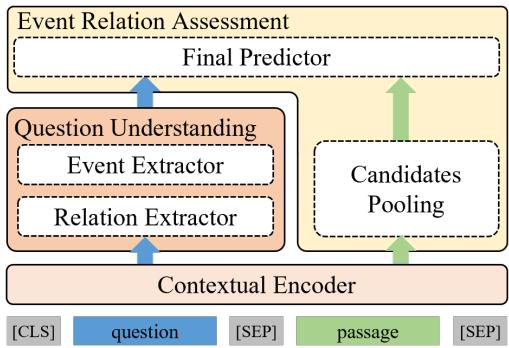
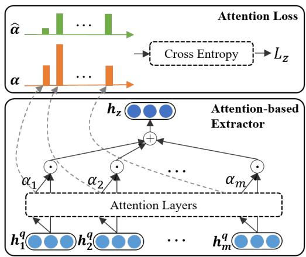
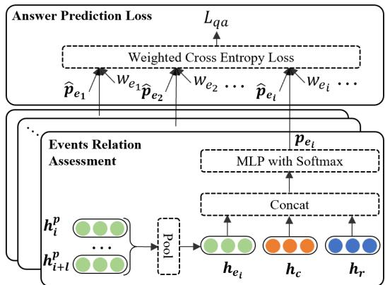
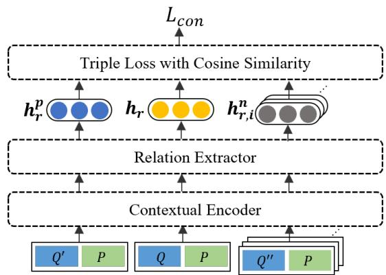

# Understand before Answer: Improve Temporal Reading Comprehension via Precise Question Understanding

Hao Huang1∗, Xiubo Geng2†, Guodong Long1, Daxin Jiang2†

1Australian AI Institute, School of CS, FEIT, University of Technology Sydney 2STCA NLP Group, Microsoft

{hao.huang-4,guodong.long}@{student.uts,uts}.edu.au {xigeng,djiang}@microsoft.com

## Abstract

This work studies temporal reading comprehen sion (TRC), which reads a free-text passage and answers temporal ordering questions. Precise question understanding is critical for tempo ral reading comprehension. For example, the question “What happened before the victory” and “What happened after the victory” share almost all words except one, while their an swers are totally different. Moreover, even if two questions query about similar temporal relations, different varieties might also lead to various answers. For example, although both the question “What usually happened during the press release?” and “What might happen during the press release” query events which happen after the press release, they convey divergent semantics. To this end, we propose a novel reading comprehension approach with precise question understanding. Specifically, a temporal ordering question is embedded into two vectors to capture the referred event and the temporal relation. Then we evaluate the temporal relation between candidate events and the referred event based on that. Such fine-grained representations offer two benefits. First, it enables a better understanding of the question by focusing on different elements of a question. Second, it provides good interpretability when evaluating temporal relations. Furthermore, we also harness an auxiliary contrastive loss for representation learning of temporal relations, which aims to distinguish relations with subtle but critical changes. The proposed approach outperforms strong baselines and achieves state-of-the-art performance on the TORQUE dataset. It also increases the accuracy of four pre-trained language models (BERT base, BERT large, RoBERTa base, and RoBETRa large), demonstrating its generic effectiveness on divergent models.

<table><tr><td>Paragraph 1: The European Union and the United States have frozen aid to the Palestinian Authority ever since the Hamas-led government took power in March, two months after its upset parliamentary election victory. Abbas&#x27;s Fatah faction and Hamas labored for months to reach a power sharing agreement that would meet international conditions to lift the siege and end the spiraling crisis, but those talks failed late last month. Q1: What happened after the victory? (Basic) A1: frozen took labored failed Q2: What failed to happen after the victory? (Negated) A2: agreement meet lift end Q3: What happened right after the victory?</td></tr><tr><td>(Constrained) A3: frozen took labored Paragraph 2: &quot;The agreement, which was signed by the two governments Thursday, demonstrates Nepal&#x27;s continuing commitment to development activities in agriculture and forestry,&quot; it said in a press release. &quot;These two sectors provide income and employment opportunities for almost 80 percent of Nepal&#x27;s population,&quot; it added.</td></tr><tr><td>Q4: What usually happened during the press release? (Common) A4: said Q5: What might happen during the press release? (Uncertain)</td></tr></table>

Figure 1: Examples of temporal reading comprehension. Temporal relations are diverse: Q1-Q5 list examples of possible varieties of temporal relations. Small changes in the question might lead to substantially divergent semantics: replacing usually in Q4 with might in Q5 leads to different answers. Related events are underlined in the passage.

## 1 Introduction

Understanding temporal relationships between events in a passage is essential for natural language understanding (Wang et al., 2019; Dong et al., 2019). Temporal reading comprehension (TRC) (Ning et al., 2020) is a natural way to study temporal relations since natural language questions are flexible to capture divergent temporal relations (Zhou et al., 2021). Figure 1 shows several examples of temporal reading comprehension, where given a free-text passage, a system is required to answer temporal questions like “What usually happened during the press release?”.

A natural solution for temporal ordering understanding is to compare each candidate answer and the referred event in the question and classify their temporal relation into several pre-defined categories, e.g., UzZaman et al. (2013) defines 13 possible relations such as after, ends, equal to. Nonetheless, since temporal relationships vary greatly, it is almost impossible to enumerate all possible relationships. Figure 1 shows several divergent varieties of temporal relations: one might query about plain after in Q1, negated after in Q2, constrained after in Q3, etc. Similarly, a question might query about usually happen in Q4, might happen, or other relations. Moreover, creating sufficient labels for all such relations is costly and poses great challenges for real-world applications. Therefore, the classification-based approach is incompetent to handle the flexible relations in temporal reading comprehension.

Another paradigm is to formulate it as a reading comprehension problem and directly predict the answer to a question. With the help of large pre-trained language models (e.g., BERT (Devlin et al., 2019) and RoBERTa (Liu et al., 2019)), such approaches have achieved relatively good performance. However, they still struggle for the temporal reading comprehension task due to the lack of precise question understanding. For example, given the same passage, the BERT model fine-tuned on SQuAD (Rajpurkar et al., 2016) predicts the same answer to the two questions (Ning et al., 2020), “What happened before a woman was trapped” and “What happened after a woman was trapped”. In this case, although the two questions share almost the same words, the only different one between before and after leads to completely opposite intentions. Moreover, even if two questions query about similar relations, different varieties might also lead to various answers. Take the question Q4 “What usually happened during the press release?” and “What might happen during the press release?” in Figure 1 as an example. Although they both query about events occurring after the press release, the slight difference conveys divergent semantics and leads to different answers.

To tackle these challenges, we propose a novel question answering approach with precise question understanding. Intuitively, temporal ordering questions consist of two elements, referred events, and concerned temporal relations. For example, the question “What usually happened during the press release?” can be decomposed into the referred event the press release and the concerned relation usually happen during. Inspired by this observation, we first encode such questions into two representations, the event vector h and the relation vector $\mathbf { h _ { r } }$ . Then we evaluate how well each candidate answer matches the relation $\mathbf { h _ { r } }$ compared to $\mathbf { h _ { c } }$ with a separate MLP module. Such fine-grained representations enable a better understanding of questions by focusing on different elements with different vectors and further provides good interpretability about the reasoning process. More importantly, it empowers the model to capture the semantics of divergent variants of temporal relations. Specifically, we harness an auxiliary contrastive loss that aims to distinguish relations with subtle but critical changes.

We evaluate the proposed approach on the TORQUE dataset and achieve state-of-the-art performance compared to strong baselines. We further testify its effectiveness based on four different models (i.e., BERT base, BERT large, RoBERTa base, RoBERTa large) and demonstrate that precise question understanding can improve the QA accuracy for all models. Ablation study shows that both question representation learning and contrastive loss play a critical role in the approach.

## 2 Related Work

Temporal machine comprehension is closely related to two areas of works, i.e., machine reading comprehension and temporal ordering reasoning.

## 2.1 Machine Reading Comprehension

Machine reading comprehension (MRC) (Rajpurkar et al., 2016, 2018) has attracted much attention in recent years. Traditional solutions to MRC tasks focus on utilizing the interaction information between questions and passages via attention-based structures (Kadlec et al., 2016; Dhingra et al., 2017). Later on, pre-trained language models (PLMs), e.g., BERT (Devlin et al., 2019), RoBERTa (Liu et al., 2019), and XLNet (Yang et al., 2019), have been widely used for MRC tasks. With the sheer scale of parameters and the pretraining strategies, PLMs capture more knowledge from the context and have shown outstanding performance on traditional MRC benchmarks.

For more challenging MRC tasks which introduce multi-hop reasoning (Yang et al., 2018), numerical reasoning (Dua et al., 2019), etc., the generic PLMs become not applicable. Recent efforts use graph-based reasoning approaches (Chen et al., 2020) or define specific pretraining training techniques (Raffel et al., 2020) to solve the above challenges. However, existing MRC approaches still struggle for the temporal reading comprehension task due to the lack of temporal relation understanding (Ning et al., 2020). Hence, we propose a novel question answering approach with precise question understanding to tackle this challenge.

## 2.2 Temporal Ordering Reasoning

Traditional temporal order reasoning tasks (UzZaman et al., 2013; Cassidy et al., 2014; Ning et al., 2018), are often formulated as relation extraction tasks. Given the context passage, the target is to classify the relation between every two events from a predefined relation set, e.g., UzZaman et al. (2013) defines 13 possible relations such as after, ends, equal to. Existing solutions can be roughly classified into two categories. The first category focuses on developing the structure of the encoder to capture more temporal information. For example, Cheng et al. (2020) add up a GRU-based dynamically updating structure upon the outputs of the common BERT sentence encoder. The second category focuses on joint learning with external knowledge or some specific constraints. For instance, Ning et al. (2019) significantly improve the extraction performance by joint training temporal and causal relations.

However, the success of the existing approaches is limited to the formulation of the traditional temporal order reasoning tasks, where the events and the candidate temporal relation set are fixed. However, the fixed candidate relation set cannot cover all temporal relations in our daily uses. The most recent released dataset, TORQUE (Ning et al., 2020), formulates temporal ordering reasoning as a machine reading comprehension task. Given a context passage, we need to answer a free-text question about the temporal relations in the context passage. The task is much analogous to our real-world tasks and is more challenging – we need to automatically identify the events and the relations in the free-text question to retrieve the answers from the context passage. To the best of our knowledge, we are the very first to address this challenge.

## 3 Our Approach

We first introduce the definition of temporal reading comprehension (TRC) and then describe the model architecture consisting of contextual encoder, question understanding, and event relation assessment. Finally, we provide details for the learning and inference process.

## 3.1 Task Definition

The Temporal Reading Comprehension (TRC) task is defined as follows. Given a passage P which describes a set of events, a system is required to answer a temporal ordering question Q. Here events refer to verbs or nouns which define actions or states. A temporal ordering question usually queries events satisfying some concerned temporal relations considering one or more referred events. For example, the first passage in Figure 1 describes events about Hamas goverment, and question Q1 queries which events have the temporal relation happen after with the referred event the victory. The answer set A to a question Q could be empty when no events meet the requirement.

## 3.2 Model Architecture

  
Figure 2: An overview of the proposed model.

Figure 2 depicts the proposed model architecture. Specifically, the passage P and question Q are first encoded by a contextual-aware encoder, after which the representations of the question are passed to a question understanding module. Finally, each candidate answer is evaluated considering whether it satisfies the concerned relation to the referred event by an event relation assessment module.

Contextual Encoder We first encode the passage-question pairs with a pre-trained language model encoder, and here we take BERT as an example. Given a question $Q = [ q _ { i } ] _ { i = 1 } ^ { m }$ and a passage $P = [ p _ { i } ] _ { i = 1 } ^ { n }$ , where m and n are token numbers, we concatenate them into a sequence with the format of [cls] question [sep] passage [sep], which is then fed into the contextual encoder to generate the embeddings,

$$
\begin{array} { r } { [ \mathbf { h } _ { 1 } ^ { \mathbf { q } } , . . . , \mathbf { h } _ { \mathbf { m } } ^ { \mathbf { q } } , \mathbf { h } _ { 1 } ^ { \mathbf { p } } , . . . , \mathbf { h } _ { \mathbf { n } } ^ { \mathbf { p } } ] = \qquad } \\ { \qquad \mathrm { B E R T } ( [ q _ { 1 } , . . . , q _ { m } , p _ { 1 } , . . . , p _ { n } ] ) , } \end{array}\tag{1}
$$

where $\mathbf { h } _ { \mathbf { i } } ^ { \mathbf { q } } , \mathbf { h } _ { \mathbf { i } } ^ { \mathbf { p } } \in \mathcal { R } ^ { d }$ are embeddings for question token $q _ { i }$ and passage token $p _ { i }$ , and d is the embedding size.

  
Figure 3: The structure of attention-based event/relation extractor, with attention loss for it.

Question Understanding As discussed in Section 1, precise question understanding plays an essential role in TRC task. Therefore, we propose a question understanding module to achieve that. Intuitively, a temporal ordering question consists of two elements, referred events, and concerned temporal relation. For example, the question “What usually happened during the press release” queries the temporal relation usually happen to the event the press release. A straightforward solution is to decompose the question into two segments directly. However, natural language questions vary a lot, and hard decomposition is risky and might propagate errors to downstream modules, which is verified by experimental analysis in Section 4.5,

Therefore, we design an attention-based extractor to decompose the question implicitly, and obtain two hidden representations, $\mathbf { h _ { c } }$ for the referred event and $\mathbf { h _ { r } }$ for the concerned temporal relation as follows,

$$
\mathbf { s _ { i } ^ { ( z ) } } = \operatorname { t a n h } ( \mathbf { W _ { 1 } ^ { ( z ) } } \mathbf { h _ { i } ^ { q } } + b _ { 1 } ^ { ( z ) } ) , \quad z \in \{ c , r \}\tag{2}
$$

$$
\alpha _ { i } ^ { ( z ) } = \mathrm { S o f t m a x } ( \mathbf { W _ { 2 } ^ { ( z ) } } \mathbf { s _ { i } ^ { ( z ) } } + b _ { 2 } ^ { ( z ) } ) , \quad z \in \{ c , r \}\tag{3}
$$

$$
{ \bf h _ { z } } = \sum _ { i = 1 } ^ { m } \alpha _ { i } ^ { ( z ) } { \bf h _ { i } ^ { q } } , ~ z \in \{ c , r \}\tag{4}
$$

where $\mathbf { W } ^ { ( \mathbf { c } ) } , \mathbf { W } ^ { ( \mathbf { r } ) } \in \mathcal { R } ^ { d }$ , and $b ^ { ( c ) } , b ^ { ( r ) } \in \mathcal { R }$ are learn-able weights for the extractor, $\mathbf { h } _ { \mathbf { i } } ^ { \mathbf { q } } \in \mathcal { R } ^ { d }$ is the embedding for the i-th question token. To effectively learn $\mathbf { h _ { r } }$ and $\mathbf { h } _ { \mathbf { c } } ,$ , we employ several auxiliary losses in the training phase, which will be described in section 3.3.

  
Figure 4: The structure of the event relation assessment, with answer prediction loss for it.

Event Relation Assessment Given the question representations $\mathbf { h _ { r } }$ and $\mathbf { h } _ { \mathbf { c } }$ , the event relation assessment module evaluates how a candidate answer satisfy the relation $\mathbf { h _ { r } }$ with respect to $\mathbf { h _ { c } }$ Let $e = p _ { i } \ldots p _ { i + l }$ denotes the candidate answer, which consists of l tokens in the passage P. We first get the representation of e by pooling over according token vectors,

$$
\mathbf { h _ { e } } = \mathrm { P o o l } ( \mathbf { h _ { i } ^ { p } } , \dots , \mathbf { h _ { i + 1 } ^ { p } } ) .\tag{5}
$$

Then we concatenate the representations of the candidate event $\mathbf { h _ { e } } .$ question relation $\mathbf { h _ { r } }$ , and the question event $\mathbf { h _ { c } }$ , and feed it into a two-layer MLP, followed by a softmax function to get the final probability,

$$
{ \bf o _ { e } } = \operatorname { t a n h } ( { \bf W _ { 1 } ^ { o } [ h _ { e } ; h _ { c } ; h _ { r } ] + b _ { 1 } ^ { o } } ) ,\tag{6}
$$

$$
\mathrm { \bf p _ { e } = \mathrm { S o f t m a x } ( \bf W _ { 2 } ^ { o } o _ { e } + \bf b _ { 2 } ^ { o } ) , }\tag{7}
$$

where $\mathbf { W _ { 1 } ^ { o } } \in \mathcal { R } ^ { 3 d \times d ^ { \prime } }$ $\mathbf { W _ { 2 } ^ { o } } \in \mathcal { R } ^ { d ^ { \prime } \times 2 }$ $\mathbf { b _ { 1 } ^ { o } } \in \mathcal { R } ^ { d ^ { \prime } }$ $\mathbf { b _ { 2 } ^ { o } } \in \mathcal { R } ^ { 2 }$ are model parameters, and ; indicates concatenation. $\mathbf { p _ { e } } \in \mathcal { R } ^ { 2 }$ is the probability whether the candidate e satisfies the temporal relation $h _ { r }$ with respect to event $h _ { c }$

## 3.3 Learning Objectives

We employ three learning objectives for model training, including a classification loss $L _ { q a }$ function for final answer prediction, and an attention loss $L _ { a t t }$ and a contrastive loss $L _ { c o n }$ for precise question understanding. The overall loss is a weighted combination of all the objectives,

$$
\mathcal { L } = w _ { q a } L _ { q a } + w _ { a t t } L _ { a t t } + w _ { c o n } L _ { c o n } .\tag{8}
$$

Answer Prediction Loss The training objective for final answer prediction is defined as,

$$
L _ { q a } = - \sum _ { e \in \mathcal { C } } w _ { e } \hat { \mathbf { p _ { e } ^ { T } } } \log \mathbf { p _ { e } } ,\tag{9}
$$

where $\mathcal { C }$ is the candidate event set, $w _ { e }$ is the weight for candidate $e , \mathbf { p _ { e } } \in \mathcal { R } ^ { 2 }$ is the predicted probability from Eq. (7), and $\hat { \bf p } _ { \bf e } \in \{ 0 , 1 \} ^ { 2 }$ is the golden label indicating whether the candidate e belongs to the final answer of the question.

Usually, the candidate set is derived by preliminary filtering all unigrams in the passage $P$ However, some candidates are easy to be classified while others are not. For example, it is easy to classify the word government in Figure 1 as a negative answer since it is not an event. In contrast, predicting whether the word frozen is the answer for Q1 in Figure 1 is more challenging. Inspired by this observation, we assign weights $w _ { e }$ for candidates in the learning objective, $w _ { e } = 1 . 5$ if e is an event, and otherwise $w _ { e } = 1 . 0$ . The label of whether a word is an event can be derived when labeling the final answer with little effort, so we can safely assume that we always have such annotation1.

Attention Loss Besides the answer prediction loss, we also leverage an auxiliary loss to guide the learning of the attention score $\alpha _ { i } ^ { ( c ) }$ and $\alpha _ { i } ^ { ( r ) }$ defined in Eq. (3). We first derive silver annotation for referred events and concerned relation in a passage using a rule-based approach, which will be detailed in Section 4.2. Let $Q _ { c } , Q _ { r }$ be the set of event and relation tokens according to the silver annotation. Then we have $\hat { \alpha } _ { i } ^ { ( z ) } ( z \in \{ c , r \} )$ as the derived attention label,

$$
\hat { \alpha } _ { i } ^ { ( z ) } = \left\{ \begin{array} { l l } { \frac { 1 } { | Q _ { z } | } , } & { \mathrm { i f } \ q _ { i } \in Q _ { z } , } \\ { 0 , } & { \mathrm { o t h e r w i s e } . } \end{array} \right.\tag{10}
$$

The attention loss is defined as,

$$
{ \cal L } _ { a t t } = { \cal L } _ { c } + { \cal L } _ { r } ,\tag{11}
$$

where

$$
L _ { z } = - \sum _ { i } \hat { \alpha } _ { i } ^ { ( z ) } \log \alpha _ { i } ^ { ( z ) } , \quad z \in \{ c , r \} .\tag{12}
$$

Contrastive Loss As shown in Figure 1, a small change of a question might lead to substantially divergent temporal relations. To this end, we propose to leverage a contrastive loss for precise learning of question relation representations.

  
Figure 5: Illustration of the contrastive loss for question understanding.

For the relation representation $\mathbf { h _ { r } }$ of a question $Q ,$ , we derive a positive vector $\mathbf { h } _ { \mathbf { r } } ^ { \mathbf { p } }$ and a set of negative ones $\{ \mathbf { h } _ { \mathbf { r } , \mathbf { i } } ^ { \mathbf { n } } \} _ { i = 1 } ^ { N } )$ . The positive sample $\mathbf { h } _ { \mathbf { r } } ^ { \mathbf { p } }$ is obtained in two ways. First, we search questions with the same temporal relations but different events, from which we randomly sample one and take its relation representation as $\mathbf { h } _ { \mathbf { r } } ^ { \mathbf { p } }$ . Note we can get the silver annotation of events and relations in a question by a rule-based approach. Please refer to section 4.2 for more details. Second, if no such questions can be found, we take the similar approach as in SimCSE (Gao et al., 2021), which applies a different dropout on $\mathbf { h _ { r } }$ and gets a variant of $\mathbf { h _ { r } }$ as $\mathbf { h } _ { \mathbf { r } } ^ { \mathbf { p } }$ . We search questions that contain the same events by different temporal relations with respect to $Q ,$ and take their relation representations as the negative set $\{ \mathbf { h } _ { \mathbf { r } , \mathbf { i } } ^ { \mathbf { n } } \} _ { i = 1 } ^ { N } )$

Given the triple $( \mathbf { h _ { r } } , \mathbf { h _ { r } ^ { p } } , \{ \mathbf { h _ { r } ^ { n } } \} )$ for the question $Q ,$ , its loss is defined as,

$$
\begin{array} { r l } & { L _ { c o n } ( Q ) = } \\ & { - \log \frac { e ^ { \cos ( \mathbf { h _ { r } } , \mathbf { h _ { r } ^ { p } } ) } } { e ^ { \cos ( \mathbf { h _ { r } } , \mathbf { h _ { r } ^ { p } } ) } + \frac { 1 } { N } \sum _ { i = 1 } ^ { N } e ^ { \cos ( \mathbf { h _ { r } } , \mathbf { h _ { r , i } ^ { n } } ) } } , } \end{array}\tag{13}
$$

where cos() indicates cosine similarity.

## 3.4 Inference

The inference phase takes three steps. First, we generate a candidate set $\mathcal { C } _ { p }$ for each passage $P _ { - }$ . Generally speaking, one can take any n-gram in $P$ as a candidate. In temporal relation understanding, we usually take a triggering word as an event candidate. Therefore, $\mathcal { C } _ { p }$ is the set of all unigrams in P. Then, we filter $\mathcal { C } _ { p }$ according to part-of-speech (POS) tagging. Specifically, we use an off-the-shelf POS tagger to tag all words in $P _ { \cdot }$ , and then keep only verbs and nouns in $\mathcal { C } _ { p }$ . Finally, each candidate $e \in { \mathcal { C } } _ { p }$ together with the passage P and the question $Q$ is fed into our proposed model, and e is evaluated according to Eq. (7) and gets its score $\mathbf { p _ { e } }$ , where $p _ { e , 0 }$ represents the probability that the candidate matches the question Q. Then we can get the final answer set A as $A = \{ e : e \in \mathcal { C } _ { p }$ and $p _ { e , 0 } > \tau \}$ where τ is a predefined threshold.

## 4 Experiments

This section describes an empirical evaluation of our proposed approach. We also provide analysis, ablation studies, and case analysis to demonstrate its effectiveness.

## 4.1 Settings

Dataset We evaluate the proposed approach on the TORQUE dataset. TORQUE is a temporal reading comprehension benchmark. Each training sample contains a passage and a question requiring understanding temporal relation between events in the passage. Figure 1 shows several examples of training data. The answer to a question consists of an event set A, and A could be empty if no event in the passage satisfies the requirement of the question. In TORQUE, events are defined as event triggers, usually verbs or nouns describing actions or states. There are 3.16k passages with 30.7k questions in total and 2 events for an answer on average. We follow the official split2 with 80%/5%/15% of data in training/validation/test.

Evaluation Metrics Following Ning et al. (2020)3, we report three metrics in our experiment, including standard macro F1 and Exact Match (EM) for question answering and consistency score(C). There are multiple annotations for each passage-question pair, which might not always be consistent with each other. We follow the official implementation. Specifically, for each sample, a model’s prediction is evaluated according to all annotations, where the largest score is selected and aggregated as the final result.

## 4.2 Implementation Details

We experiment four pre-trained language models as our contextual encoder, i.e., the base and large model of BERT (Devlin et al., 2019) and RoBERTa (Liu et al., 2019). The embedding size d is set to 64, d′ in Eq (6) and Eq (7) is set to 64. The threshold τ for inference is set to 0.5. In model training, the batch size is set to

16, the dropout rate is set to 0.5. The combination weight $w _ { q a } , w _ { a t t }$ and $w _ { c o n }$ in Eq. (8) is set to 1.0, 0.3, and 1.0, respectively. We search the learning rate lr, with grid searching within 3 trials in $l r \in \{ 0 . 9 \times 1 0 ^ { - 5 } , 1 . 0 \times 1 0 ^ { - 5 } , 1 . 1 \times 1 0 ^ { - 5 } \}$ for the base and large model of RoBERTa, and $l r \in \{ 4 . 0 \times 1 0 ^ { - 5 } , 5 . 0 \times 1 0 ^ { - 5 } , 6 . 0 \times 1 0 ^ { - 5 } \}$ for the base and large model of BERT. The implementation is based on Python and trained on a Tesla V100 GPU with Adam optimizer for approximately three hours (base model with approximately 110M parameters) and ten hours (large model with approximately 340M parameters). We get the averaged result of three trials for each setting, choose the model with the highest F1 score on the development set, and report the performance on the test set derived from the official online test4.

Deriving Attention Annotation The relation annotation $Q _ { r }$ for question Q is derived as follows. First, we compile a dictionary for temporal relations, such as before, after, etc. Please refer to Appendix A.1 for the complete list. Then $Q _ { r }$ is constructed with those words in Q that hit the dictionary. The event annotation $Q _ { c }$ is mainly derived according to the passage P. Particularly, we assume the mentioned event list E in $P$ is known. If a word of Q matches an event in $E ,$ it is included in $Q _ { c } .$ Otherwise, if no words of Q hit E, we rely on the relation annotation. Suppose the last relation word is in position k, then $Q _ { k + 1 \ldots n }$ is set as $Q _ { c }$

## 4.3 Main Results

We compare our approach with the baseline (Ning et al., 2020), which takes a passage and the corresponding question as input and applies a one-layer perception on the embedding of each token to predict whether it is the answer of the question or not. The comparison results with four different contextual encoders are shown in Table 1. The table shows that our proposed approach outperforms the baseline on nearly all evaluation metrics. Our model achieves state-of-the-art results with the RoBERTalarge encoder, increasing the F1 score by 1.8% and 0.9% for the dev and test set, respectively. We can see a huge increase for the consistency score (C) on the test set from 34.5% to 38.1%. Using other pretrain language models like BERT-base, our model also improves the performance compared to the baseline approach, by 2.6%, 3.2%, 2.5% in terms of F1, EM, and C score, respectively. Although there is still a large gap towards the human performance, our model takes a large step compared to the baseline approach, verifying the effectiveness of the proposed approach.

<table><tr><td></td><td colspan="3">Dev</td><td colspan="3">Test</td></tr><tr><td></td><td>F1</td><td>EM</td><td>C</td><td>F1</td><td>EM</td><td>C</td></tr><tr><td colspan="7">BERT-base</td></tr><tr><td>baseline†</td><td>67.6</td><td>39.6</td><td>24.3</td><td>67.2</td><td>39.8</td><td>23.6</td></tr><tr><td>Ours</td><td>70.5</td><td>44.6</td><td>26.2</td><td>69.8</td><td>43.0</td><td>26.1</td></tr><tr><td> $\Delta$ </td><td>+2.9</td><td>+5.0</td><td>+1.9</td><td>+2.6</td><td>+3.2</td><td>+2.5</td></tr><tr><td colspan="7">BERT-large</td></tr><tr><td>Baseline†</td><td>72.8</td><td>46.0</td><td>30.7</td><td>71.9</td><td>45.9</td><td>29.1</td></tr><tr><td>Ours</td><td>73.5</td><td>46.5</td><td>31.8</td><td>72.6</td><td>45.1</td><td>30.1</td></tr><tr><td> $\Delta$ </td><td>+0.7</td><td>+0.5</td><td>+1.1</td><td>+0.7</td><td>-0.8</td><td>+1.0</td></tr><tr><td colspan="7">RoBERTa-base</td></tr><tr><td>Baseline†</td><td>72.2</td><td>44.5</td><td>28.7</td><td>72.6</td><td>45.7</td><td>29.9</td></tr><tr><td>Ours</td><td>73.3</td><td>47.0</td><td>32.5</td><td>73.5</td><td>46.8</td><td>31.5</td></tr><tr><td>∆</td><td>+1.1</td><td>+3.5</td><td>+3.8</td><td>+0.9</td><td>+1.1</td><td>+1.6</td></tr><tr><td colspan="7">RoBERTa-large</td></tr><tr><td>Baseline†</td><td>75.7</td><td>50.4</td><td>36.0</td><td>75.2</td><td>51.1</td><td>34.5</td></tr><tr><td>Ours</td><td>77.5</td><td>52.2</td><td>37.5</td><td>76.1</td><td>51.0</td><td>38.1</td></tr><tr><td>∆</td><td>+1.8</td><td>+1.8</td><td>+1.5</td><td>+0.9</td><td>-0.1</td><td>+3.6</td></tr><tr><td>Human</td><td>-</td><td>-</td><td>-</td><td>95.3</td><td>84.5</td><td>82.5</td></tr></table>

Table 1: Comparison of our approach and the baseline on the TORQUE Dataset. denotes published results (Ning et al., 2020).

## 4.4 Ablation Study

<table><tr><td>Models</td><td>F1</td><td>EM C</td></tr><tr><td>OUR MODEL</td><td>76.1 51.0</td><td>38.1</td></tr><tr><td>-con</td><td>75.8 (-0.3) 49.8 (-1.2)</td><td>37.0 (-1.1)</td></tr><tr><td>-con -att</td><td>75.6 (-0.5) 50.8 (-0.2)</td><td>36.6 (-1.5)</td></tr><tr><td>-We</td><td>75.8 (-0.3) 50.6 (-0.4)</td><td>37.6 (-0.5)</td></tr><tr><td>-all</td><td>74.8 (-1.3) 49.7 (-1.3)</td><td>34.0 (-4.1)</td></tr></table>

Table 2: Ablation study on the test set of TORQUE. RoBERTa-large is used as contextual encoder.

We conduct an ablation study to illustrate the effectiveness of each loss in our approach. As shown in Table 2, removing the contrastive loss will lead to a 1.1% drop on consistency value. When we remove both the contrastive and attention loss for question understanding and use mean pooling over the contextual embedding of the whole question token sequence, the macro F1 score and the consistency score decrease by 0.5% and 1.5%, respectively, showing that precise question understanding plays a critical role for TRC. Also, we remove weight $w _ { e }$ in the answer prediction loss in Eq. (9), which results in a 0.3% drop in terms of the F1 score. When all auxiliary loss is removed, which is basically the same as the baseline model with our own implementation, it leads to a huge gap of 1.3%, 1.3%, 4.1% on macro F1, exactly match and Consistency score, respectively. The results of the ablation study indicate that each element of our proposed model is critical for temporal relation understanding.

## 4.5 Question Representation Analysis

<table><tr><td>Models</td><td>|F1</td><td>EM</td><td>C</td></tr><tr><td colspan="4">w contrastive loss</td></tr><tr><td>attention-based</td><td>76.1</td><td>51.0</td><td>38.1</td></tr><tr><td>rule-based</td><td>75.8 (-0.3)</td><td>50.6 (-0.4)</td><td>37.6 (-0.5)</td></tr><tr><td colspan="4">w/o contrastive loss</td></tr><tr><td>attention-based</td><td>75.8</td><td>49.8</td><td>37.0</td></tr><tr><td>rule-based</td><td>75.6 (-0.2)</td><td>48.9 (-0.9)</td><td>36.3 (-0.7)</td></tr></table>

Table 3: Comparison of attention-based and rule-based question representation learning. RoBERTa-large is used as contextual encoder.

As discussed in Section 3.2, a straightforward solution for question understanding is to decompose a temporal ordering question into two parts directly. This section compares our attention-based approach with the hard question decomposition, which obtains the two question vectors $\mathbf { h _ { r } }$ and $\mathbf { h _ { c } }$ by conducting mean pooling over embeddings of tokens in $Q _ { r }$ and $Q _ { c }$ respectively. The comparison results are shown in Table 3. We can see that although the rule-based approach achieves relatively good accuracy, it still underperforms our attentionbased approach. For example, when no contrastive loss is employed, the EM score drops by 0.9% when replacing the attention-based representation with the rule-based one. The possible reason is that the rule-based decomposition cannot handle all questions perfectly, and errors in the decomposition will be propagated to downstream modules. For example, “What could have happened while the announcement was made but didn’t?”. “but didn’t” is a crucial negate in the temporal relation, but the rule-based method might miss it.

## 4.6 Case Study

Figure 6 shows predicted answers of our model and the baseline for several questions. For the first passage, Questions 1, 2, and 3 inquire about the “happened after” temporal relation, but with subtle differences. Q1 is the most common form, which can be answered correctly by both the baseline and our proposed approach. Meanwhile, the baseline model can not capture the negation information in Q2 and fails to predict the correct answer. In Q3 “happened after” is constrained by the word begin, which confuses the baseline model and leads to partially correct answers. In contrast, our proposed approach can capture these subtle but critical differences and thus makes correct predictions.

<table><tr><td colspan="3">Paragraph: “This decision came after the failure of the dialogue to form a national unity government with the Hamas movement and is the result of the ongoing political and economic siege against the Palestinian people,&quot; he added.</td></tr><tr><td>Question &amp; Answers</td><td>Baseline</td><td>Ours</td></tr><tr><td>Q 1: What happened after the dialogue began?</td><td>decision, failure</td><td>decision, failure</td></tr><tr><td>Q 2: What has not happened after the dialogue began?</td><td>No answer</td><td>form</td></tr><tr><td>Q 3: According to the speaker, what began happening after the dialogue began?</td><td>decision, failure</td><td>failure</td></tr><tr><td colspan="3">Paragraph: Pakistan&#x27;s defense ministry Sunday dismissed Indian reports of an alarming increase in cross-border firing in the disputed Kashmir state. &quot;It is a ploy to divert attention from the turbulence in Indian-held Kashmir,&quot; a ministry official said.</td></tr><tr><td>Question &amp; Answers</td><td>Baseline</td><td>Ours</td></tr><tr><td>Q1: What might have started after the reports?</td><td>divert, turbulence</td><td>divert</td></tr><tr><td>Q 2: What might have started before the reports?</td><td>increase, turbulence</td><td>increase</td></tr><tr><td></td><td></td><td></td></tr><tr><td>Q 3: What started before the reports?</td><td>increase, turbulence</td><td>turbulence</td></tr></table>

Figure 6: Case study of our approach and the baseline model. Correct answers are marked in blue. Incorrect ones are marked in red. Candidate events in passages are underlined. Both the baseline and our approach use RoBERTa-large as encoder.

For the second passage, our proposed model performs better for all three questions of different temporal types. Q1 and Q2 are variants of uncertain relations, which query about two opposite temporal relations “started after” and “started before”. The word “might” brings uncertainty for the concerned temporal relation, which confuses the baseline model, leading to the wrong prediction for the candidate answer “turbulence” for both questions. Q3 queries about a popular temporal relation, and our model can precisely capture the difference between it and two other ones and predict that the candidate event “increase” does not meet its requirement since it comes from a controversial report.

## 4.7 Error Analysis

We randomly sample 100 wrongly predicted question-passage pairs from the validation set, which can be summarized into three categories.

Multi-round Reasoning Sometimes one needs to perform multi-round reasoning to infer the relation between two events, for example, given the passage “Roughly 40 minutes after the operation began, jubilant soldiers appeared on the rooftop of the residence, flashing the V victory sign. Then Fujimori, who ordered the operation, arrived to tour the residence and embraced the freed hostages.”, the temporal ordering between “ordered” and “the jubilant soldiers appeared on the rooftop” is inferred by multi-step reasoning. That is, “ordered” happened before “operation began”, and “operation began” happened before “solder appeared”, and thus “ordered” happened before “appeared”. An advanced reasoning framework is necessary to handle such cases, and we leave it as future work.

Commonsense Knowledge Required The given passage might not provide sufficient information. For example, in the passage “He was preparing the paperworkfor the move,following the course ofan absolutely standard transfer. Sadly he killed himself at home in the meantime.”, although it states that “preparing the paperwork” and ““he killed himself” happened “in the meantime”, commonsense knowledge indicates that one cannot kill himself and prepare the paperwork at the same time. So we can infer that “preparing” happened before “killed”. Incorporating external knowledge is a potential solution for such cases.

Ambiguous Labeling Since the concept of event is not well-defined, it might lead to ambiguous labeling. Considering a passage contains a span “decision is made”, some annotators might label decision as a candidate event, while others does not. This causes inconsistent labeling, and thus makes it difficult to learn a good predictor.

## 5 Conclusion and Future Work

Temporal reading comprehension plays a critical role in natural language understanding. In this paper, we propose a precise question understanding method to tackle the TRC problem. Specifically, we encode temporal ordering questions into representations of referred events and concerned temporal relations, based on which candidate answers are evaluated in terms of their temporal relations to the referred events. In addition, a contrastive loss is employed to empower the model to capture essential differences among temporal relations. Experimental results based on four pre-trained models verify the effectiveness of our proposed approach. In the future, we will investigate general approaches to handle more diverse temporal relation understanding problems and improve the passage understanding capability for temporal reading comprehension.

## References

Taylor Cassidy, Bill McDowell, Nathanael Chambers, and Steven Bethard. 2014. An annotation framework for dense event ordering. In Proceedings of the 52nd Annual Meeting of the Association for Computational Linguistics, ACL 2014, June 22-27, 2014, Baltimore, MD, USA, Volume 2: Short Papers, pages 501–506. The Association for Computer Linguistics.

Kunlong Chen, Weidi Xu, Xingyi Cheng, Zou Xiaochuan, Yuyu Zhang, Le Song, Taifeng Wang, Yuan Qi, and Wei Chu. 2020. Question directed graph attention network for numerical reasoning over text. In Proceedings ofthe 2020 Conference on Empirical Methods in Natural Language Processing, EMNLP 2020, Online, November 16-20, 2020, pages 6759– 6768. Association for Computational Linguistics.

Fei Cheng, Masayuki Asahara, Ichiro Kobayashi, and Sadao Kurohashi. 2020. Dynamically updating event representations for temporal relation classification with multi-category learning. In Findings ofthe Association for Computational Linguistics: EMNLP 2020, Online Event, 16-20 November 2020, volume EMNLP 2020 of Findings ofACL, pages 1352–1357. Association for Computational Linguistics.

Jacob Devlin, Ming-Wei Chang, Kenton Lee, and Kristina Toutanova. 2019. BERT: pre-training of deep bidirectional transformers for language understanding. In Proceedings ofthe 2019 Conference of the North American Chapter ofthe Associationfor Computational Linguistics: Human Language Technologies, NAACL-HLT 2019, Minneapolis, MN, USA, June 2-7, 2019, Volume 1 (Long and Short Papers), pages 4171–4186. Association for Computational Linguistics.

Bhuwan Dhingra, Hanxiao Liu, Zhilin Yang, William W. Cohen, and Ruslan Salakhutdinov. 2017. Gatedattention readers for text comprehension. In Proceedings of the 55th Annual Meeting of the Association for Computational Linguistics, ACL 2017, Vancouver, Canada, July 30 - August 4, Volume 1: Long Papers, pages 1832–1846. Association for Computational Linguistics.

Li Dong, Nan Yang, Wenhui Wang, Furu Wei, Xiaodong Liu, Yu Wang, Jianfeng Gao, Ming Zhou, and Hsiao-Wuen Hon. 2019. Unified language model pre-training for natural language understanding and generation. In Advances in Neural Information Processing Systems 32: Annual Conference on Neural Information Processing Systems 2019, NeurIPS 2019, December 8-14, 2019, Vancouver, BC, Canada, pages 13042–13054.

Dheeru Dua, Yizhong Wang, Pradeep Dasigi, Gabriel Stanovsky, Sameer Singh, and Matt Gardner. 2019. DROP: A reading comprehension benchmark requiring discrete reasoning over paragraphs. In Proceedings ofthe 2019 Conference ofthe North American Chapter of the Association for Computational Linguistics: Human Language Technologies, NAACL-HLT 2019, Minneapolis, MN, USA, June 2-7, 2019, Volume 1 (Long and Short Papers), pages 2368–2378. Association for Computational Linguistics.

Tianyu Gao, Xingcheng Yao, and Danqi Chen. 2021. Simcse: Simple contrastive learning of sentence embeddings. CoRR, abs/2104.08821.

Rudolf Kadlec, Martin Schmid, Ondrej Bajgar, and Jan Kleindienst. 2016. Text understanding with the attention sum reader network. In Proceedings of the 54th Annual Meeting of the Association for Computational Linguistics, ACL 2016, August 7-12, 2016, Berlin, Germany, Volume 1: Long Papers. The Association for Computer Linguistics.

Yinhan Liu, Myle Ott, Naman Goyal, Jingfei Du, Mandar Joshi, Danqi Chen, Omer Levy, Mike Lewis, Luke Zettlemoyer, and Veselin Stoyanov. 2019. Roberta: A robustly optimized BERT pretraining approach. CoRR, abs/1907.11692.

Qiang Ning, Zhili Feng, Hao Wu, and Dan Roth. 2019. Joint reasoning for temporal and causal relations. CoRR, abs/1906.04941.

Qiang Ning, Hao Wu, Rujun Han, Nanyun Peng, Matt Gardner, and Dan Roth. 2020. Torque: A reading comprehension dataset of temporal ordering questions. arXiv preprint arXiv:2005.00242.

Qiang Ning, Hao Wu, and Dan Roth. 2018. A multiaxis annotation scheme for event temporal relations. In Proceedings of the 56th Annual Meeting of the Associationfor Computational Linguistics, ACL 2018, Melbourne, Australia, July 15-20, 2018, Volume 1: Long Papers, pages 1318–1328. Association for Computational Linguistics.

Colin Raffel, Noam Shazeer, Adam Roberts, Katherine Lee, Sharan Narang, Michael Matena, Yanqi Zhou, Wei Li, and Peter J. Liu. 2020. Exploring the limits of transfer learning with a unified text-to-text transformer. J. Mach. Learn. Res., 21:140:1–140:67.

Pranav Rajpurkar, Robin Jia, and Percy Liang. 2018. Know what you don’t know: Unanswerable questions for squad. In Proceedings of the 56th Annual Meeting ofthe Associationfor Computational Linguistics,

ACL 2018, Melbourne, Australia, July 15-20, 2018, Volume 2: Short Papers, pages 784–789. Association for Computational Linguistics.

Pranav Rajpurkar, Jian Zhang, Konstantin Lopyrev, and Percy Liang. 2016. Squad: 100, 000+ questions for machine comprehension of text. In Proceedings of the 2016 Conference on Empirical Methods in Natural Language Processing, EMNLP 2016, Austin, Texas, USA, November 1-4, 2016, pages 2383–2392. The Association for Computational Linguistics.

Naushad UzZaman, Hector Llorens, Leon Derczynski, James F. Allen, Marc Verhagen, and James Pustejovsky. 2013. Semeval-2013 task 1: Tempeval-3: Evaluating time expressions, events, and temporal relations. In Proceedings ofthe 7th International Workshop on Semantic Evaluation, SemEval@NAACL-HLT 2013, Atlanta, Georgia, USA, June 14-15, 2013, pages 1–9. The Association for Computer Linguistics.

Alex Wang, Amanpreet Singh, Julian Michael, Felix Hill, Omer Levy, and Samuel R. Bowman. 2019. GLUE: A multi-task benchmark and analysis platform for natural language understanding. In 7th International Conference on Learning Representations, ICLR 2019, New Orleans, LA, USA, May 6-9, 2019. OpenReview.net.

Zhilin Yang, Zihang Dai, Yiming Yang, Jaime G. Carbonell, Ruslan Salakhutdinov, and Quoc V. Le. 2019. Xlnet: Generalized autoregressive pretraining for language understanding. In Advances in Neural Information Processing Systems 32: Annual Conference on Neural Information Processing Systems 2019, NeurIPS 2019, December 8-14, 2019, Vancouver, BC, Canada, pages 5754–5764.

Zhilin Yang, Peng Qi, Saizheng Zhang, Yoshua Bengio, William W. Cohen, Ruslan Salakhutdinov, and Christopher D. Manning. 2018. Hotpotqa: A dataset for diverse, explainable multi-hop question answering. In Proceedings of the 2018 Conference on Empirical Methods in Natural Language Processing, Brussels, Belgium, October 31 - November 4, 2018, pages 2369–2380. Association for Computational Linguistics.

Ben Zhou, Kyle Richardson, Qiang Ning, Tushar Khot, Ashish Sabharwal, and Dan Roth. 2021. Temporal reasoning on implicit events from distant supervision. In Proceedings of the 2021 Conference of the North American Chapter of the Association for Computational Linguistics: Human Language Technologies, NAACL-HLT 2021, Online, June 6-11, 2021, pages 1361–1371. Association for Computational Linguistics.

## A Supplement Information for Experiments

## A.1 Dictionary for Temporal Relations

[’before’, ’after’, ’while’, ’not’, ’future’, ’might’, ’happen’, ’will’, ’may’, ’have’, ’begin’, ’but’, ’finish’, ’don’t’, ’continue’, ’do’, ’start’, ’eventually’, ’during’, ’likely’, ’needs’, ’occur’, ’take’, ’place’, ’lead’, ’when’, ’prior’, ’same’, ’time’, ’end’, ’ongoing’, ’now’, ’past’, ’since’, ’already’, ’expect’, go’, ’fail’, ’around’, ’once’, ’be’]