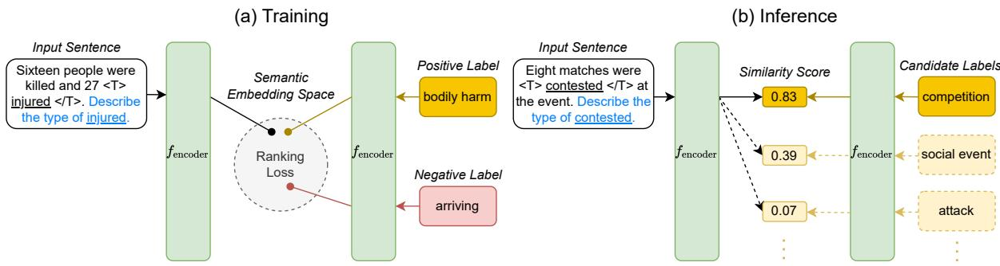
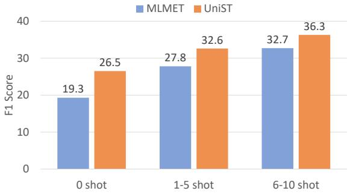

# Unified Semantic Typing with Meaningful Label Inference

James Y. Huang, Bangzheng Li∗, Jiashu Xu∗ and Muhao Chen

University of Southern California

Los Angeles, California, USA

{huangjam,bangzhen,jiashuxu,muhaoche}@usc.edu

## Abstract

Semantic typing aims at classifying tokens or spans of interest in a textual context into semantic categories such as relations, entity types, and event types. The inferred labels of semantic categories meaningfully interpret how machines understand components of text. In this paper, we present UNIST, a unified framework for semantic typing that captures label semantics by projecting both inputs and labels into a joint semantic embedding space. To formulate different lexical and relational semantic typing tasks as a unified task, we incorporate task descriptions to be jointly encoded with the input, allowing UNIST to be adapted to different tasks without introducing task-specific model components. UNIST optimizes a margin ranking loss such that the semantic relatedness of the input and labels is reflected from their embedding similarity. Our experiments demonstrate that UNIST achieves strong performance across three semantic typing tasks: entity typing, relation classification and event typing. Meanwhile, UNIST effectively transfers semantic knowledge of labels and substantially improves generalizability on inferring rarely seen and unseen types. In addition, multiple semantic typing tasks can be jointly trained within the unified framework, leading to a single compact multi-tasking model that performs comparably to dedicated single-task models, while offering even better transferability.1

## 1 Introduction

Semantic typing is a group of fundamental natural language understanding problems that aim at classifying tokens (or spans) of interest into semantic categories. This includes a wide range of long-standing NLP problems such as entity typing, relation classification, and event typing. Inferring the types of entities, relations or events mentioned is not only crucial to the structural perception of human language, but also plays an important role in many downstream tasks such as entity linking (Onoe and Durrett, 2020), information extraction (Zhong and Chen, 2021) and question answering (Yavuz et al., 2016).

Most traditional methods tackle semantic typing problems by training task-specific multi-class classifiers with token or sentence representations from language models to predict a probability distribution over a pre-defined set of classes (Dai et al., 2021; Yamada et al., 2020). However, this approach comes with several limitations. First, these models simply convert labels into indices, thus completely ignoring the rich semantics carried by the label text itself. For example, given “Currently Ritek is the largest producer of OLEDs.”, knowing what the entity type company means would naturally simplify the inference of “Ritek” is a company in this context. Second, models trained as classifiers do not generalize well to class labels that are rarely seen or unseen in the training data, as these models rely on the abundance of annotated examples to associate semantics to label indices. In particular, since these classifiers are limited by the pre-defined label set, they cannot infer any unseen labels unless being re-trained or incorporated with label mapping rules. As a result, these models struggle to handle more fine-grained semantic typing tasks in real-world scenarios (Choi et al., 2018; Chen et al., 2020) where any free-form textual labels may be used to represent the types, many of which may also be unseen during training.

In contrast to the aforementioned traditional paradigm for semantic typing, several studies have explored alternative approaches such as promptbased learning (Schick and Schütze, 2021; Ding et al., 2021) and indirect supervision from NLI models (Yin et al., 2019; Sainz et al., 2021) to make more efficient use of label semantics. However, these methods usually require hand-crafted templates or mapping between labels and language model vocabulary that do not scale well to diverse, free-form labels across various semantic typing tasks. Instead, we seek a generalizable approach that captures label semantics while requiring minimal effort to be adapted to a different task.

  
Figure 1: UNIST projects the input sentence with task descriptions (in blue) and marked token span of interest (with enclosing special tokens), and candidate labels into a shared semantic embedding space. In training, it optimizes a margin ranking loss such that positive labels are closer to the input sentence than negative labels. During inference, UNIST simply ranks candidate labels based on the similarity between input and label embeddings.

In this paper, we propose UNIST, a unified framework for semantic typing that projects context sentences and candidate labels into a shared semantic embedding space. UNIST provides a unified solution to two major categories of semantic typing tasks, namely lexical typing (e.g., entity typing, event typing) and relational typing (relation classification). By optimizing a margin ranking loss, our model captures label semantics such that positive labels are encoded closer to their respective context sentences than negative labels by at least a certain similarity margin. Depending on the task requirement, either top-k candidate labels or any candidate labels with similarity above a certain threshold are given as the final predictions. Furthermore, we add a task description to the end of the context sentences to specify the task and token (spans) of interest, and use a single model for encoding both context sentences and labels. This simple technique allows us to unify different semantic typing tasks without introducing separate taskspecific model components or learning objectives, while differentiating among distinct task prediction processes during inference. UNIST demonstrates strong performance on three semantic typing benchmarks: UFET (Choi et al., 2018) for (ultra-fine) entity typing, TACRED (Zhang et al., 2017) for relation classification, and MAVEN (Wang et al., 2020) for event typing, even achieving comparable performance with a single model trained to solve all three tasks simultaneously.

The main contributions of this work are threefold. First, the proposed UNIST framework converts distinct semantic typing tasks into a unified formulation, where both input and label semantics can be effectively captured in the same representation space. Second, we incorporate a modelagnostic task representation scheme to allow the model to differentiate among distinct tasks in training and inference without introducing additional task-specific model components. Third, UNIST demonstrates substantial improvements in both effectiveness and generalizability on entity typing, relation classification and event typing. In addition, our unified framework makes it possible to learn a single model for all three tasks, which performs comparably to dedicated models trained separately on each task.

## 2 Method

In this section, we present the technical details of UNIST, our unified framework for semantic typing. We first provide a general definition of a semantic typing problem (§2.1), followed by a detailed description of our model (§2.2), training objective(§2.3), and inference (§2.4).

## 2.1 Problem Definition

Given an input sentence s and a set of one or more token spans of interest $E = \{ e _ { 1 } , . . . e _ { n } \} , e _ { i } \subset s$ , the goal of semantic typing is to assign a set of one or more labels $Y = \{ y _ { 1 } , . . . y _ { k } \} , Y \subset \mathcal { Y }$ to E that best describes the semantic category E belongs to in the context of s. denotes the set of candidate labels, which may include a large number of free-form phrases (Choi et al., 2018) or ontological labels (Zhang et al., 2017). In this paper, we consider two categories of semantic typing tasks, lexical typing of a single token span (e.g., entity or event typing), and relational typing between two token spans (relation classification).

<table><tr><td rowspan=1 colspan=1>Task</td><td rowspan=1 colspan=1>Input Format</td></tr><tr><td rowspan=1 colspan=1>Entity Typing</td><td rowspan=1 colspan=1>Currently &lt;E&gt; Ritek &lt;/E&gt; is the largest producer of OLEDs.Describe the type of Ritek.</td></tr><tr><td rowspan=1 colspan=1>Relation Classification</td><td rowspan=1 colspan=1>&lt;SUBJ&gt; Herrera &lt;/SUBJ&gt; &#x27;s wife &lt;OBJ&gt; Ramona &lt;/OBJ&gt; died in 1991.Describe the relationship between person Herrera and person Ramona.</td></tr><tr><td rowspan=1 colspan=1>Event Typing</td><td rowspan=1 colspan=1>The siege &lt;T&gt; began &lt;/T&gt; on 15 September.Describe the type of began.</td></tr></table>

Table 1: Input formats for different semantic typing tasks. The four pairs of special tokens marks entities, subjects, objects and triggers respectively.

## 2.2 Model

Overview. As illustrated in Fig. 1, UNIST leverages a pre-trained language model (PLM) to project both input sentences and the candidate labels into a shared semantic embedding space, where the semantic relatedness between the input and label is reflected by their embedding similarity. This is accomplished by optimizing a margin ranking objective that pushes negative labels away from the input sentence while pulling the positive labels towards the input. This simple, unified paradigm allows our model to rank candidate labels based on the affinity of semantic representations with regard to the input during inference. Meanwhile, our model is not limited to a pre-defined label set, as any textual label, whether seen or unseen during training, can be ranked accordingly as long as the model captures its semantic representation. In order to specify the task at hand along with the tokens (or spans) we aim to classify, we add a task description to the end of the input sentence. This allows our framework to use unified representations from a single encoder for both inputs and labels, as well as support the inference of distinct semantic typing tasks without introducing task-specific model components.

Task Description. To highlight the tokens (or spans) we aim to type, we first enclose them with special marker tokens indicating their roles (entities, subjects, objects, or triggers). Next, we leverage the existing semantic knowledge in PLMs and add a natural language task description to the end of the input sentence to specify the task at hand along with tokens (or spans) of interest. The general format for lexical semantic typing is

Describe the type of <tokens>.

and that of relational semantic typing is

Describe the relationship between <subject> and <object>.

Examples of different input formats (including special tokens and task descriptions) can be found in Tab. 1. In addition, relational typing (relation classification) tasks may incorporate entity types from NER models alongside input sentences. Entity type information has been shown to benefit relation classification (Peng et al., 2020; Zhong and Chen, 2021; Zhou and Chen, 2021a), and can be easily incorporated into our task description, as shown in the given example.

Input Representation. We use a RoBERTa model (Liu et al., 2019) to jointly encode the input sentence and the task description. Given an input s and its task description d, we concatenate s and d into a single sequence, and obtain the hidden representation of the <s> token as the input sentence representation, denoted by u:

$$
\mathbf { u } = f _ { \mathrm { e n c o d e r } } ( [ s , d ] ) .
$$

A traditional approach to semantic typing is to train classifiers on top of the representations of specific tokens of interest (Wang et al., 2021a; Yamada et al., 2020). In the case of relational typing where two entities are involved, their representations are usually concatenated, leading to dimension mismatch with lexical typing tasks and requiring a different task-specific module to handle. Instead, thanks to the introduction of task description, UNIST always uses the universal <s> token representation for both inputs and labels, and across different semantic typing tasks.

Label Representation. Most semantic typing tasks provide textual labels in natural language from which a language model can directly capture label semantics. Some relation classification datasets such as TACRED use extra identifiers per: and org: to distinguish same relation type with different subject types. For example, per:parent refers to the parent of a person, while org:parent represents the parent of an organization such as a company. In this case, we simply replace per: and org: with person and organization respectively. The label text is encoded by the exact same model used to encode the input sentence. Given the label $y ,$ we again take the <s> token representation as the label representation, denoted by v:

$$
\mathbf { v } = f _ { \mathrm { e n c o d e r } } ( y ) .
$$

## 2.3 Learning Objective

Let be the set of all candidates labels for a semantic typing task. Given an input $[ s , d ]$ and the positive label set $Y \subset \mathcal { D }$ , we first randomly sample a negative label $y ^ { \prime } \in \mathcal { V } \backslash Y$ for each training instance. Then, we encode the input $[ s , d ]$ , positive label $y$ and negative label $y ^ { \prime }$ into their respective semantic representations u, v, and $\mathbf { v } ^ { \prime } .$ . UNIST optimizes a margin ranking loss such that positive labels, which are more semantically related to the input than negative labels, are also closer to the input in the embedding space. Specifically, the loss function for a single training instance is defined as:

$$
\mathcal { L } _ { s , y , y ^ { \prime } } = \operatorname* { m a x } \{ c ( \mathbf { u } , \mathbf { v } ^ { \prime } ) - c ( \mathbf { u } , \mathbf { v } ) + \gamma , 0 \} ,
$$

where $c ( \cdot )$ denotes cosine similarity and $\gamma$ is a nonnegative constant. The overall (single-task) training objective is given by:

$$
\mathcal { L } _ { t } = \frac { 1 } { N _ { t } } \sum _ { s \in S _ { t } } \sum _ { y \in Y _ { s } } \mathcal { L } _ { s , y , y ^ { \prime } } ,
$$

where $S _ { t }$ is the set of training instances for task $t ,$ $Y _ { s }$ is the set of all positive labels of s, and $N _ { t }$ is the number of distinct pairs of training sentence and positive label. In addition to the single-task setting which optimizes an individual task-specific loss $\scriptstyle { \mathcal { L } } _ { t }$ , we also consider a multi-task setting of UNIST where it is jointly trained on different semantic typing tasks and optimizes the following objective:

$$
\mathcal { L } = \frac { 1 } { N } \sum _ { t \in T } \sum _ { s \in S _ { t } } \sum _ { y \in Y _ { s } } \mathcal { L } _ { s , y , y ^ { \prime } } .
$$

where $T$ is the set of semantic typing tasks UNIST is trained on, and N is the total number of training instances.

## 2.4 Inference

UNIST supports different strategies for inference depending on the task requirement. If the number of labels for each input is fixed, we simply retrieve the top-k closest candidate labels to the input as the final predictions. Otherwise, all candidate labels with similarity above a certain threshold are given as predictions. Note that UNIST is not restricted to a pre-defined label set, as any textual label in natural language can be encoded by UNIST into its semantic representation and ranked accordingly during inference.

## 3 Experiments

In this section, we evaluate UNIST on single-task experiments on three semantic typing tasks: entity typing (§3.1), relation classification (§3.2) and event typing (§3.3). We then assess the generalizability of UNIST by conducting zero-shot and few-shot prediction, and study the effects of task description (§3.4). Finally, we train UNIST under multi-task setting to solve all three tasks simultaneously (§3.5).

## 3.1 Ultra-fine Entity Typing

We first conduct experiments on the ultra-fine entity typing task, which aims at predicting fine-grained free-form words or phrases that describe the appropriate types of entities mentioned in sentences.

Dataset. We use the Ultra-Fine Entity Typing (UFET) benchmark (Choi et al., 2018), which includes 5,994 sentences split into 1,998 each for train, dev and test. Each entity mention in UFET is annotated with one or more free-form type labels, covering a set of 2,519 distinct words and phrases. Following the original evaluation protocol, we report macro precision, recall and F1 score on the UFET test set.

Model. Since the number of ground truth labels for each entity is not fixed, all candidate labels with similarity above a certain threshold is given as the final predictions. We tune the hyperparameters, including the threshold, on the UFET dev set. We use base and large versions of RoBERTa as encoders for UNISTBASE and UNISTLARGE respectively.

Baselines. UFET-biLSTM (Choi et al., 2018) learns context and mention representations by combining pre-trained word embeddings with a character-level CNN and a bi-LSTM. LabelGCN (Xiong et al., 2019) adds a graph propagation layer to capture label dependencies. LDET (Onoe and Durrett, 2019) learns a denoising model that automatically filters and relabels distant supervision data for training. Box4Types (Onoe et al., 2021) introduces box embeddings to represent type hierarchies and uses $\mathrm { B E R T _ { I } }$ ARGE as context and mention encoder. LRN (Liu et al., 2021) uses an autoregressive LSTM to discover label structures, a bipartite attribute graph to capture intrinsic label dependencies, and a $\mathbf { B E R T _ { B A S E } }$ as sentence encoder. MLMET (Dai et al., 2021) generatively augments the training data with a masked language model, and fine-tunes BERTBASE on the augmented training set.

<table><tr><td>Model</td><td>P</td><td>R</td><td>F1</td></tr><tr><td>UFET-biLSTM† (Choi et al., 2018) LabelGCN† (Xiong et al., 2019)</td><td>48.1 50.3</td><td>23.3 29.2</td><td>31.3 36.9</td></tr><tr><td>LDET† (Onoe and Durrett, 2019)</td><td>51.5</td><td>33.0</td><td>40.1</td></tr><tr><td>Box4Types*† (Onoe et al., 2021)</td><td>52.8</td><td>38.8</td><td>44.8</td></tr><tr><td>LRN (Liu et al., 2021)</td><td></td><td></td><td></td></tr><tr><td></td><td>54.5</td><td>38.9</td><td>45.4</td></tr><tr><td>MLMET† (Dai et al., 2021)</td><td>53.6</td><td>45.3</td><td>49.1</td></tr><tr><td> $\mathrm { U N I S T _ { B A S E } }$ </td><td>49.2</td><td>49.4</td><td>49.3</td></tr><tr><td> $\mathrm { U N I S T _ { L A R G E } } ^ { * }$ </td><td>50.2</td><td>49.6</td><td>49.9</td></tr></table>

Table 2: Results of entity typing on UFET. \* marks models based on large versions of PLMs. † marks models using augmented training data.

Results. As shown in Tab. 2, UNISTBASE already outperforms the SOTA baseline MLMET without training on any augmented data by 0.2% in F1 score. With a larger language model, UNISTLARGE further improves F1 score by another 0.6%. Since UFET only provides a small set of human annotated training data compared to its diverse label set, all baselines except LRN incorporate distant supervision data to alleviate data scarcity. UNIST’s superior performance on UFET demonstrates the importance of capturing label semantics as an auxiliary supervision signal that is not fully exploited by previous methods. This is especially beneficial when annotated data are limited, and can alleviate the model’s reliance on augmenting training data. In this way, UNIST also achieves better generalizability to unseen and rarely seen labels, for which we conduct a more detailed analysis on few-shot and zero-shot UFET labels in §3.4.

## 3.2 Relation Classification

The goal of relation classification is to determine the relation between a subject entity and an object entity mentioned in a sentence.

<table><tr><td>Model</td><td>P</td><td>R</td><td>F1</td></tr><tr><td>SpanBERT* (Joshi et al., 2020) MTB* (Baldini Soares et al., 2019) TANL (Paolini et al., 2021) K-Adapter* (Wang et al., 2021a)</td><td>70.8 一</td><td>70.9 -</td><td>70.8 71.5 71.9</td></tr><tr><td>LUKE* (Yamada et al., 2020)</td><td>70.1 70.4</td><td>74.0 75.1</td><td>72.0 72.7</td></tr><tr><td>BERT-CR* (Zhou and Chen, 2021b)</td><td></td><td></td><td>73.0</td></tr><tr><td>IBRE* (Zhou and Chen, 2021a)</td><td></td><td></td><td>74.6</td></tr><tr><td>SP* (Cohen et al., 2020)</td><td>74.6</td><td>75.2</td><td>74.8</td></tr><tr><td> $\mathrm { U N I S T _ { B A S E } }$   $\mathrm { U N I S T _ { L A R G E } } ^ { * }$ </td><td>73.6 78.0 73.1</td><td>75.0</td><td>74.3</td></tr></table>

Table 3: Results of relation classification on TACRED. \* marks models based on large versions of PLMs.

Dataset. We run the experiments on TACRED (Zhang et al., 2017), a widely used benchmark for this task that contains 106,264 sentences with entity pairs labeled as one of the 41 relation types or a no\_relation type. TACRED provides 68,124 instances for training, 22,631 for dev, and 15,509 for testing. Following the original evaluation protocol, we report micro precision, recall and F1 score on the TACRED test set.

Model Configuration. UNIST retrieves the candidate label closest to the input in the embedding space as the final prediction. Since entities in TA-CRED are also annotated with entity types, we place the entity type labels in front of their corresponding entity mentions in the task description to provide additional information for relation classification, as shown in Tab. 1. We tune the hyperparameters on the TACRED dev set.

Baselines. SpanBERT (Joshi et al., 2020) incorporates span prediction as an additional objective for BERT pre-training. MTB (Baldini Soares et al., 2019) introduces matching-the-blank training on entity-linked text to connect relation representations among related instances. TANL (Paolini et al., 2021) proposes a unified text-to-text framework for structured prediction tasks based on T5 (Raffel et al., 2020). K-Adapter (Wang et al., 2021a) learns adapter modules to infuse structured knowledge into a RoBERTaLARGE model. LUKE further trains RoBERTaLARGE on entity-annotated corpus with an entity-aware self-attention mechanism. BERT-CR (Zhou and Chen, 2021b) introduces a co-regularization framework to improve learning from noisy datasets with a BERTLARGE model. IBRE (Zhou and Chen, 2021b) incorporates entity type information into mention markers in the sentence to boost the performance of

RoBERTa ${ \bf \mathcal { A } R G E }$ . SP (Cohen et al., 2020) formulates relation classification as a two-way span prediction problem, and uses ALBERT (Lan et al., 2020) as encoder2.

Results. As shown in Tab. 3, UNISTBASE already outperforms several strong baselines which are built on larger PLMs (BERTLARGE or $\mathrm { R o B E R T a } _ { \mathrm { L A R G E } } )$ , except for SP and IBRE. $\mathrm { U N I S T } _ { \mathrm { L A R G E } }$ further improves the performance and establishes new SOTA on TACRED, outperforming the best baseline SP by 0.7% in F1. While SP also leverages label semantics by framing relation classification as a two-way question answering problem, it requires hand-crafted question templates for each relation label and more significant computational cost for answer span prediction. In comparison, UNIST directly captures label semantics from the label text itself, while offering superior performance and inference efficiency as labels can be retrieved by simply computing embedding cosine similarity.

## 3.3 Event Typing

Event typing aims at assigning an event type to an event trigger that clearly indicates an event.

Dataset. We conduct the evaluation using MAVEN (Wang et al., 2020), a general-domain event extraction benchmark with 77,993/18,904/21,835 event triggers for train/dev/test annotated with 168 distinct event types. MAVEN also provides a large set of negative triggers, which includes all content words (nouns, verbs, adjectives, and adverbs) labeled by a part-of-speech tagger but not annotated as an event trigger. Since UNIST focuses on semantic typing and does not handle mention span prediction, we train a BERT-CRF model to first identify trigger candidates following Wang et al. (2020), and then predict an event type for each trigger candidate using UNIST. Following the original paper, we report micro precision, recall and F1 score on MAVEN test set.

Model Configuration. We retrieve the candidate label with the highest similarity to the input as the predicted event type. We tune the hyperparameters on the MAVEN dev set.

<table><tr><td>Model</td><td>P</td><td>R</td><td>F1</td></tr><tr><td>DMCNN (Chen et al., 2015) MOGANED (Yan et al., 2019) DMBERT (Wang et al., 2019) BERT-CRF (Wang et al., 2020) CLEVE* (Wang et al., 2021b)</td><td>66.3 63.4 62.7 65.0 64.9</td><td>55.9 64.1 72.3 70.9 72.6</td><td>60.6 63.8 67.1 67.8</td></tr><tr><td> $\mathrm { U N I S T _ { B A S E } }$   $\mathrm { U N I S T _ { L A R G E } } ^ { * }$ </td><td>66.7 66.5</td><td>69.9 69.7</td><td>68.5 68.3 68.1</td></tr></table>

Table 4: Results of event typing on MAVEN. \* marks models based on large versions of PLMs. All baseline results except CLEVE are taken from Wang et al. (2020)

Baselines. DMCNN (Chen et al., 2015) uses a CNN with dynamic multi-pooling to obtain trigger representations for classification. MOGANED (Yan et al., 2019) proposes a multi-order GCN to capture interrelation between event trigger and argument representations based on dependency trees. DMBERT (Wang et al., 2019) improves DMCNN by training a $\mathrm { B E R T _ { B A S E } }$ model as sentence encoder with dynamic multi-pooling. BERT-CRF stacks a CRF layer on top of BERTBASE to model multiple event correlations in a single sentence. CLEVE (Wang et al., 2021b) proposes a contrastive learning framework fine-tuned on large-scale corpus with AMR structures obtained from AMR parsers, and combines AMR graph representations from a GNN and text representations from $\mathrm { R o B E R T a } _ { \mathrm { L A R G E } }$ to classify event types.

Results. As shown in Tab. 4, UNIST is able to improve event typing over BERT-CRF, and outperform all baselines except CLEVE. Note that in addition to being initialized from the same RoBERTa model as UNIST, CLEVE is further fine-tuned on large-scale corpus with AMR structures obtained from a separate parsing model (Xu et al., 2020) that also requires large human-annotated data to train. This indicates much more expensive supervision signals used by CLEVE. In contrast, UNIST effectively captures the meaning of event types and learns to classify event triggers by only fine-tuning on MAVEN, while still achieving promising performance without the need of any additional annotated resources.

## 3.4 Analysis

In this section, we provide a detailed analysis to better understand the generalizability of UNIST and the effects of incorporating task description. Specifically, we examine UNIST’s performance on few-shot and zero-shot entity typing on UFET, zero-shot relation classification on FewRel (Han et al., 2018), and how UNIST performs without task descriptions.

  
Figure 2: Comparison between MLMET and UNIST on few-shot and zero-shot prediction on UFET.

Few-shot & Zero-shot Entity Typing. A large portion of UFET test set labels have very few or even no training instances. We focus on entity types with no more than 10 instances in the training set, and compare the performance of UNISTBASE with the previous SOTA model MLMET on these fewshot and zero-shot labels.

As shown in Fig. 2, the advantage of UNIST over MLMET becomes more evident for rarer labels. For the most challenging zero-shot labels, UNIST substantially outperforms MLMET by 7.2% in F1 score, suggesting that UNIST is better generalized to infer low-resource and unseen entity types.

Zero-shot Relation Classification. We conduct experiments on FewRel (Han et al., 2018), a widely used benchmark for low-resource relation classification. FewRel includes 64/16/20 non-overlapping relation types for train/dev/test with 700 sentences collected from Wikipedia for each relation type. We evaluate UNIST under the N-way-0-shot setting, where the goal is to predict the correct relation among N candidate relations without seen training examples. Following previous studies (Cetoli, 2020; Dong et al., 2021), we report 5-way-0-shot and 10-way-0-shot accuracy on the FewRel dev set.

We compare UNIST with following baselines: REGRAB (Qu et al., 2020) proposes a bayesian meta-learning method to infer the posterior distribution of relation prototypes initialized with knowledge graph embeddings. BERT-SQuAD (Cetoli, 2020) formulates zero-shot relation classification as a question answering problem, and fine-tunes a BERTLARGE QA model trained on SQuAD 1.1 (Rajpurkar et al., 2016) to predict relation types. MapRE (Dong et al., 2021) proposes a contrastive pre-training framework that learns input and relation representations from large-scale relationannotated data. All baselines, as well as UNIST, are fine-tuned on the FewRel training set, and then evaluated on the FewRel dev set with a new set of relation types completely disjoint from that of the training set.

<table><tr><td>Model</td><td>5-way 0-shot</td><td>10-way 0-shot</td></tr><tr><td>REGRAB† (Qu et al., 2020)</td><td>52.5</td><td>37.5</td></tr><tr><td>BERT+SQuAD*(Cetoli, 2020)</td><td>86.0</td><td>76.2</td></tr><tr><td>MapRE (Dong et al., 2021)</td><td>90.7</td><td>81.5</td></tr><tr><td>UNISTBASE</td><td>91.2</td><td>82.9</td></tr></table>

Table 5: Accuracy results of zero-shot relation classification on FewRel. \* marks models based on large versions of PLMs. † Results for REGRAB are taken from Dong et al. (2021).

<table><tr><td>Model</td><td>UFET</td><td>TACRED</td><td>MAVEN</td></tr><tr><td>UNISTBASE</td><td>49.3</td><td>74.3</td><td>68.3</td></tr><tr><td>- without task description</td><td>49.2</td><td>72.9</td><td>68.2</td></tr></table>

Table 6: F1 results of ablation experiments without task description on UFET, TACRED and MAVEN.

As shown in Tab. 5, UNIST outperforms the best baseline MapRE by 0.5% and 1.4% in accuracy on 5-way-0-shot and 10-way-0-shot tasks without first pre-training on any relation-annotated data. This demonstrates that by effectively captures label semantics, UNIST allows better knowledge transfer to handle unseen relation types.

Effects of Task Description. We conduct an ablation experiment on task descriptions using UNIST to better understand their effects on downstream tasks. As shown in Tab. 6, the performance on TA-CRED degrades much more significantly compared to that on UFET and MAVEN after removing task description. In lexical typing, the token span to be classified tend to share similar semantics with its type, and in many cases can be easily matched to its type label without explicitly specifying the task. In contrast, relation types are usually not semantically similar to its subject and object, and task description helps bridge this gap.

## 3.5 Multi-task Learning

With a unified task formulation, UNIST facilities learning a single model to jointly train on and simultaneously solve different semantic typing tasks. For more balanced training, We train UNIST on the combined training set of UFET, TACRED and MAVEN, and report F1 performance on their respective test sets by following their respective evaluation protocol. We also include performance of single-task UNIST for comparison.

<table><tr><td rowspan="2">Model</td><td rowspan="2">U</td><td rowspan="2">T</td><td rowspan="2">M</td><td colspan="2">FewRel</td></tr><tr><td>0-shot</td><td>5-way 10-way 0-shot</td></tr><tr><td>UNISTBASE,U</td><td>49.3</td><td>6.1</td><td>19.6</td><td>68.9</td><td>56.0</td></tr><tr><td>UNISTBASE,T</td><td>3.0</td><td>74.3</td><td>5.2</td><td>62.5</td><td>48.4</td></tr><tr><td>UNISTBASE,M</td><td>22.5</td><td>4.3</td><td>68.3</td><td>55.1</td><td>39.7</td></tr><tr><td>UNISTBASE,U+T+M</td><td>48.5</td><td>74.2</td><td>68.2</td><td>80.9</td><td>72.0</td></tr></table>

Table 7: F1 results by multi-task learning on UFET (U), TACRED (T), MAVEN (M), and zero-shot transfer to FewRel.

As shown in Tab. 7, our multi-task model obtain generally comparable performance to dedicated UNIST models trained separately on each of the three semantic typing tasks. Despite a slight decrease in performance on some of the tasks, $\mathrm { U N I S T _ { U + T + M } }$ is still able to outperform several strong baselines discussed earlier. Hence, UNIST provides a possible solution for learning a compact, unified model with a joint semantic embedding space across different semantic typing tasks. Moreover, this leads to a well-structured embedding space that better allows zero-shot transfer to new semantic typing tasks. To provide a preliminary analysis on the potential of UNIST on cross-task transfer, we evaluate both single-task and multitask UNIST models on FewRel dev set without training on any FewRel data. While FewRel is also a relation classification dataset like TACRED, 75% of the relation types in FewRel dev set do not exist in TACRED. Results in Tab. 7 show that by jointly training on different semantic typing tasks within a unified framework, UNIST demonstrate significantly stronger transferability to the unseen FewRel task compared to single-task variants. It would be meaningful to see if incorporating more datasets and tasks into UNIST would further benefit crosstask transfer, especially to tasks with limited data available for training. We leave this as a direction for further investigation.

## 4 Related Works

We present two lines of relevant research topics. Each has a large body of work which we can only provide as a highly selected summary.

Semantic Typing. Semantic typing tasks can be generally categorized into lexical typing (e.g., entity typing, event typing) and relational typing (or classification). A large number of specialized approaches have been developed for individual semantic typing tasks. For example, prior studies on entity typing have exploited label dependencies and hierarchies (Xu and Barbosa, 2018; Xiong et al., 2019), capturing label relations with knowledge bases (Dai et al., 2019; Jin et al., 2019), as well as automatic data augmentation and denoising techniques (Onoe and Durrett, 2019; Dai et al., 2021) to deal with fine-grained type vocabularies. Relation classification has been tackled by modeling dependency structures (Zhang et al., 2018), learning span representations (Joshi et al., 2020), entity representations (Yamada et al., 2020), and injecting external knowledge into pre-trained language models (Peters et al., 2019; Zhang et al., 2019; Wang et al., 2021a). Nevertheless, most previous methods have formulated semantic typing as a multi-class classification problem without capturing label semantics.

Learning Label Semantics. Previous studies have attempted formulating typing tasks into other tasks that allow more effective learning of label semantics. Following this idea, semantic typing tasks have been reformulated as prompt-based learning (Ding et al., 2021; Han et al., 2021), natural language inference (Yin et al., 2019; Sainz et al., 2021), question answering (Levy et al., 2017; Li et al., 2019; Du and Cardie, 2020), and translation (Paolini et al., 2021). Another line of research that is more relevant to our approach focuses on learning semantic label embeddings such that candidate labels can be ranked based on their affinity with the input in the embedding space. Semantic label embeddings have been successfully applied to a variety of tasks such as hierarchical text classification (Chen et al., 2021; Shen et al., 2021) and intent detection (Xia et al., 2018). In the context of semantic typing tasks, Chen et al. (2020) propose a learning-to-rank framework for multi-axis event process typing with indirect supervision from label glosses. Chen and Li (2021) use a pre-trained sentence embedding model to learn relation label embeddings from label descriptions. Dong et al. (2021) propose a contrastive pre-training framework to learn input and relation representations from large-scale relation-annotated data. Unlike previous approaches, UNIST does not rely on external label knowledge, training data or task-specific model components. Instead, UNIST effectively captures label semantics solely from label names, and unify different semantic typing tasks into a single framework by incorporating task descriptions to be jointly encoded with the input.

## 5 Conclusion

We propose UNIST, a unified framework for semantic typing that exploits label semantics to learn a joint semantic embedding space for both inputs and labels. By incorporating model-agnostic task descriptions, UNIST can be easily adapted to different semantic typing tasks without introducing taskspecific model components. Experimental results show that UNIST offers both strong performance and generalizability on entity typing, relation classification, and event typing. Our unified framework also facilitates learning a single model to solve different semantic typing tasks simultaneously, with performance on par with dedicated models trained on individual tasks.

## Acknowledgment

We appreciate the anonymous reviewers for their insightful comments and suggestions. This material is supported in part by the DARPA MCS program under Contract No. N660011924033 with the United States Office Of Naval Research, and by the National Science Foundation of United States Grant IIS 2105329.

## References

Livio Baldini Soares, Nicholas FitzGerald, Jeffrey Ling, and Tom Kwiatkowski. 2019. Matching the blanks: Distributional similarity for relation learning. In Proceedings of the 57th Annual Meeting of the Association for Computational Linguistics, pages 2895– 2905, Florence, Italy. Association for Computational Linguistics.

Alberto Cetoli. 2020. Exploring the zero-shot limit of FewRel. In Proceedings of the 28th International Conference on Computational Linguistics, pages 1447–1451, Barcelona, Spain (Online). International Committee on Computational Linguistics.

Chih-Yao Chen and Cheng-Te Li. 2021. ZS-BERT: Towards zero-shot relation extraction with attribute representation learning. In Proceedings of the 2021 Conference of the North American Chapter of the Association for Computational Linguistics: Human Language Technologies, pages 3470–3479, Online. Association for Computational Linguistics.

Haibin Chen, Qianli Ma, Zhenxi Lin, and Jiangyue Yan. 2021. Hierarchy-aware label semantics matching net-

work for hierarchical text classification. In Proceedings ofthe 59th Annual Meeting ofthe Associationfor Computational Linguistics and the 11th International Joint Conference on Natural Language Processing (Volume 1: Long Papers), pages 4370–4379, Online. Association for Computational Linguistics.

Muhao Chen, Hongming Zhang, Haoyu Wang, and Dan Roth. 2020. What are you trying to do? semantic typing of event processes. In Proceedings of the 24th Conference on Computational Natural Language Learning, pages 531–542, Online. Association for Computational Linguistics.

Yubo Chen, Liheng Xu, Kang Liu, Daojian Zeng, and Jun Zhao. 2015. Event extraction via dynamic multipooling convolutional neural networks. In Proceedings ofthe 53rd Annual Meeting ofthe Association for Computational Linguistics and the 7th International Joint Conference on Natural Language Processing (Volume 1: Long Papers), pages 167–176, Beijing, China. Association for Computational Linguistics.

Eunsol Choi, Omer Levy, Yejin Choi, and Luke Zettlemoyer. 2018. Ultra-fine entity typing. In Proceedings of the 56th Annual Meeting of the Association for Computational Linguistics (Volume 1: Long Papers), pages 87–96, Melbourne, Australia. Association for Computational Linguistics.

Amir DN Cohen, Shachar Rosenman, and Yoav Goldberg. 2020. Relation classification as two-way spanprediction. arXiv preprint arXiv:2010.04829.

Hongliang Dai, Donghong Du, Xin Li, and Yangqiu Song. 2019. Improving fine-grained entity typing with entity linking. In Proceedings ofthe 2019 Conference on Empirical Methods in Natural Language Processing and the 9th International Joint Conference on Natural Language Processing (EMNLP-IJCNLP), pages 6210–6215, Hong Kong, China. Association for Computational Linguistics.

Hongliang Dai, Yangqiu Song, and Haixun Wang. 2021. Ultra-fine entity typing with weak supervision from a masked language model. In Proceedings ofthe 59th Annual Meeting ofthe Associationfor Computational Linguistics and the 11th International Joint Conference on Natural Language Processing (Volume 1: Long Papers), pages 1790–1799, Online. Association for Computational Linguistics.

Ning Ding, Yulin Chen, Xu Han, Guangwei Xu, Pengjun Xie, Hai-Tao Zheng, Zhiyuan Liu, Juanzi Li, and Hong-Gee Kim. 2021. Prompt-learning for fine-grained entity typing. arXiv preprint arXiv:2108.10604.

Manqing Dong, Chunguang Pan, and Zhipeng Luo. 2021. MapRE: An effective semantic mapping approach for low-resource relation extraction. In Proceedings of the 2021 Conference on Empirical Methods in Natural Language Processing, pages 2694– 2704, Online and Punta Cana, Dominican Republic. Association for Computational Linguistics.

Xinya Du and Claire Cardie. 2020. Event extraction by answering (almost) natural questions. In Proceedings ofthe 2020 Conference on Empirical Methods in Natural Language Processing (EMNLP), pages 671–683, Online. Association for Computational Linguistics.

Xu Han, Weilin Zhao, Ning Ding, Zhiyuan Liu, and Maosong Sun. 2021. Ptr: Prompt tuning with rules for text classification. arXiv preprint arXiv:2105.11259.

Xu Han, Hao Zhu, Pengfei Yu, Ziyun Wang, Yuan Yao, Zhiyuan Liu, and Maosong Sun. 2018. FewRel: A large-scale supervised few-shot relation classification dataset with state-of-the-art evaluation. In Proceedings ofthe 2018 Conference on Empirical Methods in Natural Language Processing, pages 4803–4809, Brussels, Belgium. Association for Computational Linguistics.

Hailong Jin, Lei Hou, Juanzi Li, and Tiansi Dong. 2019. Fine-grained entity typing via hierarchical multi graph convolutional networks. In Proceedings of the 2019 Conference on Empirical Methods in Natural Language Processing and the 9th International Joint Conference on Natural Language Processing (EMNLP-IJCNLP), pages 4969–4978, Hong Kong, China. Association for Computational Linguistics.

Mandar Joshi, Danqi Chen, Yinhan Liu, Daniel S. Weld, Luke Zettlemoyer, and Omer Levy. 2020. Span-BERT: Improving pre-training by representing and predicting spans. Transactions ofthe Associationfor Computational Linguistics, 8:64–77.

Zhenzhong Lan, Mingda Chen, Sebastian Goodman, Kevin Gimpel, Piyush Sharma, and Radu Soricut. 2020. Albert: A lite bert for self-supervised learning of language representations. In International Conference on Learning Representations.

Omer Levy, Minjoon Seo, Eunsol Choi, and Luke Zettlemoyer. 2017. Zero-shot relation extraction via reading comprehension. In Proceedings ofthe 21st Conference on Computational Natural Language Learning (CoNLL 2017), pages 333–342, Vancouver, Canada. Association for Computational Linguistics.

Xiaoya Li, Fan Yin, Zijun Sun, Xiayu Li, Arianna Yuan, Duo Chai, Mingxin Zhou, and Jiwei Li. 2019. Entityrelation extraction as multi-turn question answering. In Proceedings ofthe 57th Annual Meeting ofthe Associationfor Computational Linguistics, pages 1340– 1350, Florence, Italy. Association for Computational Linguistics.

Qing Liu, Hongyu Lin, Xinyan Xiao, Xianpei Han, Le Sun, and Hua Wu. 2021. Fine-grained entity typing via label reasoning. In Proceedings of the 2021 Conference on Empirical Methods in Natural Language Processing, pages 4611–4622, Online and Punta Cana, Dominican Republic. Association for Computational Linguistics.

Yinhan Liu, Myle Ott, Naman Goyal, Jingfei Du, Mandar Joshi, Danqi Chen, Omer Levy, Mike Lewis, Luke Zettlemoyer, and Veselin Stoyanov. 2019. Roberta: A robustly optimized bert pretraining approach. arXiv preprint arXiv:1907.11692.

Ilya Loshchilov and Frank Hutter. 2019. Decoupled weight decay regularization. In International Conference on Learning Representations.

Shengfei Lyu and Huanhuan Chen. 2021. Relation classification with entity type restriction. In Findings of the Association for Computational Linguistics: ACL-IJCNLP 2021, pages 390–395, Online. Association for Computational Linguistics.

Yasumasa Onoe, Michael Boratko, Andrew McCallum, and Greg Durrett. 2021. Modeling fine-grained entity types with box embeddings. In Proceedings of the 59th Annual Meeting ofthe Associationfor Computational Linguistics and the 11th International Joint Conference on Natural Language Processing (Volume 1: Long Papers), pages 2051–2064, Online. Association for Computational Linguistics.

Yasumasa Onoe and Greg Durrett. 2019. Learning to denoise distantly-labeled data for entity typing. In Proceedings of the 2019 Conference of the North American Chapter ofthe Association for Computational Linguistics: Human Language Technologies, Volume 1 (Long and Short Papers), pages 2407–2417, Minneapolis, Minnesota. Association for Computational Linguistics.

Yasumasa Onoe and Greg Durrett. 2020. Interpretable entity representations through large-scale typing. In Findings ofthe Associationfor Computational Linguistics: EMNLP 2020, pages 612–624, Online. Association for Computational Linguistics.

Giovanni Paolini, Ben Athiwaratkun, Jason Krone, Jie Ma, Alessandro Achille, RISHITA ANUBHAI, Cicero Nogueira dos Santos, Bing Xiang, and Stefano Soatto. 2021. Structured prediction as translation between augmented natural languages. In International Conference on Learning Representations.

Hao Peng, Tianyu Gao, Xu Han, Yankai Lin, Peng Li, Zhiyuan Liu, Maosong Sun, and Jie Zhou. 2020. Learning from Context or Names? An Empirical Study on Neural Relation Extraction. In Proceedings ofthe 2020 Conference on Empirical Methods in Natural Language Processing (EMNLP), pages 3661–3672, Online. Association for Computational Linguistics.

Matthew E. Peters, Mark Neumann, Robert Logan, Roy Schwartz, Vidur Joshi, Sameer Singh, and Noah A. Smith. 2019. Knowledge enhanced contextual word representations. In Proceedings ofthe 2019 Conference on Empirical Methods in Natural Language Processing and the 9th International Joint Conference on Natural Language Processing (EMNLP-IJCNLP), pages 43–54, Hong Kong, China. Association for Computational Linguistics.

Meng Qu, Tianyu Gao, Louis-Pascal AC Xhonneux, and Jian Tang. 2020. Few-shot relation extraction via bayesian meta-learning on relation graphs. In International Conference on Machine Learning.

Colin Raffel, Noam Shazeer, Adam Roberts, Katherine Lee, Sharan Narang, Michael Matena, Yanqi Zhou, Wei Li, and Peter J. Liu. 2020. Exploring the limits of transfer learning with a unified text-to-text transformer. Journal of Machine Learning Research, 21(140):1–67.

Pranav Rajpurkar, Jian Zhang, Konstantin Lopyrev, and Percy Liang. 2016. SQuAD: 100,000+ questions for machine comprehension of text. In Proceedings of the 2016 Conference on Empirical Methods in Natural Language Processing, pages 2383–2392, Austin, Texas. Association for Computational Linguistics.

Oscar Sainz, Oier Lopez de Lacalle, Gorka Labaka, Ander Barrena, and Eneko Agirre. 2021. Label verbalization and entailment for effective zero and fewshot relation extraction. In Proceedings ofthe 2021 Conference on Empirical Methods in Natural Language Processing, pages 1199–1212, Online and Punta Cana, Dominican Republic. Association for Computational Linguistics.

Timo Schick and Hinrich Schütze. 2021. Exploiting cloze-questions for few-shot text classification and natural language inference. In Proceedings of the 16th Conference ofthe European Chapter ofthe Associationfor Computational Linguistics: Main Volume, pages 255–269, Online. Association for Computational Linguistics.

Jiaming Shen, Wenda Qiu, Yu Meng, Jingbo Shang, Xiang Ren, and Jiawei Han. 2021. TaxoClass: Hierarchical multi-label text classification using only class names. In Proceedings of the 2021 Conference ofthe North American Chapter ofthe Associationfor Computational Linguistics: Human Language Technologies, pages 4239–4249, Online. Association for Computational Linguistics.

Ruize Wang, Duyu Tang, Nan Duan, Zhongyu Wei, Xuanjing Huang, Jianshu Ji, Guihong Cao, Daxin Jiang, and Ming Zhou. 2021a. K-Adapter: Infusing Knowledge into Pre-Trained Models with Adapters. In Findings of the Association for Computational Linguistics: ACL-IJCNLP 2021, pages 1405–1418, Online. Association for Computational Linguistics.

Xiaozhi Wang, Xu Han, Zhiyuan Liu, Maosong Sun, and Peng Li. 2019. Adversarial training for weakly supervised event detection. In Proceedings of the 2019 Conference of the North American Chapter of the Association for Computational Linguistics: Human Language Technologies, Volume 1 (Long and Short Papers), pages 998–1008, Minneapolis, Minnesota. Association for Computational Linguistics.

Xiaozhi Wang, Ziqi Wang, Xu Han, Wangyi Jiang, Rong Han, Zhiyuan Liu, Juanzi Li, Peng Li, Yankai Lin, and Jie Zhou. 2020. MAVEN: A Massive General

Domain Event Detection Dataset. In Proceedings of the 2020 Conference on Empirical Methods in Natural Language Processing (EMNLP), pages 1652– 1671, Online. Association for Computational Linguistics.

Ziqi Wang, Xiaozhi Wang, Xu Han, Yankai Lin, Lei Hou, Zhiyuan Liu, Peng Li, Juanzi Li, and Jie Zhou. 2021b. CLEVE: Contrastive Pre-training for Event Extraction. In Proceedings ofthe 59th Annual Meeting of the Association for Computational Linguistics and the 11th International Joint Conference on Natural Language Processing (Volume 1: Long Papers), pages 6283–6297, Online. Association for Computational Linguistics.

Congying Xia, Chenwei Zhang, Xiaohui Yan, Yi Chang, and Philip Yu. 2018. Zero-shot user intent detection via capsule neural networks. In Proceedings of the 2018 Conference on Empirical Methods in Natural Language Processing, pages 3090–3099, Brussels, Belgium. Association for Computational Linguistics.

Wenhan Xiong, Jiawei Wu, Deren Lei, Mo Yu, Shiyu Chang, Xiaoxiao Guo, and William Yang Wang. 2019. Imposing label-relational inductive bias for extremely fine-grained entity typing. In Proceedings of the 2019 Conference of the North American Chapter of the Association for Computational Linguistics: Human Language Technologies, Volume 1 (Long and Short Papers), pages 773–784, Minneapolis, Minnesota. Association for Computational Linguistics.

Dongqin Xu, Junhui Li, Muhua Zhu, Min Zhang, and Guodong Zhou. 2020. Improving AMR parsing with sequence-to-sequence pre-training. In Proceedings of the 2020 Conference on Empirical Methods in Natural Language Processing (EMNLP), pages 2501– 2511, Online. Association for Computational Linguistics.

Peng Xu and Denilson Barbosa. 2018. Neural finegrained entity type classification with hierarchyaware loss. In Proceedings ofthe 2018 Conference ofthe North American Chapter ofthe Associationfor Computational Linguistics: Human Language Technologies, Volume 1 (Long Papers), pages 16–25, New Orleans, Louisiana. Association for Computational Linguistics.

Ikuya Yamada, Akari Asai, Hiroyuki Shindo, Hideaki Takeda, and Yuji Matsumoto. 2020. LUKE: Deep contextualized entity representations with entityaware self-attention. In Proceedings of the 2020 Conference on Empirical Methods in Natural Language Processing (EMNLP), pages 6442–6454, Online. Association for Computational Linguistics.

Haoran Yan, Xiaolong Jin, Xiangbin Meng, Jiafeng Guo, and Xueqi Cheng. 2019. Event detection with multiorder graph convolution and aggregated attention. In Proceedings of the 2019 Conference on Empirical Methods in Natural Language Processing and the

9th International Joint Conference on Natural Language Processing (EMNLP-IJCNLP), pages 5766– 5770, Hong Kong, China. Association for Computational Linguistics.

Semih Yavuz, Izzeddin Gur, Yu Su, Mudhakar Srivatsa, and Xifeng Yan. 2016. Improving semantic parsing via answer type inference. In Proceedings of the 2016 Conference on Empirical Methods in Natural Language Processing, pages 149–159, Austin, Texas. Association for Computational Linguistics.

Wenpeng Yin, Jamaal Hay, and Dan Roth. 2019. Benchmarking zero-shot text classification: Datasets, evaluation and entailment approach. In Proceedings of the 2019 Conference on Empirical Methods in Natural Language Processing and the 9th International Joint Conference on Natural Language Processing (EMNLP-IJCNLP), pages 3914–3923, Hong Kong, China. Association for Computational Linguistics.

Yuhao Zhang, Peng Qi, and Christopher D. Manning. 2018. Graph convolution over pruned dependency trees improves relation extraction. In Proceedings of the 2018 Conference on Empirical Methods in Natural Language Processing, pages 2205–2215, Brussels, Belgium. Association for Computational Linguistics.

Yuhao Zhang, Victor Zhong, Danqi Chen, Gabor Angeli, and Christopher D. Manning. 2017. Position-aware attention and supervised data improve slot filling. In Proceedings of the 2017 Conference on Empiri cal Methods in Natural Language Processing, pages 35–45, Copenhagen, Denmark. Association for Computational Linguistics.

Zhengyan Zhang, Xu Han, Zhiyuan Liu, Xin Jiang, Maosong Sun, and Qun Liu. 2019. ERNIE: Enhanced language representation with informative entities. In Proceedings ofthe 57th Annual Meeting of the Associationfor Computational Linguistics, pages 1441–1451, Florence, Italy. Association for Computational Linguistics.

Zexuan Zhong and Danqi Chen. 2021. A frustratingly easy approach for entity and relation extraction. In Proceedings of the 2021 Conference of the North American Chapter of the Association for Computational Linguistics: Human Language Technologies, pages 50–61, Online. Association for Computational Linguistics.

Wenxuan Zhou and Muhao Chen. 2021a. An improved baseline for sentence-level relation extraction. arXiv preprint arXiv:2102.01373.

Wenxuan Zhou and Muhao Chen. 2021b. Learning from noisy labels for entity-centric information extraction. In Proceedings of the 2021 Conference on Empirical Methods in Natural Language Processing, pages 5381–5392, Online and Punta Cana, Dominican Republic. Association for Computational Linguistics.

## Appendices

## A Experiment Details

We run all single-task UNISTBASE experiments on NVIDIA RTX 2080Ti GPUs, and all UNISTLARGE and multi-task experiments on NVIDIA RTX A5000 GPUs. UNISTBASE and UNISTLARGE use base and large versions of RoBERTa as encoders with 125M and 355M parameters respectively. We conduct hyperparameter search within the following range:

• learning rate: {3e-6, 5e-6, 1e-5, 2e-5}

• Batch size: {32, 64, 128}

• Number of training epochs: {50, 100, 200, 500, 1000}

• Ranking loss margin γ:{ 0.1, 0.2, 0.3}

<table><tr><td>Learning rate Dropout rate Adam € Adam  $\beta _ { 1 }$ </td><td>5e-6 0.1 1e-6 0.9</td></tr></table>

Table 8: Common hyperparameters used in all experiments.

We optimize our models using AdamW (Loshchilov and Hutter, 2019) with linear learning rate decay. The best model checkpoints are selected based on dev set performance. Tab. 8 lists common hyperparameters used across all experiments. All datasets used in our experiments are in English. More details of individual tasks and experiments are provided below.

## A.1 UFET

The UFET dataset is publicly available on its official website 3. Tab. 9 shows the hyperparameters and dev F1 score for UFET experiments.

<table><tr><td>Name</td><td>UNISTBASE</td><td>UNISTLARGE</td></tr><tr><td>Batch size</td><td>64</td><td>64</td></tr><tr><td>Number of training epochs</td><td>1000</td><td>1000</td></tr><tr><td>Dev F1</td><td>49.2</td><td>49.5</td></tr></table>

Table 9: Hyperparameters and dev F1 score for UFET experiments.

## A.2 TACRED

The TACRED dataset we use is licensed by LDC 4. Tab. 10 shows the hyperparameters and dev F1 score for TACRED experiments.
<table><tr><td>Name</td><td>UNISTBASE</td><td>UNISTLARGE</td></tr><tr><td>Batch size</td><td>64</td><td>64</td></tr><tr><td>Number of training epochs</td><td>100</td><td>100</td></tr><tr><td>Dev F1</td><td>73.9</td><td>75.3</td></tr></table>

Table 10: Hyperparameters and dev F1 score for TA-CRED experiments.

## A.3 MAVEN

The MAVEN dataset is publicly available via its official github repository 5. Tab. 11 shows the hyperparameters and dev F1 score for MAVEN experiments.

<table><tr><td>Name</td><td>UNISTBASE</td><td>UNISTLARGE</td></tr><tr><td>Batch size</td><td>64</td><td>64</td></tr><tr><td>Number of training epochs</td><td>100</td><td>100</td></tr><tr><td>Dev F1</td><td>68.4</td><td>68.5</td></tr></table>

Table 11: Hyperparameters and dev F1 score for MAVEN experiments.

## A.4 FewRel

The FewRel dataset is publicly available via its official github repository 6. We report the average accuracy of 10 runs on the dev set during evaluation. Tab. 12 shows the hyperparameters for FewRel experiments.

<table><tr><td>Name</td><td>UNISTBASE</td></tr><tr><td>Batch size</td><td>64</td></tr><tr><td>Number of training epochs</td><td>50</td></tr></table>

Table 12: Hyperparameters for FewRel experiments.

## A.5 Multi-task Experiments

We conduct multi-task experiments on the combined UFET, TACRED, and MAVEN training sets. We up-sample UFET training set by a factor of 10 for more balanced training. Tab. 13 shows the hyperparameters and dev set F1 for multi-task experiments.

<table><tr><td>Name</td><td>UNISTBASE</td></tr><tr><td>Batch size</td><td>128</td></tr><tr><td>Number of training epochs</td><td>100 47.5 (UFET)</td></tr><tr><td>Dev F1</td><td>72.9 (TACRED) 68.3 (MAVEN)</td></tr></table>

Table 13: Hyperparameters and dev F1 score for multitask experiments.

## B Ethics Considerations

Our experiments are all conducted on openly available and widely used datasets. We do not augment any information to those data in this research, hence this research is not expected to introduce any additional biased information to existing information in those data. However, the model may potentially capture biases reflective of the pre-trained language models and datasets we use for our experiments, in such biases have pre-existed in these pre-trained models or datasets. This is a common problem for models trained on large-scale data, and therefore we suggest conducting a thorough bias analysis before deploying our model in any real-world applications.