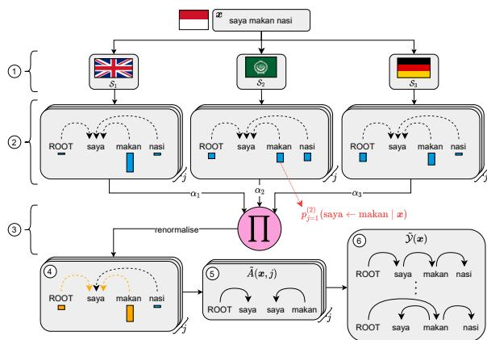
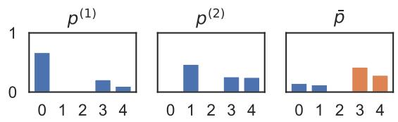
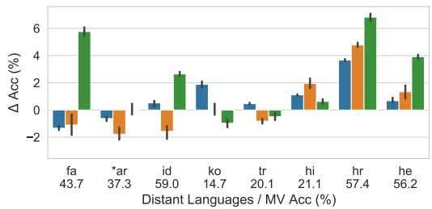
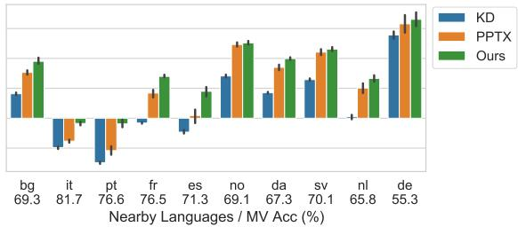
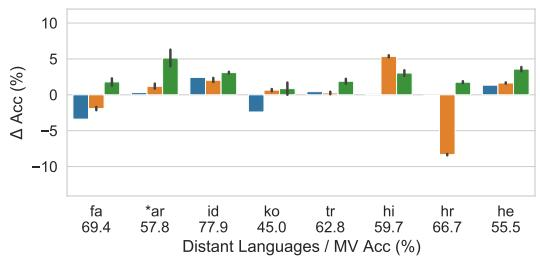
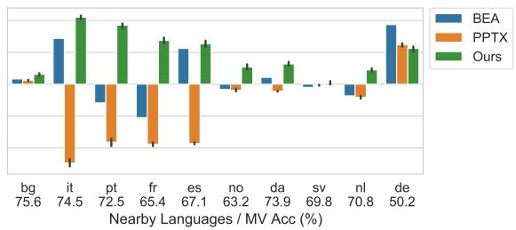
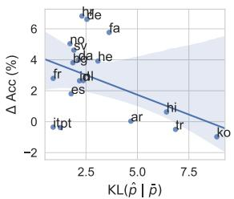
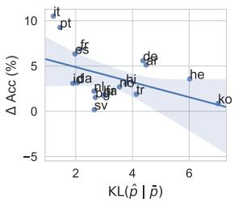

# Unsupervised Cross-Lingual Transfer of Structured Predictors without Source Data

Kemal Kurniawan1,2∗ Lea Frermann1 Philip Schulz2† Trevor Cohn1 1School of Computing and Information Systems, University of Melbourne 2Amazon Research

kemal.kurniawan@student.unimelb.edu.au {lea.frermann,tcohn}@unimelb.edu.au phschulz@amazon.com

## Abstract

Providing technologies to communities or domains where training data is scarce or protected e.g., for privacy reasons, is becoming increasingly important. To that end, we generalise methods for unsupervised transfer from multiple input models for structured prediction. We show that the means of aggregating over the input models is critical, and that multiplying marginal probabilities of substructures to obtain high-probability structures for distant supervision is substantially better than taking the union of such structures over the input models, as done in prior work. Testing on 18 languages, we demonstrate that the method works in a cross-lingual setting, considering both dependency parsing and part-of-speech structured prediction problems. Our analyses show that the proposed method produces less noisy labels for the distant supervision.1

## 1 Introduction

Recent successes of NLP systems have been enabled by supervised learning algorithms requiring a large amount of labelled data. Creating such data can be costly for structured prediction tasks such as dependency parsing (Böhmová et al., 2003; Brants et al., 2003). Transfer learning (Pan and Yang, 2010) is a promising solution to this problem. In this work, we focus on a case of transfer learning, namely cross-lingual learning. We consider the setup where the target language is low-resource having only unlabelled data, commonly referred to as unsupervised cross-lingual transfer. This is an important problem because most world’s languages are low-resource (Joshi et al., 2020). Successful transfer from high-resource languages enables language technologies development for these low-resource languages.

One recent method for unsupervised crosslingual transfer is PPTX (Kurniawan et al., 2021). Developed for dependency parsing, it transfers from multiple source languages, which has been shown to be superior to transferring from just a single language (McDonald et al., 2011; Duong et al., 2015; Rahimi et al., 2019, inter alia). PPTX computes the union of high-probability trees from all source parsers and uses the result as supervision to train the target language parser. One advantage is that, in addition to not requiring labelled data in the target language, it does not require any data in the source languages either, which is useful if such data is private. All it needs is access to multiple, trained source parsers. Despite its benefits, PPTX has only been applied to dependency parsing, although in principle it should be extensible to other structured prediction problems. More concerningly, we show in this work that PPTX generally underperforms compared to a majority voting baseline.

In this paper, we generalise and improve PPTX for structured prediction problems. As with PPTX, this generalisation casts the unsupervised transfer problem as a supervised learning task with distant supervision, where the label of each sample in the target language is based on the structures predicted by an ensemble of source models. Moreover, we propose the use of logarithmic opinion pooling (Heskes, 1998) to improve performance (see Fig. 1). Unlike PPTX that performs simple union, the pooling considers the output probabilities in aggregating the source model outputs to obtain the structures used for distant supervision. We test our method on 18 languages from 5 language families and on two structured prediction tasks in NLP: dependency parsing and POS tagging. We find that our method generally outperforms both PPTX and the majority voting baseline, with absolute accuracy gains of up to 7 % on parsing and 20 % on tagging. Our analysis shows that the use of logarithmic opinion pooling results in fewer predicted structures that are also more concentrated on the correct ones.

  
Figure 1: Illustration of our method for an input sentence saya makan nasi (“I eat rice”). 1 A set of structured prediction models as inputs. $\textcircled{2}$ The models compute marginal probability distributions over substructures for each token $x _ { j } . \textcircled { 3 }$ Logarithmic opinion pool of the distributions is computed. 4 Substructures are filtered based on some threshold. 5 High-probability substructures are obtained. 6 High-probability structures are obtained from the substructures as distant supervision.

In summary, our contributions in this paper are:

1. developing a generic unsupervised multisource transfer method for structured prediction problems;

2. leveraging logarithmic opinion pooling to take into account source model probabilities in the aggregation to produce the labels for distant supervision; and

3. outperforming previous work in dependency parsing and part-of-speech tagging, especially in the context of a stronger, multi-source transfer baseline.

## 2 Unsupervised Transfer as Supervised Learning

Suppose we want to create a model for a lowresource language that has only unlabelled data, but we only have access to a set of models trained on other languages. This is an instance of crosslingual transfer learning. We cast this problem as a (distantly) supervised learning task with the training objective

$$
\ell ( \pmb { \theta } ) = - \sum _ { \pmb { x } \in \mathcal { D } } \log \sum _ { \pmb { y } \in \tilde { \mathcal { Y } } ( \pmb { x } ) } p ( \pmb { y } \mid \pmb { x } ; \pmb { \theta } )\tag{1}
$$

where θ is the target model parameters, is the unlabelled target data, and $\tilde { \mathcal { V } } ( \boldsymbol { x } )$ is a set of distant supervision labels for an unlabelled input $\pmb { x } = x _ { 1 } x _ { 2 } \cdot \cdot \cdot \cdot x _ { n }$ Thus, $\tilde { \mathcal { V } } ( \boldsymbol { x } )$ contains supervision in the form of one or more potentially ambiguous/uncertain labels. In single-source transfer, $\tilde { \mathcal { V } } ( \boldsymbol { x } )$ can be as simple as a singleton containing the predicted label for x by the source model, in which case this is related to self-training (McClosky et al., 2006). In our case, however, this supervision is assumed to arise from an ensemble of models, each is based on transfer from a different source language (Section 2.1). Optionally, the parameters $\pmb \theta$ can be initialised to the source model parameters (or the parameters of one of the source models in the multi-source case) and regularised to this initialiser during training, in order to both speed up training and encourage the parameters to stay near known good parameter values. Overall, the objective becomes $\ell ^ { \prime } ( \pmb { \theta } ) = \ell ( \pmb { \theta } ) + \lambda \| \pmb { \theta } - \pmb { \theta } _ { 0 } \| _ { 2 } ^ { 2 }$ where $\pmb { \theta } _ { 0 }$ is the source model parameters and λ is a hyperparameter controlling the regularisation strength.

## 2.1 Supervision via Ensemble

In multi-source transfer, the set $\tilde { \mathcal { V } } ( \boldsymbol { x } )$ can be obtained by an ensemble method applied to the source models. PPTX (Kurniawan et al., 2021) is one such method designed for arc-factored dependency parsers. We generalise PPTX, making it applicable to any set of source models that predict structured outputs that decompose into substructures (of which a set of arc-factored dependency parsers is a special case). For the rest of this paper, we assume that the source models are graphical models over these structured outputs. Let $C ( \pmb { x } , j )$ denote the set of substructures associated with $x _ { j }$ whose marginal probabilities form a probability distribution:

$$
\sum _ { c \in C ( { \pmb x } , j ) } p ^ { ( k ) } ( c \mid { \pmb x } ) = 1
$$

for any source model k. For example, for dependency parsing, $C ( \pmb { x } , j )$ is the set of arcs whose dependent is $x _ { j }$ (see Fig. 1 part $\textcircled{2}$ . The chart $\tilde { \mathcal { V } } ( \boldsymbol { x } )$ can then be obtained as follows. Define $\tilde { A } _ { k } ( \pmb { x } , j )$ to be the set of substructures associated with $x _ { j }$ having high marginal probability under source model k. This set is obtained by adding substructures $c \in C ( \pmb { x } , j )$ in descending order of their marginal probability until their cumulative probability exceeds a threshold $\sigma { : }$

$$
\sum _ { c \in C ( { \pmb x } , j ) } p ^ { ( k ) } ( c \mid { \pmb x } ) \geq \sigma\tag{2}
$$

where $0 \leq \sigma \leq 1$ . Therefore, $\tilde { A } _ { k } ( \pmb { x } , j )$ contains the substructures that cover at least $\sigma$ probability mass of the output space under source model $k .$ Next, define

$$
\tilde { A } ( { \pmb x } ) = \bigcup _ { k , j } \tilde { A } _ { k } ( { \pmb x } , j )\tag{3}
$$

as the set of high probability substructures for x given by the source models. The chart $\tilde { \mathcal { V } } ( \boldsymbol { x } )$ is then defined as the set of structures whose substructures are all in $\tilde { A } ( { \pmb x } )$ . Formally,

$$
\tilde { \mathcal { V } } ( { \pmb x } ) = \{ { \pmb y } \ | \ { \pmb y } \in \mathcal { V } ( { \pmb x } ) \wedge A ( { \pmb y } ) \subseteq \tilde { A } ( { \pmb x } ) \}
$$

where $\mathcal { V } ( \pmb { x } )$ is the output space of x and $A ( \pmb { y } )$ is the set of substructures in y. To prevent $\tilde { \mathcal { V } } ( \boldsymbol { x } )$ from being empty, the 1-best structure $\hat { \pmb y } =$ arg ma $\operatorname { x } _ { \textbf { \boldsymbol { y } } } p ^ { ( k ) } ( \pmb { \mathscr { y } } \mid \pmb { x } )$ from each source model k is also included in the chart, but they don’t count toward the probability threshold.

## 2.2 Proposed Method

Multilinguality is the key factor contributing to the success of PPTX (Kurniawan et al., 2021). Therefore, optimising the method to leverage this multilinguality provided by the source models is important. One potential limitation of PPTX is the inclusion of substructures having relatively low marginal probability under some source model because of the union in Eq. (3). As an extreme illustration, consider a poor source model k assigning uniform marginal probability to substructures in $C ( \pmb { x } , j )$ . Most of these substructures will be included in $\tilde { A } _ { k } ( \boldsymbol { x } , j )$ and, subsequently, $\tilde { A } ( { \pmb x } )$ . As a result, noisy structures may be included in $\tilde { \mathcal { V } } ( \boldsymbol { x } )$ which makes learning the correct structure difficult.

Instead of computing the set of high-probability substructures from each source model separately, a potentially better alternative is to aggregate the marginal probabilities given by the source models and then compute the chart from the resulting distribution. We propose to use logarithmic opinion pooling (Heskes, 1998) as the aggregation method. To obtain the chart $\tilde { \mathcal { V } } ( \boldsymbol { x } )$ , first we compute the logarithmic opinion pool of the source models’ marginal probabilities. That is, for all $j \in \{ 1 , \ldots , n \}$ , define

$$
\bar { p } _ { j } ( c \mid \pmb { x } ) \propto \prod _ { k } \left[ p ^ { ( k ) } ( c \mid \pmb { x } ) \right] ^ { \alpha _ { k } }\tag{4}
$$

where we normalise over the substructures $c \in$ $C ( \pmb { x } , j )$ , and $\alpha _ { k }$ is a non-negative scalar weighting the contribution of source model k satisfying $\textstyle \sum _ { k } \alpha _ { k } = 1$ . Thus, $\bar { p } _ { j }$ gives the new probability distribution over substructures in $C ( \boldsymbol { x } , j )$ . Then, we compute the set $\tilde { A } ( { \boldsymbol x } , j )$ using $\bar { p } _ { j }$ in a similar fashion as before: adding substructures $c \in C ( \pmb { x } , j )$ in descending order by their marginal probability given by $\bar { p } _ { j }$ until their cumulative probability exceeds $\sigma .$ . Lastly, we define $\textstyle { \tilde { A } } ( { \pmb { x } } ) = \bigcup _ { j } { \tilde { A } } ( { \pmb { x } } , j )$ and keep the definition of $\tilde { \mathcal { V } } ( \boldsymbol { x } )$ unchanged: the set of structures induced by $\tilde { A } ( { \pmb x } )$ plus the 1-best structures,2 which is used as labels for training with the objective in Eq. (1). Fig. 1 illustrates the process using dependency parsing as an example.

  
Figure 2: Logarithmic opinion pool with uniform weighting (p¯) for two distributions $p ^ { ( 1 ) }$ and $p ^ { ( 2 ) }$ . The opinion pool p¯ assigns lower probabilities to substructures indexed by 0 and 1 than those indexed by 3 and 4 because $p ^ { ( 1 ) }$ and $p ^ { ( 2 ) }$ assign very low probability to either 0 or 1. Selected substructures in the context of Eq. (2) with $\sigma = 0 . 7$ are in orange.

Setting the Weight Factors Finding an optimal value for $\alpha _ { k }$ is possible if there is labelled data (Heskes, 1998). However, we do not have labelled data in the target language in our crosslingual setup. There is some method to find similar weighting scalars for cross-lingual transfer that may work in our setup (Wu et al., 2020), but they require unlabelled source language data and only marginally outperform uniform weighting. Therefore, unless stated otherwise, we set $\alpha _ { k }$ uniformly, reducing Eq. (4) to the normalised geometric mean of the marginal distributions.

Motivation The motivation behind the proposed method is the observation that PPTX obtains the high-probability substructures by applying the threshold in Eq. (2) for each source model separately before they are aggregated into a single set in Eq. (3). This means PPTX considers the uncertainty of the source models in isolation to create the chart. In contrast, our method considers the uncertainty of the ensemble by applying the threshold after aggregating the probabilities in the logarithmic opinion pool in Eq. (4). The opinion pool assigns more probability mass to substructures to which all the source models assign a high probability (see Fig. 2), and we hypothesise that such substructures are more likely to be correct.

## 2.3 Application to Structured Prediction

The above method can be applied to structured prediction problems. Crucial to the application is the definition of $C ( \boldsymbol { x } , j )$ . Below, we present two applications: arc-factored dependency parsing and sequence tagging.

Arc-Factored Dependency Parsing For dependency parsing, we can define $C ( \boldsymbol { x } , j )$ as the set of dependency arcs having $x _ { j }$ as dependent:

$$
C ( \pmb { x } , j ) = \{ ( i , j , l ) ~ | ~ i \in \{ 0 , \dots , n \} \land i \neq j \land l \in L \}
$$

where $( i , j , l )$ denotes an arc from head $x _ { i }$ to dependent $x _ { j }$ with dependency label l, L denotes the set of dependency labels, and x is a special token whose dependent is the root of the sentence.3 Since exactly one arc in $C ( \pmb { x } , j )$ exists in any possible dependency tree of x, the marginal probabilities of arcs in $C ( \boldsymbol { x } , j )$ form a probability distribution. The rest follows accordingly.

Sequence Tagging In sequence tagging, the structured output is a sequence of tags, which decomposes into consecutive tag pairs. Given a sequence of tags $y = y _ { 1 } y _ { 2 } \cdot \cdot \cdot y _ { n }$ corresponding to the input x, its consecutive tag pairs are $A ( \pmb { y } ) = \{ ( j , y _ { j } , y _ { j + 1 } ) \} _ { j = 1 } ^ { n - 1 }$ . We define $C ( \pmb { x } , j )$ as the set of possible tag pairs for $x _ { j }$ and $x _ { j + 1 } { \mathrm { : } }$

$$
C ( \boldsymbol { x } , j ) = \{ ( j , t , t ^ { \prime } ) \ | \ ( t , t ^ { \prime } ) \in T \times T \}
$$

where T is the set of tags. Note that any sequence of tags for x has exactly one tag pair in $C ( \boldsymbol { x } , j )$ and thus, the marginal probabilities of these tag pairs in $C ( \pmb { x } , j )$ form a probability distribution.

## 3 Experimental Setup

Data and Evaluation We evaluate on dependency parsing and part-of-speech (POS) tagging. We use Universal Dependencies v2.2 (Nivre et al., 2018) and test on 18 languages spanning 5 language families (see Appendix A). We divide the languages into distant and nearby groups based on their distance to English (He et al., 2019). We use the universal POS tags (UPOS) as labels for tagging. We exclude punctuation from parsing evaluation following the standard practice and report average performance across five random seeds unless stated otherwise. We also include a PPTX baseline applied to tagging. Our evaluation metric is accuracy for both tasks, which is equivalent to LAS for parsing.

Model Architecture For parsing, we use the same architecture as was used by Kurniawan et al. (2021), consisting of embedding layers, a Transformer encoder layer, and a biaffine output layer (Dozat and Manning, 2017). At test time, we run the MST algorithm (Chu and Liu, 1965; Edmonds, 1967) to find the highest scoring tree. For tagging, we replace the output layer with a linear CRF layer. At test time, the Viterbi algorithm is used to obtain the tag sequence with the highest score.

Source Selection We adopt a “pragmatic” approach where we include 5 high-resource languages as sources: English, Arabic, Spanish, French, and German (Kurniawan et al., 2021),4 which have been categorised as “quintessential richresource languages” due to the availability of massive language datasets (Joshi et al., 2020). When a source language is also the target language, we exclude the language from the sources. For example, if Arabic is the target language, then we use only the other 4 languages as sources, thus the target language is always unseen. See Appendix B for more details.

Baselines Our main baseline for both tasks is a majority voting ensemble (MV). For parsing, we score each possible arc by the number of source parsers that have the arc in the predicted tree and then run the MST algorithm. For tagging, we use the most commonly predicted tag for each input token. This baseline is not only more appropriate for multi-source transfer but also stronger than the direct transfer baseline used by Kurniawan et al. (2021) which uses only a single source language (English), with accuracy gains of up to 15 points on both tasks. We also include knowledge distillation (KD) which has been used for parsing as a baseline (Hu et al., 2021). For tagging, we include BEA (Rahimi et al., 2019) which explicitly models the label confusion of source taggers and has been used successfully for multi-source crosslingual NER. More details on these two baselines are reported in Appendix C.

(a) Dependency parsing  

  
(b) POS tagging  
Figure 3: Performance difference of PPTX and our method against majority voting (MV) on parsing and tagging. Numbers on the x-axis are the MV performance corresponding to the zero value on the y-axis. BEA is run only once as it always gives the same result. Table 11 reports the full results. \*: hyperparameters are tuned on this language.

Training We use the same setup as Kurniawan et al. (2021) for parsing. We include the gold universal POS tags as input to the parsers. We discard sentences longer than 30 tokens to avoid memory issues and train for 5 epochs using Adam (Kingma and Ba, 2015). Note that we discard long sentences only at training time. In other words, we evaluate on all lengths at test time. We tune the learning rate and λ on the development set of Arabic, select the values that give the highest accuracy, and use them for training on all languages. For tagging, we set the length cut-off to 60 tokens (again, only at training time) and train for 10 epochs. Again, we tune the hyperparameters on Arabic and use the best values for training on all languages. For both tasks, we obtain cross-lingual word embeddings using an offline transformation method (Smith et al., 2017) applied to fastText pre-trained word vectors (Bojanowski et al., 2017). We set the threshold $\sigma = 0 . 9 5$ (Kurniawan et al., 2021). We initialise the parameters of the target language model with the parameters of the English source model and regularise the former towards the latter during training. In other words, we set the parameters of the English source model as $\pmb { \theta } _ { 0 }$ as described in Section 2.1. See Appendix D for further details.

<table><tr><td rowspan="2">Lang.</td><td colspan="2">Parsing</td><td colspan="2">Tagging</td></tr><tr><td>nP (millions)</td><td>n0 (%) nP</td><td>nP</td><td>nQ (%) nP</td></tr><tr><td>fa</td><td> $1 . 6 \times 1 0 ^ { 6 }$ </td><td>0.0011</td><td> $6 . 5 \times 1 0 ^ { 5 }$ </td><td>3</td></tr><tr><td>ko</td><td> $2 . 3 \times 1 0 ^ { 4 }$ </td><td>0.021</td><td> $8 . 2 \times 1 0 ^ { 3 }$ </td><td>11</td></tr><tr><td>hr</td><td> $2 . 0 \times 1 0 ^ { 5 }$ </td><td>0.0019</td><td> $4 . 3 \times 1 0 ^ { 5 }$ </td><td>37</td></tr><tr><td>it</td><td>4.5</td><td>0.069</td><td> $4 . 7 \times 1 0 ^ { 4 }$ </td><td>32</td></tr><tr><td>es</td><td> $3 . 7 \times 1 0 ^ { 3 }$ </td><td>0.0014</td><td> $2 . 4 \times 1 0 ^ { 6 }$ </td><td>110</td></tr><tr><td>SV</td><td>5.1</td><td>0.12</td><td> $7 . 6 \times 1 0 ^ { 3 }$ </td><td>18</td></tr></table>

Table 1: Median chart size of PPTX (column n ), and median chart size of our method relative to PPTX (column $\scriptstyle { \frac { n _ { O } } { n _ { P } } } ~ ,$ ), where chart size is defined as the number of structures in $\tilde { \mathcal { V } } ( \boldsymbol { x } )$

## 4 Results and Analysis

Fig. 3a shows the accuracy difference of KD, PPTX, and our method against MV on parsing. We see that PPTX does not consistently outperform MV, substantially underperforming on 6 languages.5 On the other hand, our method outperforms not only PPTX but also both KD and MV on most languages. Fig. 3b shows the corresponding results on POS tagging which is particularly convincing. We see that PPTX often underperforms, with up to 10 % drop in accuracy compared to MV. In contrast, our method consistently outperforms MV with up to 10 % accuracy improvement. These results suggest that PPTX may not improve over a simple majority voting ensemble, and our method is the superior alternative. In addition, our method shows higher improvement against MV on nearby than distant languages, which is unsurprising because our pragmatic selection of source languages is dominated by languages in the nearby group.

<table><tr><td>Method</td><td>Distant</td><td>Nearby</td></tr><tr><td>PPTX</td><td> $- 1 . 2 \pm 5 . 0$ </td><td> $0 . 5 \pm 2 . 4$ </td></tr><tr><td>Ours</td><td> $2 . 1 \pm 2 . 7$ </td><td> $2 . 8 \pm 2 . 0$ </td></tr></table>

Table 2: LAS difference against majority voting using predicted POS tags, averaged over all nearby and distant languages ( std). Average LAS for the majority voting on distant and nearby languages are $3 8 . 4 \pm 1 8 . 3$ and $6 8 . 1 \pm 7 . 3$ respectively.

From the figure, we also see that on Portuguese and Italian, our method slightly underperforms compared to MV on parsing, but outperforms MV considerably on tagging. We hypothesise that this disparity is caused by the variability of the source models quality. On tagging, the direct transfer performance of 3 out of 5 source taggers is relatively poor on Portuguese and Italian, making it more likely for MV to predict wrongly as the good taggers are outvoted. In contrast, on parsing, Arabic is the only source parser that has very poor transfer. The other source parsers achieve comparably good direct transfer performance so MV already performs well.

Parsing results using predicted POS tags Since low-resource languages often don’t have gold POS tags, we also evaluate our method for parsing using predicted POS tags. We use Stanza (Qi et al., 2020) to predict the POS tags of all target languages, and replace the gold UPOS with the predicted tags as the input. Table 2 shows that our method still outperforms PPTX in this setup, although there is a large variance across languages.

## 4.1 Chart Size Analysis

To understand the differences between PPTX and our method better, we compare the size of the chart $\tilde { \mathcal { V } } ( \boldsymbol { x } )$ produced by PPTX and our method, in terms of the number of structures in it. We take the median of this size over all unlabelled sentences in the training set of each target language and compare the results. Table 1 reports the median chart size of PPTX, and the median chart size of our method relative to PPTX for both parsing and tagging on

6 representative languages (the trend for other languages is similar). We find that for parsing, the size of our method’s chart is much smaller than 1 % of the size of PPTX chart for all target languages.6 This finding shows that our method’s charts are much more compact than those of PPTX. Thus, it may explain the improvement of our method over PPTX because smaller charts may be more likely to concentrate on trees that have many correct arcs, making it easier for the model to learn correctly (we explore this further in Section 4.2). For POS tagging, we observe the same trend where our method’s charts are smaller, but to a lesser extent, presumably because the typical output space of tagging is several orders of magnitude smaller than that of parsing. Occasionally, our method’s chart is larger than that of PPTX, although our method outperforms PPTX substantially (French and Spanish). We speculate that this is because most of the source taggers are very confident but on different substructures, so only a handful of substructures are selected by PPTX after applying the threshold in Eq. (2), making the chart small. Meanwhile, the logarithmic opinion pool is less confident as it corresponds to the (geometric) mean of the distributions, so more substructures are selected, making the chart larger.

## 4.2 Chart Quality Analysis

Continuing the previous analysis, we check if the smaller charts of our method indeed concentrate more on the correct structures than those of PPTX. To measure this, we define the notion of precision and recall of the chart $\tilde { \mathcal { V } } ( \boldsymbol { x } )$ . We define precision as the fraction of correct substructures in $\tilde { \mathcal { V } } ( \pmb { x } )$ and recall as the fraction of gold substructures that occur in any structure in $\tilde { \mathcal { V } } ( \boldsymbol { x } )$ . Formally,

$$
\mathrm { P } ( \tilde { \mathcal { V } } ( \pmb { x } ) ) = \frac { \sum _ { ( \pmb { x } , \pmb { y } ^ { * } ) } \sum _ { \pmb { y } \in \tilde { \mathcal { V } } ( \pmb { x } ) } | A ( \pmb { y } ) \cap A ( \pmb { y } ^ { * } ) | } { \sum _ { \pmb { x } } \sum _ { \pmb { y } \in \tilde { \mathcal { V } } ( \pmb { x } ) } | A ( \pmb { y } ) | }
$$

and

$$
\mathrm { R } ( \tilde { \mathcal { V } } ( \pmb { x } ) ) = \frac { \sum _ { ( \pmb { x } , \pmb { y } ^ { * } ) } \sum _ { a \in A ( \pmb { y } ^ { * } ) } \mathrm { I } ( a , \tilde { \mathcal { V } } ( \pmb { x } ) ) } { \sum _ { \pmb { y } ^ { * } } | A ( \pmb { y } ^ { * } ) | }
$$

where

$$
\operatorname { I } ( a , { \tilde { \mathcal { Y } } } ( { \pmb x } ) ) = \left\{ { \begin{array} { l l } { 1 } & { { \mathrm { i f } } { \pmb y } \in { \tilde { \mathcal { Y } } } ( { \pmb x } ) { \mathrm { ~ s . t . ~ } } a \in A ( { \pmb y } ) } \\ { 0 } & { { \mathrm { o t h e r w i s e } } } \end{array} } \right.
$$

<table><tr><td rowspan="3">Target Language</td><td colspan="7">Parsing</td><td colspan="7">Tagging</td></tr><tr><td colspan="2">PPTX</td><td colspan="2">Ours</td><td colspan="3"> $\Delta$ </td><td colspan="2">PPTX</td><td colspan="2">Ours</td><td colspan="3"> $\Delta$ </td></tr><tr><td>P</td><td>R</td><td>P</td><td>R</td><td>P</td><td>R</td><td>Acc</td><td>P</td><td>R</td><td>P</td><td>R</td><td>P</td><td>R</td><td>Acc</td></tr><tr><td>fa</td><td>10</td><td>90</td><td>17</td><td>95</td><td>7</td><td>5</td><td>6.9</td><td>21</td><td>80</td><td>26</td><td>75</td><td>5</td><td>4</td><td>3.7</td></tr><tr><td>ko</td><td>0</td><td>65</td><td>2</td><td>77</td><td>1</td><td>13</td><td>-1.0</td><td>8</td><td>50</td><td>4</td><td>45</td><td>-5</td><td>-5</td><td>0.2</td></tr><tr><td>hr</td><td>10</td><td>96</td><td>20</td><td>98</td><td>10</td><td>3</td><td>2.1</td><td>14</td><td>77</td><td>16</td><td>77</td><td>2</td><td>0</td><td>10.1</td></tr><tr><td>it</td><td>10</td><td>99</td><td>25</td><td>100</td><td>15</td><td>1</td><td>1.2</td><td>20</td><td>91</td><td>24</td><td>93</td><td>4</td><td>2</td><td>22.9</td></tr><tr><td>es</td><td>11</td><td>96</td><td>20</td><td>98</td><td>10</td><td>1</td><td>1.6</td><td>18</td><td>82</td><td>16</td><td>87</td><td>-1</td><td>4</td><td>15.7</td></tr><tr><td>SV</td><td>13</td><td>97</td><td>21</td><td>98</td><td>8</td><td>1</td><td>0.2</td><td>21</td><td>84</td><td>28</td><td>81</td><td>8</td><td>-3</td><td>0.4</td></tr></table>

Table 3: Precision (P) and recall (R) of charts produced by PPTX and our method in dependency parsing and POS tagging. Numbers are rounded to the nearest integer. Column $\Delta$ is the difference between our method and PPTX (positive means our method is higher). $\Delta$ over the accuracy results for both tasks are included for completeness, and correspond to the bar height difference of the two methods in Fig. 3.

and $y ^ { \ast }$ denotes the gold structure for input x. A good chart must have high precision and recall. In particular, if $\tilde { \mathcal { V } } ( \boldsymbol { x } )$ is a singleton containing the gold structure, then both precision and recall will be 100 %.

Table 3 reports the precision and recall of the charts produced by PPTX and our method for both tasks, as well as the performance differences, for the same 6 languages as before (the trend for other languages is similar). We observe that with our method in parsing, both precision and recall consistently improve over PPTX, suggesting that the charts indeed contain more correct arcs. However, higher precision and recall do not guarantee performance improvement, as shown by Korean where both precision and recall improve with our method but its performance is lower than PPTX.7 We suspect that this is caused by the unusually low precision even with our method, indicating that the chart is very noisy. For POS tagging, the result is less obvious, but we find that generally our method improves chart precision, but often sacrificing chart recall. For Spanish, precision decreases with our method, and only recall improves.8 An interesting case is again Korean where both precision and recall worsen, probably because of very poor source taggers performance on the language. Overall, our method generally improves the chart quality in terms of either precision or recall, but to a lesser extent, which again may be attributed to the smaller output space compared with parsing.

## 4.3 Effect of Opinion Pool Distance to True Distribution

We explore whether there is a relationship between (a) how distant the opinion pool is to the true distribution over substructures and (b) the performance improvement of our method against majority voting. Intuitively, the closer the opinion pool is to the true distribution, the higher its absolute performance would be. However, it is unclear whether this translates into an advantage over majority voting. This is important because if such relationship exists, then it may be worthwhile spending some effort on optimising the opinion pool. To this end, we measure the distance between the true distribution and the opinion pool by computing the Kullback-Leibler divergence (KL)

$$
\operatorname { K L } ( { \hat { p } } \mid { \bar { p } } ) = { \frac { 1 } { n ( { \mathcal { D } } ) } } \sum _ { \mathbf { z } \in { \mathcal { D } } } \sum _ { j = 1 } ^ { | { \boldsymbol { x } } | } \operatorname { K L } ( { \hat { p } } _ { j } \mid { \bar { p } } _ { j } )\tag{5}
$$

where $n ( \mathcal { D } )$ is the total number of tokens of all input sentences in $\mathcal { D } , \hat { p } _ { j } ( c \mid x )$ is the (empirical) true distribution of substructures in $C ( \pmb { x } , j )$ , and $\bar { p } _ { j } ( c \vert \pmb { x } )$ is the logarithmic opinion pool distribution defined in Eq. (4). Note that ${ \hat { p } } _ { j } ( c \mid x )$ is a one-hot distribution so KL ${ \bf \nabla } ( \hat { p } _ { j } \mid \bar { p } _ { j } )$ reduces to the negative log likelihood of the labelled data under the opinion pool. We compute the KL divergence on the training set of both parsing and tagging and display the regression plots in Fig. 4. We see a medium correlation between opinion pool distance and performance gain against majority voting, with $r = - 0 . 4 5$ for both parsing and tagging (p-value is 0.06 for both). However, there is substantial variance, especially in the right half figure of parsing, caused by the lack of languages in that region of the plot. Nonetheless, the plots suggest that there is indeed a positive relationship between how close the opinion pool is to the true distribution and the performance gain of our method compared with majority voting.

  
(a) Dependency parsing

  
(b) POS tagging  
Figure 4: Relationship between $\operatorname { K L } ( { \hat { p } } \mid { \bar { p } } )$ and the accuracy difference of our method and MV, where $\hat { p }$ and $\bar { p }$ denote the empirical true distribution and the opinion pool distribution respectively. Shaded area is 95 % confidence interval computed via bootstrapping.

There are ways to obtain an opinion pool that is closer to the true distribution. One way is to leverage a small amount of labelled data in the target language to estimate the weight factors $\alpha _ { k }$ , which can be done by optimising Eq. (5). This option is suitable if such labelled data is available or can be obtained cheaply. If we have the freedom to choose the source languages, another method is to select them carefully so they are both reasonably close to the target language and also diverse. This is because $\operatorname { E q . }$ (5) can be expressed as $E - D$ where E denotes how distant the source models output distributions are to the target’s true distribution (error) and $D$ denotes how distant the output distributions are to each other (diversity) (Heskes, 1998). Having the source languages reasonably close to the target language and also diverse means reducing $E$ and increasing $D$ respectively, moving the opinion pool closer to the true distribution. That said, when the source languages are close to the target language, the source models may already be good for direct transfer so our method may not give meaningful improvement over majority voting.

## 4.4 Learning the Opinion Pool Weight Factors

Motivated by the previous findings, we deviate from our unsupervised setup by learning the weight factors $\alpha _ { k }$ using a tiny amount of labelled target data. Concretely, we randomly sample 50 sentences from the training set of each target language and learn $\alpha _ { k }$ that minimises Eq. (5) for all source model k. We then use the learned weights to obtain the opinion pool as defined in Eq. (4) (see Appendix F for further details). Table 4 shows the results on parsing and tagging, averaged over the target languages. We observe that by using the learned weight factors, our method slightly improves over the version using uniform weights, suggesting that our method can readily leverage labelled target data if it is available. On the other hand, the fact that the improvement is only modest also reaffirms that uniform weighting is a strong baseline.

<table><tr><td></td><td>Parsing</td><td>Tagging</td></tr><tr><td>MV</td><td>56.3</td><td>65.4</td></tr><tr><td>Uniform  $\alpha _ { k }$ </td><td>59.0</td><td>69.3</td></tr><tr><td>Learned  $\alpha _ { k }$ </td><td>59.4</td><td>70.0</td></tr></table>

Table 4: Parsing and tagging performance of MV and our method with uniform and learned weight factors $\alpha _ { k }$ for the logarithmic opinion pool, averaged over 18 languages. Full results are reported in Table 11.

## 5 Related Work

A straightforward method of multi-source transfer is training a model on the concatenation of datasets from the source languages. This approach was used by McDonald et al. (2011) for dependency parsing and yields a substantial gain compared with singlesource transfer. More recent work by Guo et al. (2016) proposed to learn multilingual representations from the concatenation of source language data and use them to train a neural dependency parser. Another method is language adversarial training, used by Chen et al. (2019) for various NLP tasks including named-entity recognition, which is often cast as structured prediction. Despite their success, multi-source unsupervised cross-lingual transfer methods typically require the source language data, which is not always feasible.

There are recent methods suitable in this sourcefree setup. Rahimi et al. (2019) proposed a method based on truth inference to model label confusion in multi-source transfer of named-entity recognisers. Wu et al. (2020) used teacher-student learning for named-entity recognition. A closely related work is by Hu et al. (2021) who argued that a small amount of labelled data in the target language is cheap to obtain and proposed an attention-based method to weight the source models leveraging 50 labelled target sentences. Our work is different as we do not require any labelled data and evaluate on 3 times more languages than they did. In addition, their model is based on mBERT (Devlin et al., 2019), which benefits from larger data from multiple languages during pretraining. In many application scenarios, BERT-based models are too costly, especially when criteria other than accuracy matter (Nityasya et al., 2020).

Our work builds upon the work of Kurniawan et al. (2021) who proposed a method based on selftraining for unsupervised cross-lingual dependency parsing. In this work, we generalise their method to structured prediction problems and propose a modification to improve the quality of the distant supervision.

## 6 Conclusions

In this paper, we (1) generalise previous methods for cross-lingual unsupervised transfer without source data to structured prediction problems and (2) propose a new aggregation technique which can better handle mixed-quality input distributions. Experiments across two structured prediction tasks and 18 languages show that, unlike previous work, our method generally outperforms a strong multisource transfer baseline. Our analyses suggest that our method produces distant supervision of better quality than that of the previous methods. Our work potentially generalises beyond language transfer to (a) structured prediction tasks beyond NLP and (b) transfer across other types of domains (e.g., genres), a direction we aim to explore in future work. We are also interested in investigating in future work whether our method helps transfer with recent multilingual pretrained models.

## References

Wasi Ahmad, Zhisong Zhang, Xuezhe Ma, Eduard Hovy, Kai-Wei Chang, and Nanyun Peng. 2019. On Difficulties of Cross-Lingual Transfer with Order Differences: A Case Study on Dependency Parsing. In Proceedings ofthe 2019 Conference ofthe North American Chapter of the Association for Computational Linguistics: Human Language Technologies, Volume 1 (Long and Short Papers), pages 2440–2452.

Alena Böhmová, Jan Hajic, Eva Hajiˇ cová, and Barboraˇ Hladká. 2003. The Prague Dependency Treebank. In Anne Abeillé, editor, Treebanks: Building and Using Parsed Corpora, pages 103–127.

Piotr Bojanowski, Edouard Grave, Armand Joulin, and Tomas Mikolov. 2017. Enriching word vectors with subword information. Transactions of the Associa tionfor Computational Linguistics, 5:135–146.

Thorsten Brants, Wojciech Skut, and Hans Uszkoreit. 2003. Syntactic Annotation of A German Newspaper

Corpus. In Anne Abeillé, editor, Treebanks: Building and Using Parsed Corpora, pages 73–87.

Xilun Chen, Ahmed Hassan Awadallah, Hany Hassan, Wei Wang, and Claire Cardie. 2019. Multi-Source Cross-Lingual Model Transfer: Learning What to Share. In Proceedings ofthe 57th Annual Meeting of the Associationfor Computational Linguistics, pages 3098–3112.

Yoeng-Jin Chu and Tseng-Hong Liu. 1965. On the shortest arborescence of a directed graph. Scientia Sinica, 14:1396–1400.

Jacob Devlin, Ming-Wei Chang, Kenton Lee, and Kristina Toutanova. 2019. BERT: Pre-training of Deep Bidirectional Transformers for Language Understanding. In Proceedings ofthe 2019 Conference ofthe North American Chapter ofthe Associationfor Computational Linguistics: Human Language Technologies, Volume 1 (Long and Short Papers), pages 4171–4186.

Timothy Dozat and Christopher D Manning. 2017. Deep Biaffine Attention for Neural Dependency Parsing. In International Conference on Learning Representations, page 8.

Long Duong, Trevor Cohn, Steven Bird, and Paul Cook. 2015. Cross-lingual Transfer for Unsupervised Dependency Parsing without Parallel Data. In Proceedings of the Nineteenth Conference on Computational Natural Language Learning, pages 113–122.

Jack Edmonds. 1967. Optimum branchings. Journal of Research of the national Bureau of Standards B, 71(4):233–240.

Klaus Greff, Aaron Klein, Martin Chovanec, Frank Hutter, and Jürgen Schmidhuber. 2017. The Sacred Infrastructure for Computational Research. In Proceedings ofthe 16th Python in Science Conference, pages 49–56.

Jiang Guo, Wanxiang Che, David Yarowsky, Haifeng Wang, and Ting Liu. 2016. A Representation Learning Framework for Multi-Source Transfer Parsing. In Thirtieth AAAI Conference on Artificial Intelligence.

Junxian He, Zhisong Zhang, Taylor Berg-Kirkpatrick, and Graham Neubig. 2019. Cross-Lingual Syntactic Transfer through Unsupervised Adaptation of Invertible Projections. In Proceedings ofthe 57th Annual Meeting of the Association for Computational Linguistics, pages 3211–3223.

Tom Heskes. 1998. Selecting weighting factors in logarithmic opinion pools. In Advances in Neural Information Processing Systems, volume 10.

Zechuan Hu, Yong Jiang, Nguyen Bach, Tao Wang, Zhongqiang Huang, Fei Huang, and Kewei Tu. 2021. Multi-View Cross-Lingual Structured Prediction with Minimum Supervision. In Proceedings of the 59th Annual Meeting ofthe Associationfor Computational

Linguistics and the 11th International Joint Conference on Natural Language Processing (Volume 1: Long Papers), pages 2661–2674.

Pratik Joshi, Sebastin Santy, Amar Budhiraja, Kalika Bali, and Monojit Choudhury. 2020. The State and Fate of Linguistic Diversity and Inclusion in the NLP World. In Proceedings ofthe 58th Annual Meeting ofthe Associationfor Computational Linguistics.

Diederik P. Kingma and Jimmy Ba. 2015. Adam: A method for stochastic optimization. In 3rd International Conference on Learning Representations.

Kemal Kurniawan, Lea Frermann, Philip Schulz, and Trevor Cohn. 2021. PPT: Parsimonious Parser Transfer for Unsupervised Cross-Lingual Adaptation. In Proceedings of the 16th Conference of the European Chapter of the Association for Computational Linguistics: Main Volume, pages 2907–2918.

David McClosky, Eugene Charniak, and Mark Johnson. 2006. Effective Self-Training for Parsing. In Proceedings of the Human Language Technology Conference ofthe NAACL, Main Conference, pages 152– 159.

Ryan McDonald, Fernando Pereira, Kiril Ribarov, and Jan Hajic. 2005.ˇ Non-Projective Dependency Parsing using Spanning Tree Algorithms. In Proceedings of Human Language Technology Conference and Conference on Empirical Methods in Natural Language Processing, pages 523–530.

Ryan McDonald, Slav Petrov, and Keith Hall. 2011. Multi-Source Transfer of Delexicalized Dependency Parsers. In Proceedings ofthe 2011 Conference on Empirical Methods in Natural Language Processing, pages 62–72.

Made Nindyatama Nityasya, Haryo Akbarianto Wibowo, Radityo Eko Prasojo, and Alham Fikri Aji. 2020. No Budget? Don’t Flex! Cost Consideration when Planning to Adopt NLP for Your Business. arXiv:2012.08958 [cs].

Joakim Nivre, Mitchell Abrams, Željko Agic, and´ et al. 2018. Universal Dependencies 2.2. LINDAT/CLARIAH-CZ digital library at the Institute of Formal and Applied Linguistics (ÚFAL), Faculty of Mathematics and Physics, Charles University.

Sinno Jialin Pan and Qiang Yang. 2010. A Survey on Transfer Learning. IEEE Transactions on Knowledge and Data Engineering, 22(10):1345–1359.

Adam Paszke, Sam Gross, Francisco Massa, Adam Lerer, James Bradbury, Gregory Chanan, Trevor Killeen, Zeming Lin, Natalia Gimelshein, Luca Antiga, Alban Desmaison, Andreas Kopf, Edward Yang, Zachary DeVito, Martin Raison, Alykhan Tejani, Sasank Chilamkurthy, Benoit Steiner, Lu Fang, Junjie Bai, and Soumith Chintala. 2019. PyTorch: An imperative style, high-performance deep learning library. In H. Wallach, H. Larochelle, A. Beygelzimer, F. dAlché-Buc, E. Fox, and R. Garnett, editors,

Advances in Neural Information Processing Systems 32, pages 8024–8035.

Peng Qi, Timothy Dozat, Yuhao Zhang, and Christopher D. Manning. 2018. Universal Dependency Parsing from Scratch. In Proceedings ofthe CoNLL 2018 Shared Task: Multilingual Parsingfrom Raw Text to Universal Dependencies, pages 160–170.

Peng Qi, Yuhao Zhang, Yuhui Zhang, Jason Bolton, and Christopher D. Manning. 2020. Stanza: A Python Natural Language Processing Toolkit for Many Human Languages. In Proceedings ofthe 58th Annual Meeting of the Association for Computational Linguistics: System Demonstrations, pages 101–108.

Afshin Rahimi, Yuan Li, and Trevor Cohn. 2019. Massively Multilingual Transfer for NER. In Proceedings of the 57th Annual Meeting of the Association for Computational Linguistics, pages 151–164.

Alexander Rush. 2020. Torch-Struct: Deep Structured Prediction Library. In Proceedings of the 58th Annual Meeting ofthe Associationfor Computational Linguistics: System Demonstrations, pages 335–342.

Samuel L. Smith, David H. P. Turban, Steven Hamblin, and Nils Y. Hammerla. 2017. Offline bilingual word vectors, orthogonal transformations and the inverted softmax. In International Conference on Learning Representations.

Qianhui Wu, Zijia Lin, Börje Karlsson, Jian-Guang LOU, and Biqing Huang. 2020. Single-/Multi-Source Cross-Lingual NER via Teacher-Student Learning on Unlabeled Data in Target Language. In Proceedings ofthe 58th Annual Meeting ofthe Association for Computational Linguistics, pages 6505– 6514.

## A Evaluation Languages

Table 5 lists the languages we use in our evaluation, along with their family, subgroup (if the language is Indo-European), selected treebanks in Universal Dependencies v2.2, and the corresponding licence. The treebank selection follows Kurniawan et al. (2021) to enable a fair comparison. Unless stated otherwise, the licence is Creative Commons (CC).

<table><tr><td>Language</td><td>Code</td><td>Family</td><td>Treebanks</td><td>Licence</td></tr><tr><td colspan="5">Distant</td></tr><tr><td>Persian</td><td>fa</td><td>IE.Iranian</td><td>Seraji</td><td>BY-SA 4.0</td></tr><tr><td>Arabic</td><td>ar</td><td>Afro-Asiatic</td><td>PADT</td><td>BY-NC-SA 3.0</td></tr><tr><td>Indonesian</td><td>id</td><td>Austronesian</td><td>GSD</td><td>BY-NC-SA 3.0†</td></tr><tr><td>Korean</td><td>ko</td><td>Koreanic</td><td>GSD Kaist</td><td>BY-NC-SA 3.0† BY-SA 4.0</td></tr><tr><td>Turkish</td><td>tr</td><td>Turkic</td><td>IMST</td><td>BY-NC-SA 3.0</td></tr><tr><td>Hindi</td><td>hi</td><td>IE.Indic</td><td>HDTB</td><td>BY-NC-SA 4.0</td></tr><tr><td>Croatian</td><td>hr</td><td>IE.Slavic</td><td>SET</td><td>BY-SA 4.0</td></tr><tr><td>Hebrew</td><td>he</td><td>Afro-Asiatic</td><td>HTB</td><td>BY-NC-SA 4.0</td></tr><tr><td colspan="5">Nearby</td></tr><tr><td>Bulgarian</td><td> ${ \bf b g }$ </td><td>IE.Slavic</td><td>BTB</td><td>BY-NC-SA 4.0</td></tr><tr><td>Italian</td><td>it</td><td>IE.Romance</td><td>ISDT</td><td>BY-NC-SA 3.0</td></tr><tr><td>Portuguese</td><td>pt</td><td>IE.Romance</td><td>GSD Bosque</td><td>BY-NC-SA 3.0† BY-SA 4.0</td></tr><tr><td>French</td><td>fr</td><td>IE.Romance</td><td>GSD</td><td>BY-NC-SA 3.0†</td></tr><tr><td>Spanish</td><td>es</td><td>IE.Romance</td><td>GSD AnCora</td><td>BY-NC-SA 3.0† GPL 3.0</td></tr><tr><td>Norwegian</td><td>no</td><td>IE.Germanic</td><td>Bokmaal Nynorsk</td><td>BY-SA 4.0 BY-SA 4.0</td></tr><tr><td>Danish</td><td>da</td><td>IE.Germanic</td><td>DDT</td><td>BY-SA 4.0</td></tr><tr><td>Swedish</td><td>SV</td><td>IE.Germanic</td><td>Talbanken</td><td>BY-SA 4.0</td></tr><tr><td>Dutch</td><td>nl</td><td>IE.Germanic</td><td>Alpino LassySmall</td><td>BY-SA 4.0 BY-NC-SA 4.0</td></tr><tr><td>German</td><td>de</td><td>IE.Germanic</td><td>GSD</td><td>BY-NC-SA 3.0†</td></tr></table>

Table 5: List of languages in our evaluation, grouped into distant and nearby languages based on their distance to English (He et al., 2019). IE stands for Indo-European. †: licence is the United States version.

## B Source Models Performance

To train the source models, we tune the hyperparameters on English and use the values for training on the other source languages. Table 6 reports the performance of our source parsers and taggers. We also report the performance numbers of previous work, copied from their respective papers, to serve as reference. Generally, the source models achieve in-language performance comparable to previous work (e.g., Ahmad et al., 2019) with the exception of the Arabic parser whose accuracy is noticeably lower, possibly caused by the model architecture optimised for transfer rather than inlanguage evaluation. However, we argue that the lower performance reflects a realistic application scenario where some of the source models are expected to be poor.

<table><tr><td></td><td>en</td><td>ar</td><td>es</td><td>fr</td><td>de</td></tr><tr><td>Parsing</td><td>86.9</td><td>76.9</td><td>90.0</td><td>89.1</td><td>82.1</td></tr><tr><td>Tagging</td><td>94.5</td><td>95.4</td><td>96.5</td><td>96.5</td><td>92.1</td></tr><tr><td colspan="6">Previous work (reference only)</td></tr><tr><td>LSTM parser</td><td>88.3</td><td>81.8</td><td>90.8</td><td>89.1</td><td>83.7</td></tr><tr><td>Stanza tagger*</td><td>95.4</td><td>94.9</td><td>96.7</td><td>97.3</td><td>94.1</td></tr></table>

Table 6: Parsing and tagging accuracy of the source models. We copy numbers of the LSTM parser (Ahmad et al., 2019) and Stanza tagger (Qi et al., 2018) from their respective papers to serve as reference only. \* indicates that the numbers are not directly comparable to ours because of the difference in the evaluation setup.

## C Additional Baseline Details

Knowledge Distillation We use a similar method to the soft-KD baseline used by Hu et al. (2021), which was based on the teacher-student learning method of Wu et al. (2020). Let $p _ { \mathrm { h e a d } } ^ { ( k ) } ( h _ { j } = i \ |$ x) denote the probability of $x _ { j }$ having $x _ { i }$ as head under source parser k. Similarly, let $p _ { \mathrm { l a b e l } } ^ { ( k ) } ( l _ { i j } = r \mid$ x) denote the probability of the arc between head $x _ { i }$ and dependent $x _ { j }$ having label r under source parser k. These distributions are obtained from the output of the corresponding biaffine layer that is then passed through a softmax layer. We average these distributions over the source parsers to give

$$
\begin{array} { c } { { \bar { p } _ { \mathrm { h e a d } } ( h _ { j } = i \mid { \pmb x } ) = \displaystyle \frac { 1 } { K } \sum _ { k } p _ { \mathrm { h e a d } } ^ { ( k ) } ( h _ { j } = i \mid { \pmb x } ) , } } \\ { { \bar { p } _ { \mathrm { l a b e l } } ( l _ { i j } = r \mid { \pmb x } ) = \displaystyle \frac { 1 } { K } \sum _ { k } p _ { \mathrm { l a b e l } } ^ { ( k ) } ( l _ { i j } = r \mid { \pmb x } ) } } \end{array}
$$

where K is the number of source parsers. The training objective of this KD baseline is then

$$
\begin{array} { r l } & { \ell ( \pmb \theta ) = \mathrm { M S E } ( p _ { \mathrm { h e a d } } ( \cdot  { \left| \begin{array} { l } { \pmb x ; \pmb \theta } \end{array} \right. ) } , \bar { p } _ { \mathrm { h e a d } } ( \cdot  { \left| \begin{array} { l } { \pmb x } \end{array} \right) } ) } \\ & { \phantom { \frac { p _ { \mathrm { h e a d } } ^ { 2 } } { 2 } } + \tau \mathrm { M S E } ( p _ { \mathrm { l a b e l } } ( \cdot  { \left| \begin{array} { l } { \pmb x ; \pmb \theta } \end{array} \right. ) } , \bar { p } _ { \mathrm { l a b e l } } ( \cdot  { \left| \begin{array} { l } { \pmb x } \end{array} \right) } ) } \\ & { \phantom { \frac { p _ { \mathrm { h e a d } } ^ { 2 } } { 2 } } + \lambda \| \pmb \theta - \pmb \theta _ { 0 } \| _ { 2 } ^ { 2 } } \end{array}
$$

where MSE denotes the mean squared error function. We include τ as a tunable hyperparameter. Table 9 reports the full list of hyperparameter values.

<table><tr><td></td><td colspan="8">Distant</td><td colspan="10">Nearby</td></tr><tr><td></td><td>fa</td><td>ar</td><td>id</td><td>ko</td><td>tr</td><td>hi</td><td>hr</td><td>he</td><td>bg</td><td>it</td><td>pt</td><td>fr</td><td>es</td><td>no</td><td>da</td><td>SV</td><td>nl</td><td>de</td></tr><tr><td>Parser</td><td>18</td><td>19</td><td>19</td><td>49</td><td>20</td><td>19</td><td>23</td><td>18</td><td>22</td><td>20</td><td>24</td><td>23</td><td>28</td><td>30</td><td>19</td><td>19</td><td>24</td><td>26</td></tr><tr><td>Tagger</td><td>16</td><td>18</td><td>18</td><td>48</td><td>18</td><td>18</td><td>23</td><td>17</td><td>21</td><td>20</td><td>25</td><td>24</td><td>31</td><td>29</td><td>17</td><td>17</td><td>23</td><td>26</td></tr></table>

Table 7: Number of parameters of the parsers and taggers with our method, rounded to the nearest million.

BEA We use the implementation of BEA (Rahimi et al., 2019) provided by the authors.9 We run BEA on the unlabelled test data of each language (transductive setup). This potentially gives the BEA baseline more advantage, so it is not directly comparable to PPTX and our method. We find that our hyperparameter tuning protocol (i.e. tuning the parameters of the Dirichlet priors on Arabic and using the best values for all languages) underperforms compared to using uninformative priors, so we report the BEA results without any tuning.

<table><tr><td>Task</td><td>Method</td><td>Hyperparameter Dist.</td><td>Best Value</td></tr><tr><td rowspan="4">Parsing</td><td>KD</td><td> $\log { \eta } \sim U ( - 6 , - 3 )$   $\log { \dot { \tau } } \sim U ( - 2 , 2 )$   $\log \lambda \sim U ( - 4 , 1 )$ </td><td> $\eta = 3 . 3 \times 1 0 ^ { - 5 }$   $\tau = 0 . 6 6$   $\lambda = 1 0 ^ { - 3 }$ </td></tr><tr><td>PPTX</td><td> $\log { \eta } \sim U ( - 6 , - 3 )$   $\lambda \sim U ( - 4 , 1 )$ </td><td> $\eta = 8 . 5 \times 1 0 ^ { - 5 }$   $\dot { \lambda } = 2 . 8 \times 1 0 ^ { - 5 }$ </td></tr><tr><td>Ours</td><td>log  $\log \eta \sim U ( - 6 . 5 , - 3 . 5 )$ </td><td> $\eta = 9 . 4 \times 1 0 ^ { - 5 }$ </td></tr><tr><td>Tagging</td><td>PPTX</td><td> $\log \lambda \sim U ( - 4 , 1 )$   $\log { \eta } \sim U ( - 6 , - 4 )$   $\log \lambda \sim U ( - 4 , 1 )$ </td><td> $\lambda = 1 . 6 \times 1 0 ^ { - 4 }$   $\eta = 5 . 9 \times 1 0 ^ { - 5 }$  λ = 0.1</td></tr><tr><td></td><td>Ours</td><td> $\log \eta \sim U ( - 6 . 5 , - 3 . 5 )$   $\log \lambda \sim U ( - 4 , 1 )$ </td><td> $\eta = 2 . 6 \times 1 0 ^ { - 4 }$   $\lambda = 4 . 7 \times 1 0 ^ { - 3 }$ </td></tr></table>

Table 9: Distributions of hyperparameters we use for tuning on Arabic with random search and the best values found. All logarithms are of base 10.

## D Additional Experiment Details

<table><tr><td></td><td>en</td><td>ar</td><td>es</td><td>fr</td><td>de</td></tr><tr><td>Parser</td><td>14</td><td>14</td><td>27</td><td>20</td><td>23</td></tr><tr><td>Tagger</td><td>12</td><td>12</td><td>25</td><td>18</td><td>21</td></tr></table>

Table 8: Number of parameters of the source parsers and taggers, rounded to the nearest million.

We implement our method using Python v3.7, PyTorch v1.4 (Paszke et al., 2019), and PyTorch-Struct (Rush, 2020). We run our experiments with Sacred v0.8.2 (Greff et al., 2017), which also sets the random seeds. Experiments are run on NVIDIA GeForce GTX TITAN X with CUDA 10.1 and GPU memory of 11 MiB. CPU model is Intel(R) Xeon(R) CPU E5-2687W v3 @ 3.10GHz with Ubuntu 16.04 as the operating system. Table 8 and Table 7 show the number of parameters of the source parsers and taggers, and the target parsers and taggers using our method respectively. A single run takes not much longer than 1 GPU hour for both parsing and tagging.

## E Hyperparameters

We tune learning rate η and λ (and also τ for KD) using random search. Table 9 shows the distributions of each hyperparameter we use, and the best values we find. We sample 20 values from the distribution and pick the values that yield the best accuracy on the Arabic development set. We follow Kurniawan et al. (2021) for other hyperparameters, whose values are reported in Table 10.

<table><tr><td>Hyperparameter</td><td>Value</td></tr><tr><td>Word embedding size</td><td>300</td></tr><tr><td>Word dropout</td><td>0.2</td></tr><tr><td> $d _ { \mathrm { k e y } } , d _ { \mathrm { v a l u e } }$ </td><td>64</td></tr><tr><td> $d _ { \mathrm { f f } }$ </td><td>512</td></tr><tr><td> $n _ { \mathrm { h e a d } }$ </td><td>8</td></tr><tr><td> $n _ { \mathrm { l a y e r } }$ </td><td>6</td></tr><tr><td>Batch size</td><td>80</td></tr><tr><td>Parsing-only</td><td></td></tr><tr><td>POS tag embedding size</td><td>50</td></tr><tr><td>Output embedding dropout</td><td>0.2</td></tr><tr><td> $d _ { \mathrm { a r c } }$ </td><td>512</td></tr><tr><td> $d _ { \mathrm { d e p t y p e } }$ </td><td>128</td></tr></table>

Table 10: List of hyperparameter values used in our parsers and taggers. $d _ { \mathrm { k e y } } , d _ { \mathrm { v a l u e } } \colon$ size of key and value vector in the Transformer encoder. $d _ { \mathrm { f f } } .$ size of feedforward network hidden layer in the Transformer encoder. nhead: number of heads in the Transformer encoder. $n _ { \mathrm { l a y e r } } \mathrm { . }$ number of layers in the Transformer encoder. $d _ { \mathrm { a r c } } , d _ { \mathrm { d e p t y p e } } ;$ size of feedforward network output layer corresponding to arcs and dependency types in the biaffine output layer of parsers.

## F Learning the Opinion Pool Weight Factors

We learn the factors $\alpha _ { k }$ weighting the contribution of source model k in the logarithmic opinion pool by minimising Eq. (5) with respect to $\alpha _ { k }$ . The minimisation is done on 50 randomly sampled sentences from the target language’s training set using gradient descent. We set the initial learning rate to 0.1 and reduce it at every epoch by a factor of 0.9. We initialise the weight factors uniformly at the start and run the training until convergence. After the weight factors are learned, we use and fix them for all subsequent experiments. We proceed with hyperparameter tuning on Arabic using the same procedure as the version with uniform weights. For both tasks, we tune $\eta$ and λ with random search (20 runs), drawing from $\log _ { 1 0 } \eta \sim U ( - 6 , - 3 )$ and $\log _ { 1 0 } \lambda \sim U ( - 4 , 1 )$ respectively. For parsing, the best values are $\eta = 9 . 1 \times 1 0 ^ { - 5 }$ and $\lambda = 5 . 1 \times 1 0 ^ { - 4 }$ For tagging, they are $\eta = 4 . 7 \times 1 0 ^ { - 4 }$ and $\lambda =$ 0.062. These values are then used for the other languages. Lastly, we report the average accuracy over the languages in Table 4.

## G Full Experiment Results

We report in Table 11 the full results of MV, PPTX, and our method (with both uniform and learned weight factors $\alpha _ { k } )$ on both dependency parsing and POS tagging, averaged over 5 runs.

(a) Development set
<table><tr><td rowspan="2">Lang.</td><td colspan="5">Parsing</td><td colspan="5">Tagging</td></tr><tr><td>MV</td><td>KD</td><td>PPTX</td><td>Ours</td><td>Ours, learned αk</td><td>MV</td><td>BEA</td><td>PPTX</td><td>Ours</td><td>Ours, learned αk</td></tr><tr><td colspan="10">Distant</td></tr><tr><td>fa</td><td>43.7</td><td> $4 2 . 3 \pm 0 . 2$ </td><td> $4 2 . 5 \pm 1 . 1$ </td><td> $4 9 . 4 \pm 0 . 5$ </td><td> $4 8 . 9 \pm 0 . 3$ </td><td>69.2</td><td>67.6</td><td> $6 7 . 5 \pm 0 . 2$ </td><td> $7 1 . 2 \pm 0 . 6$ </td><td> $7 2 . 3 \pm 0 . 5$ </td></tr><tr><td>ar*</td><td>37.6</td><td> $3 7 . 5 \pm 0 . 2$ </td><td> $3 6 . 4 \pm 0 . 6$ </td><td> $3 8 . 9 \pm 0 . 5$ </td><td> $3 8 . 6 \pm 0 . 5$ </td><td>58.5</td><td>57.5</td><td> $5 9 . 0 \pm 0 . 4$ </td><td> $6 2 . 5 \pm 1 . 1$ </td><td> $6 3 . 0 \pm 1 . 7$ </td></tr><tr><td>id</td><td>56.8</td><td> $5 7 . 5 \pm 0 . 4$ </td><td> $5 4 . 8 \pm 0 . 8$ </td><td> $5 9 . 0 \pm 0 . 3$ </td><td> $5 9 . 1 \pm 0 . 1$ </td><td>77.5</td><td>80.0</td><td> $7 9 . 6 \pm 0 . 4$ </td><td> $8 1 . 0 \pm 0 . 2$ </td><td> $8 0 . 6 \pm 0 . 8$ </td></tr><tr><td>ko</td><td>13.7</td><td> $1 5 . 2 \pm 0 . 3$ </td><td> $1 3 . 6 \pm 0 . 4$ </td><td> $1 2 . 8 \pm 0 . 3$ </td><td> $1 3 . 6 \pm 0 . 2$ </td><td>44.1</td><td>41.1</td><td> $4 4 . 0 \pm 0 . 3$ </td><td> $4 4 . 2 \pm 1 . 1$ </td><td> $4 3 . 4 \pm 1 . 7$ </td></tr><tr><td>tr</td><td>20.8</td><td> $2 1 . 0 \pm 0 . 2$ </td><td> $1 9 . 9 \pm 0 . 2$ </td><td> $2 0 . 2 \pm 0 . 4$ </td><td> $2 1 . 2 \pm 0 . 2$ </td><td>62.8</td><td>63.3</td><td> $6 2 . 8 \pm 0 . 3$ </td><td> $6 4 . 2 \pm 0 . 3$ </td><td> $6 4 . 3 \pm 0 . 2$ </td></tr><tr><td>hi</td><td>21.9</td><td> $2 3 . 0 \pm 0 . 1$ </td><td> $2 3 . 9 \pm 0 . 5$ </td><td> $2 2 . 7 \pm 0 . 2$ </td><td> $2 7 . 2 \pm 0 . 2$ </td><td>59.9</td><td>55.1</td><td> $6 5 . 6 \pm 0 . 2$ </td><td> $6 3 . 2 \pm 0 . 6$ </td><td> $6 5 . 5 \pm 0 . 9$ </td></tr><tr><td>hr</td><td>57.1</td><td> $5 9 . 6 \pm 0 . 1$ </td><td> $6 0 . 7 \pm 0 . 3$ </td><td> $6 2 . 9 \pm 0 . 4$ </td><td> $6 2 . 8 \pm 0 . 3$ </td><td>67.2</td><td>64.9</td><td> $5 8 . 6 \pm 0 . 1$ </td><td> $6 9 . 4 \pm 0 . 3$ </td><td> $6 9 . 7 \pm 0 . 3$ </td></tr><tr><td>he</td><td>56.1</td><td> $5 6 . 6 \pm 0 . 1$ </td><td> $5 8 . 1 \pm 0 . 5$ </td><td> $6 0 . 6 \pm 0 . 2$ </td><td> $6 0 . 0 \pm 0 . 2$ </td><td>56.3</td><td>56.0</td><td> $5 7 . 6 \pm 0 . 1$ </td><td> $5 9 . 9 \pm 0 . 2$ </td><td> $5 8 . 8 \pm 0 . 5$ </td></tr><tr><td colspan="10">Nearby</td></tr><tr><td></td><td>69.3</td><td> $7 0 . 7 \pm 0 . 2$ </td><td> $7 1 . 9 \pm 0 . 2$ </td><td> $7 2 . 7 \pm 0 . 4$ </td><td> $7 2 . 5 \pm 0 . 4$ </td><td>75.0</td><td>76.7</td><td> $7 5 . 9 \pm 0 . 2$ </td><td> $7 6 . 7 \pm 0 . 2$ </td><td> $7 6 . 1 \pm 0 . 2$ </td></tr><tr><td>boi</td><td>81.5</td><td> $7 9 . 0 \pm 0 . 2$ </td><td> $8 0 . 1 \pm 0 . 2$ </td><td> $8 1 . 7 \pm 0 . 2$ </td><td> $8 1 . 5 \pm 0 . 1$ </td><td>74.7</td><td>78.9</td><td> $6 2 . 8 \pm 0 . 7$ </td><td> $8 4 . 8 \pm 0 . 3$ </td><td> $8 5 . 5 \pm 0 . 7$ </td></tr><tr><td></td><td>78.6</td><td> $7 5 . 5 \pm 0 . 1$ </td><td> $7 6 . 2 \pm 0 . 4$ </td><td> $7 8 . 1 \pm 0 . 3$ </td><td> $7 8 . 4 \pm 0 . 3$ </td><td>72.0</td><td>68.0</td><td> $6 3 . 5 \pm 0 . 9$ </td><td> $8 1 . 7 \pm 0 . 4$ </td><td> $8 3 . 2 \pm 1 . 0$ </td></tr><tr><td>pf</td><td>80.0</td><td> $7 9 . 8 \pm 0 . 1$ </td><td> $8 1 . 3 \pm 0 . 2$ </td><td> $8 2 . 7 \pm 0 . 2$ </td><td> $8 2 . 8 \pm 0 . 1$ </td><td>65.7</td><td>58.2</td><td> $5 4 . 9 \pm 0 . 5$ </td><td> $7 1 . 7 \pm 0 . 7$ </td><td> $7 6 . 3 \pm 0 . 7$ </td></tr><tr><td>es</td><td>71.8</td><td> $7 0 . 9 \pm 0 . 1$ </td><td> $7 2 . 0 \pm 0 . 6$ </td><td> $7 3 . 5 \pm 0 . 3$ </td><td> $7 3 . 7 \pm 0 . 2$ </td><td>67.8</td><td>68.7</td><td> $5 8 . 1 \pm 0 . 2$ </td><td> $7 3 . 9 \pm 0 . 7$ </td><td> $7 5 . 7 \pm 2 . 1$ </td></tr><tr><td>no</td><td>68.4</td><td> $7 1 . 8 \pm 0 . 2$ </td><td> $7 4 . 1 \pm 0 . 2$ </td><td> $7 4 . 2 \pm 0 . 1$ </td><td> $7 4 . 4 \pm 0 . 2$ </td><td>62.2</td><td>61.0</td><td> $6 1 . 4 \pm 0 . 2$ </td><td> $6 4 . 7 \pm 0 . 5$ </td><td> $6 4 . 6 \pm 1 . 1$ </td></tr><tr><td>da</td><td>67.5</td><td> $6 8 . 9 \pm 0 . 1$ </td><td> $7 0 . 4 \pm 0 . 4$ </td><td> $7 1 . 0 \pm 0 . 1$ </td><td> $7 0 . 9 \pm 0 . 3$ </td><td>72.9</td><td>73.3</td><td> $7 2 . 0 \pm 0 . 1$ </td><td> $7 6 . 0 \pm 0 . 3$ </td><td> $7 6 . 2 \pm 0 . 7$ </td></tr><tr><td>SV</td><td>66.7</td><td> $6 9 . 7 \pm 0 . 1$ </td><td> $7 1 . 8 \pm 0 . 2$ </td><td> $7 2 . 1 \pm 0 . 1$ </td><td> $7 2 . 4 \pm 0 . 5$ </td><td>68.4</td><td>69.5</td><td> $6 8 . 5 \pm 0 . 1$ </td><td> $6 9 . 0 \pm 0 . 4$ </td><td> $7 0 . 7 \pm 0 . 6$ </td></tr><tr><td>nl</td><td>64.8</td><td> $6 4 . 4 \pm 0 . 2$ </td><td> $6 6 . 9 \pm 0 . 2$ </td><td> $6 7 . 4 \pm 0 . 4$ </td><td> $6 8 . 8 \pm 0 . 4$ </td><td>72.9</td><td>75.1</td><td>70.3 ± 0.3</td><td> $7 4 . 3 \pm 0 . 4$ </td><td> $7 5 . 3 \pm 0 . 7$ </td></tr><tr><td>de</td><td>57.2</td><td> $6 2 . 4 \pm 0 . 2$ </td><td> $6 4 . 0 \pm 0 . 9$ </td><td> $6 4 . 0 \pm 0 . 5$ </td><td> $6 3 . 9 \pm 0 . 5$ </td><td>52.8</td><td>62.5</td><td> $5 9 . 3 \pm 0 . 3$ </td><td> $5 8 . 9 \pm 0 . 5$ </td><td> $5 8 . 0 \pm 0 . 4$ </td></tr></table>

$$
\mathrm { O u r s } , \mathrm { l e a r n e d } \alpha _ { k }
$$

$$
4 2 . 3 \pm 0 . 2
$$

$$
4 2 . 5 \pm 1 . 0
$$

$$
3 6 . 6 \pm 0 . 2
$$

$$
3 5 . 5 \pm 0 . 5
$$

$$
4 9 . 4 \pm 0 . 4
$$

$$
3 7 . 3 \pm 0 . 5
$$

$$
4 8 . 8 \pm 0 . 3
$$

$$
5 9 . 5 \pm 0 . 3
$$

$$
3 7 . 2 \pm 0 . 6
$$

$$
5 7 . 4 \pm 0 . 6
$$

$$
6 7 . 4 \pm 0 . 3
$$

$$
6 1 . 6 \pm 0 . 2
$$

$$
7 1 . 1 \pm 0 . 7
$$

$$
7 2 . 5 \pm 0 . 7
$$

$$
5 9 . 0 \pm 0 . 5
$$

$$
6 1 . 4 \pm 0 . 2
$$

$$
6 3 . 0 \pm 1 . 4
$$

$$
1 6 . 6 \pm 0 . 3
$$

$$
6 3 . 3 \pm 1 . 6
$$

$$
1 4 . 8 \pm 0 . 5
$$

$$
7 9 . 9 \pm 0 . 4
$$

$$
1 3 . 8 \pm 0 . 4
$$

$$
8 1 . 0 \pm 0 . 2
$$

$$
8 0 . 8 \pm 0 . 8
$$

$$
1 4 . 7 \pm 0 . 1
$$

$$
2 0 . 6 \pm 0 . 1
$$

$$
4 5 . 7 \pm 0 . 2
$$

$$
4 5 . 9 \pm 1 . 1
$$

$$
1 9 . 3 \pm 0 . 2
$$

$$
4 4 . 9 \pm 1 . 5
$$

$$
1 9 . 7 \pm 0 . 3
$$

$$
2 0 . 8 \pm 0 . 2
$$

$$
2 2 . 2 \pm 0 . 1
$$

$$
2 3 . 0 \pm 0 . 5
$$

$$
6 4 . 7 \pm 0 . 5
$$

$$
6 3 . 0 \pm 0 . 2
$$

$$
6 4 . 9 \pm 0 . 1
$$

$$
2 1 . 7 \pm 0 . 2
$$

$$
6 1 . 1 \pm 0 . 1
$$

$$
2 6 . 4 \pm 0 . 3
$$

$$
6 2 . 2 \pm 0 . 2
$$

$$
6 5 . 1 \pm 0 . 2
$$

$$
6 2 . 8 \pm 0 . 5
$$

$$
6 4 . 3 \pm 0 . 4
$$

$$
6 5 . 1 \pm 1 . 0
$$

$$
6 4 . 2 \pm 0 . 3
$$

$$
5 6 . 8 \pm 0 . 3
$$

$$
5 8 . 4 \pm 0 . 1
$$

$$
5 7 . 5 \pm 0 . 7
$$

$$
6 8 . 5 \pm 0 . 2
$$

$$
6 0 . 1 \pm 0 . 2
$$

$$
5 9 . 7 \pm 0 . 3
$$

$$
6 9 . 0 \pm 0 . 4
$$

$$
5 7 . 2 \pm 0 . 1
$$

$$
5 9 . 1 \pm 0 . 4
$$

$$
5 8 . 0 \pm 0 . 4
$$

$$
N e a r b y
$$

$$
7 0 . 9 \pm 0 . 1
$$

$$
7 2 . 4 \pm 0 . 2
$$

$$
7 3 . 1 \pm 0 . 3
$$

$$
7 9 . 8 \pm 0 . 1
$$

$$
8 0 . 2 \pm 0 . 1
$$

$$
7 2 . 9 \pm 0 . 3
$$

$$
7 6 . 2 \pm 0 . 1
$$

$$
8 1 . 4 \pm 0 . 2
$$

$$
7 7 . 1 \pm 0 . 3
$$

$$
8 1 . 4 \pm 0 . 3
$$

$$
7 3 . 7 \pm 0 . 1
$$

$$
7 4 . 5 \pm 0 . 4
$$

$$
7 6 . 6 \pm 0 . 2
$$

$$
6 2 . 1 \pm 0 . 8
$$

$$
7 6 . 3 \pm 0 . 3
$$

$$
8 5 . 0 \pm 0 . 4
$$

$$
7 6 . 5 \pm 0 . 3
$$

$$
7 6 . 2 \pm 0 . 1
$$

$$
7 8 . 2 \pm 0 . 3
$$

$$
8 6 . 0 \pm 0 . 8
$$

$$
6 3 . 4 \pm { 0 . 8 }
$$

$$
7 9 . 3 \pm 0 . 1
$$

$$
8 1 . 8 \pm 0 . 5
$$

$$
7 9 . 1 \pm 0 . 1
$$

$$
7 0 . 3 \pm 0 . 2
$$

$$
8 3 . 1 \pm 0 . 9
$$

$$
7 1 . 5 \pm 0 . 6
$$

$$
7 3 . 1 \pm 0 . 4
$$

$$
5 6 . 0 \pm 0 . 4
$$

$$
7 3 . 2 \pm 0 . 3
$$

$$
7 2 . 2 \pm 0 . 6
$$

$$
5 7 . 8 \pm 0 . 2
$$

$$
7 4 . 5 \pm 0 . 2
$$

$$
7 3 . 5 \pm 0 . 6
$$

$$
7 5 . 7 \pm 0 . 5
$$

$$
7 4 . 2 \pm 0 . 2
$$

$$
7 5 . 1 \pm 2 . 0
$$

$$
6 9 . 0 \pm 0 . 1
$$

$$
7 0 . 7 \pm 0 . 3
$$

$$
7 1 . 3 \pm 0 . 1
$$

$$
7 1 . 2 \pm 0 . 4
$$

$$
7 2 . 7 \pm 0 . 1
$$

$$
7 4 . 5 \pm 0 . 3
$$

$$
7 2 . 8 \pm 0 . 1
$$

$$
7 7 . 1 \pm 0 . 4
$$

$$
7 5 . 0 \pm 0 . 3
$$

$$
7 4 . 7 \pm 0 . 2
$$

$$
6 5 . 9 \pm 0 . 2
$$

$$
6 7 . 8 \pm 0 . 4
$$

$$
7 7 . 3 \pm 0 . 6
$$

$$
6 9 . 6 \pm 0 . 1
$$

$$
7 0 . 0 \pm 0 . 3
$$

$$
6 8 . 5 \pm 0 . 3
$$

$$
6 0 . 8 \pm 0 . 3
$$

$$
6 9 . 6 \pm 0 . 4
$$

$$
6 1 . 6 \pm 0 . 8
$$

$$
6 1 . 9 \pm 0 . 6
$$

$$
7 2 . 0 \pm 0 . 5
$$

$$
6 1 . 7 \pm 0 . 5
$$

$$
6 8 . 7 \pm 0 . 3
$$

$$
5 6 . 4 \pm 0 . 3
$$

$$
7 3 . 0 \pm 0 . 3
$$

$$
5 5 . 8 \pm 0 . 6
$$

$$
7 4 . 5 \pm 1 . 0
$$

$$
5 4 . 9 \pm 0 . 4
$$

(b) Test set

Table 11: Full performance results. Except for MV and BEA, numbers are averages ( std) over 5 runs with different random seeds. For parsing, the numbers correspond to labelled attachment score (LAS) whereas for tagging, they correspond to accuracy. Both metrics are better if higher. Hyperparameters are tuned on Arabic, hence the asterisk. In columns “Ours, learned α ”, α is learned in a supervised manner on tiny labelled sentences (Section 4.4).