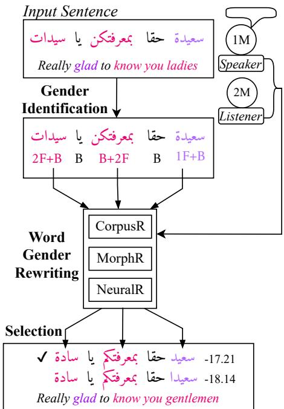

# User-Centric Gender Rewriting

Bashar Alhafni, Nizar Habash, Houda Bouamor†

Computational Approaches to Modeling Language Lab

New York University Abu Dhabi

†Carnegie Mellon University in Qatar

{alhafni,nizar.habash}@nyu.edu, hbouamor@qatar.cmu.edu

## Abstract

In this paper, we define the task of gender rewriting in contexts involving two users (I and/or You) – first and second grammatical persons with independent grammatical gender preferences. We focus on Arabic, a gendermarking morphologically rich language. We develop a multi-step system that combines the positive aspects of both rule-based and neural rewriting models. Our results successfully demonstrate the viability of this approach on a recently created corpus for Arabic gender rewriting, achieving 88.42 M2 F on a blind test set. Our proposed system improves over previous work on the first-person-only version of this task, by 3.05 absolute increase in M2 $\mathrm { F } _ { 0 . 5 }$ . We demonstrate a use case of our gender rewriting system by using it to post-edit the output of a commercial MT system to provide personalized outputs based on the users’ grammatical gender preferences. We make our code, data, and pretrained models publicly available.1

## 1 Introduction

Gender bias is a fundamental problem in natural language processing (NLP) and it has been receiving an increasing attention across a variety of core tasks such as machine translation (MT), co-reference resolution, and dialogue systems. Research has shown that NLP systems have the ability to embed and amplify gender bias (Sun et al., 2019), which not only degrades users’ experiences but also creates representational harm (Blodgett et al., 2020). The embedded bias within NLP systems is usually attributed to training models on biased data that reflects the social inequalities of the world we live in. However, even the most balanced of models can still exhibit and amplify bias if they are designed to produce a single text output without taking their users’ gender preferences into consideration. Therefore, to provide the correct user-aware output, NLP systems should be designed to produce outputs that are as gender-specific as the users information they have access to. Users information could be either embedded as part of the input or provided externally by the users themselves. In cases where this information is unavailable to the system, generating all gender-specific forms or a gender-neutral form is more appropriate.

Producing user-aware outputs becomes more challenging for systems targeting multi-user contexts (first and second persons, with independent grammatical gender preferences), particularly when dealing with gender-marking morphologically rich languages. In this paper, we define the task of gender rewriting in contexts involving two users (I and/or You) – first and second grammatical persons with independent grammatical gender preferences and we focus on Arabic, a gender-marking morphologically rich language. The main contributions of our work are as follows:

1. We introduce a multi-step gender rewriting system that combines the positive aspects of rule-based and neural models.

2. We demonstrate our approach’s effectiveness by establishing a strong benchmark on a publicly available multi-user Arabic gender rewriting corpus.

3. We show that our best system yields state-ofthe-art results on the first-person-only version of this task, beating previous work.

4. We demonstrate a use case of our system by post-editing the output of an MT system to match users’ grammatical gender preferences.

This paper is organized as follows. We first discuss related work (§2) as well as relevant Arabic linguistic facts (§3). We then define the gender rewriting task in §4 and describe the data we use and the gender rewriting model we build in §5 and §6. Lastly, we present our experimental setup (§7) and results (§8) and conclude in §9.

## 2 Background and Related Work

Substantial research has targeted the problem of gender bias in various NLP tasks such as MT (Rabinovich et al., 2017; Vanmassenhove et al., 2018; Stafanovics et al.ˇ , 2020; Savoldi et al., 2021), dialogue systems (Cercas Curry et al., 2020; Dinan et al., 2020; Liu et al., 2020a,b; Sheng et al., 2021), language modeling (Lu et al., 2018; Bordia and Bowman, 2019; Sheng et al., 2019; Vig et al., 2020; Nadeem et al., 2021), co-reference resolution (Rudinger et al., 2018; Zhao et al., 2018a), and named entity recognition (Mehrabi et al., 2019). While the majority of research has focused on tackling gender bias in English by debiasing word embeddings (Bolukbasi et al., 2016; Zhao et al., 2018b; Gonen and Goldberg, 2019; Manzini et al., 2019; Zhao et al., 2020) or by training systems on gender-balanced corpora built using counterfactual data augmentation techniques (Lu et al., 2018; Hall Maudslay et al., 2019; Zmigrod et al., 2019), our work falls under text rewriting through the controlled generation of gender alternatives for morphologically rich languages.

Within text rewriting, Vanmassenhove et al. (2021) and Sun et al. (2021) recently presented rule-based and neural rewriting models to generate gender-neutral sentences in English. For morphologically rich languages and specifically Arabic, Habash et al. (2019) introduced the Arabic Parallel Gender Corpus v1.0 (APGC v1.0) of firstperson-singular constructions and designed a twostep gender identification and reinflection system to generate masculine and feminine grammatical gender alternatives. Alhafni et al. (2020) used APGC v1.0 to create a joint gender identification and reinflection model. They treated the problem as a user-aware grammatical error correction task and showed improvements over Habash et al. (2019)’s results. Both efforts modeled gender reinflection using character-level Seq2Seq models. More recently, Alhafni et al. (2022) extended APGC v1.0 to APGC v2.0 by including contexts involving first and second grammatical persons covering singular, dual, and plural constructions; and adding six times more sentences.

In our work, we use APGC v2.0 to build a multistep gender rewriting system to generate gender alternatives in multi-user contexts. We also show improvements over both Habash et al. (2019)’s and Alhafni et al. (2020)’s results on APGC v1.0.

## 3 Arabic Linguistic Facts

We highlight two of the many challenges that face Modern Standard Arabic (MSA) NLP systems dealing with gender expressions.

Morphological Richness and Complexity Arabic has a rich and complex morphological system that inflects for many morphological features (gender, number, person, case, state, aspect, mood, voice), in addition to several attachable clitics (prepositions, particles, pronouns) (Habash, 2010). Arabic nouns, adjectives, and verbs inflect for gender: masculine (M) and feminine (F), and for number: singular (S), dual (D) and plural (P).

Changing the grammatical gender of Arabic words involves either changing the form of the base word, changing the pronominal enclitics that are attached to the base word, or a combination of both. A base word in Arabic refers to the stem along with its attachable affixes (prefixes, suffixes, circumfixes). Changing the base word gender requires either a suffix change, a pattern change, or a lexical change as shown in Table 1(a-c). Arabic also has clitics that attach to the stem after affixes. A clitic is a morpheme that has the syntactic characteristics of a word but shows evidence of being phonologically bound to another word. In this respect, a clitic is distinctly different from an affix, which is phonologically and syntactically part of the word. Proclitics are clitics that precede the word (like a prefix), whereas enclitics are clitics that follow the word (like a suffix). Pronominal enclitics are pronouns that cliticize to previous words (Table 1(d)). It is worth noting that multiple affixes and clitics can appear in a single word in Arabic and changing the grammatical gender of such words requires changing the genders of both the base word and its clitics (Table 1(f-g)).

Orthographic Ambiguity Arabic uses diacritics to specify short vowels. However, these optional diacritics are usually omitted in Arabic orthography, leaving readers to infer the meaning of certain words based on the context (Habash, 2010). This increases the degree of word ambiguity as genderspecific words could only differ in terms of diacritics. For instance, the verb $\therefore \Delta 1 \varsigma b t ^ { 2 }$ can be diacritized as $\therefore j$ laςibta ‘you [masc.] played or as $\therefore \sin ^ { j }$ laςibti ‘you [fem.] played’.

<table><tr><td rowspan=1 colspan=2>Paired Gender Alternatives</td><td rowspan=1 colspan=1>Rewrite Type</td><td rowspan=8 colspan=1>(a)(b)(c)(d)(e)(f)g)</td></tr><tr><td rowspan=1 colspan=1> Ámyr (NOUN.MS)prince</td><td rowspan=1 colspan=1> Ámyrh (NOUN.FS)princess</td><td rowspan=1 colspan=1>Suffix Change</td></tr><tr><td rowspan=1 colspan=1>ÂHmr (ADJ.MS)red</td><td rowspan=1 colspan=1>| HmrA&#x27; (ADJ.FS)red</td><td rowspan=1 colspan=1>Pattern Change</td></tr><tr><td rowspan=1 colspan=1> Áx (NOUN.MS)brother</td><td rowspan=1 colspan=1>Âxt (NOUN.FS)sister</td><td rowspan=1 colspan=1>Lexical Change</td></tr><tr><td rowspan=1 colspan=1>+ Âmyr+km (NOUN.MS+PRON.2MP)your (MP) prince</td><td rowspan=1 colspan=1>+ Âmyr+kn (NOUN.MS+PRON.2FP)your (FP) prince</td><td rowspan=1 colspan=1>Enclitic Change</td></tr><tr><td rowspan=1 colspan=1>ÁmrA&#x27;(NOUN.MP)princes</td><td rowspan=1 colspan=1>| ÂmyrAt (NOUN.FP)princesses</td><td rowspan=1 colspan=1>Pattern Change +Suffix Change</td></tr><tr><td rowspan=1 colspan=1>+ Âmyr+km (NOUN.MS+PRON.2MP)your (MP) prince</td><td rowspan=1 colspan=1>+ Âmyrt+kn (NOUN.FS+PRON.2FP)your (FP) princess</td><td rowspan=1 colspan=1>Suffix Change +Enclitic Change</td></tr><tr><td rowspan=1 colspan=1>+ÂmrA&#x27;+hm (NOUN.MP+PRON.3MP)their (MP) princes</td><td rowspan=1 colspan=1>+ÂmyrAt+hn (NOUN.FP+PRON.3FP)their (FP) princesses</td><td rowspan=1 colspan=1>Pattern Change +Suffix Change +(Enclitic Change</td></tr></table>

Table 1: Examples of the changes needed to generate gender alternative forms of gender-specific words in Arabic.

## 4 The Gender Rewriting Task

We define the task of gender rewriting as generating alternatives of a given Arabic sentence to match different target user gender contexts (e.g., female speaker with a male listener, a male speaker with a male listener, etc.). This requires changing the grammatical gender (masculine or feminine) of certain words referring to the users (speaker/1st person and listener/2nd person). Previous work done by Habash et al. (2019) and Alhafni et al. (2020) refer to this task as gender reinflection, but we believe that gender rewriting is a more appropriate term given that it goes beyond reinflection.3

Notation We will use four elementary symbols to facilitate the discussion of this task: 1M, 1F, 2M and 2F. The digit part of the symbol refers to the grammatical persons (1st or 2nd) and the letter part refers to the grammatical genders (masculine or feminine). Additionally, we will use B to refer to invariant/ambiguous gender.

We define the sentence-level gender using the following four labels: 1M/2F, 1F/2M, 1M/2F, and 1F/2F. These four labels indicate the grammatical persons and genders of the user contexts we are modeling.

We define the word-level gender based on the genders of the word’s base form and its attachable pronominal enclitics (§3) using the notation: baseform gender + enclitic gender. This results in

25 word-level gender labels (e.g., B+1F, 1F+2M). We use B to refer to gender invariant/ambiguous words. Examples of the word-level gender labels are shown in Table 2.

Task Definition Given an Arabic sentence and a sentence-level target gender, the goal is to rewrite the input sentence to match the target users’ gender preferences.

Some of the models we explore only use sentence-level gender labels; while other models use word-level gender labels to identify which input words need to be rewritten to match the target users’ gender preferences.

## 5 Data

For our experiments, we use the publicly available Arabic Parallel Gender Corpus (APGC) – a parallel corpus of Arabic sentences with gender annotations and gender rewritten alternatives of sentences selected from OpenSubtitles 2018 (Lison and Tiedemann, 2016). The corpus comes in two versions: APGC v1.0 and APGC v2.0. APGC v1.0 was introduced by Habash et al. (2019) and it contains 12,238 first-person-singular Arabic parallel gender-annotated sentences. Alhafni et al. (2022) expanded APGC v1.0 by including contexts involving first and second grammatical persons covering singular, dual, and plural constructions to create v2.0, which contains 80,326 gender-annotated parallel sentences (596,799 words). Both versions of APGC include the original English parallels of the Arabic sentences.

<table><tr><td rowspan=10 colspan=1>(a)I(b)D(c)(d)(e)B(f)[</td><td></td><td></td><td></td><td></td><td></td><td></td></tr><tr><td rowspan=1 colspan=1>English</td><td rowspan=1 colspan=1>Input</td><td rowspan=1 colspan=1>Target 1M/2M</td><td rowspan=1 colspan=1>Target 1F/2M</td><td rowspan=1 colspan=1>Target 1M/2F</td><td rowspan=1 colspan=1>Target 1F/2F</td></tr><tr><td rowspan=2 colspan=1>want to talk to you</td><td rowspan=2 colspan=1>ch  i B B BB</td><td rowspan=2 colspan=1>da  i B B BB</td><td rowspan=2 colspan=1>B  BBB</td><td rowspan=1 colspan=1>i </td><td rowspan=2 colspan=1>B B B B</td></tr><tr><td rowspan=1 colspan=1>B  BB B</td></tr><tr><td rowspan=2 colspan=1>ad, I am here</td><td rowspan=2 colspan=1>Li Li   eB B 2M+B</td><td rowspan=2 colspan=1>L   心B B 2M+B</td><td rowspan=2 colspan=1>L li   心B B 2M+B</td><td rowspan=1 colspan=1>i li Gi</td><td rowspan=1 colspan=1>L  </td></tr><tr><td rowspan=1 colspan=1>B B 2F+B</td><td rowspan=1 colspan=1>B B 2F+B</td></tr><tr><td rowspan=1 colspan=1>[I will tell you [plural]something</td><td rowspan=1 colspan=1>B  B+2F</td><td rowspan=1 colspan=1>B B+2M</td><td rowspan=1 colspan=1>B B+2M</td><td rowspan=1 colspan=1>B  B+2F</td><td rowspan=1 colspan=1>B  B+2F</td></tr><tr><td rowspan=1 colspan=1>I am going to myoffice</td><td rowspan=1 colspan=1>B 1M+B B</td><td rowspan=1 colspan=1>B 1M+B B</td><td rowspan=1 colspan=1> B 1F+B B</td><td rowspan=1 colspan=1>B 1M+B B</td><td rowspan=1 colspan=1>B 1F+B B</td></tr><tr><td rowspan=1 colspan=1>ecause I am an idiot</td><td rowspan=1 colspan=1>dli 1F+B  B</td><td rowspan=1 colspan=1>y1M+BB</td><td rowspan=1 colspan=1>ler 1F+B  B</td><td rowspan=1 colspan=1>1M+BB</td><td rowspan=1 colspan=1>dle1F+B B</td></tr><tr><td rowspan=1 colspan=1>I am glad to knowyou [plural]</td><td rowspan=1 colspan=1>S  tiB+2M 1F+B B</td><td rowspan=1 colspan=1> t tiB+2M 1M+B B</td><td rowspan=1 colspan=1>  B+2M 1F+B B</td><td rowspan=1 colspan=1>  tiB+2F 1M+B B</td><td rowspan=1 colspan=1> B+2F 1F+B B</td></tr></table>

Table 2: Examples from the Arabic Parallel Gender Corpus v2.0 including the extended word-level annotations for each sentence and its rewrite to the opposite grammatical gender forms where appropriate. First person gendered words are in purple and second person gendered words are in red. M is Masculine; F is Feminine; and B is invariant.

In all of our experiments, we use an extended version of APGC v2.0 to train and test our systems. We also report results on the test set of APGC v1.0 to compare with previous work.

Annotations Each sentence in APGC v2.0 has word-level gender labels where each word is labeled as B, 1F, 2F, 1M, or 2M. All sentences containing gender-specific words referring to human participants have parallels representing their opposite gender forms. For the sentences without any gender-specific words, their parallels are trivial copies. Out of the 80,326 sentences in APGC v2.0, 46% (36,980) do not contain any gendered words, whereas sentences with gendered references constitute 54% (43,346). In terms of the word-level statistics, 9.7% (58,066) are gender-specific, whereas 90.3% (538,733) are marked as B.

Moreover, APGC v2.0 is organized into five parallel corpora that are fully aligned (1-to-1) at the word level: Input, Target 1M/2M, Target 1F/2M, Target 1M/2F, and Target 1F/2F. All five corpora are balanced in terms of gender, i.e., the number of words marked as 1F and 1M is the same; and the number of words marked as 2F and 2M is the same. The Input corpus contains sentences with all possible word types (B, 1F, 2F, 1M, 2M). The Target 1M/2M corpus contains sentences that consist of B, 1M, 2M words; the Target 1F/2M corpus contains sentences that consist of B, 1F, 2M words; the Target 1M/2F corpus contains sentences that consist of B, 1M, 2F words; and the Target 1F/2F corpus contains sentences that consist of B, 1F, 2F words. The four target corpora are intended to model the target users’ gender preferences for a particular input.

Splits We use Alhafni et al. (2022)’s splits: 57,603 sentences (427,523 words) for training (TRAIN), 6,647 sentences (49,257 words) for development (DEV), and 16,076 sentences (120,019 words) for testing (TEST).

Preprocessing the Word-Level Annotations Since gender information could be expressed at different parts of Arabic words (§3), we automatically extend the APGC v2.0 word-level annotations to mark the genders of both the base words and their pronominal enclitics.

Our preprocessing pipeline considers the labeled gendered words across the five parallel forms of each sentence in APGC v2.0. If the word ends with a gender marking pronominal enclitic, we label the gender of the enclitic based on predefined rules as 1F, 1M, 2F, or 2M. If the gendered word does not end with a gender-marking enclitic, then we label the enclitic as B. Once the enclitic is labeled, we compare the base form of the word across its parallel forms. If the base form is the same, we label it as B. Otherwise, we assign the base form the same label that is provided as part of APGC v2.0. All gender ambiguous words will be labeled as B. Table 2 presents some examples from APGC v2.0 with the extended word-level gender annotations.

The extended word-level statistics are presented in Appendix B. We make the extended word-level gender annotations publicly available as a new release of APGC (APGC v2.1).4

## 6 The Multi-step Model Approach

Most of the recent work on gender rewriting rely on using Seq2Seq models (Habash et al., 2019; Alhafni et al., 2020; Sun et al., 2021; Jain et al., 2021; Vanmassenhove et al., 2021). However, the lack of large gender-annotated parallel datasets presents a challenge when training Seq2Seq models, and especially when dealing with morphologically rich languages. This issue is highlighted by Alhafni et al. (2020), who report that most of the errors (68%) produced by their character-level Seq2Seq model are due to not making any changes to genderspecific words in the input sentences. Given the complexity of the gender rewriting task in Arabic and the relatively small training data size, we model the gender rewriting task using a multi-step systemقافكا the combines the positive aspects of rule-based and neural models. Our system consists of three components: Gender identification, Out-of-context word gender rewriting, and In-context ranking and selection.

## 6.1 Gender Identification (GID)

We first identify the word-level gender label (base word + pronominal enclitic) for each word in the input sentence. We build a word-level classifier by leveraging a Transformer-based pretrained language model. There are many Arabic monolingual BERT models available such as AraBERT (Antoun et al., 2020), ARBERT (Abdul-Mageed et al., 2021), and QARIB (Abdelali et al., 2021). However, we chose to use CAMeLBERT MSA (Inoue et al., 2021) as it was pretrained on the largest MSAعيد حقا بمعرفتك يا سا✔︎ dataset to date. Following the work of Devlin et al.دحقابمعفتكاسا (2019), we fine-tune CAMeLBERT MSA using Hugging Face’s transformers (Wolf et al., 2020) by adding a fully-connected linear layer with a softmax on top of its architecture. During fine-tuning, we use the representation of the first sub-token as an input to the linear layer.

## 6.2 Out-of-context Word Gender Rewriting

Given the desired sentence-level target gender as an input and the identified gender label for each word in the input sentence, we decide if a word-level gender rewrite is needed based on the compatibility between the provided sentence-level target gender and the predicted word-level gender labels. We implement three word-level gender alternative generation models: Corpus-based Rewriter, Morphological Rewriter, and Neural Rewriter.

  
Figure 1: The multi-step gender rewriting system. First person gendered words are in purple and second person gendered words are in red. The sentence-level target gender is 1M/2M. The input words glad (1F+B), know you (B+2F), and ladies (2F+B) are rewritten to their masculine forms.

Corpus-based Rewriter (CorpusR) We build a simple word-level lookup rewriting model by exploiting the fully aligned words in APGC v2.1. We implement this model as a bigram maximum likelihood estimator: given an input word with its bigram surrounding context $( w _ { i } , w _ { i - 1 } )$ , a gender alternative target word $( y _ { i } )$ , and a desired word-level target gender (g), the CorpusR model is built by computing $P ( y _ { i } | w _ { i } , w _ { i - 1 } , g )$ over the training examples. During inference, we generate all possible gender alternatives for the given input word (wi). If the bigram context $( w _ { i } , w _ { i - 1 } )$ was not observed in the training data, we backoff to a unigram context. If the input word was not observed during training, we pass it to the output as it is.

Morphological Rewriter (MorphR) For the morphological rewriter, we use the morphological analyzer and generator provided by CAMeL Tools (Obeid et al., 2020). We extend the Standard Arabic Morphological Analyzer database (SAMA) (Graff et al., 2009) used by the morphological generator to produce controlled gender alternatives. We make our extensions to the database publicly available.5

Given an input word and a desired word-level target gender, the morphological generator has the ability to produce gender alternatives by either rewriting the base word, its pronominal enclitics, or both. If an input word does not get recognized by the morphological analyzer and generator, we pass it to the output as it is. It is worth noting that this rewriting model does not require any training data.

Neural Rewriter (NeuralR) Inspired by work done on out-of-context morphological reinfection (Kann and Schütze, 2016; Cotterell et al., 2018), we design a character-level encoder-decoder model with attention. Given an input word and word-level target gender, the encoder-decoder model would generate gender alternatives of the input word. For the encoder, we use a two-layer bidrectional GRU (Cho et al., 2014) and for the decoder we use a two-layer GRU with additive attention (Bahdanau et al., 2015). Furthermore, we employ side constraints (Sennrich et al., 2016) to control for the generation of gender alternatives. That is, we add the word-level target gender as a special token $( \mathbf { e . g . , < l F + B > } )$ to the beginning of the input word and we feed that entire sequence to the model (i.e., $< 1 5 + B > \ldots ($ . The intuition here is that the attentional encoder-decoder model would be able to learn to pay attention to the side constraints to generate the desired gender alternative of the input word. During inference, we use beam search to generate the top 3-best hypotheses.

## 6.3 In-Context Ranking and Selection

Since the three word-level gender alternative generation models we implement are out-of-context and given Arabic’s morphological richness, we expect to get multiple output words when generating a single gender alternative for a particular input word. This leads to producing multiple candidate gender alternative output sentences. To select the best candidate output sentence, we rank all candidates in full sentential context based on their pseudo-loglikelihood (PLL) scores (Salazar et al., 2020). We first use Hugging Face’s transformers to fine-tune the CAMeLBERT MSA model on the Input corpus of APGC v2.1 by using a masked language modeling (Devlin et al., 2019) objective. This helps in mitigating the domain shift (Gretton et al., 2006) issue between CAMeLBERT’s pretraining data and APGC v2.1. We then compute the PLL score for each sentence using the fine-tuned CAMeLBERT MSA model by masking the sentence tokens one by one.6 We will refer to the in-context ranking and selection as simply selection throughout the paper.

Figure 1 presents an overview of our gender rewriting model. We describe the training settings and the model’s hyperparameters in Appendix A.

## 7 Experimental Setup

## 7.1 Evaluation Metrics

We follow Alhafni et al. (2020) by treating the gender rewriting problem as a user-aware grammatical error correction task and use the MaxMatch $( \mathbf { M } ^ { 2 } )$ scorer (Dahlmeier and Ng, 2012) as our evaluation metric. The ${ \bf M } ^ { 2 }$ scorer computes the precision (P), recall (R), and $\mathrm { F } _ { 0 . 5 }$ by maximally matching phraselevel edits made by a system to gold-standard edits. The gold edits are computed by the ${ \bf M } ^ { 2 }$ scorer based on provided gold references. Moreover and to be consistent with previous work, we also report BLEU (Papineni et al., 2002) scores which are obtained using SacreBLEU (Post, 2018). We report the gender rewriting results in a normalized space for Alif, Ya, and Ta-Marbuta (Habash, 2010).

## 7.2 Baselines

Do Nothing Our first baseline trivially passes the input sentences to the output as they are. This baseline highlights the level of similarity between the inputs and the outputs.

Joint Baseline Model Our second baseline uses a variant of the sentence-level linguistically enhanced joint gender identification and rewriting model introduced by Alhafni et al. (2020). The main difference between this model and the one introduced by Alhafni et al. (2020) is that we model four multi-user target genders, whereas they only modeled two single-user target genders (1M, 1F). We implement this joint baseline model using a character-level GRU encoder-decoder with additive attention, where the learned input characterlevel representations are enriched with word-level morphological features obtained from the extended morphological analyzer that is part of CAMeL Tools. The representation of the input sentencelevel target gender (1M/2M, 1F/2M, 1M/2F, 1F/2F) is learned as part of the model and used during decoding when generating gender alternatives. We refer to this baseline as Joint+Morph.

Extended Joint Baseline Models Our third and fourth baseline models reduce the complexity of the Joint+Morph model by not learning a representation for the input sentence-level target gender as part of the model. Instead, we provide the sentence-level target gender information as side constraints. We add the target gender as a special token to the beginning of the input sentence (e.g., <1M/2F>Input Sentence) when we feed it to the model. Moreover, we explore the effectiveness of enriching the input character representations with word-level morphological features. To do so, we omit the morphological features from the first joint variant, and we use them in the second. We refer to these models as Joint+Side Constraints and Joint+Morph+Side Constraints, respectively.

## 7.3 Our Multi-step Models

We explore five variants of the gender rewriting multi-step model described in §6. All five variants use the same gender identification (GID) and incontext selection models, but they differ in their outof-context word-level gender rewriting generation setup. The first three variants use one word-level gender rewriting model each – CorpusR, MorphR, or NeuralR. The fourth multi-step model uses MorphR as a backoff if the input words that need to be rewritten are not observed by the CorpusR model during training (CorpusR»MorphR). The fifth system uses all three word-level gender alternative generation models in a backoff cascade: CorpusR»MorphR»NeuralR.

## 7.4 Data Augmentation

Given the relatively small size of APGC v2.1 and motivated by recent work on using data augmentation to improve grammatical error correction (Wan et al., 2020; Stahlberg and Kumar, 2021), we investigate adding additional training examples through data augmentation. We randomly selected 800K sentences from the English-Arabic portion of the OpenSubtitles 2018 dataset, which was used to build APGC. We ensured that all extracted pairs include either first or second (or both) person pronouns on the English side: I, me, my, mine, myself, and you, your, yours, yourself. To generate gender alternatives of the selected Arabic sentences, we pass each sentence four times through our best gender rewriting system to generate all four user gender contexts (1M/2M, 1F/2M, 1M/2F, 1F/2F). We add the 800K selected Arabic sentences and their 1M/2M, 1F/2M, 1M/2F, 1F/2F generated gender alternatives to the Input, Target 1M/2M, Target 1F/2M, Target 1M/2F, and Target 1F/2F corpora of the training split of APGC v2.1, respectively. At the end, we end up with 857,603 Arabic parallel sentences (6,209,958 words). We make the synthetically generated data publicly available.

## 8 Results

Table 3 presents the DEV set results. Joint+Side Constraints and Joint+Morph+Side Constraints significantly improve over the Joint+Morph baseline with up to 13.87 increase in $\operatorname { F } _ { 0 . 5 }$ . The best performing system overall is our multi-step model using all rewrite components – Table 3(i), henceforth, Our Best Model. It improves over all the joint models in every compared metric, including a 22.84 increase in $\mathrm { F } _ { 0 . 5 }$ when compared to the Joint+Morph baseline. Our Best Model’s biggest advantages seem to come from combining the three word-level out-of-context gender alternative generation models in a cascaded setup to deal with OOV words during the generation. Comparing (i) with (e,f,g) in Table 3, we observe improvements ranging from 3.91 to 6.02 F0.5.

We used Our Best Model to conduct the data augmentation experiments as discussed in §7.4. The full set of augmentation experiment results are presented in Appendix C. The best augmented model’s results, which benefits from augmentation in the GID and NeuralR components, are also presented in Table 3(j). However, its increase of 0.19 points in $\mathrm { F } _ { 0 . 5 }$ is not statistically significant with McNemar’s (McNemar, 1947) test at $p > 0 . 0 5$

The results of our best models on the TEST sets of APGC v2.1 and APGC v1.0 are presented in Table 4. The results on APGC v2.1 TEST show consistent conclusions with the DEV results. Our best augmented model improves over its nonaugmented variant in every compared metric, including a 0.25 absolute increase in $\operatorname { F } _ { 0 . 5 }$ that is statistically significant with McNemar’s test at $p < 0 . 0 5$ For APGC v1.0, we do not report results with augmentation for fair comparison to previous results. In both TEST sets, we establish new SOTAs.

Error Analysis We conducted an error analysis over the output of our best augmented system on APGC v2.1 DEV. In total, there were 1,475 (5.5% out of 26,588) sentences with errors across the four target corpora. Table 5 presents a summary of the error types our best augmented gender rewriting model makes.

<table><tr><td rowspan=1 colspan=1></td><td rowspan=1 colspan=1>P</td><td rowspan=1 colspan=1>R</td><td rowspan=1 colspan=1> $\mathbf { F _ { 0 . 5 } }$ </td><td rowspan=1 colspan=1>BLEU</td></tr><tr><td rowspan=1 colspan=1>(a) Do Nothing</td><td rowspan=1 colspan=1>100.0</td><td rowspan=1 colspan=1>0.0</td><td rowspan=1 colspan=1>0.0</td><td rowspan=1 colspan=1>89.36</td></tr><tr><td rowspan=1 colspan=1>(b) Joint   + Morph</td><td rowspan=1 colspan=1>64.76</td><td rowspan=1 colspan=1>67.40</td><td rowspan=1 colspan=1>65.27</td><td rowspan=1 colspan=1>93.31</td></tr><tr><td rowspan=1 colspan=1>(c) Joint   + Side Constraints</td><td rowspan=1 colspan=1>77.10</td><td rowspan=1 colspan=1>77.71</td><td rowspan=1 colspan=1>77.22</td><td rowspan=1 colspan=1>95.60</td></tr><tr><td rowspan=1 colspan=1>(d) Joint   + Morph+ Side Constraints</td><td rowspan=1 colspan=1>78.97</td><td rowspan=1 colspan=1>79.84</td><td rowspan=1 colspan=1>79.14</td><td rowspan=1 colspan=1>96.17</td></tr><tr><td rowspan=1 colspan=1>(e) GID    + CorpusR + Selection</td><td rowspan=1 colspan=1>88.22</td><td rowspan=1 colspan=1>71.22</td><td rowspan=1 colspan=1>84.20</td><td rowspan=1 colspan=1>96.54</td></tr><tr><td rowspan=1 colspan=1>(f) GID    + MorphR + Selection</td><td rowspan=1 colspan=1>84.48</td><td rowspan=1 colspan=1>75.29</td><td rowspan=1 colspan=1>82.47</td><td rowspan=1 colspan=1>96.96</td></tr><tr><td rowspan=1 colspan=1>(g) GID    + NeuralR + Selection</td><td rowspan=1 colspan=1>84.62</td><td rowspan=1 colspan=1>73.32</td><td rowspan=1 colspan=1>82.09</td><td rowspan=1 colspan=1>96.75</td></tr><tr><td rowspan=1 colspan=1>(h) GID    + CorpusR » MorphR + Selection</td><td rowspan=1 colspan=1>88.59</td><td rowspan=1 colspan=1>85.84</td><td rowspan=1 colspan=1>88.02</td><td rowspan=1 colspan=1>97.96</td></tr><tr><td rowspan=1 colspan=1>(i) GID    + CorpusR » MorphR » NeuralR    + Selection</td><td rowspan=1 colspan=1>88.46</td><td rowspan=1 colspan=1>86.74</td><td rowspan=1 colspan=1>88.11</td><td rowspan=1 colspan=1>98.04</td></tr><tr><td rowspan=1 colspan=1>(j) GIDAug + CorpusR » MorphR » NeuralRAug + Selection</td><td rowspan=1 colspan=1>88.67</td><td rowspan=1 colspan=1>86.84</td><td rowspan=1 colspan=1>88.30</td><td rowspan=1 colspan=1>98.05</td></tr></table>

Table 3: Results of a number of systems on the DEV set of APGC v2.1. Aug indicates using augmented data.
<table><tr><td rowspan=1 colspan=2></td><td rowspan=1 colspan=1>P</td><td rowspan=1 colspan=1>R</td><td rowspan=1 colspan=1> $\overline { { \mathbf { F _ { 0 . 5 } } } }$ </td><td rowspan=1 colspan=1>BLEU</td></tr><tr><td rowspan=3 colspan=1>APGCv2.1Test</td><td rowspan=1 colspan=1>Joint   + Morph  + Side Constraints</td><td rowspan=1 colspan=1>79.27</td><td rowspan=1 colspan=1>80.44</td><td rowspan=1 colspan=1>79.50</td><td rowspan=1 colspan=1>96.19</td></tr><tr><td rowspan=1 colspan=1>GID    + CorpusR » MorphR » NeuralR    + Selection</td><td rowspan=1 colspan=1>88.70</td><td rowspan=1 colspan=1>86.13</td><td rowspan=1 colspan=1>88.17</td><td rowspan=1 colspan=1>97.98</td></tr><tr><td rowspan=1 colspan=1>GIDAug + CorpusR » MorphR » NeuralRAug + Selection</td><td rowspan=1 colspan=1>88.86</td><td rowspan=1 colspan=1>86.69</td><td rowspan=1 colspan=1>88.42</td><td rowspan=1 colspan=1>98.05</td></tr><tr><td rowspan=3 colspan=1>APGCv1.0Test</td><td rowspan=1 colspan=1>Habash et al. (2019)</td><td rowspan=1 colspan=1>77.74</td><td rowspan=1 colspan=1>52.06</td><td rowspan=1 colspan=1>70.76</td><td rowspan=1 colspan=1>98.28</td></tr><tr><td rowspan=1 colspan=1>Alhafni et al. (2020)</td><td rowspan=1 colspan=1>78.98</td><td rowspan=1 colspan=1>60.32</td><td rowspan=1 colspan=1>74.38</td><td rowspan=1 colspan=1>98.49</td></tr><tr><td rowspan=1 colspan=1>GID   + CorpusR » MorphR » NeuralR    + Selection</td><td rowspan=1 colspan=1>78.57</td><td rowspan=1 colspan=1>73.17</td><td rowspan=1 colspan=1>77.43</td><td rowspan=1 colspan=1>98.92</td></tr></table>

Table 4: Gender rewriting results on the TEST sets of APGC v2.1 and APGC v1.0.

<table><tr><td rowspan=1 colspan=1></td><td rowspan=1 colspan=1>1M/2M</td><td rowspan=1 colspan=1>1F/2M</td><td rowspan=1 colspan=1>1M/2F</td><td rowspan=1 colspan=1>1F/2F</td></tr><tr><td rowspan=1 colspan=1>GID</td><td rowspan=1 colspan=1>150 56%</td><td rowspan=1 colspan=1>19470%</td><td rowspan=1 colspan=1>325 68%</td><td rowspan=1 colspan=1>324 72%</td></tr><tr><td rowspan=1 colspan=1>Rewrite</td><td rowspan=1 colspan=1>69 26%</td><td rowspan=1 colspan=1>50 18%</td><td rowspan=1 colspan=1>82 17%</td><td rowspan=1 colspan=1>66 15%</td></tr><tr><td rowspan=1 colspan=1>Select</td><td rowspan=1 colspan=1>49 18%</td><td rowspan=1 colspan=1>35 13%</td><td rowspan=1 colspan=1>73 15%</td><td rowspan=1 colspan=1>58 13%</td></tr><tr><td rowspan=1 colspan=1>Total</td><td rowspan=1 colspan=1>268</td><td rowspan=1 colspan=1>279</td><td rowspan=1 colspan=1>480</td><td rowspan=1 colspan=1>448</td></tr></table>

Table 5: Error type statistics of our best augmented system’s performance on APGC v2.1 DEV.
<table><tr><td rowspan=1 colspan=1>Target</td><td rowspan=1 colspan=1>1M/2M</td><td rowspan=1 colspan=1>1F/2M1</td><td rowspan=1 colspan=1>M/2F</td><td rowspan=1 colspan=1>1F/2F</td></tr><tr><td rowspan=1 colspan=1>Google Translate</td><td rowspan=1 colspan=1>13.59</td><td rowspan=1 colspan=1>13.15</td><td rowspan=1 colspan=1>11.38</td><td rowspan=1 colspan=1>10.96</td></tr><tr><td rowspan=1 colspan=1>Best SystemAug</td><td rowspan=1 colspan=1>13.71</td><td rowspan=1 colspan=1>13.64</td><td rowspan=1 colspan=1>13.30</td><td rowspan=1 colspan=1>13.23</td></tr></table>

Table 6: BLEU results on the post-edited Google Translate output of APGC v2.1 TEST using our best augmented system.

The majority of errors (67.3%) were caused by GID which achieves a word-level accuracy of 98.9% on DEV. The gender-rewriting errors constituted 18.1% and selection errors 14.6%. Considering different target corpora, we observe that every time an F target is added, the number of errors increases. The 1M/2M target outputs has the lowest number of errors (268 or 18%), while the 1M/2F targets outputs has the highest number of errors (480 or 33%).

Use Case: Post-Editing MT Output We demonstrate next how our proposed gender rewriting model could be used to personalize the output of user-unaware MT systems through post-editing. We use the English to Arabic Google Translate output sentences that are part of APGC v2.1. We evaluate Google Translate’s output against all four target corpora (1M/2M, 1F/2M, 1M/2F, 1F/2F) separately. To re-target Google Translate’s Arabic output for the four user gender contexts we model, we pass each Arabic sentence four times through our best augmented system (Table 3(j)). We present the evaluation in terms of BLEU in Table 6 over APGC v2.1 TEST. All the results are reported in an orthographically normalized space for Alif, Ya, and Ta-Marbuta.

Again, we observe that every time an M participant is switched to F, the BLEU scores drop for Google Translate’s output. This is consistent to what have been reported by Alhafni et al. (2022) and highlights the bias the machine translation output has towards masculine grammatical gender preferences. The post-edited outputs generated by our best augmented system improves over Google Translate’s across the four target user contexts, achieving the highest increase in 2.27 BLEU points for 1F/2F.

## 9 Conclusion and Future Work

We defined the task of gender rewriting in contexts involving two users (I and/or You), and developed a multi-step system that combines the positive aspects of both rule-based and neural rewriting models. Our best models establish the benchmark for this newly defined task and the SOTA for a previously defined first person version of it. We further demonstrated a use case of our gender rewriting system by post-editing the output of a commercial MT system to provide personalized outputs based on the users’ grammatical gender preferences.

In future work, we plan to explore the use of other pretrained models, and to work on the problem of gender rewriting in other languages and dialectal varieties.

## Ethical Considerations

Gender Rewriting Our underlying intention of developing a gender rewriting model for Arabic is to increase the inclusiveness of NLP applications that deal with gender-marking morphologically rich languages. Our work aims at empowering and allowing users to interact with NLP technology in a way that is consistent with their social identities. We acknowledge that by limiting the choice of gender expressions to the grammatical gender choices in Arabic, we exclude other alternatives such as non-binary gender or no-gender expressions. However, we are not aware of any sociolinguistics published research that discusses such alternatives for Arabic. We stress on the importance of adapting Arabic NLP models to new gender alternative forms as they emerge as part of the language usage. We further recognize the limitations of the gender identification component we use as part of our multi-step gender rewriting model as it relies on a language model that was pretrained on a large monolingual Arabic corpus, which could possibly contain biased text. We realize the potential risks of our proposed gender rewriting model if it is intentionally maliciously misused to produce gender alternatives that do not match the target users’ gender preferences.

Data We use the publicly available Arabic Parallel Gender Corpus (APGC).7 It is subject to its creators’ own Copy Rights and User Agreement and we strictly adhere to its intended usage. It is worth noting that APGC does not contain any heterocentric assumptions as part of its annotations (e.g., the word $3 . 9 \dot { 1 }$ ‘my husband’ is labeled as genderambiguous (B)). Moreover, all proper names are labeled as B, even when they have strong genderspecific association (Alhafni et al., 2022). The Arabic data we use for our data augmentation experiments was randomly sampled from OpenSubtitles 2018 (Lison and Tiedemann, 2016), which is publicly available.8 OpenSubtitles is distributed under a Creative Commons license.9

## Acknowledgements

We thank Alberto Chierici, Christian Khairallah, Go Inoue, and Ossama Obeid for the helpful discussions. We acknowledge the support of the High Performance Computing Center at New York University Abu Dhabi. Finally, we wish to thank the anonymous reviewers at NAACL 2022 for their feedback.

## References

Ahmed Abdelali, Sabit Hassan, Hamdy Mubarak, Kareem Darwish, and Younes Samih. 2021. Pre-training bert on arabic tweets: Practical considerations.

Muhammad Abdul-Mageed, AbdelRahim Elmadany, and El Moatez Billah Nagoudi. 2021. ARBERT & MARBERT: Deep bidirectional transformers for Arabic. In Proceedings ofthe 59th Annual Meeting ofthe Association for Computational Linguistics and the 11th International Joint Conference on Natural Language Processing (Volume 1: Long Papers), pages 7088–7105, Online. Association for Computational Linguistics.

Bashar Alhafni, Nizar Habash, and Houda Bouamor. 2020. Gender-aware reinflection using linguistically enhanced neural models. In Proceedings ofthe Second Workshop on Gender Bias in Natural Language Processing, pages 139–150, Barcelona, Spain (Online). Association for Computational Linguistics.

Bashar Alhafni, Nizar Habash, and Houda Bouamor. 2022. The Arabic Parallel Gender Corpus 2.0: Extensions and analyses. In Proceedings ofthe 13th Language Resources and Evaluation Conference (LREC), Marseille, France.

Wissam Antoun, Fady Baly, and Hazem Hajj. 2020. AraBERT: Transformer-based model for Arabic language understanding. In Proceedings of the 4th Workshop on Open-Source Arabic Corpora and Processing Tools, with a Shared Task on Offensive Language Detection, pages 9–15, Marseille, France. European Language Resource Association.

Dzmitry Bahdanau, Kyunghyun Cho, and Yoshua Bengio. 2015. Neural machine translation by jointly learning to align and translate. In Proceedings ofthe International Conference on Learning Representations (ICLR).

Samy Bengio, Oriol Vinyals, Navdeep Jaitly, and Noam Shazeer. 2015. Scheduled sampling for sequence prediction with recurrent neural networks. CoRR, abs/1506.03099.

Su Lin Blodgett, Solon Barocas, Hal Daumé III, and Hanna Wallach. 2020. Language (technology) is power: A critical survey of “bias” in NLP. In Proceedings of the 58th Annual Meeting of the Associationfor Computational Linguistics, pages 5454– 5476, Online. Association for Computational Linguistics.

Tolga Bolukbasi, Kai-Wei Chang, James Y Zou, Venkatesh Saligrama, and Adam T Kalai. 2016. Man is to computer programmer as woman is to homemaker? debiasing word embeddings. In Advances in Neural Information Processing Systems, volume 29. Curran Associates, Inc.

Shikha Bordia and Samuel R. Bowman. 2019. Identifying and reducing gender bias in word-level language models. In Proceedings of the 2019 Conference of the North American Chapter of the Association for Computational Linguistics: Student Research Work shop, pages 7–15, Minneapolis, Minnesota.

Amanda Cercas Curry, Judy Robertson, and Verena Rieser. 2020. Conversational assistants and gender stereotypes: Public perceptions and desiderata for voice personas. In Proceedings ofthe Second Work shop on Gender Bias in Natural Language Processing, pages 72–78, Barcelona, Spain (Online). Association for Computational Linguistics.

Kyunghyun Cho, Bart van Merriënboer, Caglar Gulcehre, Dzmitry Bahdanau, Fethi Bougares, Holger Schwenk, and Yoshua Bengio. 2014. Learning phrase representations using RNN encoder–decoder for statistical machine translation. In Proceedings of the 2014 Conference on Empirical Methods in Natural Language Processing (EMNLP), pages 1724– 1734, Doha, Qatar.

Ryan Cotterell, Christo Kirov, John Sylak-Glassman, Géraldine Walther, Ekaterina Vylomova, Arya D. Mc-Carthy, Katharina Kann, Sabrina J. Mielke, Garrett Nicolai, Miikka Silfverberg, David Yarowsky, Jason Eisner, and Mans Hulden. 2018. The CoNLL– SIGMORPHON 2018 shared task: Universal morphological reinflection. In Proceedings of the CoNLL–SIGMORPHON 2018 Shared Task: Universal Morphological Reinflection, pages 1–27, Brussels. Association for Computational Linguistics.

Ryan Cotterell, Christo Kirov, John Sylak-Glassman, Géraldine Walther, Ekaterina Vylomova, Patrick Xia, Manaal Faruqui, Sandra Kübler, David Yarowsky, Jason Eisner, and Mans Hulden. 2017. CoNLL-SIGMORPHON 2017 shared task: Universal morphological reinflection in 52 languages. CoRR, abs/1706.09031.

Ryan Cotterell, Christo Kirov, John Sylak-Glassman, David Yarowsky, Jason Eisner, and Mans Hulden. 2016. The SIGMORPHON 2016 shared task— morphological reinflection. In Proceedings of the Workshop of the Special Interest Group on Computational Morphology and Phonology (SIGMORPHON), Berlin, Germany.

Daniel Dahlmeier and Hwee Tou Ng. 2012. Better evaluation for grammatical error correction. In Proceedings ofthe 2012 Conference ofthe North American Chapter of the Association for Computational Linguistics: Human Language Technologies, pages 568–572, Montréal, Canada.

Jacob Devlin, Ming-Wei Chang, Kenton Lee, and Kristina Toutanova. 2019. BERT: Pre-training of deep bidirectional transformers for language understanding. In Proceedings of the 2019 Conference of the North American Chapter ofthe Associationfor Computational Linguistics: Human Language Technologies, Volume 1 (Long and Short Papers), pages 4171–4186, Minneapolis, Minnesota. Association for Computational Linguistics.

Emily Dinan, Angela Fan, Adina Williams, Jack Urbanek, Douwe Kiela, and Jason Weston. 2020. Queens are powerful too: Mitigating gender bias in dialogue generation. In Proceedings ofthe 2020 Conference on Empirical Methods in Natural Language Processing (EMNLP), pages 8173–8188, Online. Association for Computational Linguistics.

Hila Gonen and Yoav Goldberg. 2019. Lipstick on a pig: Debiasing methods cover up systematic gender biases in word embeddings but do not remove them.

David Graff, Mohamed Maamouri, Basma Bouziri, Sondos Krouna, Seth Kulick, and Tim Buckwalter. 2009. Standard Arabic Morphological Analyzer (SAMA) Version 3.1. Linguistic Data Consortium LDC2009E73.

Arthur Gretton, Karsten Borgwardt, Malte Rasch, Bernhard Schölkopf, and Alex Smola. 2006. A kernel method for the two-sample-problem. In Advances in Neural Information Processing Systems, volume 19. MIT Press.

Nizar Habash, Houda Bouamor, and Christine Chung. 2019. Automatic gender identification and reinflection in Arabic. In Proceedings of the First Workshop on Gender Bias in Natural Language Processing, pages 155–165, Florence, Italy.

Nizar Habash, Abdelhadi Soudi, and Tim Buckwalter. 2007. On Arabic Transliteration. In A. van den Bosch and A. Soudi, editors, Arabic Computational Morphology: Knowledge-based and Empirical Methods, pages 15–22. Springer, Netherlands.

Nizar Y Habash. 2010. Introduction to Arabic natural language processing, volume 3. Morgan & Claypool Publishers.

Rowan Hall Maudslay, Hila Gonen, Ryan Cotterell, and Simone Teufel. 2019. It’s all in the name: Mitigating gender bias with name-based counterfactual data substitution. In Proceedings of the 2019 Conference on Empirical Methods in Natural Language Processing

and the 9th International Joint Conference on Natural Language Processing (EMNLP-IJCNLP), pages 5267–5275, Hong Kong, China.

Go Inoue, Bashar Alhafni, Nurpeiis Baimukan, Houda Bouamor, and Nizar Habash. 2021. The interplay of variant, size, and task type in Arabic pre-trained language models. In Proceedings of the Sixth Arabic Natural Language Processing Workshop, pages 92– 104, Kyiv, Ukraine (Virtual). Association for Computational Linguistics.

Nishtha Jain, Maja Popovic, Declan Groves, and Eva´ Vanmassenhove. 2021. Generating gender augmented data for NLP. In Proceedings of the 3rd Workshop on Gender Bias in Natural Language Processing, pages 93–102, Online. Association for Computational Linguistics.

Katharina Kann and Hinrich Schütze. 2016. Singlemodel encoder-decoder with explicit morphological representation for reinflection. In Proceedings of the 54th Annual Meeting ofthe Associationfor Computational Linguistics (Volume 2: Short Papers), pages 555–560, Berlin, Germany.

Diederik P Kingma and Jimmy Ba. 2014. Adam: A method for stochastic optimization. arXiv preprint arXiv:1412.6980.

Pierre Lison and Jörg Tiedemann. 2016. OpenSubtitles2016: Extracting Large Parallel Corpora from Movie and TV Subtitles. In Proceedings ofthe Language Resources and Evaluation Conference (LREC), Portorož, Slovenia.

Haochen Liu, Jamell Dacon, Wenqi Fan, Hui Liu, Zitao Liu, and Jiliang Tang. 2020a. Does gender matter? towards fairness in dialogue systems. In Proceedings of the 28th International Conference on Computational Linguistics, pages 4403–4416, Barcelona, Spain (Online). International Committee on Computational Linguistics.

Haochen Liu, Wentao Wang, Yiqi Wang, Hui Liu, Zitao Liu, and Jiliang Tang. 2020b. Mitigating gender bias for neural dialogue generation with adversarial learning. In Proceedings ofthe 2020 Conference on Empirical Methods in Natural Language Processing (EMNLP), pages 893–903, Online. Association for Computational Linguistics.

Kaiji Lu, Piotr Mardziel, Fangjing Wu, Preetam Amancharla, and Anupam Datta. 2018. Gender bias in neural natural language processing.

Thomas Manzini, Lim Yao Chong, Alan W Black, and Yulia Tsvetkov. 2019. Black is to criminal as caucasian is to police: Detecting and removing multiclass bias in word embeddings. In Proceedings of the 2019 Conference of the North American Chapter of the Association for Computational Linguistics: Human Language Technologies, Volume 1 (Long and Short Papers), pages 615–621, Minneapolis, Minnesota. Association for Computational Linguistics.

Quinn McNemar. 1947. Note on the sampling error of the difference between correlated proportions or percentages. Psychometrika, 12(2):153–157.

Ninareh Mehrabi, Thamme Gowda, Fred Morstatter, Nanyun Peng, and Aram Galstyan. 2019. Man is to person as woman is to location: Measuring gender bias in named entity recognition.

Moin Nadeem, Anna Bethke, and Siva Reddy. 2021. StereoSet: Measuring stereotypical bias in pretrained language models. In Proceedings ofthe 59th Annual Meeting of the Association for Computational Linguistics and the 11th International Joint Conference on Natural Language Processing (Volume 1: Long Papers), pages 5356–5371, Online. Association for Computational Linguistics.

Ossama Obeid, Nasser Zalmout, Salam Khalifa, Dima Taji, Mai Oudah, Bashar Alhafni, Go Inoue, Fadhl Eryani, Alexander Erdmann, and Nizar Habash. 2020. CAMeL tools: An open source python toolkit for Arabic natural language processing. In Proceedings of The 12th Language Resources and Evaluation Conference, pages 7022–7032, Marseille, France. European Language Resources Association.

Kishore Papineni, Salim Roukos, Todd Ward, and Wei-Jing Zhu. 2002. BLEU: a Method for Automatic Evaluation of Machine Translation. In Proceedings of the Conference of the Association for Computational Linguistics (ACL), pages 311–318, Philadelphia, Pennsylvania, USA.

Matt Post. 2018. A call for clarity in reporting BLEU scores. In Proceedings of the Third Conference on Machine Translation: Research Papers, pages 186– 191, Brussels, Belgium.

Ella Rabinovich, Raj Nath Patel, Shachar Mirkin, Lucia Specia, and Shuly Wintner. 2017. Personalized machine translation: Preserving original author traits. In Proceedings of the 15th Conference of the European Chapter of the Association for Computational Linguistics: Volume 1, Long Papers, pages 1074–1084, Valencia, Spain.

Rachel Rudinger, Jason Naradowsky, Brian Leonard, and Benjamin Van Durme. 2018. Gender bias in coreference resolution. In Proceedings of the 2018 Conference of the North American Chapter of the Associationfor Computational Linguistics: Human Language Technologies, Volume 2 (Short Papers), pages 8–14, New Orleans, Louisiana.

Julian Salazar, Davis Liang, Toan Q. Nguyen, and Katrin Kirchhoff. 2020. Masked language model scoring. In Proceedings of the 58th Annual Meeting of the Association for Computational Linguistics, pages 2699–2712, Online. Association for Computational Linguistics.

Beatrice Savoldi, Marco Gaido, Luisa Bentivogli, Matteo Negri, and Marco Turchi. 2021. Gender Bias in Machine Translation. Transactions of the Associationfor Computational Linguistics, 9:845–874.

Rico Sennrich, Barry Haddow, and Alexandra Birch. 2016. Controlling politeness in neural machine translation via side constraints. In Proceedings of the 2016 Conference of the North American Chapter of the Associationfor Computational Linguistics: Human Language Technologies, pages 35–40, San Diego,

California. Association for Computational Linguistics.

Emily Sheng, Josh Arnold, Zhou Yu, Kai-Wei Chang, and Nanyun Peng. 2021. Revealing persona biases in dialogue systems.

Emily Sheng, Kai-Wei Chang, Premkumar Natarajan, and Nanyun Peng. 2019. The woman worked as a babysitter: On biases in language generation. In Proceedings of the 2019 Conference on Empirical Methods in Natural Language Processing and the 9th International Joint Conference on Natural Language Processing (EMNLP-IJCNLP), pages 3407– 3412, Hong Kong, China.

Arturs Stafanovi¯ cs, Toms Bergmanis, and Mˇ arcis Pinnis.¯ 2020. Mitigating gender bias in machine translation with target gender annotations.

Felix Stahlberg and Shankar Kumar. 2021. Synthetic data generation for grammatical error correction with tagged corruption models. In Proceedings of the 16th Workshop on Innovative Use ofNLPfor Building Educational Applications, pages 37–47, Online. Association for Computational Linguistics.

Tony Sun, Andrew Gaut, Shirlyn Tang, Yuxin Huang, Mai ElSherief, Jieyu Zhao, Diba Mirza, Elizabeth Belding, Kai-Wei Chang, and William Yang Wang. 2019. Mitigating gender bias in natural language processing: Literature review. In Proceedings of the 57th Annual Meeting ofthe Associationfor Computational Linguistics, pages 1630–1640, Florence, Italy. Association for Computational Linguistics.

Tony Sun, Kellie Webster, Apu Shah, William Yang Wang, and Melvin Johnson. 2021. They, them, theirs: Rewriting with gender-neutral english.

Eva Vanmassenhove, Chris Emmery, and Dimitar Shterionov. 2021. NeuTral Rewriter: A rule-based and neural approach to automatic rewriting into gender neutral alternatives. In Proceedings ofthe 2021 Conference on Empirical Methods in Natural Language Processing, pages 8940–8948, Online and Punta Cana, Dominican Republic. Association for Computational Linguistics.

Eva Vanmassenhove, Christian Hardmeier, and Andy Way. 2018. Getting gender right in neural machine translation. In Proceedings ofthe 2018 Conference on Empirical Methods in Natural Language Processing, pages 3003–3008, Brussels, Belgium.

Jesse Vig, Sebastian Gehrmann, Yonatan Belinkov, Sharon Qian, Daniel Nevo, Yaron Singer, and Stuart Shieber. 2020. Investigating gender bias in language models using causal mediation analysis. In Advances in Neural Information Processing Systems, volume 33, pages 12388–12401. Curran Associates, Inc.

Zhaohong Wan, Xiaojun Wan, and Wenguang Wang. 2020. Improving grammatical error correction with data augmentation by editing latent representation. In Proceedings of the 28th International Conference on Computational Linguistics, pages 2202–2212, Barcelona, Spain (Online). International Committee on Computational Linguistics.

Thomas Wolf, Lysandre Debut, Victor Sanh, Julien Chaumond, Clement Delangue, Anthony Moi, Pierric Cistac, Tim Rault, Remi Louf, Morgan Funtowicz, Joe Davison, Sam Shleifer, Patrick von Platen, Clara Ma, Yacine Jernite, Julien Plu, Canwen Xu, Teven Le Scao, Sylvain Gugger, Mariama Drame, Quentin Lhoest, and Alexander Rush. 2020. Transformers: State-of-the-art natural language processing. In Proceedings ofthe 2020 Conference on Empirical Methods in Natural Language Processing: System Demonstrations, pages 38–45, Online. Association for Computational Linguistics.

Jieyu Zhao, Subhabrata Mukherjee, Saghar Hosseini, Kai-Wei Chang, and Ahmed Hassan Awadallah. 2020. Gender bias in multilingual embeddings and crosslingual transfer. In Proceedings ofthe 58th Annual Meeting of the Association for Computational Linguistics, pages 2896–2907, Online. Association for Computational Linguistics.

Jieyu Zhao, Tianlu Wang, Mark Yatskar, Vicente Ordonez, and Kai-Wei Chang. 2018a. Gender bias in coreference resolution: Evaluation and debiasing methods. In Proceedings of the 2018 Conference of the North American Chapter of the Association for Computational Linguistics: Human Language Technologies, Volume 2 (Short Papers), pages 15–20, New Orleans, Louisiana.

Jieyu Zhao, Yichao Zhou, Zeyu Li, Wei Wang, and Kai-Wei Chang. 2018b. Learning gender-neutral word embeddings. In Proceedings ofthe 2018 Conference on Empirical Methods in Natural Language Processing, pages 4847–4853, Brussels, Belgium.

Ran Zmigrod, Sabrina J. Mielke, Hanna Wallach, and Ryan Cotterell. 2019. Counterfactual data augmentation for mitigating gender stereotypes in languages with rich morphology. In Proceedings of the 57th Annual Meeting ofthe Associationfor Computational Linguistics, pages 1651–1661, Florence, Italy.

## A Detailed Experimental Setup

Gender Identification We fine-tune CAMeL-BERT MSA on a single GPU for 10 epochs with a learning rate of 5e-5, batch size of 32, a seed of 12345, and a maximum sequence length of 128. For the augmentation experiments, we use the same hyperparamters but we run the fine-tuning for 3 epochs. At the end of the fine-tuning, we pick the best checkpoint based on the performance on the DEV set. Our gender identification model has 108,506,901 parameters.

In-Context Ranking and Selection We finetune CAMeLBERT MSA on a single GPU for 3 epochs with a learning of 5e-5, batch size of 32, and a seed of 88. The fine-tuned CAMeLBERT MSA model has 109,112,880 parameters.

Neural Rewriter (NeuralR) For the characterlevel encoder-decoder neural rewriter model we use a character embedding size of 128, a hidden size of 256, a dropout probability of 0.2 on the outputs of each GRU layer, and gradient clipping with a maximum norm of 1. We train for 50 epochs on a single GPU with early stopping after 6 epochs if the loss does not decrease on the DEV set. We use the Adam (Kingma and Ba, 2014) optimizer with an initial learning rate of 5e-4, decaying by a factor of 0.5 if the loss on the DEV set does not decrease after 2 epochs. We train with greedy decoding and a batch size of 32. We also apply scheduled sampling (teacher forcing) (Bengio et al., 2015) with a constant sampling probability (0.3) during training. During inference, we use beam search with a beam width of 10 to produce the top 3-best hypotheses. Our NeuralR model has 3,287,110 parameters.

Joint Models The training settings and the hyperparameters of the joint models are identical to the ones we use in our NeuralR model.

The crucial difference between the Joint+Morph model and its extended variants (Joint+Side Constraints and Joint+Morph+Side Constraints) is that the rewriting in the Joint+Morph model is conditioned on the sentence-level target gender. The representation of the sentence-level target gender in the baseline model is learned as an embedding of size 10 during training and only used in the decoder.

Our Joint+Morph model has 3,481,178 parameters; the Joint+Side Constraints model has

3,293,258 parameters; and the Joint+Morph+Side Constraints model has 3,480,926 parameters.

Training Time The CorpusR model was trained on a single CPU and it took 2 minutes to be trained. All our neural models were trained on a single GPU. Fine-tuning CAMeLBERT MSA on the gender identification task took 1 hour; finetuning CAMeLBERT MSA on the MLM objective took 1 hour. Training the NeuralR model with different settings took 12 hours in total. All the baseline joint models took 29 hours to be trained.

It is worth noting that all the results presented in this work are reported over a single run and the hyperparameters of our neural models were manually tuned based on the performance on the DEV set.

## B Arabic Parallel Gender Corpus v2.1: Extended Word-Level Annotations

<table><tr><td rowspan=1 colspan=1>Word GenderLabel</td><td rowspan=1 colspan=1>Train</td><td rowspan=1 colspan=1>Dev</td><td rowspan=1 colspan=1>Test</td><td rowspan=1 colspan=1></td></tr><tr><td rowspan=1 colspan=1>B</td><td rowspan=1 colspan=1>385,693</td><td rowspan=1 colspan=1>44,629</td><td rowspan=1 colspan=1>108,411</td><td rowspan=1 colspan=1>538,733</td></tr><tr><td rowspan=1 colspan=1>B+1MB+1F</td><td rowspan=1 colspan=1>2828</td><td rowspan=1 colspan=1>55</td><td rowspan=1 colspan=1>1010</td><td rowspan=1 colspan=1>4343</td></tr><tr><td rowspan=1 colspan=1>B+2MB+2F</td><td rowspan=1 colspan=1>1,0421,042</td><td rowspan=1 colspan=1>9898</td><td rowspan=1 colspan=1>279279</td><td rowspan=1 colspan=1>1,4191,419</td></tr><tr><td rowspan=1 colspan=1>1M+B1F+B</td><td rowspan=1 colspan=1>3,4903,490</td><td rowspan=1 colspan=1>422422</td><td rowspan=1 colspan=1>958958</td><td rowspan=1 colspan=1>4,8704,870</td></tr><tr><td rowspan=1 colspan=1>2M+B2F+B</td><td rowspan=1 colspan=1>16,32016,320</td><td rowspan=1 colspan=1>1,7871,787</td><td rowspan=1 colspan=1>4,5484,548</td><td rowspan=1 colspan=1>22,65522,655</td></tr><tr><td rowspan=2 colspan=1>1M+1F1F+1M</td><td rowspan=1 colspan=1>0</td><td rowspan=1 colspan=1>0</td><td rowspan=1 colspan=1>0</td><td rowspan=4 colspan=1>0011</td></tr><tr><td rowspan=1 colspan=1>0</td><td rowspan=1 colspan=1>0</td><td rowspan=2 colspan=1>00</td></tr><tr><td rowspan=1 colspan=1>1M+2F</td><td rowspan=1 colspan=1>1</td><td rowspan=1 colspan=1>0</td></tr><tr><td rowspan=5 colspan=1>1F+2M1M+1M1F+1F1M+2M1F+2F</td><td rowspan=1 colspan=1>1</td><td rowspan=1 colspan=1>0</td><td rowspan=1 colspan=1>0</td></tr><tr><td rowspan=1 colspan=1>9</td><td rowspan=1 colspan=1>0</td><td rowspan=1 colspan=1>1</td><td rowspan=4 colspan=1>101011</td></tr><tr><td rowspan=1 colspan=1>9</td><td rowspan=1 colspan=1>0</td><td rowspan=1 colspan=1>1</td></tr><tr><td rowspan=1 colspan=1>1</td><td rowspan=1 colspan=1>0</td><td rowspan=1 colspan=1>0</td></tr><tr><td rowspan=1 colspan=1>1</td><td rowspan=1 colspan=1>0</td><td rowspan=1 colspan=1>0</td></tr><tr><td rowspan=8 colspan=1>2M+1M2F+1M2M+1F2F+1F2M+2M2F+2F2M+2F2F+2M</td><td rowspan=1 colspan=1>1</td><td rowspan=1 colspan=1>0</td><td rowspan=1 colspan=1>0</td><td rowspan=1 colspan=1>1</td></tr><tr><td rowspan=1 colspan=1>1</td><td rowspan=1 colspan=1>0</td><td rowspan=1 colspan=1>0</td><td rowspan=2 colspan=1>11</td></tr><tr><td rowspan=1 colspan=1>1</td><td rowspan=1 colspan=1>0</td><td rowspan=1 colspan=1>0</td></tr><tr><td rowspan=1 colspan=1>1</td><td rowspan=1 colspan=1>0</td><td rowspan=1 colspan=1>0</td><td rowspan=1 colspan=1>1</td></tr><tr><td rowspan=1 colspan=1>22</td><td rowspan=1 colspan=1>2</td><td rowspan=1 colspan=1>8</td><td rowspan=1 colspan=1>32</td></tr><tr><td rowspan=1 colspan=1>22</td><td rowspan=1 colspan=1>2</td><td rowspan=1 colspan=1>8</td><td rowspan=1 colspan=1>32</td></tr><tr><td rowspan=1 colspan=1>0</td><td rowspan=1 colspan=1>0</td><td rowspan=1 colspan=1>0</td><td rowspan=1 colspan=1>0</td></tr><tr><td rowspan=1 colspan=1>0</td><td rowspan=1 colspan=1>0</td><td rowspan=1 colspan=1>0</td><td rowspan=1 colspan=1>0</td></tr><tr><td rowspan=1 colspan=1></td><td rowspan=1 colspan=1>427,523</td><td rowspan=1 colspan=1>49,257</td><td rowspan=1 colspan=1>120,019</td><td rowspan=1 colspan=1>596,799</td></tr></table>

Table 7: The statistics of the extended word-level gender annotations of APGC v2.1 across the TRAIN, DEV, and TEST splits.

<table><tr><td rowspan=1 colspan=1></td><td rowspan=1 colspan=1>P</td><td rowspan=1 colspan=1>R</td><td rowspan=1 colspan=1> $\mathbf { F _ { 0 . 5 } }$ </td><td rowspan=1 colspan=1>BLEU</td></tr><tr><td rowspan=1 colspan=1>(a) $\begin{array} { r l } { \mathbf { G I D } } & { { } \phantom { + } + \mathbf { C o r p u s R } _ { \mathbf { A u g } } \ \times } \end{array}$  MorphR » NeuralR    + Selection</td><td rowspan=1 colspan=1>88.19</td><td rowspan=1 colspan=1>86.66</td><td rowspan=1 colspan=1>87.88</td><td rowspan=1 colspan=1>98.04</td></tr><tr><td rowspan=1 colspan=1>(b) $\overline { { \mathbf { G I D } _ { \mathrm { A u g } } \mathrm { ~ + ~ } \mathbf { C o r p u s R } } }$      》MorphR》NeuralR    + Selection</td><td rowspan=1 colspan=1>88.63</td><td rowspan=1 colspan=1>86.91</td><td rowspan=1 colspan=1>88.28</td><td rowspan=1 colspan=1>98.05</td></tr><tr><td rowspan=1 colspan=1>(c) $\begin{array} { r l } {  { \mathbf { G I D } } } & { { } +  { \mathbf { \ C o r p u s R } } } \end{array}$      》MorphR》  $\mathbf { \bar { N e u r a l R } _ { A u g } } \ + \ \mathbf { S e l e c t i o n }$ </td><td rowspan=1 colspan=1>88.50</td><td rowspan=1 colspan=1>86.64</td><td rowspan=1 colspan=1>88.12</td><td rowspan=1 colspan=1>98.04</td></tr><tr><td rowspan=1 colspan=1>(d) $\bf \overline { { G I D _ { A u g } \mathrm { ~ + ~ } C o r p u s R _ { A u g } } }$  》MorphR» NeuralR     $\mathbf { \sigma } _ { + } \mathbf { \ s } \mathbf { e l e c t i o n }$ </td><td rowspan=1 colspan=1>88.41</td><td rowspan=1 colspan=1>86.89</td><td rowspan=1 colspan=1>88.10</td><td rowspan=1 colspan=1>98.06</td></tr><tr><td rowspan=1 colspan=1>(e) $\overline { { \mathbf { G I D } _ { \mathbf { A u g } } \mathrm { ~ + ~ } \mathbf { C o r p u s R } } }$      》MorphR》 $\overline { { \mathbf { N e u r a l R _ { A u g } \mathrm { ~ + ~ } S e l e c t i o n } } }$ </td><td rowspan=1 colspan=1>88.67</td><td rowspan=1 colspan=1>86.84</td><td rowspan=1 colspan=1>88.30</td><td rowspan=1 colspan=1>98.05</td></tr><tr><td rowspan=1 colspan=1>(f)  $\bf \overline { { G I D _ { A u g } } } \mathrm { ~ + ~ } \bf C o r p u s R _ { A u g }$  》MorphR » $\overline { { \mathbf { N e u r a l R } _ { \mathrm { A u g } } \mathrm { ~ + ~ } \mathbf { S e l e c t i o n } } }$ </td><td rowspan=1 colspan=1>88.39</td><td rowspan=1 colspan=1>86.87</td><td rowspan=1 colspan=1>88.08</td><td rowspan=1 colspan=1>98.05</td></tr></table>

Table 8: Results of the data augmentation experiments on the DEV set of APGC v2.1. Aug indicates that the component of the system is trained on the augmented data.

## C Augmentation Experiments

When it comes to the data augmentation experiments, we took the best performing system (Table 3(i)) and explored training its different components on the augmented training data. Evaluation results on the DEV set of APGC v2.1 using data augmentation are presented in Table 8. Starting off with training the CorpusR model on the augmented data (Table 8(a)), we notice a decrease in performance by 0.23 $\mathrm { F } _ { 0 . 5 }$ compared to Our Best Model (Table 3(i)). This is attributed to the noisy coverage increase in the CorpusR model and can be observed by the decrease in precision (88.19) and recall (86.66). When we train the GID and the NeuralR models on the augmented data (Table 8(b-c)), we get an increase in $\operatorname { F } _ { 0 . 5 }$ reaching 88.28 and 88.12, respectively. However, using both the augmented GID and CorpusR models (Table 8(d)) decreases the performance slightly as it achieves 88.10 in $\operatorname { F } _ { 0 . 5 }$ . The best performing system was the one that uses both the augmented GID and NeuralR models (Table 8(e)) as it improves over its non-augmented variant reaching 88.30 (0.19 increase) in $\mathrm { F } _ { 0 . 5 } .$ Combining the three augmented GID, CorpusR, and NeuralR models (Table 8(f)) achieves 88.08 in $\operatorname { F } _ { 0 . 5 }$