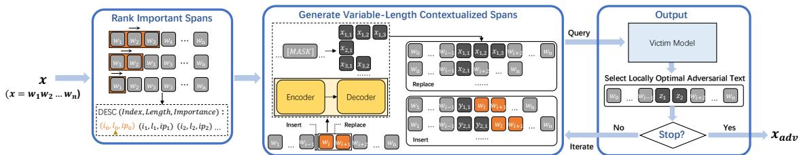
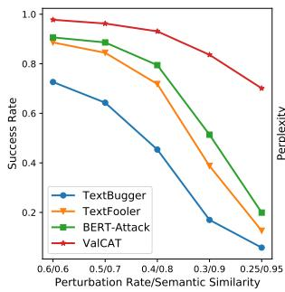
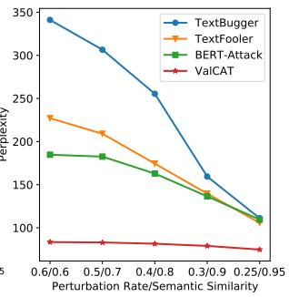
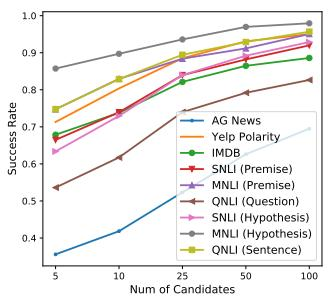
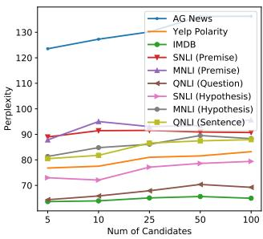

# ValCAT: Variable-Length Contextualized Adversarial Transformations Using Encoder-Decoder Language Model

Chuyun Deng1, Mingxuan Liu1, Yue Qin2, Jia Zhang1,3∗, Haixin Duan1,3, Donghong Sun1,3

1Tsinghua University, 2Indiana University

3Beijing National Research Center for Information Science and Technology {dengcy20, liumx18}@mails.tsinghua.edu.cn, qinyue@iu.edu, zhangjia@cernet.edu.cn {duanhx, sundonghong}@tsinghua.edu.cn

## Abstract

Adversarial texts help explore vulnerabilities in language models, improve model robustness, and explain their working mechanisms. However, existing word-level attack methods trap in a one-to-one attack pattern, i.e., only a single word can be modified in one transformation round, and they ignore the interactions between several consecutive words. In this paper, we propose ValCAT, a black-box attack framework that misleads the language model by applying variable-length contextualized transformations to the original text. Compared to wordlevel methods, ValCAT expands the basic units of perturbation from single words to spans composed of multiple consecutive words, enhancing the perturbation capability. Experiments show that our method outperforms state-of-theart methods in terms of attack success rate, perplexity, and semantic similarity on several classification tasks and inference tasks. The comprehensive human evaluation demonstrates that ValCAT has a significant advantage in ensuring the fluency of the adversarial examples and achieves better semantic consistency. We release the code at https://github.com/ linerxliner/ValCAT.

## 1 Introduction

Deep learning is successfully applied in a variety of fields, while previous works have found that neural network models are vulnerable to well-constructed adversarial examples (Goodfellow et al., 2015; Kurakin et al., 2017). In general, adversarial examples are constructed by adding imperceptible perturbations to the benign inputs, which can mislead the victim model. And exploring adversarial examples is essential to improving the reliability and robustness of neural network models. Compared to the long-studied image domain, generating adversarial examples on texts is more difficult because texts are discrete, where small changes can alter the original

meaning and make it unnatural (Xu et al., 2020;   
Zhang et al., 2020).

<table><tr><td>AG News (Business)</td><td>Lucent milestone: A profit Lucent Tech- nologies yesterday posted higher fiscal fourth-quarter earnings, helping lift the telecommunications equipment maker to its first profitable year since 2000.</td></tr><tr><td>BERT-Attack (Sci/Tech)</td><td>Lucent node: A revenue Lucent tech yes- terday reported higher revenue fourth- quarter benefits, which lift the multime- dia equipment maker to its first business year year 2000.</td></tr><tr><td>ValCAT (Sci/Tech)</td><td>Lucent milestone: A profit Lucent [IT] Technologies [recently reported] higher fiscal fourth-quarter earnings, helping lift the telecommunications equipment maker to its first profitable year since 2000.</td></tr><tr><td>MNLI (Neutral)</td><td>Premise: He caught a grip on himself, fighting the fantasies of his mind, and took another breath of air. Hypothesis: The air tasted like molten metal - the taste of blood.</td></tr><tr><td rowspan="2">BERT-Attack (Contradiction) ValCAT (Contradiction)</td><td>Hypothesis: The air tasted through boil- ing armor - the taste of betrayal.</td></tr><tr><td>Hypothesis: The air tasted [nothing like air] - the taste of blood.</td></tr></table>

Table 1: Instances of adversarial examples. The first is the original text, followed by adversarial examples generated by ValCAT and BERT-Attack. Blue indicates replace operation, and orange indicates insert operation. For ValCAT, words in a bracket are a span perturbed as a whole in one transformation round. The decision results of the victim model are in parentheses.

Most of the sentence-level attack methods (Zhao et al., 2018; Han et al., 2020; Xu et al., 2021) generate adversarial examples by perturbing the latent representation of the text, and the text quality is thus relatively difficult to control. Word-level attack methods (Samanta and Mehta, 2017; Zhang et al., 2019) have received much attention in the recent past. Several previous works explore the perturbation based only on the properties of individual words, with the help of inflectional morphology (Tan et al., 2020), counter-fitting word vectors (Jin et al., 2020), sememe (Zang et al., 2020), etc. The encoder language models, like BERT, give us new insights of incorporating context information into the generation of adversarial candidates in transformation (Li et al., 2020; Garg and Ramakrishnan, 2020; Li et al., 2021). However, the basic units of perturbation in these works are still single words, which limits the scope of the perturbation and overlooks the interactions between words, as examples shown in Table 1. To address this issue, two research questions are raised: 1) How to take into account interactions between words in vulnerable position discovery? 2) How to perturb a vulnerable position with variable-length contextualized transformations?

  
Figure 1: Overview of ValCAT’s workflow.

We propose ValCAT, which generates highquality adversarial examples by applying variablelength contextualized transformations to the original text. Table 1 demonstrates some sample cases. Specifically, given a benign text, we enumerate all possible spans by traversing the text with sliding windows of different lengths to evaluate the importance of the spans. We utilize two operations, REPLACE and INSERT, to apply adversarial spans generated by the encoder-decoder language model to the text. The encoder can fill a mask token with a single word, while the decoder can predict a sequence after a prompt. Therefore, joint use of encoder and decoder enables ValCAT to generate variable-length contextualized spans at the arbitrary vulnerable position.

Furthermore, we evaluate ValCAT by attacking fine-tuned BERT on several classification tasks and inference tasks. Experiment results show that it outperforms other baseline methods in attack success rate, perplexity, and semantic similarity. In particular, we observe that the variable-length feature can significantly reduce perplexity, which is less than 50% compared to the best baseline. As for the efficiency, although the multi-word attack pattern perturbs more words than the one-to-one attack pattern in one transformation, it just requires fewer rounds toward success. In general results, it is in a tolerable perturbation rate, and ValCAT is even lower than baselines on some of the inference datasets. A comprehensive human evaluation further verifies that ValCAT has significant advantages in readability and semantic consistency. The main contributions of this paper are summarized as follows:

ValCAT is the first variable-length adversarial attack method against language models, i.e., extending the basic units of perturbation from single words to spans.

Our work proposes the Sliding Window for vulnerable-position discovery and the variablelength contextualized transformation which fully exploits the advantage of encoder-decoder language models.

Automatic evaluation and human evaluation demonstrate the excellent attack effectiveness of ValCAT and the superior quality of our generated adversarial examples.

## 2 ValCAT

To further improve the attack effectiveness and simultaneously improve the readability and semantic similarity of the adversarial examples, we propose ValCAT, which can generate high-quality adversarial text by applying variable-length contextualized transformations with the encoder-decoder language model.

Problem Formalization Given a victim model $F : X  Y$ and a text $x = w _ { 1 } w _ { 2 } . . . w _ { n - 1 } w _ { n }$ that can be correctly classified by F, the attack goal is to generate an adversarial text x˜, which can confuse the model prediction, i.e. $F ( { \tilde { x } } ) \neq F ( x )$ A consecutive word sequence with length l can be denoted as a span $s _ { i : i + l }$ . In the soft-label black-box setting, the attacker only has access to the logit output $P ( y | x )$ . The architecture, parameters, and configurations of F are unknown to the attacker.

To achieve human imperceptibility, the attacker should minimize textual perturbations and maintain semantic consistency.

ValCAT The attack workflow of ValCAT is illustrated in Figure 1. To locate the most-vulnerable positions for the perturbations in each iteration, Val-CAT first rank the spans in x according to their importance with sliding windows of length 1 to MAX, as lines 2-7 in Algorithm 1. Based on the sorted span ranking R, ValCAT uses the encoder-decoder language model to generate variable-length contextualized spans, as lines 8-13. Using two transformation operations in line 9, REPLACE and INSERT, we obtain a adversarial text candidate set T. If some of the candidates can mislead the victim model, ValCAT declares the one with the highest cosine similarity with the original text as the final successful result, as line 11. However, if no candidate successes at this iteration, we select the one with the highest negative impact to the victim model as the basic text for the next iteration, as line 13. Note that, if a span in the ranking R has been selected as the target span, the subsequent spans which are overlapped with it will be removed from the ranking to avoid multiple modifications on one word. The attack ends when the successful example appears, or when the limit of the perturbation constraints (See Section 3.1) reached. The latter case is considered a final failure. Below we elaborate on the two stages of the attack in Section 2.1 and Section 2.2 in detail.

## 2.1 Important Span Ranking

Echoing the observation to prior works (Jin et al., 2020; Li et al., 2020), only some key words act as vulnerable positions for the victim model F. Perturbations over these words can be most beneficial in crafting adversarial examples. Considering the interactions between words, ValCAT performs transformations on several important spans instead of single words.

Given a text x, we evaluate the importance of a span s within x according to how removing the span can impact the model prediction in the blackbox setting. Formally, we define the decision difference of x and x˜ on the class y as:

$$
D _ { y } ( x , \tilde { x } ) = \left\{ \begin{array} { r l } { d _ { y } ( x , \tilde { x } ) , } & { i f \quad y = \tilde { y } } \\ { d _ { y } ( x , \tilde { x } ) + d _ { \tilde { y } } ( \tilde { x } , x ) , } & { i f \quad y \ne \tilde { y } } \end{array} \right.
$$

where $y$ and $\tilde { y }$ are the predictions of x and ${ \tilde { x } } ,$ respectively, and $d _ { y } ( x , \tilde { x } ) = P ( y | x ) - P ( y | \tilde { x } )$ is the difference of the probabilities that x and x˜ are classified as y. Let $\tilde { x } _ { s }$ denote the text of replacing span s by a unknown token [unk]. The importance score of s with respect to x is $I P _ { x } ( s ) = D _ { y } ( x , \tilde { x } _ { s } )$

To compare spans of different lengths, we propose the Sliding Windows to measure the importance of variable-length spans. Specifically, we apply multiple sliding windows of the corresponding sizes, which traverse the text from left to right. Each span bounded by a sliding window is sequentially removed from the original text for its importance calculation. Finally, we obtain a set of triples each consisting of the start index, the span length, and the importance score of the span. We rank the triples according to the importance score in descending order.

Algorithm 1: VALCAT   
Input: Victim Model F; Text x; Label y;   
Maximum length of sliding window   
MAX   
Output: Adversarial example   
1 R ; t x   
2 for l = 1 to MAX do   
3 for i = 1 to LEN(x) l + 1 do   
4 s ← xi,...,i+l 1   
5 ip  IPx(s)   
6 R R i, l, ip   
7 Sort R according to the importance score in   
descending order   
8 for (i, l, \_) in R do   
9 T  REPLACE(t, i, l)  INSERT(t, i)   
10 if x˜  T s. t. F(˜x) = y then   
11 return argmax SIMILAR(x, x˜)   
x˜ T,F(˜x)=y   
12 else   
13 t ← arg max Dy(x, x˜)   
x˜ T   
14 return NULL

## 2.2 Variable-Length Contextualized Transformations

Based on the ranking of triples, ValCAT performs perturbations in a sequential manner, where each step a vulnerable position in the original text is replaced by or inserted with a set of adversarial spans generated by the encoder-decoder language model. The variable-length feature of the adversarial spans renders the language model enough space to produce more contextually appropriate candidates to improve fluency. Meanwhile, our variablelength method expands the perturbation units, for it supports multi-word transformations while is compatible with traditional one-to-one transformations. Compared with previous methods, this further improves the attack success rate under the same perturbation constraints. Below we elaborate on the details of the adversarial span generation.

Adversarial Span Generation To generate adversarial candidates of each target span, ValCAT applies the encoder-decoder language model to fill the mask token with a set of spans of varying lengths. First, the encoder language model owns the capability of predicting the masked tokens, which is trained with the masked language modeling (MLM) objective. However, the encoder fills one mask token with only one suitable word rather than multiple words. The ability of the decoder could fill the gap of the single word since the decoder is trained with a causal language modeling (CLM) which can predict the sequence after a prompt. But, the decoder can only generate sequences at the end of the text. Hence, ValCAT combined these two models with their complementary advantages, with the predictive capability at arbitrary positions of encoder and variable-length generation of a decoder. With the candidate adversarial spans for target span, ValCAT performs two kinds of transformation operations, REPLACE and INSERT, to generate the adversarial examples for consideration.

Replace The REPLACE operation substitutes the target span $s _ { i : i + l } = w _ { i } . . . w _ { i + l - 1 }$ with another span s. For example, the target span “awesome” in the text “This place is awesome.” could be replaced by the adversarial span “pretty good”. Specifically, we first replace a mask token [mask] to $s _ { i : i + l } :$

$$
\tilde { x } ^ { [ i : i + l ] } = w _ { 1 } . . . w _ { i - 1 } [ \mathrm { m a s k } ] w _ { i + l } . . . w _ { n } ,
$$

and generate a set of contextualized spans of varying length, , to fill the mask token. The adversarial example is denoted as:

$$
\tilde { x } _ { s } ^ { [ i : i + l ] } = w _ { 1 } . . . w _ { i - 1 } s w _ { i + l } . . . w _ { n } ,
$$

where $s \in { \mathcal { S } }$ is a adversarial span.

Since the language model is blind to the information of the target span, some of the generated adversarial spans may deviate from the original meaning to a large extent. To avoid this situation, we only leave the adversarial spans with a high degree of semantic similarity to the original span.

Specifically, we use Universal Sentence Encoder (Cer et al., 2018) to restrict their cosine similarity. We also impose a limit on the perturbation rate (See Section 3.1). To prevent the text from being too long, we constrain the adversarial spans to be at most two words longer than the target span.

Insert The INSERT operation inserts a new span s in front of the target span $s _ { i : i + l }$ . For example, “I like this quite interesting movie.”. Similar to the REPLACE operation, it inserts a mask token in front of the target span:

$$
\tilde { x } ^ { i } = w _ { 1 } . . . w _ { i - 1 } [ \mathrm { m a s k } ] [ w _ { i } . . . w _ { i + l - 1 } ] w _ { i + l } . . . w _ { n } ,
$$

and corresponds with the adversarial text $\tilde { x } _ { s } ^ { i } =$ $w _ { 1 } . . . w _ { i - 1 } \textit { s } w _ { i } . . . w _ { n }$ . This operation also follows the same perturbation constraints, mentioned in Section 3.1.

## 3 Experiments

In this section, we evaluate ValCAT on two NLP tasks, text classification and natural language inference. To demonstrate the effectiveness of ValCAT in terms of fluency, grammaticality, and semantic consistency, following Li et al. 2021, we design and conduct a comprehensive human evaluation.

## 3.1 Implementation

Victim Model In this work, we choose fine-tuned BERT as the victim model for the all evaluation tasks. As BERT has achieved good results on a variety of NLU tasks and has been proven to be one of the most representative pre-trained transformers (Devlin et al., 2019).

Span Generation Model To obtain variablelength contextualized spans, we choose T5 (Raffel et al., 2020) as the generation model. T5 is a representative encoder-decoder language model that can predict the missing spans within a corrupted piece of text, benefiting from the fill-in-the-blank pre-training. Also, the large corpus C4 renders T5 rich prior knowledge to enable the diversity and the high quality of the generated spans.

Constraints To achieve human imperceptibility and semantic preservation of the adversarial example, we impose constraints on the word perturbation rate and semantic similarity, as defined in Section 3.3. Following previous practices (Jin et al., 2020; Li et al., 2021), we set the thresholds of these constraints respectively for each dataset, with details shown in Appendix A.

<table><tr><td>Dataset</td><td>Algorithm</td><td>Orig Acc</td><td>Atk Acc↓</td><td>Suc↑</td><td>PPL↓</td><td>Sim↑</td><td>Pert↓</td><td>GErr↓</td></tr><tr><td rowspan="4">AG News (PPL=98.4)</td><td>ValCAT</td><td rowspan="4">94.4</td><td>35.3</td><td>62.6</td><td>136.2</td><td>0.922</td><td>16.1</td><td>0.39</td></tr><tr><td>BERT-Attack</td><td>47.5</td><td>49.7</td><td>326.9</td><td>0.873</td><td>17.3</td><td>1.12</td></tr><tr><td>TextFooler</td><td>44.8</td><td>52.5</td><td>418.6</td><td>0.883</td><td>15.7</td><td>1.37</td></tr><tr><td>TextBugger</td><td>62.0</td><td>34.3</td><td>500.7</td><td>0.886</td><td>19.7</td><td>2.78</td></tr><tr><td rowspan="4">Yelp Polarity (PPL=71.1)</td><td>ValCAT</td><td rowspan="4">98.3</td><td>6.8</td><td>93.1</td><td>81.6</td><td>0.950</td><td>11.6</td><td>0.11</td></tr><tr><td>BERT-Attack</td><td>20.2</td><td>79.5</td><td>162.9</td><td>0.881</td><td>14.1</td><td>0.15</td></tr><tr><td>TextFooler</td><td>27.7</td><td>71.8</td><td>174.5</td><td>0.890</td><td>11.2</td><td>0.33</td></tr><tr><td>TextBugger</td><td>53.7</td><td>45.4</td><td>255.4</td><td>0.876</td><td>16.1</td><td>2.17</td></tr><tr><td rowspan="4">IMDB (PPL=58.8)</td><td>ValCAT</td><td rowspan="4">94.6</td><td>12.8</td><td>86.5</td><td>65.6</td><td>0.977</td><td>6.7</td><td>0.09</td></tr><tr><td>BERT-Attack</td><td>18.3</td><td>80.7</td><td>98.0</td><td>0.950</td><td>7.8</td><td>0.08</td></tr><tr><td>TextFooler</td><td>30.2</td><td>68.1</td><td>95.6</td><td>0.956</td><td>5.9</td><td>0.24</td></tr><tr><td>TextBugger</td><td>55.9</td><td>40.9</td><td>123.2</td><td>0.952</td><td>8.7</td><td>1.49</td></tr><tr><td rowspan="4">SNLI (PPL=68.0)</td><td>ValCAT</td><td rowspan="4">89.8</td><td>10.6/9.7</td><td>88.2/89.2</td><td>90.9/78.6</td><td>0.854/0.840</td><td>21.3/22.9</td><td>0.22/0.15</td></tr><tr><td>BERT-Attack</td><td>34.8/20.5</td><td>61.2/77.2</td><td>184.5/116.9</td><td>0.734/0.741</td><td>24.8/19.3</td><td>0.31/0.09</td></tr><tr><td>TextFooler</td><td>41.7/23.3</td><td>53.6/74.0</td><td>235.9/146.8</td><td>0.734/0.745</td><td>24.4/19.4</td><td>0.64/0.22</td></tr><tr><td>TextBugger</td><td>55.5/34.9</td><td>38.2/61.1</td><td>374.0/190.9</td><td>0.728/0.754</td><td></td><td>1.80/0.69</td></tr><tr><td rowspan="4">MNLI (PPL=79.5)</td><td>ValCAT</td><td rowspan="4">82.7</td><td>7.3/2.5</td><td>91.2/97.0</td><td>93.5/89.5</td><td>0.879/0.869</td><td>31.0/25.1 18.5/20.4</td><td>0.19/0.15</td></tr><tr><td>BERT-Attack</td><td>22.4/17.7</td><td>72.9/78.6</td><td>172.9/146.9</td><td>0.754/0.764</td><td>22.6/18.9</td><td>0.09/0.12</td></tr><tr><td>TextFooler</td><td>28.9/21.4</td><td>65.1/74.1</td><td>228.1/183.4</td><td>0.754/0.770</td><td>22.1/18.2</td><td>0.63/0.38</td></tr><tr><td>TextBugger</td><td></td><td></td><td></td><td></td><td></td><td></td></tr><tr><td rowspan="4">QNLI (PPL=66.1)</td><td>ValCAT</td><td rowspan="4">90.0</td><td>41.1/34.7 18.7/6.4</td><td>50.3/58.0</td><td>317.6/218.2</td><td>0.744/0.771</td><td>27.3/22.4</td><td>1.98/1.05</td></tr><tr><td>BERT-Attack</td><td>32.5/24.7</td><td>79.2/92.9 63.8/72.6</td><td>70.4/87.5 101.2/215.5</td><td>0.828/0.892 0.734/0.744</td><td>27.8/18.4 24.2/26.5</td><td>0.13/0.18 0.31/0.63</td></tr><tr><td>TextFooler</td><td>41.0/34.3</td><td>54.4/61.9</td><td>120.3/252.0</td><td>0.757/0.754</td><td>20.7/24.0</td><td>0.51/1.11</td></tr><tr><td>TextBugger</td><td>50.4/44.1</td><td>43.9/51.0</td><td>152.6/388.8</td><td>0.753/0.744</td><td>27.4/31.8</td><td>1.25/3.02</td></tr></table>

Table 2: Effectiveness of ValCAT in attack success rate (Suc), perplexity (PPL), semantic similarity (Sim), word perturbation rate (Pert), and grammar error (GErr). Bold font indicates the best performance for each metric. ( ) represents that the higher (lower) the better. The original PPL for each dataset is indicated in parentheses under its name. For the natural language inference task, the left side of the slash indicates the result of attacking premise (question) and the right side indicates the result of attacking hypothesis (sentence).

Settings and Computation Cost All results are derived from a single run since there is no randomness in our method. The maximum length of the sliding window is set as 3. In our implementation, we apply SpaCy (Honnibal and Montani, 2017) and NLTK (Loper and Bird, 2002) for text manipulation. We run ValCAT on Intel Xeon E5-2690 2.6GHz Processor with V100 GPU. Averagely it takes 34 secs to generate a successful adversarial example.

## 3.2 Datasets and Baselines

To investigate the effectiveness of ValCAT on different types of text, we evaluate it on several English datasets. We randomly sample 1000 instances from each of the following datasets: three for text classification, i.e., AG News, Yelp Polarity, and IMDB; and three for natural language inference, i.e., SNLI, MNLI, and QNLI, with detailed information shown in Appendix B. We compare ValCAT with several state-of-the-art word-level attack methods, i.e., TextBugger, TextFooler, and BERT-Attack. Details of these methods are shown in Appendix C. Note that, all the datasets and baselines are publicly available and are used following their usage specifications.

## 3.3 Automatic Evaluation

Metrics We evaluate the effectiveness of ValCAT based on the following metrics:

Attack success rate (Suc): is the percentage of adversarial examples successfully interfered with the victim model’s prediction over the text dataset. Perplexity (PPL): is an automatic metric to evaluate the probability of a text appearing in a natural corpus. So PPL can reflect the text’s natural fluency, the lower the better. We use GPT-2 (Radford et al., 2019) for this calculation.

Semantic similarity (Sim): is the cosine similarity between the original text and adversarial text calculated by Universal Sentence Encoder (USE) embeddings (Cer et al., 2018).

Word perturbation rate (Pert): is the proportion of the modified words over the original text. To evaluate the perturbation rate on variable-length perturbations more accurately, we design separate calculations for these two transformation operations. For the REPLACE operation, the number of modifications is max $( l _ { t } , l _ { a } ) - l _ { L C S }$ , where $l _ { t } .$ $l _ { a } .$ , and $l _ { L C S }$ are the lengths of the target span, the adversarial span, and their longest-commonsubsequence (LCS), respectively. For the INSERT operation, the number of modifications is the length of the inserted span.

Grammar error (GErr): is the incremental number of grammatical errors of the adversarial example relative to the original text. We use Language-Tool 1 to count the grammatical errors within a text.

  
Figure 2: Success rate and perplexity of each attack method under the different constraints of word perturbation rate and semantic similarity.

Results The main experimental results are revealed in Table 2. ValCAT outperforms baselines on multiple datasets in both classification tasks and inference tasks. Compared with BERT-Attack, the best baseline method, ValCAT achieves higher attack success rates in all experiments, and the improvement range from 5.8% even to 27.0%. This is attributed to ValCAT’s ability to apply variablelength contextualized transformations on spans at any position, which largely enriches the pattern of perturbations. In addition, ValCAT achieves the highest semantic similarity with the original text in all tasks. The perplexity of the adversarial example generated by ValCAT is far superior to that of the baselines. It is roughly only 50% of the perplexity of BERT-Attack and is almost consistent with the original text. This indicates that the adversarial example generated by ValCAT is with high fluency. The underlying reason is that multi-word transformations render the language model enough space to generate the adversarial spans with approximated distribution with natural language. At the same time, ValCAT reaches the lowest average increase in the number of grammatical errors on five out of nine attacks, with only a slight disadvantage on the natural language inference tasks.

In general, ValCAT generates adversarial examples that achieve more promising attacks and are more imperceptible to humans. Figure 2 shows the performance of ValCAT and baselines on the Yelp dataset under different constraint settings. As we can see, the success rate of ValCAT decays most slowly as the limits of perturbation rate and semantic similarity increase, still achieving a success rate of almost 70% under the strictest constraint. Moreover, ValCAT can maintain a low perplexity under any constraint, however, other attack methods have to sacrifice attack effect to maintain their fluency.

## 3.4 Human Evaluation

Design We evaluate the quality of the adversarial examples from three perspectives: readability (fluency and grammaticality), semantic similarity, and label consistency. The first two metrics are evaluated by ratings, while the third one lets the annotator categorize the texts into a set of labels. Five annotators with CET-4 certification performed the evaluation on AG News dataset. All annotators were informed and consented to the use of the annotation, and were paid with remuneration higher than the regional average. To construct the instances for human evaluation, we randomly select 100 samples from the dataset, whose adversarial examples generated by both ValCAT and BERT-Attack can mislead the victim model to make the same wrong classification decision among multiple classes. For the evaluation of fluency and grammaticality, each original text and its two adversarial examples are presented in one group in a shuffled order and the annotators are asked to rate them. For the evaluation of semantic similarity, given the original text, the judges need to separately evaluate its semantic similarity with the two adversarial examples presented in random order. The above two tasks ask the annotators to rate the text or the text pair from 1 to 5. In each questionnaire, we give explicit criteria and clear examples for each grade. For the evaluation of label consistency, we mix all the original texts with the adversarial examples and let the annotators label the category of them, e.g., business or technology.

<table><tr><td>Dataset</td><td>Metric</td><td>ValCAT</td><td>Original</td><td>BERT-Attack</td></tr><tr><td rowspan="3">AG News</td><td>F&amp;G</td><td>3.37</td><td>3.97</td><td>2.98</td></tr><tr><td>Sim</td><td>3.92</td><td></td><td>3.41</td></tr><tr><td>Acc</td><td>63.0</td><td>65.0</td><td>62.0</td></tr></table>

Table 3: Results of human evaluation in readability (fluency and grammaticality), semantic similarity, and label consistency (accuracy).

Results For the two rating tasks, we normalize the rates of the annotators and calculate the average score, while for the labeling task we take the majority vote as the final result. As shown in Table 3, ValCAT is rated with much higher fluency and grammaticality scores than BERT-Attack. Also, it achieves obviously higher semantic similarity. In terms of labeling accuracy, ValCAT slightly outperforms BERT-Attack, still indicating that ValCAT makes smaller changes to the meanings of the text from the aspect of human perception. All these results demonstrate the superior quality of the adversarial examples generated by ValCAT.

## 4 Analysis

## 4.1 Ablation Study

We evaluate different transformation strategies of ValCAT as in Table 4. 3-Many results in the lowest perplexity, as it renders the language model more space to generate an appropriate span. It also requires the smallest number of queries, and we speculate the reason as it perturbs more words in a single transformation. For the same reason, 3-Many is less likely to succeed since it’s easier to reach the perturbation constraint. As expected, the combination of multiple types of REPLACE operations facilitates the attack success rate while increasing the number of queries. The INSERT operation achieves high semantic similarity while requiring a large number of queries. A comprehensive utility of all operations (i.e., ValCAT) achieves the highest success rate with the lowest perturbation rate, which fully demonstrates the advantages of the transformation diversity.

<table><tr><td>Algorithm</td><td>Suc↑</td><td>PPL↓</td><td>Sim↑</td><td>Pert↓</td><td>Query↓</td></tr><tr><td>ValCAT</td><td>93.1</td><td>81.6</td><td>0.950</td><td>11.6</td><td>673</td></tr><tr><td>1, 2, 3-Many</td><td>90.8</td><td>81.1</td><td>0.938</td><td>13.4</td><td>490</td></tr><tr><td>1, 2-Many</td><td>91.7</td><td>82.6</td><td>0.939</td><td>12.6</td><td>431</td></tr><tr><td>1-Many</td><td>87.9</td><td>84.4</td><td>0.933</td><td>12.0</td><td>340</td></tr><tr><td>2-Many</td><td>86.1</td><td>81.5</td><td>0.941</td><td>13.3</td><td>325</td></tr><tr><td>3-Many</td><td>80.7</td><td>77.1</td><td>0.938</td><td>16.0</td><td>266</td></tr><tr><td>Insert</td><td>86.4</td><td>86.9</td><td>0.953</td><td>14.4</td><td>799</td></tr><tr><td>BERT-Attack</td><td>79.5</td><td>162.8</td><td>0.881</td><td>14.1</td><td>449</td></tr></table>

Table 4: Results of ablation study. n-Many is a type of REPLACE operation, which means that a span of length n is replaced by an adversarial span.

## 4.2 Impact of Candidate Numbers

From the results under different numbers of candidate spans shown in Figure 3, we observe that the attack success rate is higher when there are more candidates. Since we greedily select the adversarial span with the greatest impact on the decision of the victim model, as the number of candidates increases, spans with low occurrence probability can be added to the text, making the perplexity higher. This is especially true for difficult-to-attack datasets like AG News.

  
Figure 3: Success rate and perplexity of each dataset under different candidate numbers.

## 4.3 Properties of Transformations

We observe the properties of the transformations in the successful adversarial examples from three perspectives: type of operation, length of span, and POS (part-of-speech) of span. Averagely, 62% of the transformations in each example are REPLACE operations, and 38% are INSERT operations, indicating that REPLACE operations are more effective in most cases. As shown in Table 10, the replaced spans are most likely the longer ones, while the adversarial spans being applied are relatively short. Additionally, Table 11 shows that the adversarial spans of REPLACE operation share identical POS distribution with the replaced spans, which guarantees the fluency of the adversarial example. The INSERT operation tends to use adverbs and adjectives, which is consistent with the human intuition of inserting words into text.

## 4.4 Adversarial Training

We investigate how adversarial training can mitigate the adversarial attack, that is, the power of our adversarial examples for adversarial training as a general defense. We randomly sample 10,000 instances from the Yelp training dataset and apply ValCAT to generate adversarial examples. These adversarial examples and their intermediate results, approximately 60,000 texts, are then used to finetune the attacked BERT under the gold labels. After adversarial training, the accuracy of the victim model on the test dataset slightly decreases from 98.3% to 98.0%, which means that adversarial training does not affect the performance of the model on clean data. As shown in Table 5, the attack success rate of ValCAT drops by about 20%, while both the perturbation rate and the number of queries have significantly increased, indicating that the victim model is harder to attack after the adversarial training.

<table><tr><td>Algorithm Victim</td><td></td><td>Atk Acc↓</td><td>Suc↑</td><td>Pert↓</td><td>Query↓</td></tr><tr><td rowspan="2">ValCAT</td><td>Original</td><td>6.8</td><td>93.1</td><td>11.6</td><td>673.3</td></tr><tr><td>Adv Train</td><td>27.0</td><td>72.4</td><td>14.0</td><td>884.2</td></tr></table>

Table 5: Adversarial training results.

## 4.5 Generalization

We evaluate the generalization of ValCAT in two aspects: 1) attack on other victim models and 2) transferability.

<table><tr><td>Victim</td><td colspan="5">Orig Acc Atk Acc↓ Suc↑ PPL↓ Sim↑ Pert↓</td></tr><tr><td>BERT</td><td>98.3</td><td>6.8</td><td>93.1 81.6</td><td>0.950</td><td>11.6</td></tr><tr><td>RoBERTa</td><td>99.1</td><td>13.3</td><td>86.6</td><td>81.2</td><td>0.952 11.7</td></tr><tr><td>LSTM</td><td>95.3</td><td>0.7</td><td>99.3</td><td>78.5 0.961</td><td>9.2</td></tr><tr><td>wordCNN</td><td>95.4</td><td>1.1</td><td>98.8</td><td>78.9</td><td>0.957 10.0</td></tr></table>

Table 6: Results of ValCAT attacking RoBERTa, LSTM, and wordCNN.

Attack on Other Victim Models We try to attack other common language models on the Yelp dataset using ValCAT. Table 6 shows that LSTM and word-CNN, two traditional NLP models, are extremely vulnerable to ValCAT with an attack success rate of around 99%. Interestingly, RoBERTa shows better robustness, with a 6.5% decrease in attack success rate relative to BERT, which we speculate is due to its more optimized pre-training approach.

Transferability We evaluate the transferability of generated adversarial examples on the Yelp dataset. Specifically, we utilize successful adversarial examples generated by ValCAT targeting different victim models to attack other tested models. Results in Table 7 show that adversarial examples aimed at transformer models (BERT and RoBERTa) are more effective in attacking traditional NLP models (LSTM and wordCNN) than the opposite case.

<table><tr><td></td><td>BERT</td><td>RoBERTa</td><td>LSTM</td><td>wordCNN</td></tr><tr><td>BERT</td><td>-</td><td>73.4</td><td>73.9</td><td>76.1</td></tr><tr><td>RoBERTa</td><td>68.9</td><td>1</td><td>72.8</td><td>74.2</td></tr><tr><td>LSTM</td><td>84.3</td><td>88.8</td><td></td><td>71.8</td></tr><tr><td>wordCNN</td><td>83.4</td><td>87.3</td><td>60.5</td><td>-</td></tr></table>

Table 7: Attacked accuracy used in the transferability analysis. Rows are target models used in generating adversarial examples, and columns are tested models applied the examples.

## 4.6 Limitation

ValCAT makes the best effort to improve the effectiveness of the attack, including the Sliding Window with a variable-length mechanism to discover vulnerable positions and multiple types of transformation operations. However, all these efforts result in a larger number of queries to the victim model, compared to existing word-level attack methods. According to the results of the automatic evaluation and human evaluation, such an increase in the computation expense is tolerable, considering the significant improvement in attack success rate and adversarial example quality. Furthermore, a simplified version of ValCAT, 1-Many (See Table 4), outperforms the best baseline method in all aspects, including the number of queries.

Further, the encoder-decoder language models targeting the fill-in-the-blank-style denoising objectives cannot see the masked original spans during the training and inference. This limitation of encoder-decoder leaves improvement space of semantic similarity for ValCAT, i.e., establishing a direct semantic mapping between the generated span and the original span themselves in each transformation. We leave finding better ways of training to compensate for the invisibility of encoder-decoder as our future work.

## 5 Related Work

Textual adversarial attacks have been intensively studied (Wang et al., 2019; Zhang et al., 2020). Early on, the character-level attack methods (Ebrahimi et al., 2018; Gao et al., 2018; Li et al., 2019) are widely used, but they would destroy words and are very perceptible (Pruthi et al., 2019). Word-level attack methods are now in the spotlight, evolving from substitution based only on the properties of individual words themselves (Zang et al., 2020; Jin et al., 2020; Tan et al., 2020) to perturbing words by multiple strategies with knowledge of the context (Li et al., 2020; Garg and Ramakrishnan, 2020; Li et al., 2021). Although these existing works may enrich the transformation form with various operations like insertion, deletion, merging, etc., they still treat single words as basic units of each transformation. Some sentence-level works (Wang et al., 2020a; Wang et al., 2020b; Huang and Chang, 2021) generate adversarial examples by perturbing the latent representation of the original text, but they are slightly worse at controlling the text quality. Our work introduces the Sliding Window to rank important spans and generates variable-length contextualized spans by the encoder-decoder language model, enabling more effective adversarial attacks and higher-quality adversarial examples.

## 6 Conclusion

In this paper, we propose ValCAT, the first variablelength contextualized adversarial attack based on the encoder-decoder language model. ValCAT considers the interaction between words for the vulnerable-position discovery and expands the basic units of perturbation from single words to spans. Experimental results on several datasets demonstrate the effectiveness of our methods, which outperforms baselines in terms of attack success rate, perplexity, and semantic similarity. Our adversarial examples also have good transferability and help to improve robustness. A comprehensive human evaluation further verifies the high quality of the adversarial examples generated by ValCAT.

## Acknowledgements

This work is supported in part by National Natural Science Foundation of China (Grant

No. U1836213, U19B2034), National Key R&D Plan (Grant No. 2018YFB2101501), Industrial Internet Innovation and Development Project (Grant No. TC200H02X, TC200H02Y), and the Huawei Technologies Co., Ltd under Grant No. TC20200917004.

## References

Samuel R. Bowman, Gabor Angeli, Christopher Potts, and Christopher D. Manning. 2015. A large annotated corpus for learning natural language inference. In Proceedings of the 2015 Conference on Empirical Methods in Natural Language Processing, pages 632–642, Lisbon, Portugal. Association for Computational Linguistics.

Daniel Cer, Yinfei Yang, Sheng-yi Kong, Nan Hua, Nicole Limtiaco, Rhomni St. John, Noah Constant, Mario Guajardo-Cespedes, Steve Yuan, Chris Tar, Yun-Hsuan Sung, Brian Strope, and Ray Kurzweil. 2018. Universal sentence encoder. CoRR, abs/1803.11175.

Jacob Devlin, Ming-Wei Chang, Kenton Lee, and Kristina Toutanova. 2019. BERT: Pre-training of deep bidirectional transformers for language understanding. In Proceedings ofthe 2019 Conference of the North American Chapter ofthe Associationfor Computational Linguistics: Human Language Technologies, Volume 1 (Long and Short Papers), pages 4171–4186, Minneapolis, Minnesota. Association for Computational Linguistics.

Javid Ebrahimi, Anyi Rao, Daniel Lowd, and Dejing Dou. 2018. HotFlip: White-box adversarial examples for text classification. In Proceedings of the 56th Annual Meeting of the Association for Computational Linguistics (Volume 2: Short Papers), pages 31–36, Melbourne, Australia. Association for Computational Linguistics.

Ji Gao, Jack Lanchantin, Mary Lou Soffa, and Yanjun Qi. 2018. Black-box generation of adversarial text sequences to evade deep learning classifiers. In 2018 IEEE Security and Privacy Workshops, SP Workshops 2018, San Francisco, CA, USA, May 24, 2018, pages 50–56. IEEE Computer Society.

Siddhant Garg and Goutham Ramakrishnan. 2020. BAE: BERT-based adversarial examples for text classification. In Proceedings ofthe 2020 Conference on Empirical Methods in Natural Language Processing (EMNLP), pages 6174–6181, Online. Association for Computational Linguistics.

Ian J. Goodfellow, Jonathon Shlens, and Christian Szegedy. 2015. Explaining and harnessing adversarial examples. In 3rd International Conference on Learning Representations, ICLR 2015, San Diego, CA, USA, May 7-9, 2015, Conference Track Proceedings.

Wenjuan Han, Liwen Zhang, Yong Jiang, and Kewei Tu. 2020. Adversarial attack and defense of structured prediction models. In Proceedings ofthe 2020 Conference on Empirical Methods in Natural Language Processing (EMNLP), pages 2327–2338, Online. Association for Computational Linguistics.

Matthew Honnibal and Ines Montani. 2017. spaCy 2: Natural language understanding with Bloom embeddings, convolutional neural networks and incremental parsing. To appear.

Kuan-Hao Huang and Kai-Wei Chang. 2021. Generating syntactically controlled paraphrases without using annotated parallel pairs. In Proceedings ofthe 16th Conference of the European Chapter of the Associationfor Computational Linguistics: Main Volume, pages 1022–1033, Online. Association for Computational Linguistics.

Di Jin, Zhijing Jin, Joey Tianyi Zhou, and Peter Szolovits. 2020. Is BERT really robust? A strong baseline for natural language attack on text classification and entailment. In The Thirty-Fourth AAAI Conference on Artificial Intelligence, AAAI 2020, The Thirty-Second Innovative Applications ofArtificial Intelligence Conference, IAAI 2020, The Tenth AAAI Symposium on Educational Advances in Artificial Intelligence, EAAI 2020, New York, NY, USA, February 7-12, 2020, pages 8018–8025. AAAI Press.

Alexey Kurakin, Ian J. Goodfellow, and Samy Bengio. 2017. Adversarial examples in the physical world. In 5th International Conference on Learning Representations, ICLR 2017, Toulon, France, April 24-26, 2017, Workshop Track Proceedings. OpenReview.net.

Dianqi Li, Yizhe Zhang, Hao Peng, Liqun Chen, Chris Brockett, Ming-Ting Sun, and Bill Dolan. 2021. Contextualized perturbation for textual adversarial attack. In Proceedings ofthe 2021 Conference ofthe North American Chapter of the Association for Computational Linguistics: Human Language Technologies, pages 5053–5069, Online. Association for Computational Linguistics.

Jinfeng Li, Shouling Ji, Tianyu Du, Bo Li, and Ting Wang. 2019. Textbugger: Generating adversarial text against real-world applications. In 26th Annual Network and Distributed System Security Symposium, NDSS 2019, San Diego, California, USA, February 24-27, 2019. The Internet Society.

Linyang Li, Ruotian Ma, Qipeng Guo, Xiangyang Xue, and Xipeng Qiu. 2020. BERT-ATTACK: Adversarial attack against BERT using BERT. In Proceedings ofthe 2020 Conference on Empirical Methods in Natural Language Processing (EMNLP), pages 6193–6202, Online. Association for Computational Linguistics.

Edward Loper and Steven Bird. 2002. NLTK: the natural language toolkit. CoRR, cs.CL/0205028.

Andrew L. Maas, Raymond E. Daly, Peter T. Pham, Dan Huang, Andrew Y. Ng, and Christopher Potts. 2011. Learning word vectors for sentiment analysis. In Proceedings of the 49th Annual Meeting of the Associationfor Computational Linguistics: Human Language Technologies, pages 142–150, Portland, Oregon, USA. Association for Computational Linguistics.

Danish Pruthi, Bhuwan Dhingra, and Zachary C. Lipton. 2019. Combating adversarial misspellings with robust word recognition. In Proceedings of the 57th Annual Meeting ofthe Associationfor Computational Linguistics, pages 5582–5591, Florence, Italy. Association for Computational Linguistics.

Alec Radford, Jeffrey Wu, Rewon Child, David Luan, Dario Amodei, Ilya Sutskever, et al. 2019. Language models are unsupervised multitask learners. OpenAI blog, 1(8):9.

Colin Raffel, Noam Shazeer, Adam Roberts, Katherine Lee, Sharan Narang, Michael Matena, Yanqi Zhou, Wei Li, and Peter J. Liu. 2020. Exploring the limits of transfer learning with a unified text-to-text transformer. Journal ofMachine Learning Research, 21:140:1–140:67.

Suranjana Samanta and Sameep Mehta. 2017. Towards crafting text adversarial samples. CoRR, abs/1707.02812.

Samson Tan, Shafiq Joty, Min-Yen Kan, and Richard Socher. 2020. It’s morphin’ time! Combating linguistic discrimination with inflectional perturbations. In Proceedings ofthe 58th Annual Meeting ofthe Associationfor Computational Linguistics, pages 2920– 2935, Online. Association for Computational Linguistics.

Alex Wang, Amanpreet Singh, Julian Michael, Felix Hill, Omer Levy, and Samuel Bowman. 2018. GLUE: A multi-task benchmark and analysis platform for natural language understanding. In Proceedings of the 2018 EMNLP Workshop BlackboxNLP: Analyzing and Interpreting Neural Networks for NLP, pages 353–355, Brussels, Belgium. Association for Computational Linguistics.

Boxin Wang, Hengzhi Pei, Boyuan Pan, Qian Chen, Shuohang Wang, and Bo Li. 2020a. T3: Treeautoencoder constrained adversarial text generation for targeted attack. In Proceedings ofthe 2020 Conference on Empirical Methods in Natural Language Processing (EMNLP), pages 6134–6150, Online. Association for Computational Linguistics.

Tianlu Wang, Xuezhi Wang, Yao Qin, Ben Packer, Kang Li, Jilin Chen, Alex Beutel, and Ed Chi. 2020b. CATgen: Improving robustness in NLP models via controlled adversarial text generation. In Proceedings of the 2020 Conference on Empirical Methods in Natural Language Processing (EMNLP), pages 5141– 5146, Online. Association for Computational Linguistics.

Wenqi Wang, Run Wang, Lina Wang, Zhibo Wang, and Aoshuang Ye. 2019. Towards a robust deep neural network in texts: A survey. arXiv preprint arXiv:1902.07285.

Adina Williams, Nikita Nangia, and Samuel Bowman. 2018. A broad-coverage challenge corpus for sentence understanding through inference. In Proceedings of the 2018 Conference of the North American Chapter of the Association for Computational Linguistics: Human Language Technologies, Volume 1 (Long Papers), pages 1112–1122, New Orleans, Louisiana. Association for Computational Linguistics.

Han Xu, Yao Ma, Haochen Liu, Debayan Deb, Hui Liu, Jiliang Tang, and Anil K. Jain. 2020. Adversarial attacks and defenses in images, graphs and text: A review. Int. J. Autom. Comput., 17(2):151–178.

Ying Xu, Xu Zhong, Antonio Jimeno Yepes, and Jey Han Lau. 2021. Grey-box adversarial attack and defence for sentiment classification. In Proceedings ofthe 2021 Conference ofthe North American Chapter of the Association for Computational Linguistics: Human Language Technologies, pages 4078–4087, Online. Association for Computational Linguistics.

Yuan Zang, Fanchao Qi, Chenghao Yang, Zhiyuan Liu, Meng Zhang, Qun Liu, and Maosong Sun. 2020. Word-level textual adversarial attacking as combinatorial optimization. In Proceedings of the 58th Annual Meeting ofthe Associationfor Computational Linguistics, pages 6066–6080, Online. Association for Computational Linguistics.

Huangzhao Zhang, Hao Zhou, Ning Miao, and Lei Li. 2019. Generating fluent adversarial examples for natural languages. In Proceedings of the 57th Annual Meeting of the Association for Computational Linguistics, pages 5564–5569, Florence, Italy. Association for Computational Linguistics.

Wei Emma Zhang, Quan Z. Sheng, Ahoud Alhazmi, and Chenliang Li. 2020. Adversarial attacks on deeplearning models in natural language processing: A survey. ACM Transactions on Intelligent Systems and Technology (TIST), 11(3):24:1–24:41.

Xiang Zhang, Junbo Jake Zhao, and Yann LeCun. 2015. Character-level convolutional networks for text classification. In Advances in Neural Information Processing Systems 28: Annual Conference on Neural Information Processing Systems 2015, December 7-12, 2015, Montreal, Quebec, Canada, pages 649–657.

Zhengli Zhao, Dheeru Dua, and Sameer Singh. 2018. Generating natural adversarial examples. In 6th International Conference on Learning Representations, ICLR 2018, Vancouver, BC, Canada, April 30 - May 3, 2018, Conference Track Proceedings. OpenReview.net.

## A Constraints

We impose constraints on the generating adversarial examples in terms of perturbation rate and semantic similarity, as shown in Table 8.

<table><tr><td>Dataset</td><td>Perturbation Rate</td><td>Semantic Similarity</td></tr><tr><td>AG News</td><td>0.4</td><td>0.8</td></tr><tr><td>Yelp Polarity</td><td>0.4</td><td>0.8</td></tr><tr><td>IMDB</td><td>0.3</td><td>0.9</td></tr><tr><td>SNLI</td><td>0.6</td><td>0.6</td></tr><tr><td>MNLI</td><td>0.6</td><td>0.6</td></tr><tr><td>QNLI</td><td>0.6</td><td>0.6</td></tr></table>

Table 8: Specific values of constraints of the perturbation rate and semantic similarity were used in the main experiments.

## B Datasets

We employ three datasets for text classification and three datasets for natural language inference as described below. In our experiments, we randomly sample 1000 instances.

AG News: a collection of news articles categorized into 4 types: World, Sports, Business, and Sci/Tech (Zhang et al., 2015).

Yelp Polarity: positive and negative restaurant reviews collected from yelp (Zhang et al., 2015).

IMDB: a dataset of movie reviews for binary sentiment classification (Maas et al., 2011).

SNLI: a collection of human-written English sentence pairs (Bowman et al., 2015). Each sentence pair consists of a premise and a hypothesis, which is necessary to determine whether it is entailment, contradiction, or neutral.

MNLI: a similar dataset to SNLI (Williams et al., 2018), but from a variety of genres.

QNLI: a version of SQuAD which has been converted to a binary classification task (Wang et al., 2018).

## C Baselines

We compare ValCAT with state-of-the-art wordlevel attack methods:

TextBugger: an attack method compounded by five bug generation strategies (Li et al., 2019). Such strategies include character insertion, character deletion, character swapping, homograph character replacement, and synonym replacement.

TextFooler: classical adversarial attack algorithm based on synonym substitution (Jin et al., 2020).

Candidate synonyms are the closest neighbors of the replaced word in the counter-fitting word embedding space. It limits the cosine semantic similarity and makes the POS consistent.

BERT-Attack: a state-of-the-art contextualized attack method using BERT to fill mask tokens (Li et al., 2020). It serves as a representative of similar BERT-based algorithms, such as BAE (Garg and Ramakrishnan, 2020) and CLARE (Li et al., 2021).

## D Performance of Encoder-Decoder Models

We present the results of generating adversarial spans by several language models in the T5 family in Table 9. $T 5 _ { l a r g e }$ and $m T 5 _ { b a s e }$ take a longer time to generate adversarial spans due to their larger capacity. The higher perplexity of T5v1. $1 _ { b a s e }$ is, we conjecture, resulted from its specifically different structure. In short, $T 5 _ { b a s e }$ is good enough for adversarial span generation.

<table><tr><td>Algorithm</td><td>Suc↑ PPL↓</td><td>Sim↑ Pert↓</td><td>GErr↓</td><td>Time↓</td></tr><tr><td> $T 5 _ { b a s e }$ </td><td>93.1 81.6</td><td>0.950 11.6</td><td>0.11</td><td>0.052</td></tr><tr><td> $T 5 _ { l a r g e }$ </td><td>90.3 84.0</td><td>0.948 12.7</td><td>0.12</td><td>0.069</td></tr><tr><td> $T 5 v 1 . 1 _ { b a s e }$ </td><td>92.3 101.8</td><td>0.946 12.4</td><td>0.36</td><td>0.055</td></tr><tr><td> $m T 5 _ { b a s e }$ </td><td>94.2 84.6</td><td>0.949 12.3</td><td>0.06</td><td>0.070</td></tr></table>

Table 9: Performance of encoder-decoder language models belonging to the T5 family.

## E Properties of Transformations

We observe the properties of the transformations in the successful adversarial examples from three perspectives: type of transformation, length of span, and POS (part-of-speech) of span. Results are shown in Table 10 and Table 11.

<table><tr><td></td><td>1</td><td>2</td><td>3</td><td>4</td><td>5</td></tr><tr><td>Replaced Span</td><td>26.2%</td><td>35.8%</td><td>38.0%</td><td></td><td></td></tr><tr><td>Span for REPLACE</td><td>33.1%</td><td>35.0%</td><td>24.6%</td><td> $6 . 4 \%$ </td><td>0.9%</td></tr><tr><td>Span for INSERT</td><td>37.5%</td><td>35.3%</td><td>27.2%</td><td></td><td></td></tr></table>

Table 10: The proportion of various lengths in the spans of the corresponding type.

<table><tr><td>Replaced Span</td><td>Span for REPLACE</td><td>Span for INSERT</td></tr><tr><td>ADJ: 7.6%</td><td>ADJ: 8.4%</td><td>ADV: 12.4%</td></tr><tr><td>NOUN: 6.3%</td><td>VERB: 6.7%</td><td>ADJ: 6.7%</td></tr><tr><td>VERB: 5.0%</td><td>NOUN: 5.8%</td><td>NOUN: 2.2%</td></tr><tr><td>ADV: 3.8%</td><td>ADV: 5.5%</td><td>ADJ-NOUN-PUNCT: 1.9%</td></tr><tr><td>VERB-ADV: 2.3%</td><td>ADJ-PUNCT: 1.8%</td><td>VERB: 1.9%</td></tr><tr><td>AUX-ADV: 1.9%</td><td>ADV-ADJ: 1.7%</td><td>ADV-ADV: 1.6%</td></tr><tr><td>ADJ-PUNCT: 1.5%</td><td>AUX-ADV: 1.7%</td><td>ADJ-PUNCT: 1.5%</td></tr><tr><td>ADV-VERB: 1.5%</td><td>VERB-ADV: 1.5%</td><td>VERB-ADV: 1.4%</td></tr><tr><td>PRON-VERB: 1.4%</td><td>NOUN-PUNCT: 1.4%</td><td>PRON-VERB: 1.4%</td></tr><tr><td>ADV-ADJ: 1.3%</td><td>ADJ-NOUN: 1.4%</td><td>ADV-PUNCT: 1.2%</td></tr></table>

Table 11: The proportion of various POS in the spans of the corresponding type.