# WALNUT: A Benchmark on Semi-weakly Supervised Learning for Natural Language Understanding

Guoqing Zheng Microsoft Research zheng@microsoft.com

Kai Shu Illinois Institute of Technology kshu@iit.edu

Giannis Karamanolakis Columbia University gkaraman@cs.columbia.edu

## Abstract

Ahmed Hassan Awadallah Microsoft Research hassanam@microsoft.com

Building machine learning models for natural language understanding (NLU) tasks relies heavily on labeled data. Weak supervision has been proven valuable when large amount of labeled data is unavailable or expensive to obtain. Existing works studying weak supervision for NLU either mostly focus on a specific task or simulate weak supervision signals from ground-truth labels. It is thus hard to compare different approaches and evaluate the benefit of weak supervision without access to a uni fied and systematic benchmark with diverse tasks and real-world weak labeling rules. In this paper, we propose such a benchmark, named WALNUT1, to advocate and facilitate research on weak supervision for NLU. WALNUT consists of NLU tasks with different types, including document-level and token-level prediction tasks. WALNUT is the first semi-weakly supervised learning benchmark for NLU, where each task contains weak labels generated by multiple real-world weak sources, together with a small set of clean labels. We conduct baseline evaluations on WALNUT to systematically evaluate the effectiveness of various weak supervision methods and model architectures. Our results demonstrate the benefit of weak supervision for low-resource NLU tasks and highlight interesting patterns across tasks. We expect WALNUT to stimulate further research on methodologies to leverage weak supervision more effectively. The benchmark and code for baselines are available at aka.ms/walnut\_benchmark.

## 1 Introduction

To tackle natural language understanding (NLU) tasks via supervised learning, high-quality labeled examples are crucial. Recent advances on large pre-trained language models (Peters et al., 2018; Devlin et al., 2018; Radford et al., 2019) lead to impressive gains on NLU benchmarks, including

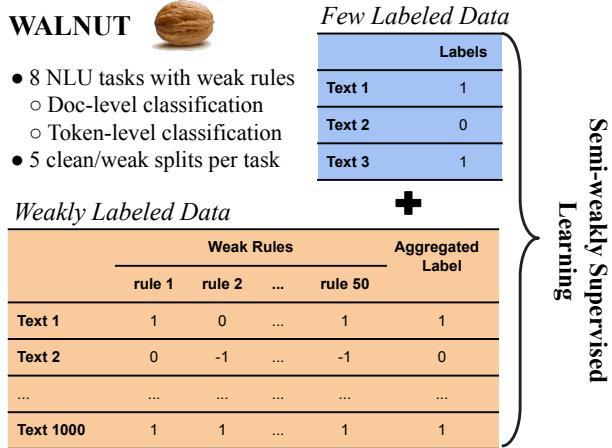  
Figure 1: WALNUT, a benchmark with 8 NLU tasks with real-world weak labeling rules. Each task in WALNUT comes with few labeled data and weakly labeled data for semi-weakly supervised learning.

GLUE (Wang et al., 2018) and SuperGLUE (Wang et al., 2019), at the assumption that large amount of labeled examples are available. For many realworld applications, however, it is expensive and time-consuming to manually obtain large-scale high-quality labels, while it is relatively easier to obtain auxiliary supervision signals, or weak supervision, as a viable source to boost model performance without expensive data annotation process.

Learning from weak supervision for NLU tasks is attracting increasing attention. Various types of weak supervision have been considered, such as knowledge bases (Mintz et al., 2009; Xu et al., 2013), keywords (Karamanolakis et al., 2019; Ren et al., 2020), regular expression patterns (Augenstein et al., 2016), and other metadata such as user interactions in social media (Shu et al., 2017). Also, inspired by recent advances from semi-supervised learning, semi-weakly supervised learning methods which leverage both a small set of clean labels and a larger set of weak supervision (Papandreou et al., 2015; Hendrycks et al., 2018; Shu et al., 2019; Mazzetto et al., 2021; Karamanolakis et al., 2021; Maheshwari et al., 2021; Zheng et al., 2021) are emerging to further boost task performance. However, a unified and systematic evaluation benchmark supporting both weakly and semiweakly supervised learning for NLU tasks is rather limited. On the one hand, many existing works only study specific NLU tasks with weak supervision, thus evaluations of proposed techniques leveraging weak supervision on a small set of tasks do not necessarily generalized onto other NLU tasks. On the other hand, some works rely on simulated weak supervision, such as weak labels corrupted from ground-truth labels (Hendrycks et al., 2018), while real-world weak supervision signals can be far more complex than simulated ones. Furthermore, existing weakly and semi-weakly supervised approaches are evaluated on different data with different metrics and weak supervision sources, making it difficult to understand and compare.

To better advocate and facilitate research on leveraging weak supervision for NLU, in this paper we propose WALNUT (Figure 1), a semi-weakly supervised learning benchmark of NLU tasks with real-world weak supervision signals. Following the tradition of existing benchmarks (e.g., GLUE), we propose to cover different types of NLU tasks and domains, including document-level classification tasks (e.g., sentiment analysis on online reviews, fake news detection on news articles), and token-level classification tasks (e.g., named entity recognition in news and biomedical documents). WALNUT provides few labeled and many weakly labeled examples (Figure 1) and encourages a consistent and robust evaluation of different techniques, as we will describe in Section 3.

In addition to the proposed benchmark, in Section 4.2 we shed light on the benefit of weak supervision for NLU tasks in a collective manner, by evaluating several representative weak and semiweak supervision methods for and several base models of various sizes (e.g., BiLSTM, BERT, RoBERTa), leading to more than 2,000 groups of experiments. Our large-scale analysis demonstrates that weak supervision is valuable for low-resource NLU tasks and that there is large room for performance improvement, thus motivating future research. Also, by computing the average performance across tasks and model architectures, we show surprising new findings. First, simple techniques for aggregating multiple weak labels (such as unweighted majority voting) achieve better performance than more complex weak supervision paradigms. Second, weak supervision has smaller benefit in larger base models such as RoBERTa, because larger pre-trained models can already achieve impressively high performance using just a few clean labeled data and no weakly labeled data at all. We identify several more challenges on leveraging weak supervision for NLU tasks and shed light on possible future work based on WALNUT.

The main contributions of this paper are: (1) We propose a new benchmark on semi-weakly supervised learning for NLU, which covers eight established annotated datasets and various text genres, dataset sizes, and degrees of task difficulty; (2) We conduct an exploratory analysis from different perspectives to demonstrate and analyze the results for several major existing weak supervision approaches across tasks; and (3) We discuss the benefits and provide insights for potential weak supervision studies for representative NLU tasks.

## 2 Related Work

## 2.1 Weak Supervision for NLU

Document-level classification Existing works on weakly supervised learning for document-level classification attempt to correct the weak labels by incorporating a loss correction mechanism for text classification (Sukhbaatar et al., 2014; Patrini et al., 2017). Other works further assume access to a small set of clean labeled examples (Hendrycks et al., 2018; Ren et al., 2018; Varma and Ré, 2018; Shu et al., 2020b). Recent works also consider the scenario where weak signals are available from multiple sources (Ratner et al., 2017; Meng et al., 2018; Ren et al., 2020) to exploit the redundancy as well as the consistency in the labeling information. Despite the recent progress on weak supervision for text classification, there is no agreed upon benchmark that can guide future directions and development of NLU tasks in semi-weakly supervised setting.

Token-level classification Weak supervision has also been studied for token-level classification (sequence tagging) tasks, focusing on Named Entity Recognition (NER). One of the most common approaches is distant supervision (Mintz et al., 2009), which uses knowledge bases to heuristically annotate training data. Besides distant supervision, several weak supervision approaches have recently addressed NER by introducing various types of labeling rules, for example based on keywords, lexicons, and regular expressions (Fries et al., 2017; Ratner et al., 2017; Shang et al., 2018; Safranchik et al., 2020; Lison et al., 2020; Li et al., 2021). WALNUT integrates existing weak rules into a unified representation and evaluation format.

## 2.2 NLU Benchmarks

Accompanying the emerging of large pre-trained language models, NLU benchmarks has been a focus for NLP research, including GLUE (Wang et al., 2018) and SuperGLUE (Wang et al., 2019). On such benchmarks, the major focus is put on obtaining best possible performance (He et al., 2020) under the full training setting, which assumes that a large quantity of manually labeled examples are available for all tasks. Few-shot NLU benchmarks exist (Schick and Schütze, 2021; Xu et al., 2021; Ye et al., 2021; Mukherjee et al., 2021), however these do not contain weak supervision. Though research in weak supervision in NLU has gained significant interest (Hendrycks et al., 2018; Shu et al., 2019; Zheng et al., 2021), most of these work either focus on a small set of tasks or simulate weak supervision signals from ground-truth labels, hindering its generalization ability to real-world NLU tasks. The lack of a unified test bed covering different NLU task types and data domains motivates us to construct such a benchmark to better understand and leverage semi-weakly supervised learning for NLU in this paper.

Different from existing work based on crowdsourcing (Hovy et al., 2013; Gokhale et al., 2014) to obtain noisy labels, we focus specifically on the semi-weakly supervised learning setting, where we collect tasks with weak labels obtained from human-written labeling rules. (Zhang et al., 2021) is concurrent work that also features weak supervision for various (not necessarily text-based) tasks and assumes a purely weakly supervised setting, i.e., no clean labeled data is available. In contrast, WALNUT focuses on NLU tasks under a morerealistic semi-weakly supervised setting and, as we show in Section 3, a small amount of clean labeled data plays an important role in determining the benefit of weak supervision for a target task.

## 3 WALNUT

## 3.1 Benchmark Construction Principles

We first describe the design principles guiding the benchmark construction.

Task Selection Criterion We aim to create a testbed which covers a broad range of NLU tasks where real-world weak supervision signals are available. To this end, WALNUT includes eight English text understanding tasks from diverse domains, ranging from news articles, movie reviews, merchandise reviews, biomedical corpus, wikipedia documents, to tweets. The eight tasks are categorized evenly into two types, namely document classification and token classification (sequence labeling). It’s worth noting that we didn’t create any labeling rules ourselves to avoid bias, but rather opted with labeling rules which already exist and are extensively studied by previous research. Therefore, WALNUT does not include other NLU tasks, such as natural language inference and question answering, as we are not aware of previous research with human labeling rules for these tasks.

Semi-weakly Supervised Learning Setting While many previous works studied weak supervision in a purely weakly supervised setting, recent advances in few-shot and semi-supervised learning suggest that a small set of cleanly labeled examples together with unlabeled examples greatly helps boosting the task performance. Though large scale labeled examples for a task is difficult to collect, we acknowledge that it’s rather practical to collect a small set of labeled examples. In addition, recent methods leveraging weak supervision also demonstrate greater gains of combining a small set of labeled examples with large weakly labeled examples (Hendrycks et al., 2018; Shu et al., 2019; Zheng et al., 2021). Therefore, WALNUT is designed to emphasize the semi-weakly supervised learning setting. Specifically, each dataset contains both a small number of clean labeled instances and a large number of weakly-labeled instances. Each weakly-labeled instance comes with multiple weak labels (assigned by multiple rules) and a single aggregated weak label derived from weak rules. Note that this way WALNUT can be naturally used to support the conventional weakly supervised setting by ignoring the provided clean labels.

Consistent and Robust Evaluation To address discrepancies in evaluation protocols from existing research on weak supervision and to better account for the small set of clean examples per task, WALNUT is constructed to promote systematic and robust evaluations across all eight tasks. Specifically, for each task, we first determine the number of clean examples to sample with pilot experiments (with the rest treated as weakly labeled examples by applying the corresponding weak labeling rules), such that the weakly supervised examples can be still helpful with the small clean examples present (typically 20-50 per class; see Sec. 3.3 for details); second, to consider sampling uncertainty, we repeat the sampling process for the desired number of clean examples 5 times and provide all 5 splits in WALNUT. Methods on WALNUT are expected to be using all 5 pre-computed splits and reporting the mean and variance of its performance.

Table 1: Statistics of the eight document- and token-level tasks in WALNUT. See Section 3.2 for details.
<table><tr><td>Dataset</td><td>AGNews</td><td>IMDB</td><td>Yelp</td><td>GossipCop</td><td>CoNLL</td><td>NCBI</td><td>WikiGold</td><td>LaptopReview</td></tr><tr><td>Label granularity</td><td>doc.</td><td>doc.</td><td>doc.</td><td>doc.</td><td>token</td><td>token</td><td>token</td><td>token</td></tr><tr><td>Task</td><td>topic</td><td>sentiment</td><td>sentiment</td><td>fake</td><td>NER</td><td>NER</td><td>NER</td><td>NER</td></tr><tr><td>Domain</td><td>news</td><td>movies</td><td>restaurants</td><td>news</td><td>news</td><td>biomed</td><td>web</td><td>tech</td></tr><tr><td># Classes</td><td>4</td><td>2</td><td>2</td><td>2</td><td>9</td><td>3</td><td>9</td><td>3</td></tr><tr><td># Train-clean (|Dc|)</td><td>80</td><td>40</td><td>40</td><td>40</td><td>180</td><td>60</td><td>360</td><td>150</td></tr><tr><td># Train-weak (|Dw|)</td><td>4,439</td><td>16,626</td><td>10,954</td><td>6,462</td><td>13,861</td><td>532</td><td>995</td><td>2,286</td></tr><tr><td># Dev</td><td>12,000</td><td>2,500</td><td>3,800</td><td>1,430</td><td>3,250</td><td>99</td><td>169</td><td>609</td></tr><tr><td># Test</td><td>12,000</td><td>2,500</td><td>3,800</td><td>957</td><td>3,453</td><td>99</td><td>170</td><td>800</td></tr><tr><td># Weak rules</td><td>9</td><td>8</td><td>8</td><td>3</td><td>50</td><td>12</td><td>16</td><td>12</td></tr></table>

To summarize, WALNUT can facilitate research on weakly- and semi-weakly supervised learning by offering the following:

• Eight NLU tasks from diverse domains;

• For each task, five pairs of clean and weakly labeled samples for robust evaluation;

• For each individual weakly labeled example, all weak labels from multiple rules and a single aggregated weak label.

## 3.2 Task Categories

Here, we describe the eight tasks in WALNUT (Table 1), grouped into four document-level classification tasks (Section 3.2.1) and four token-level classification tasks (Section 3.2.2).

## 3.2.1 Document-level Classification

The goal of document-level classification tasks is to classify a sequence of tokens x1, . . . , xN to a class $c \in C .$ where C is a pre-defined set of classes. We consider binary and multi-class classification problems from different application domains such as sentiment classification (Zhang et al., 2015), fake news detection (Shu et al., 2020c), and topic classification (Zhang et al., 2015). Concretely, we include the following widely-used document-level text classification datasets: AGNews (Zhang et al., 2015), Yelp (Zhang et al., 2015), IMDB (Maas et al., 2011) and GossipCop (Shu et al., 2020a).

For Yelp, IMDB, and AGNews, the weak rules are derived from the text using keyword-based heuristics, third-party tools as detailed in (Ren et al., 2020). For GossipCop, the weak labeling rules are derived from social context information accompanying the news articles, including related users’ social engagements on the news items (e.g., user comments in Twitter). For example, a weak labeling rule for fake news can be “If a news piece has a standard deviation of user sentiment scores greater than a threshold, then the news is weakly labeled as fake news. ” (Shu et al., 2020c).

## 3.2.2 Token-level Classification

The goal of token-level classification tasks is to classify a sequence of tokens $x _ { 1 } , \ldots , x _ { N }$ to a sequence of tags $y _ { 1 } , \dotsc , y _ { N } \in C ^ { \prime }$ , where $C ^ { \prime }$ is a pre-defined set of tag classes (e.g., person or organization). As one of the most common tokenlevel classification tasks, Named Entity Recognition (NER) deals with recognizing categories of named entities (e.g., person, organization, location) and is important in several NLP pipelines, including information extraction and question answering.

We include in WALNUT the following four NER datasets from different domains, for which weak rules are available: CoNLL (Sang and De Meulder, 2003), the NCBI Disease corpus (Dogan et al. ˘ , 2014), WikiGold (Balasuriya et al., 2009) and the LaptopReview corpus (Pontiki et al., 2016) from the SemEval 2014 Challenge. For the CoNLL and WikiGold dataset, we use weak rules provided by (Lison et al., 2020). For the NCBI and LaptopReview dataset, we use weak rules provided by (Safranchik et al., 2020).

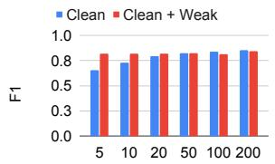  
(a) AG News

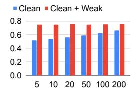

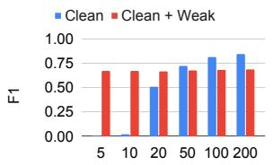  
(e) CoNLL

(b) IMDB  
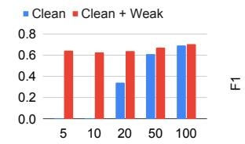  
(f) NCBI

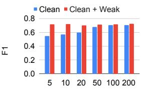  
(c) Yelp

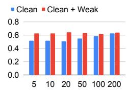

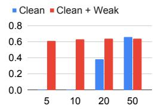  
(g) WikiGold

(d) Gossipcop  
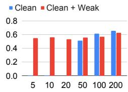  
(h) LaptopReview  
Figure 2: F1 score by varying (in the x-axis) the number of clean instances per class considered in the clean training set $( D _ { C } )$ . The importance of weak supervision is more evident for settings with smaller numbers of instances, where the gap in performance between the “Clean” approach and “Clean+Weak” approach is larger. For a robust evaluation across tasks, WALNUT provides five clean/weak splits per task. See Section 3.3 for details.

## 3.3 Dataset Pre-Processing

To construct a semi-weakly supervised learning setting, we split the training dataset for each task into a small subset with clean labels $( D _ { C } )$ and a large subset with weak labels $( D _ { W } )$ . For robust evaluation, we create five different clean/weak train splits as we noticed that the model performances may vary with different clean train instances. The validation/test sets are always the same across splits.

Because of different dataset characteristics (e.g., differences in number of classes, difficulty), we choose the size for $D _ { C }$ per dataset via pilot studies. (After having selected the instances for the $D _ { C } .$ , we consider the remaining instances as part of the $D _ { W }$ split.) We defined the size of $D _ { C }$ such that we demonstrate the benefits of weak supervision and at the same time leave substantial room for improvement in future research. To this end, we compare the performances of the same base classification model (e.g., BiLSTM), trained using only $D _ { C }$ (“Clean” approach) v.s. using both $D _ { C }$ and $D _ { W }$ (“Clean+Weak” approach). As shown in Figure 2, for each dataset, we choose a small size of $D _ { C }$ , such that the “Clean+Weak” approach has a substantially higher F1 score than the “Clean” approach and at the same time the “Clean” approach has no trivial F1 score.

The statistics of the pre-processed datasets included in WALNUT are shown in Table 1.

## 4 Baseline Evaluation in WALNUT

In this section, we describe the baselines and evaluation procedure (Section 4.1), and discuss evaluation results in WALNUT (Section 4.2). Our results highlight the value of weak supervision, important differences across different baselines, and the potential utility of WALNUT for future research on weak supervision.

## 4.1 Baselines and Evaluation Procedure

We evaluate several baseline approaches in WALNUT by considering different base models (text encoders) and different (semi-)weakly supervised learning methods to train the base model.

Encoder Models To encode input text, we experiment with various text encoders, ranging from shallow LSTMs to large pre-trained transformerbased encoders (Vaswani et al., 2017). In particular, we consider a series of models with increasing model size: Bi-directional LSTM with Glove embeddings (Pennington et al., 2014), DistilBERT (Sanh et al., 2019), BERT (Devlin et al., 2018), RoBERTa (Liu et al., 2019), BERT-large, and RoBERTa-large. For each text encoder, a classification head is placed on top of the encoder to perform the task. For more details on the base model configurations see Appendix A.1.

Learning Methods Given the semi-weakly supervised setting in WALNUT, we evaluate eight supervision approaches in the following categories:

• Learning from clean labeled examples only. The model is trained on only the small amount of available clean examples $D _ { C }$ , a naive baseline method leveraging no weak supervision, which we denote as C.

• Learningfrom weakly labeled examples only. The model is trained on all weakly labeled examples $D _ { W }$ . To produce a single weak label from the multiple labeling rules for training, we aggregate the rules via two methods: majority voting (denoted by W) and Snorkel (Ratner et al., 2017) (denoted by Snorkel).

• Learningfrom both clean and weakly labeled examples. The model is trained with both $D _ { C }$ and $D _ { W }$ in a weakly-supervised setting. The first two baselines in this category is simply concatenating $D _ { C }$ and the aggregated weak labels (from either W and Snorkel), and the model is trained on the combination. We denote these two as C+W and C+Snorkel, respectively. We also test three recent semiweakly supervised learning methods which proposed better ways to leverage both $D _ { C }$ and $D _ { W } \colon$ GLC which is a loss correction approach (Hendrycks et al., 2018), MetaWN which is a meta-learning approach to learn the importance of weakly labeled examples (Shu et al., 2019; Ren et al., 2018) and MLC, a meta-learning approach to learn to correct the weak labels (Zheng et al., 2021).

To establish an estimate of the ceiling performance on WALNUT, for each task we also train with all clean training examples in the original dataset (denoted by Full Clean).

Experimental Procedure For a robust evaluation, we repeat each experiment five times on the five splits of $D _ { C }$ and $D _ { W }$ (clean and weak examples for each task; see Section 3.3), and report the average scores and the standard deviation across the five runs. In WALNUT, we report the average micro-average F1 score on the test set.2 Datasets and code for WALNUT are publicly available at aka.ms/walnut\_benchmark.

## 4.2 Experimental Results and Analysis

Table 2 shows the main evaluation results on WALNUT. Rows correspond to supervision methods for the base model, columns correspond to tasks, and each block corresponds to a different base model. Unless explicitly mentioned, in the rest of this section we will compare approaches based on their average performance across tasks (rightmost column in Table 2).

As expected, training with Full Clean achieves the highest F1 score, corresponding to the highresource setting where all clean labeled data are available. Such method is not directly comparable to the rest of the methods but serves as an estimate of the ceiling performance for WALNUT. Training with only limited clean examples achieves the lowest overall F1 score: in the low-resource setting, which is the main focus in WALNUT, using just the available clean subset $( D _ { C } )$ is not effective.

Weak supervision is valuable for low-resource NLU. “W” and “Snorkel” achieve better F1 scores than $\mathbf { \tilde { C } } ^ { \prime \prime }$ for many base models: even using only weakly-labeled data in $D _ { W }$ is more effective than using just $D _ { C }$ , thus demonstrating that simple weak supervision approaches can be useful in the low-resource setting. Approaches such as $^ { 6 6 } \mathrm { C } + \mathrm { W } ^ { 5 }$ and “C+Snorkel” lead to further improvements compared to $\mathbf { \tilde { \Sigma } } ^ { 6 6 } \mathbf { C } ^ { 9 } \mathbf { \Sigma }$ and “Snorkel”, thus highlighting that even simple approaches for integrating clean and weak labeled data (here by concatenating $D _ { C }$ and $D _ { W } )$ are more effective than considering each separately.

There is no clear winner in WALNUT. Our results in Table 4.2 indicate that the performance of weak supervision techniques varies substantially across tasks. Therefore, it is important to evaluate such techniques in a diverse set of tasks to achieve a fair comparison and more complete picture of their performance. The performance of various techniques also varies across different splits (See Table 14 in Appendix for variances of all experiments). Interestingly, “C+W” and “C+Snorkel” sometimes perform better than more complicated approaches, such as GLC, MetaWN and MLC.

Larger base models achieve better overall performance. We further aggregate statistics across tasks, methods, and base models in Table 3. The bottom row reports the average performance across methods for each base model and leads to a consistent ranking in F1 score among base models: BiL-STM DistilBERT BERT-base RoBERTabase. Observing higher scores for larger transformer models such as RoBERTa agrees with previous observations (Brown et al., 2020). Interestingly, switching from BERT-base to BERT-large (and from RoBERTa-base to RoBERTa-large) in base model architecture leads to marginal improvement, suggesting the need to explore more effective learning methods leveraging weak supervision.

Table 2: Main results on WALNUT with F1 score (in %) on all tasks. The rightmost column reports the average F1 score across all tasks. (MLC is not shown for BERT-large and RoBERTa-large due to OOM.)
<table><tr><td>Method</td><td>AGNews</td><td>IMDB</td><td>Yelp</td><td>GossipCop</td><td>CoNLL</td><td>NCBI</td><td>WikiGold</td><td>LaptopReview</td><td>AVG</td></tr><tr><td colspan="8">BiLSTM (20M parameters)</td><td></td></tr><tr><td>Full Clean</td><td>89.4</td><td>83.1</td><td>86.4</td><td>64.5</td><td>31.9</td><td>69.9</td><td>21.8</td><td>62.6</td><td>63.7</td></tr><tr><td>C</td><td>79.5</td><td>56.2</td><td>59.5</td><td>50.8</td><td>00.8</td><td>58.2</td><td>15.8</td><td>42.3</td><td>45.4</td></tr><tr><td>W</td><td>78.0</td><td>75.2</td><td>70.8</td><td>62.0</td><td>11.1</td><td>52.3</td><td>02.7</td><td>49.4</td><td>50.2</td></tr><tr><td>Snorkel</td><td>79.9</td><td>75.4</td><td>76.0</td><td>61.4</td><td>06.7</td><td>52.5</td><td>02.7</td><td>49.4</td><td>52.1</td></tr><tr><td>C+W</td><td>82.0</td><td>75.6</td><td>70.2</td><td>64.1</td><td>17.2</td><td>56.8</td><td>15.7</td><td>51.2</td><td>52.5</td></tr><tr><td>C+Snorkel</td><td>82.9</td><td>75.4</td><td>66.5</td><td>62.6</td><td>07.7</td><td>59.2</td><td>10.7</td><td>53.8</td><td>52.4</td></tr><tr><td>GLC</td><td>56.5</td><td>72.2</td><td>63.7</td><td>60.5</td><td>05.1</td><td>58.9</td><td>08.7</td><td>55.2</td><td>47.6</td></tr><tr><td>MetaWN</td><td>55.2</td><td>72.7</td><td>65.5</td><td>58.2</td><td>00.0</td><td>53.9</td><td>03.4</td><td>51.6</td><td>45.1</td></tr><tr><td>MLC</td><td>55.3</td><td>72.3</td><td>65.7</td><td>52.5</td><td>00.0</td><td>52.5</td><td>05.9</td><td>51.5</td><td>43.7</td></tr><tr><td colspan="8">DistilBERT-base (66M parameters)</td></tr><tr><td>Full Clean</td><td>92.1</td><td></td><td>88.8 93.7</td><td>75.1</td><td>88.6</td><td>75.7</td><td>79.7</td><td>75.8</td><td>83.7</td></tr><tr><td>C</td><td>80.8</td><td>71.2</td><td>73.1</td><td>55.3</td><td>51.4</td><td>57.7</td><td>69.5</td><td>53.0</td><td>64.0</td></tr><tr><td>W</td><td>72.2</td><td>75.0</td><td>70.2</td><td>70.8</td><td>66.9</td><td>62.0</td><td>57.4</td><td>53.8</td><td>66.0</td></tr><tr><td>Snorkel</td><td>70.2</td><td>70.7</td><td>65.9</td><td>68.4</td><td>64.3</td><td>62.9</td><td>56.3</td><td>54.0</td><td>65.1</td></tr><tr><td>C+W</td><td>83.3</td><td>74.8</td><td>71.5</td><td>71.4</td><td>66.9</td><td>66.2</td><td>64.0</td><td>57.3</td><td>68.5</td></tr><tr><td>C+Snorkel</td><td>84.3</td><td>81.7</td><td>81.8</td><td>69.1</td><td>64.6</td><td>67.8</td><td>64.4</td><td>57.5</td><td>71.4</td></tr><tr><td>GLC</td><td>67.8</td><td>74.1</td><td>68.1</td><td>67.3</td><td>72.4</td><td>72.8</td><td>71.7</td><td>66.8</td><td>70.1</td></tr><tr><td>MetaWN</td><td>70.0</td><td>74.4</td><td>69.3</td><td>70.0</td><td>65.7</td><td>64.2</td><td>58.5</td><td>58.2</td><td>66.3</td></tr><tr><td>MLC</td><td>70.4</td><td>74.3</td><td>69.4</td><td>69.6</td><td>69.2</td><td>66.2</td><td>58.3</td><td>58.0</td><td>66.9</td></tr><tr><td colspan="8">BERT-base (110M parameters)</td></tr><tr><td>Full Clean</td><td>92.5</td><td></td><td>90.0 74.7</td><td>74.7</td><td>89.4</td><td>78.4</td><td>81.1</td><td>76.2</td><td>82.1</td></tr><tr><td>C</td><td>82.9</td><td>63.8</td><td>60.3</td><td>57.1</td><td>67.3</td><td>66.6</td><td>71.9</td><td>54.6</td><td>65.6</td></tr><tr><td>W</td><td>72.3</td><td></td><td>75.5 69.6</td><td>69.0</td><td>67.5</td><td>59.5</td><td>56.7</td><td>55.9</td><td>65.8</td></tr><tr><td>Snorkel</td><td>73.7</td><td>72.9</td><td>65.6</td><td>68.2</td><td>65.1</td><td>60.9</td><td>53.8</td><td>56.2</td><td>66.0</td></tr><tr><td>C+W</td><td>80.1</td><td>81.8</td><td>71.3</td><td>68.4</td><td>68.4</td><td>67.9</td><td>65.0</td><td>59.2</td><td>68.9</td></tr><tr><td>C+Snorkel</td><td>76.2</td><td>82.6</td><td>75.3 68.8</td><td>67.1</td><td>65.9</td><td>69.9</td><td>64.3</td><td>59.6</td><td>70.1</td></tr><tr><td>GLC</td><td>68.8</td><td>75.7</td><td></td><td>68.1</td><td>74.7</td><td>74.7</td><td>70.7</td><td>65.8</td><td>70.9</td></tr><tr><td>MetaWN</td><td>72.8</td><td>75.2</td><td>68.1</td><td>69.8</td><td>66.9</td><td>66.7</td><td>58.9</td><td>59.2</td><td>67.2</td></tr><tr><td>MLC</td><td>73.0</td><td>74.7</td><td>70.0</td><td>71.3</td><td>70.4</td><td>68.4</td><td>58.5</td><td>59.7</td><td>68.2</td></tr><tr><td colspan="8">RoBERTa-base (125M parameters)</td></tr><tr><td>Full Clean</td><td></td><td>92.8</td><td>92.4 95.9</td><td>77.2</td><td>91.2</td><td>83.1</td><td>87.2</td><td>80.2</td><td>87.5</td></tr><tr><td>C</td><td>84.1</td><td></td><td>74.5 70.2</td><td>57.4</td><td>72.9</td><td>72.9</td><td>78.2</td><td>61.3</td><td>71.4</td></tr><tr><td>W</td><td>66.4</td><td>76.1</td><td>70.4</td><td>71.4</td><td>64.9</td><td>69.9</td><td>64.1</td><td>58.9</td><td>67.8</td></tr><tr><td>Snorkel</td><td>71.9</td><td>70.1</td><td>66.3</td><td>69.2</td><td>61.2</td><td>70.0</td><td>61.8</td><td>59.7</td><td>67.5</td></tr><tr><td>C+W</td><td>70.6</td><td>76.5</td><td>70.4</td><td>72.2</td><td>64.1</td><td>74.0</td><td>71.6</td><td>61.2</td><td>68.9</td></tr><tr><td>C+Snorkel</td><td>74.6</td><td>68.2</td><td>66.4</td><td>71.4</td><td>62.2</td><td>73.4</td><td>72.2</td><td>61.6</td><td>68.8</td></tr><tr><td>GLC</td><td>67.6</td><td>74.9</td><td>69.0</td><td>68.0</td><td>74.6</td><td>79.1</td><td>79.6</td><td>71.5</td><td>73.0</td></tr><tr><td>MetaWN</td><td>69.6</td><td>75.4</td><td>69.0 69.9</td><td>71.8</td><td>63.8</td><td>69.9</td><td>63.5</td><td>62.5</td><td>68.2</td></tr><tr><td colspan="8"></td></tr><tr><td>MLC</td><td>70.4</td><td></td><td>74.5</td><td>72.9 BERT-large (336M parameters)</td><td>68.3</td><td>74.3</td><td>63.1</td><td>63.6</td><td>69.6</td></tr><tr><td>Full Clean</td><td>92.5</td><td></td><td>91.4 94.9</td><td>73.5</td><td>90.2</td><td>80.5</td><td>82.8</td><td>78.9</td><td>85.6 65.8</td></tr><tr><td colspan="8">72.5 65.4 68.4 57.8 67.2 69.7 73.9 69.3 65.7 62.0 57.1</td><td>51.1</td><td>54.2 54.4</td></tr><tr><td>C</td><td>W Snorkel</td><td>68.5 73.3</td><td>75.9 70.7 70.9 65.8</td></table>

Table 3: Average F1 score across the eight tasks in WALNUT. The bottom row computes the average F1 score across tasks and supervision methods. The three right-most columns report the average F1 score across model architectures and all tasks (“All”), document-level tasks (“Doc”), and token-level tasks (“Token”).
<table><tr><td colspan="7">Base Model Architecture</td><td colspan="3">Average Results</td></tr><tr><td>Method</td><td>BiLSTM</td><td>DistilBERT</td><td>BERT</td><td>RoBERTa</td><td>BERT-large</td><td>RoBERTa-large</td><td>All</td><td>Doc</td><td>Token</td></tr><tr><td>Full Clean</td><td>63.7</td><td>83.7</td><td>82.1</td><td>87.5</td><td>85.6</td><td>88.2</td><td>81.8</td><td>86.6</td><td>77.0</td></tr><tr><td>C</td><td>45.4</td><td>64.0</td><td>65.6</td><td>71.4</td><td>65.8</td><td>75.1</td><td>64.5</td><td>68.7</td><td>60.3</td></tr><tr><td>W</td><td>50.2</td><td>66.0</td><td>65.8</td><td>67.8</td><td>65.4</td><td>68.2</td><td>63.9</td><td>71.9</td><td>55.9</td></tr><tr><td>Snorkel</td><td>52.1</td><td>65.1</td><td>66.0</td><td>67.5</td><td>66.5</td><td>67.9</td><td>64.2</td><td>70.4</td><td>57.9</td></tr><tr><td>C+W</td><td>52.5</td><td>68.5</td><td>68.9</td><td>68.9</td><td>67.6</td><td>68.5</td><td>65.8</td><td>73.6</td><td>58.0</td></tr><tr><td>C+Snorkel</td><td>52.4</td><td>71.4</td><td>70.1</td><td>68.8</td><td>67.0</td><td>68.5</td><td>66.3</td><td>73.0</td><td>59.7</td></tr><tr><td>GLC</td><td>47.6</td><td>70.1</td><td>70.9</td><td>73.0</td><td>70.0</td><td>70.0</td><td>66.9</td><td>68.6</td><td>65.3</td></tr><tr><td>MetaWN</td><td>45.1</td><td>66.3</td><td>67.2</td><td>68.2</td><td>64.7</td><td>65.5</td><td>62.8</td><td>69.2</td><td>56.4</td></tr><tr><td>AVG</td><td>51.1</td><td>69.4</td><td>69.6</td><td>71.6</td><td>69.1</td><td>71.5</td><td></td><td></td><td></td></tr></table>

Table 4: Overall performance gain and gap of all weak supervision methods (Weak Sup, by averaging performance of W, Snorkel, C+W, C+Snorkel, GLC, MetaWN and MLC) against no weak supervision (C) and full clean training. Note that RoBERTa-large in included here, as the standard deviation of its performance with different splits on tasks varies significantly (See Table 14 in Appendix) hence using its performance mean as an indicator is less conclusive.
<table><tr><td></td><td>BiLSTM</td><td>DistilBERT</td><td>BERT</td><td>RoBERTa</td><td>BERT-large</td><td>AVG</td></tr><tr><td>Perf. gain: Weak Sup – C</td><td>3.90</td><td>4.21</td><td>2.98</td><td>-2.07</td><td>1.32</td><td>2.07</td></tr><tr><td>Perf. gap: Full Clean – Weak Sup</td><td>14.42</td><td>15.47</td><td>13.58</td><td>18.13</td><td>18.51</td><td>16.00</td></tr></table>

Weak supervision has smaller benefit in larger base models. Another question that we attempt to address in WALNUT is on whether weak supervision equally benefits each base model architecture. To quantify such benefit we compare the performance differences between models trained using semi-weak supervision and models trained using clean data only. The “Weak Sup” approach in Table 4 is computed as the average F1 score across all semi-weak supervision methods (C+W, C+Snorkel, GLC, and MetaWN). The performance gap between “Weak Sup” and “C” (training with few clean data only) is smaller for larger models. Additionally, the performance gap between “Full Clean” (full clean data training) and “Weak Sup” approach is larger for larger models. The two above observations highlight that weak supervision has smaller benefit in larger models. An important future research direction is to develop better learning algorithms and improving the effectiveness of weak supervision in larger models.

Analysis of weak rules. For now, we have focused on the evaluation of base models trained using weak labels generated by multiple weak labeling rules. It is interesting also to decouple the base model performance from the rule aggregation technique (e.g., majority voting, Snorkel) that was used to generate the training labels, which is an essential modeling component for weak supervision. The bottom row in Table 2 (“Rules”) reports the test performance of rules computed by taking the majority voting of weak labels on the test instances. (For test instances that are not covered by any rules, a random class is predicted.) Such majority label is available in our pre-processed datasets. Interestingly, “Rules” sometimes outperforms base models trained using weak labels (“W”, “Snorkel”). Note however that “Rules” assumes access to all weak labels on the test set, which might not always be available. On the other hand, the base model learns text features beyond the heuristic-based rules and does not require access to rules during test time and thus can be applied for any test instance.

For a more in-depth analysis of the rule quality, WALNUT also supports the analysis of individual rules and multi-source aggregation techniques, such as majority voting or Snorkel. Figure 3 shows a precision-recall scatter plot for each rule on each of the dataset in WALNUT. For instance, in the CoNLL dataset rules vary in characteristics, where most rules have a relatively low recall while there are a few rules that have substantially higher recall than the rest. Across datasets, we observe that rules have higher precision than recall, as most rules are sparse, i.e., apply to a small number of instances in the dataset (e.g., instances containing a specific keyword). Similar trends are observed on other datasets as well. For detailed descriptions of all weak rules in all datasets, refer to Table 6 - 13 in the appendix.

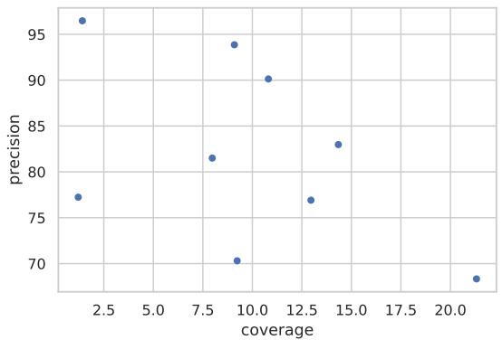  
(a) AG News.

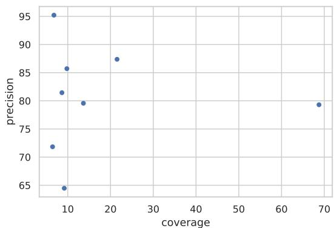  
(b) Yelp.

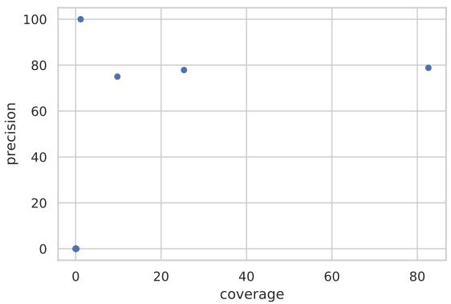  
(c) IMDB.

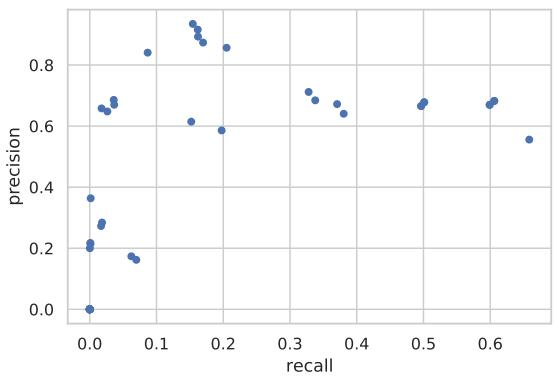  
(d) CoNLL.

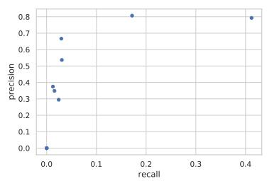  
(e) NCBI.

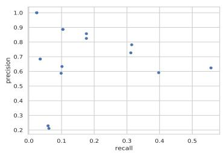  
(f) WikiGold.

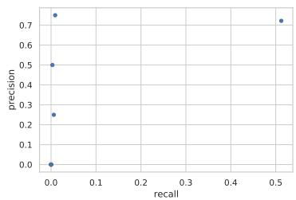  
(g) LaptopReview.  
Figure 3: Scatterplots of precision-recall for weak supervision rules. Each point corresponds to a rule. (GossipCop is omitted as it contains only three rules.)

## 5 Conclusions

Motivated by the lack of a unified evaluation platform for semi-weakly supervised learning for lowresource NLU, in this paper we propose a new benchmark WALNUT covering a broad range of data domains to advocate research on leveraging both weak supervision and few-shot clean supervision. We evaluate a series of different semi-weakly supervised learning methods with different model architecture on both document-level and tokenlevel classification tasks, and demonstrate the utility of weak supervision in real-world NLU tasks. We find that no single semi-weakly supervised learning method wins on WALNUT and there is still gap between semi-weakly supervised learning and fully supervised training. We expect WALNUT to enable systematic evaluations of semi-weakly supervised learning methods and stimulate further research in directions such as more effective learning paradigms leveraging weak supervision.

## Acknowledgements

We would like to thank Yichuan Li for helping adapt several weak supervision baselines for document-level classification tasks, and the reviewers for constructive feedback.

## References

Isabelle Augenstein, Tim Rocktäschel, Andreas Vlachos, and Kalina Bontcheva. 2016. Stance detection with bidirectional conditional encoding. In Proceedings of the 2016 Conference on Empirical Methods in Natural Language Processing, pages 876–885.

Dominic Balasuriya, Nicky Ringland, Joel Nothman, Tara Murphy, and James R Curran. 2009. Named entity recognition in wikipedia. In Proceedings of the 2009 Workshop on The People’s Web Meets NLP: Collaboratively Constructed Semantic Resources (People’s Web), pages 10–18.

Tom Brown, Benjamin Mann, Nick Ryder, Melanie Subbiah, Jared D Kaplan, Prafulla Dhariwal, Arvind Neelakantan, Pranav Shyam, Girish Sastry, Amanda Askell, Sandhini Agarwal, Ariel Herbert-Voss, Gretchen Krueger, Tom Henighan, Rewon Child, Aditya Ramesh, Daniel Ziegler, Jeffrey Wu, Clemens Winter, Chris Hesse, Mark Chen, Eric Sigler, Mateusz Litwin, Scott Gray, Benjamin Chess, Jack Clark, Christopher Berner, Sam McCandlish, Alec Radford, Ilya Sutskever, and Dario Amodei. 2020. Language models are few-shot learners. In Advances in Neural Information Processing Systems, volume 33, pages 1877–1901.

Jacob Devlin, Ming-Wei Chang, Kenton Lee, and Kristina Toutanova. 2018. Bert: Pre-training of deep bidirectional transformers for language understanding. arXiv preprint arXiv:1810.04805.

Rezarta Islamaj Dogan, Robert Leaman, and Zhiyong˘ Lu. 2014. Ncbi disease corpus: a resource for disease name recognition and concept normalization. Journal ofbiomedical informatics, 47:1–10.

Jason Fries, Sen Wu, Alex Ratner, and Christopher Ré. 2017. Swellshark: A generative model for biomedical named entity recognition without labeled data. arXiv preprint arXiv:1704.06360.

Chaitanya Gokhale, Sanjib Das, AnHai Doan, Jeffrey F Naughton, Narasimhan Rampalli, Jude Shavlik, and Xiaojin Zhu. 2014. Corleone: Hands-off crowdsourcing for entity matching. In Proceedings of the 2014 ACM SIGMOD international conference on Management of data, pages 601–612.

Pengcheng He, Xiaodong Liu, Jianfeng Gao, and Weizhu Chen. 2020. Deberta: Decoding-enhanced bert with disentangled attention.

Dan Hendrycks, Mantas Mazeika, Duncan Wilson, and Kevin Gimpel. 2018. Using trusted data to train deep networks on labels corrupted by severe noise. In NeurIPS.

Dirk Hovy, Taylor Berg-Kirkpatrick, Ashish Vaswani, and Eduard Hovy. 2013. Learning whom to trust with mace. In Proceedings of the 2013 Conference of the North American Chapter of the Association for Computational Linguistics: Human Language Technologies, pages 1120–1130.

Giannis Karamanolakis, Daniel Hsu, and Luis Gravano. 2019. Leveraging just a few keywords for finegrained aspect detection through weakly supervised co-training. In Proceedings of the 2019 Conference on Empirical Methods in Natural Language Processing and the 9th International Joint Conference on Natural Language Processing (EMNLP-IJCNLP).

Giannis Karamanolakis, Subhabrata Mukherjee, Guoqing Zheng, and Ahmed Hassan. 2021. Self-training with weak supervision. In Proceedings ofthe 2021 Conference of the North American Chapter of the Association for Computational Linguistics: Human Language Technologies, pages 845–863.

Yinghao Li, Pranav Shetty, Lucas Liu, Chao Zhang, and Le Song. 2021. BERTifying the hidden Markov model for multi-source weakly supervised named entity recognition. In Proceedings ofthe 59th Annual Meeting of the Association for Computational Linguistics and the 11th International Joint Conference on Natural Language Processing.

Pierre Lison, Jeremy Barnes, Aliaksandr Hubin, and Samia Touileb. 2020. Named entity recognition without labelled data: A weak supervision approach. In Proceedings ofthe 58th Annual Meeting ofthe Associationfor Computational Linguistics, pages 1518– 1533.

Yinhan Liu, Myle Ott, Naman Goyal, Jingfei Du, Mandar Joshi, Danqi Chen, Omer Levy, Mike Lewis, Luke Zettlemoyer, and Veselin Stoyanov. 2019. Roberta: A robustly optimized bert pretraining approach.

Andrew Maas, Raymond E Daly, Peter T Pham, Dan Huang, Andrew Y Ng, and Christopher Potts. 2011. Learning word vectors for sentiment analysis. In Proceedings ofthe 49th annual meeting ofthe association for computational linguistics: Human language technologies, pages 142–150.

Ayush Maheshwari, Oishik Chatterjee, Krishnateja Killamsetty, Ganesh Ramakrishnan, and Rishabh Iyer. 2021. Semi-supervised data programming with subset selection. In Findings of the Association for Computational Linguistics: ACL-IJCNLP 2021.

Alessio Mazzetto, Cyrus Cousins, Dylan Sam, Stephen H Bach, and Eli Upfal. 2021. Adversarial multi class learning under weak supervision with performance guarantees. In Proceedings of the 38th International Conference on Machine Learning.

Yu Meng, Jiaming Shen, Chao Zhang, and Jiawei Han. 2018. Weakly-supervised neural text classification. In Proceedings ofthe 27th ACM International Conference on Information and Knowledge Management, pages 983–992.

Mike Mintz, Steven Bills, Rion Snow, and Dan Jurafsky. 2009. Distant supervision for relation extraction without labeled data. In Proceedings of the Joint Conference ofthe 47th Annual Meeting ofthe ACL and the 4th International Joint Conference on Natural Language Processing of the AFNLP, pages 1003– 1011.

Subhabrata Mukherjee, Xiaodong Liu, Guoqing Zheng, Saghar Hosseini, Hao Cheng, Greg Yang, Christopher Meek, Ahmed Hassan Awadallah, and Jianfeng Gao. 2021. Few-shot learning evaluation in natural language understanding. In Thirty-fifth Conference on Neural Information Processing Systems Datasets and Benchmarks Track (Round 2).

George Papandreou, Liang-Chieh Chen, Kevin P Murphy, and Alan L Yuille. 2015. Weakly-and semisupervised learning of a deep convolutional network for semantic image segmentation. In Proceedings of the IEEE international conference on computer vision, pages 1742–1750.

Giorgio Patrini, Alessandro Rozza, Aditya Krishna Menon, Richard Nock, and Lizhen Qu. 2017. Making deep neural networks robust to label noise: A loss correction approach. In CVPR.

Jeffrey Pennington, Richard Socher, and Christopher D Manning. 2014. Glove: Global vectors for word representation. In Proceedings ofthe 2014 conference on empirical methods in natural language processing (EMNLP), pages 1532–1543.

Matthew Peters, Mark Neumann, Mohit Iyyer, Matt Gardner, Christopher Clark, Kenton Lee, and Luke Zettlemoyer. 2018. Deep contextualized word representations. In Proceedings ofthe 2018 Conference of the North American Chapter ofthe Associationfor Computational Linguistics: Human Language Technologies, Volume 1 (Long Papers), pages 2227–2237.

Maria Pontiki, Dimitrios Galanis, Haris Papageorgiou, Ion Androutsopoulos, Suresh Manandhar, Mohammad Al-Smadi, Mahmoud Al-Ayyoub, Yanyan Zhao, Bing Qin, Orphée De Clercq, et al. 2016. Semeval-2016 task 5: Aspect based sentiment analysis. In International workshop on semantic evaluation, pages 19–30.

Alec Radford, Jeffrey Wu, Rewon Child, David Luan, Dario Amodei, and Ilya Sutskever. 2019. Language models are unsupervised multitask learners. OpenAI blog, 1(8):9.

Alexander Ratner, Stephen H Bach, Henry Ehrenberg, Jason Fries, Sen Wu, and Christopher Ré. 2017. Snorkel: Rapid training data creation with weak supervision. Proceedings of the VLDB Endowment, 11(3):269–282.

Mengye Ren, Wenyuan Zeng, Bin Yang, and Raquel Urtasun. 2018. Learning to reweight examples for robust deep learning. arXiv preprint arXiv:1803.09050.

Wendi Ren, Yinghao Li, Hanting Su, David Kartchner, Cassie Mitchell, and Chao Zhang. 2020. Denoising multi-source weak supervision for neural text classification. arXiv preprint arXiv:2010.04582.

Esteban Safranchik, Shiying Luo, and Stephen Bach. 2020. Weakly supervised sequence tagging from noisy rules. In Proceedings of the AAAI Conference on Artificial Intelligence, volume 34, pages 5570– 5578.

Erik Tjong Kim Sang and Fien De Meulder. 2003. Introduction to the conll-2003 shared task: Languageindependent named entity recognition. In Proceedings of the Seventh Conference on Natural Language Learning at HLT-NAACL 2003, pages 142–147.

Victor Sanh, Lysandre Debut, Julien Chaumond, and Thomas Wolf. 2019. Distilbert, a distilled version of bert: smaller, faster, cheaper and lighter. arXiv preprint arXiv:1910.01108.

Timo Schick and Hinrich Schütze. 2021. It’s not just size that matters: Small language models are also fewshot learners. In Proceedings of the 2021 Conference of the North American Chapter of the Association for Computational Linguistics: Human Language Technologies, pages 2339–2352, Online. Association for Computational Linguistics.

Jingbo Shang, Jialu Liu, Meng Jiang, Xiang Ren, Clare R Voss, and Jiawei Han. 2018. Automated phrase mining from massive text corpora. IEEE Transactions on Knowledge and Data Engineering, 30(10):1825–1837.

Jun Shu, Qi Xie, Lixuan Yi, Qian Zhao, Sanping Zhou, Zongben Xu, and Deyu Meng. 2019. Meta-weightnet: Learning an explicit mapping for sample weighting. In Advances in Neural Information Processing Systems, pages 1917–1928.

Kai Shu, Deepak Mahudeswaran, Suhang Wang, Dongwon Lee, and Huan Liu. 2020a. Fakenewsnet: A data repository with news content, social context, and spatiotemporal information for studying fake news on social media. Big Data, 8(3):171–188.

Kai Shu, Subhabrata Mukherjee, Guoqing Zheng, Ahmed Hassan Awadallah, Milad Shokouhi, and Susan Dumais. 2020b. Learning with weak supervision for email intent detection. In Proceedings ofthe 43rd International ACM SIGIR Conference on Research and Development in Information Retrieval, pages 1051–1060.

Kai Shu, Amy Sliva, Suhang Wang, Jiliang Tang, and Huan Liu. 2017. Fake news detection on social media: A data mining perspective. ACM SIGKDD explorations newsletter, 19(1):22–36.

Kai Shu, Guoqing Zheng, Yichuan Li, Subhabrata Mukherjee, Ahmed Hassan Awadallah, Scott Ruston, and Huan Liu. 2020c. Leveraging multi-source weak social supervision for early detection of fake news. arXiv preprint arXiv:2004.01732.

Sainbayar Sukhbaatar, Joan Bruna, Manohar Paluri, Lubomir Bourdev, and Rob Fergus. 2014. Train ing convolutional networks with noisy labels. arXiv preprint arXiv:1406.2080.

Paroma Varma and Christopher Ré. 2018. Snuba: automating weak supervision to label training data. VLDB.

Ashish Vaswani, Noam Shazeer, Niki Parmar, Jakob Uszkoreit, Llion Jones, Aidan N Gomez, Łukasz Kaiser, and Illia Polosukhin. 2017. Attention is all you need. In Advances in neural information processing systems, pages 5998–6008.

Alex Wang, Yada Pruksachatkun, Nikita Nangia, Amanpreet Singh, Julian Michael, Felix Hill, Omer Levy, and Samuel R Bowman. 2019. Superglue: a stickier benchmark for general-purpose language understanding systems. In Proceedings of the 33rd International Conference on Neural Information Processing Systems, pages 3266–3280.

Alex Wang, Amanpreet Singh, Julian Michael, Felix Hill, Omer Levy, and Samuel Bowman. 2018. Glue: A multi-task benchmark and analysis platform for natural language understanding. In Proceedings of the 2018 EMNLP Workshop BlackboxNLP: Analyzing and Interpreting Neural Networks for NLP, pages 353–355.

Liang Xu, Xiaojing Lu, Chenyang Yuan, Xuanwei Zhang, Hu Yuan, Huilin Xu, Guoao Wei, Xiang Pan, and Hai Hu. 2021. Fewclue: A chinese few-shot learning evaluation benchmark. CoRR, abs/2107.07498.

Wei Xu, Raphael Hoffmann, Le Zhao, and Ralph Grishman. 2013. Filling knowledge base gaps for distant supervision of relation extraction. In Proceedings of the 51st Annual Meeting of the Association for Computational Linguistics.

Qinyuan Ye, Bill Yuchen Lin, and Xiang Ren. 2021. Crossfit: A few-shot learning challenge for crosstask generalization in nlp.

Jieyu Zhang, Yue Yu, Yinghao Li, Yujing Wang, Yaming Yang, Mao Yang, and Alexander Ratner. 2021. Wrench: A comprehensive benchmark for weak supervision. In Thirty-fifth Conference on Neural Information Processing Systems Datasets and Benchmarks Track (Round 2).

Xiang Zhang, Junbo Zhao, and Yann LeCun. 2015. Character-level convolutional networks for text classification. In Advances in neural information processing systems, pages 649–657.

Guoqing Zheng, Ahmed Hassan Awadallah, and Susan Dumais. 2021. Meta label correction for noisy label learning. In Proceedings ofthe AAAI Conference on Artificial Intelligence (AAAI), volume 35.

## A Appendix

## Limitations and Broader Impact

The proposed benchmark is likely to stimulate research on weakly supervised learning for NLU, and offer the research community on weakly supervised learning a unified testbed for evaluating new methodologies developed for low-resource NLU. For many practical NLU applications, large amount of manually labeled data is unavailable or expensive to obtain due to either cost or privacy concerns, resorting to proxy signals such as weak supervision is a viable solution to mitigate this annotation scarce problem. We hope WALNUT would provide such an evaluation environment to advocate progress in this direction.

Limitations. Due to the lack of existing realworld weak supervision for many NLU tasks, WALNUT does not include NLU tasks such as Natural Language Inference for which it is hard to construct weak supervision rules. Also, currently WALNUT only considers English data; a possible extension is to also include multi-lingual corpus with weak supervision available to boost the performance of multi-lingual language models with weakly supervised learning.

## A.1 Implementation Details

We implement all baseline experiments with Py-Torch and each experiment runs on a single NVIDIA GPU. Below are hyper-parameter specifications for all baseline methods (hyperparameters not mentioned below are given default values):

• Full Clean, C, C+W, Snorkel, C+Snorkel: Batch size is 32 for document-level classification datasets and 16 for the token-level classification datasets. The code for Snorkel is adapted from: https://github.com/ snorkel-team/snorkel. Each training experiment is conducted for the 10 epochs with the checkpoint with the best validation performance saved for evaluation on the test set.

• GLC: Code is adapted from https:// github.com/mmazeika/glc. Batch size is 16 for the 4 document-level classification datasets and 8 for the 4 token-level classification datasets. Each experiment trains for 10 epochs with the checkpoint with the best validation performance saved for evaluation on test set.

• MetaWN: Code is adapted from https://github.com/xjtushujun/ meta-weight-net. Batch size is 8 for the 4 document-level classification datasets and 4 for the 4 token-level classification datasets. The meta-network is a three-layer feed-forward network with hidden dimension of 128. Each experiment trains for 10 epochs with the checkpoint with the best validation performance saved for evaluation on test set.

• MLC: Code is adapted from https:// github.com/microsoft/MLC. Batch size is 8 for the 4 document-level classification datasets and 4 for the 4 token-level classification datasets. The meta-network is a three-layer feed-forward network with hidden dimension of 128; the label embedding dimension used in the meta-network is 64. Each experiment trains for 10 epochs with the checkpoint with the best validation performance saved for evaluation on test set.

To encode input text, we experiment with various text encoders, ranging from shallow LSTMs to large pre-trained transformerbased encoders (Vaswani et al., 2017):

• BiLSTM-based encoder: the BiLSTM implementations are all based on 50-dimensional pre-trained glove word embeddings (Pennington et al., 2014) and bi-directional LSTMs with hidden size 128. Note that our implementation is different than other BiLSTM implementations used by previous work, which are based on 100-dimensional word embeddings and LSTM hidden size 300. This renders our BiLSTM models roughly 3 times smaller than those used by previous work, thus the numbers are not directly comparable. We chose a smaller model capacity for BiLSTMs to contrast the performance with larger models including DistilBERT and others to show the importance of model capacity on WALNUT. During training, we use a learning rate of 0.005 for all BiLSTM-based models.

• Transformer-based encoders: we consider pre-trained DistilBERT (Sanh et al., 2019), BERT (Devlin et al., 2018), RoBERTa (Liu et al., 2019), BERT-large, and RoBERTa-large.

We fine-tune these models (via the huggingface library) using task-specific classification heads on top of the encoder and a learning rate of 0.00001.

## B Additional Benchmark Details

## B.1 Document-level classification

• AGNews: and multi-class topic classification (world vs. sports vs. business vs. sci/tech) on news articles from the AGNews dataset (Zhang et al., 2015).

• Yelp: binary sentiment classification (negative vs. positive) of Yelp restaurant reviews (Zhang et al., 2015).

• IMDB: binary sentiment classification (negative vs. positive) of IMDB movie reviews (Maas et al., 2011).

• GossipCop: binary fake news detection (fake vs. not fake) on news articles from the GossipCop3 fact-checking websites. The Gossip-Cop dataset is part of the fake news detection benchmark FakeNewsNet (Shu et al., 2020a). (We only include the results of Gossipcop to represent fake news classification task as the results for Politifact are similar.)

## B.2 Token-level classification

According to the BIO tagging scheme, “B,” “I,” and “O,” represent the beginning, inside, and outside, of a named entity span, respectively. (Not extracting any values corresponds to a sequence of “O”-only tags.) Consider, for example, named entity recognition in the CoNLL dataset:

<table><tr><td>Tokens:</td><td>Barack</td><td>Obama</td><td>lives</td><td>in</td><td>Washington</td></tr><tr><td>Tags:</td><td>B-PER</td><td>I-PER</td><td>0</td><td>0</td><td>B-LOC</td></tr></table>

• CoNLL: the CoNLL 2003 dataset (Sang and De Meulder, 2003) contains news articles from Reuters (split into sentences). In total, there are 35,089 entities from 4 types: organization (ORG), person (PER), location (LOC), and miscellaneous (MISC). Tag classes C′: [’O’, ’B-PER’, ’I-PER’, ’B-ORG’, ’I-ORG’, ’B-LOC’, ’I-LOC’, ’B-MISC’, ’I-MISC’]

• NCBI: the NCBI Disease corpus (Dogan˘ et al., 2014) contains PubMed abstracts with

6,866 disease mentions. Tag types: [’O’, ’B’, ’I’]

• WikiGold: the WikiGold dataset (Balasuriya et al., 2009) contains English Wikipedia articles that were randomly selected and manually annotated with the same entity types as CoNLL. Tag classes C′: [’O’, ’B-PER’, ’I-PER’, ’B-ORG’, ’I-ORG’, ’B-LOC’, ’I-LOC’, ’B-MISC’, ’I-MISC’]

• LaptopReview: the Laptop Review corpus from the SemEval 2014 Challenge (Pontiki et al., 2016) contains 3,012 mentions to laptop features. Tag types C′: [’O’, ’B’, ’I’]

Table 5 shows detailed statistics for token-level classification datasets. More dataset statistics are provided in Table 1. Tables 6-13 show detailed information for all rules. Figures 4-10 show examples of weak rules for various datasets.

Table 5: Extra token-level statistics for the token-level classification datasets.
<table><tr><td></td><td>CoNLL</td><td>NCBI</td><td>WikiGold</td><td>LaptopReview</td></tr><tr><td># train tokens</td><td>203,621</td><td>135,572</td><td>31,560</td><td>41,525</td></tr><tr><td># dev tokens</td><td>51,362</td><td>23,789</td><td>3,683</td><td>9,970</td></tr><tr><td># test tokens</td><td>46,435</td><td>24,219</td><td>3,762</td><td>11,884</td></tr></table>

Table 6: List of rules for the AGNews dataset. The rules are the same as the tagging rules in (Zhang et al., 2015). The Python implementations can be found in: https://github.com/weakrules/ Denoise-multi-weak-sources/blob/master/rules-noisy-labels/Agnews/angews\_rule.py

<table><tr><td>Rule name</td><td>Description</td></tr><tr><td>1. world1</td><td>Keyword-based detection of the woRLD topic</td></tr><tr><td>2. world2</td><td>Keyword-based detection of the woRLD topic</td></tr><tr><td>3. sports1</td><td>Keyword-based detection of the sPoRTs topic</td></tr><tr><td>4. sports2</td><td>Keyword-based detection of the sPoRTs topic</td></tr><tr><td>5. sports3</td><td>Keyword-based detection of the sPoRTs topic</td></tr><tr><td>6. tech1</td><td>Keyword-based detection of the TECH topic</td></tr><tr><td>7. tech2</td><td>Keyword-based detection of the TECH topic</td></tr><tr><td>8. business1</td><td>Keyword-based detection of the BusınEss topic</td></tr><tr><td>9. business2</td><td>Keyword-based detection of the BusınEss topic</td></tr></table>

Table 7: List of rules for the IMDB dataset. The rules are the same as in (Zhang et al., 2015). The Python implementations can be found in: https://github.com/weakrules/Denoise-multi-weak-sources/blob/ master/rules-noisy-labels/IMDB/imdb\_rule.py

<table><tr><td>Rule name</td><td>Description</td></tr><tr><td>1. expression_nexttime</td><td>Regex-based detection of positıvE sentiment (re-watching expressions)</td></tr><tr><td>2. expression_recommend</td><td>Regex-based detection of positivE sentiment (recommendation expressions)</td></tr><tr><td>3. expression_value</td><td>Regex-based detection of positıvE sentiment (value expressions)</td></tr><tr><td>4. keyword_compare</td><td>Keyword-based detection of NEGAtıvE sentiment based on movie comparisons</td></tr><tr><td>5. keyword_general</td><td>Keyword-based detection of POsITIvE and NEGATIvE sentiment</td></tr><tr><td>6. keyword_actor</td><td>Keyword-based detection of PositıvE sentiment regarding the actors</td></tr><tr><td>7. keyword_finish</td><td>Keyword-based detection of NEGArivE sentiment</td></tr><tr><td>8. keyword_plot</td><td>Keyword-based detection of POsITIvE and NEGATIvE sentiment regarding the plot</td></tr></table>

Table 8: List of rules for the Yelp dataset. The rules are the same as in (Zhang et al., 2015). The Python implementations can be found in: https://github.com/weakrules/Denoise-multi-weak-sources/blob/master/ rules-noisy-labels/Yelp/yelp\_rules.py

<table><tr><td>Rule name</td><td>Description</td></tr><tr><td>1. textblob_If</td><td>Model-based detection of POsITIvE and NEGATIvE sentiment (TextBlob model)</td></tr><tr><td>2. keyword_recommend</td><td>Regex-based detection of positivE sentiment (recommendation expressions)</td></tr><tr><td>3. keyword_general</td><td>Regex-based detection of PosiTIvE and posiTIvE sentiment (general expressions)</td></tr><tr><td>4. keyword_mood</td><td>Keyword-based detection of posiTIvE and NEGATIvE sentiment based on the user&#x27;s mood</td></tr><tr><td>5. keyword_service</td><td>Keyword-based detection of posiTIvE and NEGATIvE sentiment relevant to the service</td></tr><tr><td>6. keyword_price</td><td>Keyword-based detection of posiTIvE and NEGATıvE sentiment regarding the prices</td></tr><tr><td>7. keyword_environment</td><td>Keyword-based detection of POsiTIvE and NEGATivE sentiment relevant to the ambience</td></tr><tr><td>8. keyword_food</td><td>Keyword-based detection of PosiTIvE and NEGATIvE sentiment relevant to the food</td></tr></table>

Table 9: List of rules for the GossipCop dataset. The rules are the same as in (Shu et al., 2020a) (page 8 in http://www.cs.iit.edu/\~kshu/files/ecml\_pkdd\_mwss.pdf).
<table><tr><td>Rule name</td><td>Description</td></tr><tr><td>1. mean_scores</td><td>User interaction-based detection of FAkE news: If a news piece has a standard deviation of user sentiment scores greater than a threshold  $\tau _ { 1 }$ </td></tr><tr><td>2. std_scores</td><td>then the news is weakly labeled as FAkE news. User interaction-based detection of FAkE news: If the mean value of users’ absolute bias scores - sharing a piece of news – is greater than</td></tr><tr><td>3. credibility_score</td><td>a threshold  $\tau _ { 2 }$  , then the news piece is weakly-labeled as FAkE news. User interaction-based detection of FAkE news: If a news piece has an average credibility score less than a threshold  $\tau _ { 3 } ,$  , then the news is weakly-labeled as FAKE news.</td></tr></table>

Table 10: List of rules for the CoNLL dataset. The Python implementation of CoNLL rules is provided in the “skweak” repo: https://github.com/NorskRegnesentral/skweak/blob/ 670fcdec680930ce3e497886d06d61e6a1f2c195/examples/ner/conll2003\_ner.py

<table><tr><td>Rule name</td><td>Description</td></tr><tr><td>1. date_detector</td><td>Heuristic detection of entities of type DATE</td></tr><tr><td>2. time_detector</td><td>Heuristic detection of entities of type TIME</td></tr><tr><td>3. money_detector</td><td>Heuristic detection of entities of type MoNEY</td></tr><tr><td>4. proper_detector</td><td>Heuristic detection of proper names based on casing</td></tr><tr><td>5. infrequent_proper_detector</td><td>Heuristic detection of proper names based on casing</td></tr><tr><td rowspan="2">6. proper2_detector</td><td>+ including at least one infrequent token</td></tr><tr><td>Heuristic detection of proper names based on casing</td></tr><tr><td>7. infrequent_proper2_detector</td><td>Heuristic detection of proper names based on casing</td></tr><tr><td></td><td>+ including at least one infrequent token</td></tr><tr><td>8. nnp_detector 9. infrequent_nnp_detector</td><td>Heuristic detection of sequences of tokens with NNP as POS-tag Heuristic detection of sequences of tokens with NNP as POS-tag</td></tr><tr><td></td><td>+ including at least one infrequent token (rank &gt; 15000 in vocabulary)</td></tr><tr><td>10. compound_detector</td><td>Heuristic detection of proper noun phrases with compound dependency relations</td></tr><tr><td rowspan="2">11. infrequent_compound_detector</td><td>Heuristic detection of proper noun phrases with compound dependency relations</td></tr><tr><td>+ including at least one infrequent token</td></tr><tr><td>12. misc_detector</td><td>Heuristic detection of entities of type NORP, LANGUAGE, FAC or EVENT</td></tr><tr><td>13. legal_detector</td><td>Heuristic detection of entities of type LAw</td></tr><tr><td>14. company_type_detector</td><td>Gazetteer using a large list of company names</td></tr><tr><td>15. full_name_detector</td><td>Heuristic function to detect full person names</td></tr><tr><td>16. number_detector</td><td>Heuristic detection of entities CARDINAL,ORDINAL, PERCENT and QUANTITY</td></tr><tr><td>17. snips</td><td>Probabilistic parser specialised in the recognition of dates,</td></tr><tr><td></td><td>+ times, money amounts, percents, and cardinal/ordinal values</td></tr><tr><td>18. core_web_md 19. core_web_md+c</td><td>NER model trained on Ontonotes 5.0</td></tr><tr><td>20. BTC</td><td>NER model trained on Ontonotes 5.0 + postprocessing</td></tr><tr><td>21. BTC+c</td><td>NER model trained on the Broad Twitter Corpus</td></tr><tr><td>22. SEC</td><td>NER model trained on the Broad Twitter Corpus + postprocessing</td></tr><tr><td>23. SEC+c</td><td>NER model trained on SEC-filings NER model trained on SEC-filings + postprocessing</td></tr><tr><td>24. edited_core_web_md</td><td>NER model trained on Ontonotes 5.0 + alternative postprocessing</td></tr><tr><td>25. edited_core_web_md+c</td><td>NER model trained on Ontonotes 5.0 + alternative postprocessing</td></tr><tr><td>26. wiki_cased</td><td>Gazetteer (case-sensitive) using Wikipedia entries</td></tr><tr><td>27. wiki_uncased</td><td>Gazetteer (case-insensitive) using Wikipedia entries</td></tr><tr><td>28. multitoken_wiki_cased</td><td>Same as above, but restricted to multitoken entities</td></tr><tr><td>29. multitoken_wiki_uncased</td><td>Same as above, but restricted to multitoken entities</td></tr><tr><td>30. wiki_small_cased</td><td>Gazetteer (case-sensitive) using Wikipedia entries with non-empty description</td></tr><tr><td>31. wiki_small_uncased</td><td>Gazetteer (case-insensitive) using Wikipedia entries with non-empty description</td></tr><tr><td>32. multitoken_wiki_small_cased</td><td>Same as above, but restricted to multitoken entities</td></tr><tr><td>33. multitoken_wiki_small_uncased</td><td></td></tr><tr><td>34. geo_cased</td><td>Same as above, but restricted to multitoken entities</td></tr><tr><td>35. geo_uncased</td><td>Gazetteer (case-sensitive) using the Geonames database Gazetteer (case-insensitive) using the Geonames database</td></tr><tr><td>36. multitoken_geo_cased</td><td>Same as above, but restricted to multitoken entities</td></tr><tr><td>37. multitoken_geo_uncased</td><td>Same as above, but restricted to multitoken entities</td></tr><tr><td>38. crunchbase_cased</td><td>Gazetteer (case-sensitive) using the Crunchbase Open Data Map</td></tr><tr><td>39. crunchbase_uncased</td><td>Gazetteer (case-insensitive) using the Crunchbase Open Data Map</td></tr><tr><td>40. multitoken_crunchbase_cased</td><td>Same as above, but restricted to multitoken entities</td></tr><tr><td>41. multitoken_crunchbase_uncased</td><td>Same as above, but restricted to multitoken entities</td></tr><tr><td>42. product_cased</td><td>Gazetteer (case-sensitive) using products extracted from DBPedia</td></tr><tr><td>43. product_uncased</td><td>Gazetteer (case-insensitive) using products extracted from DBPedia</td></tr><tr><td>44. multitoken_product_cased</td><td>Same as above, but restricted to multitoken entities</td></tr><tr><td>45. multitoken_product_uncased</td><td>Same as above, but restricted to multitoken entities</td></tr><tr><td>46. doclevel_voter</td><td>Considers all appearances of the same entity string in the document</td></tr><tr><td>47. doc_history_cased</td><td></td></tr><tr><td>48. doc_history_uncased</td><td>Considers already introduçed entities in the document (case-sensitive)</td></tr><tr><td></td><td>Considers already introdućed entities in the document (case-insensitive)</td></tr><tr><td>49. doc_majority_cased</td><td>Considers all entities in the document (case-sensitive)</td></tr><tr><td>50. doc_majority_uncased</td><td>Considers all majority labels in the document (case-insensitive)</td></tr></table>

Table 11: List of rules for the NCBI dataset. The rules are the same as the tagging rules in (Safranchik et al., 2020). Python implementations: https://github.com/BatsResearch/safranchik-aaai20-code/blob/ master/NCBI-Disease/train\_generative\_models.py
<table><tr><td>Rule name</td><td>Description</td></tr><tr><td>1. CoreDictionaryUncased</td><td>AutoNER dictionary (biomedical entities)</td></tr><tr><td>2. CoreDictionaryExact</td><td>AutoNER dictionary (biomedical entities, exact match)</td></tr><tr><td>3. CancerLike</td><td>Heuristic detection of entities that are relevant to cancer</td></tr><tr><td>4. CommonSuffixes</td><td>Heuristic detection of entities that are relevant to common diseases</td></tr><tr><td>5. Deficiency</td><td>Heuristic detection of entities that are relevant to deficiencies</td></tr><tr><td>6. Disorder</td><td>Heuristic detection of entities that are relevant to disorders</td></tr><tr><td>7. Lesion</td><td>Heuristic detection of entities that are relevant to lesions</td></tr><tr><td>8. Syndrome</td><td>Heuristic detection of entities that are relevant to syndroms</td></tr><tr><td>9. BodyTerms</td><td>UMLS dictionary entries for terms that are relevant to body parts</td></tr><tr><td>10. OtherPOS</td><td>Heuristic detection of parts of speech that are not relevant to any disease</td></tr><tr><td>11. StopWords</td><td>Heuristic detection of stop words that are not relevant to any disease</td></tr><tr><td>12. Punctuation</td><td>Heuristic detection of punctiations that are not relevant to any disease</td></tr></table>

Table 12: List of rules for the WikiGold dataset. The Python implementation of WikiGold rules is provided in the “skweak” repo: https://github.com/NorskRegnesentral/skweak/blob/ 670fcdec680930ce3e497886d06d61e6a1f2c195/examples/ner/conll2003\_ner.py
<table><tr><td>Rule name</td><td>Description</td></tr><tr><td>1. BTC</td><td>NER model trained on the Broad Twitter Corpus</td></tr><tr><td>2. core_web_md</td><td>NER model trained on Ontonotes 5.0</td></tr><tr><td>3. crunchbase_cased</td><td>Gazetteer (case-sensitive) using the Crunchbase Open Data Map</td></tr><tr><td>4. crunchbase_uncased</td><td>Gazetteer (case-insensitive) using the Crunchbase Open Data Map</td></tr><tr><td>5. full_name_detector</td><td>Heuristic function to detect full person names</td></tr><tr><td>6. geo_cased</td><td>Gazetteer (case-sensitive) using the Geonames database</td></tr><tr><td>7. geo_uncased</td><td>Gazetteer (case-insensitive) using the Geonames database</td></tr><tr><td>8. misc_detector</td><td>Heuristic detection of entities of type NORP, LANGUAGE, FAC or EVENT</td></tr><tr><td>9. wiki_cased</td><td>Gazetteer (case-sensitive) using Wikipedia entries</td></tr><tr><td>10. wiki_uncased</td><td>Gazetteer (case-insensitive) using Wikipedia entries</td></tr><tr><td>11. multitoken_crunchbase_cased</td><td>Same as above, but restricted to multitoken entities</td></tr><tr><td>12. multitoken_crunchbase_uncased</td><td>Same as above, but restricted to multitoken entities</td></tr><tr><td>13. multitoken_geo_cased</td><td>Same as above, but restricted to multitoken entities</td></tr><tr><td>14. multitoken_geo_uncased</td><td>Same as above, but restricted to multitoken entities</td></tr><tr><td>15. multitoken_wiki_cased</td><td>Same as above, but restricted to multitoken entities</td></tr><tr><td>16. multitoken_wiki_uncased</td><td>Same as above, but restricted to multitoken entities</td></tr></table>

Table 13: List of rules for the LaptopReview dataset. The rules are the same as the tagging rules in (Safranchik et al., 2020). Python implementations: https://github.com/BatsResearch/safranchik-aaai20-code/ blob/master/LaptopReview/train\_generative\_models.py
<table><tr><td>Rule name</td><td>Description</td></tr><tr><td>1. CoreDictionary</td><td>AutoNER dict with entries of terms that are relevant to electronics</td></tr><tr><td>2. OtherTerms</td><td>Heuristic detection of laptop entities based on a pre-defined keyword list</td></tr><tr><td>3. ReplaceThe</td><td>Heuristic detection of laptop entities based on the “replace the&quot; phrase</td></tr><tr><td>4. iStuff</td><td>Heuristic detection of laptop entities based on uppercase letters</td></tr><tr><td>5. Feelings</td><td>Heuristic detection of laptop entities based on common expressions</td></tr><tr><td>6. ProblemWithThe</td><td>Heuristic detection of laptop entities based on common expressions</td></tr><tr><td>7. External</td><td>Heuristic detection of laptop entities based on common hardware expression</td></tr><tr><td>8. StopWords</td><td>Heuristic detection of stop words that are not relevant to electronics</td></tr><tr><td>9. Punctuation</td><td>Heuristic detection of punctuation that are not relevant to electronics</td></tr><tr><td>10. Pronouns</td><td>Heuristic detection of pronouns that are not relevant to electronics</td></tr><tr><td>11. NotFeatures</td><td>Heuristic detection of terms that are not relevant to laptop features</td></tr><tr><td>12. Adv</td><td>Heuristic detection of adverbs that are not relevant to electronics</td></tr></table>

def keyword\_price(x):   
keywords\_pos=["cheap", "reasonable", "inexpensive", "economical"]   
keywords\_neg=["overpriced", "expensive", "costly", "high-priced"]   
if any(word in x.text.lower() for word in keywords\_neg):   
return NEG   
if any(word in x.text.lower() for word in keywords\_pos):   
return POS   
return ABSTAIN  
Figure 4: Example of weak rule from the Yelp dataset (rule 6: keyword\_price from Table 8).

@labeling\_function(pre=[textblob\_sentiment])   
def textblob\_lf(x):   
if x.polarity < -0.5:   
return NEG   
if x.polarity > 0.5:   
return POS   
return ABSTAIN  
Figure 5: Example of weak rule from the Yelp dataset (rule 1: textblob\_lf from Table 8).

def money\_generator(doc):   
""Searches for occurrences of money patterns in text"…"   
i = 0   
while i < len(doc):   
tok = doc[i]   
if tok.text[0].isdigit():   
while (j < len(doc) and (doc[j].text[0].isdigit() or doc[j].norm\_ in data\_utils.MAGNITUDES)):   
found\_symbol = False   
if i > 0 and doc[i - 1].text in (data\_utils.CURRENCY\_CODES | data\_utils.CURRENCY\_SYMBOLS):   
found symbol = True   
if (j < len(doc) and doc[j].text in   
(data\_utils.CURRENCY\_CODES | data\_utils.CURRENCY\_SYMBOLS | {"euros", "cents", "rubles"})):   
found\_symbol = True   
if found\_symbol:   
yield i, j, "MONEY"   
else:  
Figure 6: Example of weak rule from the CoNLL dataset (rule 3: money\_detector from Table 10). This rule heuristically detects entities that are relevant to money.

def number\_generator(doc):   
"""Searches for occurrences of number patterns (cardinal, ordinal, quantity or percent) in text"…"   
i = 0   
while i < len(doc):   
tok = doc[i]   
if tok.lower\_ in data\_utils.0RDINALS:   
yield i, i + 1, "ORDINAL"   
elif re.search("\\d", tok.text):   
j = i + 1   
while (j < len(doc) and (doc[j].norm\_ in data\_utils.MAGNITUDES)):   
if j < len(doc) and doc[j].lower\_.rstrip(".") in data\_utils.UNITS:   
yield i, j, "QUANTITY"   
elif j < len(doc) and doc[j].lower\_ in ["%", "percent", "pc.", "pc", "pct", "pct.", "percents",   
"percentage"]:   
yield i, j, "PERCENT"   
else:   
yield i, j, "CARDINAL"

Figure 7: Example of weak rule from the CoNLL dataset (rule 16: number\_detector from Table 10). This rule heuristically detects entities that are relevant to numbers.

class CancerLike(TaggingRule):   
def apply\_instance(self, instance):   
tokens = [token.text.lower() for token in instance['tokens']]   
labels = ['ABS'] \* len(tokens)   
suffixes = ("edema", "toma", "coma", "noma")   
for i, token in enumerate(tokens):   
for suffix in suffixes:   
if token.endswith(suffix) or token.endswith(suffix + "s"):   
labels[i] = 'I'   
return labels

Figure 8: Example of weak rule from the NCBI dataset (rule 3: CancerLike from Table 11). This rule heuristically detects entities that are relevant to cancer.

class StopWords(TaggingRule):   
def apply\_instance(self, instance):   
labels = ['ABS'] \* len(instance['tokens'])   
for i in range(len(instance['tokens'])):   
if instance['tokens'][i].lemma\_ in stop\_words:   
labels[i] = '0'   
return labels

Figure 9: Example of weak rule from the NCBI dataset (rule 11: StopWords from Table 11). This rule heuristically detects stop words and assigns the ‘O’ tag to the corresponding tokens by assuming that they are not relevant to any disease.

class Feelings(TaggingRule):   
feeling\_words = {"like", "liked", "love", "dislike", "hate"}   
def apply\_instance(self, instance):   
tokens = [token.text for token in instance['tokens']]   
labels = ['ABS'] \* len(tokens)   
for i in range(len(tokens) - 2):   
if tokens[i].lower() in self.feeling\_words and tokens[i +   
1].lower() == 'the':   
if instance['tokens'][i + 2].pos\_ == "NoUN":   
labels[i] = '0'   
labels[i + 1] = '0'   
labels[i + 2] = 'I'   
return labels

Figure 10: Example of weak rule from the LaptopReview dataset (rule 5: Feelings from Table 13). This rule heuristically detects entities that are relevant to laptop features based on keywords that express the user’s feelings.

## C Additional Results

Table 14 shows standard deviation results for all datasets, methods, and base models. The rightmost column responds the average standard deviation (AVG std) across tasks, which we also reported in Table 3.

Analysis of individual weak rules. Tables 15- 21 show performance results for each weak rule for the datasets in WALNUT. We evaluate two different strategies for majority voting in case of an instance that is not covered by any rules: (1) “Strict” counts the instance as misclassified and (2) “Loose” assigns a random label to the instance. Most rules have very low F1 score while there are a few rules with a relatively high F1 score.

Figure 3 shows the precision-recall scatter plots for each weak rule individually. (We skip the scatter plot for GossipCop as it has just 3 rules.) Several rules have relatively high precision but most rules have very low recall.

Table 14: Standard deviation results on WALNUT.
<table><tr><td>Method</td><td>AGNews</td><td>IMDB</td><td>Yelp</td><td>GossipCop</td><td>CoNLL NCBI</td><td>WikiGold</td><td></td><td>LaptopReview</td><td>AVG</td></tr><tr><td colspan="8"></td></tr><tr><td>Full Clean</td><td>0.2</td><td>0.5</td><td>0.3</td><td>BiLSTM 1.0 7.2</td><td>1.6</td><td>0.5</td><td></td><td>2.5</td><td>1.7</td></tr><tr><td>C</td><td>1.1</td><td>2.9</td><td>4.4 2.0</td><td>1.0</td><td></td><td>1.5</td><td>0.9</td><td>5.0</td><td>2.4</td></tr><tr><td>W</td><td>6.1</td><td>0.5</td><td>2.4</td><td>0.9</td><td>3.2</td><td>1.5</td><td>0.6</td><td>1.2</td><td>2.1</td></tr><tr><td>C+W</td><td>0.3</td><td>0.9</td><td>1.2</td><td>1.1</td><td>6.7</td><td>1.1</td><td>0.6</td><td>2.9</td><td>1.9</td></tr><tr><td>Snorkel</td><td>3.9</td><td>0.8</td><td>0.6</td><td>0.4</td><td>2.3</td><td>2.1</td><td>0.7</td><td>1.4</td><td>1.5</td></tr><tr><td>C+Snorkel</td><td>0.4</td><td>1.0</td><td>1.2</td><td>1.5</td><td>2.8</td><td>1.7</td><td>0.6</td><td>2.1</td><td>1.4</td></tr><tr><td></td><td>1.3</td><td>0.3</td><td>0.9</td><td>1.7</td><td>7.2</td><td>1.2</td><td>0.5</td><td>0.9</td><td>1.7</td></tr><tr><td>GLC</td><td>1.8</td><td>0.3</td><td>2.0</td><td></td><td>0.0</td><td>1.3</td><td>0.4</td><td></td><td></td></tr><tr><td>MetaWN MLC</td><td></td><td>0.3</td><td>3.8</td><td>1.3</td><td></td><td></td><td></td><td>0.5</td><td>0.9</td></tr><tr><td></td><td>2.1</td><td></td><td></td><td>1.6 DistilBERT</td><td>0.0</td><td>1.1</td><td>0.3</td><td>0.7</td><td>1.2</td></tr><tr><td colspan="10"></td></tr><tr><td>Full Clean</td><td></td><td>0.2</td><td>0.3 0.3 6.8</td><td>1.5</td><td>0.4</td><td>0.4</td><td>0.7</td><td>3.5</td><td>0.9</td></tr><tr><td>C</td><td>6.2</td><td></td><td>7.4 1.5</td><td>6.4 1.1</td><td>3.6</td><td>2.0</td><td>1.3</td><td>1.7</td><td>4.4</td></tr><tr><td>W</td><td>3.9 0.6</td><td>1.1 0.2</td><td>0.9</td><td>1.2</td><td>0.9 0.8</td><td>1.2 1.4</td><td>0.3</td><td>2.0</td><td>1.5</td></tr><tr><td>C+W</td><td></td><td>1.6</td><td>0.6</td><td>0.5</td><td>1.1</td><td>1.5</td><td>0.4</td><td>3.6</td><td>1.1</td></tr><tr><td>Snorkel</td><td>3.0 0.7</td><td>0.5</td><td>2.0</td><td>0.8</td><td>0.9</td><td>1.9</td><td>0.4 0.4</td><td>2.2</td><td>1.4</td></tr><tr><td>C+Snorkel GLC</td><td>2.8</td><td>0.5</td><td>1.5</td><td>2.0</td><td>2.1</td><td>1.8</td><td>0.2</td><td>3.6</td><td>1.4</td></tr><tr><td>MetaWN</td><td>1.6</td><td>1.3</td><td>0.8</td><td>2.2</td><td>1.8</td><td>1.4</td><td>0.3</td><td>1.5</td><td>1.5</td></tr><tr><td>MLC</td><td>2.5</td><td>0.6</td><td>0.7</td><td>1.6</td><td>1.2</td><td>1.8</td><td>0.4</td><td>0.6</td><td>1.3</td></tr><tr><td></td><td></td><td></td><td></td><td>BERT</td><td></td><td></td><td></td><td>2.3</td><td>1.4</td></tr><tr><td colspan="10"></td></tr><tr><td>Full Clean</td><td></td><td>0.1 0.9</td><td>0.5 0.2 8.1 5.2</td><td>1.0 1.8</td><td>0.6 1.3</td><td>0.5 0.8</td><td>1.0 1.3</td><td>1.8 2.5</td><td>0.7 2.7</td></tr><tr><td>C</td><td>2.7</td><td>0.5</td><td>1.1</td><td>2.2</td><td>1.2</td><td>2.8</td><td>0.9</td><td>1.8</td><td>1.7</td></tr><tr><td>W</td><td>0.4</td><td>0.6</td><td>1.4</td><td>1.5</td><td>0.9</td><td>1.4</td><td>0.8</td><td>1.5</td><td>1.1</td></tr><tr><td>C+W Snorkel</td><td>2.3</td><td>3.7</td><td>1.3</td><td>0.9</td><td>1.3</td><td>3.5</td><td>1.0</td><td>1.3</td><td>1.9</td></tr><tr><td>C+Snorkel</td><td>1.0</td><td>0.5</td><td>0.6</td><td>0.6</td><td>1.6</td><td>1.7</td><td>0.8</td><td>2.6</td><td>1.2</td></tr><tr><td>GLC</td><td>1.6</td><td>0.8</td><td>2.2</td><td>2.8</td><td>2.4</td><td>1.2</td><td>0.4</td><td>1.2</td><td>1.6</td></tr><tr><td></td><td>1.1</td><td>1.0</td><td>1.0</td><td>2.4</td><td>1.6</td><td>0.5</td><td>0.3</td><td></td><td>1.2</td></tr><tr><td>MetaWN MLC</td><td>2.0</td><td>0.8</td><td>1.3</td><td>1.4</td><td>2.1</td><td>2.8</td><td>0.2</td><td>1.4 0.4</td><td>1.4</td></tr><tr><td colspan="10"></td></tr><tr><td>Full Clean</td><td>0.1</td><td></td><td>0.4 0.2</td><td>1.0</td><td>RoBERTa 0.3</td><td>0.7</td><td>1.0</td><td>2.0</td><td>0.7</td></tr><tr><td>C</td><td>2.0</td><td>5.4</td><td>5.9</td><td>5.2</td><td>2.3</td><td>2.1</td><td>1.7</td><td>4.1</td><td>3.6</td></tr><tr><td>W</td><td>1.2</td><td>0.7</td><td>1.2</td><td>2.4</td><td>1.4</td><td>1.5</td><td>0.9</td><td>2.7</td><td>1.5</td></tr><tr><td>C+W</td><td>0.9</td><td>1.7</td><td>1.4</td><td>1.0</td><td>1.6</td><td>1.5</td><td>0.6</td><td>5.3</td><td>1.8</td></tr><tr><td>Snorkel</td><td>3.2</td><td>2.3</td><td>2.9</td><td>0.6</td><td>2.0</td><td>1.1</td><td>0.9</td><td>2.9</td><td>2.0</td></tr><tr><td>C+Snorkel</td><td>0.7</td><td>2.2</td><td>1.6</td><td>1.8</td><td>1.8</td><td>3.1</td><td>0.8</td><td>5.7</td><td>2.2</td></tr><tr><td>GLC</td><td>1.3</td><td>0.7</td><td>1.8</td><td>2.3</td><td>3.2</td><td>0.4</td><td>0.4</td><td>0.8</td><td>1.4</td></tr><tr><td>MetaWN</td><td>2.7</td><td>0.9</td><td>1.4</td><td>2.1</td><td>0.7</td><td>0.9</td><td>0.3</td><td>1.1</td><td>1.3</td></tr><tr><td>MLC</td><td>1.6</td><td>1.2</td><td>1.0</td><td>1.3</td><td>1.2</td><td>2.7</td><td>0.2</td><td>3.1</td><td>1.6</td></tr><tr><td colspan="10">BERT-large</td></tr><tr><td>Full Clean</td><td></td><td>0.1</td><td>0.4 0.3</td><td>0.6</td><td>1.0</td><td>1.4</td><td>1.2</td><td>3.1</td><td>1.0</td></tr><tr><td>C</td><td>22.6 1.1</td><td>3.7 2.4</td><td>5.8 1.2</td><td>3.2 1.4</td><td>4.0 1.2</td><td>2.4 2.0</td><td>2.3 1.1</td><td>3.4 1.0</td><td>5.9 1.4</td></tr><tr><td>W C+W</td></table>

Table 15: Performance of each rule on AGNews.
<table><tr><td rowspan=2 colspan=13>AG Newsunlabeled                 train                 validation                  testRec   F1</td></tr><tr><td rowspan=1 colspan=1>Rule</td><td rowspan=1 colspan=1>Prec</td><td rowspan=1 colspan=1>Rec</td><td rowspan=1 colspan=1>F1</td><td rowspan=1 colspan=1>Prec</td><td rowspan=1 colspan=1>Rec</td><td rowspan=1 colspan=1>F1</td><td rowspan=1 colspan=1>Prec</td><td rowspan=1 colspan=1>Rec</td><td rowspan=1 colspan=1>F1</td><td rowspan=1 colspan=1>Prec</td></tr><tr><td rowspan=1 colspan=1>rule 1</td><td rowspan=1 colspan=1>0.179</td><td rowspan=1 colspan=1>0.078</td><td rowspan=1 colspan=1>0.109</td><td rowspan=1 colspan=1>0.179</td><td rowspan=1 colspan=1>0.114</td><td rowspan=1 colspan=1>0.140</td><td rowspan=1 colspan=1>0.182</td><td rowspan=1 colspan=1>0.077</td><td rowspan=1 colspan=1>0.108</td><td rowspan=1 colspan=1>0.180</td><td rowspan=1 colspan=1>0.079</td><td rowspan=1 colspan=1>0.110</td></tr><tr><td rowspan=1 colspan=1>rule 2</td><td rowspan=1 colspan=1>0.157</td><td rowspan=1 colspan=1>0.082</td><td rowspan=1 colspan=1>0.108</td><td rowspan=1 colspan=1>0.156</td><td rowspan=1 colspan=1>0.121</td><td rowspan=1 colspan=1>0.136</td><td rowspan=1 colspan=1>0.159</td><td rowspan=1 colspan=1>0.082</td><td rowspan=1 colspan=1>0.108</td><td rowspan=1 colspan=1>0.154</td><td rowspan=1 colspan=1>0.081</td><td rowspan=1 colspan=1>0.106</td></tr><tr><td rowspan=1 colspan=1>rule 3</td><td rowspan=1 colspan=1>0.162</td><td rowspan=1 colspan=1>0.093</td><td rowspan=1 colspan=1>0.118</td><td rowspan=1 colspan=1>0.162</td><td rowspan=1 colspan=1>0.134</td><td rowspan=1 colspan=1>0.147</td><td rowspan=1 colspan=1>0.160</td><td rowspan=1 colspan=1>0.094</td><td rowspan=1 colspan=1>0.118</td><td rowspan=1 colspan=1>0.166</td><td rowspan=1 colspan=1>0.094</td><td rowspan=1 colspan=1>0.120</td></tr><tr><td rowspan=1 colspan=1>rule 4</td><td rowspan=1 colspan=1>0.192</td><td rowspan=1 colspan=1>0.011</td><td rowspan=1 colspan=1>0.021</td><td rowspan=1 colspan=1>0.192</td><td rowspan=1 colspan=1>0.018</td><td rowspan=1 colspan=1>0.033</td><td rowspan=1 colspan=1>0.192</td><td rowspan=1 colspan=1>0.012</td><td rowspan=1 colspan=1>0.022</td><td rowspan=1 colspan=1>0.193</td><td rowspan=1 colspan=1>0.011</td><td rowspan=1 colspan=1>0.021</td></tr><tr><td rowspan=1 colspan=1>rule 5</td><td rowspan=1 colspan=1>0.187</td><td rowspan=1 colspan=1>0.064</td><td rowspan=1 colspan=1>0.095</td><td rowspan=1 colspan=1>0.189</td><td rowspan=1 colspan=1>0.090</td><td rowspan=1 colspan=1>0.122</td><td rowspan=1 colspan=1>0.190</td><td rowspan=1 colspan=1>0.067</td><td rowspan=1 colspan=1>0.099</td><td rowspan=1 colspan=1>0.188</td><td rowspan=1 colspan=1>0.068</td><td rowspan=1 colspan=1>0.099</td></tr><tr><td rowspan=1 colspan=1>rule 6</td><td rowspan=1 colspan=1>0.140</td><td rowspan=1 colspan=1>0.053</td><td rowspan=1 colspan=1>0.077</td><td rowspan=1 colspan=1>0.141</td><td rowspan=1 colspan=1>0.100</td><td rowspan=1 colspan=1>0.117</td><td rowspan=1 colspan=1>0.137</td><td rowspan=1 colspan=1>0.054</td><td rowspan=1 colspan=1>0.077</td><td rowspan=1 colspan=1>0.141</td><td rowspan=1 colspan=1>0.051</td><td rowspan=1 colspan=1>0.075</td></tr><tr><td rowspan=1 colspan=1>rule 7</td><td rowspan=1 colspan=1>0.161</td><td rowspan=1 colspan=1>0.052</td><td rowspan=1 colspan=1>0.079</td><td rowspan=1 colspan=1>0.163</td><td rowspan=1 colspan=1>0.096</td><td rowspan=1 colspan=1>0.121</td><td rowspan=1 colspan=1>0.163</td><td rowspan=1 colspan=1>0.050</td><td rowspan=1 colspan=1>0.077</td><td rowspan=1 colspan=1>0.163</td><td rowspan=1 colspan=1>0.051</td><td rowspan=1 colspan=1>0.078</td></tr><tr><td rowspan=1 colspan=1>rule 8</td><td rowspan=1 colspan=1>0.136</td><td rowspan=1 colspan=1>0.114</td><td rowspan=1 colspan=1>0.124</td><td rowspan=1 colspan=1>0.138</td><td rowspan=1 colspan=1>0.168</td><td rowspan=1 colspan=1>0.152</td><td rowspan=1 colspan=1>0.134</td><td rowspan=1 colspan=1>0.113</td><td rowspan=1 colspan=1>0.123</td><td rowspan=1 colspan=1>0.137</td><td rowspan=1 colspan=1>0.118</td><td rowspan=1 colspan=1>0.127</td></tr><tr><td rowspan=1 colspan=1>rule 9</td><td rowspan=1 colspan=1>0.152</td><td rowspan=1 colspan=1>0.007</td><td rowspan=1 colspan=1>0.014</td><td rowspan=1 colspan=1>0.153</td><td rowspan=1 colspan=1>0.011</td><td rowspan=1 colspan=1>0.020</td><td rowspan=1 colspan=1>0.149</td><td rowspan=1 colspan=1>0.007</td><td rowspan=1 colspan=1>0.013</td><td rowspan=1 colspan=1>0.154</td><td rowspan=1 colspan=1>0.008</td><td rowspan=1 colspan=1>0.014</td></tr><tr><td rowspan=1 colspan=1>Majority (strict)</td><td rowspan=1 colspan=1>0.649</td><td rowspan=1 colspan=1>0.426</td><td rowspan=1 colspan=1>0.512</td><td rowspan=1 colspan=1>0.814</td><td rowspan=1 colspan=1>0.812</td><td rowspan=1 colspan=1>0.812</td><td rowspan=1 colspan=1>0.645</td><td rowspan=1 colspan=1>0.424</td><td rowspan=1 colspan=1>0.509</td><td rowspan=1 colspan=1>0.650</td><td rowspan=1 colspan=1>0.429</td><td rowspan=1 colspan=1>0.514</td></tr><tr><td rowspan=1 colspan=1>Majority (loose)</td><td rowspan=1 colspan=1>0.618</td><td rowspan=1 colspan=1>0.620</td><td rowspan=1 colspan=1>0.617</td><td rowspan=1 colspan=1>0.814</td><td rowspan=1 colspan=1>0.812</td><td rowspan=1 colspan=1>0.812</td><td rowspan=1 colspan=1>0.611</td><td rowspan=1 colspan=1>0.613</td><td rowspan=1 colspan=1>0.610</td><td rowspan=1 colspan=1>0.618</td><td rowspan=1 colspan=1>0.620</td><td rowspan=1 colspan=1>0.618</td></tr></table>

Table 16: Performance of each rule on IMDB.
<table><tr><td rowspan=1 colspan=13>IMDBunlabeled                 train                 validation                  test</td></tr><tr><td rowspan=1 colspan=1>Rule</td><td rowspan=1 colspan=1>Prec</td><td rowspan=1 colspan=1>Rec</td><td rowspan=1 colspan=1>F1</td><td rowspan=1 colspan=1>Prec</td><td rowspan=1 colspan=1>Rec</td><td rowspan=1 colspan=1>F1</td><td rowspan=1 colspan=1>Prec</td><td rowspan=1 colspan=1>Rec</td><td rowspan=1 colspan=1>F1</td><td rowspan=1 colspan=1>Prec</td><td rowspan=1 colspan=1>Rec</td><td rowspan=1 colspan=1>F1</td></tr><tr><td rowspan=1 colspan=1>rule 1</td><td rowspan=1 colspan=1>0.182</td><td rowspan=1 colspan=1>0.001</td><td rowspan=1 colspan=1>0.001</td><td rowspan=1 colspan=1>0.000</td><td rowspan=1 colspan=1>0.000</td><td rowspan=1 colspan=1>0.000</td><td rowspan=1 colspan=1>0.333</td><td rowspan=1 colspan=1>0.000</td><td rowspan=1 colspan=1>0.001</td><td rowspan=1 colspan=1>0.000</td><td rowspan=1 colspan=1>0.000</td><td rowspan=1 colspan=1>0.000</td></tr><tr><td rowspan=1 colspan=1>rule 2</td><td rowspan=1 colspan=1>0.000</td><td rowspan=1 colspan=1>0.000</td><td rowspan=1 colspan=1>0.000</td><td rowspan=1 colspan=1>0.000</td><td rowspan=1 colspan=1>0.000</td><td rowspan=1 colspan=1>0.000</td><td rowspan=1 colspan=1>0.000</td><td rowspan=1 colspan=1>0.000</td><td rowspan=1 colspan=1>0.000</td><td rowspan=1 colspan=1>0.000</td><td rowspan=1 colspan=1>0.000</td><td rowspan=1 colspan=1>0.000</td></tr><tr><td rowspan=1 colspan=1>rule 3</td><td rowspan=1 colspan=1>0.000</td><td rowspan=1 colspan=1>0.000</td><td rowspan=1 colspan=1>0.000</td><td rowspan=1 colspan=1>0.000</td><td rowspan=1 colspan=1>0.000</td><td rowspan=1 colspan=1>0.000</td><td rowspan=1 colspan=1>0.000</td><td rowspan=1 colspan=1>0.000</td><td rowspan=1 colspan=1>0.000</td><td rowspan=1 colspan=1>0.000</td><td rowspan=1 colspan=1>0.000</td><td rowspan=1 colspan=1>0.000</td></tr><tr><td rowspan=1 colspan=1>rule 4</td><td rowspan=1 colspan=1>0.497</td><td rowspan=1 colspan=1>0.405</td><td rowspan=1 colspan=1>0.446</td><td rowspan=1 colspan=1>0.502</td><td rowspan=1 colspan=1>0.478</td><td rowspan=1 colspan=1>0.489</td><td rowspan=1 colspan=1>0.505</td><td rowspan=1 colspan=1>0.404</td><td rowspan=1 colspan=1>0.448</td><td rowspan=1 colspan=1>0.513</td><td rowspan=1 colspan=1>0.423</td><td rowspan=1 colspan=1>0.463</td></tr><tr><td rowspan=3 colspan=1>rule 5rule 6rule 7</td><td rowspan=1 colspan=1>0.538</td><td rowspan=1 colspan=1>0.044</td><td rowspan=1 colspan=1>0.073</td><td rowspan=1 colspan=1>0.549</td><td rowspan=1 colspan=1>0.045</td><td rowspan=1 colspan=1>0.075</td><td rowspan=1 colspan=1>0.408</td><td rowspan=1 colspan=1>0.039</td><td rowspan=1 colspan=1>0.067</td><td rowspan=1 colspan=1>0.481</td><td rowspan=1 colspan=1>0.046</td><td rowspan=1 colspan=1>0.077</td></tr><tr><td rowspan=1 colspan=1>0.000</td><td rowspan=1 colspan=1>0.000</td><td rowspan=1 colspan=1>0.000</td><td rowspan=1 colspan=1>0.000</td><td rowspan=1 colspan=1>0.000</td><td rowspan=1 colspan=1>0.000</td><td rowspan=1 colspan=1>0.000</td><td rowspan=1 colspan=1>0.000</td><td rowspan=1 colspan=1>0.000</td><td rowspan=1 colspan=1>0.000</td><td rowspan=1 colspan=1>0.000</td><td rowspan=1 colspan=1>0.000</td></tr><tr><td rowspan=1 colspan=1>0.457</td><td rowspan=1 colspan=1>0.109</td><td rowspan=1 colspan=1>0.176</td><td rowspan=1 colspan=1>0.463</td><td rowspan=1 colspan=1>0.120</td><td rowspan=1 colspan=1>0.190</td><td rowspan=1 colspan=1>0.448</td><td rowspan=1 colspan=1>0.095</td><td rowspan=1 colspan=1>0.156</td><td rowspan=1 colspan=1>0.459</td><td rowspan=1 colspan=1>0.115</td><td rowspan=1 colspan=1>0.183</td></tr><tr><td rowspan=1 colspan=1>rule 8</td><td rowspan=1 colspan=1>0.655</td><td rowspan=1 colspan=1>0.006</td><td rowspan=1 colspan=1>0.012</td><td rowspan=1 colspan=1>0.644</td><td rowspan=1 colspan=1>0.004</td><td rowspan=1 colspan=1>0.009</td><td rowspan=1 colspan=1>0.630</td><td rowspan=1 colspan=1>0.008</td><td rowspan=1 colspan=1>0.015</td><td rowspan=1 colspan=1>0.667</td><td rowspan=1 colspan=1>0.008</td><td rowspan=1 colspan=1>0.015</td></tr><tr><td rowspan=1 colspan=1>Majority (strict)</td><td rowspan=1 colspan=1>0.495</td><td rowspan=1 colspan=1>0.426</td><td rowspan=1 colspan=1>0.457</td><td rowspan=1 colspan=1>0.749</td><td rowspan=1 colspan=1>0.745</td><td rowspan=1 colspan=1>0.745</td><td rowspan=1 colspan=1>0.501</td><td rowspan=1 colspan=1>0.423</td><td rowspan=1 colspan=1>0.458</td><td rowspan=1 colspan=1>0.511</td><td rowspan=1 colspan=1>0.448</td><td rowspan=1 colspan=1>0.476</td></tr><tr><td rowspan=1 colspan=1>Majority (loose)</td><td rowspan=1 colspan=1>0.708</td><td rowspan=1 colspan=1>0.707</td><td rowspan=1 colspan=1>0.706</td><td rowspan=1 colspan=1>0.749</td><td rowspan=1 colspan=1>0.745</td><td rowspan=1 colspan=1>0.745</td><td rowspan=1 colspan=1>0.710</td><td rowspan=1 colspan=1>0.708</td><td rowspan=1 colspan=1>0.708</td><td rowspan=1 colspan=1>0.740</td><td rowspan=1 colspan=1>0.739</td><td rowspan=1 colspan=1>0.739</td></tr></table>

Table 17: Performance of each rule on Yelp.
<table><tr><td rowspan=1 colspan=13>Yelpunlabeled                train                validation                  test</td></tr><tr><td rowspan=1 colspan=1>Rule</td><td rowspan=1 colspan=1>Prec</td><td rowspan=1 colspan=1>Rec</td><td rowspan=1 colspan=1>F1</td><td rowspan=1 colspan=1>Prec</td><td rowspan=1 colspan=1>Rec</td><td rowspan=1 colspan=1>F1</td><td rowspan=1 colspan=1>Prec</td><td rowspan=1 colspan=1>Rec</td><td rowspan=1 colspan=1>F1</td><td rowspan=1 colspan=1>Prec</td><td rowspan=1 colspan=1>Rec</td><td rowspan=1 colspan=1>F1</td></tr><tr><td rowspan=1 colspan=1>rule 1</td><td rowspan=1 colspan=1>0.642</td><td rowspan=1 colspan=1>0.047</td><td rowspan=1 colspan=1>0.085</td><td rowspan=1 colspan=1>0.638</td><td rowspan=1 colspan=1>0.053</td><td rowspan=1 colspan=1>0.094</td><td rowspan=1 colspan=1>0.643</td><td rowspan=1 colspan=1>0.052</td><td rowspan=1 colspan=1>0.093</td><td rowspan=1 colspan=1>0.614</td><td rowspan=1 colspan=1>0.042</td><td rowspan=1 colspan=1>0.076</td></tr><tr><td rowspan=1 colspan=1>rule 2</td><td rowspan=1 colspan=1>0.214</td><td rowspan=1 colspan=1>0.029</td><td rowspan=1 colspan=1>0.051</td><td rowspan=1 colspan=1>0.221</td><td rowspan=1 colspan=1>0.036</td><td rowspan=1 colspan=1>0.063</td><td rowspan=1 colspan=1>0.213</td><td rowspan=1 colspan=1>0.028</td><td rowspan=1 colspan=1>0.050</td><td rowspan=1 colspan=1>0.239</td><td rowspan=1 colspan=1>0.031</td><td rowspan=1 colspan=1>0.054</td></tr><tr><td rowspan=1 colspan=1>rule 3</td><td rowspan=1 colspan=1>0.501</td><td rowspan=1 colspan=1>0.328</td><td rowspan=1 colspan=1>0.371</td><td rowspan=1 colspan=1>0.504</td><td rowspan=1 colspan=1>0.393</td><td rowspan=1 colspan=1>0.419</td><td rowspan=1 colspan=1>0.514</td><td rowspan=1 colspan=1>0.338</td><td rowspan=1 colspan=1>0.381</td><td rowspan=1 colspan=1>0.492</td><td rowspan=1 colspan=1>0.324</td><td rowspan=1 colspan=1>0.367</td></tr><tr><td rowspan=1 colspan=1>rule 4</td><td rowspan=1 colspan=1>0.498</td><td rowspan=1 colspan=1>0.064</td><td rowspan=1 colspan=1>0.114</td><td rowspan=1 colspan=1>0.485</td><td rowspan=1 colspan=1>0.081</td><td rowspan=1 colspan=1>0.139</td><td rowspan=1 colspan=1>0.501</td><td rowspan=1 colspan=1>0.069</td><td rowspan=1 colspan=1>0.121</td><td rowspan=1 colspan=1>0.491</td><td rowspan=1 colspan=1>0.066</td><td rowspan=1 colspan=1>0.117</td></tr><tr><td rowspan=1 colspan=1>rule 5</td><td rowspan=1 colspan=1>0.502</td><td rowspan=1 colspan=1>0.101</td><td rowspan=1 colspan=1>0.163</td><td rowspan=1 colspan=1>0.503</td><td rowspan=1 colspan=1>0.122</td><td rowspan=1 colspan=1>0.191</td><td rowspan=1 colspan=1>0.489</td><td rowspan=1 colspan=1>0.090</td><td rowspan=1 colspan=1>0.147</td><td rowspan=1 colspan=1>0.519</td><td rowspan=1 colspan=1>0.105</td><td rowspan=1 colspan=1>0.168</td></tr><tr><td rowspan=1 colspan=1>rule 6</td><td rowspan=1 colspan=1>0.426</td><td rowspan=1 colspan=1>0.035</td><td rowspan=1 colspan=1>0.065</td><td rowspan=1 colspan=1>0.433</td><td rowspan=1 colspan=1>0.046</td><td rowspan=1 colspan=1>0.083</td><td rowspan=1 colspan=1>0.417</td><td rowspan=1 colspan=1>0.036</td><td rowspan=1 colspan=1>0.066</td><td rowspan=1 colspan=1>0.398</td><td rowspan=1 colspan=1>0.036</td><td rowspan=1 colspan=1>0.066</td></tr><tr><td rowspan=1 colspan=1>rule 7</td><td rowspan=1 colspan=1>0.486</td><td rowspan=1 colspan=1>0.044</td><td rowspan=1 colspan=1>0.081</td><td rowspan=1 colspan=1>0.484</td><td rowspan=1 colspan=1>0.053</td><td rowspan=1 colspan=1>0.095</td><td rowspan=1 colspan=1>0.509</td><td rowspan=1 colspan=1>0.044</td><td rowspan=1 colspan=1>0.081</td><td rowspan=1 colspan=1>0.479</td><td rowspan=1 colspan=1>0.039</td><td rowspan=1 colspan=1>0.071</td></tr><tr><td rowspan=1 colspan=1>rule 8</td><td rowspan=1 colspan=1>0.553</td><td rowspan=1 colspan=1>0.049</td><td rowspan=1 colspan=1>0.085</td><td rowspan=1 colspan=1>0.556</td><td rowspan=1 colspan=1>0.060</td><td rowspan=1 colspan=1>0.103</td><td rowspan=1 colspan=1>0.515</td><td rowspan=1 colspan=1>0.049</td><td rowspan=1 colspan=1>0.086</td><td rowspan=1 colspan=1>0.553</td><td rowspan=1 colspan=1>0.053</td><td rowspan=1 colspan=1>0.092</td></tr><tr><td rowspan=1 colspan=1>Majority (strict)</td><td rowspan=1 colspan=1>0.508</td><td rowspan=1 colspan=1>0.389</td><td rowspan=1 colspan=1>0.411</td><td rowspan=1 colspan=1>0.762</td><td rowspan=1 colspan=1>0.700</td><td rowspan=1 colspan=1>0.692</td><td rowspan=1 colspan=1>0.515</td><td rowspan=1 colspan=1>0.392</td><td rowspan=1 colspan=1>0.415</td><td rowspan=1 colspan=1>0.498</td><td rowspan=1 colspan=1>0.381</td><td rowspan=1 colspan=1>0.404</td></tr><tr><td rowspan=1 colspan=1>Majority (loose)</td><td rowspan=1 colspan=1>0.710</td><td rowspan=1 colspan=1>0.677</td><td rowspan=1 colspan=1>0.663</td><td rowspan=1 colspan=1>0.762</td><td rowspan=1 colspan=1>0.700</td><td rowspan=1 colspan=1>0.692</td><td rowspan=1 colspan=1>0.719</td><td rowspan=1 colspan=1>0.683</td><td rowspan=1 colspan=1>0.671</td><td rowspan=1 colspan=1>0.706</td><td rowspan=1 colspan=1>0.672</td><td rowspan=1 colspan=1>0.659</td></tr></table>

Table 18: Performance of each rule on GossipCop.
<table><tr><td colspan="10">GossipCop</td></tr><tr><td rowspan="3">Rule</td><td colspan="3">train</td><td colspan="3">validation</td><td colspan="3">test</td></tr><tr><td>Prec</td><td>Rec</td><td>F1</td><td>Prec</td><td>Rec</td><td>F1</td><td>Prec</td><td>Rec</td><td>F1</td></tr><tr><td>rule 1</td><td>0.632</td><td>0.629</td><td>0.627</td><td>0.614</td><td>0.610</td><td>0.607</td><td>0.629</td><td>0.627</td><td>0.625</td></tr><tr><td>rule 2</td><td>0.648</td><td>0.622</td><td>0.604</td><td>0.643</td><td>0.620</td><td>0.604</td><td>0.658</td><td>0.630</td><td>0.613</td></tr><tr><td>rule 3</td><td>0.740</td><td>0.731</td><td>0.728</td><td>0.754</td><td>0.746</td><td>0.744</td><td>0.732</td><td>0.726</td><td>0.724</td></tr><tr><td>majority</td><td>0.758</td><td>0.732</td><td>0.725</td><td>0.757</td><td>0.728</td><td>0.721</td><td>0.760</td><td>0.740</td><td>0.735</td></tr></table>

Table 19: Performance of each rule on NCBI.
<table><tr><td colspan="11">NCBI validation test</td></tr><tr><td colspan="11">train</td></tr><tr><td>Rule</td><td>Prec</td><td>Rec</td><td>F1</td><td>Prec</td><td>Rec</td><td>F1</td><td>Prec</td><td>Rec</td><td></td><td>F1</td></tr><tr><td>rule 1</td><td>0.490</td><td>0.025</td><td>0.047</td><td>0.460</td><td>0.066</td><td>0.116</td><td>0.537</td><td></td><td>0.031</td><td>0.058</td></tr><tr><td>rule 2</td><td>0.514</td><td>0.017</td><td>0.034</td><td>0.140</td><td>0.010</td><td>0.019</td><td></td><td>0.349</td><td>0.016</td><td>0.030</td></tr><tr><td>rule 3</td><td>0.317</td><td>0.035</td><td>0.064</td><td>0.241</td><td>0.018</td><td>0.033</td><td></td><td>0.295</td><td>0.024</td><td>0.045</td></tr><tr><td>rule 4</td><td>0.875</td><td>0.219</td><td>0.350</td><td>0.911</td><td>0.118</td><td>0.208</td><td></td><td>0.807</td><td>0.172</td><td>0.283</td></tr><tr><td>rule 5</td><td>0.823</td><td>0.412</td><td>0.549</td><td>0.707</td><td>0.445</td><td>0.546</td><td></td><td>0.793</td><td>0.412</td><td>0.542</td></tr><tr><td>rule 6</td><td>0.678</td><td>0.037</td><td>0.071</td><td>0.794</td><td>0.035</td><td>0.066</td><td></td><td>0.667</td><td>0.030</td><td>0.057</td></tr><tr><td>rule 7</td><td>0.227</td><td>0.002</td><td>0.004</td><td>0.333</td><td>0.001</td><td>0.003</td><td></td><td>0.000</td><td>0.000</td><td>0.000</td></tr><tr><td>rule 8</td><td>0.250</td><td>0.001</td><td>0.001</td><td>0.000</td><td>0.000</td><td>0.000</td><td></td><td>0.000</td><td>0.000</td><td>0.000</td></tr><tr><td>rule 9</td><td>0.000</td><td>0.000</td><td>0.000</td><td>0.000</td><td>0.000</td><td>0.000</td><td></td><td>0.000</td><td>0.000</td><td>0.000</td></tr><tr><td>rule 10</td><td>0.000</td><td>0.000</td><td>0.000</td><td>0.000</td><td>0.000</td><td>0.000</td><td></td><td>0.000</td><td>0.000</td><td>0.000</td></tr><tr><td>rule 11</td><td>0.000</td><td>0.000</td><td>0.000</td><td>0.000</td><td>0.000</td><td>0.000</td><td></td><td>0.000</td><td>0.000</td><td>0.000</td></tr><tr><td>rule 12</td><td>0.325</td><td>0.016</td><td>0.031</td><td>0.036</td><td>0.001</td><td>0.002</td><td></td><td>0.375</td><td>0.013</td><td>0.024</td></tr><tr><td>Majority</td><td>0.749</td><td>0.637</td><td>0.688</td><td>0.659</td><td>0.566</td><td>0.609</td><td></td><td>0.716</td><td>0.590</td><td>0.647</td></tr></table>

Table 20: Performance of each rule on WikiGold.
<table><tr><td rowspan=2 colspan=12>WikiGoldtrain                    validation                     testRule                          F1                                   Prec   Rec    F1</td></tr><tr><td rowspan=1 colspan=1>Prec</td><td rowspan=1 colspan=1>Rec</td><td rowspan=1 colspan=1>Prec</td><td rowspan=1 colspan=1>Rec</td><td rowspan=1 colspan=1>F1</td></tr><tr><td></td><td rowspan=1 colspan=2>rule 0</td><td rowspan=1 colspan=1>0.590</td><td rowspan=1 colspan=1>0.406</td><td rowspan=1 colspan=1>0.481</td><td rowspan=1 colspan=1>0.539</td><td rowspan=1 colspan=1>0.399</td><td rowspan=1 colspan=1>0.459</td><td rowspan=1 colspan=1>0.591</td><td rowspan=1 colspan=1>0.397</td><td rowspan=1 colspan=1>0.475</td></tr><tr><td></td><td rowspan=1 colspan=2>rule 1</td><td rowspan=1 colspan=1>0.593</td><td rowspan=1 colspan=1>0.538</td><td rowspan=1 colspan=1>0.564</td><td rowspan=1 colspan=1>0.597</td><td rowspan=1 colspan=1>0.558</td><td rowspan=1 colspan=1>0.577</td><td rowspan=1 colspan=1>0.624</td><td rowspan=1 colspan=1>0.557</td><td rowspan=1 colspan=1>0.589</td></tr><tr><td></td><td rowspan=1 colspan=2>rule 2</td><td rowspan=1 colspan=1>0.252</td><td rowspan=1 colspan=1>0.059</td><td rowspan=1 colspan=1>0.095</td><td rowspan=1 colspan=1>0.235</td><td rowspan=1 colspan=1>0.049</td><td rowspan=1 colspan=1>0.081</td><td rowspan=1 colspan=1>0.229</td><td rowspan=1 colspan=1>0.059</td><td rowspan=1 colspan=1>0.093</td></tr><tr><td></td><td rowspan=1 colspan=2>rule 3</td><td rowspan=1 colspan=1>0.226</td><td rowspan=1 colspan=1>0.060</td><td rowspan=1 colspan=1>0.095</td><td rowspan=1 colspan=1>0.193</td><td rowspan=1 colspan=1>0.049</td><td rowspan=1 colspan=1>0.078</td><td rowspan=1 colspan=1>0.211</td><td rowspan=1 colspan=1>0.061</td><td rowspan=1 colspan=1>0.095</td></tr><tr><td></td><td rowspan=1 colspan=2>rule 4</td><td rowspan=1 colspan=1>0.621</td><td rowspan=1 colspan=1>0.091</td><td rowspan=1 colspan=1>0.158</td><td rowspan=1 colspan=1>0.596</td><td rowspan=1 colspan=1>0.086</td><td rowspan=1 colspan=1>0.150</td><td rowspan=1 colspan=1>0.633</td><td rowspan=1 colspan=1>0.101</td><td rowspan=2 colspan=1>0.1750.186</td></tr><tr><td></td><td rowspan=1 colspan=2>rule 5</td><td rowspan=1 colspan=1>0.776</td><td rowspan=1 colspan=1>0.137</td><td rowspan=1 colspan=1>0.233</td><td rowspan=1 colspan=1>0.814</td><td rowspan=1 colspan=1>0.147</td><td rowspan=1 colspan=1>0.249</td><td rowspan=1 colspan=1>0.886</td><td rowspan=1 colspan=1>0.104</td></tr><tr><td></td><td rowspan=1 colspan=2>rule 6</td><td rowspan=1 colspan=1>0.773</td><td rowspan=1 colspan=1>0.137</td><td rowspan=1 colspan=1>0.233</td><td rowspan=1 colspan=1>0.814</td><td rowspan=1 colspan=1>0.147</td><td rowspan=1 colspan=1>0.249</td><td rowspan=1 colspan=1>0.886</td><td rowspan=1 colspan=1>0.104</td><td rowspan=1 colspan=1>0.186</td></tr><tr><td></td><td rowspan=1 colspan=2>rule 7</td><td rowspan=1 colspan=1>0.576</td><td rowspan=1 colspan=1>0.092</td><td rowspan=1 colspan=1>0.159</td><td rowspan=1 colspan=1>0.542</td><td rowspan=1 colspan=1>0.080</td><td rowspan=1 colspan=1>0.139</td><td rowspan=1 colspan=1>0.587</td><td rowspan=1 colspan=1>0.099</td><td rowspan=1 colspan=1>0.169</td></tr><tr><td rowspan=2 colspan=3>rule 9</td><td rowspan=1 colspan=1>rule 8</td><td rowspan=1 colspan=1>0.558</td><td rowspan=1 colspan=1>0.030</td><td rowspan=1 colspan=1>0.058</td><td rowspan=1 colspan=1>0.471</td><td rowspan=1 colspan=1>0.025</td><td rowspan=1 colspan=1>0.047</td><td rowspan=1 colspan=1>0.684</td><td rowspan=1 colspan=1>0.035</td></tr><tr><td rowspan=1 colspan=1>0.547</td><td rowspan=1 colspan=1>0.030</td><td rowspan=1 colspan=1>0.058</td><td rowspan=1 colspan=1>0.471</td><td rowspan=1 colspan=1>0.025</td><td rowspan=1 colspan=1>0.047</td><td rowspan=1 colspan=1>0.684</td><td rowspan=1 colspan=1>0.035</td><td></td></tr><tr><td rowspan=1 colspan=3>rule 10</td><td rowspan=1 colspan=1>0.875</td><td rowspan=1 colspan=1>0.020</td><td rowspan=1 colspan=1>0.038</td><td rowspan=1 colspan=1>0.857</td><td rowspan=2 colspan=1>0.0370.037</td><td rowspan=1 colspan=1>0.071</td><td rowspan=1 colspan=1>1.000</td><td rowspan=1 colspan=1>0.024</td><td rowspan=2 colspan=1>0.0470.047</td></tr><tr><td rowspan=1 colspan=3>rule 11</td><td rowspan=1 colspan=1>0.862</td><td rowspan=1 colspan=1>0.020</td><td rowspan=1 colspan=1>0.038</td><td rowspan=1 colspan=1>0.857</td><td rowspan=1 colspan=1>0.071</td><td rowspan=1 colspan=1>1.000</td><td rowspan=1 colspan=1>0.024</td></tr><tr><td rowspan=2 colspan=3>rule 12</td><td rowspan=1 colspan=1>0.885</td><td rowspan=1 colspan=1>0.177</td><td rowspan=1 colspan=1>0.295</td><td rowspan=1 colspan=1>0.864</td><td rowspan=1 colspan=1>0.215</td><td rowspan=1 colspan=1>0.344</td><td rowspan=1 colspan=1>0.857</td><td rowspan=1 colspan=1>0.176</td><td rowspan=2 colspan=1>0.2920.290</td></tr><tr><td rowspan=1 colspan=1>rule 13</td><td rowspan=1 colspan=1>0.869</td><td rowspan=1 colspan=1>0.178</td><td rowspan=1 colspan=1>0.296</td><td rowspan=1 colspan=1>0.855</td><td rowspan=1 colspan=1>0.218</td><td rowspan=1 colspan=1>0.347</td><td rowspan=1 colspan=1>0.825</td><td rowspan=1 colspan=1>0.176</td></tr><tr><td rowspan=1 colspan=3>rule 14</td><td rowspan=1 colspan=1>0.780</td><td rowspan=1 colspan=1>0.352</td><td rowspan=1 colspan=1>0.485</td><td rowspan=1 colspan=1>0.803</td><td rowspan=1 colspan=1>0.387</td><td rowspan=1 colspan=1>0.522</td><td rowspan=1 colspan=1>0.781</td><td rowspan=1 colspan=1>0.315</td><td rowspan=2 colspan=1>0.4490.437</td></tr><tr><td rowspan=1 colspan=3>rule 15</td><td rowspan=1 colspan=1>0.758</td><td rowspan=1 colspan=1>0.353</td><td rowspan=1 colspan=1>0.482</td><td rowspan=1 colspan=1>0.768</td><td rowspan=1 colspan=1>0.387</td><td rowspan=1 colspan=1>0.514</td><td rowspan=1 colspan=1>0.727</td><td rowspan=1 colspan=1>0.312</td></tr><tr><td rowspan=1 colspan=3>Majority</td><td rowspan=1 colspan=1>0.490</td><td rowspan=1 colspan=1>0.564</td><td rowspan=1 colspan=1>0.524</td><td rowspan=1 colspan=1>0.488</td><td rowspan=1 colspan=1>0.558</td><td rowspan=1 colspan=1>0.521</td><td rowspan=1 colspan=1>0.490</td><td rowspan=1 colspan=1>0.560</td><td rowspan=1 colspan=1>0.522</td></tr></table>

Table 21: Performance of each rule on LaptopReview.
<table><tr><td colspan="11">LaptopReview test</td></tr><tr><td colspan="11">train validation</td></tr><tr><td>Rule</td><td>Prec</td><td>Rec</td><td>F1</td><td>Prec</td><td>Rec</td><td>F1</td><td>Prec</td><td>Rec</td><td></td><td>F1</td></tr><tr><td>rule 1</td><td>0.000</td><td>0.000</td><td>0.000</td><td>0.000</td><td>0.000</td><td>0.000</td><td>0.000</td><td></td><td>0.000</td><td>0.000</td></tr><tr><td>rule 2</td><td>0.679</td><td>0.595</td><td>0.634</td><td>0.656</td><td>0.584</td><td>0.618</td><td>0.722</td><td></td><td>0.512</td><td>0.599</td></tr><tr><td>rule 3</td><td>0.667</td><td>0.003</td><td>0.006</td><td>1.000</td><td>0.004</td><td>0.008</td><td></td><td>0.500</td><td>0.003</td><td>0.006</td></tr><tr><td>rule 4</td><td>0.500</td><td>0.006</td><td>0.012</td><td>0.400</td><td>0.009</td><td>0.017</td><td></td><td>0.750</td><td>0.009</td><td>0.018</td></tr><tr><td>rule 5</td><td>0.000</td><td>0.000</td><td>0.000</td><td>0.000</td><td>0.000</td><td>0.000</td><td></td><td>0.000</td><td>0.000</td><td>0.000</td></tr><tr><td>rule 6</td><td>0.423</td><td>0.006</td><td>0.011</td><td>0.467</td><td>0.015</td><td>0.029</td><td></td><td>0.000</td><td>0.000</td><td>0.000</td></tr><tr><td>rule 7</td><td>1.000</td><td>0.001</td><td>0.002</td><td>0.500</td><td>0.002</td><td>0.004</td><td></td><td>0.000</td><td>0.000</td><td>0.000</td></tr><tr><td>rule 8</td><td>0.000</td><td>0.000</td><td>0.000</td><td>0.000</td><td>0.000</td><td>0.000</td><td></td><td>0.000</td><td>0.000</td><td>0.000</td></tr><tr><td>rule 9</td><td>0.000</td><td>0.000</td><td>0.000</td><td>0.000</td><td>0.000</td><td>0.000</td><td></td><td>0.000</td><td>0.000</td><td>0.000</td></tr><tr><td>rule 10</td><td>0.333</td><td>0.001</td><td>0.001</td><td>1.000</td><td>0.002</td><td>0.004</td><td></td><td>0.000</td><td>0.000</td><td>0.000</td></tr><tr><td>rule 11</td><td>0.000</td><td>0.000</td><td>0.000</td><td>0.000</td><td>0.000</td><td>0.000</td><td></td><td>0.000</td><td>0.000</td><td>0.000</td></tr><tr><td>rule 12</td><td>0.735</td><td>0.013</td><td>0.026</td><td>0.800</td><td>0.009</td><td>0.017</td><td></td><td>0.250</td><td>0.006</td><td>0.012</td></tr><tr><td>Majority</td><td>0.671</td><td>0.609</td><td>0.638</td><td>0.644</td><td>0.599</td><td>0.621</td><td></td><td>0.706</td><td>0.521</td><td>0.600</td></tr></table>