# What Makes a Good and Useful Summary? Incorporating Users in Automatic Summarization Research

Maartje ter Hoeve University of Amsterdam m.a.terhoeve@uva.nl

Julia Kiseleva Microsoft Research julia.kiseleva@microsoft.com

Maarten de Rijke University of Amsterdam m.derijke@uva.nl

## Abstract

Automatic text summarization has enjoyed great progress over the years and is used in numerous applications, impacting the lives of many. Despite this development, there is little research that meaningfully investigates how the current research focus in automatic summarization aligns with users’ needs. To bridge this gap, we propose a survey methodology that can be used to investigate the needs of users of automatically generated summaries. Importantly, these needs are dependent on the target group. Hence, we design our survey in such a way that it can be easily adjusted to investigate different user groups. In this work we focus on university students, who make extensive use of summaries during their studies. We find that the current research directions of the automatic summarization community do not fully align with students’ needs. Motivated by our findings, we present ways to mitigate this mismatch in future research on automatic summarization: we propose research directions that impact the design, the development and the evaluation of automatically generated summaries.

## 1 Introduction

The field of automatic text summarization has experienced great progress over the last years, especially since the rise of neural sequence to sequence models (e.g., Cheng and Lapata, 2016; See et al., 2017; Vaswani et al., 2017). The introduction of self-supervised transformer language models like BERT (Devlin et al., 2019) has given the field an additional boost (e.g., Liu et al., 2018; Liu and Lapata, 2019; Lewis et al., 2020; Xu et al., 2020).

The—often implicit—goal of automatic text summarization is to generate a condensed textual version of the input document(s), whilst preserving the main message. This is reflected in today’s most common evaluation metrics for the task; they focus on aspects such as informativeness, fluency, succinctness and factuality (e.g., Lin, 2004; Nenkova and Passonneau, 2004; Paulus et al., 2018; Narayan et al., 2018b; Goodrich et al., 2019; Wang et al., 2020; Xie et al., 2021). The needs of the users of the summaries are often not explicitly addressed, despite their importance in explicit definitions of the goal of automatic summarization (Spärck Jones, 1998; Mani, 2001a). Mani defines this goal as: “to take an information source, extract content from it, and present the most important content to the user in a condensedform and in a manner sensitive to the user’s or application’s needs.”

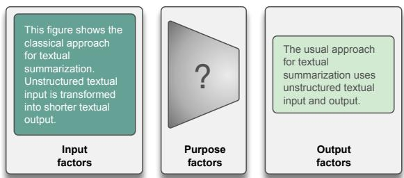

(a) Most current automatic text summarization techniques. Left: input document. Right: summary.  
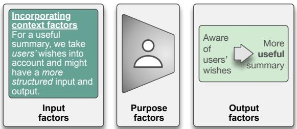  
(b) Example of summarizing while taking users’ wishes and desires into account. Left: input document. Right: summary.  
Figure 1: Example of most current summarization techniques vs. summarization while incorporating the users in the process.

Different user groups have different needs. Investigating these needs explicitly is critical, given the impact of adequate information transfer (Bennett et al., 2012). We propose a survey methodology to investigate these needs. In designing the survey, we take stock of past work by Spärck Jones (1998) who argues that in order to generate useful summaries, one should take the context of a summary into account—a statement that has been echoed by others (e.g., Mani, 2001a; Aries et al., 2019). To do this in a structured manner, Spärck Jones introduces three context factor classes: input factors, purpose factors and output factors, which respectively describe the input material, the purpose of the summary, and what the summary should look like. We structure our survey and its implications around these factors. In Figure 1 we give an example of incorporating the context factors in the design of automatic summarization methods.

Our proposed survey can be flexibly adjusted to different user groups. Here we turn our focus to university students as a first stakeholder group. University students are a particularly relevant group to focus on first, as they benefit from using pre-made summaries in a range of study activities (Reder and Anderson, 1980), but the desired characteristics of these pre-made summaries have not been extensively investigated. We use the word premade to differentiate such summaries from the ones that users write themselves. Automatically generated summaries fall in the pre-made category, and should thus have the characteristics that users wish for pre-made summaries.

Motivated by our findings, we propose important future research directions that directly impact the design, development, and evaluation of automatically generated summaries. We contribute the following:

C1 We design a survey that can be easily adapted and reused to investigate and understand the needs of the wide variety of users of automatically generated summaries;

C2 We develop a thorough understanding of how automatic summarization can optimally benefit users in the educational domain, which leads us to unravel important and currently underexposed research directions for automatic summarization;

C3 We propose a new, feasible and comprehensive evaluation methodology to explicitly evaluate the usefulness of a generated summary for its intended purpose.

## 2 Related work

In Section 1 we introduced the context factors as proposed by Spärck Jones (1998). Each context factor class can be divided into more fine-grained subclasses. To ensure the flow of the paper, we list an overview in Appendix A. Below, we explain and use the context factors and their fine-grained subclasses to structure the related work. As our findings have implications for the evaluation of automatic summarization, we also discuss evaluation methods. Lastly, we discuss the use-cases of automatic summaries in the educational domain.

## 2.1 Automatic text summarization

Input factors. We start with the fine-grained input factor unit, which describes how many sources are to be summarized at once, and the factor scale, which describes the length of the input data. These factors are related to the difference between single and multi-document summarization (e.g., Chopra et al., 2016; Cheng and Lapata, 2016; Wang et al., 2016; Yasunaga et al., 2017; Nallapati et al., 2017; Narayan et al., 2018b; Liu and Lapata, 2019). Scale plays an important role when material shorter than a single document is summarized, such as sentence summarization (e.g., Rush et al., 2015). Regarding the genre of the input material, most current work focuses on the news domain or Wikipedia (e.g., Sandhaus, 2008; Hermann et al., 2015; Koupaee and Wang, 2018; Liu et al., 2018; Narayan et al., 2018a). A smaller body of work addresses different input genres, such as scientific articles (e.g., Cohan et al., 2018), forum data (e.g., Völske et al., 2017), opinions (e.g., Amplayo and Lapata, 2020) or dialogues (e.g., Liu et al., 2021). These differences are also closely related to the input factor subject type, which describes the difficulty level of the input material. The factor medium refers to the input language. Most automatic summarization work is concerned with English as language input, although there are exceptions, such as Chinese (e.g., Hu et al., 2015) or multilingual input (Ladhak et al., 2020). The last input factor is structure. Especially in recent neural approaches, explicit structure of the input text is often ignored. Exceptions include graph-based approaches, where implicit document structure is used to summarize a document (e.g., Tan et al., 2017; Yasunaga et al., 2017), and summarization of tabular data (e.g., Zhang et al., 2020a) or screenplays (e.g., Papalampidi et al., 2020).

Purpose factors. Although identified as the most important context factor class by Spärck Jones (1998)—and followed by, for example, Mani (2001a)—purpose factors do not receive a substantial amount of attention. There are some exceptions, e.g., query-based summarization (e.g., Nema et al., 2017; Litvak and Vanetik, 2017), question-driven summarization (e.g., Deng et al., 2020), personalized summarization (e.g., Móro and Bieliková, 2012) and interactive summarization (e.g., Hirsch et al., 2021). They take the situation and the audience into account. The use-cases of the generated summaries are also clearer in these approaches.

Output factors. We start with the output factors style and material. The latter is concerned with the degree of coverage of the summary. Most generated summaries have an informative style and cover most of the input material. There are exceptions, e.g., the XSum dataset (Narayan et al., 2018a) which constructs summaries of a single sentence and is therefore more indicative in terms of style and inevitably less of the input material is covered. Not many summaries have a critical or aggregative style. Aggregative summaries put different source texts in relation to each other, to give a topic overview. Most popular summarization techniques focus on a running format. Work on templatebased (e.g., Cao et al., 2018) and faceted (e.g., Meng et al., 2021) summarization follows a more headed (structured) format. Falke and Gurevych (2017) build concept maps and Wu et al. (2020) make knowledge graphs. The difference between abstractive and extractive summarization is likely the best known distinction in output type (e.g., Nallapati et al., 2017; See et al., 2017; Narayan et al., 2018b; Gehrmann et al., 2018; Liu and Lapata, 2019), although it is not entirely clear which output factor best describes the difference.

In Section 5 we use the context factors to identify future research directions, based on the difference between our findings and the related work.

## 2.2 Evaluation

Evaluation methods for automatic summarization can be grouped in intrinsic vs. extrinsic methods (Mani, 2001b). Intrinsic methods evaluate the model itself, e.g., on informativeness or fluency (Paulus et al., 2018; Liu and Lapata, 2019). Extrinsic methods target how a summary performs when used for a task (Dorr et al., 2005; Wang et al., 2020). Extrinsic methods are resource intensive, explaining the popularity of intrinsic methods.

Evaluation methods can also be grouped in automatic vs. human evaluation methods. Different automatic metrics have been proposed, such as Rouge (Lin, 2004) and BERTScore (Zhang et al., 2020b) which respectively evaluate lexical and semantic similarity. Other methods use an automatic question-answering evaluation methodology (Wang et al., 2020; Durmus et al., 2020). Most human evaluation approaches evaluate intrinsic factors such as informativeness, readability and conciseness (DUC, 2003; Nallapati et al., 2017; Paulus et al., 2018; Liu and Lapata, 2019)—factors that are difficult to evaluate automatically. There are also some extrinsic human evaluation methods, where judges are asked to perform a certain task based on the summary (e.g., Narayan et al., 2018b). So far, usefulness1 has not been evaluated in a feasible and comprehensive manner, whereas it is an important metric to evaluate whether summaries fulfil users’ needs. Therefore, we bridge the gap by introducing a feasible and comprehensive evaluation methodology to evaluate usefulness.

## 2.3 Automatic summarization for education

Summaries play a prominent role in education. Reder and Anderson (1980) find that students who use a pre-made summary score better on a range of study activities than students who do not use such a summary. As the quality of automatically generated summaries increases (e.g., Lewis et al., 2020; Xu et al., 2020), so does the potential to use them in the educational domain, especially given the increasing importance of digital tools and devices for education (Luckin et al., 2012; Hashim, 2018). With these developments in mind, it is critical that educators are aware of the pedagogical implications; they need to understand how to best make use of all new possibilities (Hashim, 2018; Amhag et al., 2019). The outcomes of our survey result in concrete suggestions for developing methods for automatic summarization in the educational domain, whilst taking students’ needs into account.

## 3 Survey Procedure and Participants

Here we detail our survey procedure. For concreteness, we present the details with our intended target group in mind. The context factors form the backbone of our survey and the setup can be easily adjusted to investigate the needs of different target groups. For example, we ask participants about a pre-made summary for a recent study activity, but it is straightforward to adapt this to a different use-case that is more suitable for other user groups.

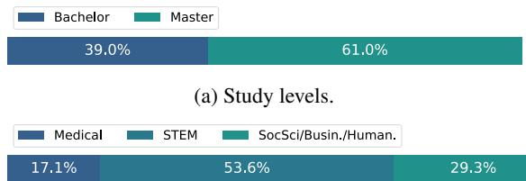  
(b) Study backgrounds.  
Figure 2: Participant details.

## 3.1 Participants

We recruited participants among students at universities across the Netherlands by contacting ongoing courses and student associations, and by advertisements on internal student websites. As incentive, we offered a ten euro shopping voucher to ten randomly selected participants.

A total of 118 participants started the survey and 82 completed the full survey, resulting in a 69.5% completion rate. We only include participants who completed the study in our analysis. Participants spent 10 minutes on average on the survey. In the final part of our survey we ask participants to indicate their current level of education and main field of study. The details are given in Figure 2.

## 3.2 Survey procedure

Figure 3 shows a brief overview of our survey procedure. A detailed account is given in Appendix B. We arrived at the final survey version after a number of pilot runs where we ensured participants understood their task and all questions. We ran the survey with SurveyMonkey (surveymonkey.com). A verbatim copy is included in Appendix C and released under CC BY license.2

Introduction. The survey starts with an introduction where we explain what to expect, how we process the data and that participation is voluntary. After participants agree with this, an explanation of the term pre-made summary follows. As we do not want to bias participants by stating that the summary was automatically generated, we explain that the summary can be made by anyone, e.g., a teacher, a good performing fellow student, the authors of the original material, or a computer. Recall that an automatically generated summary is a pre-made summary. Hence, our survey identifies the characteristics an automatically generated summary should have. We also give examples of types of pre-made summaries; based on the pilot experiments we noticed that people missed this information. We explicitly state that these are just examples and that participants can come up with any example of a helpful pre-made summary.

Context factors. In the main part of our survey we focus on the context factors. First, we ask participants whether they have made use of a pre-made summary in one of their recent study activities. If so, we ask them to choose the study activity where a summary was most useful. We call this group the Remembered group, as they describe an existing summary from memory. If people indicate that they have not used a pre-made summary in one of their recent study activities, we ask them whether they can imagine a situation where a pre-made summary would have been helpful. If not, we ask them why not and lead them to the final background questions and closing page. If yes, we ask them to keep this imaginary situation in mind for the rest of the survey. We call this group the Imagined group.

Now we ask the Remembered and Imagined groups about the input, purpose and output factors of the summary they have in mind. We ask questions for each of the context factor subclasses that we discussed in Section 2. At this point, the two groups are in different branches of the survey. The difference is mainly linguistically motivated: in the Imagined group we use verbs of probability instead of asking to describe an existing situation. Some questions can only be asked in the Remembered group, e.g., how helpful the summary was.

In the first context factor question we ask what the study material consisted of. We give a number of options, as well as an ‘other’ checkbox. To avoid position bias, all answer options for multiple choice and multiple response questions in the survey are randomized, with the ‘other’ checkbox always as the last option. If participants do not choose the ‘mainly text’ option, we tell them that we focus on textual input in the current study3 and ask whether they can think of a situation where the input did consist of text. If not, we lead them to the background questions and closing page. If yes, they proceed to the questions that give us a full overview of the input, purpose and output factors of the situation participants have in mind. Finally, we ask the Remembered group to suggest how their described summary could be turned into their ideal summary. We then ask both groups for any final remarks about the summary or input material.

  
Figure 3: Overview of the survey procedure.

Trustworthiness and future features questions. So far we have included the possibility that the summary was machine-generated, but also explicitly included other options so as not to bias participants. At this point we acknowledge that machinegenerated summaries could give rise to additional challenges and opportunities. Hence, we include some exploratory questions to get an understanding of the trust users would have in machine-generated summaries and to get ideas for the interpretation of the context factors in exploratory settings.

For the first questions we tell participants to imagine that the summary was made by a computer, but contained all needs identified in the first part of the survey. We then ask them about trust in computer- and human-generated summaries. Next, we ask them to imagine that they could interact with the computer program that made the summary in the form of a digital assistant. We tell them not to feel restricted by the capabilities of today’s digital assistants. The verbatim text is given in Appendix C. We ask participants to select the three most and the three least useful features for the digital assistant, similar to ter Hoeve et al. (2020).

## 4 Results

For each question we examine the outcomes of all respondents together and of different subgroups (Table 1). For space and clarity reasons, we present the results of all respondents together, unless interesting differences between groups are found. We use the question formulations as used for the Remembered group and abbreviate answer options. Answers to multiple choice and multiple response questions are presented in an aggregated manner and we ensure that none of the open answers can be used to identify individual participants.

## 4.1 Identifying branches

Of our participants, 78.0% were led to the Remembered branch and of the remaining 22.0%, 78.2% were led to the Imagined branch. We asked the few remaining participants why they could not think of a case where a pre-made summary could be useful for them. People answered that they would not trust such a summary and that making a summary themselves helped with their study activities.

1 All respondents together   
2 Remembered branch vs Imagined branch   
3 Different study fields   
4 Different study levels   
5 Different levels of how helpful the summary   
was according to participants, rated on a   
5-point Likert scale (note that only the re  
membered group answered this question)  
Table 1: Levels of investigation. We did not find significant differences for each, but add all for completeness.

## 4.2 Input factors

Figure 4 shows the input factor results. We highlight some here. Textual input is significantly more popular than other input types (Figure 4a),4 stressing the relevance of automatic text summarization. People described a diverse input for scale and unit (Figure 4b), much more than the classical focus of automatic summarization suggests. Most input had a considerable amount of structure (Figure 4e). Structure is often discarded in automatic summarization, although it can be very informative.

## 4.3 Purpose factors

Figure 5 shows the purpose factor results. Participants indicated that the summary was helpful or very helpful (Figure 5f), which allows us to draw valid conclusions from the survey.5 We now highlight some results from the other questions in this category. For the intended audience of the summaries, students selected level (4) and (5) (“a lot (4) or full (5) domain knowledge is expected from the users of the summary") significantly more often than the other options (Figure 5d). Although perhaps unsurprising given our target group, it is an important outcome as this requires a different level of detail than, for example, a brief overview of a news article. People used the summaries for many different use-cases (Figure 5e), whereas current research on automatic summarization mainly focuses on giving an overview of the input. We show the results for the Remembered vs. Imagined splits, as the Imagined group chose refresh memory and overview more often than the Remembered group (Fisher’s exact test, $p < 0 . 0 5 )$ . Although not significant after a Bonferroni correction, this can still be insightful for future research directions. Lastly, participants in the Imagined group ticked more boxes than participants in the Remembered group: 3.33 vs. 2.57 per participant on average, stressing the importance of considering many different use-cases for automatically generated summaries.

(a) Medium: The study material consisted of (MC)  
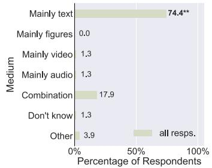

(b) Scale / Unit: What was the length of the study material? (MC)  
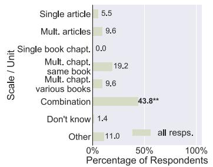

(c) Genre: What was the genre of the study material? (MC)  
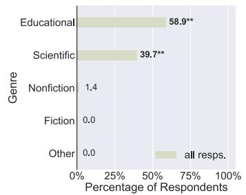  
(e) Structure: How was the study material structured? (MR)

(d) Subject Type: How would you classify the difficulty level of the study material? (MC)  
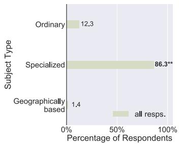

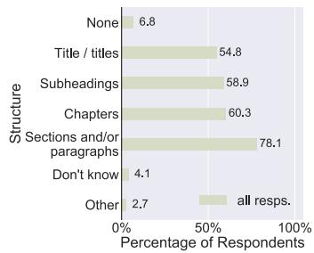  
Figure 4: Results for the input factor questions. Specific input factor in italics. Answer type in brackets: MC = Multiple Choice, MR = Multiple Response. \*\* indicates significance $( \chi ^ { 2 } )$ , after Bonferroni correction, with $p \ll 0 . 0 0 1$ . If two options are flagged with \*\*, these options are not significantly different from each other, yet both have been chosen significantly more often than the other options.

## 4.4 Output factors

Figure 6 shows the results for the output factor questions. Textual summaries were significantly more popular than other summary types (Figure 6a), which again stresses the importance of automatic text summarization. Most participants indicated that the summary covered (or should cover) most of the input material (Figure 6c). For the output factor style we find an interesting difference between the Remembered and Imagined group (Figure 6d). Whereas the Remembered group described significantly more often an informative summary, the Imagined group opted significantly more often for a critical or aggregative summary. Most research on automatic summarization focusses on informative summaries only. For the output factor structure (Figure 6b), people described a substantially richer format of the pre-made summaries than adopted in most research on automatic summarization. Instead of simply a running text, the vast majority of people indicated that the summary contained (or should contain) structural elements such as special formatting, diagrams, headings, etc. Moreover, the Imagined group ticked more answer boxes on average than the Remembered group: 4.17 vs. 3.56 per participant, indicating a desire for structure in the generated summaries, which is supported by the open answer questions.

Open answer questions. We asked participants in the Remembered group how the summary could be transformed into their ideal summary and 86.9% of these participants made suggestions. Many of those include adding additional structural elements to the summary, like figures, tables or structure in the summary text itself. For example, one of the participants wrote: “An ideal summary is good enough to fully replace the original (often longer) texts contained in articles that need to be readfor exams. The main purpose behind this is speed of learning from my experience. More tables, graphs and visual representations ofthe study material and (a) Situation (1): What was the goal of this study activity? (MC)

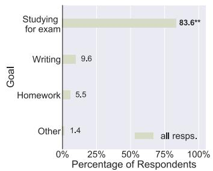  
(d) Audience: For what type of people was the summary intended? (LS)

(b) Situation (2): Who made this premade summary? (MC, Only if Remembered)

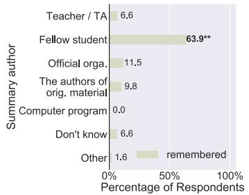  
(e) Use (1): How did this summary help you with your task? (MR)

(c) Situation (3): The summary was made specifically to help me (and potentially my fellow students) with my study activity (LS, Only if Remembered)

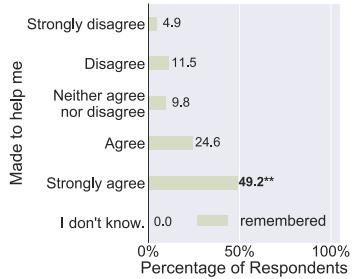  
(f) Use (2): Overall, how helpful was the pre-made summary for you? (LS, Only if Remembered)

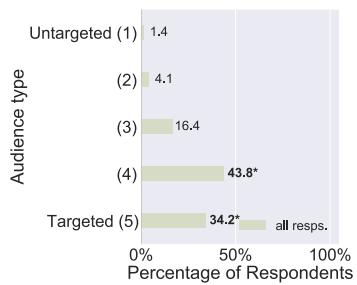

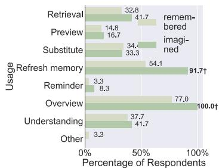

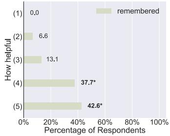  
Figure 5: Results for thepurposefactor questions. Specific purpose factor in italics. Answer type in brackets: MC = Multiple Choice, MR = Multiple Response, LS = Likert Scale. \*\* indicates significance $( \hat { \chi } ^ { 2 } )$ , after Bonferroni correction, with $p \ll 0 . 0 0 1 , *$ with $p < 0 . 0 5$ . indicates noteworthy results where significance was lost after correction for the number of tests. If two options are flagged, these options are not significantly different from each other, yet both were chosen significantly more often than the other options.

key concepts / links would improve the summary, as I wouldfaster comprehend the study material.” Another participant wrote: “– colors and a key for color-coding – different sections, such as definitions on the left maybe and then the rest ofthe page reflects the structure of the course material with notes on the readings that have many headings and subheadings.”

Another theme is the desire to have more examples in the summary. One participant wrote: “More examples i think. For me personally i need examples to understand the material. Now i needed to imagine them myself”.

Some participants wrote that they would like a more personalized summary, for example: “I’d highlight some things I find difficult. So I’d personalise the summary more.” Another participant wrote: “Make it more personalized may be. These notes were by another student. I might have focussed more on some parts and less on others.”

## 4.5 Trustworthiness and future features

Of all participants, 48.0% indicated that it would not make a difference to them whether a summary is machine- or human-generated, as long as the quality is as good as a human-generated one. This last point is reflected in which types of summaries participants would trust more. People opted significantly more often for a human-generated one. For the future feature questions, adding more details to the summary and answering questions based on the content of the summary were very popular. We give a full account in Appendix D.

## 5 Implications and Perspectives

## 5.1 Future research directions

Our findings have important implications for the design and development of future automatic summarization methods. We present these in Table 2, per context factor. Summarizing, the research developments as summarized in Section 2 are encouraging, yet given that automatic summarization methods increasingly mediate people’s lives, we argue that more attention should be devoted to its stakeholders, i.e., to the purpose factors. Here we have shown that students, an important stakeholder group, have different expectations of pre-made summaries than what most automatic summarization methods offer. These differences include the type of input material that is to be summarized, but also how these summaries are presented. Presum-

(a) Format (1): What was the type of the summary? (MC)  
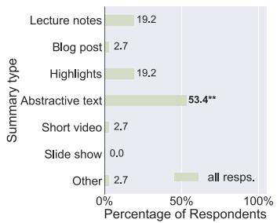

(b) Format (2): How was the summary structured? (MR)  
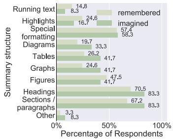

(c) Material: How much of the study material was covered by the summary? (LS)  
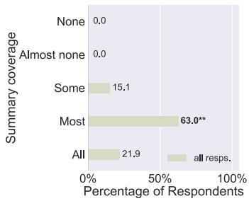

(d) Style: What was the style of this summary? (MC)  
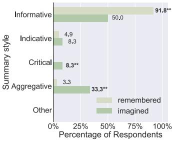  
Figure 6: Results for the output factor questions. Specific output factor in italics. Answer type in brackets: MC = Multiple Choice, MR = Multiple Response, LS = Likert Scale. \*\* indicates significance $( \chi ^ { 2 }$ or Fisher’s exact test), after Bonferroni correction, with $p \ll 0 . 0 0 1$ , \* with $p < 0 . 0 5$  
Table 2: Implications for future research directions.

## Input Factors

Stronger focus on developing methods that can:

handle a wide variety and a mixture of different types of input documents at once;

understand the relationships between different input documents;

use the structure of the input document(s).

## Purpose Factors

Explicitly define a standpoint on the purpose factors in each research project;

Include a comprehensive evaluation methodology to evaluate usefulness. We propose this in Section 5.2.

## Output Factors

Stronger focus on developing methods that can:

output different summary styles, e.g., informative, aggregative or critical. Especially the last two require a deeper understanding of the input material than current models have;

explicitly model and understand relationships between different elements in the summary and potentially relate this back to the input document(s).

ably, this also holds for other stakeholder groups and thus we hope to see our survey used for different target groups in the future.

Datasets. To support these future directions we need to expand efforts on using and collecting a wide variety of datasets. Most recent data collection efforts are facilitating different input factors – the purpose and output factors need more emphasis. Our findings also impact the evaluation of summarization methods. We discuss this next.

## 5.2 Usefulness as evaluation methodology

Following Spärck Jones (1998) and Mani (2001a), we argue that a good choice of context factors is crucial in producing useful summaries for users. It is important to explicitly evaluate this. The few existing methods to evaluate usefulness are very resource demanding (e.g., Riccardi et al., 2015) or not comprehensive enough (e.g., DUC, 2003; Dorr et al., 2005). Thus, we propose a feasible and comprehensive method to evaluate usefulness.

For the evaluation methodology, we again use the context factors. Before the design and development of the summarization method the intended purpose factors need to be defined. Especially the fine-grained factor use is important here. Next, the output factors need to be evaluated on the use factors. For this, we take inspiration from research on simulated work tasks (Borlund, 2003). Evaluators should be given a specific task to imagine, e.g., writing a news article, or studying for an exam. This task should be relatable to the evaluators, so that reliable answers can be obtained (Borlund, 2016). With this task in mind, evaluators should be asked to judge two summaries in a pairwise manner on their usefulness, in the following format: The [output factor] of which of these two summaries is most useful to you to [use factor]? For example: The style ofwhich ofthese two summaries is most useful to you to substitute a chapter that you need to learn for your exam preparation? It is critical to ensure that judges understand the meaning of each of the evaluation criteria – style and substitute in the example. We provide example questions for each of the use and output factors in Appendix E.

## 6 Conclusion

In this paper we focused on users of automatically generated summaries and argued for a stronger emphasis on their needs in the design, development and evaluation of automatic summarization methods. We led by example and proposed a survey methodology to identify these needs. Our survey is deeply grounded in past work by Spärck Jones (1998) on context factors for automatic summarization and can be re-used to investigate a wide variety of users. In this work we use our survey to investigate the needs of university students, an important target group of automatically generated summaries. We found that the needs identified by our participants are not fully supported by current automatic summarization methods and we proposed future research directions to accommodate these needs. Finally, we proposed an evaluation methodology to evaluate the usefulness of automatically generated summaries.

## 7 Ethical Impact

With this work we hope to take a step in the right direction to make research into automatic summarization more inclusive, by explicitly taking the needs of users of these summaries into account. As stressed throughout the paper, these needs are different per user group and therefore it is critical that a wide variety of user groups will be investigated. There might also be within group differences. For example, in this work we have focussed on students from universities in one country, but students attending universities in other geographical locations and with different cultures might express different needs. It is important to take these considerations into account, to limit the risk of overfitting on a particular user group and potentially harming other user groups.

## Acknowledgements

We thank Jacobijn Sandberg and Ana Lucic for helpful comments and feedback. This research was supported by the Nationale Politie. All content represents the opinion of the authors, which is not necessarily shared or endorsed by their respective employers and/or sponsors.

## References

Lisbeth Amhag, Lisa Hellström, and Martin Stigmar. 2019. Teacher educators’ use of digital tools and needs for digital competence in higher education. Journal of Digital Learning in Teacher Education, 35(4):203–220.

Reinald Kim Amplayo and Mirella Lapata. 2020. Unsupervised opinion summarization with noising and denoising. In Proceedings of the 58th Annual Meeting of the Association for Computational Linguistics, pages 1934–1945, Online. Association for Computational Linguistics.

Abdelkrime Aries, Djamel Eddine Zegour, and Walid-Khaled Hidouci. 2019. Automatic text summarization: What has been done and what has to be done. CoRR, abs/1904.00688.

Paul N. Bennett, Ryen W. White, Wei Chu, Susan T. Dumais, Peter Bailey, Fedor Borisyuk, and Xiaoyuan Cui. 2012. Modeling the impact of shortand long-term behavior on search personalization. In The 35th International ACM SIGIR conference on research and development in Information Retrieval, SIGIR ’12, Portland, OR, USA, August 12-16, 2012, pages 185–194. ACM.

Pia Borlund. 2003. The IIR evaluation model: a framework for evaluation of interactive information retrieval systems. Information Research, 8(3).

Pia Borlund. 2016. A study of the use of simulated work task situations in interactive information retrieval evaluations: A meta-evaluation. J. Documentation, 72(3):394–413.

Ziqiang Cao, Wenjie Li, Sujian Li, and Furu Wei. 2018. Retrieve, rerank and rewrite: Soft template based neural summarization. In Proceedings of the 56th Annual Meeting of the Association for Computational Linguistics (Volume 1: Long Papers),

pages 152–161, Melbourne, Australia. Association for Computational Linguistics.

Jianpeng Cheng and Mirella Lapata. 2016. Neural summarization by extracting sentences and words. In Proceedings of the 54th Annual Meeting of the Association for Computational Linguistics (Volume 1: Long Papers), pages 484–494, Berlin, Germany. Association for Computational Linguistics.

Sumit Chopra, Michael Auli, and Alexander M. Rush. 2016. Abstractive sentence summarization with attentive recurrent neural networks. In Proceedings of the 2016 Conference of the North American Chapter ofthe Associationfor Computational Linguistics: Human Language Technologies, pages 93–98, San Diego, California. Association for Computational Linguistics.

Arman Cohan, Franck Dernoncourt, Doo Soon Kim, Trung Bui, Seokhwan Kim, Walter Chang, and Nazli Goharian. 2018. A discourse-aware attention model for abstractive summarization of long documents. In Proceedings of the 2018 Conference of the North American Chapter of the Association for Computational Linguistics: Human Language Technologies, Volume 2 (Short Papers), pages 615–621, New Orleans, Louisiana. Association for Computational Linguistics.

Yang Deng, Wenxuan Zhang, and Wai Lam. 2020. Multi-hop inference for question-driven summarization. In Proceedings of the 2020 Conference on Empirical Methods in Natural Language Processing (EMNLP), pages 6734–6744, Online. Association for Computational Linguistics.

Jacob Devlin, Ming-Wei Chang, Kenton Lee, and Kristina Toutanova. 2019. BERT: Pre-training of deep bidirectional transformers for language understanding. In Proceedings of the 2019 Conference of the North American Chapter of the Association for Computational Linguistics: Human Language Technologies, Volume 1 (Long and Short Papers), pages 4171–4186, Minneapolis, Minnesota. Association for Computational Linguistics.

Bonnie Dorr, Christof Monz, Stacy President, Richard Schwartz, and David Zajic. 2005. A methodology for extrinsic evaluation of text summarization: Does ROUGE correlate? In Proceedings of the ACL Workshop on Intrinsic and Extrinsic Evaluation Measures for Machine Translation and/or Summarization, pages 1–8, Ann Arbor, Michigan. Association for Computational Linguistics.

DUC. 2003. Duc 2003: Documents, tasks, and measures. https://duc.nist.gov/duc2003/ tasks.html.

Esin Durmus, He He, and Mona Diab. 2020. FEQA: A question answering evaluation framework for faithfulness assessment in abstractive summarization. In

Proceedings of the 58th Annual Meeting of the Association for Computational Linguistics, pages 5055– 5070, Online. Association for Computational Linguistics.

Tobias Falke and Iryna Gurevych. 2017. Bringing structure into summaries: Crowdsourcing a benchmark corpus of concept maps. In Proceedings of the 2017 Conference on Empirical Methods in Natural Language Processing, EMNLP 2017, Copenhagen, Denmark, September 9-11, 2017, pages 2951–2961. Association for Computational Linguistics.

Sebastian Gehrmann, Yuntian Deng, and Alexander Rush. 2018. Bottom-up abstractive summarization. In Proceedings of the 2018 Conference on Empirical Methods in Natural Language Processing, pages 4098–4109, Brussels, Belgium. Association for Computational Linguistics.

Ben Goodrich, Vinay Rao, Peter J. Liu, and Mohammad Saleh. 2019. Assessing the factual accuracy of generated text. In Proceedings of the 25th ACM SIGKDD International Conference on Knowledge Discovery & Data Mining, KDD 2019, Anchorage, AK, USA, August 4-8, 2019, pages 166–175. ACM.

Harwati Hashim. 2018. Application of technology in the digital era education. International Journal of Research in Counseling and Education, 2(1):1–5.

Karl Moritz Hermann, Tomás Kociský, Edward Grefenstette, Lasse Espeholt, Will Kay, Mustafa Suleyman, and Phil Blunsom. 2015. Teaching machines to read and comprehend. In Advances in Neural Information Processing Systems 28: Annual Conference on Neural Information Processing Systems 2015, December 7-12, 2015, Montreal, Quebec, Canada, pages 1693–1701.

Eran Hirsch, Alon Eirew, Ori Shapira, Avi Caciularu, Arie Cattan, Ori Ernst, Ramakanth Pasunuru, Hadar Ronen, Mohit Bansal, and Ido Dagan. 2021. iFacetSum: Coreference-based interactive faceted summarization for multi-document exploration. In Proceedings of the 2021 Conference on Empirical Methods in Natural Language Processing: System Demonstrations, pages 283–297, Online and Punta Cana, Dominican Republic. Association for Computational Linguistics.

Baotian Hu, Qingcai Chen, and Fangze Zhu. 2015. LC-STS: A large scale Chinese short text summarization dataset. In Proceedings of the 2015 Conference on Empirical Methods in Natural Language Processing, pages 1967–1972, Lisbon, Portugal. Association for Computational Linguistics.

Mahnaz Koupaee and William Yang Wang. 2018. Wikihow: A large scale text summarization dataset. CoRR, abs/1810.09305.

Faisal Ladhak, Esin Durmus, Claire Cardie, and Kathleen McKeown. 2020. WikiLingua: A new benchmark dataset for cross-lingual abstractive summa-

rization. In Findings of the Association for Computational Linguistics: EMNLP 2020, pages 4034– 4048, Online. Association for Computational Linguistics.

Mike Lewis, Yinhan Liu, Naman Goyal, Marjan Ghazvininejad, Abdelrahman Mohamed, Omer Levy, Veselin Stoyanov, and Luke Zettlemoyer. 2020. BART: Denoising sequence-to-sequence pretraining for natural language generation, translation, and comprehension. In Proceedings of the 58th Annual Meeting of the Association for Computational Linguistics, pages 7871–7880, Online. Association for Computational Linguistics.

Chin-Yew Lin. 2004. ROUGE: A package for automatic evaluation of summaries. In Text Summarization Branches Out, pages 74–81, Barcelona, Spain. Association for Computational Linguistics.

Marina Litvak and Natalia Vanetik. 2017. Query-based summarization using MDL principle. In Proceedings of the Workshop on Summarization and Summary Evaluation Across Source Types and Genres, MultiLing@EACL 2017, Valencia, Spain, April 3, 2017, pages 22–31. Association for Computational Linguistics.

Junpeng Liu, Yanyan Zou, Hainan Zhang, Hongshen Chen, Zhuoye Ding, Caixia Yuan, and Xiaojie Wang. 2021. Topic-aware contrastive learning for abstractive dialogue summarization. In Findings of the Association for Computational Linguistics: EMNLP 2021, pages 1229–1243, Punta Cana, Dominican Republic. Association for Computational Linguistics.

Peter J. Liu, Mohammad Saleh, Etienne Pot, Ben Goodrich, Ryan Sepassi, Lukasz Kaiser, and Noam Shazeer. 2018. Generating wikipedia by summarizing long sequences. In 6th International Conference on Learning Representations, ICLR 2018, Vancouver, BC, Canada, April 30 - May 3, 2018, Conference Track Proceedings. OpenReview.net.

Yang Liu and Mirella Lapata. 2019. Text summarization with pretrained encoders. In Proceedings of the 2019 Conference on Empirical Methods in Natural Language Processing and the 9th International Joint Conference on Natural Language Processing (EMNLP-IJCNLP), pages 3730–3740, Hong Kong, China. Association for Computational Linguistics.

Rosemary Luckin, Brett Bligh, Andrew Manches, Shaaron Ainsworth, Charles Crook, and Richard Noss. 2012. Decoding learning: The proof, promise and potential ofdigital education. Nesta.

Inderjeet Mani. 2001a. Automatic summarization, volume 3. John Benjamins Publishing.

Inderjeet Mani. 2001b. Summarization evaluation: An overview. In Proceedings ofthe Third Second Workshop Meeting on Evaluation ofChinese & Japanese Text Retrieval and Text Summarization, NTCIR-2, Tokyo, Japan, March 7-9, 2001. National Institute of Informatics (NII).

Rui Meng, Khushboo Thaker, Lei Zhang, Yue Dong, Xingdi Yuan, Tong Wang, and Daqing He. 2021. Bringing structure into summaries: a faceted summarization dataset for long scientific documents. In Proceedings of the 59th Annual Meeting of the Association for Computational Linguistics and the 11th International Joint Conference on Natural Language Processing (Volume 2: Short Papers), pages 1080–1089, Online. Association for Computational Linguistics.

Róbert Móro and Mária Bieliková. 2012. Personalized text summarization based on important terms identification. In 23rd International Workshop on Database and Expert Systems Applications, DEXA 2012, Vienna, Austria, September 3-7, 2012, pages 131–135. IEEE Computer Society.

Ramesh Nallapati, Feifei Zhai, and Bowen Zhou. 2017. Summarunner: A recurrent neural network based sequence model for extractive summarization of documents. In Proceedings of the Thirty-First AAAI Conference on Artificial Intelligence, February 4-9, 2017, San Francisco, California, USA, pages 3075– 3081. AAAI Press.

Shashi Narayan, Shay B. Cohen, and Mirella Lapata. 2018a. Don’t give me the details, just the summary! topic-aware convolutional neural networks for extreme summarization. In Proceedings of the 2018 Conference on Empirical Methods in Natural Language Processing, Brussels, Belgium, October 31 - November 4, 2018, pages 1797–1807. Association for Computational Linguistics.

Shashi Narayan, Shay B. Cohen, and Mirella Lapata. 2018b. Ranking sentences for extractive summarization with reinforcement learning. In Proceedings of the 2018 Conference of the North American Chapter ofthe Associationfor Computational Linguistics: Human Language Technologies, Volume 1 (Long Papers), pages 1747–1759, New Orleans, Louisiana. Association for Computational Linguistics.

Preksha Nema, Mitesh M. Khapra, Anirban Laha, and Balaraman Ravindran. 2017. Diversity driven attention model for query-based abstractive summarization. In Proceedings of the 55th Annual Meeting of the Association for Computational Linguistics (Volume 1: Long Papers), pages 1063–1072, Vancouver, Canada. Association for Computational Linguistics.

Ani Nenkova and Rebecca Passonneau. 2004. Evaluating content selection in summarization: The pyramid method. In Proceedings of the Human Language Technology Conference of the North American Chapter of the Association for Computational Linguistics: HLT-NAACL 2004, pages 145–152, Boston, Massachusetts, USA. Association for Computational Linguistics.

Pinelopi Papalampidi, Frank Keller, Lea Frermann, and Mirella Lapata. 2020. Screenplay summarization using latent narrative structure. In Proceedings of the

58th Annual Meeting of the Association for Computational Linguistics, pages 1920–1933, Online. Association for Computational Linguistics.

Romain Paulus, Caiming Xiong, and Richard Socher. 2018. A deep reinforced model for abstractive summarization. In 6th International Conference on Learning Representations, ICLR 2018, Vancouver, BC, Canada, April 30 - May 3, 2018, Conference Track Proceedings. OpenReview.net.

Lynne M Reder and John R Anderson. 1980. A comparison of texts and their summaries: Memorial consequences. Journal of Verbal Learning and Verbal Behavior, 19(2):121–134.

Giuseppe Riccardi, Frédéric Béchet, Morena Danieli, Benoît Favre, Robert J. Gaizauskas, Udo Kruschwitz, and Massimo Poesio. 2015. The SEN-SEI project: Making sense of human conversations. In Future and Emergent Trends in Language Technology - First International Workshop, FETLT 2015, Seville, Spain, November 19-20, 2015, Revised Selected Papers, volume 9577 of Lecture Notes in Computer Science, pages 10–33. Springer.

Alexander M. Rush, Sumit Chopra, and Jason Weston. 2015. A neural attention model for abstractive sentence summarization. In Proceedings of the 2015 Conference on Empirical Methods in Natural Language Processing, pages 379–389, Lisbon, Portugal. Association for Computational Linguistics.

Evan Sandhaus. 2008. The New York Times annotated corpus. Linguistic Data Consortium, Philadelphia, 6(12):e26752.

Abigail See, Peter J. Liu, and Christopher D. Manning. 2017. Get to the point: Summarization with pointergenerator networks. In Proceedings of the 55th Annual Meeting of the Association for Computational Linguistics (Volume 1: Long Papers), pages 1073– 1083, Vancouver, Canada. Association for Computational Linguistics.

Karen Spärck Jones. 1998. Automatic summarizing: factors and directions. In Advances in automatic text summarization, 1, pages 1–12. MIT press Cambridge, Mass, USA.

Jiwei Tan, Xiaojun Wan, and Jianguo Xiao. 2017. Abstractive document summarization with a graphbased attentional neural model. In Proceedings of the 55th Annual Meeting of the Association for Computational Linguistics (Volume 1: Long Papers), pages 1171–1181, Vancouver, Canada. Association for Computational Linguistics.

Maartje ter Hoeve, Robert Sim, Elnaz Nouri, Adam Fourney, Maarten de Rijke, and Ryen W. White. 2020. Conversations with documents: An exploration of document-centered assistance. In CHIIR ’20: Conference on Human Information Interaction and Retrieval, Vancouver, BC, Canada, March 14- 18, 2020, pages 43–52. ACM.

Ashish Vaswani, Noam Shazeer, Niki Parmar, Jakob Uszkoreit, Llion Jones, Aidan N. Gomez, Lukasz Kaiser, and Illia Polosukhin. 2017. Attention is all you need. In Advances in Neural Information Processing Systems 30: Annual Conference on Neural Information Processing Systems 2017, December 4- 9, 2017, Long Beach, CA, USA, pages 5998–6008.

Michael Völske, Martin Potthast, Shahbaz Syed, and Benno Stein. 2017. TL;DR: Mining Reddit to learn automatic summarization. In Proceedings of the Workshop on New Frontiers in Summarization, pages 59–63, Copenhagen, Denmark. Association for Computational Linguistics.

Alex Wang, Kyunghyun Cho, and Mike Lewis. 2020. Asking and answering questions to evaluate the factual consistency of summaries. In Proceedings of the 58th Annual Meeting of the Association for Computational Linguistics, pages 5008–5020, Online. Association for Computational Linguistics.

Lu Wang, Hema Raghavan, Vittorio Castelli, Radu Florian, and Claire Cardie. 2016. A sentence compression based framework to query-focused multidocument summarization. CoRR, abs/1606.07548.

Zeqiu Wu, Rik Koncel-Kedziorski, Mari Ostendorf, and Hannaneh Hajishirzi. 2020. Extracting summary knowledge graphs from long documents. CoRR, abs/2009.09162.

Yuexiang Xie, Fei Sun, Yang Deng, Yaliang Li, and Bolin Ding. 2021. Factual consistency evaluation for text summarization via counterfactual estimation. In Findings of the Association for Computational Linguistics: EMNLP 2021, Virtual Event / Punta Cana, Dominican Republic, 16-20 November, 2021, pages 100–110. Association for Computational Linguistics.

Jiacheng Xu, Zhe Gan, Yu Cheng, and Jingjing Liu. 2020. Discourse-aware neural extractive text summarization. In Proceedings ofthe 58th Annual Meeting of the Association for Computational Linguistics, pages 5021–5031, Online. Association for Computational Linguistics.

Michihiro Yasunaga, Rui Zhang, Kshitijh Meelu, Ayush Pareek, Krishnan Srinivasan, and Dragomir Radev. 2017. Graph-based neural multi-document summarization. In Proceedings of the 21st Conference on Computational Natural Language Learning (CoNLL 2017), pages 452–462, Vancouver, Canada. Association for Computational Linguistics.

Shuo Zhang, Zhuyun Dai, Krisztian Balog, and Jamie Callan. 2020a. Summarizing and exploring tabular data in conversational search. In Proceedings ofthe 43rd International ACM SIGIR conference on research and development in Information Retrieval, SIGIR 2020, Virtual Event, China, July 25-30, 2020, pages 1537–1540. ACM.

Tianyi Zhang, Varsha Kishore, Felix Wu, Kilian Q. Weinberger, and Yoav Artzi. 2020b. Bertscore: Evaluating text generation with BERT. In 8th International Conference on Learning Representations, ICLR 2020, Addis Ababa, Ethiopia, April 26-30, 2020. OpenReview.net.

A Overview context factors
<table><tr><td>Input Factors</td><td>Purpose Factors</td><td>Output Factors</td></tr><tr><td>Form</td><td>Situation Tied: It is known who will use</td><td>Material Covering: The summary covers</td></tr><tr><td>Structure: How is the input text structured? E.g., subheadings, rhetorical patterns, etc. Scale: How large is the input data that we are summarizing?</td><td>the summary, for what purpose and when. Floating: It is not (exactly) known who will use the sum-</td><td>all of the important information in the source text. Partial: The summary (inten- tionally) covers only parts of</td></tr><tr><td>E.g., a book, a chapter, a single article, etc. Medium: What is the input lan- guage type? E.g., full text, tele- graphese style, etc. This also</td><td>mary, for what purpose or when. Audience</td><td>the important information in the source text. Format</td></tr><tr><td>refers to which natural language is used. Genre: What type of literacy does the input text have? E.g.,</td><td>Targetted: A lot of domain</td><td>Running: The summary is for-</td></tr><tr><td>description, narrative, etc. Subject Type</td><td>knowledge is expected from the readers of the summary. Untargetted: No domain knowl-</td><td>matted as an abstract like text. Headed: The summary is struc-</td></tr><tr><td></td><td>edge is expected from the read- ers of the summary.</td><td>tured following a certain stan- dardised format with headings and other explicit structure.</td></tr><tr><td>Ordinary: Everyone could un- derstand this input type. Specialized: You need to speak</td><td>Use Retrieving: Use the summary to</td><td>Style Informative: The summary con-</td></tr><tr><td>the jargon to understand this in- put type. Restricted: The input type text</td><td>retrieve source text. Previewing: Use the summary</td><td>veys the raw information that is in the source text. Indicative: The summary just</td></tr><tr><td>is only understandable for peo- ple familiar with a certain area, for example because it contains local names. Unit</td><td>to preview a text.</td><td>states the topic of the source text, nothing more.</td></tr><tr><td>Single: Only one input source is</td><td>Substitutes: Use the summary to substitute the source text. Refreshing: Use the summary</td><td>Critical: The summary gives a critical review of the merits of the source text. Aggregative: Different source</td></tr><tr><td>given.</td><td>to refresh ones memory of the source text.</td><td>texts are put in relation to one another to give an overview of a certain topic.</td></tr><tr><td>Multi: Multiple input sources are given.</td><td>Prompts: Use the summary as action prompt to read the source text.</td><td></td></tr></table>

Table 3: Overview of different context factors classes defined by Spärck Jones (1998), with descriptions of the factors within these classes.

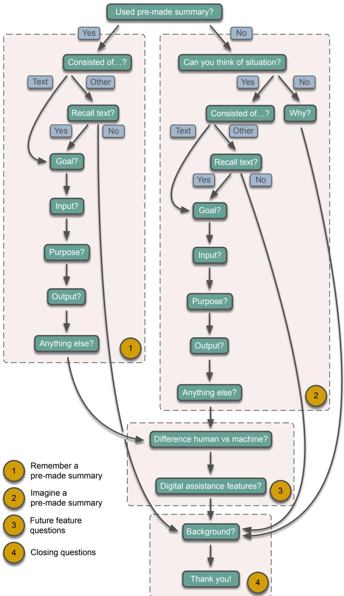  
Figure 7: Overview survey design.

## C Verbatim survey overview

Table 4: A complete overview of the survey. This table includes the explanation that participants received, as well as all the questions and the answer options. If a question was the start of a branch, the direction of the branch has been written behind the answer options in italic. (This was never shown to the participants.) Note that the survey was performed in SurveyMonkey.6 The survey had a lay-out as provided by SurveyMonkey, i.e., it consisted of different pages and colors were used to highlight certain important parts in texts.

<table><tr><td>Question Nr. Question and Answer Options</td><td></td></tr><tr><td>Q1</td><td>Introduction and Instructions</td></tr><tr><td></td><td>Thank you for taking the time to fill out this survey! Before you start, please take the time to read these instructions carefully. If you still have any questions after reading the instructions, please send them to m. a. terhoeve@uva . nl.</td></tr><tr><td></td><td>We will give away 10 bol . com vouchers of 10 euros each among the participants. If you would like to take part in the raffle, you can leave your email address at the end of</td></tr><tr><td></td><td>this survey. Goal of the study</td></tr><tr><td></td><td>The goal of this survey is to get insight in how summaries help or can help you when</td></tr><tr><td></td><td>studying.</td></tr><tr><td></td><td>What the survey will look like</td></tr><tr><td></td><td>In what follows you will get questions that aim to develop an understanding for:</td></tr><tr><td></td><td>• For which types of study material it is useful to have summaries</td></tr><tr><td></td><td>• How these summaries can help you with your task</td></tr><tr><td></td><td>• What these summaries should look like</td></tr><tr><td></td><td>We expect this survey to take approximately 10 minutes of your time.</td></tr><tr><td></td><td>Use the next button to go to the next page once you have filled out all the questions on the page. Use the prev button to go back one page.</td></tr><tr><td></td><td>About your privacy We value your privacy and will process your answers anonymously. The answers of all participants in this survey will be used to gain insight in how pre-made summaries can be helpful for different types of studying activities. The answers will be presented in a research paper about this topic. This will be done either in an aggregated manner, or</td></tr></table>

I agree that I have read and understood the instructions. I also understand that my participation in this survey is voluntarily.

⇤ I agree

<table><tr><td>Question Nr. Question and Answer Options</td><td></td></tr><tr><td>Q2</td><td>Important! Some background knowledge you need to know Throughout this survey we make use of the term pre-made summary. It is very</td></tr><tr><td rowspan="5"></td><td>important that you understand what this means. On this page we explain this term, so please make sure to read this carefully.</td></tr><tr><td>Definition pre-made summary One type of summary is one that you make yourself. Another type of summary is one</td></tr><tr><td>that has been made for you. In this survey, we focus on this latter type and we call them pre-made summaries.</td></tr><tr><td>Who makes these pre-made summaries? These pre-made summaries can be made by a person, for example your teacher, your</td></tr><tr><td>friend, a fellow student or someone at some official organisation, etc. The pre-made summaries can also be made by a computer. What kinds of summaries are we talking about?</td></tr><tr><td></td><td>There are no restrictions on what these pre-made summaries can look like. On the contrary, that is one of the things we aim to find out with this survey! But, to give some examples, you could think of a written overview of a text book, highlights in text to draw your attention to important bits, blog posts, etc. These are really just examples and don't let them limit your creativity! You can come up with any example of a pre-made summary that is helpful for you.</td></tr><tr><td></td><td>Yes, I understand what a pre-made summary is! □ Yes</td></tr><tr><td>Q3</td><td>Please think back to your recent study activities. Examples of study activities can be: studying for an exam, writing a paper, doing homework exercises, etc. Note that these are just examples, any other study activity is fine too.</td></tr><tr><td></td><td>Did you use a pre-made summary in any of these study activities? Yes – participants are led to Q6 No − participants are led to Q4</td></tr><tr><td>Q4</td><td>Can you think of one of your recent study activities where a pre-made summary would have been useful for you? Yes – participants are led to Q25 No – participants are led to Q5</td></tr><tr><td></td><td>Question Nr. Question and Answer Options</td></tr><tr><td>Q5</td><td>Why do you think a pre-made summary would not have helped you with any of your recent study activities?</td></tr><tr><td></td><td>Open response – participants are led to Q48</td></tr><tr><td colspan="2"></td></tr><tr><td></td><td>Start branch of participants who described an existing summary If you have multiple study activities where you used a pre-made summary, please take</td></tr><tr><td></td><td>the one where you found the pre-made summary most useful.</td></tr><tr><td>Q6</td><td>The original study material consisted of</td></tr><tr><td></td><td> Mainly text – participants are led to Q8</td></tr><tr><td></td><td> Mainly figures – participants are led to Q7</td></tr><tr><td></td><td> Mainly video – participants are led to Q7</td></tr><tr><td></td><td> Mainly audio – participants are led to Q7</td></tr><tr><td></td><td>A combination of some or all of the above – participants are led to Q7 I do not know, because I have not seen the study material – participants are led to</td></tr><tr><td></td><td>Q7 Other (please specify) – participants are led to Q7</td></tr><tr><td>Q7</td><td>For now we narrow down our survey to study material that is mostly textual. Do</td></tr><tr><td></td><td>you recall any other recent study activity where you made use of a pre-made summary and where the original study material mainly consisted of text?</td></tr><tr><td></td><td>□ Yes – participants are led to Q8 No – participants are led to Q48</td></tr><tr><td></td><td></td></tr><tr><td>Q8</td><td>What was the goal of this study activity?</td></tr><tr><td></td><td> Studying for an exam</td></tr><tr><td></td><td> Writing a paper / essay / report / etc.</td></tr><tr><td></td><td> Doing homework exercises</td></tr><tr><td></td><td> Other (please specify)</td></tr><tr><td></td><td></td></tr><tr><td>Q9</td><td>Who made this pre-made summary? A teacher or teaching assistant</td></tr><tr><td></td><td></td></tr><tr><td></td><td>□ A fellow student</td></tr><tr><td></td><td>An official organisation</td></tr><tr><td></td><td>The authors of the original study material</td></tr><tr><td></td><td></td></tr><tr><td></td><td> A computer program</td></tr><tr><td></td><td> I am not sure, I found it online</td></tr><tr><td></td><td> Other (please specify)</td></tr></table>

## Question Nr. Question and Answer Options

Now some questions will follow about what the study material that was summarized looked like.

## What was the length of the study material?

⇤ A single article

⇤ Multiple articles

⇤ A single book chapter

⇤ Multiple book chapters from the same book

⇤ Multiple book chapters from various books

⇤ A combination of the above

⇤ I do not know because I have not seen the study material, only the summary

⇤ Other (please specify)

## How was the study material structured? (Multiple answers possible)

⇤ There was no particular structure - e.g. just one large text

⇤ The text contained a title or titles

⇤ The text contained subheadings

⇤ The text consisted of different chapters

⇤ The text consisted of different sections and / or paragraphs

⇤ I do not know because I have not seen the study material, only the summary

⇤ Other (please specify)

## What was the genre of the study material?

⇤ Mainly educational (such as a text book (chapter))

⇤ Mainly scientific (such as an academic article, publication, report, etc)

⇤ Mainly nonfiction writing (such as (auto)biographies, history books, etc)

⇤ Mainly fiction writing (such as novels, short fictional stories, etc)

⇤ Other (please specify)

## How would you classify the difficulty level of the study material?

⇤ Ordinary: most people would be able to understand it

⇤ Specialized: you need to know the jargon of the field to be able to understand it

⇤ Geographically based: you can only understand it if you are familiar with a certain area, for example because it contains local names

Now we will ask some questions about the purpose of the pre-made summary that you used.

The summary was made specifically to help me (and potentially fellow students) with my study activity.

<table><tr><td>Strongly disagree</td><td>Disagree</td><td>Neither agree nor</td><td>Agree</td><td>Strongly agree</td><td>I don&#x27;t know</td></tr><tr><td></td><td></td><td>disagree</td><td></td><td></td><td></td></tr><tr><td>□</td><td>□</td><td>□</td><td>□</td><td>□</td><td>□</td></tr></table>

<table><tr><td>Question Nr. Question and Answer Options</td><td colspan="4"></td></tr><tr><td>Q15</td><td colspan="4">For what type of people was the summary intended? Your score can range from (1) Untargetted, to (5) Targetted. Targetted:</td></tr><tr><td></td><td colspan="4">Untargetted:</td></tr><tr><td></td><td>No domain</td><td></td><td></td><td>Full domain</td></tr><tr><td></td><td>knowledge is</td><td></td><td></td><td>knowledge is</td></tr><tr><td></td><td>expected</td><td></td><td></td><td>expected</td></tr><tr><td></td><td>from the</td><td></td><td></td><td>from the</td></tr><tr><td></td><td>users of the</td><td></td><td></td><td>users of the</td></tr><tr><td></td><td></td><td></td><td></td><td>summmary.</td></tr><tr><td>summmary.</td><td></td><td></td><td></td><td>(5)</td></tr><tr><td>(1)</td><td>(2) □ □</td><td>(3) □</td><td>(4) □</td><td>□</td></tr></table>

## How did this summary help you with your task? (Multiple answers possible)

⇤ The summary helped to retrieve parts of the original study material

⇤ I used the summary to preview the text that I was about to read

⇤ I used the summary as a substitute for the original study material

⇤ I used the summary to refresh my memory of the original study material

⇤ I used the summary as a reminder that I had to read the original study material

⇤ The summary helped to get an overview of the original study material

⇤ The summary helped to understand the original study material

⇤ Other (please specify)

## What was the type of the summary?

⇤ Lecture notes

⇤ Blog post

⇤ Highlights of some kind in the original study material

⇤ Abstractive piece of text, such as a written overview of a text book, an abstract of a paper, etc.

⇤ Short video

⇤ A slide show

⇤ Other (please specify)

## Q20

## Question Nr. Question and Answer Options

## Q18

## How was the summary structured? (Multiple answers possible)

⇤ The summary was a running text, without particular structure

⇤ The summary consisted of highlights in the original study material, without particular structure

⇤ The summary itself contained special formatting, such as bold or cursive text, highlights, etc

⇤ The summary contained diagrams

⇤ The summary contained tables

⇤ The summary contained graphs

⇤ The summary contained figures

⇤ The summary contained headings

⇤ The summary consisted of different sections / paragraphs

⇤ Other (please specify)

## How much of the study material was covered by the summary?

<table><tr><td>None of the</td><td>Almost none of the study</td><td>Some of the study</td><td>Most of the study</td><td>All of the study</td></tr><tr><td>study material was</td><td>material was</td><td>material was</td><td>material was</td><td>material was</td></tr><tr><td>covered</td><td>covered</td><td>covered</td><td>covered</td><td>covered</td></tr><tr><td>(1)</td><td>(2)</td><td>(3)</td><td>(4)</td><td>(5)</td></tr><tr><td>□</td><td>□</td><td>□</td><td>□</td><td>□</td></tr></table>

What was the style of this summary?

⇤ Informative: the summary simply conveyed the information that was in the original study material

⇤ Indicative: the summary gave an idea of the topic of the study material, but not more

⇤ Critical: the summary gave a critical review of the study material

⇤ Aggregative: the summary put different source texts in relation to one another and by doing this gave an overview of a certain topic

⇤ Other (please specify)

<table><tr><td></td><td colspan="4">Question Nr. Question and Answer Options</td></tr><tr><td>Q21</td><td colspan="4">Overall, how helpful was the pre-made summary for you? Your score can range from (1) Not helpful at all, to (5) Very helpful.</td></tr><tr><td></td><td>Not helpful at all</td><td></td><td></td><td>Very helpful</td></tr><tr><td></td><td>(1)</td><td>(2)</td><td>(3)</td><td>(5)</td></tr><tr><td></td><td>□</td><td>□</td><td>□</td><td>□</td></tr><tr><td>Q22</td><td colspan="4">Imagine you could turn this summary into your ideal summary. What would you change?</td></tr><tr><td></td><td colspan="4">Open response</td></tr><tr><td>Q23</td><td colspan="4">Is there anything else you want us to know about the summary that we have not</td></tr><tr><td></td><td colspan="4">covered yet? Open response</td></tr><tr><td>Q24</td><td colspan="4">Is there anything else you want us to know about the original study material</td></tr><tr><td></td><td colspan="4">that we have not covered yet? Open response – participants are led to Q40</td></tr><tr><td colspan="4">Start branch of participants who described an imagined summary</td></tr><tr><td></td><td colspan="4">Please take one of these study activities in mind and imagine you would have had a</td></tr><tr><td>Q25</td><td colspan="4">pre-made summary. The original study material consisted of</td></tr><tr><td></td><td colspan="4"> Mainly text – participants are led to Q27</td></tr><tr><td></td><td colspan="4"></td></tr><tr><td></td><td colspan="4"> Mainly figures – participants are led to Q26</td></tr><tr><td></td><td colspan="4"> Mainly video – participants are led to Q26</td></tr><tr><td></td><td colspan="4"> Mainly audio – participants are led to Q26</td></tr><tr><td></td><td colspan="4">A combination of some or all of the above – participants are led to Q26 Other (please specify) – participants are led to Q26</td></tr><tr><td>Q26</td><td colspan="4">For now we narrow down our survey to study material that is mostly textual. Do you recall any other recent study activity where you could have used a pre-made</td></tr></table>

## Q27

## Question Nr. Question and Answer Options

## What was the goal of this study activity?

⇤ Studying for an exam

⇤ Writing a paper / essay / report / etc.

⇤ Doing homework exercises

⇤ Other (please specify)

Now some questions will follow about what the study material that could be summarized looked like.

What was the length of the study material?

⇤ A single article

⇤ Multiple articles

⇤ A single book chapter

⇤ Multiple book chapters from the same book

⇤ Multiple book chapters from various books

⇤ A combination of the above

⇤ Other (please specify)

## How was the study material structured? (Multiple answers possible)

⇤ There was no particular structure - e.g. just one large text

⇤ The text contained a title or titles

⇤ The text contained subheadings

⇤ The text consisted of different chapters

⇤ The text consisted of different sections and / or paragraphs

⇤ Other (please specify)

## Q30

## What was the genre of the study material?

⇤ Mainly educational (such as a text book (chapter))

⇤ Mainly scientific (such as an academic article, publication, report, etc)

⇤ Mainly nonfiction writing (such as (auto)biographies, history books, etc)

⇤ Mainly fiction writing (such as novels, short fictional stories, etc)

⇤ Other (please specify)

## How would you classify the difficulty level of the study material?

⇤ Ordinary: most people would be able to understand it

⇤ Specialized: you need to know the jargon of the field to be able to understand it

⇤ Geographically based: you can only understand it if you are familiar with a certain area, for example because it contains local names

<table><tr><td>Question Nr. Question and Answer Options</td><td colspan="5"></td></tr><tr><td>Q32</td><td colspan="5">Now we will ask some questions about the purpose of the pre-made summary that would have been helpful.</td></tr><tr><td rowspan="8"></td><td colspan="5">For what type of people should the summary ideally be intended? Your score can range from (1) Untargetted, to (5) Targetted. Targetted:</td></tr><tr><td colspan="5">Untargetted: No domain</td></tr><tr><td rowspan="5">knowledge is expected</td><td rowspan="5"></td><td rowspan="5"></td><td>Full domain</td></tr><tr><td>knowledge is</td></tr><tr><td>expected</td></tr><tr><td>from the</td></tr><tr><td>users of the</td></tr><tr><td>users of the summmary.</td><td></td><td></td><td></td><td>summmary.</td></tr><tr><td>(1)</td><td>(2) □ □</td><td>(3) □</td><td>(4) □</td><td>(5) □</td></tr></table>

## How would this summary help you with your task? (Multiple answers possible)

⇤ The summary would help to retrieve parts of the original study material

⇤ I would use the summary to preview the text that I was about to read

⇤ I would use the summary as a substitute for the original study material

⇤ I would use the summary to refresh my memory of the original study material

⇤ I would use the summary as a reminder that I had to read the original study material

⇤ The summary would help to get an overview of the original study material

⇤ The summary would help to understand the original study material’,

⇤ Other (please specify)

Now we will ask some questions about what the summary should look like and cover.

## What would be the ideal type of the summary?

⇤ Lecture notes

⇤ Blog post

⇤ Highlights of some kind in the original study material

⇤ Abstractive piece of text, such as a written overview of a text book, an abstract of a paper, etc.

⇤ Short video

⇤ A slide show

⇤ Other (please specify)

## Q35

## Question Nr. Question and Answer Options

## What is the ideal structure of the summary? (Multiple answers possible)

⇤ The summary should be a running text, without particular structure

⇤ The summary should consist of highlights in the original study material, without particular structure

⇤ The summary itself should contain special formatting, such as bold or cursive text, highlights, etc.

⇤ The summary should contain diagrams

⇤ The summary should contain tables

⇤ The summary should contain graphs

⇤ The summary should contain figures

⇤ The summary should contain headings

⇤ The summary should consist of different sections / paragraphs

⇤ Other (please specify)

## How much of the study material should be covered by the summary?

<table><tr><td>None of the</td><td>Almost none</td><td>Some of the</td><td>Most of the</td><td>All of the</td></tr><tr><td>study</td><td>of the study</td><td>study</td><td>study</td><td>study</td></tr><tr><td>material</td><td>material</td><td>material</td><td>material</td><td>material</td></tr><tr><td>should be</td><td>should be</td><td>should be</td><td>should be</td><td>should be</td></tr><tr><td>covered</td><td>covered</td><td>covered</td><td>covered</td><td>covered</td></tr><tr><td>(1)</td><td>(2)</td><td>(3)</td><td>(4)</td><td>(5)</td></tr><tr><td>□</td><td>□</td><td>□</td><td>□</td><td>□</td></tr></table>

## What should the style of this summary be?

⇤ Informative: the summary should simply convey the information that was in the original study material

⇤ Indicative: the summary should give an idea of the topic of the study material, but not more

⇤ Critical: the summary should give a critical review of the study material

⇤ Aggregative: the summary should put different source texts in relation to one another and by doing this give an overview of a certain topic

⇤ Other (please specify)

<table><tr><td></td><td>Question Nr. Question and Answer Options</td></tr><tr><td>Q38</td><td>Is there anything else you would want us to know about your ideal summary that we have not covered yet?</td></tr><tr><td></td><td>Open response</td></tr><tr><td>Q39</td><td>Is there anything else you would want us to know about the original study material that we have not covered yet?</td></tr><tr><td></td><td>Open response</td></tr><tr><td colspan="2">Look out questions</td></tr><tr><td></td><td>Now, let&#x27;s assume the pre-made summary was generated by a computer. You can assume that this machine generated summary captures all the needs you have identified in the previous questions.</td></tr><tr><td>Q40</td><td>Would it make a difference to you whether the summary was generated by a computer program or by a human? Yes – participants are led to Q41</td></tr><tr><td>Q41</td><td>Please explain the difference.</td></tr><tr><td></td><td>Open response</td></tr><tr><td>Q42</td><td>Which type of summary would you trust more:</td></tr><tr><td></td><td>A summary generated by a human, for example a teacher or a good performing fellow student</td></tr><tr><td></td><td> A summary generated by a computer</td></tr><tr><td></td><td>□ No difference</td></tr><tr><td>Q43</td><td>Please explain your answer.</td></tr><tr><td></td><td>Open response</td></tr><tr><td></td><td></td></tr><tr><td>Q44</td><td>Which type of summary would you trust more:</td></tr><tr><td></td><td> A summary generated by a human, for example a teacher or a good performing</td></tr><tr><td></td><td>fellow student</td></tr><tr><td></td><td></td></tr><tr><td></td><td> A summary generated by a computer</td></tr><tr><td></td><td> No difference</td></tr></table>

## Question Nr. Question and Answer Options

Now imagine that you can interact with the computer program that made the summary, in the form of a digital assistant. Imagine that your digital assistant made an initial summary for you and you can ask questions about it to your digital assistant and the assistant can answer them. Answers can be voice output, but also screen output, e.g. a written summary on the screen. In the next part we would like to investigate how you would interact with the assistant. Please do not feel restricted by the capabilities of today’s digital assistants.

Please choose the three most useful features for a digital assistant to have in this scenario.

⇤ Summarize particular parts of the study material with more detail

⇤ Summarize particular parts of the study material with less detail

⇤ Switch between different summary styles (for example highlighting vs a generated small piece of text)

⇤ Explain why particular pieces ended up in the summary

⇤ Provide the source of certain parts of the summary on request

⇤ Search for different related sources based on the content of the summary

⇤ Answer specific questions based on the content of the summary

## Q46

## Please choose the three least useful features for a digital assistant to have in this scenario.

⇤ Summarize particular parts of the study material with more detail

⇤ Summarize particular parts of the study material with less detail

⇤ Switch between different summary styles (for example highlighting vs a generated small piece of text)

⇤ Explain why particular pieces ended up in the summary

⇤ Provide the source of certain parts of the summary on request

⇤ Search for different related sources based on the content of the summary

⇤ Answer specific questions based on the content of the summary

## Q47

Can you think of any other features that you would like your digital assistant to have to help you in this scenario?

Open response

## Background questions

Thank you for filling out this survey so far! We would still like to ask you two final background questions.

## Q48

What is the current level of education you are pursuing?

⇤ Bachelor’s degree

⇤ Master’s degree

⇤ MBA

⇤ Other, please specify

<table><tr><td>Question Nr. Question and Answer Options</td><td></td></tr><tr><td>Q49</td><td>What is your main field of study? Open response</td></tr><tr><td>Thank you!</td><td></td></tr><tr><td>Q50</td><td>You have come to the end of our survey. Thanks a lot for helping out! We very much appreciate your time. If you would like to participate in the raffle to win a voucher, please fill out your e-mail address below. We will only use this e-mail address to blindly draw 10</td></tr></table>

## D Full results trustworthiness and future feature questions

In this section we report the results for the exploratory questions that we asked about the trustworthiness of a summary generated by a machine versus a human, as well as the results for the questions about features for summarization with a digital voice assistant.

We find that participants are divided on the question whether it would make a difference to them whether the summary was generated by a machine or a computer. If we look at all participants together, we find that 48.0.% of the participants answered that it would make a difference, whereas 52.0% answered that it would not. However, if we split the participants based on study background, an interesting difference emerges (Figure 8a). Participants with a background in STEM indicated significantly more often that it would not make a difference to them, whereas the other groups of students indicated the opposite. Almost all participants who answered that it would make a difference said that they would not trust a computer on being able to find the relevant information, i.e., all seemed to favor the human generated summary. Only one participant advocated for the computer-generated summary as a “computer is more objective.” Almost all participants who said it would not matter to them did add the condition that the quality of the generated summary should be as good as if a human had generated it. One person wrote: “If the summary captures all previously discussed elements it is effectively goodfor the same purpose. So then it does not matter who generated it.” This comment exactly captures the motivation of the setup of our survey.

This caution regarding automatically generated summaries is confirmed by the question in which we asked which type of summary participants would trust more – a human-generated one or a machine-generated one. People chose the humangenerated summary significantly more often (Figure 8b). This also holds for the participants with a STEM background, which aligns with the responses to the open questions we reported earlier – apparently participants do not fully trust that the condition they raised earlier would be satisfied, namely that only if the machine was just as good as the human, it would not matter for them whether the summary was generated by a machine or a human.

The results for the most and least useful features for a digital assistant in a summarization scenario are given in Figure 8c and 8d. Adding more details to the summary and answering questions based on the content of the summary are very popular features, whereas summarizing parts of the input material with less detail is not.

Lastly, we asked participants whether they could think of any other features that they would like their digital assistant to have in the outlined scenario. A number of participants answered that they would like the digital assistant to generate questions based on the summary, so that they could test their own understanding. For example, one participant said: “Make questions for me (to test me)” and another participant had a related comment: “Maybe the the digital assistant couldfind old exam questions to link to parts of the summary where the question is related to, so that there is a function to test if you’ve understood the summary.” Another line of answers pointed towards giving explicit relations between the input material and summary, for example: “Show links between subject materials and what their relation is” and another person wrote: “Dynamic linkingfrom summary to original source is a great added value ofgenerating a summary”.

## E Examples evaluation questions

Here we give additional examples for the evaluation questions that can be used for our proposed evaluation methodology. The phrase “a document that is important for your task" should be substituted to match the task at hand. For example, in the case of exam preparations, this could be replaced with “a chapter that you need to learn for your exam preparation". Only the questions with the intended purpose factors should be used in the evaluation.

Purpose factor Use & Output factor Style:

The style of which of these two summaries is most useful to you to retrieve a document that is important for your task?

The style of which of these two summaries is most useful to you to preview a document that is important for your task?

The style of which of these two summaries is most useful to you to substitute a document that is important for your task?

The style of which of these two summaries is most useful to you to refresh your memory about a document that is important for your task?

(a) Would it make a difference to you whether the summary was generated by a computer program or by a human? (MC)

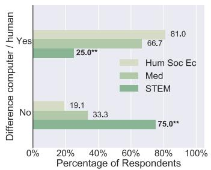  
(c) Please choose the three most useful features for a digital assistant to have in this scenario. (MR)

(b) Which type of summary would you trust more? (MC)

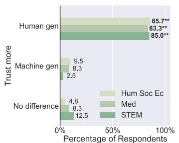  
(d) Please choose the three least useful features for a digital assistant to have in this scenario. (MR)

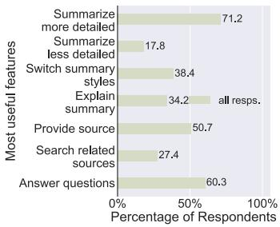

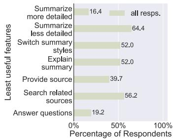  
Figure 8: Results for the future feature questions. Answer type in brackets. MC = Multiple Choice, MR = Multiple Response. \*\* indicates significance $( \chi ^ { 2 }$ or Fisher’s exact test), after Bonferroni correction, with $p \ll 0 . 0 0 1$

The style of which of these two summaries is most useful to you to prompt you to read a source text that is important for your task?

## Purpose factor Use & Output factor Format:

Theformat of which of these two summaries is most useful to you to retrieve a document that is important for your task?

Theformat of which of these two summaries is most useful to you to preview a document that is important for your task?

Theformat of which of these two summaries is most useful to you to substitute a document that is important for your task?

Theformat of which of these two summaries is most useful to you to refresh your memory about a document that is important for your task?

The format of which of these two summaries is most useful to you to prompt you to read a source text that is important for your task?

## Purpose factor Use & Output factor Material:

The coverage of which of these two summaries is most useful to you to retrieve a document that is important for your task?

The coverage of which of these two summaries is most useful to you to preview a document that is important for your task?

The coverage of which of these two summaries is most useful to you to substitute a document that is important for your task?

The coverage of which of these two summaries is most useful to you to refresh your memory about a document that is important for your task?

The coverage of which of these two summaries is most useful to you to prompt you to read a source text that is important for your task?