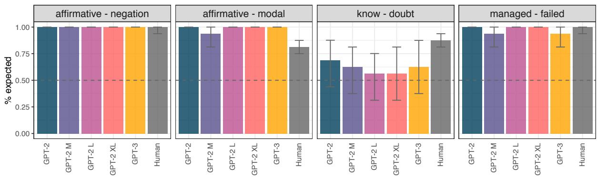
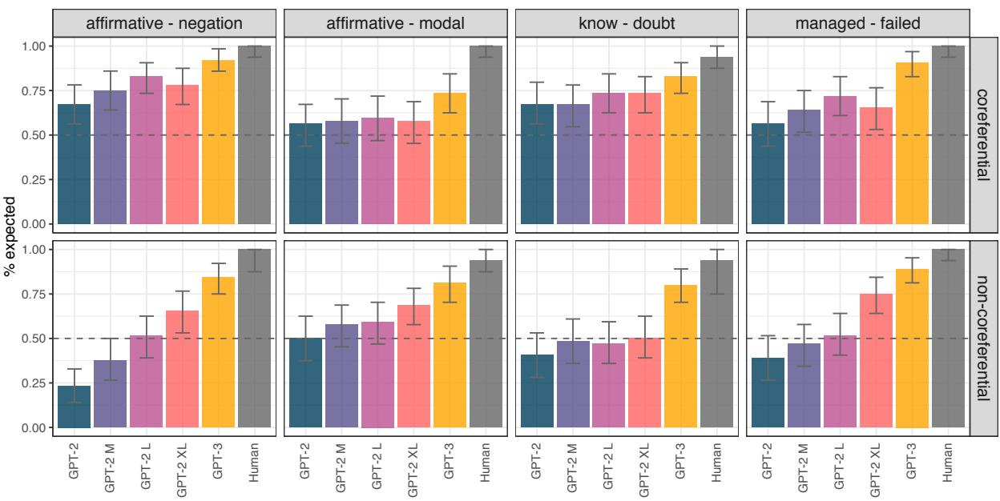
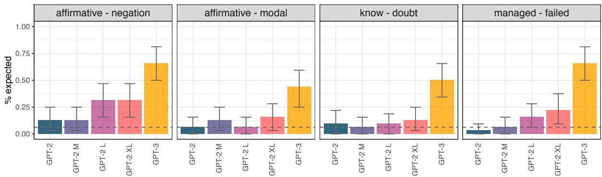

# When a sentence does not introduce a discourse entity, Transformer-based models still sometimes refer to it

Sebastian Schuster   
Center for Data Science   
Department of Linguistics   
New York University   
schuster@nyu.edu   
Tal Linzen   
Center for Data Science   
Department of Linguistics   
New York University   
linzen@nyu.edu

## Abstract

Understanding longer narratives or participating in conversations requires tracking of discourse entities that have been mentioned. Indefinite noun phrases (NPs), such as a dog, frequently introduce discourse entities but this behavior is modulated by sentential operators such as negation. For example, a dog in Arthur doesn’t own a dog does not introduce a discourse entity due to the presence of negation. In this work, we adapt the psycholinguistic assessment of language models paradigm to higher-level linguistic phenomena and introduce an English evaluation suite that targets the knowledge of the interactions between sentential operators and indefinite NPs. We use this evaluation suite for a fine-grained investigation of the entity tracking abilities of the Transformer-based models GPT-2 and GPT-3. We find that while the models are to a certain extent sensitive to the interactions we investigate, they are all challenged by the presence of multiple NPs and their behavior is not systematic, which suggests that even models at the scale of GPT-3 do not fully acquire basic entity tracking abilities.

## 1 Introduction

In order to understand longer narratives or to participate in conversations, humans and natural language understanding systems have to keep track of the entities that have been mentioned in the discourse. For example, when someone tells you that Arthur owns a dog, they have introduced the entity of a person named Arthur and the entity of a dog owned by Arthur into the discourse. Once entities have been introduced to the discourse, it is natural to refer back to them with noun phrases or pronouns to elaborate further, e.g., by saying It has a red collar to elaborate on the dog.

While no fully-specified account exists of how humans achieve this feat, many existing theories are based on the idea that humans maintain mental files (e.g., Heim, 1982; Murez and Recanati, 2016), i.e., explicit memory representations for each entity that encode all properties of an entity and its relation to other entities. When engaging in a conversation or reading a longer narrative, humans then update these representations as they encounter new entities or new information about existing entities.

Large pre-trained language models (LMs) such as GPT-2 (Radford et al., 2019) and GPT-3 (Brown et al., 2020), which in recent years have become the dominant foundation for natural language understanding and generation tasks, lack explicit representations of discourse entities. It remains largely an open question to what extent LMs can match human behavior in tracking discourse entities.

The most extensive investigation of this phenomenon has been through evaluations with the LAMBADA dataset (Paperno et al., 2016). LAM-BADA consists of a cloze task for which an LM has to predict the last word of naturalistic passages extracted from a corpus. Solving this task requires keeping track of longer contexts, and making a correct guess frequently requires keeping track of the entities mentioned in the passage.

While datasets such as LAMBADA are an invaluable resource for monitoring high-level progress of LMs in their ability to track discourse entities, such datasets lack the granularity to determine for which contexts LMs can and cannot properly track discourse entities. In this work, we draw inspiration from recent targeted evaluation suites geared at lower linguistic levels (e.g., Marvin and Linzen, 2018; Hu et al., 2020b), and introduce a targeted evaluation suite for tracking of discourse entities in English. In particular, we focus on the interactions between different sentential operators and embedding verbs and indefinite noun phrases (see, e.g., Karttunen 1976 and Section 3); for example, we evaluate whether a language model correctly infers that because a sentence with a negation, such as Arthur doesn’t own a dog, does not introduce a discourse entity for a dog, further elaborations about such a non-existent dog should be pragmatically odd, and, as such, their probability should be low compared to matched controls.

To evaluate to what extent language models are sensitive to these interactions, we adapt the psycholinguistic assessment of language models paradigm (Futrell et al., 2019) for discourse entity tracking and discuss the methodological challenges that arise with using this paradigm for discourse phenomena. We introduce two expert-created evaluation suites and use them to evaluate GPT-2 and GPT-3 models. We find that while all the models we evaluated show some sensitivity to preceding context, they lack systematicity and are challenged when contexts contain multiple noun phrases.1

## 2 Related Work

The majority of systematic evaluations of autoregressive and masked language models so far have focused on the level of syntax, targeting abilities such as subject-verb agreement (e.g., Linzen et al., 2016; Marvin and Linzen, 2018; Gulordava et al., 2018; Hu et al., 2020b), anaphora agreement and binding constraints (e.g., Marvin and Linzen, 2018; Futrell et al., 2019; Warstadt et al., 2020; Hu et al., 2020a), or filler-gap dependencies (e.g., Wilcox et al., 2018; Chowdhury and Zamparelli, 2018; Da Costa and Chaves, 2020). At higher linguistic levels, Ettinger (2020) compared BERT’s (Devlin et al., 2019) behavior on sentences with negation to data from neurolinguistic experiments with humans; Pandia and Ettinger (2021) investigated to what extent pre-trained language models can extract relevant information from the preceding context, both in the presence and in the absence of distractors; and Pandia et al. (2021) investigated whether language models can predict connectives (e.g., but) for two given sentences.

More closely related to our work, in the domain of discourse and reference, Upadhye et al. (2020) investigated whether GPT-2 and Transformer-XL (Dai et al., 2019) exhibit similar referential biases in their continuations as humans, i.e., they asked whether models provided with a sentence with two referents are biased similarly as humans when choosing the referent for the next sentence. Kim et al. (2019) used an acceptability judgment task to determine whether contextual LMs correctly distinguish between definite and indefinite noun phrases.

Sorodoc et al. (2020) and Tenney et al. (2019) used probing methods to investigate whether representations of LSTM- and Transfomer-based models contain information about coreference, which also provides some indication of entity tracking abilities. Further, Clark et al. (2019) investigated to what extent attention weights of BERT indicate coreference. These studies found that all evaluated representations contain some information about coreference but not consistently for all entities.

## 3 Background

English indefinite noun phrases (NPs) of the form a NOUN interact with the context in complex ways (see, e.g., Karttunen, 1976; Webber, 1979; Heim, 1982, for more extensive discussions of this phenomenon). In affirmative statements, the indefinite NP generally introduces a new entity to the discourse. However, several sentential operators and clause-embedding verbs modulate this behavior. For example, consider the following contrast between an affirmative and a negated sentence, where # indicates a pragmatically odd continuation:

(1) a. Arthur owns a dog and it follows him everywhere he goes.

b. Arthur doesn’t own a dog and # it follows him everywhere he goes.

While in the affirmative sentence, the indefinite NP introduces a novel discourse entity, the negation in (1b) prevents the NP from introducing a new entity. In (1b), it is therefore pragmatically odd to refer back to a dog with the pronoun it.

The implicative manage to and the negative implicative fail to in (2a-b) give rise to a similar contrast: The NP under manage to introduces a discourse entity, the NP under fail to does not.

(2) a. Sue managed to write a book. It was a real page-turner.

b. Sue failed to write a book. # It was a real page-turner.

Indefinite NPs embedded under the factive know and the non-factive doubt introduce and fail to introduce a discourse entity, respectively:

(3) a. I know that Michael baked a cake. It was delicious.

b. I doubt that Michael baked a cake. # It was delicious.

Lastly, modals such as want also block the introduction of a discourse entity, as shown in (4):

(4) a. Mary got a pet rat and it is very loud at night.

b. Mary wants to get a pet rat and # it is very loud at night.

While these patterns generally hold, there are exceptions to these rules. For example, in the first sentence in (5), which could be paraphrased as (6), the indefinite scopes over the negation and therefore it is okay to refer back to the mistake.

(5) Mary didn’t find a (specific) mistake. It was in the footnote.

(6) There was a (specific) mistake which Mary did not find. It was in the footnote.

However, without additional context, listeners generally do not infer these so-called specific interpretations of sentences with an indefinite NP, so like Karttunen (1976), we will largely ignore these cases throughout the remainder of this paper.

## 4 Experiments

To what extent are GPT-2 and GPT-3 sensitive to the contrasts that we presented in Section 3? To investigate this question, we adapted the methodology commonly used for syntactic evaluation of language models (e.g., Futrell et al., 2019) and created minimal pairs of contexts that differ in whether they introduce a discourse entity or not. In Experiment 1, we focus on contexts with a single indefinite NP, and in Experiment 2, we focus on sentences with multiple indefinite NPs.

## 4.1 Experiment 1

Methodology If a language model is sensitive to contexts that differ in whether a discourse entity is introduced or not, we expect the probability of continuations that refer back to the noun phrase in the previous context to be higher when a discourse entity has been introduced than when it has not. Thus, if we have a pair of sentences, such as

(7) a. $\mathrm { C } _ { r e f } { \mathrm { : } }$ John owns a dog.

b. ${ \mathrm { C } } _ { n o n r e f } { \mathrm { : } }$ John doesn’t own a dog.

and a referential continuation,2 such as

(8) R: It has a red collar.

then we expect that

$$
P ( R \mid C _ { r e f } ) > P ( R \mid C _ { n o n r e f } ) .
$$

However, directly comparing these probabilities may be problematic given that $P ( X \mid C _ { r e f } )$ and $P ( X \mid C _ { n o n r e f } )$ are different probability distributions. In theory it could be, for example, that $\textstyle P ( X \mid C _ { r e f } )$ assigns a very high probability to exactly one continuation and therefore its entropy is lower than the entropy of $P ( X \mid C _ { n o n r e f } )$ . In this case, it could be that the inequality above does not hold despite the fact that continuations that refer back to the noun phrase in the previous context are ranked higher in the affirmative than in the negated case. To overcome this issue, we make use of a non-referential control continuation, such as N:

## (9) N: It is not a big deal.

This continuation no longer refers back to a noun phrase and is therefore a valid continuation for both contexts. Instead of using the inequality above, we thus compare the relative probabilities of the referential and the control continuations:

$$
\begin{array} { r l } & { \frac { P ( R \mid C _ { r e f } ) } { P ( R \mid C _ { r e f } ) + P ( N \mid C _ { r e f } ) } } \\ { > } & { \frac { P ( R \mid C _ { n o n r e f } ) } { P ( R \mid C _ { n o n r e f } ) + P ( N \mid C _ { n o n r e f } ) } } \end{array}\tag{1}
$$

These relative probabilities are less sensitive to the entropy of the distribution: If there is a highly likely continuation (that is neither the referential nor the control continuation) for one context but not the other, the model should still assign relatively less probability mass to the referential continuation compared to the control continuation.

Models We evaluate two autoregressive language models,3 GPT-2 and GPT-3. GPT-2 models were trained on the WebText corpus which contains an estimated 8 billion tokens; GPT-3 models were trained on about 500 billion tokens. For GPT-2, we evaluate models of four different sizes (GPT-2: 117M parameters, GPT-2 M: 345M, GPT-2 L: 762M, GPT-2 XL: 1.5B) that are available through the HuggingFace Transformers library (Wolf et al., 2020). For GPT-3, we evaluate the largest available model (“davinci”) through the OpenAI API which is assumed to have about 175B parameters.4

Materials We manually constructed an evaluation set of 16 base contexts and plausible continuations. Each base context contains different nouns and verbs to minimize lexical effects. From these 16 contexts, we constructed four contrasts for each context, as shown in Table 1, which in total yielded 64 items. We chose to manually construct contexts as opposed to generating sentences from a grammar to guarantee semantic and pragmatic wellformedness of contexts and continuations.

Human evaluation As we mentioned in Section 3, the referential continuations are not necessarily pragmatically odd if the indefinite noun phrase in the context is interpreted as a specific noun phrase. We therefore conducted an online experiment on Prolific to verify that native English speakers disprefer the referential continuations when no discourse entity is introduced, as follows. After two practice items, each participant performed two trials with sentences from the evaluation set. On each trial, participants saw a context along with a referential and a non-referential continuation, and they were asked to indicate their preferred continuation by selecting the continuation that “makes more sense” given the context. For each context, we collected preference judgments from 10 participants. The experiment took on average about 2 minutes to complete and participants received \$0.45 in compensation ( \$14/hr).

Results and discussion Figure 1 shows the proportion of items for which the relative probability of the referential continuation (RRP) is higher for the context that introduces a discourse entity (DEC) than for the context that does not (NDEC), i.e., the proportion of items for which Eq. 1 holds. For three of the four contrasts (affirmative-negation, affirmative-modal, managed-failed) GPT-2 and GPT-3 models exhibited the expected pattern for almost all items in our evaluation set. For the knowdoubt contrast, however, all models performed approximately at chance, suggesting that the models are not sensitive to this contrast.

Figure 1 also shows the results of the human experiment. Participants preferred the referential continuation more following the DECs than following the NDECs for all items of the affirmativenegation and managed-failed contrasts. Further, for these two contrasts, participants overwhelmingly selected the referential continuation for the DECs and the non-referential continuation for the NDECs. This result confirms that the stimuli bring about the theoretically expected contrast in humans.

For the affirmative-modal and the know-doubt contrasts, the results from human participants are less clear-cut. Overall, participants also preferred the referential continuation more in the DECs than in the NDECs. However, for several items, the opposite was the case and the referential continuation was preferred as much or even more in the NDECs than in the DECs. Moreover, unlike in the other two contrasts, participants selected the referential continuation in the NDECs at a high rate.5

Considering that the results from the human experiment are not predicted by Karttunen’s theory, the model results from the affirmative-modal and the know-doubt contrast should also be interpreted with caution. However, while the lower proportion of expected relative probabilities in the know-doubt condition may suggest that the models are behaving similarly to humans, this is not the case. If one considers the results on an item-by-item basis, they differ from the human results and there is a lot of variability across models such that the five models agree only on less than 33% of items.

In summary, GPT-2 and GPT-3 overall behaved similarly to humans and generally favored the referential continuation more when the preceding sentence introduced a discourse entity. This behavior could be due to at least the following two reasons. It could be that the models indeed correctly combine the sentential operators with the indefinite noun phrase and therefore assign a higher probability to a referential continuation in the DECs. However, it could also be that this result is due to more spurious correlations; for example, it could be that the model learned that clauses with operators such as negation, modals, or negative implicatives are often followed by clauses with a non-referential it. In the second experiment, we tease apart these two explanations and further try to overcome the issues with the stimuli that we observed for the affirmative-modal and know-doubt contrasts.

<table><tr><td>Contrast</td><td>Contexts</td><td>Referential continuation</td><td>Non-referential continuation</td></tr><tr><td>affirmative-negation</td><td>Michael baked a cake Michael didn&#x27;t bake a cake</td><td>and it was the best thing at the picnic. and it&#x27;s not a big deal</td><td></td></tr><tr><td>affirmative-modal</td><td>Michael baked a cake Michael wants to bake a cake</td><td>and it was the best thing at the picnic. and it&#x27;s not a big deal.</td><td></td></tr><tr><td>know-doubt</td><td>I know that Michael baked a cake. I doubt that Michael baked a cake.</td><td>It was the best thing at the picnic.</td><td>It&#x27;s not a big deal.</td></tr><tr><td>managed-failed</td><td>Michael managed to bake a cake Michael failed to bake a cake.</td><td>It was the best thing at the picnic.</td><td>It&#x27;s not a big deal.</td></tr></table>

Table 1: Example contexts and continuations for one base context in Experiment 1.

  
Figure 1: Results from Experiment 1. Each bar indicates the proportion of items for which the relative probability of the referential continuation (RRP) is higher for the context that introduces a discourse entity than for the context that does not, i.e., the expected pattern. Dashed lines indicate chance performance levels, and error bars indicate bootstrapped 95% confidence intervals.

## 4.2 Experiment 2

Materials and method We again constructed 16 base contexts that are similar to the ones used in Experiment 1. However, in this experiment, each context contains two indefinite noun phrases with different nouns that are embedded under two different sentential operators. For example, for the affirmative-negation contrast, one of the NPs is embedded under negation, such as a cat in (10).

(10) John owns a dog but he doesn’t own a cat.

In such a context, it is natural to continue with a sentence that refers back to the dog, whereas it is unnatural to refer back to a cat. We therefore compared the models’ probability of a sentence that refers back to an entity that has been introduced in the context (11a) to a sentence that refers to an entity that has not been introduced (11b).

(11) a. The dog follows him wherever he goes.

b. # The cat follows him wherever he goes.

On top of these coreferential continuations, we also constructed non-coreferential continuations for contexts such as (10). These continuations contain one of the nouns present in the context but do not refer back to entities in the previous context. For the non-coreferential continuations, models should assign a higher probability to the continuation with a noun for which no discourse entity had been introduced in the context.

(12) a. The cat that he liked had been adopted by someone else.

<table><tr><td>Context</td><td>Coreferential continuations</td><td>Non-coreferential continuations</td></tr><tr><td>Mary found a shirt at the store but she didn&#x27;t find a hat.</td><td>The shirt/#hat is blue.</td><td>The hat/#shirt that she tried on didn&#x27;t fit.</td></tr><tr><td>Mary found a hat at the store but she didn&#x27;t find a shirt.</td><td>The hat/#shirt is blue.</td><td>The shirt/#hat that she tried on didn&#x27;t fit.</td></tr><tr><td>Mary didn&#x27;t find a shirt at the store but she found a hat.</td><td>The hat/#shirt is blue.</td><td>The shirt/#hat that she tried on didn&#x27;t fit.</td></tr><tr><td>Mary didn&#x27;t find a hat at the store but she found a shirt.</td><td>The shirt/#hat is blue.</td><td>The hat/#shirt that she tried on didn&#x27;t fit.</td></tr></table>

Table 2: Example contexts and continuations for the affirmative-negation contrast for one base context.

  
Figure 2: Results from Experiment 2. Dashed lines indicate chance performance levels.

## b. # The dog that he liked had been adopted by someone else.

For each of the four contrasts and each base context, we constructed four contexts that crossed the order of the sentential operators and the order of the two nouns used in a context, resulting in 4 contexts per base context and contrast. For each base context, we further constructed two coreferential continuations (one for each noun) and two noncoreferential continuations (one for each noun). In total, this yielded 512 items. Table 2 shows all the contexts and continuations for one base context for the affirmative-negation contrast.

Compared to the methods and materials in Experiment 1, this setup has several advantages. First, given that we are comparing two continuations for a fixed context, both continuations come from the same probability distribution and therefore we no longer need a generic control continuation. Second, it is less likely that models can make use of spurious correlations since each context contains two types of sentential operators and, for example, a heuristic of associating negation with nonreferential it would no longer lead to the expected behavior. Third, given that all continuations are on topic (as opposed to the generic control condition in Experiment 1), humans likely show more consistency in their preferences. Lastly, given that this design allows us to construct stimuli with exactly the same tokens in different orders, we can also assess the systematicity of the model behavior.

We again verified the theoretically predicted preferences in a human experiment.6

Results and discussion Figure 2 shows the accuracy of the model and human experiments for the coreferential and non-coreferential continuations. As this figure shows, humans exhibited the theoretically expected behavior for all contrasts for almost all items and chose the coreferential continuation with the noun for which an entity had been introduced in the context, and chose the noncoreferential continuation for the noun for which no entity had been introduced. This suggests that the materials do not exhibit the same shortcomings as in Experiment 1, and that comparisons of models to human behavior are valid for all four contrasts.

  
Figure 3: Systematicity of model behavior in Experiment 2. An item counts as correct if all four orders of noun phrases and sentential operators (e.g., X owns a A but doesn’t own a B; X owns a B but doesn’t own a A; X doesn’t own a A but owns a B; and X doesn’t own a B but owns a A) lead to the correct result. The dashed line indicates chance performance and the error bars indicate bootstrapped 95% confidence intervals.

If we turn to the model results, there is more variability in performance across models and contrasts. For the coreferential continuations, all models except the smallest GPT-2 model performed above chance for three of the four contrasts. For the affirmative-modal contrast, however, only GPT-3 performed significantly above chance. Moreover, all GPT-2 models perform worse for the noncoreferential continuations.

More generally, unlike humans, all models in this experiment performed below ceiling, which suggests that while models exhibit a tendency to choose the right continuation, they do not reliably do so. Further, model size does have an impact on the performance on this task: The smallest GPT-2 model performed consistently worst, and GPT-3 performed consistently best. This dependence on model size is particularly pronounced in the non-coreferential condition: While GPT-3 consistently performed above chance in all contrasts, most smaller models either performed at chance or in some cases, such as the smallest GPT-2 for the items in the affirmative-negation contrast, had a bias to select the non-coreferential continuation with the noun that introduced a discourse entity in the context. The lower performance for the noncoreferential continuations is not surprising given that for these examples, a model not only has to correctly infer which noun phrase introduces a discourse entity but additionally that the noun phrase in the continuation does not refer back to anything in the preceding context.

Systematicity As mentioned above, this experimental design also allows us to assess how sensitive the behavior of the different models is to the different orders of sentential operators and nouns in the context. Figure 3 shows the proportion of items for which the model exhibited the expected behavior for all four possible orders. Overall, the performance of all models according to this stricter criterion is much lower than the simple by-item measure highlighting that even the predictions by GPT-3 are sensitive to the exact combination and order of sentential operators and nouns. However, there once again is a clear trend that larger models behave more systematically than smaller ones, suggesting that larger models and models trained on more data learn more stable generalizations. This trend is in part driven by smaller models being less sensitive to the preceding context: The two smallest GPT-2 models assigned the highest probability to the continuation with one of the two nouns independent of the combination of sentential operators and nouns in the context in 52.3% and 43.8% of the cases, respectively. That is, for all four contexts, as shown for one example in Table 2, the smallest GPT-2 model assigned a higher probability to the same continuation independent of which noun phrase introduced a discourse entity more than half of the time. GPT-3, on the other hand, only exhibited this behavior for 7% of the items.

In summary, the results from Experiment 2 suggest that GPT-2 and GPT-3 are less reliable in determining whether an NP introduces a discourse entity when multiple NPs are present. This is in particular true for smaller GPT-2 models but if one considers systematicity, the predictions of GPT-3 are also sensitive to minor changes in the context.

## 5 Likely Continuations

One drawback of the methodology of the previous two experiments is that we considered only one specific expected and one specific unexpected continuation for each item. Thus, if both the expected and the unexpected continuations are very unlikely according to the LM, we may see poor performance on this task while at the same time, it would be very unlikely that either of the generations is ever sampled from the model. In that case, the evaluations in Experiment 2 may underestimate the models’ abilities (Newman et al., 2021) and the results may not be very relevant for practical purposes for which one uses an LM to generate texts. For this reason, we also performed a manual analysis of randomly sampled generations (Aina and Linzen, 2021) from the two largest LMs, GPT-2 XL and GPT-3.

Materials and method We used the contexts from Experiment 2 as prompts for the two LMs and for each context, we sampled a sentence beginning with the.7 For GPT-2 XL, we sampled the continuations using top-40 sampling as in Radford et al. (2019). For GPT-3, we used the default temperature sampling with a temperature of 0.7.

A graduate student in linguistics who was blind to the purpose of this study then annotated each of the continuations for whether it contained referring expressions that likely referred back to a noun phrase in the context as well as which noun phrase(s) (the discourse entity introducing and/or the non-discourse entity introducing NP) were referred back to. To illustrate this, consider the following two generations by GPT-3:

(13) a. Carolyn didn’t write a card to her parents but she wrote them a letter. The letter was long and filled with many details about the cruise.

b. Chris managed to knit a hat but failed to knit a bag. The bag is not stuffed.

In (13a), the letter refers back to an entity introduced in the context, whereas in (13b), the bag refers back to the NP that does not introduce a discourse entity. If a language model is able to correctly combine sentential operators with indefinite noun phrases, we expect many continuations as in (13a) and no continuations as in (13b).

<table><tr><td>Model</td><td>DE</td><td>NDE</td></tr><tr><td>GPT-2 XL</td><td>43.8</td><td>22.3</td></tr><tr><td>GPT-3</td><td>52.3</td><td>21.1</td></tr></table>

Table 3: Percentage of expressions in model generations that refer back to noun phrases that introduce (DE) or do not introduce a discourse entity (NDE).

Results and discussion Table 3 shows the percentages of expressions in model generations that refer back to noun phrases in the prompt. These results confirm the findings from Experiment 2: Both GPT-2 XL and GPT-3 are to some extent sensitive to the interactions between sentential operators and indefinite NPs as indicated by the higher proportion of expressions referring back to NPs that introduce discourse entities (DE) as compared to referring back to NPs that do not (NDE). At the same time, however, both models produced more than 20% of continuations with expressions that refer back to an NP that did not introduce an entity, which shows that the results from Experiment 2 also apply to likely generations by LMs.

## 6 General Discussion

In his seminal work in 1976, Karttunen introduced several challenges for natural language understanding systems that aim to track which entities are introduced in a larger discourse. In this work, we evaluated to what extent we made progress on these challenges in the past decades. In two sets of experiments, we found that Transformer-based models are to some extent sensitive to different interactions between sentential operators and indefinite noun phrases. At the same time, however, we found in Experiment 2 that models lack systematicity in their behavior, which suggests that models do not combine indefinite noun phrases and sentential operators as humans do. Further, the analysis of likely continuations showed that this behavior can also be observed in high probability generations.

Learnability of meaning On the one hand, these results provide direct evidence for shortcomings of language models with respect to tracking entities. On the other hand, more broadly, these results also provide interesting data points with regard to the recent debate on whether language models could theoretically mimic human language understanding.

Bender and Koller (2020) recently presented several thought experiments and argued that since LMs are only trained on form and do not have access to meaning or intentions, they can never exhibit human-like language understanding (see also Merrill et al., 2021, for a more formal discussion of this claim). Given that we evaluated the largest available GPT-3 model and still found that the model behavior is inconsistent despite its enormous amount of parameters and training data, our results suggest that at least current language model architectures indeed struggle with human-like understanding. Interestingly though, while the thought experiments by Bender and Koller (2020) focus on lack of world knowledge due to the lack of grounding of language models, our results suggest that additionally, language models fail at learning the meaning of more abstract words such as negation markers or embedding verbs. This is also in line with recent results, which showed that smaller models fail to learn the meaning of negation and discourse connectives. (Ettinger, 2020; Pandia et al., 2021). Lastly, the fact that GPT-2 and GPT-3 have been exposed to orders of magnitude more language data than human learners are and still do not fully succeed at tracking discourse entities underscores that there are differences between how humans and LMs learn.

NLG evaluation We further believe that evaluation suites targeting discourse phenomena, such as the ones presented here, can serve a complementary role to natural language generation (NLG) benchmarks (e.g., Gehrmann et al., 2021) and human studies for evaluating NLG systems. This seems particularly relevant considering that Clark et al. (2021) recently found that untrained crowdworkers, who serve as participants in the majority of human evaluation studies, cannot distinguish between stories written by humans and stories generated by GPT-3. Our experiments, however, show that there is a considerable gap between humans and GPT-3 for basic discourse phenomena, and therefore targeted evaluation suites should be an important measure for tracking progress of NLG models.

Comparison to probing results Recently, Li et al. (2021) developed a probe for investigating whether LM representations provide information about the state of entities at various stages in a larger discourse. This probing method–like the ones presented in this work–also aims to assess entity tracking abilities of pre-trained language models. They considered two sequence-to-sequence models, T5 and BERT, and found that representations from both models can be decoded into entity states with high accuracy. This task may seem more complex than the one used in the experiments above, and T5 and BERT are considerably smaller models than GPT-3, so prima facie, it may be surprising that their results suggest superior discourse abilities than our results. However, there are two important differences in methodology that likely explain this discrepancy. First, the probing classifier was trained on data that was similar to the evaluation data and this setup therefore provided a lot of supervision. Second, the datasets used by Li et al. (2021) were obtained through crowdsourcing or a generation engine and were not constructed as systematically as ours. For these reasons, the probing classifier may have learned spurious correlations between the training and test splits, and the high accuracy on the task may have only in part been driven by entity tracking abilities of LMs.

Potential solutions Considering the still modest performance of GPT-3, it seems unlikely that training models on even more data is going to lead to human-like discourse entity processing by language models. Instead, we consider the following modifications to models to likely lead to more systematic entity tracking. First, there have been some successes in augmenting language models with explicit entity memory representations (e.g., Weston et al., 2014; Sukhbaatar et al., 2015; Rashkin et al., 2020; Cheng and Erk, 2020), and likely such architectural changes could also help in the contexts that we evaluated in this work. Second, considering that the models seem to struggle to learn the meaning of sentential operators, it may be necessary to provide additional supervision, for example using treebanks annotated with meaning representations, such as the Groningen Meaning Bank (Bos et al., 2017). Relatedly, models may also benefit from more grounded learning scenarios. Humans likely differentiate between Arthur owns a dog and Arthur doesn’t own a dog because only in the former case, a dog refers to something in the real world and if a model was immersed in more grounded scenarios it would likely be able to infer this difference.

We hope that our evaluation suite will be a valuable resource for assessing progress of future models such as the ones sketched above, and that it will help pave the way for improved discourse entity processing in NLU systems.

## Ethics Statement

Risks, limitations, and intended use We consider the main risk of this work that the evaluation suite may be used to make overstating claims about model abilities in the future. In particular, should future models achieve very high or even perfect accuracy on the evaluation suite, then such results may be seen as evidence of human-like abilities of discourse entity processing. We therefore want to emphasize that achieving high accuracy on this evaluation suite is a necessary but not necessarily sufficient requirement for a model to exhibit human-like entity tracking abilities.

Further, it seems likely that models fine-tuned on similar examples would perform a lot better on this evaluation suite, and therefore researchers should only use this dataset for out-of-domain evaluations in which the model has not been trained on similar examples.

Finally, we only evaluated models trained on English data in this work and it is conceivable that entity tracking abilities of models trained on other languages differ from the results reported here.

Human subject experiments As we mentioned in Section 4.1, we recruited crowdworkers from Prolific to validate the experimental stimuli. Participants were based in the US and on average received compensation of about \$14/hour, which is almost twice the minimum wage in most states in the US. The experiment has been pre-approved by the New York University IRB, and there were no risks associated with participation.

## Acknowledgments

We thank the members of the NYU Computation and Psycholinguistics Lab and the NYU Semantics Group, and the reviewers for their thoughtful feedback. We also thank Alicia Chatten for doing the annotations of the model generations. This material is based upon work supported by the National Science Foundation under Grant #2030859 to the Computing Research Association for the CIFellows Project. Any opinions, findings, and conclusions or recommendations expressed in this material are those of the authors and do not necessarily reflect the views of the National Science Foundation nor the Computing Research Association.

## References

Laura Aina and Tal Linzen. 2021. The language model understood the prompt was ambiguous: Probing syntactic uncertainty through generation. In Proceedings of the Fourth BlackboxNLP Workshop on Analyzing and Interpreting Neural Networksfor NLP, pages 42– 57, Punta Cana, Dominican Republic. Association for Computational Linguistics.

Emily M. Bender and Alexander Koller. 2020. Climbing towards NLU: On meaning, form, and understanding in the age of data. In Proceedings ofthe 58th Annual Meeting of the Association for Computational Linguistics, pages 5185–5198, Online. Association for Computational Linguistics.

Johan Bos, Valerio Basile, Kilian Evang, Noortje Venhuizen, and Johannes Bjerva. 2017. The Groningen Meaning Bank. In Nancy Ide and James Pustejovsky, editors, Handbook of Linguistic Annotation, volume 2, pages 463–496. Springer.

Tom B. Brown, Benjamin Mann, Nick Ryder, Melanie Subbiah, Jared Kaplan, Prafulla Dhariwal, Arvind Neelakantan, Pranav Shyam, Girish Sastry, Amanda Askell, Sandhini Agarwal, Ariel Herbert-Voss, Gretchen Krueger, Tom Henighan, Rewon Child, Aditya Ramesh, Daniel M. Ziegler, Jeffrey Wu, Clemens Winter, Christopher Hesse, Mark Chen, Eric Sigler, Mateusz Litwin, Scott Gray, Benjamin Chess, Jack Clark, Christopher Berner, Sam McCandlish, Alec Radford, Ilya Sutskever, and Dario Amodei. 2020. Language models are few-shot learners. arXiv Preprint 2005.14165.

Pengxiang Cheng and Katrin Erk. 2020. Attending to entities for better text understanding. In Proceedings of the AAAI Conference on Artificial Intelligence, pages 7554–7561.

Shammur Absar Chowdhury and Roberto Zamparelli. 2018. RNN simulations of grammaticality judgments on long-distance dependencies. In Proceedings of the 27th International Conference on Computational Linguistics, pages 133–144, Santa Fe, New Mexico, USA. Association for Computational Linguistics.

Elizabeth Clark, Tal August, Sofia Serrano, Nikita Haduong, Suchin Gururangan, and Noah A. Smith. 2021. All that’s ‘human’ is not gold: Evaluating human evaluation of generated text. In Proceedings of the 59th Annual Meeting of the Association for Computational Linguistics and the 11th International Joint Conference on Natural Language Processing (Volume 1: Long Papers), pages 7282–7296, Online. Association for Computational Linguistics.

Kevin Clark, Urvashi Khandelwal, Omer Levy, and Christopher D. Manning. 2019. What does BERT look at? an analysis of BERT’s attention. In Proceedings of the 2019 ACL Workshop BlackboxNLP: Analyzing and Interpreting Neural Networksfor NLP, pages 276–286, Florence, Italy. Association for Computational Linguistics.

Jillian Da Costa and Rui Chaves. 2020. Assessing the ability of transformer-based neural models to represent structurally unbounded dependencies. In Proceedings of the Society for Computation in Linguistics 2020, pages 12–21, New York, New York. Association for Computational Linguistics.

Zihang Dai, Zhilin Yang, Yiming Yang, Jaime Carbonell, Quoc Le, and Ruslan Salakhutdinov. 2019. Transformer-XL: Attentive language models beyond a fixed-length context. In Proceedings of the 57th Annual Meeting ofthe Associationfor Computational Linguistics, pages 2978–2988, Florence, Italy. Association for Computational Linguistics.

Jacob Devlin, Ming-Wei Chang, Kenton Lee, and Kristina Toutanova. 2019. BERT: Pre-training of deep bidirectional transformers for language understanding. In Proceedings ofthe 2019 Conference of the North American Chapter ofthe Associationfor Computational Linguistics: Human Language Technologies, Volume 1 (Long and Short Papers), pages 4171–4186, Minneapolis, Minnesota. Association for Computational Linguistics.

Allyson Ettinger. 2020. What BERT is not: Lessons from a new suite of psycholinguistic diagnostics for language models. Transactions ofthe Associationfor Computational Linguistics, 8:34–48.

Richard Futrell, Ethan Wilcox, Takashi Morita, Peng Qian, Miguel Ballesteros, and Roger Levy. 2019. Neural language models as psycholinguistic subjects: Representations of syntactic state. In Proceedings of the 2019 Conference of the North American Chapter ofthe Associationfor Computational Linguistics: Human Language Technologies, Volume 1 (Long and Short Papers), pages 32–42, Minneapolis, Minnesota. Association for Computational Linguistics.

Sebastian Gehrmann, Tosin Adewumi, Karmanya Aggarwal, Pawan Sasanka Ammanamanchi, Anuoluwapo Aremu, Antoine Bosselut, Khyathi Raghavi Chandu, Miruna-Adriana Clinciu, Dipanjan Das, Kaustubh Dhole, Wanyu Du, Esin Durmus, Ondˇrej Dušek, Chris Chinenye Emezue, Varun Gangal, Cristina Garbacea, Tatsunori Hashimoto, Yufang Hou, Yacine Jernite, Harsh Jhamtani, Yangfeng Ji, Shailza Jolly, Mihir Kale, Dhruv Kumar, Faisal Ladhak, Aman Madaan, Mounica Maddela, Khyati Mahajan, Saad Mahamood, Bodhisattwa Prasad Majumder, Pedro Henrique Martins, Angelina McMillan-Major, Simon Mille, Emiel van Miltenburg, Moin Nadeem, Shashi Narayan, Vitaly Nikolaev, Andre Niyongabo Rubungo, Salomey Osei, Ankur Parikh, Laura Perez-Beltrachini, Niranjan Ramesh Rao, Vikas Raunak, Juan Diego Rodriguez, Sashank Santhanam, João Sedoc, Thibault Sellam, Samira Shaikh, Anastasia Shimorina, Marco Antonio Sobrevilla Cabezudo, Hendrik Strobelt, Nishant Subramani, Wei Xu, Diyi Yang, Akhila Yerukola, and Jiawei Zhou. 2021. The GEM benchmark: Natural language generation, its evaluation and metrics. In Proceedings of the 1st Workshop on Natural Language Generation,

Evaluation, and Metrics (GEM 2021), pages 96–120, Online. Association for Computational Linguistics.

Kristina Gulordava, Piotr Bojanowski, Edouard Grave, Tal Linzen, and Marco Baroni. 2018. Colorless green recurrent networks dream hierarchically. In Proceedings ofthe 2018 Conference ofthe North American Chapter of the Association for Computational Linguistics: Human Language Technologies, Volume 1 (Long Papers), pages 1195–1205, New Orleans, Louisiana. Association for Computational Linguistics.

Irene Roswitha Heim. 1982. The semantics of definite and indefinite noun phrases. University of Massachusetts Amherst.

Jennifer Hu, Sherry Yong Chen, and Roger Levy. 2020a. A closer look at the performance of neural language models on reflexive anaphor licensing. In Proceedings of the Society for Computation in Linguistics 2020, pages 323–333, New York, New York. Association for Computational Linguistics.

Jennifer Hu, Jon Gauthier, Peng Qian, Ethan Wilcox, and Roger Levy. 2020b. A systematic assessment of syntactic generalization in neural language models. In Proceedings of the 58th Annual Meeting of the Associationfor Computational Linguistics, pages 1725–1744, Online. Association for Computational Linguistics.

Lauri Karttunen. 1976. Discourse referents. In J. D. Mc-Cawley, editor, Syntax and Semantics Vol. 7, pages 363–386. Academic Press.

Najoung Kim, Roma Patel, Adam Poliak, Patrick Xia, Alex Wang, Tom McCoy, Ian Tenney, Alexis Ross, Tal Linzen, Benjamin Van Durme, Samuel R. Bowman, and Ellie Pavlick. 2019. Probing what different NLP tasks teach machines about function word comprehension. In Proceedings of the Eighth Joint Conference on Lexical and Computational Semantics (\*SEM 2019), pages 235–249, Minneapolis, Minnesota. Association for Computational Linguistics.

Belinda Z. Li, Maxwell Nye, and Jacob Andreas. 2021. Implicit representations of meaning in neural language models. In Proceedings of the 59th Annual Meeting of the Association for Computational Linguistics and the 11th International Joint Conference on Natural Language Processing (Volume 1: Long Papers), pages 1813–1827, Online. Association for Computational Linguistics.

Tal Linzen, Emmanuel Dupoux, and Yoav Goldberg. 2016. Assessing the ability of LSTMs to learn syntaxsensitive dependencies. Transactions ofthe Associationfor Computational Linguistics, 4:521–535.

Rebecca Marvin and Tal Linzen. 2018. Targeted syntactic evaluation of language models. In Proceedings of the 2018 Conference on Empirical Methods in Natural Language Processing, pages 1192–1202, Brussels, Belgium. Association for Computational Linguistics.

William Merrill, Yoav Goldberg, Roy Schwartz, and Noah A. Smith. 2021. Provable limitations of acquiring meaning from ungrounded form: What will future language models understand? Transactions of the Associationfor Computational Linguistics, 9:1047– 1060.

Michael Murez and François Recanati. 2016. Mental files: an introduction. Review of Philosophy and Psychology, 7(2):265–281.

Benjamin Newman, Kai-Siang Ang, Julia Gong, and John Hewitt. 2021. Refining targeted syntactic evaluation of language models. In Proceedings ofthe 2021 Conference of the North American Chapter of the Associationfor Computational Linguistics: Human Language Technologies, pages 3710–3723, Online. Association for Computational Linguistics.

Lalchand Pandia, Yan Cong, and Allyson Ettinger. 2021. Pragmatic competence of pre-trained language models through the lens of discourse connectives. In Proceedings ofthe 25th Conference on Computational Natural Language Learning, pages 367–379, Online. Association for Computational Linguistics.

Lalchand Pandia and Allyson Ettinger. 2021. Sorting through the noise: Testing robustness of information processing in pre-trained language models. In Proceedings ofthe 2021 Conference on Empirical Methods in Natural Language Processing, pages 1583– 1596, Online and Punta Cana, Dominican Republic. Association for Computational Linguistics.

Denis Paperno, Germán Kruszewski, Angeliki Lazaridou, Ngoc Quan Pham, Raffaella Bernardi, Sandro Pezzelle, Marco Baroni, Gemma Boleda, and Raquel Fernández. 2016. The LAMBADA dataset: Word prediction requiring a broad discourse context. In Proceedings of the 54th Annual Meeting of the Association for Computational Linguistics (Volume 1: Long Papers), pages 1525–1534, Berlin, Germany. Association for Computational Linguistics.

Alec Radford, Jeffrey Wu, Rewon Child, David Luan, Dario Amodei, and Ilya Sutskever. 2019. Language models are unsupervised multitask learners.

Hannah Rashkin, Asli Celikyilmaz, Yejin Choi, and Jianfeng Gao. 2020. PlotMachines: Outlineconditioned generation with dynamic plot state tracking. In Proceedings ofthe 2020 Conference on Empirical Methods in Natural Language Processing (EMNLP), pages 4274–4295, Online. Association for Computational Linguistics.

Ionut-Teodor Sorodoc, Kristina Gulordava, and Gemma Boleda. 2020. Probing for referential information in language models. In Proceedings of the 58th Annual Meeting of the Association for Computational Linguistics, pages 4177–4189, Online. Association for Computational Linguistics.

Sainbayar Sukhbaatar, Arthur Szlam, Jason Weston, and Rob Fergus. 2015. End-to-end memory networks. arXiv Preprint 1503.08895.

Ian Tenney, Dipanjan Das, and Ellie Pavlick. 2019. BERT rediscovers the classical NLP pipeline. In Proceedings ofthe 57th Annual Meeting ofthe Association for Computational Linguistics, pages 4593– 4601, Florence, Italy. Association for Computational Linguistics.

Shiva Upadhye, Leon Bergen, and Andrew Kehler. 2020. Predicting reference: What do language models learn about discourse models? In Proceedings of the 2020 Conference on Empirical Methods in Natural Language Processing (EMNLP), pages 977–982, Online. Association for Computational Linguistics.

Alex Warstadt, Alicia Parrish, Haokun Liu, Anhad Mohananey, Wei Peng, Sheng-Fu Wang, and Samuel R. Bowman. 2020. BLiMP: The benchmark of linguistic minimal pairs for English. Transactions of the Association for Computational Linguistics, 8:377– 392.

Bonnie Lynn Webber, editor. 1979. A Formal Approach to Discourse Anaphora. Routledge.

Jason Weston, Sumit Chopra, and Antoine Bordes. 2014. Memory networks. arXiv Preprint 1410.3916.

Ethan Wilcox, Roger Levy, Takashi Morita, and Richard Futrell. 2018. What do RNN language models learn about filler–gap dependencies? In Proceedings of the 2018 EMNLP Workshop BlackboxNLP: Analyzing and Interpreting Neural Networksfor NLP, pages 211–221, Brussels, Belgium. Association for Computational Linguistics.

Thomas Wolf, Lysandre Debut, Victor Sanh, Julien Chaumond, Clement Delangue, Anthony Moi, Pierric Cistac, Tim Rault, Remi Louf, Morgan Funtowicz, Joe Davison, Sam Shleifer, Patrick von Platen, Clara Ma, Yacine Jernite, Julien Plu, Canwen Xu, Teven Le Scao, Sylvain Gugger, Mariama Drame, Quentin Lhoest, and Alexander Rush. 2020. Transformers: State-of-the-art natural language processing. In Proceedings ofthe 2020 Conference on Empirical Methods in Natural Language Processing: System Demonstrations, pages 38–45, Online. Association for Computational Linguistics.

## A Human experiment details

Participants completed two practice trials to get familiarized with the task, followed by four critical trials with two filler trials randomly interspersed. Figure 4 shows an example trial. Participation was limited to people living in the US whose native language is English.

## B Model experiment details

For the experiments with GPT-2, we used the LM-Scorer library8 and ran the experiments on a node with a 3.7Ghz CPU and 32GB of RAM. In total, all evaluations required approximately 8h of CPU time. For the experiments with GPT-3, we used the offical OpenAI API.9 For all experiments, we compared raw, untransformed probabilities, i.e., the temperature parameter was set to 0.

Please read the following sentence (or part of a sentence) and click on the continuation that makes more sense to you:

Carla got a pet rat but she didn't get a bird.

Continuations:
<table><tr><td>Her rat makes a lot of noise at night.</td></tr><tr><td>Her bird makes a lot of noise at night.</td></tr></table>

Figure 4: Example trial of human experiment.