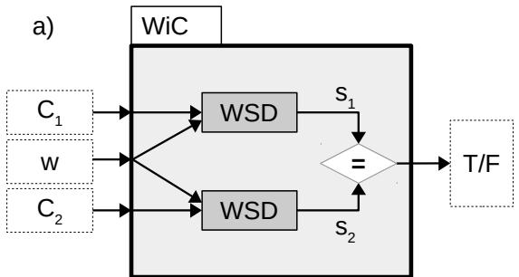
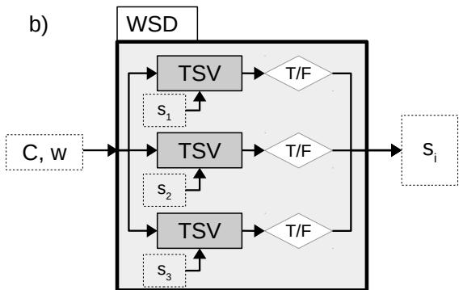
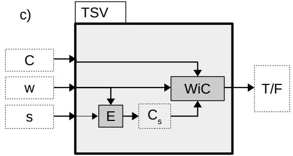

# WiC = TSV = WSD: On the Equivalence of Three Semantic Tasks

Bradley Hauer, Grzegorz Kondrak Alberta Machine Intelligence Institute, Department of Computing Science University of Alberta, Edmonton, Canada {bmhauer,gkondrak}@ualberta.ca

## Abstract

The Word-in-Context (WiC) task has attracted considerable attention in the NLP community, as demonstrated by the popularity of the recent MCL-WiC SemEval shared task. Systems and lexical resources from word sense disambiguation (WSD) are often used for the WiC task and WiC dataset construction. In this paper, we establish the exact relationship between WiC and WSD, as well as the related task of target sense verification (TSV). Building upon a novel hypothesis on the equivalence of sense and meaning distinctions, we demonstrate through the application of tools from theoretical computer science that these three semantic classification problems can be pairwise reduced to each other, and therefore are equivalent. The results of experiments that involve systems and datasets for both WiC and WSD provide strong empirical evidence that our problem reductions work in practice.

## 1 Introduction

This paper answers an open question about the the relation between two important tasks in lexical semantics. Word sense disambiguation (WSD) is the task of tagging a word in context with its sense (Navigli, 2009). The word-in-context (WiC) problem is the task of deciding whether a word has the same meaning in two different contexts (Pilehvar and Camacho-Collados, 2019). A crucial difference between the two tasks is that WSD depends on a pre-defined sense inventory1 while WiC does not involve any identification or description of word meanings. Despite ongoing interest in both tasks, there is substantial disagreement in the literature as to whether WiC is a re-formulation of WSD (e.g. Levine et al. (2020)) or an entirely distinct task (e.g. Martelli et al. (2021)).

By establishing that WSD and WiC are equivalent, we construct a theoretical foundation for the transfer of resources and methods between the two tasks. WSD has been intensively studied for decades, while WiC has recently attracted considerable attention from the research community. For example, the MCL-WiC SemEval shared task (Martelli et al., 2021) attracted 48 teams, and WiC instances have been integrated into the SuperGLUE benchmark (Wang et al., 2019). Understanding how the two tasks relate to each other allows us to correctly interpret and confidently build upon those results, including prior work on using WSD systems for WiC (e.g. Loureiro and Jorge (2019)).

We establish the theoretical equivalence of WiC and WSD by specifying reduction algorithms which produce a solution for one problem by applying an algorithm for another. In particular, we employ the target sense verification (TSV) task (Breit et al., 2021) as an intermediate step between WSD and WiC, and specify three reductions: WiC to WSD, WSD to TSV, and TSV to WiC. We formalize the three problems using a common notation, and provide both theoretical and empirical evidence for the correctness of our reductions. While we focus on English in this paper, we make no language-specific assumptions.2

The soundness of all three tasks hinges on the consistency of judgments of sameness of word meaning, whether with respect to discrete sense inventories (WSD), a representation of a single sense (TSV), or two occurrences of a word (WiC). We posit that different instances of a word have the same meaning if and only if they have the same sense. This empirically falsifiable proposition, which we refer to as the sense-meaning hypothesis, implies that WiC judgements induce sense inventories that correspond to word senses.

This counter-intuitive finding has intriguing implications for the task of word sense induction (WSI), as well as algorithmic wordnet construction.

We empirically validate our hypothesis by conducting multiple experiments and analyzing the results. In particular, we test our WSD-to-WiC and WiC-to-WSD reductions on standard benchmark datasets using state-of-the-art systems. We find that our reductions perform remarkably well, revealing no clear counter-examples to our hypothesis in the process.

Our contributions are as follows: (1) We answer the open question of the relation between WiC and WSD by constructing a theoretical argument for their equivalence, which is based on a novel sensemeaning hypothesis. (2) We carry out a series of validation experiments that strongly support the correctness of our reductions. (3) We release the details of our manual analysis and annotations of the instances identified in the validation experiments.

## 2 Theoretical Formalization

In this section, we formally define the three problems, present a theoretical argument for their equivalence, and specify the reductions.

## 2.1 Problem Definitions

Senses in our problem definitions refer to wordnet senses. A wordnet is a theoretical construct which is composed of synonym sets, or synsets, such that each synset corresponds to a unique concept, and each sense of a given word corresponds to a different synset. Actual wordnets, such as Princeton WordNet (Fellbaum, 1998), are considered to be imperfect implementations of the theoretical construct.

In the problem definitions below, $C , C _ { 1 } , C _ { 2 }$ represent contexts, each of which contains a single focus word w used in the sense s. We assume that every content word token is used in exactly one sense.3

$\mathbf { W S D } ( C , w )$ : Given a context $C$ which contains a single focus word $w ,$ return the sense s of w in C.

$\mathbf { I S V } ( C , w , s ) ;$ Given a context C which contains a single focus word $w ,$ and a sense $s ,$ return TRUE if s is the sense of w in $C ,$ , and FALSE otherwise.

$\mathbf { W i C } ( C _ { 1 } , C _ { 2 } , w )$ : Given two contexts $C _ { 1 }$ and $C _ { 2 }$ which contain the same focus word w, return TRUE if w has the same meaning in both $C _ { 1 }$ and $C _ { 2 } .$ , and FALSE otherwise.

## 2.2 Problem Equivalence

The theoretical argument for the sense-meaning hypothesis is based on the assumption that the relation of sameness of word meaning is shared between the three problems. This is supported by the lack of distinction between meanings and senses in the original WiC task proposal.4 On the other hand, WordNet exhibits a strict one-to-one correspondence between distinct meanings, synsets, and concepts, with each word sense corresponding to a specific synset. This implies that senses are ultimately grounded in sameness of meaning as well.5 Therefore, every word meaning distinction should correspond to a pairwise sense distinction. Contrariwise, if two tokens of the same word express different concepts, their meaning must be different. This equivalence also includes the TSV problem, provided that the given sense of the focus word corresponds to a single synset.

## 2.3 Problem Reductions

We now present the three problem reductions. For our purposes, a P-to-Q reduction is an algorithm that, given an algorithm for a problem Q, solves an instance of a problem P by combining the solutions of one or more instances of Q.

Proposition 1. WiC is reducible to WSD.

To reduce WiC to WSD, we directly apply the sense-meaning hypothesis from Section 1 by assuming that the focus word has the same meaning in two contexts if and only if it can be independently tagged with the same sense in both contexts. Formally:

$$
\operatorname { W i C } ( C _ { 1 } , C _ { 2 } , w ) \Leftrightarrow \operatorname { W S D } ( C _ { 1 } , w ) = \operatorname { W S D } ( C _ { 2 } , w )
$$

Thus, given a method for solving WSD, we can solve any given WiC instance by solving the two WSD instances which consist of the focus word in the first and second context, respectively. We return TRUE if the returned senses are equal, FALSE otherwise (Figure 1a).

## Proposition 2. WSD is reducible to TSV.

To reduce WSD to TSV, we take advantage of the fact that TSV can be applied to a variety of different sense representations, without any explicit dependence on a specific sense inventory. We can therefore query a TSV system with various senses of the focus word, using the same sense inventory as the WSD task:

$$
\mathrm { W S D } ( C , w ) = s \Leftrightarrow \mathrm { T S V } ( C , w , s )
$$

Thus, given a TSV solver, for any WSD instance we can construct a list of k TSV instances, one for each sense of the focus word in the corresponding WSD sense inventory. We return the sense for which the TSV instance returns TRUE (Figure 1b). The correctness of this reduction hinges on the assumption that every content word in context is used in exactly one sense.

## Proposition 3. TSV is reducible to WiC.

To reduce TSV to WiC, we again leverage our sense-meaning hypothesis by assuming that a content word used in a particular sense will be judged to have the same meaning as in an example sentence for that sense. Formally:

$$
\mathrm { T S V } ( C , w , s ) \Leftrightarrow \mathrm { W i C } ( C , C _ { s } , w )
$$

where $C _ { s }$ is a context in which w is unambiguously used in sense s. So, given a method for solving WiC, we can solve a TSV instance by replacing the given sense representation with an example, yielding a WiC instance (Figure 1c). This reduction depends on the existence of an algorithm E that, given a sense s of a word $w ,$ can generate an example sentence $C _ { s }$ that contains w used in sense $s . { } ^ { 6 }$

These three reductions are sufficient to establish the equivalence of WSD, TSV, and WiC. A method which solves any of these problems can be used to construct methods which solve the other two, using a sequence of at most two of the above reductions.

In particular, we can reduce WSD to WiC:

## Corollary 1. WSD is reducible to WiC.

To reduce WSD to WiC, first reduce the WSD instance to TSV, producing one TSV instance for each sense s of w. Then, reduce each of these TSV instances to a WiC instance, by pairing the context of the WSD instance with an example context for each sense. Succinctly:

  
Figure 1: Three problem reductions: a) WiC to WSD, b) WSD to TSV, and c) TSV to WiC.

$$
\operatorname { W S D } ( C , w ) = s \Leftrightarrow \operatorname { W i C } ( C , C _ { s } , w )
$$

Thus, solving the original WSD instance can be achieved by identifying the single positive instance in the list of k WiC instances.

## 3 WiC Datasets

In this section, we discuss and analyze the existing WiC datasets with the aim of finding a dataset suitable for validating our equivalence hypothesis. An instance that contradicts one of the reduction equivalences in Section 2.3 would be an exception to the hypothesis. Since natural language is not pure logic, falsifying the hypothesis would require finding that such exceptions constitute a substantial fraction of instances, excluding errors and omissions in lexical resources.

## 3.1 WiC

WiC was originally proposed as a dataset for the evaluation of contextualized embeddings, including neural language models (Pilehvar and Camacho-Collados, 2019). The original WiC dataset consists of pairs of sentences drawn mostly from WordNet, which were further filtered to remove fine-grained sense distinctions. The reported inter-annotator agreement was 80% for the final pruned set, and only 57% for the pruned-out instances.

Since, regardless of the source, all instances were annotated automatically by checking the sense identity in WordNet, the WiC dataset cannot, by construction, contain any exceptions to the equivalence hypothesis. Therefore, we do not use the original WiC dataset in our experiments. Nevertheless, it is possible to automatically identify both senses in about half the instances in the dataset by matching them to the sense usage example sentences in WordNet 3.0. It is interesting to note that combining such a WordNet lookup with a random back-off on the remaining instances results in correctly solving 76.1% of the WiC instances in the test set, which exceeds the current state-of-the-art of 72.1% (Levine et al., 2020).

## 3.2 WiC-TSV

Breit et al. (2021) propose target sense verification (TSV), the task of deciding whether a given word in a given context is used in a given sense. TSV is similar to WiC in that it is also a binary classification task, but only one context is provided. TSV is also similar to WSD in that there is an explicit representation of senses, but there is only one sense to consider. Three sub-tasks are defined depending on the method of representing a sense: (a) definition, (b) hypernyms, and (c) both definition and hypernyms.

Approximately 85% of the instances in the WiC-TSV dataset are derived directly from the original WiC dataset, and so are ultimately based on WordNet senses.7 Specifically, the sense of the focus word was established by reversing the process by which the WiC instances were created, as in the WordNet lookup procedure applied to the WiC dataset in Section 3.1. Because of this construction method, no exceptions to the equivalence hypothesis can be found in the WiC-TSV dataset.

## 3.3 MCL-WiC

Martelli et al. (2021) introduce the Multilingual and Cross-lingual Word-in-Context dataset. The English portion of the dataset consists of 10k WiC instances, divided into a training set (8k instances), as well as development and test sets (1k instances each). The task is exactly the same as the original WiC task, and matches our WiC problem formalization in Section 2.1. In particular, while the dataset covers multiple languages, the task itself remains monolingual, in the sense that the system need only consider one language at a time; that is, all input and output for a given instance is in a single language.

In contrast with the original WiC dataset, which was largely derived from WordNet, the sentence pairs in MCL-WiC were manually selected and annotated. Annotators consulted “multiple reputable dictionaries” to minimize the subjectivity of their decisions on the identity of meaning. As a result, both the inter-annotator agreement (κ = 0.968), and the best system accuracy (93.3% on English, Gupta et al. (2021)) are much higher than on the original WiC dataset.

The MCL-WiC dataset (Section 3.3) is especially valuable for testing our sense-meaning equivalence hypothesis because it does not rely on pre-existing WordNet sense annotations, and is agnostic toward WordNet sense distinctions. For this reason, we make the MCL-WiC dataset the focus of our empirical validation experiments in the next section.

## 4 Empirical Validation

In this section, we aim to quantify and analyze any apparent counter-examples to the sense-meaning hypothesis which are identified in the process of testing the WSD-to-WiC and WiC-to-WSD reductions. We are particularly interested in the exceptions that cannot be attributed to errors in the resources that are used to implement the reductions, because such exceptions represent potential evidence against our hypothesis.

## 4.1 Systems

In order to implement the WSD-to-WiC and WiCto-WSD reductions, we adopt two recent systems designed for the WiC and WSD tasks, respectively.

Our WiC system of choice is LIORI (Davletov et al., 2021). In the MCL-WiC shared task, LI-ORI obtained an accuracy of 91.1% on the English test set, which was within 2% of the best performing system. LIORI works by concatenating each sentence pair into a single string, and fine-tuning a neural language model for binary classification. We use the code made available by the authors8, and derive our model from the MCL-WiC English training set.

As our WSD system, we adopt ESCHER (Barba et al., 2021a). ESCHER re-formulates WSD as a span extraction task: For a given WSD instance, the context is concatenated with all glosses of the focus word into a single string, from which the gloss of the correct sense is extracted. We derive our model using the implementation and training procedure provided by the authors9. The training data includes SemCor (Miller et al., 1993). In our replication experiments, this model achieves 80.1% F1 on the standard WSD benchmark datasets of Raganato et al. (2017).

## 4.2 Solving WSD with WiC

Our first experiment involves an implementation of the reduction of WSD to WiC. For each WSD instance, we construct a set of WiC instances that correspond to its possible senses, solve them with LIORI, and return a single sense, in accordance with the reduction specified in Corollary 1 from Section 2.3. We then present and analyze the results on a standard WSD dataset.

## 4.2.1 Implementation of the Reduction

Given a WSD instance consisting of a focus word w in a context $C ,$ , we create a set of k WiC instances, where k is the number of senses of w. In WordNet 3.0, each sense s has a gloss $g _ { s } ,$ and sometimes also a usage example of w being used in sense s. Since not all synsets are accompanied by usage examples, we instead generate a new synthetic usage example $C _ { s }$ for each sense of w using the following pattern: $C _ { s } : = { } ^ { \ast \iota } w ^ { \ast }$ in this context means $g _ { s } { } ^ { \prime }$ . Thus $C _ { s }$ represents an unambiguous example of w being used in sense s. The resulting WiC instance for s is then composed of contexts C and $C _ { s } ,$ , both of which include the focus word w.

Our LIORI model returns a binary classification and a score for each of the constructed WiC instances. While LIORI may classify zero, one, or more instances as true, our implementation returns only the sense with the highest score. This is in accordance with the definition of the WSD task as identifying a single correct sense for a word in context (Section 2.1).

## 4.2.2 Results and Discussion

To estimate the expected accuracy of the above implementation, we first apply LIORI to the 1000 instances in the MCL-WiC English development set. LIORI achieves an accuracy of 88.0%, which we use as an estimate of the probability that LIORI correctly classifies any given WiC instance. The average number of senses per instance in our WSD dataset is approximately 8.5. Since any error by LIORI can cause the WSD-to-WiC reduction to output the wrong sense, we estimate the expected probability that LIORI correctly classifies a single WSD instance as $0 . 8 8 0 ^ { 8 . 5 } \approx 0 . 3 4$

We test the reduction on the SemEval 2007 dataset, as provided by Raganato et al. (2017). This test set contains 455 WSD instances, all but four of which (over 99%) are annotated with exactly one sense. Our reduction implementation obtains an accuracy of 47.9% by returning a single predicted sense for every WSD instance in the test set. As this result is substantially higher than the expected accuracy of 34%, we interpret it as evidence in favor of our hypothesis.

In theory, for each WSD instance, LIORI should classify as true exactly one of the constructed WiC instances, which represents the single correct sense. In practice, this is the case in only 48 out of 455 cases. Our reduction implementation predicts the correct sense for 38 out of 48, yielding a precision of 79.2%. We verified that ESCHER, trained on over 226k sense annotations in SemCor, correctly annotates 39 of these 48 instances. On this subset of instances, our WSD-to-WiC reduction based on LIORI is therefore competitive with state-of-the-art supervised WSD systems, despite not depending on any sense-annotated training data. This constitutes further evidence for the correctness of our reduction, and our hypothesis.

## 4.3 Solving WiC with WSD

In this experiment, we apply a state-of-the-art supervised WSD system to solve, via our WiCto-WSD reduction, all WiC instances in an independently-annotated test set. We then manually analyze a sample of the errors to assess whether the experiment supports our hypothesis and the correctness of our reduction.

## 4.3.1 Implementation of the Reduction

The implementation of the WiC-to-WSD reduction is conceptually simpler that the previously described WSD-to-WiC reduction.10 Given a WiC instance consisting of contexts $C _ { 1 }$ and $C _ { 2 }$ for a word w, we create two corresponding WSD instances: $( C _ { 1 } , w )$ and $( C _ { 2 } , w )$ . Both WSD instances are passed to ESCHER, which independently assigns senses $s _ { 1 }$ and $s _ { 2 }$ to w in each of the two contexts. We classify the WiC instance as positive if and only if $s _ { 1 } = s _ { 2 }$

There are two types of possible counter-examples to our hypothesis: (1) a WiC instance which is annotated as positive (i.e., the same meaning) in which both focus tokens have different senses; and (2) a WiC instance which is annotated as negative (i.e., different meanings) in which both focus tokens have the same sense. These two types could arise from WSD sense distinctions that are too finegrained or too coarse-grained, respectively.

## 4.3.2 Expected Accuracy

The expected accuracy of the WiC-to-WSD reduction is more complex to calculate than that of the WSD-to-WiC reduction. Our calculation is based on the simplifying assumption that all WSD errors are independent and equally likely. For the probability that ESCHER disambiguates any WSD instance correctly, we use the value of $p = 0 . 8 0 1$ based on our replication result in Section 4.1. The average number of senses per focus token in the dataset used in our experiment is $k = 4 . 7 3$ . Since there are $k - 1$ incorrect senses for each WSD instance, we approximate the probability of predicting a given incorrect sense in either WiC sentence as $q = ( 1 - p ) / ( k - 1 ) = 0 . 0 5 3$

In order to estimate the probability of a correct classification, we consider two main cases.

1. A positive WiC instance is correctly classified as positive if either (1.1) both corresponding WSD instances are disambiguated correctly, or (1.2) both instances are tagged with the same incorrect sense: $P _ { 1 } = p ^ { 2 } + ( k - 1 ) q ^ { 2 }$ = $0 . 6 4 2 + 0 . 0 1 1$

2. A negative WiC instance is incorrectly classified as positive if either (2.1) one of the corresponding WSD instances is disambiguated correctly and the other is incorrectly tagged with the same sense, or (2.2) both instances are tagged with the same incorrect sense: $P _ { 2 } = 2 p q + ( k - 2 ) q ^ { 2 } = 0 . 0 8 5 + 0 . 0 0 8 .$

Assuming that the dataset is balanced, the expected probability of classifying a WiC instance correctly is therefore: $P _ { 1 } / 2 + ( 1 - P _ { 2 } ) / 2 = 0 . 7 7 9$

## 4.3.3 Results and Discussion

We test the reduction on the MCL-WiC English development set, which consists of 500 positive and 500 negative WiC instances. We tokenize, lemmatize, and POS-tag all 2000 sentences with Tree-$\mathrm { T a g g e r ^ { 1 1 } }$ (Schmid, 1999) as a pre-processing step. ESCHER is then applied to predict the sense of the focus word in each sentence. In 25 cases, ES-CHER failed to make a sense prediction, that is, one or both focus words were not disambiguated, due to TreeTagger tokenization or lemmatization errors. The accuracy on the remaining 975 instances is 78.5%, which is within 1% of our theoretical estimate in Section 4.3.2. We conclude that this experiment provides strong empirical support for our hypothesis and the correctness of our reductions.

## 4.3.4 Analysis

To further evaluate our WiC-to-WSD reduction, we manually analyzed a sample of 10 false positives and 10 false negatives from this experiment. The sample was not random; instead, we attempted to automatically select the instances that were most likely to represent exceptions to our equivalence hypothesis. Specifically, we restricted the analysis to WiC instances that were correctly classified by LIORI, in order to reduce the impact of erroneous annotations, which are unavoidable in any gold dataset. As a result, the accuracy of ESCHER on the WSD instances in this sample is expected to be lower than in the entire dataset. In fact, in 13 of the 20 instances (six false positives, seven false negatives), the misclassification was due to an error made by ESCHER.

In three of the seven remaining cases (all false positives), the WiC misclassification was caused by the WordNet sense inventory not including the correct sense of one of the focus tokens. Since we require ESCHER to produce a WordNet sense as output, such omissions preclude the correct disambiguation of the focus word. In all such cases, we were able to find the omitted sense in one of the dictionaries that we consulted (Oxford or Merriam-Webster). For example, the correct sense of the verb partake in the WiC sentence “he has partaken in many management courses” is “join in (an activity)” which is in the Oxford English Dictionary, but not in WordNet 3.0. The missing WordNet senses for each of these instances are shown in rows 1-3 of Table 1.

Among the remaining four instances, in one anomalous case we disagreed on the WordNet sense of the adverb richly in the phrase richly rewarding. However, in the other three cases, ES-CHER’s annotations were unquestionably correct. We defer the discussion of those three interesting instances to the next section.

## 4.4 Manual Annotation Experiment

To further expand our analysis, we manually analyzed 60 additional randomly selected instances from the English MCL-WiC training set. The size of the sample was limited because WSD instances are difficult and time-consuming to analyze, especially when multiple annotators are involved and an effort is made to avoid any unconscious bias.

For each such instance, we assigned WordNet senses to each of the two focus tokens, without accessing the gold MCL-WiC labels. Our judgments were based on the glosses and usage examples of the available senses, as well as the contents of the corresponding synsets and their hypernym synsets. Subsequently, we analyzed each instance where the WiC prediction obtained by applying the WiC-to-WSD reduction did not match the WiC classification in the official gold data.12

We found that 55 out of 60 instances (91.7%) unquestionably conform to the equivalence hypothesis. The remaining five instances can be divided into three categories: (1) tokenization errors in MCL-WiC, (2) missing senses in WordNet, and (3) possible annotation errors in MCL-WiC. We discuss these three types of errors below.

In two instances, word tokenization errors interfere with the MCL-WiC annotations: (1) together in “the final coming together” is annotated as an adverb instead of a particle of a phrasal verb, and (2) shiner in “shoes shiners met the inspector” is annotated as a stand-alone noun instead of a part of a compound noun. These tokenization errors prevent the proper assignment of WordNet senses.

<table><tr><td rowspan=1 colspan=1></td><td rowspan=1 colspan=1>Lemma</td><td rowspan=1 colspan=1>Gloss</td><td rowspan=1 colspan=1>Dict</td></tr><tr><td rowspan=1 colspan=1>1</td><td rowspan=1 colspan=1>partake (v)</td><td rowspan=1 colspan=1>join in (an activity)</td><td rowspan=1 colspan=1>OED</td></tr><tr><td rowspan=1 colspan=1>2</td><td rowspan=1 colspan=1>instant (adj)</td><td rowspan=1 colspan=1>prepared quickly and withlittle effort</td><td rowspan=1 colspan=1>OED</td></tr><tr><td rowspan=1 colspan=1>3</td><td rowspan=1 colspan=1>familiar (adj)</td><td rowspan=1 colspan=1>of or relating to a family</td><td rowspan=1 colspan=1>MW</td></tr><tr><td rowspan=1 colspan=1>4</td><td rowspan=1 colspan=1>breach (v)</td><td rowspan=1 colspan=1>to leap out of water</td><td rowspan=1 colspan=1>MW</td></tr><tr><td rowspan=1 colspan=1>5</td><td rowspan=1 colspan=1>spotter (n)</td><td rowspan=1 colspan=1>a member of a motor rac-ing team</td><td rowspan=1 colspan=1>OED</td></tr><tr><td rowspan=1 colspan=1>6</td><td rowspan=1 colspan=1>campaign (n)</td><td rowspan=1 colspan=1>an organized course of ac-tion to achieve a goal</td><td rowspan=1 colspan=1>OED</td></tr><tr><td rowspan=1 colspan=1>7</td><td rowspan=1 colspan=1>campaign (n)</td><td rowspan=1 colspan=1>a set of organized actionsthat a political candidateundertakes in an election</td><td rowspan=1 colspan=1>OED</td></tr><tr><td rowspan=1 colspan=1>8</td><td rowspan=1 colspan=1>drive (n)</td><td rowspan=1 colspan=1>determination and ambi-tion to achieve something</td><td rowspan=1 colspan=1>OED</td></tr><tr><td rowspan=1 colspan=1>9</td><td rowspan=1 colspan=1>drive (n)</td><td rowspan=1 colspan=1>an organized effort by anumber of people</td><td rowspan=1 colspan=1>OED</td></tr><tr><td rowspan=1 colspan=1>10</td><td rowspan=1 colspan=1>wedding (n)</td><td rowspan=1 colspan=1>a marriage ceremony withaccompanying festivities</td><td rowspan=1 colspan=1>MW</td></tr><tr><td rowspan=1 colspan=1>11</td><td rowspan=1 colspan=1>wedding (n)</td><td rowspan=1 colspan=1>an act, process, or instanceof joining in close associa-tion</td><td rowspan=1 colspan=1>MW</td></tr><tr><td rowspan=1 colspan=1>12</td><td rowspan=1 colspan=1>analyst (n)</td><td rowspan=1 colspan=1>someone who analyzes</td><td rowspan=1 colspan=1>Wik</td></tr><tr><td rowspan=1 colspan=1>13</td><td rowspan=1 colspan=1>analyst (n)</td><td rowspan=1 colspan=1>a financial analyst; a busi-ness analyst</td><td rowspan=1 colspan=1>Wik</td></tr></table>

Table 1: Examples of senses that are not in WordNet (Rows 1-5), and sense distinctions found in external dictionaries (Rows 6-13): OED (Oxford English Dictionary), MW (Merriam-Webster), Wik (Wiktionary).

In two instances (rows 4 and 5 in Table 1), one of the senses of the focus word is missing in WordNet: (1) breach referring to an animal breaking through the surface of the water, and (2) spotter referring to a member of a motor racing team who communicates by radio with the driver. Neither of these senses is subsumed by another sense in WordNet, and both of them are present in one of the consulted dictionaries.

In the final problematic instance, MCL-WiC classifies the noun campaign as having the same meaning in the contexts “during the election campaign” and “the campaign had a positive impact on behavior.” Since the distinction between these two senses of campaign is found in the Oxford English Dictionary, which was among the ones consulted by the MCL-WiC annotators (Martelli et al., 2021), we classify it as an MCL-WiC annotation error (rows 6 and 7 in Table 1).

Similarly, we posit an MCL-WiC annotation error in each of the three outstanding false negatives from Section 4.3.4, which could not be attributed to ESCHER, based on the verification in external dictionaries. For example, unlike WordNet, Oxford and Merriam-Webster both distinguish the emotional and organizational meanings of drive. Similar analysis applies in instances involving the words wedding and analyst (rows 8-13 in Table 1). Since the meanings of the focus words in these contexts are distinguished in a dictionary, they should be considered distinct meanings according to the annotation procedure of Martelli et al. (2021). We conclude that in these cases, the MCL-WiC label is incorrect, and so they do not constitute exceptions to our hypothesis.

In summary, a careful analysis of 25 apparent exceptions made by our reduction across 80 instances, using both automatic and manual WSD, reveals no clear evidence against the correctness of our reduction. We therefore conclude that the results of these experiments strongly support our hypothesis.

## 5 Discussion

Having presented theoretical and empirical evidence for the equivalence of WiC, WSD, and TSV, we devote this section to the discussion of the relationship between WordNet and WiC.

Most English WiC and TSV datasets are based, in whole or in part, on WordNet. If no sense inventory is used for grounding decisions about meaning, the inter-annotator agreement is reported to be only about 80% (Pilehvar and Camacho-Collados, 2019; Breit et al., 2021). For the MCL-WiC dataset, however, annotators consulted other dictionaries, and obtained “almost perfect agreement" (Martelli et al., 2021). This suggests that sense inventories, and semantic resources in general, are crucial to reliable annotation for semantic tasks. However, because the exact MCL-WiC procedure for resolving differences between dictionaries is not fully specified, and because such dictionaries vary in their availability, the correctness of the annotations cannot be readily verified (c.f. Section 4.4).

Our experiments provide evidence that, even when the WordNet sense inventory is not explicitly used in constructing WiC datasets, WiC annotations nevertheless tend to agree with Word-Net sense distinctions, as our hypothesis predicts. Namely, the MCL-WiC instances in which both focus tokens have the same sense are almost always annotated as positive by the MCL-WiC annotators. The converse also holds, with any exceptions being explainable by errors in the resources. Thus, empirical validation confirms our sense-meaning hypothesis, which implies that the meaning distinctions induced by WiC judgements closely match WordNet sense inventories. This is a remarkable finding given the high granularity of WordNet.

We postulate that the adoption of WordNet as the standard sense inventory for WiC would have several practical benefits: (1) it has been adopted as the standard inventory for WSD, and so would simplify multi-task evaluation; (2) it allows seamless application of systems across datasets; (3) it facilitates rapid creation of new WiC datasets based on existing sense-annotated corpora; (4) it is freely available; (5) it can be modified and extended to correct errors and omissions (McCrae et al., 2020); and finally (6) it can be extended to facilitate work with other languages, as in the XL-WiC dataset (Raganato et al., 2020).

In addition, WordNet has strong theoretical advantages. Its fine granularity is a consequence of its grounding in synonymy and lexical concepts. Therefore, the sense distinctions found in other dictionaries either already correspond to different WordNet concepts, or should lead to adding new concepts to WordNet. Furthermore, unlike in dictionaries, senses of different words in WordNet are linked via semantic relations such as synonymy and hypernymy, which facilitate an objective assignment of every word usage to a single WordNet concept. This property of WordNet may be the reason that the WSD methods based on sense relation information have surpassed the inter-annotator agreement ceiling of around 70% (Navigli, 2006).

## 6 Conclusion

We formulated a novel sense-meaning hypothesis, which allowed us to demonstrate the equivalence of three semantic tasks by mutual reductions. We corroborated our conclusions by performing a series of experiments involving both WSD and WiC tools and resources. We have argued that these relationships originate from the WordNet properties, which are highly desirable in semantics research. We expect that our findings will stimulate future work on system development, resource creation, and joint model optimization for these tasks.

## Acknowledgements

This research was supported by the Natural Sciences and Engineering Research Council of Canada (NSERC), and the Alberta Machine Intelligence Institute (Amii).

## References

Edoardo Barba, Tommaso Pasini, and Roberto Navigli. 2021a. ESC: Redesigning WSD with extractive sense comprehension. In Proceedings of the 2021 Conference of the North American Chapter of the Association for Computational Linguistics: Human Language Technologies, pages 4661–4672.

Edoardo Barba, Luigi Procopio, Caterina Lacerra, Tommaso Pasini, and Roberto Navigli. 2021b. Exemplification modeling: Can you give me an example, please? In Proceedings of 30th International Joint Conference on Artificial Intelligence (IJCAI 2021).

Anna Breit, Artem Revenko, Kiamehr Rezaee, Mohammad Taher Pilehvar, and Jose Camacho-Collados. 2021. WiC-TSV: An evaluation benchmark for target sense verification of words in context. In Proceedings of the 16th Conference of the European Chapter of the Association for Computational Linguistics: Main Volume, pages 1635–1645.

Adis Davletov, Nikolay Arefyev, Denis Gordeev, and Alexey Rey. 2021. LIORI at SemEval-2021 task 2: Span prediction and binary classification approaches to word-in-context disambiguation. In Proceedings of the 15th International Workshop on Semantic Evaluation (SemEval-2021), pages 780–786.

Christiane Fellbaum, editor. 1998. WordNet: An Electronic Lexical Database. MIT Press.

Rohan Gupta, Jay Mundra, Deepak Mahajan, and Ashutosh Modi. 2021. MCL@IITK at SemEval-2021 Task 2: Multilingual and cross-lingual word-incontext disambiguation using augmented data, signals, and transformers. In Proceedings of the Fifteenth Workshop on Semantic Evaluation.

Bradley Hauer, Hongchang Bao, Arnob Mallik, and Grzegorz Kondrak. 2021. UAlberta at SemEval-2021 Task 2: Determining sense synonymy via translations. In Proceedings of the 15th International Workshop on Semantic Evaluation (SemEval-2021), pages 763–770.

Bradley Hauer and Grzegorz Kondrak. 2020. Synonymy = translational equivalence. arXiv preprint arXiv:2004.13886.

Yoav Levine, Barak Lenz, Or Dagan, Ori Ram, Dan Padnos, Or Sharir, Shai Shalev-Shwartz, Amnon Shashua, and Yoav Shoham. 2020. SenseBERT: Driving some sense into BERT. In Proceedings of the 58th Annual Meeting of the Association for Computational Linguistics, pages 4656–4667.

Daniel Loureiro and Alípio Jorge. 2019. LIAAD at SemDeep-5 challenge: Word-in-context (WiC). In Proceedings of the 5th Workshop on Semantic Deep Learning (SemDeep-5), pages 1–5, Macau, China.

Federico Martelli, Najla Kalach, Gabriele Tola, and Roberto Navigli. 2021. SemEval-2021 Task 2: Multilingual and Cross-lingual Word-in-Context Disambiguation (MCL-WiC). In Proceedings of the Fifteenth Workshop on Semantic Evaluation (SemEval-2021).

John Philip McCrae, Alexandre Rademaker, Ewa Rudnicka, and Francis Bond. 2020. English WordNet 2020: Improving and extending a WordNet for English using an open-source methodology. In Proceedings of the LREC 2020 Workshop on Multimodal Wordnets (MMW2020), pages 14–19.

George A Miller. 1995. WordNet: A lexical database for English. Communications of the ACM, 38(11):39–41.

George A. Miller, Claudia Leacock, Randee I. Tengi, and Ross T. Bunker. 1993. A semantic concordance. In Proceedings of the ARPA Workshop on Human Language Technology, pages 303–308.

Roberto Navigli. 2006. Meaningful clustering of senses helps boost word sense disambiguation performance. In Proceedings of the 21st International Conference on Computational Linguistics and 44th Annual Meeting of the Association for Computational Linguistics, pages 105–112.

Roberto Navigli. 2009. Word sense disambiguation: A survey. ACM Computing Surveys (CSUR), 41(2):10.

Mohammad Taher Pilehvar and Jose Camacho-Collados. 2019. WiC: the word-in-context dataset for evaluating context-sensitive meaning representations. In Proceedings of NAACL-HLT, pages 1267– 1273.

Alessandro Raganato, Jose Camacho-Collados, and Roberto Navigli. 2017. Word sense disambiguation: A unified evaluation framework and empirical comparison. In Proceedings of the 15th Conference of the European Chapter of the Association for Computational Linguistics: Volume 1, Long Papers, pages 99–110.

Alessandro Raganato, Tommaso Pasini, Jose Camacho-Collados, and Mohammad Taher Pilehvar. 2020. XL-WiC: A multilingual benchmark for evaluating semantic contextualization. In Proceedings of the 2020 Conference on Empirical Methods in Natural Language Processing (EMNLP), pages 7193–7206.

Helmut Schmid. 1999. Improvements in part-ofspeech tagging with an application to German. In Natural language processing using very large corpora, pages 13–25. Springer.

Alex Wang, Yada Pruksachatkun, Nikita Nangia, Amanpreet Singh, Julian Michael, Felix Hill, Omer Levy, and Samuel R. Bowman. 2019. SuperGLUE: A stickier benchmark for general-purpose language understanding systems. In NeurIPS.