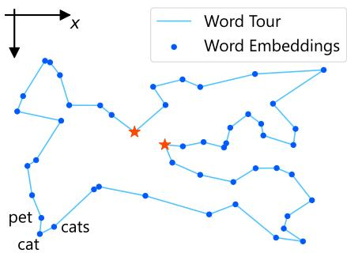
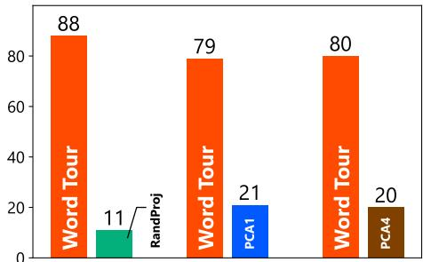
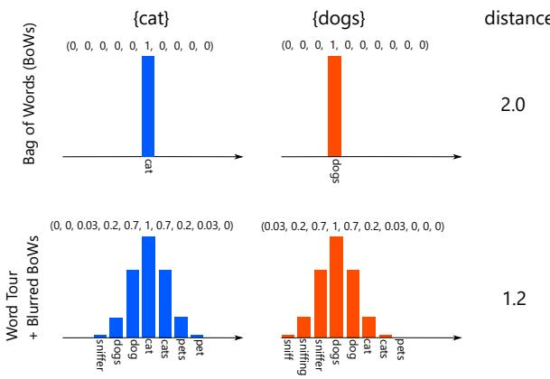

# Word Tour: One-dimensional Word Embeddings via the Traveling Salesman Problem

Ryoma Sato Kyoto University / RIKEN AIP r.sato@ml.ist.i.kyoto-u.ac.jp

## Abstract

Word embeddings are one of the most fundamental technologies used in natural language processing. Existing word embeddings are high-dimensional and consume considerable computational resources. In this study, we propose WORDTOUR, unsupervised onedimensional word embeddings. To achieve the challenging goal, we propose a decomposition of the desiderata of word embeddings into two parts, completeness and soundness, and focus on soundness in this paper. Owing to the single dimensionality, WORDTOUR is extremely efficient and provides a minimal means to handle word embeddings. We experimentally confirmed the effectiveness of the proposed method via user study and document classification.

## 1 Introduction

Word embeddings are one of the most thriving techniques in natural language processing and are used in various tasks, including word analogy (Mikolov et al., 2013; Pennington et al., 2014), text classification (Kim, 2014; Kusner et al., 2015; Shen et al., 2018), and text similarity (Arora et al., 2017; Yokoi et al., 2020). Existing word embeddings are in highdimensional spaces. Although high dimensionality offers representational power to word embeddings, it also has the following drawbacks: (1) Memory inefficiency. High-dimensional word embeddings require the storage of many floating-point values, and they consume considerable memory space. For instance, the 300-dimensional GloVe with 400k words consumes 1 GB of memory. This hinders the application of word embeddings in edge devices (Raunak et al., 2019; Jurgovsky et al., 2016; Joulin et al., 2016). (2) Time inefficiency. The high dimensionality also increases the time consumption owing to many floating-point arithmetic operations. (3) Uninterpretability. It is not straightforward to visualize high-dimensional embeddings. Projections to low dimensional spaces, e.g., by t-SNE and PCA, lose some information, and it is difficult to control and interpret the aspects that these projections preserve. Besides, word embeddings are sparse in high-dimensional space, and for a small perturbation $\varepsilon \in \mathbb { R } ^ { d }$ , it is not clear what ${ \pmb x } _ { \mathrm { c a t } } + \varepsilon$ represents, e.g., when creating adversarial examples (Lei et al., 2019) and data augmentation (Qu et al., 2021).

In this study, we propose WORDTOUR, unsupervised one dimensional word embeddings. In contrast to high-dimensional embeddings, WORD-TOUR is memory efficient. It does not require storing even a single floating-point value; instead, it stores only the order of words. WORDTOUR with 40k words consumes only 300 KB memory, which is the same space as the space for storing a list of the words. Memory efficiency enables applications in low-resource environments. WORDTOUR is time efficient as well. It can compare words in a single operation whereas traditional embeddings require hundreds of floating-point operations for a single comparison. In addition, it can retrieve similar words by simply looking up the surrounding words in a constant time and can efficiently compare documents using a blurred bag of words, as we will show in the experiments. These features are also advantageous in low resource environments. In addition, WORDTOUR is interpretable owing to its single dimensionality. It is straightforward to visualize the one dimentional embeddings without any information loss. Besides, we can always interpret the perturbed word embedding as we can interpret the perturbed image pixels. In brief, WORD-TOUR provides a minimal means to handle word embeddings.

However, words are inherently highdimensional, and it is impossible to capture all semantics in one dimension. To tackle this challenge, we propose to decompose the desiderata of word embeddings into two components: soundness and completeness. WORDTOUR gives up completeness, focuses on soundness, and thereby realizes meaningful one dimensional embeddings for some, if not all, applications. We formulate the optimization of sound word embeddings as the traveling salesman problem and solve it using a highly efficient solver. In the experiments, we confirm that WORDTOUR provides high-quality embeddings via qualitative comparison, user studies, and document classification.

Reproducibility: Our code and obtained embeddings are available at https:// github.com/joisino/wordtour.

## 2 Backgrounds

## 2.1 Notations

Let be the set of words in a vocabulary, and $n ~ = ~ | \nu |$ be the number of words. Let $[ n ] \ =$ $\{ 1 , 2 , \cdots , n \}$ and let ${ \mathcal { P } } ( [ n ] )$ be the set of permutations of [n].

## 2.2 Problem Definition

We are given off-the-shelf word embeddings $\mathbf { \nabla } X =$ $[ { \pmb x } _ { 1 } , \dots , { \pmb x } _ { n } ] ^ { \top } \ \in \ \mathbb { R } ^ { n \times d }$ , such as word2vec and GloVe. We assume that the embeddings completely represent the semantics of the words, but they are high-dimensional, $\mathrm { e . g . } , d = 3 0 0$ . We aim to create an ordering of  such that the order preserves the structure of the given embeddings. The problem is defined as follows:

Problem Definition.

Given: Word embedddings $\ b { X } \in \mathbb { R } ^ { n \times d }$

Output: Word ordering $\sigma ^ { * } \in \mathcal { P } ( [ n ] )$

In full generality, it may be possible to model the real-value positions. However, in this paper, we solely consider the order of the words. That is, the words are equally spaced in the one-dimensional space. This formulation makes the embedding simpler and lighter, while still being sufficiently powerful.

## 3 Word Tour

In this section, we introduce our proposed method, WORDTOUR. Ideally, we would like to preserve all the semantics in our one-dimensional embeddings. However, such ideal embeddings are unlikely to exist because the relations between words are inherently high-dimensional. Indeed, although existing studies have attempted to reduce the dimensionality of word embeddings, they require at least tens of dimensions (Raunak et al., 2019; Acharya et al., 2019) and several dimensions even in non-Euclidean spaces (Nickel and Kiela, 2017; Tifrea et al., 2019). These results indicate that ideal 1D embeddings do not exist. Therefore, we make a compromise. We decompose the desiderata of word embeddings into the following two categories:

  
Figure 1: Illustration of WORDTOUR. Each dot represents a word with its coordinates as the embedding vector.

Soundness Close embeddings should have semantically similar meanings.

Completeness Semantically similar words should be embedded closely.

In WORDTOUR, we give up the latter condition and focus on the former condition. For instance, the two red stars in Figure 1 are distant in the order, although they are semantically similar. WORDTOUR accepts such inconsistency. Owing to the incompleteness, WORDTOUR may fail some applications of word embeddings, such as word analogy and relation extraction. Nevertheless, WORDTOUR still has some other applications, such as word replacement and document retrieval. Indeed, WORDTOUR may overlook some relevant documents because they may embed relevant words far apart. However, the close documents found by WORDTOUR are indeed close owing to soundness. These insights indicate that there exist one-dimensional embeddings that are useful for some, if not all, applications.

A natural criterion for soundness is that consecutive words in the ordering should be close to one another in the original embedding space. We formulate the problem as follows:

$$
\operatorname* { m i n i m i z e } _ { \sigma \in \mathcal { P } ( [ n ] ) } \| \pmb { x } _ { \sigma _ { 1 } } - \pmb { x } _ { \sigma _ { n } } \| + \sum _ { i = 1 } ^ { n - 1 } \| \pmb { x } _ { \sigma _ { i } } - \pmb { x } _ { \sigma _ { i + 1 } } \| .\tag{1}
$$

Table 1: Examples of segments. Each row represents a segment. (a–d) Segments around “cat.” (e–h) Segments around “concept.” (i–o) Random segments of WORDTOUR. WORDTOUR provides smooth orderings.
<table><tr><td></td><td>Methods</td><td colspan="10">Segments</td></tr><tr><td>(a)</td><td>WORDTOUR</td><td>sniff</td><td>sniffing</td><td>sniffer</td><td>dogs</td><td>dog</td><td>cat</td><td>cats</td><td>pets</td><td>pet</td><td>stray</td><td>errant</td></tr><tr><td>(b)</td><td>RandProj</td><td>loire</td><td>sayings</td><td>nn</td><td>trooper</td><td>referendum</td><td>cat</td><td>exceeded</td><td>traces</td><td>freestyle</td><td>mirrored</td><td>bloomberg</td></tr><tr><td>(c)</td><td>PCA1</td><td>mm</td><td>asylum</td><td>kohl</td><td>presents</td><td>expressed</td><td>cat</td><td>sichuan</td><td>denmark</td><td>counted</td><td>corporations</td><td>hewitt</td></tr><tr><td>(d)</td><td>PCA4</td><td>1.46</td><td>puzzles</td><td>940</td><td>coexist</td><td>locations</td><td>cat</td><td>att</td><td>winners</td><td>perth</td><td>colgate</td><td>sohail</td></tr><tr><td>(e)</td><td>WORDTOUR</td><td>assumption</td><td>assumptions</td><td>notions</td><td>notion</td><td>idea</td><td>concept</td><td>concepts</td><td>ideas</td><td>thoughts</td><td>feelings</td><td>emotions</td></tr><tr><td>(f)</td><td>RandProj</td><td>entertaining</td><td>42,000</td><td>kursk</td><td>embarrassment</td><td>ingrained</td><td>concept</td><td>berezovsky</td><td>cg</td><td>guillen</td><td>excerpts</td><td>roofs</td></tr><tr><td>(g)</td><td>PCA1</td><td>neighboring</td><td>branches</td><td>argued</td><td>manhattan</td><td>1998</td><td>concept</td><td>share</td><td>pending</td><td>response</td><td>airlines</td><td>fort</td></tr><tr><td>(h)</td><td>PCA4</td><td>2:00</td><td>hksar</td><td>hashim</td><td>provider</td><td>straining</td><td>concept</td><td>inducing</td><td>fightback</td><td>unsettled</td><td>bavaria</td><td>sign</td></tr><tr><td>(i)</td><td>WORDTOUR</td><td>wireless</td><td>broadband</td><td>3g</td><td>cdma</td><td>gsm</td><td>handset</td><td>handsets</td><td>smartphones</td><td>smartphone</td><td>blackberry</td><td>tablet</td></tr><tr><td>(j)</td><td>WORDTOUR</td><td>gun</td><td>weapon</td><td>weapons</td><td>arms</td><td>arm</td><td>leg</td><td>legs</td><td>limbs</td><td>limb</td><td>prosthetic</td><td>make-up</td></tr><tr><td>(k)</td><td>WORDTOUR</td><td>federalist</td><td>libertarian</td><td>progressive</td><td>liberal</td><td>conservative</td><td>conservatives</td><td>liberals</td><td>democrats</td><td>republicans</td><td>gop</td><td>republican</td></tr><tr><td>(1)</td><td>WORDTOUR</td><td>cordial</td><td>amicable</td><td>agreeable</td><td>mutually</td><td>beneficial</td><td>detrimental</td><td>harmful</td><td>destructive</td><td>disruptive</td><td>behaviour</td><td>behavior</td></tr><tr><td>(m)</td><td>WORDTOUR</td><td>15th</td><td>14th</td><td>13th</td><td>12th</td><td>10th</td><td>11th</td><td>9th</td><td>8th</td><td>7th</td><td>6th</td><td>5th</td></tr><tr><td>(n)</td><td>WORDTOUR</td><td>suspicions</td><td>doubts</td><td>doubt</td><td>doubted</td><td>doubting</td><td>doubters</td><td>skeptics</td><td>skeptic</td><td>believer</td><td>believers</td><td>adherents</td></tr><tr><td>(o)</td><td>WORDTOUR</td><td>molten</td><td>magma</td><td>lava</td><td>basalt</td><td>sandstone</td><td>limestone</td><td>granite</td><td>marble</td><td>slab</td><td>slabs</td><td>prefabricated</td></tr></table>

We treat the ordering as a cycle, not a path, by adding term $\| \pmb { x } _ { \sigma _ { 1 } } - \pmb { x } _ { \sigma _ { n } } \|$ . The rationale behind this design is that we would like to treat all words symmetrically and would like the boundary words to have the same number of neighbors as the nonboundary words.

In formulation (1), we adopt the $L _ { 2 }$ norm for simplicity. However, our formulation is agnostic to the distance function. When a corpus is at hand, we can also use the number of co-occurrences, $\mathrm { i . e . , } \sum _ { i }$ #co-occurrences of $( \sigma _ { i } , \sigma _ { i + 1 } )$ , as the cost function. We leave investigating other modelings as future work and focus on the $L _ { 2 }$ cost in this paper.

The optimization problem (1) is an instance of the traveling salesman problem (TSP), which is NPhard. As the problem size is relatively large in our case, for instance, $n = 4 0 0 0 0$ , it may seem impossible to solve the problem. However, in practice, highly efficient TSP solvers have been developed. Among others, we employ the LKH solver (Helsgaun, 2018), which implements the Lin Kernighan algorithm (Lin and Kernighan, 1973; Helsgaun, 2000) in a highly efficient and effective manner. The LKH solver performs a restricted local search based on a guide graph constructed using the dual problem. Helsgaun (2018) reported that the LKH solver exactly solved an instance with as many as 109 399 cities. In addition, several effective algorithms for computing lower bounds provide theoretical guarantees for the quality of a solution. We employ the one-tree lower bound (Helsgaun, 2000) implemented in the LKH solver to compute the lower bounds of the optimum value. As a tour is a special case of a one-tree, the minimum cost onetree is a provable lower bound of the TSP problem. The algorithm searches for a potential vector for a tight lower bound by gradient ascent. WORDTOUR computes a near-optimal solution of Problem (1) by the LKH solver and uses the solution as the word order, i.e., the word embeddings.

## 4 Experiments

We experimentally validated the effectiveness of WORDTOUR. We used a Linux server with Intel Xeon E7-4830 v4 CPUs in the experiments.

## 4.1 Computing Embeddings

We used 300-dimensional GloVe embedding with the first 40 000 words as the input embeddings $\{ x _ { v } \}$ . The objective value of the solution obtained by LKH was 236882.314, and the lower bound proved by LKH was 236300.947. Therefore, the cost of the obtained tour is guaranteed to be at most 1.003 of the optimum. The resulting embedding file is 312 KB, which is sufficiently light to be deployed in low-resource environments.

## 4.2 Qualitative Comparison

We use the following baselines: (1) RandProj randomly samples a direction $\pmb { d } \in \mathbb { R } ^ { d }$ and orders the embeddings in ascending order of $\pmb { d } ^ { \top } \pmb { x } _ { i }$ . This method extracts a specific aspect d of the input embeddings. (2) PCA-1 orders in ascending order of the top PCA component. (3) Mu and Viswanath (2018) reported that a few leading PCA components were not informative. Therefore, PCA-4 orders words by the fourth PCA component.

As we cannot show the entire tour owing to space constraints, we sample and list some random segments in Table 1. It is observed that WORDTOUR provides the most natural ordering, and the consecutive words are semantically similar in WORD-TOUR. Notably, WORDTOUR almost recovers the order of ordinals without explicit supervision (Table 1 (m)).

  
Figure 2: Results of the user study. Each bar represents the number of times each method was selected within 100 trials. One trial was not completed in WORDTOUR vs. RandProj, which led to 99 trials in the first comparison.

## 4.3 Assesment via Crowdsourcing

We conducted a user study at Amazon Mechanical Turk to confirm the effectiveness of WORDTOUR. Specifically, to compare two word ordering $\sigma , \tau \in$ ${ \mathcal { P } } ( [ n ] )$ , we randomly sample a reference word $v \in$ $\nu ,$ retrieve the next words of v in σ and τ , and ask a crowdworker which word is more similar to the reference word v. We repeated this process 100 times for each pair of embeddings. Figure 2 shows the number of times each embedding was selected. This clearly shows that WORDTOUR aligns with human judgment.

## 4.4 Document Retrieval

In this section, we evaluate the effectiveness of word embeddings in document classification. The most straightforward approach to compare two documents is the bag of words (BoW), which counts common and uncommon words in documents. However, this approach cannot capture the similarities of the words. In 1D embeddings, neighboring words are similar, although they are not exactly matched in BoW. To utilize this knowledge, we use blurred BoW, as shown in Figure 3. Specifically, we put some mass around the words in a document to construct the blurred BoW vector. We employ a Gaussian kernel for the mass amount and use WORDTOUR, RandProj, PCA1, and PCA4 for the orderings. We normalize the BoW and blurred BoW vectors with the $L _ { 1 }$ norm and compute the distance between two documents using the $L _ { 1 }$ distance of the vectors. The blurred BoW can be computed in $O ( w n )$ time, where n denotes the number of words in a document and w is the width of the filter. We used $w = 1 0$ in the experiments. We also use word mover’s distance (WMD) (Kusner et al., 2015) as a baseline, which is one of the most popular word-embedding-based distances.

  
Figure 3: Document comparison by WORDTOUR. This figure illustrates the case in which a document is composed of a single word. When more than one word is in a document, the blurred BoW will be multimodal.

Table 2: Document classification errors. Lower is better. The time row reports the average time to compare the two documents. WORDTOUR performs the best in the blurred BoW family.
<table><tr><td></td><td>ohsumed</td><td>reuter</td><td>20news</td><td>amazon</td><td>classic</td></tr><tr><td>BoW</td><td>48.1</td><td>5.6</td><td>35.4</td><td> $1 1 . 4 \pm 0 . 4$ </td><td>5.1 ± 0.3</td></tr><tr><td>Time</td><td>39 ns</td><td>23 ns</td><td>35 ns</td><td>21 ns</td><td>23 ns</td></tr><tr><td>WORDTOUR</td><td>47.2</td><td>4.6</td><td>34.1</td><td> ${ \bf 1 0 . 1 \pm 0 . 3 }$ </td><td> ${ \bf 4 . 6 \pm 0 . 1 }$ </td></tr><tr><td>RandProj</td><td>47.9</td><td>5.4</td><td>35.4</td><td> $1 1 . 3 \pm 0 . 3$ </td><td> $5 . 1 \pm 0 . 3$ </td></tr><tr><td>PCA1</td><td>47.8</td><td>5.7</td><td>35.5</td><td> $1 1 . 4 \pm 0 . 6$ </td><td> $5 . 1 \pm 0 . 3$ </td></tr><tr><td>PCA4</td><td>48.1</td><td>5.6</td><td>35.4</td><td> $1 1 . 6 \pm 0 . 5$ </td><td> $5 . 1 \pm 0 . 4$ </td></tr><tr><td>Time</td><td>206 ns</td><td>142 ns</td><td>312 ns</td><td>185 ns</td><td>150 ns</td></tr><tr><td>WMD</td><td>47.5</td><td>4.5</td><td>30.7</td><td> $7 . 6 \pm 0 . 3$ </td><td> $4 . 2 \pm 0 . 3$ </td></tr><tr><td>Time</td><td> $3 . 5 \times 1 0 ^ { 6 } \mathrm { n s }$ </td><td></td><td>2.2 ×106 ns 5.1 ×106 ns</td><td> $1 . 2 \times 1 0 ^ { 7 } ~ \mathrm { n s }$ </td><td> $1 . 9 \times 1 0 ^ { 6 } \mathrm { n s }$ </td></tr></table>

We used 300-dimensional GloVe for WMD. WMD requires $O ( n ^ { 3 } + n ^ { 2 } d )$ computation because of the optimal transport formulation, where n denotes the number of words in a document and d is the number of dimensions of word embeddings. The performance of WMD can be seen as an expensive upper bound of BoW and blurred BoW. We used five datasets: ohsumed (Joachims, 1998), reuter (Sebastiani, 2002), 20news (Lang, 1995), Amazon (Blitzer et al., 2007), and classic (SMART). We remove the duplicated documents following (Sato et al., 2021). The details of the datasets are provided in the Appendix. We evaluated the performance using the k-nearest neighbor error. We used the standard test dataset if it existed (for instance, based on timestamps) and used five random train/test splits for the other datasets1. We report the standard deviations for five-fold datasets.

The results are shown in Table 2. Although WORDTOUR is less effective than WMD, it is much faster than WMD and more effective than other 1D embeddings. Recall that the 1D embeddings are designed for low-resource environments, where

WMD may be infeasible. WORDTOUR offers an efficient approach while integrating the similarities of the words.

## 5 Related Work

Raunak et al. (2019) and Jurgovsky et al. (2016) proposed a postprocessing method to reduce the number of dimensions of the off-the-shelf word embeddings. However, existing methods require at least five to tens of dimensions. To the best of our knowledge, this study is the first to obtain large-scale 1D word embeddings. Nickel and Kiela (2017) proposed to embed words into hyperbolic spaces and drastically reduce the number of required dimensions. FastText.zip (Joulin et al., 2016) quantizes and prunes word embeddings for memory-efficient text classification. Although Fast-Text.zip saves considerable memory consumption without harming downstream tasks, it prunes words that are irrelevant to text classification, whereas we aim to retain the original vocabulary in this work. Ling et al. (2016) and Tissier et al. (2019) proposed to quantize general word embeddings. Although they save considerable memory and time complexity with no considerable performance degradation, they still consume a few orders of magnitude more memory than 1D embeddings, and they are sparse in the embedding space and require more time than WORDTOUR to compare documents and search similar words.

## 6 Conclusion

In this study, we proposed WORDTOUR, a 1D word embedding method. To realize 1D embedding, we decompose the requirement of word embeddings into two parts and impose only one constraint in which the consecutive words should be semantically similar. We formulate this problem using the TSP and solve it with a state-of-the-art solver. Although the TSP is NP-hard, the effective solver solves the optimization almost optimally and provides effective 1D embeddings. We confirmed its effectiveness via crowdsourcing and document classification.

## Acknowledgements

This work was supported by JSPS KAKENHI GrantNumber 21J22490.

## References

Anish Acharya, Rahul Goel, Angeliki Metallinou, and Inderjit S. Dhillon. 2019. Online embedding compression for text classification using low rank matrix factorization. In The Thirty-Third AAAI Conference on Artificial Intelligence, AAAI, pages 6196–6203.

Sanjeev Arora, Yingyu Liang, and Tengyu Ma. 2017. A simple but tough-to-beat baseline for sentence embeddings. In 5th International Conference on Learning Representations, ICLR.

John Blitzer, Mark Dredze, and Fernando Pereira. 2007. Biographies, Bollywood, boom-boxes and blenders: Domain adaptation for sentiment classification. In Proceedings of the 45th Annual Meeting of the Association of Computational Linguistics, pages 440– 447.

Keld Helsgaun. 2000. An effective implementation of the lin-kernighan traveling salesman heuristic. Eur. J. Oper. Res., 126(1):106–130.

Keld Helsgaun. 2018. LKH (Keld Helsgaun).

Thorsten Joachims. 1998. Text categorization with support vector machines: Learning with many relevant features. In Proceedings of the 10th European Conference on Machine Learning, ECML, volume 1398 of Lecture Notes in Computer Science, pages 137– 142.

Armand Joulin, Edouard Grave, Piotr Bojanowski, Matthijs Douze, Hervé Jégou, and Tomás Mikolov. 2016. Fasttext.zip: Compressing text classification models. arXiv.

Johannes Jurgovsky, Michael Granitzer, and Christin Seifert. 2016. Evaluating memory efficiency and robustness of word embeddings. In Advances in Information Retrieval - 38th European Conference on IR Research, ECIR, volume 9626 of Lecture Notes in Computer Science, pages 200–211.

Yoon Kim. 2014. Convolutional neural networks for sentence classification. In Proceedings of the 2014 Conference on Empirical Methods in Natural Language Processing (EMNLP), pages 1746–1751.

Matt J. Kusner, Yu Sun, Nicholas I. Kolkin, and Kilian Q. Weinberger. 2015. From word embeddings to document distances. In Proceedings of the 32nd International Conference on Machine Learning, ICML, volume 37, pages 957–966.

Ken Lang. 1995. NewsWeeder: Learning to filter netnews. In Proceedings ofthe 12th International Conference on Machine Learning, ICML, pages 331– 339.

Qi Lei, Lingfei Wu, Pin-Yu Chen, Alex Dimakis, Inderjit S. Dhillon, and Michael J. Witbrock. 2019. Discrete adversarial attacks and submodular optimization with applications to text classification. In Proceedings of Machine Learning and Systems 2019, MLSys.

Shen Lin and Brian W. Kernighan. 1973. An effective heuristic algorithm for the traveling-salesman problem. Oper. Res., 21(2):498–516.

Shaoshi Ling, Yangqiu Song, and Dan Roth. 2016. Word embeddings with limited memory. In Proceedings of the 54th Annual Meeting of the Association for Computational Linguistics (Volume 2: Short Papers), pages 387–392.

Tomas Mikolov, Wen-tau Yih, and Geoffrey Zweig. 2013. Linguistic regularities in continuous space word representations. In Proceedings of the 2013 Conference of the North American Chapter of the Association for Computational Linguistics: Human Language Technologies, pages 746–751.

Jiaqi Mu and Pramod Viswanath. 2018. All-but-thetop: Simple and effective postprocessing for word representations. In 6th International Conference on Learning Representations, ICLR.

Maximilian Nickel and Douwe Kiela. 2017. Poincaré embeddings for learning hierarchical representations. In Advances in Neural Information Processing Systems 30: Annual Conference on Neural Information Processing Systems 2017, pages 6338–6347.

Jeffrey Pennington, Richard Socher, and Christopher Manning. 2014. GloVe: Global vectors for word representation. In Proceedings of the 2014 Conference on Empirical Methods in Natural Language Processing (EMNLP), pages 1532–1543.

Yanru Qu, Dinghan Shen, Yelong Shen, Sandra Sajeev, Weizhu Chen, and Jiawei Han. 2021. Coda: Contrast-enhanced and diversity-promoting data augmentation for natural language understanding. In 9th International Conference on Learning Representations, ICLR.

Vikas Raunak, Vivek Gupta, and Florian Metze. 2019. Effective dimensionality reduction for word embeddings. In Proceedings of the 4th Workshop on Representation Learning for NLP (RepL4NLP-2019), pages 235–243.

Ryoma Sato, Makoto Yamada, and Hisashi Kashima. 2021. Re-evaluating word mover’s distance. arXiv, abs/2105.14403.

Fabrizio Sebastiani. 2002. Machine learning in automated text categorization. ACM Comput. Surv., 34(1):1–47.

Dinghan Shen, Guoyin Wang, Wenlin Wang, Martin Renqiang Min, Qinliang Su, Yizhe Zhang, Chunyuan Li, Ricardo Henao, and Lawrence Carin. 2018. Baseline needs more love: On simple wordembedding-based models and associated pooling mechanisms. In Proceedings of the 56th Annual Meeting of the Association for Computational Linguistics (Volume 1: Long Papers), pages 440–450.

SMART. Cornell’s smart repository.

Alexandru Tifrea, Gary Bécigneul, and Octavian-Eugen Ganea. 2019. Poincare glove: Hyperbolic word embeddings. In 7th International Conference on Learning Representations, ICLR.

Julien Tissier, Christophe Gravier, and Amaury Habrard. 2019. Near-lossless binarization of word embeddings. In The Thirty-Third AAAI Conference on Artificial Intelligence, AAAI, pages 7104–7111.

Sho Yokoi, Ryo Takahashi, Reina Akama, Jun Suzuki, and Kentaro Inui. 2020. Word rotator’s distance. In Proceedings of the 2020 Conference on Empirical Methods in Natural Language Processing (EMNLP), pages 2944–2960.

Table 3: Dataset statistics.
<table><tr><td></td><td>ohsumed</td><td>reuter</td><td>20news</td><td>amazon</td><td>classic</td></tr><tr><td>Number of documents</td><td>7497</td><td>7585</td><td>18776</td><td>7854</td><td>6778</td></tr><tr><td>Number of training documents</td><td>3268</td><td>5413</td><td>11265</td><td>5497</td><td>4744</td></tr><tr><td>Number of test documents</td><td>4229</td><td>2172</td><td>7511</td><td>2357</td><td>2034</td></tr><tr><td>Size of the vocabulary</td><td>12144</td><td>13761</td><td>28825</td><td>21816</td><td>12904</td></tr><tr><td>Unique words in a document</td><td>94.5</td><td>63.0</td><td>137.1</td><td>201.8</td><td>60.8</td></tr><tr><td>Number of classes</td><td>10</td><td>8</td><td>20</td><td>4</td><td>4</td></tr><tr><td>Split type</td><td>one-fold</td><td>one-fold</td><td>one-fold</td><td>five-fold</td><td>five-fold</td></tr></table>

## A Datasets

Table 3 summarizes the statistics of the datasets after preprocessing. Ohsumed (Joachims, 1998) consists of medical abstracts. Reuter (Sebastiani, 2002) and 20news (Lang, 1995) are news datasets. Amazon (Blitzer et al., 2007) consists of reviews in amazon.com. Classic (SMART) consists of academic papers. The datasets are retrieved from https://github.com/mkusner/wmd.

## B Usage of LKH

We used LKH version 3.0.6, with parameter PATCHING\_C = 3, PATCHING\_A = 2, which are the default parameters. As the LKH solver accepts only integral values, we multiply the actual distance by $1 0 ^ { 3 }$ and round down the values before we feed them into the LKH solver. The difference caused by this rounding process is negligibly small.

## C Hyperparameters

The number k of neighbors in the kNN classification is selected from 1, 2, , 19 . The variance of the Gaussian filter in a blurred bag of words is selected from $\{ 0 . 0 1 , 0 . 1 , \cdots , 1 0 0 0 \}$ . We selected the hyperparameters using a 5-fold cross-validation and retrained the kNN model using the chosen hyperparameters and entire training dataset.