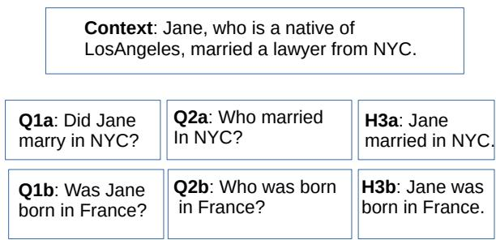
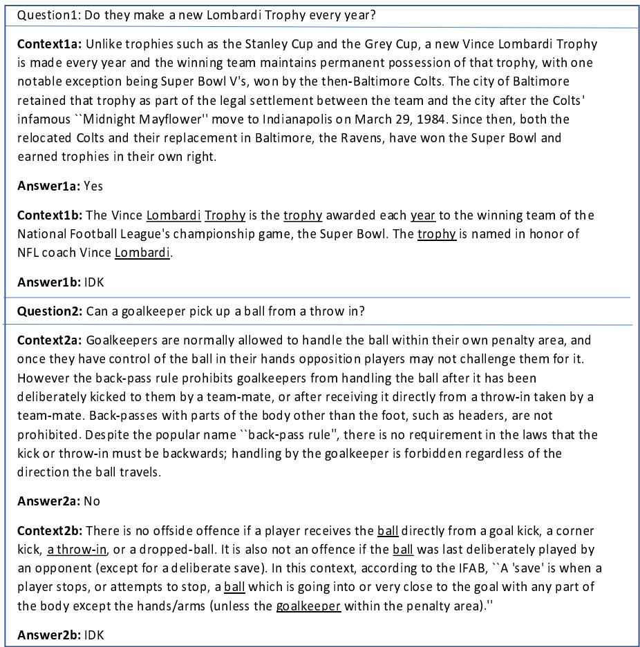
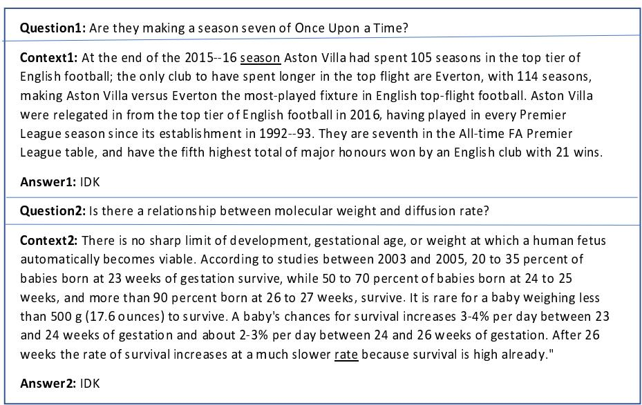
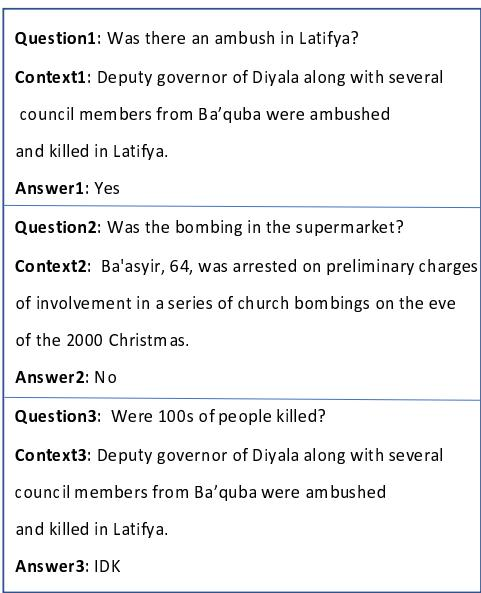
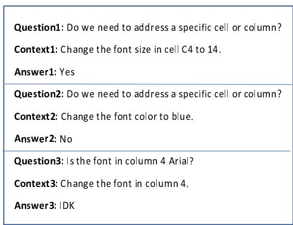

# Yes, No or IDK: The Challenge of Unanswerable Yes/No Questions

Elior Sulem, Jamaal Hay and Dan Roth

Department of Computer and Information Science, University of Pennsylvania eliors,jamaalh,danroth@seas.upenn.edu

## Abstract

The Yes/No QA task (Clark et al., 2019) consists of “Yes” or “No” questions about a given context. However, in realistic scenarios, the information provided in the context is not always sufficient in order to answer the question. For example, given the context “She married a lawyerfrom New-York.”, we don’t know whether the answer to the question “Did she marry in New York?” is “Yes” or “No”. In this paper, we extend the Yes/No QA task, adding questions with an IDK answer, and show its considerable difficulty compared to the original 2-label task. For this purpose, we (i) enrich the BoolQ dataset (Clark et al., 2019) to include unanswerable questions and (ii) create out-ofdomain test sets for the Yes/No/IDK QA task. We study the contribution of training on other Natural Language Understanding tasks. We focus in particular on Extractive QA (Rajpurkar et al., 2018) and Recognizing Textual Entailments (RTE, Dagan et al., 2013), analyzing the differences between 2 and 3 labels using the new data.1

## 1 Introduction

The ability to know whether a claim is true or false given a context is an important component of language comprehension. One main way to study this ability is the Yes/No Question Answering task, for which a large-scale dataset, BoolQ, has been proposed (Clark et al., 2019). The BoolQ dataset includes paragraphs together with naturally occurring questions whose answer is either “Yes” or “No”.

However, in realistic scenarios, the information needed to answer a Yes/No question can be missing. For example, Figure 1 shows Yes/No questions given the context “Jane, who is a native of Los Angeles, married a lawyer from NYC”. While the questions in (a) and (b) can be answered respectively by “Yes” and “No” (Jane was born in Los ---	 --- - - ---- -

	  -------- - 	  ---- -- !- -- 	  ----------  "#

Figure 1: Examples of a “Yes”, “No” and “IDK” Questions in (a), (b) and (c) respectively, given a Context.

Angeles so she was not born in France), the question “Did Jane marry in NYC?” in (c) cannot be answered given the context.

Indeed, the ability to extract information from text only addresses one aspect of the expectations we have from a comprehension system. Another main aspect concerns the ability to identify that a given information is not in the text, a witness of understanding in human comprehension.

In this paper we extend the Yes/No QA task to include IDK questions and show the considerable difficulty of the extended task compared to the twolabel setting. For this purpose we first enrich the BoolQ dataset by including unanswerable questions, along with creating two other, out of domain, datasets, to test the ability to answer Yes/No/IDK questions in realistic scenarios (Section 3).

Experimenting with a system based on BERT-LARGE (Devlin et al., 2019), we show that the performance on the dev set drops from 72.88 F1 to 33.64 F1 when moving from a two-label to a three-label setting and observe similar results on out-of-domain test sets (Section 4).

We then explore the contribution of other Natural Language Undertanding tasks to the performance, focusing on Extractive QA (Rajpurkar et al., 2016), using the SQuAD 2.0 dataset (Rajpurkar et al., 2018) and Recognizing Textual Entailments (RTE, Dagan et al., 2013), using the MNLI dataset (Williams et al., 2018). We obtain that, similar to what has been observed in the two-label setting (Clark et al., 2019), leveraging SQuAD 2.0 does not improve the performance while training on MNLI achieves better performance. As the improvement is limited, we separately analyze the transfer from MNLI in the two-label and three-label settings.

  
Figure 2: Examples of Yes/No QA (left), Extractive QA (center) and RTE hypotheses (right) for a given context.

We conclude that current systems that achieve high performance on the BoolQ dataset are not adapted to the task of Yes/No QA where unanswerable questions are involved. Using the RTE data is helpful but not sufficient for a good performance.

In this paper, we provide new datasets that allow a more realistic evaluation of the Yes/No task by (1) addressing unanswerable questions, which appear in real-world scenarios; (2) compiling test sets to evaluate the performance of the systems on domains that are different from the ones seen in training and finetuning. Using the new data, we explore the performance of current systems on this task and show its considerable difficulty compared to its two-label version.

## 2 Related Work

Yes/No Questions In Yes/No QA, the IDK option has been taken into account in the context of FraCaS inference problem (Cooper et al., 1996), which consists of 346 problems targeting specific linguistic phenomena, each containing one or more statements and one yes/no-question. The possible labels are “yes”, “no”, “don’t know” and a “other/complex” label that mainly targets several possible readings. Clark et al. (2019) proposed the large-scale BoolQ dataset in order to address the Yes/No QA task where a question together with a paragraph are given as input. The task consists in classifying the questions into two categories: “Yes” and “No” questions. This dataset does not include an IDK option, a gap we fill by augmenting the original corpus (see Section 3). Our data augmentation method is somewhat similar to the one used for Extractive QA by Clark and Gardner (2018) who generated negative examples for SQuAD (Rajpurkar et al., 2016) by pairing existing questions with other paragraphs from the same article based on TF-IDF overlap.

Unanswerable Questions Unanswerable questions have been mainly studied in the context of the Extractive QA task. The original Extractive QA task consists in extracting a correct answer to a question from a context paragraph or document. Rajpurkar et al. (2018) enriched the SQuAD 1.1 corpus (Rajpurkar et al., 2016) by including unanswerable questions for the same paragraphs via crowdsourcing, resulting in SQuAD 2.0, and proposed to extend the task so that the predictions will include either a span or an “IDK” answer. Unanswerable questions have also been included in the QuAC (Choi et al., 2018) and CoQA (Reddy et al., 2019) datasets where questions are asked in the form of a dialog (see Yatskar (2019) for a comparison). The difficulty of unanswerable questions in Extractive QA has been recently explored in the case of out-of-domain scenarios (Sulem et al., 2021) and in questions with a context composed of multiple paragraphs (Asai and Choi, 2021). Although Extractive QA includes IDK questions, the conversion between the Extractive QA format and a Yes/No/IDK QA format will not always preserve the IDK label, as shown in Figure 2. In particular, an IDK instance in Extractive QA (Q2b) can correspond to a “No” answer in Yes/No QA (Q1b).

The selective question answering task in out-ofdomain settings (Kamath et al., 2020) is related to the identification of unanswerable questions. However, it targets the ability of a system to refrain from answering in some of the cases in order to avoid errors in out-of-domain settings, independently from the presence of the answer in the context.

Recognizing Textual Entailment (RTE) The RTE task (Dagan et al., 2013) consists of classifying a sentence pair composed of a premise p and a hypothesis h into three classes, according to the relation between the two sentences: “entailment”, “contradiction” and “neutral”. In some of the RTE works (Bentivogli et al., 2009; Wang et al., 2018), “contradiction” and “neutral” are unified in a “nonentailed” joint category. Both RTE and Yes/No QA aim to verify whether a given information can be derived from the context. Furthermore, there is a one-to-one mapping between the labels of the two tasks. In particular, if the RTE label is “neutral” then the answer to the corresponding question is IDK (as in Figure 2, Q1a and H3a). However, a main difference between the two tasks is the length of the context. While it is a single sentence in the RTE datasets (e.g., Bowman et al., 2015; Williams et al., 2018, for SNLI and MNLI respetively), it is a paragraph in Yes/No QA.2 The extension of the Yes/No QA task and data presented in this paper allows their use in multiple applications such as Extractive QA (Sulem et al., 2021), relation extraction (Obamuyide and Vlachos, 2018; Sainz et al., 2021) or event extraction (Lyu et al., 2021; Sainz et al., 2022) in replacement of or jointly with RTE. We explore the use of an RTE dataset for additional training in Section 5. An investigation of the replacement of the RTE task by Yes/No/IDK QA for Extractive QA is presented in Appendix H.

## 3 Datasets

## 3.1 Enriching BoolQ with IDK Questions

The BoolQ dataset3, proposed by Clark et al. (2019), is the largest corpus for Yes/No questions. The training set is composed of 9.4K of Yes/No questions and their answers. 62.31% of the answers are “yes”. The dev set includes 3.2k questions.

General Idea. We aim to generate IDK questions by mapping questions from the original BoolQ to passages that will not contain anymore the information required to answer the question. As a random swapping between passages and questions could generate mostly very simple cases with no relation between the question and the passage, we want to maximize the word overlapping between the two.

Generation. We augment BoolQ with IDK questions automatically by using passages and questions from the original BoolQ dataset. Sampling randomly half of the “yes” questions and half of the “no” questions, we match to each of the extracted questions a passage from BoolQ that has the greatest overlapping with the questions in terms of nouns and verbs, identified using the NLTK PoS tagger (Loper and Bird, 2002).4 The greatest overlapping is chosen to avoid very simple cases with no relation between the question and the passage. In case there are several passages with the same number of nouns or verbs that appear in the question, we choose one of them randomly. We apply this algorithm (separately) on both the train set and the dev set of BoolQ, obtaining new IDK questions (4.7k for train and 1.6k for dev) that we add to the original sets. We call the new corpus BoolQ3L (for BoolQ wih three labels). Examples from BoolQ3L are shown in Appendix C.

Validation and Analysis. We manually validate the IDK questions we compiled by sampling 100 question-paragraph pairs randomly in each of the sets (the train and the dev sets). The 200 pairs are annotated separately by two of the authors of the paper using the “IDK”, “Yes” and “No” labels. In the dev set, we find that 95% of the instances are correctly labeled with 100% absolute inter-annotator agreement. In the train set the rates of instances correctly labeled as “IDK” are 94% and 93% according to the two annotators, with an absolute inter-annotator agreement of 97%. 5 Using the same samples we also evaluate difficulty of the questions, based on the relatedness of the paragraph to the question, abstracting away from the word overlapping between the two. Following this procedure, we label 33% / 40% (85% absolute agreement) and 43% / 63 % (80 % absolute agreement) cases as Non-related in the train and dev set respectively. Examples of Non-related IDK questions are presented in Appendix D.

By using questions and answers from the original BoolQ, we ensure that the new IDK subset cannot be identified as having different question or paragraph styles or levels of grammaticality. Also, the IDK questions have paragraphs that also appear in either “Yes” or “No” questions, with the proportion similar to that observed in the entire corpus. Therefore “no-answer” cannot be predicted by only looking at the question.6

<table><tr><td rowspan=1 colspan=5>Corpus      Split  # Examples   IDK (%)  # Labels</td></tr><tr><td rowspan=1 colspan=5>Existing Corpus</td></tr><tr><td rowspan=2 colspan=1>BoolQ</td><td rowspan=1 colspan=1>train</td><td rowspan=1 colspan=1>9,427</td><td rowspan=1 colspan=1>0</td><td rowspan=2 colspan=1>2</td></tr><tr><td rowspan=1 colspan=1>dev</td><td rowspan=1 colspan=1>3,270</td><td rowspan=1 colspan=1>0</td></tr><tr><td rowspan=1 colspan=5>New Corpora</td></tr><tr><td rowspan=2 colspan=1>BoolQ3L</td><td rowspan=1 colspan=1>train</td><td rowspan=1 colspan=1>14,141</td><td rowspan=1 colspan=1>33</td><td rowspan=2 colspan=1>3</td></tr><tr><td rowspan=1 colspan=1>dev</td><td rowspan=1 colspan=1>4,906</td><td rowspan=1 colspan=1>33</td></tr><tr><td rowspan=1 colspan=1>ACE-YNQA</td><td rowspan=1 colspan=1>test</td><td rowspan=1 colspan=1>999</td><td rowspan=1 colspan=1>52</td><td rowspan=1 colspan=1>3</td></tr><tr><td rowspan=1 colspan=1>INSTRUCTIONS</td><td rowspan=1 colspan=1>test</td><td rowspan=1 colspan=1>70</td><td rowspan=1 colspan=1>33</td><td rowspan=1 colspan=1>3</td></tr></table>

Table 1: Statistics and properties of the BoolQ corpus (top) and the newly introduced corpora (bottom).

## 3.2 Out-of-domain Test Sets

Motivation Addressing unanswerable questions in Yes/No QA is a first step towards a more realistic evaluation of this task. A second step, which we address in this section, consists in the evaluation of the systems on datasets different from the ones they have been trained and finetuned on, using controlled out-of-domain test sets for evaluation, as advocated for example by Linzen (2020). Furthermore, an informative way to evaluate the comprehension of a system is to ask very simple questions whose answers are obvious to humans (Dunietz et al., 2020). We focus here on event-based questions that address simple predicate-argument relations.

ACE-YNQA We leverage the ACE event extraction (Walker et al., 2006)7 dataset to derive a new test corpus of “Yes”, “No” and IDK questions. For this purpose, we first select sentence fragments that include a location or a time mention according to the ACE annotation. For the “Yes” questions we generate questions of the form “Did T happen at location / time entity”, where T is the event trigger. For the “No” variant we manually created a set of place / time entities and asked “Did T happen at r?”, where r is a randomly selected entity. We then checked for grammatical and logical correctness. For the IDK labels, we generated those questions manually asking context specific questions. An example of IDK question is “has the loan been paid?” given the context “the world bank first offered the loan in 1999”. We call the obtained corpus ACE-YNQA. Examples with “Yes”, “No” and “IDK” answers are shown in Appendix E.

INSTRUCTIONS We also generate a small test corpus (INSTRUCTIONS; 70 questions) from scratch about instructions. For example, given the context “Change the font color to green”, an IDK question is “Is the font size 12?”. More examples are presented in Appendix F.

A summary of the statistics for the different corpora is presented in Table 1.

## 4 The Difficulty of Yes/No/IDK QA

We use the BERT-LARGE representation and the BERT TensorFlow implementation8 for sequence classification. We train on the BoolQ3L training set and evaluate on the ACE-YNQA out-of-domain dataset. We also report the average performance on the dev set. We use the BERT-based approach for classification, where the three labels are “Yes”, “No” and “IDK”; the final hidden vector corresponding to the first input token([CLS]) is used as the aggregate representation. The fine-tuning details and hyperparameters are presented in Appendix A. For comparison, we also fine-tune BERT-LARGE on the original BoolQ dataset for the Yes/No QA task using the original train and dev sets. We consider the “Yes” and “No” portions of the ACE-YNQA as the out-of-domain test set for the 2-label setting.

The results are presented in the first columns of Table 2 (for Yes/No/IDK) and Table 3 (for Yes/No). We find that the accuracy of the model drops to 33.64 on the BoolQ3L dev set while it is 72.88 in the two-level setting (when training and testing on BoolQ). On the out-of-domain ACE-YNQA test set, the performance is 52.02. In this case too the score is higher in the two-label setting (accuracy of 59.53).

<table><tr><td rowspan=1 colspan=1> $\sum \mathrm { T r a i n } $  $\mathrm { T e s t } \downarrow \frown$ </td><td rowspan=1 colspan=1> $\mathrm { B o o l Q } _ { 3 L }$ </td><td rowspan=1 colspan=1> $\mathrm { M N L I } + \mathrm { B o o l Q } _ { 3 L }$ </td><td rowspan=1 colspan=1> $c ( \mathrm { M N L I } ) + \mathrm { B o o l Q } _ { 3 L }$ </td><td rowspan=1 colspan=1> $\mathrm { S Q u A D } 2 . 0 + \mathrm { B o o l Q 3 } L$ </td></tr><tr><td rowspan=1 colspan=1> $\overline { { { \bf B o o l Q } _ { 3 L } { \bf \ d e v } } }$ </td><td rowspan=1 colspan=1> $\overline { { 3 3 . 6 4 } }$ </td><td rowspan=1 colspan=1> $\overline { { 4 2 . 6 6 } }$ </td><td rowspan=1 colspan=1>43.25</td><td rowspan=1 colspan=1> $\overline { { 3 5 . 2 7 } }$ </td></tr><tr><td rowspan=1 colspan=1> $\overline { { \mathrm { A C E } \mathrm { - } \mathrm { Y N Q A } } }$ </td><td rowspan=1 colspan=1>52.02</td><td rowspan=1 colspan=1>52.02</td><td rowspan=1 colspan=1>54.94</td><td rowspan=1 colspan=1>44.15</td></tr></table>

Table 2: Accuracy of the different systems, tested on Yes/No/IDK QA with 3 labels. The scores correspond to average across 5 different runs. The columns represent the training strategies. The rows represent the test datasets. In all the cases the trained representation is BERT-LARGE-CASED.

<table><tr><td rowspan=1 colspan=1> $\overbrace { \mathrm { T e s t } \downarrow } ^ { \mathrm { T r a i n }  }$ </td><td rowspan=1 colspan=1>BoolQ</td><td rowspan=1 colspan=1> $\mathbf { M N L I } + \mathbf { B o o l Q }$ </td><td rowspan=1 colspan=1> $c ( \mathrm { M N L I } ) + \mathrm { B o o l Q }$ </td><td rowspan=1 colspan=1> $\mathrm { S Q u A D } 2 . 0 + \mathrm { B o o l Q }$ </td></tr><tr><td rowspan=1 colspan=1> $\overline { { { \bf B 0 0 1 } { \bf Q } { \bf d e v } } }$ </td><td rowspan=1 colspan=1>72.88</td><td rowspan=1 colspan=1>78.24</td><td rowspan=1 colspan=1>79.49</td><td rowspan=1 colspan=1>62.13</td></tr><tr><td rowspan=1 colspan=1> $\overline { { \mathrm { { A C E - Y N Q A _ { Y / N } } } } }$ </td><td rowspan=1 colspan=1>59.53</td><td rowspan=1 colspan=1>65.47</td><td rowspan=1 colspan=1>68.01</td><td rowspan=1 colspan=1>53.81</td></tr></table>

Table 3: Accuracy of the baseline system as well as the use of Extractive QA for both Yes/No QA with 2 labels on the BoolQ dev set an on the out-of-domain datasets, removing the IDK examples. In all the cases the trained representation is BERT-LARGE-CASED.

## 5 Leveraging Other Tasks

We leverage the RTE task, using the MNLI corpus (Williams et al., 2018) and the Extractive QA task, using SQuAD 2.09 (Rajpurkar et al., 2018).

Given a language representation R and two corpora $C _ { 1 }$ and $C _ { 2 }$ for the tasks $T _ { 1 }$ and $T _ { 2 }$ respectively, $C _ { 1 } + C _ { 2 }$ refers to the procedure in which R is first fine-tuned on $C _ { 1 }$ for the task $T _ { 1 }$ and then further fine-tuned on $C _ { 2 }$ for the task $T _ { 2 } . ^ { 1 0 }$ This is similar to the STILTS method (Phang et al., 2018). We experiment with the following systems: (i) MNLI + $\mathbf { B o o l Q } _ { 3 L }$ (ii) c(MNLI) $\mathbf { \nabla } \mathbf { \vdash B o o l Q 3 } L$ where c(MNLI) is a binary version of MNLI, distinguishing between contradictions and non-contradictions11 (iii) $\mathbf { S Q u A D } \ 2 . \mathbf { 0 } + \mathbf { B o o l Q } _ { 3 L }$

We also replicate the above systems in the twolabel setting, training and testing on BoolQ.

The results are presented in Tables 2 and 3. Evaluating on $\mathrm { B o o l Q } _ { 3 L }$ dev set, we find that the use of MNLI for intermediary fine-tuning (MNLI + $\mathrm { B o o l Q } _ { 3 L } )$ improves the overall accuracy, which reaches a score of 42.66. The best performance is achieved when using intermediary fine-tuning on the binary MNLI where the accuracy is 43.25. A similar behavior is observed in the two-label setting although the scores are much higher.

On the ACE-YNQA out-of-domain test set, $c ( \mathrm { M N L I } ) + \mathrm { B o o l Q } _ { 3 L }$ is the best system. Its 2-level version is the best system in the case of Yes/No QA. Leveraging SQuAD 2.0 is not helpful in both 2 (as also in Clark et al. (2019)) and 3 label settings.

In order to explore additional types of Yes/No questions, including unanswerable questions, we replicate our experiments on the small INSTRUC-TIONS dataset. As before, we find a gap between the two-label and three-label scores and the usefulness of the MNLI corpus.The full results are presented in Appendix G.

## 6 Conclusion

In this paper we aim to allow a more realistic evaluation of the Yes/No QA task. For this purpose, we (i) enrich the BoolQ dataset to include unanswerable questions and (ii) compile out-of-domain test sets. Using the new data, we show the difficulty of current systems to address the task both by training directly on the task-specific data and by leveraging other NLU tasks.

## Acknowledgements

We thank Qing Lyu and the members of the Cognitive Computation Group for their insightful feedback ad well as the reviewers of the paper for their useful suggestions. This work was supported by Contracts FA8750-19-2-1004 and FA8750-19-2- 0201 with the US Defense Advanced Research Projects Agency (DARPA). Approved for Public Release, Distribution Unlimited. This research is also based upon work supported in part by the Office of the Director of National Intelligence (ODNI), Intelligence Advanced Research Projects Activity (IARPA), via IARPA Contract No. 2019- 19051600006 under the BETTER Program. The views and conclusions contained herein are those of the authors and should not be interpreted as necessarily representing the official policies, either expressed or implied, of ODNI, IARPA, the Department of Defense, or the U.S. Government. The U.S. Government is authorized to reproduce and distribute reprints for governmental purposes notwithstanding any copyright annotation therein. This material is also based upon work supported by Google Cloud (TRC Program).

## References

Akari Asai and Eunsol Choi. 2021. Challenges in information-seeking QA: Unanswerable questions and paragraph retrieval. In Proceedings ofthe 59th Annual Meeting ofthe Associationfor Computational Linguistics and the 11th International Joint Conference on Natural Language Processing (Volume 1: Long Papers), pages 1492–1504, Online. Association for Computational Linguistics.

Luisa Bentivogli, Peter Clark, Ido Dagan, and Danilo Giampiccolo. 2009. The sixth pascal recognizing textual entailment challenge. In TAC.

Samuel R. Bowman, Gabor Angeli, Christopher Potts, and Christopher D. Manning. 2015. A large annotated corpus for learning natural language inference. In Proceedings of the 2015 Conference on Empirical Methods in Natural Language Processing (EMNLP), pages 632–642.

Eunsol Choi, He He, Mohit Iyyer, Mark Yatskar, Wentau Yih, Yejin Choi, Percy Liang, and Luke Zettlemoyer. 2018. QuAC: Question answering in context. In Proceedings of the 2018 Conference on Empirical Methods in Natural Language Processing, pages 2174–2184.

Christopher Clark and Matt Gardner. 2018. Simple and effective multi-paragraph reading comprehension. In Proceedings of the 56th Annual Meeting of the Associationfor Computational Linguistics (Volume 1: Long Papers).

Christopher Clark, Kenton Lee, Ming-Wei Chang, Tom Kwiatkowski, Michael Collins, and Kristina Toutanova. 2019. BoolQ: Exploring the surprising difficulty of natural yes/no questions. In Proceedings ofthe 2019 Conference ofthe North American Chapter ofthe Associationfor Computational Linguistics: Human Language Technologies, pages 2924—-2936.

Robin Cooper, Richard Crouch, Jan van Eijck, Chris Fox, Josef van Genabith, Jan Jaspers, Hans Kamp, Manfred Pinkal, Massimo Poesio, Stephen Pulman, and Espen Vestre. 1996. Describing the approaches. In The FraCaS Consortium.

Ido Dagan, Dan Roth, Mark Sammons, and Fabio Massimo Zanzoto. 2013. Recognizing Textual Entailment: Models and Applications.

Jacob Devlin, Ming-Wei Chang, Kenton Lee, and Kristina Toutanova. 2019. BERT: Pre-training of deep bidirectional transformers for language understanding. In Proceedings ofthe 2019 Conference of the North American Chapter ofthe Associationfor Computational Linguistics: Human Language Technologies, Volume 1 (Long and Short Papers), pages 4171–4186, Minneapolis, Minnesota. Association for Computational Linguistics.

Jesse Dunietz, Greg Burnham, Akash Bharadwaj, Owen Rambow, Jennifer Chu-Carroll, and Dave Ferrucci. 2020. To test machine comprehension, start by defining comprehension. In Proceedings ofthe 58th Annual Meeting ofthe Associationfor Computational Linguistics, pages 7839–7859. Association for Computational Linguistics.

Suchin Gururangan, Swabha Swayamdipta, Omer Levy, Roy Schwartz, Samuel Bowman, and Noah A. Smith. 2018. Annotation artifacts in natural language inference data. In Proceedings ofthe 2018 Conference of the North American Chapter ofthe Associationfor Computational Linguistics: Human Language Technologies, Volume 2 (Short Papers), pages 107–112.

Amita Kamath, Robin Jia, and Percy Liang. 2020. Selective question answering under domain shift. In Proceedings of the 58th Annual Meeting of the Association for Computational Linguistics, pages 5684– 5696.

Tal Linzen. 2020. How can we accelerate progress towards human-like linguistic generalization? In Proceedings ofthe 58th Annual Meeting ofthe Association for Computational Linguistics, pages 5210– 5217, Online. Association for Computational Linguistics.

E. Loper and S. Bird. 2002. NLTK: the Natural Language Toolkit. In Proceedings of the ACL-02 Workshop on Effective Tools and Methodologiesfor Teaching Natural Language Processing and Computational Linguistics.

Qing Lyu, Hongming Zhang, Elior Sulem, and Dan Roth. 2021. Zero-shot Event Extraction via Transfer Learning: Challenges and Insights. In Proc. of the Annual Meeting ofthe Associationfor Computational Linguistics (ACL).

Abiola Obamuyide and Andreas Vlachos. 2018. Zeroshot relation classification as textual entailment. In Proceedings ofthe First Workshop on Fact Extraction and VERification (FEVER), pages 72–78, Brussels, Belgium. Association for Computational Linguistics.

Jason Phang, Thibault Févry, and Samuel R. Bowman. 2018. Sentence encoders on STILTs: Supplementary training on intermediate labeled-data tasks.

Pranav Rajpurkar, Robin Jia, and Percy Liang. 2018. Know what you don’t know: Unanswerable questions for SQuAD. In Proceedings of the 56th Annual Meeting of the Association for Computational Linguistics (Volume 2: Short Papers), pages 784–789.

Pranav Rajpurkar, Jian Zhang, Konstantin Lopyrev, and Percy Liang. 2016. SQuAD: 100,000+ questions for machine comprehension of text. In Proceedings of the 2016 Conference on Empirical Methods in Natural Language Processing, pages 2383–2392.

Siva Reddy, Danqi Chen, and Christopher D. Manning. 2019. CoQA: A conversational question answering challenge. Transactions ofthe Associationfor Computational Linguistics, 7:249–266.

Oscar Sainz, Itziar Gonzalez-Dios, Oier Lopez de Lacalle, Bonan Min, and Eneko Agirre. 2022. Textual entailment for event argument extraction: Zero- and few-shot with multi-source learning. In Findings of the Association for Computational Linguistics: NAACL-HLT 2022, Online and Seattle, Washington. Association for Computational Linguistics.

Oscar Sainz, Oier Lopez de Lacalle, Gorka Labaka, Ander Barrena, and Eneko Agirre. 2021. Label verbalization and entailment for effective zero and fewshot relation extraction. In Proceedings of the 2021 Conference on Empirical Methods in Natural Language Processing, pages 1199–1212, Online and Punta Cana, Dominican Republic. Association for Computational Linguistics.

Elior Sulem, Jamaal Hay, and Dan Roth. 2021. Do We Know What We Don’t Know? Studying Unanswerable Questions beyond SQuAD 2.0. In Findings ofthe Conference on Empirical Methods in Natural Language Processing (EMNLP).

Christopher Walker, Stephanie Strassel, Julie Medero, and Kazuaki Maeda. 2006. Ace 2005 multilingual training corpus. Linguistic Data Consortium, Philadelphia, 57.

Alex Wang, Amanpreet Singh, Julian Michael, Felix Hill, Omer Levy, and Samuel Bowman. 2018. GLUE: A multi-task benchmark and analysis platform for natural language understanding. In Proceedings ofthe 2018 EMNLP Workshop BlackboxNLP: Analyzing and Interpreting Neural Networks for NLP, pages 353–355.

Adina Williams, Nikita Nangia, and Samuel Bowman. 2018. A broad-coverage challenge corpus for sentence understanding through inference. In Proceedings ofthe 2018 Conference ofthe North American Chapter of the Association for Computational Linguistics: Human Language Technologies, Volume 1 (Long Papers), pages 1112–1122.

Mark Yatskar. 2019. A qualitative comparison of CoQA, SQuAD 2.0 and QuAC. In Proceedings ofthe 2019 Conference of the North American Chapter of the Associationfor Computational Linguistics: Human Language Technologies, Volume 1 (Long and Short Papers), pages 2318–2323, Minneapolis, Minnesota. Association for Computational Linguistics.

## A Hyperparameter Finetuning

For training on $\mathrm { B o o l Q } _ { 3 L }$ with the BERT-LARGE-CASED representation, we use a batch size of 24 and a learning rate of 1e-5 and fine tune over the number of epochs (3 or 5). For training on MNLI, we use batch size of 32 and 3 training epochs. We fine tune over three possible learning rate values: 2e-5, 3e-5 and 5e-5. For training on SQuAD 2.0, we use two train epochs and fine-tune for the learning rate (3e-5 and 5e-5) and the batch size (24 and 48). For each of the training settings, we choose the hyperparameter combination that maximizes the accuracy for the target task on the dev set.

Following Clark et al. (2019), we train the system on $\mathrm { B o o l Q 3 } L$ with 5 different initializations and report the average score on the dev set. We choose the checkpoint with the closest score to the average as a starting point for the following training step and for testing on the out-of-domain datasets (ACE-YNQA and INSTRUCTIONS).

## B Transfer Analysis

We also evaluate the direct transfer from MNLI to BoolQ and $\mathrm { B o o l Q 3 } L$ dev set, only training for the RTE task and then experiment with intermediary finetuning on small samples (30 sentences) from the respective training corpus.

While the direct use of MNLI achieves low scores both on the $\mathrm { B o o l Q } _ { 3 L }$ dev (26.73 accuracy) and the BoolQ dev (23.07), the finetuning on the sample considerably improves the performance in the two-label setting (50.43 accuracy), compared to the three-label setting (33.91 F1), showing the difficulty to transfer on the three-label setting. The results are summarized in Table 4.

## C Examples from BoolQ3L

Examples from $\mathrm { B o o l Q 3 } { \cal L }$ are shown in Figure 3. For example, an IDK example is created by matching Question1 (that is associated in BoolQ to Context1a), to Context1b, which shares with the question the words “Lombardi”, “trophy” and “year”. While the answer to Question1 is “Yes” when associated with Context1a, it is “IDK” when associated with Context1b since the latter does not address the creation of the trophy. Similarly, the answer to Question2 is “No” when associated with Context2a but it is “IDK” when associated with Context2b that shares with the question the words “ball”, “throw-in” and “goalkeeper” without providing the information required to answer the question.

<table><tr><td rowspan=1 colspan=1> $\sim \mathrm { T r a i n } $  $\mathrm { T e s t } \downarrow \frown$ </td><td rowspan=1 colspan=1>MNLI</td><td rowspan=1 colspan=1> $\mathrm { M N L I } { + s ( \mathrm { B o o l } \mathrm { Q } _ { 3 L } ) }$ </td><td rowspan=1 colspan=1> $\mathbf { M N L I } { + s ( \mathbf { B o o l Q } ) }$ </td></tr><tr><td rowspan=1 colspan=1>3 labels</td><td rowspan=1 colspan=1>26.73</td><td rowspan=1 colspan=1>33.91</td><td rowspan=1 colspan=1>一</td></tr><tr><td rowspan=1 colspan=1>2 labels</td><td rowspan=1 colspan=1>23.07</td><td rowspan=1 colspan=1>一</td><td rowspan=1 colspan=1>50.43</td></tr></table>

Table 4: Accuracy of the different systems, tested either on $\mathrm { B o o l Q } _ { 3 L }$ (first row) or BoolQ with 2 labels (second row). The columns represent the training strategies.

## D Non-related IDK Examples

Examples of non-related IDK cases are shown in Figure 4. The word “season” appears both in the question (Question1), that is about a TV series and in the paragraph (Context1), that is about American football. Similarly, Question2 and Context2 that share the word “rate”, address different topics.

## E Examples from ACE-YNQA

Examples from the ACE-YNQA dataset are presented in Figure 5.

## F Examples from INSTRUCTIONS

Examples from the INSTRUCTIONS dataset are presented in Figure 6.

## G Results on INSTRUCTIONS

The results for both 2-label and 3-label settings are presented in Section 5.

## H Yes/No/IDK QA for Extractive QA

In order to test the usefulness of the $\mathrm { B o o l Q _ { 3 } } L$ dataset for other Natural Language Understanding tasks, in particular in cases where IDK answers are required, we replicate the experiment in Sulem et al. (2021), replacing MNLI by $\mathrm { B o o l Q 3 } L$ . In this experiment, Extractive QA systems trained on SQuAD 2.0 are tested on the out-of-domain ACE-whQA test set that includes two types of IDK questions derived from ACE. The results are presented in Table 6. They show that additional training on $\mathrm { B o o l Q } _ { 3 L }$ significantly improves the baseline (where only SQuAD 2.0 is used).

  
Figure 3: Examples from the $\mathrm { B o o l Q } _ { 3 L }$ corpus. Question1 associated with Context1a is a $\mathbf { \tilde { \Sigma } } ^ { 6 6 } \mathbf { Y } \mathrm { e } \mathbf { s } ^ { \prime 3 }$ example from the original BoolQ dataset. An “IDK” example is generated by associating Question1 with Context1b. Similarly, an IDK example was generated by associating Context2b with Question2 that appeared in BoolQ in a $\mathrm { \hbar } ^ { 6 6 } \mathrm { N o } ^ { 7 }$ example (when associated with Context2a). In the case of IDK examples, the content words appearing both in the question and in the context are underlined.

  
Figure 4: Non-related IDK Examples from the $\mathrm { B o o l Q } _ { 3 L }$ corpus where the question and the context target different topics despite the content word overlap (underlined in the context).

Table 5: Accuracy of the baseline system as well as the use of Extractive QA and RTE for both Yes/No/IDK QA with 3 labels and Yes/No QA with 2 labels on the INSTRUCTIONS test set. In all the cases the trained representation is BERT-LARGE-CASED.
<table><tr><td rowspan=1 colspan=1> $\overbrace { \mathrm { T e s t } \downarrow } ^ { \mathrm { T r a i n }  }$ </td><td rowspan=1 colspan=1>BoolQ</td><td rowspan=1 colspan=1> $\mathbf { M N L I } + \mathbf { B o o l Q }$ </td><td rowspan=1 colspan=1>c(MNLI) + BoolQ</td><td rowspan=1 colspan=1> $\mathrm { S Q u A D } 2 . 0 + \mathrm { B o o l Q }$ </td></tr><tr><td rowspan=1 colspan=1>INSTRUCTIONS</td><td rowspan=1 colspan=1> $\overline { { 2 6 . 5 6 } }$ </td><td rowspan=1 colspan=1>43.75</td><td rowspan=1 colspan=1>20.31</td><td rowspan=1 colspan=1>23.44</td></tr><tr><td rowspan=1 colspan=1> $\mathrm { \overline { { I N S T R U C T I O N S _ { Y / N } } } }$ </td><td rowspan=1 colspan=1>65.00</td><td rowspan=1 colspan=1>65.00</td><td rowspan=1 colspan=1>70.00</td><td rowspan=1 colspan=1>65.00</td></tr></table>

<table><tr><td rowspan=1 colspan=1> $\ p \stackrel { \mathrm { T r a i n } } { \longrightarrow }$ </td><td rowspan=1 colspan=1> $\mathrm { S Q u A D } 2 . 0$ </td><td rowspan=1 colspan=1> $\mathrm { M N L I } + \mathrm { S Q u A D } \ : 2 . 0$ </td><td rowspan=1 colspan=1> $c \mathrm { ( M N L I ) } + \mathrm { S Q u A D } 2 . 0$ </td><td rowspan=1 colspan=1> $\mathrm { B o o l Q } _ { 3 L } + \mathrm { S Q u A D } 2 . 0$ </td></tr><tr><td rowspan=1 colspan=1>Has answer</td><td rowspan=1 colspan=1>62.39</td><td rowspan=1 colspan=1>71.68</td><td rowspan=1 colspan=1>78.13</td><td rowspan=1 colspan=1>76.90*°</td></tr><tr><td rowspan=1 colspan=1>Compet. IDK</td><td rowspan=1 colspan=1>20.8</td><td rowspan=1 colspan=1>46.40*</td><td rowspan=1 colspan=1>26.00</td><td rowspan=1 colspan=1>42.40*</td></tr><tr><td rowspan=1 colspan=1>non-Compet. IDK</td><td rowspan=1 colspan=1>28.46</td><td rowspan=1 colspan=1>75.61*</td><td rowspan=1 colspan=1> $4 7 . 1 5 ^ { \ast \sigma }$ </td><td rowspan=1 colspan=1>70.73*</td></tr></table>

Table 6: F1 scores of the different systems, tested on the ACE-whQA out-of-domain test set for the Extractive QA task. In all the cases the trained representation is BERT-LARGE-CASED. “Compet. $\mathrm { I D K } '$ correspond to unanswerable questions with an entity of the same type as the expected answer, while it is not the case in the “non-Compet. $\mathrm { I D K } '$ questions. In each line the highest score is presented in bold. The scores significantly higher (using a one-sided t-test, $p < 0 . 0 5 )$ than the baseline (the first column) appear with a star (∗). Scores that are significantly higher than the baseline and in the same time, significantly lower than the top system, are presented with a circle (◦). We note that $\mathrm { M N L I } + \mathrm { S Q u A D } 2 . 0$ significantly surpasses $c ( \mathrm { M N L I } ) + \mathrm { S Q u A D } \ : 2 . 0 \mathrm { o n } \ : ^ { \mathrm { * } } \mathrm { I D K } ^ { \mathrm { , } }$ but its score is not significantly higher than that of $\mathrm { B o o l Q } _ { 3 L } + \mathrm { S Q u A D } 2 . 0$

  
Figure 5: Examples of “Yes”, “No” and “IDK” examples from the ACE-YNQA test corpus.

  
Figure 6: Examples of “Yes”, “No” and “IDK” examples from the INSTRUCTIONS test corpus.