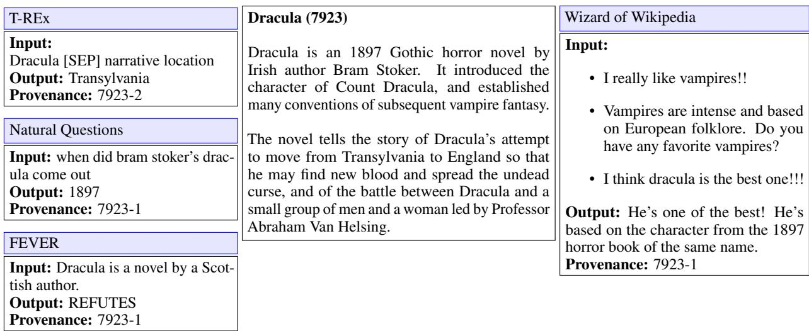
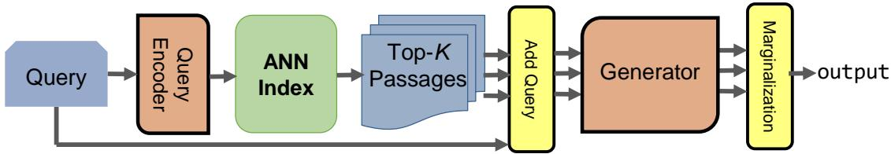
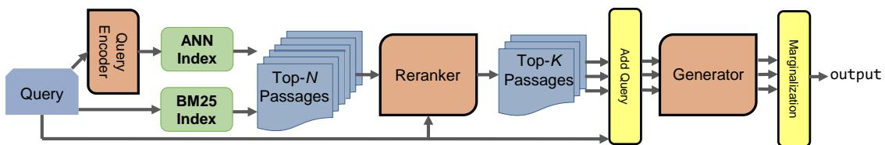
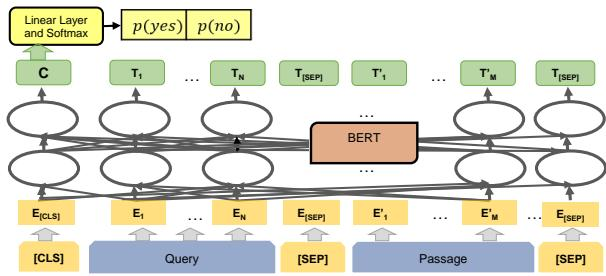
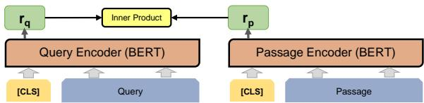

# $\mathbf { R e ^ { 2 } G }$ : Retrieve, Rerank, Generate

Michael Glass1, Gaetano Rossiello1, Md Faisal Mahbub Chowdhury1,

Ankita Rajaram Naik1 2, Pengshan Cai1 2, Alfio Gliozzo1

1 IBM Research AI, Yorktown Heights, NY, USA

2 University of Massachusetts Amherst, MA, USA

## Abstract

As demonstrated by GPT-3 and T5, transformers grow in capability as parameter spaces become larger and larger. However, for tasks that require a large amount of knowledge, nonparametric memory allows models to grow dramatically with a sub-linear increase in computational cost and GPU memory requirements. Recent models such as RAG and REALM have introduced retrieval into conditional generation. These models incorporate neural initial retrieval from a corpus of passages. We build on this line of research, proposing $\mathrm { R e ^ { 2 } G } ,$ which combines both neural initial retrieval and reranking into a BART-based sequenceto-sequence generation. Our reranking approach also permits merging retrieval results from sources with incomparable scores, enabling an ensemble of BM25 and neural initial retrieval. To train our system end-to-end, we introduce a novel variation of knowledge distillation to train the initial retrieval, reranker and generation using only ground truth on the target sequence output. We find large gains in four diverse tasks: zero-shot slot filling, question answering, fact checking and dialog, with relative gains of 9% to 34% over the previous state-of-the-art on the KILT leaderboard. We make our code available as open source1.

## 1 Introduction

GPT-3 [Brown et al., 2020] and T5 [Raffel et al., 2020] are arguably the most powerful members in a family of deep learning NLP models called transformers. Such models store surprising amount of world knowledge. They have been shown to produce good performance on a range of demanding tasks, especially in generating human like texts. However, such large transformers’ capability is tied to the increasingly larger parameter spaces on which they are trained.

Recently, there has been work towards transformers that make use of non-parametric knowledge. REALM (Retrieval Augmented Language Model) [Guu et al., 2020] and RAG (Retrieval Augmented Generation) [Lewis et al., 2020b] both use an indexed corpus of passages to support conditional generation. By using the corpus as a source of knowledge these models can extend the information available to the model by tens or even hundreds of gigabytes with a sub-linear scaling in computation cost.

These recent advancements, in turn, have been inspired by BART (Bidirectional and Auto-Regressive Transformer) [Lewis et al., 2020a] that combines a Bidirectional Encoder (e.g. BERT [Devlin et al., 2019]) with an Autoregressive decoder (e.g. GPT [Brown et al., 2020]) into one sequenceto-sequence model.

We build on this line of research, pioneered by REALM and RAG, and propose a new approach that we call $\mathrm { R e ^ { 2 } G }$ (Retrieve, Rerank, Generate), which combines both neural initial retrieval and reranking into a BART-based sequenceto-sequence generation.

There are two particular aspects on which our approach is different from the previous works. Firstly, our reranking approach permits merging retrieval results from sources with incomparable scores, e.g. enabling an ensemble of BM25 and neural initial retrieval. Secondly, to train our system end-to-end, we introduce a novel variation of knowledge distillation to train the initial retrieval, reranker and generation using only ground truth on the target sequence output.

The KILT benchmark [Petroni et al., 2021] has been recently introduced to evaluate the capabilities of pre-trained language models to address NLP tasks that require access to external knowledge. We evaluate on four diverse tasks from KILT: slot filling, question answering, fact checking and dialog. Figure 1 shows examples of these tasks. $\mathrm { R e ^ { 2 } G }$ makes significant gains on all four tasks, reaching the top of the KILT leaderboards and establishing a new state-of-the-art.

The contributions of this work are as follows:

• We introduce $\mathrm { R e ^ { 2 } G }$ demonstrating the effectiveness of reranking for generative language models that incorporate retrieval.

• We further extend $\mathrm { R e ^ { 2 } G }$ by ensembling initial retrieval methods, combining neural and traditional keyword-based approaches.

$\mathrm { R e ^ { 2 } G }$ improves the current state-of-the-art of 9%, 31%, 34%, 22% and 10% relative gains on the headline KILT metrics for T-REx (slot filling), Natural Questions (question answering), TriviaQA (question answering), FEVER (fact checking), and Wizard of Wikipedia (dialog), respectively.

• We publicly release our code as open source to support continued development.

## 2 Related Work

The KILT benchmark and public leaderboard2 combines eleven datasets across five tasks. The main advantage of the KILT distribution of these datasets is that the provenance information from each dataset is realigned to reference the same snapshot of Wikipedia. A unified evaluation script and set of metrics is also provided. In this work, we focus on four tasks, such as Slot Filling [Levy et al., 2017, Elsahar et al., 2018], Question Answering [Kwiatkowski et al., 2019, Joshi et al., 2017], Fact Checking [Thorne et al., 2018a,c], and Dialog [Dinan et al., 2019] (see Figure 1).

A set of baseline methods have been proposed for KILT. GENRE [Cao et al., 2021] is trained on BLINK [Wu et al., 2020] and all KILT tasks jointly using a sequence-to-sequence language model to generate the title of the Wikipedia page where the answer can be found. This method is a strong baseline to evaluate the retrieval performance, but it does not address the downstream tasks. On the other hand, generative models, such as BART [Lewis et al., 2020a] and T5 [Raffel et al., 2020], show interesting performance when finetuned on the downstream tasks relying only on the implicit knowledge stored in the weights of the neural networks, without the use of any explicit retrieval component.

RAG [Lewis et al., 2020b], an end-to-end retrieval-based generative model, is the best performing baseline in KILT and it incorporates DPR [Karpukhin et al., 2020] to first retrieve relevant passages for the query, then it uses a model initialized from BART [Lewis et al., 2020a] to perform a sequence-to-sequence generation from each evidence passage concatenated with the query in order to generate the answer. Figure 2 shows the architecture of RAG.

Multi-task DPR [Maillard et al., 2021] exploits multi-task learning by training both DPR passage and query encoder on all KILT tasks. DensePhrases [Lee et al., 2021] addresses the knowledge intensive tasks with a short answer, such as slot filling. It indexes the phrases in the corpus that can be potential answers. The extracted phrases are represented by their start and end token vectors from the final layer of a transformer initialized from SpanBERT [Joshi et al., 2020].

Knowledge Graph Induction (KGI) [Glass et al., 2021] combines DPR and RAG models, both trained with task and dataset specific training. KGI employs a two phase training procedure: first training the DPR model, i.e. both the query and context encoder, using the KILT provenance ground truth. Then, KGI trains the sequence-to-sequence generation and further trains the query encoder using only the target output as the objective. This results in large improvements in retrieval performance and, as a consequence, in the downstream tasks.

KILT-WEB 2 [Piktus et al., 2021] addresses the KILT tasks by broadening the knowledge source used. Rather than rely only on KILT’s Wikipedia snapshot, KILT-WEB 2 creates SPHERE as a knowledge source. SPHERE is built from CCNet [Wenzek et al., 2020] and over twenty times the size of the Wikipedia corpus. It can use either BM25 or DPR retrieval (though not both combined) followed by a ‘reader’ component, but not trained end-to-end. The reader component is the Fusion-in-Decoder [Izacard and Grave, 2021] model, where retrieved documents are encoded independently, then their encoded representations are concatenated for the decoder.

SEAL [Bevilacqua et al., 2022] introduces a novel generative approach to retrieval. Rather than generating the unique document identifier like GENRE, SEAL can generate any ngrams present in the corpus, which are then mapped to passages. The neural retrieval generator is based on BART and constrained to generate ngrams that appear in the corpus with an FM-Index [Ferragina and Manzini, 2000]. Like KILT-WEB 2, SEAL uses Fusion-in-Decoder as the component responsible for generating the output conditioned on the retrieved passages.

  
Figure 1: KILT tasks of slot filling, question answering, fact checking and dialog

Figure 2: RAG Architecture  
  
Figure 3: Re2G Architecture

Multi-stage or cascade approaches to retrieval have received ample attention in Information Retrieval (IR) research. The multi-stage approach begins with the initial retrieval phase, where an initial set of documents or passages form the pool of candidates to be considered for ranking. Then one or more phases of increasingly computationally demanding rerankers are applied. Early approaches in learning to rank [Liu, 2009] used features and linear classifiers. Pre-trained language models, especially BERT [Devlin et al., 2019], have shown state-ofthe-art performance when applied to the task of relevance ranking. Transformers may be applied as classifiers to each query and passage pair independently [Nogueira and Cho, 2019] or as generators to produce labels for passages in a sequence-tosequence model [Nogueira et al., 2020].

## 3 Methodology

The approach of RAG, Multi-DPR, and KGI is to train a neural IR (Information Retrieval) component and further train it end-to-end through its impact in generating the correct output. Figure 2 illustrates the end-to-end RAG system.

It has been previously established that results from initial retrieval can be greatly improved through the use of a reranker [Liu, 2009, Wang et al., 2011]. Therefore we hypothesized that natural language generation systems incorporating retrieval can benefit from reranking.

  
Figure 4: Interaction Model Reranker

  
Figure 5: Representation Model for Initial Retrieval

In addition to improving the ranking of passages returned from DPR, a reranker can be used after merging the results of multiple retrieval methods with incomparable scores. For example, the scores returned by BM25 [Robertson and Zaragoza, 2009] are not comparable to the inner products from DPR. Using the scores from a reranker, we can find the top-k documents from the union of DPR and BM25 results. Figure 3 illustrates our extension of RAG with a reranker. We call our system $\mathrm { R e ^ { 2 } G }$ (Retrieve, Rerank, Generate).

## 3.1 Reranker

The reranker we use is based on the sequence-pair classification of Nogueira and Cho [2019]. This model is shown in Figure 4. The query and passage are input together to a BERT [Devlin et al., 2019] transformer. Cross attention is applied over the tokens of both sequences jointly. This is called an interaction model.

This model contrasts with the representation model used for initial retrieval. Figure 5 shows the bi-encoder representation model for DPR. The representation vectors for the query and passage are produced independently. This allows for efficient retrieval by pre-computing vectors for all passages in the corpus and indexing them with an ANN (Approximate Nearest Neighbors) index. By using an interaction model to rerank the top-N passages from the representation model, we can get the advantages of both model types: accuracy and scalability.

We initialize the reranker from the BERT model trained on MS MARCO [Nguyen et al., 2016] by NBoost [Thienes and Pertschuk, 2019] and available through Hugging Face3.

## 3.2 Training

As Figure 1 illustrates, KILT tasks are provided with two types of ground truth: the target output sequence and the provenance information indicating the passage or passages in the corpus that support the output.

Our training is carried out in four phases: DPR training, generation training, reranking training, and full end-to-end training. The initial DPR and reranking phases make use of the provenance ground truth. The generation and full end-to-end training make use of only the target output.

Formally:

• The original KILT instances are a tuple: q, t, Prov where $q$ is the input or prompt, t is the target output, and Prov is the set of provenance passages that support the target output.

• DPR training is a tuple: $\langle q , p ^ { + } , p ^ { - } \rangle$ where $p ^ { + } \in$ Prov and $p ^ { - }$ where $p ^ { - } \in \mathbf { B } \mathbf { M } 2 5 ( q ) \wedge$ $p ^ { - } \notin$ Prov

• Reranking training begins with the application of DPR and BM25, producing tuples: q, P, Prov where $\mathbf { P } = \mathbf { B M } 2 5 ( q ) \cup \mathbf { D P R } ( q )$

• Generation and end-to-end training instances are pairs of query and target: q, t

The first two phases, DPR and generation, are identical to KGI, specifically KGI0. We use the codes from Glass et al. [2021]4.

DPR Stage 1 training is the same training used by Karpukhin et al. [2020]. The triplets of query, positive passage and “hard negative” passages from BM25 are put into batches of 128 instances. The positives and hard negatives from other instances form the “batch negatives” for each instance. The DPR bi-encoder model gives each query a probability distribution over the positive, hard negative, and batch negatives. The loss is the negative loglikelihood for the positive. After DPR Stage 1 training the passages from the corpus are indexed with a Hierarchical Navigable Small World (HNSW) [Malkov and Yashunin, 2018] using FAISS [Johnson et al., 2017].

Generation training extends the training of the query encoder and trains the BARTLARGE sequence-to-sequence model on the target sequence output. This training is the same as that described by Lewis et al. [2020b].

## 3.3 Reranking Training

The next phase, training the reranking in isolation, begins with gathering the initial retrieval results from DPR and BM25 on the training set. These results are merged and used as training data for the reranker.

In some datasets there are multiple positive passages. Therefore, we use the negative of the summed log-likelihood for the positive passages as the loss function. The logits given by the reranker are $\mathbf { z _ { r } }$ and the indices for the correct passages (from the ground truth provenance) are Prov.

$$
\mathit { l o s s } = - \sum _ { i \in \mathbf { P r o v } } \mathit { l o g } ( s o f t m a x ( \mathbf { z _ { r } } ) _ { i } )
$$

## 3.4 End-to-End Training

Training end-to-end poses a special challenge. In RAG, the gradient propagates to the query encoder because the inner product between the query vector and the passage vector is used to weight the influence of each sequence, a process RAG calls marginalization. The inputs to the BART model are sequences $( s _ { j } = p _ { j }$ [SEP] q) that comprise a query q plus retrieved passage $p _ { j }$ . The probability for each sequence is determined from the softmax over the retrieval (or reranker) scores for the passage. The probability for each target token $t _ { i }$ given the sequence $s _ { j }$ is a softmax over BART’s token prediction logits. The loss therefore is a negative log-likelihood summed over all target tokens and sequences, weighted by each sequence’s probability.

Consider that in $\mathrm { R e ^ { 2 } G }$ the score from the reranker, not the initial retrieval, is used to weight the impact of each sequence in generation. This allows the reranker to be trained through the ground truth on target output, but it means the gradient for the query encoder will be zero since the marginalization no longer depends on the inner product from the query and passage representation vectors.

$$
\begin{array} { c } { { P ( s _ { j } ) = s o f t m a x ( { \bf z _ { r } } ) _ { j } } } \\ { { P ( t _ { i } | s _ { j } ) = s o f t m a x ( { \bf B A R T } ( s _ { j } ) _ { i } ) _ { t _ { i } } } } \\ { { l o s s = - \displaystyle \sum _ { i , j } l o g \left( P ( t _ { i } | s _ { j } ) \cdot P ( s _ { j } ) \right) } } \end{array}
$$

We consider three possible resolutions to this issue.

• Combine the DPR and reranker scores

• Freeze the query encoder

• Online Knowledge Distillation

The first candidate solution is tempting but fatally flawed. By adding the log softmax from DPR and the reranker we can ensure that both systems are trained through impact in generation. However, if the DPR score is added to the reranker score, then the DPR score is being trained to provide a complementary signal to the reranker. Therefore, when DPR is used to gather the candidate passages, it does not give the highest scores to the passages that are most likely to be relevant, but instead gives the highest scores to the passages the reranker is most likely to underrate. We find that this theoretical concern is also a practical concern, as DPR performance (and overall system performance) declines greatly when trained in this way.

The simplest solution is to freeze the parameters of the query encoder, training only the reranker and generation components. We find this is indeed the best solution for one of our datasets, Wizard of Wikipedia. Note that DPR has already been trained in two phases, first from the provenance ground truth and then again in generation training in the RAG model.

The third solution is our novel application of knowledge distillation [Hinton et al., 2015]. We use the reranker as a teacher model to provide labels to the DPR student model. We distill the knowledge across architectures: from an interaction model to a representation model. Further, this knowledge distillation occurs online, while the reranker is being trained. The loss for the initial retrieval is therefore the KL-divergence between the probability distribution it gives over the retrieved passages and the reranker’s probability distribution over the same passages. A temperature hyperparameter T smooths these distributions to prevent excessive loss and stabilize training.

<table><tr><td></td><td colspan="4">T-REx</td><td colspan="2">(Slot Filling)</td></tr><tr><td></td><td>R-Prec</td><td>Recall@5</td><td>Accuracy</td><td>F1</td><td>KILT-AC</td><td>KILT-F1</td></tr><tr><td>Re2G (ours)</td><td>80.70</td><td>89.00</td><td>87.68</td><td>89.93</td><td>75.84</td><td>77.05</td></tr><tr><td>KGI1 [Glass et al., 2021]</td><td>74.36</td><td>83.14</td><td>84.36</td><td>87.24</td><td>69.14</td><td>70.58</td></tr><tr><td>KILT-WEB 2 [Piktus et al., 2021]</td><td>75.64</td><td>87.57</td><td>81.34</td><td>84.46</td><td>64.64</td><td>66.64</td></tr><tr><td>SEAL [Bevilacqua et al., 2022]</td><td>67.80</td><td>81.52</td><td>83.72</td><td>86.53</td><td>60.08</td><td>61.72</td></tr><tr><td>KGI0 [Glass et al., 2021]</td><td>59.70</td><td>70.38</td><td>77.90</td><td>81.31</td><td>55.54</td><td>56.79</td></tr><tr><td></td><td colspan="4"></td><td colspan="2">(Question Answering)</td></tr><tr><td></td><td>R-Prec</td><td>Natural Questions Recall@5</td><td>Accuracy</td><td>F1</td><td>KILT-AC</td><td>KILT-F1</td></tr><tr><td>Re2G (ours)</td><td>70.78</td><td>76.63</td><td>51.73</td><td>60.97</td><td>43.56</td><td>49.80</td></tr><tr><td>SEAL [Bevilacqua et al., 2022]</td><td>63.16</td><td>68.19</td><td>53.74</td><td>62.24</td><td>38.78</td><td>44.40</td></tr><tr><td>KGI0 [Glass et al., 2021]</td><td>63.71</td><td>70.17</td><td>45.22</td><td>53.38</td><td>36.36</td><td>41.83</td></tr><tr><td>KILT-WEB 2 [Piktus et al., 2021]</td><td>59.83</td><td>71.17</td><td>51.59</td><td>60.83</td><td>35.32</td><td>40.73</td></tr><tr><td>RAG [Petroni et al., 2021]</td><td>59.49</td><td>67.06</td><td>44.39</td><td>52.35</td><td>32.69</td><td>37.91</td></tr><tr><td></td><td></td><td></td><td></td><td></td><td></td><td></td></tr><tr><td></td><td colspan="4">TriviaQA</td><td colspan="2">(Question Answering)</td></tr><tr><td></td><td>R-Prec</td><td>Recall@5</td><td>Accuracy</td><td>F1</td><td>KILT-AC</td><td>KILT-F1</td></tr><tr><td>Re2G (ours)</td><td>72.68</td><td>74.23</td><td>76.27</td><td>81.40</td><td>57.91</td><td>61.78</td></tr><tr><td>SEAL [Bevilacqua et al., 2022]</td><td>68.36</td><td>76.36</td><td>70.86</td><td>77.29</td><td>50.56</td><td>54.99</td></tr><tr><td>KILT-WEB 2 [Piktus et al., 2021]</td><td>58.85</td><td>71.55</td><td>72.73</td><td>79.54</td><td>45.55</td><td>49.57</td></tr><tr><td>KGI0 [Glass et al., 2021]</td><td>60.49</td><td>63.54</td><td>60.99</td><td>66.55</td><td>42.85</td><td>46.08</td></tr><tr><td>MultiDPR [Maillard et al., 2021]</td><td>61.49</td><td>68.33</td><td>59.60</td><td>66.53</td><td>42.36</td><td>46.19</td></tr><tr><td></td><td colspan="4">FEVER</td><td colspan="2">(Fact Checking)</td></tr><tr><td></td><td>R-Prec</td><td>Recall@5</td><td>Accuracy</td><td>KILT-AC</td><td></td><td></td></tr><tr><td>Re2G (ours)</td><td>88.92</td><td>92.52</td><td>89.55</td><td></td><td>78.53</td><td></td></tr><tr><td>SEAL [Bevilacqua et al., 2022]</td><td>81.45</td><td>89.56</td><td>89.54</td><td></td><td>71.28</td><td></td></tr><tr><td>KILT-WEB 2 [Piktus et al., 2021]</td><td>74.77</td><td>87.89</td><td>88.99</td><td></td><td>65.68</td><td></td></tr><tr><td>KGI0 [Glass et al., 2021]</td><td>75.60</td><td>84.95</td><td>85.58</td><td></td><td>64.41</td><td></td></tr><tr><td>MultiDPR [Maillard et al., 2021]</td><td>74.48</td><td>87.52</td><td>86.32</td><td></td><td>63.94</td><td></td></tr><tr><td></td><td></td><td colspan="4">Wizard of Wikipedia</td><td>(Dialog)</td></tr><tr><td></td><td>R-Prec</td><td>Recall@5</td><td>Rouge-L</td><td>F1</td><td>KILT-RL</td><td>KILT-F1</td></tr><tr><td>Hindsight [Paranjape et al., 2021]</td><td>56.08</td><td>74.27</td><td>17.06</td><td>19.19</td><td>11.92</td><td>13.39</td></tr><tr><td>Re²G (ours)</td><td>60.10</td><td>79.98</td><td>16.76</td><td>18.90</td><td>11.39</td><td>12.98</td></tr><tr><td>SEAL [Bevilacqua et al., 2022]</td><td>57.55</td><td>78.96</td><td>16.65</td><td>18.34</td><td>10.45</td><td>11.63</td></tr><tr><td>KGI0 [Glass et al., 2021]</td><td>55.37</td><td>78.45</td><td>16.36</td><td>18.57</td><td>10.36</td><td>11.79</td></tr><tr><td>RAG [Petroni et al., 2021]</td><td>57.75</td><td>74.61</td><td>11.57</td><td>13.11</td><td>7.59</td><td>8.75</td></tr><tr><td>KILT-WEB 2 [Piktus et al., 2021]</td><td>41.54</td><td>68.25</td><td>13.94</td><td>15.66</td><td>6.55</td><td>7.57</td></tr></table>

Table 1: KILT leaderboard top systems

$$
l o s s = D _ { K L } ( s o f t m a x ( { \frac { \mathbf { z _ { s } } } { T } } )  s o f t m a x ( { \frac { \mathbf { z _ { t } } } { T } } ) ) \cdot T ^ { 2 }
$$

The knowledge distillation has the usual advantage of providing signal not only of positive and negative instances, but degrees of negativeness. In addition, since we retrieve n = 12 passages from DPR but only use the top-k (k = 5) for generation, the knowledge distillation loss is providing a (soft) label for more passages.

## 3.5 Inference

At inference time the query is encoded using the DPR query encoder and the top-12 passages from the HNSW index are returned. The query is also passed to BM25 search, specifically Anserini5, gathering the top-12 BM25 results. Both sets of passages are passed to the reranker and scored. The top-5 passages are then joined with the query and passed to BARTLARGE to generate the output. The five output sequences are weighted according to the softmax over the reranker scores to produce the

final output.

## 4 Experiments

We test our model on five datasets, over four distinct tasks in the KILT benchmark: slot filling, question answering, fact checking and dialog. Figure 1 shows an example of these four tasks.

The slot filling dataset, T-REx [Elsahar et al., 2018], provides as input a head entity and relation, and expects as output the entity or term that fills the slot, also called the tail entity. The T-REx dataset contains 2.3M instances. We use only 370k training instances by downsampling the relations that occur more than 5000 times. This reduces the training time required while keeping state-of-the-art performance. The development and test sets each have 5k instances.

The question answering datasets are “open” versions of Natural Questions [Kwiatkowski et al., 2019] and TriviaQA [Joshi et al., 2017]. Unlike the original versions, the relevant Wikipedia page must be found by a retrieval step. The training sets for Natural Questions and TriviaQA contain 87k and 62k questions, with another 3k and 5k for the development and 1.4k and 6.5k for test.

The fact checking dataset in KILT is FEVER (Fact Extraction and VERification). It is a combination of the two FEVER versions [Thorne et al., 2018b, 2019] omitting the NOTENOUGH-INFO class. There are approximately 10k instances in the development and test sets, and 100k for training. FEVER is a classification task, but we cast it as a generation task by training the model to generate either the token “SUPPORTS” or “REFUTES”.

Wizard of Wikipedia [Dinan et al., 2018] is the dialog dataset. The input is a short dialog history ending with the information seeker’s turn. The expected output is a fact presented conversationally or just an utterance or question mentioning content from a relevant Wikipedia page. It is the smallest dataset with approximately 3k instances in development and test and 64k in train.

For all tasks, systems are expected to produce the target output as well as justify it with provenance information from the KILT knowledge source. The metrics of R-Precision and Recall@5 measure the correctness of the provenance. R-Precision measures what fraction of the R documents in the ground truth provenance $( | \mathbf { P r o v } | = R )$ are present in the top-R documents returned by the system. Accuracy and (token-level) F1 measure the correctness of the generated output. For Wizard of Wikipedia, Rouge-L [Lin, 2004] is used instead of accuracy, since systems are very unlikely to generate the exact target output. The metrics of KILT-Accuracy, KILT-F1 and, for Wizard of Wikipedia, KILT-Rouge-L are the underlying metric (e.g. Accuracy) for instances where R-Precision is one, otherwise zero. These metrics indicate output correctness when provenance is also correctly supplied.

Table 1 shows the performance of $\mathrm { R e ^ { 2 } G }$ on the KILT leaderboard. We achieved 9%, 31%, 34%, 22% and 10% relative gains over the previous stateof-the-art on the headline KILT metrics for T-REx, Natural Questions, TriviaQA, FEVER, and Wizard of Wikipedia, respectively. Furthermore, $\mathrm { R e ^ { 2 } G }$ has held the lead in the headline KILT metrics in all datasets except for Wizard of Wikipedia where it is now second best.

Since our submission to the KILT leaderboard for the Wizard of Wikipedia, a new system called Hindsight [Paranjape et al., 2021] achieved even better results on the generation metrics on that particular task. The new system of SEAL has also achieved top results for some metrics on the Natural Questions and TriviaQA benchmarks.

## 4.1 Retrieval

Table 2 examines how the retrieval improves through each step of training. In the first half of the table we consider the initial retrieval alone. DPR Stage 1 is the DPR training described earlier - training only from the provenance ground truth with batch negatives and hard negatives from BM25. $\mathrm { K G I _ { 0 } }$ further trains the query encoder of DPR Stage 1 through its impact in generating the target output. Finally $\mathrm { R e ^ { 2 } G }$ extends the training of DPR with online knowledge distillation from the reranker. This step is beneficial in two of the three datasets, while the previous steps improve performance across all datasets.

In the second half of the table we examine the improvement in reranking. The baseline of $\mathrm { K G I _ { 0 } }$ DPR+BM25 merges the results of $\mathrm { K G I _ { 0 } } ^ { \mathrm { { \cdot } } }$ ’s DPR and BM25 by scoring each passage by the sum of the inverse rank from each method. For both T-REx and FEVER, even this simple approach to ensembling DPR and BM25 improves Recall@5, although not R-Precision. Following reranker training using the provenance ground truth (Reranker Stage 1), we find improvement over DPR across all five datasets on both retrieval metrics. The reranker’s improvement following end-to-end training is mixed. In FEVER and Wizard of Wikipedia there is substantial gain in R-Precision, approximately 2%. T-REx and Natural Questions are flat. However, there is a sharp decline in the performance of TriviaQA, in retrieval metrics. This is true despite the fact that retrieving these passages greatly improves answer accuracy and F1. This suggests some incompleteness in the provenance ground truth for TriviaQA.

<table><tr><td></td><td colspan="2">T-REX</td><td colspan="2">NQ</td><td colspan="2">TriviaQA</td><td colspan="2">FEVER</td><td colspan="2">WoW</td></tr><tr><td></td><td>R-Prec</td><td>R@5</td><td>R-Prec</td><td>R@5</td><td>R-Prec</td><td>R@5</td><td>R-Prec</td><td>R@5</td><td>R-Prec</td><td>R@5</td></tr><tr><td>BM25</td><td>46.88</td><td>69.59</td><td>24.99</td><td>42.57</td><td>26.48</td><td>45.57</td><td>42.73</td><td>70.48</td><td>27.44</td><td>45.74</td></tr><tr><td>DPR Stage 1</td><td>49.02</td><td>63.34</td><td>56.64</td><td>64.38</td><td>60.12</td><td>64.04</td><td>75.49</td><td>84.66</td><td>34.74</td><td>60.22</td></tr><tr><td>KGI0 DPR</td><td>65.02</td><td>75.52</td><td>64.65</td><td>69.60</td><td>60.55</td><td>63.65</td><td>80.34</td><td>86.53</td><td>48.04</td><td>71.02</td></tr><tr><td> $\mathsf { R e } ^ { 2 } \mathsf { G }$  DPR</td><td>67.16</td><td>76.42</td><td>65.88</td><td>70.90</td><td>62.33</td><td>65.72</td><td>84.13</td><td>87.90</td><td>47.09</td><td>69.88</td></tr><tr><td>KGI0 DPR+BM25</td><td>60.48</td><td>80.06</td><td>36.91</td><td>66.94</td><td>40.81</td><td>64.79</td><td>65.95</td><td>90.34</td><td>35.63</td><td>68.47</td></tr><tr><td>Reranker Stage 1</td><td>81.22</td><td>87.00</td><td>70.78</td><td>73.05</td><td>71.80</td><td>71.98</td><td>87.71</td><td>92.43</td><td>55.50</td><td>74.98</td></tr><tr><td> $\mathrm { R e ^ { 2 } G }$  Reranker</td><td>81.24</td><td>88.58</td><td>70.92</td><td>74.79</td><td>60.37</td><td>70.61</td><td>90.06</td><td>92.91</td><td>57.89</td><td>74.62</td></tr></table>

Table 2: Development Set Results for Retrieval

## 4.2 Ablations

Table 3 explores ablations of the $\mathrm { R e ^ { 2 } G }$ system. The point estimates and 95% confidence intervals are reported. $\mathrm { R e ^ { 2 } G – K D }$ excludes the online knowledge distillation, instead freezing the query encoder when training the reranker and generator during end-to-end training. $\mathrm { R e ^ { 2 } G – B M } 2 5$ excludes BM25 results, fetching 24 passages from DPR rather than 12 from DPR and 12 from BM25. The passages are still reranked. $\mathrm { K G I _ { 0 } }$ is the baseline system, without a reranker and therefore also without BM25 results or online knowledge distillation during training.

Both online knowledge distillation and ensembling with BM25 improve performance in four out of five datasets. Online knowledge distillation failed to improve for Wizard of Wikipedia and ensembling with BM25 failed to improve for Natural Questions.

## 5 Analysis

Since the $\mathrm { R e ^ { 2 } G }$ model differs from the KGI model only in the retrieval phase, we hypothesized that its gains in output quality are driven by its better retrieval quality. To test this hypothesis we considered all cases where the $\mathrm { R e ^ { 2 } G }$ model produces better output than the $\operatorname { K G I } _ { 0 }$ model and calculated the fraction of such cases where $\mathrm { R e ^ { 2 } G } ^ { \prime }$ s rank for the first correct passage is lower than $\mathrm { K G I _ { 0 } } ^ { \prime } \mathrm { s }$

We find that for T-REx, NQ, and FEVER the fractions of output gains that could be attributed to improved retrieval and ranking are 67.73%, 61.08% and 66.86% respectively. While for TriviaQA and Wizard of Wikipedia only 36.86% and 27.74% of output improvements were accompanied by improved ranking for the correct passage. It is important to note that in Wizard of Wikipedia, many of these improved outputs have only a small gain in token-level F1.

While much of the gain in output quality is attributable to improved recall, at least a third is not. This reinforces an observation of Glass et al. [2021], that models trained with better retrieval can produce better output even when the retrieved passages are equivalent at test time.

## 5.1 Slot filling error analysis

To understand the types of errors $\mathrm { R e ^ { 2 } G }$ makes we sampled 50 instances of the development set of the T-REx dataset where the Accuracy and token-level F1 score was zero.

Interestingly, the most common class of error (33/50) was due to the incompleteness of the ground truth. Often the head entity is ambiguous (19/50), or the relation has multiple fillers (16/50). As an example, consider the following where there are two Joe O’Donnell notable for sports in the passages retrieved, and each played for at least two different teams.

Joe O’Donnell [SEP] member of sports team Target: Buffalo Bills   
$\mathbf { R e } ^ { 2 } \mathbf { G } \mathbf { : }$ Dumbarton F.C.

Joe O’Donnell (footballer) / Joe O’Donnell (footballer) Joseph ’Joe’ O’Donnell (born 3 March 1961) was a Scottish footballer who played for Dumbarton and Stranraer.

Joe O’Donnell (American football) ${ } | / \ldots { }$ fullback, guard and tackle for the University of Michigan from 1960 to 1963. He also played professional football as a guard and tackle for eight seasons for the Buffalo Bills...

When $\mathrm { R e ^ { 2 } G }$ produces genuine errors it is usually because it has selected some entity as a filler related in a different way (6/17) or it has failed to retrieve the necessary passage (9/17).

<table><tr><td></td><td colspan="5">T-REx</td><td>(Slot Filling)</td></tr><tr><td></td><td>R-Prec</td><td>Recall@5</td><td>Accuracy</td><td>F1</td><td>KILT-AC</td><td>KILT-F1</td></tr><tr><td> $\overline { { \mathrm { R e } ^ { 2 } \mathrm { G } } }$ </td><td> $\overline { { 8 1 . 2 4 \pm 1 . 0 8 } }$ </td><td> $\overline { { 8 8 . 5 8 { \pm } 0 . 8 4 } }$ </td><td> $\overline { { 8 6 . 6 0 { \pm } 0 . 9 4 } }$ </td><td> $\overline { { 8 9 . 2 0 { \pm } 0 . 8 1 } }$ </td><td> $7 5 . 6 6 { \pm } 1 . 1 9$ </td><td> $\overline { { 7 7 . 0 8 \pm 1 . 1 5 } }$ </td></tr><tr><td> $\mathrm { R e ^ { 2 } G – K D }$ </td><td> $8 1 . 0 8 { \pm } 1 . 0 9$ </td><td> $8 8 . 8 4 { \pm } 0 . 8 3 $ </td><td> $8 7 . 0 0 { \pm } 0 . 9 3 $ </td><td> $8 9 . 4 6 { \pm } 0 . 8 0 $ </td><td> $7 5 . 7 2 { \pm } 1 . 1 9$ </td><td> $7 7 . 0 0 { \pm } 1 . 1 5 $ </td></tr><tr><td> $\mathrm { R e ^ { 2 } G { \cdot } B M } 2 5$ </td><td> $7 1 . 9 2 { \pm } 1 . 2 5 $ </td><td> $7 8 . 6 7 { \pm } 1 . 1 0 $ </td><td> $7 9 . 4 8 { \pm } 1 . 1 2$ </td><td> $8 2 . 5 2 { \pm } 1 . 0 0 $ </td><td> $6 6 . 5 8 { \pm } 1 . 3 1 $ </td><td> $6 7 . 9 3 { \pm } 1 . 2 8 $ </td></tr><tr><td> $\mathrm { K G I _ { 0 } }$ </td><td> $6 5 . 0 2 { \pm } 1 . 3 2 $ </td><td> $7 5 . 5 2 { \pm } 1 . 1 6$ </td><td> $7 7 . 5 2 { \pm } 1 . 1 6$ </td><td> $8 0 . 9 1 { \pm } 1 . 0 3 $ </td><td> $6 0 . 1 8 { \pm } 1 . 3 6 $ </td><td> $6 1 . 3 8 { \pm } 1 . 3 4$ </td></tr></table>

<table><tr><td rowspan="2"></td><td colspan="5">Natural Questions</td><td colspan="2">(Question Answering)</td></tr><tr><td>R-Prec</td><td>Recall@5</td><td>Accuracy</td><td>F1</td><td>KILT-AC</td><td></td><td>KILT-F1</td></tr><tr><td> $\overline { { \mathrm { R e } ^ { 2 } \mathrm { G } } }$ </td><td> $\overline { { 7 0 . 9 2 { \pm } 1 . 6 7 } }$ </td><td> $\overline { { 7 4 . 7 9 \pm 1 . 2 7 } }$ </td><td> $4 6 . 7 0 { \scriptstyle \pm 1 . 8 4 }$ </td><td> $6 2 . 4 4 { \pm } 1 . 6 5$ </td><td></td><td> $3 9 . 2 3 { \pm } 1 . 8 0 $ </td><td> $5 0 . 9 0 { \pm } 1 . 7 6 $ </td></tr><tr><td> $\mathrm { R e ^ { 2 } G – K D }$ </td><td> $6 9 . 7 2 { \pm } 1 . 6 9$ </td><td> $7 3 . 7 3 { \pm } 1 . 3 0 $ </td><td> $4 6 . 5 6 { \pm } 1 . 8 4 $ </td><td> $6 1 . 6 8 { \pm } 1 . 6 7$ </td><td></td><td> $3 8 . 2 4 \pm 1 . 7 9$ </td><td> $4 9 . 9 3 { \pm } 1 . 7 6$ </td></tr><tr><td> $\mathrm { R e ^ { 2 } G \mathrm { - } B M } 2 5$ </td><td> $7 0 . 8 8 { \pm } 1 . 6 7$ </td><td> $7 4 . 3 9 { \pm } 1 . 2 8 $ </td><td> $4 6 . 7 0 { \scriptstyle \pm 1 . 8 4 }$ </td><td> $6 1 . 9 8 { \pm } 1 . 6 6 $ </td><td> $3 9 . 4 1 { \pm } 1 . 8 0 $ </td><td></td><td> $5 0 . 9 1 { \pm } 1 . 7 6 $ </td></tr><tr><td> $\mathrm { K G I _ { 0 } }$ </td><td> $6 4 . 6 5 { \pm } 1 . 7 6 $ </td><td> $6 9 . 6 0 { \pm } 1 . 3 9$ </td><td> $4 0 . 5 0 { \pm } 1 . 8 1 $ </td><td> $5 5 . 0 7 { \pm } 1 . 7 1 $ </td><td> $3 2 . 9 6 { \pm } 1 . 7 3$ </td><td></td><td> $4 2 . 8 7 { \pm } 1 . 7 5 $ </td></tr></table>

<table><tr><td rowspan="2"></td><td colspan="5">TriviaQA</td><td colspan="2">(Question Answering)</td></tr><tr><td>R-Prec</td><td>Recall@5</td><td>Accuracy</td><td>F1</td><td>KILT-AC</td><td></td><td>KILT-F1</td></tr><tr><td> $\overline { { \mathrm { R e } ^ { 2 } \mathrm { G } } }$ </td><td> $\overline { { 7 2 . 0 1 \pm 1 . 2 0 } }$ </td><td> $\overline { { 7 3 . 1 6 { \pm } 0 . 9 8 } }$ </td><td> $\overline { { 7 4 . 0 1 \pm 1 . 1 7 } }$ </td><td> $\overline { { 8 0 . 8 6 { \pm } 0 . 9 9 } }$ </td><td></td><td> $\overline { { 5 6 . 0 4 \pm 1 . 3 3 } }$ </td><td> $\overline { { 6 0 . 9 1 \pm 1 . 2 7 } }$ </td></tr><tr><td> $\mathrm { R e ^ { 2 } G – K D }$ </td><td> $7 2 . 0 1 { \pm } 1 . 2 0 $ </td><td> $7 3 . 1 6 { \pm } 0 . 9 8 $ </td><td> $7 3 . 8 0 { \pm } 1 . 1 8$ </td><td> $8 0 . 6 2 { \pm } 1 . 0 0 $ </td><td> $5 6 . 0 4 { \pm } 1 . 3 3 $ </td><td></td><td> $6 0 . 8 4 \pm 1 . 2 8$ </td></tr><tr><td> $\mathrm { R e ^ { 2 } G \mathrm { - } B M } 2 5$ </td><td> $7 1 . 1 0 { \pm } 1 . 2 1 $ </td><td> $6 8 . 6 0 { \pm } 1 . 0 3 $ </td><td> $6 8 . 5 9 { \pm } 1 . 2 4 $ </td><td> $7 6 . 6 8 { \pm } 1 . 0 8 $ </td><td></td><td> $5 2 . 8 5 { \pm } 1 . 3 4 $ </td><td> $5 8 . 3 7 { \pm } 1 . 2 9 $ </td></tr><tr><td> $\mathrm { K G I _ { 0 } }$ </td><td> $6 1 . 1 3 { \pm } 1 . 3 1$ </td><td> $6 3 . 1 2 { \pm } 1 . 0 8$ </td><td> $6 0 . 6 8 { \pm } 1 . 3 1 $ </td><td> $6 6 . 6 1 { \pm } 1 . 2 0 $ </td><td> $4 4 . 0 0 { \pm } 1 . 3 3 $ </td><td></td><td> $4 7 . 3 5 { \pm } 1 . 3 1 $ </td></tr></table>

<table><tr><td></td><td colspan="3">FEVER</td><td>(Fact Checking)</td></tr><tr><td></td><td>R-Prec</td><td>Recall@5</td><td>Accuracy</td><td>KILT-AC</td></tr><tr><td> $\overline { { \mathrm { R e } ^ { 2 } \mathrm { G } } }$ </td><td> $\overline { { 9 0 . 0 6 { \pm } 0 . 5 3 } }$ </td><td> $\overline { { 9 2 . 9 1 \pm 0 . 4 7 } }$ </td><td> $\overline { { 9 1 . 0 5 { \pm 0 . 5 5 } } }$ </td><td> $8 0 . 5 6 { \pm } 0 . 7 6 $ </td></tr><tr><td> $\mathrm { R e ^ { 2 } G – K D }$ </td><td> $8 9 . 8 5 { \pm } 0 . 5 4 $ </td><td> $9 2 . 4 8 { \pm } 0 . 4 8$ </td><td> $9 0 . 7 8 { \pm } 0 . 5 5 $ </td><td> $8 0 . 1 4 { \pm } 0 . 7 7$ </td></tr><tr><td> $\mathrm { R e ^ { 2 } G \mathrm { - } B M } 2 5$ </td><td> $8 8 . 3 6 { \pm } 0 . 5 7 $ </td><td> $8 8 . 4 6 { \pm } 0 . 5 9 $ </td><td> $9 0 . 6 3 { \pm } 0 . 5 6 $ </td><td> $7 8 . 7 4 \pm 0 . 7 8$ </td></tr><tr><td> $\mathrm { K G I _ { 0 } }$ </td><td> $8 0 . 3 4 { \pm } 0 . 7 3 $ </td><td> $8 6 . 5 3 { \pm } 0 . 6 3$ </td><td> $8 7 . 8 4 { \pm } 0 . 6 3 $ </td><td> $7 0 . 0 6 { \pm } 0 . 8 8$ </td></tr></table>

<table><tr><td></td><td colspan="5">Wizard of Wikipedia (Dialog)</td></tr><tr><td></td><td>R-Prec</td><td>Recall@5</td><td>Rouge-L</td><td>F1 KILT-RL</td><td>KILT-F1</td></tr><tr><td> $\overline { { \mathrm { R e } ^ { 2 } \mathrm { G } } }$ </td><td> $\overline { { 5 6 . 4 8 { \pm } 1 . 7 6 } }$ </td><td> $\overline { { 7 4 . 0 0 { \pm } 1 . 5 6 } }$ </td><td> $\overline { { 1 7 . 2 9 { \pm } 0 . 5 2 } }$   $1 9 . 3 5 { \pm } 0 . 5 7 $ </td><td> $\overline { { 1 1 . 3 7 { \pm } 0 . 5 8 } }$ </td><td> $\overline { { 1 2 . 7 5 { \pm } 0 . 6 3 } }$ </td></tr><tr><td> $\mathrm { R e ^ { 2 } G – K D }$ </td><td> $5 7 . 8 9 { \pm } 1 . 7 5 $ </td><td> $7 4 . 6 2 { \pm } 1 . 5 4 $ </td><td> $1 7 . 2 6 { \pm } 0 . 5 2 $   $1 9 . 3 9 { \pm } 0 . 5 7 $ </td><td> $1 1 . 6 1 { \pm } 0 . 5 8 $ </td><td> $1 3 . 1 4 { \pm } 0 . 6 4$ </td></tr><tr><td> $\mathrm { R e ^ { 2 } G \mathrm { - } B M } 2 5$ </td><td> $5 5 . 8 3 { \pm } 1 . 7 6 $ </td><td> $7 2 . 7 2 { \pm } 1 . 5 8 $ </td><td> $1 7 . 1 5 { \pm } 0 . 5 1 $   $1 9 . 1 7 { \pm } 0 . 5 6 $ </td><td> $1 1 . 1 3 { \pm } 0 . 5 7 $ </td><td> $1 2 . 5 2 { \pm } 0 . 6 3 $ </td></tr><tr><td>KGI0</td><td> $4 8 . 0 4 { \pm } 1 . 7 7 $ </td><td> $7 1 . 0 2 { \pm } 1 . 6 1 $ </td><td> $1 6 . 7 5 { \pm } 0 . 4 8 $   $1 9 . 0 4 { \pm } 0 . 5 3 $ </td><td> $9 . 4 8 { \pm } 0 . 5 3 $ </td><td> $1 0 . 7 4 { \pm } 0 . 5 9$ </td></tr></table>

Table 3: Development Set Results for $\mathrm { R e ^ { 2 } G }$ Variations

## 6 Conclusions

$\mathrm { R e ^ { 2 } G }$ considerably advanced the state-of-the-art across five KILT datasets, and still holds the top position in four of the five. Relative to previous work, such as RAG or KGI, $\mathrm { R e ^ { 2 } G }$ substantially improves both in retrieval and end-to-end performance on slot filling, question answering, fact checking, and dialog. The reranker alone improves performance and enables the inclusion of multiple sources of initial retrieval. This architecture permits us to integrate results from BM25, further improving accuracy. Our online knowledge distillation is able to improve the performance of DPR in four of the five datasets, despite the loss in end-to-end training not depending on the DPR scores. Similarly, the ensembling of DPR and BM25, which is enabled by our incorporation of a reranker, benefits four of the five datasets tested. We have directed our efforts towards improving the retrieval of relevant knowledge. This also enables improvement in endto-end performance by supplying better passages to the generation component. Further experiments on domain adaptation of $\mathrm { R e ^ { 2 } G }$ on tasks like question answering or dialog might provide useful insight on the application of this technology to real world use cases. We are releasing our source code as open source (Apache 2.0 license) to enable further research.

## References

Michele Bevilacqua, Giuseppe Ottaviano, Patrick Lewis, Wen tau Yih, Sebastian Riedel, and Fabio Petroni. Autoregressive search engines: Generating substrings as document identifiers. ArXiv, abs/2204.10628, 2022.

Tom B. Brown, Benjamin Mann, Nick Ryder, Melanie Subbiah, Jared Kaplan, Prafulla Dhariwal, Arvind Neelakantan, Pranav Shyam, Girish Sastry, Amanda Askell, Sandhini Agarwal, Ariel Herbert-Voss, Gretchen Krueger, Tom Henighan, Rewon Child, Aditya Ramesh, Daniel M. Ziegler, Jeffrey Wu, Clemens Winter, Christopher Hesse, Mark Chen, Eric Sigler, Mateusz Litwin, Scott Gray, Benjamin Chess, Jack Clark, Christopher Berner, Sam McCandlish, Alec Radford, Ilya Sutskever, and Dario Amodei. Language models are few-shot learners. In NeurIPS, 2020.

Nicola De Cao, Gautier Izacard, Sebastian Riedel, and Fabio Petroni. Autoregressive entity retrieval. In International Conference on Learning Representations. OpenReview.net, 2021. URL https:// openreview.net/forum?id=5k8F6UU39V.

Jacob Devlin, Ming-Wei Chang, Kenton Lee, and Kristina Toutanova. BERT: Pre-training of deep bidirectional transformers for language understanding. In Proceedings of the 2019 Conference of the North American Chapter of the Association for Computational Linguistics: Human Language Technologies, Volume 1 (Long and Short Papers), pages 4171– 4186, Minneapolis, Minnesota, June 2019. Association for Computational Linguistics. doi: 10.18653/ v1/N19-1423. URL https://aclanthology. org/N19-1423.

Emily Dinan, Stephen Roller, Kurt Shuster, Angela Fan, Michael Auli, and Jason Weston. Wizard of wikipedia: Knowledge-powered conversational agents. In International Conference on Learning Representations, 2018.

Emily Dinan, Stephen Roller, Kurt Shuster, Angela Fan, Michael Auli, and Jason Weston. Wizard of wikipedia: Knowledge-powered conversational agents. In ICLR (Poster). OpenReview.net, 2019.

Hady Elsahar, Pavlos Vougiouklis, Arslen Remaci, Christophe Gravier, Jonathon Hare, Frederique Laforest, and Elena Simperl. T-REx: A large scale alignment of natural language with knowledge base triples. In Proceedings ofthe Eleventh International Conference on Language Resources and Evaluation (LREC 2018), Miyazaki, Japan, May 2018. European Language Resources Association (ELRA). URL https://aclanthology.org/L18-1544.

P. Ferragina and G. Manzini. Opportunistic data structures with applications. In Proceedings 41st Annual Symposium on Foundations of Computer Science, pages 390–398, 2000. doi: 10.1109/SFCS.2000. 892127.

Michael Glass, Gaetano Rossiello, Md Faisal Mahbub Chowdhury, and Alfio Gliozzo. Robust retrieval augmented generation for zero-shot slot filling. In Proceedings ofthe 2021 Conference on Empirical Methods in Natural Language Processing, pages 1939– 1949, Online and Punta Cana, Dominican Republic, November 2021. Association for Computational Linguistics. doi: 10.18653/v1/2021.emnlp-main. 148. URL https://aclanthology.org/ 2021.emnlp-main.148.

Kelvin Guu, Kenton Lee, Zora Tung, Panupong Pasupat, and Ming-Wei Chang. Realm: Retrievalaugmented language model pre-training. arXiv preprint arXiv:2002.08909, 2020.

Geoffrey Hinton, Oriol Vinyals, and Jeffrey Dean. Distilling the knowledge in a neural network. In NIPS Deep Learning and Representation Learning Workshop, 2015. URL http://arxiv.org/abs/ 1503.02531.

Gautier Izacard and Edouard Grave. Leveraging passage retrieval with generative models for open domain question answering. In Proceedings of the 16th Conference of the European Chapter of the Associationfor Computational Linguistics: Main Volume, pages 874–880, Online, April 2021. Association for Computational Linguistics. doi: 10.18653/v1/2021. eacl-main.74. URL https://aclanthology. org/2021.eacl-main.74.

Jeff Johnson, Matthijs Douze, and Hervé Jégou. Billionscale similarity search with gpus. arXiv preprint arXiv:1702.08734, 2017.

Mandar Joshi, Eunsol Choi, Daniel Weld, and Luke Zettlemoyer. TriviaQA: A large scale distantly supervised challenge dataset for reading comprehension. In Proceedings ofthe 55th Annual Meeting of the Associationfor Computational Linguistics (Volume 1: Long Papers), pages 1601–1611, Vancouver, Canada, July 2017. Association for Computational Linguistics. doi: 10.18653/v1/P17-1147. URL https://aclanthology.org/P17-1147.

Mandar Joshi, Danqi Chen, Yinhan Liu, Daniel S. Weld, Luke Zettlemoyer, and Omer Levy. SpanBERT: Improving pre-training by representing and predicting spans. Transactions of the Association for Computational Linguistics, 8:64–77, 2020. doi: 10.1162/ tacl\_a\_00300. URL https://aclanthology. org/2020.tacl-1.5.

Vladimir Karpukhin, Barlas Oguz, Sewon Min, Patrick Lewis, Ledell Wu, Sergey Edunov, Danqi Chen, and Wen-tau Yih. Dense passage retrieval for open-domain question answering. In Proceedings of the 2020 Conference on Empirical Methods in Natural Language Processing (EMNLP), pages 6769–6781, Online, November 2020. Association for Computational Linguistics. doi: 10.18653/v1/2020.emnlp-main. 550. URL https://aclanthology.org/ 2020.emnlp-main.550.

Tom Kwiatkowski, Jennimaria Palomaki, Olivia Redfield, Michael Collins, Ankur Parikh, Chris Alberti, Danielle Epstein, Illia Polosukhin, Jacob Devlin, Kenton Lee, Kristina Toutanova, Llion Jones, Matthew Kelcey, Ming-Wei Chang, Andrew M. Dai, Jakob Uszkoreit, Quoc Le, and Slav Petrov. Natural questions: A benchmark for question answering research. Transactions of the Association for Computational Linguistics, 7:452–466, March 2019. doi: 10.1162/ tacl\_a\_00276. URL https://aclanthology. org/Q19-1026.

Jinhyuk Lee, Mujeen Sung, Jaewoo Kang, and Danqi Chen. Learning dense representations of phrases at scale. In Proceedings of the 59th Annual Meeting of the Association for Computational Linguistics and the 11th International Joint Conference on Natural Language Processing (Volume 1: Long Papers), pages 6634–6647, Online, August 2021. Association for Computational Linguistics. doi: 10.18653/v1/2021.acl-long.518. URL https:// aclanthology.org/2021.acl-long.518.

Omer Levy, Minjoon Seo, Eunsol Choi, and Luke Zettlemoyer. Zero-shot relation extraction via reading comprehension. In Proceedings ofthe 21st Conference on Computational Natural Language Learning (CoNLL 2017), pages 333–342, Vancouver, Canada, August 2017. Association for Computational Linguistics. doi: 10.18653/v1/K17-1034. URL https: //aclanthology.org/K17-1034.

Mike Lewis, Yinhan Liu, Naman Goyal, Marjan Ghazvininejad, Abdelrahman Mohamed, Omer Levy, Veselin Stoyanov, and Luke Zettlemoyer. BART: Denoising sequence-to-sequence pre-training for natural language generation, translation, and comprehension. In Proceedings ofthe 58th Annual Meeting of the Association for Computational Linguistics, pages 7871–7880, Online, July 2020a. Association for Computational Linguistics. doi: 10.18653/v1/2020. acl-main.703. URL https://aclanthology. org/2020.acl-main.703.

Patrick Lewis, Ethan Perez, Aleksandra Piktus, Fabio Petroni, Vladimir Karpukhin, Naman Goyal, Heinrich Küttler, Mike Lewis, Wen-tau Yih, Tim Rocktäschel, Sebastian Riedel, and Douwe Kiela. Retrieval-augmented generation for knowledgeintensive nlp tasks. In H. Larochelle, M. Ranzato, R. Hadsell, M. F. Balcan, and H. Lin, editors, Advances in Neural Information Processing Systems, volume 33, pages 9459–9474. Curran Associates, Inc., 2020b.

Chin-Yew Lin. Rouge: A package for automatic evaluation of summaries. In Text summarization branches out, pages 74–81, 2004.

Tie-Yan Liu. Learning to rank for information retrieval. Information Retrieval, 3(3):225–331, 2009.

Jean Maillard, Vladimir Karpukhin, Fabio Petroni, Wentau Yih, Barlas Oguz, Veselin Stoyanov, and Gargi Ghosh. Multi-task retrieval for knowledge-intensive

tasks. In ACL/IJCNLP (1), pages 1098–1111. Association for Computational Linguistics, 2021.

Yu A Malkov and Dmitry A Yashunin. Efficient and robust approximate nearest neighbor search using hierarchical navigable small world graphs. IEEE transactions on pattern analysis and machine intelligence, 42(4):824–836, 2018.

Tri Nguyen, Mir Rosenberg, Xia Song, Jianfeng Gao, Saurabh Tiwary, Rangan Majumder, and Li Deng. Ms marco: A human generated machine reading comprehension dataset. In CoCo@ NIPS, 2016.

Rodrigo Nogueira and Kyunghyun Cho. Passage reranking with bert. arXiv preprint arXiv:1901.04085, 2019.

Rodrigo Nogueira, Zhiying Jiang, Ronak Pradeep, and Jimmy Lin. Document ranking with a pretrained sequence-to-sequence model. In Findings of the Association for Computational Linguistics: EMNLP 2020, pages 708–718, Online, November 2020. Association for Computational Linguistics. doi: 10.18653/v1/2020.findings-emnlp. 63. URL https://aclanthology.org/ 2020.findings-emnlp.63.

Ashwin Paranjape, Omar Khattab, Christopher Potts, Matei Zaharia, and Christopher D Manning. Hindsight: Posterior-guided training of retrievers for improved open-ended generation. arXiv preprint arXiv:2110.07752, 2021.

Fabio Petroni, Aleksandra Piktus, Angela Fan, Patrick Lewis, Majid Yazdani, Nicola De Cao, James Thorne, Yacine Jernite, Vladimir Karpukhin, Jean Maillard, Vassilis Plachouras, Tim Rocktäschel, and Sebastian Riedel. KILT: a benchmark for knowledge intensive language tasks. In Proceedings of the 2021 Conference of the North American Chapter of the Association for Computational Linguistics: Human Language Technologies, pages 2523–2544, Online, June 2021. Association for Computational Linguistics. doi: 10.18653/v1/2021.naacl-main. 200. URL https://aclanthology.org/ 2021.naacl-main.200.

Aleksandra Piktus, Fabio Petroni, Vladimir Karpukhin, Dmytro Okhonko, Samuel Broscheit, Gautier Izacard, Patrick Lewis, Barlas Oguz, Edouard Grave, Wen-˘ tau Yih, et al. The web is your oyster–knowledgeintensive nlp against a very large web corpus. arXiv preprint arXiv:2112.09924, 2021.

Colin Raffel, Noam Shazeer, Adam Roberts, Katherine Lee, Sharan Narang, Michael Matena, Yanqi Zhou, Wei Li, and Peter J. Liu. Exploring the limits of transfer learning with a unified text-to-text transformer, 2020.

Stephen Robertson and Hugo Zaragoza. The probabilistic relevance framework: Bm25 and beyond. Found. Trends Inf. Retr., 3(4):333–389, April 2009. ISSN 1554-0669. doi: 10.1561/1500000019. URL http: //dx.doi.org/10.1561/1500000019.

Cole Thienes and Jack Pertschuk. Nboost: Neural boosting search results. https://github.com/ koursaros-ai/nboost, 2019.

James Thorne, Andreas Vlachos, Christos Christodoulopoulos, and Arpit Mittal. FEVER: a large-scale dataset for fact extraction and verification. In NAACL-HLT, pages 809–819. Association for Computational Linguistics, 2018a.

James Thorne, Andreas Vlachos, Christos Christodoulopoulos, and Arpit Mittal. Fever: a large-scale dataset for fact extraction and verification. In Proceedings of the 2018 Conference of the North American Chapter of the Association for Computational Linguistics: Human Language Technologies, Volume 1 (Long Papers), pages 809–819, 2018b.

James Thorne, Andreas Vlachos, Oana Cocarascu, Christos Christodoulopoulos, and Arpit Mittal. The fact extraction and verification (FEVER) shared task. CoRR, abs/1811.10971, 2018c.

James Thorne, Andreas Vlachos, Oana Cocarascu, Christos Christodoulopoulos, and Arpit Mittal. The fever2. 0 shared task. In Proceedings of the Second Workshop on Fact Extraction and VERification (FEVER), pages 1–6, 2019.

Lidan Wang, Jimmy Lin, and Donald Metzler. A cascade ranking model for efficient ranked retrieval. In Proceedings of the 34th international ACM SIGIR conference on Research and development in Information Retrieval, pages 105–114, 2011.

Guillaume Wenzek, Marie-Anne Lachaux, Alexis Conneau, Vishrav Chaudhary, Francisco Guzmán, Armand Joulin, and Edouard Grave. CCNet: Extracting high quality monolingual datasets from web crawl data. In Proceedings of the 12th Language Resources and Evaluation Conference, pages 4003– 4012, Marseille, France, May 2020. European Language Resources Association. ISBN 979-10-95546- 34-4. URL https://aclanthology.org/ 2020.lrec-1.494.

Ledell Wu, Fabio Petroni, Martin Josifoski, Sebastian Riedel, and Luke Zettlemoyer. Scalable zero-shot entity linking with dense entity retrieval. In Proceedings of the 2020 Conference on Empirical Methods in Natural Language Processing (EMNLP), pages 6397–6407, Online, November 2020. Association for Computational Linguistics. doi: 10.18653/v1/2020.emnlp-main. 519. URL https://aclanthology.org/ 2020.emnlp-main.519.

## Appendix

## A Hyperparameters

We have not done hyperparameter tuning for DPR Stage 1, Generation, or Reranking training. Instead we used hyperparameters similar to the original works on training DPR, BERT reranking and RAG. Table 4 shows the hyperparameters used in our experiments.

For knowledge distillation we used the same hyperparameter settings as Generation. For the additional hyperparameters in online knowledge distillation: temperature and KD learn rate scaling, we experimented with temperatures of 10 and 40 and KD learn rate scaling of 1.0 and 0.1. For our reported results we used a temperature of 10.0 and a learn rate scaling of 1.0.

When training using online knowledge distillation, there is a separate optimizer for the query encoder while training generation. This optimizer uses the same hyperparameter settings.

Table 6 shows the settings for retrieval and generation used for all datasets.

All results are from a single run. The random seed for python, numpy and pytorch was 42.

## B Software Details

We used the following software versions:

• Ubuntu 18

• Pytorch 1.7

• Transformers 4.3.2

• Anserini 0.4.1 (commit 3a60106fdc83473d147218d78ae7dca7c3b6d47c)

## C Model Details

Number of parameters Re2G uses three BERTBASE transformers: query encoder, passage encoder and reranker. Each has 110M parameters. The generation component is a BARTLARGE model with 400M parameters. There are 730M parameters in total.

Computing infrastructure Using a single NVIDIA V100 GPU DPR training of two epochs takes approximately 24 hours for T-REx and less than 12 hours for FEVER and WoW.

Using a two NVIDIA P100 GPUs generation training for 370k T-REx instances takes two days, while FEVER and WoW training completes in half a day.

The FAISS index on the KILT knowledge source requires a machine with large memory, we use machines with 128GB of memory.

<table><tr><td>Hyperparameter</td><td>DPR</td><td>Reranker</td><td>Generation</td></tr><tr><td>learn rate</td><td>5e-5</td><td>3e-5</td><td> $3 \mathrm { e } { \cdot } 5$ </td></tr><tr><td>batch size</td><td>128</td><td>32</td><td>128</td></tr><tr><td>epochs</td><td>2</td><td>1</td><td>1*</td></tr><tr><td>warmup instances</td><td>0</td><td>10%</td><td>10%</td></tr><tr><td>learning schedule</td><td>linear</td><td>triangular</td><td>triangular</td></tr><tr><td>max grad norm</td><td>1</td><td>1</td><td>1</td></tr><tr><td>weight decay</td><td>0</td><td>0</td><td>0</td></tr><tr><td>Adam epsilon</td><td>1e-8</td><td>1e-8</td><td>1e-8</td></tr></table>

Table 4: $\mathrm { R e ^ { 2 } G }$ hyperparameters

## D Generation Analysis

We examined 20 instances coupled with 3 output texts: the baseline $\mathrm { K G I _ { 0 } , \ R e ^ { 2 } G }$ , and the target text in the ground-truth. The three output texts were presented unlabeled and in random order to avoid bias. For each instance, we read the conversation history and then mark each text either GOOD, OK or INCONSISTENT generation. To our surprise, 5/20 ground-truth target texts are INCONSISTENT which indicates the WoW benchmark might have limitations in annotation quality. Both the systems have similar results (GOOD/OK/INCONSISTENT $\mathrm { R e ^ { 2 } G }$ : 8/2/10; KGI : 9/2/9).

Second, we checked a set of 20 WoW instances where $\mathrm { R e ^ { 2 } G ^ { \prime } s }$ F1 score was in the bottom quintile. The conversation history was presented along with $\mathrm { R e ^ { 2 } G }$ generated text and the passages retrieved. Manual examination showed 8/20 as INCONSISTENT and in 4/8 cases supporting groundtruth passages were not retrieved. Below is one of the 12/20 cases where $\mathrm { R e ^ { 2 } G }$ generated text was found CONSISTENT with respect to the conversation history, although it has low F1 and Rouge-L scores.

<table><tr><td colspan="2">Hyperparameter</td></tr><tr><td>type</td><td>Value IndexHNSWSQ</td></tr><tr><td>m</td><td>128</td></tr><tr><td>ef search</td><td>128</td></tr><tr><td>ef construction</td><td>200</td></tr><tr><td>index batch size</td><td>100000</td></tr><tr><td>scalar quantizer</td><td>8</td></tr></table>

Table 5: FAISS index hyperparameters
<table><tr><td>Hyperparameter</td><td>Value</td></tr><tr><td>DPR passages</td><td>12</td></tr><tr><td>BM25 passages</td><td>12</td></tr><tr><td>BART sequences</td><td>5</td></tr><tr><td>BART beam size</td><td>6</td></tr><tr><td>BART length penalty</td><td>1.0</td></tr><tr><td>BART minimum length</td><td>2</td></tr><tr><td>BART maximum length</td><td>64</td></tr></table>

Table 6: Inference hyperparameters

Conversation History:

• My favorite color is red.

• Red is at the end of the spectrum of light, its with orange and opposite of violet.

• I didn’t know that. What else do you know about red?

Target: It’s actually a primary color for the RGB and CMYK color model.

$\mathbf { R e } ^ { 2 } \mathbf { G } \mathbf { \cdot }$ It has a dominant wavelength of approximately 625-740 nanometres.

## D.1 Generation Quality

Table 7 shows couple of examples that were part of the set of randomly selected instances from WoW dataset and used for manual inspection. We choose these two particular instances to show when we thought the ground truth (i.e. target) is not coherent with respect to the corresponding conversation history.

In the first example, the system generated outputs were judged as coherent. We found that both $\mathrm { R e ^ { 2 } G }$ and $\operatorname { K G I _ { 0 } }$ retrieved the following passage which might have helped generation of the above output -

Horseshoe Falls / Horseshoe Falls Horseshoe Falls, also known as Canadian Falls, is the largest ofthe three waterfalls that collectively form Niagara Falls on the Niagara River along the Canada–United States border. Approximately 90% of the Niagara River, after diversionsfor hydropower generation, flows over Horseshoe Falls. The remaining 10%flows over American Falls and Bridal Veil Falls. It is located between Terrapin Point on Goat Island in the US state ofNew York, and Table Rock in the Canadian province ofOntario. Section: International border.

As for the ground truth, we marked it (factually) inconsistent based on the following retrieved passage -

Niagara Falls / Located on the Niagara River, which drains Lake Erie into Lake Ontario, the combined falls have the highest flow rate of any waterfall in North America that has a vertical drop of more than . During peak daytime tourist hours, more than 168,000 m (six million cubic feet) of water goes over the crest of thefalls every minute. Horseshoe Falls is the most powerful waterfall in North America, as measured by flow rate.

In the second example, all three texts were marked inconsistent. Interestingly, all the items in the conversation contains subjective opinion. Consequently, all the three candidate texts also contains subjective opinion. The problem is both the systems generated texts that are almost repetition of earlier conversation. In case of the ground truth, we find that the text is semantically incoherent.

We have also submitted files that contain all instances that were used to generate the different analysis reported in Section 4.2 of the paper. These files also contains our annotations/remarks where applicable.

  
Table 7: Some of the randomly selected instances from WoW benchmark that were evaluated by a human evaluator. The comments inside [..] are the feedback provided by the evaluator.